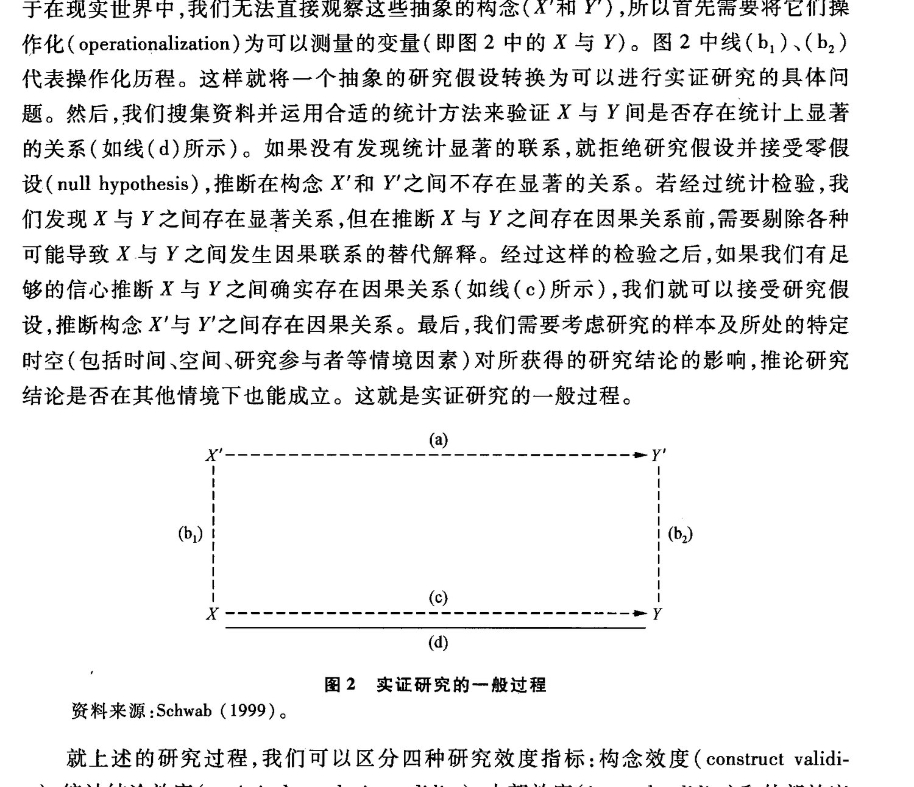
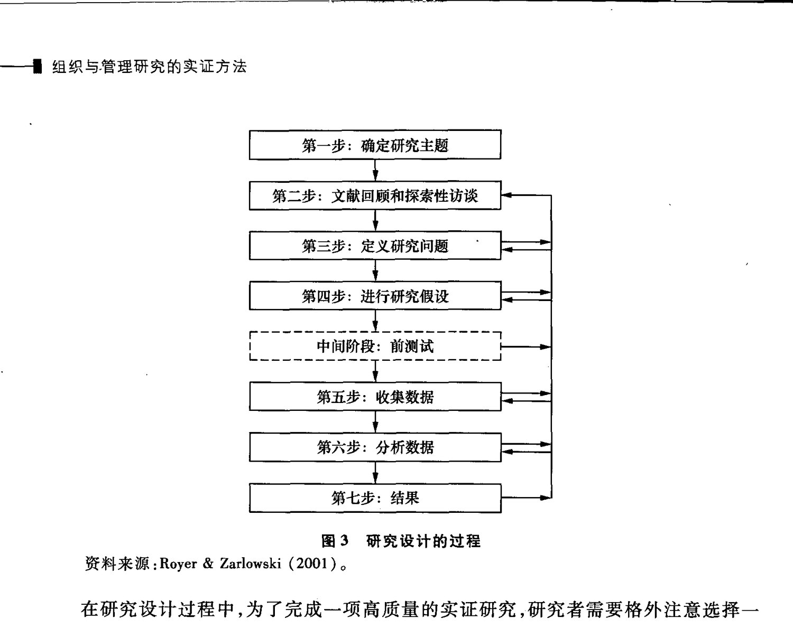
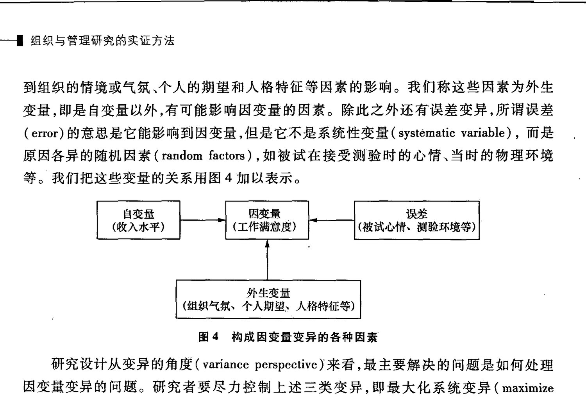

<!-- PDF页 121 -->

## 第二部分 管理学的研究方法

## 第五章 实证研究的设计与评价

五 =第章ma) oa. » *实证研究的设计与评价RD香港科技大学R x上海交通大学香港科技大学本章大纲一、实证研究的本质1.1 社会科学中的实证主义取向1.2 实证研究中的资料收集1.3 ”实证研究的一般过程二、 研究设计在实证研究中所扮演的角色2.1 研究设计的目的与过程2.2 研究类型的选择2.3 研究设计与研究问题2.4 研究设计与资料分析三、 运用效度指标评价研究结论的质量3.1 构念效度3.2 统计结论效度3.3 ”内部效度3.4 ”外部效度四、 实证研究中的变异量控制4.1 研究中的变量变异

<!-- PDF页 122 -->

### 4.2 最大化系统变异

### 4.3 ”控制外生变异

### 4.4 ”最小化误差变异五结语.

引言.

本章主要讨论实证研究中的研究设计。概括来说,研究设计(research design)是对研究项目结构和过程进行的整体安排。研究设计可以作为一项实证研究的起点:通过对现有文献的阅读和总结,研究者可以发现研究中存在的问题和不足,并找出弥补这些缺陷的方法。以此为基础,进而提出研究问题,设计相应的实证研究,得出有价值的结论,从而完成一篇有理论贡献的学术论文。通过研究设计,研究者将一项研究的多个成分有机地结合在一起:包括提出研究问题回顾文献收集数据分析数据。因此,研究设计是研究项目的一个核心环节。

好的研究设计可以将研究涉及的变量纳人一个清晰连贯的体系,以此回答研究者提出的问题(Daft,1983)。严格的研究设计保证了可靠的研究结论。很多文章正是因为研究设计的不当而降低了研究的质量。Daft(1995) 曾经回顾了自己在《美国管理学会学报》(Academy of Management Journal) 《管理科学季刊》) (Administrative Science Quarterly) 担任审稿人期间的经验。他认为在最后被拒绝发表的文章中,大约有20% 是因为研究设计不当。同样,Grunow(1995) 考察了303 篇用英语与德语发表的实证研究,认为只有 19.9% 的文章回答了它们起初提出的研究问题。而其余的文章似乎在提出研究问题后就“迷失”了,它们的缺陷集中体现在研究的各部分之间缺乏有效的连接,研究结论无法有效地回答研究问题。

概括来说,研究设计的核心在于我们完成一项研究时,总体逻辑是否清楚,构成研究项目的各部分之间联系是否清晰(Royer and Zarlowski, 2001)。除此之外,研究设计并没有特定规则可循。不同的研究方法可以为不同的研究问题提供解答。在本书的随后章节中,读者将陆续学习到实验法(experiment,见本书的第六章)、准实验设计(quasiexperiment,见本书的第七章),问卷调查(survey,见本书的第八章)、二手数据分析(second-hand data,见本书的第九章) 和案例研究(case study,见本书的第十章)。这五种研究方法从研究设计的角度并没有优劣之分。对于研究者来说,设计研究时需要做的就是为特定的研究问题选择最恰当的研究方法。本章着重于阐述实证研究的一般过程,讨论研究设计的目的和常用的研究类型,介绍评价实证研究优劣的效度指标,以及分析研究设计时需要控制的因素,而不会探讨具体研究中必须遵循的规则。

<!-- PDF页 123 -->

### 一、实证研究的本质1.1 社会科学中的实证主义取向

自20 世纪 50年代以来,实证主义的思想一直在社会科学中占有举足轻重的地位。实证主义认为现实世界是客观的。由于客观规律和事实的存在,使我们对研究对象可以进行科学的测量,以此来解释、预测变量间的因果关系(Comte, 1988)。根据实证主义的研究范式,科学研究大多是从实验或问卷调查中得到数据,然后在统计分析的基础上得出研究结论。实证主义倡导的研究方法大多是用于检验预先建立的研究假设或命题,如果得到的数据与研究假设的预期一致,就认为假设是可以接受的;一旦发现了与假设判断相反的结果,就有理由拒绝研究假设。所以实证主义思想更多强调的是理论检验(theory testing),而不是发展新理论。在实证研究中出现的定性方法大多是为定量分析提供补充信息。

科学研究的核心问题在于判断变量间的因果关系。实证主义的研究范式提出了判断因果关系的三个前提条件:(1) 假设的因与果必须存在某种联系(contiguity); (2) 它们之间存在时间顺序的差异,因必须先于果而发生(temporal sequence);(3) 它们之间的关系必须是恒定存在的(constant conjunction),在果出现时必须伴随因的存在(Cook and Campbell, 1979)。条件 1 和条件 3 涉及自变量和因变量在现象界的实际联系。为了满足这一条件,我们通过对变量信息的测量和统计分析,可以就两者之间的关系做出表述和推断。条件 2 则强调了判断因果关系方向的基本标准,即自变量的变化必须早于因变量的变化。因此实证主义的观点强调因与果之间的紧密联系,以及果对因的依赖。

但在实际研究中,满足这些条件并不一定保证能得到清晰的因果推论。Popper (1977)进一步修订了实证主义的研究范式,他强调推论变量间的因果关系需要我们消除其他可能的各种蔡代解释(alternative explanation)。换言之,其他无关的、没有加以控制的外生变量(extraneous variables) 可能会影响我们观察到的因变量和自变量间的关系。仅仅通过变量间稳定的相关并不能确认它们之间的因果联系。正是因为推论因果关系的复杂性,对 Popper 而言,假设检验的过程只是一种证伪(falsification) 的过程。我们得到的支持性证据只能证明假设的因果联系并没有被否认。作为对一个复杂社会系统的检验,没有得到否认还远不能称为得到证实(verification)。由于我们无法在一项研究中控制所有潜在的外生变量,所以一个理论假设在实证研究中只能是得到支持(或暂时得到接受),而不能得到证明(proof)。

### 1.2 实证研究中的资料收集在实证研究中,研究者的数据一般有三种来源:首先,研究者将外界可直接观察的Bez | 实证研究的设计与评价 | 109

<!-- PDF页 124 -->

事件作为数据的来源,在不需要任何辅助工具的情况下,将外界信息转化为数字。如Oldham 和 Cummings(1996)把员工效得专利或申请专利的数目作为估计她/他们创造能力的一个测量指标;Greenberg (2002) 用被试在实验中偷钱的数目来测量她/他们遇到不公正待遇时的行为反应;其次,在研究者面对无法直接观察的对象(如员工的态度、动机等)时,和需要借助一定的测量工具,如通过员工填写测验量表实现对员工态度的数字化表达;最后,我们也可将测量工具用于可以观察的行为,如请上司评价部属的工作业绩和行为等。这三种数据的收集方式使客观世界和符号系统在实证研究中实现了——对应。它们的来源可以用图1 的形式加以表示。可观察、7图1 实证研究中数据的来源

资料米源:Baumard and Ibert (2001)。:

需要指出的是,虽然实证主义者强调研究资料是客观的,她/他们的研究致力于对外部世界进行客观的描述,但是实证研究所依据的数据是带有主观色彩的。例如同一部门的两名员工在面临企业工资改革时,或在描述另一名同事的组织公民行为(organizational citizenship behavior,OCB)时,双方的描述可能会有很大的差异。也就是说,就她/他们共同经历的事件,我们可能得到两组不同的数据。造成这个结果的原因大致有两种:双方在工资改革或与男一名同事交往中的经历不一样;双方在将事件“翻译”成我们需要的数据时出现了差异。

影响一个人如何解释外部事件的因素有很多,我们根本无法在一项实证研究中有效襄括所有可能的变量。而我们在社会科学中的研究对象往往又是不可直接观测的,只能通过间接方式收集资料。当我们使用本身带有误差的测量工具去研究一个复杂的社会系统时,这样的实证研究面临着相当大的挑战。

为了在管理学研究中实现对外部世界客观、淮确的描述,我们就需要格外强调我们的研究设计,使我们的研究过程得到很好的控制,对变量间的因果关系得到清晰的结论,最后有效地回答我们的研究问题。在具体讨论研究设计之前,让我们了解一下实证研究的一般过程。

<!-- PDF页 125 -->

1.3 ”实证研究的一般过程基于实证主义思想的影响,科学研究的主要目标在于探讨变量间的因果关系。最简单的实证研究过程可以用图2 的模型表述。在图2 中,线(a)代表两个抽象构念X'和了Y'之间的理论关系。我们需要检验的研究假设是X'和7Y'之间是否存在因果关系。但由于在现实世界中,我们无法直接观察这些抽象的构念(X'和Y'),所以首先需要将它们操作化(operationalization) 为可以测量的变量(即图2 中的了与Y)。图2 中线(b,)、(b,)代表操作化历程。这样就将一个抽象的研究假设转换为可以进行实证研究的具体问题。然后,我们搜集资料并运用合适的统计方法来验证X与了间是否存在统计上显著的关系(如线(d)所示)。如果没有发现统计显著的联系,就拒绝研究假设并接受零假设(null hypothesis),推断在构念X'和了之间不存在显著的关系。若经过统计检验,我们发现了了与Y之间存在显著关系,但在推断X与Y之间存在因果关系前,和需要吻除各种可能导致X与Y之间发生因果联系的替代解释。经过这样的检验之后,如果我们有足够的信心推断与Y之间确实存在因果关系(如线(c)所示),我们就可以接受研究假设,推断构念X'与六之间存在因果关系。最后,我们需要考虑研究的样本及所处的特定时空(包括时间、空间、研究参与者等情境因素)对所获得的研究结论的影响,推论研究结论是否在其他情境下也能成立。这就是实证研究的一般过程。' 2 | | 1 1 | | (by) | | | (c) | ee (d) ‘ 图2 实证研究的一般过程资料来源:Schwab (1999)。就上述的研究过程,我们可以区分四种研究效度指标:构念效度(construct validity),统计结论效度(statistical conclusion validity)、内部效度(internal validity) 和外部效度(external validity) (Cook and Campbell, 1979)。学者主要使用这四种效度指标来评价一项实证研究的质量。构念效度指测量的准确性。它评价的是我们在对构念进行操作化时,变量测量的内容和构念的含义是否一致。在通过各种操作化手段将不能直接观察的构念转换为可数量化估计的变量时,我们对它们的测量不可避免地引信了各种误差。这些误差降低了测量后变量对构念含义的准确反映(图2 中线(b,)、(b,) 就代表了构念与变量之间的对应关系)。如果测量的变量与抽象的构念之间不能准确对应,那么由此得出的结论就SER | 实证研究的设计与评价 | 111

<!-- PDF页 126 -->

会出现偏差,我们将这样的研究评价为构念效度偏低。一项实证研究如果构念效度偏低,即使最后在统计检验时发现了变量间的显著关系,也无法推断构念之间是否存在因果关系。因此,构念效度是评价研究质量的首要指标。有关这一概念及如何验证构念效度请参见本书的第十一章。

统计结论效度是指以统计检验对假设的关系进行解释的可信度,它对应的是图2中的线(d)。统计结论效度评价的对象是实证研究中运用的统计检验手段是否正确。我们针对统计检验而做出的结论,实际是在一定概率基础上做出的,这是冒着一定错误风险的。无论是拒绝原本正确的零假设,或是接受原本错误的零假设,都会影响统计结论的可信程度。如果假设检验时使用的统计方法存在缺陷,这项研究的统计结论效度就会存在问题。影响统计结论效度的常见因素有很多,如样本太小造成统计检测力的缺乏;忽视了统计检验的假设,造成统计方法的错误;测验问卷和实验操作信度的缺乏;被试样本的差异等。对这些因素的详细探讨读者可参见 Cook 和 Campbell(1979)的论述。与后面要解释的内部效度不同,统计结论效度评价的是一项研究中统计方法的运用是否恰当,而与变量间是否真的存在因果关系无关。

对研究质量的第三个评价标准是内部效度。内部效度是指变量间因果关系推论的可信度。与之相对应的是图2 中的线(c)。如果研究者发现因交量Y随着自变量X的变化而变化,并且两者之间存在显著的关系。在由此推断与了变量间存在因果关系前,研究者需要考虑是否吻除了其他各种可能的解释。某些外生变量的存在可能使我们在解释与7变量关系时出现偏差。例如,如果匀与Y同时和第三个变量显著相关,这可能使得原本并无相关的与了变量关系变得显著;或者由于第三个变量与X和Y之间呈现出正负不同的相关关系,而这个无关变量又没有得到有效的控制,与Y之间原本显著的变量关系被捉制,造成研究者没能发现X与了之间的因果关系 RT SB设。本书在第六章至第十章中将分别讨论如何在不同的研究方法中提高研究的内部效度。

最后,外部效度是指将研究结论推广到其他群体、时间和情境时的可信程度。在通常情况下,研究发现往往是基于一个样本,一个时间点得到的。但如果研究者使用的研究样本、测量手段等有较大的局限时,研究发现也许无法在其他的情境中得到重复。例如,我们以大学生样本得到的决策研究结论,可能无法推广到企业的 CE0。这样的研究结论就缺乏一定的外部效度。外部效度指标告诚我们需要清楚研究结论所处的情境界限。当你在样本中找到显著的因果关系的时候,需要自问一下这些结论是否只在这些

人、这梯的环境和时间内有效。假如是,那么你的研究结论就缺少外部效度。

通过上面的分析可以发现,实证研究是一个复杂的推理过程。它需要研究者事先对研究的问题和步骤进行详细的计划,由此得出的研究结论才能够经得起四种效度指标的考验。所以,研究设计对于实证研究的质量具有举足轻重的作用。下一节就研究设计的方法和步骤进行进一步的论述。

<!-- PDF页 127 -->

### 二、研究设计在实证研究中所扮演的角色

### 2.1 研究设计的目的与过程

研究设计是整个研究过程的执行计划。一般而言,研究设计的基本目的有三个: (1) 有效地回答研究问题:在实证研究中,研究问题通常是以研究假设的形式出现的。研究设计的目的就是要通过数量化的分析,为假设中涉及的构念间的关系提供有效的检验。(2) 满足实证研究四种效度指标的要求: 研究设计使研究者可以按照前文提到的四种效度指标合理地安排研究过程,提高研究质量。研究结论的可靠性依赖于它得出的方式和方法。严格的研究设计可以确保测量的变量很好地涵盖构念的内涵,提高构念效度;可以帮助我们选择正确的统计方法,保证统计结论效度;通过事先的设计和准备,可以最大限度地剿除各种蔡代解释对因果结论的影响,提高研究的内部效度;可以通过随机抽样的手段或者选择代表性较高的研究情境来提高研究的外部效度。(3) 控制研究中涉及的变异量:研究设计和需要有效地控制造成因变量发生变化的各种变异量,如系统变异 (systematic variance)、外生变异 (extraneous variance) 和误差变异(error variance)。通过运用不同的研究方法,我们可以恰当地控制可能影响因变量变异的各种因素,提高研究结论的严谨性与可信度。

研究设计是一个研究项目的整体蓝图,包括确定研究主题,通过文献回顾和探索性访谈发展研究假设,确定抽样方法、测量和操作化手段,以及这些因素对统计分析的影响等。研究者在搜集资料前必须认真考虑这些问题,才能有效地回答研究问题,保证研究的质量。Royer 和 Zarlowski(2001)曾经用图3 表述了研究设计的一般过程。

在图3 中,Royer 和 Zarlowski(2001)强调在实证研究中研究设计是一个不断循环、不断重复的动态过程,而不是一成不变的静态过程。在执行研究设计时,不仅可能会因为研究计划变得难以继续,而需要做出调整;而且可能需要随着对研究现象了解的深入.而改变。最近收集的数据同事的评论、刚读到的文献.或者新的收集数据的机会都有可能使研究者的兴趣发生变化,从而改变原来的研究计划。Meyer(1982) 的研究就是这样的一个例子。他起初以旧金山市(San Francisco)的医院为样本,探讨医院的环境、营销策略、组织结构和组织过程之间的关系。但在研究期间,当地的保险公司突然中止了与大约4000 名医生的合同,要求这些医生重新以个人名义与公司签订新合同,而保费则提高为原来的384%,这件事引发了大规模的医生黑工。整个罢工持续了将近一个 1月,为医院的工作带来极大的被动。Meyer 迅速地意识这是一个研究组织适应的绝佳机会,于是他改变了自己的研究计划,重新设计了一个准实验来进行自己的研究,最后完成了一篇出色的博士论文。

| 实证研究的设计与评价 | 113

<!-- PDF页 128 -->

| ep Eerie | [Sy sl |图3 研究设计和的过程

资料来源:Royer & Zarlowski (2001)。

在研究设计过程中,为了完成一项高质量的实证研究,研究者需要格外注意选择一个与研究问题相匹配的研究方法,并选择恰当的资料分析方法。

### 2.2 研究类型的选择

在本书中,我们将要讨论五种主要的研究方法:实验法、准实验设计、问卷调查、二手数据和案例研究。这五种研究方法没有优劣之分,研究者需要按照自己的研究问题进行选择。在实验法中,自变量主要由研究者控制或操纵。在进行实验时,研究者将被试随机分配到代表自变量不同程度的各个实验组和控制组内,并观察这种操纵对因变量变异量的影响。同时,通过控制各种情境因素,研究者得以清晰地观察假设的因果关系,确保研究的内部效度。所以当研究者主要关心变量之间的因果关系,需要噜除各种替代解释对研究结论的影响时,实验法是最好的选择。

但有时由于客观条件和资源的限制,研究者无法将被试随机分配到实验组和控制组中。这时研究者通过选择使用准实验设计,仍可在一定程度上保证研究的效度。 与 -实验法不同,在准实验设计中对被试的分配没有采用随机分配的方法,而是在自然场合下进行。自变量的来源不仅受到研究者的控制,而且也容易受到外部情境变量的影响。研究者对被试与周围情境的接触不易控制。所以相对于实验法,准实验设计的缺点在于不可能用随机分配消除所有的混淆变量和替代解释,内部效度略低,但准实验设计对研究条件的要求较低,可以做到灵活多变,应用的范围比较广,外部效度较高。

研究者经常使用的第三种方法是问卷调查。问卷调查的特点是快速有效、廉价。

<!-- PDF页 129 -->

由于它对被调查者的干扰比较小,所以容易得到企业与员工的支持。同时在使用问卷时,由于无法对被调查者进行随机分配,研究者需要较大规模的样本才能保证自变量的随机变化。为了提高问卷研究的内部效度,我们可以根据研究问题在调查中加入对其他变量的测量,以此来剿除替代解释对自变量和因变量因果关系的影响。

在以上三种研究类型中,研究者和被试/被调查者都会发生直接联系,由她/他们直接向研究者提供资料数据,服务于某个研究问题。但如果研究问题无法通过直接的方式获得数据,我们可以收集和分析二手数据。与准实验设计和问卷调查相同,二手数据不能对研究对象进行随机分配,数据的直接来源不受研究者控制。为了控制各种混淆变量,研究者需要对它们进行测量或编码(coding),以实现对这些变量的控制,提高研究的内部效度。相对于前三种研究方式,二手数据的客观性和可重复性比较高。如果研究对象不是个体而是企业、地区、国家,或者研究项目需要较大规模样本,以及研究问题时间跨度比较长时,可以尝试分析二手资料数据。

最后一种研究类型是案例研究。与二手数据强调的客观性不同,案例研究需要研究者与研究对象进行较为深入的接触。研究过程可能产生的干扰使得我们不太容易获得企业或员工的支持。所以案例研究的样本量普遍较小,而且主要通过方便抽样(convenience sampling)的方式获得。同时由于数据的来源不受研究者的控制,很难就研究结论进行重复验证。由于对研究过程的控制程度较低,案例研究的内部效度不高。但是它可以就所研究的现象提供丰富的描述(thick description)。一般而言,它既可以作为主要数据来源方式,也可以作为其他研究手段的补充。

就像我们在导言部分谈的那样,各种研究类型本身并没有优劣之分。对研究类型的选择取决于研究问题的性质和研究者对结果的预期。在研究设计阶段,很多初学者容易过多地关注研究方法和分析的复杂性,而相对忽视了研究方法对研究问题的实际贡献。有种观点认为研究方法的复杂程度代表了文章的质量高低,这其实是不正确的。过于烦开的研究方法并不能代替对概念本身清楚的界定和说明。研究者应该在分析自己研究问题的基础上,选择最为合适、经济的方法。因此,在选择研究方法时,建议读者思考以下几个问题(Royer and Zarlowski, 2001):

。 这种方法适合回答我的研究问题吗?

。 这种方法可以带来预期的研究结果吗?

。 使用这种方法需要哪些条件?

。 这种方法自身有哪些局限?

。 还有了哪种方法适合现在的研究问题吗?

。 现在选择的方法优于其他方法吗?如果是,为什么?

。 在使用这种方法时,我需要掌握哪些技能?

。 我现在掌握这些技能吗? 如果没有,我可以学到这些技能吗?

。 我是否需要其他的方法来提高对研究现象的观察?

SER | 实证研究的设计与评价 | 115

<!-- PDF页 130 -->

### 2.3 ”研究设计与研究问题

在了解了研究设计的目的和方法之后,我们进一步讨论如何将两者相结合。这对于经验不足的研究者来说,往往是一个棘手的问题。为了保证研究的效度,提高研究的效率和质量,我们需要根据研究问题进行研究设计,选择研究类型。如果无视研究问题的性质而随意选取研究方法,往往会导致研究设计的差错。例如,研究设计中经常需要考虑如何选择验证假设的层次(如个体、团队、公司、行业层次等),我们需要针对研究问题,仔细设计研究方案。如果脱离了研究问题,我们的实证研究可能发生研究层次的错位,影响研究的总体质量。下面我们通过一个实例来了解研究设计和研究问题之间的关系。

对企业来讲,业绩起伏是家常便饭,成功与失败往往交替出现。失败是成功之母,企业可以总结失败的教训,并进行学习,但成功的经历会带给企业什么呢?”Audia, Locke 和 Smith 于 2000年探讨了成功经历所带来的两难境遇。他们认为企业过去的成功会导致对以往战略的坚持,而这种坚持对于公司今后的业绩发展却是把双刃剑:当外部环境稳定时,坚持以往战略有助于发展企业能力,促进组织学习,同时降低运营风险;而当外部环境动荡时,坚持以往战略却会使得企业难以重新进行战略定位,进而延滞企业变革的速度。.

Audia 等人首先回顾了相关的文献,发现对这个问题的研究可以分为两大类:一类研究关注成功经历如何影响企业对于现行战略的坚持;另一类研究则讨论了企业对现行战略的坚持如何影响了未来的业绩水平。为了整合这两类研究,他们提出了假设一:在环境发生突变后,拥有更多成功经历的公司会更加坚持以往的战略,而对以往战略的坚持有可能损害公司的经营业绩。在这一过程中,他们认为企业战略决策者的个人心理过程起到了中介作用。为此,他们提出了假设二:在成功经历影响未来业绩的过程中,六种个人心理过程变量起到了中介作用:(1) 个人对以往成功的满意感;(2) 对现行战略有效性的自信;(3) 个人自我效能感(self-efficacy) 的提高;(4) 个人目标的提升; (5) 信息收集的数量;(6) 信息收集的种类。

由以上的叙述可以发现,这两个假设不仅位于不同的层面,而且基于不同的理论。假设一主要关注企业的成功经历如何影响它们的战略选择和未来的业绩水平,以及外部环境特征的影响。因此实验法或问卷调查等方法难以胜任,而收集特定行业的二手数据能够较好地满足假设验证的要求。因此 Audia 等人通过收集美国航空企业和卡车运输企业的二手数据,研究了它们在 10年间业绩的变动情况。在20 世纪 70年代末,美国政府解除了对这两个行业的行政管制,由此造成了行业竞争格局的突变。通过使用多元回归在两个行业中分别验证假设,发现既往的成功经历均会导致公司更加坚持以往的战略,而这种坚持都导致了未来业绩的下滑。

由于假设二涉及了个人心理过程在成功经历和未来业绩间的中介作用, Audia 等人

<!-- PDF页 131 -->

设计了一个商业游戏来验证这个假设。这是因为心理过程变量必须直接测量,而无法通过收集二手资料的方式获得。同时对于因果关系和中介作用的验证,实验法具有更好的内部效度。为了更好地确定每个中介变量的独特贡献,Audia 等人在实验中还使用了问卷来对这些变量进行测量。在实验中,大学生被斌被要求模拟担任一家手机公司的首席执行官,并针对一些战略问题,在两个阶段共 13 次决策中做出战略选择。在第一阶段,被斌被随机分配到三种(低、中、高)成功情境中,并进行8 次战略决策。每次决”” 策后,被坛都会就企业的经营业绩获得一次反馈。由于研究者为高成功情境中的被斌

提供了详细的信息,这些学生做出的决策质量更好,所以企业业绩会较好;而处于低成功情境下的学生只获得了基本信息,因此她/他们的业绩表现相对较差。在完成前8 次战略选择并接受反馈之后,研究者测量了被试的6 种心理状态。在第二阶段,他们通知所有的被试政府解除了对手机行业的管制,原来一家公司只能在四个地区开展业务,现在它可以同时在五个地区开展业务。这样企业经营的范围和不确定性都增大了。在引入实验操纵后,研究者要求被试继续进行 5 次战略选择,将她/他们在第二阶段中的业绩表现作为因变量。与二手数据分析中得到的结论一样,他们发现既往决策的成功导致了被试在第二阶段的决策中坚持使用同样的战略,而对以往战略的坚持则导致了经车业绩的下渭。同时,他们发现个体心理过程完全中介了既往的成功经历对于战略坚持的作用,其中对以往成功的满意度、自我效能感以及信息收集的类型起到了关键作用。

在 Audia 等人的研究中,他们关心的是公司以往的成功通过企业家的个人心理因素而影响了公司的未来业绩。因此他们将研究的注意力放在了公司和个人层面上。而在实际中,公司战略往往是由高层管理团队集体负责的,而不是由首席执行官单独做出。因此我们可以考虑针对团队层面的分析,来改善充实 Audia 等人的研究设计。通过以上分析,我们可以看出有效的研究设计必须基于相应的研究问题。随着研究问题的不同,我们需要选择不同的研究方法,采用不同的研究设计。2.4 ”研究设计与资料分析

前面我们讨论了研究设计和研究问题之间的关系,本节中我们探讨研究设计对资料收集以及资料分析的影响。在一项研究中,研究问题.研究类型变量测量与统计分析是相辅相成、紧密联结的不同步骤(Pedhazur and Schmelkin,1991)。在研究中,我们首先需要明确具体的研究问题。然后,结合研究问题和理论选择恰当的研究类型。接着选择相应的资料收集方式和分析方法。如果说确定研究问题指明了研究的具体现象,那么针对资料收集和分析方法的设计就回答了从哪里得到数据以及应当如何处理得到的数据的问题。 |

与选择研究类型相似,我们强调资料分析的方法本身并没有优劣之分。资料分析是为回答研究问题而服务的,应该在研究设计的指导下进行。当我们没有理清研究问

| 实证研究的设计与评价 | 117

<!-- PDF页 132 -->

题、变量测量和资料分析之间的关系时,我们得出的结论只能反映变量在测量和分析层面的关系,而不能有效地回答我们的理论问题(Klein, Dansereau and Hall, 1994)。对于资料分析方法的选择,应该符合研究理论和设计的要求。例如,在讨论工作满意度对绩效的影响时,如果我们希望了解员工满意度与员工绩效之间的关系,那么测量和分析应该以个体为单位;而如果研究的问题是部门士气对于部门业绩的影响,我们的分析就应

: 该在部门层面。员工土气的测量可以在个体层面,但在资料分析时,这些个体资料必须整合到部门的层面,统计分析必须以部门为单元。如果研究课题是部门士气对于员工业绩的影响,因为部门土气是部门层面的变量,而员工业绩是个人层面的变量,这时我们就应该进行跨层面研究与分析(见本书的第十五章)。在前面提到的 Audia 等人的例子中,我们也可以看到当研究的问题涉及组织战略层面时,其数据来源于二手资料,分析的单元是企业;而当研究的问题涉及中介的心理变量时,其数据来源于实验设计,分析的单元是个人。

以上我们分别探讨了实证研究中研究设计、研究问题、研究类型和资料分析之间的关系。我们强调研究设计的好坏影响了研究中各个环节的质量,但这种顺序并不是一成不变的。随着研究的进行,我们可能意识到原先研究设计的不足,或者发现新的研究问题。所以研究设计过程是动态的,而不是静态的。Daft(1983)就指出研究本身更多地与研究者的技能和经验有关,而不只是专业知识。同时,技能和经验更多地是通过学习过程而获得的,与研究者多年的经验积累密不可分。所以,研究设计本身就是一个学习过程,研究者需要从这一过程中认识自己的不足,不断对研究设计做出调整和改进。

### 三、运用效度指标评价研究结论的质量

前面我们对实证研究中研究设计的目的、作用和过程进行了介绍。那么我们如何一去评价研究设计是否有效地进行了控制,判断它能否回答研究问题呢? 又有哪些手段可以提高研究的质量呢?在管理学研究中,我们通过四种效度指标来实现对研究质量的评价,即我们前面已经介绍的构念效度、统计结论效度、内部效度和外部效度。能否提高研究效度,保证研究结论的可靠性,是我们评价一项研究是否有效以及它得到的结论是否正确的关键因素。下面我们针对每一种效度指标,提供一些提高研究效度的建议。

### 3.1 WORE

在研究设计中,研究者的目的是尽量减少测量时的误差,提高变量与构念之间的对应程度。为此,研究者可以从两个方面提高构念效度。第一,从分析抽象构念的角度,研究者需要精确定义构念的含义并明确它的理论结构。由于构念来源于抽象理论,在现实世界中并不能直接观察,所以对它的观察和测量必须依赖于精确的定义说明。如

<!-- PDF页 133 -->

果缺少精确的定义,即使研究者在测量过程中避免了各种误差,得出的数据和分析出来的结论也无法回答研究的问题。

第二,从交量测量的角度,研究者需要选择合适的测量方式,控制测量误差。比如在管理文献中,我们常常会发现一个构仿有许多种测验量表。到底用哪一种量表来测量,就是一个经常困扰研究者的问题。例如,对于组织公民行为的测量,既有在西方情境下发展出来的文化普遍性(etic)量表,也有专门结合中国国情发展的文化特殊性(emic)量表。在测量时应该如何选择呢? 我们的答案是,结合研究问题选择最能符合研究要求的测量方式。当研究者关心的问题与中国特殊的文化情景有关时,采用具有文化特殊性的量表就能提供更多详细的信息(如 Farh, Hackett and Liang, 2007)。如果研究者关心的是一种普遍现象,只是运用来自中国的样本进行检验,那么具有文化普遍性的量表就应该是首选(如Wang, Law, Hackett, Wang and Chen, 2005)。所以,在进行研究前,通过研究设计联系研究问题和资料收集,可以提高研究的构念效度。3.2 统计结论效度 |

在实证研究中,由于统计检验的本质是通过抽样的方式来对变量间的关系做出泛化的推论,所以任何研究结论都面临着统计结论效度的问题。一般而言,我们在做出统计决策时存在着四种可能性:接受正确的零假设、拒绝错误的零假设、拒绝正确的零假设和接受错误的零假设。前两种情况属于正确的结论,但后两种情况属于研究者做出的错误决策,影响到研究的统计绪论效度。在统计学中,我们把第三种情况称为一类错误(Type I error),即在两个变量间并没有联系的时候,我们根据自己的统计结果却拒绝了零假设,得出它们之间存在显著性的关系。第四种情况称为二类错误(Type Il error),即在两个变量间存在显著性关系的时候,我们却接受了零假设,认为它们之间并不相关。

; 在研究设计时,我们可以通过降低这两类错误来提高研究的统计结论效度。研究者可以通过选择正确的统计检验手段、更加严格的检验标准和取样随机化等方法来降低一类错误。针对二类错误,研究者可以选择以下手段提高研究的统计结论效度:(1)增大样本量;(2) 减少因变量中与自变量无关的总体变异,例如通过控制外生变量、抽取同质性比较高的样本和选用高可信的测量工具等方法; (3) 根据理论检测方向性的研究假设(directional hypothesis) 等。

3.3 ”内部效度.实证研究中影响内部效度的主要因素来自于除自变量之外的各种混清变量。它们的存在影响了变量间因果关系的强弱程度。Cook 和 Campbell (1979) 总结了七种在准实验研究中存在的混淆变量:(1) 过去事件的影响:所有发生在研究期间的事件,都可能对研究个体产生影响并且导致结果的变化;(2) 成熟效果(maturation):受测者本身随BER | 实证研究的设计与评价, | 119

<!-- PDF页 134 -->

着时间的流逝而发生身心变化,而非因为某些特别事件的发生; (3) 测验效果:测验过程本身可能会改变所要测量的现象;(4) 统计回归(statistical regression):若接受实验者为极端分散的群体,实验的后测结果就会有趋向其长期平均数的情况; (5) 自我选择效AR (self-selection):由于研究未采用随机抽样和随机分派,造成被选择的人在能力或特质方面存在差异或不相等;(6) 被调查对象的退出或流失(mortality); (7) 研究样本所提供的信息可能会存在偏误。

在研究设计时,研究者应该考虑如何通过各种手段吻除混淆变量和替代解释对变量间因果关系的影响。这主要可以从两方面进行:一方面可以从理论出发,在以往文献中搜寻有哪些变量可能成为假设检验中的混淆变量,在测量自变量和因变量时同时加以测量,并在统计检验时进行控制;另一方面可以从研究类型上加以控制。例如相对于其他各种研究类型,实验法对于混淆变量和替代解释的控制程度最强。如果研究者认为自己的研究假设非常容易受到其他混淆变量的影响,就可以通过实验或者进行随机化处理的方法提高研究的内部效度。3.4 ”外部效度

由于外部效度考虑的是研究结论在其他情景中的可重复程度,所以它对于应用性的实证研究而言是一个非常重要的评价指标。在研究中,影响外部效度的因素主要包括:(1) 对实验操纵的反应:由于前测使受测者对敏感的主题造成反应,以至于她/他们通过各种不同的方式来响应实验刺激。通常在态度研究中,这种事前测量的效果特别显著。(2) 受测者的挑选:如果我们选择的被试群体没有代表性,而自身又具有某些特殊性,这时我们基于她/他们得出的结论也无法推广到其他样本中。(3) 其他互动因HE:实验环境本身可能造成某种偏差,在特殊实验环境中得到的结果无法推论到整个目标群体。例如,如果参与实验的人预先知道了研究的目的,她/他们很有可能以一种角:色扮演的心态完成实验任务,这时基于这些回答/表现得出的结论也就缺少外部效度。

在实证研究中,研究者可以选取具有较高代表性的样本来提高研究的外部效度。样本对于总体的代表性是外部效度的主要影响因素之一。当样本可以较好地代表总体时,从样本得到的结论就更容易在总体内得到重复。而如果研究目的还包括在不同总体间证实研究假设,那就可以通过在多个总体内分别抽样,来检定研究结论的外部效度。

不过,外部效度的不足对于研究结论和理论发展并不一定总是坏事,有时也许是新

- 的研究的开始。越来越多的管理学研究已经开始注意到情境因素(如人、环境、时间)对研究结论的影响。这些情境因素要么是自变量的先行因素,要么是可能改变自变量和因变量关系的调节变量(详见本书第十二章)。如能将这些情境因素与理论思考相结合,不时会产生非常有趣的研究。例如 Farh, Earley 和 Lin (1997)研究了组织公民行为和组织公正的关系。他们发现,在台湾,组织公民行为的维度不同于在西方情境下的研

<!-- PDF页 135 -->

究结论。因此,在国家层面上,不同的文化情境成为组织公民行为的先行变量。他们还发现,对于个人传统性(traditionality)较低的人来说,组织公民行为与分配公正和过程公正的相关性强; 对于个人传统性较高的人来说,组织公民行为与分配公正和过程公正的相关性弱。因此,个人传统性成为组织公民行为和组织公正之间的调节变量。

在这一节,我们主要讨论了评价实证研究的设计质量所依据的四种效度指标,它们分别是构念效度、统计结论效度、内部效度和外部效度。需要指出的是,在任何一项研究设计中,研究者往往无法同时兼顾上述的四种效度。研究者需要根据研究理论决定具体使用的研究方法。由于每一种方法都具有各自不同的优缺点,而实证研究往往要受到客观条件、当时情境和被试心理状态等因素的限制,所以在一个研究中同时满足四种效度指标的要求是不可能的。

解决这个问题的一种方式是进行多项研究。例如在 Audia 等人的研究中,他们首先使用二手数据来验证研究假设。这种方法具有和较高的外部效度和较低的内部效度。因此,他们接着在个人层面进行了一个实验,来明确起到中介作用的心理过程变量。这项实验研究就具有较高的内部效度和较低的外部效度。将两者相结合,他们的研究结论满足了这两种效度的要求。同时由于对构念的清楚定义、准确测量和恰当的分析,他们的研究结论又具有较高的构念效度和统计结论效度。

此外,研究者能够做的就是综合考虑自己的研究假设,通过研究设计,合理控制研究方法中的各种变异量。除为研究问题提供解释和满足一定的效度指标之外,研究设计可以进一步提高结果和钦辑的清晰程度,使得研究结论更容易得到重复。下面,我们讨论如何通过研究设计控制研究中的各种变异量。

### 四、实证研究中的变异量控制

在研究设计阶段,我们需要制订自己的研究计划,选择研究方法和数据收集的方式,并且确定统计处理的方法。除此之外,我们还需要精心设计研究过程,这主要是通过对造成因变量变异的三种来源进行控制而实现的。这三种变异量包括:系统变异、外生变异和误差变异(Kerlinger and Lee, 2000)。下面让我们首先来了解一下这三种变异量的关系。4.1 研究中的变量变异

我们经常可以观察到在同一家企业里,员工的满意度会有很大的差异;在同一个行业里,公司经营业绩也会非常不同。这些个体/企业之间差异就是我们在研究中需要解释的变异量。研究设计的目的在于寻求合适的自变量,实现对因变量变异的解释,如我们可以用个人的收入水平来解释员工满意度的差异。但在实际情况中,因变量的变化不仅仅会受到自变量的影响,还同时受到其他很多因素的影响。如满意度可能同时受

| 实证研究的设计与评价 | 121

<!-- PDF页 136 -->

到组织的情境或气氛、个人的期望和人格特征等因素的影响。我们称这些因素为外生变量,即是自变量以外,有可能影响因变量的因素。除此之外还有误差变异,所谓误差(error) 的意思是它能影响到因变量,但是它不是系统性变量(systematic variable), 而是原因各异的随机因素(random factors),如被试在接受测验时的心情、当时的物理环境等。我们把这些变量的关系用图4 加以表示。. (收入水平) (工作满意度) (被试心情、测验环境等) (组织气氛、个人人期望、和信格特征等)图4 构成因变量变异的各种因素

研究设计从变异的角度(variance perspective)来看,最主要解决的问题是如何处理因变量变异的问题。研究者要尽力控制上述三类变异,即最大化系统变异 (maximize systematic variance),控制外生变异(control extraneous variance)、最小化误差变异(minimize error variance)。'此三种变异在研究设计上有很重要的含义,不同类型的变异也要有不同的处理方法。

### 4.2 最大化系统变异

系统变异是指因变量的变异中受到自变量影响的部分。在研究设计时,我们希望发现自变量对因变量的显著性影响,所以研究者需要将自变量对因变量的影响最大化。最大化系统变异可以使我们把自变量的效应从因变量的总变异中区分出来,因此可以支持假设中构念之间的关系。系统变异在因变量的变异中占的比重越大,说明研究中自变量的影响越明显,我们也就更有机会发现支持我们假设的证据。

最大化系统变异可以通过样本选择或者对自变量的精准测量来实现,每一种方法都致力于让自变量对因变量有最大的效应。例如,在研究收入水平与工作满意度的关系时,如在选择的样本当中,大多数人都是对工作满意,或者更糟糕的情况是,她/他们的薪水都相似,那么研究者得到支持性证据的可能性将非常低。

由于变量性质的不同,在研究设计中的控制操纵方法也是不同的。我们可以把管理学中的变量分成两类:可变变量(active variable) 和属性变量(attribute variable)。前者是指在设计中可以被操纵的、可以变化的变量。对这类变量我们可以通过实验法对其加以控制,实施具有影响力的操纵,使得实验组与控制组的情景非常不同。这样我们才有可能观察到由于对自变量的操纵而引起的被试反应。例如在 Staw(1975) 的研究中,研究者告诉高绩效组的被试说她/他们的绩效表现非常好,属于最优良的 20%;而告诉低绩效组的人说她/他们做得不好,属于最差的20%。这就是一个运用有效操纵来提高

<!-- PDF页 137 -->

系统变异的例子。

但在许多研究中,研究者感兴趣的变量不是可变的,或是非常难以操纵的。我们把这类变量称为属性变量。我们对这类变量的控制需要通过对样本的选择来实现。例如Farh, Hackett 和 Liang (2007) 2% T 42) HE (power distance) 和个人传统性对中国员工的影响。他们从社会交换(social exchange)理论出发,提出这两种文化价值观可能调节了中国员工在知觉组织支持后的反应:高权力距离和传统性的员工更多地受到自己的角色限制,她/他们的工作态度和行为较少地受到组织支持的影响;而低权力距离和低传统性的员工则更多地看重双方在交换中的对等性,她/他们对企业的态度和行为更多受到组织支持的影响。为了验证这一假设,他们在样本选择阶段尽可能地扩大了可能影响结果的系统变异,选择 27 家性质不同的公司员工来收集数据,而不是在一家公司或利用 MBA 学生来完成问卷。通过这种方式,他们实现了对关键变量的控制:知觉到的组织支持(perceived organizational support, POS)、权力距离和个人传统性。

同样的道理,如果我们研究的是人力资源政策对于员工行为的影响,则全部的样本不能来自同一家公司/集团。这是因为同一家公司的人力资源政策基本上都是一致的,不同的部门间可能存在细微的差异,如销售员和工程师,低阶层和高阶层的人。但来自同一家公司应有很多的同质性(homogeneity),基本的情境是相同的。这时人力资源政策这个变量的变异显然不够大。研究者需要经过对样本的选择,选取不同的公司组织(例如选不同公司的研发部门)作为研究的样本,以此提高研究的系统变异。4.3 ”控制外生变异

外生变异会系统地影响我们感兴趣的因变量,但却与我们的研究目的无关。换言之,这类变量在其他的研究中可能是很好的自变量,但在我们的研究中却不属于关注的焦点,所以我们需要对这类可能对因变量造成影响的外生变量实现有效的控制,将其效应最小化、抵消,或者与我们的自变量进行隔离。通过这些控制手段,我们就能够排除无关变量对因变量的影响,清晰地判断并解释自变量对因变量的影响。如果不能实现对外生变蜡的有效控制,在发现有显著性的关系后,我们无法判断这一关系究竟是因为自变量对因变量的影响,还是未加控制的外生变异的影响。例如,在研究创新战略对公司经营业绩的影响时,我们必须控制公司的规模和行业特征。 虽然这两个因素都不是研究的关注点,但它们会影响公司的获利能力。只有控制了这些变量, 我们才可以有信心地得出这样的结论,即公司利润的变动是创新的结果而不是规模(大公司倾向于利润更高)或行业(一些行业比其他行业利润更高)的影响。能否对外生变量实现有效的控制,是判断一名研究者的设计能力、对相关文献了解程度的一个很好的评价指标。

在研究设计中,我们可以通过抽样的方式(如随机化、匹配参与者等)或者统计控制(statistical control) 的方式,实现对外生变量的控制。通常的控制方式有三种:

第一,排除法(elimination)。不同于选择差异化的自变量,研究者可以通过选择同

Bre | 实证研究的设计与评价 | 123

<!-- PDF页 138 -->

质性的外生变量,来排除它们对因变量的影响。例如我们希望了解收入水平对个人满意度的影响,同时人性别也有可能对满意度水平有影响,这时在取样时我们就可以单独选择男性或女性。在这种同质的样本,我们就可以排除外生变量的影响。

第二,随机分配法(random assignment)。如果我们能够随机分配被试到不同的实验组与控制组中,就能使外生变量的效应相互抵消,对其进行有效的控制。如 Staw(1975)的研究即是将 60 位学生随机分派到实验组及控制组,以此控制了外生变异,这时得到的研究结果就不能用外生变量作为对因交量差异的解释。

第三,配对法(matching)。这种方法是指将外生变蜡进行配对处理,创造相对等的研究条件,从而控制外生变量。例如,如果需要考察一项组织变革的成效,我们可以选择另一家没有变革的企业作为控制组。虽然研究者不能随机分派哪家企业进行变革或哪家不变革,但研究者可选择一家与变革企业相当类似的企业(如科技的性质、制度、工厂设立时间长短等)作为控制比较对象,如此的配对即可看出变革操纵后产生的实际效果。

上面的方法都属于通过操纵样本的方式实现对外生变异的控制。但在管理学研究中,研究者不一定有条件对研究对象进行操纵。这时我们可以选择其他两种控制方式: (1) 纳入法。即我们可以将外生变量纳入研究设计,并将其效应与自变量的效应加以区分。例如我们如果认为个体能力是影响绩效的一个因素,而不是只有工作满意度一个变量,我们就可以将两者一并测量。在实验法中,我们则可以将两者作为设计中的分析要素,形成2 x2 多因子实验设计。通过分析它们的主效应和交互效应,来区分这两种因素对员工绩效的影响。(2) 统计控制。纳入法改变了原有的设计思路,使得原有的设计变得复杂,研究者还可以通过统计控制的方式实现对外生变量的控制。我们可以将这些无关变量与自变量一起进行测量,在统计分析时首先排除它们的效应。统计控制的思路简单,操作方便,但如果外生变量与自变量的相关过高,我们可能由于在排除外生变量效应的同时,低估对自变量效应的估计。

### 4.4 ”最小化误差变异

误差变异是指由于随机因素而导致的因变量变异。这是属于随机性质的,而不像外生变异那样造成系统性的偏误。最典型的随机变异是测量误差(如暂时的不注意、短暂的情绪波动等),或研究者控制不了的未知因素。我们将误差最小化,其目的就是尽可能地使系统变异显示出来。通常误差变异和外生变量对因变量变异的影响是无法区分的,这两部分之和就是我们在统计分析时所说的剩余部分(residual),即我们感兴趣的自变量无法解释的部分。在进行F 检验时,我们将因变量的总变异分成两部分:一部分是由自变量造成的组间差异(between group variance);另一部分是就是外生变量和误差造成的剩余部分。如果我们能够尽量减少测量的误差,就可以使测量更精确,提高我们统计分析的FF值,从而增加我们得到显著性结果的可能性。最小化误差变异可以通过

<!-- PDF页 139 -->

控制数据收集过程,以及增强测量指标的信度而控制误差变异对研究结果的影响。

由于误差变异是由随机因素造成的差异,所以它的处理方法也表现为减少个体差异和测量误差两方面。首先,减少被试的个体差异(individual differences)。在保证最大化自变量的同时,尽量减少个体差异对因变量的影响。人与人之间的差距越小,由于个体差异带来的误差变异也越小。其次,减少测量误差(errors of measurement)。减少测量误差一方面需要我们提高测量的精确程度,提高测量的信度(reliability) (我们在第十

” 一章会专门讨论测量的信度),另一方面需要我们有效地控制测量情境。情境控制可以

使测量更精确。如在实验时尽量减少实验者的不同,例如性别的不同、讲话语气的不一样等。用放录音带的方式,使指导语的速度和声音尽量标准化。在问卷调查时,尽量保证室内环境、问卷填答的时间等因素保持一致。

从上面的讨论可以发现,在研究设计时,对变量的控制是非常重要的。为了实现对因变量的预测,我们需要尽可能地提高自变量的变异,控制与因变量变异有关的外生交量和随机误差。外生变量和随机误差的存在会增加自变量无法解释的因变量变异(即变异剩余量),从而降低我们在检验自变量效应时的统计检验功效 (statistical power)。

在这一节我们讨论了通过研究设计对研究中的三种变异量进行控制的问题。对于一个研究中因变量的变异来说,其中只有一部分对我们是有帮助的,也就是系统变异量。因此,我们运用研究设计对变异量进行分割(partition)的目的就是帮助我们在实证研究中最大可能地确定变量间的因果关系。具体来说,就是系统变异量可以实现最大化;外生变异可以得到有效控制;同时,误差变异能够被控制到最小程度。

### 五、.结语

作为社会科学的一个分支,我们在管理学研究中面临着很多方法论上的挑战:研究方法的局限使我们无法对变量间因果关系做出清晰的界定、对研究的变量无法进行直接的测量、人类组织活动自身的复杂性等。同时,管理学自身的特性也要求研究者必须深入企业、接近企业员工去得到研究必需的资料。而这又往往超越了研究者自身的能力和角色。我们需要用不太精确的工具去理清一个复杂系统中各种关系,但我们又不能随意地收集自己需要的信息,这就是我们在管理学研究面临的实际困难。这些局限和困难都加重了研究设计在整个研究项目的重要程度。为了保证我们研究的问题得到满意的回答,无论如何强调研究设计的重要性都是不过分的。

### 参考文献

Baumard, P. and Ibert, J. (2001). What approach with which data? In R. A. Thi-

etart, Doing Management Research; A Comprehensive Guide; 69—84. London; Sage Publica- | 实证研究的设计和与评价 | 125

<!-- PDF页 140 -->

tions.

Comte, A. (1988). Introduction to Positive Philosophy. Paris: Carillian-Goeury and Dalmont.

Cook T. D. and Campbell D. (1979). Quasi-experimentation: Design and Analysis Issues for Field Settings. Boston; Houghton Mifflin Company.

Daft, R. L. (1983). Learning the craft of organizational research. Academy of Management Review, 8, 539—546.

Daft, R. L. (1995). Why I recommended that your manuscript be rejected and what you can do about it? In L. L. Cummings and P. J. Frost (eds.), Publishing in the Organizational Sciences, 2nd edition; 164—182. Thousand Oaks, CA: Sage.

Farh, J. L., Hackett, R..D. and Liang, J. (2007). Individual-level cultural values as moderators of perceived organizational support-employee outcomes relationships in China;

, Comparing the effects of power distance and traditionality. Academy of Management Journal, 50, 715—729.、

Greenberg, J. (2002). Who stole the money, and when? Individual and situational determinants of employee theft. Organizational Behavior and Human Decision Processes, 89, 985—1003.

Grunow, D. (1995). The research design in organization studies. Organization Science, 6, 93—103.

Kerlinger, F. N. and Lee, H. B. (2000). Foundations of Behavioral Research. Fort Worth, TX: Harcourt College Publishers.

Klein, K. J., Dansereau, F. and Hall, R. J. (1999). Levels issues in theory development, data collection, and analysis. Academy of Management Review, 19, 195—229.

Meyer, A. D. (1982). Adapting to environmental jolts. Administrative Science Quarterly, 27, 515—537.

Oldham, 'G. R. and Cummings, A. (1996). Employee creativity; Personal and contextual factors at work. Academy of Management Journal, 39, 607—634.

Pedhazur, E.J. and Schmelkin, L. P. (1991). Measurement, Design, and Analysis; An Integrated Approach. Hillsdale, NJ; Lawrence Erlbaum.

Schwab, D. P. (1999). Research Methods for Organizational Studies. Mahwah, NJ:

Lawrence Erlbaum Associates.: Staw, B.M. (1975). Attribution of the causes of performance: A new alternative interpretation of cross-sectional research on organizations. Organizational Behavior and Human Performance, 13, 414—432.

Royer, I. and Zarlowski, P. (2001). Research design. In R. A. Thietart, Doing Man-

<!-- PDF页 141 -->

agement Research: A Comprehensive Guide; 111—131. London; Sage Publications.. Wang, H., Law, K.S., Hackett, R.D., Wang, D. and Chen, Z. X. (2005).-Lead-: er-member exchange as a mediator of the relationship between transformational leadership and followers’ performance and organizational citizenship behavior. Academy of Management Journal, 48, 420—432. #22 | 实证研究的设计与评价 | 127

