
<!-- PDF页 304 -->

## 第十三章 因果关系理论的建立——结构方程模型

二早» EE因果关系理论的建立——结构=| |方程模型Khe 王畅香港中文大学本章大纲一、 什么是结构方程模型二、 结构方程模型的优点=. 测量基本概念. PO. 测量误差五、 量表的效度和信度六、量表的尺度七、 结构方程模型理论和你辑八、 结构模型的基本类型8.1 测量模型8.2 路径模型8.3 ”全模型8.4 ”均值结构模型九、LISREL 程序撰写+. 拟合指数(Fit Index)十一、 结构方程模型发展的新趋势一、什么是结构方程模型从统计学的角度来讲,所谓模型,是以系统方式来描述观察变量 (observed varia-

<!-- PDF页 305 -->

bles) 和潜变量(latent variables) 间的关系。而今天我们要向大家介绍的结构方程模型(structural equation modeling, SEM) 是用来检定关于观察变量和潜变量之间假设关系的., 一种多重变量统计分析方法,即以所收集的数据来检定基于理论所建立的假设模型。

所以,SEM 是一种理论模型检定的统计方法。

一般的理论研究中会涉及许多变量,而我们熟悉的回归方程也只能一次解释一个A 28 (dependent variable) 和几个自变量(independent variable)之间的关系。这时,包合了一连串回归方程的结构方程却恰恰可以同时分析出多个因变量与自变量自身及其之间的复杂关系。传统的统认六法需要多次处理的这些变量之间的关系,结构方程可以做到同时同步分析,这样,研究的准确性必会大大提高。

### 二、结构方程模型的优点

简单来说,结构方程具有以下优点:

(一) 在以往管理、社会.教育、心理学的研究中发现许多变量都是不可直接测量的,一般称为构念(constrict)。例如人的态度、认知、心理构念等,我们称这些变量为潜变量。一般的做法是以观察变量来间接量度潜变量,如用数条问卷题目(item)管案的平均值作为潜变量的数值。传统的方法不能准确处理这些变量,而结构方程则可同时分析潜变量及其观察变量之间的复杂关系。

(=) 结构方程可以和噜除随机测量误差。一般而言,从问卷题目得来的观察变量都是由真实值和测量误差所组成的,这时结构方程可以帮助我们准确估计出测量误差的大小和其他参数值,从而大大提高整体测量的准确度。

(三) 结构方程可同时计算多个因变量之间的关系。特别是应用于中介效应的研究,如在组织理论中,变量 4不是直接影响到变量 8,而是通过变量 C 作为中介而影响的。这时,结构方程便会给予这些问题以最综合恰当的分析。

### 三、 测量基本概念

如前文所述,我们称那些在研究中抽象的.不可直接观察测量的变量为潜变量,如人的性格。潜变量是要通过一系列的观察变量(observed variables)来间接体现的,如人的行为等。概括来说,结构方程一方面在描述观察变量是如何测量潜交量,另一方面也是在表达各个潜变量之间的关系。

进一步解释构念的概念,其实是当我们与人沟通时所表达的一个抽象的概念,如对一家餐厅的满意程度。它是由许多具体的易于观察的变量所构成的,如餐厅的食物质量、价格水平.服务质量、环境因素等。而通常是基于方便沟通的考虑,才选取构念来代表所有观察变量。当然,随着时间和环境的改变,代表一个构念的各个观察变量也会发

Stee | 因果关系理论均建立——结构方程模型 | 291

<!-- PDF页 306 -->

生变化。那么,这时我们就要考虑到这个潜变量要用什么新的观察变量来测量的问题。;因此,这里涉及了两个方向的问题,一是不同的观察变量代表了何种构念,二是一个构念又是由哪些观察变量所构成的。四、测量误差

古典真实分数模型(classical true score model) 是由真实分数及误差分数的观点来解释信度,即个人的观察分数(observed scores)是以真实分数与误差分数两部分的和组成的。他们之间的关系可以表示为以下的公式:

X=T+E其中,X 是观察分数,7 是真实分数,E 是误差分数。

实际上,只有在理想和完美的测验条件下才能获得的真实分数代表了测量中误差不变的部分,可是,这种情况很少存在。因此,我们说,任何一个测验的观察分数都包含了部分的误差成分。这个误差是由系统误差(systematic error) 和随机误差 (random error) 两部分组成的。但其中的系统误差只有在一些特定的研究设计中才可以被检测出来。因此,一般来讲,我们假定系统误差的值等于零,但其实它会被包含在真实分数中体现出来。

其中,随机误差的特性有以下三点:

1. 由于误差完全是随机的,所以一个总体的误差分数的平均值应该是零。

2. 一个总体的真实分数和误差分数之间的相关性为零。

3. 任何两项随机误差之间的相关性为零。

我们在结构方程中依旧保持对以上第一点和第二点的假设,而对第三点的假设则不需要一定有所支持。那么,在何种情况下第三点假设不适合存在呢?一般来讲,当相同试题在同一结构方程中出现的次数大于一次,那误差之间便可能存在相关性。简单归纳,有以下情况:

1. 同一试题语句对不同受访者引起的误差。即不同受访者使用相同试题在对同一测量对象测量时,由于对试题语句产生的误差会使其结果误差之间产生相关性。例如,在进行 360 度的绩效评估中,不同人会利用相同的测量工具,即同一份问卷对指定的对象进行工作表现评估。这时,我们便会假设来自不同受访者,如调查对象本人及其上司的评价结果误差之间是有一定相关性联系的。而这恰恰是结构方程可以测定而一般的回归方程不能测定的。

2. 同一试题在不同时间对同一受访者引起的误差。这时除了有语句引起的误差之外,还包括了同一受访者对这一误差随着时间的不断重复。所以,相同试题在不同时间对同一个测量对象产生的误差之间会产生相关性,如应用于纵向时间序列研究(longitudinal time series study),这正是传统的方法不能很好处理的情况之一,而结构方程却可

<!-- PDF页 307 -->

大大派上用场。就像前面所谈到的一样,我们不可在任何情况下都抱有对随机误差之间的相关性为零的假设,但是同时也应时刻注意以下两点的影响:第一,误差之间的相关性不可随意添加,一定要有强有力的理论支持作为前提;第二,基于理论支持,如果误差之间真正存在相关性,而我们却恰恰忽略了此相关性的存在,这时,我们的测量结果会对其他参数的估计产生很大的影响。接下来,简单介绍一下有两个变量(bi-variate)时,随机误差对估计各参数之间相关性的影响。他们之间的关系可以表示为以下的公式: Ty Ty Maly:其中,rs是与观察分数的相关系数;r;,是X与了真实分数的相关系数; EX ROE度; 7,,是Y的信度;1 -7是的测量误差;1 -7,,是了的测量误差。其中,由于7和7,,的最大值取1,所以我们可以得到 7,, <的结论。即,如果已知ry, =0.8,且7和,分别取0.8,按此公式计算可得 7, =0. 64,那么在多个变量(multi-variate) 的情况下又是怎样呢?当自变量的个数多过一个时,测量误差对参数之间相关性的影响是不可预测的,既有可能使其变大,同时,也有可能变小。五、量表的效度和信度通常,我们从效度(validity) 和信度(reliability) 两方面来评价一个量表(measurement scale)的质量高低。在统计学中,效度经常被定义为测量的正确性,或者是指量表是否能够测量到其所要测量之潜在概念。 因此,效度系数越高,表示越能够测量到想要测量的概念。一般,量表的效度包括:表面效度(face validity),效标关联效度 (criterion-related validity)、内容效度(content validity) LA 3 #4 23K EE (construct validity) 等。结构方程可帮助分别检验测量构念效度和效标关联效度的高低。首先,我们来谈谈构念效度。构念效度是由聚合效度(convergent validity) 和区分效BE (discriminant validity) 所组成。其中,聚合效度是指不同的观察变量是否可用来测量同一潜变量,而区分效度是指不同的潜变量是否存在显著差异。当我们以问卷题目或: 其他观察变量测量潜变量的时候,观察变量和洪变量之间的关系是有一定假设的,即假设了以哪些观察变量来测量潜变量。 我们可以验证性因子分析(confirmatory factor analysis,CFA)来判断观察变量与潜变量之间的假设关系是否与数据吻合。 若结果证明我们的假设是正确的,那么,其聚合效度也得到了相应的证明。 至于区分效度,我们通过检测各个潜变量之间的相关系数是否显著低于 1 来判断。那么,何为效标关联效度? 效标关联效度是指多个潜变量之间的关系。如假定某一个潜变量会对另一个潜变量有正作用(positive effect),那么,我们可以路径模型(path StEe | 因果关系理论的建立——结构方程模型 | 293

<!-- PDF页 308 -->

model) 的方式来检测效标关联效度。

以上是对效度的讲解,下面我们再来介绍一下量表的信度。在结构方程中,信度是在估计测量误差的大小,它是以误差的方差(variance)的大小来量度的。即当误差越大时,信度也就越小。具体到结构方程而言,我们可利用测量误差的大小来估计其信度的大小。

### 六、量表的尺度

任何量表必须有固定的尺度,一般称为测量单位。而测量单位的选择最终还是来源于我们对事物认识的角度。对事物进行测量的单位或尺度,一般而言有四种类型。统计学上分别称为:名义尺度(nominal scale)、顺序尺度(ordinal scale)、等距尺度(interval scale) » EE BAR BE (ratio scale),而它们相对应的测量方法分别是定类、定序、定比和定Ho 通常来讲,结构方程需要采用等距尺度测量。然而,一般的问卷题目都是以顺序尺度为单位的,即不是等距的。但是如果当试题的设计超过五个尺度以上时,我们可以认为,这时的顺序尺度在特性上已经非常接近等距尺度了。当然,结构方程在菜些条件允许的前提下也是可以处理顺序尺度的问题的, 这时的量表则必须要以有多分格相关和矩(poly choric correlation matrix) 和渐近协方差和矩阵(asymptotical covariance matrix, ACM)来分析,并有大容量样本的支持方可。

在研究中,我们也会遇到一些多维度构念(multi-dimensional/mega construct) 的测量问题。何为多维度构念? 即同时包含了不同的概念的统领因子。例如,工作满意度就是一个多维度构念,因为它下面还同时包括对上司、同事、工作环境、薪酬、工作性质等满意程度的多重内涵。而结构方程恰恰可以通过高阶因子(higher-order factor)分析对此情况进行妥善处理。

七、结构方程模型理论和逻辑接下来我们详细地介绍一下结构方程的概念。如图1 所示,显而易见,此图被虚线 -; 上下分隔成两部分:虚线上面的部分代表的是总体(population) 信息,是虚构的,而虚线下半部分则是来自样本(sample) 的真实信息。

首先我们来介绍虚线以上的来自总体的信息。从左上角开始看起,这是来自总体数据的一些变量,此时虽然不知道它们之间的相互关系,但是这些变量间的关系可用相关和矩阵来表示,即提出协方差矩阵二,而右手边则是在基于不同假设基础上所产生的描述各变量之间关系的不同模型,即模型-1,k,k+1。根据不同的假设模型可以估算每个模型的近似协方差矩阵,即怠。这时,比较马 GS, 的不同可得到4,,,,即总体不一SAE (population discrepancy)。Ass越小,则说明 S, 与 S, 之间越接近,继而进一步说明

<!-- PDF页 309 -->

近似模型RE设定关系... | 设定+ k woe A tity一总体协方差总体不。 近似协方关- “ |简约 > RE总体 Te样本估计不一致处 WA协方差 “(被操作化为 ” 协方差矩阵 ”拟合优度指数) ”矩阵图1 结构方程模型概念图 |了之前所假设的代表变量之间关系的模型越接近真实总体变量之间的相互关系,即最初的操作模型(operating model)。下面我们再来谈谈虚线以下来自样本的信息。就像此图左边展示的那样,由总体到样本之间要通过抽样的过程,并且伴随误差的产生:即总体数据(population data) +抽样误差(sampling error) =样本数据矩阵(Y)。从了我们可以计算出样本的协方差矩阵 5。相应的,基于假设的模型,可以产生拟合协方差矩阵名。由于总体中的怠、扣以及 4,都是虚构的,所以实际上我们要做的是比较样本中的5与名的大小,即 A。。 在结构方程中用不同的拟合指数(fit index)来代表4A.的大小,其中最经常使用的拟合指数为(Chi-square)。经过比较,如果多,即 A。,越小,则说明拟合协方差矩阵 3S, 越接近样本协方差矩阵5,从而说明了我们前面所提出的模型与数据的拟合程度高。八、 结构模型的基本类型. 简单来说,结构方程模型可以分成以下四大类:测量模型(measurement model)、路径模型(path model)、全模型(full model) 和均值结构模型(model with mean structures)第十三章 | 因果关系理论的建立——结构方程模型 | 295

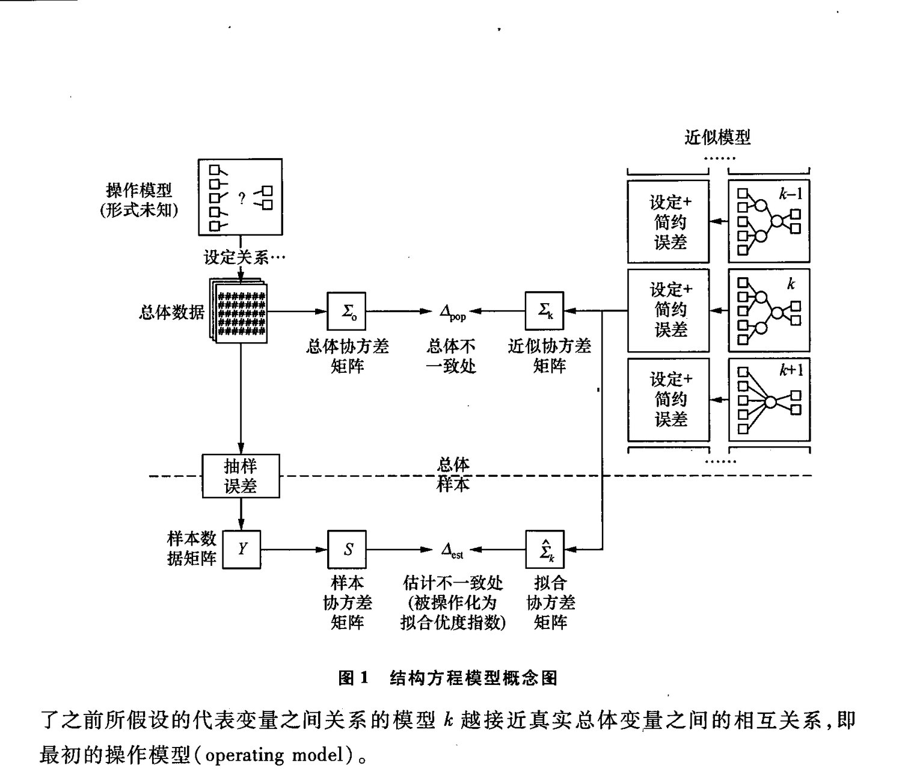

<!-- PDF页 310 -->

### 8.1 测量模型

图2 基本构造了测量模型的面角:这里,我们用八个观察变量来测量两个潜变量。其中,前四个观察变量测量第一个潜变量,而后四个观察变量测量第二个潜变量。如图所示,这两个潜变量是相关的,而潜变量与观察变量之间的关系可表示为因子负荷(factor loading),即和,并且,每个观察变量的测量误差用6 来代表。另外,在结构方程模型常用图标的表示法中,圆或椭贺表示潜变量或因子,而正方形或长方形表示观察变量。其实,测量模型的主要用途是通过验证性因子分析来帮助我们检验心中的假设,即如此图所示的因子模型是否与数据吻合,是否为一个好的模型,并同时对各因子间参数做出合理估计。这其实照应了我们前面所提到的对构念效度的检测。

/hf ba ts/ haf nde d 6 65 46 6 &§ 6 &图2 测量模型

### 8.2 ”路径模型

如图3 所示,模型包含了三个自变量和两个因变量,它们之间有着复杂的相互关系。简单来讲,结构方程模型可同时将所有这些关系一起估算,从而避免了考虑一个因变量时,忽略了其他因变量的存在及其影响的情况。路径分析的主要作用是想了解各变量之间的关系,这其中包括直接关系和间接关系两大类。直接关系(direct effect) 是指某一变量对另一变量产生直接影响,如图中从变量 X, 到变量 Y,,或从变量 X, 到变量了Y。而间接关系(indirect effect) 则是某一变量对另一变量的影响乃是通过其他变量而形成的。这个中间变量称作干扰变量(intervening variables),如图示,X, 是通过 Y, 而影WY, 的。综上所述:总效果(total effect) 是指某一变量对另一变量的直接效果加上间接效果的总和。例如,X, 与了之间存在直接关系,同时通过了也存在着间接关系,那么, X, 与了的总效果就是以上直接效果和间接效果之和。虽然传统的回归性分析可以将 -变量间复杂的关系分拆成直接关系和间接关系,但是结构方程模型为我们提供了一个简单的方法,即可同时分析各种变量之间的关系,省去了先前逐条分拆的烦开。

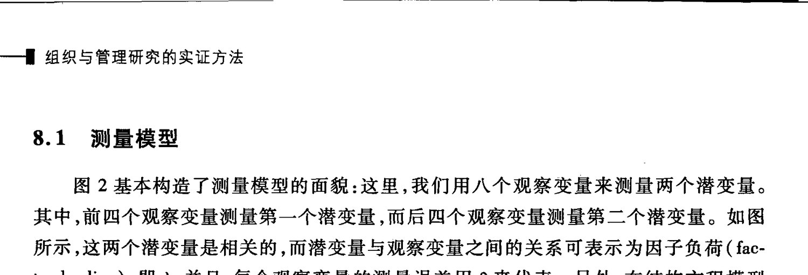

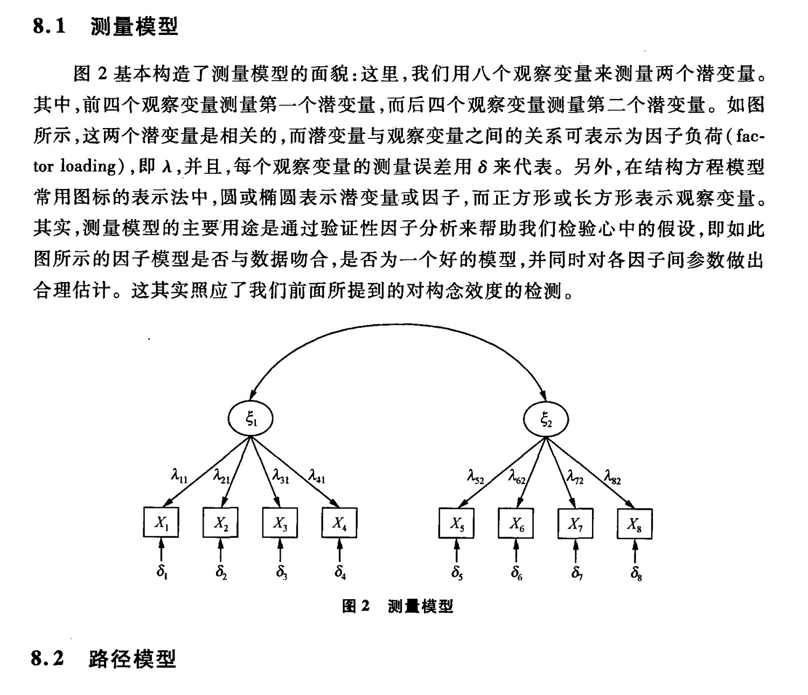

<!-- PDF页 311 -->

%n; |图3 路径模型8.3 £8如图4 所示,全模型是同时包含了测量模型和路径模型的总和。即同时包含外源变量和内生变量的模型,也称为完整模型(complete model)。6 4, 6 6 & & 6 & Ef AY 1 [Aaya ANA Ah ha ©) “ Cn) Bu hs Ads den | es & a &图4 全模型8.4 ”均值结构模型在近二十年前,学者们对结构方程的认识只局限于共变和矩阵的形式,而现在的研究已扩展到了增加对潜变量均值的分析。 对单一组别的结构模型来说,由于潜变量的度量单位(scale)及其截距(intercept) 都是随意设定的,所以潜变量的均值没有很大的意义。但是在跨组别(cross-group) 比较研究中,均值结构模型可用以比较各组别的潜变量均值的大小。第十三章 | 因果关系理论的建立——结构方程模型 | 297

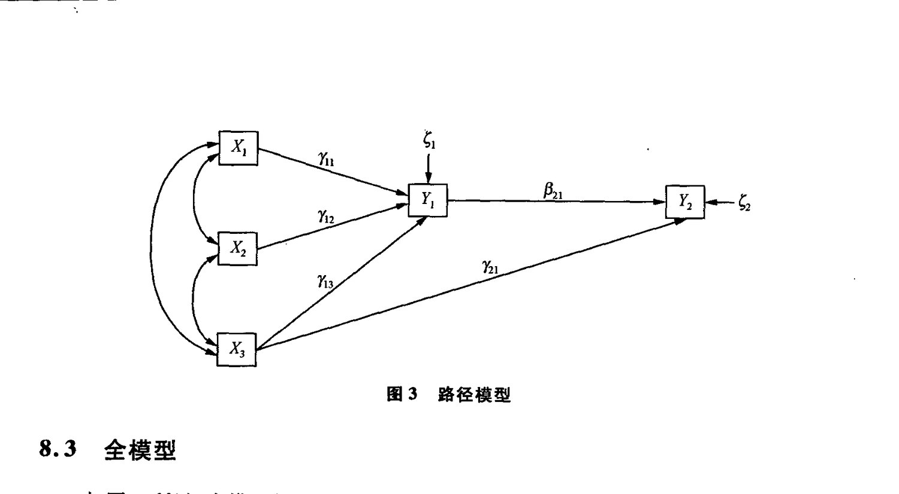

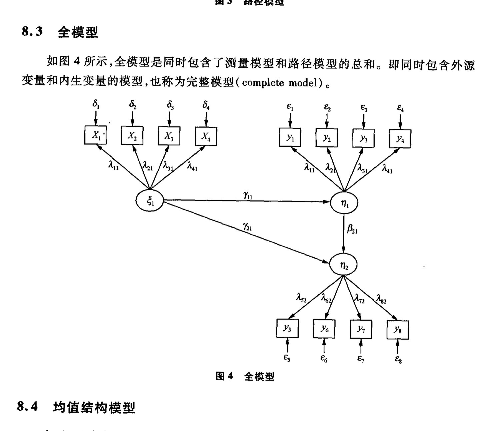

<!-- PDF页 312 -->

fy, LISREL 程序撰写目前,有多种软件可以用来分析结构方程模型,本章在这里要详细介绍的是比较流行的 LISREL 软件,其他流行的软件包括 AMOS 和EQS。采用 LISREL 的命名方式,我们会经常使用希腊字母来表达不同的参数。首先,我们介绍一下潜变量的度量单位。开篇我们提到过,潜变量是个虚拟的概念,那么,当我们要量度这些诸如认知、态度等因子时,就必然无法取用像以往量度距离的千米或量度重量的千克这样的被大家一致公认的单位进行测量。然而,在结构方程模型中,因子一定要有自己的单位方可计算,所以,通常我们采取以下两种方法之一; (1) 固定负荷法:即任取一个观察变量(X,) 为参照指标,同时设定其截距为0,因子负”和荷为1。这样一来,不但使得潜变量一个单位的变化相应导致其观察变量一个单位的变化,而且潜变量的平均值也等于相应参照指标的观察平均值。(2) 固定因子方差法:即. 将潜变量标准化,设定其方差(91)为1(见图5)。模型0.15 固定因子方差法0.44 0.24 0.88 1 = 1.0 0.45模型2 os 固定负荷法1.00 0.24 2.00 by, = 0.1936 0.45图5 潜变量度量方法BRAS 中两种方法在数字的表述上是不同的,但是殊途同归,本质上是相同的。如图所示,模型 1 采用的是固定因子方差法,将因子标准化后,四个观察变量都有其相应的因子负荷。而模型 2 采用的是固定负荷法,即选择了XX, 为参照指标并且将其因子负荷(factor loading)设定为1。换个角度分析,其实模型 2 是将模型 1 中所有的因子负荷数全部除以第一个指标(即参照指标)的因子负荷数(即 0.44)从而得到了模型2 的各个因子负荷数值,相应地,此时模型 2 中因子的方差也变成了 0. 44 的平方,即0.1936。综上所述,无论我们用哪一种方法来设定潜变量的单位,所要估测的目标参数

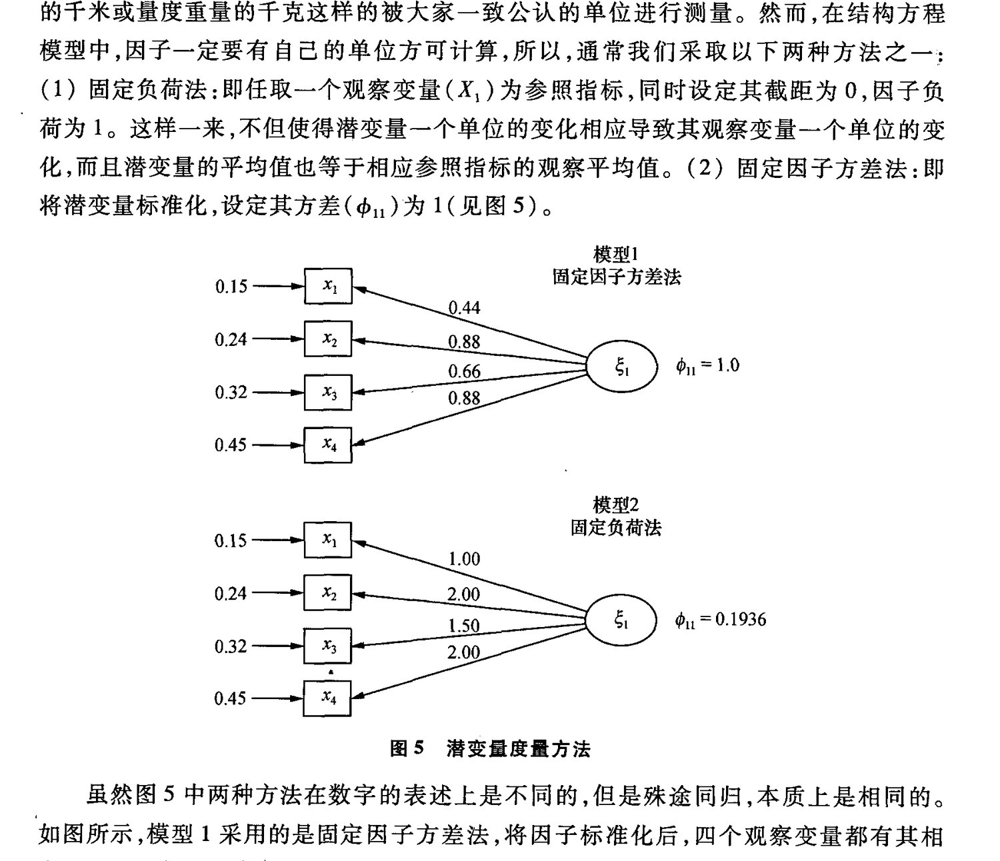

<!-- PDF页 313 -->

数量是不变的,具体到本例,模型1和2 同样需要得到对 8 个参数的估测结果,这点是不变的。这里再特别强调一点,当我们进行跨组别比较研究,特别是跨文化(cross culture)比较研究时,必须采用固定负荷法来完成对潜变量单位标准化这一步骤。因为在固定方差法中,两组构念的方差(1)假设为相等,而这个假设特别是在跨文化比较研究中是不恰当的,所以我们选择无此假设的固定负荷法。:

TERRI EZ BU, BR ATE BE Fe FD RE — AES:: BE BY VAG! (model identification),即衡量有无足够的方程来解决想要估测的参数。这个规律是这样的:设问题涉及个观察变量,则协方差甜阵是一个k阶的对称方程,总共有p =k(k+1)/2 个不重复元素。而q 则代表所需估计的参数个数。模型的自由度(degree of freedom,df) =p -gqg。在前面的例子中:此模型需要估计6 个因子负荷,3 个因子间相关系数和8 个变量的误差方差,共需估计 g=17 个参数;因为有8 个变量,所以p =8 x (8 +1)/2 =36。这样一来,此模型的自由度 =36 -17 =19。

若一个模型的自由度为0 时,即不重复元素的个数p 等于所需估测参数的个数9g,我们称这样的模型为仅限识别模型(just identified model)。它的 chi-square 等于0,即是完全吻合模型,同时表示我们无法衡量这个假设的模型与原始数据的吻合程度。换个角度来讲,如果任意两个结构方程的自由度都是0,那么,在这种情况下,它们的拟合度都是完全吻合,也证明了理论上不同模型可以得到相同拟合指数。反过来,这更加说明了我们一直强调的假设模型要有坚实的理论依托的道理。如果自由度小于0,此模型被称为未识别模型(under identified model),这时我们的估测得不到任何结果。

在介绍了单位设定和模型识别概念之后,接下来,我们简单介绍一下建立结构方程模型的六个步又:

。 第一步,正如前面所谈到的,结构方程中的分析统称检定分析,即是对假设模型的一种检定,所以首先我们应当建立一个基于理论基础的假设模型。

。 第二步,根据理论所表达的各变量之间的相互关系,整个模型用路径图(path diagram) 的方式呈现。

。 第三步,将路径图用一组结构方程演绎并对测量方程进行具体描述。

。 第四步,将前面所陈述的关系——表达成为 LISREL 的程序语言,然后运行结人果。当然,除了LISREL 之外,其他软件,如 AMOS EQS 都可以达到同样的功效。

。 第五步,结果输出。这时我们要着重观察儿个方面的因素:(1) 参数估计的可行性;(2) 假设模型与实验数据的拟合程度; (3) 参数的估计是否显著。

。 第六步,解释输出结果。

下面,我们以验证型因子分析为例子来详细解释以上步台:

在理论基础上建立假设的模型是建立结构方程模型的第一步,也是最重要的一步。

| 因果关系理论的建立一结构方程模型 | 299

<!-- PDF页 314 -->

建立结构方程模型首先是根据理论基础为各个构念之间的关系作出假设(hypothesis),再设定量表中各观察变量与各潜变量之间的关系。结构方程模型只是一种统计方法,用以检定样本数据与假设模型的拟合程度。由于不同的模型有可能得出相同的拟合协方差矩阵,因此与样本数据也有相同的拟合程度。在这种情况下,结构方程模型不能辩别哪个假设模型比较好,而必须依赖理论基础来选择适当的模型。假设经过第一步的理论架构之后,得出两个潜变量之间存在相关性,那么,第二步就是要通过路径图的形式将理论演化出来。如图1一2 所示,用 8 个指标来测量这两个HERZ KAR. HX 代表的观察变量, A 代表XX对的因子负荷,é 代表潜变量,而6 则代表了XX的测量误差。接下来的第三步是设定结构关系,即将其以矩阵的方式表达,如图6 所示。x An 0 6 * Ay 0 6, xs Ay 0 5; x Ay 0 lré 6, Xs “Tg As. [,]* 5, Xs 0 Aw 6 x 0 An 8, Xs 0 Ag 5s du e= [> al X2€ BIRR hp Ax:X 对的因子负荷:外源变值 6:了的测量误差图6 潜变最和矩阵表达方式做好了以上的准备工作之后,我们终于开始第四步——撰写 LISREL 程序的工作了。LISREL 可主要分为下列四类指令,依次为: (1) 标题指令句(TITLE LINE),使自己对此程序的描述,可超过一行。(2) 输入格式(INPUT SPECIFICATION),整个程序真正开始运行的地方,由头两个字母 DA(代表 DATA)起始。(3) 模型格式(MODEL SPECIFICATION), (4) 输出格式(OUTPUT SPECIFICATION)。接下来,我们从第二个格式开始,分别详细解释其说明方法:输入格式(INPUT SPECIFICATION) DA NI =k [number of indicators] NO =number of cases

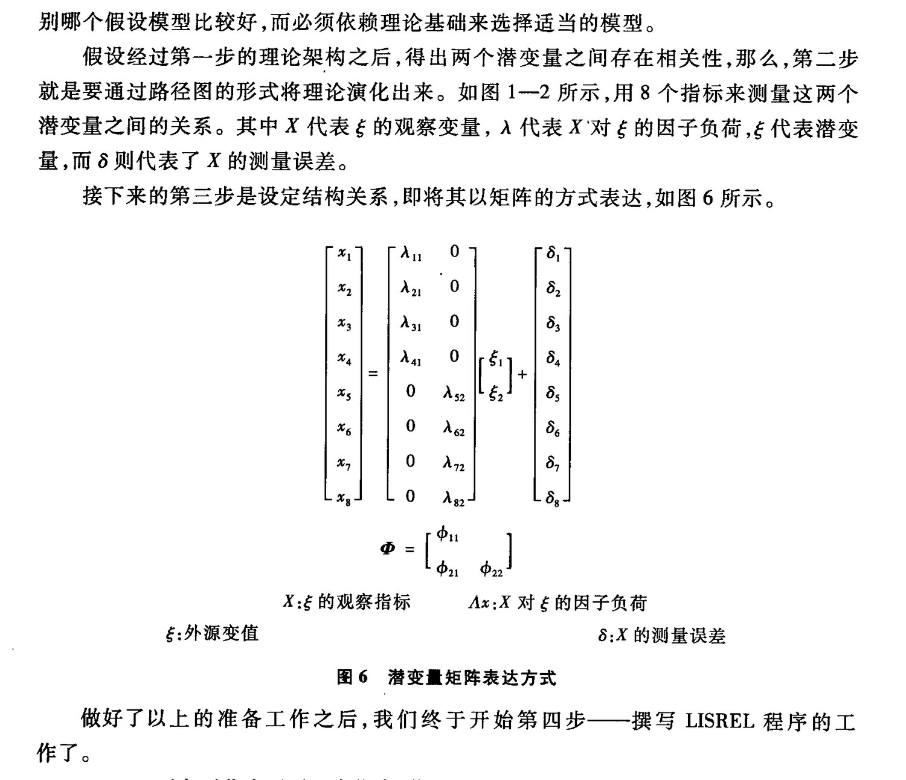

<!-- PDF页 315 -->

LA [labels for the observed variables]

V1 V2 V3 V4 V5 V6 V7 V8

RA FI =filename [of raw data]

CM FI = filename [of covariance matrix]

KM FI = filename [of correlation matrix]

SD FI =filename [of standard deviations]

ME FI = filename [of observed means ]

解释:DA 作为输入格式的起始点,紧接着在同一行中最简单的模型所必需的设定。NI 代表变量数目,即数据输入文件中观察变量的个数;NO 代表样本数目。

第二行 LA(Label) 代表数据输入文件中变量的名字,如本例中有 8 个变量,分别叫做 Vl,V2,V3,V4,V5,V6,VI,V8。

我们可以采用不同的输入方法:最基本的是由 RA(RAW DATA)原始数据开始,其后的本为文件名称,这是原始数据储存的地方。当然,除了采用原始数据输入外,还有其他多种选择,如 CM(COVARIANCE MATRIX)协方差矩阵或 KM(CORRELATION MATRIX) 相关和矩阵和 SD(STANDARD DEVIATIONS)标准差,LISREL 可直接将这两个矩阵转换成协方差矩阵的形式认读。假设我们考虑到均值结构分析时,则要输入 ME (OBSERVED MEAN)代表均值。

模型格式(MODEL SPECIFICATION)

MO NX =8 NK =2 LX =FI TD=DI PH=SY

LK

ksi labels

解释:首先我们简单介绍一下 LISREL 语法的和矩阵及设定中最基本的记号。

LX 代表 Lamda-x,为 FU(FULL, 5¢ 58, x 在& 上的负荷矩阵)。

TD 代表 Theta-Delta,为 DI(DIAGONAL,对角线矩阵),即指X观察变量的误差协方差,将误差之间的相关设为零(不相关)。

PH 代表 Phi,为 SY(SYMMERIC,对称和矩阵),即指& 的协方差矩阵,一般只采用下三角(LOWER TRAINGLE) 数据。

下面,正式介绍模型格式的撰写:此格式以 MO(MODEL)模型指令开始,在此行 NX =8 代表有8 个观察变量, NK =2 代表潜变量数目为两个,LX = FI 代表将所有 lambda-x RE AF, TD = DI 描述了误差间协方差矩阵对角线元素自由,而非对角线元素固定为零,PH =SY 则表示了因子间的协方差对称矩阵形式。下一行 LK(LABLE ksi) 是 é的标签,即为潜变量的命名。

另外,我们还需了解其他一些记号的含义,如 FR 代表指定自由待估测的参数;可代表指定固定的参数,如果无特定数值给予时,一般参数会采用缺省值 0;VA 则代表将参

| 因果关系理论的建立——结构方程模型 | 307

<!-- PDF页 316 -->

一

数固定于某数值(VALUE)。输出格式{OUTPUT SPECIFICATION) Path Diagram OU ND=4其中 OU 代表输出指令;ND 代表输出结果的小数位数(decimal),在此我们选取4位小数位数。现在,我们不妨一起来分析一个简单的例子,看看前面讲到的 LISREL 程式指令是如何应用于实际的: (一) 研究及模型简述假设我们用 8 个题目了解职员和顾客对服务质量的满意程度。模型见图2。(二) LISREL 程序分析和解释在图7 中,我们可以清楚地看到,在指令标题句后,由 DA 开始了数据输入指令,由MO 开始了模型构念指令,由 OU 开始了结果输出指令。Title line: Exercise DA NI =8 NO =200 LA V1 V2 V3 V4 V5 V6 V7 V8: cM 1.65 0.45 1.14 0.35 0.30 1.01 0.51 0.49 0.43 1.58 0.07 0.20 0.20 0.23 0.75 0.17 0.14 0.17 0.27 0.23 0.65 0.41 0.20 0.07 0.21 0.11 0.25 0.85 0.22 0.23 0.26 0.36 0.24 0.25 0.16 0.75 MO NX =8 NK =2 LX =FI LK Staff Customer. VA 1 LX (1,1) Lx (5,2) FR LX (2,1) LX (3,1) Lx (4,1); FR LX (6,2) LX (7,2) LX (8,2) PD OU ND =4. 图7 LISREL 程序示例上

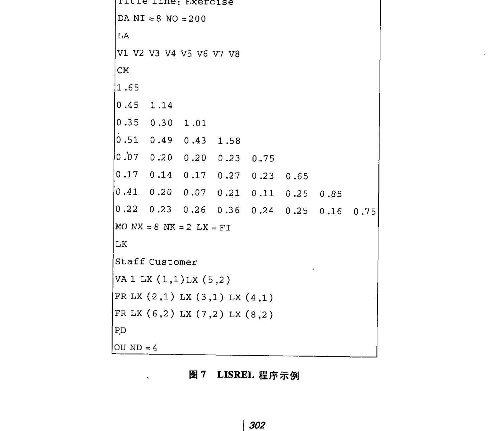

<!-- PDF页 317 -->

(1) DA NI=8 NO =200

DA 是输入数据(DATA, DA)的指令。NI =8 表示数据共有 8 个变量, NO =200 表示测斌对象为 200-名。

(2) LA、

V1 V2 V3 V4 V5 V6 V7 V8

LA 为标签指令句,即给刚刚输入的 8 个变量以名称,它们依次为 V1, V2,V3,V4, V5,V6,V7,V8.,

(3) CM AR Di Dy 22 He RF, 30 BA FO} OT AN HE, BY ARS 200 份问卷得出的相关FAME

(4) MO NX =8 NK =2 LX =FI

从 MO 开始了对模型参数设定的指令。NX =8 代表观察变量(即指标)的个数为8, NK =2 (UZ AE EE (BY #-因子)的个数为2,LX =了可的设定意味着开始将 lambda-x 矩阵设定为固定的矩阵。接着在 FR LX 指令中设定 LX 的格式,逐一列出设定为自由的元素,如LX(2,1).LX(7,2)等,并以 VA 指令将以固定的LX(1,1)和LX(5,2)赋值为1,至此,我们应当体会到这是在用固定负荷法对因子进行量度。LK 代表的标签(LABLE ksi),即分别给两个潜变量以名称: 职员、顾客。PD 为路径图 (path diagram)。

(5) OU ND=4

OU 开始的输出指令中 ND 代表输出结果的小数位数,本例我们选取4 位小数位数。

第五步,LISREL 结果输出及解释

通过输入 LISREL 程序运行之后,我们会得到一大串对待测模型的输出结果。如何进行有效合理的分析呢?通常,我们会从以下四大方面着手:

(一) 参数的估计可行性。结构方程模型本质上是个反复逃代(iterative)测量的过程,即在中间环节通过不断改变各个参数的估计,从而尽可能使得 4A.,,即5 与名之间的差异最小。在改变参数大小时,有可能会出现不合理值。例如,X 观察变量间协方差和因子间协方差都应分别大于零,如果任意一方有小于零的数值,即不合理的数值出现,则可全盘否定此结构模型。.

(=) 假设模型与实验数据的拟合程度。我们会选择不同的拟合指数进行衡量,一般包括 Chi-square、RMSEA、TLI、CFI 和 Standardized RMR。稍后会逐一介绍给大家。

(=) 参数的估计是否显著。在输出的结果中,除了每个参数的估计值之外,还有标准误差和4,值的估计。如果选取第一类错误(type I error)值等于 0.05,那么,我们要RAH (MKF 1.96。

(四) 的复相关系数(multiple correlations)。在结构方程模型中,每个观察变量都有一个复相关系数,就像回归方程中的 R-square 一样,我们同样希望这个复相关系数越大越好,因为如果它变小的话,则说明观察变量与潜变量之间的关系也相应变弱了。

= BRARGCWY— BH ERA | 303

<!-- PDF页 318 -->

好了,下面我们一起来观察例一的 LISREL 输出结果,见图8,看看有何新的发现:首先判断其中并无不合理参数出现,然后检查在 Lambda-X 表中每个参数所对应的三个数值分别是:参数估计值标准误差和:值,其中,所有:值都是大于1.96 的,这说明因子负荷相关系数(或协方差)都是显著的。CFA Exercise 1 Number of Iterations =10 LISREL Estimates (Maximum Likelihood) LAMBDA-X Staff Customer v1 1.0000 oo v2 0.9176 — (0.1855) 4.9457 V3 0.8087 — (0.1692) 4.7806 v4 1.2376 _—_ (0.2372) 5.2173. v5 —_ 1.0000 v6 — 1.1584 (0.2392) 4.8438 v7 — 0.9265 (0.2298) 4.0315 v8 — 1.2553 (0.2584) 4.8572 PHI Staff Customer Staff 0.4311 (0.1352) 3.1891 Customer 0.1952 0.1797 (0.0518) (0.0600) 3.7697 2.9958图8 LISREL 结果示例

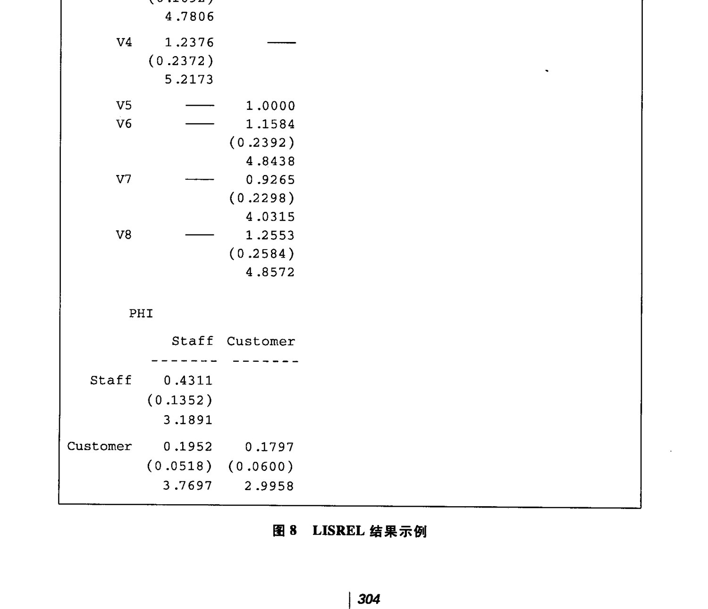

<!-- PDF页 319 -->

THETADELTA vi v2 v3 v4 v5 V6 1.2189 0.7770 0.7280 0.9196 0.5703 0.4089 (0.1441) (0.0977) (0.0876) (0.1341) (0.0669) (0.0567) 8.4559 7.9534 8.3076 6.8589 8.5197 7.2063 THETA-DELTA v7 v8 0.6958 0.4669 (0.0777) (0.0655) 8.9586 7.1276 Squared Multiple Correlations for X-Variables vi v2 V3 v4 v5 vé 0.2613 0.3184 0.2792 0.4180 0.2395 0.3709 Squared Multiple Correlations for X-Variables V7 v8 0.1814 0.3775 Goodness of Fit Statistics Degrees of Freedom =19 Minimum Fit Function Chi-Square =32.4778 (P =0.02759) Normal Theory Weighted Least Squares Chi-Square =32.6897 (P =0.02610) Estimated Non-centrality Parameter (NCP) =13.6897 90 Percent Confidence Interval for NCP =(1.6329; 33.5893) Minimum Fit Function Value =0.1632 Population Discrepancy Function Value (FQ) =0.06879 90 Percent Confidence Interval for FO =(0.008206; 0.1688) Root Mean Square Error of Approximation (RMSEA) =0.06017 90 Percent Confidence Interval for RMSEA = (0.02078; 0.09425) P-Value for Test of Close Fit (RMSEA < 0.05) =0.2878图8(续) Stee | 因果关系理论的建立一结构方程模型 | 305

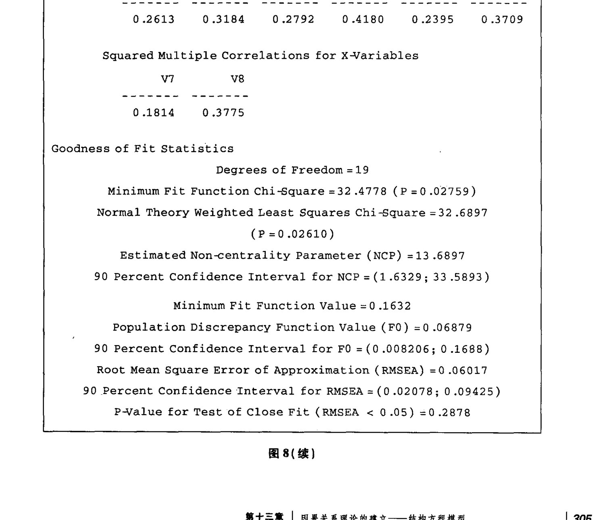

<!-- PDF页 320 -->

Expected Cross-Validation Index (ECVI) =0.3351 90 Percent Confidence Interval for ECVI = (0.2745; 0.4351) ECVI for Saturated Model =0.3618 ECVI for Independence Model =2.0159 Chi-Square for Independence Model with 28 Degrees of Freedom =385.1658 Independence AIC =401.1658 Model AIC =66.6897 Saturated AIC =72.0000 * Independence CAIC = 435.5523 Model CAIC =139.7611. Saturated CAIC =226.7394 Normed Fit Index (NFI) =0.9157 Non-Normed Fit Index (NNFI) =0.9444 Parsimony Normed Fit Index (PNFI) =0.6214 Comparative Fit Index (CFI) =0.9623 Incremental Fit Index (IFI) =0.9632 Relative Fit Index (RFI) =0.8757 Critical N (CN) =222.7513 Root Mean Square Residual (RMR) =0.05450 Standardized RMR =0.05200 Goodness of Fit Index (GFI) =0.9606 Adjusted Goodness of Fit Index (AGFI) =0.9253 Parsimony Goodness of Fit Index (PGFI) =0.5070图8(续)十、拟合指数(Fit Index)在结构方程中,当我们谈到拟合度时,其实是指如何尝试改变各参数值的大小,从而使得拟合协方差矩阵越接近样本协方差矩阵,即 A。,越小。一般,我们会采用拟合函OF OTHE 4。的大小。此值越小,则说明两个矩阵之间的拟合程度就越好。根据估计的方式不同,我们一般用的方法是最大似然估计 ML(Maximum likelihood),其拟合函数下(fit function) 的最小值的计算公式如下:

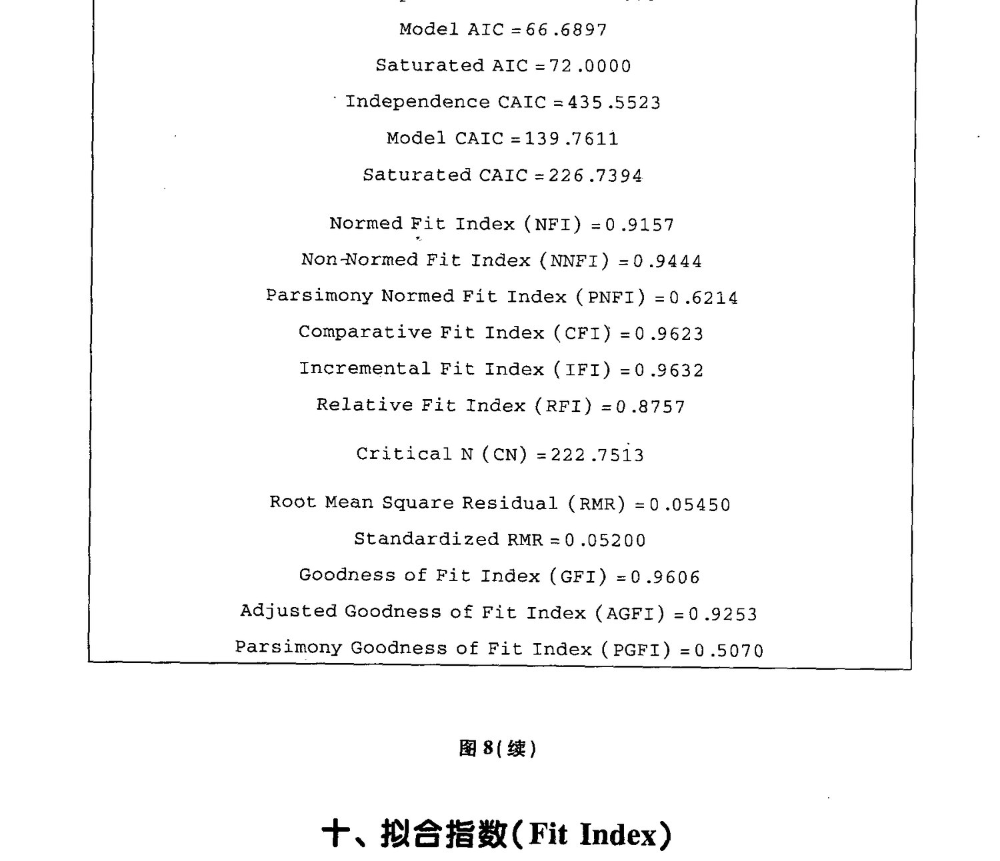

<!-- PDF页 321 -->

fa, =logl SO 1+ (SSO) -logl SO | - p + (BO = pO) YOR — yO)而整体拟合的最基本测量指标就是x,其公式为: x =(N-1)F其中,NN为样本大小,FF为拟合函数的最小值。

伴随x 一起的,我们还要同时考虑自由度和 p-value 的大小。在众多不同的拟合指Kh VY 是其中少数有已知分布情况的。另外,还有拟合指数 Root Mean Square Error of Approximation(RMSEA)。由于分布情况已知,我们可以检测x,即 4。是否显著。相对于每一个x 以及自由度(df)值,我们可以找到显著的 p-value。当x BW), p-value MA

′ 时,说明了拟合协方差矩阵与样本协方差矩阵的差距越不显著;反之,当X 越大,p-value越小时,则说明了拟合协方差矩阵与样本协方差矩阵的差距越显著,这时,我们最初假设的模型就要被推翻了。

然而,许多学者都特别注意到了一点,即x? 的值对样本数量相当敏感。当样本越大Hy 值也就越容易变成显著,从而使假设模型越容易遭到拒绝。其实,我们从公式中也可以发现x 值是非常依赖样本大小的,因为计算时是用样本数乘以下值。通常在结构方程实验中我们都需要大的样本数量,这时就会导致即使拟合协方差矩阵与样本协方差矩阵的差距不显著,也会使模型被拒绝的情况屡次出现。这个矛盾也就合理解释了为什么学者们都在不断找寻更合适的拟合指数。现在,一般的软件都会同时支持超过30 个的拟合指数。下面,我们再简单向大家介绍几个:

Relative chi-square

xX /df

这主要是基于x 与自由度之间是非线性关系,两者相除之后,即可变成线性的关系。一般规律是2:1 或3:1 是可接受拟合度的标志。

Root Mean Square Error of Approximation (Estimated RMSEA)

= x N(N-1)(d-1)

这个概念最早是由 Steiger & Lind (1980)提出的,然而是由 Browne 和 Cudeck (1993)给它命名的。当 RMSEA 等于或小于 0.05 时,表示假设模型拟合程度好;0. 05到 0.08 之间时,表示拟合程度可以接受;0.08 到0.10 之间时,表示拟合程度一般;当超过0.1 时,则表示了模型与数据的拟合度较差。总体来讲,当 RMSEA 越小时,表示拟合程度越高。除此之外,还提供了P close 的判断标准:即用 P-value 测定这个假设。当 Pvalue 大时,说明不显著,则不拒绝假设模型;车当 P-value 小时,说明显著,要拒绝假设的模型。 |

TL 和CFI 又是另一组经常使用的拟合指数的代表,它们的共同特征是比较底线(baseline)模型的x 和假设理论模型的Xx?。

| 因果关系理论的建立——结构方程模型 | 307

<!-- PDF页 322 -->

Tucker-Lewis non-normed fit index (TLI) a x TLI = p, = oof Xe] df, Bentler (1990) comparative fit index (CFI) crt = 1 ~- LaxQ = 4f,0) max(y? - df,,0)

TLI AH ys RR PY y”,df; 指底线模型中的自由度。这里所谈到的底线模型是只包含观察变量和误差项,忽略了洪变量和因子负荷间所有关系的一种模型。TLI 和 CFI 得到的值越大,代表拟合程度越好。一般的规律是:取值大于 0.9,若大于0.95 时,则代表假设理论模型与数据的拟合度非常好。

另外,其他常用的拟合指数,诸如 Goodness of fit index (GFI)和 Adjusted Goodness of fit index (AGFI),不少模拟研究发现它们的特性都有缺陷,如对样本大小的依赖度高等。

Root Mean Square Residual (RMR)为拟合残差方差的平均值的平方根,即一种平均残差方差。

RMR = Is {> SP of) }/ Spr

RMR 虽然受到单位的影响,但如果两个模型是使用同一数据作测量,那么,即可用这个指标比较其优劣。其中,RMR 值较小的一方,为拟合度相对较好的模型。也正是由于 RMR 易受单位的影响,故将其标准化后变成了 Standardized RMR,

PH,我们回到先前的例子中来看看拟合度的结果。如图8 Bra, 自由度(degrees of freedom) = 19, Minimum Fit Function Chi-Square = 32. 4778 (p =0.028),RMSEA = 0.06017,p close =0. 2878, TLI = NNFI =0.9444, CFI =0.9623, SRMR =0. 052, HPR RX? 的p-value < 0.05,但是p close >0.05, 且其他的指标也反映了高的拟合度,所以经过综合判断,我们认为此例假设的模型与样本数据拟合。

### 十一、结构方程模型发展的新趋势

(一) 第一个大的新方向是测量等同(Measurement Equivalence/Invariance, ME/I)概念的拓展与延伸。实际上,测量等同旨在探讨如何跨组(cross group) 比较结构方程模型中的各个参数值,如和.5或7。这种比较研究也可更深入地涉及不同组别之间均值结构模型的平均值的比较。特别值得我们关注的是测量等同在实际操作中的如下具体应用:

<!-- PDF页 323 -->

1. 将结构方程模型在不同文化组别之间进行比较,可对跨文化研究工作大有神益。

2. 在教育学领域,结构方程模型可有助于比较拥有不同水平学术成就或不同主修范围的研究对象之间的异同。

3. 跨性别研究,因为男性和女性对某些问题的看法会有所差异,如对“大减价”这个事件所体现出的分歧。

4. 在心理学试验研究中,结构方程可帮助测量实验组和对照组对同一份调查问卷”题目的不同看法。

5. 在360 度绩效评估中,研究表明,工作持有者与上司对其本人的工作表现评价会有所出入,从而导致了一系列问题的产生。经验证明,结构方程模型在以上这些研究分析方面,都有它擅长的一面。

(=) 第二个大的新方向是所谓的潜增长模型(latent growth model)。有许多研究是在观察研究对象随着时间轴的变化程度,如人们的认知和态度的发展和变化。具体来讲,一个员工在步人职场之前对未来的工作会抱有一定期望;两个星期之后,当他有了一些初步认识之后,期望也会变得实际些,同时对公司的观念也会有所改变;六个月之后,他的改变应该逐渐趋于稳定。所以我们说一个人对一个机构的认知和观念会随着时间的流逝而发生变化。同样的,许多相似的概念和理论都是关于发展的,如上司与下属的关系,培训的效果等,在解决诸如此类的问题中潜在增长模型的应用给我们带来了很好的启示。

(=) 第三个大的新方向是多层次因子模型(multilevel factor model) 的进展。图9为一个多水平因子模型,它包括了四个样本(subject),每个样本由三个题目(item)来测量, 这四个样本又同时属于一个大组别(group)。这个例子充分说明了有时我们收集来的数据之间不是互相独立的,如虽然分为四个样本,但其实互相之间都存在着一定关系。因为它们同属于一个大组别,就会受同一个组长的影响,所以这些样本之间是相关的。那么,这种情况在作分析时也必然会存在特别之处。在结构方程中,我们可将观察得来的变量之间的协方差矩阵分拆成为两个水平研究:即变量组间协方差矩阵

图9 多水平因子模型| 因果关系理论的建立——结构方程模型 | 309

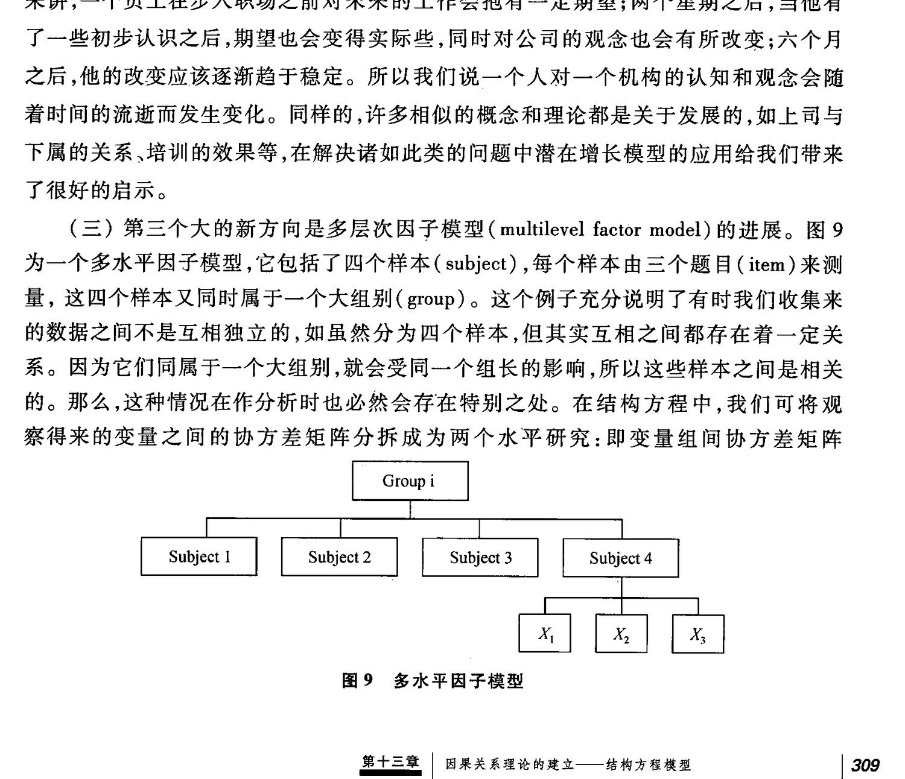

<!-- PDF页 324 -->

(between-group covariance matrix) 和变量组内协方差矩阵(within-group covariance matrix),从而可对组间和组内的模型进行分别测量,进一步便可比较这两个水平之间的异同。 |

综上所述,虽然近年来结构方程的应用日益广泛,但是人们对其本质概念仍存在某些误解。其实简单来讲,结构方程是基于假设模型,通过比较拟合协方差和矩阵与观察协方差矩阵,当二者差距减少时,则说明假设模型与原始数据也趋于接近。所以,我们认为,只有清楚并深刻了解结构方程的内涵,才能使其成为帮助我们进一步探索的更得力的助手和工具。

### 参考文献

Arbuckle, J. L. and Wothke, W. (1999). AMOS 4.0 User's Guide. Chicago; Smallwaters.

Bollen, K. A. (1989). Structural Equations with Latent Variables. New York; John Wiley & Sons.

Browne, M. W. and Cudeck, R. (1993). Alternative ways of assessing model fit. In; Bollen, K. A. and Long, J. S. (eds.) Testing Structural Equation Models; 136—162. Beverly Hills, CA; Sage.

Cheung, G. W. (1999). Multifaceted conceptions of self-other ratings disagreement. Personnel Psychology, 52, 1—36.

Cheung, G. W. and Rensvold, R. B. (1999). Testing factorial invariance across groups: A reconceptualization and proposed new method. Journal of Management, 25, 1—27.

Cheung, G. W. and Rensvold, R.B. (2000). Assessing extreme and acquiescence response sets in cross-cultural research using structural equations modeling. Journal of CrossCultural Psychology,31(2), 187—212.

Cheung, G. W. and Rensvold, R. B. (2001). The effects of model parsimony and sampling error on the fit of structural equation models. Organizational Research Methods, 4, 235—263

Hayduk, L. A. (1987). Structural Equation Modeling with LISREL; Essentials and Advances. Maryland; Johns Hopkins University Press.

Joreskog, K. G. and Sirbom, D. (1996). LISREL8; User's Reference Guide. Chicago: Scientific Software International, Inc.

<!-- PDF页 325 -->

Steiger, J. H. and Lind, J.M. (1980). Statistically-based tests for the number of factors. Paper presented at the Psychometrika Society Meeting, Iowa City, IA. RARE BES (DT RRA) 9 TGR,教育科学出版社,2004。‘ Mies | 因果关系理论的建立——结构方程模型 | 311

