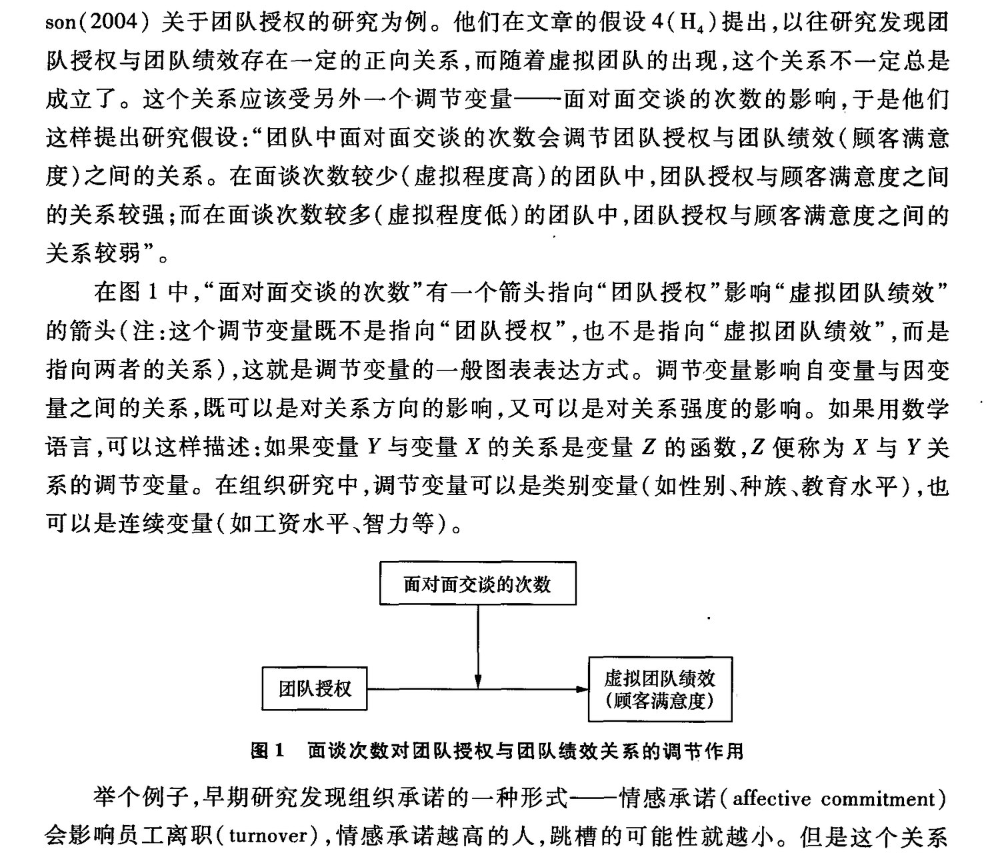
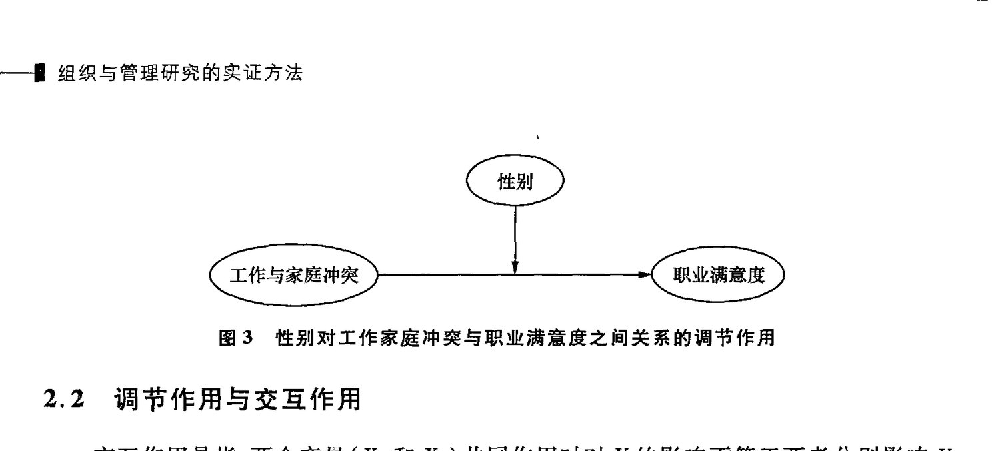
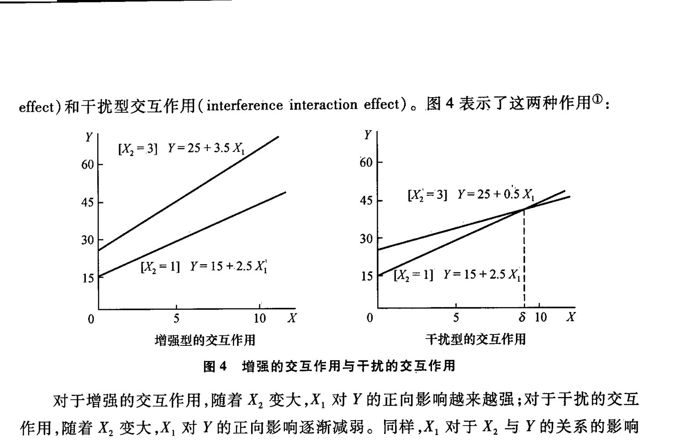
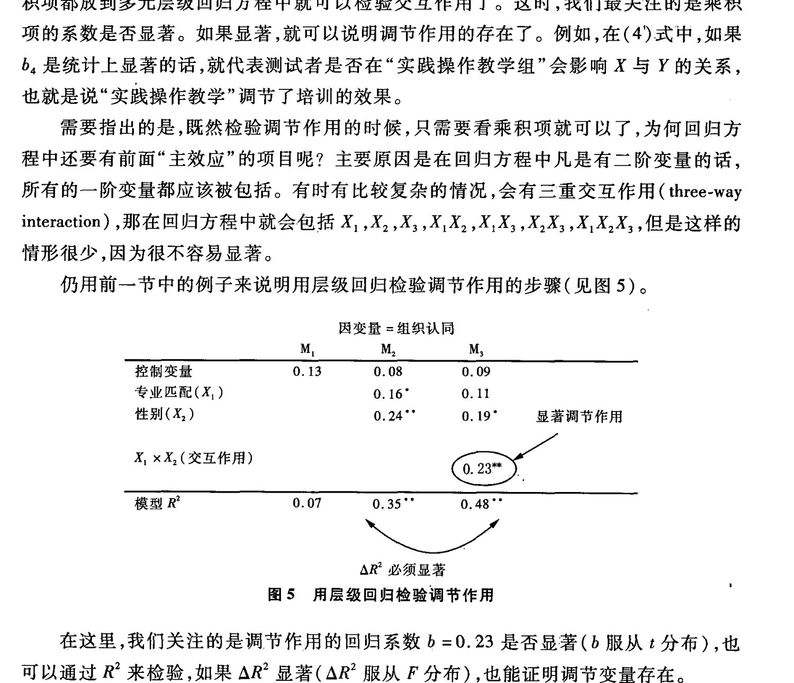
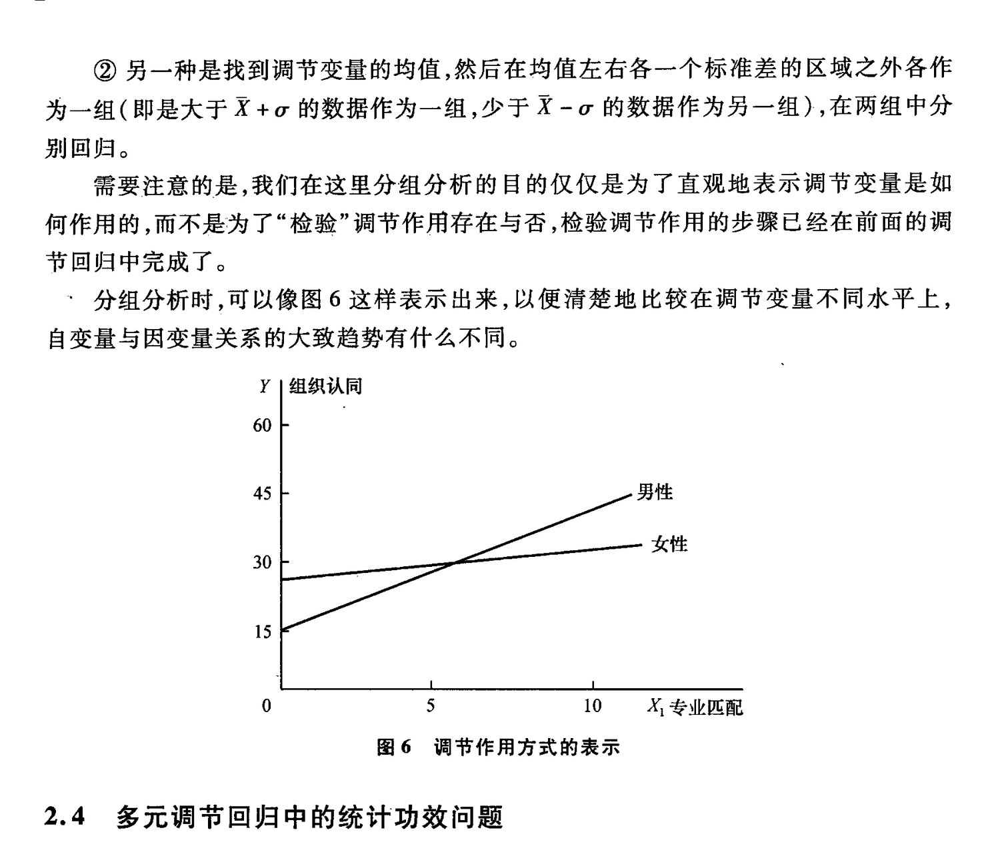
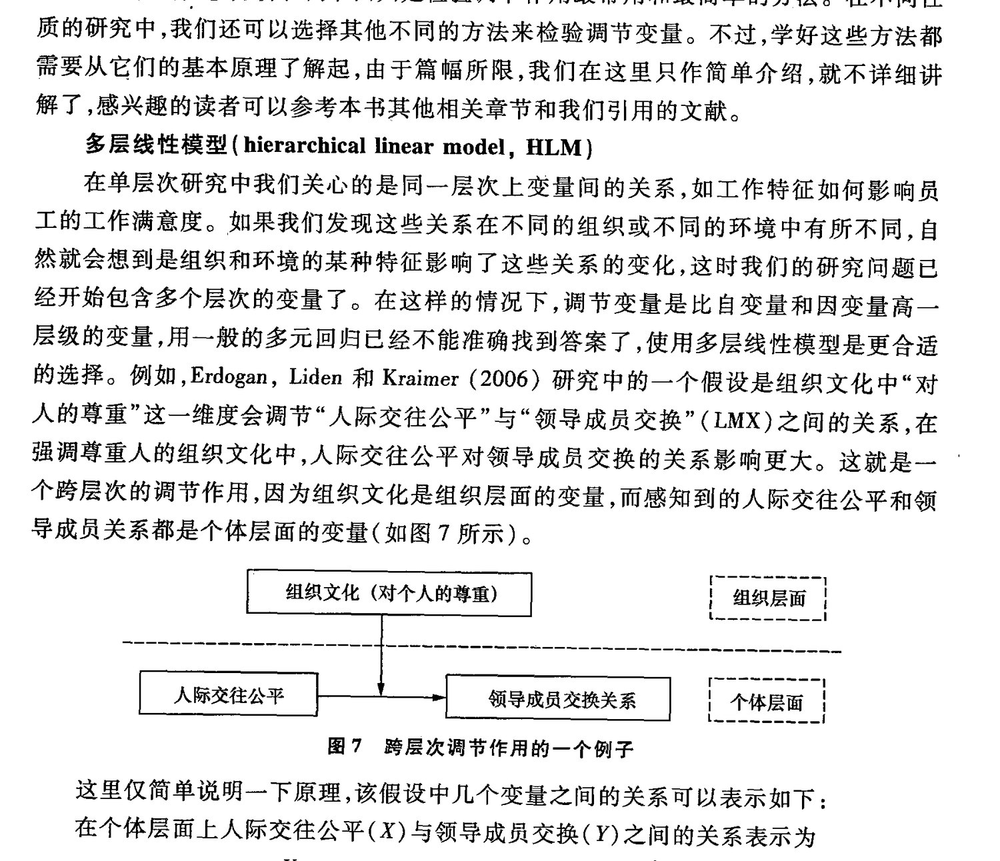
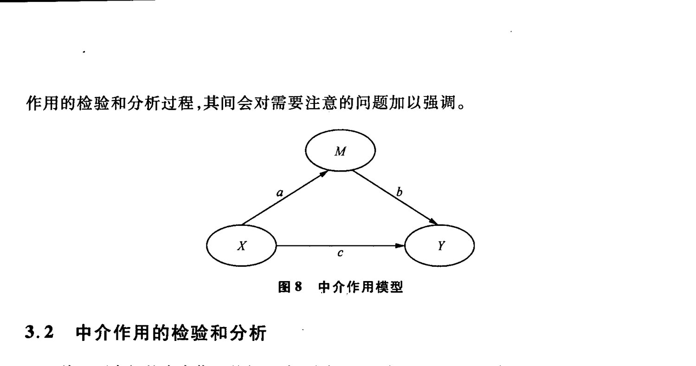
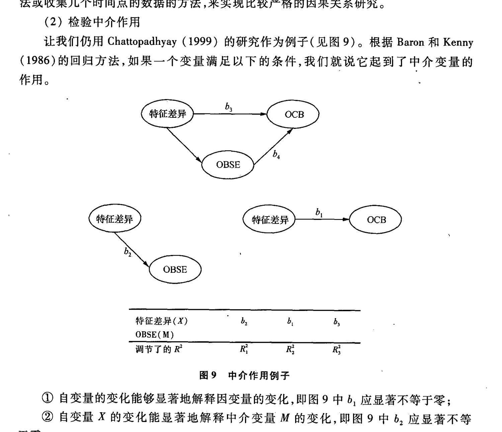
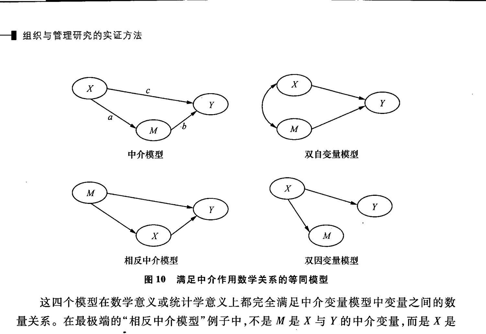

<!-- PDF页 326 -->

## 第十四章 调节变量和中介变量

qe SA He oe Wk调节变量和中介变量罗胜强 LR香港中文大学本章大纲

### 一、 调节变量和中介变量在研究中的作用

### 1.1 调节交量的理论意义

### 1.2 ”中介交量的理论意义二、 调节变量的原理和检验方法

### 2.1 调节作用的原理

### 2.2 调节作用与交互作用

### 2.3 ”检验调节作用的方法

### 2.4 ”多元调节回归中的统计功效问题

### 2.5 检验调节变量的其他方法=. 中介变量的原理和检验方法

### 3.1 中介作用的原理,

### 3.2 中介作用的检验和分析

### 3.3 ”中介作用检验中的问题四、 结语

### 一、 调节变量和中介变量在研究中的作用

科学研究的目的之一是发展理论来描述和解释事物之间的关系,所以自然需要弄清楚谁是原因谁是结果。我们对自变量、因变量的概念都很熟悉了,可是为什么研究者又引入了调节变量和中介变量? 它们对于我们的研究到底有什么帮助” 是否每一个模

<!-- PDF页 327 -->

型都需要用到调节变量和中介变量呢? 应该如何检验调节变量和中介变量? 我们希望通过本章的讲解能为读者思考这些问题提供一些参考。本章第一节将首先讨论这两种变量在研究中的理论意义;第二节将介绍调节变量的原理,并就容易混淆的调节作用与交互作用进行区分,之后,我们会介绍检验调节作用的具体步骤,以及调节作用检验中的统计功效问题,最后简单介绍检验调节作用的一些其他方法。在第三节中,我们将介绍中介变量的原理和检验步骤,并就目前研究中检验中介变量的过程中普遍存在的问题进行讨论。

在介绍中介变量和调节变量的原理和分析方法之前,我们首先讨论一下它们在我们的研究中到底有什么意义。我们的很多知识都是建立在变量间的相关关系或因果关.系的基础上的,随着研究的深入,一些简单的关系已经不能够提供足够的信息,也难以概括各种复杂的情况。所以,研究者们才提出了通过调节变量和中介变量的研究挖掘更多信息的方法。虽然调节作用和中介作用在社会科学研究中都有一定历史,但是研究者们有时还是会把它们混淆。比如,Findley 和 Cooper (1983) 本来是想解释调节作用的,却把性别、年龄,种族和社会经济水平解释为控制点与学术成就之间关系的中介变量。直到 20 世纪 80年代中才有研究者(Baron and Kenny, 1986)把调节变量作为研究方法中的一个问题正式提出来,并与中介变量加以区分。

早在20 世纪 20年代已经有心理学家开始认识到中介变量的重要性,并利用中介变量解释一个关系背后的原理和内部机制。Woodworth(1928) 在“刺激一反映”(S-R)理论的基础上提出了“刺激一机体一反应”(S-0-R)模型,说明了刺激对于行为的作用是通过有机体内部的转换过程而发生的,这个模型的关键是认识到一个活动的有机体介入了刺激与反应之间的作用过程,这可能是最早的一个比较严格的中介作用的假设。

调节变量所解释的不是关系内部的机制,而是一个关系在不同的条件下是否会有所变化。让我们把调节作用变成生活语言就很容易理解了,调节变量就是“视情况而定"“因人而异”。比如,同样是经历一次失败,对人产生的影响却是不同的。高自我效能感的人倾向于将失败归因于努力不足,于是,他们可能更加努力并坚持下去;而低自我效能者更容易将失败归因为能力不足,他们会更加怀疑自己的能力,导致放松努力或完全放弃。在这里我们看到,一次失败(自变量)对人行为(因变量)的影响随着自我效能感(调节变量)的不同而异,这时,我们就可以说自我效能感调节了失败与人的行为反应之间的关系。

上面简单介绍了研究者为什么要把中介变量和调节变量引入研究,下面我们就看看两种变量在我们的理论发展中究竟起到了什么作用。

调节变量的一个主要作用是为现有的理论划出限制条件和适用范围。我们千有限的认知能力所建立的理论往往都是有一定的局限的,只是在理论发展的初期很难完全

| WPREP TARE | 373

<!-- PDF页 328 -->

考虑到其所有的限制条件和适用范围。例如,牛顿经典力学曾经让人们以为,物理学的大厦已经完成,最多只要做一些修饰黑了,然而狭义和广义相对论的出现使人们认识到原有理论的适用范围是有限的,而“物体运动速度远低于光速"就成为牛顿运动定律能够适用的一个限制条件。

找到理论的适用条件和范围是我们对原有理论进行发展的一种方式。我们知道,现在的科学研究一般会以波普的证伪主义为原则来积累知识,并把一个理论是否存在证伪的可能性作为判断科学与非科学的依据。我们在自己的认知范围内得出一个结论,并希望它是普遍适用的,随着不断的研究,发现错了的就否定,没发现错的就保留。采用这样的方法有一个问题,就是一旦发现反例就要把原有的理论全部推翻。然而,有时并不是理论本身错了,而是没有界定理论背后的假设或是边界条件。后来, Lakatos (1970, 1978) 修正了波普的理论,提出精致的证伪主义,他认为理论有个内核,背后有辅助假设,外部有边界条件。当实证检验发现这个理论错了时,其理论核心是不应该轻易放弃的,可以改变辅助假设或增加限制条件。实在不行,最后才会放弃理论核心。

研究调节变量时,我们正是通过研究一组关系在不同条件下的变化及其背后的原因,来丰富我们原有的理论。这里的“不同条件"就是理论的适用范围和假设。所以,调节变量能够帮助我们发展已有的理论,使理论对变量间关系的解释更为精细。

相似地,中介变量也可以帮助我们发展既有的理论,但它是从另一方面实现这个功能的,即它可以解释变量之间为什么会存在关系以及这个关系是如何发生的。1.2 ”中介变量的理论意义

一般来说,当一个变量能够解释自变量和因变量之间的关系时,我们就认为它起到了中介作用。因此,研究中介作用的目的是在我们已知某些关系的基础上,探索产生这个关系的内部作用机制。在这个过程中,我们可以把原有的关于同一个现象的研究联系在一起,而使得已有的理论更为系统;另外,如果我们把事物之间影响的关系看作一个因果链,那么研究中介变量可以使自变量与因变量间的关系链更为清楚和完善,可以解释在自变量变化与因变量随之变化的中间发生了什么。所以,中介变量在理论上至少有以下两个重要的意义:(1) 中介变量整合已有的研究或理论; (2) 中介变量解释关系背后的作用机制。下面我们将具体讨论中介变量的这两个意义。

1. 中介变量整合已有的研究或理论

中介变量可以帮助我们把原来用来解释相似现象的理论整合起来。以 Wang, Law, Hackett, Wang 和 Chen (2005) 的研究为例来说明。以前有关变革型领导(transformational leadership) 的很多研究广泛支持了一个结论,即变革型领导可以提高下属的工作绩效(Lowe,Kroeck and Sivasubramaniam, 1996) 和组织公民行为(Podsakoff et al., 1990),但很少有人以实证研究说明中间的原因是什么。同时,也有不少研究发现领导成员交换关系(leader-member exchange,LMX)也会影响员工的工作绩效和组织公民行

<!-- PDF页 329 -->

为。Wang 等(2005) 的研究就是从这里出发,去分析变革型领导是如何对下属的工作行为产生影响的,他们发现领导成员交换关系正是该过程中起到中介作用的关键变量。值得我们注意的是,他们在选取中介变量时并不是随意选取的,而是有很强的理论依据。变革型领导和领导成员交换曾是领导研究先后提出的两个并行的研究思路,虽然他们对下属行为的影响如此相似,可是人们一直以为它们只是从不同的角度解释同一个问题愤了,没有人想到这两个理论之间是否存在这种关系,是否可以整合起来。Wang等(2005) 的研究用领导成员交换对变革型领导对下属的影响作出了解释,同时也整合了两个主要的理论,使我们的知识变得更为系统。

2. 中介变量解释关系背后的作用机制

我们对事物的理解一般是从粗糙到精细,从表面到本质的循序渐进的过程,不可能通过一个研究就说清问题的所有方面,解释清楚所有的原理。举个例子,最早提出学习型组织的概念可以追溯到 20 世纪 70年代美国哈佛大学的 Argyris 和 Schon (1978),但直到现在还没有完整的理论解释组织学习对组织影响的作用机制。1977年 Argyris 在《哈佛商业评论》上发表了《组织中的双环学习》,提出“组织学习”的概念,并于 1978年45 Schon 合著《组织学习:一种行动透视理论》,把“组织学习”分为三种类型:适应性学习、单环学习以及创造性学习。从 20 世纪 80年代开始,在企业界出现了推广和研究学习型组织的热潮,并逐渐风靡全球。美国的杜邦英特尔苹果电脑、联邦快递等世界一流企业,纷纷建立学习型组织。2001年,学习型组织理论在全世界掀起了一个实践的高潮,世界 500 强的许多公司都在试图建立公司长久的学习架构。在中国,不但企业提出建立“学习型组织”,而且各种“学习型政府"、“学习型社会"“学习型小区”的提法也各处可见。可是,很多组织在经历了热热闹闹的启动之后,发现很难入手或深入持久地开展下去,就渐渐地搁浅了,只留下一个理念。原因是什么呢? 人们虽然知道“组织学习”确实有利于组织的发展,虽然也学了一些成功企业的做法,但由于没有和弄清楚其作用机制,就无法在管理实践中真正发挥其优势。只有当我们清楚组织学习在组织中是如何发挥作用的整个原理时,才可以说真正建立了组织学习的理论。在这个过程中,中介作用的研究就是不可或缺的。

讲到这里,读者应该清楚了,我们在研究中引入中介变量和调节变量都是为理论的发展服务的。中介交量与调节变量都是在原有的两个变量关系基础上的进一步研究,只有两个变量间的关系已经存在时,我们才需要用中介变量讨论这个关系中间的机制,或者是用调节变量界定该关系变化的条件。

了解了两种变量的理论意义,还需要在具体的研究中能够操作。下面我们就分别介绍一下调节变量和中介变量的原理和检验方法。

| HERES PARE | 315

<!-- PDF页 330 -->

### 二、调节变量的原理和检验方法

### 2.1 调节作用的原理

什么是调节变量? 简单说,如果变量X 与变量了有关系,但是X与了的关系受第三个变量 Z 的影响,那么变量 Z 就是调节变量。调节变量所起的作用称为调节作用。

一个包含了调节变量的问题往往会这样陈述:“在什么样的情况下”或“对于哪些人”,了能够更好地预测了,或对了影响更大? 我们以 Kikrman, Rosen, Tesluk 和 Gibson(2004) 关于团队授权的研究为例。他们在文章的假设4(H,)提出,以往研究发现团队授权与团队绩效存在一定的正向关系,而随着虚拟团队的出现,这个关系不一定总是成立了。这个关系应该受另外一个调节变量一面对面交谈的次数的影响,于是他们这样提出研究假设:“团队中面对面交谈的次数会调节团队授权与团队绩效(硕客满意度)之间的关系。在面谈次数较少(虚拟程度高)的团队中,团队授权与硕客满意度之间的关系较强;而在面谈次数较多(虚拟程度低) 的团队中,团队授权与顾客满意度之间的关系较弱”。

在图1 中,“面对面交谈的次数"有一个往头指向“团队授权”影响“虚拟团队绩效”的箭头(注:这个调节变量既不是指向“团队授权”,也不是指向“虚拟团队绩效”,而是指向两者的关系),这就是调节变量的一般图表表达方式。调节变量影响自变量与因变量之间的关系,既可以是对关系方向的影响,又可以是对关系强度的影响。如果用数学语言,可以这样描述:如果变量了与变量X 的关系是变量 Z 的函数,Z 便称为X与7关系的调节变量。在组织研究中,调节变量可以是类别变量(如性别种族、教育水平),也可以是连续变量(如工资水平智力等)。

虚拟团队绩效Bl 面谈次数对团队授权与团队绩效关系的调节作用

举个例子,早期研究发现组织承诺的一种形式一情感承诺(affective commitment)会影响员工离职(tumover),情感承诺越高的人,跳槽的可能性就越小。但是这个关系是受外部环境的影响的,如果市场上没有其他的工作机会,就算承诺再低的人也不会跳楷,因为找不到工作。所以,工作机会就是一个调节变量。如果外面工作容易找,情感承诺(变量X)跟员工离职(Y)之间是负相关的,Y=a + OX (5 值是负数,而且在统计上是显著的)。如果外面工作不易找或者没有工作机会,与了之间就没有关系,Y=c+

<!-- PDF页 331 -->

dX (d 值在统计上是不显著的),如图2 所示。了{员工离职) 4 2 0 2 4 (情感承诺)图2 失业率对情感承诺与员工离职关系的调节作用那么,我们看看下面这个例子中是否有调节作用。女性购买商品的时候,喜欢去专门的离店购买,例如买鞋子要到鞋店,买衣服要园衣服店。男性则不同,他们更偏好“一站式”购物,希望能在一个地方买齐所有的东西。这里性别是否算一个调节变量呢?如果读者理解了前面所介绍的原理,就应该知道这里是没有调节作用的。在这个例子中,性别直接影响购买方式,是“主效应”(main effect),根本不存在交互作用 (interaction effect)。从这里我们也可以看出,调节变量的概念是建立在另外两个变量的关系之上的。如果没有两个变量的关系作为前提,也就不必讨论第三个变量的“调节作用”了。有一点我们要注意的,当研究中有调节变量的时候,在研究假设中一定要说清楚,到底这个调节变量的作用是什么、具体如何影响变量的关系。研究假设的提出应该尽量准确,我们不应该笼统地假设“2 在与Y的关系中起到了调节作用”,应该具体说明Z 是如何调节XY的关系。例如,“当2Z高的时候,X 会对Y有正面的影响;当Z低的时候,X会对了有负面的影响”。fi 20, Martins, Eddleston 和 Veiga(2002) 研究了工作与家庭冲突和职业满意度这一关系中的调节变量。以前的研究都认为工作与家庭冲突越大,职业满意度应该是越差的。但 Martins 等人发现,对于女性来说,这个关系在任何年龄段都显著。但是对于男性来说,这个关系仅在职业生涯后期才成立,也就是男性年轻的时候,工作与家庭溃突对职业满意度不会有影响。我们看到,在这个研究中,性别就是一个调节变量,因为对于不同性别的群体(调节变量),工作与家庭冲突(自变量)与职业满意度(因变量)之间的关系也不同{见图3)。调节变量从原理上看很简单,但在应用时要特别注意它在理论上的含义,以及调节变量、自变量和因变量之间的关系。我们下面就会讲到调节作用与交互作用的区分,读者会发现,它们虽然在统计上的检验方法相同,但两者概念上是不同的。i WPEREPARE [au

<!-- PDF页 332 -->

<>图3 性别对工作家庭冲突与职业满意度之间关系的调节作用2.2 调节作用与交互作用交互作用是指:两个变量(X, 和X,)共同作用时对了的影响不等于两者分别影响了的简单数学和。调节变量是指:一个变量(X,)影响了另外一个变量(X,)对了的影响。在交互作用分析中,两个自变量的地位可以是对称的,可以把其中任何一个解释为调节变量;它们的地位也可以是不对称的,只要其中有一个起到了调节变量的作用,交互效应就存在(Aiken and West, 1991)。但在调节效应中,哪个是自变量、哪个是调节变量是很明确的,是由理论基础所决定的,在一个确定的模型中两者不能互换。举例来说,Colella 和 Varma (2001) 的研究表明,员工的工作表现会影响上下级关系,员工是否残疾也会影响上下级关系,这两者加起来对上下级关系的影响,要大于他们各自对上下级关系的影响的总和。一个既有残疾而表现又很差的员工是极难和上级建立良好的上下级关系的,这就是交互作用。相反,调节作用可以是不完全对称的。例如员工的性别可能是员工工作表现对上下级关系影响的调节变量。这时,性别不可以跟员工的表现互换。我们不可以说员工的表现也调节了性别对上下级关系的影响,因为“性别调节表现一关系”的理论可能跟“表现调节性别一关系”的理论不一定一样,性别可能根本就对上下级的关系没有影响。在统计学上,两个变量的交互作用和调节变量的作用是用这两个变量的乘积来代表的。Y = By + B,X, + BX, + B,X,X, (1) X, 对了的影响是B,,X, 对了的影响是B,,B, MB, ROT ERMAN KA,B,(X, xX,的系数)反映了交互作用和调节作用的大小。为什么交互作用和调节作用可以用外, 和X, 的乘积来代表呢?在公式(1)中,对Y关于X, 求偏导数,可以得到:部 7 Ps + Bak (2)也就是说,X, 对了的影响是取决于X, 的值的,而这正是调节变量和交互作用的定义。所以,调节作用和交互作用在统计上的检验方法是一样的。如果乘积项的系数 B,显著,就意味着调节变量存在或者交互作用存在。这个方法我们会在后面具体讨论。通常情况下,交互作用可以分为两类:增强型交互作用 (reinforcement interaction

<!-- PDF页 333 -->

effect) 和干扰型交互作用(interference interaction effect)。图4 表示了这两种作用人®: y Y [%)=3] Y=25+3.5.X, 60 60 45 45 [=3] Y=25+05x, 30 30 | 15 Pal] Y=15 +2.5% 1s Ht =1] y=15+254%! 1 1 0 5 10 x 0 5 610 xX增强型的交互作用干扰型的交互作用图4 增强的交互作用与干扰的交互作用对于增强的交互作用,随着 X, 变大,X, 对了的正向影响越来越强;对于干扰的交互作用,随着 X, 变大,X, 对了的正向影响逐渐减弱。同样,X, 对于 X, 与Y的关系的影响也可以用相似的方法分析。ET =f, + BX, 我们可以看到,与了的线性关系的斜率为 B, + BX,» BDL LB,和ps 的大小和正负,决定了交互作用是增强的还是干扰的。组织管理研究中调节作用比交互作用更常用一些,下面我们就详细介绍一下检验调节作用的具体步又。2.3 ”检验调节作用的方法让我们首先用一个例子来解释调节作用的分析问题。有研究已经发现“员工的专业尼景与组织的业务是否匹配”会影响“员工对于组织的认同”(Johnson,, Morgeson, Ilgen, Meyer and Lloyd, 2006)。虽然“匹配”(fit) 是一个复杂的变量,但为了简化讨论,让我们首先假设研究人员已经有一个很好的“匹配”的量度。假如我们根据相关理论再提出一个假设:专业匹配与组织认同之间的关系还受性别的影响,男性中这种关系较强,女性中并不显著。这时,自变量是“员工的专业背景与组织的业务匹配”(X) 的程度,因变量是员工对组织的认同(7),调节变量是性别(男或女)。在研究这一类问题的时候,很多研究人员都会把样本分成两组,男性样本作一个回归分析,女性样本作另一个回归分析。如果结果如下:男性样本: Y=2.5 +0.15X (样本数 N, =128)女性样本: Y=1.3+0.09X (样本数 N, =96)研究者就会认为数据已经验证了性别作为调节作用的假设了。但是,这里还有两© ”该例选自 Kutner 等(2005),第307页。第十四章 | WHR Ap ARE | 319

<!-- PDF页 334 -->

个问题存在。第一,我们怎么知道在男性样本中“匹配”对“组织认同”的影响(5, = 0.15)在统计上来说真的是大于女性样本中的系数(56, =0.09)呢?严格来说,我们要在统计上用 6, ~ 6,(0.15 -0.09)来验证 H。:B, -B, =0。第二,以上的分组检验使原来的PERN =224 拆开成为两个样本。而在女性样本中样本数仅为 N, =96。大家都知道对于这人么小的样本数来讲,统计功效(statistical power)将会很低。因为这两个原因,检验调节作用最普遍的方法是多元调节回归分析 (moderated multiple regression, MMR)。虽然有人会用分组的方法来验证调节变量,但我们的建议是除非没有选择(例如特别的实验设计,如重复量度设计(repeated measure design) 等),否则用调节回归分析来验证调节作用总比用分组验证的方法好。下面我们就看一下用回归的方法检验调节作用的具体步骤。(1) 用虚拟变量(dummy variable) 代表类别变量如果自变量或调节变量中有一个是类别变量,那么第一步首先是将类别变量转换为虚拟变量。所需的虚拟变量的数目等于类别变量的水平个数减 1。例如,一个培训效果的研究中,被试被随机地分配到三个教学组中的一组(如实践操作教学组.小组讨论教学组和控制组),这样只需要构造两个虚拟变量,就可以代表所有的类型了。研究者可以根据不同的研究问题选择不同的编码方法。需要注意的是,不同的编码方法会影响最后的结果。我们建议读者参考 West 等(1996)的文章,它详细讨论了编码的系统和在实际操作中应该如何使用。最简单的编码方法是用虚拟诡量 D, (“实践操作教学组”, D, =1;“非实践操作教学组”,D, =0)和 D,(“小组讨论教学组”, D, =1;“非小组讨论教学组”, D, =0)。当 D, MD, 都是0 时,就代表是“控制组”了。(2) 对连续变量进行中心化或标准化用回归的方法检验调节变量的一个重要步骤是把自变量和调节变量中的连续变量进行整理。一些统计学家建议把这些变量进行中心化,即用这个变量中测量的每个数据点减去均值,使得新得到的数据样本均值为0 (Aiken and West, 1991: 11),因为预测变量和调节变量往往与它们的乘积项高度相关。中心化的目的是减小回归方程中变量间多重共线性(multicollinearity) 的问题。当然,也可以对连续型的自变量和调节变量进行标准化(如使用z分数),作用基本相同。(3) 构造乘积项构造乘积变量时,只需要把经过编码或中心化(或标准化)处理以后的自变量和调节变量相乘即可。、Y=b,+bX+bM+b,XxM (EX AMM AIMEE) (3)如果使用了虚拟变量,那么每一个虚拟变量都应该有一个相应的乘积变量(如果用了一个虚拟变量表示包含两个水平的一个类别变量,那么就有一个乘积项;如果用了两个虚拟变量表示包含三个水平的一个类别变量,那么就有两个乘积项。) Y = by +bX+bD, + b,D, + b,X x D, + b,X x D, (4)

<!-- PDF页 335 -->

(注:D, AD, 皆为虚拟变量。D, =1 代表是“实践操作教学组”,D, =0 代表是“非实践操作教学组”;D, =1 代表是“小组讨论教学组”,D, =0 代表是“非小组讨论教学组”) (4) 构造方程构造出乘积项后,把自变量、因变量(这里要使用未中心化的自变量和因变量)和乘积项都放到多元层级回归方程中就可以检验交互作用了。这时,我们最关注的是乘积项的系数是否显著。如果显著,就可以说明调节作用的存在了。例如,在(4)式中,如果b, 是统计上显著的话,就代表测试者是否在“实践操作教学组”会影响X与了的关系,也就是说“实践操作教学"调节了培训的效果。需要指出的是,既然检验调节作用的时候,只需要看乘积项就可以了,为何回归方程中还要有前面“主效应”的项目呢?主要原因是在回归方程中凡是有二阶变量的话,所有的一阶变量都应该被包括。有时有比较复杂的情况,会有三重交互作用(three-way interaction),那在回归方程中就会包括 XX),XX,,X,,X,X,,X,X,,X,X,,们,了,XX,但是这样的情形很少,因为很不容易显著。仍用前一节中的例子来说明用层级回归检验调节作用的步骤(见图5)。ARE =组织认同M, M, M,控制变量 0.13 0.08 0.09专业匹配(X,) 0.16° 0.11性别(X,) 0.24°° 0.19" 显著调节作用X, xX, (交互作用)模到R00 0357 0图5 用层级回归检验调节作用在这里,我们关注的是调节作用的回归系数8 =0.23 是否显著(5 服从:分布),也可以通过 R? 来检验,如果 AR? 显著(AR? 服从分布),也能证明调节变量存在。(5) 调节作用的分析和解释当检验中发现一个显著的调节作用的存在时,下一个重要的步骤就是分析它的作用模式。这时,如果调节变量和自变量都是定类变量,可以在不同的组中分别计算因变量的均值,然后用得到的值来做图,直观地表示出调节作用的模式。第二种方法是在按 |调节变量所分的不同组中,检验自变量对结果变量回归的斜率。但是当调节变量是连续变量的时候,我们如何划分样本呢? 一般来讲有两种方法: QD 找到调节变量的中位数,对低于中位数和高于中位数的两组分别回归,来观察自变量与因变量关系的不同作用模式。Em | WIRED ERR | 321

<!-- PDF页 336 -->

@ 另一种是找到调节变量的均值,然后在均值左右各一个标准差的区域之外各作为一组(即是大于对+o 的数据作为一组,少于姥-o 的数据作为男一组),在两组中分别回归。需要注意的是,我们在这里分组分析的目的仅仅是为了直观地表示调节变量是如何作用的,而不是为了“检验”调节作用存在与否,检验调节作用的步骤已经在前面的调节回归中完成了。”分组分析时,可以像图6 这样表示出来,以便清楚地比较在调节变量不同水平上,自变量与因变量关系的大致趋势有什么不同。Y | 组织认同60 45 男性0 女性15 0 5 10 X, yk pcm图6 调节作用方式的表示2.4 ”多元调节回归中的统计功效问题有经验的研究者都知道,调节作用的效应常常比较小,在显著性检验中不太容易被发现,所以在检验调节作用时,对于统计功效(statistical power) 的要求就更高了。Aguinis (1995) 对多元调节回归中可能存在的统计功效的问题作了讨论,对统计功效构成影响的因素有: (1) 样本大小。大家都知道,当样本较小时,不容易发现规律。在调节作用的研究中,所需样本的多少取决于调节作用的大小以及总体作用(自变量、调节变量、乘积项)的大小。一般来说,这些作用越小,需要的样本就越大。这样,在资料收集之前研究者就应该首先对调节作用的大小作一个估计,比如,可以通过回顾相关的研究来估计影响作用的大小。一般来说,因为已经控制了主效应,所以调节作用的影响程度都是很小的,一般 AR’ 达到 0.10 已经算很大了。(2) 变量的选择。当调节变量是类别变量时,如果不同群体的样本数量差异太大,会减小统计功效;不同群体中的测量误差如果有较大差异,也会减小统计功效。当调节变量是连续变量时,个体变量(无论是预测变量还是调节变量)的测量信度很重要,它的测量误差也会在很大程度上减小统计功效。最后还要考虑因变量,如果因变量的测量

<!-- PDF页 337 -->

信度较低,它与自变量之间的关系就会减小,因此降低了AR? 的值和统计功效(Aguinis, 1995),:总结上面两点,为了使统计功效更强,研究者在作研究设计时就应该采用一些方法尽量避免这些影响,如通过理论(必要时也可以用实验)预测调节作用的大小,再结合其他作用估计所需要的最小样本;调节变量是类别变量时,尽量保证各类中的样本大小相同或接近;如果因变量有几种测量方法,尽量选择测量信度较高的方法和测量敏感度较高的方法等。2.5 检验调节变量的其他方法上面讲的方差分析和调节回归是检验调节作用最常用和最简单的方法。在不同性质的研究中,我们还可以选择其他不同的方法来检验调节变量。不过,学好这些方法都需要从它们的基本原理了解起,由于篇幅所限,我们在这里只作简单介绍,就不详细讲解了,感兴趣的读者可以参考本书其他相关章节和我们引用的文献。多层线性模型(hierarchical linear model, HLM)在单层次研究中我们关心的是同一层次上变量间的关系,如工作特征如何影响员工的工作满意度。如果我们发现这些关系在不同的组织或不同的环境中有所不同,自然就会想到是组织和环境的某种特征影响了这些关系的变化,这时我们的研究问题已经开始包含多个层次的变量了。在这样的情况下,调节变量是比自变量和因变量高一层级的变量,用一般的多元回归已经不能准确找到答案了,使用多层线性模型是更合适的选择。例如,Erdogan,Liden 和 Kraimer (2006) 研究中的一个假设是组织文化中“对人的尊重"这一维度会调节“人际交往公平"与“领导成员交换” (LMX)之间的关系,在、强调尊重人的组织文化中,人际交往公平对领导成员交换的关系影响更大。这就是一个跨层次的调节作用,因为组织文化是组织层面的变量,而感知到的人际交往公平和领导成员关系都是个体层面的变量(如图7 所示)。图7 跨层次调节作用的一个例子这里仅简单说明一下原理,该假设中几个变量之间的关系可以表示如下:在个体层面上人际交往公平(X)与领导成员交换(Y)之间的关系表示为Yi = By +ByXy+ ey e; ~ N(0,S’) (j,i分别表示第j个组织的第i个个体; s,为随机误差)再根据我们前面讲过的调节作用的原理,组织文化(殉) 作为调节变量会影响上面| | 调节变量和中介杰量 |323

<!-- PDF页 338 -->

方程中的B。 MB, HUA: Bo = Yoo + Yorw; + Uo; By = Yo + Yuw + wj (kpy为随机误差)

用一般的层级回归对上面的过程分别进行分析存在很多问题(请参考本书相关章47) HLM 可以把这两个层次的作用同时放在一起分析,检验高层次变量对低层次关系的调节作用。

结构方程模型{structural equation model, SEM):

用 SEM 分析调节变量的过程比较复杂。最主要的问题是主变量(X) 和调节变量(2)都有量度的指标(measurement indicator),但是调节变量项(Xx2Z)却没有量度的指标。在 SEM 分析中是不可以有些变量有指标,有些变量没有指标的。所以用 SEM 来测验调节变量的关键就是模拟调节变量项的量度指标。这个过程有很多不同的处理方法,感兴趣的读者可以参考以下文章(Cortina, Chen and Dunlap, 2001; Jéreskog and Yang, 1996; MacKinnon, Lockwood, Hoffman, West and Sheets, 2002; Ping, 1995, 1996a),

以上只是一个关于调节变量基本原理和检验方法的简单介绍,有学者也不断地提出新的补充,建议读者可以以此为引子,参考其他讨论调节变量问题的文章,了解有关该方法的最新议题。

### 三、中介变量的原理和检验方法3.1 中介作用的原理

简单说,凡是影响Y,并且X是通过一个中间的变量有对Y产生影响的,就是中介变量。举个例子,在 Chattopadhyay (1999) 的研究中,特征的差异(demographic dissimilarity) 9y X,OCB 为了, OBSE (organization-based self-esteem, 基于组织的自苯)为 MM。如果组织中个体间的特征有很大的差异,整个小组比较混乱,那么 0CB 就会受到影响,小组成员会有较少的角色外行为(extra role behavior),因为这样的成员 OBSE 较低。

中介变量可以用来解释现象,在研究中起着很重要的角色。中介变量可以分为两类:一类是完全中介 (full mediation),男一类是部分中介(partial mediation)。完全中介就是对了的影响完全通过 M,没有 MM 的作用,X 就不会影响了;部分中介就是X对了的影响部分是直接的,部分是通过M 的。X、Y和M 之间的关系可以用路径图简单地表示为图8,当c=0 时,M 是完全中介变量,当c >0 时,M 是部分中介变量。

中介变量目前较有争议的一个问题,研究中如果不注意也会很容易用错。 我们认为,一些关于中介变量的研究之所以不太严谨是因为没有和弄清楚中介变量的真正含义,也没有理解中介变量的检验方法在提出时的研究背景。下面我们就具体介绍一下中介

*

<!-- PDF页 339 -->

作用的检验和分析过程,其间会对需要注意的问题加以强调。-图8 中介作用模型-~ ”3.2 中介作用的检验和分析从上面介绍的中介作用的概念中,我们可以看到两个关键:第一,X 和了之间存在因果关系;第二,MM 是这个因果关系中间的媒介,M 受到的影响之后,再影响了,因此传递了XX的作用。这个过程并不复杂,我们现有的检验中介作用的方法正是通过验证这几个因果关系来实现的。最常用也是最传统的检验中介变量的方法是 Baron 和 Kenny(1986)的方法。如果仪仅简单从数据关系上来讲是三部曲: (1) Be a my ae (2) 自变量影响中介变量; (3) 控制中介变量后,自变量对因变量的作用消失了,或是明显地减小了。大多数研究者都记得这几个步骤,但在数据关系的背后是需要有一些重要的前提的。所以,规范地说,检验中介作用的过程应该包括以下几个步台。(1) 建立因果关系中介作用意味着一个因果链——中介变量由自变量引起,并影响了因变量的变化(Kenny, Kashy and Bolger, 1998)。因果关系是建立中介作用中最重要却又常常在研究中被忽视的一个环节,这个环节的缺失会给研究带来很大的问题,我们会在本节的第三部分详细讲解。要建立因果关系,必须首先满足一些条件和标准。18 世纪哲学家 Hume 提出了表示一个因果关系的八个必要条件,后来研究方法中常常引用到其中的三个:原因和结果在时间和空间上是连续的,原因和结果在时间上有人先后次序,它们之间有恒定的联系。后来,19 世纪的暂学家 Mill 又提出了三个验证因果关系的必要条件:在时间上,原因发生在结果之前;原因和结果存在相关关系;对于结果不存在其他可能的解释(Cook and Campell, 1979; Shadish et al., 2002),将这些原则用在我们的研究中,即通过研究设计来验证下面的两个条件:首先,两个变量X与Y之间存在因果关系,如果与Y之间是完全没有关系的,接下来的步骤也就不用做了。总二四前 | WARE EARE | 325

<!-- PDF页 340 -->

其次,这种关系不是虚假的相关。如果两个变量之闻的相关关系并不是因为它们中的一个影响了另一个,而只是因为它们同时都受了第三个变量的影响,而我们却没有把这个变量放入我们的分析中,我们就称它们是虚假相关。一般只有用严格的实验研究才可能说明两个变量之间是因果关系而不是虚假相关。不过, Wegener 和 Fabrigar. (2000) 也提出,即使用非实验的研究,人们也可以通过把其他变量的作用控制掉的方法或收集几个时间点的数据的方法,来实现比较严格的因果关系研究。(2) 检验中介作用让我们仍用 Chattopadhyay (1999) 的研究作为例子(见图9)。根据 Baron 和 Kenny (1986)的回归方法,如果一个变量满足以下的条件,我们就说它起到了中介变量的作用。. > bs Cocs) | ». OBSE(M)调节了的民 R R R图9 中介作用例子. © 自变量的变化能够显著地解释因变量的变化,即图9 中 Ob, 应显著不等于零; @ 自变量X 的变化能显著地解释中介变量 M 的变化,即图9 中 b, 应显著不等FB; @ 4H PAA, BA BE a (b,) EES, Me BE (be 6),同时 b, 应显著不等于零。这项结果表明了XX 对Y 的影响完全是由于放(或者主要是由于 M). MR b, 等于零,M 就叫做完全中介变量(full mediator);如果 b, 不等于零但小于6b,,M 就叫做部分中介变量(partial mediator);如果 6, 不小于 5,,M 作为中介变量的假设就不能成立了。;以上就是 Baron 和 Kenny(1986) 的方法,也是研究者使用最多的一种方法。如果不看前面因果关系的前提,而仅仅看数据上检验中介作用的几个步骤,读者发现什么问

<!-- PDF页 341 -->

, 题了吗? 我们可以看到,只要A放跟Y的相关系数比革跟Y的相关系数大,用上述的方法

检验,我们就很容易得到“5; 等于零,或5, 不等于零但显著地小于 b,”的结果。这样就很容易得出错误的结论了。

其实关于中介变量的验证,存在很多争议。例如 MacKinnon 等(2002) 总结了14种不同的方法来验证中介变量。他们用了蒙特卡罗式模拟测验了各种不同的方法,结论是传统的 Baron 和 Kenny (1986) 方法的统计功效很低。在总结了 14 种不同的方法后,他们建议的方法是直接测验“自变量到中介变量的关系”和“中介变量到因变量的关系”。

.

在上图中,这就代表了直接测验假设 H。:ab =0。这个方法的逻辑是如果“自变量到中介变量的关系”(即参数 a)是零,或者是“中介变量到因变量的关系”(即参数 5)是零,ab 的乘积都是零。相反,如果a Mb HRAKRBS BUR oe Mb 都不是零,也就是说MM是X和YY的中介变量。至于详细的步骤,因为篇幅的关系,我们就不详谈了,请读者自行参阅 MacKinnon 等(2002) 的文章。另外,有两位专家的网址都对中介变量讲得很详细。第一位是 David A. Kenny (http://davidakenny. net/cm/mediate. htm),第二位是 David P. MacKinnon(http://www. public. asu. edu/ ~ davidpm/ripl/mediate. htm)。有兴趣的读者可以详细参考。, 3.3 ”中介作用检验中的问题

大家还记得在本节的开头提到了中介作用检验的过程存在一些争议和问题,下面我们就简单讨论一下这些问题,希望能帮助读者在有关中介变量的研究中选择更恰当的研究设计。

从前一部分的讨论我们看到,无论用什么方法检验中介变量,都存在一个同样的问题,即一个同样的统计结果背后存在着很多个可能的模型。其实, Stone-Romero 和 Roso-. pa (2004)和Law, Wong 和Huang (2005)都曾经指出,不同的建构模型可以产生完全一样的相关矩阵,因而产生完全一样的分析结果。例如,图10 中的四种 XM 与了的关系,所产生的站,M 与了的相关系数和相关和矩阵是完全一样的。无论大家用 MacKinnon等(2002)的 14 种验证中介变量方法的哪一种,得出的结果都是完全一样的。

| HERE EARS | 327

<!-- PDF页 342 -->

中介模型双自变量模型相反中介模型双因变量模型图10 满足中介作用数学关系的等同模型

这四个模型在数学意义或统计学意义上都完全满足中介变量模型中变量之间的数量关系。在最极端的“相反中介模型"例子中,不是 M 是X与Y的中介变量,而是X是M 与了的中介变量。然而,如果我们假设“M 是与Y的中介变量”,用 MacKinnon 等(2002) 的 14 种验证中介变量的方法随便哪一种,验证的结果都会是数据支持“中介模型"一一即 M 是中介变量。

因为存在等同模型,所以假如仅仅从数据的统计关系上就推导出中介作用的模型,我们就会很容易被数据所蒙责。一些研究者就犯了这样的错误,当找到了几个变量之闻的关系能满足上面几个回归方程中检验的要求时,就下结论说找到了中介变量。这样的错误结论对于我们积累新的知识是很危险的。他们这样做是因为没有理解 20 世纪 80年代中介作用提出时的背景。正如我们在本章开头说过的,Judd 和 Kenny(1981)最早提出用回归的方法检验中介作用时是用在实验中的。他们已经通过实验找到了引起了以及X引起 M 的证据,所以他们需要验证的仅仅是 M 与Y的关系,这是可以通过几步回归实现的。所以,再强调一次,中介作用的含义是“对了的影响是通过 M”的,这也是我们在本节开头就一直强调建立“因果关系”的重要性的原因。建立变量之间的因果关系是排除其他等同模型的唯一方法。

满足因果关系的条件往往需要严格的实验才能够实现。相比起来,我们组织管理的很多研究都是采用在同一时间点收集所有数据的调查方法,这样找到的关系只是相关关系,它只能用来检验理论假设中的因果关系,而不能成为确切证据支持谁是原因谁是结果。例如,组织承诺与工作满意度的关系以及感知的工作特征与工作满意度的关系。我们会发现,无论选择哪个方向的因果关系,似乎都可以找到相应的合理的逻辑推理。

所以,如果在研究中难以实现用严格的实验方法来验证因果关系,就首先要有理论基础,成熟理论的作用是帮助我们建立可信的因果关系,这比根据逻辑推理随意建立的

<!-- PDF页 343 -->

因果关系要更为可靠。其次,才是用统计检验的方法看数据是否与我们的假设模型相匹配,这样才能减小我们犯错误的可能性。所以,研究中不能从统计检验结果推到理论,要先有理论,然后用统计工具来检验理论。统计方法只能用来检验所假设的模型的,不能用来反推模型。4 8. 管理理论日区复杂,过往管理的知识往往是自变量与因变量的单一关系,现在很多管理的模型都包括中介变量和调节变量。最近,更有学者提出“被中介的调节作用” (mediated moderation) 和“被调节的中介作用”(moderated mediation) (Muller, Judd and Yzerbyt, 2005; Edwards and Lambert, 2007)。我们只希望强调的是,统计工具日新月异,研究人员必须坚持,所有的统计方法都只是我们的工具。更重要的是理论的基础和严讶的科学态度,这样才可以好好地利用这些工具来帮助我们发展畦新的、实用的管理科学模型。参考文献

Aguinis, H. (1995). Statistical power problems with moderated multiple regression in management research. Journal of Management, 21, 1141—1158.

Aiken, L.S. and West, S. G. (1991.) Multiple Regression: Testing and Interpreting Interations, Newbury Park; Sage.

Argyris, C. and Schén, D. A. (1978). Organizational Learning; A Theory of Action Perspective. Reading, MA; Addison-Wesley.

Baron, R. M. and Kenny, D., A. (1986). The moderator-mediator variable distinction in social psychological research; Conceptual, strategic, and statistical considerations. Journal of Personality and Social Psychology, 51, 1173—1182.

Chattopadhyay, P. (1999). Beyond direct and symmetrical effects; The influence of demographic dissimilarity on organizational citizenship behavior. Academy of Management Journal, 42, 273—287.

Colella, A. and Varma, A. (2001). The impact of subordinate disability on leadermember: exchange relationships. Academy of Management Journal, 44, 304—315.

Cook, T. D. and Campbell, D. T. (1979). Quasi-experimentation; Design and Analysis Issues for Field Settings. Chicago; Rand McNally.

Cortina, J. M., Chen, G. and Dunlap, W. P. (2001). Testing Interaction Effects in LISREL; Examination and Illustration of Available Procedures. Organizational Research

| 调节变量和中介交量 | 329

<!-- PDF页 344 -->

Methods, 4(4): 324—360.

Edwards, J. R. and Lambert, L.S. (2007), Methods for integrating moderation and mediation; A general analytical framework using moderated path analysis: Psychological Bulletin, 12(1), 1—22.

Erdogan, B., Liden, R.C. and Kraimer, M.L., (2006). Justice and leader-member exchange; The. moderating role of organization culture. Academy of Management Journal. 49, 395—406.

Johnson, M. D., Morgeson, F. P., Ilgen, D. R., Meyer, C. and Lloyd, J. R. (2006). Multiple professional. identities; Examining differences in identification across workrelated targets. Journal of Applied Psychology, 91, 498—506.

Joreskog, KG and Yang, F. (1996). Nonlinear structural equation models; The Kenny-Judd model with interaction effects. In Marcoulides, GA and Schumacker, RE (eds.), Advanced Structural Equation Modeling Techniques; 57—88, 57—88. Hillsdale, NJ; Lawrence Erlbaum.

Kenny, D. A, Kashy, D. A. and Bolger, N. (1998). Data analysis in social psychology. In D. T. Gilbert and S. T. Fiske (eds.), The Handbook of Social Psychology, Vol. 2, 4th ed.: 233—-265. Boston, MA; McGraw-Hill.

Kirkman, B. L., Rosen, B., Tesluk, P. E. and Gibson, C. B. (2004). The impact of team empowerment on virtual team performance; The moderating role of face-to-face interaction. Academy of Management Journal, 47, 175—192.

Kutner, M.H., Nachtsheim, C.J., Neter, J. and Li, W. (2005). Applied Linear Statistical Models, Sth ed., Boston; McGraw Hill.

Law, K.S., Wong, C.S. and Huang, G. (2005). On the problem of testing mediators using cross-sectional correlational data. Academy of Management Meeting, August 5—10, Honolulu, Hiwaii, U.S. A.

Levin, J.R. (1975). Determining sample size for planned and post hoc analysis of variance comparisons. Journal of Educational Measurement, 12: 99—108.

Lakatos, I. (1978). Science and Pseudoscience. In J. Worrall and G. Currie (eds.), Philosophical Papers, Volume 1; The Methodology of Scientific Research Programmes; 1—7. Cambridge: Cambridge University Press.

Lakatos, I. (1970). Falsification and the Methodology of Scientific Research Programmes. In I, Lakatos and A. Musgrave (eds.), Criticism and the Growth of Knowledge 91—196. Cambridge; Cambridge University Press.

Lowe, K. B., Kroeck, K: G.. and Sivasubramaniam, N. (1996). Effectiveness correlates of transformational and transactional leadership; A meta-analytic review of the MLQ lit-

<!-- PDF页 345 -->

erature. Leadership Quarterly, 7, 385—425.

MacKinnon, D. P., Lockwood, C. M., Hoffman, J. M.,West, S. G. and Sheets, V. (2002). A comparison of methods: to test mediation and other intervening variable effects. Psychological Methods, 7, 83—-104.;

Martins, L. L., Eddleston, K. A. and Veiga, J. F. (2002). Moderators of the relationship between work-family conflict and career satisfaction. Academy of Management Journal, 45, 399—409.

Muller, D., Judd, C.M. and Yzerbyt, V. Y. (2005). When moderation is mediated and mediation is moderated. Journal of Personality and Social Psychology, 89 (6), 852—863.

Ping, R.A. (1995), A parsimonious estimating technique for interaction and quadratic latent variables. Journal of Marketing Research, 32, 336—347.

Ping, R. A. (1996a), Latent variable interaction and quadratic effect estimation; A two-step technique using structural equation analysis. Psychological Bulletin, 119, 166—175.

Podsakoff, P. M., MacKenzie, S. B., Moorman, R. H. and Fetter, R. (1990). Transformational leader behaviors and their effects on followers’ trust in leader, satisfaction, and organizational citizenship behavior. Leadership Quarterly, 1, 107—142.

Shadish, W., Cook, T. and Campbell, D. (2002). Experimental and Quasi Experimental Designs for Generalized Causal Inference. Boston, MA; Houghton-Mifflin.

Stone-Romero, E. and Rosopa, P. J. (2004). Inference problems with hierarchical multiple regression-based tests of mediating effects. Research in Personnel and Human’ Resources Management, 23, 249—290.

Wang H., Law, S. K, Hackett, R., Wang, D. and Chen, Z. (2005). Leader-member exchange as a mediator of the relationship between transformational leadership and followers’ performance and organizational citizenship behavior. Academy of Management Journal, 48, 420—432.

Wegener, D. T. and Fabrigar, L. R. (2000). Analysis and design for nonexperimental data; Addressing causal and noncausal hypotheses. In H. T. Reis and C. M. Judd (eds.), Handbook of Research Methods in Social and Personality Psychology: 412—450. New York; Cambridge University Press.

Woodworth, R. S. (1928). Dynamic psychology. In C. Murchison (ed.), Psychologies of 1925. Worcester, MA; Clark University Press.

: SiMe | weeePenee | 337

