# 组织与管理研究的实证方法（2008版）

> 来源：`组织与管理研究的实证方法_12024813(OCR).pdf`。
> 整理原则：严格按原书顺序转写，仅修复OCR识别错误、断行、字符粘连和明显排版噪声；不作概括、重写或结构化总结。
> 图像：封面不保留；原书中的必要图、表和依赖版式的信息以图片保留。
> 定位：每一PDF页均保留可搜索的页码锚点。

## 内容索引

- [引言：如何在一流期刊上发表管理学研究论文？](#pdf-page-15)（PDF页 15）
- [第一部分 科学研究的目的和过程](#pdf-page-27)（PDF页 27）
  - [第一章 科学过程与研究设计](#pdf-page-27)（PDF页 27）
  - [第二章 研究的起点：提问](#pdf-page-49)（PDF页 49）
  - [第三章 管理研究中的理论建构](#pdf-page-74)（PDF页 74）
  - [第四章 建构中国管理学理论的机会与挑战](#pdf-page-99)（PDF页 99）
- [第二部分 管理学的研究方法](#pdf-page-121)（PDF页 121）
  - [第五章 实证研究的设计与评价](#pdf-page-121)（PDF页 121）
  - [第六章 实验室研究](#pdf-page-142)（PDF页 142）
  - [第七章 准实验研究](#pdf-page-167)（PDF页 167）
  - [第八章 实地研究中的问卷调查法](#pdf-page-175)（PDF页 175）
  - [第九章 二手数据在组织管理学研究中的使用](#pdf-page-192)（PDF页 192）
  - [第十章 实地研究中的案例研究](#pdf-page-213)（PDF页 213）
- [第三部分 管理学研究中的测量统计方法](#pdf-page-243)（PDF页 243）
  - [第十一章 理论构念的测量](#pdf-page-243)（PDF页 243）
  - [第十二章 单维构念与多维构念的测量](#pdf-page-269)（PDF页 269）
  - [第十三章 因果关系理论的建立——结构方程模型](#pdf-page-304)（PDF页 304）
  - [第十四章 调节变量和中介变量](#pdf-page-326)（PDF页 326）
  - [第十五章 多层次理论模型的建立及研究方法](#pdf-page-346)（PDF页 346）
  - [第十六章 组织社会资本的分类与测量](#pdf-page-372)（PDF页 372）
  - [第十七章 跨文化研究的方法](#pdf-page-399)（PDF页 399）
- [第四部分 研究发表的旅程](#pdf-page-425)（PDF页 425）
  - [第十八章 管理研究论文写作和审阅的过程](#pdf-page-425)（PDF页 425）
  - [第十九章 一篇论文的经历：从问题的提出到文章的发表](#pdf-page-440)（PDF页 440）
  - [第二十章 发表中国管理研究论文的挑战](#pdf-page-455)（PDF页 455）
- [附录一 IACMR追求卓越宣言（伦理准则）](#pdf-page-471)（PDF页 471）
- [附录二 术语英汉词汇对照](#pdf-page-484)（PDF页 484）
- [附录三 经典方法论文](#pdf-page-500)（PDF页 500）

---

<!-- PDF页 3 -->

a XxX图书在版编目(CIP) 数据组织与管理研究的实证方法/陈晓萍,徐淑英,樊景立主编. 一北京:北京大学出版社, 2008.6 ' ISBN 978 -7 —301 -13909 -7 I.组... 本.@陈... @徐... O#-- 下.组织管理学 -研究方法 N.C936 -3中国版本图书馆 CIP 数据核字(2008) $5 079914 号书名: 组织与管理研究的实证方法著作责任者: OE UE ER.策划编辑: 朱启兵.责任编辑; 朱启兵~, 标准书号: ISBN 978 -7 ~301 - 13909 -7/F - 1955.出版发行: 北京类学出版社地址: 北京市海淀区成府路205各、100871网 dk: http://www.pup.cn ~电话: 邮购部 62752015 ”发行部 62750672 ”编辑部 62752926 ”出版部 62754962电子邮箱: em@ pup. pku. edu. cn. Al 刷者: 北京飞达印刷有限责任公司经销者: 新华书店787 毫米x1092 毫米 16 开本 31.25 印张 648 HH 2008年6月第1版 2008年6月第1次印刷. ' 印数; 0001—4000 册 - Hh 60.005. is eee未经许可,不得以任何方式复制或抄袭本书之部分或全部内容。版权所有,侵权必究 -举报电话:010 - 62752024 ”电子邮箱:fd@ pup. pku. edu. en - Lo.

<!-- PDF页 4 -->

## 编者导读

从开始酝酿这本书的出版到今天，已近三年时间。但写作这本书的念头其实还可以追溯到更远，那是1998年我们都还在香港科技大学工作的时候。那年暑假，我们举办了第一期管理学研究方法培训班（后来有人戏称“黄埔一期”），主要的参加者为国内大学的年轻教师。大家在香港科技大学集中学习了整整一周时间，从早到晚深度讨论管理学领域的各种研究方法，如痴如醉。由于学员反映学习效果显著，后来我们又接着办了第二期、第三期、第四期培训班，都在香港科技大学进行。随着中国经济的迅速起飞以及国内管理研究环境的改善，我们在2004年创立了中国管理研究国际学会（International Association for Chinese Management Research，IACMR），以推动更多的中国管理学者投身到研究活动中去。学会成立之后的第二年（2005年），我们在西安交通大学举办了第五期管理研究方法培训班，除了年轻教师外，也接受在读的博士研究生参加。2007年，我们又在中山大学和华南理工大学举办了第六期培训班，集中讨论“如何写作博士论文开题报告”，并帮助正在撰写开题报告的博士研究生从各方面改进他们的论文。

有趣的是，这样的培训班一期一期办下来，我们非但没有觉得培训需求量减少；相反，由于人数的限制，我们常常不得不将许多有强烈学习愿望的学子拒之门外。每一期结束时，我们都会讨论要不要写一本系统全面的介绍方法论的中文书籍，但每一次都因为种种原因不了了之。直到2005年夏在西安办完培训班的时候，我们终于下定决心来进行本书的写作。这个决心的结果就是现在拿在你手里的这本书。

为了全面系统地介绍管理学的研究方法，同时突出中国管理研究的独特之处，本书总共分为四个部分，二十章。在第一部分我们着重阐述科学研究（尤其是管理学研究）的目的和过程，从介绍科学研究的思维方式、求知过程、价值取向（第一章），讨论研究的起点——提出问题（第二章），到管理研究中的理论构建（第三章）以及构建中国管理学理论的独特挑战和机会（第四章）。本书的第二部分主要介绍管理学的种种研究方法，从实证研究的设计入手（第五章），讨论实验室研究（第六章）、准实验室研究（第七章）的主要特点和用途，然后讨论实地研究中的问卷法（第八章）和个案法（第十章），以及在战略管理研究中常常使用的二手数据法（第九章）。

出于管理学较强的实证科学特点，我们在本书的第三部分详细介绍了研究的测量统计方法，包括理论构念的测量（第十一章）、单维构念与多维构念的测量（第十二章）、因果关系理论的建立——结构方程模型（第十三章）、调节变量和中介变量的回归模型

<!-- PDF页 5 -->

（第十四章）、多层次理论模型的建立及研究方法（第十五章）、组织社会资本的分类与测量（第十六章），以及跨文化研究的方法（第十七章）。

研究的目的是发现真理、积累知识，对于广大管理研究者来说，将自己的研究成果发表在一流学术刊物上就是对自己所发现的真理和知识的认可。然而，我们都知道这个过程的漫长和艰难。因此，在本书的第四部分，我们把焦点聚集在发表研究成果的历程上。这个部分主要讨论研究论文的写作和学术期刊审阅论文的过程（第十八章）、一篇论文发表的经历（第十九章），以及如何在国际一流期刊上成功发表中国管理研究论文的故事（第二十章）。我们希望通过对此过程的详细讨论，帮助大家看清论文发表过程中的关键环节和隐患，从而促使更多中国管理学者的研究成果能够与世界分享。

为了使大家方便使用本书，我们在书中还特意包含了几个附录。在一个附录中，我们对常用的英语方法论术语进行了统一的标准翻译，并试图通过此努力来规范今后的术语使用。在另一个附录中，我们列出了九篇管理学研究方法论文中最具代表性的经典英文文献，尤其是较早期的在互联网上不易查到的论文，以便大家查询。

本书的作者大都是学贯中西的知名管理学者，对于他们参加本书的写作我们深感荣幸。他们认真谨慎而又颇具创意的写作风格，使得原本枯燥乏味的方法论生趣盎然。希望读者在完成阅读之后，不仅对管理学研究方法有比较透彻的了解，同时对管理学研究本身也产生发自内心的强烈兴趣。

本书的完成还得益于许多同事的支持和帮助。在此我们特别要感谢刘东（华盛顿大学）、林泉（厦门大学）、白云涛（西安交通大学）、田也壮（哈尔滨工业大学）、贾良定（南京大学）、杨红燕（香港理工大学）、王磊（西安交通大学）、周禹（中国人民大学）、饶伟国（北京大学）、江源（若格斯大学）、洪莹（若格斯大学）和严进（浙江大学）。他们对本书初稿的及时反馈和建议，以及对书稿文字的仔细校对和订正，对保证本书的高质量起了重要的作用。

陈晓萍　徐淑英　樊景立

2007年11月15日

<!-- PDF页 6 -->

Pa作者简介

陈晓萍(Xiao-Ping Chen)现任华盛顿大学福斯特商学院(Michael G. Foster School of Business, University of Washington) 组织管理学系教授。她的研究领域包括合作与竞争、跨文化管理回报行为以及中国人的关系等。

徐淑英(Anne Tsui) 是亚利桑那州立大学凯里商学院(Carey School of Business, Arizona State University) 摩托罗拉国际管理讲座教授。她曾任《美国管理学会学报》的主编,也是《组织管理研究)的创刊主编。她的研究兴趣包括组织人口学、雇佣关系和组织文化,尤其对在中国情境下的管理研究感兴趣。:

St FW (Jing-Lih Farh) BAYA AS AAA Bf EA & (Department of Management of Organization, Hong Kong University of Science and Technology) 讲座教授。研究领域包括华人文化相关之组织行为、跨文化管理、企业领导与文化、组织公民行为等。

ta Yi 0u)是亚利又那州立大学凯里商学院的在读博士生。她的研究兴趣包括跨文化组织行为、意义形成、人口及多样性。

陈昭全(Chao C. Chen) 在纽约州立布法罗大学获得组织行为与人力资源博士学位, 现为美国若格斯大学商学院(School of Business, Rutgers University) 管理与全球商务系教授,其研究兴趣包括奖励与报酬组织公正、领导艺术、关系网和文化。

张志学(Zhixue Zhang)在香港大学获得社会心理学博士,现任北京大学光华管理学院(Guanghua School of Management, Peking University)组织管理系副教授、博士生导师。研究兴趣包括企业领导与文化谈判与冲突处理、团队过程等。

黄光国(K. K Hwang) 是美国夏威夷大学社会心理学博士,现任台湾大学心理学系(Department of Psychology, Taiwan University) 讲座教授终身特聘教授。他致力于结合东西文化,以科学斩学作为基础,发展本土社会心理学,著有《社会科学的理路)》 《知识与行动》《儒家思想与东亚现代化》《中国人的权力游戏》《科学哲学与学术创造力》、《任家关系主义:文化反思与典范重建)等学术专著十余册,中英文学术论文一百余篇。

RE (Jian Liang)在香港科技大学获得组织管理学博士学位,现为上海交通大学安泰经济与管理学院(Antai School of Economics and Management, Shanghai Jiaotong University) 助理教授。研究兴趣为领导行为.员工主动性行为组织中的社会交换关系等。

陈志俊(Zhijun Chen) 是香港科技大学组织蚂管理学系博士研究生。研究领域为组织行为学和人力资源管理。

张岩(Yan Zhang) 是芝加哥大学商学院 (University of Chicago Graduate School of |

gama i

<!-- PDF页 7 -->

Business) 在读博士生。她的研究兴趣在于用心理学的方法研究人们的行为决策,内容涉及消费者行为.主观幸福、法律决策、拍卖行为等。

徐飞(Fei Xu)教授,博士,博导,先后任上海交通大学校长助理、、安泰经济与管理学院执行院长战略管理研究中心主任,入选“中国教育部新世纪优秀人才”、“曙光杰出学者”,主要研究领域为战略管理、组织理论与跨文化领导力。

Ala 7 (Christopher Hsee)是耶鲁大学博士,现任芝加哥大学商学院教授,Theodore O. Yntema 讲席教授。他的研究领域包括幸福学、行为决策学.行为经济学等,也是最早将这些学科引入中国的学者之一。

PRE (Simon Lam)是香港大学商学院(School of Business, Hong Kong University)管理学教授。 他在《美国管理学会学报》和《应用心理学期刊)等期刊上发表过多篇论文,研究领域主要包括组织行为.战略和创业。

谢家琳(Jia Lin Xie),加拿大康科迪亚大学管理学博士,多伦多大学洛曼管理学院(Rotman School of Management, University of Toronto)组织行为学终身教授。她研究的核心领域包括工作设计、工作压力与员工身心健康和跨文化管理。

周长辉(Changhui Zhou)是加拿大西安大略大学毅伟商学院的博士,现任北京大学光华管理学院战略管理系副教授。他的研究兴趣包括跨国公司在华演进、企业创新、中国企业国际化、竞争学习、、企业变革与执行、购并战略与多元化等。

384136 (Bor-Shuan Cheng)现任人台湾大学心理学系特聘教授兼系主任,台湾心理学会理事长,主要研究兴趣为华人文化下之领导、团队、组织文化及组织闻网络等主题。

黄敏萍(Minping Huang) 现任台湾元智大学企业管理学系 (Department of Management, Taiwan Yuanze University) 婚领导研究所副教授,主要研究兴趣为魅力领导、团队及与华人文化相关之组织行为等议题。

罗胜强(Kenneth Law)是香港中文大学管理系(Department of Management, Chinese University of Hong Kong)讲座教授,研究领域包括组织行为的研究方法、领导行为.企业公民行为和情绪智能等。

BeHe(Yan Jiang)是香港中文大学管理系博士研究生。研究领域为组织行为学和人力资源管理。

张伟雄(Gordon Cheung)现任香港中文大学管理学系教授。其主要研究方向为结构方程模型及其应用,特别致力于拟合优度指数、测量等价性以及二阶因子模型的研究。

EMG (Cheung Wang)于 2002年获得香港中文大学工商管理学学士学位,现为香港中文大学管理系硕士研究生。主要研究方向为结构方程模型及拟合优度指数。

BEF (Hui Liao) 是美国明尼苏达大学人力资源与工业关系博士,现任美国新泽西州立车格斯大学人力资源管理系副教授。 其研究领域包含组织管理与服务质量、高绩效工作系统、工作群体多样化等。现为《美国管理学会学报》等刊物评审委员会委员。

FESR (Aichia Chuang)是美国明尼苏达大学人力资源与工业关系博士,现任台湾

<!-- PDF页 8 -->

大学工商管理学系(Department of Management, Taiwan University) 组织行为与人力资源组副教授。其研究领域包含个人与环境适配、组织服务气候与员工绩效、工作群体多样化等。.罗家德(Jar-Der Luo)是清华大学社会学系教授,台湾清华大学科管学院兼职教授,其主要教学领域为“社会资本理论”、“社会网分析方法”以及“组织理论”,并与同好筹备成立了“Chinese Network for Social Network Studies”,在中国努力推广社会网方法以及关系管理研究。梁觉(Kwok Leung)为香港城市大学管理学系(Department of Management, City University of Hong Kong)系主任及讲座教授,研究领域包括公平及冲突管理.国际管理及跨文化研究方法。周帆(Fan Zhou)是北京大学理学博士,现任浙江大学管理学院(School of Management, Zhejiang University) 企业管理系副教授,研究领域包括组织行为学、跨文化心理学及创业管理。aKa (Yan Zhang)是南加州大学组织管理系博士,莱斯大学管理学院 (Jones School of Business, Rice University) 副教授,研究兴趣集中于战略管理.公司治理与企业国际化,现为《美国管理学会学报)等刊物评审委员会委员。李海洋(Haiyang Li) 是香港城市大学管理系博士,莱斯大学管理学院助理教授,曾任教于德州农工大学商学院和香港岭南大学商学院。研究兴趣集中于战略管理与技术创新,现为《美国管理学会学报)等刊物评审委员会委员。

<!-- PDF页 9 -->

目录引言”如何在一流期刊上发表管理学研究论文?ecconeeononnennnns (1)第一部分 ”科学研究的目的和过程一、导言与基本概念 (14)引言:提问对管理研究的重要意义ee (35)一、 问题的来源 ee (36)二、 问题的转化:如何将一般问题转化为研究课题 coe cee cee eee tee cee tee eee eee nee ene een ene nes (46)三、 论文开题报告的形成 ee (52) a [7

<!-- PDF页 10 -->

三、如何建立理论 Sooo ee eee eer eet err ere 0 oo or or ra oe tor ooo oso soe. (67)二、 科学哲学的转向ee (87)第二部分 ”管理学的研究方法三、运用效度指标评价研究结论的质量ese. (118)

<!-- PDF页 11 -->

二、 结语ee (160)引言 (161)一、 间卷的设计ee (162)二、间卷的发放和收集 (174)三、结语 cre ctr etree ee ee cence eect nee ene ene cts ene cen een eee eee eee eee cee ene nee ees aee ene nee cee (175)二、案例研究的唱夺 ee (203)

<!-- PDF页 12 -->

”第三部分管理学研究中的测量统计方法四、中国管理学研究中的测验开发取向ee (243)五、量表的效度和信度es (293)十、拟合指数(Fit Index) ee (306)

<!-- PDF页 13 -->

一、多层次理论的建立模型的类型与分析策略 oe ee cette teeter tee eects eesetetereteeee (333)二、 多层次分析的构念与单位层次构念的数据聚合 ee (336)四、结语 cee cee cee eee eee eee cee ste eee conse ner ens ene ene eee eee een ees ene sue tee eee beeeee eae eee eee (353)五、 关系面与结构面社会资本间的因果关联 EEE (375)六、 结语ee (377)引言 ce cce cet ee ete cseeee cet ececee cee nee sen een sen eeeete cee nee cen eee eee cee eee tes cas nsneeseee cee (386)三、跨文化研究中概念和测量对等性问题 ee (392)

<!-- PDF页 14 -->

第四部分 “研究发表的旅程引言 (412)一、 演绎式假设检验的研究报告人ee (412)二、 归纳式建立理论的研究报告eee (417)五、如何对待“修改后再次投稿"的邀请eee (422)第十九章一篇论文的经历:从问题的提出到文章的发表........................... (426)引言 cre cte cee cst cee eee see ves casereeen sense ate eeeuen nee cee tee eee ese eee see tee tes nen cen een ene tes (441)一、 EPHP BB SK AY ARO EP BESS 5 DB RU AY ES BB oe cee eee cee cee cee eee cee cee eee eee nee (442)三、西方理论和中国背景相结合的一些关键问题 cee cee cee eee eee ee cee ene cer eee ene eee ees (448) VO. GRP ee (452)第五部分 MW 录附录一”IACMR 追求卓越宣言(伦理准则) cece cece eee cee cee cee eects ctettecteeneete (457)附录三”术语英汉词汇对照人(470)

<!-- PDF页 15 -->

## 引言：如何在一流期刊上发表管理学研究论文？

=引 &一流 > see Ate HH ath如何在一流期刊上发表管理学mas研究论文?美国亚利桑那州立大学在国际一流的管理学期刊上发表论文可以说是近年来最吸引中国管理学者的主题之一。但是,对我来说,科学研究的过程本身才是更有意义的话题,但这两个主题间有着很密切的关系:科学研究过程掌握得好,就可以在一流期刊中发表;反之,则没有发表的机会。因此,我以更吸引人的文字作为本书引言的标题,来探讨使论文得以成功发表的条件和情形。 |众所周知,国际一流期刊的稿件平均接受率是 10% 左右。这些通过了严格审核的论文都有一个重要的特点:严谨。一个研究做得够不够严谨可以从几方面来看:方法严BG? 思考与理论够不够严谨? TROT ERA? RMT? 研究结果是否令人相信? 本书的主要目的就是给大家介绍严谨的管理学研究方法,这些方法就像工具一样,能够保证研究过程和结论的严谨性。一流管理学期刊一流的英文管理学期刊有A与A -/B+两级,属于A 级的期刊是大家公认的。管理学界的同行都知道这些是最重要的期刊,也是大家都希望能在其中发表的(期刊名称见本文附录)。在这里我先简单介绍一下这几个期刊,然后谈其他的优秀期刊。首先是 Academy of Management Journal (AMJ) 与 Administrative Science Quarterly (ASQ)这两本期刊。我当过 AMJ 的主编,对这个期刊很有感情。ASQ 则是一本非常出色的期刊,它的影响力非常大。影响力就是论文被引用(citation) 的频率。在管理学领域中,这本期刊被引用的频率是最高的。至于投稿量, AMJ 每年有 500 篇左右,平均一年发表45一50 篇;ASQ 每年有 250 篇左右,平均一年发表约 25 篇,篇数比 AMJ 少。为什么它比较少呢? 一般来说,期刊的投稿量愈多,找到好文章的机会也愈高。然而,由BE | 如何在一流期刊上发表管理学研究论文? |1

<!-- PDF页 16 -->

于 ASQ 的影响力,有些人可能觉得自己的文章还没达到 ASQ 的水准,就不敢去投了,所以篇数就比较少。而 AMJ 是美国管理学会(Academy of Management) 的期刊,它本着帮助学者提高研究水平的态度,欢迎所有会员投稿。所以很多人即使没有被接受的希望,也愿意投稿,以得到能帮助自己提高论文水平的专家意见。

American Journal of Sociology 与 American Sociological Review 是社会学杂志,Journal of Applied Psychology 是心理学杂志,Journal of International Business Studies 则是探讨国际企业管理或比较管理的杂志。0Organization Science 这本期刊只有 12年的历史,但水准也很高。Research in Organizational Behavior 每年出一本;虽然一般人不把它看做正式期刊,但它的影响力也很大。接下来就是 Strategic Management Journai,它属于战略管理领域的顶尖期刊。

| 在A-与B+的期刊中,Human Relation 相当不错;而 Human Resource Management

里面的论文则参差不齐。但有趣的是,近几年它的引用率特别高,攀升速度特别快。过

去在三四百种期刊里面,它排在两百名左右,但 1998年,它的引用率却到了前十几名。

其他刊登优秀文章的期刊还包括: International Journal of Human Resource Management,

Journal of Cross-Cultural Psychology, Journal of Organizational Behavior, Journal of Manage-

ment, Journal of Management Studies, Organizational Behavior and Human Decision Processes、

Organization Studies 以及 Personnel Psychology 等,在此我不——介绍。 值得一提的是,在

, 我们这个领域中,车有研究者能在上述任何一个期刊中发表文章,都是一件相当不易的事,值得大力赞扬。

另外有一个期刊我在此要特别介绍,那就是 Management and Organization Review (MOR,《组织管理研究)),它是中国管理研究国际学会的会刊,也是一本专门发表与中国管理研究有关的高质量论文的期刊。该刊物致力于促进全球组织与管理知识的发展,主要发表在如下三个领域内对管理知识有所贡献的创新研究论文:(1)管理学的基础研究;(2)国际管理和比较研究;(3)中国研究,包括中国公司以及在中国经营的跨国公司的组织与管理的研究。这本期刊至今出版了9 期,得到了对中国管理研究感兴趣的广大学者的认同,其文章下载率已达到其他优秀期刊的水平,期望不久就能进入社会科学论文检索系统(SSCI)。

作为 MOR 的创刊主编,我还特别要鼓励大家为本期刊投稿。MOR 鼓励论文评审人本着培养和帮助作者提高研究和写作水平的原则,对每一篇论文进行全方位的评价,并提出相应的改进建议。因此,无论评审结果如何,评审人向文稿提出的具有建设性和发展性的反馈意见,都将使投稿者受益,并促进他们的研究发展。而且, MOR 为投稿者提供及时的反馈,一般在收到文稿后 12 周的时间内就会做出评审决定。

我在这里介绍这二十几本期刊给大家的原因如下:大家要做研究就得看文献,但对文献一定要有所选择,不要什么乱七八糖的文献都看,那是浪费时间! 我建议要看英文文献就去看前二十名的期刊,其他期刊发表的文章不需要去看。为什么呢?因为期乔

<!-- PDF页 17 -->

的文章如果没有经过同事审稿或审查不严格的话,研究的严谨程度就无法确保。你投稿时,如果所引用的文献都来自那些不知名的期刊,就会降低你文章的说服力。除此之外,有时我们会看到关于一个主题已经发表了几百篇甚至上千篇的文章,你如何知道哪一篇文章是重要的呢? 最可靠的就是看论文登在何种期刊上,这样可以减少很多困扰。为什么要发表?

为什么要把论文发表在一流期刊上? 首先是因为要向研究领域贡献新知识。研究的目的,就是要增加新知识,所以研究者的主要责任就是贡献新知识。为了贡献新知识,我们才做研究发表论文。从这个角度去看待自己的研究,并把它当成个人的目标,做研究自然就会关心严谨性了。

其次是要对某个研究领域产生影响力。只有当研究论文经过审稿程序而被发表出来时,影响力才可能产生。虽然有时一个研究的结果可能出错,但当其他研究者注意到并引用该论文时,这项错误的结论就有机会被加以修正、改进。在某种意义上,这一点牵涉到一些道德上的问题——假如研究者明明知道论文里面有问题,但他的写作技巧

| 非常高,能够写出来说服别人,结果使本应被拒绝的论文发表出来,这在道德上是有瑕

瘟的。所以,第一条还是最根本的:研究论文必须要对知识体系有贡献,能够提供新的知识。

另外一个发表论文的动机是为了成名。我在做助理教授时,也曾希望和有朝一日能成为一位有名的学者,这应该不算是一个坏的动机。但是,在当前的学术环境,特别是美国加拿大(在欧洲可能还好一点)的学术环境中,有一个很不健康的趋向,就是大家把发表论文当成做研究的唯一目的。也许有人以为论文发表愈多愈好,为了达到这个目的,他们会想办法把本来可以做一篇很好的论文的素材,拆解成两篇、三篇,结果降低了论文的质量,只能投稿到 B 级或B -级的期刊发表。像这种论文即使有五篇、十篇或二十篇,都比不上一篇 ASQ 或是 AMI 的论文。我在担任 AMI 主编的时候,就发现一些即使很有名的教授,也有这个陋习:他/她把一篇文章投到我这里,同时又把方法改一改、问题改一改,写成男一篇论文,投到另外一个期刊。曾有审稿者向我报告这样的问题,我就打电话到另一个期刊,间他们有没有这样的一篇文章? A! 于是,我就把它拒绝掉了。

也许有的人会说,这是为了获得永久聘任与升等(tenure and promotion) 的需要。可是假如研究者的目标只是为了能够获得永久聘任的话,他/她就会赶在短时间内发表很多论文,而且愈做愈不好。辟如说,当有别的研究者问你愿不愿意合作时,为了在短时间发表一定数量的论文,这种人一定会答应,甚至会认为这是一个千载难着的机会。然而这样做,研究一定会做得很差。为什么呢? 因为如果什么题目都做一点,做这种机会式研究(opportunity research),而不是做自己有兴趣的题目,研究的累积性一定有限;而

| 如何在一流期刊上发表管理学研究论文? |3

<!-- PDF页 18 -->

且,只是为了发表,不是为了追求知识,则我们的心理投入(psychological involvement) 就会很少,于是研究做起来没味道、没兴趣。到最后,做研究就会成为一种苦差事,愈做愈没意思。

另外一个常见的问题是抄捷径。比如说,要验证某个假设的过程很辛苦,好不容易才搜集了 100 个样本,照理说在考量研究贡献时,我们仍应该再去搜集更多的样本。但有时候就会想,既然那么辛苦,就先写好投稿出去吧,这样做就是走捷径。你自己知道这个题目还没有完成,不应该赶着发表,但你还是寄出去了。我认为,发表论文只是一个手段,它让你有机会告诉同领域的研究者,让他们知道你在做这项研究以及你的发现,可以贡献很多新的知识、建构新的概念。但千万不要为了发表而发表, 否则伤害一定会很大。

发表论文的策略

### 一、认识对的人

下面我来谈一谈如何将文章发表到国际一流期刊上。首先是要认识对的人。这有两层意思:第一,如果你跟某个期刊的主编是好朋友,那么你的机会可能会高一点,但是,这样的做法可能没有多大用处,因为目前所有的期刊都采用匿名审稿,就算你跟主

: 编是好朋友,通常也没有什么助益;第二,就是你跟好的人合作,怎么样才叫做“好的人”

呢?”这些好的人,是指他/她的条件或是名声比你好,或是他的研究做得比你好。就跟打球一样,如果找球技跟你一样或是比你差的人,你的球技一定很难有所进步。所以,你一定要跟一个技术比你好一点的人去打球,你才容易进步。同样的道理,你要去找一个研究比你做得好的人,作为自己的研究伙伴,这是第一步。.

如何去寻找研究做得比你好的人,并形成研究拍档呢?也许在你周围不容易找到在做研究上有经验的人,不过,这不代表找不到这种人。一个方法是去参加学术会议,阅读一些期刊(例如:AMJ、ASQ),认识在你研究领域中的知名学者,并参加学会(如美国管理学会或中国管理研究国际学会) 所举办的年会。开会时,经过其他老师的介绍,跟他们谈你的研究问题,引起他们的兴趣;车是你把写好的草稿给他们看,他们就更会认识你了。在我们这个研究领域里,年纪大一点的、有经验的教授,都很喜欢培养下一代的年轻人,所以年轻的研究者机会很大。而像我这样经验较多的人,如果寄一篇文章给他们看,他们可能觉得我已经做了二十几年的研究,就不会帮我看。所以,要懂得找一个有经验的人或在这个研究领域上做得比较好的人,跟他/她一起做研究。然而,对于一位助理教授而言,你的研究伙伴也不一定全都是要教授才好。对你而言,那些最好的研究伙伴,反而是那些较为资深的助理教授或是副教授。因为这些尚未升到教授职位的研究者大多充满着研究热忱,也更能全心地投入研究。当研究者升到教授以后,通

<!-- PDF页 19 -->

常必须花许多时间处理无关学术研究的行政事务。相对而言,投入研究的程度或多或少反而会受到一些影响。

还有另外一种好的人,就是那些为了做好的研究,而不是为了工具性目的的学者。如果与你共同做研究的伙伴,只是为了某种实质利益的话,他/她会把这种坏习惯带给你,这样就会伤害久远。这种坏习惯的养成,可能是为了升等而去做研究,目的就是想要早点把这些论文发表,即使文章不够成熟也如此,于是就养成做研究不严谨的习惯。

要求研究做得严谨,并不代表慢工就一定出细活——而是在每个阶段,都要做得好。另外一点是,你是否有很多研究课题? 每一个阶段只做一个研究课题,就会做得好。做研究也得做研究管理(research management),就跟专案管理一样:有的研究大,有的研究小;有些在外面审稿中,有些在撰写中,有些还在搜集资料,有些正在分析。如果你同时做五个研究课题,五个都打算在 A 级期刊上发表,那你的目标就是要达到在做 A级期刊要求的研究。然而,会有意外发生,比如身体不好、要期中考、家里有事等,这样就会造成论文品质无法兼顾,很有可能会跑到 B 级期刊去了。假如你的目标一开始就REE B 级期刊,那你最终会发表到哪里去呢?所以,目标一定要定得高,如果达不到没关系,你起码可以退一步;如果起步低的话,要上去就很难了。你的目标就是尽力做好,做不到至少可以回到 B 级期刊去——你可以从 A 级期刊拿一些有用的反馈意见回来,修正后再投到 B 级期刊上。 |

什么是好学校呢?有时别人会误解研究做得多、做得好,就是因为作者在好学校的缘故。其实在名校读书或任教育好处也有坏处。好处是资源多、名教授也多;坏处是教学压力大。名教授通常都忙得不得了,根本没时间和你交谈。其实,最好的适合做研究的学校应该是那些教学压力小的学校。一般而言,做一个学者、一个研究有成就的人,

” ”起码需要把一半以上的时间放在研究上。当然教学也是教授的重要责任,所以你是备

一天课,教两天书;其他两,三天,你一定必须做研究。你不能说:“等我有空再去做研FL”,这样研究就会变成是业余活动了;变成业余活动的研究,是不太可能做得好的。三、不怨天尤人

请求上帝保佑你,祈祷可能会有帮助;但是神好像也只愿意帮助自助之人(God help people those who help himself)。你自己不努力,上帝也帮不上你的忙。现在有些人似乎很逃避,一天到晚在想制度公不公平,谁又在扯谁的后腿,把时间都浪费到这些事情上面去了,那就没有精力做研究。不管别人如何议论,你要相信和审稿制度;同时,也要对自CAL.四、尽可能多发表;

就像先前所谈的,要从做中学,尽可能地发表文章。不过,要做高质量的研究,必须

AA | 如何在一流期刊上发表管理学研究论文?. [5

<!-- PDF页 20 -->

要届得阅读与临摹范例研究,遵守科学研究的程序,而不是为了发表而发表。所谓临擎范例研究,就是从最好的研究中学习。就此而言,最好的方法就是阅读高质量的论文。 '什么是高质量的论文? 其实即使是在顶级期刊发表的论文,也有一些文章不是最好的。最好的文章就是在所有发表的论文当中,再进行第二次审查所挑选出来的论文,这种论文就是获奖论文(award winning papers)。有几个期刊会有这种获奖论文。例如,AMJ 有一个委员会,委员都是有名的教授,每年审查前一年大约五十篇论文,从中挑选做得最好:最精的论文,这就是 the best paper(最好的文章)。从 1987年开始迄今,差不多有近二十篇论文获选为得奖论文。我们已经将这些论文翻译成中文出版(徐淑英、张维迎, 2006),请大家去读一读。. ASQ 也有这种论文,是从 1993年开始的,它的选取方式与 AMJ 不一样:其委员会是审查五年前发表的论文,并评价这些论文的影响力。影响力怎么判断昵?第一就是察看被引用的情形,第二就是再重新看这篇文章,相较于五年前的其他文章,这篇文章是不是最好的。从这些标准来看,ASQ 就做得比 AMJ 更好,因为它不但考虑这篇文章是当年最好的,也考虑这是否确是一篇具有影响力的文章。既然 AMJ 与 ASQ 都已挑选出最好的文章,我们就一定要从最好的文章开始,察看这些文章是怎么做出来的(ASQ 的最佳论文集也已翻译出版,见徐淑英、张维迎,2005)。比如说,这篇文章和你想研究的题目很像,你仔细地看它怎样开始、怎样提出问题、如何把文献整合起来、用什么理论来解释这个问题、采取什么方法做的。你写的时候就可以套这些文章的形式来写,甚至可以抄其中的句子,但是不能抄得太多,你抄太多、超过五个字以上,就必须要说明来源——五个字以下还过得去。除了研究要做得好以外,写作当然也是一项很重要的技巧。投稿常犯的错误 |投稿被拒的最大问题是科学研究的过程(scientific research process) 7 i Hi FF, 3X有可能是在研究问题,理论以及假设(research question, theory, and hypothesis)上做得不好;也可能是在效度与普适性(validity and generalizability) 上有所不足。这些问题当然是可以预防的。 因此,大家必须要了解几个最好的、常用的研究设计方式,以及它们所存在的问题。在常常出现的失败事件中,90% 的失败原因是研究问题问得不好、不清楚。别人看你的论文,看了三十几页还不知道重点在哪里。 当问题不清楚、不重要、又问得不完整”时,人家看了也提不起兴趣。 如果论文中的概念非常多而混乱,而且文字又不通顺的话,论文的可信度就会降低。 所谓理论,基本上就是指概念与概念间的关系。所以你的概念一定要非常清楚,不能太多,太多太复杂的概念很难操作, 也很难控制。所谓的没有理论的假设(hypothesis without theory) 就是指一篇文章有很多的假设,但这些假设后面却没有理论基础,让人看不见假设与假设之间的联系;这是一个很大的问题。

<!-- PDF页 21 -->

”另外,你要详读文献。文献没看全的话,审稿者会说这个研究已经有文章发表过

了,你现在的研究重复、没有新的知识,不值得发表。另外,文献也会告诉你有哪些理论可以解释这个现象。一个研究里面可能有三到五篇主要的参考文章,而其中最重要的文章就能对你的研究做一个很好的总结,告诉你你问的问题为什么重要?为什么值得关心? 过去文献对这个问题的解释有了哪些?为什么这些答案对这个问题的解释不够好`不够对、不够深? 所以你现在做这个研究想回答这个问题,有什么样不同的看法、新的想法? 新的想法是由什么理论入生出来,这个理论又是如何解释的? 这样一来,就可以清清楚楚地把思路构想出来,把整个研究历程浓缩到这一篇论文当中。这篇论文既然要被审查,也要让其他人想看,就必须像放电影一样,从一开始就要很有意思,让人愈读傅有味道。如果一篇论文读起来乱七八糟,连个主题故事都没有,人家就会想:读了这篇文章没有什么收获,也没学到什么东西。如果没有什么东西,很多结果或说法又错了,人家就不可能同意你的结论。

第二类问题与研究方法有关。第一,你研究中的主题与假设在测量或分析层面上,没能相互匹配(level or unit measured does not match that hypothesis)。比如说,我以前研究领导,想要问领导对企业文化的重要性。那么在这个例子中,研究的层面在哪里? 是个人、团体还是企业? 应该是企业层面。但是,很多人在研究中,只问员工“你的上级怎么样",又问员工“企业的文化怎么样"。所有的衡量,全都是在个人层面,这样就使得研究问题与测量层面不一致。你的问题是属于企业层面的,然而,研究的对象却是个人层面的。因此,你改变了你的问题与概念建构,由企业层面改到个人层面去了。这是一个很大的毛病,很多很好的文章就在这个问题上失败了。第二个问题与测量也有一点关系,就是你的测量跟你的概念不符合,或是一种无效(缺乏效度) 的测量(measures do not match constructs or invalid measure),这种问题在心理测验中谈论很多,在这里我就不多说了。第三,就是大家都知道的,把模截面数据(cross-section data)拿来做因果关系的分析。在做因果关系假设(causal hypothesis)时,假设与理论会影响到研究设计,在很多情况下,使用纵向(longitudinal) 的研究设计是很有必要的。

其他的问题还包括控制变量不合适或模型未做完整界定(Inadequate control, model under-specification) 等。有时也可能是研究设计中控制变量选得不对或做得不好。假如以一个简单的回归模型来预测公司绩效,你找到一些变量用以预测公司绩效,但是,需要控制的变量却可能不对。在这个例子中,基本的控制变量是什么? 产业类别是其中 |之一:在某些产业中,不管做得多粮,这个公司都会赚钱。所以,在这类研究中,如果没有控制产业类别,结果的可信度就不高。你是研究的设计者,你就必须仔细思考,有什么其他可能的解释,并将这些解释因素加以考量或加以控制。此外,缺乏抽样计划(no sampling plan)或是样本仅能提供很微弱的证据(weak justification for sample),则属于样本的问题。

还有一个问题是共同方法变异(common method variance problem),就是研究中的自

"| 如何在一流期刊上发表管理学研究论文? |7

<!-- PDF页 22 -->

变量与因变量都是来自于同一测量来源,因而会造成虚假相关(spurious correlations),不仅可能隐藏了真实关系,而且会干扰自变量与因变量间的联系。另外就是使用单一信息与回溯性资料(single informant and retrospective recall) 的问题。例如,到中国内地做企业绩效研究时,你会发现没有好的客观资料可用,一般现成的数据资料不可靠。你一个人一个人去问,还是会有误差,有了误差人家就不相信你的结果。所以,一定要有两三个不同来源的资料,结果又能聚合(convergence),可信度才能提高。

一篇论文,从前言开始,到理论一问题一假设的提出,构成第一部分;第二部分则是研究设计上的问题;第三部分是解释你的结果。解释结果常见的问题首先是过度解释,即你的结论根本无法从结果中获得论证,但你却这样解释;或者是说过头了。其次,一些粗心的错误,如格式不对、写作技巧太差,都会显出研究者很不认真;若是连论文里面基本的数据都是错的,那就不只是不认真,而是不专业了。一篇论文从头到尾,起码会碰到十几项问题,所以,一定要仔仔细细、反反复复地校正,一点都马虎不得。虽然这很费时,但却是十分重要的工作。

最后一个是贡献不够的问题(insufficient value added contribution),就是这篇研究对现有知识的附加价值不高,没有什么新贡献。那么,什么才是有价值的研究呢? 简单地说,有价值就是指这个研究为某个领域的问题增加了新知识。关于这一点,有一个很好的比喻,有人把发表论文比喻为一种对话:在专业领域的文献里面,有关这类题目也许已发表了很多论文,我们可以把每一篇发表的论文都视为一个谈话,你写一篇文章就是加入一场对话。当你要插入一项话题,就得要看你的话题是否值得人家去倾听? 你加入的这些话题,是否能让别人学到新的东西?你讲得是否清楚? 是否有意义? 另一方面,你究竟参加哪一个研究主题的对话,这又跟你怎么认定研究问题有关系了。首先,要了解自己要问什么问题。假如想要了解有关企业控制的问题,就要先找文献,看有了哪些人谈论过这些问题,或写过这些文章,你把他们的文献拿来看;接着,就看这些对话是如何进行的。假如你想研究“控制”",但文章内容却都在关心“文化”的问题,那你的方向就弄错了。

可是,要如何才能问“对”的问题呢? 问题要问得对,重点在鄂里? 重点就在你研究的主要构念是什么。一个研究问题中一般包括好几个构念,到底哪个最重要? 举例来说,在“领导如何影响企业文化或绩效”的问题中就涉及三个构念:领导、文化、绩效,哪一个才是最主要的呢? 有人说“我关心企业",所以最主要的构念是企业;有人说“我关心文化”,所以文化是主要构念;也有人说“我关心领导这一块”,所以领导是主要构念。你不能同时参加这三个对话,这太辛苗了,也没有重点。所以假使你主要关心的是领导议题,就要进入领导的文献库,找出研究者对领导与企业文化或企业绩效等的关系的看法,看看他们是怎么对话的。然后你再加入进去,贡献你的想法。

为了帮助大家做严谨的管理学研究,并在一流期刊上发表研究成果,我们编撰了此Bo 希望该书出版之后,我们会在国际一流的管理学期刊上读到更多的由中国学者扎

<!-- PDF页 23 -->

写的论文,看到他们与全世界的管理学者分享中国管理学的新知识,对全人类的管理学知识积累做出贡献。参考文献徐淑英、张维迎(2005):《管理科学季刊最佳论文集》。北京:北京大学出版社。徐淑英、张维迎(2006):《美国管理学会学报最佳论文集蔡》。北京:北京大学出版社。附录 ”一流管理学英文国际期刊顶尖(A 级)期刊(依字母顺序排列) 1. Academy of Management Journal 2. Academy of Management Review 3. Administrative Science Quarterly 4. American Journal of Sociology. 5. American Sociological Review 6. Journal of Applied Psychology 7. Journal of International Business Studies | 8. Organization Science 9. Research in Organizational Behavior 10. Strategic Management Journal一流(A -/B+级)期刊(依字母顺序排列) 1. Human Relations 2. Human Resource Management 3. International Journal of Human Resource Management 4. Journal of Cross-Cultural Psychology 5: Journal of Organizational Behavior 6. Journal of Management 7. Journal of Management Studies 8. Management and Organization Review 9. Organizational Behavior and Human Decision Processes 10. Organization Studies 11. Personnel Psychology | HE | 如何在一流期刊上发表管理学研究论文? |9

<!-- PDF页 24 -->

<!-- PDF页 25 -->

## 第一部分.科学研究的目的和过程

<!-- PDF页 26 -->

N

<!-- PDF页 27 -->

## 第一部分 科学研究的目的和过程

## 第一章 科学过程与研究设计

=

NK JL科学过程与研究设计徐淑英欧怡: 美国亚利桑那州立大学本章大纲一、导言与基本概念1.1 研究的第一步1.2 科学的目的1.3 求知的四种方法1.4 看待现实的三种观点1.5 规范的科学范式二、 科学研究过程2.1 科学过程是包括两类研究的重复活动循环2.2 理论或模型中的变量类型2.3 科学过程的实践指南. 2.4 ”研究设计的两个目标=. 在中国进行研究设计需要情境化3.1 情境化的四种方法3.2 对情境敏感的两类研究四. 科学伦理和科学价值观4.1 追求科学过程中的伦理行为4.2 价值观对科学行为的影响. 4.3 ”价值观对研究生涯的影响五、 结语| Hue | 科学过程与研究议计 | 13

<!-- PDF页 28 -->

### 一、导言与基本概念1.1 研究的第一步

对大多数学生和年轻教授而言,着手一项研究如同在黑暗的房间里找到灯的开关一样。“我应该从何处着手?”“我应该研究什么主题?”“我需要什么样的例子?”“做多少文献回顾足够?”“我应该使用什么理论?”我们希望本书就是“灯的开关”。当开关打开以后,你就能看到很多事物,但对上述问题的回答却不是这么简单。本书致力于为以下问题提供一些答案:“我如何进行一项高质量研究,从而使我能在梦彰以求的期刊上发表论文,从而使我的研究生涯有个好的开始呢?”本书的目标是希望给读者足够的帮助,找到回答这个问题的一些好的短案。这其中有很多的选择,因为研究并不是一个直线的途径。您可能要选择一条其至几条最适合您兴趣、技能、个性和热情的途径。

本书将为您介绍的是研究管理和组织的规范的科学方法 (Kaplan, 1964; Popper, 1968; Wallace, 1971),它是北美的管理研究范式。在世界不同地方,研究的实践、规范和传统都会有些差异。本书不是用来比较这些不同的传统和范式,而是介绍北美的研究方法。这也是在组织和管理研究中的主流范式,大多数顶级期刊(大多数的北美期刊一些欧洲以及亚洲的期刊)也遵循这样的范式。本范式对于在中国研究管理不一定是最合适的,但是,它让我们能够理解管理知识的现状及其发展过程,让我们能参与到当前的学术对话(intellectual conversations) 当中,使我们能与北美学者们(或者一些使用或理解北美传统的欧洲学者)相互合作进行研究,让我们能在主流期刊上发表论文,最重要的是,让我们对全球管理和组织知识作出贡献。

### 1.2 科学的目的

科学的目标是追求真理,解释并且预测自然或社会现象。从科学方法中得到的真理既包含逻辑,也包含证据,逻辑与证据两者相辅相成,缺一不可。没有数据的逻辑或没有风辑的数据只是科学方法的一半,而且,科学是创造知识,而非知识的应用。科学不能解决关于某一研究领域(如干细胞研究)好坏或菜一研究方法(如定性或定量)优劣等争执。科学研究独立于政策制定或应用方面的考虑。科学的目标是对现象(如全球变暖、传染病等)寻求理解解释并且预测,以便通过政策决策,使知识能被用于控制或改变这些现象。

虽然追求科学与价值立场和政治考虑无关,但科学的终级目标是使现在和将来的社会变得更好。正如爱因斯坦所言: “关心人本身必须始终成为一切技术努力的目标,要关心如何组织人的劳动和商品分配,从而保证我们科学思维对于人类是祝福而非诅5h.” (Clark, 1984; 527)

<!-- PDF页 29 -->

### 1.3 求知的四种方法

科学的基本目的是在混沌的世界里探索规律,找到社会和自然世界中的真理。然而,科学并非知道真理的唯一方法。

人类历史起源时,大多数人通过神话,或者通过从祖先传下来的方式知道真理。他们告诉我们有一个太阳神、月亮神或者海神;如果有人在一年的某一时候愧望月亮,他们可能变成石头。其他人认为如果他们跟随神的教诲(不管是哪个神),他们将能够进和信天堂,或者下一辈子过得更好。相信神的人们相信这些说法就是真理,是因为这些说法从神而来。不相信神的人们认为这些人的行为是一种迷信。从历史起源直至今天,宗教在这个世界上对很多人来说,都是最有影响力或共同的真理来源之一。实际上,其至一些最知名的科学家都认为神是自然界或社会中不能使用科学方法解释的许多现象的一个可能的解释(如爱因斯坦就承认神存在的可能性,参见 Clark, 1984),

求知的第二种方法是权威。当感冒或生病时,我们往往更相信医生,而不是管家(housekeeper)或出租车司机的建议。关于飓风如何形成和地震何时会发生的知识,我们更加相信百科全书,而不是小说或漫画。然而,对专家的知识必须保持谨慎并且不能无条件接受。我们知道医生在诊断时也会犯错(Welch, Schwartz & Woloshin, 2007),并且,因为新的证据的出现,知识会随着时间而改变。有意思的是,大多数权威专家的知识是通过科学研究而来的,甚至由科学而来的知识只是暂时的(tentative) 真理,有待于通过更多的研究进一步证实或辩驶。因此,对于大多数人而言,求知的第二种方法是来自某一领域的专家或来自书本。

对于没有确定管案的主题,如果有人提供很好的论据,我们更可能相信这样的解释或观点。逻辑是知晓真理或至少是暂定的真理的第三种途径,它通过推理给出一个合理的.有可能是真实的社会构念(social construction)。诉讼律师最擅长于使用钦辑,并姗熟地辅以数据为补充,来使法官或陪审团信服为什么原告是有罪的或被告是无罪的。理论物理学的基础是逻辑。数学是逻辑。逻辑是理论的核心,它能对为什么某一特定的粒子在特定的条件下有什么特定的行为方式提供合理的或令人信服的论据。理论是在给定的条件下对一个现象或多个现象中的事物的一个推测。所以,逻辑或理论是求知的另一种方法,但是这只是暂时的真理。如果有别的人提出新理论来提供不同且更加令人信服的解释,那么由之前的理论所支持的暂定的真理就会被推翻。除非逻辑与经验世界一致,否则仅仅只有馆辑不足以建立真理。科学研究的作用就是使用实证数据来证明逻辑的有效性。

因此,科学是求知的第四种方法。“认识论”一词是指求知的科学,而“方法论”一词是指如何找出真理的科学。因此,本书中我们所描述的求知的认识论是科学研究过程,本书讨论的是科学研究中涉及的方法论。求知的科学途径既包括逻辑的、也包括数据或实证观察,这被称为实证科学(Popper, 1968)。科学过程所创造的知识更可信,因

£52 | 科学过程与研究设计 | 15

<!-- PDF页 30 -->

为它既有风辑(理论),也有数据(实证观察)的支持。然而,科学所创建的知识也必须是暂定的真理,因为新的逻辑(理论)可能出现,新的数据可能推翻最初的逻辑。这就是通过持续的科学研究引入新的理论和新的观察,从而更新知识的过程。1.4 看待现实的三种观点如果科学的目标是探索真理,我们有必要首先考虑什么是现实(reality)。真理依赖

于科学家所持对现实的看法。如果科学家相信现实是客观存在的,这表示只有一个真理。如果科学家相信同一个现象有多个现实,那就有多个真理。在像管理学这样的社会科学领域,这一点特别重要,因为社会事实被人类经验高度影响。 相信只有一个现实,独立于主观经验或阐释的信念是前现代(premodern) 观点。 玫瑰是美丽的,任何反对者的观点都被认为是不符合现实的。 如果组织采取全面质量管理,前现代观点就假设全面质量管理对于组织中的每一个人都是同一个现实。 然而,大多数人同意人类经验的多样性,同意同一个客观现象可能有多个现实,有多种阐释。 玫瑰可能被认为是美丽的、多刺的或者丑陋的,这依赖于感知者的视野或经验。如果人们普遍认为玫瑰是美丽的,但是我们仍然接受一个可能的现实,即玫瑰不漂亮,那么我们持有现代(modern)观点。现代观点认为既存在客观现实,也存在对此的多样的主观经验。因此,现代观点接受客观的全面质量管理的客观存在,也接受依赖于组织中不同成员或部门的经验而与客观事实不一致的其他现实。如果科学家相信现实是完全与经验有关的(如现象学的产生),那么他就持有后现代(postmodern)观点。 对后现代主义者来说,美丽存在于看的人眼中。 根本不存在美丽的花打这回事,美丽只是一个无意义的概念,有意义的是对花的主观想法或诠释。 根据这个例子,全面质量管理完全是一个主观的经验。 除了组织成员的经验之外,根本就没有客观的全面质量管理这回事。 组织文化的现象学方法(phenomenological approach, 见 Smircich, 1983) 与看待现实的后现代观点相一致。

~ 总之,看待现实的前现代观点仅仅接受一个现实,个人的经验无关紧要,也不能改变现实。 而现代观点认为,有一个客观的现实,但是人们对其有不同的经验,客观现实和主观经验能够并存。 后现代观点则认为没有客观事实,只有现实的印象,或主观经验, 这些都可被认为是现实或者真理。 我们在本书中所讨论的科学方法基于现代观点。我们对要解决的难题和所使用方法的选择取决于我们是对客观现实还是对主观现实感兴趣,以及我们对试图理解和解释的现象所持的看待现实的观点。1.5 规范的科学范式

理论的诠释、显著事实的确定,以及事实与理论的匹配组成了我们追求科学的基本范式,我们称之为规范科学(Kuhn, 1962)。 诠释理论、寻求事实、将事实与理论匹配是规范科学的三个主要活动。 规范科学是实证科学,即数据、证据或观察是支持理论的必要组成部分(Popper, 1968)。 规范科学的出发点可以是观察,也可以是理论。 基于共同

<!-- PDF页 31 -->

范式的研究遵守同样的科学实跌准则和标准。在基本准则和标准上达成一致并且忠于它们,是规范科学的必要条件和一直所坚持的要求。范式涉及对真理或现实的不同假设,而规范科学范式是基于看待现实的现代观点。

科学是寻求自然界或社会中的难题的答案。规范科学范式决定了分析难题时对主题、理论.工具和方法的选择。当现有的方法和理论不能对现象提供满意的解释或理解时,新的理论或方法将出现,他们可能是新范式的开始。Kuhn (1962)将一种范式代替另一种范式定义为科学的演进。为什么我们在此处介绍这些看起来抽象的概念呢?原因很简单。我们需要谨慎对待规范科学的束强(straight-jacket)。在特定范式中的科学家倾向于使用现有的理论和方法来得到学术界的接受。评委和编辑作为特定范式的忠实保卫者,可能会怀疑甚至不能容忍新的理论逻辑或方法。因此,范式是祝福参半的。一方面,它提供了标准和准则,使我们进行科学调查和积累知识成为可能;另一方面,它也可能蒙珊我们,使我们不能发现新理论、发展新方法,或发现不熟悉的问题。为了在国际期刊上发表论文,年轻的学者会发现遵循主流的研究范式是必要的或者是理想的方式。然而,戴上规范科学的有色眼镜,我们就可能认识不到具有中国特色的现象,并且不可能探索具有中国特色的知识。我们在讨论“在中国进行研究设计需要情境化”时,将再次回到这个话题。

### 二、科学研究过程

科学研究过程是对自然或社会现象的系统的、受控的实证的,批判的调查,它可以始于理论,也可以终于理论。

科学研究是系统的,因为它在决定样本的代表性、测量的效度时使用已确立的准则和标准, 并且使用理论来指导研究设计和解释研究发现。科学研究是受控的,因为研究者在研究设计过程中在发现研究情境下有意义的因素的同时,还要消除或控制对有效结论有干扰的因素。科学研究是实证的,因为它利用实证观察来证实理论解释的效度;科学研究是批判的,因为研究者必须对用于解释的理论的效度、数据的质量、结果和人解释的可信度保留怀疑态度。2.1 科学过程是包括两类研究的重复活动循环

科学研究过程被认为是一个涉及许多活动的不断循环的过程,该过程既可始于理论,亦可终于理论,它涉及五个信息成分和六类方法(Wallace, 1971)。科学研究过程假

” 设研究者已经选择了一个有意义的研究问题,已经做了相关的文献回顾。一旦认为问题很重要且值得研究,并且已有的文献对问题不能提供有意义的答案时,研究过程将从理论开始,或者从观察开始。从理论开始的研究被认为是演绎的检验假设的研究(deductive hypotheses testing study),而从观察开始的研究则被认为是归纳的建立理论的研Soe | 科学过程与研究设计 | 17

<!-- PDF页 32 -->

究(inductive theory building study),: AM BRORRME 1 右半部分的流程。首先,通过逻辑演绎的方法,理论被转| 变成假设,假设是对研究问题的暂定性回答,它们包括可测量的构念,而不是测量指标本身。例如,Westphal (1999)对 CEO 与董事会的社会关系对公司绩效的影响感兴趣。与这个研究问题相关的理论有两个:一是代理理论,二是社会资本理论。基于代理理论,Westphal 假设社会关系降低了董事会的监督职能;基于社会资本理论,他假设这样的社会关系增强了董事会的建议职能。他也假设两个职能都积极地与公司绩效相关。归纳研究演绎研究构建理论! 应用理论(Theories) HAE实证概括 3研究方法Wit, HEA, 解释,工具{Observations) i图1 科学过程的要素

资料来源:Wallace (1971)。

接下来,假设将指导研究设计,这部分工作主要包括确定研究所要求的数据或观察资料、用于数据收集的工具、记录数据的量表以及检验假设的适当的样本。这样做以后,假设被转化成观察。我们还是使用 Westphal (1999) 的研究为例。他的研究要求他收集关于董事会的监督职能和建议职能的数据、CEO 和董事会的关系以及公司绩效的数据。虽然战略管理领域的一些研究常常使用二手数据库,如 COMPUSTAT,而 Westphal 也的确使用了这样的二手数据来测量 CEO 与董事会关系和公司绩效,但他同时也使用调查问卷作为数据收集方法之一,因为董事会职能在现有的数据库中无法得到。由于他的研究问题与所有有董事会的上市公司都有关,他从美国工业和服务业公司的福布斯 1000 指数中选择随机样本。

接下来,通过测量、样本归纳参数估计,观察被转换成实证概括。在 Westphal (1999)的研究中,基于收集到的数据,他提供了描述性的数据归纳,如平均数、标准偏差

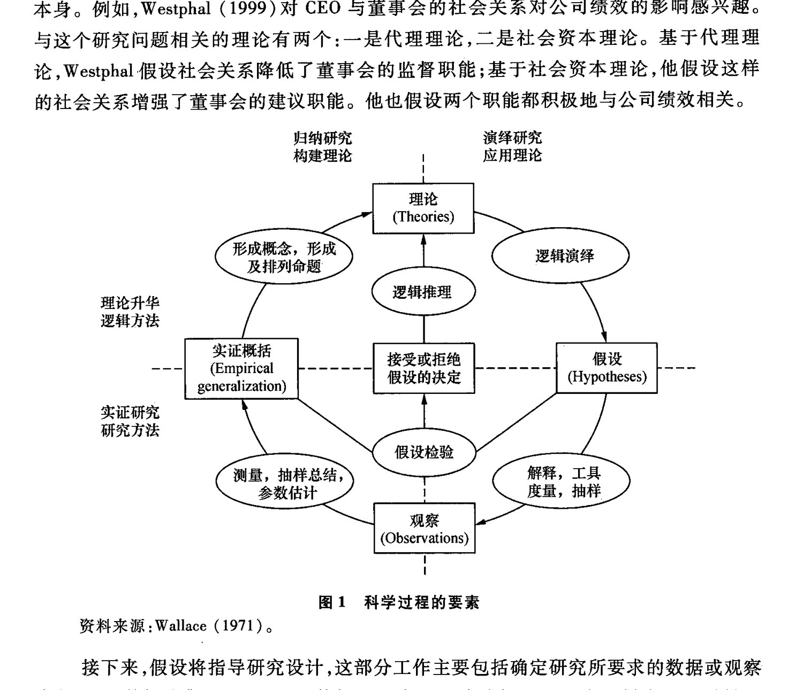

<!-- PDF页 33 -->

和相关系数。然后,他对这些数据进行回归分析,并且为他所假设的每一组关系进行参 |数估计。通过估计符号和参数的大小,他能将观察转化成实证的概括。

最后,检验假设的一致性,做出接受或拒绝假设的决策,这就是通过逻辑推断对理论进行证实、修改或反对的过程。Westphal (1999)使用从前面的步骤中得到的估计参数来检验假设。的确,他发现参数是统计显著的,而且,参数的符号与假设一致。因此,他的假设得到支持,代理理论和社会资本理论都得到证实。

通过观察资料的收集,从理论开始来证实或拒绝假设的过程被称为演绎的方法。演绎研究的结果是证实或拒绝一组构念之间的假设关系。这些结果被用来改进理论,如果调查不能完全回答提出的问题,可以建议更多的研究。

研究也可以从观察开始,以理论结论。当研究者不能找到或形成一种理论来解释疑难或研究问题时,这类研究是合适的。这时研究者是在从事归纳的建立理论的研究。它可以形成理论和命题,这些理论和命题对困惑或问题提供可能的解释或回答。这个过程遵循图1 的左半部分的流程。由于从现有的理论中找不到解释,建立理论的研究从观察开始。例如,Corley 和 Gioia (2004)开始探索组织身份改变(organizational identity change) 的时候,对于这个主题只有概念上的认识。因此,他们使用一个组织的分拆过程的案例研究来探索该主题。

接下来就是通过测量、样本归纳,参数估计来收集观察资料、进行分析,并且将其转换成实证概括。第一眼看来,该过程同样应用在假设检验研究当中。但是,在假设检验研究当中,数据分析通常使用定量统计方法,并且实证概括被用来检验假设,导致假设被接受或拒绝。在理论建立研究当中,数据分析使用定性分析技术,例如内容分析。在Corley 和 Gioia(2004)的研究当中,他们对访谈数据和公司文件进行了内容分析,产生了实证概括中的一阶编码和二阶编码。

最后,实证概括通过形成概念形成命题和命题排列转换成理论。从产生的编码中,Corley 和 Gioia(2004)形成了抽象的构念,并且建立了解释组织身份改变过程的过程模型。基于该模型,他们提出了用于未来实证检验的命题。

这个过程就是归纳法。归纳研究的结果是解释疑难的具有洞察力的理论观点,并形成新的暂定的理论。研究者对最初提出的研究问题的可能回答往往是新的构念和新的命题。新的理论能在未来用于解决相似的或相关的问题。

演绎法和归纳法在第三章将有更详细的解释。检验假设的数据收集方法包括调查问卷(邮件、网络、电话或访谈),实验(大学环境下)、准实验(组织中) 以及二手数据(财务、生产或人事记录)。归纳法通常涉及定性数据,如访谈、参与性或非参与性的观察、现有文件的分析。案例研究方法包括这些方法的结合。第五章到第十章对这些方法有更详细的介绍。

如图1 所示,我们发现归纳法位于循环的左边,演绎法位于循环的右边。循环的上半部分指逻辑的方法,或称其为通过归纳和演绎逻辑实现理论化的过程。下半部分指

Sof | 科学过程与研究设计 | 19

<!-- PDF页 34 -->

实证方法,或称其为在研究方法的帮助下从事研究。2.2 理论或模型中的变量类型

需要清楚的是,理论是使用科学方法建立知识的重要因素。理论解释了一个现象“是什么”(what)、“怎么形成”(how)、“为什么”(why)、“何时”(when) 以及“谁” (whom)等问题。在管理和组织主流理论中的例子包括代理理论(Jensen and Meckling, 1976; Fama and Jensen, 1983)、制度理论(DiMaggio and Powell, 1983)、资源依赖理论(Salancik and Pfeffer, 1978)、社会网络理论(Coleman, 1990; Burt, 1992; Granovetter, 1973)及社会交换理论(Blau, 1964) 等。每一个理论都有一系列核心的构念(是“什4”) FAMERS AMA GRETA” BMT HEN). RKB, CH括这些关系在什么条件下(时间、地点以及人物)是最有意义的。

在使用理论解释一个令人困惑的现象时(如实证检验一个理论),我们将构念(construct) 转换成变量(variable)。变量是以一定刻度变化来反映构念的指标(indicator)。例如,两类变量或指标能用于测量“承诺”这一构念。一个是“心理指标”,如“员工想继续留在组织中的程度"(从 1 到7 变化的态度量表,1 表示弱,7 表示非常强烈)。另一个是“行为指标”,如“缺勤总次数”。次数越小,员工对组织的承诺越强。在本书第十一章中将对构念的测量提供更为详细的讨论。我们在此处将介绍理论模型中的五类变量:自变量(independent variables)、因变量(dependent variables)、中介变量(mediating variables)、调节变量(moderating variables) 和控制变量(control variables),如图2 所示。

= (moderating variables) ae (independent (mediating (dependent variables) variables) variables) |. (control variables)图2 理论模型中的变量类型自变量,也叫预测变量,是因变量的假定的原因;因变量也叫标准(criterion),或假定的效果。换句话说,自变量是先行变量,因变量是结果变量。假设自变量影响因变量或者使因变量发生改变。控制变量对因变量有影响且其影响需要被消除。理论上,自变量和控制变量都是因变量的先行变量。自变量是我们所关心的变量,而控制变量是我们不想要但不能完全消除的先行变量(即不能实现随机化,或不能消除)。

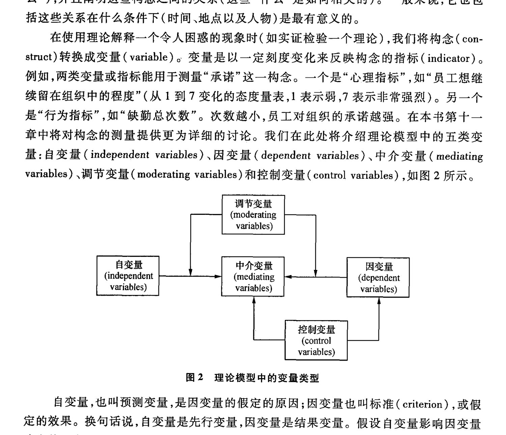

<!-- PDF页 35 -->

。 理解调节变量和中介变量的差别非常重要,它们对自变量和因变量的关系的影响不同,并且检验他们存在的统计方法也不一样。调节变量是影响自变量和因变量关系的方向、强度的定性或定量的变量(Baron and Kenny, 1986)。从统计学上看,当调节变量和自变量的交互项(调节变量 x 自变量)对因变量的影响很显著时,调节变量即存在。,中介变量是介于自变量和因变量之间的变量(Baron and Kenny, 1986)。当满足下列条件时,中介变量即存在:(1) 自变量的变化显著地解释了中介变量的变化; (2) 中介变量的变化显著地解释因变量的变化; (3) 当控制了(1)和(2)的影响时,因变量和自变量的相关性显著降低。第十四章将对如何检测中介效应和调节效应提供更为详细的介绍。.

一个理论必须详细说明自变量、因交量、中介变重和调节变量的关系。理论提供了这些变量如何相关以及为何相关的理由和逻辑。在理论化的过程中,建议使用方框和箭头来帮助思考这些变量“为什么"、“如何”、“什么时候” 以及“对何人”相关联(Whetten, 2002a)。缺乏理论和理论的逻辑,方框和箭头没有意义。只有当你有一个逻辑来说明为什么选择这些变量以及它们如何关联时,你才可以检验这些关系。

当人们面对图1 中的方框椭圆和第头不知所措的时候,科学研究过程看起来似乎相当神秘。本书的目的是让这个过程不再神秘,给你提供适当的工具来装备自己,使你在研究的从林中不致迷路;在此,我们给您一个简洁而实用的进行科学研究过程的指南。图3 总结了该实践指南。

好奇或® | @图3 科学研究方法的应用指南

实现科学过程有四个步骤:第一步是提出一个研究问题。第二步是进行文献回顾。第三步是找到理论,提出假设。第四步是设计并执行实证研究。根据研究是归纳性或演绎性的,上述四个步又不总是按照单一的方向进行。我们在下面详细介绍。

第一步,提出研究问题。研究问题是对某一现象或困惑的好奇。它陈述了两个变量之间的潜在关系。它没有明显地回答,但却上暗示有可能进行实证检验。它有希望发现一些重要的事物,但不隐含价值和伦理的判断。它通常始于问“是什么? 为什么? 何时?如何?”等问题。例如,在 Chen (1995)的论文中,其研究问题是: “在分配组织奖励

第一意 | 科学过程与研究设计 |27

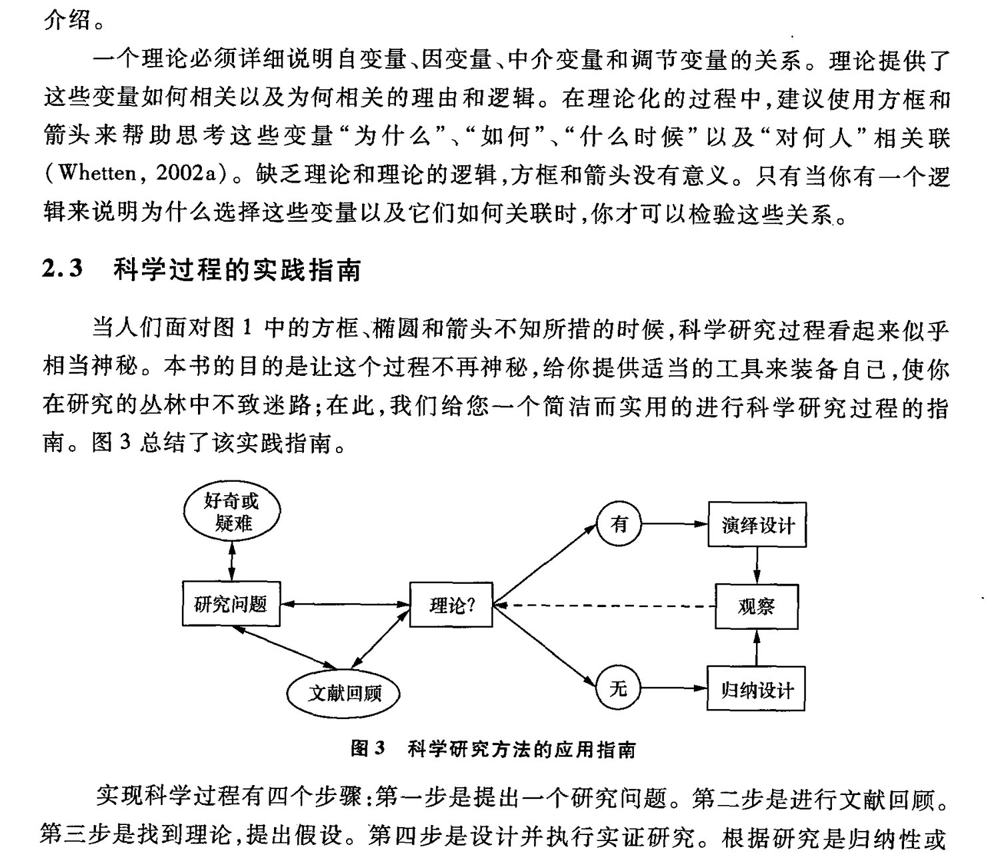

<!-- PDF页 36 -->

的偏好方面,中国员工如何不同于美国员工?”本书第二章将对如何提出有趣并重要的研究问题进行详细的说明。:

第二步,进行文献回顾。一旦有了感兴趣且重要的研究问题,你需要进行广泛的文献回顾。综合的文献回顾帮助你评价你的研究问题是否已经得到回答,它也可以帮你找到相关理论来解决你的困惑。文献回顾还能指出更加准确的构念,从而帮你改进研究问题,其至通过发现文献的不足或审查未经检验的命题,可以使你彻底改变你的研究问题,使之变得更加有趣、更重要。本质上,在第一步和第二步之间是有反馈环路的。例如,Westphal (1999) 对研究董事会的组成结构对公司绩效的影响感兴趣。他发现在预测董事会对 CEO 的社会关系的影响时,作为组织治理中的主流理论——代理理论与社会网络理论是相互冲突的。通过发现文献中的这些差中,Westphal 能够将自己的论文定位在检测相互冲突的命题上,从而找到一些与直觉不同的结果。

第三步,找到理论并且形成假设。理论解释了现象的“为什么”和“如何”的问题(Kaplan, 1964; Whetten, 2002a)。假设是对研究问题的暂定的回答。理论包括具有清晰定义的构念,以及使用清楚的逻辑解释这些构念为什么以及如何相关。现有的理论对于回答研究问题产生有意义的假设。假设是对构念之间的可能关系的陈述。假设涉及可测量的构念(如承诺),但不是指测量工具本身(缺勤率)。这些假设指引你的研究设计和数据收集工作。例如,在员工组织关系的研究当中,Tsui 等(1997) 应用社会交换理论解释(并形成假设)相互投资的员工——组织关系为什么,以及如何产生最高的员工绩效和组织承诺。

第四步,进行实证研究。该步骤包括研究设计、数据收集和数据分析。研究设计根据你是进行归纳或演绎研究而有所不同。当现有理论帮助你形成假设的时候,你将选择演绎的研究,与此相对应的研究设计可以是实验或问卷调查等。当没有理论可以对你的问题有满意的回答时,你可以选择归纳设计,如案例研究或其他的定性研究方法(如访谈或人种志的研究方法)。例如,根据承诺升级理论,Staw (1976)使用实验来检验人们对选定的行为的态度和行为的假设。由于没有现成的理论来完全解释自我管理团队中的协同控制(concertive control), Barker (1993)使用案例研究对该现象建立了理论。因此,在归纳研究中,实证研究先于理论和假设,步骤三和步又四首转了。

总之,在科学过程中有四个步骤:发现研究问题、进行文献回顾、找到理论并形成假设、设计研究并执行实证研究。上述四个步骤不必遵循单一的方向:对于一些步又,相互之间存在反馈环路;对于其他步骤,步骤之间的顺序可能逆转。从步骤一到步骤三,也就是说从研究问题到文献回顾,再到理论和假设,因为由于文献回顾,研究问题可能被修改或精炼,这又会影响文献回顾的领域和关注的理论,所以,在这些步怠之间会有

. HERR. AER = BFE RY, BU YS LBL, CP eR th BT DB转。当没有现有理论可以解决感兴趣的现象时,作者可以从实证研究开始,进行观察, "

<!-- PDF页 37 -->

然后再提出命题或新的理论。2.4 ”研究设计的两个目标

研究设计是调查的计划和结构,用于得到研究问题的回答(Kerlinger and Lee, 2000)。研究设计要实现两个目标:首先是控制变异,其次是保证效度。

一项研究中研究者要尽力控制三类变异。好的研究设计应该最大化系统变异(maximize systematic variance),控制外生变异(control extraneous variance)、最小化误差变异(minimize error variance)。

系统变异是指因变量的变异,它受到研究假设中的自变量的影响。最大化系统变异,我们可以将自变量对因变量的效应从因变量的总变异中分别出来,因此可以支持在我们假设中的构念之间的关系。最大化系统变异可以通过样本选择或者自变量的精准测量来实现,每一种方法都致力于让自变量对因交量有最大的效应。例如,在研究薪水与工作满意度的关系时,如果研究者选择的样本当中,大多数人都对工作满意,或者更糟糕的情况是,他们的薪水都相似,那么研究者要得到自己想找到的证据的可能性将非常低。

外生变异是措外生的或是研究目的不希望得到的自变量的变异。我们最小化、消除或隔离外生变异, 以至我们能够排除对我们感兴趣的变量之间的关系的其他解释。通过随机化、匹配参与者,或者将这些变量作为控制变量,都可以控制外生变异。例如,如果要调查创新对公司利润的影响,研究必须控制公司规模和行业。虽然这两个因素都不是研究的关注点,但它们影响公司的获利性。控制了这些变量,我们可以更有信心地得出这样的结论,即公司利润的变动是创新的结果而不是规模(大公司倾向于利润更高)或行业(一些行业比其他行业利润更高)的影响。

误差变异是指由于随机波动而导致的指标变异。我们使误差最小化,使得系统变异能显示出来。最典型的随机变异是测量误差,或研究者控制不了的未知因素。最小化误差变异可以通过控制数据收集过程的条件,以及增强指标的信度而实现。例如,如果你希望测量公司的市场价值,而你选择公司在某一天的股票价格,则可以预计这样的测量不是很可信的,因为选择不同的时间来测量同样一家公司,你可以得到不同的市场价值。

研究者在设计演绎研究或归纳研究的时候,必须对变异控制的目标熟记于胸。

研究设计的第二个目标是保证实证研究的效度。简单地说,效度指结论的可信程度。在多大程度上我们相信从实证调查中得到的结果呢? 研究设计应该确保四种效度。它们分别是构念效度、内部效度、统计结论效度和外部效度(Cook and Campbell, 1979)。

构念效度指测量的准确性,即测量指标所包含的意思与构念的定义的一致性。 本

书第十一章将详细讨论构念效度。£2 | 科学过程与研究设计 | 23

<!-- PDF页 38 -->

内部效度指结果是由于所假设的原因所致的可信程度。设计改善内部效度的研究将在第六章(实验)、第七章(准实验).第八章(问卷调查).第九章 (使用二手数据)和第十章(案例研究)讨论。

统计结论效度是以统计检验对假设的关系进行解释的可信度。样本太小,P 值太大,或者违背了统计检验的假设等,将降低结论的可信度。 影响误差的因素,如不可信的指标和在数据收集过程中的波动条件等,也将对统计结论效度有不良影响。

外部效度指假设的因果关系推广到其他的因果测量中,推广到不同类型的人、环境和时间当中的可信程度(Cook and Campbell, 1979)。 当你在样本中找到显著的因果关系的时候,自问一下是否这些结论只在这些人、这样的环境和时间内有效。 增强外部效度最有效的方法是使用随机抽样。 当由于实幅中的困难使随机样本不可行的时候,你需要明确地讨论你的样本对总体的代表性。例如,如果使用 2003年北京的高科技企业作为样本来研究“研发强度"的时候,你需要讨论你的结论可以是否推广到除高科技行业之外的其他行业?是否可以推广到除北京以外的其他城市? 是否可以推广到其他时[a] Be?

外部效度告诚我们,我们需要清楚地研究结论所处的情境界限,将情境因素,如人、环境、时间与理论思考相结合有可能产生更有趣、更重要的研究。 这些情境因素要么是自变量的先行因素,要么是可能改变自变量和因变量的关系的调节变量。例如,Farh, Earley 和 Lin (1997)研究中国情境下的组织公民行为和组织公正。 他们发现,在中国,组织公民行为的维度不同于在西方情境下的研究结论,因此,在国家层面上,情境成为组织公民行为的先行变量。 他们也发现,对于传统价值观较低的人来说,组织公民行为与分配公正和过程公正的相关性最强。 因此,传统价值观成为组织公民行为和组织公正关系的调节变量。

把情境因素考虑进去,在研究中国管理问题时尤其重要。 我们将在以下部分继续讨论。

### 三、在中国进行研究设计需要情境化

情境化(contextualization) 是指将研究置于一定的情境当中。 情境包括特定研究所处的物理的、政治和法律的、文化的、社会的历史的.经济的环境以及组织环境(图4列举了国家层面的情境因素)。 情境化在管理研究中越来越重要(Johns, 2006),它是在中国进行本土研究的关键要素 (Tsui, 2006)。

<!-- PDF页 39 -->

物理情境社会情境类型/地理教育体系气候/温度家庭构成生活环境 Rea历史情境经济情境主权经济体系及发展殖民技术语言商业体系政治情境行业政策政治体系文化情境法律体系 fai商业法价值观图4 国家层面的情境因素改编自 Tsui 等,2007。:首先,情境是影响的一个不可忽视的主要来源。无论分析单元是个人、群体、组织或行业,都有一个更大的情境在影响该分析单元,并且也被该分析单元所影响。近来,美国管理学会(Academy of Management) 对“丰富度”(richness) (Weick, 2007)的呼吁以及一些期刊要求提交研究的情境描述,都证明了日益增加的对情境的兴趣和强调。其次,情境是本土化研究的关键要素。的确,如果我们选择关注在西方文献中流行的主题,并且使用在西方情境下已发展良好的理论和测量,这看起来很诱人并且使我们的生活更加容易。但是,雍焦于西方流行的主题,而忽略来自于情境中的问题,我们就冒着没能问正确问题的风险(Ofori-Dankwa and Ricks, 2000: 173)。而且,来自于西方情境下的理论和测量是一个很好的起点,但在处理中国的现象,在推动管理知识的进步的时候却是不够的。例如,虽然结构洞理论(Burt, 1992) #055 eK HG (Cranovetter, 1973) 是社会网络研究中的主流理论,但是,Xiao 和 Tsui (2007) RH, HMI MRR是基于西方的个人主义文化,它对于类似于中国这样的集体主义文化并不适用。昌然组织公民行为是一个有效的构念,人们已普遍接受它是由利他主义、公道作风等维度组成,但是,Farh, Zhong and Organ (2004) 采用归纳的方法发现,人际间的和谐在西方文献中并没有作为组织公民行为的一个维度,但它却是中国情境下所特有的。这些都是对中国管理文献的贡献。的确,情境化对于在新的情境中产生有效的知识是重要的。国家.行为,组织、工作群体和人际层面的属性都组成了研究中的情境。 在中国设计研究,选择研究现象发展解释现象的理论、进行测量甚至决定研究方法时,情境化不仅是有用的,而且是必要的。. 3.1 情境化的四种方法第一种方法是决定研究什么。我们鼓励研究者将思维方式从“从外向内”(outside in)转变成“从内向外”(inside out)。换句话说,我们不仅应该关注在现有的西方文献Sok | 科学过程与研究设计 | 25

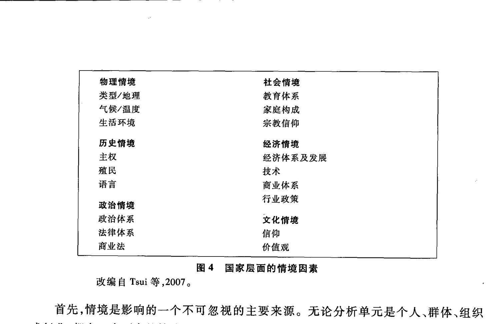

<!-- PDF页 40 -->

PEAR ERMA (NSA), MAES HE, Shl-k pe HAA, Fw者和员工所特有的或重要的正确的问题(从内向外)。这种方法要求对情境有深厚的理解。例如,Xin 和 Pearce (1996)提出,在一个不发达的法律系统内,公司如何获取支持和保护,这是一个与西方情境不相关但对于中国企业非常重要的问题。他们接下来研究“关系”,,即个人联系,并且认为,因为中国的法制系统不够健全,中国的高管们依赖关系作为正规制度支持的一种蔡代。

第二种方法是理论的情境化。它从直接应用西方情境下已有的理论转变为创建适合中国情境的新理论。西方理论基于一系列假设和人逻辑,这些假设和侵辑可能不适用于中国的文化和制度环境,适当地应用西方理论要求准确地理解理论的发源地和新情境下的假设条件。创建中国情境下特有的新理论既要有本地知识,也需要概念化的能力。例如,来自于新兴经济的跨国企业积极地从事国际扩张:它们为什么和如何进行国际扩张呢?”大多数现有的理论是基于发达国家的经验,它们不能解释为什么这些来自于新兴经济下的跨国公司比西方的跨国公司更具有进取心,并且采取风险更大的途径? Luo 和 Tung (2007)发展了“跳板观点” IFAM MMAR FA Fl ALE系统地解释了跨国企业的动机、触发因素和促成因素战略和活动.风险和规避方法。

第三种方法是关于构念效度的,也就是测量工具的情境化。翻译西方文献中现有的测量工具,然后对其进行反译(Brislin, 1981) 是一个好的出发点。然而,它不能保证在西方情境中开发的构念在中国情境下也有意义。例如,在上文提到的 Farh 等(1997)的研究当中,常用的组织公民行为构念在中国情境下可以有不同的意义和维度。使用本土化研究方法,他们开发了中国情境下所特有的组织公民行为测量工具,其中包括西方情境下所共有的维度,也包括一些中国情境下所特有的维度。在本书第十一章, Farh更广泛地讨论了在中国管理研究中开发有效的测量工具的不同方法。

最后,方法论的情境化将是一个更富有挑战性的工作,那就是从“改良旧工具”转变到“开发新工具”"。换句话说,就是中国情境下开发新的方法论来观察.记录和分析数据。本书中讨论的所有方法(第五章到第十章),包括问卷调查、实验、准实验、档案数据和案例研究,都是在西方情境下常用的方法,它们在中国情境下产生有效数据的功用应该被仔细靶酌。例如,中国倾向于避免极端的情况,因此,在回答调查问卷时倾向于选择中间的得分,或在访谈时避免极端的回答,这些都阻碍了辨识数据的真实变异的可能性。在中国从事研究的勤奋的研究者们需要知道当前这些方法的限制,在必要的时候修正他们以适合情境的需要,并且在可能或者必要的时候创建新的方法。3.2 ”对情境敏感的两类研究

情境化通过两类对情境敏感(context-sensitive) 的研究对全球管理知识作出贡献:峰人情境研究(context-embedded research) 和特定情境研究 (context-specific research) (Tsui, 2004)。两种类型的不同主要体现于情境在理论和方法中的角色上。

<!-- PDF页 41 -->

嵌入情境研究(context-embedded research)利用国家层面的特征(如文化政治或经济系统)的差别作为先行变量或调节变量来解释不同国家中的组织或个人现象的方差。这种研究类型通常利用现有文献中的构念和理论模型并且在新的情境中检验它们。不同情境缘景下的构念或理论模型的差别被归因为情境所致。例如,Cullen,Parboteeah和 Hoegl (2004)研究了 28 个国家的不道德行为(unethical conducts)。他们使用国家文化价值观,如成就.个人主义普遍主义和人金钱至上的物质主义来预测管理者对普遍被认为有违伦理的行为寻求合理解释的意愿。该例中,国家层面的特征被认为是先行因素。另一例子中,Hui,,Au 和 Fock (2004)研究权力距离对工作满意度和授权之间关系的调节效应。他们发现,工作满意度和授权之间的关系在权力距离低的文化中要比权力距离高的文化中更强烈。

特定情境研究(context-specific research) 关注在新情境下的现象,这些现象对西方研究者来说是不熟悉的。这些研究通常是本土化的,只研究一个国家,要解释的现象和理论当中隐含情境。例如,Boisot 和 Child (1996) 在中国研究了网络资本主义,这是在西方情境下和以前的文献中都不存在的。他们发现,在中国,网络资本主义的出现与以前的国家命令式系统的分权化同时发生,两者都是由于中国特有的情境所导致,当时的中国只具有有限程度的法律制度规则,公有产权与经济交易组织并存。本例中,情境没有被看成是先行变量或调节交量,而是隐含在产生的现象和理论当中。

为了对全球知识作出贡献,为了促进学术的对话,捧入情境研究和特定情境研究都应该与现有的文献相联系,这一点可以通过两种途径而实现:使熟悉的变得新颖(mak-" ing the familiar appear novel) 和使新颖的变得熟悉(making the novel appear familiar) (Whetten, 2002b),

使熟悉的变得新颖可以从情境外部的研究者所熟悉的构念或理论开始。研究者们用情境化的研究过程来发现当地有意义的维度,这些维度可以添加到现有的构念上;或者发现新的机理或解释来修正现有理论。上面提到的在台湾进行的组织公民行为的研究(Farh et al., 1997),就是将熟悉的变得新颖的很好的例子。Farh 和同事一起,以一个现有的大多数研究者都熟悉的组织公民行为的定义着手。然后使用归纳法识别台湾的组织公民行为,找到一些在西方文献中不存在的组织公民行为的维度。

使新颖的变得熟悉可以将研究定位为对现有理论的某一部分作出贡献,并且使用熟悉的概念解释新的印象。上文提到,Boisot 和 Child (1996) 研究了中国的网络资本主义。这是一个关注西方情境的研究者所不熟悉的新的现象,然而,Boisot 和 Child 使用现有文献中关于社会系统、经济结构和公司治理等的熟悉概念来解释这些现象。

嵌入情境研究和特定情境研究都能对全球管理知识作出贡献。在风入情境研究当中,我们通过找到不同情境中的差异而发展出具有情境边界的知识。如, Cullen 等(2004) 发现非伦理行为在 28 个国家中存在差异。通过找到情境之间没有差异,我们发展出不受情境限制的知识。如,Spector 等(2002)发现控制中心(locus of control) 和生

£8 | 科学过程与研究设计 |27

<!-- PDF页 42 -->

活质量(well being)之间的关系在 24 个地区或国家具有相似性。在特定情境研究当中,通过开发一些该情境所特有的构念或模型,我们开发出该情境特有的知识,这也对全球管理知识有贡献,并推动未来的府人情境研究。

然而,只有研究的质量很高,即遵循严谨的研究设计,情境化和情境化研究才会对全球管理知识有所贡献。我们希望本书所描述的技巧和知识能够推动设计严旭的研究,以达到国际上高质量期刊的标准。

、科学伦理和科学价值观

本书专注于在中国进行科学研究的方法,我们希望本书将使您具备从事高质量管理研究的必要技能。然而,我们在此也会讨论一些非方法论的.伦理或价值观的因素,这些因素不但影响你从事高质量研究的能力,而且更重要的是,影响你身为学者对学术生涯的承诺。具体来说,价值观影响了方法的选择、标准的严谨、主题的选择,最根本的是,学术生涯的意义和成功。

### 4.1 追求科学过程中的伦理行为

探索行为(The conduct of inquiry)涉及“探索自由”(autonomy of inquiry) 原则(Kaplan, 1964),这意味着科学家具有从事任何他认为有兴趣或重要主题的研究的自由。但是,科学家为他们的研究行为和研究结果对科学界负责。学界对可接受的方法和严谨的标准制定准则。科学家的工作由同行评审过程来评判。作为科学界成员的同行评委和编辑决定在研究论文中报告的知识是否接近真知,用来产生知识的方法是否达到了这个学界所制定的严赣标准(这些标准有些是明显的,而另一些则不那么明显)。科学探索的准则来源于学界内部,而不是外部(Kaplan, 1964; 20)。

以寻求真理为名是不是就可以使用任何的手段呢? 例如,研究者没有征得他人的同意或未在他人知情的情况下观测他人的私人行为.侵犯别人隐私是否符合伦理呢(lan, Humphreys, 1970)? 或者使被试相信他们是对他人施加痛苦的同谋者,从而造成被试的心理压力,这是符合伦理的吗 (例如,Milgram, 1963)? 学界一致认为,不可以为了目的(知识真理)而不择手段(寻找知识的途径)。

研究机构和大学以及不同科学领域的专业协会(医学、公共观点研究.管理等)已经建立了研究行为准则,这些准则为研究者的伦理行为提供了指南。大学和资助机构设有评审委员会,在资金拨付或项目批准以前,要求研究者遵守伦理要求。管理领域的研究者有义务保护其研究对象的生活质量,无论他们是学生、员工或者组织。本书附录 1是中国管理研究国际学会(IACMR) 的行为准则。它明确地说明了在评审和编辑过程中对待研究对象和数据行为准则的要求,以及与研究思想交流和参加会议相关的专业行为。该准则对所有的 IACMR 成员都适用,并且涵括在研究和专业活动中的伦理行为。

<!-- PDF页 43 -->

本书读者如果感兴趣,在许多专业协会的网站上也能找到相似的准则,如美国管理学会.美国心理协会美国社会学协会等。《国际商业研究杂志》有一套综合的准则,尤其适用于出版过程。它概括了对作者、编辑和评委的伦理行为准则。可以在本书附录 2找到该准则。该准则为所有从事管理研究工作的不同角色都提供了一个非常有用的指南。

记住一个被称为“黄金定律"的普遍原则:“你们愿意人怎样待你们,你们也要怎样待人”(马太福音,7:12)。如果我们作为学者想被尊敬,我们也应该给予参与我们研究的人、给予我们宝贵意见的人与我们分享他们生活经验的人,以及允许使用他们的研究来指导我们自己的调查的人以尊敬。如果我们想自己的工作受到他人的认真对待,我们应该以最严谨的态度从事我们的研究。我们绝不容忍在数据处理上的任何缺陷或遗漏、对结果的不准确或焉曲的解释、对其他学者的研究论文的不恰当或没有注明的引用、在没有得到认可或同意的情况下使用其他学者的知识产权等行为。

IARC (Charles Darwin) 曾说过,错误的事实严重损害科学的进步。马虎的、粗心大意的研究以及其他人的工作的故意误用能造成大的伤害,即使这些错误最后被发现或纠正。爱因斯坦(Albert Einstein) 也谈到了科学中的伦理行为:“人类最重要的努力是为我们行为的道德性而奋斗,我们的内部平衡甚至我们的存在都依赖于它。只有我们的行为具有道德,才能赋予生活以美和尊严”我们伟大的教育家和和哲学家孔子在《论语: 为政)第二十四章说过:“见义不为,无勇也。”

### 4.2 价值观对科学行为的影响

个人价值观影响了我们对研究主题的选择,例如,研究公司社会责任的学者的价值指引不同于另一个致力于理解公司如何才能实现利润最大化,并且将所有者认为是公司唯一的合法的利益相关者的学者的价值指引。学者享有探索的自由,因此他们可以选择任何他们认为有趣或重要的主题。但是,主题的选择也可能被其他因素影响,如主题是否具有可操作性、受欢迎、容易发表,或实践中很重要等。

对于应该做严谨的研究还是应该做相关的研究,学界长期以来都在争论,因为他们假定二者是对立的。然而,我们能使用最严谨的方法研究最具实践性的主题。近来,美国管理学会呼吁学者和实业界之间加强交流。越来越多的学者被要求既注意实践中遇到的问题(Tushman and 0’Reilly, 2007),也需要积极地将研究结论的实践意义与管理者多沟通(McGahan, 2007)。《美国管理学会学报》(Academy of Management Journal)2007年9月刊的整个编辑论坛都是讨论在管理研究中整合实践与学术的问题。

如同西方社会中的同辈一样,越来越多的中国年轻学者面对大量发表论文以获得大学里的晋升和教职的压力。一部分人不得不选择流行的主题,从事机会主义研究,避免从事那些难以发表的研究,即使那些题目是他们感兴趣的。机会主义研究如果能产生好的科学成果也无可厚非。不幸的是,机会主义研究往往是快捷、粗劣且投机的,通常

总=总 | 科学过程与研究设计 | 29

<!-- PDF页 44 -->

没有经过仔细的思考,只是为了容易发表文章,这经常导致低质量的成果。这些机会主义研究不是由内在兴趣指引的,而是由外部回报指引的。

避免难的主题追求流行的主题,这本身都是一个价值选择。这些选择通常产生一些对于新知识没有什么贡献的、微不足道的研究。最好的建议是坚持你自己的信念。既然你有选择的自由,科学工作又要求全身心的投入,只有让兴趣来指引研究选择才有意义。如果我们要成为工作的奴隶,那么我们要做我们所热爱的工作的奴隶。

### 4.3 ”价值观对研究生涯的影响

在你投身于科学研究事业的汪洋大海之前,我们邀请你首先仔细思考为什么你想成为一位研究者? 为了金钱? 为了名声? 还是为了思考的自由和能为人类社会作出贡献的机会? 你所拥有的价值观会影响你的职业生涯的意义和你所能作出的贡献。

学术生涯不会让你发财。是的,中国学者的薪水每年都在增长,成为科学家能够为你提供一个体面的生活。然而,这些收入与在管理咨询、投资银行或者股票市场投资的从业者的收入无法相比。相反,学者的财富是具有思考的自由以及有机会满足他们的好奇心。从事学术工作,我们不会每天受到严格的监控。除了教学时间外,我们可以随时随地从事自己的工作,自由地思考以及有机会满足我们自己永无止境的好奇心是学术生涯的重要的回报。

学术生涯不会让你出名,至少不会很快地出名。由于成果发表过程的沾后和在顶.级期刊的竞争,我们从事学术生涯面对的失败多于成功。因此,我们需要靠自己强烈的内在激励并且从事我们所喜爱的研究主题来支撑很久以后才会有的回报。科学上的成功与其他职业生涯的成功相比较,有其不同的评价标准。1986年诺贝尔化学奖获得者John C. Polanyi 说过:“在科学界,我们是一群来自全球、互相支持的个体,我们的目标是要把真理放在个人利益之上。”2004年诺贝尔化学奖获得者 Aaron Ceichnover 认为:“我认为,评价一个科学家,不是由他所获得的奖项或荣誉,而是其对提高人类生活质量的贡献。”换句话说,成功跟随那些视贡献为成功的人,而不是来自个人的名声或个人的收入。这意味着科学家的成功应该由创造的知识,而不是发表论文的数量来决定。

发表论文是传播科学研究所发现的知识的一种手段。我们不应该陷入只关注出版的数量而不关注科学研究的质量这种以手段代替目标的陷阱中。数字游戏已使得研究者们故意将一项研究分散成许多小的论文,或者从事机会主义研究。

据说,发明并改进了灯泡的爱迪生(Thomas Edison)有2000 次失败的实验。当问及他对这些失败的感想时,他说,这些不是失败,只不过是走向成功的2000 步而已。从失败中学习并且不断改进的能力也是成功的一个合理定义。

科学的价值或终级目标是寻求真理,是为了准确有效地理解并解释我们周围的事物。终级目标是在所有领域内改善人类生活,包括企业管理。通过科学,我们创造知识和技术,帮助人们生活得更加美好。对于管理学者而言,科学能帮助组织效率更高、产

<!-- PDF页 45 -->

出更多、利润更高,也能帮助组织成为更友善的雇主,为员工提供有回报的职业。能够为我们的社会进步作出这样的贡献是学术生涯中最有意义的回报。五.、结语

中国管理研究就像一个深埋于地下的巨大的钻石矿,你很容易就会在没有挖到足够深之前就放弃了。然而,我们只要心中有坚定的决心,脑中有正确的方向,身边有相互鼓励的伙伴,手中有合适的工具,就很有可能创造一个成功的故事。本书致力于让您掌握合适的工具,其他的,就靠您自己的准备与努力了!

### 参考文献

Baron, R. M. and Kenny, D. A. (1986). The moderator-mediator variable distinction in social psychological research; Conceptual, strategic, and statistical considerations. Journal of Personality and Social Psychology, 51(6); 1173—1182.

Barker, J. R. (1993). Tightening the iron cage-concertive control in self-managing teams. Administrative Science Quarterly, 38(3); 408—437.

Blau, P. M. (1964). Exchange and Power in Social Life. New York: John Wiley & Sons.

Boisot, M. and Child, J. (1996). From fiefs to clans and network capitalism; Explaining China’s emerging economic order. Administrative Science Quarterly, 41(4); 600—628.

Brislin, R. W. (1981). Translation and content analysis of oral and written material. In H. C. Triandis and J. W. Berry (eds.), Handbook of Cross-cultural Psychology, Vol. 1; 389—444. Boston; Allyn & Bacon.

Burt, R. S. (1992). Structural Holes; The Social Structure of Competition. Cambridge,

~ MA; Harvard University Press.

Chen, C. C. (1995). New trends in reward allocation preferences; A Sino-U.S. comparison. Academy of Management Journal, 38; 408—428.

Clark, R. W. (1984). Einstein; The Life and Times. New York; HarperCollins Publishers.

Coleman, J. (1990). Foundations of Social Theory. Cambridge; Belknap Press.

Cook, T. D. and Campbell, J. D. (1979). Quasi-experimentation; Design & Analysis Issues for Field Settings. New York; Houghton Mifflin.

Cullen, J. B., Parboteeah, K. P. and Hoegl, M. (2004). Cross-national differences in managers’ willingness to justify ethically suspect behaviors; A test of institutional anomie

第二总 | 科学过程与研究设计 |37

<!-- PDF页 46 -->

theory. Academy of Management Journal, 47(3): 411—421.

Corley, Kevin G. and Gioia, Dennis A. (2004). Identity ambiguity and change in the wake of a corporate spin-off. Administrative Science Quarterly, 49; 173—208.

DiMaggio, P. and Powell, W. W. (1983). The iron cage revisited; Institutional isomorphism and collective rationality in organizational fields. American Sociological Review, 48; 147—160.

Fama, E. and Jensen, M. (1983). Separation of ownership and control. Journal of Law and Economics, 26; 301—325.

Farh, J. L., Earley, P. C. and Lin, S. C. (1997). Impetus for action; A cultural analysis of justice and organizational citizenship behavior in Chinese society. Administrative Science Quarterly, 42(3); 421—444.

Farh, J. L., Zhong, C. B. and Organ, D. W. (2004). Organizational citizenship behavior in the People’s Republic of China. Organization Science, 15(2); 241—253.

Granovetter, M. (1973). The strength of weak ties. American Journal of Sociology, 78 (6); 1360—1380.

Huff, A. S. (1999). Writing for Scholarly Publication. Thousand Oaks: Sage.

Hui, M. K., Au, K. and Fock, H. 2004. Empowerment effects across cultures. Journal of International Business Studies, 35(1); 46—60.

Humphreys, L. (1970). Tearoom Trade; Impersonal Sex in Public Places. Chicago; Aldine.

Jensen, M. and Meckling, W. (1976). Theory of the firm; Managerial behavior, agency costs and ownership structure. Journal of Financial Economics, 3; 305—360.

Johns, G. (2006). The essential impact of context on organizational behavior. Academy of Management Review, 31; 386—408.

Kaplan, A. (1964). The Conduct of Inquiry. New York; Harper and Row.

Kerlinger, F. N. and Lee, H. B. (2000). Foundations of Behavioral Research, 4th edition. Orlando, FL; Harcourt College Publishing.

Kuhn, T. (1962). The Structure of Scientific Revolutions. Chicago; University of Chicago Press.

Luo, Y. and Tung, R.L. (2007). International expansion of emerging market enterprises: A springboard perspective. Journal of International Business Studies, 38; 481—498.

McGahan, A. M. (2007). Academic research that matters to managers; Zebras, dogs, lemmings, hammers, and turnips. Academy of Management Journal, 50(4); 748—753. Milgram, S. (1963). Behavioral study of obedience. Journal of Abnormal Social Psychology, 67; 371—378.

<!-- PDF页 47 -->

Ofori-Dankwa, J. and Ricks, D. A. (2000). Research emphases on cultural differences and/or similarities; Are we asking the right questions? Journal of International Management, 6; 172—186.

Popper, K.R. (1968). The Logic of Scientific Discovery, 2nd edition. New York; Harper..

Salancik, G. R. and Pfeffer, J: (1978). A social information processing approach to job attitudes and task design. Administrative Science Quarterly, 23; 224—253.

Smircich, L. (1983.). Concepts of culture and organizational analysis. Administrative Science Quarterly, 28(2); 339—358.

Spector, P. E., Cooper, C. L., Sanchez, J. I., O’Driscoll, M., Sparks, K., Bernin, P., Bussing, A., Dewe, P., Hart, P., Lu, L., Miller, K., De Moraes, L. R. » Ostrognay, G. M., Pagon, M., Pitariu, H. D., Poelmans, S. A. Y., Radhakrishnan, P., Russinova, V., Salamatov, V., Salgado, J. F., Shima, S., Siu, O. L., Stora, J. B., Teichmann, M., Theorell, T., Vlerick, P., Westman, M., Widerszal-Bazyl, M., Wong, P. T. P. and Yu, S. F. (2002). Locus of control and well-being at work; How generalizable are western findings? Academy of Management Journal, 45(2); 453—466.

Staw, B. M. (1976). Knee-deep in big muddy; A study of escalating commitment to a chosen course of action. Organization Behavior and Human Performance, 16; 27—44.

Tsui, A. S., Pearce, J. L., Porter, L. W. and Tripoli, A. M. (1997). Alternative approaches to the employee-organization relationship; Does investment in employees pay off? Academy of Management Journal, 40(5); 1089—1121.

Tsui, A. (2004). Contributing to global management knowledge: A case for high quality indigenous research. Asia Pacific Journal of Management, 21(4); 491—513.

Tsui, A. (2006). Contextualization in Chinese management research. Management and Organization Review, 2(1): 1—13.

Tushman, M. & O’Reilly, C. (2007). Research and relevance: Implications of Pasteur’s quadrant for doctoral programs and faculty development. Academy of Management Journal, 50(4): 769—774

Wallace, W. (1971). The Logic of Science in Sociology. Chicago; Aldine.

. Westphal, J. D. (1999). Collaboration in the boardroom: Behavioral and performance consequences of CEQ-board social ties. Academy of Management Journal, 42(1): 7—24.

Weick, K. E. (2007). The generative properties of richness. Academy of Management Journal,50(1).: 14—19.

Welch, H. G., Schwartz, L. and Woloshin, S. What's making us sick is an epidemic of diagnoses. New York Times, 01/02/2007. http://www. nytimes. com/2007/01/02/

2% | 科学过程与研究设计 | 33

<!-- PDF页 48 -->

health/02essa. html.

Whetten, D. A. (2002a). Modelling-as-theorizing; A systematic methodology for theoty development. In Partington, D. (ed.) Essential skills for Management Research; 45— 71. Thousand Oaks, CA; SAGE Publications, |

Whetten, D. A. (2002b). Constructing cross-context scholarly conversation. In A. S. Tsui and C. M. Lau (eds.), The Management of Enterprises in the People’s Republic of China; 29—40. Boston; Kluwer Academic Publishers.

Xin, K. R. and Pearce, J. L. (1996). Guanxi; Connections as substitutes for formal institutional support. Academy of Management Journal, 39(6); 1641—1658.

<!-- PDF页 49 -->

## 第二章 研究的起点：提问

— & pa ‘=e研究的起点:提问美国华威顿大学本章大纲一、 问题的来源1.1 问题来源之一:个人的观察和深度思考1.2 问题来源之二:个人对研究的专注热情1.3 ”问题来源之三:阅读文献1.4 ”问题来源之四:与他人交流=. 问题的转化:如何将一般问题转化为研究课题2.1 化大为小,化抽象为具体 | 2.2 ”化问题为研究变量和假设2.3 ”化问题为研究设计=. 论文开题报告的形成引言:提问对管理研究的重要意义” ”著名管理大师彼得. 德鲁克曾经说过,管理学研究者的任务不是解答问题,而是提出问题。而正是他颇具独到视角的提问,让众多管理实践者如杰克: 威尔奇,安迪... 格罗夫等受益匪浅,创造出各种管理企业的良方,并使他们的企业取得卓越成就。提问的意义由此可见一斑。问题的提出对于科学研究具有同样的意义,它不仅能够指导研究的方向,而且能够决定研究的结果。比如关于个体的决策,如果提出的问题是“个体应该如何决策以达到利益最大化”,那么,研究就会朝着建立理性模型的方向前进,并且假设各种各样的理想总=章 | 研究的起点:提问 | 35

<!-- PDF页 50 -->

情境来实现这些理性模型。但是假如提出的问题是“个体究竞是如何做决策的”,那么研究就会朝着观察个体决策过程的方向努力,比如个体如何搜集信息,如何整理信息,如何整合信息,如何做出判断的认知过程和心理过程,以及在这些过程中可能出现的各种心理偏差和理性局限。在这个问题引导下的研究成果就可能是对人类各种决策现象的总结,比如 Kahneman 和 Tversky(1972, 1973, 1979, 1981, 1982) 发现的各种决策直觉(启发)和偏差,而不是理性决策模型中的主观效用理论了(subjective utility theory)。

再比如关于企业的运作战略,如果提出的问题是“哪些战略可以帮助一个企业开发新产品”,那么研究的着重点就在于寻找与开发新产品有关的种种方法和手段,比如建立研发办公室,雇用大量研发人员等,最终的研究结果可能会回到 March 和 Simon (1958)所提出的“开发(exploitation)和探索(exploration)”上,因为一切产品开发战略都不过是这两种方法的不同表现。但如果提出的问题是“在产品的不同发展阶段企业应该用什么样的战略取得成功”,那么研究者就会关注在产品不同发展时期企业可能使用的不同战略,然后通过其成功率的比较来得出结论。这时,研究的结果可能就是波特(Porter, 1980)的“产品开发期——差异化”和“产品成熟期——低成本”战略了。

提出问题是进行任何科学研究的第一步,只有对事物有好奇心、对各种现象有无尽问题的人才会有探索的欲望,才会有做研究的兴趣。在这个意义上,做学术研究的原动力其实来自寻找问题的答案和探索事物的真相,而问题的提出则是开始这一漫长旅程的起点。

### 一、 问题的来源

研究的问题可以来自对日常生活的观察,对工作中出现问题的思考,对自身经历的反思,对社会现象的探究;也可能来自对文献的阅读,对新闻报道的反应,对传奇故事的追问;甚至可能来自与同事的闲聊,与学生的对话,或者别人的提问。我常常觉得作为一个管理研究者最大的乐趣就是可以选择任何自己感兴趣的题目,而孜孜不倦地研究下去,并且在此过程中既满足自己的好奇心又同时得到社会的认可。当然,学者在确定:研究问题上也有不同的路子。有的学者在找到一个自己感兴趣的问题或现象后,对该问题或现象穷追猛打,一研究就是几十年,不研究个水落石出暂不罢休。比如 Harry Triandis 在跨文化心理学领域对个体主义一集体主义现象的研究,自 20 世纪 70年代开始,从来没有停歇过,几乎该领域里发表的所有论文或多或少都留下了他的痕迹(Triandis,

_ 1972, 1983, 1989, 1990, 1994, 1995)。再比如 Joseph McGrath 对团队现象的研究也是

如此,从团队成员的构成,到团队成员的变化,到团队成员之间沟通方式的选择,到团队成员之间的互动过程,以及这些因素如何影响团队维持和团队的工作绩效,整整三十几年,研究成果不断(McGrath, 1984, 1991; Arrow, McGrath and Brendahl, 2000)。

也有的学者兴趣广泛,他们不断发现新的研究兴趣,“打一枪换一个地方"。比如

<!-- PDF页 51 -->

Jeffery Pfeffer,早年对“权力”(power) 着迷,做了许多与之相关的研究,发表了很多论文(Salancik and Pfeffer, 1977; Pfeffer, 1994)。后来又开始研究与人力资源管理有关的课题,并在案例研究的基础上,提出了美国企业之所以成功的七大法宝(后修改为十一大YEE) (Pfeffer, 1998, 2006)。他最近则专注于企业在做决策和执行决策之间存在的距离,专门回答为什么有的企业花许多时间在做决策上,却花很少的时间去考虑执行的事,结果无法将良好的决策转化为成果(Pfeffer and Sutton, 2000)。

还有的学者在对一个题目深究一段时间,认为自己对该领域的贡献差不多到尽头之后,才开始寻找下一个吸引自己、值得自己研究的题目。比如管理学界的另一个多产学者 Terence Mitchell,早期深入研究员工的工作动机,并对期望效价理论作了验证和补充,在动机研究领域做出了相当杰出的贡献(Mitchell, 1988)。当这个题目研究得相当透彻之后,他将自己的研究兴趣转移到了员工离职的问题上。虽然员工离职的问题在此之前已经有相当多的研究成果,他却采用了全新的视角重新去审视这个问题,提出“员工究竟在什么情况下会离开公司”这个根本问题,并在研究的基础上,建立了有别于前人的“员工离职的展开模型” (the unfolding model of employee turnover) (Lee and Mitchell, 1996; Mitchell and Lee, 1999)。然后他又间“那么有什么办法可以留住员工”,从这个问题出发,他提出了“工作陷入”(job embeddedness) 的概念(Mitchell and Lee, 2001; Mitchell et al., 2002),也是之前的研究者都不曾提到的。

这些学者对不同研究课题以及不同研究路子的选择都具有相当的个人色彩。就成功的概率而言,每一条路上都有成功的例子,但也不乏失败的个案。因此,这几种方式都可以成为我们的借鉴。下面我详细讨论寻找研究问题的途径。1.1 问题来源之一:个人的观察和深度思考

大部分研究问题的来源都是个人观察和思考的结果。对于有心者,任何现象都可以成为研究问题的素材。比如说,在人们的社会生活和工作生活中,许许多多直接关系到个人生活品质的决定都是由各种各样的委员会(团队的一种表现方式)做出的。比如分房委员会.招聘委员会职称评审委员会等。与此同时,我们也注意到越来越多的现代企业使用比较扁平的组织结构,或者以跨部门小组或者项目小组的方式来组织和运作。为什么会出现这样的现象”究竟是什么原因使人们更愿意使用团队来决定重要的事项? 团队到底是如何做决策的? 与个体比较,团队决策有什么优势和劣势?

探寻这些问题的答案是我的导师 James Davis 的终生兴趣。他个人曾经担任过许多委员会的主席或者成员,观察到团队决策过程中的种种有趣现象;他同时对美国的陪审团制度人迷,经常去法庭观察并观看各种案子的审判过程,因此对陪审团做决策的过程有深刻了解。他首先发现团队成员的数量会对决策的结果,如讨论的时间长短、决策的质量等发生影响,因此决定将对这个变量的研究作为研究团队决策的敲门砖。与此同时,他也发现团队决策的原则也会在菜种程度上影响决策的过程和结果。比如,少数服.

<!-- PDF页 52 -->

从多数的原则与全体通过的原则相比,更能加速团队决策的进程,但有时会使团队忽上略一些少数成员的意见而降低决策的质量。因此,他又决定把这个变量引进团队决策研.究。 因为这两个变量直白明了,没有什么复杂之处,所以他戏称它们为“垃圾变量” (poopy variables),自嘲自己的无趣。但是,经过若干年对这两个变量的研究之后,并在

反复思考其研究结果的基础上,他个人关于团队决策的理论模型开始现出维形,并渐渐成熟。这就是后来著名的“社会决策模式理论”(theory of social decision scheme)。这个理论试图描述群体决策的过程,以团队成员在讨论开始前各自对某一问题的观点作为起始值,用团队成员的数量和决策原则作为中间变量,来预测团队最后的决策(Davis, 1973.)。

在这个模型得到越来越多的数据支持之后,Davis 重新回到对团队决策问题的原初观察和思考,又开始探讨团队决策中的其他过程变量对决策结果的影响。他的一个观察是,如果团队的领导事先知道团队成员们对某一问题的基本倾向,并在此基础上在讨论程序上作出一定的安排的话,那么团队最后的决策就可能事先被控制。比如在一个六人团队中,有三个人对决议持支持的观点,另外三个人持反对的观点,假如领导希望最后决议能够通过,那么他/她就可以有意让三个持支持观点的成员先发表意见。这样,当轮到第四个成员发言时,因为前面三个人都表示了支持,那么很可能那个本来持反对意见的成员会改变自己的态度(因为从众的压力),也表示支持,这样,自然而然,团队最后的决策就变成通过决议了。相反,如果领导希望决议被否决,他则可以先安排让那三个持反对意见的成员先发言。这个观察导致的结果就是后来 Davis 及同事们对团队决策程序的一系列研究,包括“事先表决”(straw Poll) 对最终决策结果的影响,强制决策的顺序对决策结果的影响,等等,取得了关于团队决策的相当有价值的研究成果(Davis, et al., 1989, 1993, 1997),

在团队决策过程中,另一个很重要的过程便是成员彼此分享信息;而这也是之所以用团队做决策的重要原因之一,即防止个体可能出现的考虑问题的不全面性。 那么,成

员在讨论过程中究竟是不是分享信息,又是如何分享信息的呢?”虽然 Davis 本人没有直接研究这个问题,但是他的一个学生 Gary Stasser 却对此问题发生了强烈的兴趣,思索不LE,研究不停,最终变成其终生研究兴趣。Stasser 对实验室中种种团队决策现象的观察告诉他,也许群体成员之间的信息分享程度离我们一般的想象相距甚远。为了展现信息分享的过程,他和他的研究生们设计了一系列的实验。比如,在决策过程中,将一些信息提供给所有的团队成员(共享信息, shared information),而将另一些信息提供给部分成员(独特信息或潜藏信息,hidden profile),然后让所有成员一起自由讨论并作出团队决策。 他们的研究发现,有意思的是,原来以为那些独特的信息应该是大家感兴趣并会在讨论过程中被重视的,但没想到,团队成员讨论得最起劲的竞然是那些大家都拥有的信息(即共享信息!) (Stasser and Titus, 1985),

在这些研究的基础上,他们开始思考为什么团队成员会出现对共享信息的偏好,并

<!-- PDF页 53 -->

提出了一个简单的信息取样模型(information-sampling model) (Stasser and Titus, 1985)。这个模型预测对共享信息的偏好通常出现在群体讨论的早期,同时,群体讨论过程中对取得一致意见的要求也会加剧这种现象的发生。多数人的意见决定团队的最后决策也是常见现象。此外,呈现共享信息的人似乎更可能被别人认为有知识.有才能有信誉。而且成员一旦在讨论之前形成自己的看法,也有可能错误理解新获取的信息,将它朝着与自己原来意见一致的方向解释。这些预测分析被以后的许多研究所证实(Brodbeck et al., 2002; Kameda, et al., 2002; Karau and Kelly, 1992; Kelly and Karau, 1998; Wittenbaum et al., 1999),

因此,他们接着提问:“究竟怎样能够避免这种现象的发生?”从这个问题出发,他们开始挖扎各种有可能防止该现象出现的机制和条件变量。比如,延长讨论的时间,看看独特信息是否随着讨论时间的延长而得到更多的关注(Larson et al., 1994);发挥团队领导的作用,让领导强调那些独特信息对决策的价值(Larson et al., 1994);或者让某一个成员扮演“唱反调”的角色,专门使用独特信息来提出不同意见(Brodbeck et al., 2002);甚至明确规定哪些成员应该对什么类型的信息负责,并让全体成员都了解这样的安排(Stewart and Stasser, 1995)。结果发现这些方法确实能够使独特信息得到更多的讨论,并且提高团队决策的质量。

由此可见,研究者对某一现象的深度观察和思考常常能够带来研究的问题,并且合研究不断深入,从而挖据出现象背后的原因。这是研究问题来源的重要并道。1.2 问题来源之二:个人对研究的专注热情

个人对某一问题的深入观察和思考常常与这个人对这个问题的深层兴趣或者激情紧密相连。我常常发现有的学生在选择研究问题时会陷入极大的苦恼之中,而且有时即使定下了题目,每次一想到要思考与该题目有关的研究问题时,立刻又开始苦恼起来。我有时会对这些学生开玩笑说,假如做这个研究让你如此苦恼,那还是趁早不要做的为妙。因为在我看来他们陷入了为做研究而做研究的怪圈,而不是发自内心对该问题的热爱。而没有这种对问题的持久专注的激情,常常就不可能产生对该问题的深刻思考和观察,就不可能提出有洞见的理论和假设,也就难以对此研究领域做出贡献。

在这里我分享一下自己的个人经验。记得还是在国内读研究生的时候,有一次偶然读到美国西北大学教授 David Messick 的一篇论文,描述他们怎样用实验的方式来研究在资源困境(resource dilemma) 中,当群体成员都过度使用资源的时候,对领袖人物的呼唤(Messick et al.,1983)。读完这篇论文之后,我就完全被资源困境的抽象性和复杂性迷住了,从此不能自拔。当时正要做硕士论文,我毫不犹殉地就选择了社会两难问题(social dilemma)作为我的研究课题,并且自己设计了自认为十分有创意的实验,在学校既没有实验室也没有被试库(subjects pool)的情况下开始了我一生中的第一个实验室实验。想想那时自己一个挨一个地去大教室招聘实验的被试,还专门借了一间会议室把

B58 | 研究的起点:提问 | 39

<!-- PDF页 54 -->

”” 它变成了实验室,每天做实验之前心中者充满了探险的喜悦,真有往事如梦的感觉。如果不是因为内心深处对该问题的入迷,是绝对不可能发生的。

正因为如此,当我到伊利诺伊大学之后,发现有一个教授正是研究社会两难问题的专家时,心中激动不已,甚至一反自己的内向性格,主动要求参加他的研究小组。我记得那时我几乎无时无刻不在思索一个问题,那就是:在社会两难情境中,当个体的利益最大化与集体的利益最大化选择发生冲突的时候,到底有什么办法可以诱导群体成员为集体利益的最大化做出贡献? 不管是在走路的时候还是吃饭的时候,不管是睡觉的时候还是上课的时候,大脑中总是不停地想着这个问题。有了时其至午夜梦醒的时候,也会有一些想法冒出来。而且特别有意思的是,当我观察事物的时候,也开始越来越多的用社会两难的视角去分析,而且越来越发现用这个视角分析问题的深刻性和透彻性,对许多问题都有了名然开朗的领悟。比如团队合作问题,空气污染问题,过度砍伐森林的问题,草原变沙漠的问题人口增长问题,贪污腐败问题,企业之间联盟和竞争的问题,甚至国家之间的战争问题等,无不可从社会两难的角度去解读。思索这个问题于是变成我大脑中的一个自动程序,根本不需要“我”去告诉它,它自己就在那儿转动着。而就是这种“奖迷”和对这个问题的深入思考,让我产生了许许多多独到的想法,从而导致了我以后一系列的实验研究,并且使这些研究成果得以发表。我的硕士论文和博士论文研究的都是社会两难中的团队合作问题(Au, Chen and Komorita, 1998; Chen, 1996; Chen, Au and Komorita, 1996; Chen and Bachrach, 2003; Chen and Komorita, 1994; Zeng and Chen, 2003),

后来我发现,得“痴迷”症的学者其实很多,不要说在自然科学领域,就是在人文科学和管理科学领域也是如此。就我熟悉的学者而言,有研究商业谈判的 Jeanne Brett,有研究博弈论的张维迎,有研究信任问题的 Toshio Yamagishi 等等。他们对自己研究的课题之人迷使他们在观察和解释问题的时候产生独特的视角,看到现象背后常人所看不见的本质以及变量与变量之间的特别联系。比如在 Biett 的眼里,许多问题其实都与谈判有关,都是解决冲突达成协议的过程。她一辈子的研究都是探索影响这个过程的重要因素,包括谈判的策略谈判者的个性特点和认知,甚至文化因素在这个过程中起的作用(Adair and Brett, 2005; Adair et al., 2001; Brett, 2000; Brett and Okumura, 1998; Brett, et al., 1998; Tinsley and Brett, 2002)。而在张维迎看来,中国社会中存在的种种制度问题法制问题,人与人之间的信任问题、企业与企业之间的信誉问题,基本都可以用博弈理论加以解释并找到解决方案(张维迎,2001,2003, 2006)。只要仔细读一读他们写的书籍和文章,就可以对这种“闯迷”有强烈的感受。

Yamagishi 是另一个对自己的研究完全沉迷的学者。他虽然是社会学家,却在经济学和心理学领域都有很深的造诈。他早期的研究切人点是社会两难问题,并提出两大类对该问题的解决方案, 即结构法(structural approach) 和动机法 (motivational approach)。在结构法的框架之下,他最早研究奖逢机制(sanction)的作用,并提出“二阶社

<!-- PDF页 55 -->

会两难”的概念。后来他又详细研究日本社会与美国社会人与人之间普通信任方式和机制的不同,提出与 Fukuyama(1995)对日本社会完全不同的看法。他认为,日本社会虽然有较高水平的普通人际信任,但其实这种信任并非没有前提,它的前提来自日本人与人之间比较封闭的社会网络,如果有人出现破坏信任的行为,就会受到来自这个网络的制裁,正是这种可能的制裁产生了对人的行为的约束作用。因此,在他的实验中,一有旦这种制裁被撤除,日本被试就会出现不守信誉的行为;而美国被试则不如此(Yamagishi, 1986, 1988a, 1988b, 1988c, 2003; Yamagishi and Sato, 1986; Yamagishi and Yamagishi, 1994), Si, Yamagishi 又开始研究不同国家和地区的人民之间的信任程度,比如中国内地人对中国台湾人和日本人的信任,中国台湾人对内地人和日本人的信任,以及日本人对中国内地人和中国台湾人的信任,来展示存在于这三个群体之间复杂的信任关系。 与 Yamagishi 聊天;你可以发现他满脑子想的都是与研究有关的问题,研究之外的事情距离他就非常愧远。正是如此,他对事物的观察就格外敏锐,他的见解也就格外地深刻和独到。

从以上的例子可以看出,对某一现象的“奖迷”也可能是发现值得研究之问题的重要渠道;在“奖迷”状态下产生的灵感常常别具一格,超越一般人的想象。但是,并非所有的人都会发现令自己“痴迷”的研究领域,因此,我们也可以遵循更大众化的道路来寻找研究的问题,比如阅读文献或与同事交流。

. 1.3 ”问题来源之三:阅读文献

除了从个人的观察和思考中获取灵感,发现研究课题之外,也有许多人通过阅读以往的文献来发现某领域近期的研究热点,或挖掘值得研究的题目。 比方说在组织行为 |学领域,你去搜索一下近五年来发表的研究论文,就可能发现几个热门的题目:如公正理论(justice theory)一一结果公正(distributive justice)、程序公正 (procedural justice)、人际交往公正 (interactive justice’);如组织公民行为(organizational citizenship behavior), 又称情景行为(contextual behavior)、角色外行为(extra-role behavior), 还有在团队层面的群体公民行为(group citizenship behavior);如领导行为,尤其是变草型领导行为(transformational leadership theory)。另外,对回报行为(reciprocity) 的研究似乎也刚刚开始升ii (Flynn, 2003a, 2003b, 2003c, 2005; Wu, etal., 2006);而关于创造力和创新行为的DEE (creativity and innovation) 和跨文化管理(cross-cultural management) 的研究也有方兴未艾之势。

从阅读文献中得到启示并发现值得研究的问题有几个好处。 首先是研究风险相对缩小。这里的研究风险指的是课题是否被其他研究同行认可以及论文被发表的可能性。如果研究课题纯粹来自自己的个人兴趣,而诸如此类的问题从来不被以往的学者研究,一个可能性是别人都不认为该研究课题有价值,这样, 即使你个人觉得它无比重要,要想发表也会非常困难。另外, 当然这也可能是因为以前的学者都不曾想到过这一

BER | 研究的起点:提问 |

<!-- PDF页 56 -->

点(过往学者视区的盲点),而被你“茵眼识英雄",那样的话,你也担负着需要扭转别人视角的工作,要发表论文也会比较困难。而从目前正在热烈讨论的问题中选择一个来进行研究的话,这个课题自然而然本身就有了“合法性”(legitimacy),而别人也就自然而然让你参与进他们的“对话”。

比如说,我发现组织公民行为的题目很热,就决定做一个与之相关的研究。记得当时大部分与组织公民行为有关的研究都是把它当做一个因变量来看,而去研究影响它出现的因素。我和我的同事觉得这样的研究已经很多,新意不足,于是就决定把它作为自变量来进行研究,看看它是怎样影响员工的离职行为的。这里,离职行为和组织公民行为都是组织行为学研究中的常见课题,因此,课题本身具有“公认”的合法性,就容易被接受,这篇论文很顺利就发表了(Chen, Hui and Sego, 1998)。

通过阅读文献来寻找课题的第二个好处是你能为研究找到比较扎实的理论基础以及研究工具,而不需要一切从新做起(starting from scratech)。已经在杂志上反复出现的研究课题一般都已经莫定了一定的理论基础,这样就能够避免论文缺乏理论指导的缺陷。我曾经阅读过不少国内的老师或学生撰写的论文,有的甚至是博士论文,一个通病就是理论的苍白。许多文章在假设提出之前基本就没有什么理论的叙述和铺垫,也没有从理论到假设之间的逻辑推理,往往很突无地就把假设提了出来,让读者摸不着头脑。假如你的研究问题是在阅读他人文献的基础上产生,那么原来那些文章中的理论模型基本上就可能成为指导你的研究的理论基础,你只要做一些修正,或者增减一些变量之间的链接就可以了。

此外,阅读文献还能让你了解做该类研究使用的一般方法,从而使你自己的研究有路可循。比方说研究组织公民行为一般都用问卷法,研究者直接从企业中抽取样本来进行调查,并且用不同的样本来搜集自变量和因变量的数据。也就是说,如果你预测员工的组织承诺度和工作满意度是决定其组织公民行为的关键因素,那么,你就必须从员工那儿搜集他们的组织承诺度和工作满意度的数据,但是要从员工的上司或者同事那儿搜集员工的组织公民行为数据。然后计算这两组来源不同的数据之间的相关关系,只有如此才能训免“共同方法变异"(common method variance)。同时,根据文献中已经使用过的方法来进行自己的研究也能增加论文被接受发表的可能性。

当然,在阅读文献的基础上形成自己的研究问题也存在一些不足之处。最大的问题之一就是研究题目新意不浓,有“炒冷饭"之嫌。比如,别人已经研究了几十年的领导行为,现在我来研究,大的理论框架不动,只增加一两个变量。大量的关于变革型领导行为的研究都把它与企业公民行为相联系,而我只增加一个变数,那就是员工对领导的信任。我假设变革型领导行为会促使员工增加对领导的信任,而正是这种信任使员工更愿意为企业的发展做出贡献,于是主动去做大量的组织公民行为。 这里,唯一增加的就是“信任”这个中介变量,别的框架保持不变。 这样的研究固然有其“递增价值”(incremental value),但是创意甚微。

<!-- PDF页 57 -->

第二个问题与激情保持有关。因为是已经比较成熟的课题,而且对该问题的兴趣并不来自自己内心深处的索求,那么要保持孜孜不倦的工作热情就不容易,尤其是当遇到挫折的时候。比如,你从自己的假设出发,设计了研究问卷,并且搜集了数据。但是一开始的分析结果告诉你,领导的变革型行为似乎与员工对领导的信任没什么关系,你可能马上就泄气了,而不去仔细思考为什么在你的样本中这样的关系没有出现。是样本的问题? 工作情景的问题? 还是文化背景的问题? 相反,假如对领导行为的兴趣原来并不仅仅来自对文献的阅读,而是缠绕你的思维久久不肯离去的问题,那么,你就更可能对这个问题产生更深刻的思索,并在此基础上产生灵感而继续探索下去。

通过阅读文献提出研究问题的另外一个危险性在于,当该题目一旦变得“过时”的时候,你就得另起炉灶,重新寻找新的题目。这样,你个人的研究兴趣就会随着他人或学术界研究兴趣的变化而变化,因而形不成自己的研究体系和轨迹;使自己的研究缺乏个性色彩,变成学术界的“跟风派”。

### 1.4 ”问题来源之四:与他人交流

另外一种产生研究问题的来源是与他人沟通交流的过程。这里的他人主要指四类:你教学的学生,包括本科生、MBA 学生和EMBA 学生;和你一起做研究的博士生;你咨询的客户;你的学术界的同事。与这些人的交流虽然方式不同,内容不同,角色不同,但却都可以给你的研究课题带来灵感。

与学生交流 ”虽然上课是传授知识的时候,但如果采用互动式的教学方式,在课堂上可以对许多有争议的问题进行讨论,并在讨论的过程中擦出思想火花,产生新颖的视角和念头。尤其是上 MBA 或 EMBA 的课,这些学生都有相当年份的工作经验积累,而且对管理工作有浓厚的兴趣,因此他们平时思考的问题比较多,带到课堂上来的困惑也比较多而且实际。这些困惑有的已经存在理论上的解释或答案,有的则可能是不曾被理论所探讨过的。对这些困惑和问题的讨论就常常会产生新意,成为未来研究的课题。

与此同时,自己在研究中发现的问题也可以拿到课堂上来与学生讨论,让他们提供解释和看法,开自己的视野,或求证自己的观点。比如以往的有关员工离职的理论模型都指出员工工作满意度在离职决定中的重要作用,但我们在那个组织公民行为和员工离职的研究中却发现,工作满意度在我们调查的中国员工样本中,与离职决定的相关

| 性几乎等于零。我就把这个结果放到课堂上去讨论,让同学们各抒己见。讨论的气氛非常好,学生们非常愿意帮助我分析产生该现象的原因,而且出现了许多有意思的想法。一种观点认为,这是中国就职环境的特殊性造成的,因为在人才不能流动的时代,大部分人习惯了在一个单位工作一辈子,因此不管满意与否,不会影响他们的离职行为。另一种观点认为,这有可能是样本的特殊性造成的,因为该研究的样本都是公司一线员工,对他们来说,生存的压力更大,对工作满意不满意就不会直接决定他们的去留。也有的人认为,大部分关于员工离职的理论都基于西方的背景而建立,而西方人在做决SEZ | 研究的起点:提问 | 43

<!-- PDF页 58 -->

定时可能更率性一些,不满意了就走人;但中国人相对更实际一些,即使不满意,如果从工作上仍然能够得到一定的物质回报,也会选择留下;同时,即使对现在的工作很满意,但如果去别的公司能有更多的物质回报,可能也会选择离开。因此,有可能中国员工在做离职决定时比美国员工更不看重感情因素。这些解释都有一定的道理,也给未来所出了可以继续研究的问题。

更有意思的是,在中国的课堂上,许多学生指出影响中国员工离职的另一个重要因索是与领导的关系,特别是与顶头上司的关系,如果这种关系处不好,不管自己对工作满意与否都会让员工产生离职的念头。为了检验这个假设,我设计了一个新的研究方案,专门调查主管的种种领导行为对直接下属的离职行为的影响,结果发现领导行为竟然能够解释员工离职行为中将近 50% 的方差变异(variance)! 领导行为在中国企业中对员工的离职影响如此之大,让我大为震惊(Chen, 2004)。

与博士生交流 “与博士生的交流更是帮助产生好的研究想法的途径。博士生本来就是对研究带有浓厚兴趣的人,又是喜欢观察思考者,而且把做研究作为自己未来的终身职业。与他们交流,常常会有“心有灵犀一点通”的感觉,很容易谈得投机,让各种想法源源不断地冒出来。当然,我也观察到导师与博士生之间的关系在中国大学和美国大学的不同,最突出的表现可能在于“地位”的差异。在美国的大学,导师和博士生具有相对平等的地位,彼此以“同仁”相待,讨论问题时平起平坐,不存在谁听谁的问题,因此博士生都敢于畅所欲言。与此同时,导师也非常尊重博士生对研究课题的选择,从来不会把自己的研究兴趣强加在博士生的头上,给他们题目去做,而是想办法培养他们自身的研究兴趣。当博士生决定做一个与导师做的研究完全不同的课题当博士论文时,导师也不会与博士生决裂,而是会支持他/她的决定,并给他/她以方法论等的指导。在中国的大学,大多数情况似乎不是如此,博士生多半被动地为导师的研究课题工作,至于自己的研究兴趣和想法,则常常处于迷甘状态。在这样的情形之下,要发生良好的交流恶怕就比较困难了。

在这里谈一谈我自己与博士生的交流情况。在美国,一般不强迫教授带博士生,学校也不会分配给你博士生带,所以一般情况下都是博士生主动找到教授,要求自己参与教授的研究工作,或者自己有想法,希望得到教授的指点,然后就一起开始工作。曾经有好几个博士生对我研究的社会两难问题感兴趣,希望能够参与我的研究,在这种情况下,我们的交流就非常容易,因为研究兴趣类似。我于是把我的想法与他们分享,然后一起讨论如何设计实验去检验我们的假设,如何选择实验的任务,如何招聘被试,如何确定具体的实验步又、测量工具,一直到实验完毕后,如何分析数据,如何形成论文等等。这种合作非常愉快,而且不断产生新的进展和想法,比如我和 Dan Bachrach 的合作,我和姚欣的合作,都是如此(Chen and Bachrach, 2003; Chen and Yao, 2003, 2004; Chen, Yao and Kotha, 2005),

还有的博士生对我的研究感兴趣,而且自己的研究兴趣也与我的兴趣吻合,所以要

<!-- PDF页 59 -->

求与我一起工作,得到我的指导。然而,在此过程中,他们也可能会发生兴趣的转变。比如我的另一个博士生 Deborah Vaughn,她一开始对社会两难问题感兴趣,希望用社会两难的理论去研究企业中实施 ERP 的情况,并通过该研究帮助企业寻找解决方案。后来我们讨论之后,认为这个题目虽然有较大的实际意义,但从理论上很难产生突破,而且在搜集实际的数据时会发生很多困难,因为公司一般不愿意公开自己内部运作的资料,于是我们决定放弃这个课题。这时,她发现其实自己也对现在企业中存在的腐败现象(corruption)感兴趣。她原先在安然(Enron)公司工作过,安然公司事件的发生,更加剧了她对腐败问题的研究兴趣。我们于是一起讨论如何把这个作为她的博士论文题目,她有什么样的独特视角让自己的研究独树一帜,对该领域的研究做出贡献。经过多次讨论之后,理论框架终于形成,新鲜的思想开始出现。我们最近刚刚把这篇文章的理

还有另外一位学生 Jason Harris-Boundy 对我做的变革型领导行为研究感兴趣,希望我能做他的博士论文导师。他自己同时又对小型公司的创业者有特别的兴趣,并觉得公司的创新气氛和员工的创新行为对新建公司的生存和发展有决定性的作用。我们于是讨论了各种可能的理论构思,来研究这些变量之间的关系。因为变革型领导行为本身的内容十分抽象,可以应用的领域太过宽泛,我们于是决定开发一套全新的与员工创新行为直接相关的领导行为,再研究这些行为与公司层面的创新气氛之间的关系,以及它们对员工创造力的直接影响。经过两年的努力,终于取得了一些研究成果,对理论和实幅都可能产生影响。

与客户交流与客户交流能使自己的研究立足于实际之中,并检验自己理论的应用价值。这里的客户指的是除了学生之外你的服务对象,这些对象常常是政府、机关或企业。据我的观察,在中国的大部分教授手中都有一些为企业咨询的项目。比如,为企业设计一套公司治理机制,或者人力资源规划,或者划酬分配制度等。而有一些重视研发的企业则会提出一些生前遇到的棘手问题,让你进入企业搜集数据,并在此基础上提供解决方案。这其实是一个相当好的机会,因为公司遇到的问题很有可能是新出现的尚未被前人研究过的问题,能给你的思想带来新的挑战。与此同时,公司可以提供的数据又能帮助你检验你对该问题的见解,在帮助公司解决实际问题的同时完成自己的研究项目。我觉得,对一个学者来说,做咨询项目应该不是仅仅为了解决一个实际的问题,更重要的是,如何把这一个实际问题抽象出来,并把这些抽象出来的概念之间的联系挖掘出来。这样,就能够一举两得,不浪费掉科研的时间。

事实上,目前中国企业的多姿多彩以及它所处的特殊成长期都为中国管理学者提供了很好的研究场地。当前中国的经济环境为管理学者创造了一个黄金时代,使得他们能为管理理论的发展和中国企业的成长作出贡献。比方说,中国企业现有的多种不同所有制类型就为研究公司治理结构如何影响公司业绩提供了丰富的素材:如不同所有制结构的公司如何获取经济支持和人力资源? 为什么某些公司比其他公司更愿意参

<!-- PDF页 60 -->

与全球竞争? 再比如,日趋白热化的公司之间的人才大战现象。现在几乎每天的报纸杂志或者网站上都会出现“某某高管离职”,“某某团队跳权”的新闻报道。在我看来,虽然员工离职已经是管理研究中的老课题,但是, “SABE” NO AEA TRA时代自身特点和机制的独一无二的现象。另外,我觉得创业现象也是非常值得中国管理学者关注的,因为民间创业是一些经济发展最成功的省份的驱动力量(例如,江苏省和浙江省)。现在越来越多的民营企业聘请职业经理人,或者聘请学者咨询,都说明了他们对管理的重视,与此同时,也为学者研究这些企业提供了难得的机会。

与同事交流与同事交流是产生思想火花的另一个重要渠道。仔细回忆起来,我的好几篇论文其实都是与同事交流思想的结果。比方说我与陈昭全的合作,就来自于我们去美国管理学会开年会时的短暂交流,几十分钟时间的聊天,一拍即合,就产生了后来的论文(Chen, Chen and Meindl, 1998)。与曾鸣的合作也是如此(Zeng and Chen, 2003)。与陈雅如的合作研究也是来自我们在开会期间的交流(Chen,Chen and Portnoy, 2003; Chen, Brockner and Chen,,2002)。我还记得在香港科技大学时,我的同事Madan Pillutla 常常在路过我的办公室时停下来与我聊几句,聊着聊着就会有一些想法出来,然后他就在黑板上写起来,然后我们就决定一起做实验(Pillutla and Chen, 1999),我和李抒的合作则起源于我去澳洲开会时我们在悉尼的见面,记得当时是在悉尼歌剧院附近的海边散步时谈到了“地域行为”(territorial behavior) 的跨国界表现,然后演变出我们后来的跨文化竞争行为的研究(Chen and Li, 2005)。

我在这里主要讨论了问题来源的四种渠道,事实上这四种渠道之间既不互相排斥,也并未穷尽所有的可能性。还有其他无数的发现问题的方法存在。我觉得,对于研究的有心者来说,可能一转身、一抬头都能看见可以研究的问题,关键是保持心灵的敏锐和视角的独特。

### 二、 问题的转化:如何将一般问题转化为研究课题

记得以前自己在国内刚刚开始研究生涯时,常常喜欢问一些宏大的问题,比如“中国向何处去”"、“中国管理学的出路在哪里"这样的“重大”问题,仿佛只有那样的问题才值得研究,才会有意义。 在管理领域,大问题当然就不是“中国向何处去”了,而是如“什么因素会影响企业的绩效”"、“究竟怎样才能提高员工的工作积极性”这样的大问题,生、怕问题小了让别人感到鸡毛蒜皮、微不足道。

从我个人的经历来看,如果我没有去伊利诺伊大学学习的话,这样的思维习惯铠怕会难以扭转过来。记得刚到伊利诺伊大学时,第一学期有一门综合课程,由系里的每一个教授来讲一节课,主要就是讲述自己的研究课题以及这些年来的主要研究成果。结果我发现每一个教授讲的内容都非常独特、细致微,而且与别的教授的研究没有任何重合之处。原来以为都是同一个大题目下的内容,然而事实上每一节课讲述的都是一

"

<!-- PDF页 61 -->

个单独的研究领域,都已经有了几十年积累下来的理论和研究成果,才发现这门课对我的难度之大,同时也发现了原来研究者可以研究如此“珊碎”的题目。比如,Martin Fishbein 讲的是有关态度的研究,从态度的定义、组成成分、影响因素,到态度与行为之间的关系、理论模型、对理论模型的实证研究,以及预测态度和行为变化之间的计算公式,一节课就把他二十几年的研究讲了一遍,我才知道原来就是“态度”这个问题,就可以耗尽一个人一辈子的研究精力。研究得越深越细,对理论的贡献和实际的意义就越大。Pattick Laughlin 讲的是群体推理过程和规律,他专门研究一个群体的人在解决一些疑难问题的时候,如何把大家各自手头的线索穿起来,形成对问题的假设,并且在某些现象发生的时候去证实或证伪原先提出的假设,从而使假设一步步遐近真理(问题的真实答案),最后得出正确的结论。他还发明了自己的纸牌游戏专门研究集体推理的过程。James Davis 当然讲的是他的陪审团研究、有关群体决策的种种现象以及他的社会决策模式理论。Samual Komorita 讲他的同盟形成理论(coalition formation theory) 和社会两难研究。此外,还有 Peter Carnevale 讲述他的谈判研究,Harry Triandis 讲他的集体主义一MAE CFE, Charles Hulin 讲他的员工离职研究, Fritz Drasgow 讲项目反应理论(item response theory),Janet Sniezek 讲人在决策中的过度自信现象研究等。我记得当时自己是如何震撼。思考了很长时间,才搞清楚原来不需研究大问题也可以为科学做出贡献,也可以成为一流的学者。2.1 化大为小,化抽象为具体

而要将“大而无当”的问题转化成真正可以操作可以研究的问题,关键就是要清醒地认识一个人和一个研究的局限性:一个人不可能在一个研究中给如此大的问题提供.答案。因此,必须将大问题分解再分解,直到对问题中涉及的概念能够准确定义、操作、测量,并且能够把概念和概念之间的关系通过实际的数据加以检验为止。

比如说你对那个“什么因素会影响企业的绩效”的大问题很有兴趣,想去探索。这个问题显然可以有许许多多的答案,而且可以从金融、财会.系统设备、物流分析、市场战略、技术创新、企业战略、企业管理等各个领域人手。就是在企业管理领域,也可以分:为宏观管理或微观管理,而就是在宏观领域,也可以从许多方面去看,比如从企业横向联盟的角度、从企业产品创新的角度、从企业经营的方法,其至企业在行业关系网中的位置可能都会对其业绩发生影响。而企业本身的年龄,规模的大小、所在的地点、产品发展周期等也会影响业绩。从微观管理的角度,企业的组织架构、运作流程,企业员工的选拔、招聘、培训、绩效考核、薪酬分配等激励措施,以及企业的领导风格、公司文化等等也都会影响企业最终的结果。如此看来,要回答“什么因素会影响企业的绩效”这个问题,一个人就是花一生的时间去研究也不可能找到全面的答案的。在这种情况下,你就只能先分解问题,确定自己可以入手的领域,然后再对那个领域中的各种因素进行先择,找出与企业业绩关系最密切并有代表性的变量来开始你研究的第一步。假如你觉

总=总 | 研究的起点:提问 | 47

<!-- PDF页 62 -->

得企业的领导行为对一个企业文化的形成有至关重要的作用,而企业文化又无时无刻不影响着员工的行为;而员工的行为又对企业最终的绩效产生重要的影响。那么,你就可以将对领导行为的研究作为切入点来开始自己的研究。然后一步一步深入下去,把领导行为.公司文化、员工行为和企业绩效这四个变量之间的关系研究个水落石出,从而在研究的基础上建立自己的理论框架。当把问题分解到这个层次的时候,研究中的每一个变量几乎就都可以被比较准确地定义。当然,上述的四大变量还是停留在比较抽象的层面的。比如领导行为,根据以往的研究,就已经可以有无数种表现。如任务导向型行为.关系导向型行为(Fiedler, 1993)、指导型行为顾问式行为、说教型行为、放权行为(House,,1978)、变革型行为转换型行为(Bass, 1985; Burns, 1978),更不用说近年来流行的魅力型领导(Conger and Kanungo, 1987, 1998)、服务型领导(Greenleaf, 1977)、第五层领导行为(Collins, 2001)等了。你使用这些领导理论中的一种来指导自己的研究呢? 还是从头做起?最近,徐淑英、王辉和忻榕(Tsui, Wang and Xin, 2006)就在国内的企业领导中进行了调查,发现中国企业领导的一些独特的行为风格,并将这些风格进行分类,来观察他们与这些领导所在企业之间的业绩关系。他们虽然觉得现有的领导理论都不足以解释当今中国企业的领导行为,所以才进行探索研究,从头做起。如果你觉得魅力型领导对公司文化最有影响,也可以选择用魅力型领导的理论作为自己的研究基础,去预测它在中国企业中的表现和影响。现在让我把你的研究问题变得更加具体一些,比如:“究竟是平易近人的领导风格还是高高在上的领导风格更为有效?”"“平易近人的领导风格会导致怎样的公司文化?” “高高在上的领导风格又会滋生出什么样的公司文化?””因为前人的研究中不曾提到过这样的领导行为,你就需要对这两种领导风格进行定义,这样分解下来,你的问题就变成“平易近人领导风格的具体表现是什么”, “高高在上的领导风格的具体表现又是什么”;然后根据搜集的数据开发出相应的具有高信度效度的量表,能够准确测量鉴定这两种领导风格。与此同时,你对公司文化的概念要有明确的定义,并且也要找到合适的测量工具。在对这两个变量的具体操作测量手段都确定之后,才可能为你的问题找到比较可靠的答案。当然,最后你想看的是由于领导风格不同造成的不同公司文化对企业业绩的影响。这时,你就要对企业的业绩进行定义并分解。企业的业绩可以从销售额、利润率、市场占有率等硬性指标去衡量,也可以用现有员工的技能水平、业绩表现、员工离职率、工作满意度、员工创新意识等软性指标去衡量。选择的指标不同,结论就可能不同。所以算而统之地问问题,与问非常具体的问题之间,反映的是思维方式的不同。而要进行实证 i式研究,只有把问题问得很具体才可能进行。; 2.2 化问题为研究变量和假设,要把一般问题转化为研究问题,还有一个重要的步又就是要确定问题中涉及的变 | OU

<!-- PDF页 63 -->

!量,以及这些变量之间可能存在的联系。:.现在假如我有一个谁都不曾研究过的问题:企业领导的行为会不会影响一个企业:的创新能力? 我们怎么把这个问题转化为研究变量和假设呢?有有几个步骤:首先,我们 {需要确定这两个变量是否会有联系,如果是,那么我的下一个问题就是:领导行为是如 r何影响企业创新能力的?“如何”二字就是要探索这种影响发生的机制,揭开“黑箱”中 '的变量。 根据前人研究的结果和我自己的观察思考,我认为领导行为影响企业的创新能力是通过以下几个步台实现的:首先,领导行为,尤其是支持创新的行为,如鼓励员工 |不断学习,不断挑战自己的思维习惯, SPRL 工尝试用新方法解决问题,设立奖励 |机制鼓励员工提出合理化改进建议等,会在公司中形成一种创新的气氛和文化。其次, I这种创新文化会促使员工愿意冒险,愿意创造。而员工的不断创新就会直接影响整个 |企业的创新能力。因此,这一个问题中就包含了几个变量: (1) 领导支持创新的行为, | (2) 企业的创新能力,(3) 公司的创新文化氛围,(4) 员工创新行为。很明显,在这个 i研究中,领导行为是自变量(independent variable),企业创新能力是因变量(dependent! variable),而公司创新氛围和员工创新行为则是两个中介变量(mediating variables)。具体可以用下图表示:创新行为创新氛围创新行为创新能力当然,这只是一种可能性。另一种可能性是领导支持创新的行为直接对员工的创新行为发生影响。与此同时,我们也可以假设同样的领导行为在不同的员工身上会产生不同的作用。比如,领导要求员工不断挑战自己的思维习惯,经常指出员工需要改进之处,这样的行为在不同的员工身上就会有不同的反应。那些具有“学习目标导向” (learning goal orientation) 的员工可能会很容易接受这样的领导行为,因为他们本来就认为人需要不断学习,不断进步;但那些具有“绩效目标导向”(performance goal orienta- f tion) 的员工可能就不容易接受这样的领导行为,因为在他们看来,如果领导要求他们改,进自己,那就是对他们能力的否定,有相当负面的意思。员工个人在这方面的倾向,在 l以往的文献中被称为“目标导向”(goal orientation, Dweck, 1986, 1999)。因此,我们还可以在这个研究中再加上一个调节变量(moderating variable),那就是员工个人的“目标 |导向”。于是,该研究变量之间的关系假设可以用下图表示:.公司| |创新行为创新行为能力 I、目标导向 1 =| 研究的起点:提问 | 49 |

<!-- PDF页 64 -->

a. |

将这些研究变量和它们之间的关系界定下来之后,我们就可以写出该研究的主要 |假设: {假设一:企业领导的行为会直接影响企业的创新氛围(a) 和企业员工的创新行为(b).假设二:企业员工的创新行为会直接影响整个企业的创新能力。假设三:领导行为与员工创新行为之间的关系部分会被企业的创新氛围所中介。假设四:领导行为与企业创新能力之间的关系会被员工的创新行为所中介。假设五:员工的目标导向会调节领导行为与员工创新行为之间的关系:当和领导出现支持创新的行为时,那些具有“学习目标导向”的员工更有可能表现出创新行为;而那些具有“绩效目标导向”的员工则更不可能表现出创新行为。我们现在来看一个曾经在 ASQ 上发表的研究,是 Jennifer Chatman 做的。她的一个基本问题就是员工价值观与企业价值观的一致性是怎么实现的? 与企业价值观一致的员工是否工作态度更积极,表现更好,更不会主动跳槽? Chatman(1996)认为,要使员工保持与企业共同的价值观,首先是在招聘人员时要进行第选,其次是在招进来之后要进行同化。因此,这个问题中的研究变量就包括:自变量:招聘过程中的第选——只选择那些与企业具有相似价值观的候选人加入组织后的同化——参加同化活动越多的人越可能与企业共享价值观中间变量:个人价值观与企业价值观的一致程度因交量:工作满意感、工作业绩、离职意愿变量与变量之间的关系则可以下图表示::工作满意感:具体用假设的形式来表达这些变量之间的关系,则有以下假设。假设1:在员工招聘过程中对个人的价值观关注越多,员工与企业价值观的一致程度越高。假设2:员工人职后参与公司的同化活动越多,其与企业价值观的一致程度越高。假设 3:与企业价值观一致性程度越高的员工,(a) 其工作满意感越高,(b) 其工作业绩越好; (c) 其离职意愿越低。Chatman 采用了纵向研究的方式(longitudinal approach),在八家会计事务所先后两次(相隔一年)搜集数据,以观察公司各种同化活动的开展(如企业文化培训、企业庆典活动、导师制等),其间员工价值观的变化以及员工与企业价值观之间一致性程度的变

<!-- PDF页 65 -->

| 化,从而检验这些假设是否成立。结果发现,虽然大部分假设得到支持,但有些假设却 | | 没有得到数据的支持(详细结果请阅读原文)。2.3 ”化问题为研究设计在研究问题和假设基本确定下来之后,下一步就是要选择合适的研究设计来检验假设。研究方法的选择主要取决于研究的问题和假设。一般而言,如果研究假设的变量关系之间具有因果联系,那么就需要通过精心设计的实验室实验来加以检验,因为在实验中,我们可以通过严格控制自变量的卒化程度来观察因变量的变化。 相反,如果研究假设的变量关系只是相关关系的话,那么就可以通过问卷法档案法个案法等非实验的方法来进行检验。本书以下的章节会对这些具体的研究方法进行详细的描述,在此先不闭述。我只简要地举例描述一下研究方法选择的基本原则。原则二:用定性方法(qualitative approach) 研究全新的课题和变量。如果你的研究课题之前从来没有人研究过,那么你就需要用定性的方法从头开始做起。我和我的同, ””事对群体公民行为(group citizenship behavior) 的研究就是如此。我们首先界定群体公 |民行为的内涵和外延,确定这个概念与以往研究中的概念的不同、它的独特价值和研究意义。我们认为,群体公民行为并非个体公民行为在群体层面的积累表现,而是从根本| 上有别于个体公民行为的,它是整个群体的公民行为,是一个群体与男一个群体之间的 |互助行为,或者整个群体主动帮助企业取得成功的行为。从这个定义出发,我们通过访 |谈、开放式问卷的方式搜集与该概念有关的条目,从而开发出能够准确测量这个概念的| 量表。在对这个量表的信度效度进行检验之后,再搜集数据去寻找可能影响群体公民 '行为的前因后果, 以便建立关于群体公民行为的逻辑关系网(nomological network),! (Chen, Lam, Naumann and Schaubroeck, 2005). MEZA RHA PERT RT MUTT. BREN CR PA大量的有关关系的研究,但大部分都停留在理论层面,没有具体的测量工具。 究竟什么样的关系被称为“好关系”? 就这个问题,我各泗清用定性的方法进行了探索。我们: 首先对良好关系进行定义,然后让企业中的员工和管理人员找出一个与他们具有良好' 关系的同事,举例说明他们会有什么样的行为表现,会一志做什么样的事等。对收上来| 的条目经过反复其酌整理后,我们发现有9 种行为能反映两个工作同事间的良好关系,! | 包含两个维度(dimension)的内容:工具性维度和情感性维度。 然后,我们又问:什么样 ' I 的行为能促进或损坏工作同事间的关系? 我们同样用定性研究方法对这个问题进行了.研究,结果发现,有 27 种行为会直接增进或破坏工作同事间的关系,其中包括与工作有| 关的正/负面行为以及与工作无关的正/负面行为(Chen and Peng, 2008). ' | 原则二:用实验法(experiment)研究具有因果关系的假设。当研究变量之间的关系| 具有因果联系的时候,就需要用严密控制的实验室实验来研究。比如我们假设群体决! | 策过程中领导发言顺序对决策结果会直接产生影响:在领导先发言的群体中,群体成员 | | 第三章 | 研究的起点:提问 | 57 |

<!-- PDF页 66 -->

|对决策结果的满意度较低,而在领导后发言的群体中,群体成员对决策结果的满意度较 |高。这个假设很难在现实中检验,因为除了领导发言的顺序之外,还有其他许多因素都:可能影响群体成员对决策结果的满意度,而那些因素我们在实际情况中无法控制。实 |验就不同了。我们可以保持实验情境中所有的因素都不变,仅仅变化领导发言的顺序, |来测量最后群体成员对决策的满意度。也就是说,在这个实验中,唯一的自变量就是群体领导的发言顺序。最简单的设计可以是两个实验情景。在确定了群体领导的人选和地位之后,在一个实验情境中,我们要求领导第一个发言;而在另一个实验情境中,我们要求领导最后一个发言。假设在这两个实验情境中,我们事先都告诉领导他们应该持有的观点,并且故意让该观点与我们告知群体成员应该持有的观点相悖,那么就能够检验领导发言顺序对群体决策结果的影响。与此同时,如果要较为系统地来研究领导发言顺序对群体成员对决策结果满意度的影响,那么在确定好群体人数之后,可以设计情 i景让领导第一个发言,第二个发言,第三个发言......如果我们还想看一看群体人数多少 i与领导发言顺序之间的关系,那就可以再加进一个自变量——群体规模,来设计实验。 |原则三:用问卷研究的方法/调查法(survey)来检验相关性假设。大部分的管理学研究都是用问卷法完成的,因为在现实中变化的因素很多,能够在变量之间建立起相关的联系对我们理解现象的发生已经具有很大的意义。问卷研究法中通常又有两种:一种是横向研究法 (cross-sectional approach),另一种是纵向研究法 (longitudinal approach)。横向研究法是指在同一个时间段内,对研究的所有变量搜集大样本的数据,这些样本通常跨越部门.企业甚至国家。纵向研究则是指针对确定的样本和变量,在不同的时间段内去搜集数据,可以是相隔几个月、几年,甚至几十年。如果一个研究中的变量不涉及时间维度,而且没有任何隐含的因果关系假设,那么横向研究法应该是最合适的选择。比如谢家琳对国企员工工作复杂性、压力源及其缓解方法的研究;采用的就是横向研究法(Xie, 2004)。但是,如果一个研究中的假设涉及时间的因素,或者在某种意义上隐含了因果关系的话,那么就需要用纵向研究的方法。比如我在研究领导行为与员工离职之闻的关系时,因为离职行为应该出现在领导行为之后,所以就采用了纵向研究法(Chen, 2004); Chatman 在研究员工价值与企业价值一致性时,因为牵涉到员工人职前后价值观的变化,也用了纵向研究法(Chatman, 1996)。三、 论文开题报告的形成 |在确定了自己的研究兴趣、研究问题、研究变量以及变量和变量之间的关系,并和且:在此基础上确定了研究方法之后,就可以开始撰写论文的开题报告了。开题报告是提.出研究问题的正式形式,主要应该包括以下内容:!一、引言。为什么要研究这个问题? 对这个问题的研究能帮助我们理解管理中的 |什么有趣现象? 它对未来的管理理论和实践有什么重要意义? |

<!-- PDF页 67 -->

. 二、文献回顾。过去的研究对这个问题或与该问题有关的领域有无积累?与该问题最相关的理论基础是什么? 该问题与其他管理概念的关系是什么? 用什么样的理论框架去研究这个问题视角最为独到?

=. 假设的提出。在文献回顾的基础上,根据严密的逻辑推理过程,建立与该问题有关的所有研究概念(变量)之间的联系,呈现出对该研究有直接指导作用的理论模型,并且就变量之间的关系提出具体的假设。

### 四、研究方法。样本的特性、变量的操作和测量、控制变量、具体研究方法(定性、定量等)和步台、假设检验的具体统计方法等,都需要做详尽的描述。

### 五、研究结果的意义。对可能得到的研究结果进行讨论,详细说明该研究对管理理论的贡献,以及对管理实践的指导作用。并对未来可能在这个课题上继续开展的研究做一个展望。

### 参考文献

Adair, W. and Brett, J. M. (2005). The negotiation dance: Time, culture, and behavioral sequences in negotiation. Organizational Science, 16(1), 33—51.

Adair, W. L., Okumura, T. and Brett, J. M. (2001). Negotiation behavior when cultures collide; The U.S. and Japan. Journal of Applied Psychology, 86, 371—385.

Arrow, H., McGrath, J. E. and Berdahl, J. L. (2000). Small Groups as Complex Systems; Formation, Coordination, Development, and Adaptation. Thousand Oaks, CA; Sage Publications.

Au, W. T., Chen, X. P. and Komorita, S. S. (1998). A probabilistic model of criticality in a sequential public goods dilemma. Organizational Behavior and Human Decision Processes, 75(3), 274—293.

Bass, B. M. (1985). Leadership and Performance Beyond Expectations. New York:The Free Press.

Brett, J. M. (2000). Culture and negotiation. International Journal of Psychology, 35 (2), 97—104.

Brett, J. M. and Okumura, T. (1998). Inter and Intra-cultural negotiation; U.S. and Japanese negotiators. Academy of Management Journal, 41(5), 495—510.

Brett, J. M., Adair, W., Lempereur, A., Okumura, T., Shikhirev, P., Tinsley, C. and Lytle, A. (1998). Culture and joint gains in negotiation. Negotiation Journal, 14, 55—80.

Burns, J. M. 1978. Leadership. New York; Harper & Row.

Brodbeck, F.C., Kerschreiter, R., Mojzisch, A., Frey, D. and Schulz-Hardt, S.

SE | 研究的起点:提问 | 53

<!-- PDF页 68 -->

(2002). The dissemination of critical, unshared information in decision making groups: the effects of prediscussion dissent. European Journal of Social Psychology, 32, 35—56.

Chatman, J. A. (2005). 个人与组织自合度:公众会计事务所里的甄选与融和人。载于徐淑英、张维迎主编《管理科学季刊最佳论文集》,第27一54页。北京:北京大学出版社。

Chen, C. C., Chen, X. P. and Meindl, J. R. (1998). How can cooperation be fostered? The cultural effects of individualism-collectivism. Academy of Management Review, 23 (2), 285—304.

Chen, X. P. (1996). The group-based binding pledges as a solution to public goods problems. Organizational Behavior and Human Decision Processes, 66, 192—202.

Chen, X. P., Au, W. T. and Komorita, S. S. (1996). Sequential choice in a steplevel public goods dilemma; The effects of criticality and uncertainty. Organizational Behavior and Human Decision Processes, 65, 37—47.,

Chen, X. P. and Bachrach, D. G. (2003). Tolerance of free riding; The effects of defection size, defection pattern and social orientation. Organizational Behavior and Human Decision Processes, 90, 139—147.

Chen, X. P. and Chen, C. C. (2004). On the intricacies of Chinese guanxi; A process model of guanxi development. Asia Pacific Journal of Management, 21 (3), 305—324.

Chen, X. P., Chen, Y-R. and Portnoy, R. (2003). Responding to “unfair” offers: Culture, emotion, and reciprocity. Presented at the Annual Conference of the Academy of Management, Seattle.

Chen, X. P., Hui, C. and Sego, D. J. (1998). The role of organizational citizenship behavior in turnover; Conceptualization and preliminary tests of key hypotheses. Journal of Applied Psychology, 83(6), 922—931.

Chen, X. P. & Komorita, S. S. (1994). The effects of communication and commitment in a public goods dilemma. Organizational Behavior and Human Decision Processes, 60, 367—386.

Chen, X. P., Lam, S. K., Naumann, S. and Schaubroeck, J. (2005). Group citizenship behavior: Conceptualization and preliminary tests of antecedents and consequences. Management and Organization Review, 1 (2), 273—300.

Chen, X. P. and Li, S. (2005). Cross-national differences in cooperative decision making in mixed-motive business contexts; The mediating and moderating effects of vertical | and horizontal individualism. Journal of International Business Studies, 36, 622—636.

Chen, X. P. and Peng, S. (2008). Guanxi dynamics; Shifts in the closeness of ties

<!-- PDF页 69 -->

between Chinese coworkers. Management and Organization Review, 1.

Chen, X.P., Yao, X. and Kotha, S. (2005). Passion matters; The effects of entre-

preneur passion on, venture capitalist’s investment decision. Presented at the Annual confer-, ence of BKERC, Babson College, Massachusetts.

Chen, X.P. and Yao, X. (2004). Re-examine the communication effects in social dilemmas; Sustainability and explanations. Presented at the annual conference of Academy of Management, New Orleans.

Chen, X. P. and Yao, X. (2003). Sustaining cooperation in public goods dilemmas; Effects of motivational explanations and sanctions. Presented at the Annual Conference of the Academy of Management, Seattle.

Conger, J. A. and Kanungo, R. N. (1987). Toward a behavioral theory of charismatic leadership in organizational settings. Academy of Management Review, 12, 637—647.

Conger, J. A. and Kanungo, R. N. 1998. Charismatic Leadership in Organizations. Thousand Oaks, CA; Sage.

Davis, J. H. (1973). Group decision and social interaction; A theory of social deci-

_ sion schemes. Psychological Review, 80, 97—125.

Davis, J. H., Au, W. T., Hulbert, L. G., Chen, X. P. and Zarnoth, P. (1997). The effects of group size and procedural influence on consensual judgments of quantity; The example of damage awards and mock civil juries. Journal of Personality and Social Psychology, 73, 703—718.

Davis, J, H., Kameda, T., Parks, C. D. and Stasson, M. F. (1989). Some social mechanics of group decision making; The distribution of opinion, polling sequence, and implications for consensus. Journal of Personality and Social Psychology, 57(6), 1000—1012.

Davis, J. H., Stasson, M. F.., Parks, C. D., Hulbert, L. and Kameda, T. (1993). Quantitative decisions by groups and individuals; Voting procedures and monetary awards by mock civil juries. Journal of Experimental Social Psychology, 29, 326—346.

Dweck, C.S. 1986. Motivational processes affecting learning. American Psychologist, 41; 1040—1048.

Dweck, C.S. 1999. Self-theories; Their Role in Motivation, Personality, and Development. Philadelphia; Psychology Press.

Fiedler, F. E. (1993). The leadership situation and the black box of contingency theo- | ries. In M.M Chemers and R. Ayman (eds.) Leadership Theory and Research; 1—28. San | Diego: Academic Press.

Flynn, F., (2003a). How much should I give and how often? The effects of generosity and frequency of favor exchange on social status and productivity. Academy of Management

cs | 研究的起点:提问 | 65

<!-- PDF页 70 -->

Journal, 46(5), 539—553.,

Flynn, F. (2003b). What have you done for me lately? Temporal changes in subjective favor evaluations. Organizational Behavior and Human Decision Processes, 91(1),, 38—50.

Flynn, F. and Brockner, J. (2003). It’s different to give than to receive; Predictors of givers’ and receivers’ reactions to favor exchange. Journal of Applied Psychology, 88 (6), 1034—1045..

Fukuyama, F. 1995. Trust; The Social Virtues and the Creation of Prosperity. New York; Free Press.

Greenleaf, R. K. 1977. Servant Leadership. New York; Paulist Press.

Kahneman, D. and Tversky, A. (1972). Subjective probability; A judgment of representativeness. Cognitive Psychology, 3, 430—454.

Kahneman, D. and Tversky, A. (1973). On the psychology of prediction. Psychological Review, 80, 237—251.

Kahneman, D. and Tversky, A. (1979). Prospect theory: An analysis of decision un+ der risk. Econometrica, 47, 263—291.

Kahneman, D. and Tversky, A. (1982). Psychology of preferences. Scientific American, 246, 161—173.

Kameda, T. (1991). Procedural influence in small-group decision making; deliberation style and assigned decision rule. Journal of Personality and Social Psychology, 61, 245—256.

Kameda, T. and Sugimori, S. (1995). Procedural influence in two-step group decision making: power of local majorities in consensus formation. Journal of Personality and Social Psychology, 69, 865—876.

Kameda, T., Takezawa, M., Tindale, R. S. and Smith, C. M. (2002). Social sharing and risk reduction; Exploring a computational algorithm for the psychology of windfall gains. Evolutionary Human Behavior, 23, 11—33.

Karau, S. J. and Kelly, J. R. (1992). The effects of time scarcity and time abundance on group performance quality and interaction process. Journal of Experimental Social Psychology, 28(6), 542—571.

Kelly, J. R. and Karau, S. J. (1999). Group decision making; The effects of initial preferences and time pressure. Personality and Social Psychology Bulletin, 25, 1342—1354.

Larson, J. R. Jr., Foster-Fishman, P. G. and Keys, C. B. (1994). Discussion of shared and unshared information in decision-making groups. Journal of Personality and Social Psychology, 67, 446—461.

March, J.G. and Simon, H. A. (1958). Organizations. NY: Wiley.

<!-- PDF页 71 -->

McGrath, J. E. (1984). Groups; Interaction and Performance. Englewood Cliffs, NJ: Prentice Hall.

McGrath, J. E. (1991). Time, interaction, and performance (TIP): A theory of groups. Small Group Research, 22; 147—174.

Messick, D. M., Wilke, H. Brewer, M. B., Kramer, R. M., Zemke, P. E. and Lui, L. (1983). Individual adaptations and structural change as solutions to social dilemmas. Journal of Personality and Social Psychology, 44, 294—309.

Mitchell, T. R. (1988). People in Organizations. McGraw-Hill.

Mitchell, T. R., Holtom, B. C., Lee, T. W., Sablynski, Cc. J. and Erez, M. (2001). Why people stay: Using job embeddedness to predict voluntary turnover. Academy of Management Journal, 44, 1102—1122.

Mitchell, T. R. and Lee, T. (1999). The unfolding model of voluntary turnover; A replication and extension. Academy of Management Journal, 42.

Mitchell, T. R. and Lee, T. W. (2001). The unfolding model of voluntary turnover and embeddedness; Foundations for a comprehensive theory of attachment. Research in Organizational Behavior, 23, 189—246.

Pfeffer, J. (1977). The ambiguity of leadership. Academy of Management Review, 2, 104—112.

Pfeffer, J. (1994). Managing with Power. Boston; Harvard Business School Press.

Pfeffer, J. (1998). The Human Equation. Harvard Business School Press.

Pfeffer, J. and Sutton, R. I. (2000). The Knowing-Doing Gap. Harvard Business School Press.

Pillutla, M. and Chen, X. P. (1999). Social norms and cooperation in social dilemmas; The effects of context and feedback. Organizational Behavior and Human Decision Processes, 78 (2), 81—103.

Porter, M E. (1980). Competitive Strategy. NY; The Free Press.

Salancik, G. R. and Pfeffer, J. (1977). Who gets power-and how they hold on to it: A strategic-contingency model of power. Organizational Dynamics, 5, 3—21.

Stasser, G. and Titus, W. (1985). Pooling of unshared information in group decision making; Biased information sampling during discussion. Journal of Personality and Social Psychology, 48, 1467—1478.

Stasser, G. and Stewart, D. D. (1992). Discovery of hidden profiles by decision-making groups; Solving a problem vs. making a judgment. Journal of Personality and Social Psychology, 63, 426—434,

Stewart, D. D. and Stasser, G. (1995). Expert role assignment and information sam-

Ez | 研究的起点:提问 | 87

<!-- PDF页 72 -->

pling during collective recall and decision making. Journal of Personality and Social Psychology, 69, 619—628. Tinsley, C. and Brett, J. M. (2002). Managing workplace conflict in the U.S. and Hong Kong. Organizational Behavior and Human Decision Processes, 85, 360—381. Triandis, H. C. (1972). The Analysis of Subjective Culture. New York: Wiley. Triandis, H. C. (1983). Essentials of studying cultures. In F. Landis and R. Brislin (eds.), Handbook of Intercultural Training. New York; Pergamon. ~ Triandis, H. C. (1989). The self and social behavior in differing cultural contexts. Psychological Review, 96 (3), 506—520. Triandis, H.C. (1990). Cross-cultural studies of individualism and collectivism. In J. Berman (ed.), Nebraska Symposium on Motivation, 41—133. Lincoln, University of Nebraska Press. Triandis, H.C. (1994). Culture and Social Behavior. New York; McGraw-Hill, Inc. Triandis, H. C. (1995). Individualism and Collectivism. Boulder, CO: Westview Press. Tsui, A.S., Wang, H. and Xin, K.R. (2006). Organizational culture in China; An analysis of culture dimensions and culture types. Management and Organization Review, 2 (3), 345—376. Tversky, A. and Kahneman, D. (1981). The framing of decisions and the psychology of choice. Science, 211, 453—458. Wittenbaum, G. M., Hubbell, A. P. and Zuckerman, C. (1999). Mutual enhancement; toward an understanding of collective preference for shared information. Journal of Personality and Social Psychology, 77, 967—978. Wu, J.B., Hom, P. W., Tetrick, L. E., Shore, L. M., Jia, L., Li, C. and Song, L. J. (2006). The norm of reciprocity; Scale development and validation in the Chinese context. Management and Organization Review, 2(3), 377—402. Yamagishi, T. (1986). The provision of a sanctioning system as a public good. Journal of Personality and Social Psychology, 51, 110—116. Yamagishi, T. (1988a). Exit from the group as an individualistic solution to the public good problem in the United States and Japan. Journal of Experimental Social Psychology, 24, 530—542. Yamagishi, T. (1988b). The provision of a sanctioning system in the United States and Japan. Social Psychology Quarterly, 51, 265—271., Yamagishi, T. (1988c). Seriousness of social dilemmas and the provision of a sanctio- ' ning system. Social Psychology Quarterly, 51, 32—42. |

<!-- PDF页 73 -->

Yamagishi, T. (2003). Cross-societal experimentation on trust: A comparison of the United States and Japan. In E. Ostrom And J. Walker, (eds.), Trust And Reciprocity; 352— 370. New York; Russell Sage Foundation. |

Yamagishi, T. and Sato, K. (1986). Motivational bases of the public goods problem. Journal of Personality and Social Psychology, 50, 67—78.

Yamagishi, T. and Yamagishi, M. (1994). Trust and commitment in the United States and Japan. Motivation and Emotion, 18, 129—166.

Zeng, M. and Chen, X. P. (2003). Achieving cooperation in multi-partner strategic alliances; A social dilemma approach to partnership management. Academy of Management Review, 28 (4), 587—605.

BREESE (2005):领导者行为与员工离职,载于徐淑英、刘忠明主编,《中国企业管理的前沿研究》。北京:北京大学出版社。

谢家琳(2005):国有企业员工压力的来源和缓解方法,载于徐淑英、刘忠明主编,《中国企业管理的前沿研究》。北京:北京大学出版社。

张维迎(2001):《产权、政府与信誉》>。北京:生活读书. 新知三联书店。

张维迎(2003):《信息、信任与法律》。北京:生活, 读书. 新知三联书店。

张维迎(2006):《价格、市场与企业家》。北京:北京大学出版社。

£53 | 研究的起点:提问 | 59

<!-- PDF页 74 -->

## 第三章 管理研究中的理论建构

第 = ix we =二 &. mi; »管理研究中的理论建构陈昭全美国若格斯大学北京大学本章大纲一、 理论和理论建构=. 理论的构成2.1 概念和变量2.2 命题和假设2.3 机制或原理2.4 边界条件三、 如何建立理论3.1 理论的社会建构3.2 发现并选择研究问题3.3 ”做出理论贡献的途径. 3.4 ”理论建立过程中的演绎和归纳. DQ. 实证研究中的理论描述4.1 讲述一个故事4.2 列出参考文献和引用他人成果4.3 ”引用实证研究发现4.4 ”在概念之间建立联系4.5 为研究假设进行的推理4.6 运用框图说明理论 | "

<!-- PDF页 75 -->

4.7 结束并继续做事五. 结语| 言科学研究的重要目的在于建立理论、对理论进行检验或者发展已有的理论。建立理论是驱动和贯穿于研究全过程的一种智力的、情绪的和审美的活动。所建立起来的理论的质量和强度是评估科学研究者对科学领域贡献和影响的黄金法则。由于一些学者批评组织管理领域缺少有影响力的理论,《美国管理学会评论)在 1989年《管理科学季刊在 1995年分别组织专辑来讨论理论建构的问题。然而,比起学术研究中的其他方面(研究设计、研究方法等),学者们对于如何建立理论的讨论相对少得多,而且也比较零散。许多人甚至觉得建立理论不是一种可以学习的科学,而是显现个人特质的艺术。在本章里,我们将分析理论建构的过程,以便让研究者.尤其是年轻的研究者,了解怎样建立一个好的理论。为此,我们将首先阐明什么是理论和理论建构,然后我们将描述理论的主要成分以及它们在一篇实证性(empirical) 论文中的位置,最后我们将探讨理论建构过程中的主要问题。在写作本章的过程中,我们参考了发表在上述两本管理研究杂志专辑中的文章中的观点,也吸收了诸如 Merton (1968)、Glaser 和 Strauss (1967) 等学者对于如何建构理论所发表的经典论述。我们还引用了不少研究作为范例来说明如何建立一个强有力的理论。读者可以通过本章后面列出的主要文献去查看这些研究的全文。这些研究中的多数是与中国管理研究有关的,不少是华人学者以及我们自己的研究。这样做的原因在于,一方面我们比较熟悉这些研究,从而更可能分析这些研究在理论建立方面的可取之处,另一方面也使得读者在看完这些研究后更能够联系中国的管理实践思考理论建构的策略。| 一、理论和理论建构Merton (1968; 39)将理论定义为“在逻辑上相互联系并在实证上能够获得具有一致性的若干命题"。同样,Bacharach (1989; 498)指出可以将一个理论看做“一个概念或者变量系统,通过命题将概念相互联系起来,而通过假设将变量联系起来"。我们在下面将详细介绍理论的构成以及建立理论的过程。这里我们要明确的是,可以在抽象和操作两个水平上形成理论。抽象水平的理论不需要直接针对现实世界中的事物(如社会地位),而操作水平的理论所涉及的现象能够从现实世界中观察到(如接受正规教育的年限)。抽象的理论由概念和命题构成,而操作的理论则由变量和假设构成。 那些引在建立理论而非验证理论的概念性论文中的理论通常包含概念和命题,而那些则在验证理论的实证性论文中的理论则是由变量和假设组成的。 在讨论建构理论的过程BEz | 管理研究中的理论建构 | 67

<!-- PDF页 76 -->

时,我们主要是指实证性研究或者文章而非理论性文章中的理论建构。为了验证理论,多数实证性文章集中讨论对于变量进行清晰的界定、根据概念和命题提出可以验证的假设,但它们没有清楚地区分理论的抽象和操作性两个方面。尽管意识到抽象水平的差别,我们在讨论中仍然交蔡使用概念和变量以及命题和假设。而且,我们将理论建构当做实证研究中的一个部分,而将理论看做一篇实证性文章中的最终产品。一些学者专门撰写理论性文章用于激发或者指导后来的实证研究,发表在《美国管理学会评论》上的文章主要起这样的作用。

尽管我们在本章中所讨论的内容也适用于理论性文章,但是理论性文章和实证性文章有重要的区别。大多数理论性文章会回顾和评论以往相关的实证研究,以此作为建构理论的一部分,但它们不需要有数据。在《美国管理学会评论》上发表的一些理论性文章有时会报告一些新的数据,但是这些数据大多是初步的和不系统的,这些数据本身不足以严谨而全面地验证一个理论。在实证性文章中,所阐述的理论的价值是与所报告的数据密不可分的,这些数据应当是理论成立的基础,或者在多数情况下,这些数据支持基于理论所做出的预测。在本章中我们主要在实证研究的背景下讨论理论及理论建构。

在我们看来,理论这个概念在美国被过于通俗化,而在中国却被过于神秘化。在美国的大众语言中,理论可以是对于问题的解释和推测、、对于某种事情的猜想或者对于日常生活中即将发生的事情的预测。如果菜个理论被证明是正确的,人们往往觉得很不错;不过即便理论被证明是错误的,美国人也认为没有什么大不了的。相反,中国人很少在大众语言中将理论用于日常发生的事情上,他们倾向于将理论看做对于社会和人性的基本规律的哲学思考和系统观点。 在本章中,我们不像美国人那样将理论看做对于事物所做出的解释性的或者预测性的看法,或者认为任何能够提出某种意见的人就是理论家;但我们也不像中国的精英们那样将理论看做伟大的、包罗万象的系统原则和规律,并认为理论家就是像孔子、马克思或者毛泽东那样伟大的思想家。我们所说的理论就是 Merton (1968)称之为社会科学领域里的中层理论(middle range theories),而我们所说的理论者是指那些通过科学研究寻求组织管理新知识的组织管理研究者。

首先让我们澄清什么是中层理论。中层理论是相对于宏大理论(grand theories)和细微理论(trivial theories)而言的。宏大的社会科学理论是高度复杂非常抽象的系统理论,其试图包括社会组织和个人中的所有方面。自然科学和物理学中的模型以及社会学的先驱者都希望建立宏大理论。例如,马克思的阶级斗争理论、Parsons 的功能理论以及 Homans 的社会交换理论统统被认为是宏大理论(Merton,1968; Bourgeois, 1979; Wagner and Berger, 1985)。中国道家的阴阳理论也是一种宏大理论,它认为可以将自然界和社会生活中的所有事情划分为相互冲突而有互相补充的阴和阳两种成分,事物的任何一种状态都可以通过阴和阳两种成分的平衡和变化来加以解释。

细微理论被 Merton 称为“工作假设”,它是普通人在日常生活中建立起来的常识。 |

<!-- PDF页 77 -->

例如,当某位经理的下属早宕上班迟到了,而前一天晚上电视直播了一场世界杯足球比赛的实况,经理便假设下属是由于睡过了头而退到了。这是经理的工作假设,他或她搜集信息来检验这个假设是否成立:下属真的是因为睡过了头而迟到还是由于家庭出了紧急事情或者交通阻塞而迟到? 所以,细微理论乃是对于生活中的事件所建立起来的常识性的认识。

我们可以根据理论涉及现象的全面性来看宏大理论与细微理论的区别。宏大的理论最为全面,因为它们包括了一套相互联系的法则(命题和假设),这些法则涉及许多不同的情境下的各种现象。相反,细微理论只包括有限的概念,这些概念也只与有限的情境下的少数现象有关。还可以根据理论的抽象程度来看两种理论的差别。宏大理论最为抽象,其中的概念与假设之间、命题与假设之间的距离最大,从可观察的现象识别其背后隐仿的法则也最难。细微理论则截然相反,它们最具体,理论与可观察的现象之间几乎是相同的。中层理论介于两者之间,它在全面性和抽象程度上都是中等的,其目的在于解释具有一定复杂程度的现象背后的法则。中层理论是有边界的,也就是说,它只适用于某些现象而非所有的现象。如果将全面性和抽象性看做一个连续体而非两个范畴的话,中层理论的提倡者力求在研究的集中性(集中于某些现象或者现象的某些方面)和全面性之间取得平衡(DiMaggio,,1995), 以及在精确性和广泛性之间取得平衡(Osigweh, 1989)。

在组织管理研究领域,建立中层理论对于学者而言是一项挑战。这是因为组织具有边界,而组织现象又是高度情境化的(徐淑英、张志学,2006),很多社会或者政治的因素会影响到组织管理实践中的解决方案。这种特性使得组织研究者容易以实用的术语来建构理论,并通过发现在组织情境中存在的具体关系而建立起一些细微理论。建立中层理论是一个相当大的挑战,它需要学者的勇气.智慧和想象力(Weick, 1995)。不过,组织研究者要建立宏大理论并不现实,其至有害。第一,正如 Merton (1968)和 Bourgeois (1978)所主张的,宏大理论可能是科学研究的终极目标,但是社会学和组织研究目前并不足够的知识积累不允许学者建立像物理学领域中的宏大理论。第二,社会科学中的宏大理论产生了相互竞争的意识形态或哲学派别,阻碍了理论的建立和发展(Wagner and Berger, 1985)。第三,社会科学并不像物理学那样,它具有独特性和复杂性,建立抽象而广泛的理论往往会御牲对于现象的准确的认识,而且很可能使得理论无法证伪(Popper, 1959; Bacharach, 1989)。不能够被证伪的理论不是一个好理论。而社会科学中的宏大理论由于其高度抽象,很难将其概念和命题操作化为变量或者假设,或者由于其概念和命题高度抽象,不同的学者对其进行的操作化可能完全不同。这些情况最终导致的结果是无法对于这个理论进行证明。

### 二、 理论的构成如上所述,理论乃是对于揭示现象的若干概念在特定条件下所存在的关系的一种22% | Fee ie RH | 63

<!-- PDF页 78 -->

陈述。理论的重要功能在于通过这种提纲帮领的表述让人们了和解纷繁复杂的现象或者事件发生的脉络和原因。所以,一个好的理论必须能够将最相关的概念以符合逻辑的方式组织在一起,清晰地表达出这些概念之间的关系,帮助人们了解现象是怎样发生的,在什么条件下发生以及为什么会发生。

可以将理论看做一个由概念或者变量组成的系统,通过命题(proposition) 将概念之间的关系表达出来,通过假设将变量之间的关系表达出来。以往学者对于理论的组成成分有所论述。例如,Dubin (1976)认为理论包括构成现象的若干单位(units).单位之间的互动法则(laws of interaction)、理论能够成立的边界 (boundaries)、使得单位之间的互动表现出不同的系统状态(system states)、命题、,保证对于命题性陈述进行验证的实证指标(an empirical indicator) 和假设。在 Dubin 后来的论述中,认为一个理论应当包括什么(what)、怎样(how)、为什么(why)和谁(who)这样四个成分(Whetten, 1989)。这些看法虽在描述上略有差别,但基本上都认为理论具有以下几个成分。2.1 概念和变量

概念和变量都涉及理论要解释的对象和内容是什么。组织管理中的理论基本上都是将现实中的某个现象作为问题的起点而逐渐建立起来的。概念和变量作为对于现象的初始表达,是理论的最基本成分。

概念就是对于单个现象或实体的一种表达和指明,它是抽象的.普遍的和不能够直接或者间接地被观察到的。概念反映事物或者现象成为自身并同其他事物区别开来的本质属性。概念具有内涵(内容) 和外延(范围)两方面的特性。内涵是对事物本质属性的反映,是对事物“质”的规定性的反映,说明概念所反映的那种事物究竟“是什么”。揭示概念内涵的届辑方法是定义。精确而全面的定义能够保证概念准确地表达所要描述的事物或者现象。例如“组织”是一个概念,它表示一群人为了达到菜个共同的目标组成的具有特定结构的实体。概念的外延是指反映在概念中的具有菜种本质属性的对象范围,是指包括在概念中的所有事物。它说明概念所反映的事物“有了哪些”"。“组织”这个概念描述的是任何形式的组织,例如营利性组织(如企业)或者非营利性的组织(如BOM)。在社会科学领域中,学者通常将那些专门用于科学研究和理论建构的概念称为构念(construct)。这里不再对二者进行区分,一律采用概念这个词。

变量是对于概念的一种操作化和转化,使得原来抽象的概念能够被观察到并且可以测量。所有的变量都应当可以被赋值。例如,,“性别”作为一个变量时,可以用0 表示男,1 表示女。将“工作满意度”作为一个变量时,它可以用某种量表来测量,并以数值的高低来表示某人的满意程度。

概念和变量都是对于现象或者事物的一种表达,二者既相互关联又存在差别。概念相对而言更加宽泛,而变量则是对于概念的一种操作性的界定。在组织研究中,一个概念通常存在一个对应的变量,但有时一个概念也存在不同的变量。因此,有时不同学

<!-- PDF页 79 -->

者研究同样的概念,但得出的结论并不相同。要比较这些研究结论,需要搞清楚他们测量这个概念的方法是否相同或者概念对应的变量在这些研究中是否完全相同。变量一定是具体的、可操作的并且是能够被测量的。比如,要研究工作情境中上下级之间的关系,研究者提出“权力”这个概念。但是权力是看不到、摸不着的,要对权力的大小进行衡量,研究者便以“依赖性”将权力进行操作化。“依赖性"就成为一种变量,它能够表达出权力的大小。那些更多依赖别人获得资源或者晋升的人,相比那些掌握资源或者决定别人晋升的人,其依赖性高,权力也更小。

理论是建立在概念基础上的,概念是理论的基本元素。如果概念没有很好地界定,将会导致模糊的研究命题或者假设,或者导致对于组织现象不正确的认识。不精确的概念还会使得知识难以积累(Osigweh,1989)。相反,准确界定的概念能够有效地区分现象,并可以达到数据搜集的目的。准确界定的概念也能够指导研究者和实践者。

在使用概念或者变量来建立理论时,通常要考虑完备性和简易性两个标准。前者是指研究者在多大程度上将所涉及的因素都包括到理论中来,后者则指上除那些不能

. 够增加解释力的变量,从而确保以尽可能少的概念来建立理论。研究者包括的概念或

者变量越多,对于现象的解释自然更可能准确。然而,科学研究的目的在于持简驭繁,以精巧的理论去解释复杂的现象。所以,在能够准确解释现象的前提下,使用概念越少越好。完备性和简易性二者存在着矛盾,但能否平衡二者的关系乃是检验一个学者理论素养的试金石(Whetten, 1989), 2.2 命题和假设 |

选定建立理论所需要的概念之后,紧接着需要问的一个问题是这些概念之间是“怎样”联系在一起的呢? 研究者需要通过命题和假设将概念联结起来。

命题和假设都是对于现象之间关系的一种陈述,区别在于命题涉及抽象的概念之间的关系,而假设则将命题涉及的广泛的关系以更为具体和能够操作的方式表达出来,因此假设一定是由具体的变量构成的。命题和假设通常都会指明概念之间的因果关系。2.3 机制或原理

仪仅列出命题或者假设并不足以构成理论,理论的更重要的方面是解释概念或者变量之间存在某种关系的原因。组织研究者需要解释所观察到的因果关系背后的经济的、社会的.文化的或者心理的原因。理论就是要对于人类行为.组织现象或者过程提供根本的解释,而这些解释必须建立在可靠的逻辑推理基础之上。在理论建立的过程中,逻辑推理非常重要。只有让别人觉得所提出的命题是可信的,理论才有可能被人们接受或者对于学术界或者实践界产生影响。如果所建立的理论是基于对以往理论不足的批评,学者需要提出令人信服的逻辑推理。

28 | 管理研究中的理论建构 | 65

<!-- PDF页 80 -->

在组织研究中,一个常见的缺点就是研究者仅仅提出一些假设,然后通过数据来证实这些假设,而对于它们背后的原因缺乏解释。这种状况导致研究者过于注重研究方法、数据分析等技术性细节,或者局限于对于概念或者变量之间的关系进行描述。要理解组织现象发生的机制或原理,研究者不仅要检验变量之间的因果关系(主效应),而且要搞清楚两个变量之间的关系在不同的条件下是否相同(调节作用),此外尽可能揭示两个变量之间关系背后的逻辑,例如其中一个变量是否通过影响了另一个变量发生了改变,而后者导致了因变量发生了改变(中介作用)。例如,Shin 和Zhou (2003)在关于领导方式、员工价值观与员工的创造性之间关系的研究中,发现领导者的转型式领导风格对于员工的创造性有积极的影响,这是一个主效应。转型式领导是通过激发员工的内在动机来影响创造性的,即内在动机在转型式领导与员工创造性之间起中介作用。此外,员工的保守性价值观会调节转型式领导与创造性之间的关系,即保守价值观具有调节作用。综合主效应、调节作用和中介作用,研究者就揭示了组织情境下员工创造性的机理。总之,命题和假设只能描述现象之间的关系或者表达出某种模式,但是理论却要对现象为什么会发生提供合理的解释。2.4 边界条件

所有的理论都只能在某些条件下成立,一旦超出这些条件所设定的边界,理论可能就不青有解释力。因此,研究者在建构理论或者已经通过实证的手段对于理论进行了论证之后,都需要明确地指出该理论的边界条件或者情境限制。

通常研究者可以通过表明理论使用的对象是谁、在什么场合适用以及什么时候适用来界定理论的边界。例如,针对产业工人建立起来的某个模型是否能够解释知识型WAL? 在西方建立起来的公平理论是否完全适用于中国人呢?所建立的理论是否会随着时间的推移而有所变化呢?

承认或者指出理论成立的边界条件不仅能够帮助实践者借鉴合适的理论去改进工作,而且能够使得研究者(理论创建者本人或者后来的研究者)不断验证原有的理论,找出更多的限制条件,从而为理论的进一步发展以及学术的积累做出贡献。不存在一个完美的理论,即使存在所谓完美的理论,也会由于无法使得后人对其进一步发展和完善,而慢慢地失去生命力。

理论通常具有一定的普遍性,即可以推广到很多情境中对于现象进行解释。要保证理论的普遍性,不仅需要在建构理论过程中对于概念进行清楚地界定,对于概念之间的关系做出符合逻辑的推理,而且需要对于概念之间的关系进行验证。当有足够的证据支持了原来所提出的概念之间存在的可能关系时,理论才能够成立。

我们现在引用 Dubin (1976) 以 Herzberg(1966)的激励一保健双因素理论来说明理论构成的论述。双因素理论认为影响个体行为的因素有外在因素和内在因素两种,而个体对于外界情境的反应则有满意和不满意两种。这个理论当中包括外在因素、内在

<!-- PDF页 81 -->

因素,满意和不满意四个概念,而这四个概念之间的关系便构成了双因素理论。在这个理论的基础上可以提出大量的命题,例如,个体对工作的最终态度乃是满意水平和不满意水平的总和;个体可能对组织冷漠,既不会体验到满意也不会体验到不满意;个体的满意水平与不满意水平是相互独立的。要在组织情境中验证双因素理论是否成立,必须要将这些命题转化为研究假设。为了达到这一目的,Herzberg 将工作环境中的外在因素称为保健因素,包括员工的薪水、技术指导、人际关系、公司政策和行政管理、工作条件以及工作安全等。这些因素当中的任何一个都是保健因素的实证指标或者可以转化为可以测量的指标。比如薪水的高低很显然是能够测量的,而劳动条件就不能直接测量,因此必须要对其进一步具体化为诸如洗手间和休息室的舒服程度、是否给员工提供了考咖啡的房间、组织允许的工间休息时间的长短等。同样, Herzberg 将内在因素(激励因素)界定为成就认可、责任和个人发展等方面,所有这些都可以进一步操作化为可以测量的定义。根据这些可以测量的操作化的定义,研究者便可以假设上述的因素与员工的工作动机或者态度(这些概念同样需要转化成为可以测量的定义)之间的关系,并看来自企业情境中员工的数据是否支持这个假设。如果假设得到支持,说明理论在这个情境下是正确的。之后可以到其他情境中通过数据进行检验,如果仍然被验证,说” ” 明这个理论具有较高的解释力。双因素理论是有边界条件的。例如,它针对的是作为组织中的一个成员的个体,而不是针对组织中的群体。此外,其他学者认为双因素理论是针对经理人的,对于基层的员工来说诸如薪水和安全等因素也能够对他们起到激励作用。、三、如何建立理论诸如《管理科学季刊>和《美国管理学会学报》等有影响的管理学杂志在对稿件进行评审时明确强调,对实证性论文进行评审的最重要标准之一就是看它做出理论贡献的程度。撰写实证性论文的作者可以通过多种方法来提高其研究的理论影响力。在介绍如何建立有影响的理论之前,我们想谈谈学术社区在理论建构过程中的重要作用。3.1 理论的社会建构一提到建立理论,有些人立即想到学者个人从事原创性的思考,然后提出某个理论来。在建立理论的过程中,学者必须富有想象力,并不断地尝试和实验自己的一些想法。不过,建立理论的工作也是一种社会建构过程。研究者将自己的研究写成一篇论文,投给某个学术杂志,杂志邀请同行对文章进行评审;评审人对于文章提出很多意见和建议,有时所提出的问题甚至是研究者当初考虑不周或者根本没有考虑到的;研究者对于评审人提出的问题进行回应,或者根据评审人的意见和建议对于文章进行修改和完善,或者从事更多的研究弥补原来研究中存在的不足。通过这样的同行评审过程,研BER | ATK eee | 67

<!-- PDF页 82 -->

究者的理论更为合理和严谨。

除了上述常见的正式评审过程之外,研究者还可以采用非正式的评审来提高文章的质量,即在将文章正式投寄给学术杂志之前,研究者先将文章发给与自己从事相似领域研究的同行,让他们提出意见。我们特别强调,为了使研究有理论贡献,研究者一定要在研究设计和数据搜集之前的研究准备阶段,听取别人的评论、意见和批评。美国社会具有良好而完善的学术社区,同行之间的交往非常紧密,信息沟通也非常频繁,相对而言学者更容易获得同行的评论。学者们也将听取同行意见作为从事研究或者建立理论过程中很自然的一个环节。不过,审国管理学界的学术社区还只是刚刚起步,相对而言更多的学者在孤立地从事研究,他们甚至不了解国内同行中有人已经或者正在从事相似的研究。由于没有在准备研究阶段获得同行的评价,最终的研究取得理论性突破的可能性更小,有的甚至只是重复以往学者的研究。所以,中国的组织管理研究者们要想建立自己的理论,一定要在研究的最早阶段有意识地组织社会建构并寻求学术社区和同行的评论。

我们所指的理论的社会建构有两个途径,其一是向学术同行寻求建议和反馈,其二

. 是研究者之间的思想刺激。第一个途径是为了寻求反馈而建立社会网络。通过阅读文

献.参加学术会议、参与专业学术团体的活动以及与个人所认识的同行们进行交流等多种途径,个人可以建立一个核心的同行群体,其中的成员都在相近的领域内从事研究。寻求核心群体中的成员的观点和建议,有助于确定合适的研究问题发现并选择恰当的.理论视角、建立有价值的理论模型、以及根据研究的证据编织出一个清晰而流畅的故事等。究竟核心同行群体应当由什么样的人组成呢? 规模有多大? 这取决于研究问题的复杂程度。理想的情形是,你所咨询的同行应当具有很高的专业见识,从而使得你与他们交流之后对于问题的认识大有提高。例如,如果你是第一次向某同行评审的专业杂志投寄文章,你就需要向那些已经在这个杂志上发表文章的学者寻求反馈。但是如果你的目标是在一流杂志上发表文章,你需要咨询的同行就不再是仅仅在一般的同行评审的杂志上发表文章的人,而是那些在一流杂志上发表过文章的学者。

作者也可以想象自己与一些专家进行对话和讨论来模拟社会建构。作者本人充当协调人或者领导者的角色,而其他主要的人物(或者他们的作品)代表各不相同的观点或看法,在这种模拟的社会建构中提出理论问题并对其进行争辩和人解决。解决问题并不意味着各方已经达到了共识,而是表示作者决定在某个事项上持有某个立场.决定菜个研究问题选择某个特殊的观点,甚至形成某些假设。通过直接介入问题的讨论,并完整地考虑了已有文献中的观点等方式做出决定。从这个意义上说,模拟的社会建构其实就是个人进行文献回顾和形成假设的过程。总之,提到社会建构,我们是要强调理论建构并非是学者个人“闭门造车”,而是积极让其他在菜个课题上有知识和信息的人参与进来。

我们认为,建立理论的过程由几个重要的活动构成,包括:发现和选择研究问题,提

<!-- PDF页 83 -->

出理论上的解释或者解决方案,对解释或者解决方案进行评价和选择从而确定最合适的解释或者方案,以及根据实证数据建立理论等。在以下的部分,我们针对这几个方面逐一进行讨论。3.2 发现并选择研究问题

我们强调在组织管理领域的研究中建立中层理论。为了达到这一目的,研究的问题应当是中等的,既不能太笼统和宽泛而导致宏大的理论,也不能太具体而导致细微的理论。一个理论的重要性在很大程度上取决于研究者选择的研究问题的意义。因此,选择重要的有意义的研究问题至关重要。评价一个理论的重要性究竟有哪些标准呢? Weick (1989; 529)将理论建构比做思想实验,如果菜个想法有趣、真实、并非显而易见、合理而且美妙,就是好的想法。我们认为选择有意义的课题主要依赖两个标准,其一是真实,其二是有趣。要达到真实性标准,研究者需要思考的问题包括:在实践的意义上所研究的问题在多大程度上是真实的? 而满足有趣的标准所需要思考的问题则是,从理论的角度看这个问题是否有趣? 按照严格的实证主义的观点,所描述的问题以及所建立的理论应当能够最好地表达现实的世界。此外,作为应用性的科学探索,理论应当紧密地联系实践,研究者应当选择与外部实践有关联往往在实践者看来是有意义的问题进行研究。社会科学家最为推崇的有趣的标准乃是所研究的问题对目前的知识的进步做出潜在的贡献(如 Davis, 1971; Weick, 1989),他们喜欢那些更有趣的问题,概念和假设。一个研究问题是否有趣取决于它能够克服本领域现有理论的不足和缺欠,从而具有为该领域增加新的知识的潜力。真实性标准和有趣性标准的不同在于,真实性标准是外部导向的,它注重与现实的关联并被真实世界所验证,而有趣性标准则是内部导向的,它注重研究者的想象力并与本领域中已有的理论和研究相关联。

根据我们的观察,管理学者倾向于选择那些与实践相关的问题,但对于有趣性的标准关注不够。中国的管理研究者表现出的这种倾向更强。这一方面是因为中国经济体制的转变以及企业改革面临前所未有的挑战,很多新出现的问题急需答案;另一方面也因为中国管理研究作为一门社会科学目前还很年轻,管理研究者与国际社会科学研究者缺乏足够的交流。此外,即便许多管理学者接受有趣性这个标准,他们也只是强调某个领域没有人做过,认为只要是新的领域就会有贡献。 虽然这有一定的道理,但是我们发现强调其研究的新,往往是由于他们不熟悉以往的文献或者对于已有的研究了解得不够全面。在很多情况下,表面上看似乎是一个新的现象,只不过是前人研究过的菜个老问题的一种表现形式而已。相反,有时看起来显而易见的东西往往却能够从中发现在理论上有趣的东西。此外,以往之所以没有人做某方面的研究往往是因为人们觉得不够有趣或者理论贡献太小。所以,仅仅强调以往没有人做过某个问题的研究并不能体现研究的理论意义。

我们建议研究者综合真实和有趣两个标准来选择研究的问题,但又要谨防与现实

| 管理研究中的理论建构 | 69

<!-- PDF页 84 -->

粘连得过于紧密。首先,建立理论涉及想象力和创造性,过于贴近现实世界很可能会使得研究者过早地将那些有趣的概念和命题排除掉。其次,过于强调与现实匹配会使得所建立的理论倾向于与那些有权势的组织人物保持一致(Weick,1989)。在学者从事研究的过程中,那些有权势的人往往与学者接触的机会更多、发布的信息更多,如果学者不撤离现场进行独立的思考,很可能会受到他们的影响而无法对于现象进行更全面和更合理的解释。最后,与社会现象联系过密,使得研究者无法超越现实或者说从现象中撤离出来,从更加抽象的观点来理解现象的本质。由于陷人到现象之中,最终只能就事论事,所建立起来的理论往往非常细微而下碎。学者与实践者的一个区别在于,学者对于管理现象进行深入观察和了解之后,会从实践中暂时撤离出来,独立地对于现象进行理论的思考。否则,会因“只缘身在此山中”而“不识庐山真面目”。3.3 ”做出理论贡献的途径

可以根据两种方法来判断一个理论的科学贡献:实证的和理论的。评价实证贡献的主要依据是理论被数据支持的程度。在其他条件相同的情况下,一个被更多和不同的实证观测所支持的理论,其贡献更大(Stinchcombe,, 1968)。实证贡献主要关注对于理论的检验,即理论与相关数据之间的关系。评价理论贡献则需要参考其他相关的理论来进行。组织管理研究者倾向于关注理论与数据之间的联系,而对于理论与理论之间的联系关注不够。我们认为要同时考虑两种贡献,但要更加关注理论贡献。受到Wagner 和 Berger(1985) 关于理论发展的观点的启发,下面我们阐述四种发展理论的方法。这四种方法分别是:深化(elaboration)、繁衍(proliferation)、竞争(competition) 和整合(integration)。

深化是指研究者在已有的理论的基础上增加一些新的成分,使得原来的理论更全面、更具体、更精确和更严谨,从而增加了理论的解释力和预测力。新建立的理论并没有挑战或者背离原有理论的假定和原理,它与原有理论所阐述的问题是相似的,支持理论成立的实证性数据或观察也是相似的。运用深化的方法来发展原有理论的通常办法是,增加调节变量,揭示原来理论中的命题或者假设在不同条件下有所不同。另一个办法就是在原有理论的变量之间增加中介交量,揭示原有理论中的两个概念或者变量之间的关系发生的过程。

例如,以往的研究表明,程序公平与个人获得结果的好坏会影响到个人对于组织决定的反应。也就是说,虽然个人所得到的后果不好,但只要组织做出的决定在程序上是公平的,个人的态度或者反应就不那么消极。程序公平和结果的好坏在影响个人的心理反应上具有交互作用(Brockner and Wiesenfeld, 1996)。Kwong 和Leung (2002)则认为,这二者的交互作用会受到个人与做出决定的人之间关系的影响。当个人认为这种关系对于他们来说很重要时,上述的交互作用显著存在;而当个人认为他们与做出决定者之间的关系根本不重要的时候,程序公平和后果的好坏之间就不存在交互作用。

<!-- PDF页 85 -->

Kwong 和 Leung 的两项研究都证明了这种假设。他们就是通过增加关系的重要性这个中介变量来对于以往的理论做出贡献。

再例如,Xiao 和 Tsui (2007)关于高承诺组织中的结构润的功能的研究就是对于原来的结构洞理论的一个重要发展。社会网络研究领域中的结构洞理论(如 Burt, 1997)认为,那些能够将两个及两个以上相互没有联系的人联结在一起的中介者具有更多的社会资本。这种社会资本使得中介者获得更多的信息和机会并且能够决定给予谁更多的好处。Xiao 和 Tsui 认为在集体主义文化中,结构洞并不能够使得个人具有更多的社会资本。他们还认为,在高承诺的组织中,中介者无法获得信息和控制的两个好处,原因在于在这种组织中不仅通过控制信息来获得个人的好处的做法会受到组织内部规范的约束和惩罚,而且结构润的好处应该被其周边的所有人来分享而不是让结构洞的占有者独享。他们推断,与低承诺组织相比,高承诺组织中的结构洞与员工的生涯绩效之间的正相关关系更弱。Xiao M Tsui 在四家高承诺组织中获得的数据表明,结构洞对于员工的生涯发展不仅没有好处,反而是有害的。

第二种做出理论贡献的方法是繁衍,就是研究者从其他领域的理论中借鉴茶个或某些思想,将其应用到新领域中的现象上。繁簿与深化的区别在于,繁入是将其他领域或者学科的理论应用到一个新领域中的现象上去,而深化则是针对同一领域中的相同现象。运用繁衍方法建立理论时,研究者可能没有对原来的理论进行大的改变,但借鉴它的思想却能够很好地解释新的现象。Hannan 和 Freeman(1977)将人口生态学运用到组织研究中是人们最常引用的理论繁衍的范例。人口生态学的概念起源于进化论和自然选择理论,这些理论认为那些能更好地适应环境的生命物种存活下来,而不能适应的物种就消失了。Hannan 和 Freeman 将该理论用于企业的诞生、存活和死亡。他们认为组织的存活不是由组织努力适应环境而决定的,而是被环境的选择来决定的。他们认为多数组织都深受组织惯性之害,这种惯性阻碍了组织的适应性,使得组织与已经或正在变化的环境不相容。这些组织将会被那些更能够适应外部环境的组织所兰代。

有时学者们并非完全借用另外一个领域的思想和理论,而只是借鉴其中的某一个思想或者部分思想。例如 Gardner 和 Avolio(1998)运用戏剧的观点来建构有关领导和追随者之闻关系的理论。他们认为,魅力式领导就是注重印象装扮的演员,而追随者就是观众。领导者与追随者之间的关系建立过程就像戏剧一样徐徐展开,包括设计、编写RIALS SH (framing, scripting, staging, performing) 几个阶段。两位作者系统地运用戏剧的概念来叙述领导者的绩效行为,并阐述决定这些行为的因素以及这些行为所导致的结果。作者并没有完全将一个正式的戏剧理论移植到领导现象中来,而

是从戏剧的效果是如何发生的过程中获得灵感。这是一种比喻性的理论繁衍。类似的范例还包括将组织中的随机决策比做“垃圾桶”(Cohen, March and Olsen, 1972)。' 第三种做出理论贡献的方法是竞争。它乃是针对某个已经完全建立起来的理论,提出新的理论,与原来理论做出针锋相对的解释。新的理论以令人信服的证据展示原 | BER | 管理研究中的理论寻构 [7 |

<!-- PDF页 86 -->

来理论的重大缺欠,从而提出另外的解释,其至蔡代原来的理论。新的理论与原有的主流理论的竞争程度有所不同。有时新的理论只是在某些方面对于已有理论提出挑战,但保留了原有理论的基本原则和结构。Wagner 和 Berger(1985)将这种情况称为理论变式而不是理论竞争。在高度竞争的理论建构中,新的理论很可能采用完全不同的角度或者假定,以此来挑战原有理论的角度和假定的不足,新的理论可能对于相同的现象做出与原有理论截然不同的预测,并可能装代原有的理论。魅力领导理论(Meindl, 1990, 1995)就是一个典型的范例。传统的领导学研究,尤其是魅力式领导和转型式领导的研究,普遍采用一种领导者中心的典范,即认为领导力是驻留在领导者身上或者由领导者产生的一种品质或行为,它影响了下属,并决定下属和组织的绩效。然而, Meindl AY RK力领导理论却认为,领导力驻留在下属那里而且由下属产生,领导力是由下属主观建构出来的用来理解组织变化和不确定性的一种东西,它是由组织绩效决定的,而非决定组织绩效。该理论刺激了领导学领域中以下属为中心的研究,填补了传统的以领导者为中心的领导理论的不足(Samir et al., 2006)

另一个竞争性理论的例子就是社会网络研究中 Granovetter (1973)提出的弱关系理论。以往的理论和研究强调强关系比弱关系具有更大的优势,但 Granovetter 则认为弱关系的优势在于,它能够使得个人获得新的、非多余或不重生的信息,并能够使得个人与更多不同的社会网络建立联系,从而促进了个人的灵活性、流动性和创新性。

第四种做出理论贡献的方法是在两个或者两个以上已经建立起来的理论的基础上创造一个新的理论模型,这就是整合。作者要证明新的理论怎样比原有理论具有更强的解释力。在对理论进行整合时,可以采用前面提到的变式、繁衍或者竞争的方法。例如,变式的整合理论可以表明原来的理论变式一在某些条件下成立,但变式二则在其他条件下成立;繁衍的整合模型可以解释某种深层的理论关系在不同的情境下都存在;而竞争的整合理论可以吸收相互竞争的理论中的某些成分建立一个严密的理论,解释在某些条件下原来竞争双方中的一方成立,而在另外的条件下另一方也成立。总之,整合的目的在于通过联系和统一相互竞争的概念和理论来发展新的理论。

Chen 和他的同事们(Chen,1995; Chen, Meindl and Hunt, 1997; He, Chen and Zhang, 2004)采用了整合的方法研究中国管理者和员工对于酬劳分配的偏好。他们提出的问题是:个体主义一集体主义价值观如何影响人们的分配公平知觉? 具体来说,在中国企业改革的背景下,集体主义的价值观究竟会阻碍还是促进中国人对于按劳取酬的分配方式? 作者通过文献综述发现了两种理论与这个问题直接有关。文化理论认为集体主义者更加偏好平等的奖酬分配,而个体主义者则更加喜欢公正的奖励分配(如Leung and Bond, 1984)。而系统目标理论则认为,当组织以生产为目标时,人们更偏好基于贡献的分配方法,而当组织的目标是员工的发展和凝聚力时,人们更偏好平等的分配(如Deutsch, 1985)。两种理论对于正在经历奖励体制改革的中国员工的偏好的预测是相反的。文化理论预测,由于中国人是集体主义者,所以他们会抵制对于旧的平均分

<!-- PDF页 87 -->

配奖金的体系进行改革。相反,系统目标理论则预测,由于中国的企业改革强调绩效导向,因此员工奖更加支持奖励分配改革。Chen 及同事们整合了两种理论,提出一个动态的文化模型,将经济目标的优先性作为组织情境,在这种背景下探讨员工的奖赏分配偏好。他们首先拓展了集体主义的概念,认为它包含两个维度:纵向的集体主义规定个人

将集体的利益放置于自己的利益之上,而横向的集体主义则指个人关注小组中的其他成员以及人际和谐和团结。他们推论,相比横向的集体主义者而言,纵向的集体主义者在分配偏好上将对于生产目标的优先性和赢利更加敏感。通过整合目标优先性和纵向与横向集体主义的思想,这个整合模型提出了以下的假设:同美国员工相比,中国员工表达出更强烈的经济/绩效导向并更加偏好差异性的奖赏分配(Chen, 1995);中国的纵向集体主义者会支持奖赏分配的改革,但横向的集体主义者会抵制奖赏分配改革(Chen et al., 1997);由于企业改革已经涉及所有制的问题,生产目标的优先性会在所有制改革与纵向集体主义者偏好差异性的奖赏分配之间起中介作用(He et al., 2004)。这些假设都被实证的数据结果所证实。

以上关于做出理论贡献的四种方法并不是相互排斥或者截然分开的,可以将它们看做研究者将自己的理论观点与已有文献联系起来的手段。因此,学者可以在理论建立的某个方面使用深化的途径,而在另一个方面使用竞争或者繁入的方法。例如,经济学中的预期效用不变性原则认为,理性的决策者对于相同的情境的选择偏好应当是一致和稳定的,不管以什么方式来呈现或者描述这些情境。但 Tversky 和 Kahneman (1981) 用疾病问题证明,当用不同方式描述相同的决策情境时,人们会做出截然不同的选择,这被称为框定效应。他们告诉被试,美国正在为某种疾病的爆发做准备,该疾病预计造成 600 人死亡。将被试分为两组,第一组被试从以下两个选择中选出自己偏好的方案:如果采纳 A方案,将有 200 人获救;如果采纳 B 方案,600 人全部获救的可能性为 1/3,而一个都不能获救的可能性为2/3。第二组被试从以下两个选择中选出自己偏好的方案:如果采纳 A 方案,将有400 人死亡;如果采纳B 方案,没有人死亡的可能性为1/3,而 600 人全部死亡的可能性为2/3。在第一种“积极框定”的条件下,72% 的人选择A,即大多数人偏好确定性的选择;而在第二组“消极框定”的条件下,78% 的人选择 B,即大多数人偏好冒险。Tversky 和 Kahneman 采用了竞争策略对于个人偏好的解释提出了新的观点。

Wang 在上述基础上对于框定效应发生的条件和机制提出了一个整合的理论。Wang(1996)借鉴进化心理学的观点,认为题目中所描述的疾病造成死亡的人数会影响到框定效应是否发生。他认为如果人数很少,比如是 6 个或者 60 个,人们进行决策时考虑到与自己关系亲密其至朝夕相处的亲属和朋友,他们就更可能采取“同生死共存亡”的策略,即不管在正向还是负向的框定条件下,人们都选择冒险。而当所描述的人数大于 100 时,Tversky 和 Kahneman 发现的框定效应才起作用。 接着,Wang (forthcoming)又让大学生和高层管理者分别参加一个管理决策的练习,他将相同的决策任务描述

SE | 管理研究中的理论建构 | 73

<!-- PDF页 88 -->

为正向框定(包含机会)和负向框定(包含威胁)。结果发现,大学生在不同的框定条件下做出的选择显著不同,但高级经理人的选择并没有受到框定条件的影响。这个研究证明,框定效应出现的一个重要条件在于个体在模糊的情境下做决策。对于高级管理者来说,由于他们具有丰富的管理决策经验,所面临的情境对于他们来说并不太模糊,因此框定效应没有发生。3.4 ”理论建立过程中的演绎和归纳

归纳和演绎是两种不同的逻辑推理方法。演绎是将笼统的一般性的原则推演到具体的事例,而归纳则是通过对于具体事件的总结,发现一般性的规律或者原则。我们在这里不再从认识论哲学或者逻辑学的角度对于归纳和演绎过程以及二者的差别作过多的阐述,我们主要讨论如何在理论建构过程中使用归纳和演绎。许多人将演绎和归纳式的理论建构分别与定量和定性方法联系在一起。在我们看来,这种区别在于在建构理论的过程中学者在多大程度上需要数据的支持。演绎式的理论建构主要依赖于学者的逻辑思考,并不要求理论与数据之间的不断匹配与调适。这样的文章大多数发表在 AMR 这类的理论性杂志上,这类杂志不要求数据必须是理论建构中的一个部分。理论建构与理论检验有明确的区分,验证理论的论文必须要有数据,而建构理论的文章则不需要数据。因此,演绎导向的理论家将主要精力用于回顾以往的理论,从中发现空缺、不一致或者缺欠,以便提出新的概念和命题来弥补这些不足。当然,他们也会对于以往的实证研究进行分析,但是他们只是将这些实证研究与相关的理论结合起来进行探讨,而不会仅仅对于这些实证研究进行检讨来提出理论。

相反,归纳取向的理论家认为,由于社会现象非常复杂,人类对它们的了解很不够,理论应当深深地扎根于社会现实,研究者应当积极而紧密地贴近现实,并系统地搜集数据和分析数据(Glaser and Strauss, 1967; Dougherty, 2001)。在这些学者看来,没有数据就不可能有理论,数据是理论产生的唯一来源。他们所说的数据是广义的,包括定量的和定性的数据,也包括观察访谈信件、故事、照片和档案等资料。他们强调,研究者要深深地浸入到所研究的社会现象中去,并与其中的主要社会行动者进行频繁的交往,以便真正了解社会现象,从而建立起解释这种现象的理论。

在以上的讨论中,我们强调了归纳和演绎的区别。事实上,二者在建构理论的过程中同时存在、相互重合,且常常交织在一起。归纳导向的研究者并非仅仅依赖已有的理论和实证研究来建立他们的理论。在选择研究问题建立概念和假设的过程中,他们有意无意地从个人经验和观察中受到启发。 有些人会通过中心小组访谈、开展个人访谈或者分析档案资料等途径,帮助他们提出概念或者对于概念和命题进行论证。在这种情况下,他们是先接触和了解现象,然后提出一些概念和命题。这种做法有点像运用扎根理论的方法建立理论的过程。还有的学者事后建立或者选择某个理论,来理解已经搜集到的数据。也就是说,他们并非首先提出理论,然后搜集数据验证或者修正理论,

<!-- PDF页 89 -->

而是事后诸葛亮似地找到更好的理论来理解手头的数据。总之,尽管研究论文报告时主要是以演绎的方式建立理论,即作者从以往的理论和研究中推导出当前的新理论,而实际的理论建立的过程则涉及演绎和归纳过程的不断互动。运用扎根理论的方法建立的过程也是如此,许多采用扎根理论方法的研究者并非一点也不了解以往的理论,已有的理论可以是他们研究的起点,或者他们也可能将搜集到的数据与以往理论框架进行比较。有时在早期的酝酿阶段,某些概念或命题已经浮现,通过演绎的过程影响了进一步的数据搜集,而搜集到的数据又为概念和命题的发展与修改提供了更多的证据。所以,可以将扎根式的理论建构看做归纳和演绎的轮回循环的过程。一个优秀的研究者.应当具有同时运用归纳和演绎两个过程的能力,并能够熟练地在二者之间转换。四、实证研究中的理论描述

为了将研究成果发表出来,需要将研究写成文章,并在文章中阅述自己的理论。因此,文字投述成为建构理论的一个非常重要的部分。在这一部分里,我们根据 Sutton 和Staw (1995)及 Weick (1995)所写的讨论管理领域中的理论建构的文章,来进行阐述。Sutton 和 Staw 罗列出论文作者往往误认为是理论的五个东西,而 Weick 则建议作者们保留这五个东西并将它们做得很好,从而构成理论的一部分。这五个被误认为是理论的东西包括:参考文献数据、变量、研究假设和图表。这五个方面并不自动构成理论,但是它们却是理论的必要成分。换句话说,它们是理论的必要条件,但不是充分条件。没有这些成分肯定没有理论,但即便有了这些条件也不一定保证就有理论。问题在于,怎样将这五个方面做好以及如何将它们做好。一个研究者能否将这五个方面描述得好在很大程度上决定了对于理论所做出的文字描述的质量。以下我们阐述如何通过有效BY SC BLE SE HF BA EW HIE 4.1.讲述一个故事

许多社会科学研究者认为,有影响的实证文章或者概念文章一定会讲出好的故事。我们所理解的讲故事并不是说将科学变成了虚构或者仅仅做到自圆其说就行了。科学是关于真理的,但是科学可以以讲故事的方式表达出来,从而引起人们的兴趣。一篇县有很强理论的文章能够提出有趣的问题,制造冲突和悬念从而使得问题更加错综复杂,从众多的解释或者解决方案中找出一个最合理的解释或者方案,并表明问题最终是如何解决的。一个好的研究如果像讲故事一样曾述其理论,将给人留下深刻的影响。

Weick (1993)关于组织感知崩溃的文章给读者描述了一个惊人的故事和他对于故事富有洞见的分析。1949年8月5日,16 位年轻的救火队员中的 13 人在美国蒙大拿州的曼恩峡谷(Mann Gulch)地区扑灭森林烈火过程中殉职。Norman Maclean 对于这次事

: Ea | 管理研究中的理论建构 | 75

<!-- PDF页 90 -->

故进行了系统的研究,于 1992年出版了《烈火中的年轻人》(Young Men and Fire)一书,详细地记录了事件发生的全过程。Weick 将这个事件与组织应对突然的危机或者预防灾难联系起来。他重新政理并分析了该事件,指出救火队员们面对没有预料到的火势时失去了他们原本的组织结构,这使得他们面对危机时更加焦虑和灵懂,以至于难以理解当时的情形。尽管有一位经验丰富的救火队员提出了本是有效的逃生方法,但此时13 人已经失去了判断力而朝另外的方向逃走,最终被烧死。Weick 桢相如生地复述原来的故事,并提出组织的复原能力来自四个方面:成员即兴的创造性或者处理问题的技能,即便组织系统崩溃但组织成员内心仍然存在一个虚拟的角色系统,意识到自己并不真正了解某些现象从而保持学习的开放性态度,能够彼此理解的互动。| 中国人由于碍于关系、人和情和面子而不敢直接面对冲突, Zhang, Zhang 和Wang

(forthcoming) 以讲故事的方式叙述了关于中国人冲突处理的系列研究。他们证明传统中国人特别在意他人对自己看法的这种关系导向,会导致人们在面临冲突时具有如下想法:如果自己以一种比较直接的方式去处理冲突,对方会对自己有消极的看法。由于预计别人对自己有消极想法,所以个人就不采取直接的行动去处理冲突。没有处理的冲突并不能自动消失,Zhang 等人报告的另外一个研究说明,人们回避了生活中某个很小的冲突,却让这个没解决的冲突莺延到随后的工作情境中,使得冲突升级。研究者进一步的研究表明,最先导致人们不敢直接面对冲突的那个想法(担心别人对自己有消极看法)其实是一个认知上的偏差,是人们虚构出来的“负面腑想”。在这个基础上,Zhang等人发现换位思考可以消除“负面腾想”,从而使得人们更可能直面冲突。

通常作者需要在研究论文的导言部分说服读者,使其相信后面要讲述的问题和才事很有意思。作者需要告诉读者准备研究什么现象,研究这个现象为什么重要,研究这个现象会有什么贡献。在阐述所研究的问题时,具有很强理论取向的作者往往一开始就会通过某种方法叙述问题,将读者的注意力引导到作者所选定的相关的理论观点上。例如,Farh, Earley 和Lin (1997)介绍他们在台湾研究组织公民行为的时候,并没有全面地回顾美国主流的组织公民行为的研究。相反,他们通过叙述组织公平以及文化价值观,进而指出对于组织公平的知觉会影响到组织公民行为,而这种关系会受到人们对于传统价值观和现代价值观的遵循的影响。通过这种叙述方法,作者一上来就清晰地告诉读者他们将要讲述的故事。读者看完简单的介绍后,便有兴趣想知道作者在后面要详细讲述哪些东西。

在论证一个研究课题的价值时,作者可以强调某个现象经常发生或者对于组织中的行为过程和结果会有重大的影响。不过,要使得研究做出理论上的贡献,作者必须阐明这项研究在理论上的重要性。有了时,作者可以在导言中简单地讲述他们的研究怎样对于已有文献做出贡献,并在随后的文献回顾和假设部分进一步论述理论上的贡献。一些作者喜欢将他们用新的样本或者在新的情境中来验证某个理论作为贡献,或者将某些新的发现当做贡献来阐述。但是,一个具有强理论的文章应当从理论根据上来六

<!-- PDF页 91 -->

明其贡献。作者可以运用前面我们所提出的方法中的一种或多种来说明他们的贡献。下面我们讨论文献回顾和假设部分的写作。4.2 列出参考文献和引用他人成果

如果文章缺乏文献,将会使得理论成为作者个人的意见或者个人的经验之谈。引用前人的研究能够达到以下效果:表明作者认可并尊重他人的贡献,使得自己的观点更能够被人接受,也引导读者去看有关领域中的更多的文献。 虽然这些都很重要,但是它们都不能自动地提高理论的强度——支持概念和假设内部以及概念和假设之间关系的逻辑证据的合理性。要想提高理论的强度,关键在于要从所引用的文献中获得观点和证据来支持作者自己的论据和观点。一个好的文献回顾并非全面而诚恩地介绍在这个领域中前人已经做过的所有工作,它应当是帮助作者搭建自己的舞台,并建立一个有新的价值的理论模型。我们特别用“帮助”而不是“替代”一词,因为哪怕作者是个经验并不丰富的无名小卒而被引用的人则是大名鼎瞻,但终究是由作者本人来发展概念和建构理论。作者可能忠实而完整地叙述了在某个课题上的以往文献,包括理论的起源、历史沿革以及后来的变化。但由于作者缺乏独立的立场和论点,他们很可能被浩瀚的文献所淹没,而没有能够报告一个合理的理论。在界定概念和提出概念之间关系的过程中,作者必须有自己的立场,要明确自己目前在建立某个观点,而自己是这个观点的发言人,并由自己将已有研究中的观点组合起来支持所建立的新的理论。一旦失去了自己的声音,或者完全被以往的文献所漂没,作者不可能建立一个较强的理论。

管理领域中的理论越来越多,而学术杂志所允许的文章的篇幅有限。在这种情况下,作者常常需要决定要引用哪些文献.不引用哪些文献。管理领域中的一个倾向是多数作者都要引用最权威和最著名的文献,这种倾向导致了“仪式性的引用”现象。即便作者所讨论的问题与某些权威文献并没有密切的关系,仍然在文章中引用这些文献。我们建议作者将是否贴切作为选择引用文献的第一标准,也就是说,引用那些与所讨论的问题最有关系的研究。根据课题的领域确定文献的引用而不是看那些大牌和名人。那些与作者的观点最关联、令人信服并且观点简洁的文献应当成为作者的首选。不过,考虑到理论建构的社会现实(DiMaggio, 1995),在一切方面都相同的情况下,作者可以选择那些更加经典、更具权威的作品,也要选择那些发表在等级较高的学术杂志上的文章。通常准备将文章投寄到某个杂志,最好要引用这个杂志上以往发表的相关工作。4.3 引用实证研究发现

作者引用以往的实证研究结果是一种常见的论证研究假设的方法。当这样做抑止或者百代了逻辑推理的话,它便对于理论建构是有害的。 事实和数据本身并不是理论,因为对于它们可以有多种解释。不可否认,在研究中被引用的结果多数可以通过某个理论预测出来。但即便如此,由于作者引用这些发现的目的在于建立一个新的理论模

Bee | 管理研究中的理论建构 [77

<!-- PDF页 92 -->

型,所以他们必须根据所要建立的新理论重新检查过去已经被证明过的研究发现。因此,作者要在过去的实证发现之外建立具有说服力的理论观点,不要让事实和数据自己说话,而是利用已有的研究发现来提出概念性或者理论性的问题或者运用这些发现来支持建立假设的逻辑论证。就数据与理论的关联而言,需要浴清的是,过去的实证结果与数据不同。研究者为了建立理论搜集数据、积累数据以及分析数据。在这种情况下,数据在理论建立中起到核心的作用。即便如此,Mintzberg (1979: 584) 的评论仍然适用, “数据不能产生理论,只有研究者建立理论”。4.4 ”在概念之间建立联系

概念作为理论的基本元素,其质量影响到理论的质量。本书中的其他篇章会论述概念的建立及测量。需要特别指出的是,提供一个描述性的概念框架和类型并且提供有关的调查数据,这并不构成理论或者理论的主体。然而我们观察到,很多中国管理研

. 究者在他们的研究报告中仅仅给出一个概念和与概念有关的调查结果,他们误认为这

就是理论。例如,某篇文章提出了一个新的框架来区分不同类型的所有制企业,另一个框架区分了不同的组织文化。不管这两个框架多么有效和富有洞察力,这两个孤立的框架不能构成一个理论。 而一旦作者提出所有制类型和企业文化类型之间具有怎样的关系,并解释为什么二者会有这种关系,还探讨这种关系对于企业的管理实幅以及绩效发生怎样的影响,一个有关所有制与组织文化的理论便产生了。例如,Tsui, Zhang, Wang, Xin 和Wu (2006)根据领导者在冒险性、建立关系、关心员工.描述愿景以及监控运营五个方面的表现将领导能力分为强和弱两种,又根据企业在员工导向、关注客户、注重创新、系统管理与控制和社会责任五个方面再次将企业文化分为强和弱两种。作者们并没有停留在对领导和文化的概念进行界定并建立测量工具或者分类上,而是揭示出在具有很强惯性的企业(如国有企业) 中,领导的强弱和文化的强弱更可能不匹配,并进一步通过对那些不匹配的企业内的有关人士进行深入访问揭示出领导与文化不匹配的机理。这就是一个理论,并对以往关于领导与文化关系的观点做出了新的贡献。4.5 ”为研究假设进行的推理 |

研究假设并不是理论,因为它仅仅说明或者预测两个或两个以上变量之间的关系,但并没有为这种关系提供解释。科学并不单单是对于是什么做出说明或者预测,而是要解释为什么。在提供解释和理由时,作者可以集中在两个方面。首先,解释为什么两个变量具有所预测的那种关系。这需要研究者诉诸每个变量的意思以及他们之间的逻辑联系或者因果关系。 这些解释也需要解答为什么两个变量存在所预测的那种关系,而不是以其他的方式发生联系。换句话说,作者需要考虑可能存在的其他假设,并阐明为什么其他假设都不合理,从而排除其他假设或者解释。其次,作者必须将所有的研究

<!-- PDF页 93 -->

假设联系起来而不是让它们相互孤立。正是研究假设之间的联系构成了理论的核心。理论就是中国人常说的“岗举目张”,变量是“目”,而将各个变量联系起来的理由就是“纲”,或者说单个的研究假设是“目”,而假设之间关系背后的原理和逻辑就是“纲”。“纲"使得读者从概念上和理论理解“目”。需要注意的是,“具有很强理论的文章往往从一两个概念性的陈述开始,并建立一个逻辑翔实的个案;这些陈述既简明扼要又相互关联”(Sutton and Staw, 1995; 377)。这上段话意味着,概念和理论主题本身并不需要很复杂,但它们必须是统合性的,从而使得理论既令人难忘又令人信服。

### 4.6 ”运用框图说明理论

在管理学的文章中,人们通常用框图来表达某个理论。框图由方框和入头构成。方框代表概念或者变量,而箭头则表示概念或变量之间的关系。一个完整的框图就能够将理论模型的大致脉络或骨架表达出来。当然,框图本身并不是理论,因为它缺乏理论的内涵。不过一个组织得好的框图比简单的概念列表或者没有组织好的图表更接近理论。我们建议将绘制框图当做安排变量结构的手段,它服务于促进理论模型的建立和促进理论表达两个目的。绘制框图是学科思考的一个方法,尤其当做者拥有丰富的想法和较多的直觉性假设时,框图可以帮助他们将众多的想法凝练成正规的概念和理论关系。就表达而言,框图可以直观地显示变量以及变量之间的关系。变量之间的关系包括主效应、中介作用、调节作用等,如果仅仅用文字来叙述变量之间的这些关系,读者很难理解。而一旦采用框图,读者便很容易理解这些关系。

例如,Hackman 和 Oldham (1976)的工作特征模型认为,核心的工作维度会导致个人体验到关键的心理状态,后者影响员工的工作状态。工作维度中的技能多样性、任务同一性和任务重要性会导致员工体验到工作的意义,而工作的自主性导致员工体验到对工作成果的责任,工作中的反馈导致员工了解活动的实际后果,这三种关键的心理状态进一步影响了员工的内在工作动机、工作绩效、工作满意度以及缺勤和流失等后果。Hackman 和 Oldham 认为,上述的关系受到诸如个人对情境的满意度、知识技能以及成长需求强度等个体差异变量的调节。Hackman 和 Oldham 用下述框图很直观地将这个复杂的模型表现出来(见图1)。

如前所述,Shin 和 Zhou (2003)关于领导方式、员工价值观与员工的创造性之间关系的研究中同时涉及主效应、调节作用和中介效应,图2 所示的框图可以清晰地表达该研究的理论框架。从这个框图可以看出研究中的几个变量之间的关系,转型式领导是自变量,员工创造性是因变量,员工的内在动机是联结自变量与因变量之间的中介变量,而保守的价值观则是调节变量。

总之,运用框图不仅可以更加直观地表达研究者所建构的理论,便于让读者理解,同时它也能够帮助或者训练研究者能够更为清晰地思考自己的理论架构。

S22 | 管理研究中的理论建构 | 79

<!-- PDF页 94 -->

技能多样性高内在工作动机度结果的责任 mh RCA了解工作活动i图1 Hackman 和 Oldham (1976)的工作特征理论ae价值观图2 领导方式.员工价值观与员工的创造性4.7 结束并继续故事

对于一篇纯概念性或理论性的文章来说,只要讲完了理论,故事就结束了。当然有时作者会讨论如何验证这个理论。但是对于一篇实证性的文章来说,没有报告出数据、数据分析以及数据结果如何支持所提出的假设和理论,故事就没有结束。而且,即便报告了这些内容,作者还可以续写故事,讨论由该研究刺激出来的新的问题供未来的研究去探讨。作者可以利用讨论部分来阐述从事进一步研究探讨一些新的方向的可能性。与纯理论性的文章中的理论建构不同,实证性文章中的理论建构可能会经历进一步的建构和再建构,原因在于研究者可能会重新检查数据、也可能接受同行的建议.还可能是来自学术杂志编辑的要求等。很多人质疑事后建构理论的合法性,我们无意在这里论述这个问题。但是我们不是说让实证的观察或数据指挥理论或者主张所谓的“事后诸葛亮”式的理论建构。我们建议,对于那些不是采用扎根理论的方法建构理论的研究,作者要在搜集数据验证他们的理论之前回顾文献并建立假设。但这并不意味着,理论一旦建立之后就坚如贺石.不能够对它进行修改或重建。在受理论指导的研究中,搜集的数据往往与理论假设不吻合,使得看似非常精彩的理论故事变得太简单、太宽泛或者过于迁回,或者在最坏的情况下数据结果与理论完全相反。假如可以运用当前的数据来对理论进行挽救,作者不得不对理论进行某些改变,包括丢掉或修改某些变量和假

"

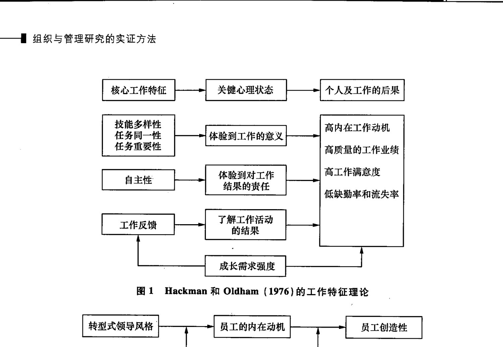

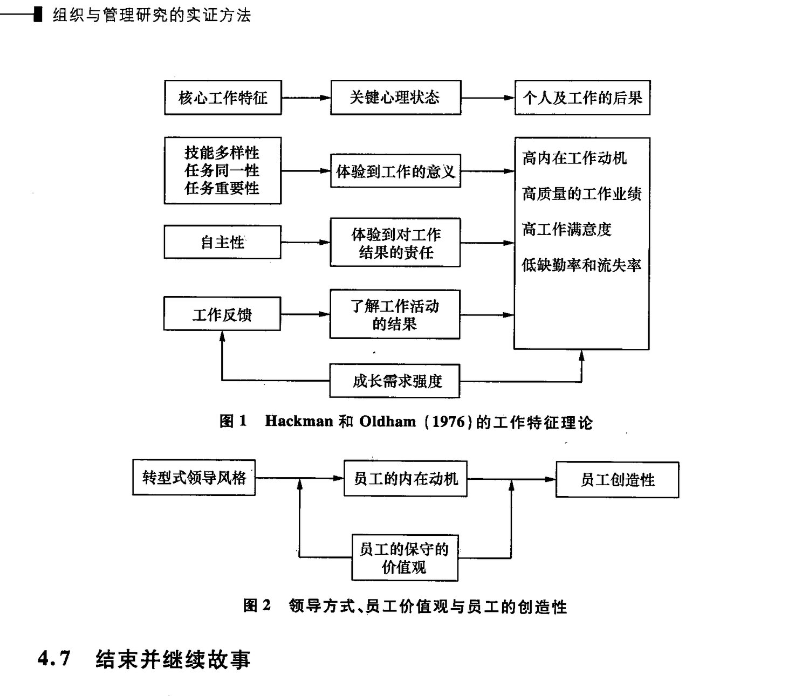

<!-- PDF页 95 -->

设,添加边界条件,或者提出另外的假设。我们个人所遵循的叙述原则就是不仅使得修改后的理论内部的各个要素在逻辑上是一致的和流畅的,而且要保证理论与数据之间是一致的。H.& 语

同任何领域中的科学研究一样,组织管理研究的重要目的在于建构理论。在多大程度上具有理论价值或者做出理论贡献是衡量一项管理研究水平高低的最重要的标准。组织管理领域中的理论,既不可能是自然科学中的那种包罗万象或者非常抽象的宏大理论,也不能成为就事论事的过于下碎的细微理论。管理研究者需要建立具有中等程度的抽象能够解释一定范畴内的现象的中层理论。概念是理论的基本要素,为此研究者必须能够选择或者创造恰当的概念来理解所需要解释的管理现象。无论是借鉴以往的概念还是创造性的概念,研究者必须对于概念的内涵进行清楚地界定,以便能够根据这个概念发展出可以观察得到以及可以被测量的变量。在概念或者变量的基础上,需要将不同的概念或者变量联系起来形成命题或者研究假设。研究者需要详细而清晰地阅述概念或者变量之间具有某种关系的原理或者逻辑,并且尽可能地揭示这些关系存在的条件。

在本章中我们曾述了四种主要的理论创新的方法:深化、繁入竞争和整合,并且提供了若干研究范例来加以说明。研究者可以运用这些方法中的菜一种或者多种来做出理论贡献。我们特别强调,理论建构离不开与同行的交流。在开展研究的各个阶段、特别是准备阶段,听取同一领域内其他同行的意见和建议是非常必要的。研究者越早地听取同行的反馈和评论,其研究越可能做出理论贡献。

作为研究论文作者的研究者需要通过恰当的写作来突出自己的理论贡献。作者要在文章一开始的部分提出一个有意思的问题,突出自己的理论贡献或者独特的视角,在明确自己独特的观点的情况下引用前人的研究来支持自己的观点、借助已有的实证成果支持自己的逻辑推理,借用图表清楚地表达自己的理论框架,在论文的讨论部分阐述将来可以从事的研究方向等。我们在这些方面给出了一些具体的建议,以便突出实证研究的理论贡献。

明确理论的构成理解实现理论创新的主要方法以及学会恰当的写作方式等都能够帮助研究者建立理论。但是,最重要的是研究者对于管理现象的观察和分析,并不断地修炼自己对于现象的洞察力。虽然本章在这方面没有过多的论述,但我们强调这是建构好的理论最有活力的智力源泉。

参考文献Bacharach, S. B. (1989). Organizational theories; Some criteria for evaluation. Acad-

<!-- PDF页 96 -->

emy of Management Review, 14, 496-515. ‘ * Bourgeois, L. J. (1979). Toward a method of middle-range theorizing. Academy of Management Review, 4, 443—447.

Brockner, J. and Wiesenfeld, B. M. (1996). An integrative framework for explaining reactions to decisions; Interactive effects of outcomes and procedures. Psychological Bulletin, 120, 189—208.

Burt, R. S. (1997). The contingency of social capital. Administrative Science Quarterly, 42, 339—365.

Chen, C.C. (1995). New trends in rewards allocation preferences: A Sino-US comparison. Academy of Management Journal, 38, 408—428, 1995.

Chen, C.C., Meindl, J.R. and Hunt, R.G. (1997). Testing the effects of horizontal and vertical collectivism; A study of rewards allocation preferences in China. Journal of Cross-Cultural Psychology, 28, 44—70, 1997.

Cohen, M., March, J. and Olsen, J. (1972). A garbage can model of organizational choice. Administrative Science Quarterly, 17, 1—25.

Davis, M. W. (1971). That's interesting. Philosophy of the Social Sciences, 1, 309— 344.

Deutsch, M. (1985). Distributive Justice. New Haven; Yale University Press.

DiMaggio, P. J. (1995). Comments on “what theory is not”. Administrative Science Quarterly, 40, 391—397.

Dougherty, D. (2002). Building grounded theory; Some principles and practices. In Joel A. C. Baum (ed.) Companion to Organizations; 849—867. Oxford; Blackwell Publishers.

Dubin, R. (1976). Theory building in applied areas. In D. Dunnette (ed.), Handbook of Industrial and Organizational Psychology: 17—39. Chicago; Rand McNally College Publishing Company.,

Farh, J., Earley, P. C. and Lin, S. (1997). Impetus for action; A cultural analysis of justice and organizational citizenship behavior in Chinese society. Administrative Science Quarterly, 42, 421—444,

Gardner, W. L. and Avolio, B. J. (1998). Charismatic leadership; A dramaturgical perspective. Academy of Management Review, 23, 32—58.

Glaser, B. and Strauss, A. (1967). The Discovery of Grounded Theory. Chicago; Aldine.

Granovetter, M. (1973). The strength of weak ties. American Journal of Sociology, 18, 1360—1380.

<!-- PDF页 97 -->

Hackman, J. R. and Oldham, G. R. (1976). Motivation through the design of work: Test of a theory. Organizational Behavior and Human Performance, 16, 250—279.:

Hannan, M. T. and Freeman, J. H. (1977). The population ecology of organizations. American Journal of Sociology, 82, 929-964.

He, W., Chen, C. C. and Zhang, L. H. (2004). Rewards allocation preferences of Chinese employees in the new millennium; Effects of ownership reform, collectivism, and goal priority. Organization Science, 15, 221—231.

Herzberg, F. (1966). Work and the Nature of Man. Cleveland; World Publishing.

Kwong, J. Y. Y. and Leung, K. (2002). A moderator of the interaction effect of procedural justice and outcome favorability; Importance of the relationship. Organizational Behavior and Human Decision Processes, 87, 278—299.

Leung, K. and Bond, M. H. (1984). The impact-of cultural collectivism on reward allocation. Journal of Personality and Social Psychology, 47, 793—804.

Meindl, J. R. (1995) The Romance of Leadership as a follower-centric theory; A social constructionist approach. Leadership Quarterly, 6, 329-341.:

Meindl, J. R. (1990). On leadership; An alternative to the conventional wisdom. Research in Organizational Behavior, 12, 159—203.

Merton, R. K. (1968). Social Theory and Social Structure. New York; Free Press.

Mintzberg, H. (1979). An emerging strategy of direct research. Administrative Science Quarterly, 24, 580—589.

Osigweh, C. A. B. (1989). Concept fallibility in organizational science: Academy of Management Review, 14, 579—594.

Popper, K. (1959). The Logic of Scientific Discovery. New York; Harper & Row.

Schwab, D. P. (1980). Construct validity in organizational behavior. In B. M. Staw and L. L. Cummings (eds.), Research in Organizational Behavior, Vol 2; 3—43. Greenwich, CT; AI Press.

Shamir, B., Pillai, R., Bligh, M. and Uhl-Bien, M. (2006). Follower-centered Perspectives on Leadership; A Tribute to the Memory of James R. Meindl. Greenwich, CT; Information Age Publishing..

Shin, S. J. and Zhou, J. (2003). Transformational leadership, conservation, and creativity; Evidence from Korea. Academy of Management Journal, 46, 703—714.

Stinchcombe, A. L. (1968). Constructing Social Theories. Chicago; University of Chicago Press.

Sutton, R. I. and Staw, B. M. (1995). What theory is not? Administrative Science Quarterly, 40, 371—384.

= aE Les) | 83

<!-- PDF页 98 -->

Tsui, A. S., Zhang, Z. X., Wang, H., Xin, K. R. and Wu, J. B. (2006). Unpacking the relationship between CEO leadership behavior and organizational culture. Leadership Quarterly, 17, 113—137.

Tversky, A. and Kahneman, D. (1981). The framing of decisions and the psychology of choice. Science, 211, 453—458.

Wagner, D.G. and Berger, J. (1985). Do sociological theories grow? American Journal of Sociology, 90, 697—728.

Wang, X.T. (1996). Framing effects; Dynamics and task domains. Organizational Behavior and Human Decision Processes, 68, 145—157.

Wang, X.T. (forthcoming). Risk communication and risky choice in context; Ambiguity and ambivalence hypothesis. In W. T. Tucker, S. Ferson, A. Finkel, et al. (eds.). Annals of the New York Academy of Sciences; Strategies for risk communication; Evolution, Evidence, Experience. Oxford, UK; Blackwell.

Weick, K. E. (1993). The collapse of sensemaking in organizations; The Mann Gulch disaster. Administrative Science Quarterly, 38, 628—652.

Weick, K. E. (1989). Theory construction as disciplined imagination. Academy of Management Review, 14, 516—531.

Weick, K. E. (1995). What theory is not, theorizing is. Administrative Science Quarterly, 40, 385—390.

Whetten, D. A. (1989). What constitutes a theoretical contribution? Academy of Management Review, 14, 490—495.

Xiao, Z. and Tsui, A. S. (2007). When brokers may not work; The cultural contingency of social capital in Chinese high-tech firms. Administrative Science Quarterly, 52, 1—31.

Zhang, Z. X., Zhang, Y. and Wang, M. (forthcoming). Harmony, negative fantasy, and conflict resolution of Chinese people. In K. -y., Leung, C. -y., Chiu and Y. -y., Hong (eds.), Cultural Processes; A Social Psychology Perspective. Oxford; Oxford University Press.

| 徐淑英、张志学(2006):管理问题与理论建立:开展中国本土管理研究的策略,《南大商学评论),第7期,第1一18页。

<!-- PDF页 99 -->

## 第四章 建构中国管理学理论的机会与挑战

RS)..建构中国管理学理论的机会与挑战黄光国台湾大学本章大纲一、 社会科学本土化运动的起因=. Bee 2.1 实证主义2.2 (Bee Fe) 2.3 REXEL 2.4 ”进化认识论2.5 哲学的转向2.6 素朴实证主义的研究=. 建构社会科学理论的机会3.1 西方社会学知识的预设3.2 客位研究取向3.3 “视文化为整体”的辩证方法四、 华人社会中企业组织的形态4.1 父系、族长制4.2 RK 4.3 市场独断制4.4 BOeRRK HH、 五、 华人大型民营企业中的三环文化结构六、建构社会科学理论的挑战sae | 建构中国管理学理论的机会与挑战 | 85

<!-- PDF页 100 -->

### 引言

本章的题目是“建构中国管理学理论的机会与挑战"。我从 20 世纪 80年代初期开

始致力于推展“社会科学本土化运动”,对华人社会科学落后的根本原因有比较深入的了解。在我着来,管理学既然是社会科学的一个分支,那么管理学者需要建构“中国管理学理论"的理由,和任何一门社会科学需要建构本土社会科学理论的理由毫无二致。在本章中,我将从一个比较宏观的角度来说明社会科学本土化发生的原因,然后说明社会科学本土化运动要有真正的突破,必须要作三个层次的突破:暂学的反思、理论的建构和实证研究。接着,我要讨论建构本土管理学理论的方法,从科学哲学的角度,举一些实际的例子,来说明建构中国管理学理论独特的挑战与机会。一、社会科学本土化运动的起因

在20 世纪 80年代初期,正当中国台湾地区社会科学界发起“社会科学本土化运动”的时候,日本、中国香港菲律宾印度、韩国、墨西哥等非西方国家和地区,也有一些心理学者不约而同地在推动“本土心理学研究” (Diaz-Guerrero, 1995; Enriquez, 1993; Kim and Berry, 1993; Lagmay, 1984; Sinha, 1986; Yang, 1997)。乍看之下,导致非西方国家和地区的心理学者发起“心理学本土运动”的直接原因是,他们认为,将西方心理学家所发展出来的心理学理论或研究范式,移植到非西方国家,并不能让当地的心理学者恰当地了解本土社会中人们的心理或行为。因此,他们认为有必要发展适用于本土社会的心理学理论和研究范式。

由于心理学家研究的对象是人,他们对于移植外来理论或研究范式所造成的“不奖合感”往往会有较深刻的感受(杨国枢,1999),他们也因此而首先“发难”,发起心理学本土化运动。事实上,有“本土化"之需要者,并不限于心理学,而是遍及各个不同领域的社会科学,当然也包括管理学。

随着心理学本土化运动的开展,世界各地的本土心理学者在开展心理学本土化的工作上都遭遇到形形色色的困难。我在深入检讨这些问题之后,指出:当代的社会科学,可以说是从西方文明中发展出来的。西方文艺复兴运动发生之后,科学开始快速地发展。尤其是 18 世纪工业革命发生之后,其发展尤为快速。西方科学的发展与科学哲学的演变有一种互为体用的关系:西方科学家在不同领域中从事研究工作,总有一些思想家在对他们建构的知识进行哲学的反思,而形成所谓的科学哲学 (philosophy of sci-

ence),这样的科学哲学又可以回过头来,指引科学家从事研究工作。

非西方国家的社会科学工作者在推动本土化运动时之所以会遭遇到种种困难,其根本原因在于;他们在学习西方的社会科学时,大多对西方科学哲学的演变缺乏相应的理解而抱持着一种“素朴实证主义”(naive positivism) 的心态,在从事研究工作。这种“素朴实证主义”的心态,可以让他们套用西方社会科学的范式来从事研究,然而,要想

<!-- PDF页 101 -->

以之作为基础,来建构本土社会科学理论,便有明显的不足。因此,黄氏主张:本土社会科学要有真正的发展,必须作三个层次的突破:哲学的反思、理论的建构和实证研究(Hwang,2004, 2005)。更清楚地说,本土社会科学家必须对近代科学哲学的演变有一相应的理解,以之作为基础,建构契合于本土社会的理论,再用它作为实证研究的指引。

基于这样的见解,我在 2000年初期出版了一本书,题为《社会科学的理路)(黄光国, 2001/2006),介绍 20 世纪提倡实证主义、后实证主义、结构主义、诠释学和批判理论 |的 17 位西方科学哲学家对于本体论、知识论和方法论的主要观点,希望能够帮助华人社会科学工作者了解近代科学哲学演变,其简体字版本最近已经由中国人民大学出版社予以出版。在下一节中,我将讨论科学哲学由实证主义转变到后实证主义之后,在本体论、知识论和方法论等方面所产生的巨大变化,及其对社会科学研究所具有的意涵。

### 二、科学哲学的转向2.1 实证主义

18 世纪,工业革命发生之后,科技的进步使欧洲弥漫着一股科学主义(scientism) 的风潮,许多人相信科学能够回答人类所有的疑问,解决所有的问题。到了 19 世纪,法国科学家和孔德(Auguste Comte, 1798一1857)首先提出“实证主义”(positivism) — ia], #1一种极端经验论的立场,主张正当的科学方法,应当将形而上学的猜测以及用不可见的实体来解释自然,一律予以舍弃,科学知识应当仅限于收集事实,并找寻其间的关系,借以对世界作出正确的描述。(Comte, 1855/1974)。

到了 20 捞纪初,物理学家马赫(Ernst Mach, 1838一1916)提出物理现象论(physical phenomenalism),主张现象就是唯一的真实,知识的内容应当仅限于感官经验。科学的目的是要透过实验展句出支配事物之法则。所谓“现象背后的真实”,都是人类想象出来的,是形上学的东西,应当排除在科学之外。一旦认识到经验主导性(the primacy of experience),并将“有意义的叙述”(meaningful statements) 限定在经验的范围内,我们便没有理由再去找寻支撑概念建构的更深层的“实在”(Kolakowski, 1972/1988)。

马赫的思想对欧洲学术界产生了深远的影响。20 世纪初期,一群数学家、物理学家、社会学家开始在维也纳做不定期的聚会,讨论科学哲学的问题,希望解决将实证主义应用在数学及理论物理时可能遭遇的困难。1928年,维也纳学圈(Vienna Circle)在石里克(M. Schlick, 1882一1936)的领导下,成立了“马赫学社” (Ernst Mach Society),并在型年出版《科学的世界观:维也纳学圈》一书,使其声名大品。

### 2.2 《逻辑哲学论》

在维也纳学圈发展之初,维根斯坦(Luwig Wittgenstein, 1889—1951) 出版的《逻辑哲学论》对其日后的发展产生了重大的影响。这本书的内容主要包含“软辑图像论”和“真值函数论"两大部分(见图1)。“远辑图像论"认为:科学家的主要任务,就是用语言

| AHP MESES EOMS RD | 87

<!-- PDF页 102 -->

精确地描绘世界。现实世界是由事实、原子事实和简单对象等三个层次组成的;与之对应的语言,则包括有命题,基本命题和简单名称等三个层次。世界一——一事实1 oe 事实n让——一原子事实| FMB -7 HRI oo RR! I | |- (图像关系) BB 名称n | |基要命题|。...”基要命题n ------4 L_§___1命题1 -... 命题a (真值函数关系): We图1 《逻辑哲学论》中世界与语言之间的关系

资料来源:陈荣波(1982:70)。

“简单对象”(single object) 是构成世界的实体,是构成原子事实、事实、乃至于世界的终极结构元素,无论发生什么事情,它都不会发生改变。原子事实是简单对象(事物、实体) 以一定方式的组合,是许多简单对象在一定时间和空间内结合的状态。当这种组合分散之后,这一事物也随之消亡。但是,简单对象自身却不消亡,它们又和其他对象组合,形成新的事物。

语言是描绘世界的图像,每一命题又是描绘一个事实的图像。图像要描绘事实,它们的每一个组成部分和外界现象的每一个组成部分,必须有——对应的关系。这种对应关系,维根斯坦称之为“图像关系”(pictorial relationship)。

在语言和事实的深处,隐藏有一定的逻辑结构。将此一结构揭示出来的唯一方法,就是逻辑分析。只要我们对语言和现实事物作同步的逻辑分析,最后我们一定会发现:两者之间有相应的逻辑结构。将这样的逻辑结构揭露出来,我们便可以利用它来构造命题,以描述世界中的事实。这样的描述方式,维根斯坦称之为“逻辑结构图像”。

### 2.3 ”逻辑实证论

描述“原子事实”的语言,是组成“命题"的基本单位,维根斯坦称之为“基要命题” (elementary proposition)。在维根斯坦的前期哲学中,基要命题占有十分重要的地位。虽然我们可以用语言来描述世界,但其中只有“基要命题"跟世界有直接的关联。一个

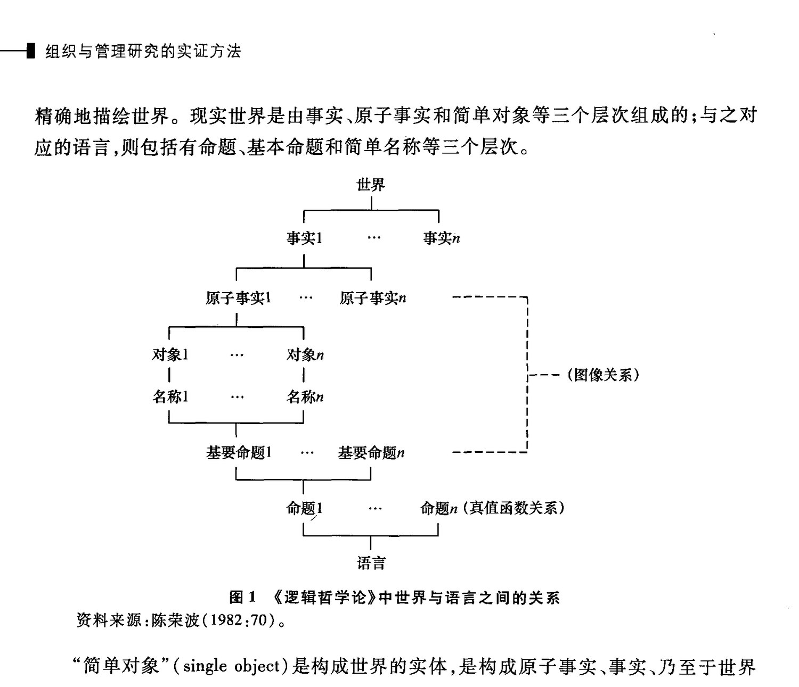

<!-- PDF页 103 -->

基要命题代表一种事物的状况(state of affair)。它们的真假不取决于别的命题,而是取RFK, ME BRA RI”,我们可以用实验或其他实证研究方法,来判断情况或“原子事实”的存在或不存在,借以论断基要命题的真或假。然后,我们可以再利用逻辑符号之间的“真值函数"关系,将“真"的“基要命题"结合成“命古",成为科学家描述“世界”的“语言”,这就是一般人所谓的“科学知识”。换句话说,近代科学两个最重要的成分,第一是以实验作为核心的“实证”研究方法;第二就是“逻辑”,维也纳学圈的成员因此将此种主张称之为“逻辑实证论” (Logical, Positivism) (Ayer, 1932/1959)。

“逻辑实证论”在本体论上采取“素朴实在论”(naive realism) 的极端经验主义,认为唯有感官能够经验到的“事实"(fact),才是唯一的“实在”(reality) (Schilick, 1932/ 1959)。在方法论上,他们主张用实证研究(尤其是实验)方法,来证实“基要命题"。维也纳学圈召集人石里克因此归结出一个十分出名的主张:“一个命题的意义,就是证实它的方法"(Schlick, 1936)。在知识论上,他们强调逻辑的推演,而反对用任何形而上学的概念来建构理论。2.4 ”进化认识论

在维也纳学图的积极推广之下,钦辑实证论风行一时,成为20 世纪中叶国际科学社群里最具优势的一种科学哲学。然而,盛极而衰,在那个时代,后实证主义的兴起,却使得实证主义的科学哲学受到强烈的质疑。后实证主义的代表,是波普(Karl R. Popper, 1902一1994)提出的进化认识论(evolutionary epistemology), 1919年,欧洲学术界发生了一件大事:英国天文学家爱丁顿在日食时的观测结果,支持了爱因斯坦广义相对论中有关“光线弯曲”的奇异构想,使欧洲掀起了一阵相对论的热潮。当时在维也纳大学当旁听生的波普,因此而产生了一个影响他一生的重大思考:牛顿万有引力定律多年来已经经历千百次的检验,为什么一次失败后,就会产生动摇?

当时爱因斯坦谦冲为怀的态度,让波普留下了深刻的印象。爱因斯坦不仅公开宣称:相对论只是他的“猜测”而已,而且表示:如果爱丁顿的观测结果否定了他的预测,广义相对论就会被否决掉1

爱因斯坦的治学风格吸引了年轻的波普,让他致力于研究科学暂学。1932年,他写成《科学发现的逻辑》,主张科学方法应当是以理性批判为基础的演绎推理。科学家先针对特定问题提出假说和猜想,再依据事实对假设进行检验,并在检验的过程中不断修改原有的假设和猜想(Popper, 1934/1959)。

我们可以用波普所提出的四段图式来说明他的进化认识论:

Pl—TT—»EE—»P2

P 表示问题(problem), TT 表示试探性的理论(tentative theory), EE 表示排除错误(error elimination)。倘若要以此一图式来表示普遍性的试错法,则图式中的 TT 可以改变为 TS(试探性的解决,tentative solution)。后来,他又将这个图式修改为图1 (Popper,

| 建构中国管理学理论的机会与挑战 | 89

<!-- PDF页 104 -->

1972/1989:313),而成为此一图式的普遍形式: | Pl—— ~ TS2 ——> BE —— Pp2 Ls I图1 波普的四段图式这个经过修正后的普遍图式的含义为:当科学家的研究遭遇到挫折或是他原有的知识陷入困境的时候,他会设法对这个问题情境提出试探性的解决方案。这种解决方案可能不只一个,也不一定正确,因此必须将错误的解决方案排除掉,保留尚未被否定掉的解决方案。这样留下来的方案又可能遭遇到新的问题,如此往复,以至于无穷。在科学理论的场合,问题的产生通常是出自于下列三种不同情境:(1) 理论与观察或实验的结果不一致; (2) 理论系统内部发生互相了矛盾的现象;(3) 两个不同理论之间的互相冲突。这时候,科学家便可能提出试探性的理论。当然,这样提出来的试探性的理论并不就等于真理,它也可能被后来的观察或实验否证掉。2.5 哲学的转向进化认识论和这辑实证论的科学哲学,不论是在本体论、知识论和方法论等方面,都是南辕北加,极不相同:在知识论方面,进化认识论不像逻辑实证论那样,采取“多辑图像论”,只以精确地描绘世界图像为满足,而主张要建构理论,来解释人们所观察到的事实或现象。而在本体论方面,进化认识论认为:科学家为了解释事实或现象,在建构理论时,必须提出各种形而上的概念,这种形而上的假设建构,不是一种虚构,而是一种“实在”。因此,其本体论主张通常称为“科学实在论”(scientific realism)。正因为科学理论是科学家建构出来的,而不是“描绘世界的图像”,因此,进化认识论在方法论方面主张“证伪论”(falsificationism),认为科学家的主要任务并不是在于“证实"命题,而是在于“证伪”理论中的命题,他们认为:一个科学的理论必须具有“可证伪性”(falsificability)。如果一个理论的陈述或命题无法用实证方法来加以检验,则它便不能称做是“科学”的。2.6 索朴实证主义的研究:科学哲学由实证主义转向后实证主义对于科学研究具有十分重要的意义。许多非西方国家的科学研究工作者往往不了解:这样的哲学转向对于学术研究具有什么样的意义,而只是抱着一种“索朴实证主义”的心态,从事实证研究工作。许多人看到西方学者建构出一个又一个的理论,总以为其中蕴藏着什么“真理”,他们会努力地在国外最新的期刊上找寻研究题目,然后沿用外国“最适当”的理论模式,将外国的测量工具翻译成本国文字,以本国被试为对象,从事“复制型"的学术研究。有些人不管外国理论,凭自

<!-- PDF页 105 -->

己的常识,“大胆假设、小心求证”,随意编出几条假设,便大作其“实证研究”"。还有些.人干脆连假设都不要了,他们用“撒网捕鱼”或“机关枪打鸟"的办法,同时测量一大堆变项,列出几十个交叉分析表,希望呈现“事实”",“让数字自己说话”。电脑发达之后,有些人则是高度依赖统计技术,以为只要用复杂的统计来处理资料,便可以从其中浮现出“理论模型”。

在20 世纪 80年代初期,萧新煌和张笠云(1982)回顾受国科会、研考会、经建会及其他单位委托所完成的 15 项经验研究。他们指出:即使是从实证论范式的观点来看,这些研究也有许多“共同的缺失"。他们大多缺乏理论基础,既没有“理论性推理”,也没有“逻辑的推广”,理论架构和研究设计明显脱节。许多研究者只是将收集来的问卷资料,作简单的统计分析(如百分比、次数分配、交叉分析),用一连串的表格呈现出来,再对资料性质作重复叙述,便算大功告成。由于测量的变量太多,每个独立变量对因变量的解释能力都偏低,既不能符合社会科学研究“精简”的要求,也无法从其中建立理论。许多研究者更用一些“想当然尔”的常识,来解释其研究发现,璧如“中西文化的差异”、“传统与现代的不同"“社会变迁的影响”等。他们认为:这种研究只不过是在“堆砌事实资料”(a collection of facts)而已,是“没脑筋的经验主义”(mindless empiricism)的搞法,根本不可能将“经验研究”提升到“成熟科学”的阶段。

### 三、建构社会科学理论的机会

倘若非西方的社会科学工作者了解科学哲学演变成“后实证主义”对于社会科学研究工作所具有的合义,建构适合本土社会的各种社会科学理论(包括管理学理论)反倒充满了许多可能的机会。前一节谈到,依照波普的进化认识论,产生科学问题的重要情境之一,是“理论与观察或实验的结果不一致”"。事实上,只要非西方社会的科学工作者不迷信西方的社会科学理论代表某种“真理”,他就很容易发现,当他把西方的社会科学理论或研究范式移植到非西方社会之中,其实很容易看到“理论与观察结果不一致”的现象。3.1 西方社会学知识的预设

在一篇题为《对社会学一些预设的反省》的论文中,叶启政(1987/1991)指出:以欧美为主建构出来的社会学知识,是建立在几个基本预设之上:首先,社会科学所关注的,是人由生到死,在社会中活动的这一段日子。它既不管“前生”,也无所谓“来世”,而只接受一般人在日常生活中对其社会互动关系所持的基本价值和认知态度,并据以对社会生活作概念上的重建工作。

由这种“世俗现世观”,可以衍生出第二个预设,即“占有满足观”,其基本论点是:凡人和沸有欲望,社会最主要的意义,在于提供最有利的条件来拓展并满足人们的欲望。 |

sae | 建构中国管理学理论的机会与挑战 |97

<!-- PDF页 106 -->

第三个预设,叶氏称之为“化外结构观”,具体地说,由于和欲望无穷可能导致人与人之间的争斗,为了化解冲突,也为了维持秩序,社会中一定要有一个权威体来作为维持社会秩序的中介。这个中介体的具体形式,即为“联合体”(commonwealth)或“国家” (state),它具有独立于个人意志的“统治权”(sovereignty)。

这三个预设其实不只是西方社会学的预设,而且是西方社会科学(包括管理学)的共同预设。这样的预设是建立在西方“个人主义”的文化传统之上,以这种预设为基础所建立起来的西方科学理论是否适用于非西方社会,其实是大有问题的。

### 3.2 ”客位研究取向

SABE XC > BHF (cross-cultural psychology) 的角度来看,不考虑西方科学的预设,而假设西方社会科学家所发展出来的研究范式普遍适用于每一个社会,是“强加式客位”研究取向(imposed etic approach) (Berry, 1989)。这种盲目移植西方研究范式的做法可能造成的问题是显而易见的,它们正是促成本土心理学发展的主要原因。有些跨文化心理学者因而采取一种“衍生式客位”研究取向(derived etic approach),将非西方社会也考虑在内,而发展出一种普适性的研究范式,企图用它在各个不同的社会中从事研究。其中最著名的例子是“个人主义/集体主义”(individualism/collectivism) 的研究。

Hofstede(1980)原本是在 IBM 公司人事部门从事研究工作的心理学家,为了方便跨国公司的人事管理,刻意编制出一份测量工作态度与价值观的量表,以 IBM 公司在四十个国家的分公司员工作为对象,收集大量的实证研究资料,并以国家为单位作因素分析,得到了四个向度:

1. 个人主义/集体主义

2. 男性化/女性化

3. 权力距离(power distance)

4. 不确定性的规避

在这四个向度上,这四十个国家都各有其位置,尤其是以它们在“个人主义/集体主义”向度上的分布,更是吸引了许多研究者的注意。

这份题为《文化后果》的研究报告出版之后(Hofstede,1980),许多心理学者陆续研究此一主题,此后二十年间,他们编制了二十几种“个人主义/集体主义”量表,从事相关研究,并累积下大量实证研究资料(Oyserman,,Coon and Kemmelmeier, 2002)。

乍看之下,这种“衍生式客位”研究取向似乎是一种公平对待各文化(cultural fair)的方法。然而,Friedlmeier,,Chakkarath 和 Schwarz(2005)等人却认为:这种研究取向其实是建立在实证主义的预设之上的,它假设世界各地的文化差异可以化约成一个本质上不变的(qualitative invariant)文化变数(cultural variable)。这种实证主义式的预设显然潜茂有极大的问题。 集体主义文化可能包含原始的渔.猫社会“文革”时期的中国、共产党统治下的苏联或者以色列的基布效 (Kibbutzim)。

<!-- PDF页 107 -->

集体主义社会是集权的,也可能是民主的;集体主义式的人际联结可能充满温情,也可RES AER. Triandis(1995) 曾经区辨出集体主义文化六十种不同的属性,换言之,所谓的集体主义社会在这最少六十种的属性上会可能有所变异。假设集体主义文化具有不变的属性是错误的。3.3 “视文化为整体”的辩证方法文化心理学者 Ratner(1997, 2002)因此主张采取本土心理学的研究取向,“视文化为整体”(culture-as-a-whole),并将每一个文化因素(cultural factor) 看做其结构中的一个单位,用辩证的方法来加以理解。用 Vygotsky(1987)所主张的辩证心理学来说,这种文化结构中的每一个单位(unit)仍然保有其整体的基本特质(the basic characteristics of the whole),而不是将整体文化拆解成互不隶属的元素(elements)。这可以说是跨文化心理, 学者所主张的一种“文化特殊性研究” (emic approach) (Berry, 1989),我们可以举一个例子来说明:如何用这种辩证的方法,建构“侨家关系主义”中的“庶人伦理”。在《儒家思想与东亚现代化一书中(黄光国,1988),作者首先综合孔子、孟子和荀子对于人性的论点,建构出一个“儒家的心之模型"。依照作者的分析,儒家经典中最能够反映人血家伦理中“仁”"“义”"“礼”三个概念之间的复杂关系者,是《中良)所说的一段话: “仁者,人也;亲亲为大。义者,宜也; SK, RELA MESS ASHE也。”《第二十章》: “杀”即是差等之意。这一段话,不只说明了“仁”“义”“礼”三个概念之间的关系,而且说明了侨家评量角色关系的两个向度。更清楚地说,儒家主张个人和任何其他人交往时,都应当从“亲朴”和“尊插”两个认知维度(cognitive dimensions)来衡量彼此之间的角色关系:前者是指彼此关系的亲政远近,后者是指双方地位的尊插上下。用西方社会心理学的“正义理论"来看,儒家主张,在人际互动的场合,应当先根据“苯尊”的原则,决定谁是“资源支配者”,有权选择资源分配或交易的方式;然后再由他根据“亲亲”的原则,决定资源分配或交易的方式。儒家以为君臣、父子、夫妇、兄弟、朋友是社会中五种最重要的基本人际关系,人备家称之为“五伦”。 五伦中,每一对角色关系的互动都应当建立在“仁”的基础之上,可是,在侨家的观念里,这五种角色关系中,除掉“朋友”一伦属于对等关系之外,其他四伦都蕴涵有“上下、尊卑”的差序关系。这四伦中,任何一对关系涉及的两个角色,其社会地位有高下之分,其掌握权力亦有大小之别: “何谓人义? RE FE AR, BH RMT KE OMB, BR, eS AX.” (4lid + 礼运篇》《礼记》之所以特别界定这十种“人义”,乃是因为涉及上述“人义”的五对角色之间,都蕴涵有社会地位的差等关系。更清楚地说,依照“十义”的原则,扮演“父、兄、夫、Bits | 建构中国管理学理论的机会与抗战 | 93

<!-- PDF页 108 -->

长.君”等角色的人,应当分别依照“慈、良.义、惠、仁”的原则作决策,而扮演“子弟、妇幼、臣”等角色的人,则应当遵守“孝、悦、听、顺、忠”的原则,接受他们的指示。一方面为支配者,一方面为从属者,其间的尊卑主从关系至为明显。考虑互动双方之角色关系在“地位尊乍"上的差距之后, “资源支配者”下一步的工作,便是要根据“亲亲”的原则,选择最恰当的资源分配或交换法则。用“侨家的心之模型"来看,考虑互动双方关系的亲政,是侨家所谓的“仁”; 依照双方关系的亲疏选择适当的交换法则,是“义”;考虑双方交易的利害得失之后作出恰当的反应,则是“礼”;三者构成了儒家“仁义、礼”伦理体系的核心部分。如图2 所示,在“儒家的心之模型"中,作者以一条对角线将和“仁”对应的长方形分家所主张的“仁”,是有差序性的“亲亲”,而不是普遍性的对任何人都“一视同仁”。同时,作者又以一条实线和一条虚线将代表“关系”的长方形切割成三部分,并依其“情感人间的“情感性关系”和家庭外的“混合性关系”之间以一条实线隔开,意思是说:儒家认为,家人和外人之间存有一种难以穿透的心理界线(psychological boundary),应当根据不同的“分配正义”或“交换法则”来进行社会互动。资源分配者的心理历程仁 x al a | | 90 1. 关系判断 2, 交换法则 3. 心理神突© 情感性因素口工具性因素图2 偶家诡人伦理中的“仁一义一礼”伦理体系上述作者对儒家“底人伦理”的分析,是从社会心理学的观点,在文化的层次上,将儒家所主张的“底人伦理”视为整体,用辩证的方法分析各个文化单位与整体结构之间的关联,各个文化单位又保有整体的基本属性。用同样的辩证方法,我们还可以进一步讨论颂家文化传统中各种文化因素的意义,建构出相关的社会科学理论,当然更可以此作为基础,来从事实证研究。举例言之,在过去十几年中,作者以这样的整体结构作为参考架构,所探讨过的文化因素包括:道德观(Hwang,1988)、正义观(黄光国,1991)、",

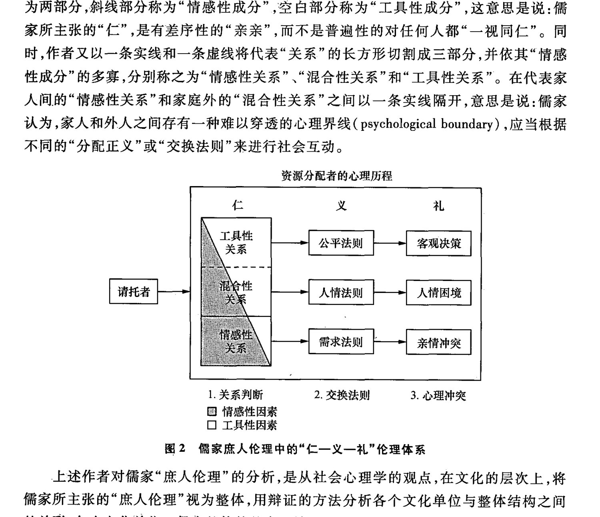

<!-- PDF页 109 -->

人和情与面子(Hwang, 1987)、人际冲突(Hwang,1987一1988) 等。

” 四、华人社会中企业组织的形态

由此可见,只要对西方科学哲学的演变有相应的理解,采用上述的辩证方法,不论是要建构本土社会科学理论,或是要从事实证研究,都是充满了无穷的机会。“关系主义”的文化衍生自任家文化传统,当然也会展现在华人的企业组织之中。我们可以再举一个例子来说明:如何用本土心理学的“主位”研究取向,来建构中国的管理学理论:

在儒家文化传统的影响之下,华人所经营的企业,其企业组织的形态会呈现出什么样的特色呢? 以往许多田野研究一再显示:台湾的家族企业靠家族关系素集资金,创立企业,其组织原则是以关系网络在组织内相互合作,同时在组织间形成协力关系(Silin, 1976;Greenhalgh, 1988;谢国雄, 1989;柯志明,1993;陈介玄,1994)。 郑为元(2003)回顾以往的相关研究后指出:事实上,华人社会中企业的组织形态有并不是一种,而是有几种不同的形态。他依照企业内的经营权和所有权是“合一”或是“分开”,及其市场环. SURE“ SEG” ME ESR”,将华人社会中的企业分成四大类型(见表1)。台湾的企业大多是自由市场里的中、小型家族企业。这种企业的特色之一,是所有权和经营权合一的企业。企业内的员工与老板多少有些亲族关系,社会学家通常称之为传统社会连带。这是台湾最常见的企业范式,其内部运作规则深受传统儒家伦理的影响,却其少受到国家的干预。这类企业中的职工和老板虽然有某种传统社会连带,但在完全竞争的市场中,他们的工作条件却缺乏劳动法的保障。从文化人类学的角度来看,这类企业又可以再分为两大类。

Rl 华人社会中企业组织的形态{ 取自郑为元,2003:22) | | a |

(有传统社会连带) (无传统社会连带) 4.1 父系.族长制la. LRM

在文化人类学上,父系制(Patrilinealism) 是指世系和祖产的继承制度采用父系制。父系制的家庭企业在世界各地都很普遍,但在华人社会中,尤为明显。台湾中小企业中的员工往往是企业家族的成员,或者与企业主有菜种血缘关系(Orru, Biggart, Hamilton,1997)。华人企业是以“系谱中心主义”和“身份关系”作为结构之基础,欧美企业则是以“个人主义"和“回约精神"为基础(陈其南、邱淑如,1984)。依照父系制的“系谱”,

| 建构中国管理学理论的机会与挑战 | 95

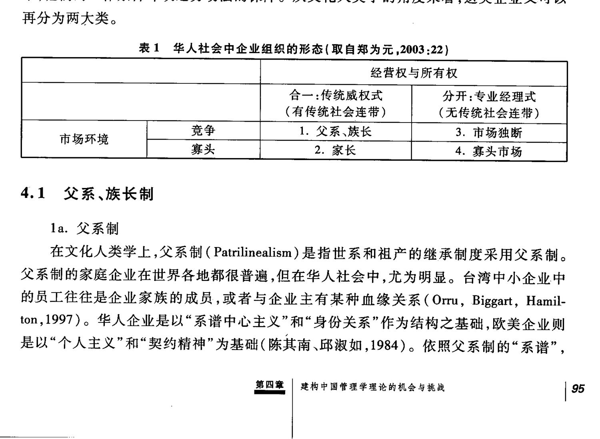

<!-- PDF页 110 -->

父亲将企业的所有权和经营权传给和自己有直系血亲关系的儿子,而不是交给专业经FHA 日本的企业虽然也强调家族,但是在明治维新之前,日本的平民并没有姓氏,其家业继承的法则是单一继承制,而且既不限于长子,也不限于血亲,和华人极不相同。台湾的华人采取诸子均分制,企业创立者固然要一脉相承,企业集团主持人通常还会为每个儿子都成立一个子企业,让每个儿子在分家之后,建立自己的一脉,当一脉之主。因此台湾的企业集团大多作水平的多元化,而较少作垂直的整合(Hamilton,1996)。

父系制企业的经营阶层虽然重视传统社会连带,基层员工和经营者之间却未必有血缘关系,更轧论直系血亲关系。同一企业内的员工会因他们和企业主的关系亲疏远近,而受到不同的待遇,形成所谓的“差序格局*"。父系制的概念源自于传统农业社会,采取父系制的中小型家庭企业,在现代社会的自由市场中,必须面临市场的无情竞争。因此,台湾家族企业的组织管理,需要靠关系来支持长时期加班和劳累的工作。老板夫妇通常会“和工人一起工作,像姊妹一样地对待她们......不觉得他们是头家,而觉得他们自己只是工人,而且比他们的员工更卖力、工时更长”(谢国雄,1989:48)。台湾老板常常“带头示范”,以自己的技术水准要求部属,部属则会以“头家脸色作为工作的依归”。人台湾企业是靠““人拼出来'的,而非制度的合理化”(陈介辫,1994:59一60)。在这种情况下,非老板家人的职工,就会觉得老板对职工要求过若。所以当企业扩张时,如果只靠老板的核心“班底”带头做,而没有制度化的激励,这种劳寥一体的打拼,就很难继续维持,这时候老板往往要“以“分成,共负盈亏"的方式绑缚工人”(柯志明,1993: 144)。

1b. 族长制

“WK fil” (Patriarchicalism) 原本是指家族或部落的权力在男性长老或父亲手中。根据 Max Weber(1978:1006一1069)的说法,“族长制支配的基础,是基于族长对其家户(household)的权威(authority)”。和科层制比较之下,属下对上司的支持虽然都是源自于其内心对于规范的遵从,但在科层制下,规范是基于抽象的合法性和个人所具有的专长训练;在族长制下,规范则是源自于传统和对族长个人的忠诚。族长的支配是以自然的个人关系为基础,是在共同生活和依赖中所产生的,因此也不会受到法律的限制(Weber,1978;1006-7),

“族长制"这个概念所指的劳动体制是:在中小企业中,老板(业主或包工头) 以长者的地位照顾有亲属关系或乡谊的员工(Deyo, 1989)。在台湾的企业中,这是指亲友或经由亲友和员工介绍,“对内招考”进来的“有担保的工人”(柯志明,1993)。从韦伯的概念来看,血亲并不是族长制的要件,而是父系制的要件。中国改革开放初期,乡镇企业往往由具有权威的地方党政首长主持,员工的主要来源则是家族和地域性的连带,这也是族长制的例子(Vogel,1989)。这种乡镇企业,大多是由党支书兼村长带头拼出来的。乡镇企业发达后,如果进一步雇用廉价的“外地劳工”,就不在族长制的照顾之下。

"

<!-- PDF页 111 -->

### 4.2 家长制

家长制(Paternalism)可以说是仁慈的家产制。这个概念是指传统式的权威服从,以及职工福利的提供。它是社会学的概念,而不是文化人类学的概念。家长制的目的在于缓和工会运动,使业主对劳工能够作完整的支配。这种企业通常建立在孤立并以单一企业作为中心的公司城中(company town) (Ackers, 1998)。公司在当地有显赫的声望,公司的威权从工作、休闲、宗教活动延伸到私密性的职工家庭生活,无所不管。职工不只在经济上而且也在生活上依赖公司。因为公司性质特殊,劳工来源有限,此类企业的劳工市场不是完全竞争,而是赛头的。业主自记为道德导师,坚持传统工作理念,并对工会采取抗拒的立场,这不符合全球化的多元社会趋势。

第二次世界大战之后到 20 世纪 90年代之前,台湾和内地的公营事业都可以看做家长制的。国家或政府代表大家长,通常被视为具有男性的权威。父系制或族长制的家族企业必然会受到自由市场的冲击和挑战,公营企业却可以借由国家权力垄断市场,而长期受到保护。由于“铁饭碗”和“大锅饭”对员工生活保障有余,动力不足,使得传统家长威权很难管理散漫的职工。内地学者李培林、姜晓星、张其仔(1992) 以“母爱主义”来描述内地公营企业中的各种现象,以有别于家长制的“父爱主义”。受到国家过度宽容的公营企业,就像被母亲宠坏的孩子,不但享受各种特权,而且在母亲(国家)的偏爱之下,听任其严重弓损。有些久有企业甚至还可以在税收,上缴利润和承包基数等方面不断地和国家讨价还价,表现出某些学者所描述的企业“撒娇行为"。(同上,p. 285)

家长制的特点是在劳寥关系中,讲究上下关系间传统式的服从,而老板则必须照顾职工的福利。照顾的范围和程度属于老板的权责,而不是由职工组织工会来争取。有时候,政府为了表示重视劳工权益,也会在公营事业里强力扶助工会组织。此时企业只有设法和工会和平共存,让工会发挥一些有益的功能,成为企业的助力。工会组织也可能变成劳工参与的机制。当劳资争议发生时,政府会设法全力调和,使劳资双方采取合作而非对抗的途径。因为这类企业的经营权和所有权是分开的,管理阶层的劳寥地位比较模糊,容易形成管理阶层和劳工一体。由于公营事业具有赛头市场的优越地位,在政府干预和工会的保护之下,其劳动力可以免于市场的竞争,劳工工作权因而有相当程度的保障。然而,在全球化的趋势之下,政府不得不采取公营事业民营化的策略。不论是在台湾或是在中国内地,这种类型的企业组织都有日益减少的趋势。4.3 市场独断制

市场独断制(Market despotism) 和垄断市场制是经济学的概念,而不是文化人类学的概念。市场独断制是指在市场竞争之下,劳工完全受到市场的制约。尤其是在劳力密集工业中,劳工主要来自乡村或海外的外籍移民(Burawoy,1985)。市场独断制和父系制或族长制的大多数中小企业,都处在完全竞争的劳动市场中,其间最大的差别,在

| 建构中国管理学理论的机会与挑战 | 97

<!-- PDF页 112 -->

于市场独断制的所有权和经营权是分开的,在专业经理人的管理之下,劳工跟雇主间欠缺传统社会连带,是 Deyo(1989)所说的无保障劳工或“超级无产阶级”(见表1)。

“市场独断制"也普遍存在于高科技企业中,管理界通常称之为“人力资源管理” (HRM)。为了要应付国际化、自由化、技术竞争的压力,并抛弃大企业“重视年资*"、“终身雇用”、“告老退休”制度的历史包补,HRM 会采用各种策略,来加强对员工的支配,分散员工团结,打破自主工会的力量。这些策略包括目标管理(MBO)、品管圈(production circle)、生产委员会(production committee) `工作生活品质改善方案 (quality of work life projects)、绩效薪酬制(performance-base compensation),如按件计酬、工作奖金、利润分享(profit sharing)、净额红利(lump-sum bonus) 等。这些策略可以抗拒工会争取全面一致调薪的要求,并消除部分低效率员工搭加薪便车的机会。4.4 2ORRD Ha

BU RIE TH GH fill (Monopoly or Oligopoly Market) 系由大企业以雄厚资本和技术垄断,在产品市场上居支配地位。在欧美国家,大企业的劳工同时也是大工会的成员,享有各种福利的保障(Baran and Sweezy, 1966; Edwards, 1979)。 战后欧美的跨国企业则往往会以垄断资本(monopoly capital) 和窒头市场将劳动市场分割,用提高利润和减低劳动成本的方法,来应对大工会的压力。不论是在台湾,或是在采取改革开放政策之后的中国内地,都有许多欧美跨国企业前往投资,在当地成立垄断(窒头)市场制的企业组织。不过在产品循环,技术变迁快速,贸易自由化和全球化的时代潮流之下,西方大企业可能也失去赛头优势。结果是大企业兼并频繁,大量裁员,工会不再有力量和企业抗BE SEK TH Hy Hil th BE BE A TH HAH MT Hl

### 五、华人大型民营企业中的三环文化结构

表1 是从社会学的角度分析华人社会中各种不同类型的企业组织。在一般情况下,一个企业组织是属于一种体制,华人所经营的民营企业大多属于父系制或族长制,国营企业则属于家长制。然而,当华人的中小企业逐渐发展成为大企业之后,在华人关系主义的影响之下,其组织及管理形态便复杂得多。郑伯坝(1995) 的研究指出:在台湾的大型家族企业内,企业主会因职工关系的亲疏、忠诚和才能的不同,对职工采取“差异管理”,形同属于不同的劳动体制。换言之,一个企业内部同时存在着三四种不同的体制。郑伯埙、林家五(1998)的研究显示,居于大型家族企业最高的所有层和经营决策层级的,是和企业主关系最近的人,主要是他的家人以及少数和他有亲信关系的“自己人”;在中级管理层级,主要是可以作为企业主之心腹的“自己人”;而较少有家人;而在基层,则是和企业主没有特殊社会关系的普通职工(“陌生人"或“外人”)。 这种亲疏关系和他们所称的三种企业文化,“情感(责任)取向的家族文化”"、“恩义(人和情)取向的差

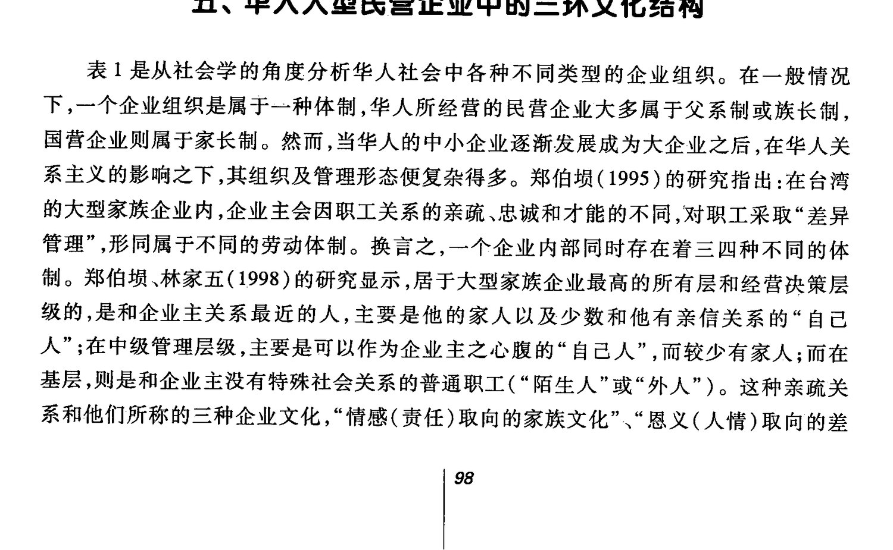

<!-- PDF页 113 -->

序文化”和“工具(利害)取向的制度文化”相对照。郑伯圳、林家五(1998) 指出,家族文化在所有层和经营层重肥,差序文化在经营层和管理层重合,制度文化在管理层和执行层重叠,这三种文化的环环相扣,形成“三环文化结构”(见图3)。. (组织层级) (劳资关系文化类型。 关系物件互动法则 (对应的劳资关系体制) [ (企业) 所有层 | #X (企业) 所有层 I gemesety | 情感责任取向(区系制) 家人和少数菇人. % y (各人和) | wee熟人和少数家人级制度文化 | 工具利害取向(市场独断他) 生人图3 华人大型家族企业内的三环文化结构资料来源:取自郑伯坝、林家五(1998)。郑为元(2003)认为家族文化有如“父系制”;差序文化如同黄光国(1988:12)所称的混合性关系和人情法则,类似“族长制"和“家长制”;制度文化所实行的是,公事公办,或在“人情与面子”之理论模式中所提及的工具性关系和[无人情义理]的“公平"法则(Hwang, 1987),有如 Burawoy(1985) 的“市场独断制”"。至于该一理论模式中的“需求法则”,在属于运作社会的家族企业内,企业主除了考虑他和受雇者的亲疏关系之外,还要兼顾对方的才能,和亲密社会中的人际关系并不完全相同。所以这类企业组织的运作虽然受到“家族文化”的影响,还是不能完全适用“需求法则”。. FBG SE KR (1998) 的研究,澄清了以人类学家族概念所建构的继承制和劳资体制之间的关系。父系制只适用于老板直系亲属的职工,其余职工则是依关系亲疏,分别属于其他体制。一般劳工依企业在市场竞争地位,分属市场独断制或垄断市场制,形成中西文化混合的状态,这可以说是华人大型企业组织最大的特色。;六、建构社会科学理论的挑战在《科学革命的结构》一书中,Thomas Kuhn(1962)指出:在常态科学(normal science)时期,一个科学社群通常是在一定范式的指导下,从事科学研究工作,以解决该领域所遭遇到的难题,这种活动,他称之为“解谜”(puzzle-solving)。然而,任何一个范式都不能穷尽真理,随着常态研究的深化,科学家一定会遇到一些“异例”(anomaly),也就是不符合范式预期的现象。当异例出现的频率愈来愈多时,科学家会感到他们所遵循的范式已经遭到危机,不足以应付愈来愈多的问题,他们便要设法对原有的范式做理论上或观念上的调整,或甚至发展新范式,以取代旧范式。这种“范式转移”(paradigm shf)的过程,就是所谓的“科学革命”(scientific revolution)。、| 建构中国管理学理论的机会与挑战 | 99

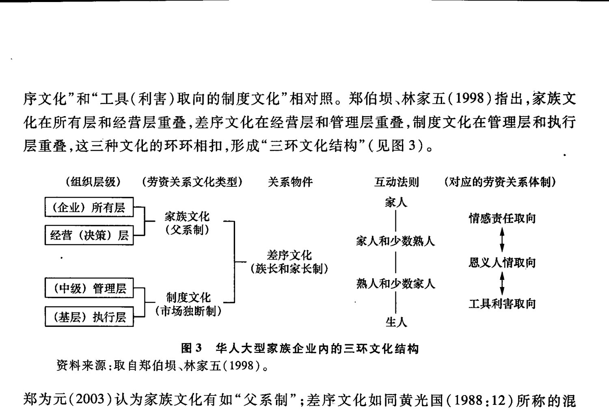

<!-- PDF页 114 -->

从这个角度来看,建构本土社会科学理论并发展相关研究的过程,其实就是在启动一场“科学革命"。更清楚地说,非西方社会中的学者将西方国家所发展出来的社会科学理论和研究范式移植到非西方社会,在从事研究工作时,必然会遭遇到许许多多的“异例”,这时候,他们就有必要启动一场“科学革命”,发展本土社会科学理论及研究范式。

然而,这样的“科学革命"并不像政治革命那样一发生就会立刻吸引到社会大众的注意。除了极少数的例外,一个新的科学理论和范式问世之后,还要经过漫长的检验和挑战,它的地位才能确定下来。在《科学发现的逻辑)中,波普指出:当科学家对原有的理论(TIl)不满,而提出一个新理论(了2)来对它挑战时,科学社群必然会以各种实证研RAK ROMA BAR”,也就是它有逼近真实的程度。在下列任何一种情况下,我们都可以说T2 比Tl 有更高的逼真度。

T2 比 Tl 作出更精确的判断,并且通过了实验的检验。

T2 Tl 能说明更多的事实。

T2 比 Tl 更能详尽地描述或说明事实。

T2 通过了 Tl 无法通过的检验。

T2 能设计出 T1 无法设想的实验,并且通过了实验的检验。

T2 把 Tl 认为不相干的问题联系起来。

本章提过,主张“逻辑实证论”的 Schlick (1936)认为:“一个命题的意义,就是证实它的方法”,因此科学活动的主要内容就是证实命题。主张“进化认识论”的波普(1934/1959)正好相反,他认为理论既然只是科学家的推测,科学活动的主要内容应当JeiE tht. Popper 的学生 Lakatos(1922一1974) 则进一步指出:不论实验或观察都受到一定条件的制约。当经验(实验或观测)与理论不一致时,研究者无法确知:到底是理论的错误,或是某些实验或观察条件不符合理论的要求。有名的“Duhem-Quine 命题”指出:诉诸“辅助假设”,则理论永远不可能被驶倒。换句话说,只要想象力够的话,科学RAKE A AE th “HY BIBL” (auxiliary hypotheses),把问题归诸其他因素,把反例消化掉,从而保护特定理论,使其不受证伪的威胁。

Lakatos(1978/1999) 认为:波普科学哲学的最大弱点,在于它未能建立一个坚实可靠的证伪基础。在 Lakatos 看来,任何理论都不是孤立存在的,而是一系列相互联系,具有严密内在结构的理论系统。因此他提出“精致证伪论”(sophisticated falsificationism)的观点,主张以“理论系列"的概念取代“理论”,这样的理论系列被称为“科学研究纲领。他认为:科学研究所评价的基本单位不是孤立的“理论”,而是“理论系列”,或是“研究纲领”。

素朴证伪主义者认为:当一个“观察”的陈述句与一个理论相冲突,或研究者把该陈述解释为同理论相冲突时,该理论便被证伪。Lakatos(1970/1990) 所主张的精致证伪主义认为:唯有当科学家提出的理论 T'具有下述特点时,科学理论了才真正受到证伪:

<!-- PDF页 115 -->

1. 新理论T'必须比旧理论T具有更多的经验内容。

2. 新理论 T'能解释旧理论民先前的成功,或者新理论了T'的内容包含了旧理论T中不可反驳的部分。

3. 新理论T'的经验内容比旧理论T 多,并且能得到观察或实验的确证。

根据作者发展“儒家关系主义”的经验来看,非西方社会中的任何一门本土社会科学(包括管理学)都有可能发展成“理论系列”,构成 Lakatos(1978)所说的“科学研究纲领”。不论是“单一理论"也好, “理论系列"也罢,不论是从 Popper(1934/1959)的“否证主义”,或是 Lakatos(1970)的“精致证伪论"来看,任何一个理论一旦正式在学术刊物上发表,它便有了自己的生命,必须能够接受学术社群的挑战和考验。如果它不能和既有的理论竞争,或者学术社群对它视若无睹,没人愿意加以引用,这项理论的生命半衰期便相对很短,很快地会被学术社群所淘汰。

### 参考文献

Ackers, P. (1998). On paternalism: Seven observations on the uses and abuses of the concept in industrial relations, past and present. Historical Studies in Industrial Relations, 5; 179—193.

Baran, P. A. and Sweezy, P. M. (1966). Monopoly Capital. New York: Monthly Review Press.

Berry, J. W. (1989). Imposed etics-emics-derived etics; The operationalization of a compelling idea. International Journal of Psychology, 24, 721—735.

Burawoy, M. (1985). The Politics of Production; Factory Regimes Under Capitalism and Socialism. London; Verso.

Cheng, W. Y. (2003). Traditional solidarity, market and the specialties and generalities of the employer-employee relations in the east Asian firms. Journal of Labor. Institute for Labour Research, National Chengchi University, Taipei, Taiwan.

Deyo, F. C. (1989). Beneath the Miracle; Labor Subordination in the New Asian In- ‘dustrialism. Berkeley: University of California Press.

Diaz-Guerrero, R. (1975). Psychology of the Mexican; Culture and Personality. Austin; University of Texas Press.

Edwards, R. (1979). Contested Terrain; The Transformation of Workplace in the Twen-

. tieth Century. New York; Basic Books.

Enriquez, V. (1993). Developing a Filipino psychology. In U. Kim and J. Berry (eds.), Indigenous psychologies; Research and Experience in Cultural Context; 152—169. Newbury Park, CA; Sage.

| 建构中国管理学理论的机会与挑各 | 101

<!-- PDF页 116 -->

一

Friedlmeier, W., Chakkarath, P. and Schwarz, B. (2005). Culture and Human Development; The Importance of Cross-Cultural Research for the Social Sciences. New York; Psychology Press.

Greenhalgh, S. (1988). Families and networks in Taiwan’s economic development. In E. Winckler and S$. Greenhalgh (eds.) Contending Approaches to the Political Economy of Taiwan; 224—245. Armonk. NY; M.E. Sharpe.

Hamilton, G. G. (1996). Organization and market processes in Taiwan’s capitalist economy. American Journal of Sociology, 96, 999—1006. Also in Orru, Baggart and Hamilton (eds.) (1997), 237—293.

Hwang, K. K. (1987). Face and favor; The Chinese power game. American Journal of Sociology, 92(4), 944—-974.

Hwang, K. K. (2004). The epistemological goal of Indigenous Psychology. In Bernadette N. Setiadi, A. Supratilnya, Walter J. Lonner and Ype H. Poortinga (eds.) Ongoing Themes in Psychology and Culture (2004), 169—186.

Hwang, K. K. (2005). A philosophical reflection on the epistemology and methodology of indigenous psychologies. Asian Journal of Social Psychology, 8(1), 5—17.

Kim, U. and Berry, J. (1993). Introduction. In U. Kim and J. Berry (eds.), Indigenous Cultural Psychologies; Research and Experience in Cultural Context; 1—29. Newbury Park, CA; Sage.

Lagmay, A. V. (1984). Western psychology in the Philippines: Impact and response. International Journal of Psychology, 19, 31—44.

Orru, M., Biggart, N. W. and Hamilton, G. G. (eds:) (1997). The Economic Organization of East Asian Capitalism. Thousand Oaks, CA; Sage.

Oyserman, D., Coon, H. M. and Kemmelmeier, M. (2002). Rethinking individualism and collectivism; Evaluation of theoretical assumptions and meta-analysis. Psychological. Bulletin, 128, 3—72.

Ratner, C. (1997). Cultural Psychology and Qualitative Methodology; Theoretical and Empirical Considerations. N.Y.; Plenum.

Ratner, C. (2002). Cultural Psychology; Theory and Method. New York; Plenum.

Silin, R. H. (1976). Leadership and Value; The Organization of Large-Scale Taiwanese Enterprises. Cambridge, MA; East Asian Research Center, Harvard University.

Sinha, D. (1986). Psychology in A Third World Country; The Indian Experience. New Delhi; Sage.

Triandis, H. C. (1995). Individualism and Collectivism. Boulder, CO: Westview Press.

<!-- PDF页 117 -->

Vogel, E. (1989). One Step Ahead in China: Guangdong under Reform. Cambridge, Mass.: Harvard University Press.

Vygotsky, L.S. (1987). Collected Works, Vol.1. New York; Plenum.

Weber, M. (1978). Economy and Society. Eds. by Guenther R. and Claus W. Tr. by E. Fischoff et al. Berkeley; University of California Press.

Yang, K. S. (1997). Indigenous compatibility in psychological research and its related problems. Indigenous Psychological Research in Chinese Societies, 8, 75—120. (In Chinese.)

Yang, K. S. (1999). Towards an indigenous Chinese psychology; A selective review of methodological, theoretical, and empirical accomplishments. Chinese Journal of Psychology, 41, 181—211.

李培林、姜晓星、张其仔(1992):《转型中的中国企业:国有企业组织创新论》。济南:山东人民出版社。

柯志明(1993):《台湾都市小型制造业的创业、经营与生产组织——以五分埔成衣制造业为案例的分析》。台北:“中央研究院”民族学研究所。

叶启政(1987/1991):对社会学一些预设的反省,载(制度化的社会逻辑》。人台北:东大图书公司,第57一88页。

WE (1994):《协力网络与生活结构一台湾中小企业的社会经济分析》, 台北:联经。

陈其南、印淑如(1984):企业组织的基本形态与传统家族制度——中国、日本和西方社会的比较研究,载工商时报编《中国式管理》。台北:时报,第459一484页。

黄光国(1988):《侨家思想与东亚现代化》。台北:巨流图书公司。

黄光国(1991):儒家思想中的正义观,《国家科学委员会研究汇刊:人文及社会科学》,一卷一期,第64一76页。

黄光国(2001/2006):《社会科学的理路》。台北:心理出版社。

FAIA (1995):差序格局与华人组织行为《本土心理学研究),第3 期:第142一219页。

SMA MRE (1998):差序格局与华人组织行为:台湾大型民营企业的初步研究,《中央研究院民族学研究所集刊》,86:第29一72页。

HUE KER (1982):对国内社会学经验研究的初步反省:现实建构、理论与研究,载趴海源与萧新煌编:《社会学理论与方法研讨会论文集)。台北:“中央研究院”民族学研究所。

谢国雄(1989):黑手变头家——台湾制造业中的阶级流动《台湾社会研究季刊》,二卷二期:第11一54页。

See | MAY OERESEAMS SRR | 103

<!-- PDF页 118 -->

ee

<!-- PDF页 119 -->

管理学的研究方法

<!-- PDF页 120 -->

4 ‘, ^、

<!-- PDF页 121 -->

## 第二部分 管理学的研究方法

## 第五章 实证研究的设计与评价

五 =第章ma) oa. » *实证研究的设计与评价RD香港科技大学R x上海交通大学香港科技大学本章大纲一、实证研究的本质1.1 社会科学中的实证主义取向1.2 实证研究中的资料收集1.3 ”实证研究的一般过程二、 研究设计在实证研究中所扮演的角色2.1 研究设计的目的与过程2.2 研究类型的选择2.3 研究设计与研究问题2.4 研究设计与资料分析三、 运用效度指标评价研究结论的质量3.1 构念效度3.2 统计结论效度3.3 ”内部效度3.4 ”外部效度四、 实证研究中的变异量控制4.1 研究中的变量变异

<!-- PDF页 122 -->

### 4.2 最大化系统变异

### 4.3 ”控制外生变异

### 4.4 ”最小化误差变异五结语.

引言.

本章主要讨论实证研究中的研究设计。概括来说,研究设计(research design)是对研究项目结构和过程进行的整体安排。研究设计可以作为一项实证研究的起点:通过对现有文献的阅读和总结,研究者可以发现研究中存在的问题和不足,并找出弥补这些缺陷的方法。以此为基础,进而提出研究问题,设计相应的实证研究,得出有价值的结论,从而完成一篇有理论贡献的学术论文。通过研究设计,研究者将一项研究的多个成分有机地结合在一起:包括提出研究问题回顾文献收集数据分析数据。因此,研究设计是研究项目的一个核心环节。

好的研究设计可以将研究涉及的变量纳人一个清晰连贯的体系,以此回答研究者提出的问题(Daft,1983)。严格的研究设计保证了可靠的研究结论。很多文章正是因为研究设计的不当而降低了研究的质量。Daft(1995) 曾经回顾了自己在《美国管理学会学报》(Academy of Management Journal) 《管理科学季刊》) (Administrative Science Quarterly) 担任审稿人期间的经验。他认为在最后被拒绝发表的文章中,大约有20% 是因为研究设计不当。同样,Grunow(1995) 考察了303 篇用英语与德语发表的实证研究,认为只有 19.9% 的文章回答了它们起初提出的研究问题。而其余的文章似乎在提出研究问题后就“迷失”了,它们的缺陷集中体现在研究的各部分之间缺乏有效的连接,研究结论无法有效地回答研究问题。

概括来说,研究设计的核心在于我们完成一项研究时,总体逻辑是否清楚,构成研究项目的各部分之间联系是否清晰(Royer and Zarlowski, 2001)。除此之外,研究设计并没有特定规则可循。不同的研究方法可以为不同的研究问题提供解答。在本书的随后章节中,读者将陆续学习到实验法(experiment,见本书的第六章)、准实验设计(quasiexperiment,见本书的第七章),问卷调查(survey,见本书的第八章)、二手数据分析(second-hand data,见本书的第九章) 和案例研究(case study,见本书的第十章)。这五种研究方法从研究设计的角度并没有优劣之分。对于研究者来说,设计研究时需要做的就是为特定的研究问题选择最恰当的研究方法。本章着重于阐述实证研究的一般过程,讨论研究设计的目的和常用的研究类型,介绍评价实证研究优劣的效度指标,以及分析研究设计时需要控制的因素,而不会探讨具体研究中必须遵循的规则。

<!-- PDF页 123 -->

### 一、实证研究的本质1.1 社会科学中的实证主义取向

自20 世纪 50年代以来,实证主义的思想一直在社会科学中占有举足轻重的地位。实证主义认为现实世界是客观的。由于客观规律和事实的存在,使我们对研究对象可以进行科学的测量,以此来解释、预测变量间的因果关系(Comte, 1988)。根据实证主义的研究范式,科学研究大多是从实验或问卷调查中得到数据,然后在统计分析的基础上得出研究结论。实证主义倡导的研究方法大多是用于检验预先建立的研究假设或命题,如果得到的数据与研究假设的预期一致,就认为假设是可以接受的;一旦发现了与假设判断相反的结果,就有理由拒绝研究假设。所以实证主义思想更多强调的是理论检验(theory testing),而不是发展新理论。在实证研究中出现的定性方法大多是为定量分析提供补充信息。

科学研究的核心问题在于判断变量间的因果关系。实证主义的研究范式提出了判断因果关系的三个前提条件:(1) 假设的因与果必须存在某种联系(contiguity); (2) 它们之间存在时间顺序的差异,因必须先于果而发生(temporal sequence);(3) 它们之间的关系必须是恒定存在的(constant conjunction),在果出现时必须伴随因的存在(Cook and Campbell, 1979)。条件 1 和条件 3 涉及自变量和因变量在现象界的实际联系。为了满足这一条件,我们通过对变量信息的测量和统计分析,可以就两者之间的关系做出表述和推断。条件 2 则强调了判断因果关系方向的基本标准,即自变量的变化必须早于因变量的变化。因此实证主义的观点强调因与果之间的紧密联系,以及果对因的依赖。

但在实际研究中,满足这些条件并不一定保证能得到清晰的因果推论。Popper (1977)进一步修订了实证主义的研究范式,他强调推论变量间的因果关系需要我们消除其他可能的各种蔡代解释(alternative explanation)。换言之,其他无关的、没有加以控制的外生变量(extraneous variables) 可能会影响我们观察到的因变量和自变量间的关系。仅仅通过变量间稳定的相关并不能确认它们之间的因果联系。正是因为推论因果关系的复杂性,对 Popper 而言,假设检验的过程只是一种证伪(falsification) 的过程。我们得到的支持性证据只能证明假设的因果联系并没有被否认。作为对一个复杂社会系统的检验,没有得到否认还远不能称为得到证实(verification)。由于我们无法在一项研究中控制所有潜在的外生变量,所以一个理论假设在实证研究中只能是得到支持(或暂时得到接受),而不能得到证明(proof)。

### 1.2 实证研究中的资料收集在实证研究中,研究者的数据一般有三种来源:首先,研究者将外界可直接观察的Bez | 实证研究的设计与评价 | 109

<!-- PDF页 124 -->

事件作为数据的来源,在不需要任何辅助工具的情况下,将外界信息转化为数字。如Oldham 和 Cummings(1996)把员工效得专利或申请专利的数目作为估计她/他们创造能力的一个测量指标;Greenberg (2002) 用被试在实验中偷钱的数目来测量她/他们遇到不公正待遇时的行为反应;其次,在研究者面对无法直接观察的对象(如员工的态度、动机等)时,和需要借助一定的测量工具,如通过员工填写测验量表实现对员工态度的数字化表达;最后,我们也可将测量工具用于可以观察的行为,如请上司评价部属的工作业绩和行为等。这三种数据的收集方式使客观世界和符号系统在实证研究中实现了——对应。它们的来源可以用图1 的形式加以表示。可观察、7图1 实证研究中数据的来源

资料米源:Baumard and Ibert (2001)。:

需要指出的是,虽然实证主义者强调研究资料是客观的,她/他们的研究致力于对外部世界进行客观的描述,但是实证研究所依据的数据是带有主观色彩的。例如同一部门的两名员工在面临企业工资改革时,或在描述另一名同事的组织公民行为(organizational citizenship behavior,OCB)时,双方的描述可能会有很大的差异。也就是说,就她/他们共同经历的事件,我们可能得到两组不同的数据。造成这个结果的原因大致有两种:双方在工资改革或与男一名同事交往中的经历不一样;双方在将事件“翻译”成我们需要的数据时出现了差异。

影响一个人如何解释外部事件的因素有很多,我们根本无法在一项实证研究中有效襄括所有可能的变量。而我们在社会科学中的研究对象往往又是不可直接观测的,只能通过间接方式收集资料。当我们使用本身带有误差的测量工具去研究一个复杂的社会系统时,这样的实证研究面临着相当大的挑战。

为了在管理学研究中实现对外部世界客观、淮确的描述,我们就需要格外强调我们的研究设计,使我们的研究过程得到很好的控制,对变量间的因果关系得到清晰的结论,最后有效地回答我们的研究问题。在具体讨论研究设计之前,让我们了解一下实证研究的一般过程。

<!-- PDF页 125 -->

1.3 ”实证研究的一般过程基于实证主义思想的影响,科学研究的主要目标在于探讨变量间的因果关系。最简单的实证研究过程可以用图2 的模型表述。在图2 中,线(a)代表两个抽象构念X'和了Y'之间的理论关系。我们需要检验的研究假设是X'和7Y'之间是否存在因果关系。但由于在现实世界中,我们无法直接观察这些抽象的构念(X'和Y'),所以首先需要将它们操作化(operationalization) 为可以测量的变量(即图2 中的了与Y)。图2 中线(b,)、(b,)代表操作化历程。这样就将一个抽象的研究假设转换为可以进行实证研究的具体问题。然后,我们搜集资料并运用合适的统计方法来验证X与了间是否存在统计上显著的关系(如线(d)所示)。如果没有发现统计显著的联系,就拒绝研究假设并接受零假设(null hypothesis),推断在构念X'和了之间不存在显著的关系。若经过统计检验,我们发现了了与Y之间存在显著关系,但在推断X与Y之间存在因果关系前,和需要吻除各种可能导致X与Y之间发生因果联系的替代解释。经过这样的检验之后,如果我们有足够的信心推断与Y之间确实存在因果关系(如线(c)所示),我们就可以接受研究假设,推断构念X'与六之间存在因果关系。最后,我们需要考虑研究的样本及所处的特定时空(包括时间、空间、研究参与者等情境因素)对所获得的研究结论的影响,推论研究结论是否在其他情境下也能成立。这就是实证研究的一般过程。' 2 | | 1 1 | | (by) | | | (c) | ee (d) ‘ 图2 实证研究的一般过程资料来源:Schwab (1999)。就上述的研究过程,我们可以区分四种研究效度指标:构念效度(construct validity),统计结论效度(statistical conclusion validity)、内部效度(internal validity) 和外部效度(external validity) (Cook and Campbell, 1979)。学者主要使用这四种效度指标来评价一项实证研究的质量。构念效度指测量的准确性。它评价的是我们在对构念进行操作化时,变量测量的内容和构念的含义是否一致。在通过各种操作化手段将不能直接观察的构念转换为可数量化估计的变量时,我们对它们的测量不可避免地引信了各种误差。这些误差降低了测量后变量对构念含义的准确反映(图2 中线(b,)、(b,) 就代表了构念与变量之间的对应关系)。如果测量的变量与抽象的构念之间不能准确对应,那么由此得出的结论就SER | 实证研究的设计与评价 | 111

<!-- PDF页 126 -->

会出现偏差,我们将这样的研究评价为构念效度偏低。一项实证研究如果构念效度偏低,即使最后在统计检验时发现了变量间的显著关系,也无法推断构念之间是否存在因果关系。因此,构念效度是评价研究质量的首要指标。有关这一概念及如何验证构念效度请参见本书的第十一章。

统计结论效度是指以统计检验对假设的关系进行解释的可信度,它对应的是图2中的线(d)。统计结论效度评价的对象是实证研究中运用的统计检验手段是否正确。我们针对统计检验而做出的结论,实际是在一定概率基础上做出的,这是冒着一定错误风险的。无论是拒绝原本正确的零假设,或是接受原本错误的零假设,都会影响统计结论的可信程度。如果假设检验时使用的统计方法存在缺陷,这项研究的统计结论效度就会存在问题。影响统计结论效度的常见因素有很多,如样本太小造成统计检测力的缺乏;忽视了统计检验的假设,造成统计方法的错误;测验问卷和实验操作信度的缺乏;被试样本的差异等。对这些因素的详细探讨读者可参见 Cook 和 Campbell(1979)的论述。与后面要解释的内部效度不同,统计结论效度评价的是一项研究中统计方法的运用是否恰当,而与变量间是否真的存在因果关系无关。

对研究质量的第三个评价标准是内部效度。内部效度是指变量间因果关系推论的可信度。与之相对应的是图2 中的线(c)。如果研究者发现因交量Y随着自变量X的变化而变化,并且两者之间存在显著的关系。在由此推断与了变量间存在因果关系前,研究者需要考虑是否吻除了其他各种可能的解释。某些外生变量的存在可能使我们在解释与7变量关系时出现偏差。例如,如果匀与Y同时和第三个变量显著相关,这可能使得原本并无相关的与了变量关系变得显著;或者由于第三个变量与X和Y之间呈现出正负不同的相关关系,而这个无关变量又没有得到有效的控制,与Y之间原本显著的变量关系被捉制,造成研究者没能发现X与了之间的因果关系 RT SB设。本书在第六章至第十章中将分别讨论如何在不同的研究方法中提高研究的内部效度。

最后,外部效度是指将研究结论推广到其他群体、时间和情境时的可信程度。在通常情况下,研究发现往往是基于一个样本,一个时间点得到的。但如果研究者使用的研究样本、测量手段等有较大的局限时,研究发现也许无法在其他的情境中得到重复。例如,我们以大学生样本得到的决策研究结论,可能无法推广到企业的 CE0。这样的研究结论就缺乏一定的外部效度。外部效度指标告诚我们需要清楚研究结论所处的情境界限。当你在样本中找到显著的因果关系的时候,需要自问一下这些结论是否只在这些

人、这梯的环境和时间内有效。假如是,那么你的研究结论就缺少外部效度。

通过上面的分析可以发现,实证研究是一个复杂的推理过程。它需要研究者事先对研究的问题和步骤进行详细的计划,由此得出的研究结论才能够经得起四种效度指标的考验。所以,研究设计对于实证研究的质量具有举足轻重的作用。下一节就研究设计的方法和步骤进行进一步的论述。

<!-- PDF页 127 -->

### 二、研究设计在实证研究中所扮演的角色

### 2.1 研究设计的目的与过程

研究设计是整个研究过程的执行计划。一般而言,研究设计的基本目的有三个: (1) 有效地回答研究问题:在实证研究中,研究问题通常是以研究假设的形式出现的。研究设计的目的就是要通过数量化的分析,为假设中涉及的构念间的关系提供有效的检验。(2) 满足实证研究四种效度指标的要求: 研究设计使研究者可以按照前文提到的四种效度指标合理地安排研究过程,提高研究质量。研究结论的可靠性依赖于它得出的方式和方法。严格的研究设计可以确保测量的变量很好地涵盖构念的内涵,提高构念效度;可以帮助我们选择正确的统计方法,保证统计结论效度;通过事先的设计和准备,可以最大限度地剿除各种蔡代解释对因果结论的影响,提高研究的内部效度;可以通过随机抽样的手段或者选择代表性较高的研究情境来提高研究的外部效度。(3) 控制研究中涉及的变异量:研究设计和需要有效地控制造成因变量发生变化的各种变异量,如系统变异 (systematic variance)、外生变异 (extraneous variance) 和误差变异(error variance)。通过运用不同的研究方法,我们可以恰当地控制可能影响因变量变异的各种因素,提高研究结论的严谨性与可信度。

研究设计是一个研究项目的整体蓝图,包括确定研究主题,通过文献回顾和探索性访谈发展研究假设,确定抽样方法、测量和操作化手段,以及这些因素对统计分析的影响等。研究者在搜集资料前必须认真考虑这些问题,才能有效地回答研究问题,保证研究的质量。Royer 和 Zarlowski(2001)曾经用图3 表述了研究设计的一般过程。

在图3 中,Royer 和 Zarlowski(2001)强调在实证研究中研究设计是一个不断循环、不断重复的动态过程,而不是一成不变的静态过程。在执行研究设计时,不仅可能会因为研究计划变得难以继续,而需要做出调整;而且可能需要随着对研究现象了解的深入.而改变。最近收集的数据同事的评论、刚读到的文献.或者新的收集数据的机会都有可能使研究者的兴趣发生变化,从而改变原来的研究计划。Meyer(1982) 的研究就是这样的一个例子。他起初以旧金山市(San Francisco)的医院为样本,探讨医院的环境、营销策略、组织结构和组织过程之间的关系。但在研究期间,当地的保险公司突然中止了与大约4000 名医生的合同,要求这些医生重新以个人名义与公司签订新合同,而保费则提高为原来的384%,这件事引发了大规模的医生黑工。整个罢工持续了将近一个 1月,为医院的工作带来极大的被动。Meyer 迅速地意识这是一个研究组织适应的绝佳机会,于是他改变了自己的研究计划,重新设计了一个准实验来进行自己的研究,最后完成了一篇出色的博士论文。

| 实证研究的设计与评价 | 113

<!-- PDF页 128 -->

| ep Eerie | [Sy sl |图3 研究设计和的过程

资料来源:Royer & Zarlowski (2001)。

在研究设计过程中,为了完成一项高质量的实证研究,研究者需要格外注意选择一个与研究问题相匹配的研究方法,并选择恰当的资料分析方法。

### 2.2 研究类型的选择

在本书中,我们将要讨论五种主要的研究方法:实验法、准实验设计、问卷调查、二手数据和案例研究。这五种研究方法没有优劣之分,研究者需要按照自己的研究问题进行选择。在实验法中,自变量主要由研究者控制或操纵。在进行实验时,研究者将被试随机分配到代表自变量不同程度的各个实验组和控制组内,并观察这种操纵对因变量变异量的影响。同时,通过控制各种情境因素,研究者得以清晰地观察假设的因果关系,确保研究的内部效度。所以当研究者主要关心变量之间的因果关系,需要噜除各种替代解释对研究结论的影响时,实验法是最好的选择。

但有时由于客观条件和资源的限制,研究者无法将被试随机分配到实验组和控制组中。这时研究者通过选择使用准实验设计,仍可在一定程度上保证研究的效度。 与 -实验法不同,在准实验设计中对被试的分配没有采用随机分配的方法,而是在自然场合下进行。自变量的来源不仅受到研究者的控制,而且也容易受到外部情境变量的影响。研究者对被试与周围情境的接触不易控制。所以相对于实验法,准实验设计的缺点在于不可能用随机分配消除所有的混淆变量和替代解释,内部效度略低,但准实验设计对研究条件的要求较低,可以做到灵活多变,应用的范围比较广,外部效度较高。

研究者经常使用的第三种方法是问卷调查。问卷调查的特点是快速有效、廉价。

<!-- PDF页 129 -->

由于它对被调查者的干扰比较小,所以容易得到企业与员工的支持。同时在使用问卷时,由于无法对被调查者进行随机分配,研究者需要较大规模的样本才能保证自变量的随机变化。为了提高问卷研究的内部效度,我们可以根据研究问题在调查中加入对其他变量的测量,以此来剿除替代解释对自变量和因变量因果关系的影响。

在以上三种研究类型中,研究者和被试/被调查者都会发生直接联系,由她/他们直接向研究者提供资料数据,服务于某个研究问题。但如果研究问题无法通过直接的方式获得数据,我们可以收集和分析二手数据。与准实验设计和问卷调查相同,二手数据不能对研究对象进行随机分配,数据的直接来源不受研究者控制。为了控制各种混淆变量,研究者需要对它们进行测量或编码(coding),以实现对这些变量的控制,提高研究的内部效度。相对于前三种研究方式,二手数据的客观性和可重复性比较高。如果研究对象不是个体而是企业、地区、国家,或者研究项目需要较大规模样本,以及研究问题时间跨度比较长时,可以尝试分析二手资料数据。

最后一种研究类型是案例研究。与二手数据强调的客观性不同,案例研究需要研究者与研究对象进行较为深入的接触。研究过程可能产生的干扰使得我们不太容易获得企业或员工的支持。所以案例研究的样本量普遍较小,而且主要通过方便抽样(convenience sampling)的方式获得。同时由于数据的来源不受研究者的控制,很难就研究结论进行重复验证。由于对研究过程的控制程度较低,案例研究的内部效度不高。但是它可以就所研究的现象提供丰富的描述(thick description)。一般而言,它既可以作为主要数据来源方式,也可以作为其他研究手段的补充。

就像我们在导言部分谈的那样,各种研究类型本身并没有优劣之分。对研究类型的选择取决于研究问题的性质和研究者对结果的预期。在研究设计阶段,很多初学者容易过多地关注研究方法和分析的复杂性,而相对忽视了研究方法对研究问题的实际贡献。有种观点认为研究方法的复杂程度代表了文章的质量高低,这其实是不正确的。过于烦开的研究方法并不能代替对概念本身清楚的界定和说明。研究者应该在分析自己研究问题的基础上,选择最为合适、经济的方法。因此,在选择研究方法时,建议读者思考以下几个问题(Royer and Zarlowski, 2001):

。 这种方法适合回答我的研究问题吗?

。 这种方法可以带来预期的研究结果吗?

。 使用这种方法需要哪些条件?

。 这种方法自身有哪些局限?

。 还有了哪种方法适合现在的研究问题吗?

。 现在选择的方法优于其他方法吗?如果是,为什么?

。 在使用这种方法时,我需要掌握哪些技能?

。 我现在掌握这些技能吗? 如果没有,我可以学到这些技能吗?

。 我是否需要其他的方法来提高对研究现象的观察?

SER | 实证研究的设计与评价 | 115

<!-- PDF页 130 -->

### 2.3 ”研究设计与研究问题

在了解了研究设计的目的和方法之后,我们进一步讨论如何将两者相结合。这对于经验不足的研究者来说,往往是一个棘手的问题。为了保证研究的效度,提高研究的效率和质量,我们需要根据研究问题进行研究设计,选择研究类型。如果无视研究问题的性质而随意选取研究方法,往往会导致研究设计的差错。例如,研究设计中经常需要考虑如何选择验证假设的层次(如个体、团队、公司、行业层次等),我们需要针对研究问题,仔细设计研究方案。如果脱离了研究问题,我们的实证研究可能发生研究层次的错位,影响研究的总体质量。下面我们通过一个实例来了解研究设计和研究问题之间的关系。

对企业来讲,业绩起伏是家常便饭,成功与失败往往交替出现。失败是成功之母,企业可以总结失败的教训,并进行学习,但成功的经历会带给企业什么呢?”Audia, Locke 和 Smith 于 2000年探讨了成功经历所带来的两难境遇。他们认为企业过去的成功会导致对以往战略的坚持,而这种坚持对于公司今后的业绩发展却是把双刃剑:当外部环境稳定时,坚持以往战略有助于发展企业能力,促进组织学习,同时降低运营风险;而当外部环境动荡时,坚持以往战略却会使得企业难以重新进行战略定位,进而延滞企业变革的速度。.

Audia 等人首先回顾了相关的文献,发现对这个问题的研究可以分为两大类:一类研究关注成功经历如何影响企业对于现行战略的坚持;另一类研究则讨论了企业对现行战略的坚持如何影响了未来的业绩水平。为了整合这两类研究,他们提出了假设一:在环境发生突变后,拥有更多成功经历的公司会更加坚持以往的战略,而对以往战略的坚持有可能损害公司的经营业绩。在这一过程中,他们认为企业战略决策者的个人心理过程起到了中介作用。为此,他们提出了假设二:在成功经历影响未来业绩的过程中,六种个人心理过程变量起到了中介作用:(1) 个人对以往成功的满意感;(2) 对现行战略有效性的自信;(3) 个人自我效能感(self-efficacy) 的提高;(4) 个人目标的提升; (5) 信息收集的数量;(6) 信息收集的种类。

由以上的叙述可以发现,这两个假设不仅位于不同的层面,而且基于不同的理论。假设一主要关注企业的成功经历如何影响它们的战略选择和未来的业绩水平,以及外部环境特征的影响。因此实验法或问卷调查等方法难以胜任,而收集特定行业的二手数据能够较好地满足假设验证的要求。因此 Audia 等人通过收集美国航空企业和卡车运输企业的二手数据,研究了它们在 10年间业绩的变动情况。在20 世纪 70年代末,美国政府解除了对这两个行业的行政管制,由此造成了行业竞争格局的突变。通过使用多元回归在两个行业中分别验证假设,发现既往的成功经历均会导致公司更加坚持以往的战略,而这种坚持都导致了未来业绩的下滑。

由于假设二涉及了个人心理过程在成功经历和未来业绩间的中介作用, Audia 等人

<!-- PDF页 131 -->

设计了一个商业游戏来验证这个假设。这是因为心理过程变量必须直接测量,而无法通过收集二手资料的方式获得。同时对于因果关系和中介作用的验证,实验法具有更好的内部效度。为了更好地确定每个中介变量的独特贡献,Audia 等人在实验中还使用了问卷来对这些变量进行测量。在实验中,大学生被斌被要求模拟担任一家手机公司的首席执行官,并针对一些战略问题,在两个阶段共 13 次决策中做出战略选择。在第一阶段,被斌被随机分配到三种(低、中、高)成功情境中,并进行8 次战略决策。每次决”” 策后,被坛都会就企业的经营业绩获得一次反馈。由于研究者为高成功情境中的被斌

提供了详细的信息,这些学生做出的决策质量更好,所以企业业绩会较好;而处于低成功情境下的学生只获得了基本信息,因此她/他们的业绩表现相对较差。在完成前8 次战略选择并接受反馈之后,研究者测量了被试的6 种心理状态。在第二阶段,他们通知所有的被试政府解除了对手机行业的管制,原来一家公司只能在四个地区开展业务,现在它可以同时在五个地区开展业务。这样企业经营的范围和不确定性都增大了。在引入实验操纵后,研究者要求被试继续进行 5 次战略选择,将她/他们在第二阶段中的业绩表现作为因变量。与二手数据分析中得到的结论一样,他们发现既往决策的成功导致了被试在第二阶段的决策中坚持使用同样的战略,而对以往战略的坚持则导致了经车业绩的下渭。同时,他们发现个体心理过程完全中介了既往的成功经历对于战略坚持的作用,其中对以往成功的满意度、自我效能感以及信息收集的类型起到了关键作用。

在 Audia 等人的研究中,他们关心的是公司以往的成功通过企业家的个人心理因素而影响了公司的未来业绩。因此他们将研究的注意力放在了公司和个人层面上。而在实际中,公司战略往往是由高层管理团队集体负责的,而不是由首席执行官单独做出。因此我们可以考虑针对团队层面的分析,来改善充实 Audia 等人的研究设计。通过以上分析,我们可以看出有效的研究设计必须基于相应的研究问题。随着研究问题的不同,我们需要选择不同的研究方法,采用不同的研究设计。2.4 ”研究设计与资料分析

前面我们讨论了研究设计和研究问题之间的关系,本节中我们探讨研究设计对资料收集以及资料分析的影响。在一项研究中,研究问题.研究类型变量测量与统计分析是相辅相成、紧密联结的不同步骤(Pedhazur and Schmelkin,1991)。在研究中,我们首先需要明确具体的研究问题。然后,结合研究问题和理论选择恰当的研究类型。接着选择相应的资料收集方式和分析方法。如果说确定研究问题指明了研究的具体现象,那么针对资料收集和分析方法的设计就回答了从哪里得到数据以及应当如何处理得到的数据的问题。 |

与选择研究类型相似,我们强调资料分析的方法本身并没有优劣之分。资料分析是为回答研究问题而服务的,应该在研究设计的指导下进行。当我们没有理清研究问

| 实证研究的设计与评价 | 117

<!-- PDF页 132 -->

题、变量测量和资料分析之间的关系时,我们得出的结论只能反映变量在测量和分析层面的关系,而不能有效地回答我们的理论问题(Klein, Dansereau and Hall, 1994)。对于资料分析方法的选择,应该符合研究理论和设计的要求。例如,在讨论工作满意度对绩效的影响时,如果我们希望了解员工满意度与员工绩效之间的关系,那么测量和分析应该以个体为单位;而如果研究的问题是部门士气对于部门业绩的影响,我们的分析就应

: 该在部门层面。员工土气的测量可以在个体层面,但在资料分析时,这些个体资料必须整合到部门的层面,统计分析必须以部门为单元。如果研究课题是部门士气对于员工业绩的影响,因为部门土气是部门层面的变量,而员工业绩是个人层面的变量,这时我们就应该进行跨层面研究与分析(见本书的第十五章)。在前面提到的 Audia 等人的例子中,我们也可以看到当研究的问题涉及组织战略层面时,其数据来源于二手资料,分析的单元是企业;而当研究的问题涉及中介的心理变量时,其数据来源于实验设计,分析的单元是个人。

以上我们分别探讨了实证研究中研究设计、研究问题、研究类型和资料分析之间的关系。我们强调研究设计的好坏影响了研究中各个环节的质量,但这种顺序并不是一成不变的。随着研究的进行,我们可能意识到原先研究设计的不足,或者发现新的研究问题。所以研究设计过程是动态的,而不是静态的。Daft(1983)就指出研究本身更多地与研究者的技能和经验有关,而不只是专业知识。同时,技能和经验更多地是通过学习过程而获得的,与研究者多年的经验积累密不可分。所以,研究设计本身就是一个学习过程,研究者需要从这一过程中认识自己的不足,不断对研究设计做出调整和改进。

### 三、运用效度指标评价研究结论的质量

前面我们对实证研究中研究设计的目的、作用和过程进行了介绍。那么我们如何一去评价研究设计是否有效地进行了控制,判断它能否回答研究问题呢? 又有哪些手段可以提高研究的质量呢?在管理学研究中,我们通过四种效度指标来实现对研究质量的评价,即我们前面已经介绍的构念效度、统计结论效度、内部效度和外部效度。能否提高研究效度,保证研究结论的可靠性,是我们评价一项研究是否有效以及它得到的结论是否正确的关键因素。下面我们针对每一种效度指标,提供一些提高研究效度的建议。

### 3.1 WORE

在研究设计中,研究者的目的是尽量减少测量时的误差,提高变量与构念之间的对应程度。为此,研究者可以从两个方面提高构念效度。第一,从分析抽象构念的角度,研究者需要精确定义构念的含义并明确它的理论结构。由于构念来源于抽象理论,在现实世界中并不能直接观察,所以对它的观察和测量必须依赖于精确的定义说明。如

<!-- PDF页 133 -->

果缺少精确的定义,即使研究者在测量过程中避免了各种误差,得出的数据和分析出来的结论也无法回答研究的问题。

第二,从交量测量的角度,研究者需要选择合适的测量方式,控制测量误差。比如在管理文献中,我们常常会发现一个构仿有许多种测验量表。到底用哪一种量表来测量,就是一个经常困扰研究者的问题。例如,对于组织公民行为的测量,既有在西方情境下发展出来的文化普遍性(etic)量表,也有专门结合中国国情发展的文化特殊性(emic)量表。在测量时应该如何选择呢? 我们的答案是,结合研究问题选择最能符合研究要求的测量方式。当研究者关心的问题与中国特殊的文化情景有关时,采用具有文化特殊性的量表就能提供更多详细的信息(如 Farh, Hackett and Liang, 2007)。如果研究者关心的是一种普遍现象,只是运用来自中国的样本进行检验,那么具有文化普遍性的量表就应该是首选(如Wang, Law, Hackett, Wang and Chen, 2005)。所以,在进行研究前,通过研究设计联系研究问题和资料收集,可以提高研究的构念效度。3.2 统计结论效度 |

在实证研究中,由于统计检验的本质是通过抽样的方式来对变量间的关系做出泛化的推论,所以任何研究结论都面临着统计结论效度的问题。一般而言,我们在做出统计决策时存在着四种可能性:接受正确的零假设、拒绝错误的零假设、拒绝正确的零假设和接受错误的零假设。前两种情况属于正确的结论,但后两种情况属于研究者做出的错误决策,影响到研究的统计绪论效度。在统计学中,我们把第三种情况称为一类错误(Type I error),即在两个变量间并没有联系的时候,我们根据自己的统计结果却拒绝了零假设,得出它们之间存在显著性的关系。第四种情况称为二类错误(Type Il error),即在两个变量间存在显著性关系的时候,我们却接受了零假设,认为它们之间并不相关。

; 在研究设计时,我们可以通过降低这两类错误来提高研究的统计结论效度。研究者可以通过选择正确的统计检验手段、更加严格的检验标准和取样随机化等方法来降低一类错误。针对二类错误,研究者可以选择以下手段提高研究的统计结论效度:(1)增大样本量;(2) 减少因变量中与自变量无关的总体变异,例如通过控制外生变量、抽取同质性比较高的样本和选用高可信的测量工具等方法; (3) 根据理论检测方向性的研究假设(directional hypothesis) 等。

3.3 ”内部效度.实证研究中影响内部效度的主要因素来自于除自变量之外的各种混清变量。它们的存在影响了变量间因果关系的强弱程度。Cook 和 Campbell (1979) 总结了七种在准实验研究中存在的混淆变量:(1) 过去事件的影响:所有发生在研究期间的事件,都可能对研究个体产生影响并且导致结果的变化;(2) 成熟效果(maturation):受测者本身随BER | 实证研究的设计与评价, | 119

<!-- PDF页 134 -->

着时间的流逝而发生身心变化,而非因为某些特别事件的发生; (3) 测验效果:测验过程本身可能会改变所要测量的现象;(4) 统计回归(statistical regression):若接受实验者为极端分散的群体,实验的后测结果就会有趋向其长期平均数的情况; (5) 自我选择效AR (self-selection):由于研究未采用随机抽样和随机分派,造成被选择的人在能力或特质方面存在差异或不相等;(6) 被调查对象的退出或流失(mortality); (7) 研究样本所提供的信息可能会存在偏误。

在研究设计时,研究者应该考虑如何通过各种手段吻除混淆变量和替代解释对变量间因果关系的影响。这主要可以从两方面进行:一方面可以从理论出发,在以往文献中搜寻有哪些变量可能成为假设检验中的混淆变量,在测量自变量和因变量时同时加以测量,并在统计检验时进行控制;另一方面可以从研究类型上加以控制。例如相对于其他各种研究类型,实验法对于混淆变量和替代解释的控制程度最强。如果研究者认为自己的研究假设非常容易受到其他混淆变量的影响,就可以通过实验或者进行随机化处理的方法提高研究的内部效度。3.4 ”外部效度

由于外部效度考虑的是研究结论在其他情景中的可重复程度,所以它对于应用性的实证研究而言是一个非常重要的评价指标。在研究中,影响外部效度的因素主要包括:(1) 对实验操纵的反应:由于前测使受测者对敏感的主题造成反应,以至于她/他们通过各种不同的方式来响应实验刺激。通常在态度研究中,这种事前测量的效果特别显著。(2) 受测者的挑选:如果我们选择的被试群体没有代表性,而自身又具有某些特殊性,这时我们基于她/他们得出的结论也无法推广到其他样本中。(3) 其他互动因HE:实验环境本身可能造成某种偏差,在特殊实验环境中得到的结果无法推论到整个目标群体。例如,如果参与实验的人预先知道了研究的目的,她/他们很有可能以一种角:色扮演的心态完成实验任务,这时基于这些回答/表现得出的结论也就缺少外部效度。

在实证研究中,研究者可以选取具有较高代表性的样本来提高研究的外部效度。样本对于总体的代表性是外部效度的主要影响因素之一。当样本可以较好地代表总体时,从样本得到的结论就更容易在总体内得到重复。而如果研究目的还包括在不同总体间证实研究假设,那就可以通过在多个总体内分别抽样,来检定研究结论的外部效度。

不过,外部效度的不足对于研究结论和理论发展并不一定总是坏事,有时也许是新

- 的研究的开始。越来越多的管理学研究已经开始注意到情境因素(如人、环境、时间)对研究结论的影响。这些情境因素要么是自变量的先行因素,要么是可能改变自变量和因变量关系的调节变量(详见本书第十二章)。如能将这些情境因素与理论思考相结合,不时会产生非常有趣的研究。例如 Farh, Earley 和 Lin (1997)研究了组织公民行为和组织公正的关系。他们发现,在台湾,组织公民行为的维度不同于在西方情境下的研

<!-- PDF页 135 -->

究结论。因此,在国家层面上,不同的文化情境成为组织公民行为的先行变量。他们还发现,对于个人传统性(traditionality)较低的人来说,组织公民行为与分配公正和过程公正的相关性强; 对于个人传统性较高的人来说,组织公民行为与分配公正和过程公正的相关性弱。因此,个人传统性成为组织公民行为和组织公正之间的调节变量。

在这一节,我们主要讨论了评价实证研究的设计质量所依据的四种效度指标,它们分别是构念效度、统计结论效度、内部效度和外部效度。需要指出的是,在任何一项研究设计中,研究者往往无法同时兼顾上述的四种效度。研究者需要根据研究理论决定具体使用的研究方法。由于每一种方法都具有各自不同的优缺点,而实证研究往往要受到客观条件、当时情境和被试心理状态等因素的限制,所以在一个研究中同时满足四种效度指标的要求是不可能的。

解决这个问题的一种方式是进行多项研究。例如在 Audia 等人的研究中,他们首先使用二手数据来验证研究假设。这种方法具有和较高的外部效度和较低的内部效度。因此,他们接着在个人层面进行了一个实验,来明确起到中介作用的心理过程变量。这项实验研究就具有较高的内部效度和较低的外部效度。将两者相结合,他们的研究结论满足了这两种效度的要求。同时由于对构念的清楚定义、准确测量和恰当的分析,他们的研究结论又具有较高的构念效度和统计结论效度。

此外,研究者能够做的就是综合考虑自己的研究假设,通过研究设计,合理控制研究方法中的各种变异量。除为研究问题提供解释和满足一定的效度指标之外,研究设计可以进一步提高结果和钦辑的清晰程度,使得研究结论更容易得到重复。下面,我们讨论如何通过研究设计控制研究中的各种变异量。

### 四、实证研究中的变异量控制

在研究设计阶段,我们需要制订自己的研究计划,选择研究方法和数据收集的方式,并且确定统计处理的方法。除此之外,我们还需要精心设计研究过程,这主要是通过对造成因变量变异的三种来源进行控制而实现的。这三种变异量包括:系统变异、外生变异和误差变异(Kerlinger and Lee, 2000)。下面让我们首先来了解一下这三种变异量的关系。4.1 研究中的变量变异

我们经常可以观察到在同一家企业里,员工的满意度会有很大的差异;在同一个行业里,公司经营业绩也会非常不同。这些个体/企业之间差异就是我们在研究中需要解释的变异量。研究设计的目的在于寻求合适的自变量,实现对因变量变异的解释,如我们可以用个人的收入水平来解释员工满意度的差异。但在实际情况中,因变量的变化不仅仅会受到自变量的影响,还同时受到其他很多因素的影响。如满意度可能同时受

| 实证研究的设计与评价 | 121

<!-- PDF页 136 -->

到组织的情境或气氛、个人的期望和人格特征等因素的影响。我们称这些因素为外生变量,即是自变量以外,有可能影响因变量的因素。除此之外还有误差变异,所谓误差(error) 的意思是它能影响到因变量,但是它不是系统性变量(systematic variable), 而是原因各异的随机因素(random factors),如被试在接受测验时的心情、当时的物理环境等。我们把这些变量的关系用图4 加以表示。. (收入水平) (工作满意度) (被试心情、测验环境等) (组织气氛、个人人期望、和信格特征等)图4 构成因变量变异的各种因素

研究设计从变异的角度(variance perspective)来看,最主要解决的问题是如何处理因变量变异的问题。研究者要尽力控制上述三类变异,即最大化系统变异 (maximize systematic variance),控制外生变异(control extraneous variance)、最小化误差变异(minimize error variance)。'此三种变异在研究设计上有很重要的含义,不同类型的变异也要有不同的处理方法。

### 4.2 最大化系统变异

系统变异是指因变量的变异中受到自变量影响的部分。在研究设计时,我们希望发现自变量对因变量的显著性影响,所以研究者需要将自变量对因变量的影响最大化。最大化系统变异可以使我们把自变量的效应从因变量的总变异中区分出来,因此可以支持假设中构念之间的关系。系统变异在因变量的变异中占的比重越大,说明研究中自变量的影响越明显,我们也就更有机会发现支持我们假设的证据。

最大化系统变异可以通过样本选择或者对自变量的精准测量来实现,每一种方法都致力于让自变量对因变量有最大的效应。例如,在研究收入水平与工作满意度的关系时,如在选择的样本当中,大多数人都是对工作满意,或者更糟糕的情况是,她/他们的薪水都相似,那么研究者得到支持性证据的可能性将非常低。

由于变量性质的不同,在研究设计中的控制操纵方法也是不同的。我们可以把管理学中的变量分成两类:可变变量(active variable) 和属性变量(attribute variable)。前者是指在设计中可以被操纵的、可以变化的变量。对这类变量我们可以通过实验法对其加以控制,实施具有影响力的操纵,使得实验组与控制组的情景非常不同。这样我们才有可能观察到由于对自变量的操纵而引起的被试反应。例如在 Staw(1975) 的研究中,研究者告诉高绩效组的被试说她/他们的绩效表现非常好,属于最优良的 20%;而告诉低绩效组的人说她/他们做得不好,属于最差的20%。这就是一个运用有效操纵来提高

<!-- PDF页 137 -->

系统变异的例子。

但在许多研究中,研究者感兴趣的变量不是可变的,或是非常难以操纵的。我们把这类变量称为属性变量。我们对这类变量的控制需要通过对样本的选择来实现。例如Farh, Hackett 和 Liang (2007) 2% T 42) HE (power distance) 和个人传统性对中国员工的影响。他们从社会交换(social exchange)理论出发,提出这两种文化价值观可能调节了中国员工在知觉组织支持后的反应:高权力距离和传统性的员工更多地受到自己的角色限制,她/他们的工作态度和行为较少地受到组织支持的影响;而低权力距离和低传统性的员工则更多地看重双方在交换中的对等性,她/他们对企业的态度和行为更多受到组织支持的影响。为了验证这一假设,他们在样本选择阶段尽可能地扩大了可能影响结果的系统变异,选择 27 家性质不同的公司员工来收集数据,而不是在一家公司或利用 MBA 学生来完成问卷。通过这种方式,他们实现了对关键变量的控制:知觉到的组织支持(perceived organizational support, POS)、权力距离和个人传统性。

同样的道理,如果我们研究的是人力资源政策对于员工行为的影响,则全部的样本不能来自同一家公司/集团。这是因为同一家公司的人力资源政策基本上都是一致的,不同的部门间可能存在细微的差异,如销售员和工程师,低阶层和高阶层的人。但来自同一家公司应有很多的同质性(homogeneity),基本的情境是相同的。这时人力资源政策这个变量的变异显然不够大。研究者需要经过对样本的选择,选取不同的公司组织(例如选不同公司的研发部门)作为研究的样本,以此提高研究的系统变异。4.3 ”控制外生变异

外生变异会系统地影响我们感兴趣的因变量,但却与我们的研究目的无关。换言之,这类变量在其他的研究中可能是很好的自变量,但在我们的研究中却不属于关注的焦点,所以我们需要对这类可能对因变量造成影响的外生变量实现有效的控制,将其效应最小化、抵消,或者与我们的自变量进行隔离。通过这些控制手段,我们就能够排除无关变量对因变量的影响,清晰地判断并解释自变量对因变量的影响。如果不能实现对外生变蜡的有效控制,在发现有显著性的关系后,我们无法判断这一关系究竟是因为自变量对因变量的影响,还是未加控制的外生变异的影响。例如,在研究创新战略对公司经营业绩的影响时,我们必须控制公司的规模和行业特征。 虽然这两个因素都不是研究的关注点,但它们会影响公司的获利能力。只有控制了这些变量, 我们才可以有信心地得出这样的结论,即公司利润的变动是创新的结果而不是规模(大公司倾向于利润更高)或行业(一些行业比其他行业利润更高)的影响。能否对外生变量实现有效的控制,是判断一名研究者的设计能力、对相关文献了解程度的一个很好的评价指标。

在研究设计中,我们可以通过抽样的方式(如随机化、匹配参与者等)或者统计控制(statistical control) 的方式,实现对外生变量的控制。通常的控制方式有三种:

第一,排除法(elimination)。不同于选择差异化的自变量,研究者可以通过选择同

Bre | 实证研究的设计与评价 | 123

<!-- PDF页 138 -->

质性的外生变量,来排除它们对因变量的影响。例如我们希望了解收入水平对个人满意度的影响,同时人性别也有可能对满意度水平有影响,这时在取样时我们就可以单独选择男性或女性。在这种同质的样本,我们就可以排除外生变量的影响。

第二,随机分配法(random assignment)。如果我们能够随机分配被试到不同的实验组与控制组中,就能使外生变量的效应相互抵消,对其进行有效的控制。如 Staw(1975)的研究即是将 60 位学生随机分派到实验组及控制组,以此控制了外生变异,这时得到的研究结果就不能用外生变量作为对因交量差异的解释。

第三,配对法(matching)。这种方法是指将外生变蜡进行配对处理,创造相对等的研究条件,从而控制外生变量。例如,如果需要考察一项组织变革的成效,我们可以选择另一家没有变革的企业作为控制组。虽然研究者不能随机分派哪家企业进行变革或哪家不变革,但研究者可选择一家与变革企业相当类似的企业(如科技的性质、制度、工厂设立时间长短等)作为控制比较对象,如此的配对即可看出变革操纵后产生的实际效果。

上面的方法都属于通过操纵样本的方式实现对外生变异的控制。但在管理学研究中,研究者不一定有条件对研究对象进行操纵。这时我们可以选择其他两种控制方式: (1) 纳入法。即我们可以将外生变量纳入研究设计,并将其效应与自变量的效应加以区分。例如我们如果认为个体能力是影响绩效的一个因素,而不是只有工作满意度一个变量,我们就可以将两者一并测量。在实验法中,我们则可以将两者作为设计中的分析要素,形成2 x2 多因子实验设计。通过分析它们的主效应和交互效应,来区分这两种因素对员工绩效的影响。(2) 统计控制。纳入法改变了原有的设计思路,使得原有的设计变得复杂,研究者还可以通过统计控制的方式实现对外生变量的控制。我们可以将这些无关变量与自变量一起进行测量,在统计分析时首先排除它们的效应。统计控制的思路简单,操作方便,但如果外生变量与自变量的相关过高,我们可能由于在排除外生变量效应的同时,低估对自变量效应的估计。

### 4.4 ”最小化误差变异

误差变异是指由于随机因素而导致的因变量变异。这是属于随机性质的,而不像外生变异那样造成系统性的偏误。最典型的随机变异是测量误差(如暂时的不注意、短暂的情绪波动等),或研究者控制不了的未知因素。我们将误差最小化,其目的就是尽可能地使系统变异显示出来。通常误差变异和外生变量对因变量变异的影响是无法区分的,这两部分之和就是我们在统计分析时所说的剩余部分(residual),即我们感兴趣的自变量无法解释的部分。在进行F 检验时,我们将因变量的总变异分成两部分:一部分是由自变量造成的组间差异(between group variance);另一部分是就是外生变量和误差造成的剩余部分。如果我们能够尽量减少测量的误差,就可以使测量更精确,提高我们统计分析的FF值,从而增加我们得到显著性结果的可能性。最小化误差变异可以通过

<!-- PDF页 139 -->

控制数据收集过程,以及增强测量指标的信度而控制误差变异对研究结果的影响。

由于误差变异是由随机因素造成的差异,所以它的处理方法也表现为减少个体差异和测量误差两方面。首先,减少被试的个体差异(individual differences)。在保证最大化自变量的同时,尽量减少个体差异对因变量的影响。人与人之间的差距越小,由于个体差异带来的误差变异也越小。其次,减少测量误差(errors of measurement)。减少测量误差一方面需要我们提高测量的精确程度,提高测量的信度(reliability) (我们在第十

” 一章会专门讨论测量的信度),另一方面需要我们有效地控制测量情境。情境控制可以

使测量更精确。如在实验时尽量减少实验者的不同,例如性别的不同、讲话语气的不一样等。用放录音带的方式,使指导语的速度和声音尽量标准化。在问卷调查时,尽量保证室内环境、问卷填答的时间等因素保持一致。

从上面的讨论可以发现,在研究设计时,对变量的控制是非常重要的。为了实现对因变量的预测,我们需要尽可能地提高自变量的变异,控制与因变量变异有关的外生交量和随机误差。外生变量和随机误差的存在会增加自变量无法解释的因变量变异(即变异剩余量),从而降低我们在检验自变量效应时的统计检验功效 (statistical power)。

在这一节我们讨论了通过研究设计对研究中的三种变异量进行控制的问题。对于一个研究中因变量的变异来说,其中只有一部分对我们是有帮助的,也就是系统变异量。因此,我们运用研究设计对变异量进行分割(partition)的目的就是帮助我们在实证研究中最大可能地确定变量间的因果关系。具体来说,就是系统变异量可以实现最大化;外生变异可以得到有效控制;同时,误差变异能够被控制到最小程度。

### 五、.结语

作为社会科学的一个分支,我们在管理学研究中面临着很多方法论上的挑战:研究方法的局限使我们无法对变量间因果关系做出清晰的界定、对研究的变量无法进行直接的测量、人类组织活动自身的复杂性等。同时,管理学自身的特性也要求研究者必须深入企业、接近企业员工去得到研究必需的资料。而这又往往超越了研究者自身的能力和角色。我们需要用不太精确的工具去理清一个复杂系统中各种关系,但我们又不能随意地收集自己需要的信息,这就是我们在管理学研究面临的实际困难。这些局限和困难都加重了研究设计在整个研究项目的重要程度。为了保证我们研究的问题得到满意的回答,无论如何强调研究设计的重要性都是不过分的。

### 参考文献

Baumard, P. and Ibert, J. (2001). What approach with which data? In R. A. Thi-

etart, Doing Management Research; A Comprehensive Guide; 69—84. London; Sage Publica- | 实证研究的设计和与评价 | 125

<!-- PDF页 140 -->

tions.

Comte, A. (1988). Introduction to Positive Philosophy. Paris: Carillian-Goeury and Dalmont.

Cook T. D. and Campbell D. (1979). Quasi-experimentation: Design and Analysis Issues for Field Settings. Boston; Houghton Mifflin Company.

Daft, R. L. (1983). Learning the craft of organizational research. Academy of Management Review, 8, 539—546.

Daft, R. L. (1995). Why I recommended that your manuscript be rejected and what you can do about it? In L. L. Cummings and P. J. Frost (eds.), Publishing in the Organizational Sciences, 2nd edition; 164—182. Thousand Oaks, CA: Sage.

Farh, J. L., Hackett, R..D. and Liang, J. (2007). Individual-level cultural values as moderators of perceived organizational support-employee outcomes relationships in China;

, Comparing the effects of power distance and traditionality. Academy of Management Journal, 50, 715—729.、

Greenberg, J. (2002). Who stole the money, and when? Individual and situational determinants of employee theft. Organizational Behavior and Human Decision Processes, 89, 985—1003.

Grunow, D. (1995). The research design in organization studies. Organization Science, 6, 93—103.

Kerlinger, F. N. and Lee, H. B. (2000). Foundations of Behavioral Research. Fort Worth, TX: Harcourt College Publishers.

Klein, K. J., Dansereau, F. and Hall, R. J. (1999). Levels issues in theory development, data collection, and analysis. Academy of Management Review, 19, 195—229.

Meyer, A. D. (1982). Adapting to environmental jolts. Administrative Science Quarterly, 27, 515—537.

Oldham, 'G. R. and Cummings, A. (1996). Employee creativity; Personal and contextual factors at work. Academy of Management Journal, 39, 607—634.

Pedhazur, E.J. and Schmelkin, L. P. (1991). Measurement, Design, and Analysis; An Integrated Approach. Hillsdale, NJ; Lawrence Erlbaum.

Schwab, D. P. (1999). Research Methods for Organizational Studies. Mahwah, NJ:

Lawrence Erlbaum Associates.: Staw, B.M. (1975). Attribution of the causes of performance: A new alternative interpretation of cross-sectional research on organizations. Organizational Behavior and Human Performance, 13, 414—432.

Royer, I. and Zarlowski, P. (2001). Research design. In R. A. Thietart, Doing Man-

<!-- PDF页 141 -->

agement Research: A Comprehensive Guide; 111—131. London; Sage Publications.. Wang, H., Law, K.S., Hackett, R.D., Wang, D. and Chen, Z. X. (2005).-Lead-: er-member exchange as a mediator of the relationship between transformational leadership and followers’ performance and organizational citizenship behavior. Academy of Management Journal, 48, 420—432. #22 | 实证研究的设计与评价 | 127

<!-- PDF页 142 -->

## 第六章 实验室研究

a swe第 JNO k ¢美国芝加哥大学徐飞上海交通大学KA美国芝加哥大学本章大纲一、 研究的类型=. 理论和假设三、 什么是好的假设四、 实验室研究4.1 观察性研究4.2 ”实地实验4.3 ”实验室实验4.4 ”实地实验和实验室实验的比较五、 实验设计的基本原则5.1 实验的效度问题5.1.1 常见的内部效度威胁因素5.1.2 常见的外部效度威胁因素六、 实验室实验中应该注意的问题七、 实验设计7.1 组间设计7.2 组内设计

<!-- PDF页 143 -->

### 7.3 组内设计和组问设计的选择

### 7.4 因子设计A, 结语

科学研究林林总总,但是总是会涉及理论和数据。大体上,我们根据理论和数据的关系,可以把研究归为三类:一类有数据支持但无理论指导(data without theory),一类有理论指导但无数据支持(theory without data),第三类既有理论又有数据(theory with data)

首先来看第一类的研究。例如,你通过调查发现,中国人喜欢吃米饭,美国人喜欢吃土豆;中国人喜欢喝茶,美国人喜欢喝咖啡;中国人喜欢吃豆沙包子,美国人喜欢吃奶酪蛋糕。尽管有这些发现,但是你没有一种理论能够帮助你解释为什么中国和美国人在饮食上存在这样的差异。此外,这些数据也不能帮助你预测中国人和美国人对于其他饮食的偏好。这样的研究就属于只有数据但是没有理论指导的研究。

再看第二类的研究。假如你建立了一个模型,来描述一个人领到的奖金和他受到的激励之间的关系。你的模型有很多非常漂亮的参数,你把奖金和激励的关系完全量化了,看上去你似乎可以精确地预测多少奖金可以产生多少激励。但是问题在于,你并没有实证的数据来检验自己的模型到底对不对,也就是说,你没有办法知道你的预测在现实生活中到底成立不成立。这样的研究就属于只有理论但是没有实证数据支持的研究。需要指出的是,在这里我们所说的是实证数据,是从现实中得来的,而不是根据你的模型计算出来的数据。

令人可惜的是,很多管理学和经济学的研究往往落入此二类。第一类的文章往往有满页的表格,整段的事实,但是仅仅停留在数据层面,而没有上升为理论,例如很多管理学方面的研究。第二类的文章恰恰相反,只有理论建模没有实证,例如很多经济学的文章。这两类研究都是不可取的,可取的研究应该既有理论的指导,又有数据的支持,即第三类的研究。比方说,我们的理论认为人们在预测别人的偏好时,往往把自己的偏好强加于人,由此可以导出很多预测。例如,中国人因为自己喜欢吃中国菜,更容易高估喜欢吃中国菜的美国人的比例。为了验证该理论是不是正确,可以让中国人首先回答他们自己是不是喜欢吃中国菜,然后让他们估计喜欢吃中国菜的美国人的比例;同时,让美国人回答他们是不是喜欢吃中国菜,从而得出喜欢吃中国菜的美国人的真实比例。这样可以获得一些数据并用统计方法来检验理论和数据是不是相符合,从而完成了一个既有理论指导,又有数据支持的研究。一个研究只有有了理论指导和数据支持,才可能经得起检验。

BAR | 实验室研究 | 129

<!-- PDF页 144 -->

=, 理论和假设

那么, 到底什么是理论呢? 理论就是解释和预测某些现象的一系列假设(Schweigert, 2006),通常用来解释已经发生的事件和预测未来的事件。我们需要用数据来支持待证的理论,或者用理论来解释现有的数据。

假设是关于自变量和因变量之间关系的陈述,用以解释某个现象。在这里,现象就是因变量,而导致这个现象的原因是自变量。例如,你假设使用大的电脑显示咽能够提高员工的工作积极性,那么员工的工作积极性就是因变量,而电脑显示器的大小则是自变量。这个“显示器与积极性”的例子将贯穿这一部分接下来的内容。我们将用这个例子对假设涉及的一些概念进行解释。之后,我们还要讨论判断假设优劣的标准。;

& 3 & (independent variable)

什么是自变量呢? 自变量就是在你的假设中引起某个现象的变量,也是实验中被实验者所操纵的变量。在“显示器与积极性”的例子中,显示器的大小就是自变量。实验者改变显示器的大小,来检验显示器的大小是否会影响员工的工作积极性。

显示器的大小会有不同的尺寸表示,同样的,自变量通常会拥有几个不同的取值,每一个取值就叫做自变量的一个水平(level),可以分为有限的或无限的,也可以分为离散的或连续的。有的自变量有有限个离散的水平。电脑屏幕的大小就是这样,我们现在在市面上能买到的电脑屏幕只有有限的几个尺寸,并且它的大小也不可能是连续变化的。而有的自变量则可以是连续的。比方说温度就是一个连续的变量。一般在实验中,我们并不能检测一个连续变量的所有可能的值。

因变量(dependent variable)

因变量就是在你的假设中被预测的变量,或者实验者认为会随着自变量变化而变化的变量。在“显示器与积极性”的例子中,员工的工作积极性就是因变量。

几种简单假设的形式

从自变量个数的角度来看,最简单的假设是单一自变量假设。在单一自变量假设中,更为简单的情况是这个自变量只有两个水平。比方说,电脑屏幕的大和小。如果只想知道大屏幕和小屏幕对工作积极性的不同影响,那么一个自变量取两个水平就足够了。

但是,如果你想知道屏幕的大小和工作积极性是否存在非线性关系,你就需要多取几个值。比方说,你的假设说:电脑屏幕很小的时候,人们的工作积极性很低;大一些的屏幕能够提高员工的工作积极性;但是电脑屏幕大到了一定程度,工作积极性就不再随屏幕大小变化了。为了检验这个假设,你需要最少取三个值:电脑屏幕非常小,电脑屏幕中等,电脑屏幕很大。可见,自变量的水平不是随机决定的,而是根据你的假设来确定的。

<!-- PDF页 145 -->

还是从自变量个数的角度来看,如果一个假设有两个或两个以上的自变量,我们称这样的假设为多自变量假设。比方说,你有一个假设说:工作年限短的员工使用大显示器比使用小显示器工作积极性高,但是工作年限长的员工使用两种显示器时工作积极性差不多。这就是一个有两个自变量的假设,一个自变量是显示器的大小,另外一个是工作年限。以此类推,你也可以把自变量增加到三个、四个,甚至更多。

从因变量的角度来看,我们也可以有不止一个因变量。什么时候我们需要多个因变量呢? 有时加入另外一些和主要因变量相似的因变量,只是为了从另外的角度来加强实验的有效性;有时我们的理论本身就在关注自变量对两个以上的因变量的影响。

=. 什么是好的假设

一个好的科学研究,最首要的前提就是要有好的假设。对于一个研究者来说,假设的检验固然重要,但是首先他要有一个好的假设。在这一部分,我们将着重讨论什么样的假设才是好的假设。很多经典的研究之所以经典,都是因为他们的假设回答了一个非常重要的、并且以往的研究都没能回答好的问题。自然而然,这些研究者也成了各自领域中的佼佼者。因此可以说,提出一个好的假设是科学研究中最具魅力也最具挑战的一部分。

那么,到底什么样的假设才是好的假设呢?一个好的假设需要满足以下几个条件:

一个假设必须是能够证伪的(falsifiable)。理论上,一个假设应该是有可能被数据证明是错误的。比方说,“有志者事况成"就是一个没有办法证伪的假设。这个假设讲的是志向和成功的关系。但是如果我们不能准确定义志向和成功,就没有办法证明这个假设到底是正确还是错误的。如果一个人没有成功, 我们总是可以说他的志向还不够;如果一个人成功了, 我们也总是可以说他有志向。所以,要想证明这个理论是否正确,我们必须对“在多大程度上有志向"算满足我们假设中的“有志”的条件有一个明确的定义。同样的道理,我们也必须对成功有一个明确的定义,否则一个人总是可以说他成功了,关键看他的这个成功是不是符合我们假设里对成功的定义。

一个假设还必须具有理论上的重要性(theoretically important)。研究者应该能够在其他人的理论基础上,对他人的理论做改进,或者提出以往理论没有研究过的新假设。所以要能提出好的假设,你还要知道别人做了些什么,能站在巨人的肩膀上想问题。

一个假设还需要具备实践上的重要性(practically important)。也就是说,一个假设要有实用价值,能够回答现实生活中重要的问题,对现实生活有所启迪。有一些学术研究,耗费大量的研究经费,但是研究成果仅仅在学术上有贡献,而对人们的现实生活没有指导意义。一个好的研究应该超越所在的学术小圈子,能够直接或者间接地被应用到现实的大世界中去。

在评价一个假设是不是具备实践上的重要性的时候,我们应该用发展的眼光看待

“ 实验室研究 | 131

<!-- PDF页 146 -->

一个研究。一个研究目前看来无法对现实生活有所贡献,但是如果它有可能在将来对我们的生活产生重要影响的话,这样的研究也是具备实践上的重要性的。我们所说的有实践上的重要性的假设,应该要么现在就能解决现实生活中的实际问题,要么具备解决实际问题的潜质。牛顿的三大定律对那个时代的现实生活并没有立竿见影的影响,但是对后人生活的贡献却是不可估量的。

一个假设还应该简洁(simple)。经验欠缺的研究者会有一个倾向,在自己的假设中MABE BER,来看看这些变量之间的关系。但是随着自变量的增多,这些变量之间的关系就变得越来越复杂,最后也越来越难对因变量的变化作出合理的预测。比方说,有研究者想研究天气和绩效之间的关系。但是他也意识到,性别、文化,睡眠年龄等和绩效都有关系。如果他在假设里面把这几个因素都加进去,假设就会变得非常复杂,从而失去了理论和实践上的重要性,因为这个时候对因变量变化的描述已经受到太多自变量的影响而混杂不堪了。考良置疑,实际状况中影响因变量的因素一定是远远多于我们在假设里涉及的自变量。可是,一个好的假设不是要穷尽所有的因素,而是要分离出几个主要的因素。如果你试图把太多的影响因变量的因素都包括进来,你的研究就会失去重点,也很难扩展到其他的人群和情况中去。

一个好的假设还应该有繁衍性(fertile)。也就是说,从一个假设可以推演出很多具体的假设。打个比方说,有两个女孩子,一个叫小丽,一个叫小萍。小丽长得难看,小薄长得好看。她们现在在吵架。最为具体的假设是小丽喜欢妨鼠小萍。这个假设就不是一个具备繁衍性的假设,因为你没办法把这个假设推演到其他的人和其他的情况中去。接着你提出一个假设,说长得难看的人喜欢妨鼠长得好看的人。这个假设就比前一个假设的繁衍性高一些,我们可以把这个假设推演到其他的人身上。如果你继续改进你的假设,说,一个人在一个领域里面显纶了,就会喜欢在另外一个领域里面争强。这就是一个繁衍性更高的假设,我们不仅可以把这个假设推演到其他人身上,而且可以推演到其他很多领域上面去(上面的例子取自 March 和 Lave 的 An Introduction to Models in the Social Sciences 一书。为适合中国读者,本章作者对原例稍做了修改)。

一个好的假设还应该是有趣的(interesting)。也就是说,一个好的假设要给读者一个惊喜。一篇文章读下来,读者通常有三种反应:

第一种反应是,不看这篇文章我也知道这个结果,之所以没做这个研究是因为我觉得不值得做。比方说“睡眠不足情况下人们的绩效比睡眠充足情况下低”之类的假设就属于这一类。

第二种反应是,不读这篇文章我不会想到事情是这样的,但是读了之后我会觉得,我当时为什么没想到呢?大多数的好的文章都属于这一类。上比方说我们前面提到的“人们喜欢把自己的观点强加在别人身上”就是这一类的研究。读了这样的文章人们会觉得眼前一亮,说,对呀,有道理,有新意。 |

最后一类反应是,尽管文章里说的东西确实是正确的,但是如果我不读这篇文章我

<!-- PDF页 147 -->

不知道事情是这样的,而且读了之后我都不能相信文章里说的东西是正确的。比方说,哥白尼提出地球是围着太阳转的。在当时的条件下,即使和人们读懂了他的文章,也都不信服,但是现在我们知道哥白尼确实是正确的。这种境界的研究确实为数不多,但这样的研究往往都成为经典之作。

心理学中 Milgram 的服从实验就是一个这样的例子。Stanley Milgram 教授在 20 世纪 60年代做了一系列实验来研究人们对权威过度服从的现象。他在纽黑文市张贴广45,招募一些男性到耶鲁大学 Milgram 的实验室,参加一个关于“记忆和学习研究”的实验。当每个实验参与者到达实验室时,都会发现里面已经有两个人在了,一个是穿着实验室制服的实验人员,一个是叫 Wallace 的中年人。实际上 Wallace 先生是事先安排好的,但是参加实验的人并不知情,他们以为 Wallace 先生是和自己一样报名参加实验的。穿着制服的实验者向参加实验的人解释,这个实验是要检验惩罚对学习效果的影响。每轮试验有两个人参加,一个人扮演“教师”的角色,另外一个人扮演“学生”。如果“学生"回答错误的话, “ BUI” Sek AF AE Se HR 然后实验参与者和 Wallace 先生抽签决定到底谁是教师谁是学生。但是实际上这个抽签是事先做过手脚的,最后总是 Wallace先生做学生,而被招募来的实验参与者总是扮演“教师”的角色。

实验者在 Wallace 先生身上连上电极,并让“教师”坐在一个机器面前。这个机器上有很多按钮,不同的按钮代表不同的电压。只要按下某个电钮,Wallace 先生就会被对应的电压击中——这也就是德罚。这些按钮从 15 伏开始,最高的高达 450 伏。这些按钮边上也注明有“轻微电击”,“中度电击”,一直上升到“危险:严重电击”,最后超过 400伏的按钮边是大大的红叉,以示特别警告。 |

“学生”Wallace 先生在实验中要学习一些词组,然后回答哪些词应该是归在一组的。如果答错,“教师”就给 Wallace 先生一次电击。第一次电击从最低的 15 伏开始,第二次是30 伏,逐浙上升。在实验中,Wallace 先生实际上是从来没受到过电击的,但是“教师”并不知道。在实验中,Wallace 先生会不断犯错误,电击也越来越高。超过 150伏之后,Wallace 先生会发出惨叫,并要求退出实验。这个时候很多“教师” 就要求停止实验。他们表示很担心 Wallace 先生。但是,实验者总是说:“请继续,所有的责任由我

实际上,这个实验是来检验人们会不会服从实验者并给 Wallace 先生更高电压的电击。实验发现,尽管实验者只是用很简单的词句,比方说“请继续”,来要求参加实验的人继续实验,大约有65%的人顺从了实验者并最终按下了高达 450 伏的按钮。这个实验动摇了人们一直以来的固有想法,实验结果大大出乎人们的意料。即使实验结果摆在那里,人们还是很难相信有高达 65% 的人给出 450 伏的电击。

一个假设要让读者产生第三种反应确实可过不可求,但是,作为研究者,我们要尽量避免做第一种研究,争取做第三种研究。

| 实验室研究 | 133

<!-- PDF页 148 -->

### 四、实验室研究

提出了假设之后,就要来验证它是否正确。科学发展到现在,已经有了很多检验假设的方法。我们接下来先介绍一下在社会科学中常用的检验假设的三种方法,然后简要介绍一下它们之间的相对利浆,最后着重介绍一下实验室实验的研究方法。4.1 观察性研究

比方说,你有这样一个假设:同样一项工作,不付钱比付钱更能调动人们参与的积极性。怎样来检验这个假设呢?一个可能的方法是收集自然发生的数据进行分析,这就是观察性研究(observational study)。比方说,在某些国家献血是无偿的,但是在另外一些国家献血是有偿的,那么我们可以观察在这两个国家里献血的比例分别是多少。

在一项新的研究开始之初,这样的研究是非常有用处的。收集自然发生的数据可以帮助研究者对自己所要研究的问题有一个大致的了解。比方说,如果你想研究在工作中员工之间互相帮助的关系是怎样形成的,那么,首先在一些企业当中对员工之间的帮助行为进行观察会对研究者找到最关键的因素非常有帮助。

当然,观察性研究的优越性并不仅仅局限于一项研究工作的开始阶段。如果一项研究主要在实验室里进行,那么在获得了实验室数据之后,再回到现实生活中进行实地研究可以帮助我们证实在实验室里获得的结果是不是在自然环境下也会发生。比方说,在实验室的环境下,你发现女性员工比男性员工更容易获得同事的帮助,那么,在现实的工作环境下是否如此呢?实地观察性研究可以帮助我们回答这个问题。

但是这种自然发生的数据也有它的不足。首先,自然发生的数据会受到很多和我们的假设无关的因素的影响。在“献血与补偿”的例子里,一个国家有没有献血的传统,人们对献血是不是有害健康的看法等都会影响献血人口占总人口的比例。而由于这些因素的影响,我们就没有办法清楚地分辨出献血人口比例的高低到底是由于有无补偿还是由于其他的因素造成的。其次,这些自然发生的数据只能说明两个变量之间的相关关系,但是不能确认两者之间的因果关系。如果我们收集了一组关于人们的开心程度的数据,同时也收集了这些人居住的房子大小的数据。我们通过对数据的分析发现,整体来看,住在大房子里面的人比住在小房子里面的人开心。但是这些数据不能帮助我们确认,到底是因为住在大的房子里面,人们更加开心,还是因为人们更加开心,他们更有可能得到好的工作,所以更有可能住在大房子里面。也就是说,通过这些自然发生的数据,我们只能说“两个变量是相关的”,但是没有办法确认变量之间的因果关系。

鉴于以上的原因,研究者通常不是收集自然发生的数据,而是通过实验的方式来对假设进行检验。实验大致上可以分为两类:一类是实地实验,一类是实验室实验。

<!-- PDF页 149 -->

### 4.2 ”实地实验

实地实验(field experiment) 是在自然环境下进行的有控制的实验。实验者在自然环境下操纵自变量,来检验自变量的变化在因变量上所造成的影响,从而发现自变量和因变量之间的因果关系。同样是检验有没有补偿对献血积极性的影响,实验者可以选择两家医院来进行实地实验。在一个医院,实验者给参加献血的人一些金钱补偿,在另外一家医院里实验者不提供任何补偿,然后实验者可以记录在有补偿和没有补偿的两种情况下分别有和多少人来参加献血。

但是这种实地实验的方法也和观察性研究一样,很容易受到很多其他因素的影响。比方说,一个医院周围住的大都是老年人,另外一个医院则在青年人聚集区,很可能年轻人比年老人更有可能参加献血。或者一个医院的工作人员态度非常好,而另外一个医院工作人员态度恶劣,这也会影响人们的献血积极性。

### 4.3 ”实验室实验

为了保证我们的实验确实能够检测自变量和因变量之间的因果关系,更好的办法

是进行实验室实验(lab experiment)。在实验室实验中,我们需要对其他的因素加以严

. 格控制,只改变我们希望改变的自变量,监测因变量的变化。比方说,我们把参加实验的人聚集到实验室里面,然后随机把他们分配到有补偿和没有补偿的两个实验情况中去。我们告诉有补偿组的人们,如果他们参加献血,可以得到 100 元的金钱补偿;我们告诉没有补偿组的人们,他们参加献血是无偿的。然后我们请这些参加实验的人回答, -有多大的可能性他们会参加当前条件的献血。

通常在实验室实验中一个自变量总是取几个可能的值,也就是自变量水平,相对于这些可能值的情况就是实验组。上面的实验中涉及两个实验组:一组是献血有补偿的情况,一组是没有补偿的情况。我们在后面的部分会经常提到实验组这个概念。

很多时候,一个假设所涉及的自变量不是研究者所能操纵的。比方说,性别、种族、年龄等。如果我们有一个假设说,男性比女性在工作中更加容易受到天气的影响。要检验这样一个假设,我们需要让一组男性和一组女性分别参加我们的实验。这个时候,一个人到底是男性还是女性是不受实验者控制的,所以我们没有办法在实验中做到对所有被试随机分配。我们把这种实验者不能直接操纵自变量、不能对被试在各个实验组之间随机分配的实验叫做准实验(quasi-experiment)。本书第七章将对准实验做详细的介绍。

### 4.4 ”实地实验和实验室实验的比较

每一种研究方法都有自己的优点与缺点,不能简单地讲一种方法优于另一种方法,

但是在特定的研究需求和条件下某种研究方法可能会更适合。= 实验室研究 | 735

<!-- PDF页 150 -->

实地实验的局限性主要在于:实地实验由于发生在自然的环境中,和收集自然发生的数据一样,很多潜在可以影响实验结果的因素不能得到很好的控制,内部效度(internal validity)往往比较差。一个实验的内部效度是指在多大程度上我们能够确认因变量的变化确实是由自变量的变化引起的(Cook and Campbell, 1979)。比方前面我们说的,有可能有补偿的那家医院周围住的都是老年人,而另外一家医院周围都是年轻人,结果发现没有补偿的那家医院有更多的人献血,但是这很有可能是因为年轻人更有可能献血,而不是因为不想要补偿。不过,一个精心安排的实地实验通常会尽量去除那些实验者能够预见到的干扰因素。

相较而言,因为实验室实验可以对实验过程和因素进行有效的控制,研究人员可以尽量排除已知的干扰因素,所以内部效度比较高,设计灵活,另外实验费用也较低。不过实验室实验也有明显的缺点:因为在实验室实验中,研究人员营造了特殊的实验环境和条件,使被试和实验过程都处在一个“非自然态”,而且受实验室自身规模和经费等所

| 限,测试样本难以完备,所以外部效度(external validity) 比较低。外部效度是指在多大程度上一个实验的结果能从它自身的被试和实验环境中被扩展到其他的被试和实验环境中去(Cook and Campbell, 1979)。一个实验者总是希望他得到的实验结果能够代表一个普遍的现象,因此我们很关心实验的可重复性(repeatability),也就是你的实验结果是不是在不同的被试和实验环境下仍旧能够被重复证实。如果一个实验结果只对某一个学校的学生有效,这样的研究结果必然不具备理论上的重要性。

这时实地实验的优点就显现出来:在内部效度高的前提下,因为实地实验的实验环境是自然态,测试样本相对比较完备等,而具有较高的外部效度。实验室实验和实地实验的主要优劣势对比如表1 所示。

表1 实验室实验和实地实验主要优劣势对比接近现实的程度低高不相干因素少多实验的可控性好 2实验花费低_. 高

一个实验的内部效度和外部效度如果都相当高,自然是再好不过了。但是多数情况下内部效度和外部效度是一对矛盾,很难在同一次实验中做到两全。在不能做到两全其美的情况下,如果一项研究更加关注两个变量之间的因果关系,实验室实验会是一个更好的选择,因为在实验室中我们可以通过各种手段来去除其他无关因素的影响。实际上,内部效度高是外部效度高的必要非充分条件。在必要的情况下,我们可以先在实验室里对假设进行检验,以明确自变量与因变量的因果关系,然后在自然环境中用实地实验的方法再次进行实验,来检测这个假设的外部有效性。

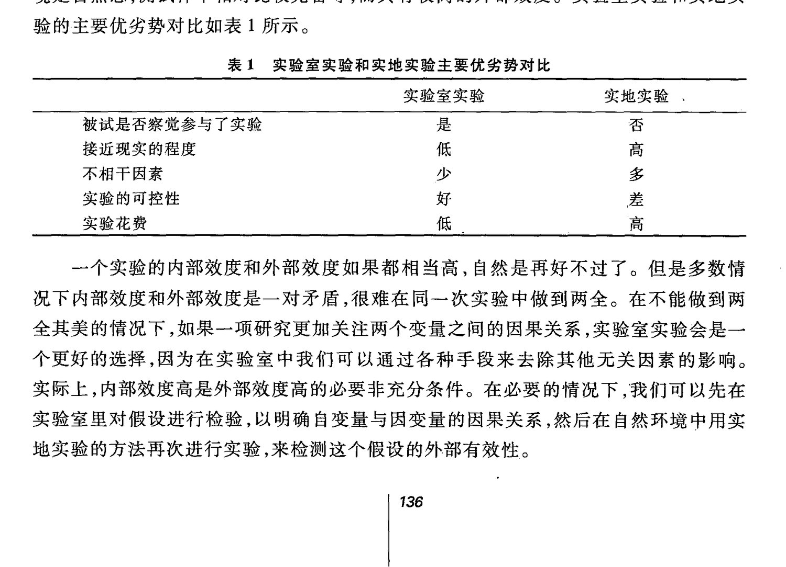

<!-- PDF页 151 -->

那么我们应该如何保证实验的内部效度呢?在实验室实验中,一个实验者又需要注意哪些基本问题呢?五、实验设计的基本原则

在谈到效度之前,我们先介绍实验设计的三条基本原则:随机化(randomization),复制(replication)和区集(blocking)。一般情况下,在被试的选择、测试等方面总会存在实验误差,所以我们需要对实验数据进行统计分析,从而得出有效的结论。这三条原则是统计分析的基础,也是实验高效度的基石。

随机化指实验材料(包括被试)的分配,被试的实验顺序等是随机产生的。如果这些因素都是随机的,那么我们称之为完全随机化(complete randomization)。 其中被试被随机分到各个实验组的过程,我们称之为随机分配(random assignment)。我们可以用电脑里的各种统计软件或者简单的随机数发生器来进行随机化操作。 随机化首先是统计分析的需要。 统计分析中要求基础分析量,如观测值、误差(errors) 等是独立随机变量。随机化下,我们可以认为这些基础分析量是独立随机变量。 随机化也可以减少甚至去除某些外生因素(extraneous factors),尤其是没有得到控制的干扰因素的影响。在研究补偿对献血影响的例子中,如果按照年龄在 30 岁以上和30 岁以下将被试分到有补偿和没有补偿的两个实验组中去就会产生系统偏差,因为年轻人相对更有可能献血。 实验结果可能显示没有补偿的实验组献血更积极,于是我们便得到了错误的结论。 在样本足够大时,将被试随机分到两个实验组就可以基本消除这种情况。

复制指在相同的处理(manipulation) 下,独立重复实验以得到重复样本。 复制首先可以让实验者对实验误差有一个估计。 这种估计帮助实验者了解测试结果是否有统计意义上的不同。 其次由统计分析性质可知,相较于一次测试,多次的复制可以帮助我们更精确地估计样本均值(sample mean)。另外,统计分析需要一定的数据量才可以达到一定的置信度,对于复杂的实验设计来说尤其如此,而复制可以提供一定的数据量。 需要特别指出的是,复制和重复测量不一样,重复测量只是从测量角度提高准确度,而复制则是重新测量整个实验从头到尾被试受到的总影响。 比如研究运动与心律的关系时,测量被试运动后的心律,休息一定时间进行同样的运动后再测量就是复制;被试运动后两研究员分别通过左右手动脉同时测量其心律就是重复测量。

区集是一种实验设计中的方法,用来处理无关因素 (nuisance factor)。 无关因素指,实验之前我们就知道一些实验个体可能含有近似的会影响测试结果的因素,但是这些因素又不是我们关心的。 如果我们知道这种因素是存在而且可控的,那么可以采用区集的处理方法。 我们把受相同无关因素影响的测试值放到同一个区块(block),并认为同一区块的测试值受到这种因素同样程度的影响。 这样在统计分析时,我们就可以去除掉这种因素对实验结果的干扰。 比如在对比研究几种药剂对细菌的抑制作用时,因

总六章 | 实验室研究 | 137

<!-- PDF页 152 -->

为实验条件所限,可能每天对每种药剂只能进行一次测试,但是我们需要更多的数据(复制),所以一共重复进行了5 天的测试。由于每天的天气在变,每次测试也都把实验条件重新初始化,比如清洗培养由等,这导致每次测试的环境不一样,对每次测试结果.的影响也就不一样,这时我们需要把每天都当成一个单独的区块。5.1 实验的效度问是 |

在实验中,有些实验方式或事件会影响效度,我们把这些实验方式或事件称作效度威胁因素(threats to validity)。我们往往把他们按照主要直接影响内部效度或者外部效度分为内部效度威胁因素(threats to internal validity) 和外部效度威胁因素 (threats to external validity) 两类。实际上,有些方式或事件稍稍改变,便会从内部效度威胁因素变为外部效度威胁因素。比如对一些因素来说,如果只影响一个实验组的人员,而不对其他实验组的人员产生影响,那么归为内部效度威胁因素,反之如果对所有的实验组都产生等效影响,那么归为外部效度威胁因素。我们将会在后面的介绍中,随时举例说明这种情况。

对内部效度产生威胁的主要是混淆变量(confounding variable)。没有得到控制的无关变量使测试结果产生了系统性的偏差,于是我们就不能确定因变量的变化是否是由自变量的变化产生的。

### 5.1.1 常见的内部效度威胁因素

ASR SE (history):在实验进程中,有些事件会突然发生,这些事件会影响被试在实验中的反应,影响测试结果。比如 2003年突发的 SARS 事件,如果在此期间对比研究美国和中国的电视广告对消费者购物意愿的影响炙怕就很难得到正确结果,因为在中大多数人这期间没有条件也没有心情去购物。实验环境复杂、可控性差的实地实验受到影响的可能性一般会更大。大多数情况下,我们意识不到的某些事件会影响被试,所以随机化和对照组(control group)对此有一定帮助。.

被试选择偏差(selection bias):被试被主观意愿左右,进入不同的实验组。因为这种主动性背后隐藏的某些因素可能会影响测试效果。又分为两种,即自选择(self selection)与区别选择(differential selection)。自选择指被试主动参与某测试,区别选择指研究人员以自己的感觉选择被试。比如在研究工资和教育程度的相关性时,我们希望把所有样本的工资和教育程度放在一起研究。但是在现实中,当工资低于某个程度时,有些人会选择不工作。对于他们,我们可以了解他们的教育程度,却不知道如果他们工作,那么工资会是多少。特别的,在这部分人群中,受教育程度可能会比较低。那么如果在样本中只研究有工作的人群,最后得到的工资和教育程度的相关度会与真实值有差别,非常可能低估教育对工资的影响。所以我们利用志愿者做研究时,就要特别注意自选择问题,对被试进行随机分配可以帮助解决这个问题。在例子中提到的研究工资与教育程度等无法避免选择偏差的情况下,有些特别的处理方法也许会有效,例如

<!-- PDF页 153 -->

Heckman 在“Shadow Prices, Market Wages, and Labor Supply”一文提出的处理样本偏差的方法。

实验者偏差(experimenter bias):由于实验者本身的行为所导致的偏差。比方说,如果实验操作者事先知道所要检验的假设,在进行实验的过程中,就可能有意或者无意地做出某些行为,影响不同实验情况下的被试的反应。另外,在对一些主观数据进行编码的时候,实验编码者也有可能由于了解所要检验的假设,使这些主观数据的编码存在某种倾向性。这些都会影响实验的最终结果。为了去除实验者偏差,我们通常要求不能让执行实验的人了解实验所要检验的假设。而且通常提出假设的研究者本人不能担当执行操作试验的角色,我们需要一个不知道所要检验的假设的人来执行实验。

测量手段(instrument):在实验中用到的各种手段工具会影响测试结果。一个典型例子就是实验介绍。如果某一实验组使用一种介绍方式,介绍得清晰明白,而其他实验组使用另一种有歧义的介绍方式,那么测试结果显然会受此影响。所以我们要注意尽量让所有的实验组使用相同的实验介绍。还要注意实验介绍写得是否清楚易懂, 实验情景是否合情合理并且人性化,问题措辞是否可能产生歧义,等等。

特别的,工具如果对所有的被试组有同样的影响,那就属于外部效度威胁因素了,比如同样的实验介绍让所有实验分组都产生了歧义。

成熟程度(maturation):随着年龄的增长,我们的心理和生理会逐渐成熟,进而对实验产生影响。一般只有实验周期很长时,我们才和需要考虑这种影响。当被试是儿童时,我们要特别注意这种影响。比如有些研究表明,即使没有受到任何治疗,大多数大学生也会在六个月内从心理消沉期走出来,如果有人做新药剂实验,测试结果表明服用药剂的大学生会在六个月内从心理消沉期走出来,那么显然我们不能认为药剂有疗效。我们可以采用随机化的对照实验组来解决这个问题。

AFAR Ww EA (mortality):实验中,一些被试可能会退出实验,从而影响测试结果。比如被试突然被公司调去外地,不能继续参加实验。因为不知道这个被试与其他完成实验的被试有什么区别,我们很难解释这会对实验结果造成什么影响。为了避免这种情况,我们可以在正式实验前做预测试,了解被试特性。不过要注意这种预测试对实验内部效度的影响。随机选择在某些情况下会有一定帮助。

测试关联(testing):在测后实验(posttest) 之前进行相关度比较高的测前测试(pretest) 可能会使被试对实验更加熟悉和敏感,从而提高测试成绩。这时应该加人对照组。所罗门四组设计也是一种理论上理想的解决方案。

统计回归(statistical regression):典型情况是研究极端组时,测试值的变化会比研究一般群体时大得多。属于极端组的被试很可能会在下一次测试中向均值靠近。 比如说业一次测试中分数在 95 分以上的群体(满分 100),再重新接受测试时有些被试的分数就非常可能向均值靠近一些。避免研究这种极端组是一种选择,否则就应该对被试随机分配,增加对照组。

入六立 | 实验室研究 | 139

<!-- PDF页 154 -->

多重因素作用(interaction):两种或以上的效度威胁因素会同时起作用,我们称之为多重因素。比如实验者因为知道实验目的而自己对被试进行实验分组,那就属于选择偏差和实验者偏差因素的多种因素作用。

### 5.1.2 ”常见的外部效度威胁因素

样本不具代表性(non-representative sample):作为样本(sample) 的被试不能代表和母体(population)的情况。比如研究中国电视广告对消费者购物倾向的影响时,如果只研究汽车类广告对购物倾向的影响,那就不具有代表性。实际上,很多其他因素都可以使样本不具有代表性。保证样本具有代表性是保证外部效度的基石。

传递效应(carryover effects):随着实验的进行,被试会随时间发生变化,进而影响测试结果。比如实验时间过长后,被试可能会感到疲惫、厌倦。这种变化也有可能是学习能力带来的,比如大学生的学习能力很强,在实验进程中对实验越来越熟悉,表现也越来越好,而同为被试的老人的进步可能就不明显。本章后面介绍的组内设计是常用的一种处理方法,并对此因素有进一步的探讨。所罗门四组设计也是一种理论上理想的解决方案。

#8 SRM (Hawthorne effect):指当研究人员存在时,由于紧张等,被试的表现会与平时不一样。如果我们不知道这种差别是否会对测试结果产生重大影响,那么应该怎么处理呢? 一个取巧的方法是再安排一个对照组,对照组与实验组一样会被观察,但是不需要接受测试,目的只是测试置桑效应。

需求特性(demand characteristics):被试在参与实验时很自然地去猜测实验者到底想要检验什么,在试验中能引导被试作出猜测的线索被称为需求特性(Schweigert, 2006)。一旦被试对假设作出猜测,他们在实验中的行为会或多或少受到影响。一些被试会根据他们对假设的猜测故意做出和假设一致的行为,而另外一些人也许会故意做出跟他们的猜测相反的行为。比如,在“显示器与积极性”的研究中,被试认为实验者想检验的假设是“显示融屏幕越大工作积极性越高”,那么即使事实上他们的工作积极性和显示器的大小没多大影响,他们还是努力表现得和实验者的假设一致,其实他们是希望公司管理层看到实验结果后给他们配置更大的显示器。再比如,如果人们猜测实验者要检验的假设是“逢罚越多工作表现越好”,但是因为他们不想受到惩罚,所以故意降低自己的工作表现。这就属于故意做出和假设相反的行为的例子。不管他们的行为和假设一致还是相反,实验结果的效度都受到了影响。因此,为了减少需求特性从而降低被试猜测出一个实验的假设的可能性,一个设计续密的实验通常会比较好地隐藏实验者的真实意图,避免被试猜测出真实的实验意图,并有意调整自己的行为。

安慰剂效应(placebo effect):安奈剂效应指被试即使没有真的接受实验或某种对待,也会给出有效果的反馈。典型例子是药剂实验,被试即使服人的不是真药剂而是安奈剂时也经常会感觉好很多,并给出药有效果的主观反馈。不让被试知道自己正在被测试自然是最好的做法。如果不可以的话,至少不能让被试知道实验的目的。

<!-- PDF页 155 -->

私桑效应、需求效应,安慰剂效应等都有一个特点,那就是实验参与人员意识到正在进行实验,所以对测试的反馈不同于未参与实验时。因此有些人把有这个特点的因素都称之为副效应(reactivity)。

### 六、实验室实验中应该注意的问题

在这一部分,我们首先介绍一下在实验中如何把假设变成可以操作、衡量的东西,然后我们再介绍一些实验中和需要避免的问题。

首先,我们来谈一谈在实验中如何定义一个变量,以及什么叫做可操作性定义(operational definition)。一般来说,一个变量通常是一个抽象的概念,你需要把它转换成具体的可以操作或者观察的形式。那么,一个实验者用来操纵或者衡量的关于这个变量的可操作的形式就是可操作性定义(Cozby, 2001)。有了可操作性定义,其他的研究者就可以相对容易地重复某个试验(Elmes, Kantovitz and Roediger, 1999), 除了可操作性好,一个好的变量定义也要能准确有效地代表变量。比如,把电话客户服务人员的效率只定义为接电话的数量而忽视质量就有一定问题。

变量的抽象程度不同,它所需要的可操作性定义的难易也不同。比方说,工作时间是一个相对来说具体的变量,你只需要用它的小时数来衡量。而工作积极性就是一个比较复杂而且抽象的诡量,会涉及很多因素,比方说员工愿意每个星期加班多少个小时,员工是否愿意接受困难的任务,员工是不是提前完成任务等。一个研究者可以选择工作积极性的菜一个方面作为工作积极性的可操作性定义。关键在于,一个研究者必须先有一个方法来有效衡量或者操纵这个变量才能具体地实施一个实验。

如果你想知道情绪对工作效率的影响,那么首先你就要知道,在一个实验中,你需要怎样做来产生你需要的情绪,所谓的工作效率应该怎样来衡量。 比方说,你可以分别让两组人看回忆他们过去的经历,一组人回忆快乐的经历,另外一组人回忆伤心的经历,这样你就有办法使参加实验的人产生两种不同的情绪。然后你让人们来做某种工作,比方让他们数零件,然后看他们在规定时间内可以完成多少。回忆过去的经历和数零件就是对情绪和工作效率的一个可操作性定义。 一般来说,如果我们不能根据一个假设给出可操作性定义,那么这个假设就是没有办法证伪的。

在实验设计,包括形成可操作定义中,保证效度也是需要时刻考虑的问题。 在我们前面的介绍中,已经介绍了应该重点考虑哪些影响效度的因素,以及如何避人免它们的影响。 除了需要注意前面提出的问题之外,还要特别注意的是,在考虑如何使你的变量可以操作的时候,要避免天花板效应(ceiling effect) 和地板效应(floor effect)。在实验中有的时候会产生所有的数据都集中在可能范围的最高端的情况,这叫做天花板效应。 比方说,你想证实,更多的奖金可以产生更高的工作积极性。 你找了一批人,告诉他们说,如果他们愿意数5 分钟零件,你付给他们每人 20 元钱。 对另外一批人,你告诉他们,如

i 实验宝研究 | 141

<!-- PDF页 156 -->

果他们愿意数5 分钟零件,你付给他们每人 40 元钱。然后你让所有这些人回答,他们有多大可能性愿意来数零件。然后你发现不管是给他们 20 元钱还是 40 元钱,愿意数零件的可能性都在 95% 左右。这是不是意味着你的假设不成立呢? 并不见得。因为很有可能你的结果受到了天花板效应的影响。也就是说,本来给 20 RARE SAL意来数零件了,再多给他们钱也不可能提高他们愿意数零件的积极性。如果是这样,你需要把20 元钱的奖励调低,比方说调低到5 元钱。当然,也有可能是因为这个百分制的衡量方式不能体现工作积极性的区别,那么你可以换一个方法来衡量因变量,比方说,你问参加实验的人,如果我给你 20 元钱,你愿意数多少分钟零件? 对另外一组人,你可以问,如果我给你 40 元钱,你愿意数多少分钟零件?这样就避免了天花板效应。和天花板效应相反的是地板效应,是指所有的数据都集中在可能范围的最底端的情况,它的处理方法也和天花板效应相对应。我们在实验中要尽量避免这两种情况的发生,否则就无法断定到底是因为自变量确实对因变量没有影响,还是自变量没有设置在合适的水平,或者因变量没有得到合理的测量。

我们的初始实验设计可能并不完备,尤其在实验复杂的情况下,所以有的时候,实验者会事先请少数被试做一些“测试性研究”(pilot study),小规模地测试一下实验,看看是不是有一些你意料之外的问题。为了更好地达到测试的目的,在测试性实验结束后,参加测试性实验的被试通常需要回答一些和实验的因变量无关但是和实验设计有关的问题,比方说,“你是否觉得我们的实验介绍得清楚而且容易理解",“你在实验过程中是否有理解的困难”等。实验者也会征求被试的意见,从而知道哪里需要改动。有的时候,实验者还要求被试在参加实验的过程中做口头即时报告,这样被试的一些反应就可以帮助实验者对实验做出必要的改动,保证在整个实验正式开始之前能把可能出现的问题最小化。

对实验结果的理解

做完了实验,收集好了数据,我们就需要对数据加以分析。如果数据的分析结果和我们的假设不一致怎么办? 是不是就意味着我们的假设是错误的呢? 先不要过早下结论,让我们来看看什么情况下我们会得到和假设不一致的结果。

当然,很有可能我们的假设是错误的,但是这并不是唯一的解释。另外一种可能性是我们的实验设计不妥当造成的。比方说,被试没能很好地理解你的指示;或者是被斌在实验后期比较疲劳,没有认真回答你的问题,等等。

此外,你这个时候要思考一下,“我的实验里有没有混淆变量?”消除混淆变量的影响是保证你得到可靠的数据的一个非常重要的方面。所以,你应该看一看,你本来应该控制不变的变量是不是得到了应有的控制? 有没有其他可能的变量应该得到控制,但是你当时没有注意到? 样本量的大小是不是保证随机分配消除了随机差异? 真正操作实验的人是不是对每个被试都公正且没有倾向性?.

除了混淆变量,你还要考虑你的可操作性定义是不是有效。比方说,你对“快乐"和

<!-- PDF页 157 -->

NN — “悲伤”的可操作性定义是分别让人们听一段欢快和缓慢的音乐。如果你的音乐没有达到让被试感到“快乐"或者“悲伤”的效果,那么你需要考虑修改你的可操作性定义。此外,我们在前面提到过,在考虑变量的可操作性定义的时候,我们要注意选取适当的取值范围,避免产生地板效应和天花板效应。如果你发现可能存在的地板效应和天花板效应有可能造成两个实验组没有区别,那你就需要改进你的可操作性定义,再重新进行实验。 |

### 七.实验设计

在接下来的这一部分中,我们要着重讲讲怎样设计一个实验来对假设进行检验。实验的设计在很大程度上取决于你的假设——你的假设有几个自变量以及每个自变量各有有几个水平。如果你的假设只有一个自变量,那你的实验就是最简单的组间设计(between-subjects design)或者是组内设计(within-subjects design)。 如果你有两个或者两个以上的自变量,那么你的设计应该是因子设计(factorial design),当然,一个因子设计既可以是组间设计,也可以是组内设计,还可以是组间组内混合的设计。我们下面对这三种设计——加以介绍。, 7.1 组间设计

设计一个实验首先要考虑的就是如何把实验参与者分配到有不同自变量水平的实验组中。你可以有两种分配方式:(1) 把不同的被试分配到不同的可能值上; (2) 让每个被试接受所有的可能值。

所谓组间设计,是说参加不同实验组的人是不同的,即上面的第一种分配方式。假定你有这样一个假设:对于某件东西,一个人拥有之后卖出它时索要的价格要高于他拥有之前愿意付出的价格。那么你就可以设计这样一个实验:把被试随机分成两组,给其中一组的人每人一个杯子,另外一组人不发杯子。 你请已经有杯子的人回答,如果要把这个杯子卖掉,买方至少要出多少钱他们才愿意卖;你也请没有杯子的人回答,如果要买这样的一个杯子,他们最多愿意出多少钱。这样的一个实验采用的就是第一种分配被试的方式,是一个典型的组间设计的实验。

再比如,你的假设是,正面的反馈比负面的反馈更能提高员工的工作绩效。那么你可以随机分配一组人,给他们提供正面的反馈,给另外一组人提供负面反馈,然后你看看这两组人的工作绩效到底哪个高。 和上面的例子一样,如果一组人收到了正面反馈,那他们就不会收到负面反馈;而收到负面反馈的那组人也不可能收到正面反馈。 也就是说,每个人都只能参加一个实验组,这样的设计属于组间设计。.;

我们前面讲过的“显示器与积极性”也是一个组间设计的例子。一组员工使用大显示器,另外一组员工使用小显示器,我们分别测量他们的工作积极性。如果我们的自变

| 实验室研究 | 143

<!-- PDF页 158 -->

量有多于两个的可能值,那么我们就有多于两个的实验组。比方说,使用大显示器可以提高工作积极性,但是显示器大到一定程度,再增大显示器就对工作积极性没有影响了。因此我们可以有三个实验组,一组人使用 14 英寸显示器,另外一组人使用 19 英寸显示器,还有一组人使用 25 英寸显示器。然后我们分别检验各组人的工作积极性。很显然,不同组的人使用不同大小的显示咒,这也是一个组间设计,只是有更多的实验组而已。

由于不同实验组中的被试之间存在个体差异,我们在分组时需要尽可能做到对被试进行随机分配,抵消差异。

### 7.2 组内设计

另外一个减少组间差异的方法就是采用我们上面提到的第二种分配被试的实验设计方法——组内设计。所谓的组内设计,就是被试要参与某个自交量的所有可能情况。对于组内设计来说,所有的被试参加所有的实验组,被试之间的个体差异都发生在实验组之内,所以并不需要随机分配。

我们仍旧来看“显示器与积极性”这个例子。你可以给所有的人提供小的显示器,测量他们的工作积极性;过一段时间之后,你把所有人的显示只换成大一些的显示器,再测量他们的工作积极性;然后你比较这两种情况下人们的工作积极性。由于每个人都使用过两个显示器,这个实验设计就是一个组内设计。

一种比较常见的组内设计是测试前一测试后设计(pretest-posttest design)。比方.说,你的假设是喝酒精饮料会降低人们的反应速度。你可以首先测试一下被试没有喝酒之前的反应速度,然后你让这些人喝酒精饮料,之后再让这些人做同样的测试,记录他们的反应速度。这就是一个测试前一测试后设计。同样一组人用同样的测试方法被测试了两次,一次是在自变量没有被改变之前(喝酒之前),一次是在自变量被改变之后(喝酒以后)。

### 7.3 ”组内设计和组间设计的选择

在资源充沛的情况下,很多实验者都偏向采用组间设计。组间设计是一种比较保守的设计,因为在组间设计中不会出现一个实验组污染另外一个实验组的情况。一般来说,组间设计的需求特性没有组内设计明显。很容易想象,如果一个被试回答了两个实验组的问题,他就可以相对容易地把这两个问题进行比较,也就更可能猜测出实验者的意图,从而调整自己的行为。这就影响了实验结果的真实性。比方说你想采用组内设计的方法来检验喝酒精饮料对反应速度的影响。由于被试在喝酒之前和喝酒之后做

.的测试相同,他们很容易猜测到你是想检验喝酒对他们的影响。不管他们把自己的反应速度调慢还是调快,实验的结果都存在一些偏差。如果是组间设计,需求特性的影响就相对小一些。当然,在组内设计中,我们可以通过一些实验设计的技巧来减少需求特

<!-- PDF页 159 -->

性的影响。比方说,我们可以让被试在喝酒前和喝酒后做不同的测试,比方说,都是做数学题,但是题目不同。这样被试就很难分辨实验者的真实意图,也很难分辨哪些问题是实验者真正关心的。但是,尽管我们可以减少需求特性在组内设计中的影响,组间设计仍旧是减少需求特性更简便、更可靠的实验设计方式。

组内设计的另外一个问题就是可能产生传递效应。比如你测试正面反馈和负面反馈对工作绩效的影响。如果采用组内设计,被试先接受正面反馈,我们测量其工作绩效;然后被试再接受负面反馈,我们再次测量他们的工作绩效。由于对因变量的测量都是让被试参加相同的测试,所以被试在第二次参加这个测试时的成绩会提高,但是这不一定是反馈对绩效的影响,而很有可能是由于人们在第一次做测试的时候获得的一些经验可以被用在第二次测试中,从而提高了成绩。我们把这种传递效应叫做练习效应(practice effect)。但是如果被试因为重复已经做过的测试而感到无聊并逐渐对测试匣衍了事的话,成绩会降低。这也不是反馈对绩效的影响,而是另一种传递效应,叫做疫劳效应(fatigue effect)。我们在实验中应该尽量去除练习效应和疲劳效应。去除传递效应有一些常见的方法,例如让被试回答不同的测量因变量的问题。假如你想测试在不同环境下的记忆力,那么不要让被试背诵相同的东西,而是背诵类似的东西。:

如果让所有的被试都以同样的顺序经历所有的实验组,就会很容易产生传递效应。为了减少这种情况的发生,我们可以用 ABBA 互相抵消的方法(ABBA counterbalancing)设计实验。仍旧以反馈和绩效关系的假设为例。你可以对每个被试都采用这样的顺

””序:正面反馈一负面反馈一负面反馈一正面反馈(ABBA)。把正面反馈放在第一和第四个位置可以在某种程度上去除练习效应。但是,如果你的自变量有三个可能值,上面的这种完全互相抵消的方法就不太可行,因为这三个可能值的顺序组合有6 种,那么被试就要经历3(3 个可能值) x6(6 种可能顺序组合) =18 个实验组,实在是太长了。

在这种情况下我们有没有其他办法呢?我们可以随机把被试分配到不同的实验顺序中去,我们把这种方法叫做抵消平衡法。如果是有两个可能值的自变量,这两个可能值的顺序排列只有两种情况:AB 和BA。那么你可以随机选取一半被试采用 AB 的顺序,另外一半采用 BA 的顺序。比方说,有一半的人是先接到正面反馈,男一半的人是先接到负面反馈。需要注意的是,在抵消平衡法中,顺序是一个组间变量。如果是有三个可能值的自变量,你就要把所有的被试随机分成6 组,每组采用一种排列顺序。不难看出,ABBA 互相抵消的方法一般来说只适用于自变量有两个可能值的情况,但是抵消平衡法却可以适用于自变量有两个或者两个以上可能值的情况。

可是这样还是会有问题,随着自变量的可能值的增多,可能的顺序也在增多。上比方说,3 个自变量的值有6 种顺序,4 个自变量的值有 24 种可能的顺序,5 个自变量的值其至有 120 种可能的顺序! 有的时候不同自交量值的排列顺序的数目其至比参加实验的人还多,那么随机分配被试到不同的实验顺序中去的方法也不适用了。

这个时候,我们就没有办法做到完全的平衡抵消了。我们需要做的是一个不完全

BAR | 实验室研究 | 145

<!-- PDF页 160 -->

的平衡抵消,但是我们要保证每个可能值出现的次数相同,而且这些值可能出现的位置的次数也相同。比方说,如果我们有 A、B 和C 三个自变量的值,那么我们要保证三个值出现在第一位、第二位和第三位的次数相等。这种不完全平衡抵消的方法叫做拉丁方设计(Latin-square design)。

在下面的表中我们列出了有四个实验组(A B C D)的拉丁方设计。

顺序第一位第二位第三位第四位1 A B Cc D被试编导 2 B Cc D A 3 Cc Dp A B: 4 D A B Cc

按照这张表的情况,参加实验的人数需要是4 的倍数。比方说,如果我们有 12 个被试,被试 1、被试5、被试9 都采用第一个实验顺序,被试2、被试6、被试10 采用第二个实验顺序,以此类推。鉴于这种分配方法的复杂性,建议感兴趣的读者参考其他相关书籍,在此我们不做深入讲述。比如,Roger E. Kirk 编写的 Experimental Design: Procedures for the Behavioral Science 对拉丁方设计有详细的介绍。

此外,值得一提的是,有时由于条件限制,可能元论是抵消平衡法还是拉丁方分配方法都不能使用。因此,无法在实验中加以排除或控制影响实验结果的因素。在这种情况下,只有做完实验后采用协方差分析(analysis of covariance) 或偏相关等方法,把影 ”-响结果的因素分析出来,以达到对额外变量的控制。这种事后用统计技术来达到控制BSP EN TIE,被称为统计控制(statistical control)。

当然,如果组间设计完全优于组内设计的话,我们就没有必要讨论组内设计了。组内设计有它自身的优点。组内设计的主要优点是,由于不存在被试的组间差异,组内设计更容易做出显著的效果。如果我们能很好地控制其他对组内设计的不利因素,组内设计也不失为一个好的选择。

### 7.4 ”因子设计

以上我们介绍了只涉及一个自变量的最基本的组内设计和组间设计。一些比较复杂的设计常常涉及多于一个自变量的情况。我们把在一个实验中同时操纵两个或两个以上自变量的实验设计叫做因子设计。

假定你想研究拥有相似的背景如何影响人们对他人行为的理解。比方说你有这样一个假设:如果一个人表现出好的行为,那么和这个人有相似背景的人倾向于认为那个人的表现是出于这个人的主观意图,而没有相似背景的人则不大会这样认为;相反的,

. 如果一个人表现出差的行为,相对于和这个人没有相似背景的人而言,有相似背景的人更倾向于认为这个人表现出的行为不大可能是出于个人的主观意图。这个假设有两个

<!-- PDF页 161 -->

自变量:一是拥有相似的背景与否,二是被评价的行为的好坏。这个假设的因变量是人们认为另外一个人的行为在多大程度上是出于他的主观意图。

因此,在这样一个因子设计中,我们可以同时检验多个假设,既可以看相似背景的有无如何影响人们对他人行为的理解,也可以看他人行为的好坏如何影响人们对这些行为的理解。在检验背景的影响时,我们忽略了行为好坏在这里的影响;同样的,在检验行为好坏的影响时,我们也忽略了是否拥有相似背景的影响。这样的分析得出来的效应叫做主要效应(main effect)。

而如果我们把两个自变量同时考虑进来,看它们之间的组合对因变量的影响,得出来的效应叫做交互作用(interaction effect)。之所以采用因子设计,是因为我们预测实验的结果会产生一个交互作用。当然,如果你关注的不是交互作用,就不需要采用因子设计,采用最简单的单变量实验设计就可以了。

根据上面的例子,我们预测有这样一个交互作用:在理解好的行为时,和行为人有相似背景的人比没有相似背景的人更容易认为行为人的行为是出于他的主观意图;但是在理解坏的行为时,有相似背景的人比没有相似背景的人更容易相信行为人的行为不是出于主观的意图。那如何来进行这个实验呢?我们可以把所有的被试随机分成四组:

1. 有相似背景的人理解他人的好的行为:我们让被斌想象,他们有一个同事,被试和这个同事并不相识,但曾经和被试一同参加新员工培训。这个同事上班从来不迟到。

2. 没有相似背景的人理解他人的好的行为:我们让被试想象,他们有一个同事,被试和这个同事并不相识,而且被试和这个同事在进入公司的时候在公司的不同分部接受了新员工培训。这个同事上班从来不迟到。

3. 有相似背景的人理解他人的差的行为:我们让被试想象,他们有一个同事,被试和这个同事并不相识,但曾经和被试一同参加新员工培训。这个同事上个月上班迟到5次。

4. 没有相似背景的人理解他人的差的行为:我们让被试想象,他们有一个同事,被试和这个同事并不相识,而且被试和这个同事在进入公司的时候在公司的不同分部接受了新员工培训。这个同事上个月上班迟到5 次。

然后我们让第一和第二组被试回答这样一个问题:“你认为你的同事上班从来不述到在多大程度上是由于他对自己有比较高的要求?”被试在一个1 到11 的量表上打分, 11 代表“完全由于他对自己有较高要求”,1 代表“完全不是因为对自己有较高要求”。第三和第四组被试回答的问题是:“你认为你的同事上个月上班迟到在多大程度上是由于他对自己没有比较高的要求?”类似的,被试也在一个 1 到 11 的量表上打分,11 代表“完全由于他对自己没有较高要求”,1 代表“完全不是因为他对自己没有较高要求”。

假定我们的实验得到了这样一个结果:

BAR | 实验室研究 | 147

<!-- PDF页 162 -->

背景有相似背景”没有相似背景”边际平均什wea [9 [5 7 7 ]行为 BB) | 3 | 6 | 45 |边区值| 6 | 55我们对每一行或者每一列求平均值,就是上面表格中的边际平均值(marginal average)。边际平均值是忽略一个自变量,仅仅对因变量在另外一个自变量的某一个可能值下求平均值。比方说,边际平均值“7”就意味着在两次对如何理解他人行为的测量| 中,人们认为主观意图对不迟到这个行为的影响程度是7。我们看到,对于迟到的行为,人们认为主观意图在这里的影响程度是4.5。类似的,我们还计算出,不论是否迟到,有相似背景的人认为主观意图对他人行为的影响程度是6,没有相似背景的人认为主观意图对他人的行为的影响程度是 5. 5。现在看一下根据上面的数据画出的图1。横轴代表有无相似背景这一自变量,纵轴代表对行为意图的判断这一因变量,而对另外一个自变量“行为好坏”,用不同线段来分别表示“不迟到”这一好行为和“迟到”这一坏行为。由于我们有两个自变量,但是只有一个模轴,我们必须决定用哪个自变量做横轴。一般来说,这取决于假设表述的形式。在上面的例子里,我们首先是固定行为的好坏,改变背景这个自变量,所以我们就把背景这个自变量作为横轴。上图显示,对于一个人的好的行为,与他有相似缘景的人比没有相似背景的人更倾向于认为那是出于他的主观意图;而对于一个人的坏的行为,与他有相似背景的人比没有相似背景的人更倾向于认为那不是出于他的主观意图。10 9 7 it ib 6 z.. 3. x *K ae 3六——不到> 一一壕到° 有相似背及 BANOER。 ”背景图1 组间因子设计(1)但是如果把行为的好坏作为模轴,我们就得到了图2:

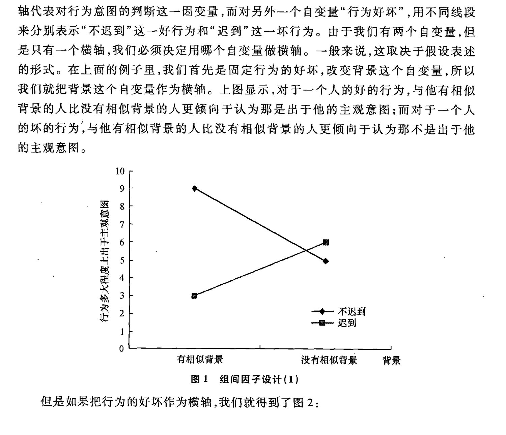

<!-- PDF页 163 -->

10 9 7 a th 6 a 45 ae a4 a3. R2 _ 一9一有相似背景1 一各一没有相似背景° 不迟到述到 RABE图2 组间因子设计(2)对于这个图,比较容易的理解方式是:对于有相似背景的人,人们容易认为他人好的行为是出于其主观意图,而差的行为则不是出于其主观意图;对于没有相似背景的人,行为的好坏对人们对于他人主观意图的推测没有影响。很多时候,图形可以让人更直观地观察到是否存在交互作用。一般来说,如果两条线是平行的,可以推测实验结果没有交互作用;如果两条线的斜率存在较大差异,可以推测实验结果是存在交互作用的。我们在下面画出了几种可能的情况。需要指出的是,交互作用并不以主要效应的存在为前提。如下页图所示,虽然这张图显示的结果并不存在主要效应,也就是说,这张图的边际平均值相同,但是由于两条线的斜率明显不同,这个结果构成了一个交互作用。 |检验实验结果是否存在交互作用的常用方法是 ANOVA 分析(analysis of variance)感兴趣的读者可以查看本书的第十四章。上面讲到的例子是一个典型的组间因子设计(between-subjects factorial design)。必须明确的是,因子设计和组间设计、组内设计之间不是互相排斥的,一个因子设计可以是单纯的组间因子设计,也可以是组内因子设计,其至可以是组间组内混合的因子设计。让我们先来说说组间组内混合的因子设计(见图3)。假定我们现在有两组人,一组人先想象一个跟他同时参加新员工培训的同事,这个同事上班从来不述到,并让被试回答他认为这个同事上班不迟到,在多大程度上是因为对自己有较高的要求;然后再让被试想象一个没有跟他一起参加新员工培训的同事,这个同事上班也从来不迟到,并让被试回答他认为这个同事上班不迟到,在多大程度上是因为对自己有较高的要求。另外一组人也回答两次问题,只不过这组被试需要想象一个同事上个月上班迟到了5 次。这就是一个组间组内混合的因子设计。其中,是否有相似背景这个自变量是一个组间变量,而同事的行为这个变量是一个组内变量,同样的被试分别想象了两个同事,并两次回答了相同的关于因变量的问题。ane | 实验宝研究 | 149

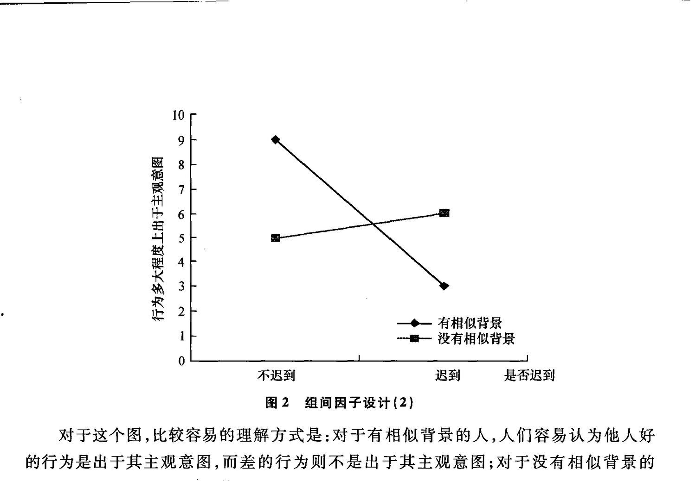

<!-- PDF页 164 -->

9 “9 a 7 7 6 6 5 >< 5. 3 3 3 3 2 2 1 1 ° 1 2 Ta 2存在交互作用存在交互作用9 9 ‘ 8 8 7 NN 7 6: 6 4 4 3 3 2 ————8; 2 2 1 1 0 0 1 2 1 2 3不存在交互作用存在交互作用9 8 7 6 om. 5 4 ONS 3 2 1. 0 1 2 3不存在交互作用图3 组间组内混合因子设计如果更进一步,让被试把所有的实验组都经历一遍,那就是一个完全的组内因子设计。到底选取组间因子设计、组内因子设计,还是混合因子设计,不是实验者任意决定的。它取决于你的假设和你的实验条件。在上面的例子中,很明显,完全组内因子设计不是一个好的选择。它不仅容易产生传递效应,而且非常容易被猜测出实验者的意图。如果我们想要保证各个实验组互不影响,减少混淆因素的影响的话,采用组间设计比较妥当。当然,组内因子设计或者混合因子设计也有它们的好处。比方说,有的时候一个假设本身看的就是组内因素的变化,这个时候就应该采用组内因子设计或者混合因子设计。比如说,你想检验人们不同时间点上的心情的变化,以及吃早饭与否对心情的影响。你想知道人们下午的心情是不是比早上好,而且你想研究吃不吃早饭是否和时间

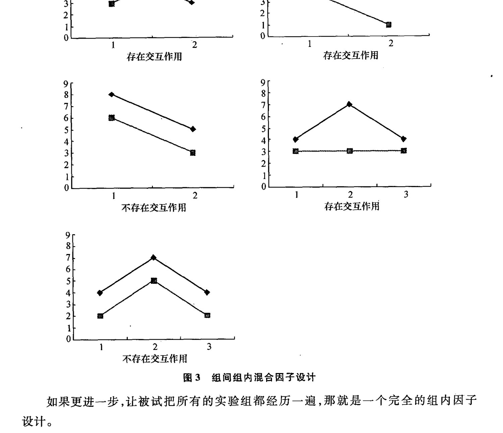

<!-- PDF页 165 -->

对人们的心情产生交互作用。由于本身就是想比较同一个自变量在同一组人身上的变化,时间变量最好作为一个组内变量。是否吃早饭当然是作为一个组间变量,因为你不可能让人同时既吃早饭又不吃早饭。

如果一个因子设计有两个自变量,相对应的交互作用就叫做两重交互作用(two-way interaction)。如果我们有多于两个的自变量,这样的设计叫做高阶设计(higher-order design)。比方说,在背景和行为之间的交互影响的例子中,再加入时间这个自变量,分别在早上和晚上测量人们如何理解他人的行为,我们就有了一个2 x2 x2 的高阶设计,一共有8个实验组。在一个有三个自变量的设计中,假设三个自变量分别为A,B,C。那么这个实验会产生三个主要效应,分别对应 A,B,C。还有三个两重交互作用,分别发生在 AB 之间、AC 之间和 BC 之间。还有一个三重交互作用,发生在 ABC 三个自变量之间。 对于一个高阶设计来说,我们的假设关注的应该是多重交互作用,否则不必也不应该采用高阶的设计。

需要注意的是,到底是几重交互作用,取决于你有多少个自变量,并不取决于自变量水平的个数。比方说,我们上面的图1 和图2 就是一个两重交互的例子,因为这个图上只有两个自变量。虽然其中一个自变量有三个水平,这仍旧是一个两重交互作用,而

» 不是一个三重交互作用。我们上面讲的都是每个自变量有两个可能值的情况。实际上很多时候自变量有多于两个的可能值。这个时候,只要我们只有两个自变量,交互作用就仍旧是两重交互作用,尽管你需要更多的实验组了。总之,实验设计中可以有多个自变量,而每个自变量又可以有多个水平,自变量既可以是组内变量,也可以是组间变量。

研究中最常见的就是两重交互作用。当自变量增多的时候,对实验结果的解释就变得困难起来。很多时候我们很难理解一个四阶的交互作用到底意味着什么。更多的自变量会混淆我们对问题的理解,而且通常不具备理论上的重要性。这时候我们可以采用一个实验设计技巧:把我们不关心的多重交互作用和区块混淆在一起(confound with block)。这种做法的指导思想是让一个区块内的元素受某种多重交互作用同样的影响。这样,区块的影响和多重交互作用这两种我们都不关心的、但是会影响实验结果的因素被放到一起考虑了,这样就可以把其共同作用的影响仅当做区块的影响。具体的原理和处理方法可以参考 Douglas C. Montgomery (2005)。

、.% 8

在本章中,我们首先介绍了研究的类型,以及什么样的假设才是一个好的假设。然后,我们着重讲述了如何在实验室中对假设进行检验。在实验室实验中,我们又着重讲了组间设计、组内设计和因子设计这三种最常见的实验设计方法和它们各自的优缺点。实验设计涉及许多概念,有许多需要注意的问题。很多好的研究不仅有好的假设,还有让人信服而且印象深刻的实验设计。实验设计本身是一门科学,同时也是一种艺术。

BAR | 实验室研究 | 157

<!-- PDF页 166 -->

### 参考文献

Cook, T. D. and Campbell, D. T. (1979). Quasi-experimentation: Design and Analysis Issues for Field Settings. Chicago; Rand McNally.

Cozby, P. C. (2001). Methods in Behavioral Research. Mountain View, CA; Mayfield Publishing.

Douglas C. Montgomery (2005). Design and Analysis of Experiments (Sixth edition). New York; John Wiley & Sons.

Elmes, D. G., Kantowitz, B. H. and Roediger, H. L. (1999). Research Methods in

. Psychology.” Pacific Grove, CA; Brooks/Cole Publishing.

March, J. G. and Lave, C. A. (1975). An Introduction to Models in the Social Sciences. New York; Harper & Row.

Schweigert, W. A. (2006). Research Methods in Psychology. Long Grove, IL; Waveland.,

<!-- PDF页 167 -->

## 第七章 准实验研究

上时een oz准实验研究香港大学本章大纲一、准实验研究1.1 例1“好组织公民和服务质量":简单的介绍1.2 茶一分行的银行经理和人力资源主管之间关于上述准实验的模拟对话1.3 更进一步的讨论:准实验设计中的效度问题1.4 例2“控制点和对四升的反应”:简单的介绍1.5 准实验研究设计1.6 进一步的讨论;在准实验设计中采用控制交量和控制组二、 结语, a)随机分配实验对象到实验组和控制组通常是不可能实现的,有一些研究设计有时比“真正”的实验的内在效度低一些,但是仍然可以在一定程度上支持因果推断关系,这种设计被称为准实验。准实验与“真正”的实验不同的地方主要在于,前者并没有随机分配实验对象到实验组和控制组。“准”的意思引申为比照,作某类事物看待。准实验设计是相对于“真正"的实验设计而言的, “真正”的实验设计引入控制组,并且随机分配实验对象,而准实验设计虽然采用一定的操控措施,但是没有随机分配实验对象到实验组和控制组。准实验设计最常见的方式包括对比组无前测设计和非对等控制组设计。准实验设计的缺点在于实验所产生的因果结论的效度比“真正”的实验设计低,优点在于准实验设计所要求的条件EE | 准实验研究 | 153

<!-- PDF页 168 -->

' 灵活,具有广泛的应用性。在一些研究中,如果我们无法控制所有可能影响实验结果的

无关变项时,我们可以采用较不严谨但是实验方便的方式,即准实验设计来进行。

根据研究问题,准实验设计可以使研究者能够灵活地协调控制实验对象和利用自然场景之间的组合,找到最具说明性的答案。

### 一、准实验研究

### 1.1 例1“好组织公民和服务质量”:简单的介绍

首先让我们先来看看一个现场准实验的例子。

服务部门一直以来都在为它的一线员工开发更好的培训项目来提高顾客满意度,然而通过提高项目的深度或者复杂程度都没有达到相应的目的。2001年在一个跨国银行进行的现场准实验显示了有趣的结果〈(Hui,,Lam and Schaubroeck, 2001),研究者把注意力从加强项目的特征转移到加强参与者本身的特征上。在培训中,服务质量主管是指在服务质量培训模式中所培训的变革代言人。研究者研究了选择服务质量主管的有效性,并且研究了选择有组织公民行为的员工作为代言人是否会更加有效。

组织公民行为被定义为“自发的、并没有得到正式的报酬系统直接而明确的认可,但从整体上有助于提高组织的效能的个体行为"。如何去识别员工是否有组织公民行为,并且指定这些优秀的模范者为服务质量主管呢? 在本研究中,研究者要求银行经理通过含有8 个问题的利他主义量表来观察其分行的组织公民行为,判断每个员工是否乐于助人和自愿工作,等等。研究者从该跨国银行 43 个相似的分行中选出3 个,并且把它们随机分配到处理组或者控制组。在分行C 中,6 个显示出组织公民行为的柜员被指定为服务质量主管;在分行 B 中,6 个柜员被随机选为主管;分行 A 是用于比较的控制组,没有服务主管。这 12 个主管接受质量改进的培训。

假设 1 是基于几个已经成立的社会心理学的事实:因为来自同非人的社会影响能够更为可信和显著地改变个体行为,研究者假设当实施组织的质量模式时,培训特定的一线员工作为质量改进的代言人会有助于提高效能,无论这些代言人是否表现出组织公民行为,这个假定都成立。

假设2 在这一方面挖掘得更深,涉及了利用有组织公民行为的员工作为变革代言人的特定用处,既然这些代言人可能成为更加可信的影响来源,研究者期望看到有组织公民行为的员工作为变革代言人的质量模式能带来更高的一致性和有效性。

分行 B 和C 在关于服务标准方面的顾客满意度数据、员工的自我评价和主管的评价上都比分行 A 要高。因此假设 1 成立,在质量改进模式中仅仅把一线员工作为变革代言人更有说服力,能更有效地提高服务标准。

正如上面所预测的,在质量改进模式被启动有组织公民行为的员工被训练为质量

<!-- PDF页 169 -->

改进的代言人后,分行 C 在关于服务标准的顾客满意度、员工的自我评价和主管的评价上比分行 A 和B 高,这一点更加证实了假设2 是一个有效的推断。1.2 某一分行的银行经理和人力资源主管之间关于上述准实验的模拟对话

来自该跨国银行另外一个分行的银行经理和其人力资源主管就这个准实验的方法和有效性进行了一次热烈的讨论,我们可以从中看出哪些因素在准实验中是关键因素:

(BM: 银行经理; HR: 人力资源主管)

HR; 这是一个现场实验,经理! 他们肯定没有对环境因素进行控制,如何证明环境因素没有对结果产生影响?

BM: 提醒你一下,报告中很清楚地提到了分行 A、B 和C 的柜员在年龄.教育水平和组织工龄中都没有显著的差异,看起来这些样本在开始的时候并没有历史的差异和相似的同华人互动作用。

BR: 这一点提高了效度,但是仍然不像实验室研究的结果那样纯粹,混杂的环境因素可能仍然对结果产生影响。

BM: 确实,但是研究者难道不是已经随机分配这三个相对类似的A、B 和C 的柜员到三个不同的处理条件下了吗?

HR: 这里确实存在随机分配处理,但是自变量怎么办呢?你不可能“分配”一个框员有组织公民行为,而另外一个是懒鬼。

BM (笑了笑):对,你说得没错! 但是我们是在绕圈子,我想知道的是这次的准实验是否有足够的效度来说服我放“绿灯”以支持我们自己的组织公民行为培训模式,他们到底是如何来培训所选择的柜员的?

HR: 这让我想起了自己的另外一个疑问,独立的管理咨询师通过三个星期的项目来培训柜员,既然分行C 的员工必须在课堂上表现出更加肯定的反馈,培训者有没有下意识地更努力地教分行C 中有组织公民行为的员工呢? 而且同时忽视那些从分行B 中随机选择的员工,因此在结果中达到“显著的差异”呢?

BM: 我觉得报告是说培训者对参与者所属的分行、地位和能力都是一无所知的。

HR: 好,我承认这一点,但是那些被培训的呢? 如果我知道我是被一些计算机彩票活动所随机选取的一员,我将不会给......

BM: 冷静,我的朋友! 哪来这么多的怀疑主义? 一个准实验设计应该有更多的效度,研究者做的是一个双讶实验:负责实施处理的培训者和接受处理的参与者都对被培训的员工的身份是一无所知的,换身话说,这好像一个黑客电影:在游戏中的人都不知道自己身在游戏中。

HR; 有道理,经理! 双讶使得这个准实验对事实更有解释力。而且,真的不可能在实验室中创造出如此实际的场景,在白袍子和和白手套中培训我们的柜员。

BM: 这就是准实验设计的美妙之处,你可以控制和选择那些需要控制和选择的因

Ste | 准实验研究 | 155

<!-- PDF页 170 -->

素,同时你的“实验品"还能在他们的自然场所中轻松地参与你的游戏。

HR: 请原谅,经理! 但是在实验中所存在的那些没有被控制的环境因素会困扰到我那顽固且严谨的科学头脑,在这种情形下难道内在效度没有被损害吗?

BM; 谨慎一些并没有罪。没错,参与者确实不能被随机分配到分行 A、B 或C 中工作,而且我们也不是上沉,不能随机规定这些个体的工作态度,这会威胁到内在效度,从而会威胁到对结果的解释的理论预测能力。我们联明的研究者做了他们所能够做的:他们采用“控制组"一一分行 A,来对比和提高处理效应的建构效度,在分行 A 没有人被选为服务质量主管来进行培训,这是准实验设计相对于纯粹的观察研究的另外一个优点。

BR: 我明白,因此我们能够得出结论:培训,特别是对组织公民行为的柜员而言,可

BM; 等一下。内在效度可能存在的问题会妨碍因果结论,准实验仍然不是真正的实验宝研究,我们仅仅能够做出一个合格的推断,就是这种培训和组织公民行为选择会显著地提高柜员的质量改进程度和一致性。我们必须意识到在任何涉及自然发生过程的准实验中,任何人都不能肯定地得出因果结论,这是否满足了你“着固且严谨的科学

HR: 很好,经理。我觉得关于准实验设计我还很多东西要学,这看起来在商业研究中是一个最有效而且实际的研究方法,随着时间的发展,我们除了需要尽可能地控制自变量、双讶性之外,更需要谨慎的重复测量来保证最好的效度。

BM; 嗯,你理解得没错,我现在可以“放行”",让你们开展自己的组织公民行为培训BATH? (微笑)

从上面的例子中,我们可以看出,准实验设计虽然并不像“真正”的实验设计那样严谨,但还是对可能影响因果结论的一些因素进行了控制。在准实验设计中,我们应该尽量通过各种方式来控制混杂性因素对结论的影响。准实验设计并不是“真正”的实验设计,从准实验设计中我们仅仅能够得出一个合理的推断,而非严谨的因果关系。1.3 更进一步的讨论:准实验设计中的效度问题

正如我们的人力资源主管所认为的,准实验设计会损害效度。研究者无论在什么时候都应该很小心地控制任何可能对结果造成潜在影响的外在因素。准实验是在自然的场合下进行的,当被试跟他们的环境相接触时,研究者是不可能消除所有潜在的第三方因素的影响的。

传统实验方法的使用。然而有一些方法可以有效地提高内在效度,实验者可以通过传统实验方法的使用,如双盲实验,来消除潜在的参与者和培训者对处理和被处理产生的反应和情绪。另外一个常见的工具就是使用控制组,通过引入一组几乎在所有的方面都与处理组相同、没有受到处理因素影响的被试,当个体差异被排除时,实验者通

<!-- PDF页 171 -->

: 过对比结果,可以对所研究的因素的效应得出合格的推断。

测量方式。另外一个有用的工具就是时间序列的测量,如果可以在处理之前和处理之后进行多个数据收集点的长期研究,那么基于处理组和控制组所表现出来的不同趋势,从准实验中可以做出更强的推断关系。正如上面所提到的准实验,重复的测量可以让人深刻了解这三个分行在引入服务质量主管之前员工一致性的历史是否有可比性。通过收集培训模式之前和之后的数据,我们可以减弱自然趋势或者员工不同的一致性评价对结果可能产生的影响。

显著性检验。在从准实验中收集数据结果之后,研究者可以从统计上进行进一步的显著性检验,例如,上述准实验中的P值检验可以证明结果是否具有统计意义上的显著性,不仅仅是归因于对均值的回归。研究者还可以通过检验正态分布和自变量之间的非相关性来测试效度。

具备所有可能提高实验方式和数据收集的“纯粹性”的测量方法,准实验可以得出高质量的推断关系,证实理论上的预测性,以及在多大程度上给管理研究和创新提供有效的建议和敏锐的洞察力。然而,我们必须记住在准实验中采用自然场合而导致的不可控制的潜在环境因素的存在。

. 即使假定前面提到的所有的注意事项都被满足,对内在效度的威胁也是不可能完全消除的。和任何的准实验一样,组织公民行为研究不能控制实验对象的内在组织公民行为或者分行环境的外在影响。即使大部分可能削弱建构效度的因素都不可能发生,任何在自然场合下进行的准实验也都不可能得出因果结论。是的,准实验可以比观察研究得出更多的建议和更强的推断关系,然而不像实验设计,在准实验设计中研究者不能得出在统计上很精确的因果关系。

### 1.4 例2“控制点和对普升的反应”:简单的介绍

另外一个商业研究项目是利用准实验设计来研究在香港的一个国际性银行中个体的人格特征如何影响他们对晋升的反应(Lam and Schaubroeck, 2000)。 其体来说,360个有资格晋升的柜员首先被分为内在控制倾向或者是外在控制倾向两种类型。 研究者在普升决策宣布的三个月之前和之后对他们的工作态度和行为进行观察,并且在 18 个月之后进行重复的测量。研究者感兴趣的是有内在控制倾向的人和外在控制倾向的人在晋升后改变工作态度和行为的持续期限是否不同。.

一个人的控制点(LOC)被定义为“影响人们如何感知他们的行为和结果的关系强度的主要因素”。 内在控制倾向的人比外在控制倾向的人们更加可能相信他们所得到的奖励是自身行为的结果,而外在控制倾向的人相信这些奖励可能归因于机会或者其他不可控制的原因。

研究者假设不管一个人的控制点如何,在提升后的三个月内与提升前的评价相比,晋升都能够推动员工在短期内表现出更好的工作态度和行为。

~ 准实验研究 | 157

<!-- PDF页 172 -->

然而,研究者假设外在控制倾向的晋升者所显示出来的改进很可能是短期的,因为这些人不相信和是他们好的工作表现导致了晋升。同时,那些内在控制倾向的人更有可能在一个很长的时期内展现出改进的行为,因为他们认为主要是其行为导致他们获得奖励。因此,我们的第二个假设是:在18个月后,那些外在控制倾向的人将会恢复原来的工作态度和行为,而那些内在控制倾向的人将会继续表现出改进的态度和行为。

为了更好地控制他们工作所在的环境因素,研究者确保所有的被试在晋升之前和晋升之后的薪酬工作丰富程度都相对一致。这些第三方因素可能导致晋升者在晋升之后的正面感情因素,从而会影响行为的改变。保证这些第三方因素相对一臻是特别关键的,因为研究者想要测试的是即使在没有物质奖励(例如提高的薪酬社会地位和更加有挑战性的工作)同时发生的情形下晋升本身是否会提高满意度。

为了提高研究结果的效度,在这里研究者使用被拒绝晋升的人作为控制组,来比较由晋升决策所带来的行为改变。.

XIE RT RY GR OB AY AS BE ATT BY PRE TOE个假设都是正确的,即所有晋升者在晋升的3 个月内都表现了改进的工作态度和行为。内在控制倾向的晋升者把这种现象持续到第18 个月,但是外在控制倾向的晋升者在 18个月后退回到原来的水平,而非晋升者在整个研究中没有显示出任何的改变。因此,研究者可以得出结论,个体的人格特征——控制点对晋升者的长期行为会产生影响,尽管在短期内所有的个人都显示出改进的行为。

### 1.5 准实验研究设计1. 对比组无前测设计Xx 0 0.

研究者对实验组和控制组进行了后测,并没有进行前测,这跟“仅施后测控制组设计”是一样的,除了没有随机分配之外。什么会主要影响内在效度呢?

。 如果后测的结果不同,那么有可能是由于控制组和处理组的实验对象本身所存在的特征不同而引起的,我们应当如何区别呢?

这个设计相对比较弱,研究者应该考虑对两组实验对象进行前测,做出更强的推断关系。

2. 非对等控制组设计

0, x 0, 0, Xx 0,注意:虚线表示没有随机分配实验对象到处理组和控制组。

<!-- PDF页 173 -->

这是最常见的准实验设计,除了没有随机分配实验对象到实验组和控制组之外,它跟前面讨论过的前测一后测设计是一样的。因为操作原因,我们不可能随机分配实验对象,因此一个完整的班级或者某一特定班级所有的学生都会接受处理或者作为控制组,在这里什么会威胁到内在效度呢?

。 事后测试表现出来的组别差异有可能是由于之前存在的差异,而并非是由于处理效应所引起的。

为了提高设计的强度,我们建议采用协方差分析(ANCOVA)统计方法,协方差分析可以通过对两个组别的后测均值进行补偿性调整,从统计上降低最初存在的组别差异的效应。

### 1.6 进一步的讨论:在准实验设计中采用控制变量和控制组

上面提到的关于晋升的研究,来自 2000年的管理学术杂志,它阐明了淮实验设计的一些关键的需要注意的地方和特征。正如我们在前面的组织公民行为的研究中所看到的,准实验的优势在这两个例子中显示出来:自然场合的可获得性,就是在被试自己的分行和工作环境中,研究者可以观察到被试的反应以检验假设,并且,这使得该研究的结果更具有说服力,更接近生活。被试不清楚自己是在被观察当中,而在实验室研究中,被试对这一点很清楚,这有可能导致被试由于了解试验者对他们的期望而改变本身自然的行为,努力表现出好业绩。然而,准实验也有一些疑问需要研究者去克服。

. (1) 在自然场合中的混杂因素。晋升是一个伴随着其他许多组织事件和特征发生的特定事件,同时也是研究者想检验的唯一的自变量,我们如何能够抽出和记录仅仅由于这个因素所导致的行为改变,并且除去由其他可能因素所引起的效应呢?

在准实验设计中,研究者将需要控制尽可能多的在所观察的场合中的第三方因素,来提高研究结果的效度。 在这个例子中,研究者尽他们的最大努力,消除了除晋升之外的其他可能会导致工作态度和行为进步的环境因素,例如在新的职位上的薪酬上涨或者工作丰富性。这些因素可能会导致普升者的行为进步,因此掩盖了晋升的纯效应。

相对于正式的实验室研究而言,准实验设计的优势在于使用自然场合的实用性,然而,我们必须考虑到在这里存在着各种各样的混杂因素的影响,威胁到上面所得出的结论。我们要达到可被接受的控制程度,所能做的就是操纵这些自变量来减轻它们对结果的影响。

(2) 内在效度的问题。正如在上面所阐述的组织公民行为的例子中,我们不能扮演*上帝”的角色来随机分配工作态度给每个被试,在这个晋升或者留住员工的例子中我们也不能随机指定被试,这之无疑问是不够合理的! 没有随机分配,准实验设计的内在效度仍然被质疑。 尽管研究者努力地控制混杂因素,但是他们不能保证从统计意义上晋升者和非晋升者的样本有可比性。 EHS MAHA EMP HRS素仍然可能导致晋升之前和晋升之后的态度差异,致使研究者不能得出晋升决策是一

Sie | 准实验研究 | 159

<!-- PDF页 174 -->

个并且是唯一导致行为改变的因素的结论。随机分配是确保控制组和处理组除了所测.” 试的变量之外的其他变量基本一致的最好方式。与“毫无瑕痰”的实验室研究相比,这是准实验一个主要的局限性,因为在实验室研究中控制变量、控制组和随机分配实验对;象到处理组和控制组都是可能的。

这使我们得出与前一个例子相同的结论:准实验不能得出因果结论,仅仅能得出处理方式和结果的推断关系,因为其他所有可能的混杂因素之间的交互作用不能够被消除,研究者仅仅通过尽可能的谨慎控制来提高其研究结果的有效性。可以说,正如它的名字所显示的,准实验处于实验室研究和观察研究之间。就控制而言,它不能够提供传统实验室研究的“纯粹性”,而准实验设计通过采用控制组和尽可能对混杂因素的操控,相对于现场观察确实有优势。因此,准实验设计是一个可靠和实际的方式,研究者可以通过准实验设计来进行商业研究,在这里真实的场合对于模拟市场环境而言很重要,然而一定程度的怀疑主义同样对论证观点很重要。

### 二、结语

正如准实验设计的两个例子所显示的,如果能够谨慎地进行,准实验被证明是至今最实用的市场分析方法,它允许采用控制组的准确性、一定程度的随机性、双育性和对混杂因素的足够控制,来帮助研究者对主要的管理决策做出有效的推断。如果更具体的因果关系需要进行研究,这些结果也会激励研究者在控制程度更好的行为实验室中进行进一步的实验。尽管准实验设计在控制上有漏洞,但是它足够检验在真实的市场生活中可观察到的特定因素,而这在实验室中是不可能的。

现在我们可以看到准实验设计在商业研究中有重要的优势和不可以忽视的局限性。聪明的研究者可以决定准实验设计是否适合收集数据来回答某个特定的问题,并且记住在这种方式下仅仅可以得出最有效的推断关系。

### 参考文献

Hui, C., Lam, S.S.K. and Sehaubroeck, J. (2001). Can good citizens lead the way in proving quality service? A field quasi-experiment. Academy of Management Journal, 44 (5), 988—995.

Lam, S.S.K. and Schaubroeck, J. (2000). The role of locus of control in reactions to being promoted and to being passed over; A quasi-experiment. Academy of Management Journal, 43(1), 66—78.

<!-- PDF页 175 -->

## 第八章 实地研究中的问卷调查法

| | 早re su ~. >实地研究中的问卷调查法谢家琳加拿大多伦多大学本章大纲一、 问卷的设计1.1 沿用现有量表1.1.1 沿用现有量表的有效性1.1.2 沿用现有量表的局限性1.1.3 沿用现有量表时的注意事项1.2 自行设计量表1.2.1 自行设计量表的必要性1.2.2 自行设计量表的注意事项=. 问卷的发放和收集=. 结语引言问卷调查法(简称“问卷法”) 是管理学定量研究中最为普及的方法,其实用性主要体现在如下四个方面:。 如果实施得当,问卷法是最快速有效的收集数据的方法。。 如果量表的信度和效度高,样本数量大,研究者可用问卷法收集到高质量的研究数据。。 问卷调查对被调查者的干扰较小,因而比较容易得到被调查企业及员工的支持,可行性高。| 实地研究中的问卷调查法 | 161

<!-- PDF页 176 -->

。 问卷调查成本低廉,是实地研究中最经济的收集数据的方法。

实地研究中的间卷法是基于如下的假设条件的:

。 大多数的参与者将会认真地阅读和回答问卷中的所有问题。

。 大多数的参与者有足够的能力理解问卷中的问题。

。 大多数的参与者将会提供真实而坦诚的答案。

我将在下面的篇章中提及,问卷本身的质量直接影响着参与者在填写问卷时的态度和行为。一份词不达意或语句唐突的问卷会使答卷者对研究人员失去信赖,从而草草了事。一份元长的问卷会使答卷者疲惫厌倦,其结果或是留空页不做回答,或是在某一类问题中图下同样的答案,以求迅速完成问卷。这些情况会导致答卷的质量低下,而低质量的答卷直接影响了研究质量。因此,要使如上陈述的假设条件成为现实,研究人员要在设计量表与问卷上下大功夫。

### 一、 问卷的设计1.1 沿用现有量表

现代组织行为学已有几十年的历史,与其相关的学科如心理学、社会学等渊源更深。在这条漫长的历史长河中,无数的研究人员刻苦钻研,反复论证,做了大量的研究实证工作,创建了大量的研究量表。这些量表为我们从事实地研究提供了宝贵的条件和和手段。如 Hackman 和 Oldman(1975,1976)在研究工作设计和工作效能及员工态度的关系的过程中,创建了工作特征模型(job characteristic model)。他们总结出所有的工作和工种均可用五大核心工作特征来表述:技能多样性、任务整体性、任务重要性、员工自主性和工作反馈。这五大特征的取值越高,工作的复杂程度越高。而复杂的工作设计能使员工感受到工作富有意义,负有责任,又得到员工有效的反馈。这一系列的关键心理状态又能提升员工的工作激励和满足感及工作有效性。

与工作特征模型衍生的是工作诊断问卷(job diagnostic survey, JDS) (Hackman and Oldman, 1975)。JDS 含有对工作特征模型内包含的所有的变量的量表,包括预测变量——五大核心工作特征(技能多样性、任务整体性、任务重要性、员工自主性和工作反馈);中介变量——三个测量员工关键心理状态的变量(工作富有意义、责任以及得到反馈);四个结果变量(员工工作激励成长满足感、综合满足感、工作有效性) 以及多个调节变量(如员工成长需求、能力等)。

JDS 在创建至今的三十多年中,经历了无数的质疑、测试和讨论,虽然学术界至今对五大核心工作特征是否全面地测评了工作性质仍有不同见解,但无可置疑的,JDS 是测量工作设计及其对员工影响的最具权威性的量表之一,在学术界得到了广泛的重视和认同。如果要测评工作的复杂性以及与其有关的员工激励和满足程度,JDS 可以提供有

<!-- PDF页 177 -->

| 效的量表。

### 1.1.1 沿用现有量表的有效性

沿用现有的量表有如下的益处:

。 在文献中占有显著地位的量表一般有和较高的信度和效度。

量表的价值取决于其信度和效度。信度和效度对研究结果的重要性在本书第四部分的第十一章中有重点介绍。现有的量表,尤其是组织行为学文献中占有一定地位的量表,往往具有较高的信度和效度。换言之,这些量表往往已被不同的研究人员在不同的研究环境和不同的被调查群体中使用过。反复的应用确保了这些量表能贴切地测量它们所代表的概念和变量(效度),也证实了这些变量的稳定性和准确性(信度)。信度和效度是晤表成熟性的标志,而使用成熟的量表风险较小。

。 在文献中被反复使用的量表认可度高。

在学术领域中,研究者为社会服务的一个重要途径是发表论文。发表在权威期刊上的论文必然经受过严谨的专业审核。在论文审核的过程中,论文中使用的量表的信度和效度是重要的审核标准之一。有一点可以肯定的是:使用不可靠的量表绝对不可能产生可靠的研究结果,论文亦无可能在一流的期刊上发表。换言之,在高质量的国际期刊上发表的实证论文必须建立在翔实的实地研究基础之上,而翔实的实地研究必须基于可靠的量表。这样就造成了一种循环:在权威期刊中发表的实证论文常常沿用高质量的量表,这些论文的发表强化了这些量表的权威性,使更多的研究人员使用这些量表,而对这些量表的反复使用有助于提升其质量,使相关文章更容易被一流期刊发表。在这样的循环过程中,反复使用的量表在学术领域浙渐产生品牌效应,学者们使用它们,学术界认可它们。

许多学者在从事实地问卷调查前,首先想到的是如何利用现有的可靠的量表,这是一种相当普遍的现象。毕况,人生是短促的,学术生涯是有限的,如果能沿用前人留下的宝贵的精神财富和学术手段,那就没必要自己重新设计量表。虽然如此,但沿用现有量表却存有种种的局限性。

### 1.1.2 沿用现有量表的局限性

。 文化上的局限性

系统的组织行为学的研究起源于西方,大多数现有的理论和量表都是在对西方(尤其是北美洲)的组织行为学现象进行观察和总结的基础上建立的。这些理论在指导和解释西方员工的工作心态和行为方面卓有建树。将其应用在跨文化的环境中,则需要仔细研究其跨文化的实用性和可行性。例如,组织行为学中有大量的概念与人的自我认知(自我概念)有和密切的关系,而跨文化的研究证实了文化与自我之间的关系,Markus和 Kitayama(1991)在回顾了大量的跨文化研究文献的基础上,总结出文化差异对人的认识,情感与激励有着重大的影响。持有个人主义(individualism) 价值观念的人较为重

“ 实地研究中的问卷调查法 | 163

<!-- PDF页 178 -->

视个人的独立性(independence);而持有和集体主义(collectivism) 价值观念的人较为重视人与人之间的相互依赖(interdependence)。

Hofstede(1992)、Triandis (1990) 以及其他众多的跨文化研究的理论家们都指出北美洲人的价值观念是以个人主义为主的。由此可见,大多数产生于北美的组织行为学理论的基础是关注个人发展,重视个人的独立性,强调对员工个人需求的满足及尊重个性的差异。即使是对群体团队的研究也体现了对群体中个人差异的重视。

众所周知,中国的传统文化与西方有很大的差异。虽然飞速发展的现代化进程在相当程度上缩减了文化上的差异(Egri and Ralston, 2004; Ralston, Pounder, Lo, Wong, Egri and Stauffer, 2006),但是民族文化的内涵以及对人的心态和行为的影响仍是不可忽视的。我们对国人进行组织行为学研究的过程中,要时时注重中国文化的独特性和西方理论及量表的局限性。对西方的理论要学通吃透,对西方的量表要审慎而灵活地采用。

。 时间上的局限性

以上我们曾提及一个量表从创建一测试一发表传播一进一步测试一成熟化的过程。这个过程往往是漫长的,许多环境因素都可能在这个过程中产生变化,从而对量表的持续可行性产生挑战。JDS 产生于 20 世纪 70年代,在 80年代进入成熟状态。80年代后期信息技术开始高速发展,随之而来的 90年代更是经历了信息技术革命化的发展。 高科技的飞速发展和普遍应用催生了大量的新工作和新工种,同时也淘汰了许多原

- 有的工种。有些工作和工种虽然没有被淘汰,但其性质亦产生了许多的变化(如计算机化操作)。 工作特征模型的五大核心工作特征是否仍能有效地预测和解释当今职场中的工作性质? 换言之,当今职场中的工作丰富化与三十年前相比,是否已有长足的发展? 这其间的发展趋势是否仍能以特征模型来表述? 这些问题既是理论性的,又是实证性的。我们在沿用现有量表的时候,要常常考虑到此量表所测量的概念是否过时?所依据的环境是否已改变? 对同一概念是否已有新的量表? 而新生的量表与旧有的量表有什么相关性和互补性这一系列的问题。

。 语言上的局限性

沿用西方的现有量表,翻译的准确性是研究者面临的一个严峻的考验。对此, 跨文化研究的方法论专家们为我们提供了许多建议,如回译(back translation, Brislin,1980)已是被广泛接受的方法。

回译即用两组不同的研究人员分别翻译同一个量表。比如,将量表英翻中以后,由另一组研究人员将量表再中翻英,两组研究人员可共同研究在双重翻译中产生的差异,并予以解决。反向翻译的重点在于提高翻译的准确程度,可以有效地帮助研究人员减少在翻译中出现的主观偏差。需要指出的是,即使是最严格的反向翻译,或三重翻译,仍不能彻底解决在翻译量表中存在的客观障碍。

客观障碍的来源之一是词汇的外延。每一个词汇都有其内涵和外延。内涵为其具:

<!-- PDF页 179 -->

体代表的内容,而外延则是与此词汇相关的情景和概念。既使是最杰出的翻译家,也难以“翻译”出词汇的外延,因为人们对词汇外延的理解是因人而异的,因文化而异的。我们中国人在听到“面子”这个词汇时,可以有极为丰富的联想,如“给面子”、“不给面子”“有面子”、“没面子”、“丢面子”“仗他们的面子"、“打肿脸充胖子”,等等,这些有关面子的外延内容来自于我们的文化我们的生活、我们对周遭环境的观察和理解。而面子这个词汇翻成英语就是“face”, face 是一个相当准确的翻译,但美国人对 face 的外延理解可能要比国人单薄许多。

翻译中客观障碍的另一来源是语义学上的差异。英文和中文在表达的细有虞程度和方式方法上都有差异。中文起源于象形文字,对现象的表达力求精确和细微,几千年历史的沉淀使中文词汇极为丰富,相对繁杂。相比较而言,英文是一种较为更直接、更简约的语言。有些英语词汇翻成中文,往往可以有多种词意的选择,如“ambition” 这个词同的词意可给予答卷者全然不同的感受,如“雄心”与“野心" “奢望”与“热望”具有很不同的内涵,“雄心”"及“热望”是正面的词汇,而“野心”与“奢望”则含贬义,一个本是中性的英文词汇在翻成中文时居然可以导致如此复杂的问题,迫使研究者在众多的译意中做出选择。在这个选择的过程中,不得不带入研究者的主观意愿。而这些主观意愿的开启,则源于翻译中的客观障碍。

### 1.1.3 ”沿用现有量表时的注意事项

第一,研究人员要确认量表的适用性(applicability)。这一点在跨文化研究中尤为关键。适用性可从以下多方面进行分析:

。 概念上的适用性。选用的西方量表是否全面、准确地测量了您想要测量的概念?

。文化上的适用性。选用的西方量表能否为国内的员工广泛地理解和接受?

。 样本上的适用性。选用的西方量表是否可以普遍应用于不同的群体,或者只适合于茶一特定的群体? 如是后者,研究人员和需仔细审核该量表是否适用于自己的研究将要关注的群体。.

第二,研究人员要确认量表的可行性(feasibility)。在一个高度信息化的社会,我们往往很容易获取量表。需要注意的是,并非所有的量表都是可以随意无偿采用的。研究人员应主动与量表的创建者联系,得到使用量表的许可。在绝大多数情况下,量表的创建者会欣然同意您使用其量表。如对方的量表是有偿的,而您不愿意支付这笔费用,则可向对方咨询可以奉代的无偿的量表。 ‘

第三,一旦选定了量表,研究人员应尽量沿用其量表中所有的项目(item), 不要任意删改。Xie,Chen 和 Roy(2006)研究了文化和个性对自我评估的影响,他们在测量参与者的文化价值观念——个人主义和集体主义时, 全盘引用了 Triandis 和 Gelfand (1998)的 16 个项目。因为文化价值观念是此项目中极为重要的变量,需要仔细地掌握。同时,Triandis 和他的同事们指出在个人主义和集体主义这两类价值观念中,各有

| 实地研究中的问卷调查法 | 165

<!-- PDF页 180 -->

垂直(vertical) 和平行(horizontal)的两种价值取向分布(vertical individualism, horizontal individualism, vertical collectivism, horizontal collectivism) > 换言之, Triandis 和 Gelfand的16项目的量表实际上测量了四个变量,用四个问题来测量一个变量,实不为多。在测量参与者的与自我评估有关的个性因素时, 他们从自恋性人格量表(narcissistic personality inventory, NPI) (Raskin and Hall,1979) 中挑选了五个问题来测量自我优越感(self-perceived superiority),挑选了四个问题来测量自我表现欲望(exhibitionism)。这是因为 NPI 的量表元长而细致,对于测量这两个个性因素而言,九个问题已可以达到要求。 需要注意的是,他们的选项是经过反复的理论认证和测试的。 研究人员如删减现有量表中所含的项目,要极为小心,因为删碱项目很可能会影响该量表的内容和信度。除非有理论上的合理性,否则不应随意删改。即使是建立在有理论依据上的删减项目,也必须仔细地测试和确认该量表在删减项目后的信度和效度。

众所周知,问卷设计的一个重要准则是准确而简约。 在追求简约的同时,切不可忽咯准确。用少于三至四个问题来测量一个变量是很困难的。其一,研究者难以用极少的问题来测评与观察答卷者的回答。其二,用太少的问题难以稳定而准确地测评答卷者之间的差别以及答卷者本身的稳定趋向 (cross-subject variance and within-subject consistency),从而极难达到较高的信度。-

第四,研究人员要确保翻译的质量。优质的翻译是量表质量的保证,从事翻译量表的人员应是双重的专业人士:既要精通双语,又要精通组织行为学的学术领域。更重要的是,翻译者必须认真.负责,对翻译工作有热情,而不是应付了事。

如果一量表已有现成的译本,而该译本已被证实有相当高的信度,则可选用现有的译本。比如,发表在 Tsui 和 Lau (2002) 主编的(中国企业管理的前沿研究)上的大多数实证研究中用的是中文译本的量表。《组织管理研究)期刊已将其发表的论文上所用量表的中文版登人网站供研究人员使用,研究人员可登录网站 http://www. iacmr. org/mor scales. him 访问。这些已发表的量表多具有可靠的翻译质量,又大多具有被证实的信度。它们为中文调查问卷的使用者提供了宝贵的中文量表来源。

### 1.2 自行设计量表

### 1.2.1 自行设计量表的必要性

在管理学的研究中,以下的三种情况常常促使研究人员自行设计问卷量表:

。 现有的量表不能满足研究的需要。

。 研究的目的在于测试某一源自西方的概念的跨文化应用性。

.。 研究的目的在于开发新的概念或量表。

在以下的章节中,我们将对第一种及第二种情况做简单的介绍,第三种情况属于以

设计量表为研究目的,其内容将在 2.2节中详述。

<!-- PDF页 181 -->

现有的量表不能满足研究的需要- 组织行为学的发展是一个复杂的过程,对相关概念的开发、理解、测量、分析和确定不仅是循序渐进的,而且是相辅相成的。在这个过程中,现存的概念和量表永远无法满足研究的需要。.;比如我们中国人家喻户晓的概念“关系”,就是一个极为复杂的社会现象。关系的产生与人类进化的历史是同步的。然而,管理学对国人之间关系的系统化的研究,却只有短短近二十年的时间,显然,我们对关系的学术研究尚在初始初段。”Tsui 和 Farh(1997)对“关系”的概念及其在中国人环境中的应用性进行了深入的分析。从关系的概念入手,他们指出在英文和中文文献中,对关系这一概念并无定论。从中国传统文化的角度切入,他们分析了关系的文化根源,指出孔子学说的“伦"定义了中国传统文化对关系的诠释。在对比中西方有关文献的基础上,TSui 和 Farh 进一步分析了中国人文环境中关系的特质,指出在一个高度注重人际关系的中国社会,关系的本身; 往往是追求的目标,而不仅仅是达到个人目标的手段。由此可见,就“关系”这一概念而言,其内涵、外延都有着跨文化的差异,要研究关系在我国特有的人文环境中的前因后果,沿用西方现有的理论、概念和量表显然是不够的,其至是不适当的。这就促使研究人员必须从实地调查开始,设计适应于国内情境和国人状况的新的量表。”Li(2006)在对国内管理现状的观察中,提出“敬业”这一概念的重要性。在总结了众多对敬业的理性思考后,他引用宋朝朱亮的观点,定义敬业为“用一种恭敬严肃的态” ” 度来对待自己的工作,认真负责,一心一意,任劳任忽,精益求精”。Li 在对西方组织行为学文献的整理中发现,中国人有关敬业的理念有别于西方的一系列有关员工对工作的态度以及相应的行为方式,如工作满意程度(job satisfaction)、工作卷人度 (job involvement)以及组织承诺(organizational commitment)。鉴于这一概念对国内管理界的重要性以及西方理论并无相关的量表, Li 提出了开发此概念以及相关量表的重要性,并提议使用归纳法和深度访谈为手段来收集有关敬业的素材,并以此为基础开发有关敬业的BR.:.研究的目的在于测试西方的某些概念在中国的应用性另有一类研究的重点在于测试某些源自西方的概念以及相关变量的跨文化应用性,例如 Farh, Early 和Lin (1997) 对中国人组织公民行为的研究。组织公民行为(organizational citizenship behavior) 的简称为 OCB,西方管理学对 OCB 的形成.内容、内含的维度(dimensionality) 以及 OCB 对其他变量的影响已有了相当深入的研究 (如 Borman and Motowidlo, 1993; George and Brief, 1992;Organ, 1988;Van Dyne, Cummings & Parks, 1995),然而对有关 OCB 的跨文化应用性的研究却是相当有限的。这就提出了一些问题:0CB 的概念及其与其他组织行为学变量的相互关系是北美洲特有的现象,还是具有普通代表性的现象? 0CB 在中国人心目中是什么样的概念?OCB 行为在中国人中间会| 实地研究中的问卷调查法 | 187

<!-- PDF页 182 -->

有些什么特点?

Farh 等的研究着重于探索以上的问题,并开发 0CB 在中国人群中的本土量表,其TED ALTER:

第一步:用 109 个在台湾一所大学就读 MBA 和管理发展项目的学员作为调查群体,要求他们陈述几个他们认为是 0CB 的事例。这一步又一共收集了 1512 个对 OCB的表述,三个研究助理人员将这些事例分门别类,处理出 60 个有关 OCB 的类别, Farh等选用一句话(statement) 来表述每一类别,由此产生了一个含有 60 个问题的 OCB 中国本地量表。此量变采用7 点 Likert 量度,其中1 表示“非常不同意”,7 代表“非常同意”。

第二步:Farh 等采用了另一个由75 名管理人员组成的样本来测量以上介绍的 OCB中国本土量表,经过一系列的相关性分析和维度分析,Farh 等去除了4 个相关性不强的问题, 从而将量表的问题数量减至 56 个。维度分析的结果显示这 56 个问题属于5 个不同维度。在维度分析的基础上,Farh 等进一步将量表的问题数目减至22 个,由此每一维度内含有4一6 个相关的 0CB 问题。

第三步:Farh 等采用另一个由 227 名基层管理人员组成的样本来测试这个 22 项的OCB 量表,他们运用了 Lisrel 来检测量表中5 个维度的稳定性,并决定减去2 个问题以求模型达到更好的匹配度。

在以上三个步又的操作以后,Farh 等开发出了一个含有 20 个问题的 OCB PRA土量表。这份本土量表的建立为 0CB 的跨文化研究,尤其在国人中的研究创造了条件。这份本土量表内含的有些项目和维度与西方文献非常相近,以此说明有些 0CB 的内容是没有文化差异的。与此同时,有些具有中国特色的 OCB 内容(如人际和谐)是西方文献中罕见的,也有些西方文献中报告过的 0CB 在这份中国本土量表中没有表现。Farh等的研究说明,OCB 这一基本概念有其通用性,然而 OCB 的具体内容既有跨文化通用性,亦有文化独特性。

以上论及的 0CB 是有益于社会有益于组织的行为;而有另一类行为则刚好相反,即有意识的有悖于组织行为规范及伤害利益的行为,如偷盗企业资产,造谣生事、迟到早退等。西方的组织行为学将此类行为称为反生产力的行为(work counterproductive behavior, CWB)。

Rotundo 和 Xie(2006) 研究了CWB 在国内的认知和体现,她们的研究分为以下几个步骤:

第一步:一百六十多个国内的管理人员参与了第一个子项目。研究人员给予这些管理人员有关 CWB 的一个广义的定义和两个例子,要求每个参与者写下五个有关CWB行为的典型的例子。这一百六十多名参与者一共提供了近 800 个 CWB 行为。研究人员将相似的行为归类,开发出 66 个非重复性的 CWB 行为。

第二步:30 名中国管理人员参与了第二个子项目——研究 CWB 行为的维度分布(dimensionality)。在这个步骤前,研究人员已将66 个 CWB 行为登录在小卡片上。每一

<!-- PDF页 183 -->

个参与者独立地将这些卡片根据其表述行为的相似性进行组合并类,参与者可自行决定将这些行为组合为5 组至13 组(类)。

第三步:研究者运用多元素分析法(multidimensional scaling, MDS)将从第二个子项目中得出的组合并类的结果进行统计分析。结果表明这些中国员工所报告的 CWB IR于两大维度(dimensions) 及四大象限(quadrants),而且在这些维度中的许多 CWB 行为都与西方文献中报告的 CWB 行为相当相似。

Farh 等(1992) 与 Rotuado 和Xie(2006)的研究关注的是截然不同的员工行为,然而他们在研究方法上有一些相似点,比如他们均从广泛地征求行为例子人手,采集素材,在广收素材的基础上进行精选,分类、制成量表。应该指出的是在他们研究的第一步——征集行为例子的时候,他们均向参与者提供了有关 0CB 或CWB 的一个广义的定义以及几个例子,然后要求参与者以此为基点,提供他(她)们在日常工作中观察到的OCB 或 CWB 的事例。0CB 及 CWB 的概念含义是源自西方组织行为学文献的,所以他们的研究目的在于测试西方的概念在中国的具体体现,而不在于创造概念本身。换言之,他们的研究问题是:0CB 或 CWB 在中国的内容如何? 分类如何? 人们对 0CB 或CWB 的感知如何? 通过采集第一手的资料,他们的研究旨在探索 0CB 或CWB 在中国的概念含义,开发创建适用中国环境的 OCB Al CWB 的量表。

### 1.2.2 自行设计量表的注意事项

设计问卷前的决策

从事实证研究项目,有一条重要的规律是:对于研究思路、理论基础、研究假设的确立必须提前于研究方法的设计。在设计间卷之前,研究人员必须做出如下的决策:

。 问卷中将要调查哪些变量? 在做此决策前要充分考量一份问卷的可容量。要对研究内容标出重点,突出重点,避免设计出篇幅过长的间卷。

。 问卷中的变量之间是什么关系? 一份典型的组织行为学的问卷往往包括了对预测变量、结果变量及员工的背景资料的调查,许多问卷还会包括一些调节变量 (moderators),要注意均衡地分布交量的比重。如一份调查员工满意度和员工组织承诺的问卷,要同时准确地测量预测变量(员工满意度) 和结果变量(组织承诺)。我们常常观察到有些研究人员付计E了大量的心血在他们特别感兴趣的变量上,用了许多问题去测量这些变量,而忽略了测量其他变量的量表的质量。一份关注力不均衡的问卷当然也能产生研究结果,但难以准确地区分和研究变量之间的关系。

。 问卷中所含的变量是什么样的结构? 人们的心理状态和行为趋向是复杂的,因而,许多组织行为学的变量具有多重的维度。在西方文献中,组织承诺这一变量至少有三个维度,而工作满意度的维度更多。研究人员在设计量表之前必须确定调查的变量所含有的维度以及本研究项目需要测量什么维度。如工作满意度的维度包括对工作的性质本身、对薪酬对上司、对同事、对工作环境、对未来个人发展的满意度等方面。研究人员需要从研究的实际出发,对具体维度进行具体分析,做出决策。

BAR | 实地研究中的问卷调查法 | 169

<!-- PDF页 184 -->

> BRARE.

Stevens (1951) 提出研究问卷量表的尺度可以分为四大类:名义的(nominal),顺序的(ordinal)、等距的(interval)和比例的(ratio),虽然过去几十年的研究方法论对量表尺度的分类已经经历了许多延伸和完善(Pedhazer and Schmelkin, 1991; Whitley, 1996),但为了简约表达,我们在此仍沿用 Stevens 的分类法。 *

。 名义法的尺度. ~ 名义法的尺度帮助研究人员将研究样板归组分类。如在测量参与者的性别时,参与者会被分为两大类:男或女,这两大类的答案在问卷调查结束后往往会被编码为1 和2(或0 和1)以便于进一步统计分析。.. -、依名义尺度测量的变量是相互对立和排他的;换言之,每一个参与者要么是男、要么是女,不可以有互相重释的答案。 名义的尺度同时又是整体排他的,因为除了男与女以外,不可能有第三个选择。:: 名义尺度给了研究人员最基本的研究数据,尤其是百分比和频率,如果一个样板共有120 名参与者,其中 50 名为女性,名义尺度的测量可以让我们了解这次问卷中41.67% 为女性。在这四种尺度中,名义尺度是最粗烟、最基本的尺度。

。 顺序法(排序法)的尺度.

顺序法尺度不仅将变量归类,而且将其排序。 对于任何需要排出顺序的变量而言,顺序法可以帮助研究人员了解答案者对问题的重要性的选择偏好。比如,在研究不同的工作性质特征对不同员工的重要性时,研究人员可以选用顺序法:

工作特征重要程度的排序

工作所提供的如下机会:.

1. 与他人交往

2. 使用不同的技巧.

3. 从开始到结束完整地完成一项任务

4. 为他人服务

5,独立地工作:.

请标出以上的五个工作性质对您的重要性程度。您应该将最重要的工作性质项

排序法可以帮助研究人员了解有多少百分比的参与者认为工作提供的与他人交往的机会是最重要的,又有多少百分比的参与者认为独立地工作是最重要的。 这样的研究结果有利于帮助企业从事工作丰富化的管理实践。

我们现在可以看到顺序法比名义法所提供的信息多,因为依据顺序法不仅可将数据分类,而且可将数据按顺序排列。

。 等距法的尺度(Likert 尺度)

等距法的尺度为问卷调查带入了算术含义。 它汪以上表述的两种尺度是很不同

<!-- PDF页 185 -->

的。以上谈到过,名义法注重于将数据分类,而顺序法注重于将数据排序,这两种尺度根本的性质都是非数量化的。而等距法是典型的数量方法(quantitative method),它不仅帮助研究者将数据分类、排序,而且能导向一系列的数理统计。.等距法尺度最大的特点是每两个标尺之间的距离是相等的。Likert BRAS 点和7点等不同的标尺。例如,在一个典型的5 点 Likert AEP 1 往往代表“非常不同意”,5代表“非常同意”。在有的5 点 Likert HAH, 1 代表“极为重要”,5 代表“极不重要”。工作特征极为重要重要 HOE 不重要极不重要TT 1. 与他人交往 1 2 3 4 5 2. 使用不同的技巧: 1 2 3 -4 -5 3. 从开始到结束完整地完成一项任务 1 ~ 2 3 4 5 4. 为他人服务 1 2.3 4 -5 5. 独立地工作 1 2° 3 ”4 “5运用 Likert 尺度时,在1与5 之间的每个格度,数据点之间的距离是相等的。 也就是说,在上面的量表中,1 和2 的答案之间的区别等同于4 和5 之间的区别。因而;Likett 尺度在综合名义法和顺序法的优点之上,有数据点之间等距一致的长处。而这一长处是极为可贵的,因为它使得研究人员可沿用此尺度从事一系列的数量分析(如信度、回归分析~线性与非线性关系之分析等)。因此,等距法是在组织行为学问卷实证研究中非常强有力的手段,亦是被最为普通应用的尺度。.等距法有一个潜在的问题;尺度的起始点(origin point) 是任意的,也就是说,研究人员可以任意决定尺度的起始值,而无法确立一个从零开始的起点。下面表述的比例的尺度可有效地解决此问题。.. >。 比例法的尺度.比例尺度拥有与等距尺度相同的许多长处。不同的是:比例尺度有一个绝对的零起点,因此它不带有等距法尺度在起点方面的任意性。在四种尺度之中,比例尺度是最强有力的,因为它综合了以上所述的各种尺度的所有特点,而且拥有其他尺度所没有的长处。比例尺度常被用在测量年龄,收入、回答者曾工作过的单位等变量上。下面是用比例尺度的一例:.与我的同班同学相比,我估计我的平均学习成绩应该排在《请在适当的地方画圈): 0% 10% 20% 30% 40% 50% 60% 70% 80% 90% 100%最低中间最高以下的表格总结了这4种尺度的特征和功效(Sekaran,1984): EAS | 实地研究中的问卷调查法 | 71

<!-- PDF页 186 -->

一——————————————一一XE Sat Hr CHEN BORMA REPORD ROR “Ax 是 & ff ff tf |硕序是是否否居中点四分位等距是是是否算术均值均差比例是是是是几何均值变量系数问题的设计。 开放型(open-ended)或封闭型(closed)的问题“请告诉我们您在工作中感到最有趣的五件事。”这是一个开放型的问题,参与者可以无拘束地告诉研究人员任何他们认为在工作中遇到的有趣的事件、场合及感受等。开放型的问题有助于采集第一手的信息。当研究者对某一现象只有感性、粗浅的了人解,而希望得到更多的第一手资料时,用开放型的问题很有效。需要指出的是,开放型问题的答案是不能立即转化为统计数据的,因此开放型的问题更有利于对理性思维的开启和发展。同时,答卷者需要用更多的时间来回答开放型的问题。封闭型的问题则要求参与者在一系列的答案中做出选择,每题给出一个答案。以上1.2.2 中陈述的 Likert 尺度往往用在封闭型的问题上。封闭的问题有助于采集系统性的、可立即转化为统计数据的信息。当研究者对某一现象已有了相当的理性了解和预测,而希望为预测的关系找到数理支持时,用封闭型的问题最为经济有效。。 正向和反向的问题许多研究方法论的专家们都建议在问卷中加上一些反意的句子,以测试答卷者是否真正用心地回答了每一个问题。例如,在测量员工自我效能 (self-efficacy) 的量表中,量表的开发者同时使用了正意和反意的句子: ame 不同意 He tig 同意 ne 5. 加定做本于之后,我会马上开始 1 2 3 4 5 6 7 6. BATT MSE ES A 1 3 3 4 5 6 7问题 5 是正面测量自我功效;而问题6 是反面测量,如答卷者在回答问题5 时选择了6或7,那么他(她)在回答问题6 时应该选择取值较低的回答(1 或2或3)。如果答卷者对两个问题的答案都是7,那么答案便缺少内在的连贯性,由此可推测此答案者或许没有理解问题的含意,或许没有仔细地阅读问题。在测量某一变量时同时有正向和有反向的问题,有助于警示答卷者集中精力,仔细阅

<!-- PDF页 187 -->

读每一道问题。然而, 反向的问题如设计不当,可能导致混淆,从而使量表的信度下降。同时,研究人员须切记在收集数据后将反向问题的答案做反转的数据化处理 (reversed coding) (Whitley, 1996),

。 问卷封面的设计

问卷封面的设计很重要,因为它给了答卷者有关问卷的重要信息。同时,它给了答卷者对此问卷的第一印象。封面中应表述如下信息:

O 问卷的研究目的。

O 答卷的具体要求(如要求回答每一问题)。

O 研究人员对答卷者的承诺(如对数据的保密,研究结果出来以后是否与答卷者RE) o

O 对答卷者的感激。

O 研究人员的联系方式。

在设计问题中需避人免的现象

。 避免使用双重意思的词句和问题

有时候研究者会不自觉地将两个变量的因果关系表述在同一个问题中,从而使这个问题带双重意思,比如:“您认为 360 度反馈是一个好的管理方法,可以提升员工的激励吗?”就是一个双重意义的问题,如果管案者选择7(非常同意),研究者无从了解答郑者具体同意的是 360 度反馈本身,或是它对员工的激励作用。如研究者有意了解员工对 360 度反馈的感受以及其功效,应该用至少两个问题来分别测量。

。 避免使用诱导性的问题

无论研究人员自身持有什么样的价值观念和取向,作为研究者我们必须保持客观和和中立。在设计量表时,应避免将自身的价值取向带人问题以求得到答卷者的呼应。

。 避免使用答卷者须依赖记忆才能回答的问题

有时研究者不得不要求答卷者追溯已经发生的往事。在设计这样的问题时必须要注意几点:第一,不是所有的人都拥有良好的记忆能力,答卷者很可能已不记得问卷中问题所涉及的场景.事件和后果;第二,管卷者可能模糊地记得被调查的往事,而这种模糊的记忆(hazy memory)往往会导致有偏见的答案;第三,答卷者不承担为研究人员记忆某事件的责任和义务,可能会对这样类型的问题产生反感。 所以研究人员应尽量少用依束于答卷者记忆的问题。如必须要用,则应尽量缩短需要记忆的时段,如:“您在过去三年中平均每年缺惑几天"是一个难以准确回答的问题,如果换成:“您在过去半年中缺勤几天"会好得多。然而,要求员工追忆过去半年的缺勒天数又可能导致其他方面的缺失,如果此员工在过去半年中因某种特殊情况缺勤很多天,那么他(她)的回答将不能准确地表达其一贯的缺勤率。 针对这种情况,研究者可以同时加上一个控制条件的问题,比如间答卷者在过去的半年中出勤状况是否与往年基本持平(或过去半年中有否重大事件发生使答卷者不得不缺勤多日)。

| 实地研究中的问卷调查法 | 173

<!-- PDF页 188 -->

。 避免激发答卷者为满足社会期望值而答题的动机., 在任何一个社会中,都有被公众认可的道德标准和行为准则。如问卷中的问题触及了这些标准的准则,很可能会启动答卷者自我保护或自我服务的动机,使其从社会期望值的角废来回答问题,而不展露自己的真实想法,这就是所谓的社会期望反应偏差(social desirability response bias)。 比如:面对一个“您认为有残疾的人应该被包括在劳动力大军中吗?”的问题,谁又会说:“不应该”"? 我们的社会文化、所受的教育都使我们认同残疾者的平等权利。即使一个答卷者的真实想法和社会准则不同,他(她) 亦不会公开地承认这一点。Paulhus (1991) 认为为了满足社会期望而扭曲的答题趋向有两种表现形式。其一是真实然而被夸大了的正面的自我表达(an honest but overly positive ”self-presentation),其二是印象管理 (impression management),即有意地改变自己的意见或行为去取悦他人,每一个人多多少少会有一些取悦他人的动机和行为。作为研究对象,我们不希望问卷的参与者提供不真实的答案。为此,我们要尽量避免提出一些直接与社会期望相关的问题,以降低答题中因此而引起的偏差。- 二、 问卷的发放和收集调查问卷的发放和收集可通过如下的途径:.:。 研究考亲自到现场发放和收集.如果调查表将在某一地或菜一企业中征集,而此企业的管理者又同意现场集中收集间卷,研究者亲身到现场发放和收回问卷是最有效的办法。其长处在于: O 可以快速地收集到众多的问卷。O 可激励员工参与答卷,并向参与者强调坦诚答卷的重要性。O 可以现场解释和解答有关问卷的问题。. O 可确保答案者身份的真实性。.。 邮寄调查问卷如果调查表将在多地或多处采集,或企业的管理者不同意将员工组织起来一次性答卷,邮寄问卷是切实可行的方法。其长处在于: O 答案者可自行决定何时答卷。 >- O 答案的环境没有同售压力(在企业统一集中答案时,有的员工可能并不想参与问卷调查,但看见同事们都参加了,亦迫于同售压力不得不参加),有利于填表的质量。。 网上答卷 -网上答卷是信息化技术的产物(Alreck and Settle, 2004)。其长处在于: 〇 拥有邮寄问卷同样的长处,然而少了邮寄的费用和手续,更为便捷。fe) 数据可以立即计算机化,去除了输入数据的工作量以及输入时可能出现的人为差误。

<!-- PDF页 189 -->

这三种方式中,研究人员亲自到现场将员工集中起来答卷,是最快捷的方法,但这种方法不太适于用大规模的多地、多处采样。网上的答卷效率很高,然而较适用于白领参与者。

综上所述,问卷的发放和收集方法是因时、因地和因人而定的,数据的可靠性是选择方法的最主要的出发点。. -

.. 三、结语

以上的章节重点介绍了在实证研究中的问卷法。一份问卷是如此的平常和普及,很少人能真正理解其中凝聚着多少研究人员的心血。问卷的质量好坏有天壤之别,如您有意于借助问卷调查法从事管理学研究,以下的建议或许对您有所神益:

O 设计间卷前,确立研究问题和研究假设,在此基础上,确定研究变量。

O 如沿用现有的量表,确认量表的适用性和可行性。

O 如翻译西方量表,确保翻译质量,并做前期测试。

O 如自行设计量表,仔细研究变量以及适用的尺度,尽量采用数据分辨度高的尺度,如等上距法或比例法。

〇 避免使用双重意义的词句、诱导性的词句以及需依赖记忆方可回答的问题,避免启动答卷者为满足社会期望而提供答案的动机。

O 用简单的语言设计间卷,问卷不宜过长。 4

O 如可能; BARRA.

O 在研究道德准则的指导下,实施实证研究的每一步鸡。..

参考文献;

Alreck, P. L. and Settle, R. B. (2004). The Survey Research Handbook. Boston; McGraw-Hill.

Borman, W. C. and Motowidlo, S. J. (1993). Expanding the criterion domain to include elements of contextual performance. In N. Schmitt and W. C. Borman and Associates (eds.), Personnel Selection in Organizations; 71—98. San Francisco, CA; Jossey-Bass Publishers.

Brislin, R. (1980). Translation and content analysis of oral and written material. In Triandis, H. C. and Berry, J. W. (eds.), Handbook of Cross-Cultural Psychology, Vol. 2; 389—444. Boston; Allyn and Bacon.

Egri, C. P. and Ralston, D. A. (2004). Generation cohorts and personal values; A comparison of China ‘and the United States. Organization Science, 15, 210—220.

| 实地研究中的问关调查法 | | 175

<!-- PDF页 190 -->

Farh, J.L., Earley, P.C. and Lin, S. (1997). Impetus for action: A cultural analysis of justice and organizational citizenship behavior in Chinese society. Administrative Science Quarterly, 42, 421—444.: George, J. M. and Brief, A. P. (1992). Feeling good-doing good; A conceptual analysis of the mood at work-organizational spontaneity relationship. Psychological Bulletin, 112, - 310—329. Hackman, J. R. and Oldman, G. R. (1975). Development of the job diagnostic survey. Journal of Applied Psychology, 60, 159—170. Hackman, J.R. and Oldman, G. R. (1976). Motivation through the design of work; test. of a theory. Organizational Behavior and Human Performance, 16, 250—279. Li, C. (2006). 国家自然科学基金委《员工敬业度的结构,测量及其影响因素的实证研究》,项目批准号:70502022。Markus, H. R. and Kitayama, S. (1991). Culture and the self; Implications for cognition, emotion, and motivation. Psychological Review, 98, 224—253. Organ, D. W. (1988). Organizational Citizenship Behavior; The Good Soldier Syndrome. Lexington, MA; Lexington Books. Paulhus, D.L. (1991). Measurement and control of response bias, In Robinson, J. P., Shaver, P.R. and Wrightsman, L.S. (eds.), Measurement of Personality and Social Psychology Attitudes; 17—59. San Diego: CA; Academic Press. Pedhazer, E. J. and Schmelkin, L. P. (1991). Measures, Design, and Analysis; An Integrated Approach. New Jersey; Lawrence Erlbaum. Ralston, D. A., Pounder, J., Lo, C. W. H., Wong, Y., Egri, C. P. and Stauffer, J. (2006). Stability and change in managerial work values; A longitudinal study of China, Hong Kong, and the U.S.A. Management and Organization Review, 2, 67—94. Raskin, R. N. and Hall, C. S. (1979). A narcissistic personality inventory. Psychological Reports, 45, 1, 55—60. Rotundo, M. and Xie, J. L. (in press). Understanding the domain of counterproductive work behaviors in China. International Journal of Human Resource Management. Sekaran, U. (1984). Research Methods for Managers; A Skill Building Approach. New York; Wiley. Stevens, (1951). Mathematics, measurement, and psychophysics. In Stevens, S.S. (ed.), Handbook of Experimental Psychology; 1—49. New York: Wiley. Tsui, A. S. and Farh, J. L. (1997). Where Guanxi matters: Relational demography and Guanxi in the Chinese context. Work and Occupation, 24, 56—79. Tsui, A. S. and Lau, C. (2002). (eds.). The Management of Enterprises in the Peo-

<!-- PDF页 191 -->

ple’s Republic of China. Boston; Kluwer Academic Publishers.

Triandis, H. C. (1990). Cross-culture studies of individualism and collectivism. Nebraska Symposium on Motivation, 1989, in the Series on; Theory and Research in Motivation, 37, 41—133.

Triandis, H. C. and Gelfand, M. (1998). Converging measurement of horizontal and vertical individualism and collectivism. Journal of Personality and Social Psychology, 74, 118—128.

Whitley, B. E. (1996). Principles of Research in Behavioral Science. London; Mayfield Publishing Company. - - Van Dyne, L., Cummings, L. L. and Parks, J. M. (1995). Extra-role behaviors: In pursuit of construct and definitional clarity (A bridge over muddied waters). In B. M. Staw and L. L. Cummings (eds.), Research in Organizational Behavior, Vol. 17; 215—285.

Greenwich, CT; JAI Press.

Xie, J.L., Chen, Z.G. and Roy, J-P. (2006). Cultural and personality determinants of leniency in self-rating among Chinese people. Management and Organization Review, 2, 181—207.

“ 实地研究中的问卷调查法 | 177

<!-- PDF页 192 -->

## 第九章 二手数据在组织管理学研究中的使用

时—_ y 4 mo二手数据在组织管理学研究中的使用” 周长辉”北京大学本章大纲.一、二手数据传统与贡献 | =. 近距离看二手数据=. 把定性数据转化为定量数据四.使用类阵结构化的定量形式的二手数据五. 中国本土研究中的二手数据使用问题六结语引 =]

二手数据的定义是相对于一手数据而言的。前面几章的内容对各种一手数据方法进行了很好的总结和讨论。简而言之,一手数据(first hand/primary data) 一般具有以下几个特征:(1) 数据由研究者或者研究者训练和委托的研究助理(或者机构) 直接收集; (2) 数据直接用于研究者自己的研究项目; (3) 在数据收集过程中研究者通常与被研究对象发生直接接触。与一手数据相对应,二手数据则一般地具有如下特征:

1. 原始数据是他人(或者机构)收集的;

2. 原始数据的收集是为了其他的目的;

3. 研究者在使用二手数据时,通党不与研究对象发生直接接触。

比如,我们常见的上市公司数据.专利数据.工业企业普查数据.世界银行提供的国

* ”本文的文献回顾工作得到了我的两名博士生刘明坤和曹英正的协助,在此表示感谢。

<!-- PDF页 193 -->

家和城市年鉴数据、联合国跨国公司署提供的各国的 FDI 流和人和流出数据等,都属于具有上述特征的二手数据。更一般的,报纸.期刊和杂志等,都可以成为获得二手数据的来源。

在组织管理学研究文献中,二手数据的使用一般有以下几种形式。

1. 作为辅助性的数据源泉,旨在增加对实证背景的理解和把握,或者用于对样本选取和数据可靠性的确认。 >

2. 作为案例研究方法的数据收集方式。例如,Mintzberg 和 Walters (1982)研究的是一个零售连锁公司的 60年的成长历史。为此,作者对跨度几十年的媒体资料和公司内部记录进行了系统的搜集、整理和分析。 ~

3. 作为问卷数据的弥补信息。比如通过二手数据获得 ROA 和 ROE 等客观性绩效指标,以此来补充问卷数据中的主观性绩效指标如 Westphal and Stern, 2007)。

4. 作为基本的数据来源与形式。

本章育焦于第四种,即二手数据作为基本的数据来源和形式。在此方面,二手数据 |可以简单分为两类,一类是在研究者获得数据的时候便已经以矩阵形式被整理和准备好的数据,使用方便;一类是以非常零散的定性文本格式存在的,需要研究者进一步加工整理和提炼才能使用。这两类二手数据的使用在宏观层面的组织管理研究中尤其常见。因此,本章对二手数据的讨论主要基于这一层面,涉及战略管理(strategic management) 24 2 BHI (organization theory) 和国际商务(international business) 等领域的研究。

下面,我首先通过一些典型例子回顾二手数据在宏观组织管理研究文献中使用的传统和所做出的贡献。 接下来,我采用一个方便的小样本对新近发表的组织管理学其刊论文进行了一次粗略的分析,借此来初步了解二手数据使用的一些分布性特点和优越性。然后,我分别聚焦讨论前面提到的两类二手数据形式。我还初步考察了一下中国本土研究中的二手数据使用的情况,随后结束全篇。

### 一、二手数据传统与贡献

我们知道,经济学和社会学的研究主要依束于二手数据。宏观层次的组织管理研究继承了这一传统。在组织理论研究方面,采用二手数据的例子举不胜举。比如 Baum和 Oliver (1996)从组织生态学和社会学的制度化理论视角来研究组织创立 (organizational founding) 问题。他们的实证分析所采用的数据是从 1971年1月到1989年12月的多伦多城市地区的白日看护中心(Day Care Centers)。他们的数据有两个来源:一个来源是多伦多社区信息中心(The Community Information Center of Metropolitan Toronto)所提供的 Directory of Day Cares and Nursery Schools in Metropolitan Toronto,这是一个包含所有白日看护中心有关信息的年鉴;另一个来源是加拿大安大略省的社区与社会服务部(Ministry of Community and Social Services) 所提供的关于白日看护机构和业务的信

i 二手数据在组织管理学研究中的使用 | 179

<!-- PDF页 194 -->

息系统(Day Nurseries Information System), 这个系统保存了安大上略省所有白日看护中心的获得经营权的记录和一些其他信息。作者利用这两个二手数据资源创建了一个实证样本和恰当的分析变量。

在战略管理研究领域,PIMS 数据的贡献是非常具有代表性的一个例子。PIMS 数据实际来源于 Profit Impact of Market Strategies 项目,最初由通用电气(General Electric) &雹,引在对企业战略与绩效的关系进行深入的研究和理解。该项目后来转移到战略规划协会(Strategic Planning Institute),由该协会进行协调管理。按照 Hambrick, MacMillan和 Day (1982)的说明,大约有 200 家公司每年向 PIMS 项目提交涉及大约 2000 个业务单位(Business Unit) 的信息,这些信息涉及企业的业务所处的环境、战略措施以及绩效变量。这样,经过长期而系统的汇集和整理,PIMS 数据成为研究环境、战略与绩效之间关系的一个宝贵的资源。后来,PIMS 数据向学术界开放,在一段时间内炙手可热,基于PIMS 数据的研究成果对战略管理学领域的发展,尤其对早期的发展起到了重要的推动作用。

另外一个战略管理学研究的典故则可以说明二手数据对促进学术研究的特别意Mo Amihud 与 Lev 在1981年的 Bell Journal of Economics 上发表了一篇论文,他们提出这样一个论点:跨行业的合并行为是由于管理者为了减少自己的“雇用风险”而出现的。他们利用 Compustat 数据库对 20 世纪 60年代 309 家公司的跨行业兼并行为进行了研究,实证结果支持了他们的假设。他们的这项研究把多元化战略与公司治理层面的代理成本联系起来,其观点和实证结果对后来的研究影响很大。然而,在 1998年,Lane、Cannella 与 Lubatkin 三位作者在 Strategic Management Journal 上发表了一篇论文,指出有必要重新检验 Amihud 和 Lev(1981) 研究的假设和结论。首先,他们利用 Amihud 和Lev(1981)论文所采用的同样的数据复制了他们研究,然后又利用 20 志纪 80年代的数据再次进行了验证,两项验证的结果均未支持 Amihud 和 Lev(1981)所得出的结论。基于新的研究发现,Lane 等人指出,跨行业兼并是非常复杂的组织管理学现象,使用单一的代理理论无法说清楚蕴含在复杂现象中的因果关系。他们同时指出他们的研究结果与 Amihud 和Lev(1981)研究结果的显著差异是由于 Amihud 和 Lev(1981)对多元化的不恰当衡量以及对合并分类的不细致所致(Lane et al., 1998)。针对 Lane 等(1998)的质疑,Amihud 与 Lev 在1999年的 Strategic Management Journal 上发表文章,通过对大量文献的回顾,再次重申了自己的观点。同年,Lane 等人也再次发表文章,坚持认为 Amihud 和 Lev(1981)的研究是基于金融经济学的研究视角,其假设、方法、逻辑和解释与战略管理的研究方法是不同的(Lane et al., 1999), 2005年, Boyd 等三名学者在 Strategic Management Journal 上发表论文对这一学术争论进行了总结。 Boyd 等(2005: 367) 这样写道:

“empirical work plays a critical role in confirming, or challenging, a particular perspective. Contributing to the advancement of the field, there has been a small re-

<!-- PDF页 195 -->

search stream that critiques empirical research in strategic management. Regardless of

the topic, these reviews have been consistently critical of the rigor of strategic manage-

ment research. ”

这上段话让我们看到学术争论是有益的,?而 Lane 4 (1998,1999) 4 Amihud 和 Lev (1981,1999)的争论应该说部分地“归功于”二手数据的高度可复制性。这一点在下面还会谈到。

在国际商务研究领域,二手数据的贡献同样是巨大的。国际商务研究的重要研究主题是外国直接投资和跨国公司行为。而这方面研究的奠基性工作是 20 世纪六七十年代在哈佛大学进行的。其中,Raymond Vernon 教授所创建和领导的哈佛跨国公司项目为此做出了尤其重要的贡献。1965年,在哈佛任教的 Vernon 教授担任该项目的主任,这个项目的设立是为了更好地研究美国和外国的跨国公司的全球运营。为此,Vernon所领导的团队决定创建一个系统的数据样本,他们选择那些至少在6 个国家有直接投资和运营的大企业,系统搜集了这些企业的财务、组织、生产、营销等信息,到 1976年,他们的数据库已经包含数百家企业的系统数据。这在当时几乎是唯一的关于跨国公司投资和经营的大样本数据库。到 1976年,基于这个数据库所产生的学术成本包括:19本专著、28 篇博士论文和 184 篇学术期刊文章。

| 另一个值得一提的例子是加拿大西安大略大学的 IVEY 商学院所创建的 Toyo Keizai 日本企业对外直接投资数据库。Toyo Keizai 是日本的专业数据公司,该公司系统搜集、整理和出版多种数据,其中,有一套数据是基于日本公司在全球投资和运营的年度信息汇编而成,每年以纸版发行。1994年,Paul Beamish 教授和他的博士生——后来在香港中文大学任教的 Shiege Makino 教授注意到这个数据库的价值,于是着手通过手工录入的方式把纸版数据转变成电子版数据格式,然后进一步编码和创建一系列可供理论分析的变量。后来,Beamish 和他另一位博士生、现在在新加坡国立大学任教的 Andrew Delios 教授,对此数据库进行了持续的更新、补充和改进。根据 Beamish 教授的统计,到2007年9月,IVEY 的教授和博士研究生们(包括毕业的和在读的)一共发表了 72篇学术期刊论文.4 本专著和17 篇书的章节。二、近距离看二手数据, 在当前的学术研究中,二手数据的使用仍然占有重要的地位。我们不妨采用一个方便的小样本,通过对这个小样本的分析,粗略地但却近距离地获得一个对二手数据使D 按照 Boyd 等(2005)的统计,在Lane 等(1998)发表后,截至2004年6月,Amihud 和Lev(1981) 论文共受到88 次引用(从发表时算起,一共有 265 次引用),Lane 等(1998) 的论文受到27 次引用,包括3 次直接由于原文争论和回应所产生的引文。“ 二手数据在组织管理学研究中的使用 | 181

<!-- PDF页 196 -->

用的了解。需要说明的是,我在这里报告这个小小的“调研”还有另一个用意, 即借此示例二手数据的使用,因为我这样做的方法本身即是在使用二手数据资料。

我首先选择的是手边有的 2007 4236 4 期的 Strategic Management Journal,然后对这4 期 SMJ 发表的论文进行一个简单的回顾。这4 期 SMJ 发表的论文一共有 22 篇,去掉3 篇理论和文献回顾文章,一共有 19 篇实证论文。在这 19 篇实证论文中,有 14 篇论文的主要数据来源和分析基础是二手数据,而只有5 篇论文不是。这说明在战略管理层面的研究中,二手数据的使用具有主导性。在这 14 篇使用二手数据的论文中,有9 篇论文使用了 Compustat 数据。比如,Short 等(2007)从 Compustat 提取 1165 家从事单一业务的企业作为样本,样本覆盖12 个行业(4 位数),跨度为1991一1997年,作者基于这个样本研究企业层面战略群组层面和产业层面因索对企业短期和长期绩效的影响。Morrow 等(2007)从 Compustat 选取 178 家从事单一产品制造的企业在 1982一1994年间的数据,用来分析面临绩效下滑的企业如何采取战略行动以求满足投资者的期望。

我还随机抽查了另外两个主要的管理学期刊: Academy of Management Journal (AMJ) 和 Journal of International Business Studies (JIBS)。这两个期刊所包括的学科领域比 SMJ 更为宽泛,比如,AMJ 发表的很多研究论文属于微观管理层面(如团队、小组和个人层面),JIBS 则会发表国际营销方面的研究论文。为了减少工作量,我决定在 2007年的 AMJ 和 JIBS 期刊中各选择一期,旨在管中帘豹,略见一斑而已。既然如此,按照时间.的顺序分别抽取该年度的第1 期就可以达到目的,本身不应具有任何系统偏颇。由于AMJ 2007年的第1 期专题发表了一些关于定性研究方法的文章,所以,我顺延选择 AMI第2 期,相应地,JIBS 也选择 2007年第2 期。AMJ 第2 期一共有 10 篇实证论文,其中5篇论文主要采用的是二手数据。JIBS 第2 期除了一篇理论性文章以外,一共有6 篇实证论文,其中3 篇论文主要采用的是二手数据。仅仅就这两期来看,AMJ 和 JIBS 论文的二手数据的“采用率” 似乎没有 SMI 那么高,但仍然达到 50%。有趣的是,在 AMI 和JIBS 这两期中的8 篇采用二手数据的实证论文中,一共有4 篇论文使用了 Compustat 数据,4 篇论文采用了美国专利数据。

通过对这三个期刊 22 篇使用二手数据的研究论文的回顾和分析,我们对二手数据的使用获得了一些较为深刻的印象。这些印象也许能概括使用二手数据的优点:

1. 基于二手数据的样本量通常很大,样本可以具有时间跨度以获得纵向数据(lon- “gitudinal data)

我们知道,如果采用一手数据的研究方法,因为研究者个人资源的有限性(时间、经. RAAF),通常情况下,样本量难以做到很大。要做到跨时段采样,就更困难了。但从我回顾的 22 篇使用二手数据的论文来看,采用二手数据在样本大小和时间跨度上具有明显的优势。这 22 篇论文所采用的样本量都很大, Mille: 等(2007)的样本量最大,含有211 636 个观测值, Hoetker 和 Agarwal (2007) 的样本含 10 万多个观测值, Kotabe 等(2007) 的样本含有 56 027 个观测值。这 22 篇论文中只有一篇是采用横鹤面(cross-sec-

<!-- PDF页 197 -->

tional)数据,其他21 篇论文的样本都具有时间跨度,其中 Lounsbury (2007)的时间跨度最大,包括 1944一1985年期间所考察的企业的年度信息。Lazzarini (2007) 的样本虽然只有75 家全球航空公司,但因为数据跨越 1995一2000年,使样本量增加到 300 多个观测值,这使计量回归分析的效率和回归结果的说服力都大大地增强。

二手数据之所以能具有这样的优势,是因为有资源和实力的数据机构通常在系统搜集数据和长时期维护数据库。拿 Compustat 数据来说,Compustat 是由美国著名的信用评级公司(Standard & Poor's) 所发行,主要收录北美公司的营运及财务状况的资料库, Compustat 北美版数据库收录了近 20年美国和加拿大共 25 000 多家的公司资料,其中约 12000 多家公司为在NYSE、NASDAQ、Toronto Stock Exchange 等地上市或者上柜的公司。数据库的来源包括公司的财务年报、季报、公司按要求提交给美国证券交易委员会的 10-K 表等,以及其他各种有关企业经营活动的公开资料,经过系统的搜集、清理和整合,Compustat 数据具有信息丰富,覆盖面广,数据系统“干净”、窜观可靠等优越性,因此深受学者们的青睐,这也就不奇怪为什么在我考察的这个小小的方便样本中,利用Compustat 数据的论文占了大多数。

2. 二手数据通常具有较高程度的客观性

通常被研究者使用的二手数据库都是以反映组织特征、、企业经营活动情况和客观指标(objective indicators)为主,基本上不包含主观腾断,或者较少程度地受到主观腑断的影响。所以,二手数据与通过问卷调研获得的数据相比,通常具有较高的可靠性。以Lazzarini(2007) 为例,该论文报告的是一项关于航空业多伙伴联盟参与对该航空公司运营绩效的影响的研究。 该研究对航空公司运营绩效的测度是基于每个公司的乘客运载系数(passenger load factor),而这个系数是用航空公司的收入乘客里程(revenue passenger kilometers)与全部可供用的座位里程(available seat kilometers)的比率计算的。仅就运营绩效而言,这是一个完全客观的指标,它能比较可靠地衡量不同企业间运营绩效的差异。在解释变量方面,该研究也都是采用客观性指标进行测度的。关于二手数据的客观性程度高的优越性,在下一节中还会有更具体的说明和讨论。

3. 二手数据具有高度的可复制性

前面讲述的 Lane 等(1998)与 Amihud 和Lev(1981)的学术争论已经说明了二手数据的可复制性的意义。理论上说,对任何一篇采用二手数据的实证论文,只要它对数据的选取和变量的设置描述得清楚,我们都可以复制它。而对于采用一手数据的论文,除非拥有原来一手数据的研究者愿意分享数据,否则我们不能做到对该研究的“原样”复制。当然,必须说明的一点是,从统计学的道理上讲,不同的样本只要符合一定的“品质”"和研究设计的要求,对理论问题说明的有效性和说服力是一样的。换言之,科学研究的实证基础是有效的样本,而不一定要求完全相同的样本。因此,基于一手数据的研究也可以“复制"。但是,二手数据所具有的高度的可复制性,仍然会为推动研究发展带来一些额外的好处。这个好处可能特别会表现在当复制的研究的发现与文献报告的发

SAR | 二手数据在组织管理学研究中的使用 | 183

<!-- PDF页 198 -->

现不同的时候,基于一手数据的复制研究不如基于二手数据的复制研究更有挑战性。这是因为在技术层面,影响二手数据复制质量的变数较少——不论样本是否完全相同。

从这 22 篇论文中,我们也看到,研究者们最初所获得和利用的二手数据以两种形式存在:定性数据和定量数据。下面我将聚焦说明和讨论这两种二手数据形式。就定性数据而言,我将通过论文范例来说明和讨论组织管理学者们是如何把定性数据转化为定量数据从而为实证研究所用,并指出他们在使用中特别关注和解决娜些环节和问题。就定量数据而言,我将聚焦于和矩阵结构化的二手数据。在这里,论文范例会让我们更清楚地看到二手数据的优点。同时,二手数据的一些缺点也得以具体展示和说明。

### 三、把定性数据转化为定量数据

在我的小调研样本中,有两篇 SMJ 的论文是采用定性形式的原始二手数据,然后通过分析、提炼和编码,把定性形式的二手数据转化成矩阵结构化的定量数据,为回归分析和检验理论假设提供了强有力的实证基础。这两篇论文是: Nadkarni 和 Narayanan (2007) LAR Lee 和 James(2007)。

Nadkarni 和 Narayanan (2007)

在这篇论文中,作者将产业发展速度、战略动态性以及管理者认知这三方面的文献相结合,研究了产业发展速度(industry clockspeed) 对战略谋划(strategic schema)、战略灵活性 (strategic flexibility) 和企业绩效三者关系之间的调节作用。作者将产业发展速度定义为产业在产品更新、流程技术替代以及产业内组织的行为和结构变化这三方面的速度。 战略灵活性是指企业预知变化,并在资源配置和战略行为两方面根据变化做出相应调整的能力。战略谋划反映的是高层管理者的认知逻辑、知识体系和思维架构,高层管理者通过这些体现自我认知和信息处理方式的战略谋划来进行战略决策,采取战略行动。作者认为,与战略动态性关系最为紧密的战略谋划特征是战略谋划的复杂性(战略谋划所关注范围的广泛程度以及各个方面联系的紧密程度)和专注性(指战略谋划在多大程度上译焦于几个核心的领域)。作者提出一系列假设,包括:产业发展速度将调节战略动态性和企业绩效之间的关系;战略谋划的复杂性将促进战略动态性的提高,在产业发展速度快的行业,这将积极地促进企业绩效的提高;战略谋划的专注性将促进战略稳定性,在产业发展速度慢的行业,这将成为企业成功的关键。

显然,这项研究的实证有两个关键。一个关键是需要选取一个合适的研究背

”” 景一相应地也就是选取一个合适的样本——以凸现行业发展速度的调节作用,另一个关键是对战略谋划这个理论概念的测量。在背景和样本选取方面,作者首先根据学术文献确定了行业发展速度的衡量标准,然后根据此标准在 1980一1990年间的 Compustat 数据库中识别出7 个高速发展产业和7 个低速发展产业(4 位 SIC 编码),这样他们获得了 178 个在高速发展行业的企业、154 个在低速发展行业的企业。经过进一步的

<!-- PDF页 199 -->

样本往选(主要是为了控制企业多元化程度、企业成熟过程以及年报真实程度对结果的影响等),作者最终在高速发展产业中选择了124 家企业,在低速发展产业选择了 101家企业。

针对第二个关键问题,作者采取的技术路线是阅读上市公司年报中 CEO 致股东大会的信,通过阅读来识别和测量“战略谋划”这一反映 CEO 认知的变量。作者利用年报信息,通过识别因果关系陈述,构建因果关系概念,对概念进行编码、分类的方式,创建了因果关系图(a causal map)。进一步,作者把这些编码后的概念和概念之间的联系看做点和线,然后利用社会网络分析中对点、线以及集中度等指标处理技术创建并定量测度了“战略谋划”的复杂性和专注性两个具体维度。这样,作者就“顺利地"解决了本研究的一个核心技术问题——对战略谋划的测度。这里的“顺利地”加了引号,是想表明这个技术路线的逻辑非常清晰,在此意义上是“顺利”,但具体的识别,编码和计算过程则是非常烦琐的过程,为了做到尽可能地准确,作者必须倾注足够的耐心。

Lee 和 James (2007)

这篇论文研究了企业高管任免公告与股东反应之间的关系。作者特别关注的是性别因素对这一关系的影响。作者认为由于高层管理者中女性代表的贫乏以及人们对性别角色和工作性质的铝板效应,女性被任命到 CEO 这一职位上会伴随更多的负面预期和评价(假设1),同时会受到更多的媒体关注(假设2),而这些关注与报道会较多地强调性别因素(假设3)。相比 CEO,高层管理中的女性比例较高,这就使得女性高层管理的任命所得到的负面效应低于女性-CEO 任命的负面效应(假设4)。因为高管中女性比例较大,所以在这一层面,女性和男性的任命所导致的股票市场反应没有显著的差异(假设5)。同时,由于内部继任者有对公司了解和认知的优势,所以女性内部继任者比外部继任者会带来更积极的股票市场反应(假设 6)。

这些研究的关键变量是高管任命公告。为此,作者通过对 1990年1月1日至2000年12月31日的《华尔街日报》(Wall Street Journal)、新闻专线、报纸以及其他出版物的搜索获得了3 072 条任职宣告的样本。通过一系列样本筛选程序,作者最终选择了1624 条宣告,其中 529 条是关于 CEO 职位的宣告。这样,基于宣告所包含的信息,作者可以识别被任命人的性别(gender:1 代表女性;0 代表男性) 和被任命人是否是内部继任者(firm insider:1 代表是;0 代表不是)。这是本研究的两个自变量。作者通过对文档资料的阅读、提炼和编码创建了一些控制变量,比如任命原因(reason for appointment)、行业内人士(industry insider)和经历(previous experience)。拿任命原因来说,如果前任是被迫秤职或者因为绩效很差和公司重组、公司被收购等非常原因,则用 1 代表;如果没有这些非常情况,则用0 代表。

为了识别和测量媒体报道对 CEO 或高层管理者关注的程度和关注的内容维度,作者采用了 centering resonance analysis (CRA) 的分析方法进行文本分析 (text analysis)。CRA 分析是通过 Crawdad 软件完成的(Crawdad Version 1.1)。这个软件可以对词汇在

| 二手数据在组织管理学研究中的使用 | 785

<!-- PDF页 200 -->

词汇网络中的相距性集中度(betweenness centrality) 进行量化,从而可以确定最有影响力和最重要的词汇。研究发现,任命宣告发生后,报道平均篇数的统计结果显示为男性CEO 2.41 篇,女性 CEO 2.77 篇,i检验结果不显著,因此,女性被任命到 CEO 这一职位上并没有受到更多的媒体关注。但是,对报道内容进行的 CRA 分析显示,女性 CEO 报道会较多地强调性别因素,例如在对女性 CEO 进行的报道中,反映性别因素的“女性”和和“家庭”等词汇出现在 10 个影响性最高的词汇列表中,而在男性 CEO 的 10 个影响性最高的词汇列表中却没有关于性别因素的词汇。结果中,对于女性 CE0 和女性高层管理者影响的区别,支持了作者的假设,即相比女性 CEO,女性高层管理的任命所得到的负面效应要低。因为高管中女性比例较大,所以在这一层面,女性和男性的任命所导致的股票市场反应没有显著的差异。

在战略管理文献中,陈明哲(Ming-jer Chen) 对竞争攻击与反应的研究也是采用通过文本分析把定性形式的二手数据转化为定量数据的方法完成的。基于同一套数据,他和合作者先后在 SMJ、AMJ、Administrative Science Quarterly 和 Management Science 等顶级的组织管理学期刊上发表了数篇关于企业竞争性行为的论文,可谓多产。按照 SMJ (1994)论文所做的描述和说明,他选择的研究背景是美国国内航空业,之所以做出这样的选择是因为:(1) 这个行业具有和较高的竞争性; (2) 产业边界清晰; (3) 行业竞争者多为单一业务企业,因此行业内竞争受到来自公司层的干扰也少; (4) 这个行业具有让富的公共信息来源。作者最终选择的是具有 50年历史的行业杂志 hviation Daily,因为它提供了最为完全和详尽的航空行业内的竞争信息。作者通过回顾 Aviation Daily 从1979年1月1日到1986年12月31日期间每一期杂志,来识别和编码有关“攻击行动”和“报复性反应”的变量。

作者依据以往的学术文献把如下竞争行动类型归结为攻击行动:减价 (price cuts)、促销(promotional activities)、产品或服务变更(product line or service changes)、分销汇道变更(distribution channel alterations) 市场扩张(market expansions)、纵向整合 (vertical integration). 3€ Ff +5 We WW (mergers and acquisitions) 以及战略联盟 (strategic alliances)。为了识别和编码“报复性反应”,作者在 Aviation Daily 上搜索了如下关键词汇: “in responding to”, “following”, “match”, “under the pressure of” and“ reacting to”。找到这些词汇后,作者通过倒推的方式追踪(trace)一系列行为中的“初始行动”(initial action),然后确认攻击与报复反应的交互关系。这样,作者一共识别了 780 个攻击行动和222 个“反应”(response)。在这个过程中,作者识别并编码了一些变量,如是否有反应(1 代表有反应,0 代表没有反应) 和反应的迟滞(response delay),即在杂志上报道的“行动”日期与“反应”日期之间相差的天数)等。

上面介绍的这几项研究的共同特点是,利用定性形式的二手数据,通过文本分析的方法或者叫结构性内容分析的方法(structured content analysis),识别.提取和编码所需要的变量信息。这种分析通常是通过识别关键词汇、主题(theme)、菜种陈述(assertion)

<!-- PDF页 201 -->

或者故事描述,然后进行编码转化成定量数据形式的。正如在前文曾经指出的那样,采用这种数据方法的优点是非常鲜明的:数据客观;样本量大且时间跨度大;内容丰富。就客观性而言,研究者利用定性形式的二手数据识别关于做了什么、发生了什么、谁做的、在哪里什么情况下等信息,这些信息通常具有非常高的客观性。试想,如果通过访谈和问卷来获取这些过去的行动信息,其准确性和客观性极有可能会因为被访谈人和填问卷人的个人因素——包括信息掌握多少、一时世漏、理性反思倾向等——受到很大影响。在 Chen and Miller (1994:90)的论文里,他们这样说明:

“As the journal aims to report airlines’ announcements and objective actions as they occur, it suffers very little from the distortions of post hoc rationalization. ”当然,即便如此,研究者也要努力确认数据的可靠性和信息识别提取以及编码的

准确性。在 Chen 和 Miller (1994),作者就曾这样做:

“To further establish the accuracy of the information published in Aviation Daily, a random subsample of 20 moves was drawn, of which 17 (85%) were found and confirmed in their details by other major business publications and newspapers. It is normal that Aviation Daily would be more exhaustive in its reporting of airline competitive exchanges as it is a more specialized industry periodical. ” (page 91)

Nadkarni 和 Narayanan (2007)更是用大量篇幅(几乎两整页)来说明他们是如何确保通过阅读 CEO 致股东的信,来可靠地提取战略谋划信息的。他们逐项讨论了关于准确性的问题(即内容偏差)、时间注后问题(即时间偏差)和归因偏差问题,详细说明了. 他们采取的确保不发生这些问题或者把偏差降到最低程度的技术步骤。比如: “ We checked the time lag in reporting changes in corporate strategic actions for a | subset of 30 firms randomly drawn from our sample. We collected the announcements, in the Wall Street Journal in 1990 and 1992, of 15 specific corporate strategy events (such as change in top management, mergers, acquisitions, and divestitures) made by the 30 firms in our subsample. We identified the 15 corporate strategy events from the literature on strategic management (Hitt et al., 2002). We then compared the date of an announcement in the Wall Street Journal with the mention of the event in the annual report. A time lag existed if a firm did not report an event in the annual report in the same year it was announced in the Wall Street Journal. For each company, we calculated the percentage of ‘lagged’ events. None of the 30 firms had time lags for more than 15 percent of the events in either 1990 or 1992. Thus time lag was not.a major problem for our sam- ‘ple. ” (page 253) “To assess the attribution bias, we standardized performance of the 30 randomly se- 222 | 二手数据在组织管理学研究中的使用 | 187

<!-- PDF页 202 -->

lected firms by computing the z-scores (sales, ROI, and net income) based on the mean

performance of all firms in a single industry (having a specific four-digit SIC code) for

the years 1990 and 1992. Next, we classified the causes of major organizational out-

comes identified in the CEO’s letter as either internal or external. Internal causes includ-

ed organizational strategic actions, structures, and processes affecting firm performance,

whereas external causes were macroeconomic (recession and war) and industry-specific

(industry sales, foreign competition, industry decline, and competition). We then cal-

culated a ratio, external causes divided by internal causes, and correlated this ratio with

the industry-specific z-scores of performance of the 30 firms. We found no significant

correlation between the ratio of external to internal causes of organizational outcomes and

sales (0.14, n.s.), ROI (0.17), and (0.24, p<0.10). Thus, attribution bias was

not a major problem for our sample.” (p. 253)

这里,我之所以大段落地复述原文的有关描述和说明,就是想展示一下庐山真面目。如果前面介绍的选择数据源、编码和变量测度更多地反映了研究的技巧的话,那么这里着重强调研究者对待二手数据的审慎求实和尽可能做到无误的过程则更多地反映了治学态度的严谨(rigorous)。严谨永远是科学研究的根本,方法上笨一点没有多大关系,但是车严谨性上有折扣的话,则可能把研究引入歧途。

### 四、使用和矩阵结构化的定量形式的二手数据

从我的小调研样本看,使用现成的已经矩阵结构化的定量形式的二手数据占绝大多数。毕况,像 Nadkarni 和 Narayanan (2007)、Lee 和 James (2007)以及 Chen 和 Miller (1994) 那样用手工的方式处理文本资料来获取可进行回顾分析的数据,太耗时耗力。从理论上讲,这几位研究者所做的数据收集和处理工作完全可以由菜些专门的数据机构兰代完成,而这恰恰是很多专业数据公司存在的原因。在我调研的 22 篇论文中有一篇 AMJ 论文 Sampson (2007),它所使用的数据来源是 Securities Data Company (SDC), SDC 就是一家专门的数据公司,它的工作人员追踪全球范围内的购并、合资和战略联盟的公告信息,然后提取和编码,最后整理成矩阵结构化的定量形式的数据库。很多研究者在使用 SDC 数据和类似的数据库。毫无疑问,这样的数据给研究者带来了更大的便利性。

但这样的数据来源也有不利的方面,主要表现在: (1) 因为没有企业自报机制,所以数据不一定能保证系统性、全面性和客观性; (2) 数据公司会尽可能多地提供变量指标,但因为不是为具体设计的研究定制的数据,所以变量可能缺乏针对性和适用性; (3) 因为数据收集、变量识别和提取的过程涉及众多的工作人员,数据的一致性准确性和可靠性可能会存在问题。

<!-- PDF页 203 -->

SS

Anand 和 Khanna (2000)在 SMJ 上发表的关于战略联盟价值创造的论文指出了这些不足。他们写道:

“The data on alliances entered into by firms are drawn from the Strategic Alliance data base of the Securities Data Company (SDC). Such deals include agreements or contracts entered into at various stages of the value chain. SDC obtains information from publicly available sources, including SEC filings, trade publications and international counterparts, and news and wire sources. Although the data base goes back to 1986, SDC appears to have initiated systematic data collection procedures for tracking such deals only around 1989; hence, the deal sample prior to 1990 is far from comprehensive. Even over the 1990—1993 sample period, the data clearly would not track all deals entered into by U. S. firms, owing to inadequate corporate reporting requirements. ”

Bit VA FS EL A HEY, EE TH Sh dy ok, SEE PAS He UR RE BE FTE,方面严格把关。在这方面,Anand 和Khanna(2000)为我们提供了一个很好的样板。作者详细说明了他们如何采取一系列步骤对数据进行验证和清理,以确保数据在如下方面的准确性:合约类型的准确性(accuracy of data on contract type) 行业分类的准确性(accuracy of data on industry of activity) 和联盟日期的准确性(accuracy of data on alliance dates)。拿如何确保合约类型的准确性为例,他们在论文里报告如下:

“We were able to find information about the contractual type of the alliance from non-SDC sources on about 80 per cent of the deals. From reading of the descriptions of the agreements in Lexis-Nexis, the SDC data on contract type is quite accurate. In some cases, however, alliances are classified in a unique category when in fact the underlying deal appears to be more complex and encompasses more than one type of contract. For example, the transfer or exchange of technology in a licensing deal was, in a few cases, also accompanied by the setting up of a joint venture for purposes of research or marketing. However, such cases are not observed frequently in the data.

For joint ventures, SDC provides additional information on whether these are entered into at the R&D stage or marketing stage. We classify these as research joint ventures, and marketing joint ventures, respectively. The remaining joint ventures mostly involve cooperation exclusively in manufacturing, hence we classify these as production joint ventures. ”

这个例子对我们的重要启示是,作为严谨的学者,我们不能在得到“现成"的数据库时,就想当然地认为数据足够“干净”和可靠,我们一定要付出额外的努力,确保选取的样本和变量指标是合适而可靠的。

| 二手数据在组织管理学研究中的使用 | 189

<!-- PDF页 204 -->

与 SDC 这类二手数据相比,另外一类“现成”的二手数据的创建和维护则基于某种企业自报系统,因而克服了上面指出的很多缺点。上市公司的数据和专利数据就属于此类。

上市公司数据库的好处是显见的。依照法规,上市公司(public firms) 必须如实公开关于企业的组织、战略、运营和财务方面的数据,所以上市公司数据库具有系统性和客观性。上市公司数据还具有跨行业、跨年代并且容易与其他二手数据库进行连接等优越特征,因而对实证检验支持力度更为强大。比如,Tong 和 Reuer (2007)从实物期权(real options) 的视角来研究跨国公司的多国程度(multinationality) 对企业风险的影响。他们首先确定从 Compustat 选取行业 SIC 在 3 000一3 999 之间的制造业企业,然后结合另外一个数据 Directory of International Affiliations (1985—1996) 确定选择样本的框架,并从这两个数据库里获得多国程度、企业资产、企业的资产回报、研发投入、销售收入、库存、费用等指标信息。他们还利用其他二手数据资源创建了其他变量。比如,他们采用 Kogut 和 Singh (1988)的方法,对 Hofestede 的文化维度进行计算,生成了文化距离这个变量。他们还从 Penn World Table 获得人均 GDP 等数据来控制东道国的经济发展水平的差异。.

专利数据也属于公共数据资源。现有的实证研究大多采用美国专利数据,研究者可以到美国国家专利局的网站上获取专利数据。注意,这里说的“美国专利”, 是指在美国国家专利局申请并获得授权的专利,该专利完全可能源于美国以外的其他国家和地区。美国专利受到偏爱的原因主要有三个:数据获得的便利性;美国既是当今世界上的技术领先国家,同时又是很多技术和产品的最大市场;美国专利数据信息丰富,数据结构整齐,数据维护系统、数据格式便于使用。

原始的专利数据实际上是无数的专利文本,即定性数据。但是因为专利数据对研究的价值很大,所以已经有专门的研究机构和数据公司对此进行了开发,提供已经矩阵结构化的定量形式的专利数据库。我们调研中的几篇使用专利数据的论文提到了其他可以获得美国专利数据的渠道,如NBER 和 CHI Research Companyo

因为专利属于法律授权;评审的标准完全基于技术发明的新颖性,所以,专利数据在组织间.、行业间、国家间和大跨度的时间范围内具有高度的可比性。为了说明专利数据的使用,我们不妨展示一下专利的基本信息结构。图1 是一个专利的基本信息的示例,这些信息通常以概要的文本格式存储。现有的“现成"的矩阵结构化的专利数据库,基本上是把图1 中的一些关键信息和信息之间的关系进行量化而成的。

<!-- PDF页 205 -->

United States Patent. 4937 250. Bowman, et al. June 26, 1990 Alpha-heterocycle substituted tolunitriles (Abstract omitted) Inventors; Bowman; Robert M. (Summit, NJ); Steele; Ronald E. (Long Valley, NJ); Browne; Leslie J. (Aesch, CH) Assignee: Ciba-Geigy Corporation (Ardsley, NY) Appl. No.: 164696 Filed. March 7, 1988 Current U.S. Class; 514/341; 514/399; 546/272.4; 546/272.7; 548/345.1; Intern’l Class; A6LK 031/415; CO7D 401/06 Field of Search; 546/278 548/335 514/341, 399 References Cited U.S. Patent Documents 3290281 Jul., 1963 Weinstein et al. 534/567. 3852056 Dec., 1974 Draber et al. 71/76. 4281141 Jul., 1981 Merritt et al. 548/342, 4562199 Dec., 1985 Thorogood 548/335. 4657921 Apr., 1987 Frick et al. 514/383. 4689341 Aug., 1987 Diamond et al. 514/399., 4728645 Mar., 1988 Browne 514/214, 4766140 Aug., 1988 Hirsch et al. 514/397. Foreign Patent Documents 0003796 Sep., 1979 Ep. 2821829 Nov., 1979 DE. 2041363 Sep., 1980 GB. Other References Tkuchi et al., Chem. Abstr. vol. 87;201329j (1977). Oiji et al., Chem. Abstr. vol. 87; 53093k (1977). Mason et al., Biochemical Pharmacology, vol. 24, p. 1087 (1985). Abstract of SU 1355-126A (1987). Abstract of EP 106060A (1984). Primary Examiner; Fan; Jane T. Attorney, Agent of Firm; Gruenfeld; Norbert Ce Notes; Original format was modified to fit into the presentation. 1 美国专利文件中关键信息示例从这个示例可以看到,专利数据中有如下可识别的信息:专利号、企业、时间、地点、技术领域和引用文献等。专利号是一项专利的身份证。企业名称可以用来连接其他数据库。Kotabe 等(2007)的研究就是把专利数据与 Compustat 以及 Forbes Top 100 国际公司数据进行结合。时间、地点和技术领域都是样本选取和统计分析的重要维度。当然,专利数据在目前最为广泛使用的还是它所包含的引文 (citation) 信息。在图1 中,Refer-第北京 | 二手数据在组织管理学研究中的使用 | 197

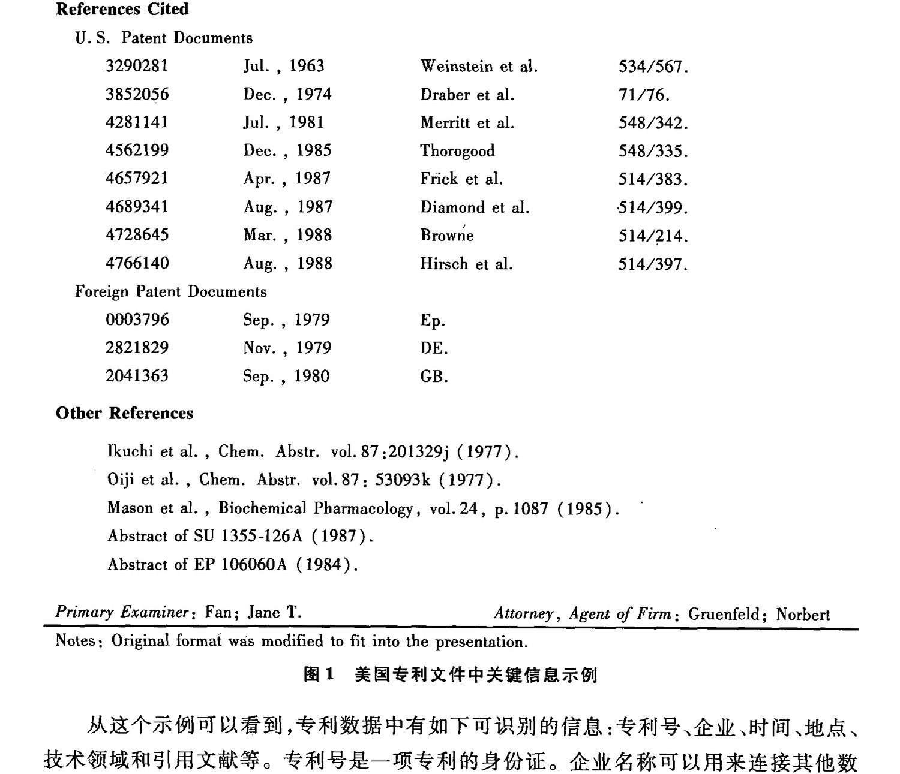

<!-- PDF页 206 -->

ences Cited 标题下所列举的美国专利、外国专利和其他参考文献都属于引文。

研究者们通常采用的是引文中的美国专利,因为可以通过专利号非常便利地在同一数据库中进行关联和有关技术处理,以创建需要的变量。

Jaffe 与他的合作者于 1993年在 Quarterly Journal of Economics 上发表的论文“Geographic Localization of Knowledge Spillovers as Evidenced by Patent Citations” 成为一篇在使用专利数据,特别是使用专利数据研究知识的区域化和知识流动问题方面最为广泛引用的经典之作。在这篇论文里,他们认为专利作为发明创新的结果代表了人类知识的结晶,而专利之间的引用则在某种程度上体现了这些知识在被创造过程中由于溢出效应而产生的联系(linkage)。假设现在有两个区域,甲和乙。原创地同为区域甲的专利之间引用频率为 Pa,原创于区域乙的专利对区域甲专利的引用频率为 Pzm。如果存在本地化溢出效应的话,那么,从统计上讲, Pa应显著大于 Pre RZ, MRAZ i -的引用联系只是随机的,那么, Pq和Pm应没有显著区别。注意,这样的比较是基于区域甲和区域乙具有可比性这一前提。然而,现实中区域间的差异往往是很大的。两个区域之间在技术创新方面的可比性因而很不容易得到保证。比如,半导体产业的创新活动主要集中在加利福尼亚州。原创地同为加州的半导体技术专利之间的引用频率(Pa和qm)自然是高于原创于其他州的半导体技术专利引用加州半导体技术专利的频率(Pm)。为此,Jaffe 小组设计了一种准实验比较(quasi-experimental comparisons)方法。图2 显示了这种方法的基本人逻辑和步骤。

a ene: = / 零假设备择假设Ho: Peit= Peon Hy: Pot >Peon图2 Jaffe (1993) 利用专利引文数据方法的示意图

图2 中,假设有放个引用专利(Citing Patent),其中有NN 个引用专利的原创地与被引用专利(Cited Patent)的原创地相同。那么,P,, = N/M。Control Patent 是指从那些没有引用 Cited Patent 的专利中选出的对照组。这个对照组中的每个专利在日期和技术分类上与引用专利组中的专利进行——且唯一匹配(Match)。所以,这个对照组的专利数也是 M个。假如对照组中有工个专利的原创地与被引用专利(Cited Patent) 的原创地相同,那么,P。, = LAM。这时来比较 Ps和 P。,就基本上排除了一些潜在的区域间差异因素对引用频率比较的影响。Jaffe 小组的研究结果显示,在控制了这些潜在影响因素后, Pi.显著大于 P。,,从而为知识区域化理论提供了实证支持。

在我的22 篇小调研样本中,Kotabe 4 (2007) 的论文的主要解释变量都是通过专

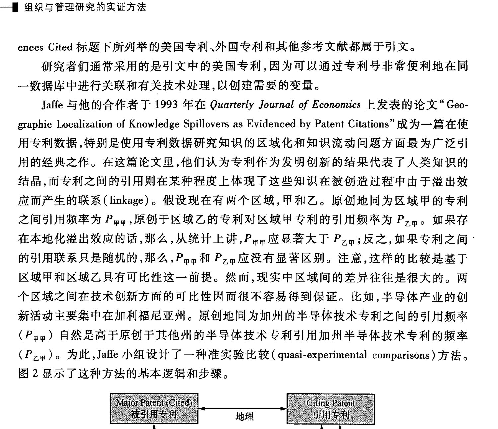

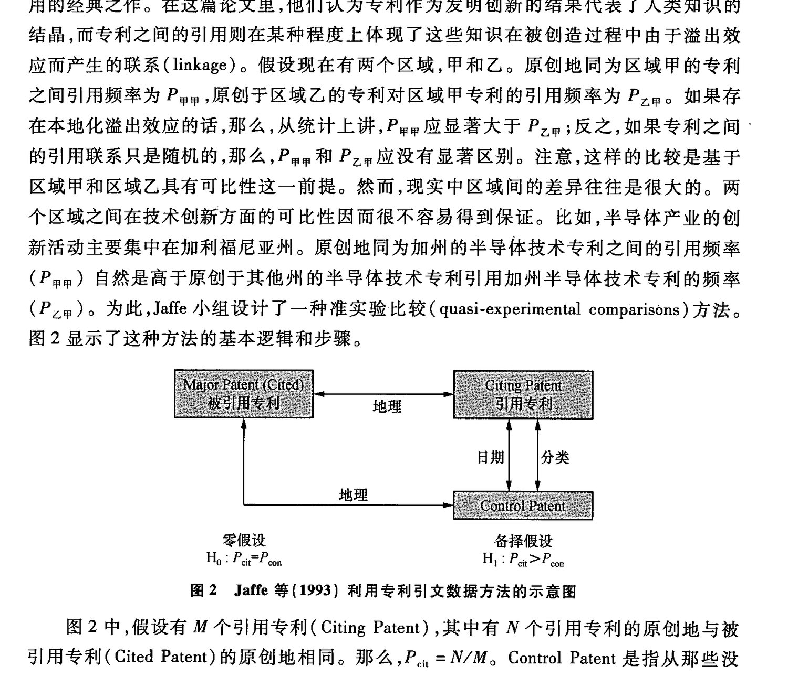

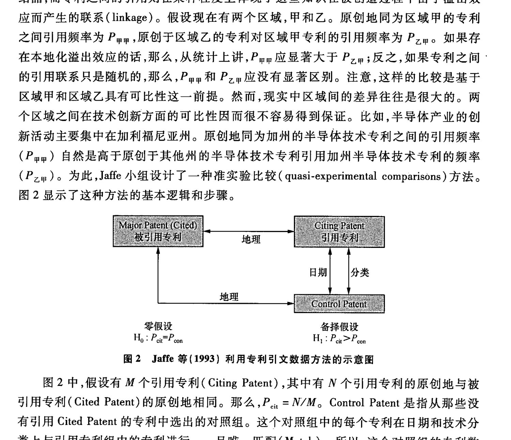

<!-- PDF页 207 -->

利引文数据创建的。比如,作者用每年公司所有的专利申请的引文中原产地为国外的引文所占的比例来测度国际知识转移。类似地,他们用每年公司所有的专利申请的引文中原产地为本国的引文所占的比例来测度国内知识转移。他们还创建了一个变量叫做知识复杂度,用的是一个专利从申请到被授权之间的年限来测度的(这里隐含的一个假设是,一个专利在专利审查员那里停留的时间越长,表明知识复杂度越高)。还有一个变量,叫做国际知识分散度(训ternational knowledge dispersion),创建方法如下:如果一个美国跨国公司某一年的8 个专利引文总数中有5 个的发明地为日本,1 个的发明地为意大利,那么国际知识分散度的测度则为 2。

在利用专利引文数据方面Ahuja 和 Lampert (2001) 在 SMJ 发表的论文更具创意。这篇论文的因变量是突破性发明(breakthrough inventions),三个自变量分别是新兴技术(emerging technologies)、新颖技术(novel technologies) 和领先技术(pioneering technologies)。为了创建因变量,作者首先把企业所在行业(化学行业)的所有专利按照它们被引用的次数排序,把位列于前 1% 的专利当做突破性发明。然后,作者把一个样本企业的这类专利按年度加总,即得到了因变量的测度值。几个自变量的创建过程如下:

“ 新颖技术:查看一个企业的专利历史,比较专利的技术分类,如果发现在最近三年有专利曾被归于一个新的技术分类中——即该企业的专利以前不曾被划入的技术分类,那么则可确认为“新颖技术”信息。作者按照年度加总这类新的技术分类数作为新颖技术的最后测度值。

。新兴技术:首先计算每一个专利所引用的专利的平均“年龄”",然后按照年度加总那些引文专利的平均年龄小于3 的专利数目。这个加总值就是新兴技术的测度值。

© 领先技术:按照年度加总一个企业的不曾引用过任何其他专利的引文的专利数目。

对专利数据中发明人地址信息的使用通常只限于用第一发明人的地址来确认创新活动的地址。拿表1 的例子来说,这个专利背后的技术研发活动可以确定在美国新泽西州。 我的博士论文第一次对专利数据中的发明人地址信息进行了进一步的开发和利用。仍然拿表1 的例子来说明,在这个专利的发明人一栏,我们看到地址信息包含美国的新泽西州和瑞士,这意味着此项专利发明背后是母公司(位于瑞士总部) 和美国子公司(位于新泽西州)的跨国联合研发活动。由此,我们创建了 R&D Copractice 这个变量,用这个变量来解释跨国公司内母公司与子公司之间和子公司与子公司之间的知识流动。与前面列举的文献一样,知识流动采用的是专利引文指标测度的。 该论文关于R&D Copractice 影响母子公司间知识流动的成果发表在 JIBS(Frost 和 Zhou, 2005),关于 R&D Copractice 影响子公司之间知识流动的成果则获得 2005年 Academy of International Business 年会的最佳论文奖(Zhou 和 Frost, 2005)。

上面,我以 SDC 数据、Compustat 数据和专利数据为主要线索,说明了“现成”的二手数据在宏观层次的组织管理研究中的应用。 我所举的例子都说明使用这类二手数据具

BAR | 二手数据在组织管理学研究中的使用 | 193

<!-- PDF页 208 -->

有很多优越性。但是,必须指出,二手数据不论多么丰富、系统和干净,也一定存在着一些不容忽视的“与生俱来”的缺点。这里只强调两点。

1. 变量指标的契合性问题。二手数据所包含的经济、技术或者地理人文信息对于经济学、社会学的研究常常是合适的,但对于组织管理学而言,我们通常需要一些“战略变量"或者“行为变量”,而这却是二手数据通常缺乏的。很多研究者拿到二手数据了,但仍然苦于找不到回合自己理论概念的变量指标。在很多情况下,研究者不得不做出妥协,采用一些与理论概念有一定关联但并不具有很好奥合度的既有指标作为代理指标(proxy indicator)。上面列举的采用专利引文来“测度”知识流动的论文,就是如此。

从前面介绍过的 Tong 和 Reuer (2007) 的论文也可以看出这个问题。作者在研究模型中之所以采用了“文化距离”这个变量,是因为他们的一个主要论点是:过多的协调成本(coordination costs)会阻碍跨国公司从转换的选择权中获益。作者找不到协调成本的合适测度,所以退而选择文化距离作为代理变量。作者认为,文化距离越高,协调成本则越高,所以用文化距离可以反映协调成本方面的变化。作者承认文化距离是协调成本的一个非常粗的指标,但这样讲并不能说明问题的严重性。事实上,到底文化距离是否可以成为协调成本的一个(哪怕非常粗的)指标,本身还是一个尚未证明的假设。

“现成”的二手数据的这个缺点,让我们看到现成的数据不是为少数研究者定制的,这一点从这几个数据的例子也可以看出。所以,这也就是为什么研究者们仍然有必要像 Chen 等人那样自己动手来创建了。

2. 变量指标的准确性问题。安然事件让我们认识到,即使是上市公司也可能虚报数据。当然,我们相信这只是少数。如果只是少数的话,那么我们通常会相信基于大样本数据的实证检验是可靠的。Compustat 数据的可靠性广为认可,但其他的数据并不能总让我们保持这样的乐观。一般地,二手数据的使用可能隐仿如下几种误差:

(1) 企业自报数据时由于主观和客观的原因发生的误差

(2) 专业机构或者数据公司的人员在收集和处理数据时所发生的偶然误差;

(3) 专业机构或者数据公司的人员在收集和处理数据时所发生的系统误差;

(4) 研究者使用二手数据时发生的误差。

这里可以用专利引文数据来说明前三点。按照美国的法律,专利申请必须列出所有此项发明曾经获益的以前的专利文献(即所谓的 Prior Art)。人逻辑上,一项发明的授权是基于该发明的新颖性,而这个逻辑则有可能导致专利申请人具有少申报引文的倾向,因为引文越多越可能意味着申请专利的发明的新颖性程度差。当然,少申报引文的更为一般的原因是:发明人可能根本就不曾知道有一些已经授权的专利,而这些专利在事实上成为本发明的 Prior Art一一尽管自己的发明没有实际受益。这两种情况都可能引起上面第一点所说的自报数据过程中发生的误差。鉴于这样的情况,在美国的专利审查制度中,设置专业的专利审查员就成为必要。审查员会根据自己的知识.经验及其在专利数据库查询的便利,判断并添加没有被专利申请人列出但是事实上与本专利具

<!-- PDF页 209 -->

有技术关联的以前的专利。然而,这样又会导致一种新的噪音(noise) 出现:第一,审查员之间的业务水平的差异可能导致有的补充得多些,有的补充得不够;第二,审查员添加的一些引文可能根本就不是发明人曾经知道的,那么,若利用这些引文来“测度”实际发生的知识转移,势必会导致测度的误差。

关于第四点,前面介绍的 Lane 等(1998)与 Amihud 和 Lev(1981)的争论已经非常清楚地说明研究者使用二手数据时可能发生偏差,而且这种偏差可能带来非常严重的后果。这里不再著述。

总之,使用二手数据的正确态度必须是坚持严谨求实原则,一丝不苟。上面举的几个论文范例启示我们,研究不是简单的回归分析并报告统计结果。论文所报告的统计结果对文献和学术发展是重要的,但那远远不是科学研究的真面征。我有意用大段的原文来展示研究者们是如何不厌其烦地说明对数据的严格把关,是想特别强调这些“不大其烦”说明的背后实际上是大量的艰苦而繁复的修补和清理数据的工作,而恰恰是这些工作才是科学研究的重要过程。

### 五、中国本土研究中的二手数据使用问题

上面对二手数据使用的介绍和讨论对中国情境下进行组织管理学研究,尤其是对宏观层次的组织管理学研究,具有有益的启示。中国情境下的二手数据资源非常丰富,如果能得到很好的开发和有效利用,这些数据资源会为推动基于中国本土的组织管理学研究做出贡献,进而为国际主流研究做出贡献。

为了初步了解中国本土学者利用二手数据的情况,我选择《管理世界》2007年前 11期作为一个考察窗口,阅读每期发表的论文,识别组织管理学领域的实证研究论文。为了育焦,我对组织管理学的研究领域做了严格限定,把经济学、国际贸易与投资、财会金融、信息系统和营销等领域的研究论文都排除在外。统计描述性的研究报告和案例研究报告不被当做实证研究。这样,我一共识别了 19 篇组织管理学研究的实证论文,其中6 篇论文的实证基础是二手数据,而且 6 篇论文全部都基于中国上市公司数据,数据来源均为中国股票市场研究数据库(CSMAR)。在这6 篇论文中,有4 篇论文对样本的选取做了不同程度的说明,其中的两篇论文指出洒数据可能存在信息偏差并说明了如何克服或者修补信息偏差。

这个小调研结果也许能说明,中国上市公司数据钨怕就其维护的系统性、信息指标的完备性和可靠性以及获得的便利性而言,在中国本土目前可利用的二手数据资源中尚无与伦比。 当然,这里说的上市公司数据的几个方面的性能,实际上有一个逐步提高的过程,这实际上反映了中国资本市场逐步发育的过程。近两年来,随着监管制度的逐步完善和监管力度的日益加强,上市公司信息的可靠性得以很大的提高。

上市公司的“一枝独秀”,引起两个值得稍稍讨论一下的问题,一个问题关于上市公

| 二手数据在组织管理学研究中的使用 | 195

<!-- PDF页 210 -->

司数据的挖掘,另一个问题关于其他公共数据资源的开发和利用。就第一个问题而言,大量的已经发表的论文集中在金融和会计学研究领域。在组织管理学领域,研究主要集中在公司治理结构问题,只有少部分研究涉及多元化和并购等战略问题。但总的来看,这些研究大多都停留在简单地复制西方早已检验过的理论假设的水平上,能深入挖据反映中国特点的新的理论维度的研究仍少见。

就第二个问题而言,尚有大量的中国本土的二手数据资源有待进一步开发和利用。首先,其他一些数据资源的价值还没有被认识到。比如说,对研究创新和与知识产权有关的战略投资行为来说,中国专利数据就具有特别的价值。我的个人研究经历或许能说明这一点。2003年我参与了科技部委托的一个关于全国 53 个国家级高新园区企业创新调研的课题。我们设计的调研问卷中包括了一些关于创新指标的问题,比如到目前为止企业一共获得了多少专利授权。问卷收回后我们抽取了其中的一个小样本进行信息校验,结果发现企业自报的专利数据与国家专利局网站上的公开数据出入很大。我们随后对一个小样本的问卷填写人进行了回访,访谈发现很多人确实对专利的概念存在模糊的认识。这样,当我在研究高新园区企业专利行为时,我决定通过国家专利局的专利数据库对调研样本中的每一家企业进行专利信息匹配。我这样做的好处是多方面的。首先,所谓的共同方法偏差(common method bias) 问题得以解决,而且,客观可靠的专利信息使实证结果更具有说服力。其次,从中国专利数据库获得的企业专利信息具体到单件专利层面,这样往年的专利总量可以作为控制变量,随后年度(如2004年和2005年)的新专利量则可以作为因变量,拉开了时间间隔,使实证分析摆脱了横截面分析的局限。再次,每个专利还包含技术分类等其他一些维度信息,这为创建更多的反映企业战略行为的变量提供了基础。

当然,必须说,与上市公司数据相比,即使像专利数据这样的其他二手数据资源的开发和利用还存在很多障碍。最根本的问题是,研究者尚没有正常渠道获得大样本的数据。专利数据虽然通过网站公开,但是网络查询和下载存在一定限制,很难通过这种方式获得大样本的专利数据。类似地,中国国家统计局和各级地方统计局都存有多种基于企业层面的普查数据,但是,对于一般的研究者而言,这些数据基本上可望而不可即。同时,在中国,还没有像日本Toyo Keizai 和SDC 这样的具有非常高专业水准的数据公司,能进行系统创建、维护并为组织管理学研究者这个“市场"提供有价值的数据。

最后,定性形式存在的二手数据资源仍然是一片处女地,有待组织管理学研究者去探索、开发和有效利用。研究者或许能从我前面介绍的几篇利用定性数据的范例获得一些启发。在以互联网为平台的信息化时代,我们事实上被包围在定性形式的二手数据的海洋中。但是,开发和利用定性形式的二手数据不仅仅是个技术问题。当然,开发和利用其他形式的二手数据也一样,绝非仅仅是个技术问题。没有理论的指导,我们虽身在定性数据的海洋,却会东然无知。所以,开发和有效利用这类定性数据需要独具莫眼,而这双营眼需要通过长期的阅读、学习和积累才能练就。 |

<!-- PDF页 211 -->

i六、结语

Weick(1989)曾把研究过程比做船在夜海上航行。这是一个探索过程,要依靠雷达发出信号,再接收反射回来的信号,进而分析信号,做出调整,然后选择航向。Weick 说,我们的研究在一定意义上就像那个雷达一样,它所接收到的只是环境的代表(representation of environment),而不是环境本身。二手数据,不论是哪种形式存在的二手数据,其实就是我们研究的对象的代表。我们研究的目的是要透过二手数据的表象获得对本质的认识,但是我们可能像雷达一样有时会被表象迷惑,做出有偏差的判断。和避免这些挫折和错误的根本在于系统地改善我们自己的“雷达装置”,提高在夜海探索的能力。我们也许首先得具备提出关键问题的能力(ability to ask critical questions),这好比雷达发出信和号。我们还要在研究方法方面不断提升自己的水平,使自己拥有一大,先进的“雷DRE”,具有功能强大的数据处理和分析能力。最后,也是最重要的,我们还需要力求学术的严谨性,慎用二手数据,不急功近利,以确保航向无误。

### 参考文献

Ahuja, G. and Lampert, CM. (2001). Entrepreneurship in the large corporation: A longitudinal study of how established firms create breakthrough inventions. Sirategic Management Journal, 22, 521—543.

Amihud, Y. and Lev, B. (1981). Risk reduction as a managerial motive for conglomerate mergers. Bell Journal of Economics, 12, 605—617.

Amihud, Y. and Lev, B. (1999). Does corporate ownership structure affect its strategy toward diversification? Strategic Management Journal, 20(11), 10631069.

Anand, B. N. and Khanna, T. (2000). Do firms learn to create value? The case of alliances Strategic Management Journal, 21(3), 295—315.

Baum, J. and Oliver, C. (1996). Toward an institutional ecology of organizational founding. Academy of Management Journal, 39(5), 1378—1427.

Boyd, B. k., Gove,S. and Hitt, M.A. (2005). Consequences of measurement problems in strategic management research; The case of Amihud and Lev. Strategic Management Journal, 26, 367—375.

Chen, M. and Miller, D. (1994). Competitive attacks, retaliation and performance; An Expectancy-Valence Framework, Strategic Management Journal, 15(2), 85—102.

Frost, T. and Zhou, C. (2005). R&D co-practice and “Reverse” knowledge integration in multinational firms. Journal of International Business Studies, 36(6), 676—687.

BAR | 二手数据在组织管理学研究中的使用 | 197

<!-- PDF页 212 -->

Hoetker, G. and Agarwal, R. (2007). Death hurts, but it isn’t fatal; The postexit diffusion of knowledge created by innovative companies. Academy of Management Journal, 50 (2), 446—467.

Jaffe et al. (1993). Geographic localization of knowledge spillovers as evidenced by patent citations. Quarterly Journal of Economics, 577—598.

Kotabe, M., Dunlap-Hinkler, D., Parente, R. and Mishra, H. (2007). Determinants of cross-national knowledge transfer and its effect on firm innovation. Journal of International Business Studies, 38(2), 259—282.

Lane, P. J., Cannella, A.A. and Lubatkin, M.H. (1998). Agency problems as antecedents to unrelated diversification; Amihud and Lev reconsidered. Strategic Management Journal, 19(6), 555—578.

Lane, P. J., Cannella, A. A. and Lubatkin, M.H. (1999). Ownership structure and corporate strategy; One question viewed from two different worlds. Strategic Management Journal, 20(11), 1077—1086.

Lee, P.M. and James, E.H. (2007). She’-e-os; gender effects and investor reactions to the announcements of top executive appointments. Strategic Management Journal, 28, 227—241.

Lounsbury, M. (2007). A tale of two cities; Competing logics and practice variation in the professionalizing of mutual funds. Academy of Management Journal, 50(2), 289—307.

Mintzberg, H. and Waters, J. A. (1982). Tracking strategy in an entrepreneurial firms. Academy of Management Journal, 25(3), 465—499.

Nadkarni, S. and Narayanan, V. K. (2007). Strategic Schemas, Strategic flexibility, and firm performance; The moderating role of industry clockspeed. Strategic Management Journal, 28, 243—270.

Tong, T. W. and Reur, J. (2007). Real options in multinational corporations: organizational challenges and risk implications. Journal of International Business Studies, 38(2), 215—230.

Weick, K. E. (1989). Theory construction as disciplined imagination. Academy of Management Review, 14(4), 516—531.

Zhou, C. and Frost, T. (2005). Subsidiary’s inflow and outflow of knowledge within MNCs. Best Paper Award by the Academy of International Business annual conference 2005, ~ Quebec City, Canada.

<!-- PDF页 213 -->

## 第十章 实地研究中的案例研究

时gh Pd od实地研究中的案例研究FR AB HH台湾大学元智大学AKA一、 案例研究的意义1.1 什么不是案例研究? 1.2 什么是案例研究?二、 案例研究的品质2.1 WSR 2.2 内部效度2.3 ”外部效度2.4 ”信度=. RAAF LH 3.1 准备阶段3.2 执行阶段3.3 ”对话阶段四、 研究实例4.1 实例一:自我管理团队中的协和控制4.2 实例二:TQM 的口号与实际4.3 ”实例三:中美合资企业的协商权、管理控制及绩效| 实地研究中的案例研究 | 199

<!-- PDF页 214 -->

引言. 诚如许多资深研究者所强调的:历史上许多重大的研究成果,常常反映了其所处时” 代的脉络。对案例研究法而言,此一说法也是成立的:由于时代背景使然,当前的案例研究已经受到许多研究者的重视与采用;在许多重要的管理学期刊当中,采取案例研究法的论文也逐年增加,而取得了一定的研究正当性。

此一时代背景反映了几项趋势。首先,研究者体会到管理的多元与复杂而需要采用能够考察复杂性的适合研究法,其中,案例研究由于能够掌握现象的丰富性(richness) (Weick, 2007),能对现象进行厚实的描述(thick description) (Tsui, 2007; Tsui, Nifadkar and Ou, 2007),而成为最恰当的方法之一。其次,由于各种研究法都有其优缺点,所以当代社会科学界特别强调多元研究方法论(multiple methodologies),认为需要兼采质化、量化的不同方法来探讨同样的问题,以强化研究结果的坚官度(robustness)。在此状况下,与其他研究法颇为不同的案例研究乃深获重视。再次,是全循环研究方法(full-cycle approach) 的逐渐流行,全循环研究是指研究者兼采归纳法与演绎法,通过科学研究循环来探讨一个问题,以建立有力、坚实且具类推性的理论。在研究循环当中,不管是理论建构或是理论验证,案例研究都是不可忽略的一环。最后,在管理学文化革命的浪潮之下,许多研究者指出,针对凸显本土文化特色的管理学知识,必须采用扎根理论(grounded theory)的研究方式来进行厚实的研究,以提出更具内部效度与外部效度的本土理论(Eisenhart, 1989; Whetton, 2002)。于是,能够掌握具本土特有现象的案例研究乃更为流行。

在上述趋势下,案例研究越来越受欢迎;可是,虽然案例研究颇受欢迎,但进行案例研究却不是一件简单的事,更存有种种的陷阱。在设计与进行案例研究时,都必须谨慎为之,方可人避免错误。否则,未蒙其利,先受其害。本文的目的,即在说明案例研究的意义与类型.效度要求与研究设计、研究步骤及对理论建构与假设验证的意涵,训析此研究法的特色与优缺点,以熟悉此项研究的做法,并据以创造管理学知识。

### 一、案例研究的意义

早在 19 世纪末 20 世纪初以前,社会科学家便开始采用个案研究来建构相关的知识。在人类学方面,费孝通的老师马林诺斯基(Malinowski),在第一次世界大战避居于太平洋小岛 Trobriand 时,就以参与观察的方式针对岛民进行案例研究,并发表了一系列著名的人类学著作,如《西太平洋的航海者》(Argonauts of the Western Pacific) (Malinowski, 1922)。在社会学方面,法国学者 Flederic Le Play(1806一1882)于19 世纪中期,认为家庭是社会的基本组成单位,而以工作家庭作为观察案例,试图找出其特征。此一做法

<!-- PDF页 215 -->

也影响了美国的社会学研究,芝加哥学派就是其中的佼佼者(Hamel, 1993)。在心理学方面,弗洛伊德对精神病患者的心理分析,以及心理分析学派所从事之患者案例分析的研究,都是重要的代表。 今天,案例研究已是当代社会科学的重要研究形式之一(Yin, 1989)。

虽然案例受到重视,但案例研究却是难度最高的科学研究方法之一(Yin, 1989),理由除了寻找研究案例的难度颇高整个研究过程与结果的客观性缺乏共识之外,案例研究也常受到误解,以致面目不清。这些误解至少包括:把案例研究视为案例教学、将案例研究局限于探索研究、分不清案例研究与案例纪录的不同,以及将案例研究与民族志研究等质化方法混为一谈等。了解这些误解,将有助于了解什么才是案例研究。

### 1.1 什么不是案例研究?

一种误解是将案例教学等同于案例研究。案例教学是管理学教育相当重要且不可或缺的一环,案例教学是否能够发挥最大的效用,端视个案品质的良席而定。因此,提供优质的案例,乃是案例教学成功的重要条件。可是,教学案例的探讨与撰写,并不是案例研究。教学案例着重于实务问题的反映,案例必须具有启发性,能够引起学习者的学习动机与兴趣,且能激发思考,带动热烈的讨论,分享问题解决的方式。所以,教学案例的性质与着重严谨、讲求证据的案例研究是不同的。在教学案例上,有时为了更有效地铺陈特定的观点,也可以慎重地修改案例材料,以激发更为精彩的对话,但在进行案例研究时,这种做法是绝对禁止的。每个研究者都得严守各项研究步骤的要求,并呈现严谨而扎实的研究证据(Yin, 1989)。

另一种误解是以为案例研究是一种探索工具,只是进行正式研究前的一种测试性研究(pilot study)而已。所以只着重于现象的初步描绘,而不能用来发展命题(proposition development)或验证假设(hypothesis testing) (Platt, 1992),这种看法也是一种误解。事实上,案例研究不仅具有探索功能,而且兼具描述性与解释性的功能。例如,早期芝加哥大学社会学教授 Whyte (1943) 的古典著作《街头社会:意大利贫民的社会结构》 (Street Corner Society; The Social Structure of An Italian Slum),探讨街角流民的社会结构,虽然是一项典型的案例研究,不仅深具探索性与描述性的功能,而且也极具类推能力——即使是在不同的街头、不同时代所做的类似研究,都一再重复此项研究的发现。另外,Yan 和 Gray(1994)对中美合资企业之协商权、管理控制及合资绩效的探讨,以及Ross 和 Staw(1993)对美国 Shoreham 核电厂浪费公款之承诺升级的研究,则采用案例研究法来验证既有的理论模式。由此显示,案例研究亦可以用来建构理论与验证假设,因此,案例研究并非只是一项探索性的先导研究而已。

还有一种误解,是分不清案例研究与案例记录的不同。不管是企业诊断、教育辅导、临床心理或是社会工作,都会针对焦点案例来进行探讨,要求案例揭露自己的特性与面对的问题,广泛搜集与案例有关的资料,并据以提出“对症下药”的问题解决办法,

总二剖 | 实地研究中的案例研究 | 207

<!-- PDF页 216 -->

提供必要的顾问、咨商、辅导及诊疗协助。虽然此类案例记录旨在帮助案例解决问题,对案例也有充分的了解,但与案例研究也是差异颇大的:前者旨在助人,解决问题;后者则由在研究、建构与验证理论。

最后一种误解,则是将案例研究与民族志研究等质化/定性研究混淆在一起,认为案例研究是参与观察的一个类型,需要进行长期的实地观察,强调观察而来的质化证据(Kidder and Judd, 1986)。可是,案例研究并不只是实地调查的一种资料搜集技巧而已,也不一定需要进行长期的实地观察,其搜集资料的方式视研究问题而定。有时,黄至不必离开图书馆或仅使用电话访问,就可以进行高品质的案例研究;而且所搜集与分析的资料,也不见得总是质化资料,量化资料也常是搜集与分析的重点。另外,案例研究虽然也可能在进行研究一段时间后,变动研究主题,但通常在进入场域之前,就具有清楚的问题意识或者有明确的理论方向,而非像民族志研究等质化研究一样,是在进入场域之后,才逐渐清楚要探讨什么问题的;或是在进入现场之后,问题才逐渐浮现的,且又随时调整问题的方向。因此,案例研究也不是民族志研究,并不等同于参与观察等质化研究方式。既然以上的例子都不是案例研究,那么什么才是案例研究呢?. 1.2 什么是案例研究?

什么是案例研究? 其定义为何? 虽然采用案例研究进行社会科学研究的研究者不少,但直接针对案例研究进行定义者则不多。其中 Jennifer Platt(1992) 是少数的例外。她在回顾美国案例研究的方法论思潮时,曾认真做了回顾,并试图加以界定,认为“案例研究是一种研究设计的逻辑,必须要考量情境与研究问题的奥合性”"。根据其定义,Yin (1989)做了进一步的延伸,强调设计侵辑是指一种实证性的探究(empirical inquiry),用以探讨当前现象在实际生活场域下的状况,尤其是当现象与场域界限不清且不容易清楚区分的时候,就常使用此类探究策略。换言之,由于现象与实际场域不见得总是能够清楚区分的,所以案例研究在资料搜集与资料分析上极具特色,包括依赖多重证据来源,不同资料必须能在三角检证(triangulation) 的方式下收敛,并获得相同的结论;其次,通常有事先发展(prior development)的理论命题或清楚的问题意识,以指引资料搜集的方向与资料分析的焦点。

总之,作为一种研究策略,案例研究是一种非常完整的研究方法,同时包含了特有的设计多辑特定的资料搜集及独特的资料分析方法。因此,案例研究并不只是一种资料搜集的方法或是一种资料分析的方式,也不只是一种研究设计的特征而已,而是含括三者的一项周延而完整的研究策略(Yin, 1989)。此一研究策略与研究问题的性质有关:如果研究问题的目的是在回答“是如何改变的"、“为什么变成这样”及“结果如何”等问题时,案例研究就是最为适用的方法。一般而言,相较于其他研究方法,案例研究能够对案例进行厚实的描述与系统的理解,而且对动态的互动历程与所处的情境脉络亦会加以掌握,而可以获得一个较全面与整体的观点(Gummesson, 1991)。另外,凡是

<!-- PDF页 217 -->

研究者无法设计正确、直接又具系统性控制的变量,或探讨的是实际生活现象,不是几分钟的实验就能够追溯完毕者,都是使用案例研究的最佳时机。由于案例研究着重于当时事件的检视,不介入事件的操控,而可以保留生活事件的整体性与有意义的特征。因此,案例研究相当有助于研究者产生新的领悟(insight) (Bryman, 1989)。

通常,案例研究可以区分为三大类,包括探索性(exploratory)、描述性(descriptive)及因果性(causal)案例研究(Yin, 1994)。探索性案例研究是指,当研究者对于个案特性、问题性质、研究假设及研究工具不是很了解时所进行的初步研究,以提供正式研究的基础。描述性案例研究则指,研究者对案例特性与研究问题已有初步认识,而对案例所进行的更仔细的描述与说明,以提升对研究问题的了解。最后,因果性案例研究则旧在观察现象中的因果关系,以了解不同现象间的确切函数关系。不管是何种类型的案例研究,都必须遵循研究的严谨性与可靠性等标准,这些要求颇似量化研究中的效度与信度的概念。

### 二、案例研究的品质

在进行案例研究时,虽然有些后现代的管理学研究者,可能较着重于研究结果所揭示的意义以及社会建构的事实,而不讲究研究方法的严谨性与复制性,但是遵循科学法则的案例研究者却必须严守科学研究中的效度与信度要求,只不过是做了一些调整,而与量化研究的做法有一些不同。当然,严格来说,科学研究中的效度与信度也是一种社会建构,其法则是由科学研究社群所建构出来的,彼此互有共识。在本文中,仍将遵循科学研究的法则,来讨论案例研究所需遵守的标准,包括:(1) 构念效度:针对所要探讨的概念,进行准确的操作性测量;(2) 内部效度:建立因果关系,说明某些条件或某些因素会引发其他条件或其他因素的发生,且不会受到其他无关因素的干扰;(3) 外部效度:指明研究结果可以类推的范围; (4) 信度:阅明研究的复制性,例如,资料搜集可以重复实施,并可以得到相同的结果(Lee, 1999)。2.1 构念效度

为了使研究具有构念效度,让概念得到准确的衡量,在案例研究中,可以采取几种

” ”有效的方法来加以执行,这些方法包括采取多重证据来源的三角检证、证据链的建立、信息提供人的审查、唱反调者(devil's advocate) 的挑战等做法(Fisenhardt, 1989; Yin, 1994)。首先,在多重证据来源的三角检证(或多角检证)方面,研究者需要使用各种证据来源,让各种来源的证据能够取长补短、相辅相成。这些来源通常包括文件(如信件、报告报道,私人笔记等),档案(公司资料、官方记录现行资料库等)、人员面谈、现场观察、活动参与及人工器物的搜集等。一旦不同做法都能获得类似的资料与证据时,案例研究中的衡量即具有构念效度。显然地,此一做法颇似量化研究中的聚合效度(convernl 实地研究中的案例研究 |203

<!-- PDF页 218 -->

gent validity)。

其次是建立证据链,让搜集的资料具有连贯性且符合一定的逻辑,使得报告的阅读者能够重新建构此一连贯的逻辑,并预测其发展。当人逻辑越清晰、越连贯时,构念效度就越高。这种做法类似量化研究中人逻辑关系网(nomological network) 的建立。

再次,重要信息提供人的审查。通过重要信息提供人审阅报告与资料,来确保资料与报告能反映所要探讨的现象,而非只是研究者个人的偏见而已。由此,可以避免因为研究者个人的选择性知觉,而产生不恰当的诠释。另外,亦可安排能够挑战资料、证据及结论的唱反调者,要他们针对资料的搜集、分析及结果与报告提出严苟的批评,用以检视研究者的盲点与偏见,以确保搜集的资料能够反映研究构念。

### 2.2 内部效度

就内部效度而言,研究者必须确定因变量的改变确实是因为自变量的改变而引起的。为了降低因果关系之外的解释,案例研究者可以采用模式匹配(pattern matching)、解释建立及时间序列等设计来执行研究,以提升内部效度(Yin, 1989)。模式匹配可以用来检验资料与理论是否搭调与契合,察看各构念间的关系,是否能与资料契合,奥合时,即提供了支持的证据。例如,当一组不等则的(nonequivalent) 因变量均可被预测,且得出类似的结果,而未有其他的结果时,即可获得较强的因果推论;同样地,如果一组不等同的自变量均可做相同的预测时,亦可推论此因果关系是稳定而坚实的(Campbell, 1975; Yin, 1989)。根据此种想法,如果所搜集的各种资料,都能肯定原先推论的关系时,则可接受原先发展出来的命题或假设; 否则, 则需要加以修正。在 Ross 和 Staw (1993)的 Shoreham 核电厂案例中,即采取此类做法,来阐明此电厂损失近美金 55 亿的理由,用以验证承诺升级(escalation of commitment)的理论模式。结果发现,模式所推衍出来的假设,有些是获得支持的,有些则不获得支持。研究者于是根据此案例的结果,修正原先发展的理论模式。 |

提升内部效度的第二种做法是解释的建立:首先,研究者陈述可能的理论,并提出一连串的命题(propositions);然后,再检视理论、命题与经验资料是否符合,据以修正理论与命题;接着,再重复以上的过程,直到两者趋近为止。这种过程与冶金很类似,研究需要逐步精炼想法,接受可能的对立假设,最后建立较佳的解释。通过这种持续性的(iterative) 调整过程,来提升内部效度。

第三种做法是采用时间序列的设计(time series design),先分析所要观察的变量或事件在时间上是否具有先后顺序,再推论其中的前后因果关系。当某些变量或事件总是发生在先,且导致后续变量或事件发生或改变时,即可推论变量间具有时间上的因果关系。如果经验资料亦证实的确具有此类因果关系时,则可提供内部效度的证据。

### 2.3 ”外部效度. 就外部效度而言,由于研究者通常只是在单一时间与地点针对单一类型的案例进

<!-- PDF页 219 -->

行研究,所以,必须确定此研究结果是否可以适用于其他类型的案例或不同的时间与地点当中,以判断研究结果或理论的类推能力。当结果与理论的类推范围越广.所能解释的组织现象越多时,结果与理论就越有力量(Cook and Campbell, 1979)。

在探讨案例研究的外部效度时,通常是采用分析类推(analytical generalization) 的概念,而非统计类推(statistical generalization) (Bryman,,,1989)。统计类推是依据统计抽样的想法,选择具有代表性的样本,再依据概率论的原则,将样本的研究结果类推到样本总体上,由此说明研究结果的类推性。然而,分析类推是指,案例所得的结果,可以在以后的案例上重复发现,由此证实该案例所获得的结果确实存在。这种类推根据的是一种案例与法则相似的逻辑(case-law-like logic), HUMURSMWSRA (fit) 的方式,来判断研究的外部效度(Eisenhardt, 1989; Yin, 2003)。其分析概念,就像医生所说的: “我认识他,他是我的“病人',我在每位患者身上都可以看得到他的身影”(Van Den Berg, 1972)。因此,要判断案例研究结果在其他案例上的类推性时,需要在不同时间、地点进行多案例研究,以判断此结果在其他情境、时间及地点上的情形。就此而言,案例研究的外部效度,颇似量化研究中的生态效度(ecological validity) 概念。

### 2.4 信度.

案例研究的信度是指研究过程的可靠性,所有过程必须是可以重复的。因此,必须准备周详的案例研究计划书(protocol),让后来的研究者可以重复进行研究;也必须要建构研究资料库,让后来的人能重复进行分析(Yin, 1994)。研究计划书不仅要说明特定的研究过程、所依循的资料搜集与分析原则,而且至少要包括以下的内容: (1) 研究目标与探讨议题,例如,研究目的问题的背景等;(2) 研究场域与研究程序,例如,研究地点的详细描述资讯来源,其至是研究者的保证书等;(3) 研究问题,例如特定而具体的问题访谈表的时程与内容、访谈对象,资料分析方式与过程; (4) 研究报告的结构,如研究结果、如何组织、进行对话的理论,以及如何获得结论等。

除了需要周详的案例研究计划书外,也需要建构研究资料库。这些资料库至少包括现场研究笔记、参与观察记录访谈的录音、观察的录像.文字着稿稿件、档案资料以及资料分析记录等,以便后来的研究者能够进行再检查与再分析。透过这种详细的文字记录与资料档案,用以强化案例研究的信度。

有关案例研究的检验标准、威胁因素及处理方式,如表1 所示。总之,案例研究者应该有系统地搜集资料、谨慎地判读、严谨地分析,并使研究设计与过程能够符合所要探讨的问题与概念,以满足效度与信度的要求。

总二章 | 实地研究中的案例研究 |205

<!-- PDF页 220 -->

Rl 案例研究的效度与信度检验标准威胁因素做法 BR构念效度准确测量所要操作性测量不能反映构念, 多证据来源资料搜集探讨的概念或反映了其他构念掌握证据链资料搜集资料提供人的审查资料分析内部效度确保观察之变存有另外的因果解释,或因类型比对资料分析量或事件来自果关系受到污染建立解释研究设计/资料分析因果关系时间序列分析资料分析外部效度研究结果所具结论可能只适用于某些特”多案例复制研究设计有的类推范围定的范围内分析类推资料分析信度研究过程的重重复实施得不到相同的周详的研究计划书研究设计/资料搜集复与复制结果案例研究资料库资料搜集/资料分析三、案例研究的步骤虽然研究者对案例研究的步又不见得有相同的看法;研究步骤也需要展现一种反反复复的过程,而不见得完全遵循固定的顺序,但是案例研究仍然有一定的进行程序,而且可以划分为不同的阶段,每个阶段所处理的问题与进行的活动内涵也不尽相同。在这里,将根据 Eisenhardt(1989) 的架构,将案例研究的过程区分为启动.研究设计与案例选择、研究工具与方法选择、资料搜集、资料分析、形成假设.文献对话及结束等八大SUR IAB MES BUT RM B= AM BE UN 2 所示)来加以讨论。这些阶段与步骤虽然可以区分开来,并有先后的顺序,但在进行实际研究时,各步台之间却可能具有回路的循环关系,而不见得总是直线地往前推进。因此,类似资料的搜集与分析总是反复地进行。 - | 3.1 准备阶段准备阶段是案例研究者在进入现场搜集资料前所需进行的党动。这些活动包括界定研究问题设计研究与选择案例,以及研究方法与工具的选择等。所谓“工欲善其事,必先利其器”, 当准备阶段思考越周详、准确越充分时,案例研究成功的机会就越大。启动。在启动案例研究时,研究者必须先确定什么是要探讨的研究问题,其主要的构念何在?即使案例研究所欲检验的理论不见得清晰,研究者仍然必须要有清楚的方向与清晰的焦点来加以依循,用以指引研究者有系统地搜集资料,并回答问题。否则,将会失去焦点,而可能搜集到一堆浩瀚如海却无关紧要、没有用处的资料。换言之,只

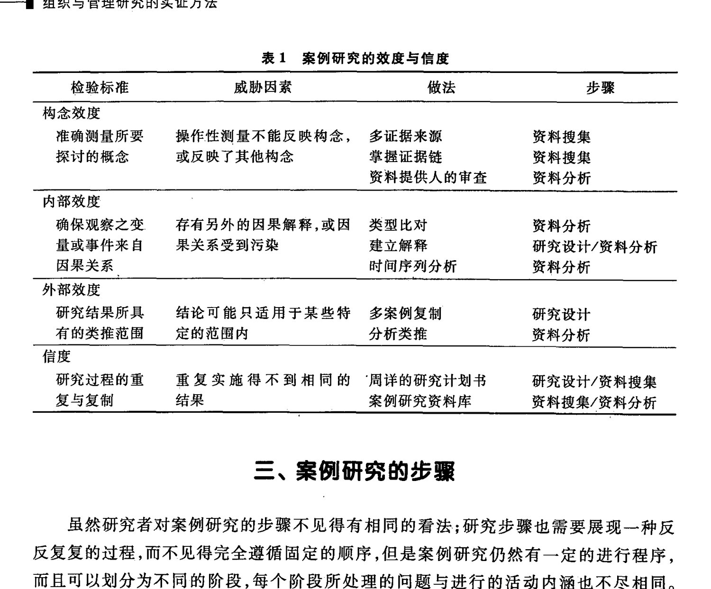

<!-- PDF页 221 -->

有当问题意识清楚时,研究者才能掌握要采用何种研究设计、选择何种研究案例以及如 |何搜集资料等重要事项。以研究设计而言,当研究议题清楚时,研究者才能决定要采用何种案例类型。是选择多案例还是单案例? 分析单位为何? 如何衡量有兴趣的变量与事件? 要采用何种方式来有系统地搜集资料? 也只有在这些后续研究活动都能依循一定方向严谨地进行时,案例研究的信度与效度才能确保。虽然如此,并不表示进行案例研究时,问题与方向从头到尾都是固定不变的。事实上,案例研究的进行常常充满了弹性。例如,在研究一段时间后,如果研究者发现其问题与方向有偏差或搜集的资料与预期差距过大时,是可以改变问题与方向的。例如,有.不少研究者(如 Bettenhausen and Murnighan, 1986; Gersick, 1988) 在进行研究后,发现某些问题更有趣,更适于创新理论,而将研究焦点由理论验证(theory-testing) 转变为理论建构(theory-building)。像 Bettenhausen 和 Murmighan(1986)的案例研究,原本要观察团体决策如何影响结盟的形成,但后来却发现各群体的特性更引人注目,而把研究焦点由结盟转向群体规范的形成。表2 案例研究的步骤步骤活动原因准备阶段启动界定研究问题将努力聚焦找出可能的前导观念提供构念测量的较佳基础研究设计不受限于理论与假说,进行研究设计维持理论与研究弹性与案例选聚焦于特定族群限制额外变异,并强化外部效度择理论抽样,而非随机抽样聚焦于具理论意涵的有用案例,如能够补充概念类别之理论复制与引申的案例研究工具采用多元资料搜集方式透过三角检证,强化研究基础与方法选精制研究工具,同时掌握质化与量化”证据的综合wm 资料* 多位研究者采纳多元观点,集思广益执行阶段 i反复进行资料搜集与分析, 包括现场”即时分析,随时调整资料的搜集资料搜集笔记采有弹性且随机应变式的资料搜集”帮助研究者掌握浮现的主题与独特的案例方法性质案例内分析. TARR TET OH ee资料分析 ”采用发散方式,寻找跨案例的共同模式 ” 促使研究者挣脱初步印象,并透过各种角度来查看证据针对各项构念,进行证据的持续复核精炼构念定义 RUE形成假设横跨各案例的逻辑复现,而非样本复制 ” 证实、引申及精炼理论寻找变项关系的原因或“为什么”之”建立内部效度证据a Roe 3 | 实地研究中的案例研究 | 207

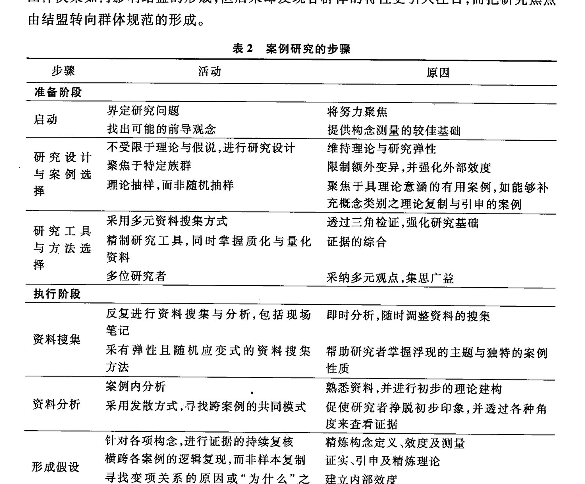

<!-- PDF页 222 -->

(续表)

ER 活动原因

TR

与矛盾文献互相比较建构内部效度、提升理论层次并强化构念定义

文献对话与类似文献互相比较提升类推能力、改善构念定义及提高理论层次

SRT REEL ADVE HAAN (theoretical satura- 当改善的边际效用越来越小时,则结束结束 tion) 研究

资料来源:修改自 Eisenhardt (1989)。

对目的是建构理论的案例研究者而言,理论与假设也常常不在事先计划之内。理由是当一开始就局限于理论与假设时,容易画地自限,被局限于既定的理论概念内,而难以发挥想象力,导出另一种可能的理论方向。因此,理想上,此类案例研究并不鼓励套用现成理论,而保留较大的研究空间与弹性。当然,这种弹性也不是随意发散、漫无归止的,而有一定限制,且至少不应脱离大的研究方向与主题。

研究设计与案例选择。案例选择是案例研究中相当重要的一环,至于要选择多少案例,包括何种类型,则涉及研究设计的问题。一般而言,研究者可以根据分析层次(level of analysis) 与案例数,来进行研究设计,并区分案例研究的类型(Yin, 1993)。分析层次是指研究者有兴趣之分析对象的层次。在组织与管理的领域中,分析层次可能是个人、部门、组织或产业,视研究者的需要而定。至于案例数则指研究者所要研究之案例的数目。依照分析元与案例数的多窒,可以获得四种案例设计方式:第一种为单案例单层次,第二种为单案例多层次,第三种为多案例单层次,第四种为多案例多层次,如图1 所示。

第一种单案例单层次设计,案例数只有一个,而分析层次也只有一种。例如,高阶领导中的案例设计,研究对象只有一个人,而分析层次也以个人为主。郑伯圳(1995)针对一位家族企业领导人的观察来建立家长式领导模式即是一个例子。第二种单案例多层次设计,即案例数只有一个,但分析层次不只一种。这种设计常见于组织研究当中。例如,以一家组织为案例对象,分析层次包括个人、团体、部门及事业部等。在 Barker (1993)自我管理团队的研究中,他同时访谈了员工、领导者,观察团队运作及整个公司的制度变革,并进行分析。第三种多案例单层次设计为第一种设计的复制,分析层次只有一种,但有多个案例。例如,以企业领导人为分析对象,进行不同之组织领导的研究即属此类(郑伯埙,2005)。第四种多案例多层次设计则为第二种设计的复制,研究案例数超过一个,而分析层次也不只一种。例如,探讨不同组织的制度对各阶层员工的影响等。在 Zbaracki(1998)针对 TQM 的口号与实际的研究中,资料来自五家制度不同的公

. 司的高阶主管与一般员工,用以反映其研究架构,即是一例。姑且不论分析层次的多寒,以案例数而言,究竟单案例设计与多案例设计有何不. 7

<!-- PDF页 223 -->

同,其适用状况又如何呢? 一般而言,单案例设计较适用于以下三种状况:第一种是批判性案例,目的是在挑战或验证现有的理论;第二种是特殊性案例,每一案例本身具有独特之处,值得做个别探讨,以建立新的理论模式或扩大旧理论的类推能力;第三种则是补充性案例,前人的研究由于茶些因素未能观察到一些重要现象,如今机会难得,而可以加以观察,以补充过去研究的不足。

单案例设计多案例设计

图1 案例研究的设计

资料来源:修改自 Yin (1989)。 |

至于多案例设计就像多项实验一样,其结论比单案例设计来得有力,但所费的时间、所投入的成本及所投注的努力也比较多。其主要好处是,除了可以在一项研究中,同时找到正面与反面的证据之外,还可以探讨同一概念在不同场合下的运作结果。然而,多案例设计的案例选择需要十分小心,必须考虑案例间的关联性,以免把不相干的案例拼次在一起。其次,分析也较为复杂:除了需要进行单案例的分析之外,也得进行案例间的比较,以察看相似与相异之处。具体而言,在进行单案例分析时,主要是以单一案例为对象,分析其模式匹配的状况如何;而在进行多案例比较时,则是对比各项主题,多方寻找支持与对立证据,互相校准.复核,以形成更为坚初的理论与命题。

一旦确定研究设计的类型之后,则可以考虑案例选择的问题。在案例选择方面,研究者需要决定选择标准与第选过程。除了验证理论的案例研究可能采用统计抽样的概念来选择案例之外,大多数案例研究都采用理论抽样(theoretical sampling) 的方式来进行。扼要言之,统计抽样是指研究对象有一个清楚的母群,并依据随机方式,来抽取具代表性的样本以作研究之用。可是,理论抽样却是根据理论而非统计概念来选择案例(Glaser and Strauss, 1967)。例如,为了拓展理论,可能会选择较为极端的案例;为了复现理论,可能会选择条件类似的案例;为了验证理论,可能会选择符合理论要件的案例。因此,理论抽样的目的,是有意地选择独特、补充或批判的案例,而非像统计抽样一样,选择能够代表母群的样本作为研究对象。

有几个研究例子,可以说明理论抽样的含义。郑伯塌(1995) 在建构其家长式领导模式时,有意选择符合权威家长条件、掌握实质经营权的家族企业领导人,同时也考量公司地点、观察难度及互相配合可能性等因素。而 Barker(1993)在探讨自主管理团队的控制时,也是依据研究构念,选择一家工作设计由工作团体转变为自主管理团队的公司,来作为研究案例,并观察自主管理团队的控制规范的形成过程,且发现自主管理团队的控制比传统工作团体还严昔。此外,Zbaracki(1998) 在探讨推动全面质量管理(to-

| 实地研究中约案例研究 | 209

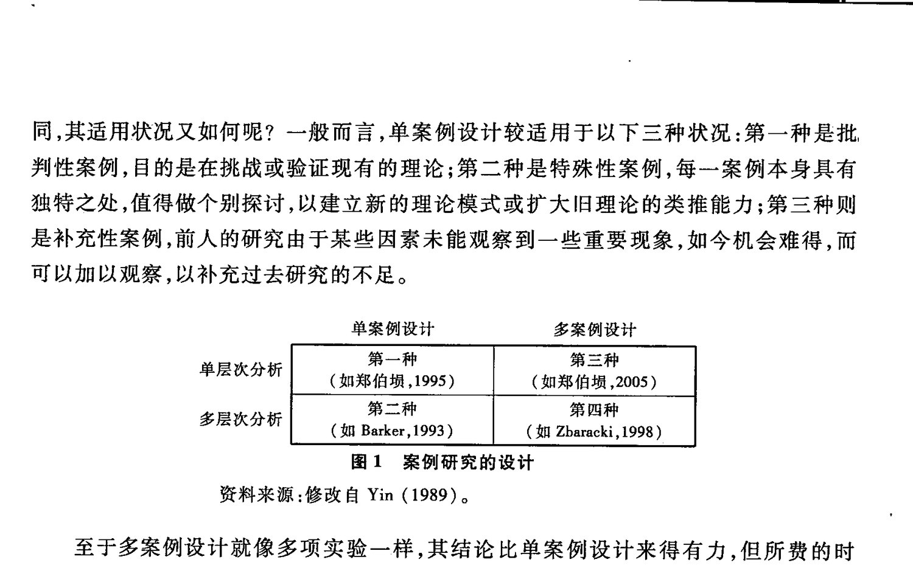

<!-- PDF页 224 -->

tal quality management, TQM)的公司的制度要求、组织口号及技术现实的关系时,也是采取理论抽样的方法,而根据 Scott(1987)的技术环境与制度环境的向度,进行案例的选择与第选,并由此确保案例的歧异性。最后,选择国防设备承包商、饭店、医院、制造公司及政府机构等五个案例作为研究对象——这些对象分别反映了技术与制度力量的大小,再比较各案例实施 TOM 的实际情形与口号。

研究方法与工具选择。案例研究通常采用多元方法来搜集资料,这些方法除了一般量化研究法之外,大多包含各种质化方法(De Vaus, 1996)。在不少书籍中,量化方法讨论颇多,寻且不论。至于质化方法,通常包括深度访谈、直接观察及文件调阅等方式(Patton, 1987)。在深度访谈中,又可细分为非结构访谈与半结构访谈两种。非结构式访谈是研究者邀请受访者畅所欲言,但并未事先准备完整的访谈表,而仅使用一份备忘录来核察访谈的进行,查看是否有遗漏的议题。在半结构的访谈中,研究者会准备一份访谈表,并依照表中的内容逐项询问,据以搜集资料。直接观察则可分为参与观察与非参与观察两种。在参与观察中,研究者会置身于被观察者的活动场所中,察看被观察者的所作所为,并可能与被观察者进行互动。在非参与观察中,观察者是一位旁观者,通常以不介入的方式进行观察。至于文件调阅,则指研究者搜集并阅读与研究主题有关的各类文件,包括信件、备忘录、议程.会议记录、公文.企划书及媒体报道等,也有可能在被研究者同意的情况下,阅读其私人信件或日记作为资料来源。

由于这三种方法各有优缺点(如表3 所示),所以兼采各种方法来搜集资料是相当重要的,而可以取长补短,产生综合效果。当然,量化与质化资料亦可以一并搜集,来相HAA MR, BEAR Mintzberg(1979)在论及量化与质化资料的互补时所强调的:理论建构依赖于对现象的丰富描述,此种描述常来自于质化的轶事或掌故资料(anecdotal data),而非硬性的量化资料;而且量化资料通常会局限在有限的变量当中, 而无法处理所有可能的

' £3 三种资料搜集法的优缺点比较研究方法优点缺点”目的清楚,能呼应研究主题。 ”重要文件不容易取得We 不完整时会有偏颇可能反映原作者的偏见被访谈者的回忆偏误或故意迎合访谈者. 可以看到直接而即时的事件费时费力”观察。 ”能察看事件发生时的情境选择性的情境可能有偏对人际行为与动机具有深刻的了解。。 介入的影响可以重复检视问题不佳时会产生仿误不介入案例活动使用权会受到限制文件/档案品确的资料与清楚的细节范围广泛,模跨各种人,事.时.地.物资料来源:修改自 Yin (1994)。

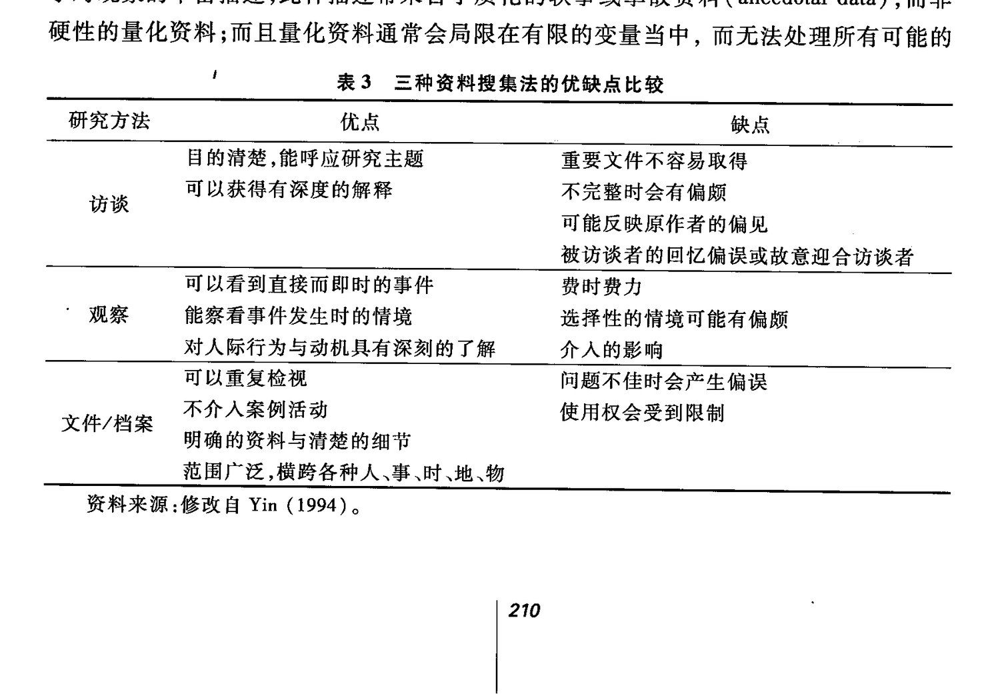

<!-- PDF页 225 -->

关系,但软性的质化资料则可以进行周延的考虑,并给以补足。相反地,质化资料虽然生动、丰富,但也可能不够精准,而有赖量化资料的补充。

此外,在案例研究中,亦强调多研究者(multiple investigators)、多资料源(multiple data sources)的观点。多研究者的好处,首先是可以强化研究的创新性。由于每位研究者的长处不同,所以,可以集思广益,对资料的搜集、分析及诠释,有更为宽广的见解;也较容易发挥想象力,获得新的体会与领悟(insight)。其次,当多位研究者的观察都能获得一致的结论时,研究结果较容易收敛,从而提升研究者对结论的信心 (Eisenhardt, 1989)。因此,有不少研究者采用团队的方式来进行案例研究。以实地访谈为例,有些研究者可以负责访谈,有些负责记录,有些则进行观察,彼此互相搭配,以求访谈的周延,并避免个人的偏见。在资料分析时,则由多位研究者负责,通过热烈的群体讨论,悍清隐了星不明之处,并逐渐形成共识;也可指派一些人担任唱反调者的角色,针对资料的搜集、分析及诠释提出批判式的评论,以强化研究的效度与信度。另外,多资料源的概念也颇似多研究者的想法:当资料来源广泛时,可以互相印证,搜集的资料比较不会有一已之偏,而有较高的可靠性。总之,多方法、多研究者、多来源的做法,是案例研究中

、 常见的选择。3.2 执行阶段

在进行充分准备之后,妓可进入现场建立投奥关系(rapport),研究者与被研究对象间必须彼此互相信任,并开始搜集资料,进行分析,且形成假设。在此阶段中,资料搜集、分析及形成假设是反反复复、来来回回进行的,而不是直线式地一直往前推进。

资料搜集。在案例研究中,资料搜集与分析常常是重倒在一起的,因此, Glaser 和Strauss (1967) 一针见血指出:案例资料的搜集编码及分析通常是混在一块的,而非彼此分立。在此过程当中,研究者需要保持敏锐的理论触角,进行资料的搜集与分析。其中,现场笔记(field note)扮演了相当关键的角色。现场笔记记录了研究时所发生的种种事项,让研究者可以据此进行深刻的反思。研究者需要思考的是:什么是令人印象深刻的事件? 这种事件为什么发生? 从这些事件中,研究者能学到什么? 此事件与其他已经历过的事件有何不同? 其独特之处为何? 透过这些思考,更加开阔自己的视野,并随时调整资料搜集的广度与深度。必要时,也可以增加新的问题或采取新的资料搜集方法,来处理逐浙浮现的问题。另外,则要定期或在有需要时,进行团队会议,讨论资料搜集的状况,分享研究者彼此的想法,以作为下阶段资料搜集之方向与做法的参考(Eisenhardt, 1989),

FE LETL EP DEFENSE AR HS A, 1995),以避免个人的偏见涉人,并产生影响;研究者也需要具备良好的人际互动技能,以便能与研究对象、信息提供人及其他有关人员进行顺畅的互动;同时,需要拥有开阅的视野与同理心,能够扩大视野,针对问题进行抽象有系统且具反省性的思考;更重要的是,

. | 实地研究中的案例研究 |277

<!-- PDF页 226 -->

要具有理论敏感度(theoretical sensitivity),能够察觉现象或事件背后的理论含义,洞察相关或无关的事物。此外,由于资料搜集的方法不少,且各有优缺点,所以,研究者必须深说或熟悉各种研究方法,并对其优缺点有清楚的认识。总而言之,在资料搜集时,资料与分析常常是混在一起进行的,必须要有系统且保持弹性;至于研究者,则必须要视野开阔,保持理论敏感度。

资料分析。资料分析是案例研究的核心,也是最难说清楚的部分。理由就像“一部二十五史,从何说起”一般,如何从厚达 1000页以上的笔记与资料中,抽丝剥草,摘出珠现,并绽放火花,获得有创意的结论,的确不是一件简单的事(Miles and Huberman, 1984; Strauss and Corbin, 1990)。虽然如此,案例研究中的资料分析,仍有一定的程序。研究者只要小心谨慎地遵循研究程序,并多加练习,还是可以获得一定的结果。

简单来说,案例内的资料分析包括以下的步骤:(1) 建立文本(text):访谈,观察及文件等资料的痊写与摘记。(2) 发展编码类别:研究者详细阅读每一个段落的内容,并参照全文主题,将每一段落分解成一或二个小单位,以一句话简述之,并加以编码;同时,将分析出的小单位,依内容与性质的相近程度加以整理,以形成自然类别。如果已有初步理论,则亦可根据理论来架构类别(Yan and Gray, 1994), (3) 指出相关主题:仔细思考每一自然类别之内容与类别与类别之间的可能关系,依可能的逻辑关系排列出来,并给予命名;接着,审视前一步骤是否有不合宜之处,或结果不合逻辑的地方,予以修正。修正时,一方面调整不合适的小单位;一方面加入原先未能分类的小单位。(4) 资料聚焦与检定假设:进行初步假设或发现的复核,让资料主题与初步假设对话,以了解资料与假设配合的状况,作为接受或拒绝假设(或命题)的依据。(5) 描绘深层结构:整合所有资料、脉络及理论命题,来建构理论架构,作为未来进一步研究的基础;或是与打算验证的理论进行对话,并加以修正(Carney,1990; Strauss and Corbin, 1990)。有关案例内之资料的分析步又与深化历程,如图2 所示。

除了案例内的分析之外,在进行多案例研究时,也需要进行案例间的比较,以了解跨案例间的异同。在进行案例比较时,由于已经过单一案例内的分析,所以容易产生先人之见,而导致信息处理偏差(information-processing bias);或忽略了重要的信息,而可能获得错误的结论。因此,在进行多案例比较时,必须秉持开放与多元的想法,多方面寻求正反两方面的证据。通常,这种比较可以区分为两类:一类为根据研究类别来进行跨案例比较,另一类为依照案例的所有性质进行全方位比较(Eisenhardt, 1989)。

以研究类别的比较而言,研究者可以根据研究向度与类别,将案例分类,并比较类别内的案例是否相似(intragroup similarity),或类别间的案例是否有异 (intergroup difference)。至于向度与类别,则是基于理论或研究问题而来。例如,Bourgeois 和 Eisenhardt (1988)将所研究的案例依照创办人经营或专业经理人经营、高绩效或低绩效、第一代产品或第二代产品及大型公司或小型公司等加以区分,并发现某些案例类别(如规模大小、产品世代)的战略性决策(strategic decision making)模式不明显,但在其他类别(如绩

<!-- PDF页 227 -->

效高低)上,则显现出类别内相似与类别问差异的特色。i Be:) ‘mse RN SEE 3资料的重组与妇类指出主题 ee amas RS) SEIS REAP 2. BER MESS pretaeasean HRI cong).、 (categories) / 建立解读架构、Lverinaie | | Waseem. sama 9! 参与现家笔记、相关文件摘录图2 案例内的资料分析步又与深化层次

资料来源:修改自 Carney (1990)、郑伯坝(2005)。

就方位比较而言,研究者将案例予以配对,进行所有特点的全面比较,列出所有的相似点与相异点。透过这种方式,可以发现看起来相似的案例,可能具有不同的特点;而看起来不同的案例,却有着相似的特点。透过上述比较,可以在简单的分析架构上,加入新的类别与向度,并对问题与构念有更进一步的了解。例如, Eisenhardt 和 Bourgeois(1988)原先以为 CEO 的权力大小是影响案例策略决策的主要原因,但在进行案例的成对比较后,却发现决策速度也是重要的因素之一。总之,多案例分析的目的,是在寻找一连串的证据,或提供更坚实的内、外部效度基础,或由此发展更为新颖的观点与研究架构。

形成假设。在经过资料分析之后,所有主题及主题间的关系,都会逐渐浮现,接着就可以进行有系统地对比,察看资料主题、主题间关系与构念架构间的契合程度,并逐一形成假设、验证假设,并建立理论。当然,在对比之前,首先需要检视资料的构念效度,看资料是否能够代表所要探讨的构念,一方面精炼或重新界定构念,另一方面提供构念效度的证据。当所有来源的资料,都显现出某一类型构念的证据时,则可以肯定构念效度的确存在。因此,有些研究者利用构念矩阵的做法,摘记某些构念下的资料证据,来表明案例研究的构念效度(Miles and Huberman, 1984),:

其次,则是检视内部效度,考察构念与构念间的关系,是否能与各案例所提供的证ERE: RAM ET RIFE; Re, RRA WRT RRA. bt程,虽然与传统量化研究中的假设检定颇为类似,但仍有差异。在案例研究中,假设是

ete | 实地研究中的案例研究 | 273

<!-- PDF页 228 -->

根据复现逻辑、透过一连串的案例来逐一检视的,而非组合起来。这种做法就像进行了许多次的实验一样,每一个案例都能提供支持与不支持的证据。在许多案例都支持假说的状况下,我们对某一关系的信心就会更加强化;反之,当不支持时,则提供假设修正的机会,或提出过然不同的新颖假设。透过上述过程,可以确保案例研究的内部效度。

除此之外,研究者也会想了解:“为什么”各构念间存有如此的确定关系? 其理由何在? 这就涉及理论基础的提问,而需要进一步思考关系背后的原因所在。例如,Barker (1993)在观察某家公司工作团队的运作过程之后,认为自主管理团队的控制变得更为紧密的理由力是基于协和控制(concertive control):通过将实质理性与形式理性混合在一起,而成为一个“公共理性”的系统,来发挥作用。

换言之,在假设形成的过程当中,研究者需要反反复复地检视研究者的测量是否具有一定的构念效度;所探讨与逐渐浮现的关系是否稳定且与假说一致,以检视内部效度;各关系的背后理由或理论依据为何,以发展与建构理论。通过对这些事项的检视,提供严谨且具说服力的证据。

总而言之,在执行阶段时,不论采用资料搜集与分析的何种策略,都必须讲求资料与分析的品质。首先,资料要多元,尽量避免偏见;其次,资料分析是以所有相关证据为基础,尽可能搜集可以取得的证据,并进行周延的检视;再次,分析要彻底,应该涵盖所有重要的对立假说,人作为进一步分析的基础,且据以修正原先的假说;最后,分析要紧紧扣住研究目的,回答所要探讨的主要问题,或处理最重要的一个方面,以免过于发散,而模糊了问题的焦点(Yin, 1993)。3.3 ”对话阶段

在执行阶段的资料搜集、分析及假设形成告一段落之后,研究者需要将先前的专家知识纳入案例研究当中。研究者必须熟悉与该案例有关之研究主题的主张与争议,并与现有的文献进行对话;或提供支持的证据,扩大文献的应用范围;或提供反证,对文献提出修正的看法。

文献对话。文献对话的主要目的,是将获得之研究结果与既有的理论或概念进行比较,以促进理论或构念的演化。此一比较的内容通常包括两项:与现有文献有何相似之处? 又有何相异之处? 以相似之处而言,当研究结果与过去研究类似或支持现有理论时,代表证据更为强有力,理论所具备的内部效度更为坚初、外部效度更强、同时构念的可信度与正当性更高。例如,郑伯塌及其团队(郑伯击,2005;郑伯坝、樊景立、周丽芳,2006)在探讨华人组织的家长式领导模式时,于许多案例中都发现了此一领导方式,而肯定了家长式领导在华人社会的普遍性;至于 Ross 和 Staw (1993) 则采用模式匹配(pattern matching)的方式,用以验证其承诺升级的理论,并发现多数假设获得支持。

以相异或了矛盾之处而言,与既有文献巴盾的研究结果可以促使研究者寻找进一步 -的原因,并提供另一个思考的窗口,而可以对理论或构念提出进一步的修正:或产生重

<!-- PDF页 229 -->

大的突破,或掌握重要的调节因素。因此,有时矛盾的证据反而比支持的证据更有价值。Eisenhardt(1989)就强调:如果研究者忽略了矛盾的证据,则读者对研究的信心就会降低。理由是读者会认为研究结果有偏差,内部效度不高;或是研究结果只能局限于少数几个特殊案例,而不能提升外部效度。

更重要的是,矛盾的证据往往会强迫研究者做更周详的考虑,并提出新的观点,而可对现象有进一步的洞察,也可对现有理论的类推范围有更深刻的了解。例如,Eisenhardt 和 Bourgeois(1988) 的案例研究发现:中央和集权常导致组织政治的发生,但此结果是与过去主张之“地方分权往往导致组织政治”的结论是互相矛盾的。为了解决此一矛盾的问题,研究者做了更进一步的分析,并发现了更重要的原因——即不管是地方分权或中央集权,当权力过度集中或过度分散时,就容易引发人际竞争,而使得群体内的挫折气氛增强,并导致自私自利与组织政治。换言之,权力支配与组织政治呈现的是一种U形的曲线关系,不管是权力集中或权力分散,都会导致组织政治,而只有在权力分配中等的状况下,才会促进合作,并削弱组织内的政治游戏。从以上的例子可以了解,针对矛盾的结果进行更深入的剖析,往往能提升理论的清晰性,并掌握确切的类推范围。

: 结束。什么时候可以结束案例研究? 这个问题涉及两项重要的考虑因素,其一为现实上的考虑,其二则是研究上的考虑。理想上,一个研究没有现实上的限制当然是最完美的,可是案例研究通常费时费力,所以当时间不允许、经费已经用尽或案例不想再配合时,案例研究就得结束。如果现实条件都能配合,案例研究的结束就得看两项条件而定,其一是案例所提供的信息是否已达饱和,其二是资料对理论的改善是否幅度有限。前者侯关于案例是否需要再增加,后者则涉及理论与资料的奥合分析是否需要再进行等问题。

就信息饱和而言,当新增的案例无法提供更多的信息,或研究者很难从新的案例学到更多新知识时,就是结束案例的时机(Glaser and Strauss, 1967)。显然地,此一原则还不够具体,所以有一些经验丰富的研究者往往建议,案例搜集的范围或个数在四个至十个当中是最为恰当的。理由是当搜集的案例在四个以下时,由于案例数太少,可能无法掌握组织或管理的复杂度,而无法建构坚实有用的理论;而案例在十个以上时,又因为资料过度浩繁庞杂而无法处理,或分析难度太高以致不知如何下手(Eisenhardt, 1989)。

就理论与资料的奥合分析而言,当来来回回、反反复复的分析已经逐渐趋于饱和,理论或概念与资料契合的改善十分有限之后,则可以终止资料的分析。换言之,研究者通常会检视案例研究的证据,修正理论假设与命题,再根据新的观点检视证据,并反复进行该过程。当所带来的改善与修正十分有限以后,则可以结束资料的分析。事实上,此过程颇似论文初稿的修改过程,当能够修改的空间越来越有限,改善幅度越来越小时,即可结束。最后,则根据主要的故事轴线或问题焦点,铺陈研究目的研究过程及研究结果,来撰写案例报告或相关论文。就此而言,报告或论文最好要有一个清楚、重要的主题,写作生动,能吸引读者一直阅读下去,并留下深刻的印象。就像 Yin(1984) 所强

Sie | 实地研究中的案例研究 | 215

<!-- PDF页 230 -->

调的:生动、诱人及魅力,这些都是案例研究难得的特征。唯有研究者醉心研究,且

想让其研究结果广为流传时,才容易获致。事实上,好的案例研究者往往确信其研:

究结论将会震惊全球,这种热情会充塞于所有的过程当中,而且也必然会促使案例

RZ WIE! (p. 145)

### 四、研究实例

为了对案例研究有更进一步的了解,以下将举三个例子来加以说明。前两个例子都是发表在管理学重要期刊之(管理科学季刊)的最佳论文,主要是用案例研究来建构理论;第三个案例是发表在《美国管理学会学报)的论文,旨在验证理论。第一个实例是James Barker (1993) 的协和控制(concretive control) 研究;第二个实例是 Mark Zbaracki (1998)的TQM 的口号与实际研究;第三个实例则是 Aimin Yan 与 Barbara Gray 的中美合资企业(joint venture)的协商与控制的研究。4.1 实例一:自我管理团队中的协和控制

研究问题。此研究是探讨官僚组织在自我管理团队倾斜时所产生的协和控制议题,控制从 Max Weber 的时代开始就已是组织理论中的核心议题。传统上,控制包括了简单、技术及官僚等三种策略(Edward,1981);而在当代,则产生了第四种协和控制策略。协和控制是指通过协商、互动,群体成员塑造共有的价值观与规范,用以控制群体行为。由于这是一种新的控制策略,所以研究者打算了解以下几个问题:(1) 协和控制是否优于官僚控制? (2) 协和控制是如何形成的?(3) 协和控制的正当性是如何取得的? 并以自我管理团队为对象,考察团队控制由建立到成熟的历程——选择自我管理团队的理由是,此类团队不但是协和控制中的一个范例,而且人们对此团队的规范形成与规则建立并不太了和解。

案例选择。为了了人解以上的问题,研究者选择一家小型的通信和制造公司作为研究案例,称之为 ISE 公司。ISE 生产声音与传输电路板,员工 150 人,其中有 90 人从事生产工作,其余则负责其他工作;员工的背景亦反映了当地工作阶层的特色。该公司从1988年开始改变生产结构,由官僚组织转变为自我管理团队。在经过一段时间的混乱以后,于 1992年逐渐形成团队规范,并树立具体规则。因此,ISE 是一个能回答研究者问题的合适对象;此外,研究者认识 ISE 公司的副总裁,彼此在团队问题上有共同的兴趣,从而有助于研究者进入现场进行观察。

资料搜集。在 ISE 公司副总裁的精心安排与介绍之下,研究者于 1990年初进入公司搜集资料,那时 ISE 的变革已经进行了两年。前六个月,研究者的主要工作是熟悉工

”

<!-- PDF页 231 -->

厂,访谈了工厂中的团队成员以及管理与后勤支持人员;也观察了不同生产阶段的员工工作行为,询问他们如何执行工作与为什么要这样工作。在此期间,他也培养了各团队中的主要信息提供者(informant),并拟定员工的深度访谈计划。

此外,研究者订出每周的访谈与观察时间表,每周进行半天的访谈,通常上下午交叉进行,有时在上午访问,有时则在下午;同时,也进行了一些傍晚时分的轮班观察。当然,每周时间表也并非是完全固定不变的,而会随状况进行调整。例如,在有重大事件发生时,会增加访问的次数;但当研究者课业繁忙之际,则减少为两星期一次。

六个月以后,研究者开始扩大资料搜集的范围,包括主要信息提供者的深入面谈与观察,也搜集公司的备忘录、传单、公司通讯及内部调查等资料。在资料搜集告一段落以后,研究者从现场抽离,开始分析资料、记录及笔记,并提出经过修正的研究问题。如此,来来回回、反反复复,持续进行调查架构的修正,再提出问题、搜集更多数据、再分析、再记录及再修改等。研究者也参与团队与企业会议,观察并记录会议的内容,以搜集自然出现的团队互动事例。另外,他也对一个团队进行了四个月的追踪调查,访问了一些非生产部门的员工与 ISE 离职的员工。除此之外,针对团队领导人与团队成员,他则提出团队如何做决策、解决问题及进行日常工作等的开放性问题,要求被访谈者回答,从中获取重要的关键事例。在搜集资料的过程中,研究者的观察者角色从未改变。资料搜集结束时,研究者总共累积了 275 个研究小时与 37 次的深度访谈,每次访谈时间由45 分钟到2 小时不等。

资料分析。分析时,研究者是从一个基本问题人手:“ISE 新工作团队的控制实务如何? 此控制与过去的做法有何不同?”此问题的提问,使得控制的主题得以浮现。在与资料对话之后,他也逐次、逐步修正分析架构,使得架构更为细致与深化。经过此一反复分析的历程,研究者逐渐熟悉该案例。扼要来说,在这个过程当中,研究者往往采用概念与资料对话的方式,敏锐地触及理论与资料是否站合(Jorgensen, 1989)的问题。例如,研究者会询问:在团队互动中,价值共识是如何发生的? 各团队都已发展出新的决策规则与前提了吗?如何发展? 当重要主轴或主题(theme) 由资料浮现之后,研究者会透过访谈或其他资料搜集方式,再来加以厘清,以确实掌握各主题间的关系及其模式(pattern)。透过上述分析历程,研究者描述了协和控制的特性;了解此特性如何在 ISE自我管理团队中,逐渐变得明显? 并将之区分为不同阶段,来加以铺陈。

信度与效度。为了确保分析架构与资料的有效性与可靠度,研究者交叉检核了各种方法所搜集的资料,这些方法包括现场笔记、民族志观察、对员工与重要信息提供人的访谈以及相关的客观资料等,以察看资料的一致性。另外,在进行资料分析时,则要求与未参加现场访谈与观察或不熟悉研究架构的同事一起来分析资料,以提升研究结RNP ES ETE.

研究结果。研究者将自我管理团队之协和控制的发展,区分为三个阶段来叙说:第一阶段的主要内容是凝聚价值共识,开始于传统生产结构转变为自主团队时,并由一团

"| 实地研究中的案例研究 |27

<!-- PDF页 232 -->

混乱凝聚出共识为止。其主要重点有:上级提供愿景成为团队价值观的指南;团队成员商议如何表现与愿景或团队价值观相符的工作行为;团队价值观如何开始拥有权威,并填补管理者消失的空白,于是价值观由实质理性转变为形式理性;最后,团队价值与形式理性成为群体行为的指引。第二阶段所出现的规范规则乃是价值观作为行为指引的自然发展,规范变得更加具体、清晰及明确,更有利于互动。因而,团队工作的规范规则逐渐浮现,规则不但变得越来越理性,而且会通过团队成员自己结束自己的内化作用来发挥影响力。当规则越来越稳定时,就进入最后的规则巩固阶段。此时,团队成员已经习惯正式规则的运作,这些规则指导成员的工作,形成自我管理体系,使得成员能够客观地处理玉手的特殊状况,于是成员成了自己的主人,也成了自己的奴隶。根据上述三个阶段的分析,研究者讨论了协和控制的后果,并提出结论:协和控制并没有将员工从 Weber 2 BEM MAE PRAM REPKE R

得更为坚实有力。协和控制将同储压力与理性规则混在一起,创造出新的竹子,这

个笼子的铁条却几乎是看不见的...于是,人们仍然身陷于铁答之内。(Barker,

1993, pp. 435—436) 4.2 实例二:TQM 的口号与实际

研究问题。本研究起源于人们对 TOM 的争论:有些人认为 TQM 是提升组织效能的有效方法,有些人则认为 TOM 只是一种管理时尚华而不实。为何对 TOM 有如此截然不同的观点?这是一项值得探讨的议题。另外,从过程来看,TQM 是如何从一种具有明确定义、颇为完善的技术发明(技术 TQM),演变为一种模糊且令人质疑的手法(修辞TQM)? 为了回答上述问题,研究者打算探讨 TOM 的引入、使用及维持的历程,用以了解制度化的过程是如何将 TQM 的技术优势转化为制度现实的,从而使得 TQM 变得越来越模糊,且越来越不可信。总之,此研究的目的,主要在于考察制度要求、组织修辞及技术现实间的关系,并建构一个演化模式来加以解释。

案例选择。本研究依照理论抽样的方式,寻找不同的多元案例来加以分析,以提升研究结果的类推性。为了确保各案例的差异,研究者根据 Scott (1987)之区分技术环境与制度环境的做法,将案例分为高高高低、低高及低低四种类型,并据此选择研究案例。在本研究当中,除了高高组有两个案例(分别为国防设施承包商与医院)之外,其余各类型都只有一个案例,分别为制造公司(高低型)、政府机构(低高型)及饭店(低低型)。这些公司均曾引入 TQM,且行之有年。

资料搜集。研究者采用多种方式来搜集资料,包括半结构访谈、档案(含内部出版fa TQM 通讯.TQM 训练手册、组织内 TOM 档案)、活动观察及参与 TQM 训练的笔记等。访谈尽量涵盖各案例内上上下下的各阶层人员,并以滚雪球、由被访谈者推荐的方式,扩大样本规模。访谈表是在预备调查之后,经过仔细考虑才设计出来的,以期待能

”

<!-- PDF页 233 -->

反映所要探讨的问题。正式访谈表涵盖了各种封闭与开放的题项,包括所使用的 TOM工具、实施 TOM 的背景如何定义 TQM 及实施 TQM 的感受等。访谈时间由 45 分钟至120 分钟以上不等,但平均大约 90 分钟。访谈时,研究者特别注意两方面的信息,一个是组织成员如何看待 TQM,一个是组织如何推动 TQM,以同时了解他们的说辞与实际。每次访谈结束后,则记下大量的现场笔记,除了国防承包商不允许录音之外,其余的访谈都进行了录音。最后,总共进行 69 次的访谈,获得数百页的现场访谈记录,以及一千页左右的文本。

在档案搜集方面,内部资料(包括 TQM 使用的材料)描绘了组织进行 TQM 的状况。借此,研究者能够了解各案例成员的感受、他们对 TOM 工具的了解,以及参与 TQM 的程度。研究者在三个案例中拿到了 TQM 标准定义的训练手册,这些手册罗列组织要传授给 TQM 参与者的必备知识;研究者也尽量到工作现场观察成员如何使用 TQM,并主动参加一个案例的TQM 训练,用以体验TQM 的训练过程,且探讨组织成员对TQM 训练与材料的看法。同时,亦透过此类资料,与访谈资料互相检核,以提升资料的正确性,确保资料的不偏不倚。

资料分析。此研究针对 TOM 的修套(口号)与现实的主题来加以分析。修辞是指用来建构、传播或维持 TQM 假设的一系列叙述,包括使用 TQM 的提议、实施 TQM 的主张及不同组织使用 TQM 的证据等;而现实则界定为:组织推动 TQM 时的实际情形,以及所使用的各种模型与工具,例如统计品管的基本元素、分析工具及脑力激荡等的技术。为了使探讨的构念与向度更为清晰,研究者亦将工具区分为四类,并依照技术水准的高低来加以排序,技术程度由低到高,分别为一般的TQM 手法(最低)、新的七种工具(次低)、TQM 的七种工具(饮高)及统计与实验设计(最高)等(Zbaracki, 1998)。

在定义与维度界定清楚之后,研究者根据归纳研究所描述的标准方法来建构理论。首先,提出一个概括架构,来分析修套与现实的案例。初步结果显示,有一些结果是颇为一致的,包括所有组织都有一些成功的案例、所有组织都觉得难以将 TQM 融和人日常工作当中,以及工作需求往往与被合理化的TQM 有矛盾。最后一项结果代表实施 TOM的现实与口号是有落差的,因此,在后续的分析中,研究者将修辞与现实区分开来,并考察 TQM 的引入与演变,以及组织成员之社会建构的变化。经过进一步的资料分析,研究者决定采用演化的观点来分析资料,并以 Weick (1979)的合理化(sense making)模型与 Miner (1994)的演化模型为依据,将 TQM 的引信区分为改变、选择及维持三个连续过程。利用此一架构,研究者探讨组织在推动TQM 时的修套与现实,并分析由引进到维持是如何演变的。研究者来来回回,不断地在理论架构与实证资料间游走、穿梭,以获得较为一致的发现。当研究者从组织成员的资料中,获得一致性的结果之后,则进行更高、更广的组织层次分析,并根据资料不断更新理论架构,使得资料与理论逐渐奥合。接着,再由 TQM 的启动(或改变)阶段迈人下一个阶段的选择与最后阶段的维持。

| 实地研究中的案例研究 | 219

<!-- PDF页 234 -->

信度与效度。 为了提升研究结果的信度与效度,研究者依赖三角检证的方式来搜集资料,并进行分析。资料来源包括半结构访谈、组织内部出版品与TQM 通讯.TQM 训练手册、组织内部 TQM 档案、TQM 活动观察以及参与某一组织之TQM 训练的笔记。通过这种多信息的资料来源,以及资料间的相互检核与比较,来提高研究资料的准确性,并使得分析结果更为一致与坚韧。

研究结果。本研究首先根据资料分析结果,建立一个“TQM 引入”的演化模型。此模型将 TOM 的引入细分为改变、选择及维持等三个连续的流程,各流程又再细分为三个更小的流程(仍然命名为改变、选择及维持),并将修辞与现实区分开来。就改变过程而言,TQM 的引信始于组织需要“变革”的上暗示与线索,使得组织开始启动TQM 的实施,并产生选择与维持的循环。研究资料显示,修辞在推动这种有意变革的过程中,居于核心的角色。修辞包括推动 TOM 的论述、成功案例的强调等,使得组织成员能够了解并愿意相信 TQM 的好处。在这个阶段中,修辞等同于 TQM 的现实,并为后来的技术性TOM 创造了有利的条件;可是吊诡的是,修辞虽然促进了TQM 的活动,却也过滤了TQM中知识与技术的成分,而使得员工觉得无法了解,并为其未来感到害怕。证据显示,在被研究的五个组织中,有四个组织在引进 TOM 的启动过程中,已经过滤了 TOM 的技术成分。

在步人选择流程之后,接受 TOM 价值不久的管理者,需要去说服其他员工接受此价值,于是设立专责部门或委员会,提供训练项目,并成立解决问题的团队。在此过程中,修辞包括了宣传实施 TOM 的决心强调 TQM 的成功故事以及发放 TQM 相关手册等。此时,赞成TQM 的修辞处于优势地位,而反对者则显得相当无力。此一状况也为以后遭受挫败埋下伏笔。在现实层面上,管理阶层则创造出多种做法来鼓励员工采用技术性的TQM,例如,衡量指标的制定、要求员工参与TQM、TQM 顾间的介入、TQM 的训练,以及训练内容符合 TOM 的技术性要求等。理想上,这些推动 TOM 的现实,足以顺利且有效地实施 TOM,但仍存有阻力。包括管理者与员工对 TQM 的复杂度不够理解,以致看起来就像推动一项新实验一样;而管理者亦低估了员工接触 TQM 技术时的难度,而使得重要工具的采用无法落实;最后,则是 TQM 不能与原有的组织活动接轨,以致无法融入日常工作当中。以上种种现实上的障碍,都会使得 TQM 的推动走人Bo

走完选择过程之后,接着就会启动维持过程。此时,由于组织成员对 TOM 已有经验,但每位员工的经验又是如此的不同,所以对 TQM, 的修辞开始有了不同的见解。处

”于此一阶段,往往是现实塑造了修辞:对管理人员而言,由于总是接收到正面的信息,所以其修辞往往偏向TQM 美好的一面;但对其他成员而言,却可能有截然不同的印象,于是热情将逐渐消退。在推动 TOM 的现实方面,主要有两类现实较为常见:一种是 TQM团队的成效,成功时感到高兴,而失败时则会觉得信心崩落;另一种则是 TQM 工具与术语的使用,使用多,代表 TQM WHER HR RZ, NER, KARR,饭店与医院的

*

<!-- PDF页 235 -->

TQM 推动是最为表面的,口号也最多。在维持过程的最后,组织成员已由对 TOM 完全没有经验,到知道实践,且形成自己的看法,于是成员拥有自己的故事。对强调成功的管理者而言,其修辞可能会对 TQM歌功颂德,并且有和想拿出来展示的欲望。根据承诺续扩 (escalation of commitment) His,这种修辞失真的状况几乎是难以避免的。因此,当 TOM 扩及整个组织时,对 TOM 的论述将会导致不正确且过于乐观的态度。可是,对许多员工而言,管理者的修辞与他们的经验不符,于是怀疑程度将大为增加。尤其是开始时大力支持且信心满满的成员,更会感到强大的失落。此时,修辞虽然还能够促进 TOM 的推动,但却已经脱离 TOM 的技术现实,也忽略了TQM 技术的局限。当然,员工流动的现实也会状害 TOM 的持续推动,尤其当主张推动 TQM 的 CEO 离职后,换上一个对 TOM 不其了了的高阶主管时, TQM可能就只剩下一具稻党了。扼要而言,本研究的研究者从五个案例中,归纳出关于“TQM 引入"的演化模型,用以说明 TQM 的修辞与现实间交互发展的动态过程,而填补了组织在决定引进 TQM 后,到引进并制度化间的空白。本研究也证实了制度论长期以来所坚持的观点:随着时间的推移,即使制度化的做法已经脱离最初所设想的技术本质,但看起来,一切都是那么地合理。因此,研究者郑重呼吁:!“我们必须严肃对待管理实践中的社会建构,也需要仔细考察管理实践中的技术本质!” 4.3 ”实例三:中美合资企业的协商权、管理控制及绩效研究问题。在全球化的冲击下,跨国合资企业越来越多, 也越来越受研究者的肠目。可是,这方面的研究在深度(depth)与广度(scope)上,都鼎为不足。 同时,由于测量写概念上的问题,也使得现有的理论模式常常无法获得一致性的结果。 因此,本研究采用合资者协商的观点 (interpartner negotiations perspective), 以多案例研究的方式,探讨合资企业的形成,考察合资双方的协商权、管理控制及合资绩效间的关系。采用多案例研究的第一个理由,是因为这种方式可以发挥过去合资研究所没有的优点,包括可以提供丰富的现象描绘,对协商权、管理控制及合资绩效间的关系能有进一步的洞察(insight);第二, 可以掌握合资企业形成的动态历程,了解其中的改变与演化;第三,能够同时了解合资企业双方的观点,兼顾双方的诠释;第四,可以深入探讨来自发展中国家的合资者的看法,提供中国经验,以丰富现有的以发达国家观点为主的合资企业文献。根据研究问题,研究者踊随 Yin(1989) 的理论验证的做法,首先回顾了既有文献,并提出一项初步的理论架构(如图3 所示),用以发展先验的理论命题(priori theoretical Propositions),再采用分析归纳(analytic induction)的方式,验证合资企业之协商权、控制及绩效的理论模式。Sie | 实地研究中的案例研究 | 221

<!-- PDF页 236 -->

管理控制 wh.资源取向 tend | 战略性目标图3 合资企业之权力与控制的初步模式

案例选择。本研究依照四项标准来选择案例:第一,将案例局限在制造业的合资公司,以避免因性质差异太大而产生变异;第二,必须是典型的中美合资公司;第三,已经成立一段时间,如至少在 1987年以前成立,以方便取得较长期的合资绩效资料;第四,要有良好的信息提供人(informant),以同时获得合资双方的资料,并有利于研究之进行。

资料搜集。本研究通过访谈与档案调查来搜集资料。在访谈方面,同时以预先设计之访谈表,深度访谈中美双方的首席执行官与经理等信息提供人,这些人大多参加过合资时的协商会谈或经历过合资企业的初始阶段。每项访谈平均三小时,每人至少一次,而有些则在两次以上。除非信息提供人反对,否则访谈都会加以录音;访谈期间为1991年5月至1992年1月。在档案方面,研究者同时搜集合资双方的档案资料 20页以上,包括合约书、合资企业与繁公司的组织图、公司宣传品与年度经营报告以及报纸与杂志的报道等。

资料分析。在原始资料的编码方面,通过典型内容分析(content analysis) 的方式,来加以编码。首先,根据初步理论架构的主要变量与类别来编码,这些类别有协商情境、合资双方之战略目标、初始贡献.管理结构、营运变化,以及双方达成其战略目标的程度。其次,根据既有文献,建立次级类别(subcategory),例如初始贡献中的产品设计、 “特殊设备及生产知识再归类为“技术”(technology) 类别。再次,在次级类别中,如果不同来源的资料不一致,则增加其他来源的资料或参考信息提供人的意见来加以调整。透过这种三角检证的方式,来提升资料的可靠程度。资料的编码是由两位研究者共同负责的,首先,两人一起建立编码架构,并共同分析一个案例;接着,由一位研究者负责其他三个案例的编码,而男一位则加以复核(auditing)。

资料分析则采用分析归纳(analytic induction) 的方式来进行,通过案例类别的比较,逐渐精炼既有理论;尤其特别着重例外案例的分析, 以修正既有的结论。其步骤如下:第一,给予所要解释之现象粗略的界定;第二,对现象提出假设性的解释;第三,分析一个案例,查看假设是否与案例的事件稳合;第四,如果彼此不兢合,则重新修正假设,或者对现象重新界定;第五,在考察一些案例之后,可以获得一些明确的结论;第六,重复上述程序,一直到建构出普遍性的关系为止;如果有异例则重新界定现象与修正假设;第七,考察适用范围以外的案例,以确定最终的假设是否可以应用于此案例,以提供进一步的证据。

信度与效度。在本研究中,不管是资料的搜集或是资料的编码与分析,研究者都依

*

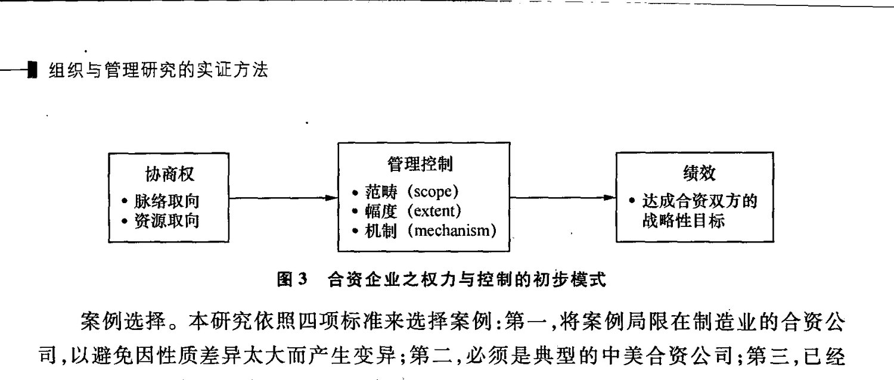

<!-- PDF页 237 -->

赖三角验证来提升资料的准确度与分析的严谨度。资料来源包括访谈资料与档案文件,而编码与分析则通过信息提供人与研究者的复核,来确保一致性与准确度。研究结果。本研究相当程度地深化了既有研究,不但掌握更多的信息,而且提出一项整合模式(integrative model) (如图4 所示),用以描述合资双方协商权、管理控制及合资绩效间的关系与动态历程。在主要变量方面,本研究扩大了既有的变量范围,并纳入新的变量。例如,以主要变量的协商权而言,本研究进一步指出两种脉络因素,包括可替代方案与战略重要性;以及七种资源因素,含技术、管理才能、全球服务支持、本地知识、产品分销、材料取得及资金等。同时,亦纳入变迁(change)与调节因素(moderators),据以阐明各变量间的动态历程及可能的情境限制。最后,则根据整合模式,提出可以进一步检证的五大命题,包括协商权与管理控制的正向关系、管理控制与合资绩效的关系、调节因素的作用、环境变化与协商权的关系,以及合资绩效对协商权的影响等,而进一步扩大了跨国合资研究的视野。。学习。互信。合资成长。共同目标。本地化。净约中明订的目标协商权 “。替代方案: “战略重要性:。本地知识 + HHS RRB © `。 总经理提名权。合资双方目标的。材料取得。结构控制达成图4 合资企业之权力与控制的整合模式. 以上三个案例,简要地铺陈了进行案例研究的过程、如何搜集与分析资料,以及如何呈现重要的研究结果等,企对案例研究有更进一步的了解。显然地,对每一位研究者而言,每一道程序,都是一项挑战;而挑战也总是充满着无比的乐趣——研究者只要反复不断地练习、持续不懈地实幅,以及呕心沥血地冥思,即可享受此一精彩动人的发现之旅。参考文献Barker, J. R. (1993). Tightening the iron cage: Concretive. control in self-managing teams. Administrative Science Quarterly, 38, 408—437. Bettenhausen,.K. and Murnighan, J. K. (1986). The emergence of norms in competiete | 实地研究中的案例研究 | 223

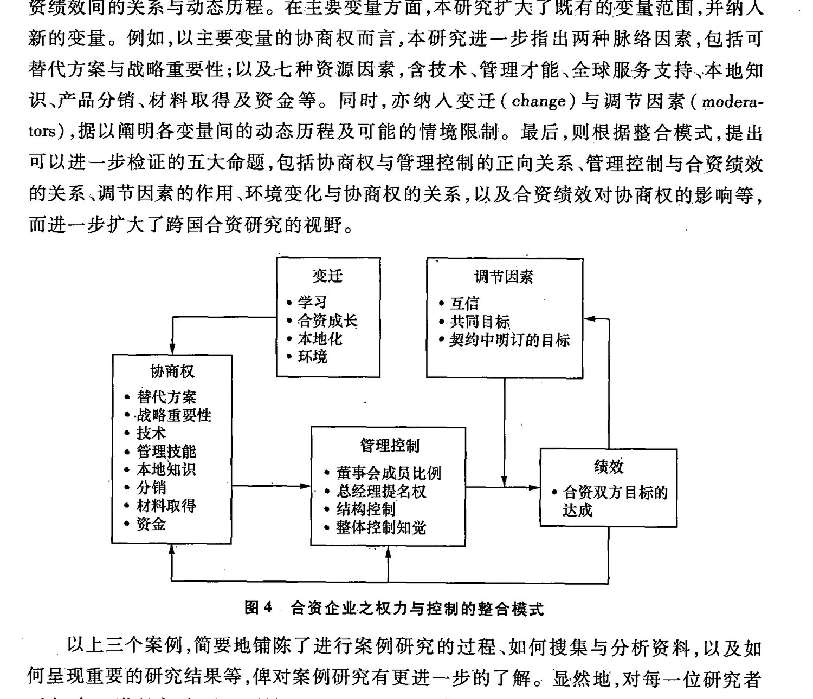

<!-- PDF页 238 -->

tive decision-making groups. Administrative Science Quarterly, 30, 350—372.

Bourgeois, L. and Eisenhardt, K. (1988). Strategic decision processes in high velocity environments; Four ‘cases in the microcomputer industry. Management Science, 34, 816—835.

Bryman, A. (1989). Research Methods and Organisation Studies. London; Allen & Unwin..

Campbell, D. T. (1975). Degrees of freedom and the case study. Comparative Political Studies, 8 (July), 178—193.

Carney, T. F. (1990). Collaborative Inquiry Methodology. Winsor, Ontario; University of Winsor.

Cook, T. D. and Campbell, D. T. (1979). Quasi-experimentation; Design and Analysis Issues for Field Settings. Chicago; Rand McNally.

De Vaus, D. A. (1996). Surveys in Social Research. London; UCL Press.

Edward, R. C. (1981). The social relations of production at the point of production. In M. Zey-Ferrell and M. Aiken (eds.), Complex Organizations; Critical Perspectives: 156—182. Glenview, IL; Scott & Foresman.

Eisenhardt, K. M. (1989). Building theories from case study research. Academy of Management Review, 14(4), 532—550.

Eisenhardt, K. M. and Bourgeois, L. J. (1988). Politics of strategic decision making in high velocity environments; Toward a mid-range theory. Academy of Management Journal, 31, 737—770.

Gersick, C. (1988). Time and transition in work teams; Toward a new model of group development. Academy of Management Journal, 31, 9—41.

Glaser, B. and Strauss, A. (1967). The Discovery of Grounded Theory; Strategies of Qualitative Research. Chicago; Aldine.

Gummesson, E. (1991). Qualitative Methods in Management Research, London: Sage.

Hamel, J. (1993). Case Study Methods. Newbury Park, CA; Sage.

Jorgensen, D. L. (1989). Participant Observation; A Methodology for Human. Studies. Newbury Park, CA; Sage.

Kidder, L. and Judd, C. M. (1986). Research Methods in Social Relations (5th ed.). New York; Holt, Rinehart & Winston.

Lee, T. L. (1999). Using Qualitative Methods in Organizational Research: 145—170. Thousand Oaks, CA; Sage. Malinowski, B. (1922). Argonauts of the Western Pacific. London: Routledge. Miles, M. and Huberman, A. M. (1984). Qualitative Data Analysis. Beverly Hills,

<!-- PDF页 239 -->

CA: Sage.

Miner, A. S. (1994). Seeking adaptive advantage: Evolutionary theory and managerial action. In J. A. C. Baum and J. V. Singh (eds.), Evolutionary dynamics of organizations: 76—89. New York; Oxford University Press.

Mintzberg, H. (1979). An emerging strategy of “direct” research. Administrative Science Quarterly, 24, 580—589.

Patton, M. Q. (1987). How to Use Qualitative Methods in Evaluation. Newbury Park, CA; Sage.

Platt, J. (1992). “Case Study” in American methodological thought. Current Sociology, 40, 17—48.

Ross, J. and Staw, B. (1993). Organizational escalation and exit; Lessons from the Shoreham Nuclear Power Plant. Academy of Management Journal, 36(5), 701—733.

Scott, W. R. (1987). Organizations; Rational, Natural and Open Systems (2nd ed.). Englewood Cliffs, NJ; Prentice-Hall.

Strauss, A. and Corbin, J. (1990). Basics of Qualitative Research; Grounded Theory Procedures and Techniques. Newbury Park, CA: Sage.

Tsui, A. S. (2007). Taking stock and looking ahead; MOR and Chinese management research. Management and Organization Review, 3(3), 327—334.

Tsui, A. S., Nifadkar, S. S. and Ou, A. Y. (2007). Cross-national, cross-cultural organizational behavior research; Advances, gaps, and recommendations. Journal of Management, 33(3), 426—478.

Van Den Berg, J. H. (1972). Different Existence: Principles of Phenomenological Psychology. Pittsburgh, PA.; Duquesne University Press.

Weick, K. E. (1979). The Social Psychology of Organizing (2nd ed.). Reading, MA; Addison-Wesley.

Weick, K. E. (2007). The generative properties of richness. Academy of Management Journal, 50(1), 14—19.

Whetten, D. A. (2002). Constructing cross-context scholarly conversations. In A. S. Tsui and C. M. Lau (eds.), The Management of Enterprises in the People’s Republic of China; 29—47. Boston; Kluwer.

Whyte, W. F. (1943). Street Corner Society; The Social Structure of An Italian Slum. Chicago; University of Chicago Press.:

Yan, A. and Gray, B. (1994). Bargaining power, management control, and performance in United State-China joint ventures; A comparative case study. Academy of Management Journal, 37(6), 1478—1517.

ate | 实地研究中的案例研究 | 225

<!-- PDF页 240 -->

Yin, R. K. (1984/1989). Case Study Research: Design and Methods. Beverly Hills, CA; Sage.

Yin, R. K. (1993). Applications of Case Study Research. Newbury Park, CA; Sage.

Yin, R. K. (1994). Case Study Research; Design and Method (3rd ed.). London; Sage..

Zbaracki, M. J. (1998). The rhetoric and reality of total quality management. Administrative Science Quarterly, 43, 602—636. |

FAIR (1995):家长权威与领导行为之关系:一个台湾民营企业主持人的个案研究,《“中央研究院”民族学研究所集刊》,79'期,105一159。

FAS (2005):《华人领导:理论与实际》(124一183页)。台北:桂冠图书公司。

ARASH BES I. JALAN FH (2006):《家长式领导:模式与证据》。台北;华泰文化公司。

<!-- PDF页 241 -->

第三部分a统计方法

<!-- PDF页 242 -->

ee

<!-- PDF页 243 -->

## 第三部分 管理学研究中的测量统计方法

## 第十一章 理论构念的测量

a

理论构念的测量上海交通大学香港科技大学本章大纲一、 测量与管理学研究二、 测量质量的评价2.1 理论构念与测量指标2.2 WARE三、 UBL IF Be — A 3.1 构念说明3.2 产生测验项目3.3 ”内容效度的评价3.4 ”内部结构的检验3.5 内部一致性与稳定性的评价3.6 RRM KARE 3.7 BRKARM AW BS;四、 中国管理学研究中的测验开发取向4.1 直接翻译取向4.2 修改取向4.3 ”去情境化的取向4.4 ”情境化取向hh. 结论St = | 理论构念的测量 | 229

<!-- PDF页 244 -->

### 一、测量与管理学研究

管理学研究通常是从形成研究问题开始的。通过对现象的了解和阅读有关的文献,研究者会就现象之间的关系形成自己的研究假设。在此基础上,制订研究计划去收集和分析相关的信息。一项研究计划通常包括:(1) 确定所要研究的样本(如个体、团队或组织);(2) 操纵或测量用于解释的变量——自变量;(3) 观察结果的变化——因变量的变化;(4) 控制可能影响结果的但不属于主要研究兴趣的变量; (5) 通过适当的统计方法来分析数据、得出结论。在这一过程中,我们把一个基于理论的描述转变成一个可以验证的假设命题。通过对变量的测量,我们可以就变量之间的关系进行直观的、量化的推断。所以能否准确地测量相关的变量在很大程度上决定着研究结果的可靠程度。

Stevens(1968)将测量定义为:研究者根据一种规则或惯例,用数量的方式描述研究对象所具备的某种特征或行为。这一过程所用的工具称为测验。我们对测量的首要要求就是所分配的数字必须能够准确地反映测量对象的特征,实现所分配的数字与所要测量对象之间的——对应。一个最直观的例子就是对重量的测量,在刻度表上我们总有一个数字与物体的重量实现——对应。通过这些直观的数字,研究者才能够探究一些复杂的社会现象。并可通过数字间的计算得出变量彼此间的关系,从而得出精确且

在管理学研究中,我们对研究对象的测量通常有两种方式:实验操纵和问卷。在实验或准实验研究中,我们对自变量的测量大多是通过改变被试周边环境的方式而实现的,如操纵物理环境(温度、照明等)、角色要求(如工作职责等)、情绪状态(如诱导不同的心情等)。而在非实验法的研究中,我们对概念的测量主要是应用各种形式的测验量表。在本章中,我们的讨论主要集中于在应用问卷法时的测量质量问题。这是因为在目前的中国管理研究中,最为普遍的数据收集方式就是问卷法(Li and Tsui, 2000)。问卷测量质量的高低直接关系到我们研究的质量。围绕着问卷法中的测量问题,我们在本章中主要讨论三个方面的问题:测量质量的评价、测验问卷开发的一般步又以及在中国管理研究中测验开发的取向和问题。

### 二、 测量质量的评价

测量不是管理学研究的目的,而是我们在讨论变量间关系的手段。任何测量都服务于特定的研究上的,理论不仅决定了我们需要测量变量的哪此特征,而且也决定了我们应该如何去测量(Pedhazur and Schmelkin, 1991)。在测量中,研究者需要用学术化的语言去抽象,概括我们所要研究的现象,并把这种学术概念进一步操作化,使之变成可

<!-- PDF页 245 -->

以量化的指标。2.1 理论构念与测量指标

管理学的理论或假设在于讨论变量或概念间的关系。但绝大多数的管理学概念往往不是可以直接观察的,如人格、成就动机、组织结构、核心能力等。 我们用“构念”一词来描述、抽象这些特质或属性。这些理论的构念不仅是我们对外界现象的一种高度精确的概括,而且有助于研究者之间的交流。测量的目的在于根据研究者对这些理论构念的理解和定义,把抽象的概念具体化,找到合适的测量指标(indicator),从而对这些构念所代表的现象进行科学的描述、区分、解释,乃至预测。这就是我们常说的操作化(operationalization) 的过程。

如我们前面讲过的,绝大多数的测量都是间接的。也就是说,我们对感兴趣的现象的测量不是直接的,而是通过与之相联的指标加以推论的。在管理学研究中,有两种不同测量指标可以用来测量我们的理论构念:反映型指标(reflective indicator) 和形成性指标(formative indicator)。在区分这两类指标时,我们考察的是理论构念与测量指标的内在关系。如果测量指标只是作为构念外在的表现形式,我们称之为“反映型指标” (MacKenzie, Podsakoff and Jarvis,2005)。这类测量指标通常反映了一个共同的理论构念。因果关系是由构念指向测量指标的,在构念发生变化时,测量指标也随之发生变化。因为测量指标/项目之间存在很大的共同变异,所以它们之间是高度一致的,任何两者在测量上都可以互换。删除了某个指标,不会改变测验内容的完整性。在图1 中模型 A 表示的就是这样一种关系。在管理学文献中,知觉到的组织支持(perceived organizational support) (Eisenberger, Huntington, Hutchison and Sowa, 1986) 就是一个这样的概念。影响员工知觉的组织行为可能包括了很多方面,如重视员工的福利为员工提供有意义的工作、改善员工的工作环境关心员工的成长等。但对员工而言,这些行为都代表着企业在处理雇用关系时最基本的出发点和动机。因而他/她们在解释这些企业行为的时候,存在着很高的一致性(Eisenberger et al., 1986)。正是有了这样的理论前提,研究者才可以用某些核心的指标来完成对这一概念的测量(如企业对员工的重视、对员工生活的关心等, Eisenberger, Fasolo and Davis-LaMastro, 1990)。

不同于反映型指标,“形成性指标”是指测量指标说明了理论构念的不同方面,构念的意义存在于对这些指标的整合基础之上(MacKenzie et al., 2005)。对于这类测量模型而言,因果关系是从指标指向构念,而不是相反。这些形成性测量指标作为一个整体共同决定了构念的意义。如果缺少某个测量指标,则我们对构念的估计就是不完整的。图1 中模型 B 说明了这样一种关系。我们常见的例子如社会经济地位(social economic status),就是通过教育水平工资收入、家庭背景等测量评估的。这些指标从不同的方面共同决定了一个人的社会经济地位。 另外一个常见的例子就是我们对工作满意度的测量。 对这个概念的测量通常整合了一名员工对公司各方面的满意水平(如公司.主管、

Ee | 理论构念的测量 | 231

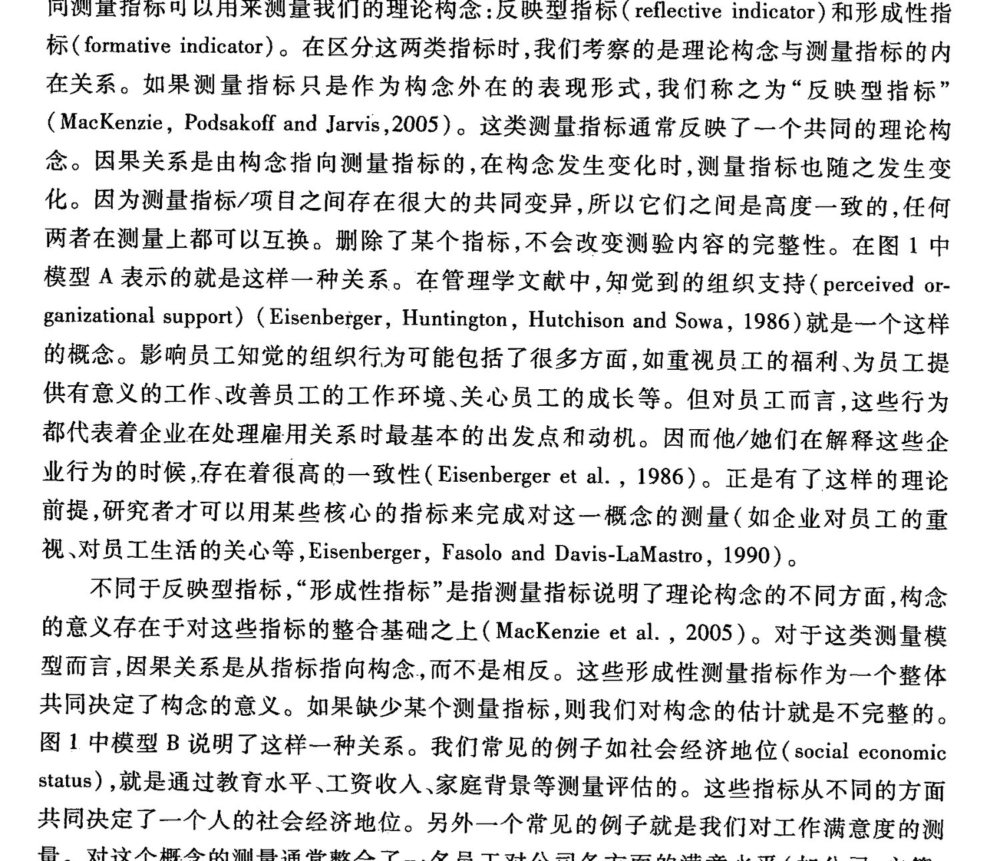

<!-- PDF页 246 -->

A El De 7 ws B DI =. <>图1 反映性指标和形成性指标与构念的关系.资料来源; MacKenzie, Podsakoff and Jarvis (2005).同事、收入等)。因为形成性指标反映了构念的不同层面,它们之间的相关性可能比较高,也有可能较低,特别是当我们使用相互排斥的形成性指标时。例如 Withey 和 Cooper (1988) 在研究雇佣关系中员工声音(voice)的时候,用了三个指标来测量员工在表达不满意时的方式:(1) 找主管谈话,努力地使事情变得好起来;(2) 把自己的想法投在建议箱内,以图解决问题;(3) 给政府机构写信,以寻找解决问题的途径。这三个指标之间可能就是相互排斥的,一个员工如果通过意见箱的形式表达了自己的不满,他/她就不大可能同时义与主管讨论同样的问题。2.2 WORE正是因为我们需要应用各种间接的指标对所感兴趣的现象进行推论,我们必须对开发出的测验量表进行评价,以确保它能够稳定地、有效地反映所要研究的对象。在测量中,我们把构念的定义与测验之间的一致程度称为构念效度 (construct validity) (Schwab,,1980)。我们对测量质量的评价主要是在评估一个测验的构念效度,以此来评价它在多大程度上测量了它想要测量的特质或行为。一般而言,三种情况会影响一个测验问卷的构念效度:研究者的操作性定义出现了偏差操作性定义没有充分地反映目标概念、测验问卷缺乏信度。为了便于理解,我们*

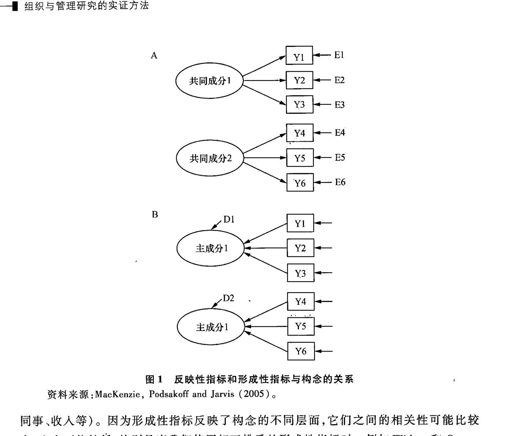

<!-- PDF页 247 -->

通过图2 来表示这些影响因素与构念效度之间的关系。图2 中上面圆圈所包含的区域表示在理想情况下一个测验应该包括的变异,也就是我们在没有误差情况下对目标构念的测量应该得到的分数。而图2 中下部圆圈所包含的区域则表示我们在实际测验所得到的变异分数。一个测验的构念效度就取决于两者共同交又的部分。两者交叉部分的变异越大,测验的构念效度就越高。当一个测验在实际测量中没有包含构念应该测量的成分时,我们称它没有充分地反映理论构念.是有“缺陷"(deficiency) 的。例如,我们发现中国管理背景下的组织公民行为(organizational citizenship behavior,,0CB)概念包含了注重人际和谐的成分,而这个成分在西方开发出的测验中是观察不到的。这时如果我们使用了国外的测验量表,则无法充分反映OCB 这个概念在中国组织中所应该包含的内容 (Farh, Earley and Lin, 1997; Farh, Zhong and Organ, 2004),到的成分理想情况下测量应该包括的变异理想测量的共同成分实际测量时包含的 er变异信度较低带来定义不准确的误差带来的偏差图2 测验的构仿效度及其影响因素而在实际测量中包含了构念并没有定义的成分时,我们称这一测验受到了“污染” (contamination)。测验的“污染”一般来自两种可能: (1) 测量中的随机误差变异 (random error variance)。一般而言,一个测验中包含的随机误差成分越大,它的信度就越低,实际测量的结果越不可靠(我们在稍后对信度有较为详细的讨论)。 (2) 测验包含了除目标构念外的系统性变异(systematic variance)。这一部分变异主要是由于研究者在操作理论概念时的不精确造成的。如我们常用的组织承诺量表 (organizational commitment) (Mowday and Steer,1979)就是这样的一个例子。 这一概念的操作性定义包含了三个成分:对组织目标和价值观的接受、愿意为企业的发展努力工作、希望保留组织的成员身份。其中第三项成分与我们常用的离职倾向(turnover intention) 高度相关。这样我们在测量组织承诺时,同时包含了离职倾向的内容,造成了测量上的混淆。根据上面的讨论,我们不难得出测验开发时研究者应该坚持的三条原则:第一,最大可能地包括目标概念中的各个成分;第二,发展出清楚的测量指标,使之能够最大可能地降低其他相关概念的影响;第三,努力控制随机因素对测验的影响,如测验当时的总=总 | ib ath ma | 233

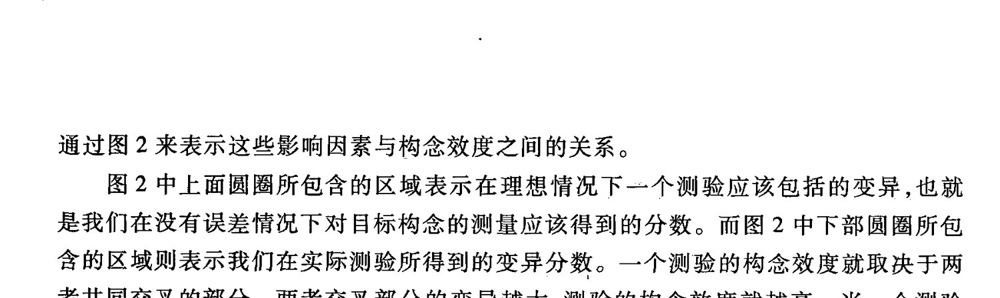

<!-- PDF页 248 -->

物理环境、被试的心情等。为了实现这样的目标,保证测验的构念效度,我们就需要注: 意在测验开发过程中的每一个操作步骤。三、测验量表开发的一般步骤开发一个具备构念效度的测验量表需要实现理论构念与测量指标/项目 (measurement ‘indicator/item) 之间的高度一致。如前所述,测验的构念效度是基于对测量结果的推论而得出的。为此,研究者需要通过一系列的研究设计去逐步验证测验的构念效度。这一过程中得到的支持证据越多,我们就越能保证所要测量的构念得到了恰当的估计。下面我们就详细讨论测验开发的各个步骤,以及每一步骤中应该注意的事项。3.1 构念说明 |开发测验的首要任务是要准确地、概括地定义我们所要测量的构念,清楚地说明构念的理论边界。一个好的构念说明(construct explication) 应该闹明所研究现象的核心特征,这是我们开发出高质量测验量表的前提。如果没有一个高度精确的定义,我们开发出来的测验必然是模糊不清的、不能令人满意的。一个构念只有当其他研究者都能够了解并同意它所包含的理论边界时,我们才可以认为对于这个构念的定义是充分的。那么,我们如何才能开发出一个合格的、充分的定义呢? | 从所用的语言上来讲,一个定义必须精确简练,不能使用星涩难懂的、带有歧义的、其至带有上比喻象征手法的语言。同时一个好的定义也不能使用重复定义的方法来完成,也就是说我们不能使用类似、相近的名词作为概念定义的一部分。除了以上两点语言上的要求外,结合现有的讨论(如 Pedhazur and Schmelkin, 1991;Klein, Danserau and Hau, 1994) 以及我们的理解,一个好的定义还应该着重说明所测量的构念在以下四个方面的特征:第一,明确解释所要测量的构念与其他相近构念的差异在哪里。换言之,研究者应该明确哪些方面应该包括在我们的构念中,哪些方面又应该排除在我们的构念之外。一个定义不能过于宽泛,也不能过于狭隘。一般而言,当一个定义包含了无关因素,可能会“污染"开发出的测验时,它就过于宽泛;但它如果噜除了应该包含的因素,可能会使开发出的测验有“缺陷"时,它就过于狭隘。我们在测验开发之前就需要说明所测量的构念与现有构念之间的区别。明确哪些成分是相关的,哪些成分是不相关的。第二,清楚地确认理论构念的层次。构念的层次是指我们在描述研究现象时所基于的层次,也就是我们希望做出研究结论的层次。例如,在研究个体的离职意向时,如果我们希望了解员工工作满意度的影响,这时我们感兴趣的构念就在个体层次;但如果我们关心部门气氛的作用时,感兴趣的构念就处于团队/群体层次。我们对构念的定义和说明决定了测量的层次,以及如何恰当地收集研究数据。如果构念定义在个体层次,

<!-- PDF页 249 -->

那么我们的测量就应该反映个体的认知和判断。如果构念定义在团队/群体层次,那么我们的测量必须能够反映该团队内所有成员共有的评价。有些时候,我们可能需要改变测量的指向对象来反映构念的层次。如在个体层次的测量中,我们可以用“我认为......”;但在群体层次的测量中,我们可能需要用“我们认为......”。所以在测量开发的第一步,研究者就应该定义、说明自己所研究的构念属于哪个层次。关于构念的层次问题,有兴趣的读者可进一步参考 Chan(1998)中有关参照物转换(referent shift) 的论述。

第三,在构念说明时,我们需要确认它所应包含的内部成分。一个构念的内部成分可能会影响我们如何发展测验指标或项目、指标的多少以及指标的抽象程度。例如,如果所要测量的构念是单一维度(uni-dimensional) 的,那么我们发展的指标应该比测量多个维度(multi-dimensional)时更加抽象。所以介绍理论构念的内部结构也是我们对其操作化的一个必要步骤。本书在第十二章会对这一问题进行专门的论述。

第四,说明构念主要的前因、相关与后果。我们发展构念对其进行测量的最终目的就是探讨构念之间的关系。为了更好地服务于这一目的,我们应该说明目标构念与其他构念间的因果关系。这是构成研究假设、推论测验的构念效度的必要成分。

对理论构念说明的一个很好的例子就是 Organ (1988) 对组织公民行为(OCB) 的定Mo Organ 首先把 OCB 定义为“一种自愿性质的个人行为,组织内的正式奖励机制并没有正式地或直接地认可这种行为,但这种行为在整合后可以促进企业整体的有效运作” (1988:4)。在这一定义的基础上,Organ 进一步阐明 OCB 作为一种亲社会行为(pro-social behavior),在日常工作中有五种常见表现形式:责任心(conscientiousness)、利他主义(altruism)、运动员精神(sportsmanship)、礼节 (courtesy) 和公民美德(civic virtue)。在这个例子中,Organ 清楚地说明了 OCB 是一种个体行为,它区别于一般的绩效概念,同时对企业整体绩效有积极作用。同时它是多维度的,不只有单一的表现形式。这样的构念说明清楚地定义了 0CB 的理论边界,为测验的发展葛定了很好的基础。3.2 产生测验项目

在确定了构念的边界后,我们就可以在此基础上对其进行操作化。一般而言,我们可以遵循两种不同的取向发展测验指标/项目:归纳法(inductive approach) 和演绎法(deductive approach)。在归纳法中,研究者通常对所要了解的现象知之其少,所以无从了解操作相关概念时所需要的关键指标及其内部结构。在这种情况下,研究者需要通过定性方法去了解测验的内容,结合现有的文献,产生测验指标。这是一种“由下而上”开发测验的模式(Hinkin, 1998)。而基于演绎法的测验发展模式则截然不同。研究者一般通过文献回顾就可以确认理论构念涵盖的范围,这时通过自己对概念的理解发展或改编现有的测验项目就可以实现对构念的操作化。这是一种“由上而下” 的测验开发。模式(Hinkin, 1998),

这两种方法的不同也导致了研究者在开发测验时任务的不同。在归纳法中,研究

. = 理论构念的测量 | 235

<!-- PDF页 250 -->

者需要通过各种方法收集关于构念内容的描述,分析这些描述,并进一步确认这些描述的内在结构。研究者一般可以借助五种方法来收集原始素材,确认构念的边界:关键事件法(critical incident)、小组面谈法(focus group interview)、 个人面谈法(personal interview)、开放式问卷法(open-ended survey) 和二手资料法(secondary data)。而在演绎法中,测验项目完全是根据研究者对构念的理解而发展出来的。相比而言,研究者在应用归纳法开发测验时需要付出更多的精力,面临着更多的挑战,例如所接触的样本是否有足够的代表性,内容分析的步又是否有缺陷等。

本书第八章提到的 Farh 等人(1997)与 Rotuado 和Xie(2006)的研究均是“由下而上”归纳法的范例。在这两个研究中,研究者需要了解中国员工心目中的组织公民行为和反生产力的行为(counterproductive work behaviors, CWB)概念。为此,他(她)们广泛地征求符合这些行为定义的例子,在此基础上进行第选、分类、发展出初步的量表。应该指出的是在研究的第一步——收集行为例子的时候,他(她)们均向参与者提供了清楚的定义以及几个例子,然后要求参与者提供他/她们在日常工作中观察到的 OCB 或CWB 的事例。以此为基础,他/她们了解了这些行为在中国员工身上表现出的特点,开发出了适合中国管理情景的测验量表。这就是我们稍后讨论的测验本土化.情境化的具体体现。“由上而下”演绎法在发展测验时则更为多见。例如在 Management and Organization Review 2006年第3 期中,Wu 等人发展出的互惠规范量表,Xiao Hl Bjorkman FF发出的高投入工作系统量表都遵循了演绎法发展测验的步骤。这些作者都是在详尽的文献综述基础上,确立了目标概念的理论边界,以此为基础发展出与之相匹配的测验项目。

我们需要强调的是这两种方法都可以帮助研究者开发出高质量的测验量表。研究者可以根据对研究现象的了解程度而有所选择,有时候也可以将两者结合使用。例如Bennett 和 Robinson(2000)在为工作不良行为(workplace deviance behavior)开发测验时就结合了两种方法。与 Rotuado 和 Xie(2006)的反生产力行为类似,他们把工作不良行为定义为那些违反了组织规范、对企业或其他员工造成负面影响的自发性工作行为。不同于上面提到的例子, Bennett 和 Robinson 通过三种途径建立了测验项目库 (item pool):首先,他们访谈了 70 个员工,要求这些员工就身边同事的日常表现,提供两个工作不良行为的事件(incident);其次,他们把自己的理论框架呈现给管理学专业的学生,要求学生们写出符合定义的例子;最后,他们基于 23 篇相关研究论文,自行开发了测量项目。 结果,通过对这三部分内容的分析,他们得到了 113 个行为描述。这种发展测验的方式既保证了测验的内容效度,同时也提高了测验在应用时的表面效度(face validity)。

无论通过哪种途径,研究者在这个阶段的目的是发展出足够的测验项目/指标,使得它们足以涵盖构念的理论边界。Clark 和 Watson(1995) 推荐了在发展测验项目的两条指导原则: (1) 测验项目/指标应该比目标构念包含更广; (2) 测验项目/指标应该包

<!-- PDF页 251 -->

会一些最后被证明是无关紧要的,或者其至与目标构念不相关的内容。Clark 和 Watson之所以提出这两条原则,是因为如果我们在这个阶段开发出的测验项目/指标无法充分地体现所要测量的现象,任何随后的基于心理测量学的定量分析都于事无补。而那些无关的测验项目,却可以通过定量分析加以删除。所以在开发测验项目时,无论采用哪一种开发思路,研究者唯一需要遵循的原则就是开发出与概念定义的内涵相匹配的、足够多的测验项目或指标。这是保证测验内容效度的前提。3.3 ”内容效度的评价:

在发展出测验指标库后,研究者的任务是对这些指标进行基于心理测量学的评价,以删除不能反映目标构念实质的、容易引起误解.影响测验质量的项目。我们首先要评价的就是测验指标的内容效度(content validity)。内容效度是指测验内容在多大程度上反映或代表了研究者所要测量的构念(Haynes, Richard 和 Kubany, 1995), 简单地讲,我们开发的测验在内容上是否包含了我们想要评价的东西。 在三种情况下,测验的内容效度可能会受到损害:(1) 遗漏了一些反映构念内容的测量指标; (2) 包含了一些与构念内容无关的指标; (3) 在佰计构念的不同成分对测验分数的影响时出现偏颇(Haynes 等,1995)。当我们对一个构念的测量涵盖了它的所有层面及意义时,我们称所使用的测验是具备内容效度的。

一个测验的内容效度是建立其构念效度的必要前提。 具有较高内容效度的测验包含了我们所要考察构念的关键成分。 为了开发出具有内容效度的测验问卷,研究者必须依循一定的理论架构,选择能够完整涵盖研究范围的测验指标,这样才能使测验问卷具备充分的内容效度。 在实践中,我们可以通过定性或定量的方法去评价一个测验的内容效度。 定性评价的方法是指通过一组专家就某个构念的测量是否符合他(她)们对此构念的认识进行主观判断。 一般而言,在定性评价时我们应该着重于以下几个方面:第一,检查每一测验指标是否具有代表性,即它们与所界定的内容或行为范围之间是否适当相关;第二,测验内容是否涵盖了所研究对象的理论边界;测验指标是否与构念定义之间实现——对应;第三,测验指标的分配比例是否反映了所研究构念中各个成分的重要性。测验指标不能太少或太集中于构念的某一个成分。

近年来,研究者也开始讨论如何从定量的角度讨论测验的内容效度。 这里我们推荐两种简单易行的方法。 第一种方法是直接评价测验项目与构念定义的匹配程度。在;这种方法中,研究者让一组被试阅读构念的定义和测验的指标,并逐一评价它们之间的还配关系。最后根据被试正确匹配的比例,确定测验指标的内容效度。Schriesheim 和Hinkin(1990)首次应用了这种方法。他们的做法主要包括了三个环节:; (1) 选择了 34名高年级的商学院大学生作为评价者。(2) 研究者将构念定义和测验指标呈现给这些学生,要求他/她们把每个测验指标分配到所反映的构念中。 如果菜个指标只反映了某个构念,则在相应处标“X”;如果这个指标同时反映了多个构念,则在最接近的构念下

| ReHSORE | 237

<!-- PDF页 252 -->

标“1”,次接近的构念下标“2”,以此类推。如果认为它与所有的构念都无关,则将它归为“其他”。(3) 根据测验指标反映构念定义的程度,研究者为每项评价分配了一个权重分数(如X和1计作“3”分,2 计作“2”分等)。在此基础上,计算各个指标在每个概念定义上的得分。最后将得分进行加总,得出每个测验指标反映各个概念的百分比。如果一个测验指标能够在所要测量的构念上得分超过 60%,就认为它具有良好的内容效度。由此,研究者可以判断哪些测验指标比较清楚地反映了所要测量的构念,应该予以保留;哪些指标没有反映所要测量的构念,应该予以删除。这种方法简单易行,评价者仅仅需要从认知上判断构念定义和测验指标间的关系,一般大学生都可以胜任。

在 Schriesheim 和 Hinkin(1990)的方法中,研究者对测验内容效度的判定是相对主观的。例如某个指标在所要测量的构念上的得分达到了 60%,但在另外一个构念上的得分达到了 40%,这时我们很难认定这个指标的内容效度。在这种情况下,Hinkin 和Tracey(1999)提出的方法就比较适用。他们提出测验指标的内容效度可以通过评价它们的区分度来实现:一个指标在目标构念的得分应该显著地高于它在其他构念上的得分。他们的方法也包括了三个步骤:(1) 选择一批大学生作为被试; (2) 将构念定义和测验指标呈现给这些学生,但不再要求他(她)们判断构念定义与指标的匹配程度,而是要求他(她)们在 Likert 量表上判断测验指标在多大程度上反映了各个构念(如“1一一根本没有”到“5一一完全反映”);(3) 最后通过方差分析(analysis of variance),比较某个测验指标在各个构念上的得分来判断它的内容效度。如果它在所要的测量构念上的得分显著地高于在其他构念上的得分,就证明这个测验指标是有效度的。与第一种方法类似,这种方法同样只需要一组大学生作为被试。但它采用了 Likert 量表进行测量,并通过方差分析程序对测验指标的内容效度进行具有假设检验性质的判断,因此在研究方法上更加严谨。;

最后值得指出的是,尽管近年来研究者提出了多种检验内容效度的定量分析方法,但这些方法只能找出那些缺乏效度的测验指标,并不能发现测验内容上的缺陷。在评价内容效度的时候,我们不应过分依赖这些定量的方法。

### 3.4 ”内部结构的检验

在测量时,我们需要根据被试对各个指标的反应,得出一个测验分数作为对所测量构念的估计。在计算这一分数时,我们需要这些测验指标必须反映同一个理论构念,这时所得出的观测值才是有意义的。测量指标的单一维度性(uni-dimensionality) 是我们在测量理论中一个最为基本和关键的假设(Gerbing and Anderson, 1988)。在评价测验内部结构时,我们主要是通过探索性(exploratory)与验证性(confirmatory) 因素分析的。

探索性因素分析是在测验开发中经常应用的一种方法。当对测验的内部结构(internal structure) 缺乏清楚的理论预期时,研究者通常会将所有的测量指标一起进行因素分析,再由所得到的因素负荷(factor loading)值来判断构念效度的好坏。若测量同一维

<!-- PDF页 253 -->

度的指标因素负荷量越大(通常需要高于0.4),同时在其他维度上的因素负荷越小,则表示该测验的构念效度愈高。通过探索性因素分析,我们可以发现与测量内容没有关系的指标(如因素负荷非常低),或者不符合研究者预期的指标(如出现负向的因素负荷或最大负荷没有落在所测量的因素上等)。根据这些信息,研究者可以识别内部结构,建议哪些指标应该被剔除,哪些维度应该增加指标等。在删除了不合格的测验指标后,研究者需要重新收集数据,执行因素分析程序以进一步确认测验的内部结构。

因为探索性因素分析没有很强的理论指导,它只适合在测验开发的初期使用。在我们对测验的内部结构(如因素负荷、洪变量间的相关等)有了比较清楚的预期时,验证性因素分析是最为直接的、带有假设检验性质的分析方法。不同于探索性分析,验证性因素分析强调对测量模型的限定,在消除测量误差的情况下观察测验指标与假设模型的契合程度(model fit)。如果估计的模型与抽样数据得到很好的身合,我们可以认为测验的构念效度得到了支持。如果两者的契合度较差,我们可以观察模型估计过程中产生的修正指数(modification indices),考虑是否可以通过改变某些限定条件提高模型的自合度。有关探索性和验证性因素分析的差异,以及对两者适用条件的讨论本书在第十二章中将有单独的介绍。.

值得注意的是,因素分析对反映性指标和形成性指标都是适用的,但含义并不相.同。就探索性因素分析而言,对反映性指标的分析在于解释测验指标间的相关,估计这些指标与共同成分(common factor) 闻存在的共同变异;但对形成性指标的分析则在于通过测验指标产生一个主要成分(principal component),估计这些观测指标在形成这一成分时的不同权重。就验证性因素分析而言,如我们前面讲过的,由于两类指标在测量性质上的差异,所以测量指标与潜变量之间的因果关系是不同的。 在反映性的测量模型中,因果关系是由共同成分指向它的测量指标。而在形成性的测量模型中,这一关系由测量指标指向它们所估计的主要成分。 由于这一性质,形成性指标的测量模型是无法估计的。为了实现对其的估计,研究者通常需要在模型中增加两个或两个以上的反映性指标。对于形成性测量模型的估计问题有兴趣的读者可参见 Diamantopoulos 和Winklhofer(2001) #fi MacKenzie 等(2005)。3.5 ”内部一致性与稳定性的评价

一个测验除了要在内容结构上符合概念定义外,它还必须能够稳定地、精确地测量我们感兴趣的构念。在测量中,我们用“信度”来评价测验结果的一致性(consistency)、稳定性(stability) 及可靠性,估计测量误差对整体测验的影响。 美国心理学会把信度定义为“测量结果免受误差影响的程度”(American Psychological Association, 1985;19),换言之,我们是通过测量误差来估计一个测验的信度的。 信度可以理解为真实分数在测验得分中的比例。测量的随机误差 (random error) 越大,则我们测验得分与真实分数之间的差距愈大,所得到的测量结果也就是缺乏信度的、不可靠的。 一个具备良好信度

Sto | 理论构念的测量 | 239

<!-- PDF页 254 -->

的测验不能带有太多的随机误差。因为测验的真实分数与误差都是没有办法直接测量的,所以我们无法直接计算信度系数,只能通过间接的方法对其进行估计。第一种方法是我们同时发展两份等效但不完全相同的测验(parallel forms),每个被试需要同时回答这两份测验。测验结果之间的相关系数越高,就表示该测验的信度系数也越高。这种方法需要研究者发展两套测验,而被试也需要更多的时间和精力去完成测验。实施起来比较困难,容易引起被试的反感,所以在管理学研究并不常用。第二种方法是评价测验的内部一致性(internal consistency),也就是评价测验指标之间的同质性。常用的评价方式有三种:(1) 折半信度(split-half reliability),即把用来测量的问题或测验,分为数目相等的两半(如奇数题组和偶数题组),独立计分,然后计算这两组题目得分的相关性。(2) 库李信度(Kuder-Richardson formulas 20 and 21, KR- 20, KR21)。这是一种针对是非选择题型(如答对计1 分,答错计0 分的二元计分法)的信度估计方法。现在已经不大使用。(3) 我们最常用的评价指标是针对 Likert 式量表开发的 Cronbach's a(Cronbach,1951)。这种信度系数可以用下面的数学公式加以a= ab _ | el Soi +2(Se,)在这个公式中, To? 代表测验指标或项目i 的变异量, 0 代表测验指标或项目i与j间的共同变异量,% 则指测验所包含的指标/项目数。当这些指标完全不相关时,它们的共同变异量为零,测验的信度为零;测验指标间相关性越高,它们的共同变异量越大,测验的信度也随之增大。在实际应用中,我们一般要求 Cronbach a 的值至少要KF 0.70 (Hinkin, 1998)。但近来,管理学者已对 0.70 标准提出了质疑。有兴趣的读者可参看 Lance,Butts 和 Michels (2006) 中关于信度临界值(reliability cutoff) 的论述。但是我们应该注意不是内部一致性系数越高越好。在发展测验时,研究者应该注意平. 衡内部一致性和内容完整性之间的关系。通常情况下,当一个测验的内部一致性系数超出了一定水平时,它不但不会有利于构念效度,反而会前弱测验的内容效度(Clark and Watson, 1995)。过于重复的测验指标或项目往往意味着研究者在发展测验时没有充分地选取内容样本。有些研究者为了获得较为理想的内部一致性系数,往往会删除很多在内容上符合概念定义的测验指标。这种以牺牲测验内容完整性来实现内部一致性的做法是不可接受的。当研究者无法获得理想的内部一致性系数时,应该首先检查测验指标的内容是否清楚、数量是否足够等。如果这些检查无法奏效时,研究者可以进一步考虑开发多维度测验的可能性。第三种估计信度的方法是在两个不同的时间点,使用同一个测验,对同一组参与者施测,两次测量所得结果的相关系数就是重测信度(test-retest reliability), PUR WEA

<!-- PDF页 255 -->

果的相关性愈高,则董测信度越高,我们就可以认为该测验的稳定性愈高。内部一致性评价的是被试在各个测验指标上得分的一致程度。而稳定性评价的是在不同时间点对被试进行同样的测量时,测验结果的稳定程度。如果我们在测量中使用形成性指标时,

由于这类指标用于测量一个构念的不同方面,这时评价它们的内部一致性往往并不是特别的适当,所以评价这些指标在测量上的稳定性就成为估计测量误差的必要程序。

但研究者应该意识到重测信度经常会受到一些干扰,例如受访者也许记得特定的问题,

所以就回答和第一次测量时相同的答案,因而产生高估的信度系数。或者所测量的变,量在测验间隔期间内发生了变化,因而降低了对测验信度的估计等。

### 3.6 ”聚合效度和区分效度

对测验内部结构和测量误差的分析只是保证其构念效度的一个必要条件,但不是充分条件。例如在测量一个单一维度的概念时,通过因素分析和信度分析,我们发现所有的指标在潜变量(latent variable)上因素负荷都非常高,测量误差也比较小。但由于洪变量是无法直接观测的,我们无法确认这些指标产生的潜变量就是我们所要测量的构念,而不是其他一个相近的构念。 特别是当测验结果来源于同一种方法或同一组被试时,我们无法确认测验的结果是反映了我们感兴趣的理论构念,还是由于同一种测量方式而带来的共同变异。为了消除这些疑虑,Campbell 和 Fiske (1959) 提出了聚合效度(convergent validity) 和区分效度(discriminant validity) 的概念。 聚合效度是指在通过不同方式测量同一构念时,所观测到的数值之间应该高度相关。 例如,在评价员工职业能力时,无论使用笔试还是口试,所得的分数应该高度一致。 而区分效度则是指在应用不同的方法测量不同构念时,所观测到的数值之间应该能够加以区分。也就是说当我们用不同的方法去测量两个不同的构念时(如焦虑和内向),它们之间的相关性不应该太高。

在检验一个测验的聚合效度和区分效度时,最为常用的统计方法是由 Campbell 和Fiske(1959)提出的多特质一多方法模式(multi-traits multi-methods, MTMM), MTMM是指用不同的方法(例如:自评法 vs. 同伴评分法;调查法 vs. 观察法)同时测量两个或以上的特质。 这种由多种特质、多种测量方法得到的相关算阵,我们称为 MTMM 矩阵。当用不同的方法去测量相同的特质时,所得的相关系数应该比较高,这时我们认为测验有较高的聚合效度。 同时当这一相关系数高于用不同方法测量不同特质时得到的相关系数时,我们认为所研究的特质与其他特质在测量上是可以区分的。 我们所观测的数值来自于变量本身,而不是由于相同测量方式而带来的变异。 我们在应用 MTMM EVO合效度和区分效度时,主要的依据是变量间的相关和矩阵。

Law, Wong 和 Song(2003)采用了 MTMM 的方法检验他们开发的情绪智力 (emotional intelligence) 量表。 在研究中,他们分别使用了学生样本和员工样本。 在这里我们通过他们对学生样本的测量来说明如何使用 MTMM 的方法来验证测验的聚合和区分效

. 六+总 | 理论构念的测量 | 247

<!-- PDF页 256 -->

度。他们采用了两种测量方式(学生自评和家长评价),同时测量了六种特质(学生的情绪智力和“大五”(Big-Five)个性特征)。表1 是根据学生样本得到的 MTMM 和矩阵。在表1 中,在细线三角形内的数字表示了由不同特质一相同方法(heterotrait-monomethod)得到的相关系数,这些相关系数有助于我们估计共同测量方法对测量结果的影响。粗体的数字表示了相同特质一不同方法(monotrait-heteromethod) 得到的相关性。在这个例子中,我们发现学生自评与家长评价的情绪智力相关系数为 0.28,不算太高,但仍达到了统计上的显著性水平,可以说明该测验具有一定的聚合效度。在粗线三角形内的带下划线的数字则表示了由不同特质一不同方法(heterotrait-heteromethod) 得到的相关性。我们可以发现,这些相关系数均低于0.28,从而为其测验量表的区分效度提供了证据。Rl 6特质 X2方法的MTMM HARK自我评价家长评价on M sD EI NEURO EXTRA OPEN AGREE CON EI NEURO EXTRA OPEN AGREE CON自我评价: ET 3.60 0.46 (0.78) * NEURO 3.67 0.93 |-0.3%(0.77). EXTRA 4.74 0.94] 0.15 -0.08 (0.80) OPEN 4.93 0.95} 0.30 -0.12 0.3 (0. 82) AGREE 5.21 0.74] 0.26 -0.36 0.29 0° (0. 83) CON 5.04 0.77] 0.55 -0.46 0.10 0.27 O7K(0.86)家长评价EI 3.57 0.45 ~0.28 -0.12 0.00 0.01 0.02 0.22,¢0.81) NEURO 3.56 0.98 |-0.TEN 0.34 0.04 -0.02 -0.18 -0.20]-0. 30.0. 79) EXTRA 4.65 1.04] 0.06 -0.0 0.37 0.21 0.02 -0.02| 0.00 0.08~Q.83) OPEN 4.28 1.10] 0.15 -0.04 Oo. 0.32 -0.10 0.08] 0.15 0.08 0.5: 0.85) AGREE 5.34 0.88] 0.07 -0.14 0.01 -0.0 0.20 0.14] 0.16 -0.16 0.28 0.09~(0.85) CON 5.13 0.95 | 0.17 -0.11 -0.13 -0.02 0.0 0.34| 0.42 -0.21 0.11 0.24 0.58~(0.9%0)

Notes; EI = emotional intelligence; NEURO = neuroticism; EXTRA = extraversion; OPEN = openness; AGTEE = agreeableness; CON = conscientiousness。对角线上的数字为系数 a值,以斜体标识的数字位于不同特质一相同方法三角形中,以下划线标识的数字位于不同特质一不同方法三角形中,以黑体标识的数字是相同特质一不同方法的结果。

资料来源:Law, Wong 和 Song (2003)。

随着结构方程建模(structural equation modeling,SEM)技术的成熟,研究者也将其作为检验测验效度的一种重要手段。如前所述,作为检验测验构念效度的先决条件,假设的理论模型需要与抽样得到的数据很好地奥合,测验指标在所要测量的构念上的因素负荷量应该很高。但仅仅有良好的模型身合是不够的。研究者需要进一步检验测验与其他相关测验之间的区分效度。一个应用 SEM 来检验测验区分效度的例子是Mathieu 和 Farr(1991) 的研究。他们检验了组织承诺、工作参与度(job involvement) 和工作满意度(job satisfaction) 三种工作态度测验之间的区分效度。他们的方法分为两个步怠:首先,他们通过合并潜变量,生成并比较三种不同的测量模型:一个潜变量模型(所

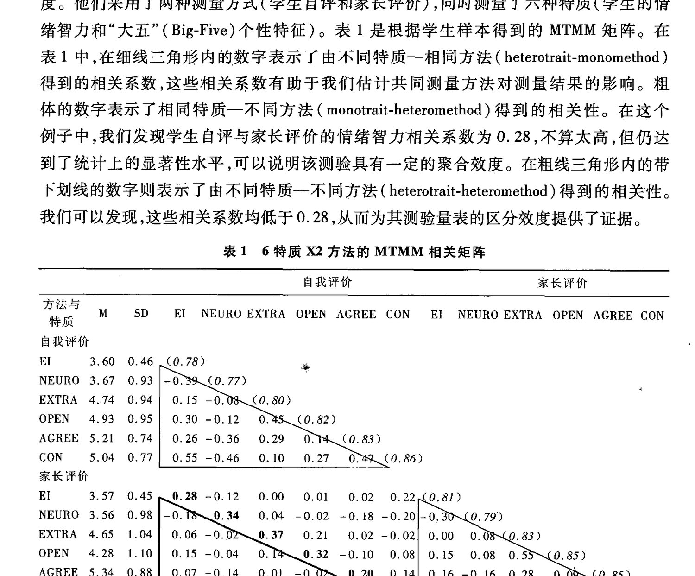

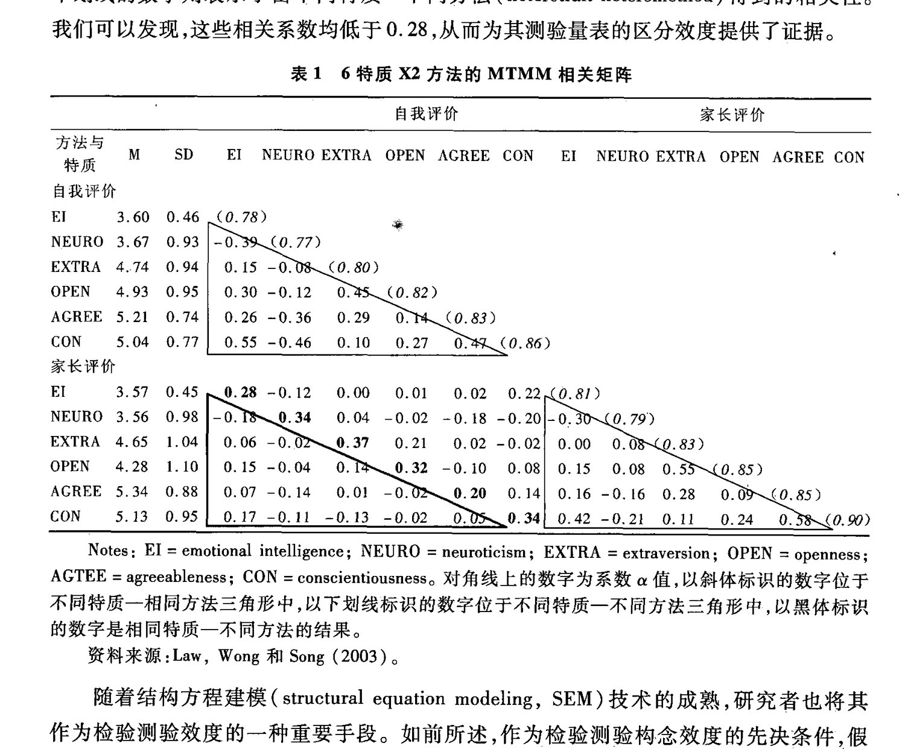

<!-- PDF页 257 -->

有的指标都测量同一个潜变量,即这三个测验是不可区分的)、两个潜变量模型(合并三个潜变量中任意两个) 三个潜变量模型(假设的基准模型)。他们的结果发现三个潜变量模型与数据的契合程度最好。再次,他们进一步比较了这三个变量与一组相关变量之间的关系(如工作压力、工作权限等)。如果这三个变量是不同的,那它们与其他变量之间的相关系数应该是有差异的。因此,他们比较了两组结构方程模型:一组将这三个变量与其他变量的相关系数设定为相同,一组是允许自由地估计这些相关系数。结果他们发现第二个结构方程模型与数据实现了较好的契合,从而再次证实这三个变量在测量上是可以区分的。

从上面的例子可以看到,在验证测验的聚合和区分效度时,MTMM 得到的证据具有较强的说服力,但它的设计较为复杂,操作较为困难。而运用 SEM 则比较直接,对样本要求相对较低,尤其适用于检验测验的区分效度。一般而言,在研究者讨论变量间因果关系之前,我们希望看到这些变量在测量上是可以区分的。变量间的区分效度是我们推论其因果关系的前提。有兴趣的读者可进一步通过阅读 Kline(2004)与修杰泰、温忠启和成子娟(2004) 的文章来学习 SEM 的概念与实际操作。

### 3.7 逻辑关联网络的建立

在研究中,通过多辑分析和文献回顾,我们可以对变量间的关系做出符合理论预期的假设,构建变量间的逻辑关联网络(nomological network)。通过相关分析、回归分析或结构方程等统计工具,我们可以对这些关系进行检验。如果发现观察结果与研究假设一致,即使用新开发的测验,可以得到与理论预期一致的变量间关系,这时我们就可以认为新开发的测验具备构念效度。不同于前面的步骤,逻辑关联网络的建立侧重于从变量间的因果联系中推论测验构念效度的高低,而非单纯地评价测验指标或项目的质量。

在我们前面提到的例子中,研究者大多提供了这方面的证据。如 Organ 等认为OCB 是一种自发性的个人行为,同时有助于提高企业的整体绩效。所以研究者就个性特征、工作满意度、组织公平感等变量解释 0CB,而用个体工作绩效和组织绩效来观察OCB 的结果(Organ,Podsakoff and MacKenzie, 2006)。而 Law 等人(2003)用学生的生活无助感、员工的任务绩效、工作奉献(job dedication)和人际促进(interpersonal facilitation)来检验情绪智力在不同环境中的作用。在这些例子中,研究者通过构建变量间诺六网络的方式,用已经得到证明的效度概念和测验去检验新测验(如 0CB 和情绪智力)的效度。这也是我们为什么强调在构念说明阶段就应该说明所测量构念的前因、相关和结果。

### 四、中国管理学研究中的测验开发取向在管理学研究中,我们在应用测验量表时一般都会面临两个问题:第一,我们是要Ste | ita Wa | 243

<!-- PDF页 258 -->

开发新测验,还是翻译,修改国外已经使用的测验? 第二,我们开发出的测验是应该反映中国管理情境的特殊性,还是应该追求它在各种文化背景下的普遍适用性? 根据这两个问题,Farh,Cannella 和 Lee(2006)总结了在中国管理研究中测验开发的四种常见思路。第一种思路就是强调文化适用性的原则,将国外的测验直接翻译成中文;第二种思路是在翻译国外测验的过程中,修改不适合中国情境的部分,以使它们能够与我们研究的背景统一。其余两种思路则强调了在中国管理情境中开发新的测验。第三种思路强调发展出能广泛适用于各种文化情境下的测验量表;最后一种思路就是致力于开发出能够准确反映、描述中国管理情境特殊性的测验。我们用表2 来表示上面谈到的四表2 中国管理研究中测量开发的四种取向对文化特殊性的预期文化适用性文化特殊性已有的测验 (translation approach) (adaptation approach) (de-contextualization approach) (contextualization approach)资料来源:Farh,Cannella 和 Lee (2006)。表2 中列出的四种思路均在中国管理研究中发挥了很大的作用。但从上面的表述可以看出,它们在开发测验时所应用的指导原则是非常不同的,各有其优缺点。我们就.这四种思路进行逐一探讨,以便研究者能够根据自己的研究目的,选择合适的方法,开发出高质量的测验。我们在表3 中对这四种思路的关键假设优点以及局限性进行了表3 中国管理研究中测量开发的四种取向:假设.优点和局限测量开,发取向关键假设主要的优点主要的局限。 目标概念的定义、测量内容以。 节省时间和成本;。 翻译时很难实现测验在及测量采用的指标在不同的文。 可以直接就研究结果进。 语意上的对等性;直接翻。 化背景下是相同的; 行路文化比较。 很难在西方文献找到完译取向。所翻译的西方量表是高质量全没有文化偏差的测验的,并且没有文化偏差。 目标概念的定义和测量内容在。 相对而言,省时省力;。。 很难进行跨文化的比较不同的文化背景下是相同的;。 比较容易地就研究结果 “和研究;修改。。所翻译的西方量表是高质量的。 ”进行跨文化的沟通。”。 修改过大将变成一个新取向工具,要求重新验证它在中国背景中的效度

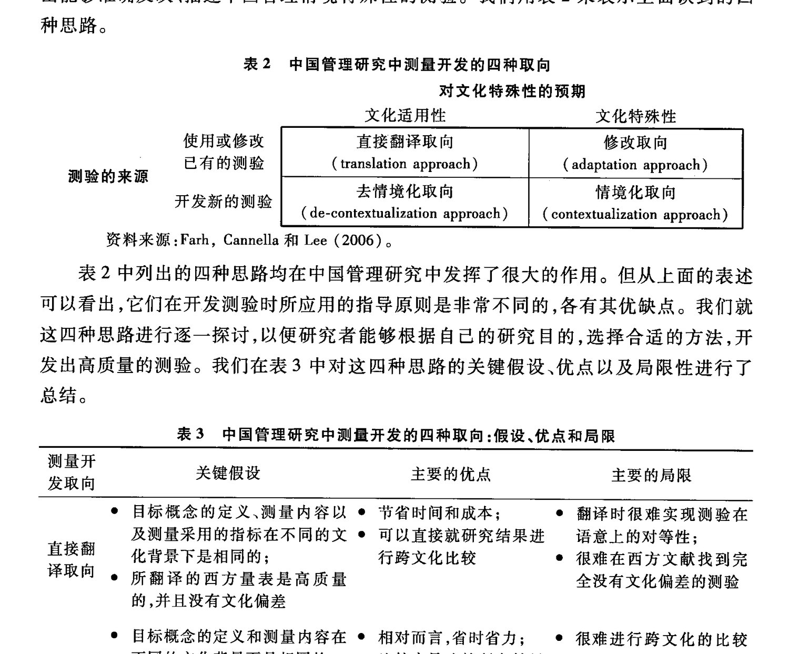

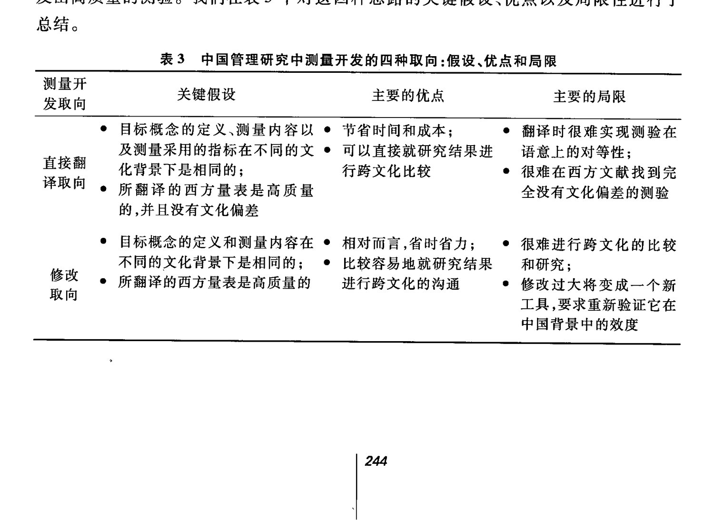

<!-- PDF页 259 -->

(续表)测量开 >,。 所测量的概念适用于多种文化。 能够发展出广泛适用的。 需要较长的开发时间和背景,或者文化背景对其影响 WH; 较高的成本;去情境 RK,。 比较容易地就研究结果。 测量指标需要有较高的.化取向。缺乏一个心理测量指标良好的。 ”进行跨文化的沟通抽象水平,限制了所包含”测验的文化环境的特殊性。 所测量的概念与文化环境密不。 能够发展出高度适合中。 需要较长的开发时间和可分; 国背景的测验; 较高的成本;情境化 “。 缺乏一个心理测量指标良好的。 能够发展出直接应用。 开发出的测验有地域的取向测验于、适合中国管理背景。” 局限性;的知识。 很难进行跨文化的比较和沟通资料来源:Farh,Cannella 和 Lee (2006). 4.1 直接翻译取向直接翻译法是指将国外研究者开发.使用的测验量表直接翻译成中文,并应用于中国管理学研究中。直接翻译法在中国情境下的效度需要两个重要的假设基础:(1) 我们记测量的理论构念在不同的文化背景下是对等的,至少在我们研究的目的地(中国)和测验的来源地是对等的。构念的对等性(construct equivalence) 在文献中有不同的表述方式。在这里,我们强调的是概念的定义、测验的内容以及测验采用的指标在不同的文化背景下是相同的。(2) 我们所要翻译的测验是经过严格程序开发的,已有足够的证据支持它的构念效度。正是因为直接翻译法省去了对测验构念效度的检验过程,我们必须能够保证所翻译的测验是经过验证的,而且在不同文化背景下的测量实施过程中不会出现偏差。由于比较缺乏在中国情境下经过严格程序开发出来的测验,而且管理学研究大多被西方的范式所影响,所以我们不难发现直接翻译法在目前的中国管理学研究中最为常见。例如 Wang, Law, Hackett, Wang 和 Chen(2005)讨论了上下级交换关系(leader member exchange) 在变革性领导(transformational leadership) 与员工绩效和组织公民行为之间的中介作用。他们对四个关键变量的测量都是通过翻译国外的量表实现的。Lam 和 Schaubroeck(2000)通过一项准实验研究发现控制点(locus of control) 对香港员工在公司普升决策做出后的调节作用。其中,他们对控制点、组织承诺、工作投入度、工作满意度以及离职意向等变量的测量都是通过翻译西方的测验量表实现的。在满足了使用直接翻译法的两点假设后,我们通过翻译,使用具有较高的效度的测验,可以省去测验开发所需的时间、精力和资源。而且我们可以将得到的结果与国外的发现进行比较,共同推动管理理论的发展。第十一室 | 理论构念的测量 | 245

<!-- PDF页 260 -->

但由于中西方深层的差异可能会体现双方语言的差异,所以研究者在翻译国外的测验时可能会遇到很多困难。如果没有恰当地解决这些问题,研究结论的可靠程度很有可能会受到影响。首先,由于东西方文化的显著差异,有时我们很难实现恰当的翻译。现在普遍应用的翻译方式是首先将测验翻译成中文,然后由其他对测验不熟悉的人将中文翻译成原来的语言(Brislin, 1980)。但是在翻译过程中,由于要考虑测验被再次翻译的问题,测验在第一阶段的翻译往往过分地拘泥于句面的意思,而较少关注最恰当的翻译方式。这一特点有时可能会造成翻译中的误差。如在翻译 Ang 等人(2007)开发的文化智力(cultural intelligence)测验时,最初的英文表达为: I change my verbal behavior (e. g., accent, tone) when a cross-cultural interaction requires it.:在将其翻译成中文时,一名博士生最初的翻译是:在跨文化交往需要时,我会改变自己的言语行为(如重音、语调)。另一名博士生将上述的表达重新翻译成英文: I will change my verbal behaviors (e.g., accent, intonation) when it is necessary in cross-cultural interaction.从上面的结果来看,翻译的结果基本实现了测验项目语意的对等性,但很显然,这并不是一句通顺的中文。我们修改后的中文翻译是:在跨文化交流时,我会按照情境的需要,调整自己的语调(如口音、语气)。由于过多地顾及了翻译后的中文能否被重新翻译成原来的英文,中西方语言习惯的差异致使翻译的测验项目往往不是最佳的中文表达方式。这样的测验在应用中可能会影响到数据收集的质量。其次,研究者遇到的第二个困难是翻译过程有时只能实现语义的对等性,而无法解决目标构念在不同文化背景下概念解释上的不对等性(Hambleton and Patsula, 1998; Harkness, 2003)。由于国外研究中发表的测验大多并不是用于跨文化研究的目的,所以这些问卷可能含有只适合西方文化的某些特质。如果这些特质通过简单翻译的方式引信到我们的研究中,就会造成测量上的误差。而且西方背景下发展出的构念在中的管理情境中并不一定是重要的、有意义的。这种担心在比较客观的测量中影响可能不大(如组织结构、战略和绩效等),但很有可能影响一些基于心理判断性质的概念(如动机、承诺和组织公平等),因为人们对这些概念的理解是与其所在的社会和文化情境息息相关的(Tsui, 2006)。不加判断地翻译和使用西方的测验量表有时是不明智的,也是不需要的。 -

<!-- PDF页 261 -->

### 4.2 修改取向 |

为了克服直接翻译法的缺陷,我们可以通过对西方测验进行部分修改以使它们适用于中国的管理学研究。虽然修改法和直接翻译法一样都需要保证新测验与原有概念定义和测验内容之间的对等性,但在应用修改法时,研究者并不坚持认为测验中采用的指标或项目可以普遍适用于不同的文化背景。他们往往会通过一些现场研究(如小组面谈法等)来考察测验内容在中国背景下的适用程度,并根据需要对不适用的内容进行修改,如改变测验指标中的文字、噜除不合适的测验指标、增加新的测验指标等。

一个修改法的例子是 Tsai (2001)对销售员表现出正面情绪(displayed positive emotions) 的测量。通过对台湾30 家鞋店主管和员工的访谈,Tsai 发现除了西方文献中提到的四种指标(如打招呼.表示感谢微笑和用眼神与顾客接触)外,当地员工表现出的正面情绪还包括另外两个指标(如请求顾客等一会儿和说话委婉动听)。所以在测量这一概念时,Tsai 在并没有改变原有概念定义的情况下,通过增加新的测验指标,将当地的背景因素有意识地整合在自己研究中。:

在应用修改法时,研究者不仅需要对西方的测验进行翻译,同时需要确认这些测验在哪些方面需要修改。而修改的目标是要确保实现测验所代表的构念在中国背景下的对等性,这就要求研究者必须通过一些前期的工作(如专家小组讨论或小组面谈法)来判断中西文化的差异对测验内容的影响。由于对测验内容进行了修改,基于新测验得出的研究结果就很难与国外的发现进行直接的比较。因为我们在修改测验时一般只关注它们在中国的适用情况,而不太关注跨文化比较问题,所以修改的问卷和最初的问卷并不一定必须在测验内容上完全一致(Hambleton and Patsula, 1998)。但如果我们对测验指标修改过多,造成研究中使用的与最初国外发展出的测验存在有很大的差异,这时我们需要遵循前面讨论的步骤重新验证测验的构念效度。无论是直接翻译法或是修改法,研究者的出发点都是国外已有的测验,这样做起来省时省力。但当无法找到合适的测验量表时,就需要依赖中国的样本去发展新的测验。

### 4.3 ”去情境化的取向

在中国管理学研究中,研究者就开发新测验通常有两种不同的取向:文化普遍性(etic) 和文化特殊性(emic)。文化普遍性是指研究者认为他(她)们所测量的构念适用于多种文化背景,或者文化背景对测验的内容影响不大;而文化特殊性则是指研究者相信他(她)们所测量的构念是有文化局限的,或者属于中国背景下特有的现象。我们在这里讨论的文化普遍性或特殊性是指研究者在开发测验时所持有的一种研究取向,而不是在讨论构念本身的性质。社会科学研究中有很多构念一开始被认为是不受文化背售影响的,但最后却被证明是有文化局限的(Smith and Bond, 2003)。为了开发出高质量的测验,研究者需要根据现有的知识和自己的兴趣,确认自己所测量的理论构念是具

gts | 理论构念的测量 | 247

<!-- PDF页 262 -->

有普遍性,还是具有文化特殊性的。这一取向不仅关系到测验内容的外部适用性,而且还影响到测验开发的程序和步骤。

采取去情境化的取向,研究者的目的在于开发出超越文化背景的、通用的测验。为了这一目的,研究者通常会在测验开发的过程中有意识地吻除与当地文化有关的因素,以提高测验本身在多种文化背景中的适用性。现有的文献就如何提高测验的跨文化适用性有很多的建议。有兴趣的读者可以进一步阅读 Harkness, Van de Vijver 和 Mohler (2003) 的文章。一个去情境化的例子是 Wong 和 Law(2002)在香港开发的情绪智力量表。在测验开发过程中,Wong 和 Law(2002)首先指出现有的研究缺乏一个测量指标良好的、经济实用的情绪智力量表。 基于这样一个理论定位,他们根据已有文献中对情绪智力的定义,以香港样本为基础开发出了新的测验量表。在这个例子中,研究者并没有讨论文化环境对于情绪智力的影响。他们开发的测验被假设为可以超越香港的文化背景而广泛适用的。

: 在去情境化的测验开发取向中,研究者并没有刻意捕捉中国管理情境的特殊性,而是将研究背景进行了中性化处理,在测验开发过程尽量剔除了文化环境的影响。 通过提高测验项目的抽象化水平,研究者就可以实现测验内容的跨文化适用性。 在管理学研究中,这是一种非常典型的做法。尽管有些构念和测验在随后的研究中被证明为有文化局限的,但毫无疑问,这些构念和测验极大地推动了管理学研究的发展。

### 4.4 ”情境化取向

情境化取向反映了研究者在开发测验时的另一种理论思路。 持这种观点的研究者通常认为管理学中很多概念是与文化环境密不可分的。 这种观点认为我们需要在理解当地经济、文化,历史背景的前提下, 准确地评价在这种背景下人们的心理和行为。它反映了社会科学工作者对不假思考盲目照抄西方发展出的构念及其测验的一种忧虑。这种测验本土化的核心思想就是:在不同文化背景下使用不同的测验,这样才能最为准确地测量有关构念,从而解释和预测人们的行为(Sinha, 1997)。

中国背景下的测量本土化开始于 20 世纪 70年代的心理学界。 在杨国枢先生的带领下,台湾的社会心理学工作者开发了一系列与本土概念有关的测验:传统性一现代性、社会取向面子和谐人情和缘分(Yang, 1997)。香港和内地的心理学界也在这一方面进行了有益的探索,如以张妙清教授为首的研究团队开发了针对中国人格特征的测验一一《中国人格测验量表》(CPAI) (Cheung 等, 1996)。CPAI 包含了一些与西方人格问卷中相同的测量维度(如可靠性因素等), 同时也包含了一些与中国文化背景有关的维度(如人际取向因素等)。

在管理学领域,以香港科技大学为主的一批研究者近年来开发了一系列本土化的测验,如雇佣关系、领导风格主管忠诚组织公民行为和组织文化。 一部分这方面的研究已经收录在徐淑英与刘忠民合编的《中国企业管理的前沿研究)一书中。 在这些研究

<!-- PDF页 263 -->

中,研究者通常会首先把构念的定义呈现给中国的受调查者,然后利用开放式问卷或访谈的形式收集与构念有关的行为描述或指标。在完成了对这些材料的内容分析后,进行进一步的归类。最后,研究者从每一类描述中选出有代表性的项目组成最初的测验量表。通过因素分析,得出测验的内部结构。这些本土化的测验能够使我们有效地贴近研究样本和中国管理实践中的实际问题。但由于这些测验的开发大多遵循了自下而上的归纳法,所以这种思路也面临一些困难和局限:

第一,如何在测验开发中保证测量内容的完整性。中国是一个幅员辽阔的多元化大国。随着近年来快速的现代化进程,处在不同的地域.不同的年龄段的员工通常拥有不同的工作价值观和工作态度 (Liu, 2003; Schlevogt, 2001; Egri and Ralston, 2004),因此,在应用归纳法发展本土化测验时,内容的完整性对研究者而言是一个非常现实的挑战。在评价近年来开发的本土化测验时,Lee(2002)就曾提醒中国的研究者应该关注这些测验内容在其他样本中的适用性问题。特别是现在的研究过多地依赖了 MBA 学生作为收集信息的主要来源,这更加重了这种忧虑。所以我们需要在开发本土化测验时,关注样本的代表性。否则,我们基于归纳法开发的测验很可能只适用于某个群体、某个区域。测验内容可能无法从另外的一个中国样本得到重复和验证。

第二,在开发本土化测验时,我们需要随着研究现象的复杂程度而选择合适的研究方法。在本章的第三节,我们提到了关键事件法、小组/个人面谈法.开放问卷法以及二手资料法。这些方法在帮助我们了解研究现象的本质特征时作用是不同的。如在研究组织公民行为时,我们可以用开放式问卷要求员工列出这些行为的例子(如 Farh et al., 1997;Farh et al.,2004)。但如果需要研究复杂的组织现象,如组织规范与文化,我们就应该选择关键事件法或个人面谈法(如 Liu, 2003)。仅仅在调查中实施匿名并不能保证调查信息的质量,因为这有可能导致员工在调查中不负责任的行为(杨中芳, 2001)。只有通过个体化的接触,获得被调查者的信任,研究者才有可能获得他(她)们的合作,打消他(她)们的顾虑,从而提供关于组织现象的真实信息(Xin and Pearce, 1996)。

第三,在采用归纳法开发测验时,我们过多地依赖于被调查者的信息,而在一定程度上忽视了对这些信息进行深层次的加工和提炼。也就是说,我们不能让被调查者的信息主导我们的研究问题和测验内容,而是应该在这些信息的基础上,提出对这一现象的解释,归纳出理论化的模型。在这一模型的基础上,发展出本土化的测验。例如 Farh等人(2004)在对组织公民行为的例子进行内容分析后,提出了一个同心圆模型(concentric model)。他们认为中国背景下组织公民行为应该包含四个方面的内容:个体层

”” 面.团队层面,组织层面和社会层面。 在此基础上,我们不仅可以开发出贴近研究背景的测验量表,而且可以加深我们对研究现象的了解。

虽然发展本土化的测验需要大量的时间、精力和资源,但迄今为止,绝大部分有影响的中国管理学研究都具有研究问题本土化的性质(徐淑英和刘忠民,2002)。为了进一步推动中国管理学研究,实现测验的本土化在有些时候是必需的(Tsui,2006)。

Stx | PE EEE a | 249

<!-- PDF页 264 -->

qh. 论

在本章中,我们介绍了测量的概念、测验的构念效度,以及开发一个高质量测验应该注意的问题。最后,我们对中国管理学研究中常用的测验发展方法进行了逐一评价,并给出了一些建议和思考。在本章结束时,我们需要强调的是开发高质量的测验并不是一跤而就一劳永逸的。 在管理学研究中,对一个重要概念的定义和测量,经常需要随着我们对所研究现象认识的深入而不断地进行修改、以臻完善。特别在当今的中国社会,人们的信念和行为随着社会的变迁而不断变化。研究者需要经常评价、更新他(她)们使用的测验指标,以使得这些指标能够充分反映所要研究的管理现象。

### 参考文献

American Psychological Association (1985). Standards for Educational and Psychological Testing. Washington, D.C.: Author.

Ang,S., Van Dyne, L., Koh, C., Ng, Y., Templer, K. J., Tay, C. and Chandrasekar, N. A. (2007). Cultural intelligence; Its measurement and effects on cultural judgment and decision making, cultural adaptation and task performance. Management and Organization Review, 3, 335—372.

Bennett, R. J. and Robinson, S. L. (2000). Development of a measure of workplace deviance. Journal of Applied Psychology, 85, 349—360.

Brislin, R. W. (1980). Translation and content analysis of oral and written material. In H. C. Triandis and Berry, J. W. (eds.), Handbook of Cross-cultural Psychology, Vol. 1; 389—444, Boston; Allyn & Bacon,.

Campbell, D. T. and Fiske, D. W. (1959). Convergent and discriminant validation by the multitrait-multimethod matrix. Psychological Bulletin, 56, 81—105.

Chan, D. (1998). Functional relations among constructs in the same content domain at different levels of analysis; A typology of composition models. Journal of Applied Psychology, 83, 234—246.

Cheung, F. M., Leung, K., Fan, R. M., Song, W. Z., Zhang, J. X. and Zhang, J. P. (1996). Development of the Chinese personality assessment inventory. Journal of Cross-Cultural Psychology, 27, 181—199.

Clark, L. A. and Watson, D. (1995). Constructing validity; Basic issues in objective scale development. Psychological Assessment, 7, 309—319.

Cronbach, L. J. (1951). Coefficient alpha and the internal structure of tests. Psy-

<!-- PDF页 265 -->

chometrika, 16, 297—334.

Diamantopoulos, A. and Winklhofer, H. M. (2001). Index construction with formative indicators; An alternative to scale development: Journal of Marketing Research, 38, 269—277.

Egri, C. P. and Ralston, D. A. (2004). Generation cohorts and personal values; A comparison of China and the United States. Organization Science, 15, 210—220.

Eisenberger, R., Huntington, R., Hutchison, S. and Sowa, D. (1986). Perceived organizational support. Journal of Applied Psychology, 71, 500—507.

Kisenberger, R., Fasolo, P. and Davis-LaMastro, V. 1990. Perceived organizational support and employee diligence, commitment, and innovation. Journal of Applied Psychology, 75, 51—59.

Farh, J. L., Cannnella, A. -A: Jr. and Lee, C. (2006). Approaches to scale development in Chinese management research. Management and Organization Review, 2,

~ 301—308.;

Farh, J.L., Earley, P.C. and Lin, S.C. (1997). Impetus for action: A cultural analysis of justice and organization citizenship behavior in Chinese society. Administrative Science Quarterly, 42, 421—444,

Farh, J. L., Zhong, C. B. and Organ, D. W. (2004). Organizational citizenship behavior in the People’s Republic of China. Organization Science, 15, 241—253.

Gerbing, D. W. and Anderson, J. C. (1988). An updated paradigm for scale development incorporating unidimensionality and its assessment. Journal of Marketing Research, 25, 186—192.

Hambleton, R. K. and Patsula, L. (1998). Adapting tests for use in multiple languages and cultures. Social Indicators Research, 45, 153—171.

Harkness, J. (2003). Questionnaire translation. In Harkness, J. et al. (eds.), Cross-cultural Survey Methods; 35—56. John Wiley & Sons, Inc.

Harkness, J., Van de Vijver, F. V. & MoMer, P. P. 2003. Questionnaire design in comparative research. In Harkness, J. et al. (eds.), Cross-cultural Survey Methods; 19— 34. John Wiley & Sons, Inc.

Haynes, S. N., Richard, D. C. and Kubany, E. S. (1995). Content validity in psychological assessment; A: functional approach to concepts and methods. Psychological Assessment, 7, 238—247.

Hinkin, T. K. (1998). A brief tutorial on the development of measures for use in survey questionnaires. Organizational Research Methods, 1, 104—121.

Hinkin, T. R. and Tracey, J. B. (1999). An, analysis of variance approach to content

St-2 | 理论构念的测量 | 257

<!-- PDF页 266 -->

validation. Organizational Research Methods, 2, 175—186.

Klein, K. J., Danserau, F. and Hau, R. J. (1994). Level issues in theory development, data collection, and analysis. Academy of Management Review, 19, 195—229.

Kline, R. B. (2004). Principles and Practice of Structural Equation Modeling (2nd). NY: The Guilford Press,.

Lam, S. S. K. and Schaubroeck, J. (2000). The role of locus of control in reactions to being promoted and to being passed over; A quasi experiment. Academy of Management Journal, 43, 66—78.

Lance, C. E., Butts, M. M. and Michels, L. C. (2006). The Sources of four commonly reported cutoff criteria; What did they really say? Organizational Research Methods; 9, 202—220.

Law, K. S., Wong, C.-S. and Song, L. J. (2004). The construct and. criterion validity of emotional intelligence and its potential utility for management studies: Journal of Applied Psychology, 89, 483—496. °

Lee, T. (2002). The management of people in Chinese enterprises. In Tsui, A.S. and Lau, C.M. (eds.), The Management of Enterprises in the People’s Republic of China; 49— 57. Boston; Kluwer Academic Publishers.

Li, J.T. and Tsui, A, S. (2002). A citation analysis of management and organization research in the Chinese context; 1984 to 1999. Asia Pacific Journal of Management, 19, 87—107.

Liu, S. (2003). Culture within. culture; Unity and diversity of two generations of employees in state-owned enterprises. Human Relations, 56, 387—417.

MacKenzie, S. B., Podsakoff, P. M. and Jarvis, C. B. (2005). The problem of measurement model misspecification in organizational research and some recommended solutions. Journal of Applied Psychology, 90, 710—730.

Mathieu, J. E. and Farr, J. L. (1991). Further evidence for the discriminant validity of measures of organizational commitment, job involvement, and job satisfaction. Journal of Applied Psychology, 76, 127—133.

Mowday R.T. and Steer, R.M. (1979). The measurement of organizational commitment. Journal of Vocational Behavior, 14, 224—247.

Organ, D. W. (1988). Organizational Citizenship Behavior: The Good Soldier Syndrome. Lexington Books, Lexington, MA.

Organ, D. W., Podsakoff, P. M. and MacKenzie, S. B. (2006). Organizational Citizenship Behavior; Its Nature, Antecedents, and Consequences. Thousand Oaks; Sage.

Pedhazur, E. J. and Schmelkin, L. P. (1991). Measurement, Design, and Analysis;

<!-- PDF页 267 -->

An Integrated Approach. Hillsdale, N. J.; Lawrence Erlbaum Associates.

Rotundo, M. and Xie, J. L. In press. Understanding the domain of counterproductive work behaviors in China. International. Journal of Human Resource Management.

Schlevogt, K. A. (2001). Institutional and organizational factors affecting effectiveness; Geoeconomic comparison between Shanghai and Beijing. Asia Pacific Journal of Management, 18, 519—551.

Schriesheim, C. A. & Hinkin, T. R. (1990). Influence tactics used by subordinators; A theoretical and empirical analysis and refinement of the Kipnis, Schmidt, and Wilkinson subscales. Journal of Applied Psychology, 75, 246—257.:.

Schwab, D. P. (1980). Construct validity in organizational behavior. Research in Organizational Behavior, 2, 3—43.

Smith, P. B. and Bond, M. H. (2003). Honoring culture scientifically when doing social psychology. In Hogg, M. A. and Cooper, J. (eds.), Sage Handbook of Social Psychology: 43—61. London: Sage.

Sinha, D. (1997). Indigenizing psychology. In Berry, J. W., Poortinga, Y. H. and

. Pandey, J. (eds.), Handbook of Cross-cultural Psychology; Theory and Method; 129—169. Boston; Allyn & Bacon.

Stevens, S. S. (1968). Measurement, statistics, and the schemapiric view. Science, 161, 849—856.

Tsai, W. C. (2001). Determinants and consequences of employee displayed positive emotions. Journal of Management, 27, 497—512.

Tsui, A. S. (2006). Contextualization in Chinese management research. Management and Organization Review, 2, 1—13.:

Van de Vijver, F. J. R. and Leung, K. (1997). Methods and Data Analysis for Crosscultural Research. Thousand Oaks; Sage Publications.

Wang, H., Law, K. S., Hackett, R. D., Wang, D. and Chen, Z. X. (2005). Leader-member exchange as a mediator of the relationship between transformational leadership and followers’ performance and organizational citizenship behavior. Academy of Management Journal, 48, 420—432.

Withey, M. J. and Cooper, W.H. (1989). Predicting exit, voice, loyalty and neglect. Administrative Science Quarterly, 34, 521—539.

Wong, C. S. and Law, K.S. (2002). The effects of leader and follower emotional intelligence on performance and attitude; An exploratory study. Leadership Quarterly, 13, 243—274.

Wu, J. B., Hom, P. W., Tetrick, L. E., Shore, L. M., Jia, L.D., Li, C. P. and

St-8 | 理论构念的测量 | 253

<!-- PDF页 268 -->

Song, L.J. (2006). The norm of reciprocity: Scale. development and validation in the. Chinese context. Management and Organization Review; 2, 377—402.

Xiao, Z. X. and Bjorkman, I. (2006). High commitment work systems in Chinese organizations; a preliminary measure. Management and Organization Review, 2, 403—422.

Xin, K. R. and Pearce, J. L. (1996). Guanxi; Connections as substitutes to formal institutional support. Academy of Management Journal, 39, 1641—1658.

Yang, K. S. (1997). Theories and research in Chinese personality; An indigenous approach. In Rao, H. S. R. and Sinha, D. (eds.), Asian Perspectives on. Psychology; 236— 262. Thousand Oaks, CA; Sage.

RASH BE A RE HG (2004):《结构方程模型及其应用》。北京:教育科学出版社。

BPH (2001):《如何研究中国人:心理学研究本土化论文集》。人台北: 远流出版公司。

徐淑英、刘忠民(2002):《中国企业管理的前沿研究)。北京:北京大学出版社。

<!-- PDF页 269 -->

## 第十二章 单维构念与多维构念的测量

一时单维构念与多维构念的测量FRR HZ 焰香港中文大学本章大纲一、 单维构念1.1 什么是构念? 1.2 构念的测量1.3 ”效果指标1.4 ”构成指标1.5 用构成指标和效果指标估计构念1.6 构成指标和效果指标的其他问题二、 多维构念2.1 多维构念与单维构念的不同点2.2 多维构念的三种类型三、 结论引 =管理科学实际上就是用抽象的构念把管理现象理论化。这里的“构念"是指,为了研究管理现象而发展出来的抽象概念。既然是抽象的,我们就不能直接在真实的世界中看到“构念”,所以,研究者们才需要用现实世界中的一些指标(indicator) 来测量这些抽象的构念。例如,间卷调查中的心理量表就是一类常见的指标。而用指标来表示构念是有不同方法的,最常用的两种方法是构成指标(formative indicator/causal indicator)和效果指标(effect indicator/reflective indicator)。在本章中,我们将会讨论用不同类型StS | 单维构念与多维构念的测量 | 255

<!-- PDF页 270 -->

的指标测量单维构念(unidimensional construct) 的方法。

多维构念(multidimensional construct)的测量和单维构念的测量是类似的。我们同样可以用构成指标和效果指标来测量多维构念。不同的是,测量多维构念时我们不但需要关注指标与构念之间的关系,还需要明确定义维度与整体构念之间的关系。多维构念的维度与整体构念之间有三种可能的关系——潜因子模型(latent model)、合并模型(aggregate model)和组合模型(profile model)。在本章中,我们会详细说明这三种关系。本章的最后将讨论多维变量在管理学研究中的几个应用问题。

### 一、单维构念

### 1.1 什么是构念?

管理科学就是用抽象的构念以理论的形式把管理现象表示出来。实际上,商业管理中的每一个概念都是一个构念。虽然构念是一种概念,但“它还有另一层意义,人们创造并使用一个构念是为了科学研究中某个特别的目的”(Kerlinger, 1986; 27)。Nunnally 和 Bernstein (1994) 认为构念是一种变量,“它是抽象的、潜在的,而不是具体的、可观察的”(p. 85)。管理研究者创造出很多构念,因为这些构念有助于把管理现象概念化。理科学生对一些自然科学的构念都非常熟悉,比如重力,温度、电磁场、速率和比热容量。管理科学中也有一些常用的构念,比如组织承诺(organizational commitment)、工作满意度(job satisfaction)、组织支持感(perceived organizational support)、领导一成员交换(leader-member exchange,LMX)和组织认同(organizational identification) 等。需要注意的是,构念有以下几个特征:

。 构念是研究者构造出来的;

。 构念是抽象的.不可直接观察的;

。 构念是与理论和模型相联系的;

。 构念应该是清晰而明确的。

虽然我们对加热程度不同的水有不同的冷热感受,但是现实中却没有一个实质的和可观测的东西来描述它。为了描述这个现象,研究者使用了“温度”这个词语。温度是科学家在研究物理和化学现象时创造出的一个抽象的概念。同样道理,管理研究者们创造出“组织承诺”(organizational commitment) 这个概念,用它来代表一个员工对他所在组织的依赖关系。这里要强调,现实世界中是没有一个叫做“组织承诺”的东西的,它是研究者们为了做研究而创造出来了。我们为了发展理论而构造出一些变量,这类特殊的变量就被称作“构念”。

构念是用于建构理论的。如果没有任何一个理论用“温度”这个概念来解释观察到的现象,这个概念就没有什么意义了。我们提出“组织承诺”这个构念,就是因为我们发

<!-- PDF页 271 -->

现一些员工对于他们所在的组织比其他员工有更强的心理依赖感。既然构念是人们构造和设想出来的,就有可能纯粹是研究员幻想出来的东西,而根本没有反映出事实本身的真相。例如,我们都知道声波可以用空气作为媒介进行传递,在这个观点的基础上,物理学家曾提出了“以太”(ether) 这个概念来表示一种普遍存在于宇宙中的不可见的物质,想以此来解释光波和电磁波在太空中是如何传播的。然而,这个概念后来被证明是错误的。现在,我们知道光波和电磁波可以在没有任何媒介的真空中传播。于是,理论上就不再需要“以太”这个概念了。从这个角度看,只有当构念被用于一个理论中,可以解释和预测我们观察到的现象时,这个构念才是有用的。管理研究中也是如此,如果一个管理构念被用于建构一个理论,并且这个理论可以用来解释和预测管理现象,那么这个构念对于我们的研究是有意义的;相反,如果解释和预测一个管理现象并不需要使用到某个构念,那它对于这个特定的理论就是没有用的。

我们举个例子来说明什么是有用的构念。在 20 世纪 80年代中期, Bandura 提出了“集体效能感”(collective efficacy) 的概念。它最早源于“ 自我效能感”的构念,是其在团体层面的扩展和延伸,指团体成员对于团体成功地完成特定任务或取得特定成就的能力的共同信念(e.g.,Bandura, 1997; Poddard, Hoy and Woolfolk Hoy, 2000)。从产生过程看,集体效能感是通过团体互动和集体认知的过程建立起来的,这与自我效能感的形成过程完全不同。并且,集体效能感与个体效能感的低相关也说明这两个构念在很大程度上是相对独立的。另外,集体效能感这一构念在教育、社区、政治体育、工业与组织行为等领域的研究中都被关注和使用,因为它可以解释并预测一些原有的构念不能解释和预测的现象。所以我们可以称“集体效能感”为有用的构念。

最后,一个构念应该是清晰的有明确定义的。例如,在组织承诺和组织认同的基础上,我可以提出一个新的构念一一“组织关系”(organizational relationship),以此概括一个员工与其所在组织的整体关系。因为它的含义非常宽泛和概括,所以这个新构念也许会有很高的预测能力,也许还能够解释很多组织现象。但是,它最大的局限在于不

,精确和难以测量。“员工与组织的关系”是什么意思呢? 我们讨论的是哪种关系? 它可能包括员工与组织间正式的合约关系,也可能包括那些没有写在纸上的心理契约。组织关系的含义中可能还包括了一些已有的构念,如组织支持感.组织一成员交换、组织承诺、组织认同、忠诚、离职倾向等。这样看来,组织关系不会是一个好的管理构念,因为我们很难使用这个构念来发展一个精确的管理理论来解释组织现象。

### 1.2 构念的测量 |

既然管理构念都是抽象和不可观测的,如果没有可以直接观测的测量方法来表示它们,我们就不能够使用这些构念做研究。前面提到过温度的例子,温度本身是一个物理学的抽象概念,可是,即使有了这个概念,如果无法直接观测和测量,我们还是不能进行关于温度的任何研究。于是我们发明了温度计来测量温度。虽然温度(构念)这个概

StS | 单维构念与多维构念的测量 | 287

<!-- PDF页 272 -->

念是抽象的.不可直接观测的,但是温度计(测量)上的读数是客观而具体的。这样,人们就可以用温度计上的读数来代表被测物的温度,并研究温度与其他变量之间的关系了。,

测量一个构念可以有很多不同的方法,它们都可以在某种程度上作为这个构念的表示——虽然每一个方法也许都不完美。我们把这些测量称为这个构念的“指标"。因此,一个构念可以有很多不同的指标。例如,一个人的社会经济地位(socio-economic status,SES)或社会阶层(social class)是一个不可观察的构念。但是,人们可以用一个人的“年收入"表现他的社会经济地位和社会阶层。因此,年收入就是社会经济地位这个抽象构念的一个可观测的指标。类似地,我们可以在调查中间一位员工对下列陈述的同意程度,并用他的回答测量其离职倾向(turnover intention):

不同意间意

我常常想要离开这家企业 1234 GG)

于是,这位员工对这个陈述的选择就可以作为“离职意愿"这个抽象构念的一个可观测指标。如果这位员工选择了5,表示他“常常想要离开这家企业”,意味着他的离职意愿(构念)非常高。

构念与其指标之间的关系可以用下面的图表示。

tae 不可观察。 抽象1 { 1 1 1 1 CC ia ace 2 我以能成为这家我常常想

在上面的图中,组织承诺和离职倾向都是不可观测的抽象构念。调查中的题目“我以能成为这家企业的员工为荣” (我们把员工在该项目的得分记为 x,) 和“我常常想要离开这家企业”(记为 x,)则分别是两个构念的指标。例如,我们用 Likert 5 级量表(Likert-Type 5-point scale) 测量,员工A 的回答也许分别是 x%。=3 和zx, =5。但事实上,员工A 的组织承诺的真实水平(用 9。表示)可能是4,离职倾向可能也是4。在这里,观测什与真实分数之间的差异是由测量的随机误差引起的。我们可以用下面的测量模型来表

示观测值与真实值之间的关系: 06=x+e (1)对于员工 A,

<!-- PDF页 273 -->

Be, 指标构念: 误差(可观测的) (不可观测的) (不可观测的)观测值(x) ~ 真实值(9) 随机误差(s)组织承诺 3 4 +1离职倾向 5 4 -1我们把等式(1)称做“测量模型”",因为我们能观察到的只有指标的值(列 A),以此了解员工的组织承诺和离职倾向。不同意. 同意我以能成为这家企业的员工为某 12@45我常常想要离开这家企业 12346列 B 和列 C 中都是想象的数字,我们借助它们建构一个模型,来表示构念和指标之间的关系。等式(1)是最简单的测量模型。 当假设误差项随机正态分布(均值为 0,标准差为o)时,等式(1)就称为古典测量模型(classical measurement model)。x=O+e, 0 = 真实值; * = 观测值;。 ~ N(0,0’)

”既然6和都是不可见的,为什么要把观测值&分解为两个不可知的变量呢? 原因是我们可以透过不同的方法估计 9 与。 的值。最简单的方法就是用多项指标,形成“量表”,来估计*,0 与s 的值。例如,我们可以用下列三个项目(指标)来测量员工 A 的高职倾向。 ‘

不同意同意(zi) 我常常想要离开这家企业 123 4@ (x) 我不喜欢留在这个机构工作 123@5 (x3) 我很可能于明年另寻新的工作 123 @5由于这三个项目(指标)都是测量同一个构念的,所以通过计算它们的平均值,我们就有可能减小随机误差了。用数学式可以这样表示: % =0+e Xx, = 0+€, | x, =Ot+ 6,计算三个项目的均值,我们得到 x = (x, +2, +%)/3 =0+(s,+e,+e;)/3。随着项目或指标数目的增加,误差的均值项将会越来越小。这是因为,这些误差都是随机误差,在每一个项目的测量中,随机误差都可能大于0 或小于0。在古典测量模型中,随机St=e | 单维构念与多维构念的测量 | 259

<!-- PDF页 274 -->

误差项决定了测量的“信度”"。如果一种测量方法或一个测量指标有很大的随机误差,那么它就是不可靠的,即信度很低。既然通过计算多个指标的均值可以减小随机误差项,那么用多个指标来测量一个构念的方法就可以增加该测量的信度了。实际上,这里讨论的方法不仅仅是社会科学研究中才用的。自然科学家测量物理构念时用的也是同样的方法。例如,实验室中的一位科学家想知道一杯水的温度(构念)是多少,于是用温度计(指标)来测量它的温度。如果科学家仅使用一次读数的值,这个读数很可能混合了随机测量误差。如果他用同一个温度计来做多次测量,再取它们的均值,对这杯水温度的估计就会可信得多了。然而,古典测量模型并不是唯一的测量模型。正如前面提到的,它只是用来代表观测值与真实值之间关系的一种可能的模型。例如,科学家可以用温度计 A 测量一杯水的温度,并重复多次,记下读数。然后,他可以用温度计 B 再测量多次,记录每次读数。这时,他就可以用下面的方程式作为测量这杯水温度的测量模型: a =O+T, + ey其中, x4是用第k支温度计进行第i次测量时的读数; 9是水温的真实温度值; Ti是第k支温度计的固定偏差(例如,可能每次用温度计 A 测量时总是比真实值高1C); zu是用第k支温度计进行第i次测量时的随机误差。可以把上面的测量模型应用于调查研究中吗? 有人可能会想到,在一张问卷中用多个项目来测量员工 A 的组织承诺,然后请 A 的一位要好的同事用同样的问卷来评价A。这样,我们对同一位员工就有了自评分和同事评分两个分值。比较上面测量温度的例子,其中的温度计就是这里的评价者(员工 A 或他的同事)。我们可以把评价者的因素也考虑到模型中来,例如,使用5 级量表自我评价的方法测量组织承诺可能会有一个稳定的偏差作用(例如,高于真实值 0.5 分)。这个模型比古典测量模型更复杂,所以在使用这种测量方法时,人们就需要用一些方法来估计由评价者引起的固定偏差(即上面例子中一支温度计的固定偏差)。另外还有一种测量模型叫做同属测量模型(congeneric measurement model), EG古典测量模型相似,只是增加了一个假设——每个项目和指标都不同程度地反映了真实分数的值。换名话说,一些指标能够更准确地反映构念的真实值。如果用数学表达同属测量模型,就是根据每个指标对真实值的准确程度为它们分别确定一个权重值。XI =A O+e, x = A,0 +e, x, = A0 + &3 A.A, MA, 即为每个指标的权重(A,A,,和A, 的范围在 0 到 1 之间;1 代表完全反映构

<!-- PDF页 275 -->

念的真实值,0 代表完全不能反映构念的真实值,权重值越高说明这个指标能够越好地代表我们想测的构念)。在概念上,这些权重值代表了每个指标在测量构念时的效度。所以,古典测量模型实际上是同属测量模型的简化形式(当我们设所有和都相同时)。换名话说,古典测量模型假设每个指标都可以同样程度地代表一个构念。同属测量模型是结构方程模型(structural equation modeling, SEM)中的默认测量模型。我们要注意的是,根据同属测量模型,测量同一个构念所用的两个指标也许不是完全等同的,也就是不可以相互蔡代。这是因为,一个指标可能比另一个指标更能代表构念本身(即,A 更高)。实际上,不论是古典测量模型还是同属测量模型,测量同一个构念的两个指标是否完全等同取决于研究者关于测量过程的假设。如下图所示,如果研究者假设每个指标都在测量构念整体,只是各自的测量误差不同(假设一),那么研究者使用哪个指标都没有太大关系。但是,如果研究者假设每个指标都只是部分地测量了构念所涵盖的内容(假设二),那么第一个指标(%,) 就不能代替第二个指标(x,),因为它们分别测量了构念中不同的部分。也正因为这个原因,我们常建议研究者们在使用那些发展成熟的量表(即经过严谨的信度效度测验的量表)时,尽量要保持原有量表的完整性,而不要主观地挑出一些感兴趣的题目来测量要研究的构念。>假设一假设二1.3 ”效果指标古典测量模型关于指标与构念之间的关系有一个特殊的假设:每一个指标都不同程度地反映了同一个构念,之所以是不同程度,是因为每个指标的随机误差不同。x =0+e (2) % =O+e, (3) ' x, =Ot+e; (4)换句话说,员工 A 在第一个项目 x,(即“我常常想要离开这家企业”) 的得分就是他离职倾向的真实值(9)的一个反映。类似地,他在第二个项目 x,(即“我不喜欢留在这个机构工作”) 也是他离职倾向的真实值(0) 的一个反映。请注意,员工 A 的离职倾向的真实值在两个项目中都是一样的,因为我们在某个时间点上只有一个真实数值来代总二=章 | BRHES SEH EWE | 267

<!-- PDF页 276 -->

RAL A 的离职倾向,而 x, 和 x, 都是对这个真实值的估计。在这样的情况下,我们就说x,, Al x, 都是同一个真实的离职倾向分数的反映或效果。这一类型的项目指标叫做“效果指标”(effect indicator)或“反映指标”(reflective indicator)。

效果指标(或反映指标)有下列特征:

1. 正如它的名字所表达的,效果指标即抽象构念的“效果”。换句话说,效果指标是由看不到的构念引起的。从(2)、(3)、(4)等式中看到,x,, x,和x, 都表示了同一个潜在交量 9 的效果。;

2. 但是,我们不能把“效果”(effect) 与“结果” (outcome)混淆起来。如果员工的高离职倾向(构念 A)是由于他们组织承诺(构念B)水平较低引起的,那么员工离职倾向就是组织承诺的一个结果。这里的因果关系发生在构念 A 和构念 B 之间,这两个构念都是不可直接观察的。一个效果指标(如我不喜欢留在这个机构工作) 和它们所代表的构念(离职倾向)之间的关系是可观测的指标与不可观测的构念之间的关系。所以,效果指标不是由它们所表示的构念产生的结果。

3. 如果我们运用上一个部分谈的“假设一”的话,每一个指标已经足以无偏地代表一个构念。“无偏”(unbias)在这里的意思是指,如果我们用一个效果指标(如 x,)对同一个员工 A 重复测量无穷多次,所有这些测量值的平均值就等于员工 A 的离职倾向的AM. MAAR:

G x, =O+8,

E(x,) =E(0) +E(e,)

=E(0) =09 (9是常数,而,是随机的)

同样道理,如果我们用另一个指标重复测量无穷次,它也足以代表我们要测的构念。我们需要用多个指标来减小随机误差,这是因为大多数时候我们在调查中只测量一次。

4. 根据“假设一”,从定义上看,效果指标之间应该是高度相关的。 如果效果指标之间的相关程度很低,那就一定存在问题。这是因为它们都是代表同一个构念的。当误差项(s,se, 和 es)接近0时,效果指标之间的相关系数应该非常接近 1。在古典测量模型中,效果指标之间的相关性越高,测量过程中的随机误差部分就越小,效果指标就越能够准确地代表我们要测量的构念。

管理研究中的大部分指标都是效果指标。例如,Graen 和 Uhl-Bien (1995) 提出的对领导一成员交换(leader-member exchange, LMX)构念的测量包括了7 个项目,如“我觉得我主管对我工作上的问题及需要了解很多”,“我很信任我的主管,即使他不在场,.我仍会蔡他作出的决策进行辩护和解释”,这些都是“领导一成员关系”质量较高时表现出的效果。

因为等式(2),(3)和(4)中的,se,和 s, 都是随机误差,从定义上看,它们都是与真实值 s 没有关系的。以(2),(3)和(4)为基础,根据多元相关分析 (multivariate corre-

<!-- PDF页 277 -->

lational analysis) 的公式,x的方差(或者说所有答题者对“我常常想要离开这家企业”这个项目回答的方差),以及 x,和 x, 的方差可以表示如下:; on = a + oa on = a + on oy = o + On上面的方程清楚地表示出 x,, x,和xs共同的方差部分是不同答题者的离职倾向真实值的方差(03)。我们可以用韦恩图(Venn diagram) 表示这些方差之间的关系,如果用每个圆代表一个指标,我们可以有下图: @ wal Sts用三个效果指标(x, x,, x;)来测量员工离职倾向(0),不同员工离职倾向的真实方差可以用三个指标的共同方差部分来估计。用因素分析的术语说,离职倾向的真实方差可以用变量 x,, x,和x, 的变异共同量(comimunality)来表示。如果我们是用同属测量模型而不是古典测量模型,那么指标与离职倾向的真实值之间的关系就可以用一系列的方程(5),(6)和(7)表示:. % =A,O+e, (5) % =A,0+e, (6) x3 = A,Ot+e, (7) EH x, *,和 xy 都是可观测的指标,而 A,和,和,se,es,s3和9 都是未知的,需要估计。如果我们用结构方程模型的软件(如 LISREL, AMOS 或 EQS),那么Ai,A,,和,044,0%,6%和0? 都可以估计出来。 事实上,从方程(5) 到方程(7)就可以看出构念的真实分数和它的指标之间的关系可以用我们常用的验证性因素分析模型表示,如下图所示。如果我们采用同属测量模型,那么员工 A 的离职倾向的真实值就可以用三个指标x1,和;和 x, 的共同因子的因子分数(factor score)来估计。| 单维构念与多维构念的测量 | 263

<!-- PDF页 278 -->

Ay Ay Ay a & a古典模型同属模型x1 =0+el x, =A,Ot+e, xX, =O+8, %, = A.0 +e, Xx3 =O0+8, x, = A0 +e,

在现实中,我们只能看到可观测的指标 x,, x,和 *。这样我们如何知道真正表示指标与构念之间关系的模型是“古典测量模型"还是“同属测量模型"呢? 正如前面离职倾向的例子所说的,如果用古典测量模型,那么构念的真实值可以通过把三个指标简单平均而得到;如果用同属测量模型,构念的真实值可以通过指标背后的潜在因子的因子分数来估计。那么,我们究竟应该用 x,, x,和 x, 的平均值还是潜在因子的因子分数平均值来估计员工的离职倾向的真实水平呢?

这个问题的答案非常直接。古典测量模型实际上就是同属测量模型的一个特例。EAL An = As 时的同属测量模型就是古典测量模型。这样,同属测量模型应该比古典测量模型更可取。换名话说,用众多指标背后的共同因子的因子得分来表示所研究的构念也许更可取。

然而,这个方法也存在另外一个问题。当我们用不同的样本做研究时,由于抽样误差的存在,因子载荷(数学上就等于 y 的倒数)也会随之改变。例如,我们有一个样本包括员工 A、B 和C,另一个样本包括员工 A,D 和下,在这两个样本中都可以得到 x,, x,和% 三个指标背后的共同因子,大估计出因子载荷,但在两个样本中的估计值可能不同。这样,如果我们用因子得分来估计员工 A 的离职倾向,在两个样本中就会得到不同的结果。这在理论上是不合理的,在同一时间同一名员工 A 与不同的员工组成样本时,离职倾向真分数的估计值竞然会不同! 比较而言,如果用古典测量模型对员工 A 的离职倾向真分数进行估计,结果就非常稳定了。不管在任何样本中,我们估计出的 A 的离职倾.向都是一样的(始终等于[x, + x +%]/3)。正是由于这个原因,当我们要估计效果指标的真分数时,“取所有的效果指标的平均值"和“取所有效果指标背后共同因子的因子得分”在传统上都是可以接受的方法。

<!-- PDF页 279 -->

### 1.4 构成指标

虽然研究中使用的指标大都是效果指标,但也存在一些其他的情况,例如,用来测量社会经济地位(social-economic status,SES)的指标就不是上面说的效果指标。社会经济地位是表示一个人的社会阶层、财富或经济地位的一个构念。社会经济地位的两个可能的指标是收入和教育水平。MacCallum 和 Browne (1993)认为一个人的收入和教育水平并不是其社会经济水平的反映或结果。相反,是收入和教育水平决定了一个人的社会经济地位。这种类型的指标,与效果指标(或反映指标)具有相反的特征,我们称之为“原因指标”(causal indicator)或“构成指标”(formative indicator)。一个构念与它的构成指标之间的关系可以用以下数式表示:

0 = yx + yx +l

9 是不可直接观测的构念一一“社会经济地位”;

%是个人收入水平;.

x;是个人教育水平;

yi 是收入水平(x)影响社会经济地位(9)的权重;

Yo 是教育水平(x,)影响社会经济地位(90)的权重;.

¢ 是随机测量误差。

另一个构成指标的例子是“社会再适应”(social readjustment) (Holmes and Rahe, 1976)的构念。这个构念是表示当一个人面对有压力的生活变化事件时所需要做的重新适应。用来测量这个构念的“社会再适应量表”(Social Readjustment Rating Scale, SRRS)一共包括了 43 TARA HAE EF, He, HE a FBR庭和退休等。再举个例子, “SEA WEE” (environmental uncertainty) 是企业战略研究中的一个构念,它用来表示企业环境的不可控制性。测量这个构仿有很多方法,这里以Lukas, Tan 和Hult (2001) 研究中使用的方法为例。他们使用的测量中包括三个维度——复杂性、动态性、对抗性。其中每一个维度都使用了4 个构成指标测量。“复杂性”评估了企业可以预测竞争技术、法规和国际发展的程度; “动态性”测量了顾客、技术、法规和供应商的变化情况;对抗性”则测量了顾客、经济、社会文化要求以及国际发展对公司的影响。以“复杂性”维度为例,我们可以看到,这里并不是因为环境复杂高,所以才有了一系列竞争技术、法规等方面的表现,恰恰相反,正是因为这几个方面的不确定构成了企业所面临环境的整体的复杂性。

我们发现,在组织和管理研究领域,构成指标模型并没有被广泛使用。我们现有的用构成指标测量的构念大多是在社会学、心理学以及市场研究和战略研究中发展出来的。构成指标模型并没有被广泛使用的原因大概有三个:第一,构成指标估计的时候比效果指标复杂一点,很多研究者都不一定熟悉整个程序。第二,由于因子分析在管理研

| 六十=剖 | a SH | 265

<!-- PDF页 280 -->

究的流行,研究者的第一反应往往都是从效果指标开始。第三,用效果指标来量度的构念的结构可以用探索性因子分析或者是验证性因子分析来验证,其中完全不牵涉其他构念。但是牵涉到构成指标的构念在验证的时候必须包括其他的结果构念,所以构念自己的结构和这一构念与其他构念的关系是分不开的,这样的局限也为构成指标模型的广泛使用带来了一定的限制(这一点我们在后面会详述)。从上面的例子我们可以看出,构成指标(原因指标)有以下的一些特征: 1. 正如它的名称所示,构成指标“构成了”被测量的不可观测的构念。换句话说,不可观测的构念是由这些可观测的指标引起的。这种关系与效果指标和构念的关系恰好相反。2. 效果指标不是构念的结果,同样,构成指标(原因指标)并不是所测量的构念的前因。如果一个人的社会经济地位在很大程度上依赖于其父母的社会经济地位,那么就可以说父母的社会经济地位(构念 A) 是个人社会经济地位(构念B)的前因。因为“因果关系"是发生在两个不可直接观测的构念之间的。而构成指标与它们所测量的构. 念之间是可观测的指标与不可观测的构念之间的关系。所以,构成指标不是构念的前因,它们只是在一起共同表示一个构念而已。3. 我们在前面说过,每个效果指标都是潜在构念的一个充分的无偏估计。而与之相比,每个构成指标都是“不完全地”和“有偏差地”代表了它们所表示的构念。这是AA:: 9 = Yr + yx +只用x,(如收入水平) 来测量一个人的社会经济地位,即使测量无穷多次,依然会导致对构念的偏差的估计。因为社会经济地位是由 x,(收入水平) x, (教育水平)和其他的一些指标共同构成的,只要有一个指标没有被放进估计的过程中,那对于构念的估计就有偏差了。用数学式可以这样表示: MR 0=Yixi +y2x2+... Hye tS 《k是构成指标的个数) BA E(yx +f) =y E(x) +E(L) =yE(x) #0换名话说,所有的构成指标都必须出现,共同来估计所表示的构念。我们前面说过,使用多个效果指标的目的只是增加信度,而在构成指标中,每一个指标对于估计构念的真实分数都是不可缺少的。4. 与效果指标不同,对于构成指标之间的关系没有特别的要求。严格地说,构成指标之间可以完全没有关系。我们以社会再适应量表为例,“立偶”这一指标与男一个指标“怀孕”"可以完全没有关系。当然,一个人可以同时丧偶和怀孕,但两者之间并不存在在构成指标模型下,真实值的方差可以表示为: 0 = 1%, + yxy + tye, +L o% = Vion, + Yio’, + + ior, + > Coe + o;

<!-- PDF页 281 -->

因此,在构成指标模型中,真实值的方差是所有指标方差的加权之和再加上所有共方差值。这个关系可以大约用下图表示: a Uy _» 4构成指标与所表示的构念之间的关系与效果指标是完全相反的。6 A A NAL % % Wa {J & & &. 我们用上面两个图来表示效果指标和结果的区别,以及构成指标与原因的区别。下面的图表示了两个构念之间的关系:情绪智力和社会网络。测量项目“我能控制我的情绪”是情绪智力的一个效果指标,而“社会网络”则是情绪智力的一个结果。在这里,社会网络(m)是情绪智力(&)的结果,x, 是情绪智力的效果指标,它们之间有两个主要的差异。首先,n 是不可观测的构念,只有“构念"才可以是情绪智力(另一个构念)的效果。相比而言,x, 是一个可观测的指标,而不是一个构念。 其次,n 是一个与情绪智力完全不同的概念,而,本身就是情绪智力。它是情绪智力这个不可观测变量的一个可观测指标。NI GPE eon ao ome GG) OB] a & & & es &第十二章 | 单维构念与多维构念的测量 | 267

<!-- PDF页 282 -->

同样地,下图表示了一个人的“冒险性”可能是他的“社会再调整”(social readjustment) 的原因,喜欢冒险的人的社会再调整的机会可能更大。而“搬家”和“换工作”却是“社会调整”的构成指标。再强调一下, “冒险性”和“社会再调整"都是构念。“冒险性”是与“社会调整”不同的一个构念。“搬家”和“换工作”是指标,它们与“社会调整”所指的是同一事物。唯一不同的是,“搬家”和“换工作”是指标,而“社会调整"是一个不可观测的构念。

4 ©) AV UR. © VO YE & & a

### 1.5 用构成指标和效果指标估计构念

正如上面所解释的,用效果指标估计构念时,采用的就是一般的验证性因子分析模型。我们在结构方程模型中使用验证性因子分析模型,通过可观测的效果指标就能够估计出不可观测的构念。这一步工作在常用的结构方程模型软件如 LISREL, AMOS, EQS 和RAMONA 中就可以简单地实现。只要因子模型是正确的、可识别的(model identified),指标没有问题,就可以用指标直接估计出构念。举个例子,如果一个人使用效果指标测量“离职倾向”,他可以很容易地对三个效果指标进行验证性因子分析,并用它们背后的因子分数来估计不可观测的构念“离职倾向”。如果一个构念至少有三个效果指标来测量,那么验证性因子分析模型一般都是可识别的。

” A, Ay, a & a

相比起来,用构成指标来估计构念就有一些不同。构成指标模型中的指标与其所

测量的构念之间的关系可以用下面的数学关系式表示;

<!-- PDF页 283 -->

0 = 1% + 2% tot yr +E 4% %、h在这个等式中,0,y,,y,,...,y: 和都是未知的参数。只有zx, x, °°, 2, 是可观测的变量。理论上,给定(x,x*,,..., *i)的一组观测值,则(60,y,,y,,...,Yi,6)的取值有无数种可能性。换名话说,单独的构成指标模型是不可识别的。为了使模型可识别,模型中就至少需要包括两条从该构念发出的结构路径。换句话说,要把构成指标模型中的变量猜出来,需要借助该构念的至少两个结果变量。下图的例子就表示出如何使一个构成指标模型变得可以识别。社会调整这个构念的测量模型单独存在时是不可识别的,我们增加了它的两个结果变量,即生活满足和工作倦傅,在由三个构念组成的完整模型中,我们就可以估计出想研究的社会调整了。& es 6 A ls /A |第一路径g % % uA A, aM & & a我们可以用一句话总结两种模型估计方法的差异:用效果指标测量构念时,只用测量模型就可以估计;但是用构成指标测量构念时,需要同时包括测量模型和结构模型才可以估计。这时,在结构模型中,除了我们所测的构念,至少还要有该构念的另外两个StS" | 单维构念与多维构念的测量 | 269

<!-- PDF页 284 -->

结果变量。1.6 构成指标和效果指标的其他问题

构成指标已经不是一个新的概念了,但很多的管理研究者还不太熟悉,因为在我们遇到的构念中,大多数都是用效果指标测量的。随着古典测量模型、同类测量模型和验证性因素分析的流行,这样的情况就更多了。关于什么时候使用构成指标以及如何正确使用它,有很多值得注意的地方,在这里我想强调几点:

(1) 我们什么时候应该使用哪类指标?

使用构成指标还是效果指标是一个理论问题。例如,社会调整这个构念(Holmes and Rahe, 1967)的提出是基于这样一个前提的:一个人的生活中发生的好的或坏的事情(如家庭成员健康状况的变化、亲密朋友的离世、工作中的职责变化、获得新的家庭成员等)会给个体带来心理上的压力,而这种压力可能会引起心理疾病或精神健康问题。根据定义,符合逻辑的做法是测量个体所经历的重大事件,并把它们放在一起来测量社会调整。为了方便起见,我们就把这一类构念称做“构成型构念”(formative constructs)。

不同于构成型构念,一般智力能力(general mental aptitude, GMA, 或叫 g AR)定义上是指个体的各种外显能力背后的一个潜在因素。因此,在理论上用构成型指标来测量 GMA 是不合适的。我们把这一类构念称为“反映型构念”(reflective constructs)。反映型构念的另一个例子是外向型人格特征。我们很难在理论上把外向型人格定义为一组指标的函数组合。相反,用一些外向型人格的特征表现作为指标会容易得多。

但是,很多构念的定义中似乎并没有明显表示出用哪种指标测量更合适。它们似乎既可以是构成型构念,又可以是反映型构念,我们把这种类型的构念称为“双面型构念”(ambivalent constructs)。双面型构念的一个例子是销售人员的工作业绩。我们完全可以把一位家用电器销售人员的业绩定义为他销售不同产品(如空调、冰箱、电视机等)的加权总和;也可以由他的直接上级根据他在不同方面的表现来打分(如销售产品的质量、数量及顾客满意度等)。前者用构成指标,后者用效果指标。从这里可以看到,这样的构念究竟是构成型.反映型,还是双面型,取决于我们如何定义它。一些构念必须用加总的方式来定义(构成型构念),另一些构念又一定要用一个潜在因子来定义(反映型FOR),还有一类构念则两种方法都可以(双面型构念)。但我们需要注意的是,对于双面型构念,当我们用不同的方式定义它时,概念本身可能已经发生改变了。

有读者可能会问,如果已经有一个量表是用效果指标测量一个构念的,那么我们是否可以发展一个新的量表用构成指标来测量相同的构念呢?如果理解了我们上面讨论:的内容,这个问题就有了管案。我们首先需要了解所研究的构念的性质,是构成型还是反映型的,进而根据它的性质发展相应的量表。如果它是一个双面型构念,那我们如何定义它就决定了应该用什么类型的指标来测量。如前所说,“构念”是研究人员创造出来的,目的是更方便地建立能反映观测规律的模型和理论。我们相信“构念”到底应该

<!-- PDF页 285 -->

怎样定义是由研究人员决定的。但是,由研究人员定义的构念到底是否合适、是否有助于建立正确的理论来描述现实,就要看研究人员的创意和数据的支持了。(2) 有没有可能同时用效果指标和构成指标测量同一个构念?我们在前面用了销售人员的工作绩效作为例子说明,对于那些模棱两可的构念,用- ”效果指标或构成指标都是可以的,这决定于我们对其的定义。但是,有没有可能用一个同时包含效果指标和构成指标的量表来测量一个构念呢? 虽然这在概念和方法上都是可能的,但我们觉得这样做似乎没有什么理论上的必要。如果一个构念用一些构成指标测量,理论上应该没有什么必要再加进一些效果指标,反之亦然。简而言之,一个构念有可能既可以用构成指标测量,又可以用效果指标测量,但不会把它们同时放在一个 |量表中使用。

(3) 为构成型构念发展量表的过程有什么不同?

Hinkin (1998)在他的文章中提到“发展量表的第一个步台是得到用来测量构念的项目指标。收集项目指标成功的关键是,有一个清晰的理论基础能够表达出待测量构念所要涵盖的内容。”(p.105) Hulin 在这里提到的是发展效果指标的常用步骤。我们认为发展由构成指标组成的量表也应采用相似的步骤。我们借用 Hinkin(1998) 发展效果指标的过程来讲解发展构成指标的步台。

BRR 1: 产生构成指标的第一步与效果指标相似。“有一个清晰的理论基础能表达出待测量构念所要涵盖的内容”,这是第一步的关键。;

步骤2:第二步也与效果指标类似。研究者需要收集数据用以项目指标的预研究(pilot study),但这时要注意,构成型构念单独的测量模型是不可识别的,研究者需要另外加进被测构念的两个结果变量,与其共同组成结构模型,才能使得模型成为可识别的。

步又3:构成型构念量表发展的第三步是指标缩减(item reduction)。这时,我们可以使用结构方程模型,把这个新构念的测量指标和两个结果变量放在一起分析。那些载荷值(即 y)不显著或较小的指标,可以删掉。

步骤4:与效果指标量表相似,对于构成指标我们同样需要用一个交叉验证样本检验剩下的构成指标的稳定性。那些能够保持稳定载荷的构成指标就可以被最终留下来作为构念的测量指标。

(4) 我们如何估计构成型构念的量表的信度?

对于效果指标,最常用的信度估计方法就是内部一致性(a 系数) 和再测信度(testretest reliability)。正如前面讨论过的,对于反映型构念,抽象的构念“产生"了相关的测量项目,这时我们讨论测量项自的信度是合适的。但是,对于构成指标,却不一定如此

, (Bollen and Lennox, 1991; Cohen et al.; 1990; MacCallum and Browne, 1993)。实际上,

一个构成型构念的不同指标之间可能是正相关、负相关,或彼此没有关系的(Bollen and

Lennox, 1991, p307)。这样,我们再用传统的估计方法去检验这些指标之间的相关关

系就没有太大意义了。因此,对于构成型构念的量表,再测信度是一种更可取的估计信cnet 9 | 单维构念与多维构念的测重 [277

<!-- PDF页 286 -->

度的方法。因为在估计载荷的时候我们还需要在结构方程模型中放进其他的结果变量,使用不同的结果变量会产生不同的构成指标的载荷。所以研究者在估计再测信度时也必须使用完全相同的结构方程模型(即完全相同的结果交量)。

如果我们没有多个样本来检验再测信度,还有一种方法可以用来估计构成型构念的测量信度,即误差方差的大小。因为构成指标的测量模型可以用下面的式子表示:

0 = Mm + yrs tte, +l, 多重相关系数平方 = R?

上面等式中的误差项 (即z) 表示了构成指标可以在多大程度上代表构念的真实分数。在极端的情况下,当Z 为0时,上式的 R就是1.0,也就是说,所有的构成指标可以共同测出所要测量的构念,而没有任何随机误差。既然可以做到指标无误差地测量构念,我们可以说这个测量的信度是1.0。所以理论上,用 SEM 分析得到上式的 RR就可以作为构成指标信度的一项检验了。

### 二、多维构念2.1 多维构念与单维构念的不同点

多维构念与其各维度之间的关系类似于单维构念与其指标之间的关系,但比较两种关系,可以发现存在以下两方面不同。

(1) 正如我们前面讨论的,单维构念是不可观测的、抽象的;而指标则是可观测的、具体的。相比而言,多维构念和其各维度都是不可直接观测的概念,它们是用来概括抽象管理现象的。让我们用组织承诺三维度构念作为例子来说明这个差别。在 Meyer 和Allen 《1991)的理论基础上,Meyer,Allen 和 Smith (1993)提出了“员工对组织的承诺存在三个不同的主题:出于对组织情感依属的忠诚,出于离开组织所花费成本的考虑而继续留下的忠诚,以及出于责任感或道德约束的忠诚”(p.539)。组织承诺的这三种形式因此被称为情感承诺(affective commitment)、继续承诺(continuous commitment) 和规范承诺(normative commitment)。在验证组织承诺三维度结构的研究过程中,Meyer,Allen 和 Smith 发展了一套测量工具,分别用6 个.6 个和5 个指标(题目)来测量这三种形式的承诺。比如,“情感承诺量表”的一道例题是“这个组织对于我个人有着重大的意义”, “继续承诺量表”的一道例题是“即使我愿意,现在要离开这个组织也是非常困难的”,“规范承诺量表”的一道例题是“如果我现在离开这个组织,我会感到很内次”。在这个例子中我们看到,组织承诺是一个不可观测的、无形的、抽象的构念,它的三个维度也是不可观测的、无形的、抽象的,而只有各维度中用来测量的题目才是具体的可观测.指标。

(2) 多维构念与它的各维度之间的关系比单维构念与其指标之间的关系更复杂。我们说过测量单维构念有两种可能的指标——构成指标和效果指标。Law,Wong 和

”

<!-- PDF页 287 -->

Mobley (1999) 的文章以及 Law 和 Wong (1999)的文章都讨论了多维构念与其各维度间的三种可能的关系。这三种关系中有两种类似于单维构念与它的指标间的构成关系和反映关系,而第三种关系只存在于多维构念和其维度之间。下面我们将逐个讨论这三种关系。2.2 多维构念的三种类型

(1) 港因子模型(Latent Model):

多维构念与其各维度之间的第一种关系类似于单维构念与其效果指标之间的关系,这类多维构念被称为“潜因子型多维构念”(latent multidimensional constructs, LMC)。一个 LMC 的各个维度都是同一个构念的不同表现。换句话说,LMC 的不同维度都是用来代表同一个多维构念的不同方式。数学上,LMC 可以表示为各个维度背后的一个洪因子(或共同因子)。LMC 的一个经典的例子就是一般智力能力(general mental ability, ‘GMA). Spearman 在 1927年提出智力二因素理论(two-factor theory of mental intelligence)时,就是把 CMA 描述成众多智力活动(如语文能力、数量计算能力、记忆和推理能力等)背后的一个共同因素。另一个例子是人格的五因素模型(five factor model of personality) (McCrae and Costa, 1989),在众多的人格特征背后,外个性、随和性、情绪的稳定性、经验开放性和责任心成为能够概括各种人格的五个最主要的人格特质。而这五个最主要的人格特质是所有性格背后的潜在因子。

现在让我们用组织公民行为(OCB)作为例子来说明 LMC 的特征。Organ(1988: 4)把 OCB 定义为“由员工自发进行的,在组织正式的薪酬体系中不会得到明确的或直接的回报,但就整体而言有益于组织运作的功能和效率的个体行为总和”。0OCB 在刚刚提出来时被定义为一个多维的构念。Smith,Organ 和 Near (1983)认为它包括两个维度: “利他”和“服从”,而另外一些学者又认为它包括五个维度:Q@ 利他行为(altruism),自愿地帮助组织中的其他人解决一些工作中的问题;@ 勤勉正直(conscientiousness),在工作中自愿地超出组织对自己的最低要求;@ 公民道德(civic virtue),表现出对组织的深切关心,自愿将组织的问题视为自己的问题,主动参与组织相关的事务;@ HRA有礼(courtesy),指自愿地采取行动避免与组织中其他同事发生负面冲突;@ 运动员精神(sportsmanship),当组织面临不理想的状况时,员工自愿地接受和服从,而没有抱怨。

如果 OCB 是一个 LMC,那么 OCB 与其五个维度之间的关系就应该是:

利他行为”=w, xOCB +6,(w 是权数;6 BRE)

勤勉正直 ”=w, xOCB+6,

公民道德”=w, x OCB +6,

GRAA4L =o, x OCB +5,

运动员精神 = w, x OCB + 8,

toe | 单维构念与多维构念的测量 | 273

<!-- PDF页 288 -->

如果用因子分析的术语来说,0CB 就可以定义为其五个维度的共同性(commonali-让)。需要注意的是,这些维度本身也是不可直接观察的抽象构念。为了测量这些抽象的维度,我们还需要为每个维度发展一些可观测的指标。例如,可以用三个题目来测量“利他行为”: x, =A, xX ATA +e, (zi:他经常调停同事间的争执) x =和;Xx PITA +e, (x,:他愿意蔡代因病或私事请假的同事工作) x3 =A, Xx利他行为+e,〈%;:他乐意帮助同事解决工作上的问题)因此,对潜因子型多维构念 0CB 的估计就包括两个步骤。第一步首先用 OCB 各维度的指标分别对五个维度做出估计。第二步才是估计五个维度背后的潜因子。以上是用估计各个维度背后的二阶漆因子的方法来估计潜因子型多维构念,但这并不是唯一的方法。我们当然还可以用有关题目来直接测量这个潜因子型多维构念本身。现在仍然用前面提到的组织承诺的例子来说明。我们首先假设组织承诺是一个潜因子型多维构念,它由三个纬度组成:情感承诺、继续承诺和规范承诺。这时,我们可以; 先用 Meyer, Allen 和 Smith (1993)的量表测量三个维度,再把组织承诺作为三个维度背后的“二阶潜因子”(second-order factor)来估计,这样是完全合理的方法。同样,我们也可以用 Mowday, Porter 和 Steers (1982)发展的 15 个题目的组织承诺量表(Organizational Commitment Questionnaire,OCQ) 直接测量组织承诺。这个量表中的一道例题是“纵使在其他机构担任相同的工作,我想也不会如现在这样胜任、愉快。”如果测量方法是合理的,两种测量对构念的估计应该是一致的。通过上面的讨论,我们会发现,对构念(在上面例子中是组织承诺)的测量既可以在指标的层面实现(由指标合并得到维度,再由维度合并得到构念),又可以在构念的层面直接测量。读者也许会提出这样一个问题;为什么我们可以在两个不同的层面测量同一个构念呢? 我们的解释是,构念可以在不同的层面定义。在不同的层面定义的相同构念就可以在不同的层面测量。这与 Chan (1998)提出的合成模型(composite model)和分析层级(level of analysis)道理类似。根据 Chan (1998) 的建议,研究者在测量高层级的构念时可以用“直接一致模型"(direct consensus model),也可以用“参照转移模型” (referent-shift model)。在直接一致模型中,高层级变量的意义已经包含在低层级个体的一致意见中了。用 Chan(1998)的例子(p.237):“个体对氛围的感觉就可以作为心理氛围的操作性定义,但是一个组织中很多个体回答的均值才能作为组织氛围的操作定义。”在参照转移模型中,一致性估计之前有一个参照点的转移,而正是新的参照点被用来组合在一起代表了更高层级构念。Chan (1998; 238) 用了“组织氛围”(organizational climate) 的例子解释参照转移模型,他认为:“研究者现在感兴趣的是个体认为组织中的其他人感知到的氛围是怎么样的,以及组织内每个人对别人感受的判断是否一致,而不是每个个体自己对氛围的感知(心理氛围),也不是个体感知的合并(如组织氛围) ”所以,在直接一致模型中,研究者会问每位答题者:“你感到这个组织的氛围是怎么样的?”

<!-- PDF页 289 -->

所有答题者的回答合并起来可以代表公司的组织氛围。在参照转移模型中,研究者问每位答题者一个问题:“其他员工感到这个组织的氛围如何?”所有管题者的回答被合并后代表公司的组织氛围。这两种测量方法是完全不同的,但它们都是组织氛围的有效估计。相似的,在对潜因子型多维构念进行估计时,“ 直接估计构念整体"或是“通过构念的不同维度来估计”都是有效的方法。

如果是这样的话,在什么情况下研究者应该直接估计一个多维构念? 什么时候又应该通过各个维度来估计呢? 我们的建议是,两种方法都是可取的,原因如下:

第一,即使一个构念在性质上是多维的,但研究者有时可能仅对整体的构念有兴趣。在这样的情况下,把这个构念按照一个单维构念来处理是完全合理的。例如,人类的一般智力能力(General Mental Ability, GMA) 是一个多维度的构念,其中包括记忆能力、抽象思维能力、语言能力、推理能力等。但是很多研究者仅对脑力智力感兴趣。在这样的情况下,只使用一个测验直接测量 GMA 就可以了。

第二,当只用一个量表测量一个多维构念时,它往往已经包含了构念的各维度,以确保内容效度(content validity)。我们前面提到的组织承诺问卷就是一个很好的例子。如果直接测量一个多维构念和通过各维度来测量都覆盖了相似的内容范围,两种方法之间唯一的差异就是在估计的过程中,不同的维度是如何组成构仿的。如果直接测量多维构念,我们实际是使用了所有指标背后的一阶潜因子(first-order latent factor);如果通过各维度来测量,则是用多个指标的二阶潜因子代表了这个多维构念。如果我们假设每个维度的指标数量都是相同的,那么两种方法唯一的差异就是在定义构念时各个维度的相对重要性(或载荷)。我们仍以前面说过的 OCB 模型作为例子,

维度与多维构念的关系;

利他行为 = w, x OCB + 6, (1)指标项目与维度的关系: x = A, x 利他行为 + 2 (2)

把(1)式代入(2)式中,

x, =A, x (w xOCB+6) +e, x, =A, Xxw x OCB +A, x5, +e, (3)

如果我们用一个一阶因子代表 OCB, RA:

x1 = Kk, X OCB +p, (4)其中,ki =A, @, 30, =A,5, + Elo

(3)式和(4)式唯一的区别就是(3)式中的误差项是 A, 的函数,但是在(4)式中它完全是随机的。因为潜因子多维构念的各维度之间往往有很高的相关性,A 的差异不会太大,所以,用两种方法带来的估计结果的差异也不会太大。

St= | 单维构念与多维构念的测量 | 275

<!-- PDF页 290 -->

(2) 合并模型(Aggregate Model)

第二种类型的多维构念是合并型多维构念(Aggregate Multidimensional Construct, AMC)。如果说潜因子型多维构念是同一个多维构念的不同表现,那么合并型多维构念的各个维度就是多维构念的不同组成部分。数学上,AMC 可以被定义为其各个维度的函数。在下面讨论的例子中,为了简化说明,我们就假设 AMC 是它的各个维度的线性函数。这里所讨论的内容也同样适用于当 AMC 是其各维度的复杂函数的情况。AMC的一个经典例子是工作满意度,Locke(1969)和Lawler(1983) 都曾把工作的整体满意度定义为对工资工作本身、直接上级、晋升和同事等各方面满意度的简单总和(即等权重的线性组合)。另一个 AMC 的例子是工作激励。Hackman 和 Oldham (1976) 提出,有五个核心的特征会影响一份工作对工作者的激励性,它们是技能的多样性、工作的整体性、工作的重要性、自主性和反馈。Hackman 和 Oldham 还明确为一份工作的激励潜能分数(motivation potential score, MPS)做了操作定义:

ups = (SUSAR + 工作完整性 + 工作重要信自主性 x 工作反馈

所以,一份工作的激励潜能是其五个维度的非线性组合。

现在让我们再举另外一个例子。因为 Organ (1988)没有明确定义 OCB 是潜因子型多维构念还是合并型多维构念,我们这里不妨再把它作为合并型多维构念分析一下,通过与前面的比较,来说明合并型多维构念的性质。如果 0CB 是合并型多维构念,它与其

. 五个维度之间的关系就应该是: OCB =y, x 利他行为+ y, x 勤勉正直 +y, x 公民道德| + ys x TRAPAAL + y, x 运动员精神

把这个定义与前面 0CB 作为潜因子型多维构念的定义相比较,不难看出两种类型构念的差异:在合并模型中,多维构念是各个维度按某种方式组合的产物或结果;而在潜因子模型中,多维构念是其各个维度产生的根源。 |

合并型多维构念及其各维度的关系可以用下图表示(以工作满意度为例):

ys % n b % ates Af ja WY

a & &:

<!-- PDF页 291 -->

上图体现了一个重要的原则:这一部分我们讨论的是“潜因子型多维构念与合并型多维构念”的问题,大家记得前面曾讨论过“构成指标与效果指标”的问题,这两者之间虽然有点相似,却是没有关系的。再强调一次,潜因子型多维构念和合并型多维构念是指多维构念与其维度之间的关系,构成指标和效果指标则是指抽象构念与具体的可观测指标之间的关系。上图中,工作满意度是一个 AMC,它包括对工资、工作本身、同事、直接上级和晋升五方面的满意度,然而,它的每一个维度(例如,上图中对晋升的满意) 都能够用效果指标或反映指标来测量。类似地,即使一个多维变量被定 -义为各维度背后的共同因子,我们还是可以用效果指标或反映指标来测量这些维度。

概念上,我们把LMC 定义为其各个维度的共同性。就是说,只有各个维度的共同变异才被考虑为 LMC 真正的变异量,每个维度中特有的变异量被认为是误差变异量(注意:这些误差变异是系统变异,我们不要把它与定义信度时所说的随机变蜡混淆起来)。合并模型中则不同,所有维度的所有变异量都被考虑为多维构念的真实变异量。

这个关系可以用下图表示:

dD, dD a《0) D; D; D3合并型多维构念潜因子型多维构念真实变异 ”口误差变异 Dy, Dy 和DD表示多维构念的各维度

LMC 可以简单地用探索性因子分析 (exploratory factor analysis)或验证性因子分析(confirmatory factor analysis)来估计,而 AMC 的估计则要复杂一些。 如前面所说, AMC与其维度之间的关系可以用下面的式子表示:

AMC = Soy, x 维度:

即使我们把 AMC 和它的维度之间的关系限定为一个线性方程,由一组既定的维度按线形组合构成 AMC 的方式也有无穷多种。当然,也可以根据理论确定各维度组成AMC 时的权重。例如,Locke (1969)和Lawler (1983)提出了工作满意度的五个维度在构成总体工作满意度这一构念时应该被赋予相同的权重。类似地,Hackman 和 Oldham (1976)也明确给出了下面的非线性方程,以说明五个维度是如何组合成多维构念“工作激励潜能”的。

Wps = (RIESE + 工作完整性 +工作重要性自主性工作反人部二=章 | 单维构念与多维构念的测量 | 277

<!-- PDF页 292 -->

但是,即使理论中已经说明各个维度应该按照合成模型组成整体构念,人们也许还是不能确切知道表示各维度与合成型多维构念之间关系的函数。在这样的情况下,就需要用实证数据来估计维度与整体构念之间的函数关系。在估计维度与整体构念之间的函数关系时,又涉及模型的识别(identification) 问题。因为下面方程中的 y; 可以取任何值,方程没有固定解,所以,我们需要一些其他的变量才能对合并型多维构念进行估计。AMC = Sy, x 维度,我们知道估计一个潜因子至少需要两个变量(最好是三个),类似地,我们至少需要从 AMC 出发的两条路径(即两个结果变量)才能够使要估计的模型成为可识别的模型(MacCallum and Browne, 1993)。换句话说,对于 LMC,我们仅仅用它的各维度就可以对其进行估计了,而在估计 AMC 时,我们则必须使用它的结果变量。让我们仍用 OCB 作为例子来解释一下模型识别的问题。如果把 OCB 定义为一个LMC,我们不需要知道它的相关构念理论网络(nomological network) 就可以通过因素分析估计因子载荷以及 IMC 与其各维度之间的关系了。但是如果把 OCB 定义为一个AMC,则至少还需要知道 OCB 的两个结果变量才能够估计各维度与 OCB 之间的关系(Bl y;)。用图表示如下: [LD]. 6. = Ay aN n % % [LLU [>] I>) fa) [a] [a & & & LMC AMC那我们在确定一个多维构念是潜因子型还是合并型时,究况应该基于理论还是实证数据呢? Edwards (2001) 认为确定多维构念的类型是一个实证问题,而 Law, Wong和 Mobley (1998) 则提出多维构念的类型应该由理论决定。我们认为两个看法没有必然的矛盾。所有的科学原则都必须能够在实证中检验,这里的构念类型界定也应如此。如果一个多维构念被定义为合并型,而实证检验中我们却发现模型拟合度很差,就应该

<!-- PDF页 293 -->

重新考虑原有的定义是否合适,在理论上是否还有其他可能的定义方式。在理论发展的过程中,理论提出、实证检验与理论修正是一个循环的过程,多维构念的发展也是如此。我们建议,研究者最好在理论的基础上首先定义所研究的多维构念,再用实证数据进行检验。如果数据不能支持先前提出的构念定义和结构,再考处其他可能的方式。我们还建议研究者,在研究中坚持把理论的提出放在数据检验之前。就算是对于那些既可能是洪因子型又可能是合并型的多维构念,还是应该先提出构念的理论定义,再做实证检验。我们的看法是,单从数据反过来构造理论而不经过反复验证是很危险的。

(3) 组合模型(Profile Model)

还有一类多维构念,既不能用潜因子模型来定义,也不能用合并模型来定义。例如,Tsui (1997) 提出了组织中可能存在的四种类型的雇佣关系。这四种雇佣关系是由两个维度双互交叉组成的。这两个维度是企业对员工“提供的诱因”(provided inducements)和企业对员工“期望的贡献”(expected contributions), “dEM AA” TB主为了引导和激励员工表现所做出的努力,比如为员工提供好的培训机会、职业发展咨询、就业保障等。“期望的贡献”是指雇主期待员工做出的表现,例如绩效目标的实现、工作质量的标准等。如果我们在每个变量中分出两个等级,“员工一组织关系”这个构念就可以被定义为一个二维的构念,两个维度分别是“提供的诱因”和“期望的贡献”。这样,员工一组织关系就可以分为四种类型:WD “诱因”和“期望”都高时,叫做“相互投资型"(mutual investment);@ “诱因”和“期望”都低时,叫做“准现货鼻约型”(quasispot);@ “诱因”高,“期望”低时,叫做“过分投资型"(overinvestment);@ “诱因”低, “期望”高时,叫做“投资不足型"(underinvestment)。如果一位研究者假设员工在“相互投资型"关系的组织中的绩效较高,在“准现货契约型"关系的组织中绩效较低,那我们首先需要知道的是,以什么标准来划分一个组织应该是哪种类型呢?”很清楚,如果“诱因”和“期望”两个维度都在起作用,我们就不能只用一个潜因子来代表员工一组织关系这个构念。如果把“诱因”和“期望”两个维度合并起来代表员工一组织关系的构念也不合适。实际上,这个构念最好的表示方法就是用组合型多维构念(profile multidimensional constructs, PMC)。

多维构念的潜因子模型用各维度背后的共同因子来表示整体构念,合并模型把整体构念表示为所有维度的线性函数,组合模型中的整体构念则是各个维度以不同方式的组合。我们仍以员工一组织关系作为组合型多维构念的例子,由两个维度组成的四种组合可以用下图表示:

| 单维构念与多维构念的测量 | 279

<!-- PDF页 294 -->

SHELA TARR (x,) 高 A Gn) o foo o0 6° 2 MU, M) 40 ti 0 vo ° 5 o 高提供的诱因 (x1) °° —_ °° s、o O° oo of 0 OB (ix) ° o 0 0 L0 AK

在上图中,每个点代表一家公司,灰色点所代表的公司 A 的 x,“提供的诱因”和x%。“期望的贡献”都较高,也就是它为员工提供了较多的诱因,同时也期望员工有较高的投和人入。所以,这家公司是相互投资型。可是,即使是同一类型,也有不同程度的差异,我们如何判断其程度的高低呢?”只有在我们对相互投资型的程度做了定义后,才能够进行下一步研究。例如,假如我们想研究一个公司相互投资型关系的程度与公司的生产率或收益率是否有直接的关系。那么,A 公司与B 公司谁更像相互投资型的员工一组织关系呢? 一种可采用的方法是通过育类分析(cluster analysis)把样本中的所有公司分为四个组。我们称之为“引力法”(gravity approach)。四个类的重心或矩心(centroid)就可以用做四种员工一组织关系的操作化定义。例如,如果相互投资型这一组(第一象限)的矩心是(M,,M,),那么 A 在多大程度上是相互投资型组织就可以定义为点(x,%,)与点(及,MM,)之间的欧几里得距离(Euclidean distance),用数学式可以这样表示:

d= f(x, — M) + (x ~ Ma)TM d 所代表的就是 A 公司具有相互投资型关系性质的程度。

另外一种方法是简单地把两个诡量分为两类。我们称之为“虚拟编码法”(dummy coding approach)。我们可以用“提供的诱因”维度的中值(median)把所有公司分为高分组和低分组;再用“期望的贡献”维度的中值把所有公司分为高分组和低分组。这样,所有公司就被分成了四类。第一类是两个维度都高的,第二类是“提供的诱因”得分较高;第三类是“期望的贡献”较高的;第四类是两个维度都低的。在得到这样的四类企业之后,研究者就可以在理论的基础上提出假设了。

上面讨论的构念类型是组合型多维构念(PMC)。PMC 的主要特征是,构念本身既不是所有维度背后的共同因子, 又不是其各维度的线性函数。PMC 作为一个整体的构念,是每个维度所代表的特征的组合。PMC 另一个典型的例子是组织文化。Tsui, Wang 和 Xin (2006) 提出组织文化可以在两个维度一一“内部整合价值观”和“外部适

<!-- PDF页 295 -->

应价值观”"上分析。“内部整合价值观”包括和谐、标准化、沟通、员工发展、员工贡献、领导力和共同愿景等,“外部适应价值观”则强调结果和质量、顾客导向、创新和结果导向等。这两种组织文化价值观都是彼此独立的。他们组合在一起会产生四种可能的组织文化类型:内部整合和外部适应都较高(类型 1);内部整合较高,外部适应较低(类型I);内部整合较低,外部适应较高(类型 TTL);内部整合和外部适应都较低(类型IV)。Tsui, Wang 和 Xin (2006) 认为中国的外资企业更容易归于第一种类型的组织文化中,中国的本土企业更可能形成第三种类型的组织文化,而国有企业的组织文化则更可能成为第四种类型。

我们要注意的是,PMC 并不是把多维构念的一些相关维度简单拼竣在一起。例如, Greenberg (1993)和 Colquitt (2001) 区别出了组织公平的四种类型,“分配公平”(distributive justice)指对资源配置结果的公平感受; “程序公平”(procedural justice)是指对分配资源和进行决策时所使用的程序过程的公平感受;“信息公平”(informational justice) 是关于分配程序的决定因素的,指当事人是否获得了应有的信息和相应的解释,组织是否向其说明了为什么要用某种形式的程序或特定的方式进行分配;“交往公平” (interactional justice)反映了在执行程序或决定结果时,权威或上司对待下属是否有礼貌、是否考虑到对方的尊严、是否尊重对方等。如果一位研究者提出一个模型,希望用这四种公平感觉来预测一些结果变量(如员工的组织承诺)。他可能会分别研究四种公平类型和员工的组织承诺的关系,到最后总结哪些公平类型和员工的组织承诺有关系或没有关系。我们会认为他并没有把组织公平作为一个 PMC 来研究。我们之所以称一个构念是 PMC 类型的,就是因为它的整体多维构念必须要以一个组合的方式出现,这个组合中包括了该构念各个维度所代表的特征。类似地,如果一位研究者只是在简单地研究大五人格模型(five factor model, FFM) (Costa and McCrae, 1985) 中的五个维度——情绪的稳定性、外倾性、随和性经验的开放性和责任心——各自对绩效的影响,他/她实际上也没有使用这个多维构念的组合模型。在第一个例子中,研究者如果能够定义一些四种公平的具体组合形式,那么可以说他是把组织公平作为一个 PMC RGF究。例如,一种可能的“组合”是:交往公平和信息公平较高,而分配公平和程序公平较低。换旬话说,员工可能很肯定他的上级处理资源分配的方式,但认为组织中正式的资源分配的过程和结果是不公平的。如果研究者想了解这种组合类型的感受会给员工带来什么影响,就可以说他是把组织公平作为一个 PMC 来研究了。类似地,如果一个研究者具体地定义了由大五人格模型中的五个人格特征组成的某几种具体的组合形式,就可以说他是在把五因素人格作为 PMC 在研究了。

相对来讲,Myers-Briggs 人格类型指标(Myers-Briggs type indicator, MBTI) (Myers, 1962) 就是组合型多维构念的一个好例子。MBTI 把个体人格用四个维度进行分类。它们分别是,外向(FE)一内向(了维度、、感觉(S)一直觉(T) 维度、情感(F)一思维(T)维度,以及判断(J)一知觉(P) 维度。MBTI 系统并没有简单地把它们作为相互联系的人

| 总十三章 | 单维构念与多维构念的测量 | 287

<!-- PDF页 296 -->

格特征维度来处理,而是通过它们的不同组合构造出 16 种可能存在的人格类型,每一种类型都有各自不同的特征。例如,一个 ISTJ 类型的人会表现得内向,关注外部环境对自己的影响;更多通过感觉的方式来获取信息;更多用思考的方式进行决策;喜欢以判断的方式做事,拟定计划、做决定、进行管理和控制等。这与一个 ISTP 型的人前三个方面都一样,但仅因为一个维度的差异,也会表现出不同的人格特征,ISTP 的人更喜欢以知觉的方式做事,试图去理解、适应环境、倾向于留有余地,谨欢宽松自由的生活方式。MBTI 模型以这样的方式分别描述了 16 种不同的人格类型各自具有的特征。

类似地,当我们考虑一家公司的绩效如何时,需要考虑财务绩效(如资产收益率ROA、投资收益率 ROI)、商业绩效(如市场份额、生产率)、社会绩效(如企业的社会责任),以及管理绩效(如员工流动率、员工满意度等)等,所以,公司绩效也可以用多维构念来描述。假设一位研究者对这样一个问题感兴趣:“企业的人均培训预算对企业的绩效有什么影响?”我们认为即使这位研究者也许已经把上面说的四个方面的绩效都作为因变量放进了模型中,他/她仍然没有把公司绩效作为一个多维构念来研究。如果这位研究者想用组合模型来定义公司绩效,就需要首先在理论上明确一些具体的绩效类型,说明每种类型是如何由四个方面的绩效组合成的。例如,我们可以把一些企业定义为“HI Hl 2 fe lb” (exploitative organizations),这些企业只考虑财务绩效和商业绩效,却忽略了社会绩效和管理绩效;我们还可以把另外一类企业称为“密封型企业”(closed organizations),这些企业只考虑管理绩效,却完全忽视了财务绩效、商业绩效和社会绩效。按这样的方式定义了不同类型的企业后,我们就可以建构并检验与这些企业类型有关的理论了。综上所述,一个包含了多个维度的构念,只有确定了由其各维度所代表的特征以不同的方式组合所形成的类型时,这个构念才成为真正的组合型多维构念。

讨论完三种类型的构念,读者也许会问两个问题。第一,这三种多维构念模型是否已经穷尽了所有的构念类型呢?是否还存在其他类型的多维构念? 第二,我们是否必须要把每一个多维构念都定义为三种类型中的一种呢?可不可以简单处理,就认为一个多维构念是对它的各个维度的一个总括,而不必明确各维度与整体构念之间的关系YE? 下面我们就来讨论一下这两个问题。

(1) 第一个问题,作为多维构念类型理论的提出者,我们目前认为三种多维构念模型已经包括了所有类型的构念。但是,管理是一门社会科学。它之所以成为“科学”,核心特征之一就是它可以被证伪。自然科学中很多理论的发展都是因为新的发现可以不断地挑战并修正原有的理论。例如,在爱因斯坦提出相对论时,牛顿运动定律就受到了挑战。到目前为止,我们暂时还没有看到不属于这三种类型的多维构念。我们也很其待能看到新的发现或新的构念,以便进一步发展多维构念的类型理论。

(2) 第二个问题是对多维构念进行定义的必要性。在这个问题上,我们的观点是很明确的。一个研究者如果想用一个概括的词语或标签来描述一组彼此相关的构念(即维度),是完全可以的。但是,我们认为这个概括的词语或标签在被明确定义之前不

<!-- PDF页 297 -->

能够被认为是一个构念,更不能作为一个构念在研究中使用。例如,我们把个人主义、权利距离.生活的数量与质量(或男性化/女性化) 和不确定性规避这样一组变量放在一起,并统称为“国家文化” (national culture) (Hofstede, 1984), 当然是完全合理的。这样的做法能够帮我们在提到这些变量时有一个简单的和总体性的说法。但是,仅仅这样一个总括的描述是不能使“国家文化”成为一个构念的。我们暂且把这一类用来总括一组相互关联的构念或维度的概括性标签称为“伪多维构念”(pseudo multidimensional constructs)。“企业文化”和“企业绩效”都是“伪多维构念”中最典型的例子。这些伪多维构念的特征是,它们都不是真正的构念,而只是一组构念的概括性标签;但是,它们又常常被研究者错误地当做科学的多维构念来使用。这就是为什么我们要称之为“伪”多维构念的原因。下面,我们以企业绩效作为例子来详细说明一下。

Curkovic, Vickery 和 Drége (2000) 在文章中提出以下假设:

品管实施计划(Quality-related action programs)与企业绩效正相关,这种关系可

能是(a) 直接的作用,(b) 间接的,通过“质量绩效”产生作用,或(ce) 两种影响都有。

我们注意,企业绩效在该研究的假设中是作为因变量的,这说明研究者已经把企业绩效作为一个科学的构念了,因为只有可测量的构念才能被放在假设中。根据定义,假设必须是可检验的。提出有关一个总括性的标签与其他构念之间关系的假设是没有意义的,因为既然这个标签尚未得到明确的定义,假设便无从检验了。

Curkovic, Vickery 和 Drége 把企业绩效视为一个构念,并在研究中用了六种测量企业绩效的不同方法,包括税前资产收益率(税前 ROA)、税后资产收益率(税后 ROA)、投资收益率(ROI) 投资收益率增长(ROI 增长),市场占有率、市场占有率增长等。上面

”假设的提出的中介效应可以用下图表示:。税前ROA * BERROA。ROI增长pi。市场占有率| “ 市场占有率增长

“质量绩效”中的一项内容是“质量规范达标”(conformance to specification)。研究结果显示,ROI 是企业绩效的六个测量指标中唯——个与“质量规范达标”显著相关的绩效指标。换句话说,“质量规范达标”与其他五项绩效指标(税前 ROA、税后 ROA、ROI增长.市场占有率、市场占有率增长)完全没有关系。但是,研究者却在他们最后的讨论中提出了这样的结论:

“结果显示,存在这样一条影响作用的路径”:品管实施计划的使用影响了质量规范达标,进而影响了公司的 ROI。” StS8 | 单维构念与多维构念的测量 | 283

<!-- PDF页 298 -->

我们相信这文章的作者是如实地报告了研究的结果。因为研究数据确实支持了“品管实施计划一质量绩效一RO1”这个连铁反应。我们的问题是,应该如何解释这样的一个研究结果呢? 我们是否在看到了六个企业绩效指标中的一个有显著结果时就可以下结论说“质量规范达标影响了企业绩效"呢? 简单回答,这应该取决于如何定义“企业绩效”与这六个绩效维度之间的关系。如果用我们前面讨论的三种模型中的一种来定义企业绩效这个构念,我们就可以为每个企业计算出“企业绩效"的一个值,并检验这个整体的企业绩效值是否与质量规范达标有关系。但是在目前的情况这不太可能做到,因为企业绩效是一个“伪多维构念”,而企业绩效这个标签与各个维度之间的关系还尚未确定。

综上所述,我们认为如果研究者提出的假设中包含了一个多维构念,为了使这个候设成为可检验的假设,他就必须首先定义整体多维构念与其各维度之间的关系。 否则,研究将无法得到关于该构念与其相关构念理论网络中其他构念的科学结论。例如,如果“组织公民行为"(0CB)是一个多维构念,而“员工对主管的信任"(trust in supervisor)是组织公民行为的一个前因。在没有定义“组织公民行为"这个整体多维构念与其各维度(如利他行为.惑然正直、公民道德.说区有礼,运动员精神)的关系以前,以下假设是非科学的:

假设一:“员工对主管的信任”与“组织公民行为"是正相关的。

因为我们根本没有“组织公民行为"这个构念的多维定义和操作定义。在我们手上的只是五个“组织公民行为"的维度的资料。相反, 以下对于组织公民行为的维度的候设却是非常科学的:

候设二:“员工对主管的信任”与“利他行为"是正相关的。

因为“利他行为"有非常精确的理论和操作定义。如果要使“假设一"变成科学的假设,研究人员就要找出一个“组织公民行为"的操作定义。比如,如果研究者根据组织公民行为的理论用“洪因子模型"来定义“组织公民行为"这个多维构念,“组织公民行为"就变成是利他行为.勤勉正直、公民道德.说共有礼和运动员精神背后的潜在因子,研究员就可以用因子分析计算这五个维度的共同因子来代表“组织公民行为", “假设一"就变成一个可以验证的假设了。相反,如果研究者只分别计算“员工对主管的信任”与“组织公民行为"的五个维度的相关系数,是无法验证“假设一"的。

(3) 最后一个问题是,如果没有什么理论基础可以用来整合这类伪多维构念的各个维度,或是研究者对于整合所有维度的整体构念并不感兴趣,这时应该怎样做昵? 我们的建议很简单。这时,研究者还是可以进行研究,并在维度的层面提出假设并进行检验。但是,在这样的研究中,是不可以做关于构念整体的任何研究结论的。因为在多维构念与其维度之间的关系还未定义之前,讨论这个多维构念与其他构念的关系是没有意义的。例如,从以往研究中我们知道有四种形式的组织公平。如果我们对于整合这四种公平形成组织公平的整体构念并不感兴趣,我们就不能把“组织公平感"作为一个

<!-- PDF页 299 -->

整体构念放在假设或研究结论中,讨论它与其他构念的关系。例如,如果研究者仅仅研究程序公平和分配公平对于员工离职倾向的影响,却做出关于“组织公平"(作为整体构念)影响员工离职倾向的结论,就是不科学的。这是因为,组织公平作为一个整体构念尚未被科学地定义。种要注意的是,即使是在伪多维构念的所有维度都分别得到了相似的结果,我们依然不能把维度上得到的结论扩展到整个构念。还是以组织公平作为例子,我们假设一个研究者在某个研究中发现了下面的结果: CN 程序公平> ak sel ou1ges Van 0.22** 人际公平信息公平**p<0.01上上面左图显示,组织公平的所有维度对于员工离职倾向都有显著的作用。但我们认为,研究者还是不能就此对组织公平这个整体构念与离职倾向之间的关系做任何结论,因为我们仍然不知道组织公平的整体构念和四个组织公平维度之间的具体关系。在这个关系未明确以前,我们是不能根据维度上发现的结论对整体构念做出结论的。上面右图是一个简单的说明为什么不可以这样做结论的例子。如果我们把组织公平定义为四种公平形式背后的一个潜因子,组织公平就可以成为一个潜因子多维构念了。“组织公平是否会影响员工离职倾向"的问题就相当于“四个维度的共同因子是否会影响员工的离职倾向”"。从右图中我们可以清楚地看到,即使所有的四种公平都显著地影响离职倾向,并不意味着它们的共同因子部分(LMC) 就一定与离职倾向显著相关。这是因为,我们不知道四个维度中分别与离职倾向相关的哪一部分是“共同的变异部分”还是“各自单独的变异部分”"。对这个问题的详细讨论请参见 Wong, Law 和 Huang (in Press) 的文章。总之,在尚未确定多维构念与其维度之间的关系时,就对整体构念与其他构念之间的关系下结论是很危险的。三、、结论在本章开头,我们首先概括地讨论了什么是构念,接着又讨论了几种不同的测量模型。测量模型是用来处理用可观测指标测量抽象构念时所产生的误差的。 通过使用不同的测量模型,研究者可以估计测量过程中的随机误差一也就是测量的信度。 在对经典测量模型和同属测量模型介绍后,我们引入了构成指标和效果指标的概念。 构念St=2 | 单维构念与多维构念的测量 | 285

<!-- PDF页 300 -->

的定义决定了它们更适合用效果指标还是构成指标测量。在组织行为和人力资源研究领域,90% 以上的构念都是用效果指标测量的。希望通过本章的介绍,研究者在需要时能够考虑使用构成指标来测量想要研究的构念。效果指标与构成指标处理的是抽象构念与具体指标之间的关系。效果指标是同一个构念以不同方式反映出的效果。相比而言,构成指标则是构念产生的来源。我们不能把效果指标与结果混淆,也不能把构成指标与原因混淆。一个构念的结果或原因也应该是一个构念。例如,组织承诺可能是导致员工离职倾向的一个原因。这里,组织承”” 诺和员工离职倾向都是抽象的.不可观测的构念。但是效果指标和构成指标都是指标,它们是具体的、可观测的,是用来测量抽象构念的。我们仅只是用这些具体的可观测指标来代表或测量抽象构念。多维构念与其维度之间的关系在某种程度上类似于单维构念与其指标之间的关系。多维构念的维度有可能是同一个潜在构念的不同反映,这时我们称之为潜因子型多维构念;多维构念的各维度还有可能是构念整体的决定因素,这时我们称之为合并型多维构念。但注意不要混淆这两种类型的构念与一个多维构念的原因或结果。从定义上看,多维构念的各维度仍然还是同一个构念的一部分。在潜因子型多维构念中,各维度不是整体构念的结果,因为各维度都是同一个构念的一部分,而一个构念的结果则必须是与之不同的另一个构念。我们以一般智能(或 g 因素)为例,一般智能是一个潜因子型多维构念,而语言能力不是一般智能的一个结果,而只是它的一个维度。语言能力和一般智能都是指同一个“智能”的构念。同样道理,在合并型多维构念中,各维度也不是它们所属的多维构念的原因。例如,如果我们用 Hackman 和 Oldham (1976)的观点,根据多维构念的合并模型,技能多样性和工作自主性与一项工作的激励潜能有关,但技能多样性并不是激励潜能的原因。相反,他们都是在指同一个构念,即激励潜能,只不过技能多样性表示了其中的一个维度,而激励潜能则表示了构念整体。我们还介绍了多维构念整体与其维度间的第三种关系——组合模型。要注意的| 是.组合模型是指一个多维构念的各维度具体的组合方式。在组合模型下,各维度与构念整体之间的关系是明确定义的。这样,研究者就能够在各维度得分的基础上计算出整体构念的分值了。我们是以“伪多维构念"的讨论结束本章的。与多维构念的潜因子模型.合并模型和组合模型相比较可以看出,使用伪多维构念时,研究者只用了一个概括性的标签来代表一组相关的概念。例如“文化”就是这样一个标签,它常常被用来代表不同的文化维度,如个人主义、权利距离等。但是,由于这样的标签与其“维度”之间的关系尚未在理论上被清楚地定义,我们就不知道这些伪多维构念和它的维度之间真正的关系是什么。因此,也就无法提出有关这些伪多维构念的任何假设或理论。我们强烈建议研究者在继续进行有关这类构念的研究之前,先以多维构念三种类型中的一种来清楚定义它,确定这个多维构念与其维度间正式的关系,再进行有关这些构念的科学研究。

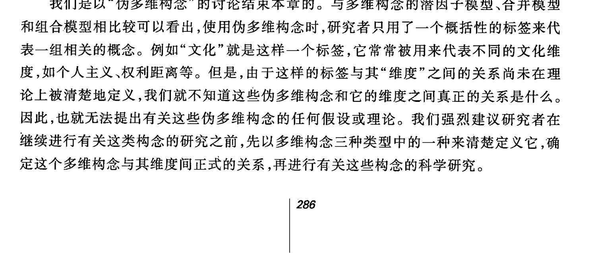

<!-- PDF页 301 -->

### 参考文献

Bandura, A. (1997). Self-efficacy: The Exercise of Control. New York: Freeman and Company..

Chan, D. (1998)... Functional relations among constructs in the same content domain at different levels of analysis; A typology of composition models. Journal of Applied Psychology, 83(2), 234—246..:

Colquitt, J. A. (2001). On the dimensionality of organizational justice: A construct validation of a measure. Journal of Applied Psychology, 86(3.), 386—400.

Costa, P.T. and McCrae, R.R. (1985). The NEO Personality Inventory Manual. Odessa, FL; Psychological Assessment Resources.

Curkovic, S, Vickery, S. and Drége (2000). Quality-related action programs; Their impact on quality performance and firm performance. Decision Sciences, 31(4), 885—905.

Edwards, J. R. (2001). Multidimensional constructs in organizational behavior research; An integrative analytical framework. Organizational Research Methods, 4(2), 144— 192.

Greenberg, J. (1993). The social side of fairness; Interpersonal and informational classes of organizational justice. In R. Cropanzano (ed.), Justice in Workplace: Approaching Fairness in Human Resource Management; 79—103. Hillsdale, NJ:Erlbaum, 79—103.

Gibson C B, Randel A E and Earley P C. (2000) Understanding group efficacy; An empirical test of multiple assessment methods. Group and organization Management, 25(1): 67—97.

Hackman, J.R. and Oldham, G.R. (1976). Motivation through the design of work; Test of a theory. Organizational Behavior and Human Performance, 16, 250—279.

Hinkin, T.R. (1998). A brief tutorial on the development of measures for use in, sur-. vey questionnaires. Organizational Research Methods, 1(1), 104—121.

Holmes, T.H. and Rahe, R.H. (1976). The social readjustment rating scale. Journal of Psychosomatic Research, 1, 213—218.

Hofstede, G. (1984). Culture’s Consequences; International Differences in Work-related Values. Newsbury Park; Sage.

Kerlinger, F. N. (1986). Foundations of Behavioral Research, 3rd Edition, Fort Worth; Harcourt Brace Jovanovich College Publishers.

Law, K.S., Wong, C.S. and Mobley, W.H. (1998). Towards a taxonomy of multidimensional constructs. Academy of Management Review. 23(4), 741—755:

| 单维构念与多维构念的测量 | 287

<!-- PDF页 302 -->

Law, K.S. and Wong, C. (1999). Multidimensional constructs in structural equation analysis: An illustration using the job perception and job satisfaction constructs. Journal of Management. 25(2), 143—160.

Lawler, E. E. III (1983). Satisfaction and behavior. In R.M. Steers and L.W. Porter (eds.) Motivation and Work Behavior (3rd ed.); 332—345. New York; McGraw-Hill.

Locke, E. A. (1969). What is job satisfaction? Organizational Behavior and Human Performance, 4, 309—336.

Organ, D. W. (1988). Organizational Citizenship Behavior; The Good Soldier Syndrome. Lexington, MA; Heath.,

MacCallum, R.C. and Browne, M. W. (1993). The use of causal indicators in covariance structure models; Some practical issues. Psychological Bulletin, 114(3)., 533—541.

McCrae, R. R. and Costa, P.T., Jr. (1989). The structure of interpersonal traits: Wiggin’s cireumplex and the five-factor model. Journal of Personality and Social Psychology, 56, 586—595.

Meyer, J.P., Allen, N. J. and Smith, C. A. (1993). Commitment to organizations and occupations; Extension and test of a three-component conceptualization.. Journal of Applied Psychology, 78(4), 538—551.

Meyer, J.P. and Allen, N.J. (1991). A three-component conceptualization of organizational commitment. Human Resource Management Review, 1, 61—98.

Mowday, R. T., ‘Porter, L. W. and Steers, R. M. (1982). Employee-organization Linkages; The Psychology of Commitment, Absenteeism, and Turnover. New York: Academic Press.

Myers, I. B. (1962). The Myers-Briggs Type Indicator Manual. Princeton, NJ;Education Testing Service.

Nunnally, J.C. and Bernstein, I.H. (1994). Psychometric Theory, 3rd edition, New York; McGraw-Hill.

Podsakoff, P. M., MacKenzie, S. B. and Hui, C. (1993). Organizational citizenship behaviors and managerial evaluations of employee performance: A review and suggestions for future research. In G. R. Ferris (ed.), Research in Personnel and Human Resources Management, Vol. 11; 1—40. Greenwich, Connecticut; JAP Press.

Smith, C.A., Organ, D. W. and Near, J.P. (1983). Organizational citizenship behavior; Its nature and antecedents. Journal of Applied Psychology. 68, 653—663.

Spearman, C. (1927). The Abilities of Man. New York:Macmillan.

Tsui, A.S., Pearce, J.L., Porter, L. W. and Tripoli, A.M. (2007). Alternative approaches to the employee-organization relationship; Does investment in employees pay off? A-

<!-- PDF页 303 -->

cademy of Management Journal, 40(5), 1089—1121.

Tsui, A.S., Wang, Hui and Xin, K.R. (2006). Organizational culture in China; An analysis of culture dimensions and culture types. Management Organization Review, 2(3), 345—376.

Wong, C.S., Law, K.S. and Huang, G. (in press). On the importance of conducting construct level analysis for multidimensional constructs in theory development and testing. Journal of Management.

= 单维构念与多维构念的测量 | 289

<!-- PDF页 304 -->

## 第十三章 因果关系理论的建立——结构方程模型

二早» EE因果关系理论的建立——结构=| |方程模型Khe 王畅香港中文大学本章大纲一、 什么是结构方程模型二、 结构方程模型的优点=. 测量基本概念. PO. 测量误差五、 量表的效度和信度六、量表的尺度七、 结构方程模型理论和你辑八、 结构模型的基本类型8.1 测量模型8.2 路径模型8.3 ”全模型8.4 ”均值结构模型九、LISREL 程序撰写+. 拟合指数(Fit Index)十一、 结构方程模型发展的新趋势一、什么是结构方程模型从统计学的角度来讲,所谓模型,是以系统方式来描述观察变量 (observed varia-

<!-- PDF页 305 -->

bles) 和潜变量(latent variables) 间的关系。而今天我们要向大家介绍的结构方程模型(structural equation modeling, SEM) 是用来检定关于观察变量和潜变量之间假设关系的., 一种多重变量统计分析方法,即以所收集的数据来检定基于理论所建立的假设模型。

所以,SEM 是一种理论模型检定的统计方法。

一般的理论研究中会涉及许多变量,而我们熟悉的回归方程也只能一次解释一个A 28 (dependent variable) 和几个自变量(independent variable)之间的关系。这时,包合了一连串回归方程的结构方程却恰恰可以同时分析出多个因变量与自变量自身及其之间的复杂关系。传统的统认六法需要多次处理的这些变量之间的关系,结构方程可以做到同时同步分析,这样,研究的准确性必会大大提高。

### 二、结构方程模型的优点

简单来说,结构方程具有以下优点:

(一) 在以往管理、社会.教育、心理学的研究中发现许多变量都是不可直接测量的,一般称为构念(constrict)。例如人的态度、认知、心理构念等,我们称这些变量为潜变量。一般的做法是以观察变量来间接量度潜变量,如用数条问卷题目(item)管案的平均值作为潜变量的数值。传统的方法不能准确处理这些变量,而结构方程则可同时分析潜变量及其观察变量之间的复杂关系。

(=) 结构方程可以和噜除随机测量误差。一般而言,从问卷题目得来的观察变量都是由真实值和测量误差所组成的,这时结构方程可以帮助我们准确估计出测量误差的大小和其他参数值,从而大大提高整体测量的准确度。

(三) 结构方程可同时计算多个因变量之间的关系。特别是应用于中介效应的研究,如在组织理论中,变量 4不是直接影响到变量 8,而是通过变量 C 作为中介而影响的。这时,结构方程便会给予这些问题以最综合恰当的分析。

### 三、 测量基本概念

如前文所述,我们称那些在研究中抽象的.不可直接观察测量的变量为潜变量,如人的性格。潜变量是要通过一系列的观察变量(observed variables)来间接体现的,如人的行为等。概括来说,结构方程一方面在描述观察变量是如何测量潜交量,另一方面也是在表达各个潜变量之间的关系。

进一步解释构念的概念,其实是当我们与人沟通时所表达的一个抽象的概念,如对一家餐厅的满意程度。它是由许多具体的易于观察的变量所构成的,如餐厅的食物质量、价格水平.服务质量、环境因素等。而通常是基于方便沟通的考虑,才选取构念来代表所有观察变量。当然,随着时间和环境的改变,代表一个构念的各个观察变量也会发

Stee | 因果关系理论均建立——结构方程模型 | 291

<!-- PDF页 306 -->

生变化。那么,这时我们就要考虑到这个潜变量要用什么新的观察变量来测量的问题。;因此,这里涉及了两个方向的问题,一是不同的观察变量代表了何种构念,二是一个构念又是由哪些观察变量所构成的。四、测量误差

古典真实分数模型(classical true score model) 是由真实分数及误差分数的观点来解释信度,即个人的观察分数(observed scores)是以真实分数与误差分数两部分的和组成的。他们之间的关系可以表示为以下的公式:

X=T+E其中,X 是观察分数,7 是真实分数,E 是误差分数。

实际上,只有在理想和完美的测验条件下才能获得的真实分数代表了测量中误差不变的部分,可是,这种情况很少存在。因此,我们说,任何一个测验的观察分数都包含了部分的误差成分。这个误差是由系统误差(systematic error) 和随机误差 (random error) 两部分组成的。但其中的系统误差只有在一些特定的研究设计中才可以被检测出来。因此,一般来讲,我们假定系统误差的值等于零,但其实它会被包含在真实分数中体现出来。

其中,随机误差的特性有以下三点:

1. 由于误差完全是随机的,所以一个总体的误差分数的平均值应该是零。

2. 一个总体的真实分数和误差分数之间的相关性为零。

3. 任何两项随机误差之间的相关性为零。

我们在结构方程中依旧保持对以上第一点和第二点的假设,而对第三点的假设则不需要一定有所支持。那么,在何种情况下第三点假设不适合存在呢?一般来讲,当相同试题在同一结构方程中出现的次数大于一次,那误差之间便可能存在相关性。简单归纳,有以下情况:

1. 同一试题语句对不同受访者引起的误差。即不同受访者使用相同试题在对同一测量对象测量时,由于对试题语句产生的误差会使其结果误差之间产生相关性。例如,在进行 360 度的绩效评估中,不同人会利用相同的测量工具,即同一份问卷对指定的对象进行工作表现评估。这时,我们便会假设来自不同受访者,如调查对象本人及其上司的评价结果误差之间是有一定相关性联系的。而这恰恰是结构方程可以测定而一般的回归方程不能测定的。

2. 同一试题在不同时间对同一受访者引起的误差。这时除了有语句引起的误差之外,还包括了同一受访者对这一误差随着时间的不断重复。所以,相同试题在不同时间对同一个测量对象产生的误差之间会产生相关性,如应用于纵向时间序列研究(longitudinal time series study),这正是传统的方法不能很好处理的情况之一,而结构方程却可

<!-- PDF页 307 -->

大大派上用场。就像前面所谈到的一样,我们不可在任何情况下都抱有对随机误差之间的相关性为零的假设,但是同时也应时刻注意以下两点的影响:第一,误差之间的相关性不可随意添加,一定要有强有力的理论支持作为前提;第二,基于理论支持,如果误差之间真正存在相关性,而我们却恰恰忽略了此相关性的存在,这时,我们的测量结果会对其他参数的估计产生很大的影响。接下来,简单介绍一下有两个变量(bi-variate)时,随机误差对估计各参数之间相关性的影响。他们之间的关系可以表示为以下的公式: Ty Ty Maly:其中,rs是与观察分数的相关系数;r;,是X与了真实分数的相关系数; EX ROE度; 7,,是Y的信度;1 -7是的测量误差;1 -7,,是了的测量误差。其中,由于7和7,,的最大值取1,所以我们可以得到 7,, <的结论。即,如果已知ry, =0.8,且7和,分别取0.8,按此公式计算可得 7, =0. 64,那么在多个变量(multi-variate) 的情况下又是怎样呢?当自变量的个数多过一个时,测量误差对参数之间相关性的影响是不可预测的,既有可能使其变大,同时,也有可能变小。五、量表的效度和信度通常,我们从效度(validity) 和信度(reliability) 两方面来评价一个量表(measurement scale)的质量高低。在统计学中,效度经常被定义为测量的正确性,或者是指量表是否能够测量到其所要测量之潜在概念。 因此,效度系数越高,表示越能够测量到想要测量的概念。一般,量表的效度包括:表面效度(face validity),效标关联效度 (criterion-related validity)、内容效度(content validity) LA 3 #4 23K EE (construct validity) 等。结构方程可帮助分别检验测量构念效度和效标关联效度的高低。首先,我们来谈谈构念效度。构念效度是由聚合效度(convergent validity) 和区分效BE (discriminant validity) 所组成。其中,聚合效度是指不同的观察变量是否可用来测量同一潜变量,而区分效度是指不同的潜变量是否存在显著差异。当我们以问卷题目或: 其他观察变量测量潜变量的时候,观察变量和洪变量之间的关系是有一定假设的,即假设了以哪些观察变量来测量潜变量。 我们可以验证性因子分析(confirmatory factor analysis,CFA)来判断观察变量与潜变量之间的假设关系是否与数据吻合。 若结果证明我们的假设是正确的,那么,其聚合效度也得到了相应的证明。 至于区分效度,我们通过检测各个潜变量之间的相关系数是否显著低于 1 来判断。那么,何为效标关联效度? 效标关联效度是指多个潜变量之间的关系。如假定某一个潜变量会对另一个潜变量有正作用(positive effect),那么,我们可以路径模型(path StEe | 因果关系理论的建立——结构方程模型 | 293

<!-- PDF页 308 -->

model) 的方式来检测效标关联效度。

以上是对效度的讲解,下面我们再来介绍一下量表的信度。在结构方程中,信度是在估计测量误差的大小,它是以误差的方差(variance)的大小来量度的。即当误差越大时,信度也就越小。具体到结构方程而言,我们可利用测量误差的大小来估计其信度的大小。

### 六、量表的尺度

任何量表必须有固定的尺度,一般称为测量单位。而测量单位的选择最终还是来源于我们对事物认识的角度。对事物进行测量的单位或尺度,一般而言有四种类型。统计学上分别称为:名义尺度(nominal scale)、顺序尺度(ordinal scale)、等距尺度(interval scale) » EE BAR BE (ratio scale),而它们相对应的测量方法分别是定类、定序、定比和定Ho 通常来讲,结构方程需要采用等距尺度测量。然而,一般的问卷题目都是以顺序尺度为单位的,即不是等距的。但是如果当试题的设计超过五个尺度以上时,我们可以认为,这时的顺序尺度在特性上已经非常接近等距尺度了。当然,结构方程在菜些条件允许的前提下也是可以处理顺序尺度的问题的, 这时的量表则必须要以有多分格相关和矩(poly choric correlation matrix) 和渐近协方差和矩阵(asymptotical covariance matrix, ACM)来分析,并有大容量样本的支持方可。

在研究中,我们也会遇到一些多维度构念(multi-dimensional/mega construct) 的测量问题。何为多维度构念? 即同时包含了不同的概念的统领因子。例如,工作满意度就是一个多维度构念,因为它下面还同时包括对上司、同事、工作环境、薪酬、工作性质等满意程度的多重内涵。而结构方程恰恰可以通过高阶因子(higher-order factor)分析对此情况进行妥善处理。

七、结构方程模型理论和逻辑接下来我们详细地介绍一下结构方程的概念。如图1 所示,显而易见,此图被虚线 -; 上下分隔成两部分:虚线上面的部分代表的是总体(population) 信息,是虚构的,而虚线下半部分则是来自样本(sample) 的真实信息。

首先我们来介绍虚线以上的来自总体的信息。从左上角开始看起,这是来自总体数据的一些变量,此时虽然不知道它们之间的相互关系,但是这些变量间的关系可用相关和矩阵来表示,即提出协方差矩阵二,而右手边则是在基于不同假设基础上所产生的描述各变量之间关系的不同模型,即模型-1,k,k+1。根据不同的假设模型可以估算每个模型的近似协方差矩阵,即怠。这时,比较马 GS, 的不同可得到4,,,,即总体不一SAE (population discrepancy)。Ass越小,则说明 S, 与 S, 之间越接近,继而进一步说明

<!-- PDF页 309 -->

近似模型RE设定关系... | 设定+ k woe A tity一总体协方差总体不。 近似协方关- “ |简约 > RE总体 Te样本估计不一致处 WA协方差 “(被操作化为 ” 协方差矩阵 ”拟合优度指数) ”矩阵图1 结构方程模型概念图 |了之前所假设的代表变量之间关系的模型越接近真实总体变量之间的相互关系,即最初的操作模型(operating model)。下面我们再来谈谈虚线以下来自样本的信息。就像此图左边展示的那样,由总体到样本之间要通过抽样的过程,并且伴随误差的产生:即总体数据(population data) +抽样误差(sampling error) =样本数据矩阵(Y)。从了我们可以计算出样本的协方差矩阵 5。相应的,基于假设的模型,可以产生拟合协方差矩阵名。由于总体中的怠、扣以及 4,都是虚构的,所以实际上我们要做的是比较样本中的5与名的大小,即 A。。 在结构方程中用不同的拟合指数(fit index)来代表4A.的大小,其中最经常使用的拟合指数为(Chi-square)。经过比较,如果多,即 A。,越小,则说明拟合协方差矩阵 3S, 越接近样本协方差矩阵5,从而说明了我们前面所提出的模型与数据的拟合程度高。八、 结构模型的基本类型. 简单来说,结构方程模型可以分成以下四大类:测量模型(measurement model)、路径模型(path model)、全模型(full model) 和均值结构模型(model with mean structures)第十三章 | 因果关系理论的建立——结构方程模型 | 295

<!-- PDF页 310 -->

### 8.1 测量模型

图2 基本构造了测量模型的面角:这里,我们用八个观察变量来测量两个潜变量。其中,前四个观察变量测量第一个潜变量,而后四个观察变量测量第二个潜变量。如图所示,这两个潜变量是相关的,而潜变量与观察变量之间的关系可表示为因子负荷(factor loading),即和,并且,每个观察变量的测量误差用6 来代表。另外,在结构方程模型常用图标的表示法中,圆或椭贺表示潜变量或因子,而正方形或长方形表示观察变量。其实,测量模型的主要用途是通过验证性因子分析来帮助我们检验心中的假设,即如此图所示的因子模型是否与数据吻合,是否为一个好的模型,并同时对各因子间参数做出合理估计。这其实照应了我们前面所提到的对构念效度的检测。

/hf ba ts/ haf nde d 6 65 46 6 &§ 6 &图2 测量模型

### 8.2 ”路径模型

如图3 所示,模型包含了三个自变量和两个因变量,它们之间有着复杂的相互关系。简单来讲,结构方程模型可同时将所有这些关系一起估算,从而避免了考虑一个因变量时,忽略了其他因变量的存在及其影响的情况。路径分析的主要作用是想了解各变量之间的关系,这其中包括直接关系和间接关系两大类。直接关系(direct effect) 是指某一变量对另一变量产生直接影响,如图中从变量 X, 到变量 Y,,或从变量 X, 到变量了Y。而间接关系(indirect effect) 则是某一变量对另一变量的影响乃是通过其他变量而形成的。这个中间变量称作干扰变量(intervening variables),如图示,X, 是通过 Y, 而影WY, 的。综上所述:总效果(total effect) 是指某一变量对另一变量的直接效果加上间接效果的总和。例如,X, 与了之间存在直接关系,同时通过了也存在着间接关系,那么, X, 与了的总效果就是以上直接效果和间接效果之和。虽然传统的回归性分析可以将 -变量间复杂的关系分拆成直接关系和间接关系,但是结构方程模型为我们提供了一个简单的方法,即可同时分析各种变量之间的关系,省去了先前逐条分拆的烦开。

<!-- PDF页 311 -->

%n; |图3 路径模型8.3 £8如图4 所示,全模型是同时包含了测量模型和路径模型的总和。即同时包含外源变量和内生变量的模型,也称为完整模型(complete model)。6 4, 6 6 & & 6 & Ef AY 1 [Aaya ANA Ah ha ©) “ Cn) Bu hs Ads den | es & a &图4 全模型8.4 ”均值结构模型在近二十年前,学者们对结构方程的认识只局限于共变和矩阵的形式,而现在的研究已扩展到了增加对潜变量均值的分析。 对单一组别的结构模型来说,由于潜变量的度量单位(scale)及其截距(intercept) 都是随意设定的,所以潜变量的均值没有很大的意义。但是在跨组别(cross-group) 比较研究中,均值结构模型可用以比较各组别的潜变量均值的大小。第十三章 | 因果关系理论的建立——结构方程模型 | 297

<!-- PDF页 312 -->

fy, LISREL 程序撰写目前,有多种软件可以用来分析结构方程模型,本章在这里要详细介绍的是比较流行的 LISREL 软件,其他流行的软件包括 AMOS 和EQS。采用 LISREL 的命名方式,我们会经常使用希腊字母来表达不同的参数。首先,我们介绍一下潜变量的度量单位。开篇我们提到过,潜变量是个虚拟的概念,那么,当我们要量度这些诸如认知、态度等因子时,就必然无法取用像以往量度距离的千米或量度重量的千克这样的被大家一致公认的单位进行测量。然而,在结构方程模型中,因子一定要有自己的单位方可计算,所以,通常我们采取以下两种方法之一; (1) 固定负荷法:即任取一个观察变量(X,) 为参照指标,同时设定其截距为0,因子负”和荷为1。这样一来,不但使得潜变量一个单位的变化相应导致其观察变量一个单位的变化,而且潜变量的平均值也等于相应参照指标的观察平均值。(2) 固定因子方差法:即. 将潜变量标准化,设定其方差(91)为1(见图5)。模型0.15 固定因子方差法0.44 0.24 0.88 1 = 1.0 0.45模型2 os 固定负荷法1.00 0.24 2.00 by, = 0.1936 0.45图5 潜变量度量方法BRAS 中两种方法在数字的表述上是不同的,但是殊途同归,本质上是相同的。如图所示,模型 1 采用的是固定因子方差法,将因子标准化后,四个观察变量都有其相应的因子负荷。而模型 2 采用的是固定负荷法,即选择了XX, 为参照指标并且将其因子负荷(factor loading)设定为1。换个角度分析,其实模型 2 是将模型 1 中所有的因子负荷数全部除以第一个指标(即参照指标)的因子负荷数(即 0.44)从而得到了模型2 的各个因子负荷数值,相应地,此时模型 2 中因子的方差也变成了 0. 44 的平方,即0.1936。综上所述,无论我们用哪一种方法来设定潜变量的单位,所要估测的目标参数

<!-- PDF页 313 -->

数量是不变的,具体到本例,模型1和2 同样需要得到对 8 个参数的估测结果,这点是不变的。这里再特别强调一点,当我们进行跨组别比较研究,特别是跨文化(cross culture)比较研究时,必须采用固定负荷法来完成对潜变量单位标准化这一步骤。因为在固定方差法中,两组构念的方差(1)假设为相等,而这个假设特别是在跨文化比较研究中是不恰当的,所以我们选择无此假设的固定负荷法。:

TERRI EZ BU, BR ATE BE Fe FD RE — AES:: BE BY VAG! (model identification),即衡量有无足够的方程来解决想要估测的参数。这个规律是这样的:设问题涉及个观察变量,则协方差甜阵是一个k阶的对称方程,总共有p =k(k+1)/2 个不重复元素。而q 则代表所需估计的参数个数。模型的自由度(degree of freedom,df) =p -gqg。在前面的例子中:此模型需要估计6 个因子负荷,3 个因子间相关系数和8 个变量的误差方差,共需估计 g=17 个参数;因为有8 个变量,所以p =8 x (8 +1)/2 =36。这样一来,此模型的自由度 =36 -17 =19。

若一个模型的自由度为0 时,即不重复元素的个数p 等于所需估测参数的个数9g,我们称这样的模型为仅限识别模型(just identified model)。它的 chi-square 等于0,即是完全吻合模型,同时表示我们无法衡量这个假设的模型与原始数据的吻合程度。换个角度来讲,如果任意两个结构方程的自由度都是0,那么,在这种情况下,它们的拟合度都是完全吻合,也证明了理论上不同模型可以得到相同拟合指数。反过来,这更加说明了我们一直强调的假设模型要有坚实的理论依托的道理。如果自由度小于0,此模型被称为未识别模型(under identified model),这时我们的估测得不到任何结果。

在介绍了单位设定和模型识别概念之后,接下来,我们简单介绍一下建立结构方程模型的六个步又:

。 第一步,正如前面所谈到的,结构方程中的分析统称检定分析,即是对假设模型的一种检定,所以首先我们应当建立一个基于理论基础的假设模型。

。 第二步,根据理论所表达的各变量之间的相互关系,整个模型用路径图(path diagram) 的方式呈现。

。 第三步,将路径图用一组结构方程演绎并对测量方程进行具体描述。

。 第四步,将前面所陈述的关系——表达成为 LISREL 的程序语言,然后运行结人果。当然,除了LISREL 之外,其他软件,如 AMOS EQS 都可以达到同样的功效。

。 第五步,结果输出。这时我们要着重观察儿个方面的因素:(1) 参数估计的可行性;(2) 假设模型与实验数据的拟合程度; (3) 参数的估计是否显著。

。 第六步,解释输出结果。

下面,我们以验证型因子分析为例子来详细解释以上步台:

在理论基础上建立假设的模型是建立结构方程模型的第一步,也是最重要的一步。

| 因果关系理论的建立一结构方程模型 | 299

<!-- PDF页 314 -->

建立结构方程模型首先是根据理论基础为各个构念之间的关系作出假设(hypothesis),再设定量表中各观察变量与各潜变量之间的关系。结构方程模型只是一种统计方法,用以检定样本数据与假设模型的拟合程度。由于不同的模型有可能得出相同的拟合协方差矩阵,因此与样本数据也有相同的拟合程度。在这种情况下,结构方程模型不能辩别哪个假设模型比较好,而必须依赖理论基础来选择适当的模型。假设经过第一步的理论架构之后,得出两个潜变量之间存在相关性,那么,第二步就是要通过路径图的形式将理论演化出来。如图1一2 所示,用 8 个指标来测量这两个HERZ KAR. HX 代表的观察变量, A 代表XX对的因子负荷,é 代表潜变量,而6 则代表了XX的测量误差。接下来的第三步是设定结构关系,即将其以矩阵的方式表达,如图6 所示。x An 0 6 * Ay 0 6, xs Ay 0 5; x Ay 0 lré 6, Xs “Tg As. [,]* 5, Xs 0 Aw 6 x 0 An 8, Xs 0 Ag 5s du e= [> al X2€ BIRR hp Ax:X 对的因子负荷:外源变值 6:了的测量误差图6 潜变最和矩阵表达方式做好了以上的准备工作之后,我们终于开始第四步——撰写 LISREL 程序的工作了。LISREL 可主要分为下列四类指令,依次为: (1) 标题指令句(TITLE LINE),使自己对此程序的描述,可超过一行。(2) 输入格式(INPUT SPECIFICATION),整个程序真正开始运行的地方,由头两个字母 DA(代表 DATA)起始。(3) 模型格式(MODEL SPECIFICATION), (4) 输出格式(OUTPUT SPECIFICATION)。接下来,我们从第二个格式开始,分别详细解释其说明方法:输入格式(INPUT SPECIFICATION) DA NI =k [number of indicators] NO =number of cases

<!-- PDF页 315 -->

LA [labels for the observed variables]

V1 V2 V3 V4 V5 V6 V7 V8

RA FI =filename [of raw data]

CM FI = filename [of covariance matrix]

KM FI = filename [of correlation matrix]

SD FI =filename [of standard deviations]

ME FI = filename [of observed means ]

解释:DA 作为输入格式的起始点,紧接着在同一行中最简单的模型所必需的设定。NI 代表变量数目,即数据输入文件中观察变量的个数;NO 代表样本数目。

第二行 LA(Label) 代表数据输入文件中变量的名字,如本例中有 8 个变量,分别叫做 Vl,V2,V3,V4,V5,V6,VI,V8。

我们可以采用不同的输入方法:最基本的是由 RA(RAW DATA)原始数据开始,其后的本为文件名称,这是原始数据储存的地方。当然,除了采用原始数据输入外,还有其他多种选择,如 CM(COVARIANCE MATRIX)协方差矩阵或 KM(CORRELATION MATRIX) 相关和矩阵和 SD(STANDARD DEVIATIONS)标准差,LISREL 可直接将这两个矩阵转换成协方差矩阵的形式认读。假设我们考虑到均值结构分析时,则要输入 ME (OBSERVED MEAN)代表均值。

模型格式(MODEL SPECIFICATION)

MO NX =8 NK =2 LX =FI TD=DI PH=SY

LK

ksi labels

解释:首先我们简单介绍一下 LISREL 语法的和矩阵及设定中最基本的记号。

LX 代表 Lamda-x,为 FU(FULL, 5¢ 58, x 在& 上的负荷矩阵)。

TD 代表 Theta-Delta,为 DI(DIAGONAL,对角线矩阵),即指X观察变量的误差协方差,将误差之间的相关设为零(不相关)。

PH 代表 Phi,为 SY(SYMMERIC,对称和矩阵),即指& 的协方差矩阵,一般只采用下三角(LOWER TRAINGLE) 数据。

下面,正式介绍模型格式的撰写:此格式以 MO(MODEL)模型指令开始,在此行 NX =8 代表有8 个观察变量, NK =2 代表潜变量数目为两个,LX = FI 代表将所有 lambda-x RE AF, TD = DI 描述了误差间协方差矩阵对角线元素自由,而非对角线元素固定为零,PH =SY 则表示了因子间的协方差对称矩阵形式。下一行 LK(LABLE ksi) 是 é的标签,即为潜变量的命名。

另外,我们还需了解其他一些记号的含义,如 FR 代表指定自由待估测的参数;可代表指定固定的参数,如果无特定数值给予时,一般参数会采用缺省值 0;VA 则代表将参

| 因果关系理论的建立——结构方程模型 | 307

<!-- PDF页 316 -->

一

数固定于某数值(VALUE)。输出格式{OUTPUT SPECIFICATION) Path Diagram OU ND=4其中 OU 代表输出指令;ND 代表输出结果的小数位数(decimal),在此我们选取4位小数位数。现在,我们不妨一起来分析一个简单的例子,看看前面讲到的 LISREL 程式指令是如何应用于实际的: (一) 研究及模型简述假设我们用 8 个题目了解职员和顾客对服务质量的满意程度。模型见图2。(二) LISREL 程序分析和解释在图7 中,我们可以清楚地看到,在指令标题句后,由 DA 开始了数据输入指令,由MO 开始了模型构念指令,由 OU 开始了结果输出指令。Title line: Exercise DA NI =8 NO =200 LA V1 V2 V3 V4 V5 V6 V7 V8: cM 1.65 0.45 1.14 0.35 0.30 1.01 0.51 0.49 0.43 1.58 0.07 0.20 0.20 0.23 0.75 0.17 0.14 0.17 0.27 0.23 0.65 0.41 0.20 0.07 0.21 0.11 0.25 0.85 0.22 0.23 0.26 0.36 0.24 0.25 0.16 0.75 MO NX =8 NK =2 LX =FI LK Staff Customer. VA 1 LX (1,1) Lx (5,2) FR LX (2,1) LX (3,1) Lx (4,1); FR LX (6,2) LX (7,2) LX (8,2) PD OU ND =4. 图7 LISREL 程序示例上

<!-- PDF页 317 -->

(1) DA NI=8 NO =200

DA 是输入数据(DATA, DA)的指令。NI =8 表示数据共有 8 个变量, NO =200 表示测斌对象为 200-名。

(2) LA、

V1 V2 V3 V4 V5 V6 V7 V8

LA 为标签指令句,即给刚刚输入的 8 个变量以名称,它们依次为 V1, V2,V3,V4, V5,V6,V7,V8.,

(3) CM AR Di Dy 22 He RF, 30 BA FO} OT AN HE, BY ARS 200 份问卷得出的相关FAME

(4) MO NX =8 NK =2 LX =FI

从 MO 开始了对模型参数设定的指令。NX =8 代表观察变量(即指标)的个数为8, NK =2 (UZ AE EE (BY #-因子)的个数为2,LX =了可的设定意味着开始将 lambda-x 矩阵设定为固定的矩阵。接着在 FR LX 指令中设定 LX 的格式,逐一列出设定为自由的元素,如LX(2,1).LX(7,2)等,并以 VA 指令将以固定的LX(1,1)和LX(5,2)赋值为1,至此,我们应当体会到这是在用固定负荷法对因子进行量度。LK 代表的标签(LABLE ksi),即分别给两个潜变量以名称: 职员、顾客。PD 为路径图 (path diagram)。

(5) OU ND=4

OU 开始的输出指令中 ND 代表输出结果的小数位数,本例我们选取4 位小数位数。

第五步,LISREL 结果输出及解释

通过输入 LISREL 程序运行之后,我们会得到一大串对待测模型的输出结果。如何进行有效合理的分析呢?通常,我们会从以下四大方面着手:

(一) 参数的估计可行性。结构方程模型本质上是个反复逃代(iterative)测量的过程,即在中间环节通过不断改变各个参数的估计,从而尽可能使得 4A.,,即5 与名之间的差异最小。在改变参数大小时,有可能会出现不合理值。例如,X 观察变量间协方差和因子间协方差都应分别大于零,如果任意一方有小于零的数值,即不合理的数值出现,则可全盘否定此结构模型。.

(=) 假设模型与实验数据的拟合程度。我们会选择不同的拟合指数进行衡量,一般包括 Chi-square、RMSEA、TLI、CFI 和 Standardized RMR。稍后会逐一介绍给大家。

(=) 参数的估计是否显著。在输出的结果中,除了每个参数的估计值之外,还有标准误差和4,值的估计。如果选取第一类错误(type I error)值等于 0.05,那么,我们要RAH (MKF 1.96。

(四) 的复相关系数(multiple correlations)。在结构方程模型中,每个观察变量都有一个复相关系数,就像回归方程中的 R-square 一样,我们同样希望这个复相关系数越大越好,因为如果它变小的话,则说明观察变量与潜变量之间的关系也相应变弱了。

= BRARGCWY— BH ERA | 303

<!-- PDF页 318 -->

好了,下面我们一起来观察例一的 LISREL 输出结果,见图8,看看有何新的发现:首先判断其中并无不合理参数出现,然后检查在 Lambda-X 表中每个参数所对应的三个数值分别是:参数估计值标准误差和:值,其中,所有:值都是大于1.96 的,这说明因子负荷相关系数(或协方差)都是显著的。CFA Exercise 1 Number of Iterations =10 LISREL Estimates (Maximum Likelihood) LAMBDA-X Staff Customer v1 1.0000 oo v2 0.9176 — (0.1855) 4.9457 V3 0.8087 — (0.1692) 4.7806 v4 1.2376 _—_ (0.2372) 5.2173. v5 —_ 1.0000 v6 — 1.1584 (0.2392) 4.8438 v7 — 0.9265 (0.2298) 4.0315 v8 — 1.2553 (0.2584) 4.8572 PHI Staff Customer Staff 0.4311 (0.1352) 3.1891 Customer 0.1952 0.1797 (0.0518) (0.0600) 3.7697 2.9958图8 LISREL 结果示例

<!-- PDF页 319 -->

THETADELTA vi v2 v3 v4 v5 V6 1.2189 0.7770 0.7280 0.9196 0.5703 0.4089 (0.1441) (0.0977) (0.0876) (0.1341) (0.0669) (0.0567) 8.4559 7.9534 8.3076 6.8589 8.5197 7.2063 THETA-DELTA v7 v8 0.6958 0.4669 (0.0777) (0.0655) 8.9586 7.1276 Squared Multiple Correlations for X-Variables vi v2 V3 v4 v5 vé 0.2613 0.3184 0.2792 0.4180 0.2395 0.3709 Squared Multiple Correlations for X-Variables V7 v8 0.1814 0.3775 Goodness of Fit Statistics Degrees of Freedom =19 Minimum Fit Function Chi-Square =32.4778 (P =0.02759) Normal Theory Weighted Least Squares Chi-Square =32.6897 (P =0.02610) Estimated Non-centrality Parameter (NCP) =13.6897 90 Percent Confidence Interval for NCP =(1.6329; 33.5893) Minimum Fit Function Value =0.1632 Population Discrepancy Function Value (FQ) =0.06879 90 Percent Confidence Interval for FO =(0.008206; 0.1688) Root Mean Square Error of Approximation (RMSEA) =0.06017 90 Percent Confidence Interval for RMSEA = (0.02078; 0.09425) P-Value for Test of Close Fit (RMSEA < 0.05) =0.2878图8(续) Stee | 因果关系理论的建立一结构方程模型 | 305

<!-- PDF页 320 -->

Expected Cross-Validation Index (ECVI) =0.3351 90 Percent Confidence Interval for ECVI = (0.2745; 0.4351) ECVI for Saturated Model =0.3618 ECVI for Independence Model =2.0159 Chi-Square for Independence Model with 28 Degrees of Freedom =385.1658 Independence AIC =401.1658 Model AIC =66.6897 Saturated AIC =72.0000 * Independence CAIC = 435.5523 Model CAIC =139.7611. Saturated CAIC =226.7394 Normed Fit Index (NFI) =0.9157 Non-Normed Fit Index (NNFI) =0.9444 Parsimony Normed Fit Index (PNFI) =0.6214 Comparative Fit Index (CFI) =0.9623 Incremental Fit Index (IFI) =0.9632 Relative Fit Index (RFI) =0.8757 Critical N (CN) =222.7513 Root Mean Square Residual (RMR) =0.05450 Standardized RMR =0.05200 Goodness of Fit Index (GFI) =0.9606 Adjusted Goodness of Fit Index (AGFI) =0.9253 Parsimony Goodness of Fit Index (PGFI) =0.5070图8(续)十、拟合指数(Fit Index)在结构方程中,当我们谈到拟合度时,其实是指如何尝试改变各参数值的大小,从而使得拟合协方差矩阵越接近样本协方差矩阵,即 A。,越小。一般,我们会采用拟合函OF OTHE 4。的大小。此值越小,则说明两个矩阵之间的拟合程度就越好。根据估计的方式不同,我们一般用的方法是最大似然估计 ML(Maximum likelihood),其拟合函数下(fit function) 的最小值的计算公式如下:

<!-- PDF页 321 -->

fa, =logl SO 1+ (SSO) -logl SO | - p + (BO = pO) YOR — yO)而整体拟合的最基本测量指标就是x,其公式为: x =(N-1)F其中,NN为样本大小,FF为拟合函数的最小值。

伴随x 一起的,我们还要同时考虑自由度和 p-value 的大小。在众多不同的拟合指Kh VY 是其中少数有已知分布情况的。另外,还有拟合指数 Root Mean Square Error of Approximation(RMSEA)。由于分布情况已知,我们可以检测x,即 4。是否显著。相对于每一个x 以及自由度(df)值,我们可以找到显著的 p-value。当x BW), p-value MA

′ 时,说明了拟合协方差矩阵与样本协方差矩阵的差距越不显著;反之,当X 越大,p-value越小时,则说明了拟合协方差矩阵与样本协方差矩阵的差距越显著,这时,我们最初假设的模型就要被推翻了。

然而,许多学者都特别注意到了一点,即x? 的值对样本数量相当敏感。当样本越大Hy 值也就越容易变成显著,从而使假设模型越容易遭到拒绝。其实,我们从公式中也可以发现x 值是非常依赖样本大小的,因为计算时是用样本数乘以下值。通常在结构方程实验中我们都需要大的样本数量,这时就会导致即使拟合协方差矩阵与样本协方差矩阵的差距不显著,也会使模型被拒绝的情况屡次出现。这个矛盾也就合理解释了为什么学者们都在不断找寻更合适的拟合指数。现在,一般的软件都会同时支持超过30 个的拟合指数。下面,我们再简单向大家介绍几个:

Relative chi-square

xX /df

这主要是基于x 与自由度之间是非线性关系,两者相除之后,即可变成线性的关系。一般规律是2:1 或3:1 是可接受拟合度的标志。

Root Mean Square Error of Approximation (Estimated RMSEA)

= x N(N-1)(d-1)

这个概念最早是由 Steiger & Lind (1980)提出的,然而是由 Browne 和 Cudeck (1993)给它命名的。当 RMSEA 等于或小于 0.05 时,表示假设模型拟合程度好;0. 05到 0.08 之间时,表示拟合程度可以接受;0.08 到0.10 之间时,表示拟合程度一般;当超过0.1 时,则表示了模型与数据的拟合度较差。总体来讲,当 RMSEA 越小时,表示拟合程度越高。除此之外,还提供了P close 的判断标准:即用 P-value 测定这个假设。当 Pvalue 大时,说明不显著,则不拒绝假设模型;车当 P-value 小时,说明显著,要拒绝假设的模型。 |

TL 和CFI 又是另一组经常使用的拟合指数的代表,它们的共同特征是比较底线(baseline)模型的x 和假设理论模型的Xx?。

| 因果关系理论的建立——结构方程模型 | 307

<!-- PDF页 322 -->

Tucker-Lewis non-normed fit index (TLI) a x TLI = p, = oof Xe] df, Bentler (1990) comparative fit index (CFI) crt = 1 ~- LaxQ = 4f,0) max(y? - df,,0)

TLI AH ys RR PY y”,df; 指底线模型中的自由度。这里所谈到的底线模型是只包含观察变量和误差项,忽略了洪变量和因子负荷间所有关系的一种模型。TLI 和 CFI 得到的值越大,代表拟合程度越好。一般的规律是:取值大于 0.9,若大于0.95 时,则代表假设理论模型与数据的拟合度非常好。

另外,其他常用的拟合指数,诸如 Goodness of fit index (GFI)和 Adjusted Goodness of fit index (AGFI),不少模拟研究发现它们的特性都有缺陷,如对样本大小的依赖度高等。

Root Mean Square Residual (RMR)为拟合残差方差的平均值的平方根,即一种平均残差方差。

RMR = Is {> SP of) }/ Spr

RMR 虽然受到单位的影响,但如果两个模型是使用同一数据作测量,那么,即可用这个指标比较其优劣。其中,RMR 值较小的一方,为拟合度相对较好的模型。也正是由于 RMR 易受单位的影响,故将其标准化后变成了 Standardized RMR,

PH,我们回到先前的例子中来看看拟合度的结果。如图8 Bra, 自由度(degrees of freedom) = 19, Minimum Fit Function Chi-Square = 32. 4778 (p =0.028),RMSEA = 0.06017,p close =0. 2878, TLI = NNFI =0.9444, CFI =0.9623, SRMR =0. 052, HPR RX? 的p-value < 0.05,但是p close >0.05, 且其他的指标也反映了高的拟合度,所以经过综合判断,我们认为此例假设的模型与样本数据拟合。

### 十一、结构方程模型发展的新趋势

(一) 第一个大的新方向是测量等同(Measurement Equivalence/Invariance, ME/I)概念的拓展与延伸。实际上,测量等同旨在探讨如何跨组(cross group) 比较结构方程模型中的各个参数值,如和.5或7。这种比较研究也可更深入地涉及不同组别之间均值结构模型的平均值的比较。特别值得我们关注的是测量等同在实际操作中的如下具体应用:

<!-- PDF页 323 -->

1. 将结构方程模型在不同文化组别之间进行比较,可对跨文化研究工作大有神益。

2. 在教育学领域,结构方程模型可有助于比较拥有不同水平学术成就或不同主修范围的研究对象之间的异同。

3. 跨性别研究,因为男性和女性对某些问题的看法会有所差异,如对“大减价”这个事件所体现出的分歧。

4. 在心理学试验研究中,结构方程可帮助测量实验组和对照组对同一份调查问卷”题目的不同看法。

5. 在360 度绩效评估中,研究表明,工作持有者与上司对其本人的工作表现评价会有所出入,从而导致了一系列问题的产生。经验证明,结构方程模型在以上这些研究分析方面,都有它擅长的一面。

(=) 第二个大的新方向是所谓的潜增长模型(latent growth model)。有许多研究是在观察研究对象随着时间轴的变化程度,如人们的认知和态度的发展和变化。具体来讲,一个员工在步人职场之前对未来的工作会抱有一定期望;两个星期之后,当他有了一些初步认识之后,期望也会变得实际些,同时对公司的观念也会有所改变;六个月之后,他的改变应该逐渐趋于稳定。所以我们说一个人对一个机构的认知和观念会随着时间的流逝而发生变化。同样的,许多相似的概念和理论都是关于发展的,如上司与下属的关系,培训的效果等,在解决诸如此类的问题中潜在增长模型的应用给我们带来了很好的启示。

(=) 第三个大的新方向是多层次因子模型(multilevel factor model) 的进展。图9为一个多水平因子模型,它包括了四个样本(subject),每个样本由三个题目(item)来测量, 这四个样本又同时属于一个大组别(group)。这个例子充分说明了有时我们收集来的数据之间不是互相独立的,如虽然分为四个样本,但其实互相之间都存在着一定关系。因为它们同属于一个大组别,就会受同一个组长的影响,所以这些样本之间是相关的。那么,这种情况在作分析时也必然会存在特别之处。在结构方程中,我们可将观察得来的变量之间的协方差矩阵分拆成为两个水平研究:即变量组间协方差矩阵

图9 多水平因子模型| 因果关系理论的建立——结构方程模型 | 309

<!-- PDF页 324 -->

(between-group covariance matrix) 和变量组内协方差矩阵(within-group covariance matrix),从而可对组间和组内的模型进行分别测量,进一步便可比较这两个水平之间的异同。 |

综上所述,虽然近年来结构方程的应用日益广泛,但是人们对其本质概念仍存在某些误解。其实简单来讲,结构方程是基于假设模型,通过比较拟合协方差和矩阵与观察协方差矩阵,当二者差距减少时,则说明假设模型与原始数据也趋于接近。所以,我们认为,只有清楚并深刻了解结构方程的内涵,才能使其成为帮助我们进一步探索的更得力的助手和工具。

### 参考文献

Arbuckle, J. L. and Wothke, W. (1999). AMOS 4.0 User's Guide. Chicago; Smallwaters.

Bollen, K. A. (1989). Structural Equations with Latent Variables. New York; John Wiley & Sons.

Browne, M. W. and Cudeck, R. (1993). Alternative ways of assessing model fit. In; Bollen, K. A. and Long, J. S. (eds.) Testing Structural Equation Models; 136—162. Beverly Hills, CA; Sage.

Cheung, G. W. (1999). Multifaceted conceptions of self-other ratings disagreement. Personnel Psychology, 52, 1—36.

Cheung, G. W. and Rensvold, R. B. (1999). Testing factorial invariance across groups: A reconceptualization and proposed new method. Journal of Management, 25, 1—27.

Cheung, G. W. and Rensvold, R.B. (2000). Assessing extreme and acquiescence response sets in cross-cultural research using structural equations modeling. Journal of CrossCultural Psychology,31(2), 187—212.

Cheung, G. W. and Rensvold, R. B. (2001). The effects of model parsimony and sampling error on the fit of structural equation models. Organizational Research Methods, 4, 235—263

Hayduk, L. A. (1987). Structural Equation Modeling with LISREL; Essentials and Advances. Maryland; Johns Hopkins University Press.

Joreskog, K. G. and Sirbom, D. (1996). LISREL8; User's Reference Guide. Chicago: Scientific Software International, Inc.

<!-- PDF页 325 -->

Steiger, J. H. and Lind, J.M. (1980). Statistically-based tests for the number of factors. Paper presented at the Psychometrika Society Meeting, Iowa City, IA. RARE BES (DT RRA) 9 TGR,教育科学出版社,2004。‘ Mies | 因果关系理论的建立——结构方程模型 | 311

<!-- PDF页 326 -->

## 第十四章 调节变量和中介变量

qe SA He oe Wk调节变量和中介变量罗胜强 LR香港中文大学本章大纲

### 一、 调节变量和中介变量在研究中的作用

### 1.1 调节交量的理论意义

### 1.2 ”中介交量的理论意义二、 调节变量的原理和检验方法

### 2.1 调节作用的原理

### 2.2 调节作用与交互作用

### 2.3 ”检验调节作用的方法

### 2.4 ”多元调节回归中的统计功效问题

### 2.5 检验调节变量的其他方法=. 中介变量的原理和检验方法

### 3.1 中介作用的原理,

### 3.2 中介作用的检验和分析

### 3.3 ”中介作用检验中的问题四、 结语

### 一、 调节变量和中介变量在研究中的作用

科学研究的目的之一是发展理论来描述和解释事物之间的关系,所以自然需要弄清楚谁是原因谁是结果。我们对自变量、因变量的概念都很熟悉了,可是为什么研究者又引入了调节变量和中介变量? 它们对于我们的研究到底有什么帮助” 是否每一个模

<!-- PDF页 327 -->

型都需要用到调节变量和中介变量呢? 应该如何检验调节变量和中介变量? 我们希望通过本章的讲解能为读者思考这些问题提供一些参考。本章第一节将首先讨论这两种变量在研究中的理论意义;第二节将介绍调节变量的原理,并就容易混淆的调节作用与交互作用进行区分,之后,我们会介绍检验调节作用的具体步骤,以及调节作用检验中的统计功效问题,最后简单介绍检验调节作用的一些其他方法。在第三节中,我们将介绍中介变量的原理和检验步骤,并就目前研究中检验中介变量的过程中普遍存在的问题进行讨论。

在介绍中介变量和调节变量的原理和分析方法之前,我们首先讨论一下它们在我们的研究中到底有什么意义。我们的很多知识都是建立在变量间的相关关系或因果关.系的基础上的,随着研究的深入,一些简单的关系已经不能够提供足够的信息,也难以概括各种复杂的情况。所以,研究者们才提出了通过调节变量和中介变量的研究挖掘更多信息的方法。虽然调节作用和中介作用在社会科学研究中都有一定历史,但是研究者们有时还是会把它们混淆。比如,Findley 和 Cooper (1983) 本来是想解释调节作用的,却把性别、年龄,种族和社会经济水平解释为控制点与学术成就之间关系的中介变量。直到 20 世纪 80年代中才有研究者(Baron and Kenny, 1986)把调节变量作为研究方法中的一个问题正式提出来,并与中介变量加以区分。

早在20 世纪 20年代已经有心理学家开始认识到中介变量的重要性,并利用中介变量解释一个关系背后的原理和内部机制。Woodworth(1928) 在“刺激一反映”(S-R)理论的基础上提出了“刺激一机体一反应”(S-0-R)模型,说明了刺激对于行为的作用是通过有机体内部的转换过程而发生的,这个模型的关键是认识到一个活动的有机体介入了刺激与反应之间的作用过程,这可能是最早的一个比较严格的中介作用的假设。

调节变量所解释的不是关系内部的机制,而是一个关系在不同的条件下是否会有所变化。让我们把调节作用变成生活语言就很容易理解了,调节变量就是“视情况而定"“因人而异”。比如,同样是经历一次失败,对人产生的影响却是不同的。高自我效能感的人倾向于将失败归因于努力不足,于是,他们可能更加努力并坚持下去;而低自我效能者更容易将失败归因为能力不足,他们会更加怀疑自己的能力,导致放松努力或完全放弃。在这里我们看到,一次失败(自变量)对人行为(因变量)的影响随着自我效能感(调节变量)的不同而异,这时,我们就可以说自我效能感调节了失败与人的行为反应之间的关系。

上面简单介绍了研究者为什么要把中介变量和调节变量引入研究,下面我们就看看两种变量在我们的理论发展中究竟起到了什么作用。

调节变量的一个主要作用是为现有的理论划出限制条件和适用范围。我们千有限的认知能力所建立的理论往往都是有一定的局限的,只是在理论发展的初期很难完全

| WPREP TARE | 373

<!-- PDF页 328 -->

考虑到其所有的限制条件和适用范围。例如,牛顿经典力学曾经让人们以为,物理学的大厦已经完成,最多只要做一些修饰黑了,然而狭义和广义相对论的出现使人们认识到原有理论的适用范围是有限的,而“物体运动速度远低于光速"就成为牛顿运动定律能够适用的一个限制条件。

找到理论的适用条件和范围是我们对原有理论进行发展的一种方式。我们知道,现在的科学研究一般会以波普的证伪主义为原则来积累知识,并把一个理论是否存在证伪的可能性作为判断科学与非科学的依据。我们在自己的认知范围内得出一个结论,并希望它是普遍适用的,随着不断的研究,发现错了的就否定,没发现错的就保留。采用这样的方法有一个问题,就是一旦发现反例就要把原有的理论全部推翻。然而,有时并不是理论本身错了,而是没有界定理论背后的假设或是边界条件。后来, Lakatos (1970, 1978) 修正了波普的理论,提出精致的证伪主义,他认为理论有个内核,背后有辅助假设,外部有边界条件。当实证检验发现这个理论错了时,其理论核心是不应该轻易放弃的,可以改变辅助假设或增加限制条件。实在不行,最后才会放弃理论核心。

研究调节变量时,我们正是通过研究一组关系在不同条件下的变化及其背后的原因,来丰富我们原有的理论。这里的“不同条件"就是理论的适用范围和假设。所以,调节变量能够帮助我们发展已有的理论,使理论对变量间关系的解释更为精细。

相似地,中介变量也可以帮助我们发展既有的理论,但它是从另一方面实现这个功能的,即它可以解释变量之间为什么会存在关系以及这个关系是如何发生的。1.2 ”中介变量的理论意义

一般来说,当一个变量能够解释自变量和因变量之间的关系时,我们就认为它起到了中介作用。因此,研究中介作用的目的是在我们已知某些关系的基础上,探索产生这个关系的内部作用机制。在这个过程中,我们可以把原有的关于同一个现象的研究联系在一起,而使得已有的理论更为系统;另外,如果我们把事物之间影响的关系看作一个因果链,那么研究中介变量可以使自变量与因变量间的关系链更为清楚和完善,可以解释在自变量变化与因变量随之变化的中间发生了什么。所以,中介变量在理论上至少有以下两个重要的意义:(1) 中介变量整合已有的研究或理论; (2) 中介变量解释关系背后的作用机制。下面我们将具体讨论中介变量的这两个意义。

1. 中介变量整合已有的研究或理论

中介变量可以帮助我们把原来用来解释相似现象的理论整合起来。以 Wang, Law, Hackett, Wang 和 Chen (2005) 的研究为例来说明。以前有关变革型领导(transformational leadership) 的很多研究广泛支持了一个结论,即变革型领导可以提高下属的工作绩效(Lowe,Kroeck and Sivasubramaniam, 1996) 和组织公民行为(Podsakoff et al., 1990),但很少有人以实证研究说明中间的原因是什么。同时,也有不少研究发现领导成员交换关系(leader-member exchange,LMX)也会影响员工的工作绩效和组织公民行

<!-- PDF页 329 -->

为。Wang 等(2005) 的研究就是从这里出发,去分析变革型领导是如何对下属的工作行为产生影响的,他们发现领导成员交换关系正是该过程中起到中介作用的关键变量。值得我们注意的是,他们在选取中介变量时并不是随意选取的,而是有很强的理论依据。变革型领导和领导成员交换曾是领导研究先后提出的两个并行的研究思路,虽然他们对下属行为的影响如此相似,可是人们一直以为它们只是从不同的角度解释同一个问题愤了,没有人想到这两个理论之间是否存在这种关系,是否可以整合起来。Wang等(2005) 的研究用领导成员交换对变革型领导对下属的影响作出了解释,同时也整合了两个主要的理论,使我们的知识变得更为系统。

2. 中介变量解释关系背后的作用机制

我们对事物的理解一般是从粗糙到精细,从表面到本质的循序渐进的过程,不可能通过一个研究就说清问题的所有方面,解释清楚所有的原理。举个例子,最早提出学习型组织的概念可以追溯到 20 世纪 70年代美国哈佛大学的 Argyris 和 Schon (1978),但直到现在还没有完整的理论解释组织学习对组织影响的作用机制。1977年 Argyris 在《哈佛商业评论》上发表了《组织中的双环学习》,提出“组织学习”的概念,并于 1978年45 Schon 合著《组织学习:一种行动透视理论》,把“组织学习”分为三种类型:适应性学习、单环学习以及创造性学习。从 20 世纪 80年代开始,在企业界出现了推广和研究学习型组织的热潮,并逐渐风靡全球。美国的杜邦英特尔苹果电脑、联邦快递等世界一流企业,纷纷建立学习型组织。2001年,学习型组织理论在全世界掀起了一个实践的高潮,世界 500 强的许多公司都在试图建立公司长久的学习架构。在中国,不但企业提出建立“学习型组织”,而且各种“学习型政府"、“学习型社会"“学习型小区”的提法也各处可见。可是,很多组织在经历了热热闹闹的启动之后,发现很难入手或深入持久地开展下去,就渐渐地搁浅了,只留下一个理念。原因是什么呢? 人们虽然知道“组织学习”确实有利于组织的发展,虽然也学了一些成功企业的做法,但由于没有和弄清楚其作用机制,就无法在管理实践中真正发挥其优势。只有当我们清楚组织学习在组织中是如何发挥作用的整个原理时,才可以说真正建立了组织学习的理论。在这个过程中,中介作用的研究就是不可或缺的。

讲到这里,读者应该清楚了,我们在研究中引入中介变量和调节变量都是为理论的发展服务的。中介交量与调节变量都是在原有的两个变量关系基础上的进一步研究,只有两个变量间的关系已经存在时,我们才需要用中介变量讨论这个关系中间的机制,或者是用调节变量界定该关系变化的条件。

了解了两种变量的理论意义,还需要在具体的研究中能够操作。下面我们就分别介绍一下调节变量和中介变量的原理和检验方法。

| HERES PARE | 315

<!-- PDF页 330 -->

### 二、调节变量的原理和检验方法

### 2.1 调节作用的原理

什么是调节变量? 简单说,如果变量X 与变量了有关系,但是X与了的关系受第三个变量 Z 的影响,那么变量 Z 就是调节变量。调节变量所起的作用称为调节作用。

一个包含了调节变量的问题往往会这样陈述:“在什么样的情况下”或“对于哪些人”,了能够更好地预测了,或对了影响更大? 我们以 Kikrman, Rosen, Tesluk 和 Gibson(2004) 关于团队授权的研究为例。他们在文章的假设4(H,)提出,以往研究发现团队授权与团队绩效存在一定的正向关系,而随着虚拟团队的出现,这个关系不一定总是成立了。这个关系应该受另外一个调节变量一面对面交谈的次数的影响,于是他们这样提出研究假设:“团队中面对面交谈的次数会调节团队授权与团队绩效(硕客满意度)之间的关系。在面谈次数较少(虚拟程度高)的团队中,团队授权与硕客满意度之间的关系较强;而在面谈次数较多(虚拟程度低) 的团队中,团队授权与顾客满意度之间的关系较弱”。

在图1 中,“面对面交谈的次数"有一个往头指向“团队授权”影响“虚拟团队绩效”的箭头(注:这个调节变量既不是指向“团队授权”,也不是指向“虚拟团队绩效”,而是指向两者的关系),这就是调节变量的一般图表表达方式。调节变量影响自变量与因变量之间的关系,既可以是对关系方向的影响,又可以是对关系强度的影响。如果用数学语言,可以这样描述:如果变量了与变量X 的关系是变量 Z 的函数,Z 便称为X与7关系的调节变量。在组织研究中,调节变量可以是类别变量(如性别种族、教育水平),也可以是连续变量(如工资水平智力等)。

虚拟团队绩效Bl 面谈次数对团队授权与团队绩效关系的调节作用

举个例子,早期研究发现组织承诺的一种形式一情感承诺(affective commitment)会影响员工离职(tumover),情感承诺越高的人,跳槽的可能性就越小。但是这个关系是受外部环境的影响的,如果市场上没有其他的工作机会,就算承诺再低的人也不会跳楷,因为找不到工作。所以,工作机会就是一个调节变量。如果外面工作容易找,情感承诺(变量X)跟员工离职(Y)之间是负相关的,Y=a + OX (5 值是负数,而且在统计上是显著的)。如果外面工作不易找或者没有工作机会,与了之间就没有关系,Y=c+

<!-- PDF页 331 -->

dX (d 值在统计上是不显著的),如图2 所示。了{员工离职) 4 2 0 2 4 (情感承诺)图2 失业率对情感承诺与员工离职关系的调节作用那么,我们看看下面这个例子中是否有调节作用。女性购买商品的时候,喜欢去专门的离店购买,例如买鞋子要到鞋店,买衣服要园衣服店。男性则不同,他们更偏好“一站式”购物,希望能在一个地方买齐所有的东西。这里性别是否算一个调节变量呢?如果读者理解了前面所介绍的原理,就应该知道这里是没有调节作用的。在这个例子中,性别直接影响购买方式,是“主效应”(main effect),根本不存在交互作用 (interaction effect)。从这里我们也可以看出,调节变量的概念是建立在另外两个变量的关系之上的。如果没有两个变量的关系作为前提,也就不必讨论第三个变量的“调节作用”了。有一点我们要注意的,当研究中有调节变量的时候,在研究假设中一定要说清楚,到底这个调节变量的作用是什么、具体如何影响变量的关系。研究假设的提出应该尽量准确,我们不应该笼统地假设“2 在与Y的关系中起到了调节作用”,应该具体说明Z 是如何调节XY的关系。例如,“当2Z高的时候,X 会对Y有正面的影响;当Z低的时候,X会对了有负面的影响”。fi 20, Martins, Eddleston 和 Veiga(2002) 研究了工作与家庭冲突和职业满意度这一关系中的调节变量。以前的研究都认为工作与家庭冲突越大,职业满意度应该是越差的。但 Martins 等人发现,对于女性来说,这个关系在任何年龄段都显著。但是对于男性来说,这个关系仅在职业生涯后期才成立,也就是男性年轻的时候,工作与家庭溃突对职业满意度不会有影响。我们看到,在这个研究中,性别就是一个调节变量,因为对于不同性别的群体(调节变量),工作与家庭冲突(自变量)与职业满意度(因变量)之间的关系也不同{见图3)。调节变量从原理上看很简单,但在应用时要特别注意它在理论上的含义,以及调节变量、自变量和因变量之间的关系。我们下面就会讲到调节作用与交互作用的区分,读者会发现,它们虽然在统计上的检验方法相同,但两者概念上是不同的。i WPEREPARE [au

<!-- PDF页 332 -->

<>图3 性别对工作家庭冲突与职业满意度之间关系的调节作用2.2 调节作用与交互作用交互作用是指:两个变量(X, 和X,)共同作用时对了的影响不等于两者分别影响了的简单数学和。调节变量是指:一个变量(X,)影响了另外一个变量(X,)对了的影响。在交互作用分析中,两个自变量的地位可以是对称的,可以把其中任何一个解释为调节变量;它们的地位也可以是不对称的,只要其中有一个起到了调节变量的作用,交互效应就存在(Aiken and West, 1991)。但在调节效应中,哪个是自变量、哪个是调节变量是很明确的,是由理论基础所决定的,在一个确定的模型中两者不能互换。举例来说,Colella 和 Varma (2001) 的研究表明,员工的工作表现会影响上下级关系,员工是否残疾也会影响上下级关系,这两者加起来对上下级关系的影响,要大于他们各自对上下级关系的影响的总和。一个既有残疾而表现又很差的员工是极难和上级建立良好的上下级关系的,这就是交互作用。相反,调节作用可以是不完全对称的。例如员工的性别可能是员工工作表现对上下级关系影响的调节变量。这时,性别不可以跟员工的表现互换。我们不可以说员工的表现也调节了性别对上下级关系的影响,因为“性别调节表现一关系”的理论可能跟“表现调节性别一关系”的理论不一定一样,性别可能根本就对上下级的关系没有影响。在统计学上,两个变量的交互作用和调节变量的作用是用这两个变量的乘积来代表的。Y = By + B,X, + BX, + B,X,X, (1) X, 对了的影响是B,,X, 对了的影响是B,,B, MB, ROT ERMAN KA,B,(X, xX,的系数)反映了交互作用和调节作用的大小。为什么交互作用和调节作用可以用外, 和X, 的乘积来代表呢?在公式(1)中,对Y关于X, 求偏导数,可以得到:部 7 Ps + Bak (2)也就是说,X, 对了的影响是取决于X, 的值的,而这正是调节变量和交互作用的定义。所以,调节作用和交互作用在统计上的检验方法是一样的。如果乘积项的系数 B,显著,就意味着调节变量存在或者交互作用存在。这个方法我们会在后面具体讨论。通常情况下,交互作用可以分为两类:增强型交互作用 (reinforcement interaction

<!-- PDF页 333 -->

effect) 和干扰型交互作用(interference interaction effect)。图4 表示了这两种作用人®: y Y [%)=3] Y=25+3.5.X, 60 60 45 45 [=3] Y=25+05x, 30 30 | 15 Pal] Y=15 +2.5% 1s Ht =1] y=15+254%! 1 1 0 5 10 x 0 5 610 xX增强型的交互作用干扰型的交互作用图4 增强的交互作用与干扰的交互作用对于增强的交互作用,随着 X, 变大,X, 对了的正向影响越来越强;对于干扰的交互作用,随着 X, 变大,X, 对了的正向影响逐渐减弱。同样,X, 对于 X, 与Y的关系的影响也可以用相似的方法分析。ET =f, + BX, 我们可以看到,与了的线性关系的斜率为 B, + BX,» BDL LB,和ps 的大小和正负,决定了交互作用是增强的还是干扰的。组织管理研究中调节作用比交互作用更常用一些,下面我们就详细介绍一下检验调节作用的具体步又。2.3 ”检验调节作用的方法让我们首先用一个例子来解释调节作用的分析问题。有研究已经发现“员工的专业尼景与组织的业务是否匹配”会影响“员工对于组织的认同”(Johnson,, Morgeson, Ilgen, Meyer and Lloyd, 2006)。虽然“匹配”(fit) 是一个复杂的变量,但为了简化讨论,让我们首先假设研究人员已经有一个很好的“匹配”的量度。假如我们根据相关理论再提出一个假设:专业匹配与组织认同之间的关系还受性别的影响,男性中这种关系较强,女性中并不显著。这时,自变量是“员工的专业背景与组织的业务匹配”(X) 的程度,因变量是员工对组织的认同(7),调节变量是性别(男或女)。在研究这一类问题的时候,很多研究人员都会把样本分成两组,男性样本作一个回归分析,女性样本作另一个回归分析。如果结果如下:男性样本: Y=2.5 +0.15X (样本数 N, =128)女性样本: Y=1.3+0.09X (样本数 N, =96)研究者就会认为数据已经验证了性别作为调节作用的假设了。但是,这里还有两© ”该例选自 Kutner 等(2005),第307页。第十四章 | WHR Ap ARE | 319

<!-- PDF页 334 -->

个问题存在。第一,我们怎么知道在男性样本中“匹配”对“组织认同”的影响(5, = 0.15)在统计上来说真的是大于女性样本中的系数(56, =0.09)呢?严格来说,我们要在统计上用 6, ~ 6,(0.15 -0.09)来验证 H。:B, -B, =0。第二,以上的分组检验使原来的PERN =224 拆开成为两个样本。而在女性样本中样本数仅为 N, =96。大家都知道对于这人么小的样本数来讲,统计功效(statistical power)将会很低。因为这两个原因,检验调节作用最普遍的方法是多元调节回归分析 (moderated multiple regression, MMR)。虽然有人会用分组的方法来验证调节变量,但我们的建议是除非没有选择(例如特别的实验设计,如重复量度设计(repeated measure design) 等),否则用调节回归分析来验证调节作用总比用分组验证的方法好。下面我们就看一下用回归的方法检验调节作用的具体步骤。(1) 用虚拟变量(dummy variable) 代表类别变量如果自变量或调节变量中有一个是类别变量,那么第一步首先是将类别变量转换为虚拟变量。所需的虚拟变量的数目等于类别变量的水平个数减 1。例如,一个培训效果的研究中,被试被随机地分配到三个教学组中的一组(如实践操作教学组.小组讨论教学组和控制组),这样只需要构造两个虚拟变量,就可以代表所有的类型了。研究者可以根据不同的研究问题选择不同的编码方法。需要注意的是,不同的编码方法会影响最后的结果。我们建议读者参考 West 等(1996)的文章,它详细讨论了编码的系统和在实际操作中应该如何使用。最简单的编码方法是用虚拟诡量 D, (“实践操作教学组”, D, =1;“非实践操作教学组”,D, =0)和 D,(“小组讨论教学组”, D, =1;“非小组讨论教学组”, D, =0)。当 D, MD, 都是0 时,就代表是“控制组”了。(2) 对连续变量进行中心化或标准化用回归的方法检验调节变量的一个重要步骤是把自变量和调节变量中的连续变量进行整理。一些统计学家建议把这些变量进行中心化,即用这个变量中测量的每个数据点减去均值,使得新得到的数据样本均值为0 (Aiken and West, 1991: 11),因为预测变量和调节变量往往与它们的乘积项高度相关。中心化的目的是减小回归方程中变量间多重共线性(multicollinearity) 的问题。当然,也可以对连续型的自变量和调节变量进行标准化(如使用z分数),作用基本相同。(3) 构造乘积项构造乘积变量时,只需要把经过编码或中心化(或标准化)处理以后的自变量和调节变量相乘即可。、Y=b,+bX+bM+b,XxM (EX AMM AIMEE) (3)如果使用了虚拟变量,那么每一个虚拟变量都应该有一个相应的乘积变量(如果用了一个虚拟变量表示包含两个水平的一个类别变量,那么就有一个乘积项;如果用了两个虚拟变量表示包含三个水平的一个类别变量,那么就有两个乘积项。) Y = by +bX+bD, + b,D, + b,X x D, + b,X x D, (4)

<!-- PDF页 335 -->

(注:D, AD, 皆为虚拟变量。D, =1 代表是“实践操作教学组”,D, =0 代表是“非实践操作教学组”;D, =1 代表是“小组讨论教学组”,D, =0 代表是“非小组讨论教学组”) (4) 构造方程构造出乘积项后,把自变量、因变量(这里要使用未中心化的自变量和因变量)和乘积项都放到多元层级回归方程中就可以检验交互作用了。这时,我们最关注的是乘积项的系数是否显著。如果显著,就可以说明调节作用的存在了。例如,在(4)式中,如果b, 是统计上显著的话,就代表测试者是否在“实践操作教学组”会影响X与了的关系,也就是说“实践操作教学"调节了培训的效果。需要指出的是,既然检验调节作用的时候,只需要看乘积项就可以了,为何回归方程中还要有前面“主效应”的项目呢?主要原因是在回归方程中凡是有二阶变量的话,所有的一阶变量都应该被包括。有时有比较复杂的情况,会有三重交互作用(three-way interaction),那在回归方程中就会包括 XX),XX,,X,,X,X,,X,X,,X,X,,们,了,XX,但是这样的情形很少,因为很不容易显著。仍用前一节中的例子来说明用层级回归检验调节作用的步骤(见图5)。ARE =组织认同M, M, M,控制变量 0.13 0.08 0.09专业匹配(X,) 0.16° 0.11性别(X,) 0.24°° 0.19" 显著调节作用X, xX, (交互作用)模到R00 0357 0图5 用层级回归检验调节作用在这里,我们关注的是调节作用的回归系数8 =0.23 是否显著(5 服从:分布),也可以通过 R? 来检验,如果 AR? 显著(AR? 服从分布),也能证明调节变量存在。(5) 调节作用的分析和解释当检验中发现一个显著的调节作用的存在时,下一个重要的步骤就是分析它的作用模式。这时,如果调节变量和自变量都是定类变量,可以在不同的组中分别计算因变量的均值,然后用得到的值来做图,直观地表示出调节作用的模式。第二种方法是在按 |调节变量所分的不同组中,检验自变量对结果变量回归的斜率。但是当调节变量是连续变量的时候,我们如何划分样本呢? 一般来讲有两种方法: QD 找到调节变量的中位数,对低于中位数和高于中位数的两组分别回归,来观察自变量与因变量关系的不同作用模式。Em | WIRED ERR | 321

<!-- PDF页 336 -->

@ 另一种是找到调节变量的均值,然后在均值左右各一个标准差的区域之外各作为一组(即是大于对+o 的数据作为一组,少于姥-o 的数据作为男一组),在两组中分别回归。需要注意的是,我们在这里分组分析的目的仅仅是为了直观地表示调节变量是如何作用的,而不是为了“检验”调节作用存在与否,检验调节作用的步骤已经在前面的调节回归中完成了。”分组分析时,可以像图6 这样表示出来,以便清楚地比较在调节变量不同水平上,自变量与因变量关系的大致趋势有什么不同。Y | 组织认同60 45 男性0 女性15 0 5 10 X, yk pcm图6 调节作用方式的表示2.4 ”多元调节回归中的统计功效问题有经验的研究者都知道,调节作用的效应常常比较小,在显著性检验中不太容易被发现,所以在检验调节作用时,对于统计功效(statistical power) 的要求就更高了。Aguinis (1995) 对多元调节回归中可能存在的统计功效的问题作了讨论,对统计功效构成影响的因素有: (1) 样本大小。大家都知道,当样本较小时,不容易发现规律。在调节作用的研究中,所需样本的多少取决于调节作用的大小以及总体作用(自变量、调节变量、乘积项)的大小。一般来说,这些作用越小,需要的样本就越大。这样,在资料收集之前研究者就应该首先对调节作用的大小作一个估计,比如,可以通过回顾相关的研究来估计影响作用的大小。一般来说,因为已经控制了主效应,所以调节作用的影响程度都是很小的,一般 AR’ 达到 0.10 已经算很大了。(2) 变量的选择。当调节变量是类别变量时,如果不同群体的样本数量差异太大,会减小统计功效;不同群体中的测量误差如果有较大差异,也会减小统计功效。当调节变量是连续变量时,个体变量(无论是预测变量还是调节变量)的测量信度很重要,它的测量误差也会在很大程度上减小统计功效。最后还要考虑因变量,如果因变量的测量

<!-- PDF页 337 -->

信度较低,它与自变量之间的关系就会减小,因此降低了AR? 的值和统计功效(Aguinis, 1995),:总结上面两点,为了使统计功效更强,研究者在作研究设计时就应该采用一些方法尽量避免这些影响,如通过理论(必要时也可以用实验)预测调节作用的大小,再结合其他作用估计所需要的最小样本;调节变量是类别变量时,尽量保证各类中的样本大小相同或接近;如果因变量有几种测量方法,尽量选择测量信度较高的方法和测量敏感度较高的方法等。2.5 检验调节变量的其他方法上面讲的方差分析和调节回归是检验调节作用最常用和最简单的方法。在不同性质的研究中,我们还可以选择其他不同的方法来检验调节变量。不过,学好这些方法都需要从它们的基本原理了解起,由于篇幅所限,我们在这里只作简单介绍,就不详细讲解了,感兴趣的读者可以参考本书其他相关章节和我们引用的文献。多层线性模型(hierarchical linear model, HLM)在单层次研究中我们关心的是同一层次上变量间的关系,如工作特征如何影响员工的工作满意度。如果我们发现这些关系在不同的组织或不同的环境中有所不同,自然就会想到是组织和环境的某种特征影响了这些关系的变化,这时我们的研究问题已经开始包含多个层次的变量了。在这样的情况下,调节变量是比自变量和因变量高一层级的变量,用一般的多元回归已经不能准确找到答案了,使用多层线性模型是更合适的选择。例如,Erdogan,Liden 和 Kraimer (2006) 研究中的一个假设是组织文化中“对人的尊重"这一维度会调节“人际交往公平"与“领导成员交换” (LMX)之间的关系,在、强调尊重人的组织文化中,人际交往公平对领导成员交换的关系影响更大。这就是一个跨层次的调节作用,因为组织文化是组织层面的变量,而感知到的人际交往公平和领导成员关系都是个体层面的变量(如图7 所示)。图7 跨层次调节作用的一个例子这里仅简单说明一下原理,该假设中几个变量之间的关系可以表示如下:在个体层面上人际交往公平(X)与领导成员交换(Y)之间的关系表示为Yi = By +ByXy+ ey e; ~ N(0,S’) (j,i分别表示第j个组织的第i个个体; s,为随机误差)再根据我们前面讲过的调节作用的原理,组织文化(殉) 作为调节变量会影响上面| | 调节变量和中介杰量 |323

<!-- PDF页 338 -->

方程中的B。 MB, HUA: Bo = Yoo + Yorw; + Uo; By = Yo + Yuw + wj (kpy为随机误差)

用一般的层级回归对上面的过程分别进行分析存在很多问题(请参考本书相关章47) HLM 可以把这两个层次的作用同时放在一起分析,检验高层次变量对低层次关系的调节作用。

结构方程模型{structural equation model, SEM):

用 SEM 分析调节变量的过程比较复杂。最主要的问题是主变量(X) 和调节变量(2)都有量度的指标(measurement indicator),但是调节变量项(Xx2Z)却没有量度的指标。在 SEM 分析中是不可以有些变量有指标,有些变量没有指标的。所以用 SEM 来测验调节变量的关键就是模拟调节变量项的量度指标。这个过程有很多不同的处理方法,感兴趣的读者可以参考以下文章(Cortina, Chen and Dunlap, 2001; Jéreskog and Yang, 1996; MacKinnon, Lockwood, Hoffman, West and Sheets, 2002; Ping, 1995, 1996a),

以上只是一个关于调节变量基本原理和检验方法的简单介绍,有学者也不断地提出新的补充,建议读者可以以此为引子,参考其他讨论调节变量问题的文章,了解有关该方法的最新议题。

### 三、中介变量的原理和检验方法3.1 中介作用的原理

简单说,凡是影响Y,并且X是通过一个中间的变量有对Y产生影响的,就是中介变量。举个例子,在 Chattopadhyay (1999) 的研究中,特征的差异(demographic dissimilarity) 9y X,OCB 为了, OBSE (organization-based self-esteem, 基于组织的自苯)为 MM。如果组织中个体间的特征有很大的差异,整个小组比较混乱,那么 0CB 就会受到影响,小组成员会有较少的角色外行为(extra role behavior),因为这样的成员 OBSE 较低。

中介变量可以用来解释现象,在研究中起着很重要的角色。中介变量可以分为两类:一类是完全中介 (full mediation),男一类是部分中介(partial mediation)。完全中介就是对了的影响完全通过 M,没有 MM 的作用,X 就不会影响了;部分中介就是X对了的影响部分是直接的,部分是通过M 的。X、Y和M 之间的关系可以用路径图简单地表示为图8,当c=0 时,M 是完全中介变量,当c >0 时,M 是部分中介变量。

中介变量目前较有争议的一个问题,研究中如果不注意也会很容易用错。 我们认为,一些关于中介变量的研究之所以不太严谨是因为没有和弄清楚中介变量的真正含义,也没有理解中介变量的检验方法在提出时的研究背景。下面我们就具体介绍一下中介

*

<!-- PDF页 339 -->

作用的检验和分析过程,其间会对需要注意的问题加以强调。-图8 中介作用模型-~ ”3.2 中介作用的检验和分析从上面介绍的中介作用的概念中,我们可以看到两个关键:第一,X 和了之间存在因果关系;第二,MM 是这个因果关系中间的媒介,M 受到的影响之后,再影响了,因此传递了XX的作用。这个过程并不复杂,我们现有的检验中介作用的方法正是通过验证这几个因果关系来实现的。最常用也是最传统的检验中介变量的方法是 Baron 和 Kenny(1986)的方法。如果仪仅简单从数据关系上来讲是三部曲: (1) Be a my ae (2) 自变量影响中介变量; (3) 控制中介变量后,自变量对因变量的作用消失了,或是明显地减小了。大多数研究者都记得这几个步骤,但在数据关系的背后是需要有一些重要的前提的。所以,规范地说,检验中介作用的过程应该包括以下几个步台。(1) 建立因果关系中介作用意味着一个因果链——中介变量由自变量引起,并影响了因变量的变化(Kenny, Kashy and Bolger, 1998)。因果关系是建立中介作用中最重要却又常常在研究中被忽视的一个环节,这个环节的缺失会给研究带来很大的问题,我们会在本节的第三部分详细讲解。要建立因果关系,必须首先满足一些条件和标准。18 世纪哲学家 Hume 提出了表示一个因果关系的八个必要条件,后来研究方法中常常引用到其中的三个:原因和结果在时间和空间上是连续的,原因和结果在时间上有人先后次序,它们之间有恒定的联系。后来,19 世纪的暂学家 Mill 又提出了三个验证因果关系的必要条件:在时间上,原因发生在结果之前;原因和结果存在相关关系;对于结果不存在其他可能的解释(Cook and Campell, 1979; Shadish et al., 2002),将这些原则用在我们的研究中,即通过研究设计来验证下面的两个条件:首先,两个变量X与Y之间存在因果关系,如果与Y之间是完全没有关系的,接下来的步骤也就不用做了。总二四前 | WARE EARE | 325

<!-- PDF页 340 -->

其次,这种关系不是虚假的相关。如果两个变量之闻的相关关系并不是因为它们中的一个影响了另一个,而只是因为它们同时都受了第三个变量的影响,而我们却没有把这个变量放入我们的分析中,我们就称它们是虚假相关。一般只有用严格的实验研究才可能说明两个变量之间是因果关系而不是虚假相关。不过, Wegener 和 Fabrigar. (2000) 也提出,即使用非实验的研究,人们也可以通过把其他变量的作用控制掉的方法或收集几个时间点的数据的方法,来实现比较严格的因果关系研究。(2) 检验中介作用让我们仍用 Chattopadhyay (1999) 的研究作为例子(见图9)。根据 Baron 和 Kenny (1986)的回归方法,如果一个变量满足以下的条件,我们就说它起到了中介变量的作用。. > bs Cocs) | ». OBSE(M)调节了的民 R R R图9 中介作用例子. © 自变量的变化能够显著地解释因变量的变化,即图9 中 Ob, 应显著不等于零; @ 自变量X 的变化能显著地解释中介变量 M 的变化,即图9 中 b, 应显著不等FB; @ 4H PAA, BA BE a (b,) EES, Me BE (be 6),同时 b, 应显著不等于零。这项结果表明了XX 对Y 的影响完全是由于放(或者主要是由于 M). MR b, 等于零,M 就叫做完全中介变量(full mediator);如果 b, 不等于零但小于6b,,M 就叫做部分中介变量(partial mediator);如果 6, 不小于 5,,M 作为中介变量的假设就不能成立了。;以上就是 Baron 和 Kenny(1986) 的方法,也是研究者使用最多的一种方法。如果不看前面因果关系的前提,而仅仅看数据上检验中介作用的几个步骤,读者发现什么问

<!-- PDF页 341 -->

, 题了吗? 我们可以看到,只要A放跟Y的相关系数比革跟Y的相关系数大,用上述的方法

检验,我们就很容易得到“5; 等于零,或5, 不等于零但显著地小于 b,”的结果。这样就很容易得出错误的结论了。

其实关于中介变量的验证,存在很多争议。例如 MacKinnon 等(2002) 总结了14种不同的方法来验证中介变量。他们用了蒙特卡罗式模拟测验了各种不同的方法,结论是传统的 Baron 和 Kenny (1986) 方法的统计功效很低。在总结了 14 种不同的方法后,他们建议的方法是直接测验“自变量到中介变量的关系”和“中介变量到因变量的关系”。

.

在上图中,这就代表了直接测验假设 H。:ab =0。这个方法的逻辑是如果“自变量到中介变量的关系”(即参数 a)是零,或者是“中介变量到因变量的关系”(即参数 5)是零,ab 的乘积都是零。相反,如果a Mb HRAKRBS BUR oe Mb 都不是零,也就是说MM是X和YY的中介变量。至于详细的步骤,因为篇幅的关系,我们就不详谈了,请读者自行参阅 MacKinnon 等(2002) 的文章。另外,有两位专家的网址都对中介变量讲得很详细。第一位是 David A. Kenny (http://davidakenny. net/cm/mediate. htm),第二位是 David P. MacKinnon(http://www. public. asu. edu/ ~ davidpm/ripl/mediate. htm)。有兴趣的读者可以详细参考。, 3.3 ”中介作用检验中的问题

大家还记得在本节的开头提到了中介作用检验的过程存在一些争议和问题,下面我们就简单讨论一下这些问题,希望能帮助读者在有关中介变量的研究中选择更恰当的研究设计。

从前一部分的讨论我们看到,无论用什么方法检验中介变量,都存在一个同样的问题,即一个同样的统计结果背后存在着很多个可能的模型。其实, Stone-Romero 和 Roso-. pa (2004)和Law, Wong 和Huang (2005)都曾经指出,不同的建构模型可以产生完全一样的相关矩阵,因而产生完全一样的分析结果。例如,图10 中的四种 XM 与了的关系,所产生的站,M 与了的相关系数和相关和矩阵是完全一样的。无论大家用 MacKinnon等(2002)的 14 种验证中介变量方法的哪一种,得出的结果都是完全一样的。

| HERE EARS | 327

<!-- PDF页 342 -->

中介模型双自变量模型相反中介模型双因变量模型图10 满足中介作用数学关系的等同模型

这四个模型在数学意义或统计学意义上都完全满足中介变量模型中变量之间的数量关系。在最极端的“相反中介模型"例子中,不是 M 是X与Y的中介变量,而是X是M 与了的中介变量。然而,如果我们假设“M 是与Y的中介变量”,用 MacKinnon 等(2002) 的 14 种验证中介变量的方法随便哪一种,验证的结果都会是数据支持“中介模型"一一即 M 是中介变量。

因为存在等同模型,所以假如仅仅从数据的统计关系上就推导出中介作用的模型,我们就会很容易被数据所蒙责。一些研究者就犯了这样的错误,当找到了几个变量之闻的关系能满足上面几个回归方程中检验的要求时,就下结论说找到了中介变量。这样的错误结论对于我们积累新的知识是很危险的。他们这样做是因为没有理解 20 世纪 80年代中介作用提出时的背景。正如我们在本章开头说过的,Judd 和 Kenny(1981)最早提出用回归的方法检验中介作用时是用在实验中的。他们已经通过实验找到了引起了以及X引起 M 的证据,所以他们需要验证的仅仅是 M 与Y的关系,这是可以通过几步回归实现的。所以,再强调一次,中介作用的含义是“对了的影响是通过 M”的,这也是我们在本节开头就一直强调建立“因果关系”的重要性的原因。建立变量之间的因果关系是排除其他等同模型的唯一方法。

满足因果关系的条件往往需要严格的实验才能够实现。相比起来,我们组织管理的很多研究都是采用在同一时间点收集所有数据的调查方法,这样找到的关系只是相关关系,它只能用来检验理论假设中的因果关系,而不能成为确切证据支持谁是原因谁是结果。例如,组织承诺与工作满意度的关系以及感知的工作特征与工作满意度的关系。我们会发现,无论选择哪个方向的因果关系,似乎都可以找到相应的合理的逻辑推理。

所以,如果在研究中难以实现用严格的实验方法来验证因果关系,就首先要有理论基础,成熟理论的作用是帮助我们建立可信的因果关系,这比根据逻辑推理随意建立的

<!-- PDF页 343 -->

因果关系要更为可靠。其次,才是用统计检验的方法看数据是否与我们的假设模型相匹配,这样才能减小我们犯错误的可能性。所以,研究中不能从统计检验结果推到理论,要先有理论,然后用统计工具来检验理论。统计方法只能用来检验所假设的模型的,不能用来反推模型。4 8. 管理理论日区复杂,过往管理的知识往往是自变量与因变量的单一关系,现在很多管理的模型都包括中介变量和调节变量。最近,更有学者提出“被中介的调节作用” (mediated moderation) 和“被调节的中介作用”(moderated mediation) (Muller, Judd and Yzerbyt, 2005; Edwards and Lambert, 2007)。我们只希望强调的是,统计工具日新月异,研究人员必须坚持,所有的统计方法都只是我们的工具。更重要的是理论的基础和严讶的科学态度,这样才可以好好地利用这些工具来帮助我们发展畦新的、实用的管理科学模型。参考文献

Aguinis, H. (1995). Statistical power problems with moderated multiple regression in management research. Journal of Management, 21, 1141—1158.

Aiken, L.S. and West, S. G. (1991.) Multiple Regression: Testing and Interpreting Interations, Newbury Park; Sage.

Argyris, C. and Schén, D. A. (1978). Organizational Learning; A Theory of Action Perspective. Reading, MA; Addison-Wesley.

Baron, R. M. and Kenny, D., A. (1986). The moderator-mediator variable distinction in social psychological research; Conceptual, strategic, and statistical considerations. Journal of Personality and Social Psychology, 51, 1173—1182.

Chattopadhyay, P. (1999). Beyond direct and symmetrical effects; The influence of demographic dissimilarity on organizational citizenship behavior. Academy of Management Journal, 42, 273—287.

Colella, A. and Varma, A. (2001). The impact of subordinate disability on leadermember: exchange relationships. Academy of Management Journal, 44, 304—315.

Cook, T. D. and Campbell, D. T. (1979). Quasi-experimentation; Design and Analysis Issues for Field Settings. Chicago; Rand McNally.

Cortina, J. M., Chen, G. and Dunlap, W. P. (2001). Testing Interaction Effects in LISREL; Examination and Illustration of Available Procedures. Organizational Research

| 调节变量和中介交量 | 329

<!-- PDF页 344 -->

Methods, 4(4): 324—360.

Edwards, J. R. and Lambert, L.S. (2007), Methods for integrating moderation and mediation; A general analytical framework using moderated path analysis: Psychological Bulletin, 12(1), 1—22.

Erdogan, B., Liden, R.C. and Kraimer, M.L., (2006). Justice and leader-member exchange; The. moderating role of organization culture. Academy of Management Journal. 49, 395—406.

Johnson, M. D., Morgeson, F. P., Ilgen, D. R., Meyer, C. and Lloyd, J. R. (2006). Multiple professional. identities; Examining differences in identification across workrelated targets. Journal of Applied Psychology, 91, 498—506.

Joreskog, KG and Yang, F. (1996). Nonlinear structural equation models; The Kenny-Judd model with interaction effects. In Marcoulides, GA and Schumacker, RE (eds.), Advanced Structural Equation Modeling Techniques; 57—88, 57—88. Hillsdale, NJ; Lawrence Erlbaum.

Kenny, D. A, Kashy, D. A. and Bolger, N. (1998). Data analysis in social psychology. In D. T. Gilbert and S. T. Fiske (eds.), The Handbook of Social Psychology, Vol. 2, 4th ed.: 233—-265. Boston, MA; McGraw-Hill.

Kirkman, B. L., Rosen, B., Tesluk, P. E. and Gibson, C. B. (2004). The impact of team empowerment on virtual team performance; The moderating role of face-to-face interaction. Academy of Management Journal, 47, 175—192.

Kutner, M.H., Nachtsheim, C.J., Neter, J. and Li, W. (2005). Applied Linear Statistical Models, Sth ed., Boston; McGraw Hill.

Law, K.S., Wong, C.S. and Huang, G. (2005). On the problem of testing mediators using cross-sectional correlational data. Academy of Management Meeting, August 5—10, Honolulu, Hiwaii, U.S. A.

Levin, J.R. (1975). Determining sample size for planned and post hoc analysis of variance comparisons. Journal of Educational Measurement, 12: 99—108.

Lakatos, I. (1978). Science and Pseudoscience. In J. Worrall and G. Currie (eds.), Philosophical Papers, Volume 1; The Methodology of Scientific Research Programmes; 1—7. Cambridge: Cambridge University Press.

Lakatos, I. (1970). Falsification and the Methodology of Scientific Research Programmes. In I, Lakatos and A. Musgrave (eds.), Criticism and the Growth of Knowledge 91—196. Cambridge; Cambridge University Press.

Lowe, K. B., Kroeck, K: G.. and Sivasubramaniam, N. (1996). Effectiveness correlates of transformational and transactional leadership; A meta-analytic review of the MLQ lit-

<!-- PDF页 345 -->

erature. Leadership Quarterly, 7, 385—425.

MacKinnon, D. P., Lockwood, C. M., Hoffman, J. M.,West, S. G. and Sheets, V. (2002). A comparison of methods: to test mediation and other intervening variable effects. Psychological Methods, 7, 83—-104.;

Martins, L. L., Eddleston, K. A. and Veiga, J. F. (2002). Moderators of the relationship between work-family conflict and career satisfaction. Academy of Management Journal, 45, 399—409.

Muller, D., Judd, C.M. and Yzerbyt, V. Y. (2005). When moderation is mediated and mediation is moderated. Journal of Personality and Social Psychology, 89 (6), 852—863.

Ping, R.A. (1995), A parsimonious estimating technique for interaction and quadratic latent variables. Journal of Marketing Research, 32, 336—347.

Ping, R. A. (1996a), Latent variable interaction and quadratic effect estimation; A two-step technique using structural equation analysis. Psychological Bulletin, 119, 166—175.

Podsakoff, P. M., MacKenzie, S. B., Moorman, R. H. and Fetter, R. (1990). Transformational leader behaviors and their effects on followers’ trust in leader, satisfaction, and organizational citizenship behavior. Leadership Quarterly, 1, 107—142.

Shadish, W., Cook, T. and Campbell, D. (2002). Experimental and Quasi Experimental Designs for Generalized Causal Inference. Boston, MA; Houghton-Mifflin.

Stone-Romero, E. and Rosopa, P. J. (2004). Inference problems with hierarchical multiple regression-based tests of mediating effects. Research in Personnel and Human’ Resources Management, 23, 249—290.

Wang H., Law, S. K, Hackett, R., Wang, D. and Chen, Z. (2005). Leader-member exchange as a mediator of the relationship between transformational leadership and followers’ performance and organizational citizenship behavior. Academy of Management Journal, 48, 420—432.

Wegener, D. T. and Fabrigar, L. R. (2000). Analysis and design for nonexperimental data; Addressing causal and noncausal hypotheses. In H. T. Reis and C. M. Judd (eds.), Handbook of Research Methods in Social and Personality Psychology: 412—450. New York; Cambridge University Press.

Woodworth, R. S. (1928). Dynamic psychology. In C. Murchison (ed.), Psychologies of 1925. Worcester, MA; Clark University Press.

: SiMe | weeePenee | 337

<!-- PDF页 346 -->

## 第十五章 多层次理论模型的建立及研究方法

<!-- PDF页 347 -->

引 BS组织是一个多层次的、层层相扣的系统结构。比如个人存在于团队之中,团队存在 '于部门之中,部门存在于公司之中,公司存在于产业之中,产业存在于一定的文化之中。 |个人、团队、公司、产业及文化特性在此多重的层次中相互影响与结合,以创造产出。因此,研究者必须视组织为一个整合的系统。然而,传统的组织研究已将组织切割成个 |人,群体与组织层次,研究者不是倾向下强调宏观(macro) 的观点就是微观(micro) 的观;点。微观的观点主要源自于心理学,着眼于个人与行为的差异;而宏观的观点主要源自!于社会学,强调个人行为的集体或共同的反应。一如组织研究学者多年来所注意到的,只采用宏观的观点或只采用微观的观点无法精确:全面地解释组织行为。宏观的观点不重视个人之间的差异,且忽略个人的人格、情感、行为及互动可能提升到更高层次的现象的过程;反之,微观的观点不重视个人 |所存在的情境,可能忽略此情境对个人差异效果的限制。 |在过去十年的组织研究中,多层次(multilevel) 的观点逐渐发展成熟,确认了组织既 |是宏观亦是微观的观点,而且在综合方法上应该考虑两种情形:一是群体、组织及其他情境因素如何由上而下(top-down) 影响个体层次(individual-level) 的结果变量,二是个人知觉态度及行为由下而上(bottom-up)以形成群体、次单位与组织的现象。至目前为止,许多组织学者对多层次整合方法的理论及方法论之发展已经有长足的贡献, Klein和 Kozlowski (2000)已相当完整地收录了多层次研究的现况。本章的目的是说明多层次理论的建立与统计方法上的一些重要元素,将从简要浏览多层次的研究开始,再进入单位层次(unit-level)构念与聚合议题(aggregation issues,亦译为合并议题)的介绍,接着使用一个真实的样本数据来介绍多层线性模型 (hierarchical linear modeling,HLM,亦译为阶层线性模型)的分析流程。一、多层次理论的建立、模型的类型与分析策略1.1 建立多层次理论的重要问题 | Kozlowski 和 Klein (2000)对于多层次组织理论的建立提供了很详尽的指导方针,并极力主张研究者去思考下列问题: | 1. 什么是多层次理论的建立与研究应该要重视的? 具体来说,什么是所欲研究的 |内生构念(endogenous construct)或因变量(dependent variable)? 因变量(而不是自变量)是用来驱动分析层次、选择自变量以及决定理论所欲解释的连结过程的。 | 2. 如何连结不同层次间的现象?理论必须解释较高层次的情境因素对较低层次的总二五总 | 多层次理论机型的建立及研究方法 | 333;

<!-- PDF页 348 -->

过程与结果的由上而下直接或调节的效果,或解释较低层次的构念如何由下而上形成 |较高层次的现象,又或者是两个皆解释。.

3. 由上而下与由下而上的过程是从哪里开始,又在哪里结束? 具体来说,什么才是模型中适当的构念分析层次?

4. 何时会发生由上而下与由下而上的过程? 何时效果会显现?

5. 为什么要或为什么不在模型中建立一些假设? 为什么这个模型要以多层次理论 |为基础? 为何有些变量间的关系是由下而上或是由上而下? 例如,为何模型中的安全氛围(safety climate)这个变量是群体层次的变量而不是个人层次的变量? 车视之为群体层次的变量,我们需要作出什么样的假设?

Kozlowski 和 Klein (2000)强调,一个仔细的多层次理论建立应该说明上述的问题,并且实现构念的理论层次测量、研究设计与数据分析之间的一致。1.2 多层次模型的类型

”接下来将简要地说明在多层次的研究中,已经被使用过的广泛的多层次模型。

1. 跨层次直接作用模型(cross-level direct-effect models) 检测在较低层次(如个人层次)的结果变量上,较高层次(如单位层次) 自变量(independent variables) 的主效果(main effects),或同时分析较高层次与较低层次的主效果, Klein, Dansereau 和 Hall (1994)称之为混合因子模型(mixed-determinants models)。例如,Siebert,Silver 和 Randolph (2004)发现,团队层次的授权氛围 (team-level empowerment climate)与员工层次的心理授权(employee-level psychological, empowerment) 相关,且心理授权中介于团队层,次的授权氛围与个人层次的工作满意度及工作绩效。图1 WH Siebert, Silver 和 Randolph的模型。

Hl 跨层次直接效果模型

资料来源:Siebert, Silver and Randolph (2004)。.

2. 跨层次调节模型(cross-level moderator models)检测两个较低层次构念之间的关系如何被较高层次的构念所调节,或是检测较高层次的构念与较低层次的结果变量之间的关系,如何被另一个较低层次的构念所调节。例如, Hofmann, Morgeson 和 Gerras

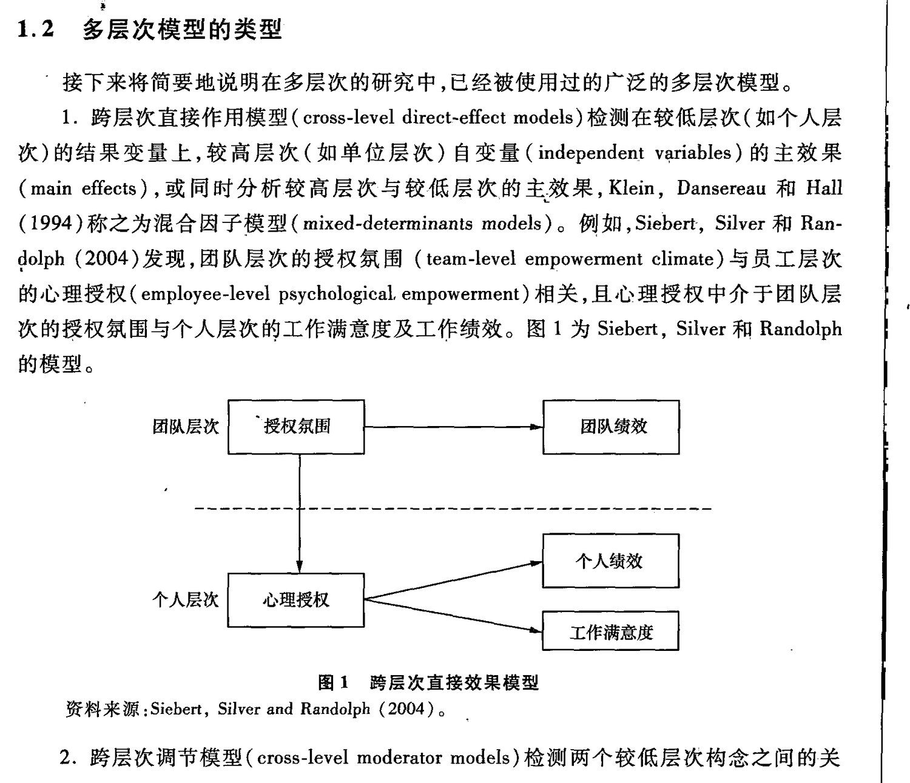

<!-- PDF页 349 -->

(2003)检验了团队层次的安全气候(safety climate)对个人层次的领导者部属交换(leader-member exchange) 与员工的安全公民角色定义(safety citizenship role definitions) Z [A] '关系的调节效果,结果发现,当正面的安全气候存在时,领导者部属交换与安全公民角色定义之间的相关性更高。图2% Hofmann, Morgeson 和 Gerras 的模型。安全气候| |领导者部属安全公民人民生 |:交换 TT 人——一安全公民行为:图2 跨层次调节模型资料来源:Hofmann, D. A., Morgeson, F. P. and Gerras, S. J. (2003).. 3. 跨层次青蛙池塘模型(cross-level frog-pond models)说明较低层次的个人在较高:层次中的相对位置,对较低层次的结果变量有何影响。同样的一只青蛙,假若池塘很大,这只青蛙看起来可能会很小;若池塘很小,这只青蛙看起来就可能很大。 例如,假设我们要检测薪资的高低与工作满意度之间的关系,个人的工作满意度可能就会取决于其相对于和群体中同事的平均薪资水准。图3 为此模型的概念化。' Ki — Xeroup mean Yy, + | 图3 跨层次青蛙池塘模型' 4. 一致的多层次模型(homologous multilevel models)说明构念以及连结构念间的关系是可被概化到不同组织的实体上的。在这种模型中,两个或两个以上变量之间的关! | 系是可能同时存在于个人、群体及组织等多个层次中的。例如,DeShon,Kozlowski, | Schmidt, Milner #1 Wiechmann (2004)检验一个多重目标绩效模型在个人和团队层次上° 的一致性,结果发现79% HRRETA SAAB Re, EMT TE WAKA A: 时存在于不同层次的多层次模型。图4 DeShon, Kozlowski, Schmidt, Milner 和 Wiec- | H hmann 的模型。 1 1.3 ”多层次模型的分析策略 |关于方法论的发展,现已有许多可行的多层次分析技术,包括协方差分析(analysis | of covariance, ANCOVA, 亦译为共变数分析)、使用普通最小二彝回归 (ordinary least | squares regressions, OLS, 亦译为最小平方回归分析) 的情境分析 (contextual analysis) | (James and Williams, 2000)、组内与组间分析(WABA,, Dansereau, Alutto and Yammari-: no, 1984; 亦见 Dansereau and Yammarino, 2000)、使用 HLM 分析多层次随机系数模型! | (Bryk and Raudenbush, 1992) WR & Ue St AE aH #4 5} HF (multilevel covariance structure | | 第十五章 | 多层次理论模型的建立及研究方法 | 335 | t k

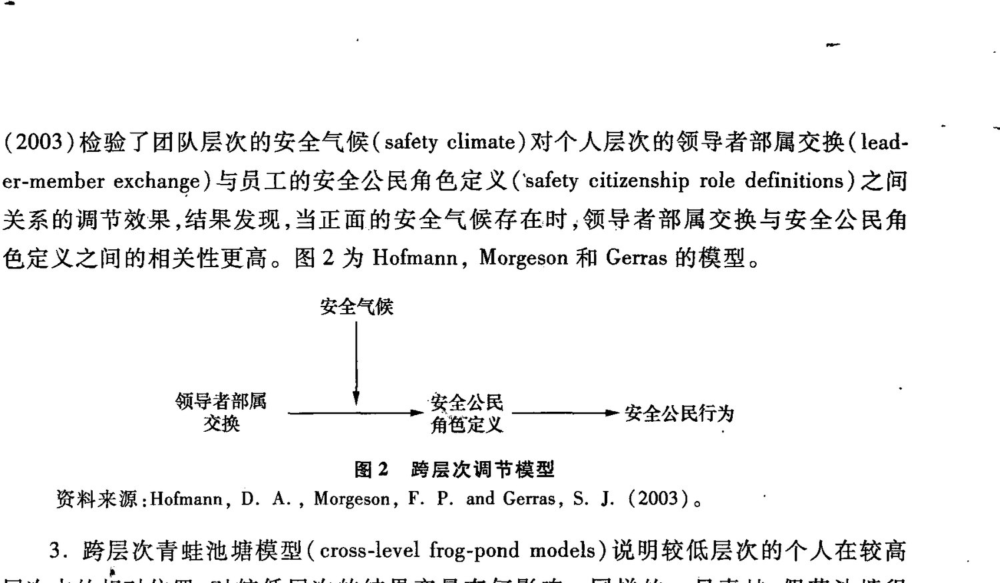

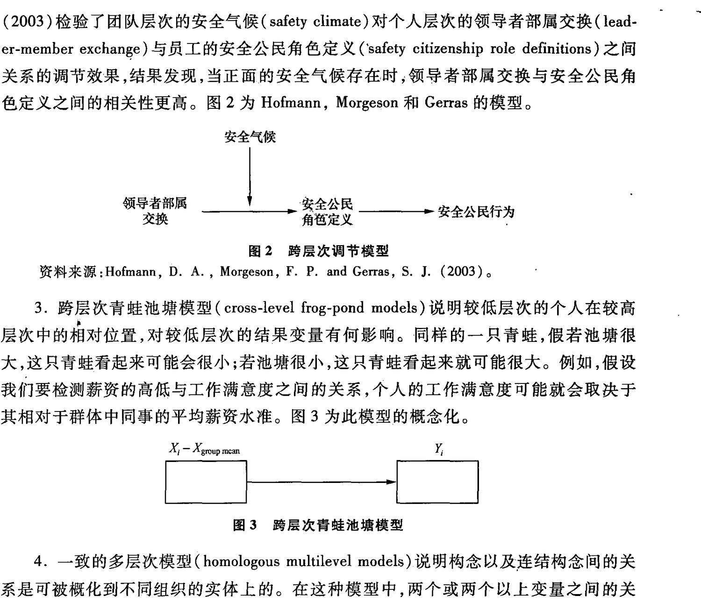

<!-- PDF页 350 -->

”团队自律过各 " | He |意向 2 [eee a H&s Hy" |绩效导向团队效能关注团队的努力 |反馈。个体 -一一-~一-一~------~-----~-- “团队、. “个体和团队、。 个体自律过程个体特征 BP 行动绩效导向自我效能关注自我的努力: 图4 一致的多层次模型 1资料来源:DeShon, Kozlowski, Schmidt, Milner and Wiechmann (2004), | analysis) (Muthen, 1994)。由于篇幅的限制,无法详细介绍所有类型的多层次模型与分析技术,因此,本章着重在数据合并(data aggregation) 议题与 HLM 的介绍,前者是将混合因子模型中较低层次构念的回答进行聚合的重要议题,后者是越来越多学者用来分析跨层次模型的方法。二、多层次分析的构念与单位层次构念的数据聚合 | Kozlowski 和 Klein (2000) 认为构念是多层次理论的组成要素,因此,建议研究者明 |确地说明假设理论模型中构念的所在层次。多层次模型常包含个体层次 (individual- 1; level)与单位层次(unit-level) 的构念,例如,个体的人格、认知、情感与行为是典型的个 t人层次的构念,而组织气候、组织文化与团队绩效是典型的单位层次的构念。然而,一 |个变量在某些理论模型中是个人层次的构念,但在其他模型中却有可能是单位层次的;构念,例如,正向情感(positive affect) 被认为是个人层次的构念,且与个人的乐观、被喜 |爱程度、社交能力、主动有活力等特质有关。George(1990)认为通过吸引一王选一留任的程序(ASA,Schneider, 1987)与群体社会化的程序,同一群体的成员可能会有相似的情感反应,因此,她以正向情感语调(positive affective tone)作为群体层次的构念,并将 j其定义为同一群体内一致的正向情感反应,且发现此构念与群体层次的旷工行为呈现 |负相关。所以,研究者必须明确地解释为何一个构念被放置在某层次的理论根据。个人层次的构念是以个人层次来衡量的,其操作比较直观简单。然而, 对单位层次构念的操作就比较复杂。学者们(如,Chan,1998; Kozlowski and Klein, 2000)对单位层次构念的类型有详尽的探讨,并说明他们在操作上的不同。这些学者提出单位层次构. 念的类型可分为:共享单位特性(shared unit properties)、总体单位特性(global unit prop- |

!

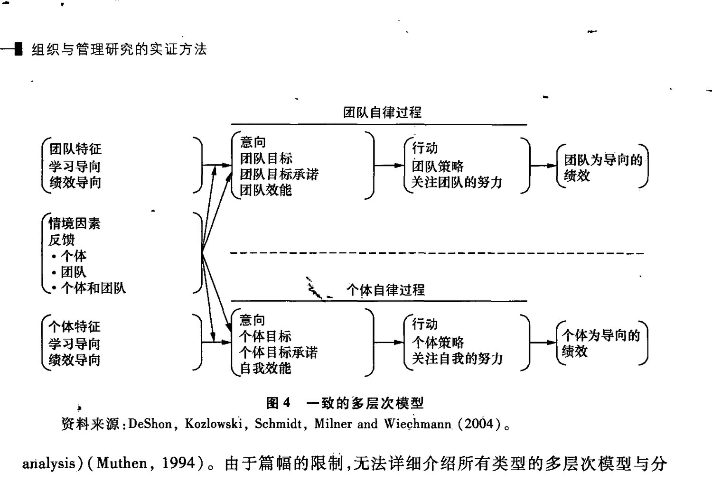

<!-- PDF页 351 -->

erties) 以及形态单位特性(configural unit properties)。接下来我们将简单地儿述这三种类型的构念,并介绍证明聚合(由个人层次到单位特性)合理的统计方法。2.1 单位层次构念的类型

共享单位特性:此类型的构念源自于组织内单位成员的经验、态度、知觉、价值观、认知及行为等,且被假定在 ASA、社会化及其他心理历程的作用下,会体现为一个单位层次的构念。例如,组织气候就是组织成员共享组织内的惯例、、政策及程序等。所以,操作此构念的关键在于将相同单位内的个别成员之回答分数计算为单位平均数,以育合为单位层次,而聚合的方法需要理论与实证的支持。在理论上,研究者须说明单位内回答的一致度和一致性如何从个别层次的特征浮现而来;而在实证上,研究者需证明达到了聚合的统计前提,后续将会对聚合分析有详细的探讨。此外,为了操作共享的构念,研究者需要取得一个具有代表性的样本,以取得构念的相关信息。根据参考点的不同,共享单位特性还可分为两种类型:

直接一致构念(direct consensus constructs,亦译为直接共识构念):与共享单位特性一样,此构念源自于个别团体成员,并由聚合个别的分数而取得。此构念呈现出团体成员分享他们个别的知觉或特质,如认知能力、风格、人格、智力及行为变量 (Chan, 1998)。犹如曾提过的,George (1990)衡量工作团体的情感语调是将个别情感的测量聚合到团体层次,并检测团体内情感的一致性而产生了两个聚合后的变量:正向的团体情感语调及负向的团体情感语调,此构念描述的是团体属性(group attribute) 而非个别心理属性(individual psychological attribute),

移转参考点共识构念(referent-shift consensus constructs):与直接一致构念一致,此构念源自于个别团体成员,并由育合个别的分数而取得。然而,不同于直接一致构念的是,移转参考点共识构念只有在成员共享其团体属性的知觉时才有意义。这种构念的问项可能为“我有信心我的团队可以完成此项任务”。此构念描述的是团体集体的属性(group collective attribute) 而非团体属性或个别心理属性。Ehrhart (2004)将移转参考点共识模型应用于检测部门的程序公正氛围(procedural justice climate),要求员工去思考在工作部门中获得奖酬的程序,其间项包含“这些程序曾一贯地在你的部门中实行吗?”这个例子中的参考点为部门,用以了解团体的集体程序正义。

总体单位特性:此类型的构念相对而言是客观的、描述性的.易于观察到的单位特征。总体的构念不同于共享单位特性,它直接源自于单位层次,而非个人层次,例如,公司的年龄,规模大小位置、策略。总体的构念决定于单位的结构或功能,而非决定于个别成员的知觉、经验、态度等,而操作总体单位特性的关键在于尽可能地向主题专家

| (subject matter experts, SME) 取得精确的信息或档案数据,因为在评估总体单位的特性时,主题专家的丰富知识可能有助于降低测量误差,而主题专家之间的回答共识和一至性可由后续讨论的聚合验证统计方法处理。LEED | 多层次理论模型的建立及研究方法 | 337

<!-- PDF页 352 -->

形态单位特性:此类型的构念是指在单位中,个人特征的形态或配置情形。如同共享的构念,配置的构念也是源自于个人层次,然而,并不假设单位成员之间会趋于一致,例如,年龄多样化与性别多样化是两个形态单位的构念,且分别描述了单位成员的年龄与性别的分布,因此,成员间不必有相同的年龄或性别。理想上,研究者在操作形态构念时,必须向单位中的所有成员取得构念的信息(如年龄),车无法达到理想的回答率(response rate),研究者必须证明回答的样本具有足够的代表性。此外,研究者不必评估个别成员之间的一致性,因为形态构念的分数可由个别成员分数的最小值、最大值、方差(亦译为变异数) 或标准差等数值来计算。例如,Lindell 和 Brandt (2000) 以领导者、团队、角色及工作特性为特征来衡量组织气候,并使用组织气候的方差来推估气候的一致性,在此例子中,方差被视为是群体的一个概括的特征或是形态。,; 在上列的单位层次构念的类型中,对共享单位特性(不论是直接一致构念或移转参考点共识构念)与主题专家所评估的总体单位特性而言,聚合个人层次的回答是必需的。因此,以下将探讨常被用来评估是否可以聚合个人层次作为单位层次的统计验证方法。2.2 聚合的统计验证方法(justification statistics for aggregation)在聚合个人的回答到单位层次之前,研究者必须确认聚合有理论与实证的支持。而在实证的验证上,在文献中有一些讨论(如,George and James, 1993; Yammarino and Markham, 1992), Bliese (2000)在其著作中详细说明了有关珍合的许多一致度与信度指标,我们接下来将介绍三个在多层次研究中常用的指标,即组内一致度 (within-group agreement)、组内相关(1)或ICC(1) [intra class correlation (1) or ICC(1)]和组内相关(2)或ICC(2)[intra class correlation (2) or ICC(2)]。1. 组内一致度| 首先,研究者必须确认是否有高度的组内一致度。组内一致度是指回答者(如相同单位的个别成员)对构念有相同的反应程度 (Kozlowski and Hattrup, 1992)。如 Bliese (2000)所提到的,在组织文献中最常用来衡量组内一致度的有适用单一问项量表的Tog) 或适用多问项量表的 rs (James, Demaree and Wolf, 1984; 1993)。James 等(1984)对组内一致度的衡量是使用观察到的群体方差与期望的随机方差相比较。单一问项量表的公式如下: Taga) = 1 ~ (s/o8o) EBA ry) RRR P bMS SX 的组内一致度,s: 是指观察到的X方差,而 o纪是假设所有回答者只存在随机测量误差下所期望的X 方差。多问项量表的公式如下:: a J[1 = (sh) oi] |?J1- (s/o8)] + (s5/0%,) '

<!-- PDF页 353 -->

上述公式中,rs是指在了个平行的问项上所有回答者的组内一致度,5是指在 J个问项上所观察到的方差的平均数,而 os是指假设所有回答者只存在随机测量误差下所期望的方差。

以上的公式可用来计算每个群体的组内一致度。在组织文献中,基本法则是呈现众群体的 +,中位数或平均数,假若 rs值大于 0.70,表示京合有足够的一致度。有一些情况是,虽然 r,值大于0.70,但某些群体可能存在相当低的一致度,在此情形下,研究者可使用回归或 HLM 去分析在有或没有这些群体的情况下,结果是否会有很大的不同,车是,则必须进一步研究是否适合将高组内一致度与低组内一致度的样本结合在一起。然而,将低7,值的群体去除很可能会删除掉某些存在于群体中的现象。例如,当有子气候(subclimates)存在时,服务气候的 +。,值可能很低,但这不一定意味着完全没有一致度存在(Lindell and Brandt, 2000)。在此例子中,研究者可探究子群体间在个人层次或群体层次变量上的差异性,而不是将这些群体去除。

James 等(1984)提出了 o3,即期望随机方差(expected random variance) 的选择之一是假设群体成员的回答呈现统一性分布(uniform distribution)下所得到的方差。均勾分布是指群体成员的每一个回答选项都有相同的回答人数的分布状态,例如,假设有 10个人来回答一个五点量表(5-point scale) 的构念,分别有2 个人回答1、2 个人回答2、2个人回答3、2 个人回答4以及2个人回答5。在均匀分布下,osu = (C? -1)/12,C WE案选项的数目,在李克特量表(Likert scale) 中的五点量表、七点量表与九点量表的 0%分别为2、.4 与 6.67。

然而,均匀分布可能不是一个代表实际期望分布的选择,因为多数个人的回答都存 -在回答偏误。例如,在正向反应偏差(positive response bias) 情况下,回答者更可能会选择正面的选项(如3、4 或5),此种回答范围的限制将会降低组内方差(亦译为组内变异,相较于均匀分布的方差),造成群体成员之间有高度一致度的幻觉。James 等(1984)针对期望分布提出了一些限制与建议方案,例如,研究者可以使用偏态分布(skewed distribution) 的方差作为计算 r。,时的期望方差,至于选择正偏态(positive skew)或负偏态(negative skew),取决于所要衡量的变数。然而,Bliese (2000)提到因为有无限个偏态分布可选择,所以偏态程度的选择可能会较武断,这也是研究者要作的决定,而以回答偏误调整过的 r。,则提供了更谨慎的组内一致度的衡量方法。James 等提供了三个负偏态期望分布的选择,以模拟不同的偏态程度。例如,在小偏态的情形下,五点量表每个回答选项的几率可设定为:1 =0.05、2 =0.15、3 =0. 20.4 =0.35 和5 =0.25,在此例子中,osy =1.34,将其代入上述公式即可算出 7。。。

Kozlowski 和 Hults (1987)提出了另一个期望方差的选择。他们建议:首先,使用有独立数据点的数据库的分布方差来设定组内一致度的下限,再使用均匀分布的方差来设定组内一致度的上限,而真实的一致度会界于以上两者之间。

Bliese 等学者建议使用随机群体再抽样(random group resampling,RGR)来估计期

| SLER | 多层次理论模型的建立及研究方法 | 339

<!-- PDF页 354 -->

望随机分布(如 Bliese and Halverson, 1996; Bliese, Halverson and Rothberg, 1994)。RGR 是随机地分派个体到数个与真实群体一样大小的假性群体(pseudo group)中,假性群体方差的分布是期望分布,它的方差被用来与真实群体方差作比较,以确定真实群体方差是否显著地小于或大于假性群体方差,假若真实群体方差显著地小于假性群体方#,表示具有组内一致度。此外,Bliese (2000)建议使用平均假性群体方差作为计算 r。。时的期望随机方差,使用 RGR 计算一致度的 S-PLUS(Statistical Sciences, 1997)算法可咨询 Bliese。

2. 组内相关(1)或ICC(1)

除了验证个别的回答具有充分的组内一致度之外,研究者必须在到合个别回答到群体层次之前,先检测是否有足够的组间差异,组间方差(亦译为组间变异) 的存在是检测群体层次构念与其他构念之间关系的要索。例如,为了检测服务氛围(是由个别员工的回答算出平均数,以作为店层次的构念)与店销售量之间的关系,我们必须得知员工们对服务氛围的知觉,在店与店之间是否有显著的变异,假若店与店之间在服务氛围上没有差异(但在销售量上有差异),则服务氛围与销售量之间将有可能没有关系存在。

对于某一个变量在个人层次的回答,例如服务氛围,我们可通过 HLM 分析将其方差分为组间方差(between-group variance)与组内方差(within-group variance)。 服务气候在个人层次的回答的总方差为组间方差 +组内方差,如此,我们可由以下公式计算出服务氛围的ICC(1)或是店与店之间在服务氛围上的变异程度:

: ICC(1) = 组闻方差 /(组间方差 + 组内方差)

此外,HLM 亦使用卡方检验(chi-square test)来检测组间方差是否具有统计上的显著性,假若服务氛围的组间方差是显著的,且 ICC(1)是有意义的,那么我们便有另一个证据显示,将个别的回答聚合到店层次是可行的。James (1982) 回顾了组织研究,并发现ICC(1)的范围在0.00 到0.50 之间,中位数为 0.12,但 Bliese (2000)认为这个范围可能高估了,因为 James 将 eta-squared® 与 ICC(1)视为等同。当一个群体样本数很大时,eta-squared 等同于 ICC(1),然而,当群体样本数很小时,相较于 ICC(1), eta-squared显著地被高佑了。因此,在实务上.,研究者可以检测组间方差是否显著,但不一定要以0.12 作为是否可以聚合的判断值。

3. 组内相关(2)或ICC(2)

第二个要考虑的组内相关系数是 ICC(2)。ICC(2)是指群体平均数的信度(reliability) (如 Bartko, 1976),亦即将个人层次变量聚合成群体层次变量时,此变量的信度。ICC(2)也与ICC (1)和群体大小有关,其公式如下:

@ eta-squared(n”) =组间平方和/总平方和,它通过 ANOVA 的数值计算,用下检验来判断显著性,以检验组间是否有差异,即了解个别分数的变异有多少是来自于组间差异。然而,F 检验易受群体样本数的影响,当样本数较大时,eta-squared 易显著,反之,样本数过少时,则有高估的倾向。!

<!-- PDF页 355 -->

tee) = rt eery

上述公式中,k 表示群体样本数的大小。犹如 Bliese (2000)所提到的,ICC(1)、ICC(2)与群体样本数的大小这三者之间的关系如下:ICC(1)可以被视为是一个信度的测量值,而这个测量值和单一群体平均数有关(James, 1982),当 ICC(1)很大时,单一群体成员的回答可能就足以提供相对稳定的群体平均数,而当 ICC(1)很小时,群体平均数就必须以多个群体成员的回答来估计。Bliese (1998)指出,在检测群体层次构念与其他构念之间的关系时,有可信的群体平均数或高 ICC(2)是必要的。例如,Bliese 发现,当有高 ICC(2)时,即使因变量与自变量的1CC(1)为 0.01,即较低层次的回答只有1%来自于组间方差,依然能够在群体层次检测出因变量与自变量之间的关系。

要有高 ICC(2)就必须要有很大的群体样本数,犹如为了要有可信的量表,我们必须使用多个相同意思的问项来测量,因此,为了获得可信的群体平均数,必须取得更多样本数的回答。在 ICC(1)固定时,群体样本数越大,ICC(2)就越高。ICC(2)最好是要达到 0.70,但在组织研究中,尤其是小群体的研究中,通常无法有很大的群体样本数,因此,在多层次组织研究中,ICC(2)通常小于 0.70。针对此议题,有学者认为即使有相对低的ICC(2),但假若聚合获得理论支持且有高的 7,以及显著的组间方差 RAHA A行的(Chen and Bliese, 2002; Kozlowski and Hattrup, 1992);但车ICC(2)很低,研究者必须承认低群体平均数的信度可能已阻碍了聚合后变量效果的检测,而且相较于高 ICC (2),低ICC(2)所观察到的变量效果可能被低估了。

### 三、关于 HLM 的介绍

接下来,我们将介绍一个跨层次模型的统计分析程序,其中,结果变量(亦称因变量)是个人层次的变量,自变量则是个人层次和群体层次的变量丝有,而所使用的分析方法与软件为HLM。Bryk 和 Raudenbush (1992)中对 HLM 有很详尽的说明,Hofmann与他的同事亦对组织研究者使用 HLM 有清楚的介绍(Hofmann, 1997; Hofmann and Gavin, 1998; Hofmann, Griffin and Gavin, 2000),在此,我们仅作简要的讨论,强烈地建议有兴趣的读者参考上述学者的著作。

在使用 HLM 时,自变量可能是来自于较低层次的构念,例如个人层次(可称为 Level-1 变量);或是较高层次的构念,例如群体层次(可称为 Level-2 变量)。而这些变量之间的关系可由以下的模型求得:

Level-1 Model: Y, =Bo +B,X, + ry

Level-2 Model: By; = Yoo + Yo: G + Uo;

By = V0 t¥nG; + Ui,了;是指个人i在j群体中的结果变量,X,是个人i在j群体中的预测因子之值,B与BLE | 多层次理论模型的建立及研究方法 | 341

<!-- PDF页 356 -->

By则是每个;群体分别被估计出的截距项与斜率,rj为残差项。G, 是指群体层次的变量,yw与 Yio为 Level-2 RHA yo Fy, WE G6 与 Level-1 公式中的截距项与斜率项之斜率,U6与 Vj为 Level-2 的残差项。因此,在Level-1 Model 中,可检验出 Level-1 变量和Level-1 变量之间的关系,而在 Level-2 Model 中,可检验出 Level-2 变量和 Level-1 变量间的关系,以及 Level-2 变量如何干扰两个 Level-1 变量间的关系。3.1 HLM 的优点

许多学者提到,普通最小二乘回归法(OLS)忽略了同一个单位中阶层数据的相互

依赖性,因此,普通最小二乘回归可能会产生偏误与无效的估计标准误(standard errors)

(如 Bryk and Raudenbush, 1992; Hofmann, 1997),并且会增加第一类误差与第二类误差(Bliese and Hanges, 2004),所以,相较于普通最小二乘回归,HLM 在分析阶层性的数据上有许多优点。

第一, HLM 能够明确地分析赃套(nested) 性质的数据(比如, 个人嵌套于团队之中,团队嵌套于部门之中,部门嵌套于公司之中)。HLM 除了可以同时估计不同层次的因子对个人层次的结果变量有何影响之外,还能将这些预测因子保持在适当的分析层次(Bryk and Raudenbush, 1992)。此外, HLM 亦有助于多层次理论的发展(Kozlowski and Klein, 2000),因为在使用 HLM 时,研究者必须清楚地表明每一个构念的分析层次(例如要放在 Level-1 或 Level-2)与各层次构念间的关系为何(例如是在 Level-1.Level-2或跨层次的关系)。

第二,HLM 能够改善 Level-1 或个人层次效果的估计。如同 Bryk 和 Raudenbush (1992)与 Raudenbush,, Bryk, Cheong 和 Congdon (2004)所提到的,HLM 针对随机变化的 Level-1 系数,产生实证贝氏估计数(Empirical Bayes,EB)。实证贝氏估计数是透过.全部的资料来估计参数。更进一步说,Raudenbush 等认为“每个单位j 的 Level-1 系数的实证贝氏估计数是源自于两个来源的最佳组合:其一是基于该单位的数据所计算出来的估计值,其二是基于其他相似单位的数据所计算出来的估计值。直觉上,我们借用整体数据的优势来改善每个单位j 的 Level-1 系数估计数”(p.9)。因此,Level-1 系数的估计不是在每个单位j中独立地计算,而是基于全部数据所提供的信息计算的。Level-1系数估计方式的改善是相当重要的,因为 Level-1 系数是要被用来估计 Level-2 的固定效果(fixed effects)的。

第三, HLM 在估计 Level-2 固定效果时,使用广义最小二乘法 (generalized least squares,GLS,亦译为一般最小平方估计法)。固定效果可被视为是跨群体 Level-1 系数的加权平均,且通常被视为是预测因子与结果变量之间关系的估计数 (Hofmann, 1997)。广义最小二乘法优于普通最小二乘回归法之处在于其考量到每个群体所提供的信息精确度不一,亦即,有和较可信和和精确的 Level-1 估计数的群体,会获得更高的权重。

<!-- PDF页 357 -->

第四,HLM 提供了稳健的(robust)标准误估计数,即使HLM 的假设被违反(限于低限度的违反),此标准误估计数仍是一致的。因此,基于这些标准误估计数所做的假设检定统计推论是可信的,尤其当 Level-2 的样本数很大时(Bryk & Raudenbush, 1992).

第五,HLM 借由不平衡数据(unbalanced data,即每个群体的员工人数不同)的交互式计算(interactive computing) 技术,提供了方差协方差成分(variance-covariance components,亦译为变异共变因子)的有效估计数,这是传统的分析方法(如 ANCOVA)所无法达到的(Bryk and Raudenbush, 1992)。

### 3.2 研究问题与资料

我们在 Academy of Management Journal 上发表的论文(Liao and Chuang, 2004)使用了 HLM。该篇论文认为,服务业中顾客的满意度与组织的绩效息息相关,而服务人员在服务过程中与顾客的互动会影响到顾客所感受到的服务品质,因此,有必要进一步探究什么原因会影响员工的服务绩效,能提升组织绩效与顾客满意度。为此 Liao 和 Chuang建立了一个多层次的研究架构,来验证个人层次的因子与店层次的因子分别对员工服务绩效的影响,以及店层次的因子如何干扰个人层次的因子与员工服务绩效之间的关系;同时,亦将个人层次的员工服务绩效聚合为店层次的服务绩效,以分析店层次的服务绩效与顾客结果变项的关系。我们在此以该篇文章的部分数据,依据 Hofmann (1997)所提出的 HLM 分析程序,来进行实际操作分析。 由于原始文章的研究架构较复杂,变量也较多,因此,分析结果可能不会与原始文章的研究结果相同。图5 为示例的研究架构图。

图5 研究架构

在本例中,假设我们要检测的是影响员工个人服务绩效 (employee service performance)的自变量,此服务绩效是指员工在服务与帮助顾客的过程中,所表现出的满足顾客的需求与爱好的行为,因此,因变量为个人层次的服务绩效。在概念上,员工的服务绩效取决于员工个人的差异与情境因子,本例中,个人层次的因子即为外向性,而情境因子则为服务氛围。外向性(extraversion) 是五大人格因子之一,与个人善于社交、合群健将、积极的特质有关(Barrick and Mount, 1991),而服务氛围是指员工们对于政策、惯例以及受到奖励、支持与期望的顾客服务程序的共同知觉(Schneider, White and

Paul, 1998),因为服务氛围是员工们“共同的"知觉,所以将其设定为群体层次的构念,必须由同一群体中个别员工的知觉聚合而得。在此,我们假定分析的数据具有高组内SLES | 乡层次理论模型的建立及研究方法 | 343

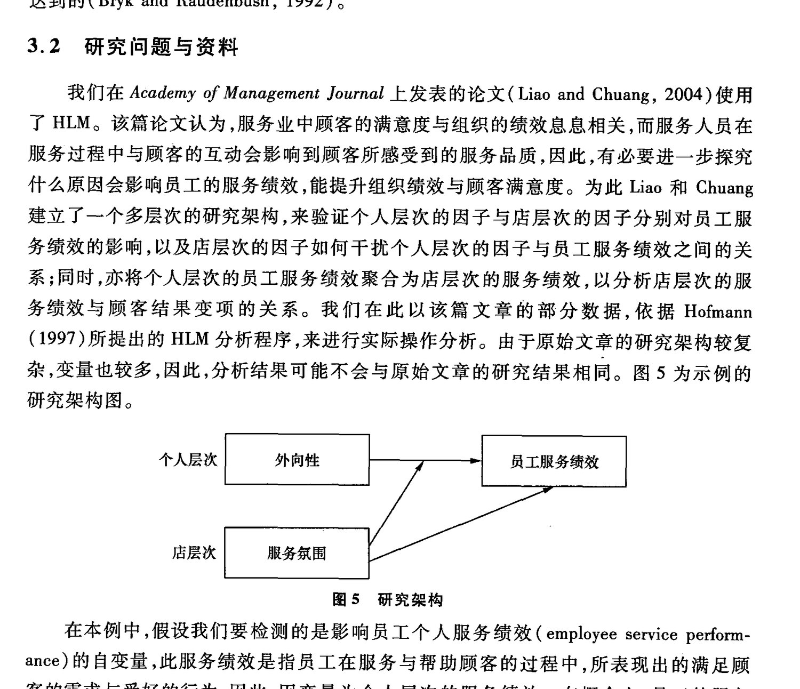

<!-- PDF页 358 -->

一致度,且员工对氛围的知觉有显著的组间差异,所以聚合是可行的。

基于人格和服务管理的文献,我们可以假设个人层次的外向性人格与群体层次的服务气候会正向地影响员工的服务绩效。进一步而言,已有学者认为人格与工作绩效之间的关系,并不一定对所有情境中的所有员工都会相同,所以,员工表现绩效时所处情境的强度已被认为会调解人格与员工行为之间的关系(如 Barrick and Mount, 1993; Mischel, 1977)。在强情境(strong situations)之下,对于员工如何表现出令人满意的行为会有较一致,清楚的规范。然而在弱情境(weak situations)之下,缺少一致、清楚的规范(Mischel, 1977)。因此,相较于员工在强情境中的行为,员工在弱情境之下在人格上的差异更可能会影响其表现的行为。此外,正向的服务气候可以通过主管在日常管理上不断地表现出对服务品质的重视,来创造出鼓励服务的氛围,因此,在强情境之下则限制了个人人格的表现。基于以上所述,我们假设服务氛围将会调节外向性与服务绩效之间的正向相关性,当服务氛围越正面时,此正向的相关性就会降低。在此,提出以下三个假设(hypotheses):

假设1:个人层次的外向性与员工的服务绩效呈现正相关;

假设2:群体层次的服务氛围与员工的服务绩效旦现正相关;

假设3:群体层次的服务氛围调节外向性与员工服务绩效之间的关系,以至于越正面的服务氛围,越会降低其正向的相关性。

接下来我们将使用在美国中西部的25 家连锁餐厅收集到的 257 位员工的样本,来探讨用以检验假设的 HLM 方程与统计检验。

Step I:零模型(Null Model)

由于我们假设个人层次的员工服务绩效可由个人层次与群体层次的变量来预测,所以必须显示出服务绩效在个人层次与群体层次上丝有变异存在,因此,第一个步骤要使用方差分析(ANOVA),将服务绩效的方差分成组内与组间方差。在此使用的 HLM估计的零模型是没有预测因子的,其模型如下:

Level-1 Model; 服务绩效; =By + ry

Level-2 Model; Bo = yo0 + Up;

在上述模型中,

Bw =第j个群体的服务绩效平均数

Yoo =服务绩效的总平均数

ry的方差 =o? =服务绩效的组内方差

Vo的方差 =7oo =服务绩效的组间方差

由于服务绩效的总方差 =o? + 7o,我们可依此计算出 ICC(1),即服务绩效组间方差的百分比,其公式如下:

ICC(1) = ro/ (0 + To)

<!-- PDF页 359 -->

此步骤分析结果为 ro。=0.35,且卡方检验的结果表明组间方差是显著的:x (24) = 58.45, p<0.001。 此外,o?=2.52,故ICC(1) =0. 12,表示员工服务绩效的方差有 12%是来自于组间方差,而 88%是来自于组内方差。

由于服务绩效具有显著的组间方差,接下来便可进行假设检验。

Step 11: 4239 (Rig 1B Level-1 的主效果

为了检验假设 1,我们将外向性加入 Level-1,并估计以下的模型:

Level-1 Model; 服务绩效; = Bo, +B, (SHITE) +r

Level-2 Model: Bo; = yoo + Ug;

Buy = 0 + U,,

在上述模型中,

Yoo = BEF AS AR PE IT HF HY He

Vio =跨群体斜率的平均数(用来检验假设 1)

ry的方差 =o* = Level-1 RH NAH

U6的方差 =7o。=截距的方差

UV的方差 =71, =斜率的方差

在上述模型中,yw与 yio分别代表 Level-1 的系数(即 Bw与 B,)跨群体的平均数,其中 yw是表示外向性与服务绩效跨群体的关系,因此可用来检验假设1。另外,HLM 亦对 yw与 yw进行:检验,如此便可检测这两个参数的统计显著性。此步骤的分析结果为yio =0.58, t-value (24) =43.68, p <0.001,因此,假设1 得到支持。

在 Level-1 的模型中,可通过加入外向性后组内方差减少的程度来计算 R*(此为一个 pseudo R?,即准 R平方),换言之,我们可计算出零模型中的组内方差有和多少百分比可被外向性解释,公式如下:

R’ for Level-1 model = (a from Step I - o” from Step II)/o” from Step I.

在这个例子中,Level-l 模型的 R® = (2.52 -2.23)/2.52 =0.12,表示服务绩效的组内方差(非总方差)有 12%可被外向性解释。

此外,在加入外向性后,ro。=4.52,卡方检验的结果显示此组间方差显著:x*(24) = 33.24, p <0.10,表示在 Level-2 模型中有可能存在群体层次的因子,因此,我们接下来检验假设 2。

Step II:检验 Level-2 的主效果

为了检验假设2,我们将服务氛围加入 Level-2,并佑计以下的以截距作为结果变量(intercepts-as-outcomes) 的模型;

Level-1 Model: 服务绩效; = Bo; + By(外向性;) +7;

Level-2 Model: Bo; = Yoo + Yo (服务氛围,) + Us;

By = 10 + Ui;

在上述模型中,

<!-- PDF页 360 -->

Yoo = Level-2 MARIE

Yor =加入外向性后,服务氛围对服务绩效的影响效果(用来检验假设 2)

yw =外向性对服务绩效的影响效果(用来检验假设 1)

的方差 =o” = Level-1 残差的方差

UV的方差 = Too = 截距残差的方差

UV的方差=71 =斜率的方差

上述模型中,yo是表示控制了 Level-1 的外向性后,服务氛围与员工服务绩效之间关系之估计数,对 yo进行;检验可用来检验假设2。此步骤的分析结果显示:yo, = 0.74, t-value (23) =0.74, p=0.012,因此,假设2 得到支持。

同 Step I,我们可以计算有多少百分比的服务绩效组间方差可以被服务氛围解释,其公式如下:

R? for Level-2 main effect model = (7T0 from Step I-79) from Step III) /7,, from Step II = (4.52 -4.09)/4.52 =0.10

结果显示,有 10% 的服务绩效组间方差(非总方差)可以被服务氛围解释。

此外,HLM 亦佑计了斜率(7) 的方差,并以卡方检验来检测此方差的显著性。结RRA rr, =0.19,久(24) =22.23, p >0.10,表示外向性与员工服务绩效之间的关系在各群体间没有显著的变异,换言之,假设3 将无法得到支持,因为检定假设3 WHE是和斜率的方差要显著。然而,为了便于示范,我们仍然进行调节效果的检验。

Step IV:检验假设 3 或调节效果

一般来说,为了检验 Level-l 变量与 Level-2 变量的交互作用,我们可以估计一个斜率作为结果变量(slopes-as-outcomes) 的模型,换言之,我们可以将 Level-2 的变量作为斜率系数(Bi;)的预测因子,以得知此,Level-2 的变量是否可以解释斜率的变异。其模型如下:

Level-1 Model: 服务绩效; = Bo + By(外向性;) tr

Level-2 Model: By; = Yoo + Yo (MRS FR HL;) + Uy

By; = V0 +7 ARS FR,) + Uy

在上述模型中,

Yoo = Level-2 的截距项(以 Level-1 Model 的截距为因变量)

Yo. = Level-2 的斜率

Yio = Level-2 的截距项(以 Level-1 Model 的斜率为因变量)

Yu =level-2 的斜率,即服务氛围对外向性与员工服务绩效关系之调节效果(用来检测假设 3)

ry的方差 =o” =Level-1 残差的方差

UV的方差 =7o = 截距残差的方差

V1的方差 =71 =斜率残差的方差

<!-- PDF页 361 -->

| 假设3 是预测服务氛围与外向性之间有负向的交互作用,以至于当存在高程度的服务氛围时,外向性与员工服务绩效之间的正向相关会降低。上述模型中,y,是表示服务氛围与外向性之间交互作用项的估计数,对 yi进行:检验可用来检测假设 3。此步TRY OT RAB AR:yi = -0.25, t-value (23) = -0.864, p >0.10,虽然交互作用的效果与假设3 预测的方向一致(即为负向的交互作用),但统计上不显著,因此,假设3 未得到支持。 |

假若读者想要计算斜率方差被服务氛围解释的程度,同样地,可以比较 Step IV 与Step I 的斜率残差方差,其公式如下: R? for Level-2 moderating model = (7, from Step III -7,, from Step IV)/7,, from Step III = (0.19 -0.19)/0. 19 =0结果显示,调节效果的 R 为0,此结果并不令人感到意外,因为交互作用的效果不BF.总之,HLM 的分析结果(见表1)为假设 1 与假设2成立,假设3不成立。表1 HLM 的分析结果变数 Step I Step II Step III Step IV截距项 (00) 9.33°° 7.32°* 4.86 °° 1.77 Level-1 预测因子外向性(yo) 0.58°* 0.59°* 1.40 Level-2 预测因子服务气候 (vo) 0.74° 1.68交互项外向性 x服务气候 Cy) -0.25方差a 2.52 2.23 2.22 2.23 To 0.35°° 4.52" 4.09" 4.22 Ty 0.20 0.19 0.19 R. Reet 0.12 River? waist" 0.10 Reeve 2 交世作用妆果“ 0 N(员工) =257, N(店) =25。“预测变量所对应到的数值为在稳健的标准误(robust standard errors)下的固定效果的估计数(ys)。* Riva: = (0 of null model or Step I ~ a” of Step II) /a” of null model. ° Reeve? est = (700 of null model or Step I ~ 79) of Step III) /r9) of null model. * Revs gntmmen = (Tu of Step Ill -7,, of Step IV)/r,, of Step IIL. tp <0.10

## 第十五章 | 多层次理论机型的建立及研究方法 | 347

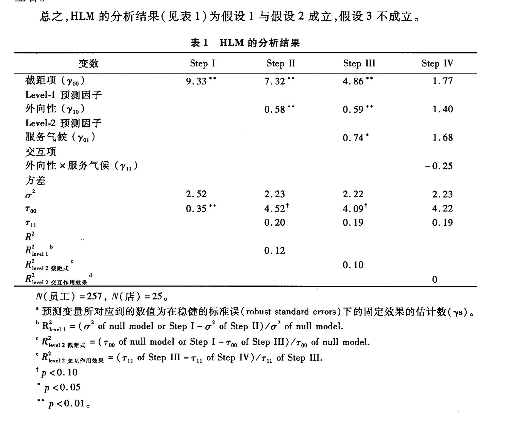

<!-- PDF页 362 -->

### 3.4 HLM 的中心化问题(centering issues)

在 HLM 中,对于 Level-1 的预测因子有三个中心化的处理方法:

1. 原始尺度(raw metric):意即 Level-1 的预测因子是使用其原始的分数。当所有Level-1 预测因子的值为0 时,Level-1 的截距项即为结果变量的期望值。此外,截距项的方差(7) 即表示在控制住 Level-1 预测因子的效果之下,已调节过的(adiusted) 结果变量组间方差。

2. 总平均数中心化(grand-mean centering):是指每一个人的分数减去 Level-l 预测因子的总平均数。当所有 Level-1 的预测因子减去其各自的总平均数时,Level-l RE项即为在 Level-1 预测因子作总平均数中心化时,结果变量的期望值。此外,截距项的方差(7o)即表示在控制住 Level-1 预测因子的效果之下,已调节过的结果变量组间方差。

3. 组内平均数中心化(group-mean centering):是将每一个人的分数减去 Level-1 预测因子的组别平均数。当所有 Level-1 的预测因子减去其各自的组别平均数时,Level-1

。 的截距项即为在 Level-1 预测因子作组别平均数中心化时,结果变量的期望值。此外,截距项的方差(7o) 即表示在没有控制住 Level-1 预测因子的效果之下,未调节过的(unadjusted) 结果变量组间方差。

HLM 的中心化处理是个比较复杂的议题,且已有许多研究者探讨过中心化会如何影响 HLM 的统计估计与解释(如 Bryk and Raudenbush, 1992; Hofmann and Gavin, 1998)。例如,Hofmann 和 Gavin 对于 Level-1 的预测因子使用以上三种中心化的处理方法上的意涵有很详细的说明,我们鼓励有兴趣的读者详阅他们的著作。基于 Hofmann和 Gavin 的研究,在此列出关于 Level-1 的预测因子在中心化处理上的一些基本知识及

1. 使用原始尺度与总平均数中心化这两种方法,会产生两个等同的模型,但组别平均数中心化的处理结果却不等同于这两个方法。

2. 假若要检测 Level-1 预测因子的主效果,对 Level-1 预测因子使用原始尺度或总平均数中心化都是适当的处理方法。在我们的例子中,为了检测假设 1,我们可以选择使用原始尺度或总平均数中心化来处理 Level-1 的外向性,以估计外向性对服务绩效的影响效果。

3. 假若要在控制住 Level-1 预测因子的效果之下,检测 Level-2 预测因子的主效果,对 Level-1 预测因子使用原始尺度或总平均数中心化处理都是适当的。在我们的例子中,为了检测假设2,我们可以选择使用原始尺度或总平均数中心化来处理 Level-1 的外向性,以估计在控制住外向性的效果之下,服务氛围对服务绩效的影响效果。

4. 在估计 Level-2 预测因子的主效果时,假若对 Level-1 的预测因子使用组别平均数中心化来处理,则 HLM 将无法控制住 Level-1 预测因子的效果。所以,为了能够适当

<!-- PDF页 363 -->

地控制住 Level-1 预测因子的效果,必须将 Level-1 预测因子的组别平均数加入 Level-2作为控制变量。在我们的例子中,假若我们使用组别平均数来中心化 Level-1 的外向性,则必须将外向性的组别平均数与 Level-2 的服务氛围一起加入 Level-2 作为控制变量,如此才能体现在控制了外向性的影响之后,服务氛围对员工服务绩效的效果。5. 假若要检测 Level-1 预测因子与 Level-2 预测因子之间交互作用的效果,使用原始尺度或总平均数中心化来处理 Level-1 的预测因子丝可。然而,因为在这两个处理方法之下所产生的 Level-1 斜率包含了组内与组间的关系,所以,跨层次交互作用(crosslevel interaction) 的效果可能会是假性的(spurious)。因此,为了估计到真实的跨层次交互作用的效果,Hofmann 和 Gavin (1998)建议较佳的处理方法是估计下列的模型,在此模型中,Level-1 的预测因子是使用组别平均数中心化来处理,并将组别平均数加入 Level-2 作为控制变量。另外,我们明确地控制组间交互作用 (between-group interaction) 的效果。在我们的例子中,即是将“外向性的组别平均数 x 服务氛围"视为 Level-2 的控制变量,以能控制住组间交互作用的效果,在我们的例子中,其模型为: Level-1: 服务绩效; = Bo + By (PPA Ee essere ny) try Level-2: Bo; = Yoo + Yo (外向性的组别平均数,) + yo(服务氛围,) | +Yo(外向性的组别平均数 x服务氛围), + Us, By =Ywo +Yu(服务氛围,) + U,,上述模型中,pi,是外向性与服务绩效之间组内关系的估计数,而 yi是在外向性与服务氛围的主效果被适当地解释下,所估计到的真实的跨层次交互作用效果的估计数。Hofmann 和 Gavin (1998)建议在实际操作时,可在估计跨层次交互作用的效果时,对 Level-1 的因子使用原始尺度或总平均数中心化来处理,接着再使用组别平均数中心化来再重新估计一次模型(组别平均数需被加入 Level-2 作为控制变量),然后,观察这两个模型所估计到的 y,参数值是否相同,若是,研究者就可以呈现使用原始尺度或总平均数中心化处理后的分析结果,并注明已使用组别平均数中心化双重确认过,以证明分析结果不是假性的。而我们认为,只要在 Level-2 控制住“外向性的组别平均数”和“外向性的组别平均数 x 服务氛围,那么即使 Level-1 的预测因子使用总平均数中心化,yu所估计到的也还是真实的跨层次交互作用效果的估计数。见如下模型: Level-1: 服务绩效; = Bo; + Bi(外向性qty) +r; Level-2: Bo; = yoo + Yo(外向性的组别平均数,) + Yoo (服务氛围,) +Yo(外向性的组别平均数 x服务氛围), + Uy, By =Yw +Yu(服务氛围,) + U,,上述模型中,既然组间交互作用(即 y。,) 已被明确地控制住,y,,所代表的应该是真实的跨层次交互作用效果的估计数。以上方法的另外一个优点是, 如 Hofmann 和Gavin (1998)所指出的, 既然我们一般会使用原始尺度或总平均数中心化来检测主效果,那么车以相同的方法来检测交互作用的效果,相信对读者而言应该是比较容易理解2t2R | 多层次理论模型的建立及研究方法 | 349

<!-- PDF页 364 -->

的。Liao 和 Chuang (2007)也是使用以上方法来检测个人体验到的转换型领导风格与店层次服务氛围的跨层次交互作用对员工服务绩效的效果。在他们的例子中,Level-l的预测因子,即领导风格,使用的是总平均数中心化;他们在 Level-2 控制领导风格的组别平均数以及“领导风格的组别平均数 x 服务氛围”。 |

总体而言, 选择以总平均数或组别平均数来作中心化的处理,应该要有理论的支持(Kreft, de Leeuw and Aiken, 1995),

此外,HLM 对 Level-2 的预测因子亦有两个中心化的处理方法:

1. 原始尺度:意即 Level-2 的预测因子是使用其原始的分数。

2. 总平均数中心化:是指每一群体平均的分数减去 Level-2 预测因子的总平均数。

对于 Level-2 中心化处理的估计与解释意涵很少被探讨到,而 Bryk 和 Raudenbush《1992)认为 Level-2 预测因子的中心化处理议题并不如 Level-1 预测因子一样重要,他们同时也提到“使用总平均数来对所有 Level-2 的预测因子进行中心化处理通常也是很实用、方便的”(p.29)。

Bryk 和 Raudenbush (1992)提到典型的二阶线性 HLM 模型必须有下列的统计假设:

1. 在每个 Level-2 单位中的每个 Level-1 单位,Level-1 的残差项彼此独立、呈现正态分布,且有零均值.方差为 0?。

2. Level-1 的预测因子与 Level-1 的残差项互为独立。

3. Level-2 的随机误差项旦现多元正态分布,且缘有零均值、方差 7,,及共变量 Tags并且彼此独立。

4. Level-2 的预测因子与 Level-2 的残差项互为独立。

5. Level-1 的残差项与 Level-2 的残差项互为独立。.

Bryk 和 Raudenbush (1992)对上述的基本假设与违反假设的可能影响有一些探讨。因为 HLM 仍是一个正在发展的分析方法,我们尚无法清楚知道 HLM 分析对这些基本假设的违反在多大程度上不受影响。

### 3.6 HLM 分析所需的样本数

ALM 与其他统计分析方法一样,样本数越大,估计数越精确,统计检验力越高。假车要进行二阶层的 HLM 分析,不只需要很大的群体样本数,且每个群体中要有足够的个人样本数,但要取得很大的样本数是耗时又费力的,因此,我们必须了解进行 HLM 分析所需的样本数。然而 Hofmann 等(2000)提到,对于究竟要多少样本数,才能达到适当的统计检验力与无偏误的分析结果,仍然有许多事要探讨。Hofmann 等(2002)、Bassiri (1988) 55 van der Leeden 和 Busing (1994)认为在检测跨层次交互作用的效果时,为了

<!-- PDF页 365 -->

达到 0.90 的统计检验力,必须有 30 个群体样本数,且每个群体包含 30 个个人样本数。然而,在典型的组织管理研究中,群体数通常比较小,但比较欣奈的是有较大的 Level-2样本数,可以弥补Level-l 小样本数在统计检验力上的不足。例如,假若有150 个群体样本数,在维持相同的检验力之下,每个群体中所需的个人样本数就可以降低。

Maas 和Hox (2005) 的模拟研究检测 Level-2 与 Level-1 在不同样本数的情况之下,对多层次分析中的估计值(指回归系数与方差)与其标准误的影响。结果显示,只有在Level-2 为小样本时(小于或等于50 个样本),会导致对第二个层次的标准误有偏误的估计,而在其余的模拟情况下(如 Level-1 为小样本),回归系数、方差以及标准误的估计和芝无偏误且正确。

### 3.7 HLM 三阶层与广义型线性模型

接下来,我们将讨论二阶层 HLM 分析的两个延伸议题。

延伸议题1:三阶层 HLM 分析(HLM3)

我们已讨论过线性阶层模型的二阶层分析,而将二阶层模型扩充的方法之一就是增加另一个阶层。例如,假车我们所收集的样本数据是每个人被包含在不同的团队中,而这些团队又被包含在不同的组织中,即会呈现一个三阶层的数据结构。HLM 软件亦可以进行三阶层的分析。. ‘

举例来说,Joshi, Liao 和 Jackson (2006)从财富 500 强中的一家公司中挑选出46 个业务单位,再针对这 46 个单位的437 个团队中的3318 位业务员进行样本数据的收集,并使用三阶层的 HLM 来分析,以检测工作团队的人口统计特征组成与工作单位的管理人口组成会如何调节个人的人口统计特征(性别与种族)与薪资水准之间的关系。结果发现,团队中有色人种的比例越高, 因种族而衍生的薪资水准不平等现象越少;而工作单位中的管理阶层为女性与有色人种的比例越高,因性别与种族而衍生的薪资水准不平等现象越少。此外,结果亦发现绩效会部分中介于个人人口特性、团队人口组成及管理人口组成与薪资水准之间的关系。

延伸议题 2: 多层广义型线性模型(Hierarchical Generalized Linear Models, or HGLM)

前述的二阶层与三阶层 HLM 分析是适用于在每一个阶层的随机效果是呈现正态分布的阶层数据,然而,在某些例子中,Level-1 呈现正态分布的假设是不真实的,且也不容易以变量的转换来达到。以下为四个违反正态分布的典型例子:

1. 结果变量为二元变量(binary variable)。例如,员工是否已经离开公司(1 =高

职;0 =仍在职),这是在研究员工流动率时,典型的结果变量,在此例子中,Level-1 的残.差项只会产生两个值的一个,因此无法呈现正态分布,而 Level-1 的残差项也无法有同方差(homogeneous variance)。 垩者,在标准模型中,Level-1 结果的预测值并没有范围限制,因此,我们可能会得到大于 1 或小于0 的预测值,与真实情况不符,因为Y不可超过. SES | 多层次理论模型的建立及研究方法 | 351

<!-- PDF页 366 -->

[0, 1]的区间。

2. 结果变量包含计数数据(count data)或非负整数(non-negative integers)0、1、2...,数据中有许多的0 值。例如,在研究工作场所的安全时,典型的结果变量为职业伤害的员工人数,此例中,因为存在许多0 值(即许多员工都没有职业伤害),所以正态分布无法以变量的转换来呈现。且 Level-1 的残差项不会有同方差,相反必须视预测值而定(高预测值将会有大的方差),同样地,预测值也有可能会超出范围(即可能会有负的预测值)。

3. 结果变量为多项式变量(multinomial variable)或包含多个(>2)类别。例如,业务员有多个不同的薪资计划可以选择:1 =纯粹时薪制;2 =纯粹佣金制;3 = BAMHS佣金制。狂如先前所讨论过的二值结果变量的模型,使用标准的 HLM 来分析多项式模型会不太适当。

4. 结果变量为序数变量(ordinal variable)或包含多个次序类别。例如,顾客再度购买的意愿:1 =不会,我将不会再购买此产品;2 =不确定;3 =会,我将会再购买此产品。在此例中,顾客再度购买的意愿是从负的、中立到正的,因此是有次序的,所以,如同二值结果变量的模型,使用标准的 HLM 来分析序列模型会不太适当。

在 HLM 软件中,使用者可以设定为非线性分析或多层广义型线性模型(HGLM),以能适当地分析二值的、可数的、多项式的以及序数的数据形态之模型,而这些模型相当于在非阶层统计分析中所探讨的 logit 模型(logit model)、泊松模型(Poisson model)、多项式模型(multinomial model) 以及序数模型(ordinal model)。讨论 HGLM 的细节已超越本章的介绍范围,有兴趣的读者可以参考 HLM 手册(Raudenbush, Bryk, Cheong and Congdon, 2004),其对 HGLM 的概念、统计背景以及分析的例子绰有详细的说明。

### 3.8 HLM 的局限性

虽然 HLM 在分析多层次的数据上,已相当普及且有许多优点,但如同其他统计分析方法一样,HLM 也有一些局限性,Bryk 和 Raudenbush (1992)、Hofmann 等(2000)与James 和 Williams (2000)等学者已探讨了这些局限性。. 例如,James # Williams 认为当样本数很大、方程式设定正确且变量有信度时,HLM 可以比传统的回归分析更有效地估计参数。然而,假若前述的条件有一个或更多个未被满足,则估计可能会有问题,分析结果可能无法复制,而且其中一个方程式的设定误差(specification errors) 可能会影响到整个模型。因此,对于 HLM 的估计值有多稳健与稳定,有更多的检测等着去完成。此外,James 和 Williams 主张:“有些时候使用较不复杂的分析程序(如 OLS) SE, AW这些分析方法较稳定,且能够使方程式的设定误差不影响到其他方程式。” |

总而言之, HLM 最适合用来检验预测因子跨越许多阶层(HLM 最高可到三阶层,但有些软件,如 Min 这个软件(Rasbash and Woodhouse, 1995) 可以分析三阶层以上的模型)但结果变量是在较低分析层次的跨层次模型,犹如 Hofmann 等(2000)所提到的,

<!-- PDF页 367 -->

HLM 无法有效地检测较低层次的预测因子对较高层次的结果变量之影响。四、结 8

随着近来管理与组织行为研究在理论与方法论上的进展,我们发现有越来越多的研究综合了微观与宏观的观点,以检测多层次的因子在不同分析层次时如何相互影响或结合来影响结果变量。此类的多层次研究提供了“对组织生命更深沉、更丰定的描述——也就是承认组织情境会影响个人的行为与知觉,而个人的行为与知觉也会影响组织情境"(Klein et al., 1999: 243)。在此章节,我们先针对多层次理论的建立、多层次模型的不同类型以及多层次分析技术的关键要素作了简要的浏览,然后再详细探讨多层次分析中的数据聚合问题,且以 HLM 为例作了跨层次模型的分析。最后,我们想基于几年来从事多层次研究和教学的经验,提出以下几点心得供读者参考:首先,学者们常有疑问何时该使用 HLM 这个软件,这可分为理论导向和数据导向两种时机。理论导向是指当研究的架构是跨层次模型,也就是说其目的是在探讨高层次构念对低层次构念的影响时,即可使用 HLM;而数据导向是指,当理论架构只有单一层次(即预测因子与结果变量都是在较低分析层次、没有涵盖高层次的构念)时,车数据的结构为集状(例如,员工嵌套于组织中),亦可使用 HLM 来解决数据违反普通最小二乘回归法独立性假设(independence assumption)的问题。我们呼吁对多层次研究有兴趣的学者,不要因为HLM 看似繁杂而放弃使用它——其实 HLM 只是回归方法的延伸。然而,常有学者因为HLM 为近来受青睐的分析工具,而将原本只是单一层次的研究架构或数据,硬是以多层次的手法处理,这样的结果会使得学者原本有兴趣的研究现象无法获得解答。故我们建议学者分析数据时应使用最适合的工具,而非最近流行的工具。再者,多层次研究的理论与模型的应用并不仅限于组织管理领域中,它已经在教育和医学领域行之有年,其他管理领域虽然较少使用,但如行销管理.策略管理仍有极多研究问题可以此方法来控讨,而且就我们所知这些学者也对使用这种工具很有兴趣。在此,我们鼓励学者将多层次理论与方法应用在中国的管理研究上,也希望本章能够对多层次理论与方法的推广有些帮助。

参考文献.

Barrick, M. R. and Mount, M. K. (1991). The Big Five personality dimensions and job performance: A meta-analysis. Personnel Psychology, 44, 1—26.

Barrick, M. R. and Mount, M. K. (1993). Autonomy as a moderator of the relationships between the Big Five personality dimensions and job performance. Journal of Applied Psychology, 78, 111—118.

SEER | 多层次理论模型的建立及研究方法 | 353

<!-- PDF页 368 -->

Bartko, J. J. (1976). On various intraclass correlation reliability coefficients. Psychological Bulletin, 83, 762—765.

Bassiri, D. (1988). Large and small sample properties of maximum likelihood estimates for the hierarchical linear model. Unpublished doctoral dissertation, Michigan State University.

Bliese, P. D. (1998). Group size, ICC values, and group-level correlations; A simulation. Organizational Research Methods, 1, 355—373.

Bliese, P. D. (2000). Within-group agreement, non-independence, and reliability; Implications for data aggregation and analysis. In K. J. Klein and S. W. J. Kozlowski (eds.), Multilevel Theory, Research, and Methods in Organizations; Foundations, Extensions, and New Directions; 349-381. San Francisco; Jossey-Bass.

Bliese, P. D. and Halverson, R. R. (1996). Individual and nomothetic models of job stress; An examination of work hours, cohesion, and well-being. Journal of Applied Social Psychology, 26, 1171—1189.

Bliese, P. D., Halverson, R. R. and Rothberg, J. M. (1994). Within-group agreement scores: Using resampling procedures to estimate expected variance. Academy of Management Best Paper Proceedings, 303—307.

Bliese, P. D. and Hanges, P. J. (2004). Being both too liberal and too conservative; The perils of treating grouped data as though they were independent. Organizational Research Methods, 7, 400—417.

Bryk, A. S. and Raudenbush, S. W. (1992). Hierarchical Linear Models; Applications and Data Analysis Methods. California; Sage publication.

Chan, D. (1998). Functional relations among constructs in the same content domain at different levels of analysis; A typology of composition models. Journal of Applied Psychology, 83, 234—246.:

Chen, G. and Bliese, P. D. (2002). The role of different levels of leadership in predicting self- and collective efficacy; Evidence for discontinuity. Journal of Applied Psychology, 87, 549—556.

Dansereau, F., Alutto, J. and Yammarino, F. (1984). Theory Testing in Organizational Behavior; The Varient Approach. Englewood Cliffs, NJ: Prentice Hall.

Dansereau, F. and Yammarino, F. J. (2000). Within and between analysis; The varient paradigm as an underlying approach to theory building and testing. In K. J. Klein and S.. W. J. Kozlowski (eds.), Multilevel Theory, Research, and Methods in Organizations; Foundations, Extensions, and New Directions; 425—466. San Francisco: Jossey-Bass.

DeShon, R. P., Kozlowski, S. W., Schmidt, A. M., Milner, K. R. and Wiech-

<!-- PDF页 369 -->

mann, D. (2004). A multiple-goal, multilevel model of feedback effects on the regulation of individual and team performance. Journal of Applied Psychology, 89, 1035—1056.

Ehrhart, M. G. (2004). Leadership and procedural justice climate as antecedents of unit-level organizational citizenship behavior. Personnel Psychology, 57, 61—94.

George, J. M. (1990). Personality, affect, and behavior in groups. Journal of Applied Psychology, 75, 107—116.

George, J. M. and James, L. R. (1993). Personality, affect, and behavior in groups revisited; Comment on aggregation, levels of analysis, and a recent application of within and between analysis. Journal of Applied Psychology, 78, 798—804.

Hofmann, D. A. (1997). An overview of the logic and rationale of hierarchical linear models. Journal of Management, 23, 723—744.

Hofmann, D. A. and Gavin, M. B. (1998). Centering decisions in hierarchical linear models; Implications for research in organizations. Journal of Management, 24, 623—641.

Hofmann, D. A., Griffin, M. A. and Gavin, M. B. (2000). The application of hierarchical linear modeling to organizational research. In K. J. Klein and S. W. J. Kozlowski (eds.), Multilevel Theory, Research, and Methods in Organizations; Foundations, Extensions, and New Directions; 467—511. San Francisco: Jossey-Bass.

Hofmann, D. A., Morgeson, F. P. and Gerras, S. J. (2003). Climate as a modera-

' tor of the relationship between leader-member exchange and content specific citizenship; Safety climate as an exemplar. Journal of Applied Psychology, 88, 170—178.

James, L. R. (1982). Aggregation bias in estimates of perceptual agreement. Journal

of Applied Psychology, 67, 219—229. | - James, L. R., Demaree, R. G. and Wolf, G. (1984). Estimating within-group interrater reliability with and without response bias. Journal of Applied Psychology, 69, 85—98.

James, L. R., Demaree, R. G. and Wolf, G. (1993). r,,: An assessment of withingroup interrater agreement. Journal of Applied Psychology, 78, 306—309.

James, L. R. and Williams, L. J. (2000). The cross-level operator in regression, ANCOVA, and contextual analysis. In K. J. Klein and S. W. J. Kozlowski (eds.), Multilevel Theory, Research, and Methods in Organizations; Foundations, Extensions, and New Directions; 382—424,. San Francisco; Jossey-Bass.

Joshi, A., Liao, H. and Jackson, S. E. (2006). Cross-level effects of workplace diversity on sales performance and pay. Academy of Management Journal, 49, 1—23.

Klein, K. J., Dansereau, F. and Hall, R. J. (1994). Levels issues in theory development, data collection, and analysis. Academy of Management Review, 19, 195—229.

Klein, K. J. and Kozlowski, S. W. J. (2000). Multilevel Theory, Research, and

<!-- PDF页 370 -->

Methods in Organizations: Foundations, Extensions, and New Directions. San Francisco: Jossey-Bass.

Kozlowski, S. W. J. and Hattrup, K. (1992). A disagreement about within-group agreement: Disentangling issues of consistency versus consensus. Journal of Applied Psychology, 77, 161—167.

Kozlowski, S. W. J. and Hults, B. M. (1987). An exploration of climates for technical updating and performance. Personnel Psychology, 40, 539—562.

; Kozlowski, S. W. J. and Klein, K. J. (2000). A multilevel approach to theory and research in organizations; Contextual, temporal, and emergent processes. In K. J. Klein and S. W. J. Kozlowski (eds.), Multilevel Theory, Research, and Methods in Organizations; Foundations, Extensions, and New Directions; 3—90. San Francisco; Jossey-Bass.

Kreft, I. G. G., de Leeuw, J. and Aiken, L. S. (1995). The effect of different forms of centering in hierarchical linear models. Multivariate Behavioral Research, 30, 1—21.

Liao, H. and Chuang, A. (2004). A multilevel investigation of factors influencing employee service performance and customer outcomes. Academy of Management Journal, 47, 41—58.

Liao, H. and Chuang, A. (2007). Transforming service employees and climate; A multi-level multi-source examination of transformational leadership in building long-term service relationships. Journal of Applied Psychology, 92, 1006—1019.

Lindell, M. K. and Brandt, C. J. (2000). Climate quality and climate consensus as mediators of the relationship between organizational antecedents and outcomes. Journal of Applied Psychology, 85, 331—348.

Maas, C. J. M. and Hox, J. J. (2005). Sufficient sample sizes for multilevel modeling. European Journal of Research Methods for the Behavioral and Social Sciences, 1, 86-92.

Mischel, W. (1977). The interaction of person and situation. In D. Magnusson and N. S. Endler (eds.), Personality at the Crossroads; Current Issues in Interactional Psychology: 333—352. Hillsdale, NJ; Erlbaum.

Muthen, B. (1994). Multilevel covariance structure analysis. Sociological Methods and Research, 22, 376—398.

Rasbash, J. and Woodhouse, G. (1995). MIn command reference. London: University of London, Institute of Education.

Raudenbush, S. W., Bryk, A. S., Cheong, Y. F. and Congdon, Jr., R. T. (2004). HLM6: Hierarchical Linear and Nonlinear Modeling. IL; SSI.

Schneider, B. (1987). The.people make the place. Personnel Psychology, 40, ~

<!-- PDF页 371 -->

SS 437—453. |

Schneider, B., White, S. S. and Paul, M. C. (1998). Linking service climate and customer perceptions of service quality; Test of a causal model. Journal of Applied Psychology, 83, 150—163.

Siebert, S. E., Silver, S. R. and Randolph, W. A. (2004). Taking empowerment to the next level; A multiple-level model of empowerment, performance, and satisfaction. Academy of Management Journal, 47, 332—349.

Statistical Sciences (1997). S-PLUS 4.0 Guide to Statistics. Seattle; Mathsoft.

van der Leeden, R. and Busing, F. M. T. A. (1994). First iteration versus igls/rigls estimates in two-level models; A Monte Carlo study with ML3. Psychometrics and Research Methodology, preprint PRM, 94—03.

Yammarino, F. J. and Markham, S. E. (1992). On the application of within and between analysis; Are absence and affect really group-based phenomena? Journal of Applied Psychology, 77, 168—176.

BEER | 多层次理论模型的建立及研究方法 | 357

<!-- PDF页 372 -->

## 第十六章 组织社会资本的分类与测量

=第 tA: A > 类 5 2 | = * be I组织社会资本的分类与测量

### 一、社会资本的层次与构面

### 1.1 社会资本的层次

### 1.2 社会资本的构面=. 组织内个体社会资本

### 2.1 个体关系面社会资本——两两信任

### 2.2 个体结构面社会资本——网络连带

### 2.3 ”个体结构面社会资本——网络结构位置=. 组织内集体社会资本

### 3.1 对集体关系面社会资本的衡量

### 3.2 集体结构面社会资本——群体的网络结构形态四.组织外社会资本

### 4.1 组织间的社会资本

* 本文浆理自下述几入我所著的论文与书籍,并加入新的内容:

Luo, Jar-Der, 2005, “Particularistic Trust and General Trust-A Network Analysis in Chinese Organizations. ” Management and Organizational Review, 3, 437—458.

罗家德.郑孟育与谢智棋,2006,“实践性社群内社会资本对个人创新之影响”,中国社会学会太原年会,7月 14日一7月17日。

罗家德与赵延东,2005,“社会资本的层次及其测量方法",收录于《社会学:理论与经验》,李培林、草方明主编,北京:社会科学文献出版社,pp. 100一142。

罗家德,2005,《社会网分析讲义》(清华社会学讲义系列之一),北京:社会科学文献出版社。

** 罗家德为清华大学社会学系教授,地址:北京清华大学熊知行楼社会学系。Tel:86-10-62771827 EXT. 309; E-mail: jdluo@ mail. tsinghua. edu. cn。此一系列社会资本研究来自于台湾学术研究计划“社会网络结构如何影响知识管理"之经费支持(计划编号:NSC93-2416-H-155-029),以及“连带资本的衡量以及其对发明资本的影响"(台湾:智能资本整合型研究二年期计划,计划编号 NSC 94-2416-H-155-015)。特此感谢。

<!-- PDF页 373 -->

### 4.2 组织内高管的个人对外连带

### 五、 关系面与结构面社会资本间的因果关联一、社会资本的层次与构面

资本最初一直属于经济学的研究范畴,自斯密以来的古典主义和新古典主义的经济学家们均将资本定义为一种能够生产产品的产品,并将资本和土地、劳动等并列为最基本的生产要素。这时他们理解的资本的概念仅局限于物质资本。到了 20 世纪 50一60 SEN, AUER SF A HK (Schultz, 1963)和贝克尔(Baker, 1964)等人率先突破了物质资本的局限,提出了“人力资本”(human capital) 概念。他们指出:个人对于教育、职业培训、保健以及迁移的投入都是一种投资,这种投资的结果形成人力资本,人力资本不仅会给其拥有者带来经济上的回报,而且是社会经济增长的重要动力(Schultz,1963; Becker,1975/1964)。作为对人力资本概念的响应,一部分尝试与经济学对话的社会学家们将人们之间的社会互动与联系也纳入了资本的范围,提出了“社会资本”的概念(Bourdieu, 1977), '

”社会资本的概念最早是由法国社会学者 Bourdieu(1977)提出的,他定义的社会资本较注重社会系统的整体层面,认为社会资本乃是个人或团体所拥有的社会连带加总,而社会资本的取得则需要靠连带(tie)的建立与维持,例如从事社交活动,寻找,维持共同的嗜好等。Bourdieu(1986:248)提出两项核心概念来诠释社会资本的意涵:(1) 社会资本是个人或群体社会连带的总和, (2) 社会资本源自于连带的建立,维持与资源交换。

其后,经济学家 Loury (1977)也引用了社会资本的概念,认为这是一种家庭内或社区内的特殊资源,对儿童以及年轻人的人力资本发展起着关键的作用。这时社会资本的定义还都局限在能带来资源的社会连带。自此而后,社会资本的概念获得认可,Burt; (1992)其至指出一个人进入职业场域之内,带了三种不同的资源,分别是财务资本、人力资本与社会资本。然而,今天“社会资本”之所以具有如此强大的解释力,部分原因在于其概念的定义比较广泛,在不同研究中它可以有不同的含义。研究者们引用最多的是 Coleman(1990)在其《社会理论的基础》(Foundations of Social Theory)一书中下的定义,其定义就扩大了上述的范围,加入了非正式制度,如规范,以及制度化的社会连带,如组织 (Serageldin, 2000)。其定义如下: “社会资本可以由其功能来定义。它不是一个单独的实体,而是多种实体,但具有以下两个共同特征:它们由社会结构的某些方面所组成,而且它们有利于处于| 组织社会资本的分类与测量 | 359

<!-- PDF页 374 -->

结构之中的个人的特定行动"(Coleman, 1990:302)。"“.......当人们之间的联系发

生了有利于行动的变化时,社会资本就产生了”(Coleman,1990:304)。

由上述定义我们可以做出如下的解释:其一,社会资本首先是社会结构 (social structure) 中的“某些方面"(some aspects), 是有助于“特定行动"的社会连带。 HK, 它是被作为一种社会连带或是连带的结构而被创造出来的。最后,它产生了行动,而这些行动可以带来资源。

社会资本原本是一个社会学概念,源起于社会学与经济学,主要为社会网研究的学者所发展,并为政治学者所使用,但自 20 世纪 90年代以来,成为了组织行为研究与战略研究中的重要概念,其应用范围很广,解释力有目共睹,本文不再袭述,而将重点集中在社会资本此一概念的分类与衡量上。

### 1.1 社会资本的层次

Brown(1997)对社会资本的诠释是一个很好的分类,他提出微观、中观、宏观三个维度的分析作为观察社会资本的方式。其中,微观层面所探讨的是社会实体(个体、组织、团体)如何透过社会网络调动资源,中观层面所探讨的是连带网络中社会实体之间的联系类型及其结构位置如何带来资源,而宏观层面则讨论外在文化,制度与社会等因素对社会网络中联系性质的影响。Brown(1997) 所提出的架构,为后进研究者提供了一个较为清楚的轮廓。他认为三个层面的分析并不互斥,彼此之间交互作用,一个分析层面的因素会影响另一个分析层面。

微观层次社会资本(micro-level social capital) 是个体通过社会连带的对外连结,对外寻求情绪支持、信息交换、交易机会等资源, 因此,此一层面的研究是分析个体透过社会网络动员资源的潜力。从网络中的弱连带角度观之,连带可产生信息上的交换(Granovetter, 1973) 知识传递(Nahapiet and Ghoshal, 1998) 以及工作机会的流通 (Lin and Mary, 1986) 等效果,强连带则可以带来情绪的支持以及社会影响力 (Krackhardt,

. 1992)。这些连带都能为个人带来资源。

中观层次社会资本(meso-level social capital)探讨的是网络的结构,包括个体的结构位置和集体的结构形态,以及结构特质能带来的资源。Burt(1992) 的“结构洞理论"便符合中观的分析层次。因此 Brown(1997)所探讨的中观层次社会资本主要在于结构观点的分析,关注个人与他人之间的连带类型能使个人具备何种资源以供运用,以及个人在网络结构中的位置能为个人带来多少的资源利益与操控群体的潜在影响力。

Brown(1997)认为宏观社会资本(macro-level social capital) 的观察重心在于社会系

统中的文化规范、领导、组织以及政经制度等,观察这些因子如何影响彼此具有联系的

社会实体、影响它们联系的方式以及网络中的资源创造。Adler 与 Kwon(2002)则认为,

宏观社会资本理论要讨论的是群体内部的网络连带(network ties),规范(norms).信任

(trust)、社会信念(social belief) 和规则(rules)等,因此,宏观层次的社会资本主要在观

<!-- PDF页 375 -->

察一个体系之中的人际连带的状态,以及这样的状态对社会实体内部的互信与合作所产生的影响。

边燕杰(Bian,2002) 从方法论的角度对社会资本进行分类,分别是网络陷入资源法(the network-embedded resource approach) 网络结构法(the network structure approach),以及网络成员法(the network membership approach)。这三个类别可分别对应于微观、中

与 Brown 三层次分类方法略为不同,Adler 和Kwon(2002)采取了一种两分的方法。他们将微观层次和部分中观层次(个体在社会网中的结构位置)的社会资本合称为“外部社会资本”,因为它产生于某一行动者的外在社会连带,其功能在于帮助行动者获得外部资源。而宏观及部分中观层次(群体内部的结构形态)的社会资本则被他们称为“内部社会资本”,因为它形成于行动者(一个群体)内部的连带,其功能在于提升群体的集体行动水平。

Leana 和Van Buren(1999)也提出十分类似的观察,外部社会资本归属于某一行动者(个人或一个团体)而且服务于私人利益,因此被归为“私人财产”(private goods)。内部社会资本则正好相反,它被视为一种“公共财产”(public goods),因为它归属于某一群体所有,而且服务于该群体的公共利益。

下面,我将以这两个分类方法探讨组织的社会资本。首先我将组织社会资本分出内、外之别,再用私有一公共的概念,将组织内部社会资本分为个体与集体。我之所以不沿用私有、公共的名称是因为这种对比容易与产权的概念混淆,以为私有是将组织拥有的“资本”转为私自占有。个体社会资本意即为组织内的个人的人际连带以及占有的网络位置,个体由于这些结构性特征而可能取得资源。集体社会资本则是整个组织的非正式关系网络形态以及组织内成员的相互信任与善意,足以促成合作与分享行为,而使整个组织得益。组织外部社会资本指的是一个组织作为一个组织网络或社会网络中的一员所占有的网络结构位置以及组织与其他组织的关系,这些结构位置与关系能为组织带来资源。

### 1.2 社会资本的构面

关于 Coleman(1990)提出的社会结构的“某些方面"可以带来特定行动而为行动者创造资源,他提出六个“某些方面”的主要形式(forms of social capital) 来诠释社会资本的含义:(1) 个体的义务与对他人的期望(obligations and expectations),(2) 获得信息的潜力(information potential),(3) 权威连带(authority relations)。这三项是与个体层次相关的,社会资本来自于行动者之间的两两连带。另外三项则是与群体层次相关的,是一群行动者因为内部的结构而能产生特定行动,尤其是内部合作的行为,进而创造资源,这类型的社会资本包括三项:(4) 群体的规范与惩处(norms and effective sanctions), (5)群体内部自发性的公民组织(appropriate social organization), (6) 有工作目标的组织架

## 第十六章 | 组织社会次本的分类与测量 | 367

<!-- PDF页 376 -->

构 (intentional organization)。

谈到社会资本在管理学界如何衡量,最常被引用的当属 Nahapiet 和 Choshal (1998)所提出的概念,他们认为社会资本主要是群体中的人际连带网络发展出的信任、合作进而为行动者带来资源,其内涵可分成三个层面:

1. 结构(structural dimension):网络连带(network ties, 构成网络结构的社会连带)、网络构型(network configuration,指的就是网络结构)、可使用的组织(appropriable organization)。

2. WAI (cognitive dimension);共有编码(shared codes)、共同语言 (shared languages)、、共有叙事(shared narratives),

3. 关系(relational dimension):包括信任(trust) FRYE (norms), iA [Al (identification)、M4 (obligations),

从上述分类中可以发现, Nahapiet 和 Ghoshal(1998)将社会资本的定义扩大化了,将属于整体组织的心理认同(认知面),组织内各类连带的网络(结构面),以及通过网络、规范、认同建立的信任(关系面),都纳入社会资本的范围内,这是相当完整的社会资本架构。只是我们不禁要间,如何衡量这么分歧的各个构面中的各个概念? 这么庞大又:分歧 (Is it controversial or multidimensional?) 的体系还能形成一个可操作化的概念吗?它们是不是分属在不同的范畴内?

类似的定义也发生在 Leana 和 Van Buren (1999) 的定义里,其中两项指标——信任与连结性(associability),被其视为社会资本的两大层面。连结性在其定义中并非指社会连结(social associations),而是一种“个人定义群体目标并促成群体行动的意愿与能力”。明显地,连结性指的是建立共同愿景与共同目标的一种共同认知,可以促成群体行动而为组织带来资源。其实也就是认知面社会资本。

Nahapiet 和 Ghoshal 所谈的认知面社会资本可溯源于 Bourdieu, 他在 Distinction (1984) 一书中研究文化产业的消费时指出,一群人共有的生活经验、共有的语言表达会塑造出这群人的品味(taste)。品味来自一个复杂的社会化过程,它包含了对某些社会资源的专长.对某些知识的垄断,一群人共有的气质教育.生活形态在他/她们的文化品味中表现出来,这群人也借着品味的不同标示出与男外一群人的不同。品味的形成往往有其历史性与社会性的长期建构,一个人的品味则来自于他/她的社会化过程,借着家庭教育、学校教育日常生活的潜移默化及周遭亲友施予的正反制约,品味被深深内化为一个人对自我及对某一社会族群(social groups) 的认同,借着这种认同而产生自我肯定,所以隐含的社会结构会在人们潜意识地表达品味之中表现出来。 简单地说,品味是一个人对社会结构的感觉,也是社会结构的外显表现方式。一个社会群体会通过社会化过程将其文化符号——品味——传达给其成员,因此在不同群体争取社会资源甚至支配地位时,品味变成被高举的大旗,是成员相互认同的标志,靠其传达出来的信息,人们很快地可以找到谁是“我群”,谁属“他群”,因为品味相同者的相吸与不同者

<!-- PDF页 377 -->

间的相斥,又进一步加强了对我群的认同。

不过 Bourdieu(1984)称这种因为相互认同而产生的资源渠道为“文化资本”(cultural capital),而非社会资本。但在管理领域内,文化资本的概念并未被普遍接受,而共同愿景又无疑是组织凝聚员工向心力、激发员工组织忠诚的重要因素,可以为组织带来更多合作行为,并因之创造资源(Senge, 1990) PULA HAAS KARE SH来共同“品味”的因素也被纳入社会资本的范畴(Nahapiet and Ghoshal, 1998; Tsai, Wenpin and Sumantra Ghoshal, 1998)。这样的定义也可漳源于 Uphoff(1996),他将集体层次的社会资本分解为“结构性(structural) 社会资本”和“认知性(cognitive) 社会资本”。结构性社会资本源自因为规则、程序和先例建立起来的角色与社会网络,带来集体行动,并创造集体的利益,它是相对客观的,表现为一种可见的形式,并可以通过群体的有意识行动来设计与改进。由于它是一种外在的表现,故可以直接观察到,而且容易改变或修正。而认知性社会资本则建立于共同的规范、价值观、态度与信仰的基础上,引导人们走向共同受益的集体行动,它反映的是人们的想法与感觉,因而更为主观。它是内在于个人的,驻留于人心中,故较难改变。

另外,组织是否是社会资本也成为一个争议的焦点。Nahapiet 和 Ghoshal 以及

. Coleman 都视可使用的组织(appropriable organization) 为社会资本的一部分,Coleman 与政治学者 Putnam 则是更强调自愿性的组织是社会资本,后者将社群中“水平的社会链接”(horizontal associations,1993)视为社会资本,而进一步以为此一链接最主要的表现就是参与自愿性组织(1995)。他直接将社会资本等同于公民组织的参与,在其对意大利民主政治的研究中就发现,公民行为发达的地方,其民主政治可以带来公共政策的效率,而不发达的地方,其民主政治容易带来失序混乱以及政治衰败。另外,他在说明美国社会资本的衰减时,从两个方面测量了美国整体社会的社会资本:首先是美国人的政治参与情况,用投票率和对政府的信任程度来表示;其次是美国人参与公共事务的情况,用美国参加各种社会组织的人数来表示。 他根据这种测量的结果,得出了美国的社会资本正在衰减的结论(Putnam, 1995)。不过这种测量方式受到了许多批评,如 Paxton即指出,公民行为应该是社会资本的结果,而非其构成形式(1999:101)。参与公民组织以及志愿性组织数量的多守是不是社会资本? 也颇值得争论,因为人们一般更倾向于把行为看做社会资本的结果,而非社会资本的一种形式(Portes, 1998)。撤开这些争议不谈,大多数的此类讨论都是针对整个经济或社会的分析,一个社会中的营利性或非营利性组织的多寒确实能影响群众的合作性行为,而本文探讨的却是组织社会资本是针对组织的分析,组织原则是必然存在的,只有管理好坏之别,并无组织多寡之分,所以本章暂不讨论此一形式的社会资本。

我们可以说广义的社会资本包括了认知面社会资本,但狭义的社会资本则依照Bourdieu 的定义,将社会资本与文化资本并列,因此不包括认知面的变量。本章以后的分析将采用狭义的定义,并且如前所述,将暂时排除组织的探讨,所以定义限于取得资

BAAR | 组织社会资本的分类与测量 | 363

<!-- PDF页 378 -->

源的社会连带、连带的网络结构、义务、规范以及信任等概念。二、 组织内个体社会资本

组织社会资本(organizational social capital, OSC)是 Leana 和Van Buren (1999)提出的,被定义为“一个反映于组织内部社会连带的资源,通过其成员的群体目的导向的程度以及分享的信任,并因此而带来成功的群体行动,进而创造价值"(1999: 538)。不过此一定义却限于组织内的宏观社会资本,不足以包括组织的外部社会资本,所以我依照Coleman 的定义,定义组织社会资本为“组织拥有的结构的某些特质,可以带来特定的行动或资源,最终为组织作为一个群体带来整体的利益”"。而这些结构的特质如前所述包括了规范、义务与期待和维持这种期待的可信赖环境、网络连带、网络结构以及信任。

有关组织社会资本的理论探讨目前尚在发展阶段,还未产生较一致的观点,但如上所述,仍可从各家学者的不同层面定义与核心概念中归纳出三项重点——分别是信任、社会连带与社会网结构。? 下面我先讨论组织内部社会资本,之后再讨论外部社会资本。而组织内部,依照上述,又可分为个体的与集体的社会资本。

个体社会资本顾名思义就是组织内个人因社会结构因索而能取得的资源,在此我将讨论那些社会连带以及网络结构位置会为个人带来资源,所以它不是属于组织的社会资本,而是组织内属于个人的社会资本。2.1 个体关系面社会资本——两两信任

Nahapiet 和 Ghoshal 谈到的关系构面中包括信任与义务可归属于此一类别。其中义务与期待是 Coleman 阐释最多的一项(1990:306一310),此一概念源自于社会学者Blau(1964)的社会交换理论。Blau 以为社会交换不同于经济交换之处在于它不是实时可以回报的,在延时回报的过程中,一方对对方回报的期待成为男一方常存于心的义务,当这份义务履行时,期待才能满足,交换双方因此能产生信任。Hardin(2001)提出相互为利的信任概念,与之十分相似,强调两个从事交换的个人,因为相互之间都掌握对方的利益,在相互依赖之下,会尽量表现出值得信赖(trustworthy) 的行为。因为对方的行为总是可以信赖的,所以渐渐地对交换伙伴产生两两信任(dyadic trust)或是关系信任(relational tmust)。从而,在义务承担与期待得偿的过程中,交换双方可以建立两两信任。

信任一直是社会资本的核心概念,一个被人信赖的人自然有较多的合作机会,人们也较乐意提供资源并期待可以得到回报。信任如何定义? 从组织行为学者的观点来

中规范义务与期待和维持这种期待的可信赖环境是宏观层次的因素,所以只适用于公有财社会资本,不适用于所有社会资本的衡量。而且,规范与可信赖环境可以带来一般信任,是信任的前因,是否需要单独衡量? 如何Hk? 值得商榨。这些将在下面第四节中再加以讨论。

<!-- PDF页 379 -->

看,“信任乃是指对某一个体或群体的行为或意图有信心,预期对方会有合乎伦理、讲求公平以及和善的行为表现,除此之外,还会着顾他人的权利。在此情况下,自己愿意承受可能的伤害,将其福社依靠在他人的行为上”(Carnevale and Wechsler, 1992);“信任力是指在交易连带或其他互动连带的运作时,某一方(个人、群体或厂商)对其伙伴的一种期望,其符合伦理道德的一般准则行为,也就是说,对方会在伦理准则的基础下形成RIT A” (Hosmer, 1995);“信任乃是指某一群体在预期对方会表现合乎自己利益的基础上,不管有无能力监督或控制对方的行为,愿意承担受伤害的风险”(Mayer, Davis and Schoorman, 1995),

基于以上的定义,本章定义的信任有两层意义:(1) 信任是一种预期的意念,即交易伙伴对我们而言,是值得信赖(trustworthiness) 的一种预期;(2) 信任是自己表现出的行为倾向或实际行为,以展现自己的利益是依靠在交易伙伴的未来行为表现上的。信任与可信赖性是一体两面的,一方展现了可信赖行为,男一方才会付出信任。

学者现在更进一步确认可信赖性是一个多面项的概念(Butler, 1991; Mishra, 1996),它包括哪些层面呢? Butler(1991)定义了可信赖性的五个构面:能力 (competence)、正直(integrity) 一致(consistency)、忠诚(loyalty)、开明(openness)。 Mayer 等人(Mayer, et al., 1995; Mayer and Noorman, 2004)则提出了三构面说,分别是能力(ability)、互惠(benevolence)与正直(integrity)。相似地,Mishra(1996)定义了四个可信赖性构面,而且定义信任的概念如同一个人自愿对另一个人露出弱点,这是基于相信后者是有能力的、开放的一致的以及互惠的。我在研究中取了 Mishra 的四构面说,并加入一题成为五题量表如下:“我觉得他/她对我是诚实坦白的"、“我觉得他/她具备胜任其工作所应有的知识及技能"、“我觉得他/她的行为是稳定可靠的"、“我觉得他/她不会占我的便宜,也会为我的利益着想”以及“整体而言,我觉得我信任他/她”。衡量一个人被同僚及上司信赖的程度是组织内的个体关系面社会资本(Luo, 2005)。

### 2.2 个体结构面社会资本——网络连带

至于结构面社会资本,Nahapiet 和 Ghoshal 谈到的网络连带与网络构型可以适用于此一类别。在 Coleman 的分类中也谈到了两项网络连带,一是权威连带,一是获得信息的潜力。Coleman 在其书中用第四章专章介绍前者,并定义权威关系为一个人没有权利决定自己的行动,而此一决定权握在另一关系人手中(1990: 67一68),在其后他对社会资本下定义时也将之引入,只是刚好相反,权力往往带来不信任 (Granovetter, 2002; Cook, 2004),如果信任是大多数学者认为的社会资本最主要的内涵,则权力关系能否被归类为社会资本,会有很大的争议。

信息潜力则可追溯到源于 Granovetter 的 “弱连带优势”理论 (the strength of weak ties; 1973)。Granovetter 指出相较于强连带,弱连带往往可以铺陈在较广的范围,并穿透各式各样社会族群的落篇,达到较多元多样的人群, 因此可以帮助一个行动者收集到

| 组织社会资本的分类与测量 | 365

<!-- PDF页 380 -->

较广的信息,也可以得到较多元的声音,在求职过程中,往往可以得到较好的机会(Granovetter, 1992)。从此一研究问世后,弱连带的价值为人所注意,并与信息的流通、新知的传播以及求职机会或商业机会的取得结下密切关系,弱连带因信息而为行动者带来资源,送成为社会资本的一部分。

强、弱连带的概念被提出后,网络连带就被区别出强、弱之分,在组织中,Krackhardt (1992)将组织内的网络分成情感连带网络.咨询连带网络以及信息连带网络,并使用整个网络调查法加以收集资料(whole-network) (详细操作方法请参考 Wasserman and Faust, 1994; 罗家德, 2005)。一般说来,强连带比弱连带持续的时间更长、互动频率更高。.更重要的是,强连带经常包含了亲密的谈话和行为(Marsden and Campbell, 1984)。Krackhardt 将这种类型的连带称为一种“朋友”的连带(philo relationship)一一这正是情感连带。与情感连带相对应的一种连带是咨询连带。Krackhardt(1992)指出在组织情境中,咨询连带是一种工作场所内主要的弱连带。

情感网络与咨询网络在我的许多关于中国组织的研究中都显出其重要性(Luo, 2005; BRB Mae FSW, 2007),分述如下:

(1) 情感连带(friendship ties)。Krackhardt(1992)提出的“强连带优势”命题指出:在一个情感网络中的中心位置可以拥有非正式权力,也就是说一个人如拥有很多情感连带,他(她)就可以影响他人去完成自己的个人目标,从而享有非正式权力,为其带来资源。我在一系列针对中国组织的研究中改写了 Krackhardt 的问卷以适应国内组织环境,其中,有三道因素分析中负荷量较高的题目,分别是“当你受到上司责难时,你会找谁吐苦水”“你和哪些人聊天时会谈到个人私事”以及“请勾选你觉得最熟的同事,三UA” (FRB ARB, 2004)。

(2) 咨询连带(advice ties)。尽管咨询连带并不一定包含了情感支持,但它们却可以带来完成日常工作所需的大部分资源,所以一个掌握咨询连带较多的人往往也能取得更多工作所需的资源(Krackhardt, 1992)。反过来,如果许多同事都向一个人寻求咨询,这个人在一般情况下就会掌握权力——要么是一种科层式的正式权威,要么是一种基于知识的权力(Krackhardt, 1992),这种权力也能为身处咨询网络关键位置的人带来资源。同样的,三道题目在我研究中信度其好:“在处理日常业务上,你常会和哪些人讨论相关问题"“在工作上章遇困难时,你会请教嘟些同事”以及“上司对工作指示不明确时,你会请教哪些人”(罗家德、朱庆上忠, 2004)。

### 2.3 个体结构面社会资本——网络结构位置

Nahapiet 和 Ghoshal 所谈的结构面的网络构型正是社会网理论中最擅长的社会网结构研究,以社会网分析方法研究社会资本的代表是 Burt(1992),他从整个网络(whole network) 的角度分析网络结构如何构成社会资本,讨论个体在不同类型的网络结构位置中,对不同信息的取得与操控,能够将资源累积成个人的能力与机会。他认为一个人在

<!-- PDF页 381 -->

网络中若能够占有关键位置,如信息渠道的中介点(betweenness),将拥有更多接收信息与控制信息流向的机会,因此可以发现甲地之有与乙地之无,搬有运无,获得商机,Burt (1992)称这是商业机会的逻辑。个体在连带网络中占据的结构位置也有带来资源的能A,而尤以下述两种位置最为重要:

(1) 内向中心性位置 (indegree centrality)。越是处于网络中心的位置,就越可能提供与群体中其他成员较好的联系。中心位置所传递的是非正式的社会影响(Brass and Burkhardt, 1992),因此中心位置也被视做测量声望和权力的指标之一(Wasserman and Faust,1994)。这个位置正是测量一个人网络连带多寡的指标。

衡量内向程度中心性的公式如下,公式(1)为绝对数值,公式(2)为标准化(standarized) 数值。公式(1)就是把某人的连带数加总,公式二是将其除以该网络最多连带数,以便进行不同网络间的比较。此一公式为具方向性图形之公式:

Co(m,) = dm) = YX, (1)

标准化公式: Co = (2)

ZX是0或1 的数值,代表行动者j是否承认与行动省i有连带,g 是此一网络中的人数。在社会网中,程度中心性即是一个人的连带数量的总和,因为每一个图形中的节点数量不一,大的社会网人数多,连带数也多,所以标准化过程要除以某一节点在社会网中最大可能的连带数,即 g -1 条连带。

(2) 中介中心性位置(betweenness centrality)。咨询连带一般包含了信息的流动和知识的传播(Nahapiet and Ghoshal,1998),它可以同时为业务交谈的双方提供有用的信息。因此,在一个咨询网络中处于中介位置的个体可以及时地获取重要的信息和知识(Luo, 2005)。这一看法与“蚤连带优势"理论相呼应,因为“桥”的位置对于控制信息流动而言是至关紧要的(Granovetter, 1973; Burt, 1992)。

中介中心性的公式如下:

Calm) = Yann) en标准化公式:(具方向性图形) Calm) = Doan)/ gale -1) (e -2)

8是行动者j达到行动者的快捷方式(geodesic,亦即达到目的地通过人数最少的一条路)数,ga(n;) 是行动者j达到行动者的快捷方式上有行动者1的快捷方式数,g是网络中的人数。公式的含义是任意两个节点j与之间的最短快捷方式有多少经过节点,将这些经过i的快捷方式数加总,即是i的中介中心性。此一中心性除以该网络可能最大的中介中心性,即(g -1)(g -2),就是标准化后的中介中心性。

个体社会资本明显的是微观层次的研究,所以仅仅包括了网络连带、网络结构与两两信任,其他如规范与可信赖环境等宏观变量则付之关如。这些连带与结构位置会为组织内的个人带来更多更好的工作资源,只是组织内个体社会资本为个人所拥有,它被

ELAR | 组织社会资本的分类与测量 | 367

<!-- PDF页 382 -->

使用时未必会带来组织群体的利益,所以依照定义,它不是属于组织集体的社会资本,仅是属于组织内个人的社会资本,不能称之为组织社会资本。三、 组织内集体社会资本

### 3.1 对集体关系面社会资本的衡量

Nahapiet 和 Ghoshal 在关系面中列出的信任、规范与认同可以适用于此一类别。

信任则是集体社会资本研究的重中之重,不少学者直接将社会资本等同于信任,比如 Fukuyama 的《信任》(1995)一书即是从互信的角度来讨论社会资本,将社会资本视为存在于价值观或规范当中的信任。他进一步指出信任是一种有助于“人们在群体或组织中为共同目标而团结合作”的因素(1995;10),并认为信任是个体对他人所释放出的善意,使个体愿意进行资源交换以满足双方共同的目标。因此,信任事实上增加了个体间或群体间彼此合作的机会,同时也提升了整体的福社。Fukuyama 更进一步指出,在英美德等国的文化中,信任主要来自于制度与规范,反之在中国、意大利等文化里,信任往往建立在两两连带之上,现代化的大型企业之所以诞生在西欧北美,就是因为这些地区的文化提供了结合大型企业众多陌生员工所需的社会资本,反之意大利中国则以家族企业为主,企业规模较难成长。

将信任包括在社会资本之内也普这为管理学者所认可,如 Adler 和 Kwon (2002)声称善意(goodwit)一一包括同情、信任和宽容等——是构成积极的社会连带的重要因素(2002:18)。正如他们所说的:“社会资本就是个人或组织可以得到的善意”(2002: 23),善意可以使“人际之间的连带产生有利于行动的转变”。

规范可被视为在一个群体中产生信任的前因,Barber (1993) 即指出一般信任可被定义为对他人会依规范而行为的期待。换言之,一般信任是一种对不熟识的人,其至是陌生人的信任,是基于两人共处的环境中的规范道德及制度的信心而产生对对方行为的可预期性。规范往往指的是风俗(folks)、道德(mores)以及专业伦理(professional ethies),在社会化的过程中,规范使一群人产生一定的行为准则,使得受同一规范约束的交易双方对对方行为可以预期。只是不像法律或制度,规范不一定有具体的处罚措施,所以对方道德信念的强弱会是一个不确定的因素,除非通过口碑或亲身交往的经验,否则对方是否遵循规范而行仍是不可知的,所以不确定性与脆弱性仍然存在。但在一个较封闭的团体中,相互监督与与论谨责的力量极强, “千夫所指,无病自死”,这时规范就成了具有强迫性的控制力量的保证关系(assurance or commitment relationship) (Yamagishi and Yamagishi,1994),

Coleman (1990) 也认为社会资本的建立,是在于个体与他人在交换过程中所产生的义务与期待,以及是否这项交换发生于一个可信蔗的环境之中,也就是一个具有强大规

<!-- PDF页 383 -->

范的环境可以促使交换双方负起未偿的义务。因此在 Coleman(1988)的概念里,除了讨论了个体与他人之间“有待偿还”的连带外,也讨论了营造这种可信赖感(trustworthiness) 的环境。

同样地,认同也是群体成员对群体产生信任的前因,Shapiro 等人(1992)以及 Lewicki 和 Bunker(1996)都讨论了基于认同的信任(identification-based trust)。这种信任被包括进入社会资本之中,比如,Whiteley (1999)在研究国家社会资本的起源时也将社会资本等同于信任。鉴于只有那些包含了善意的社会连带才可能产生出合作行动,他认为只有两种类型的信任才可能构成社会资本——对于个人(包括家人和一般意义上的他人)的信任以及对于国家的信任。对国家的认同可以产生对国家的信任。

又比如,Paxton 对社会资本概念的构建由两个部分组成:一是网络连带,即个人之间的社会连结(social associations),以及包含了积极情感的交互主观性的(inter-subjective)连结(Paxton, 1999:93),亦即信任。社会连结是在个人与邻里.朋友及其参加的自愿组织的成员共同的社会生活中生产出来的。而积极情感则可以导致两种属性:对他人的信任和对制度的信任。Paxton 使用了美国全国社会调查(General Social Survey) 中三个问题的结果来反映对同事的信任(这三个问题分别询问了被调查者对于他人的善良、公正和诚实的信任程度);与此同时,也使用了人们对于有组织宗教的信任、对于教育体制的信任以及对于政府的信任来反映人们对制度的信任。连带与信任是 Paxton 建构社会资本概念的两大层面,其中除了对其他个人的信任外,也包括了对群体的信任。

因此,我将集体关系面社会资本化约为群体成员的信任,包括对群体内其他人的信任以及对群体的信任。

(1) 对一般信任的衡量。在组织行为研究中,组织信任(organizational trust)指的正是一般信任,包括了对同僚的信任、对长官的信任以及对整个公司的信任,包括了对一般陌生人的信任以及对群体的信任。这些在测量时都是不指名的,可能只是十分模糊的对象。组织信任已发展出十分完整的衡量,如“信任存量量表”(Cummings and Bromiley, 1996)。在此一量表中,Cummings 和 Bromiley 设计了 62 题的问卷以衡量组织内的信任存量。我译其问卷并在过去研究中将原先间卷精简为9 题,但仍然包括了 3 个构面,采用 Likert 7 点尺度量表来衡量,题目分别为: “我们部门的同人有话直说” “我们部门鼓励大家开放坦白*”、“我们部门的同事可以自由地交换信息与意见”"、“我们部门的主管是坦白直言的"“ 当工作内容有所变动时,我会在事前得到通知”、“部门主管对于决策的说明,令我感到满意”“我相信部门同事之间是坦诚相待的"、“关于自己日常工作上的决策,我们的意见会被采纳参考”以及“部门主管会认真地考虑我们的建议”。

(2) 对两两信任(dyadic trust) 网络的衡量。除了一般信任之外,如上所述,还有对向十分明确、可以指名的两两信任。大多数的华人心理学研究却指出华人不是一般取向而是特殊取向的(Fei, 1948; Ho and Chiu, 1994),华人更重视两两连带,所以信任较少是来自于认同或制度,更多来自于人与人的血缘连带及人情交换(Hwang,1987),所

tA | 组织社会资本的分类与测量 | 369:

<!-- PDF页 384 -->

以信任的建立也是特殊取向的,故我称之为特殊信任(particularistic trust) (Luo, 2005)。华人社会中每个人都会以自己为核心建立有差序格局的个人信任网络(Fei, 1948),内外有别,所以信任是有特殊对象的。此一特殊信任网络标示着每个人以自我为中心的ATK PARR SG SRR REREAD,信任程度不同,可寻求的资源或支持也不同。特殊信任在华人社会中是最重要的信任(王绍光、刘欣, 2002),也是华人建立一般信任的基础(Luo, 2005)。

这类信任的衡量同样可以采用 Mishra(1996) 的可信赖(trustworthiness,) 量表,只是在指标计算上不像个体社会资本算出当事人信任连带的多少,在一个群体中,最重要的是整体信任连带的密度,密度高表示一群体内两两互信连带平均较多,反之则表示群体成员特殊信任不足。网络密度公式如下:

A= 4 L = 图中线的数目gl(g -1) (具方向性图形之密度) 8 = 图中节点的数目

### 3.2 集体结构面社会资本——群体的网络结构形态

在个体层次上,网络构型指的是个人的结构位置,但在群体层面上,网络构型却指的是一个群体内部社会网络结构的形态。什么样的形态对一个组织是健康的,可以带来一加一大于二的效果?什么样又是有害的,无法发挥集体战力而变成一加一小于二的结果? 这是最有挑战性的议题,也是最困难的研究。一般而言,我们很难说哪类结构形态就是宏观社会资本,因为不同产业、不同活动会有不同的结果,如在创新的活动中,非正式权力越集中,一般总认为会不利于创新(Baker, 1992; Sparrowe et al., 2001; Reagans and Zuckerman, 2001),但 Ibarra(1993)却以为在非研究机构的管理流程改善上,适度的权力集中是利于创新的。另外,不同的研究议题也会得到不同的结论,比如层级结构(hierarchical structure)不利于信息反馈与新知传播(Baker, 1992),但却有利于军队或工厂这类组织的命令贯彻。

然而多年来,此类研究仍产生了十分出色的成果。以知识管理的领域为例,研究者就发现,结构上越多元的组合会越容易取得外部知识(Cummings, 2004)。这一结论一反过去理论以为的:弱连带多的组织信息传播较快,有利于知识创造。最近的研究还显示,强连带多的结构更有利于知识创造(Levin and Cross, 2004; Suarez, 2005)。下面我就以知识传播为题,讨论一些较常被研究的网络结构形态:

(1) 网络密度(network density)。以往研究对于网络密度是否真的对于群体知识创造绩效有具体的影响这个问题产生了不同的结论。在 Sparrowe, Linden 和 Kraimer (2001)以及 Luo(2005b)的相关研究中,都发现网络密度的影响其实是不显著的。但Reagans 和 Zuckerman(2001)根据二手资料对 224 个群体的研究却发现群体密度对于知识群体的生产力的确有影响,并认为网络密度是个衡量群体成员间彼此互动程度的具

<!-- PDF页 385 -->

体指标。这种研究结论的分歧是很让人意外的,使得研究者必须去探索网络密度的定义。

从网络密度的定义来看,的确不难发现,群体的网络密度越大,知识创造的绩效应该就越好。但为何会发生群体密度影响不显著的现象? Krackhardt (1996) $2 44 4 41 Bh性的概念,认为具有适度忒性的组织,其创造力会最好,因为太密的结构里,在知识新创期间,创新者欠缺孤立的环境,一健众啉,新概念很容易就被抹杀了。但在密度太瑟的环境里,新概念又会不容易传播出去,所以丝非所宜。窗度公式已如上一节所述,在此RAE.

(2) 群体中心性(group centralization)。 群体中心性隐含的概念与网络密度恰恰相反,群体中心性反映了群体集权的程度,也就是互动集中在少数人的状况。Wasserman和 Faust(1994)认为群体中心性类似群体中每个成员间人际互动的变异程度,亦即群体中人际连带集中在少数人身上,还是平分在所有人身上。换言之,如果和群体的中心性很高,这个群体的互动实际上是很集权的,几个关键人物就代表了整个群体的互动。

从群体中心性对于知识创造的角度来看,在 Sparrowe,Liden 和 Kraimer(2001) 以及Shaw(1964)针对群体网络结构对于绩效的影响研究中发现:群体中心性与群体绩效表现之间存在负相关。群体中心性高,代表着群体内的人主要跟少数几个核心人物互动,跟其他人员的平行互动反而少,这样的结构会造成资源传递与交换的不顺畅。研究组织创新的学者们也发现,群体中心性越高,使得组织变得集权,互动减少,对于研发型的创新实际上会造成不利的影响(Ibarra,1993)。

但过低的群体中心性就真的好吗? 群体中心性越低,也同时代表着这样的组织非

| 常分权,使得命令订乱,行动不协调,对于群体的知识绩效与分享自然也不会太好。lbarra(1993)也指出管理上的改善仍然需要一定的权力集中,才能有更好的效果。Luo《2005b)在研究企业内改善团队时,因此做了一个假设:认为中心性不高不低、不过于集权也不过于分权的群体,事实上对于其流程改善的创新比较好,并得到证实。因为不过于集权与分权的群体一可避免互动都在少数人身上,二可避免因过于分权所造成的群体互动无效率的情形。虽然群体中心性对于群体绩效的影响尚有待进一步研究的检验,但在测量集体社会资本时,群体中心性无疑是一个不可忽视的测量指标。群体程度中心性(group degree centrality) 的公式为: Frcsn') -Coln)]

G0 =

max > [Co(n’) -Co,(n)]

公式中的 C,(n*)是 C,(n;)最大的程度中心性,它与其他 C,(n,)相减所得差额的加总,即为群体中心性。分母是此一数值的最大可能值。这是一个网络的整体结构指标,公式的含义是:一个图形中,程度中心性最高的那个人的程度中心性与其他人程度

tA | 组织社会资本的分类与测量 | 371

<!-- PDF页 386 -->

中心性间的差距。他与别人的差距越大,则群体程度中心性的数值也越高,表示此一团体权力过分集中,有一个人特别重要。

(3) 小团体(small group)。群体中常常会有产生小圈子(clique)的状况,亦即成员们会跟自己熟悉或喜欢的人在一起工作生活,小群体的出现隐含着一个群体中产生内群体,也就产生人己亲疏的差别。若是小圈子彼此有联系还好,但车没有联系,小圈子的出现,实际上对于群体会有不小的影响。Burt(1992) 的“结构洞"概念其实就是小图子的翻版,他将“结构洞"定义为两个接触者间的非重复性连带,这个洞就像一个缓冲器(buffer)、绝缘体,这是一个玩家可以玩弄以获利的空间、一个网络间的“好位置”。

结构洞理论对于群体内部的知识创造有什么影响呢? Burt 认为,一个群体中结构洞的出现,正代表信息与资源的交流出现了断层,说明两边信息不相往来,进而使得信息连结中断。

Cook(2004)提出了信任网络(trust network) 的概念,她认为在一些经济体中,比如东欧与俄罗斯,合作行为并不来自于一般信任,而是来自于封闭的一个网络,网络内的人相互信任,却不会及于网络外的人。因此,如果两两信任网络中出现小圈子,会使得资源交换陷在小圈子中,而不会与外界进行交换。信任网络可以使用两两信任中的小团体分析加以衡量。

既然洞的存在对互不相连的小团体是传达信息或互相咨询的阻碍,那么在人际连带网络中就有另外一种角色的出现——桥(bridge)一——个可以刺激知识流通和共享的机制。桥可以传播信息,让信息通过桥在原本彼此隔绝的个人和团体之间流动。Granovetter 指出能够帮两个断裂的小团体建立桥的都是弱连带,Hansen (1999) 的研究也发现,组织中的弱连带有助于项目团队从公司其他团队中找到有用的知识,虽不适合 |转换复杂的知识,但对于组织中知识的传递则有着良好的效果。

我在研究中也发现情感的小团体在中国组织中不可避免,但最怕的是所有咨询连带都被限在小团体中,造成不完全连结(not fully connected) 的结构,这对企业改善团队的创新能力是有害的(Luo and Cheng, 2007)。 衡量不完全连结的小团体最好的指标就是组件(component) (Wasserman and Faust, 1994)。 组件在社会网络分析(social network analysis) 中的定义为:

如果一个图形是相连的,这个图形中间的任何两点都至少有一路径把他们连

接在一起,一个组件就是最大的一块相连的节点。

整体而言,群体中车有小团体的出现,而此时又没有弱连带的桥梁时,群体的知识分享很容易产生断层,这样对于群体的知识创造会有负面的影响。 因此,对组件的测量,也是考察集体社会资本时应纳入的指标。

上述指标在大多数议题中都是值得思考的结构变量,但还有一些指标在不同议题

: 中会展现其重要性,比如回路数(cycle) 可以衡量一个群体的层级化的程度,是研究信

<!-- PDF页 387 -->

息反馈与谣言问题的重要指标。又比如 E-I index(一个小团体内的密度除以整个群体的密度)标示着权力集中于小团体的程度(罗家德, 2005),是研究派系斗争的重要指标。

### 四、组织外社会资本

正因为研究者们对社会资本的概念有着不同的理解,因此在经验研究中,他们测量社会资本的方法也是多种多样的。一般来说两类外部社会资本为学者所注意,一类是一个群体与另一个群体间的连带,另一类是一个群体中的个人(主要是领导人)的自我中心社会网。两者都可以为组织从外部带来资源,而使组织整体受益。

### 4.1 组织间的社会资本

前者我以Tsai 和 Ghoshal (1998)的论文为例,他们在测量两群体间的社会资本(在这篇论文中,他们测的是商业单位间,而非组织间的社会资本)时,用了三个指标:

一、 社会互动,也就是结构面社会资本,他们以“哪一个商业单位让你花了较多的社交时间”与“你的单位与哪一单位维持着较好的社会连带”两题分别问了每一单位的三位领导。然后分别根据这两题的答案算出该单位在受访的 15 个单位中的结构位置,以中介中心性(betweenness centrality)作为此单位之结构面社会资本。

二、 信任与可信赖,也就是关系面社会资本,两题“哪一个单位你相信值得信赖,不会趁机占你单位的便宜”以及“一般而论,哪些单位的员工总是能信守对你们的承诺”。然后计算内向程度中心性(in-degree centrality),以求得关系面社会资本。

三、 分享愿景,也就是认知面社会资本,他们用了两题自评的李克特七点量表“我们单位在工作中与其他单位分享了十分类似的野心与意愿”以及“我们单位的人员在追求整个组织的群体目标以及共同使命时充满热情”这些认知性题目以加总平均得到最终指标。

自然,这样的探讨只能被视为组织间社会资本的一个简单的衡量方式,另外,Cummings 和 Bromiley(1996) 的“信任存量量表”也针对组织间的信任设计了情感认知以及意图行为三个层面分别在“保持承诺”“诚实协商”以及“不占便宜”等三类信任中3 x3共9 个构面的 81 题,作为关系面社会资本一个复杂的衡量方式。只是这类问卷都要双方公司的高层主管填写,资料取得相当不易。基于资料的难以取得,大多数这类的研究都以十分简单的方式衡量,比如与 Fortune 1 000 公司间有多少战略结盟连带 (Florin et al., 2003),或者与多少公司有董事会连结等。

### 4.2 组织内高管的个人对外连带至于组织内的个人因为人际连带而取得的外部资源,无疑林南是这类研究的代表第二六意 | 组织社会次本的分类与测量 | 373

<!-- PDF页 388 -->

人物。为了进行个人层次社会资本的调查,林南等人(Lin and Dumin, 1986; Lin, 2001)发展了一套职位生成法(position-generator) 问卷,想要知道受访者的社会资源是从哪里来。这是一套衡量微观社会资本的方法,来自个人中心网络调查法 (ego-centered network) (详细操作方法请参考 Marsden and Campbell, 1984; 罗家德, 2005), MBAX,就是个人的连带如何得到资源,这又取决于资源从哪里来,其次还要评估这样的连带是否很强、很稳定,能够真正得到这个资源。上述的组织内整体网的调查方法强于结构分析,但是需要封闭的团体作为调查对象,所以只适用于组织内的调查,这大,方法则更适用于组织外连带的调查。

基本上,它是从个人网络的规模和网络中镶嵌的资源数量这两个方面来着手进行的。首先是描述网络结构的指标,如网络规模(网络成员的多少)、网络的成分(由哪些类型的成员构成)以及网络的密度(网络成员之间联系的紧密程度) 等。研究者们提出了一些假设,如网络规模较大,网络中弱连带所占比重较大以及网络密度较高的社会网络所提供的社会资本可能更为丰富(Montgomery, 1991; Montgomery, 1992; Lin, 1999;边燕杰、李煜, 2001; 边熙杰、张文宏, 2001; 赵延东, 2002; 赵延东, 2003),但这些假设还有待进一步研究的证实。其次是反映网络中镶嵌资源的指标,在这一问题上,职位生成法具有特殊的优势,它可以有效地测度出社会网络中所镶嵌资源数量的多少。

这种研究方法的基本假设是:社会资源不是均匀分布于社会之中,而是按照社会地位高低呈金字塔型分布的,每一个网络成员所拥有的社会资源数量主要取决于其所处的社会地位。而在现代社会中,个人的社会地位可以通过其所从事的职业和所在单位得到反映。因此,通过对研究对象的网络成员中出现的职业类型和单位类型的调查,就可以对其拥有社会资源量的情况做出较准确的测量。具体做法是在调查问卷中列出一个或几个量表,量表中包含有若干特定资源的职业类型或工作单位类型等。在调查中,首先要求被调查者回答其社会网络成员中是否有人符合表中所描述的特征,然后对所有被选择的单位类型及职业类型进行加总,并计算相应的职业类型和单位类型得分,然后用这些指标来反映个人社会网络中所馈骨的资源情况。不过它的缺陷是只能测量网结连带,无法进一步了解被调查者的网络结构的构型,例如个人中心网络内的成员之间连带结构只能通过当事者主观判断而无法通过较客观的方法测量出来。这样,如果我们认为社会网络的结构本身(诸如网络的规模、群体中心性、个体的网络位置等)即是社会资本的一个重要组成部分并要对它也加以测量时(Montgomery, 1991; 1992),使用“职位生成法”得到的资料就会有所不足。

以下就是一个简单的问卷格式,如表1 所示。

”

<!-- PDF页 389 -->

~ 表1 问卷格式

1. 您是否|2. 您认|3. 您和|4. MAS. 他/16. 他/I7. 您认为您可|8. 请您思考与另

. |认识具有|识他/她|他/她的|他/她有|她的性|她的工|以经由另一人|一人(某甲)的连的人什么她吗与甲2一6 的问题BEA | ms | me | | C2 | | 1 |职位生成法要解决的两个问题,第一个就是资源从哪里来,第二个就是这个资源是

不是可以有效被连带取得。举个例子,一个中小企业主最需要的资源有哪些? 有没有KOM? 货物来源稳不稳当? 有没有市场? 大主顾稳不稳当? 有没有必要的政商连带以解决很多法规问题? 有没有战略联盟伙伴以取得战略性资源? 这些都是很重要的资源,但谁拥有这些资源? 辟如说中型电子零组件厂是调查对象,则电子组装厂的总工程师、电子厂的老板、采购经理是拥有资源的“职位”,你认识多少个? 这是重要的市场资源,因为这些职位占有电子零组件厂的“市场资源"。规模差不多或稍大一点的组装厂尤其重要,因为大电子厂讲究“门当户对”,不会向小型公司买零件,所以针对市场资源,可以请问受访者认识哪些营业额相当的电子公司的总经理、老板或采购经理。此外,受访者认识的人连带强度有多强,如果连带强度非常强,这个资源就是有把握取得的,否

则仍有高度的不确定性。

Lin(2001)则是从个人中心网络(ego-centered network) 角度来诠释社会资本,偏重

个人层次,提出社会资源理论(Lin, 1998.),认为社会资本是镶嵌在社会网络中可得到(accessible) 的资源,因此个人社会资本通过社会连带而得,他以三个结构的概念来观察社会资本的合义:(1) 能取得资源的社会连带有和多少,也就是连带的广度(range); (2)连带所能达到的最高社会地位,也就是连带的高度(upper reachibility); (3) 连带的多样性(extensity)。这三项所指的已不止于网络连带,而是这些连带在个人中心社会网中表现出的结构特质。换言之,个人中心社会网的结构形态亦决定了镶贬其中的资源含量。

五、关系面与结构面社会资本间的因果关联上面对社会资本概念的追本漳源与衡量让我们看到,关系面社会资本与结构面社会资本建立在十分不同的学术传统上,前者的信任、规范和对规范的尊重以及义务和对义务的执守,都是心理上的态度变量,而结构面的网络连带则是直接衡量交换的行为,如给建议一起吃晚饭与闲谈等。我以为前者的代表人物是 Granovetter, 其镶嵌理论(1985)指出,信任是网络连带到经济行动的中介变量,自此开启了社会学界、管理学界BEAR | 组织社会资本的分类与测量 | 375

<!-- PDF页 390 -->

对信任的一系列研究。后者的代表人物我认为是林南,其结构陷入资源观点(structurally embedded resources) (Lin, 2001),着眼的焦点正是资源的交换行为及其形成的交换网络。

这两个取向无好坏对错之分,而且都成为现今社会资本定义的重要组成部分,只是一个是心理层面的衡量,一个是对交换关系的衡量,前者的好处是,信任更直接地解释了经济行动(Granovetter, 1985),因此解释力强大。后者的优点则在于问卷中间的是交换行为,对填答者而言清楚易懂,在询问私人连带如此敏感的问题上,减少了模楼两可的空间,对整体问卷的填答尤其合适。然而,这两者之间却很难形成一个单一的指标,比如一般信任用的是李克特七点量表,而情感网络密度却是一个结构变量,如何在操作上共同指涉一个概念? 确实有其困难。换言之,社会资本已经复杂到不再是一个可操作的概念,必须细分才能加以衡量,关系面与结构面的区分、个体与集体的分类,都给我们提供了操作化社会资本的基础。

更进一步地分析,信任与其他的社会资本是互为因果的,Granovetter(1985) 的镶嵌理论最足以说明这种因果关系,该理论解释了宏观的社会结构如何转化为微观的经济行动的过程,并指出社会网结构以及结构中的连带会带来人际信任,而人际信任构成了激活交易的基本要件,并在交易中可以降低交易成本,从而影响了交易的治理结构,因而改变了过分依赖制度与合约的交易行为,使个体经济行动受到影响。信任在这里是果,而网络连带及社会网结构则是因(罗家德.叶勇助, 2007)。 | ‘

在宏观层次上,Coleman(1990)所谈的规范与惩罚在理论上是一般信任的前因。依FA Baber 的定义,一般信任是“对自然秩序与道德秩序的期待与坚持”(Barber,1983: 9)。 这定义的本身就说明了对社会规范的普遍遵守是社会成员之间相互信任的基础,不论认识不认识。而带有惩罚能力的规范则可以带来 Williamson (1996) 所说的“算计性信任”(calculative trust)。虽然算计性信任不同于真实信任(real trust) (Granovetter, 2002),因为交换双方的行为受限于可能的惩罚而没有任何不确定性,所以任何一方都不必承担风险,而真实信任的前提是有风险又忽视该风险的心理状态。但是算计性信任可以带来可信赖行为,所以当我们分析可信赖性时,如衡量上面个体社会资本中的信任与集体社会资本中的信任网络,它依旧是影响可信赖性的因素。

尽管本文采用了较狭义的定义,而未将认知面社会资本纳入,但这一类变量的探讨,其实都指向了一般信任。愿景分享(shared vision) 是与其他同事分享相同的理念、共有的组织目标,这种对组织的认同也创造了相互认同的“我群”(we-group) 的感觉,能带来的“基于认同的信任”(identification-based trust) (Sheppard and Tuchinsky, 1992),共同语言(shared languages)、共有和叙事(shared narratives) 则来自于组织成员的共同生活经验,这造成大家的相似性,因相似而较能亲近,因相似而互相理解,这构成因个性相似而产生的信任(characteristic-based trust) (Zucker,1986)。这些都带来了对组织成员的一般信任。

<!-- PDF页 391 -->

在微观层面上,Wellman(1992)、Wellman 和 Frank (2001)认为个人在情感网络中心的位置会带给人们正面的印象,因此所获得的信任比较多;相对的,他/她也会回报以较大的信任。Krackhardt 和 Hanson(1993)发现组织中受欢迎的人物会在朋友网络(philos network) 中拥有中心位置,一方面情感连带本身即包含了善意,善意使得朋友的行为不会欺诈及借机取利。在华人世界中,朋友有义更是五伦之一,展现可信赖行为(trustworthy behaviors)是朋友之义中强烈要求的社会规范,朋友多的人自然可信赖的人也多,特殊信任较高。另一方面,Krackhardt(1992)指出情感网络中心者可以借由影响其他人的方法而拥有较高的非正式权力,这种权力也对朋友产生监视的作用,尤其在社群之中一个受大家欢迎的人受到欺诈更易引起群体制裁,所以他/她周遭人的行为受到监督而不会逾矩,其个人信任连带因而较多。个人情感连带增加会扩大个人对外部的信任连带已获得实证资料的支持(Luo, 2005)。

与此同时,交换社会资源也可以在交换双方之间产生信任。正如 Blau 指出的,在社会交换中,个人不能预期得到实时的回报,因此他(她) 必须寄希望于对方的善意并预期能在未来得到回报(Blau, 1964)。在一系列成功的社会交换过程中,交换双方最终会建立起 Granovetter (2002) 所谓的“真实信任”。Burt(1992)的结构洞论述也提到在中介位置所能获得的资源交换机会较多,在社群中,知识的交换不同于经济交换,不会立刻产生对价的回报,而成为一笔 ^ 人情”。今天的帮忙留待以后获得回报,这是一种社会交换,依照 Blau(1964)的社会交换理论来看,在社会交换之中,因为回报的不实时,所以双方必须对对方有善意的期待,期待在无制约的情况下对方还记得“人情”,如果此一期待落实,则信任感会增加,多次的社会交换都成功之后,信任连带自然建立。因此结合Burt(1992)和 Blau(1964)的概念,处于网络的中介位置而经常进行交换的人会拥有较多的两两信任连带。

由上所述,我们可以看到信任与其他网络连带、结构、义务及规范有因果关系,而且被 Granovetter 视为通往经济行动的中介变量。当然,信任也可能在一段时间后改变连带,比如从交换性的连带发展出情感性的连带(Lewicki and Bunker, 1996)。其至改变结构,改变规范,一群人相互不信任,久而久之也会对更宏观的规范与制度产生影响,比如制度控制的力量加强了,法网愈密,法入家门(费孝通,1998),这方面还值得我们更-加深入研究。总之,信任的心理变量与其他网络连带、结构变量互为因果,已有许多理论肯定之,它们之闻很难形成一个单一的、可操作的变量,殖无疑义。社会资本内的诸多构面间形成怎样的因果结构,是一个具有挑战性的新议题。

### 六、结 i

作为一个新兴发展又极具解释力的概念,社会资本的前因与后果的研究已获致十

分可喜的成绩,然而社会资本本身的定义与衡量仍存在着巨大的分歧。tA | 组织社会次本的分类与济攻 | 377

<!-- PDF页 392 -->

首先,从上述讨论可以看出,社会资本绝非单一的、可操作的概念,它必须进一步地分类才能加以衡量。比如个体关系面一社会资本、个体结构面一社会资本、集体关系面一社会资本或集体结构面一社会资本,它们分析的层次是不同的,个体讨论的是一个人或一家公司,对外的连带与结构位置以取得对个人有益的资源为目的,集体则分析的是整体内部的信任与结构以促成更多的合作行为而使所有成员受益。社会资本指涉了不同层次、不同类型的变量,绝无可能共同表示为一个变量,所以,如何进一步细分“带连结号的社会资本”(hyphenated social capital, 也就是经过细分的社会资本,比照 Williamson(1996)所说的 hyphenated trust), 494} 3) HIE WW GEMMA, BAER前的第一个挑战。

其次,社会资本的各个构面间不但不可能整合成单一变量,而且往往互为因果。不但结构面会影响关系面社会资本,关系面也可能在一段时间后改变结构面,何者是因,何者是果? 相互为因果中,我们也需要时间序列资料以厘清近因与远因。尤有其者,关系面社会资本中,信任又是其他变量——如规范与义务得偿的可信赖环境——的后果,但长期的集体互信又可能影响新规范的形成,关系构面之内也会有互为因果的议题,如何进一步区分并厘清其因果关系,是我们深入研究时值得注意的问题。

最后,如何将社会资本理论本土化是中国管理研究最有趣又有挑战性的议题。如我们所知,中国是一个“人情社会", “关系”充斥在我们的管理行为之中(Tsui and Farh, 1997; Farh, Tsui, Xin and Cheng, 1998),但是我们的关系又与现今社会资本中谈的网络连带或社会连带(social ties)有何不同? 更进一步地,社会连带的强、弱连带分类还适用于中国吗? 在衡量资源交换关系时,这分别对应了情感交换与工具交源如咨询.信息等,而在衡量中国组织内的交换行为时,是否足够,是否需要修正? 过去相当多的研究已指出了本土化的必要性,费孝通(1998)就指出中国是“差序格局社会"而非“团体格局社会”,这已经说明了在中国关系、结构要比群体、认同要重要,近来的中国心理学研究更指出这个差序格局至少可以分成家人、熟人与弱连带,而且不同“差序”会有不同的交换法则(Hwang 1987; 黄光国,1988; Luo, 2005; Fu, Tsui and Dess, 2006),所以新的关系分类以及其中的交换内容是需要中国管理研究进一步分析的。

另外,中国的制度环境也有所不同,比如家族连带就可能比董事会连结在中国更有影响力(Hamilton, 1989; Luo, 1997),另外政商连带在企业的外部社会资本中更扮演了不同寻常的重要性(边燕杰、丘海雄, 2000)。 如何发展一个适合中国本土的社会资本理论与衡量方法,既是解释中国管理特色的一把锁匙,也会是中国管理学者最具挑战性的一项使命。

参考文献Adler, Paul and Kwon, Seok-Woo (2002). Social capital; Prospects for a new con-

<!-- PDF页 393 -->

cept. Academy of Management Review, 27, 17—40.

Barber, B. (1983). The Logic and Limits of Trust, Edited by N. Brunswick. NJ; Rutgers University Press.

Baker, Wayne E. (1992). The network organization in theory and practice. In Nohria, N. and R. Eccles (eds.). Networks and Organizations; 397—430. Cambridge; Harvard Business School Press..

Becker, Gary ([ 1964] 1975). Human Capital, 2nd ed. NY; Columbia U. Press.

Blau, Peter (1964). Exchange and Power in Social Life. New York; Wiley.

Bourdieu, Pierre (1977). Outline of A Theory of Practice. Cambridge, England; Cambridge University Press.

—— (1984). Distinction; A Social Critique of the Judgment of Taste. Cambridge; Harvard University Press.

——(1986). The Forms of Social Capital; Handbook of Theory and Research for The Sociology of Education. Westport, CT; Greenwood Press.

Brass, Daniel and Burkhardt, Marlene (1992). Centrality and power in organizations. In Nohria, N. and R. Eccles (eds.). Networks and Organizations; 191—215. Boston: Harvard Business School Press.

Butler, John (1991). Toward understanding and measuring conditions of trust; Evolution of a conditions of trust inventory. Journal of Management, 17, 643—664.

Brown, Thomas Ford (1997). Theoretical perspectives on social capital. Working paper, located in http://hal. lamar. edu/ ~ BROENTF/SOCCAP. HTML.

Burt, Ronald (1992). Structural Holes: The Social Structure of Competition. Cambridge: Harvard University Press.

Carnevale, D. G. and Wechsler, B. (1992). Trust in the public sector-individual and organizational determinants. Administration and Society, 23, 471—494.

Coleman, J. (1988). Social capital in the creation of human capital. American Journal of Sociology, 95—120.

— (1990). Foundations of Social Theory. Cambridge; Harvard University Press.

Cook, Karen (2004). Networks, norms and trust: The social psychology of social capital. Paper in International Conference on Social Capital; Communities, Classes, Organizations and Social Networks. TungHai University.

Cummings, J. N. (2004). Work groups, structural diversity, and knowledge sharing in a global organization. Management Science, 50, 352—364.

Cummings, L. L. and Bromiley, Philip (1996). The organizational trust inventory; Development and validation. In R. M. Kramer and T. R. Tyler (eds.). Trust in Organiza-

ELAR | aneewanexrane | 379

<!-- PDF页 394 -->

tions: 302—330. London; Sage Publication Inc.

Farh, J. L., Tsui, A. S. and Cheng, B. S. (1998). The influence of relational demography and Guanxi; The Chinese case. Organization Science, 9, 471—488.

, Florin, Juan, Lubatkin, Michael and Schulze, William (2003). A social capital model of high-growth ventures. Academy of Management Review, 46, 374—384.

Fu, P. P., Tsui, A. S. and Dess, G. G. (2006). The dynamics of guanxi in Chinese high-tech firms; Implications for knowledge management and decision-making. Management International Review, 46, 277—305.

Fei, Hsiao-Tung (1948). Peasant Life in China. London; Routledge & Kegan.

Fukuyama, Francis (1995). Trust; The Social Virtues and The Creation of Prosperity. NY: Free Press.

Granovetter, Mark S. (1973). The strength of weak ties. American Journal of Sociology, 78, 1360—1380.

—— (1985). Economic action and social structure; The problem of embededness. American Journal of Sociology, 91, 481—510.

- ——(1992). The sociological and economic approach to studying labor market. In Nohria N. and R. Eccles (eds.). Networks and Organizations. Boston; Harvard Business School Press.

—— (2002). A theoretical agenda for economic sociology. In M. F. Guillen et al. (eds.) The New Economic Sociology: Development in An Emerging Field. NY; Russell Sage Foundation.

Hamilton, Gary G. (1989). Patterns of asian capitalism; The cases of Taiwan and South Korea. paper presented in Program in East Asian Culture and Development Research.

Hansen, Morten T. (1999). The search-transfer problem; the role of weak ties in sharing knowledge across organization subunits. Administrative Science Quarterly, 44, 82—111.

Hardin, Russell (2001). Conceptions and explanations of trust. In Cook, Karean S. (ed.) Trust in Society; 3—39. Russel Sage Foundation.

Ho, D.Y.F. and Chiu, C. Y. (1994). Components of individualism, collectivism, and social Organization; An application in the study of Chinese culture. In U. Kim et al. (eds.) Individualism and Collectivism; Theory, Method, and Applications; 137—156. London; Sage.

Hosmer, L. T. (1995). Trust; The connecting link between organizational theory and philosophical ethics. Academy of Management Review, 20, 379—403.

Hwang, K.K. (1987). Face and favor; The Chinese power game. American Journal of Sociology, 92, 944—974.

<!-- PDF页 395 -->

OE

Ibarra, Herminia (1993). Network centrality, power, and innovation involvement: Determinants of technical and administrative roles. Academy of Management Journal, 36, 471— 501.

Krackhardt, David (1992). The strength of strong ties; The importance of philos in organizations. In Nohria, N. and R. Eccles (eds.) Networks and Organization; Structure, Form, and Action; 216—239. Boston; Harvard Business School Press.

——(1996). Organizational viscosity and the diffusion of controversial innovations. Journal of Mathematical Sociology, 22, 177-199.

Krackhardt, David and Hanson, Jeffrey (1993). Informal networks; The company behind the chart. Harvard Business Review, July-Aug, 104—111.

Leana, Carrie and Van Buren III, Harry J. (1999). Organizational social capital and ~ employment practices. Academiy of Management Review, 24, 538-555.

Levin, D. Z. and Cross, R. (2004). The strength of weak ties you can trust; The mediating role of trust in effective knowledge transfer. Management Science, 50, 1477—1490.

Lewicki, Roy J. and Bunker, Barbara B. (1996). Developing and maintaining trust in work relationships. In R. M. Kramer and T.R. Tyler (eds.) Trust in Organization. London; Sage Publication Inc.

Lin, Nan (1998). Social Resources and Social Action. NY; Cambridge University Press.

— (1999). Social networks and status attainment. Annual Review of Sociology, 25, 467—487.

, —— (2001). Social Capital; A Theory of Social Structure and Action. NY Cambridg University Press.

Lin, Nan and Dumin, Mary (1986). Access to occupations through social ties. Social Networks, 8; 365—386.

Loury, G. (1977). A dynamic theory of racial income differences. In P. A. Wallace and LaMonde, A. (eds.) Women, Minorities, and Employment Discrimination. Lexington, MA.; Lexington Books.

Luo, Jar-Der (1997). The significance of network in the initiation of small businesses in Taiwan. Sociological Forum, 12(2), 297—319.

—(2005). Particularistic trust and general trust-A network analysis in Chinese organizations. Management and Organizational Review, 3, 437—458.

Luo, Jar-Der and Meng-Yu Cheng (2007). A multi-level analysis of knowledge sharing: A study of social networks in Chinese organizations. Paper presented in the section “Theoretical Perspectives on Innovation”, American Academy of Management Annual Meet-

总十六章 | 组织社会资本的分类与测量 | 381

<!-- PDF页 396 -->

ing, Aug. 3rd-6th.

Luo, Jar-Der, Chi, Shu-Cheng and Lin, David (2002). Who is trustworthy-A comparison of social relations across the Taiwan Strait. Paper presented in the conference of North American Chinese Sociologists Association. Chicago.

Marsden, Peter and Campbell, Karen (1984). Measuring tie strength. Social Forces, 63, 483—501.

Mayer, Roger C. and Norman, Patricia M. (2004). Exploring attributes of trustworthiness; A classroom exercise. Journal of Management Education, 28, 224—249.

Mayer, R. C., J. H. Davis and Schoorman, F. D. (1995). An integrative model of organizational trust. Academy of Management Review, 20, 709—734.

Mishra, Aneil K. (1996). Organizational responses to crisis; The centrality of trust. In Roderick M. Kramer and Tom R. Tyler (eds.) Trust in Organizations; 261—287. Thousand Oaks, CA; SAGE Publications.

Montgomery, James (1991). Social networks and labor-market outcomes; Toward an economic analysis. American Economic Review, 81,. 1408—1418.

——(1992). Job Search and network composition; Implications of the strength-ofweak-ties hypothesis. American Sociological Review, 5, 586—596.

Nahapiet, J. and Ghoshal, S. (1998). Social capital, intellectual capital and the organizational advantage. Academy of Management Review, 23, 242—266.

Paxton, Pamela (1999). Is social capital declining in the United States? a multiple indicator assessment. American Journal of Sociology, 105, 88—127.

Portes, Alejandro (1998). Social capital; Its origins and applications in modern sociology. Annual Review of Sociology, 24, 1—24.

Putnam, Robert D. (1993). Making Democracy Work: Civic Traditions in Modern Italy. Princeton; Princeton University Press.

—(1995). Bowling alone; America’s declining social capital. Journal of Democracy, 6, 65-78.

Reagans, R. and Zuckerman, E. W. (2001). Networks, diversity, and productivity; The social capital of corporate R&D teams. Organization Science, 12, 502—517.

: Schultz, Theodore (1963). The Economic Value of Education. NY; Columbia University Press.

Senge, P. (1990). The Fifth Discipline; The Art and Practice of the Learning Organization, Bantam Doubleday Dell Publishing Group.

Serageldin, Ismail and Grootaert, Christiaan (2000). Defining social capital; An integrating view. In P. Dasgupta and I. Serageldin (eds.) Social Capital; A Multifaceted Per-

<!-- PDF页 397 -->

spective. Washington, D.C.; World Bank.

Shaw, M. E. (1964). Communication networks. In L. Berkowitz (ed.) Advances in Experimental Social Psychology; 111—147. NY: Academic Press.

Sheppard, Blair H. and Tuchinsky, Marla (1992). Micro-OB and the network organization. In R.M. Kramer and T.R. Tyler (eds.). Trust in Organizations; 140—165. Thou-

sand Oaks, CA; SAGE Publications, Inc.

Sparrowe, Raymond, Liden, Robert and Kraimer, Maria (2001). Social networks and the performance of individuals and groups. Academy of Management Journal, 44, 193—201.

Suarez, F. F. (2005). Network effects revisited; The role of strong ties in technology selection. Academy of Management Journal, 48, 710—720.

Tsai, Wenpin and Ghoshal, Sumantra (1998). Social capital and value creation: The role of intrafirm networks. Academy of Management Journal, 41, 464—478.

Tsui, Anne S. and Farh, Jiing-Lih (1997). Where guanxi matters-Relational demography and guanxi and technology. Work and Occupations, 24, 57—79.

Uphoff, Norman T. (1996). Learning from Gal Oya; Possibilities for Participatory Development and Post-newtonian Social Science. London; Intermediate Technology Publications.

Wasserman, Stanley and Faust, Katherine (1994). Social Network Analysis; Methods and Applications. Cambridge; Cambridge University Press.

Wellman, Barry (1992). Which types of ties and networks give what kinds of social support? Advances in Group Process, 9, 207—235.

Wellman, Barry and Frank, Kenneth A. (2001). Network capital in a multilevel world; Getting support from personal communities. In N. Lin, Cook, Karen and Burt, Ronald (eds.) Social Capital: Theory and Research; 233—273. NY; Aldine De Gruyter.

Whiteley, Paul F. (1999). The origins of social capital. In Van Deth et al. (eds.), Social Capital and European Democracy; 25—45. NY; Routledge.

Williamson, Oliver (1996). The Mechanisms of Governance. New York; Oxford University Press.

Zucker, L. G. (1986). Production of trust; Institutional sources of economic structure, 1840—1920. Research in Organizational Behavior, 8, 53—111.

王绍光、刘欣(2002):信任的基础:一种理性的解释,《社会学研究),3,23一30。

罗家德(2005):《社会网分析讲义》。北京: 中国社会科学文献出版社。

罗家德郑孟育、谢智棋(2007):实践性社群内社会资本对知识分享之影响,《江苏社会科学》,232, 131一142。

罗家德、朱庆忠(2004):人际网络结构因素对工作满足之影响,《中山管理评论》, 4, 795—823。

StAR | 组织社会资本的分类与测量 | 383

<!-- PDF页 398 -->

罗家德、叶筋助(2007):《中国人的信任游戏》。北京:社会科学文献出版社。

费孝通(1998):《乡土中国)》。。北京: 北京大学出版社。、

赵延东(2002):再就业中的社会资本:效用与局限,《社会学研究),4,43一54。

一一(2003):求职者的社会网络与就业保留工资:以下岗职工再就业过程为例,《社会学研究》,4,51一60。

边巷杰、丘海雄(2000):企业的社会资本及其功效,《中国社会科学》, 2000, 87—99,,

LAR AS 2% KE (2001):中国城市家庭的社会网络资本,《清华社会学评论), 2, 1—18。

RAS RICH (2001):经济体制、社会网络与职业流动,《中国社会科学), 2, 77—89,,

黄光国(1988):《中国人的权力游戏》。台北: 巨流图书公司。

<!-- PDF页 399 -->

## 第十七章 跨文化研究的方法

=

跨文化研究的方法梁觉香港城市大学AW ARX fi一、跨文化研究的特点和对文化效应的解析1.1 文化的定义和跨文化研究的特点1.2 解析文化差异的理论框架二、跨文化研究的类型2.1 相关研究和实验研究2.2 ”结构指向和水平指向的足文化研究2.3 ”四种常见的蹲文化研究类型=. 跨文化研究中概念和测量对等性问题3.1 主位和客位研究取向3.2 概念对等性3.3 ”测量对等性:四、 跨文化研究的设计4.1 里文化研究设计值得注意的问题4.2 汇聚方法4.3 ”多层线性模型在跨文化研究中的应用五、 跨文化研究的实施5.1 文化样本采样.被试采样及数据收集5.2 研究实施中的其他相关问题

<!-- PDF页 400 -->

### 六、跨文化研究的数据分析

### 6.1 结构指向研究中的一些数据分析方法和值得注意的问题

### 6.2 水平指向研究中的一些数据分析方法和值得注意的问题七结语

| 引富

全球化正在成为当代商业活动的一个显著特征。20 世纪后期以来,随着国际间资本和技术流动的加快、交通和通信技术的发展和普及,各个国家和地区的连接更加紧密,商务竞争和合作愈加频繁。商业全球化带来的变化可能发生在商业体系的各个环节,例如,许多商品可能是在日本设计、中国生产,然后在北美市场销售。同时也体现在企业组织内部多个管理环节中,例如,在人力资源管理方面,商业全球化带来的一个变化就是来自不同文化下的人们需要在同一个办公场所内工作,人才的大量流动正在快速地改变原来组织内同质性的雇员构成。

商业全球化浪潮使得不同文化之间的交流急剧增加,激发了许多研究者对文化相关问题探讨的兴趣和热情。在管理行为研究中,探讨不同文化之间的共通性和差异性、区分真实的文化差异和表层印象,以及分析如何在管理中避免由于文化差异导致的误解和冲突,并充分利用多元的文化资源推动组织的合作和创新等问题,成为研究的热点。管理科学领域的跨文化研究为人们提供了讨论这些问题的视角。在这一章的内容中,我们将全面地讨论跨文化研究通常使用的方法以及其中应注意的问题。

### 一、跨文化研究的特点和对文化效应的解析

### 1.1 文化的定义和跨文化研究的特点

“文化”是一个含义非常广泛的概念。在韦伯斯特词典中,“文化”(culture)一词具有多个方面的含义。通常可以认为,文化包括客观和主观两个层面。客观层面的文化差异,表现在包括地理环境、气候、物产等方面;而主观层面上的文化差异,可能表现在归类方式、信念、态度、规范、角色定义和价值观等方面(Triandis,1972)。由于“文化”是一个难以界定的概念,例如在文化人类学中,研究者给“文化”下了超过 100 种以上的定义(Kroeber and Kluckhohn,1952),所以在跨文化研究中,不同的研究者可能从不同的侧面去描述或定义“文化”概念。这些描述和定义存在分歧和共识,在回顾了诸多的文化定义和描述之后,Triandis (1996) 认为,多数研究者对于文化的内涵存在一个共识:文化包括一些共同元素,这些元素是在某个的地理区域内、在特定的某眉时期、持同一语言的群体中的个体在其知觉信仰评价,沟通和行为过程中表现出来的一些共同特征。

”

<!-- PDF页 401 -->

无论研究是使用调查问卷抑或是使用实验方法,也无论研究是探索取向还是假设验证取向,跨文化研究本身具有文化比较的含义(Van de Vijver and Leung,1997)。跨文化研究通常在两个及以上的文化之间对某个变量的水平或者是变量之间的关系进行比较,将文化作为一个自变量来分析文化效应。研究者的一个普遍做法是,将不同国家作为不同文化的代表,例如分别在美国和中国抽取被试,用以代表西方文化和东方文化。根据 Schaffer 和 Riordan(2003)在管理学和心理学领域进行的文献综述,约 79% 的研究将国家作为区分文化的标识变量。 尽管在很多情形下国家是区分文化的界标,但是如果不加分析,在跨文化研究中使用国家作为文化标识,可能忽视了在国界之内的巨大文化差异(例如美国.加拿大等国家内的文化差异),或者把历史、经济等原因造成的国别差异归结为文化差异。所以研究者不宜将国别差异直接作为文化差异进行解释,而应当从理论框架出发进行采样和分析。具体的方法将在下文中跨文化研究的设计部分详细讨论。

### 1.2 解析文化差异的理论框架 |

在跨文化研究中研究者需要对得到的跨文化差异进行分析,排除其他非文化解释的可能,并分析造成观测到的文化间差异与文化的哪个层面/特征有关。我们知道,文化这个概念的含义相当广泛,所以在跨文化研究中,不应该仅将观察到的差异解释为文化差异,因为这样的解释过于笼统、缺乏明确的指向,使得“文化”的标签几乎可以解释万象(Van de Vijver and Leung,1997; Whiting,1976)。

在跨文化研究中,研究者需要解构文化(unpackage culture):用具体的某个文化特征上的差异,而不是使用笼统的文化差异标签,来解释研究结果的差异(Whiting, 1976)。对于文化这个内涵广泛的概念,如果将研究结果的差异简单归结为“文化因素的影响”,这样的解释通常是苍白无力的:因为无法确知到底是哪些文化因素导致的组间差异? 尤其当发现的组间差异是零碎而非系统的时候,研究结果可能会被质疑为多种可能的混淆变量而非文化因素。

为了解析可能得到的跨文化差异,在研究设计的时候,研究者应当从理论框架出发,探讨可能影响结果的文化层面的原因。可以采取的一个方法是,将这些可能与结果有关的文化特征作为情景变量(contextual variable) 纳入跨文化研究之中。在数据分析中,可以将这些变量作为调节变量(moderator)或中介变量(mediator) 进行分析。例如, Brockner 等(2000)进行的一项研究发现,如果控制(即将其作为调控变量)被试的自我构念(self-construal:独立我一一independent self,互依我一一interdependent self),那么程序公平在中美文化之间的差异就消失了,这表明程序公平的文化效应可以被自我构念所解释。换句话说,自我构念的文化差异就是造成程序公平的文化差异的原因。

在跨文化研究设计中,一些理论框架可供研究者参照并用之解析文化效应。例如, ”. Hofstede 在跨国公司 IBM 的全球雇员中进行研究,发现了4 个影响深远的文化价值观维

Stee | 里文化研究的方法 | 387

<!-- PDF页 402 -->

度:权力距离(power distance) 维度,表示某文化下处于较低地位的个体接受权力分布的不平等性的程度;个人主义一集体主义维度,表示个体与团体的导向程度;男性倾向(masculinity) 和女性倾向(femininity) 维度,男性化倾向高的社会中成员倾向于表现出更高的好竞争、自信、权威,较少关注别人的倾向;对不确定性回避(uncertainty avoidance)维度,即该社会中普遍的对不确定情形的忍受程度。后来的研究在中国文化下发现了一个新的文化价值观维度(Hofstede and Bond, 1988.),长远一短期取向(long-term vs. short-term orientation),长远取向包括节俭和忍耐,短期取向包括尊重传统和爱面子。Triandis(1996)提出了文化特征群概念,认为研究者可以在跨文化研究中从某个区域的人群所共有的态度、信念、分类方式、自我概念,规范、角色定义和价值观,即文化特征群方面解析文化效应。他提出的一些文化特征包括:文化的紧密性(cultural tightness),即该文化是否存在较强的社会规范来约束个体的行为;文化的复杂性(cultural complexity),即该文化是否存在大量的、复杂的元素;主动性一被动性(active-passive),即个体是否主动积极拙或相对被动适应;荣誉感(honor),即个体对于保卫个人荣誉倾向的强度;集体主义(collectivism);个人主义(individualism);垂直和水平的关系(vertical and horizontal relationships),即文化中等级的重要性以及团体的权威对社会行为的影响强度。.与价值观研究不同,Leung 和 Bond(2004)提出社会通则(social axiom) 结构,以此作为跨文化研究的参照体系。社会通则指一般的、独立于具体情景的、由个体社会化经验所形成的一些观念(belief)。通过分析 40 个国家的数据得到了5 个维度的社会通则结,构(个体水平上) AB HEWLA (social cynicism),这个维度表示个体对人性的负面态度的强` 度,包括对一些群体、尤其是有权势的群体的偏见不信任;复杂性观念(social complexity),这个维度高的个体认为世间无固定的法则、达成目的有多种途径,并且人类行为可能有较高的不一致;报偿观念(reward for application),表示对个人的努力和付出与获得好的结果之间关系的预期程度;宗教观念(religiosity),对超自然存在和宗教的影响的观念;命运观念(fate control),表示个体认为命运是预先注定的,以及个体可以通过一些方House 等人(2004)在 62个国家中进行的 GLOBE 项目得到了9 个文化维度,包括:对不确定性的回避(uncertainty avoidance);权力距离(power distance);组织层面集体主义(institutional collectivism),即社会中的组织或机构对集体形式的资源分配和集体行动的鼓励;内团体集体主义(in-group collectivism),即个体表现出来的对组织和家庭的荣誉感、忠诚和与之联结的紧密程度;性别平等(gender egalitarianism);未来取向 (future orientation),即个体采取未来趋向的行为倾向,包括计划、投资和延迟满足;绩效取向(performance orientation),即组织或社会对成员的绩效提高和表现卓越的鼓励程度;友善取向(humane orientation),即社会对个体的与人为善倾向的行为表现的鼓励和奖励,包括公平利他、友好、慷慨关怀和友善等行为。 |

<!-- PDF页 403 -->

Ge

随着跨文化研究的普遍和深入,研究者提出了越来越多的理论框架来解释文化现象。当今高水平的学术期刊已经要求研究者不能只停留在发现并报告某个跨文化差异的水平上。研究者应当结合已知理论,提出、分析并检验文化效应的可能原因,从而表明研究存在足够的理论上的贡献。

### 二、跨文化研究的类型

### 2.1 相关研究和实验研究

在跨文化研究中,研究者可以根据所研究问题的特点、可获得资源的情况,来选择采用哪种研究方法和类型。跨文化管理学研究和其他社会科学一样,可以分为定性研究和定量研究两种类型。跨文化定性研究包括案例分析、民族志(ethnography)。许多商学院的学生和一些相关行业的从业者(例如咨询行业)最感兴趣的研究方法就是案例分析。一些商学院收集和出版了大量的案例,其中包括许多与跨文化管理有关的案例。民族志研究方法是措研究者亲身在所感兴趣的文化群体中生活一段时间,将自己作为一个“参与的观察者”(participant-observer),详细地描述和分析这个文化群体各个方面的特征。

定性研究方法可以带来丰富的资料、并可能从中发现很好的研究问题,但是研究结

论具有局限性,可能并不稳定和可靠,较难类推到更广泛的情形中 (Creswell, 1994)。研究者更多地是采用定量的研究方法。通常采用的定量研究方法可以大致分为相关研究和实验研究两类。在相关研究中,研究者对所关注的概念进行数量测量,然后用统计方法探讨这些概念(变量)之间的关系。通常研究者采用问卷调查的方法进行测量,例如,要求被试回答对“社会的各种制度是有利于有钱人的”(Leung and Bond,2004)这个观点的确信程度。当然,相关研究也可以通过搜索二手资料,例如一些商业信息的数据FE 一些统计机构发表的指标(如各国统计局、专利局以及一些国际性组织)等各种信息源来获得数据。由于问卷调查研究方法相对容易实施、可以获得大量的数据,并且现代统计技术提供了很多有力的数据分析工具,所以这种方法在跨文化研究中得到非常广泛的运用。例如,Hofstede(1980)的文化价值观研究就是使用问卷调查方法在 IBM 公司 40 个国家的分支机构中收集数据而得到的。

实验研究方法通过实验操纵自变量的变化,探索变量间的关系。相对于相关研究而言,实验研究方法既有其优势,也存在很多不足。实验研究最重要的一个优势就是能够为变量之间的因果关系提供更有力的支持(Leung and Su, 2004)。为了强化对因果关系的说服力,实验研究的一个关键是需要表明观测到的因变量的系统变异是由于自变量水平而不是其他因素引起的,因此对其他混淆变量的控制在实验研究中非常重要,;即研究者要排除其他可能导致结果效应的原因。例如,由于实验次序不当而可能产生

总此七总 | 肝文化研究的方法 |359

<!-- PDF页 404 -->

混淆变量。当研究 A、B 两种药物的不同效果时,先服用 A 药物再服用 B 药物,A 药物就可能会影响 B 药物的效果。但是在跨文化管理学研究中,文化是不可以被操纵的,来自不同文化样本的被试被“自然地”分隔成不同的变量水平,并没有研究者的“操纵”。正因为这个特点,跨文化实验研究被认为是“准实验研究”(quasi-experiment research),而不是完全意义上的实验研究,这对因果关系的解释力就不够。因此研究者需要通过一系列方法来增强对因果关系的解释效力(Leung and Van de Vijver,2006),这些方法将在后面的部分详细介绍。虽然实验研究能够对因果关系提供更有力的支持,但是实验研究方法本身也存在很多不足:由于实验研究需要控制和操纵变量水平,屏项无关因素的影响,所以在这个“真空”中得到的研究结论,难以外推到复杂的管理科学所关注的组织环境中;另外,由于在每个变量水平单元上需要的被试数目较多,所以实验研究通常只考察三个以下的变量,而相关研究则可以在“自然状态”中将非常多的变量同时纳入分析。

### 2.2 ”结构指向和水平指向的跨文化研究

大多数跨文化研究在两个或以上的文化群体中采样和比较;但也有一些研究仅使用一个文化群体与已往研究中的另一个文化群体的结果进行比较。无论哪种方式,在进行结果的文化间比较的时候,可以区分为两种类型:结构指向和水平指向。结构指向.的研究关注变量之间的关系,研究者试图确认这些关系在不同文化间的相似性和差异性。例如,Schwartz 等人(Schwartz,1992;Schwartz et al.,2001) 进行的关于 10 种类型的价值观的跨文化研究,发现价值观之间的关系模式在不同文化之间具有相似性。又如, Leung 和 Bond(2004)在多个文化群体中确认了一般信念系统(社会通则)的结构,也属于结构指向类型的跨文化研究。

水平指向的跨文化研究则关注变量在不同文化间量上的差异。例如, Mueller 和Clarke 对比了中东欧原计划经济国家和美国的被试在公平敏感上的差异,发现相对于美国,这些中东欧国家的被试更倾向于期望在分配上的收获大于个人的付出,基于这个差异,研究者认为原计划经济国家在社会转型中不应直接引用美国的收入分配原则。Gelfand(2002)等人使用自由回忆、情境测查和实验三种方法,比较日本和美国被试在冲突和谈判情境中对公平判断的差异,发现美国文化下被试倾向于自我偏向,即更倾向于认为自己公平而对方不公平。

### 2.3 ”四种常见的跨文化研究类型

根据研究是探索性的还是假设检验性的,以及研究中是否纳入情境和文化因素变量,可以将跨文化研究分为四类(Van de Vijver and Leung, 1997; 20),如表1 所示。每种类型又可以再分成结构指向和水平指向两个维度。

<!-- PDF页 405 -->

表1 四种常见的跨文化研究类型- 研究取向”和入究文化差异探索研究 ”~是情境理论驱动研究外部效度研究存在假设验证的跨文化研究可以根据是否引人情境变量分为两类。一类是“普适性研究”(generalizability),即在一个文化样本重复已在另一个文化样本中得到研究结果的跨文化研究。 通常是在一个非西方文化或男外一个西方文化样本中检验已经在某个西方文化中得到的研究结论。例如,Schwartz(1992)从多个国家收集数据检验人类价值观结构的共通性;Leung 和 Bond(2004)在四十多个文化样本中考察社会通则的结构。另一类假设验证型的跨文化研究是“情境理论研究” (contextual theory studies),在这类研究中;研究者引入一些文化因素/变量,作为解释研究结果(如跨文化差异)的理论框架。 情境理论研究考察文化维度变量与行为/心理现象之间的关系。 这个方法从研究者所关注的文化因素/变量存在差异的一些文化中采样,例如,如果研究者关注权力距离这个变量并期望用它来解释茶个文化差异现象,就可以在中国被试和美国被试中采样,分别作为权力距离维度上高和低的样本。Leung(1987) 假设集体主义与不同文化之间在冲突解决中,使用中介者方式与文化差异有关,集体主义就成为这个研究中的情境变量;香港和美国被试被抽样作为集体主义的两个水平,研究发现两组被试在使用中介者调节冲突的确存在差异。探索式的跨文化研究,也可以根据是否引入情境变量,分为“文化差异研究” (cultural difference studies) #1} “ 9p 28 3X BE DEE” (ecological linkage studies) 两个类别。文化差异研究在两个或以上的文化样本中进行测量,通常是使用一些量表测量工具,比较这些样本在平均数、标准差、信度系数以及其他一些心理测量指标上的文化差异。例如Peterson(1972) 比较北美西欧、拉美亚洲及英联邦之间高层管理者在多个管理价值观上的水平差异。在这类探索性的文化差异研究中,研究者不在研究设计中假设可能得到的差异的方向和大小,不在研究中引入情境变量,而是通常采用事后解释的方法来解释观察到的文化差异。男一类探索式的跨文化研究是外部效度研究,这类跨文化研究并不作出事先假设,但引入情境变量,通过这些情境变量探索跨文化差异的意义和可能原因。 例如 Leung和 Bond(2004)测查了社会通则的各个维度和一系列社会/经济变量之间的关系来确证社会通则的效度,研究者没有作出特定的研究假设,而是采用探索性的方式,引入一系列可能有关的情境变量,包括人均国民生产总值、地区气温、人口增长率等,观察哪些变量与文化差异有关,从而检验社会通则各个维度的效度。Bite | HAGE HY ak | 397

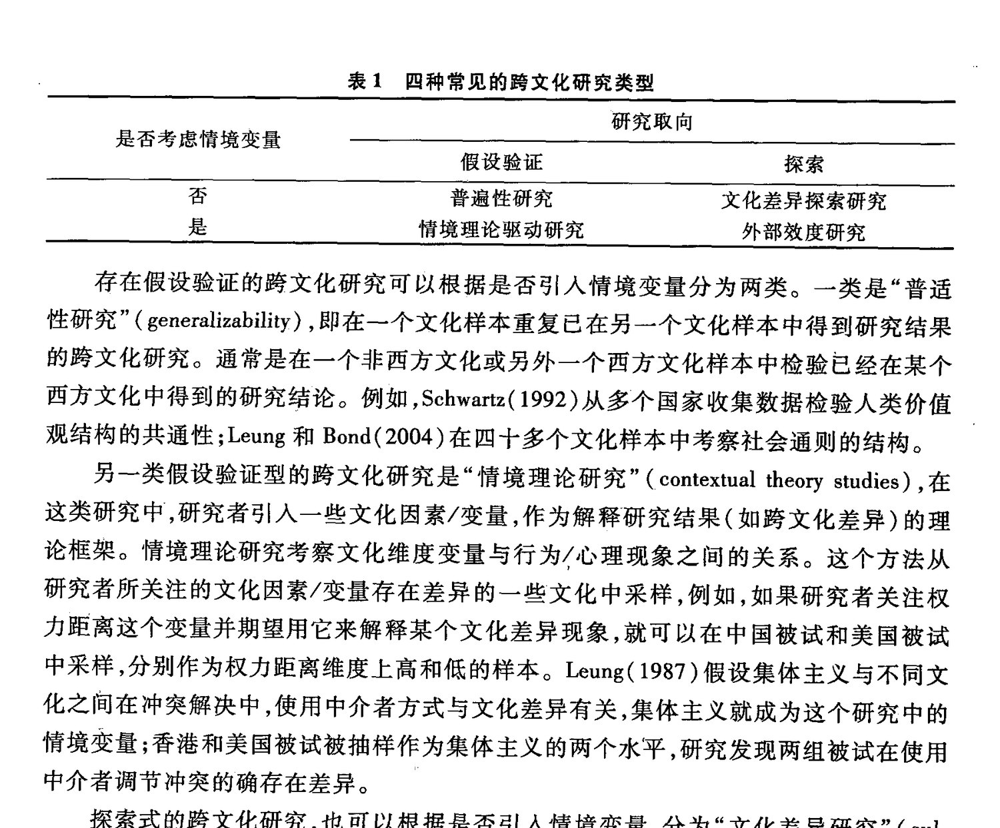

<!-- PDF页 406 -->

### 三、跨文化研究中概念和测量对等性问题

### 3.1 主位和客位研究取向

主位(emic)和客位(etic)是有关文化研究领域的重要概念。这两个概念最早是从语音学研究中由 Pike(1967)提出的“phonemic”和“phonetic”两个概念发展而来的。文化研究领域中,主位取向指研究者从所研究的文化意义系统的角度来分析和阐释这个文化中的个体或群体的行为;客位取向则是从研究者所认为的文化普遍性角度,采用这个文化之外的意义和符号系统来进行分析和阔释。跨文化研究需要在不同文化之间进行比较,通常所采用的是客位取向的研究方法。例如 Hofstede 的集体主义维度就是一种客位取向的研究。研究者假定(有时会进行验证) 所研究的概念或理论的内涵或理论结构在关注的文化之间具有某种程度的共同性,根据这样的“共同符号体系”来分析和比较所关注的概念和理论在文化之间的相似性和差异性。

在管理科学及更广泛的行为科学当中,本土研究(indigenous research) 可以被认为是主位研究取向的。这些研究关注本地文化和本地区独特的问题并提出相应的概念和理论,例如在中国文化下,对家长式领导方式的研究(郑伯埙、周丽芳、梦景立,2000)、对人情和面子的研究(黄光国, 1987)、对中国人人格结构的研究(王登峰、鹤红,2003) 等。这些研究提出独特的概念和理论,但是可能使得文化间的比较变得困难,如何将本土研究推向世界学术舞台是一个值得关注的问题。例如,采取本土的视角探讨普遍性的问题,而不是过度聚焦在文化特有的现象上面(梁觉、吴培冠,1997)。

与主位取向的研究不同,客位研究方法不仅使得不同文化之间的比较成为可能,而且是一种相对“节省”的研究方法,研究者不需要在不同文化之间逐一进行分析研究,而是在共同的概念上进行比较和分析,形成“跨文化”的结论和理论。但是,如果不加分析地将某个文化下形成的概念直接套用到另一个文化当中,可能就落人人所谓“强加客位” (imposed etic)的陷阱(Berry,1990),漠视文化之间可能存在的概念意义的差异而得到错误的研究结论。需要指出的是,这个问题并没有引起研究者足够的重视,据 Schaffer和 Riordan(2003) 进行的文献统计,超过半数的管理学及相关领域的跨文化研究被质疑可能存在强加客位的问题。例如 Farh,Zhong 和 Organ (2004)研究中国组织公民行为(0CB)的结构,发现了一些 OCB 的维度只能在中国的文化下出现。如果将西方的 OCB维度直接套用到中国文化下,就会落入“强加客位”的陷阱。为了避免强加客位可能带来的问题,在跨文化研究中,研究者宜采取“往生窜位”(derived etic) 的方式:研究者首先在不同文化下采用主位取向的视角获得关于这些文化足够的信息,然后分析可能存在的共同性的成分和差异性的成分,在此基础上进行后续的文化间比较和对照的研究。

一个值得关注的问题是,当代对组织科学的研究多数都是在美国进行的,大多数研

<!-- PDF页 407 -->

究所关注的问题,提出的概念常常只从美国当地文化的角度来抽象和分析问题,并没有刻意尝试给出其他文化角度的阐释。因此从这个意义上,这些研究可以被认为是主位取向。研究者不禁要质疑,在美国文化下提出的概念和理论是否适合于其他文化呢?例如,是否可以认为变革型领导风格(transformational leadership)在中国文化下具有相同的含义? 或是,西方研究发现的 OCB 的内容是否可以适用于中国文化(Farh, Zhong and Organ,2004)? 在进行跨文化比较之前,研究者不宜先人为主,应对所关注的概念及其测量方式(或操纵方式)进行具体、全面、平衡的分析,例如可以采用开放式问题,全面收集与该概念有关的信息。忻榕等人(2004)对中国国有企业的企业文化进行的研究就不是直接从西方概念的内涵出发,而是采用开放式问题收集第一手资料。3.2 概念对等性、

无论是在结构指向还是水平指向的跨文化研究中,需要探讨研究所涉及的概念及其测量工具(或实验操纵方法) 的对等性问题, 基于不对等概念进行跨文化比较,会带来荒廖的结果。例如“孝” 的概念在中西方的差异是很大的。孝是中国传统的伦理概念,是晚莫对长辈的奉养.尊敬、顺从和爱护的行为准则,而在西方思想中人们对孝的意识相对比较狭窄。此外,同一个测量条目可能在不同的文化中有不同的意义指向。例如,骑自行车在美国被试中可能被当做一种娱乐运动,而在中国被试中可能被当做一种交通方式,因此如果将这个条目用来作为休闲活动测量的跨文化比较可能会产生偏差。因此,在跨文化研究中,需要采取一些分析方法和统计手段,检验所研究的概念在概念上及其测量(或操纵方式)上的对等性。

工作满意度、工作超负荷等概念具有比较简单的结构,通常可以认为这些概念在不同文化下具有相同或相似的概念内涵。但另一些概念,例如人格(Wang, Cui and Zhou, 2005)、成就动机(Yu,1996)等,可能在不同文化之间具有较大的差异,因此需要通过具体的分析来确定这些概念在不同文化之间的共同性或差异性。当前管理科学以及其他一些社会科学的很多概念都来自于美国文化下的研究,其中一些概念可能在中国文化下具有不同的内涵。例如,Farh, Zhong 和 Organ(2004)探讨了中国文化下 OCB 的结构,研究者通过对中国文化下 OCB 对应的相关行为的收集和分类,并对照西方文化下 OCB的各个维度,发现中国文化下一些 OCB 维度的内涵与西方文化下 OCB 的对应维度接近,但还有一些维度只在中国文化中出现。这个研究表明,如果在中国文化下的研究直接套用西方 0CB 的测量工具,那么就忽视了 OCB 中的那些在中国文化下重要的内容。同样的,在中国文化下建立的一些概念,可能在西方文化中也具有不同的内涵。例如家长式领导风格(paternalistic leadership) (Cheng et al.,2004),提出“立威”"、“树德”、“ 施恩”三种领导行为。尽管没有直接的研究证据,但也很难想象,在美国文化下这三种行为会在一起构成家长式领导风格。

概念对等性是在跨文化研究中非常关键的一环。对概念对等性的分析是一个比较

Sete | HX ATES HY ak | 393

<!-- PDF页 408 -->

复杂的问题,研究者可以从以下几个方面着手:首先,研究者需要探讨概念的结构,如果是多维度结构,可以比较维度结构在不同文化之间是否一致。例如,对于人格这个概念,可以探讨在西方文化下发现的五因素人格模型是否在中国文化下也成立(如Cheung, 2001; Wang, et al.,2005)。其次,研究者可以考察这个概念与其他相关概念之间的关系(例如,相关系数)在不同文化是否存在显著的差异。如果存在,则可能表明这个概念存在文化间差异。最后,可以考察与这个概念存在因果关系的变量之间的关系,如果这些关系存在文化间差异,并且研究者可以排除其他可能的情境变量的解释,则也可能表明概念在不同文化之间不对等。

此外,为全面考虑概念可能存在的文化差异,在研究设计的时候研究者宜采取一种文化平衡的方式(decentered approach),即同时从所关注的不同文化的角度来进行概念分析和研究设计,而不是以某个文化为主。早期的一些研究并没有特别注意这个问题(Hofstede,1980),但近年来这种做法较为普遍。例如,在一个全球范围进行的领导行为研究中(House, et al., 2004),研究者就是从多个文化中分析概念的含义和抽取测量条目的来源,而不是只在某个文化中分析和确定概念内涵和测量方式,然后将其适用于其他文化;Leung 和 Bond(2004)进行的社会通则研究也是从不同文化中抽取测量条目。 | 3.3 ”测量对等性

在水平指向的研究中,不仅要检查概念对等性,还要进行更深入的测量对等性的探究。即使确认了目标变量在不同文化间的概念对等性,我们也不能将这些文化下测得的分数直接进行比较,因为我们不能确认在不同文化下的测量在单位上是一致的,就如我们不能认为在长度上 100 肯定大于 90,因为前者的单位可能是毫米而后者的单位可能是千米。在对目标变量进行跨文化间比较之前,我们需要考察这个变量的“测量对等性”。一些物理的测量,例如长度和重量,可以比较容易建立测量对等性。但行为/心理的测量对等性的建立则是一个比较复杂的问题。以下我们将讨论在跨文化研究中建立测量对等性的方法和一些值得注意的问题。

测量的对等性可能是由于条上生偏差引起的,条目偏差是在跨文化研究中可能经党遇到的问题。通常,即使研究的概念在不同文化间具有概念对等性,测量这些概念的问卷中的一些条目也可能在不同文化之间存在偏差,即来自不同文化的、在这个概念上具有同等水平的被试,在这些条目上的分值并不等同。更确切地说,不同文化的、在某个概念上具有同等水平的被试,在测量这个概念的某个条目上如果存在不同的期望分值,这个条目就具有文化偏差。如果对研究概念进行测量的工具存在具有文化偏差的条目,那么从这个测量工具得到的跨文化研究的结论可能不再可靠。所以,在跨文化研究中通常需要对所采用的测量工具进行分析,探讨条目偏差是否存在及其原因。例如,前面提及的,骑自行车在美国可能被当做运动,在中国则可能被当做交通方式。

有多种方法可以用来分析跨文化研究中测量的对等性问题,包括方差分析(Van de

<!-- PDF页 409 -->

Vijver and Leung,2000) 项目反应理论(item response theory, IRT) (Maurer, Raju and Collins,1998)、验证性因素分析(confirmatory factor analysis,CFA) 等。方差分析和项目反应理论从探查测量条目是否存在文化偏差的角度来探讨测量对等性问题,验证性因素分析方法从总体上探查测量在文化闻的对等性及对等性的水平。以下我们对每种方法逐一简单介绍,读者可以参看相关文献了解具体的理论及数据分析细节。方差分析的做法是将条目上的分值作为因交量,文化和量表总分值(分为若干个组)作为自变量,进行方差分析。如果文化和量表总分值的交互作用显著,即在不同文化之间,条目分值与量表总分值的关系模式不一致,即表明这个条自存在偏差。另一种考察测量对等性的方法是运用项目反应理论进行分析。项目反应理论对被试在条目上的反应概率的模型进行分析(形成项目特征曲线,item characteristic curve, ICC),由该条目的区分度(discrimination)、难度(difficulty) 和猜测参数 (guessing parameter) 决定,它们之间的关系为: exp[ Da.(0 - b; P.C8) = 641-0) eT (1)由(1)式表达的项目特征曲线为一条5 型的上下两端分别趋近于 1 和0(概率)的曲线。式中的 9 表示在该条目所测量的概念(如某种能力、态度等)上的大小,P(9)表示该条目在所测量概念的为 9 的概率(注意上述方程表达的是概率而不是概率密度)。D 是一个常数,通常取 1 或1.7;a 表示该条目的区分度,b 表示项目的难度;c 是猜测参数,表示被试猜测作答的程度。 ‘对于态度、信和念等常见的管理学变量,可以采用简化的 Rasch 模型(Molenaar and Fischer, 1995),即假设不存在猜测,并且条目的区分度固定为 1: ex] - 6, Pi(0) = eG 02)使用项目反应理论分析条目跨文化偏差的思路为:如果条目的区分度或难度在不同文化之间存在显著差异,则表示这个条目存在文化偏差。在运用项目反应理论检验文化偏差的时候,可以采用两种方式:参数比较方式和模型比较方式(Van de Vijver and Leung,1997)。参数比较的方式是在各个文化下分别估计参数(区分度和难度),然后比较区分度和难度在不同文化下的差异;模型比较的方法是在设定跨文化间参数相等的模型与将待检验条目设定为存在跨文化差异模型之间,检验这两个模型对数据拟合的差异。研究者还可以使用验证性因素分析方法探讨跨文化研究中的测量对等性问题。从验证性因素分析的角度,跨文化研究的测量对等性是一个多样本比较的问题:将不同文化作为不同的样本比较两者之间的有关参数是否相同。验证性因素分析中假定存在潜变量结构,并估计潜变量与观测变量以及残差之间的各种关系(修杰泰,2004)。在多样本验证性因素分析中,观测变量与潜变量、截距和葡差之间存在以下关系: Bite | 跨文化研究的方法 | 395

<!-- PDF页 410 -->

NEA + af (3)

在式(3)中, XE 表示样本 g 中第个观测变量,é 是其对应的潜变量,7 A A表示洪变量对观测变量站的回归和斜率,6 RAN RH. APSARA oe 中潜变量对观测变量的回归方程。

我们假定潜变量和残差是相互独立的,上述等式(3)可以转换为:

= AS OAL + OF (4).

在式(4)中,表示观测变量的方差协方差和矩阵, RRBSRHHAHTESE, A 表示潜变量到观测变量的系数矩阵, @ 表示残差方差矩阵。讨论跨文化研究中测量对等性的问题,从多样本验证性因素分析来看,即探讨是否可以认为不同文化样本之间的相关参数和矩阵相等。如不能拒绝零假设,就可以认为跨文化样本之间具有在某个层次上的测量对等性。

Vandenberg 和 Lance(2000) 总结了大量使用 CFA 进行测量对等性分析的研究,并

| 给出了进行测量对等性研究的建议,以便于应用于跨文化研究中,步骤如下;

1. 分析不同文化样本之间观测变量的方差协方差矩阵是否全等? 如果这两者全等,表明这个测量具有完全的跨文化一致性,不需要进行后面的步骤。由于几乎很少可能在观测变量上找到不同文化样本具有全等性的例子,所以很多研究并没有进行第一步检验。但一旦确认了整体全等性则确认了测量对等性,因此,先进行此步检验不失为一个便捷的方法。

2. 探讨不同文化样本之间是否具有“结构对等性”(configural equivalence),结构对等性指是否可以认为不同文化样本之间有相似的因素结构factor structure), 如果不能确认结构对等性,则不能进行后面更进一步的对等性探讨。

3. 检验不同文化样本之间是否具有“量度对等性”(metric equivalence),即是否可以认为不同文化样本之间的 A(潜变量到观测变量的系数矩阵), 是相等的。

4. 检验“截距对等性”(scalar equivalence),即不同文化样本之间 +(截距) 是否相等。

5. MRAM MAAS MRE @ 是否相等。

6. 检验不同文化样本之间潜变量(因子)的方差以及协方差(@) 是否相等,后者探讨潜变量之间的相关是否具有对等性。 |

7. 检验不同文化样本之间潜变量的均值是否相等,这个步骤即检验文化样本之间潜变量水平的差异。

对等性是跨文化研究中一个非常重要的问题。研究者必须在问题提出、概念形成、测量或操纵方法选择上,仔细分析可能存在的概念和测量对等性问题,减少研究结论出现偏差的可能性。一般来说,在跨文化研究中需要保证所有的条目都对等。如果发现有少部分条目不对等,可以采取删减这些不对等条目的方法,保留对等的条目。如果发现大部分条目都不对等,可能需要重新考虑研究方案了。

<!-- PDF页 411 -->

四、跨文化研究的设计4.1 跨文化研究设计值得注意的问题无论是相关研究还是实验研究,跨文化研究设计关注的中心问题是加强结果对假设的解释力并排除其他可能假设。 不同文化的组群存在许多方面的差异,其中很多非文化差异可能都是解释研究者感兴趣的跨文化差异现象的原因。 因此跨文化研究设计的重点就是要排除研究假设以外的对研究结果解释的其他可能性。 例如,在研究设计中,研究者可以通过引入“协变量”来加强对研究结果的解释,协变量指一些并非研究兴趣所在但可能影响研究结果的变量, 引信协变量可以检查是否可以排除其他对研究结果的可能解释。 性别、年龄.教育水平、收入水平.国家财富水平等变量是经常使用的协变量。另外,研究者需要探讨所关注的问题和概念的文化特性,这一点在前文概念和测量对等性中已提及。研究者需要在研究设计中, 而不是在已经实施并收集数据以后,考虑概念的文化差异问题。正如 Leung 和 Zhang (1996)指出的,许多直接从西方引入到非西方文化的研究、所探讨的一些主题可能与当地文化几乎没有任何对应,这些研究得到的结果极有可能与西方文化背景有关,如果换一个不同文化背景的视角进行这些研究可能会得到不同的结果。 有两种方法可以避免某种文化对研究问题的主导和对研究结果的偏差,一种方法被称为“平衡方法”(decentered approach),在概念探讨和研究设计时采取文化多样性的视角,这在前文跨文化对等性部分已有介绍;另一种研究方法可以ZA“ RRIF” (convergent approach),其思路是在不同文化中探讨某个理论框架是否一致。例如 Bond 等在中国文化中研究价值观,发现一些维度与 Hofstede 的维度十分相似, 但也同时发现一个新维度: 长期一短期取向 (Chinese Culture Connection, 1987),;管理科学的跨文化实验研究具有一些与通常的实验研究不同的特点(Leung and Su,2004)。 例如,管理科学中的跨文化实验研究多数是通过纸笔上进行的虚拟情景进行,而不是在真实情景中进行。这是由于一些在现实情景中难以操纵和控制的因素可以通过虚拟情景实现,并且研究者通过虚拟情景可以较为方便地获得大量的数据,同时也容易预期和控制操纵方法在不同文化之间的对等性。4.2 汇聚方法研究者可以通过汇聚方法 (consilience approach) 来加强跨文化研究结果对因果关系的解释力(Leung and Van de Vijver,2006)。“汇聚”(consilience) 这个概念是由哲学家Whewell(1840)提出的,如果菜个理论“对某类事实的归纳,与对另一类事实的归纳是一Stee | BE BCG BE Hr 3 | 397

<!-- PDF页 412 -->

致的”,则认为这些归纳是汇聚的,这可以作为检验理论的一个方式。在跨文化研究中, “汇聚”的多方面证据将大大加强研究结果的说服力,弥补跨文化研究本身存在的一些固有的不足。例如,无法按一般的实验方法通过操纵自变量效应而使结果有和较强的因果关系说服力。,

难以确证因果关系这一问题并不仅仅局限在跨文化研究当中,其他的一些学科,甚至是自然科学,也缺乏完全意义上的客观实验方法来确证因果关系。例如,生物进化论的研究就不能以实验方法进行,也很难存在单一的证据可以完全支持自然选择假说,但是把来自不同方面、使用不同方法的多重证据汇聚起来,说服力就大大加强。类似的,在跨文化研究设计中,可以采用多个方面的汇聚方法,来加强对因果关系的解释力。我们建议汇聚方法可以分为四种类型:(1) 多重情境的汇聚(contextual consilience),指收集多个不同文化情境或文化群体的数据,如果这些结果都与理论预期吻合,则为所论证的关系提供了有力的支持;(2) 多重方法的汇聚(methodological consilience),指使用多种方法,例如调查法、实验法纵向研究等方法,来验证某个研究假设,考察这些不同方法是否得到了相同的结论;(3) 多种预测的汇聚(predictive consilience),指从该因果关系理论中推导出一些预期假设,如果这些假设都得到验证,那就大大增强了对这个因果关系的确信程度;(4) 排他的汇聚(exclusive consilience),指除研究者所论证的因果假设以外,研究者提供证据排除其他多种替代性假设可以解释观测到的结果的可能性。在跨文化研究设计中,与上述宽泛的类别对应,研究者可以采取一些具体的研究策略来强化研究结果对所论证的研究假设的说服力,如表2 所示。

表2 汇聚框架下的跨文化研究策略系统比较策略协变量策略多重方法策略汇聚目标情境和预测的汇亦排他的汇聚方法和预期的汇聚研究类型相关研究相关研究相关研究/实验研究相关概念跨文化比较文化差异 ”情境变量、混淆变量、偏”多质多法分析、实验民族志差、敏感性分析研究、实验人类学研究分析层级个体或文化水平个体水平个体水平文化作为自变文化作为分类变量:不”文化作为连续变量:文化”文化群组作为分类变量或文量同文化组群元素(维度) 化元素(维度)作为连续变量进行测量或操纵替代假设通常并不明确提出在研究设计中强调如何排通常并不明确提出除替代假设因果关系强度 1K 中等中等或高生态效度高高实验室研究较低,实地研究较高

第一类策略是系统比较策略,包括:(1) 多重比较策略,研究者根据研究假设的菜个维度依照大小强弱顺序抽取 3 个以上的文化样本进行研究。例如研究者考察“集体主义一个人主义”这个维度,来解释可能的研究结果,则可以抽取在这个维度水平上的3

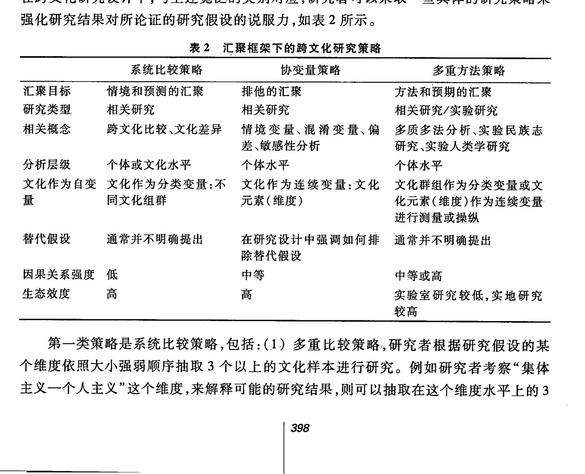

<!-- PDF页 413 -->

个文化组,比如日本、法国、美国,如果研究结果也呈现这样的次序,则该研究结论比仅抽取两个文化样本的研究结论的确信程度高。另外,研究者也可以在抽样设计的时候排除其他替代性假设的干扰。例如可以选择两个文化样本,它们在关注维度上差异而在蔡代假设维度上没有差异。(2) 纵向比较策略,即考察在某个文化维度上的变化是否与因变量的变化有关,但通常文化的变化是缓慢而不易察觉的,因此研究者多通过移民这个视角来考察文化变化的效应。例如可以比较移民时间不同的群体、新移民和移民后背等在所关注的因变量上的差异。

第二类策略是协变量策略,包括:(1) 单一协变量策略,即仅引入所关注的文化维度变量作为协变量,如果控制这个变量以后,文化效应不再显著,则表明这个变量可能是文化效应的原因;(2) 多项协变量策略,在这种方法中,研究者纳人了多个可能的文化维度变量,探索文化效应的原因或是排除其他蔡代性假设而强化假设的解释力。例如,可以将个人主义一集体主义维度的多个层面作为协变量,探索哪些层面与组内偏向(in-group favorism) 之间存在关系(Chen, Brockner and Katz,1998), (3) 单文化拓展,在考察文化效应,可能原因时,研究者可以在一个文化样本内探索文化维度与因变量之间的关系。例如 Brockner 等(2000) 比较了程序公平效应在中美文化之间的差异后,发现美国被试在独立我一互依我维度上的不同强度之间的公平效应呈现出类似文化样本之间的差异,因此支持了这个自我构念作为程序公平文化效应原因的说服力。

第三类策略是多重方法策略,包括: (1) 使用多个因变量指标,不同的因变量指标WR SAR MIA PRA. 如果使用不同的因变量指标都可以得到类似的结果,那么这个文化效应被无关变量所导致的可能性会大大降低。(2) 多种实验策略,尽管在跨文化研究中不能进行完全意义的实验,但研究者已经使用一些准实验方法,近年来提出“实验人类学”(experimental anthropology) 方法(Cohen, Nisbett, Bowdle and Schwarz, 1996),即操纵一些变量来加强或弱化文化效应,从而推证因果关系。 首先假设某个文化效应是由于某个变量所导致的,然后用操纵这个变量的水平, 观察是否在因变量上会出现预期的变异。 可以区分两类实验操纵方法:外部情境变量的操纵(ecological manipulation),研究者可以操纵外部情境变量来探讨预期的效应,例如改变环境中的某些因素来观察被试的反应与控制条件之间的差异;个体的文化维度上的 “操纵”(idiographic manipulation),研究者可以在个体水平上“操纵”文化,例如使用“文化启动”(culture priming)方法,给被试展示代表不同文化的刺激物,比如国旗,文化名人等(Hong, et al., 2000);当然也可以在具体的文化维度变量上进行启动,例如可以通过让被试回答自己与家人的相同或不同之处,来操纵独立我一互依我这个维度(Trafimow, Triandis and Goto,1991)。

### 4.3 ”多层线性模型在跨文化研究中的应用在跨文化研究当中,研究者可能会面对数据的层级结构问题。 跨文化研究通常包Stem | 路文化研究的方法 | 399

<!-- PDF页 414 -->

括两个数据层级,例如被试的态度、观念或一些个体差异变量构成个体水平上的数据层次,而不同文化之间在平均水平上存在系统差异,从而构成了文化水平上的数据层次。在一个层级上得到的结论并不一定可以类推到另一个层级中(Klein and Kozlowski, 2000)。将在宏观层次上得到的结果直接类推到微观层次,可能发生“区群雇误”(ecological fallacy)。同样的,将微观层次上得到的结果直接类推到宏观层次,可能出现所谓“微体雇误”(atomistic fallacy)。在不同数据层级上,概念可能具有不同的内涵。例如, Triandis(1995)提出个人主义一集体主义维度在个人和国家层次上具有不同的意义;在国家层次上,他使用“个人主义一集体主义”(individualism-collectivism) 的概念,而在个人层次上,他采用“个人中心一集体中心”(idiocentrism-allocentrism) 的概念。

对于具有层级结构的数据,研究者可以在不同层级上分别进行分析。现代统计技术的发展出现了一些新的方法,可以用来处理不同层级的数据结构,其中多层线性模型(hierarchical linear modeling, HLM) (Raudenbush and Bryk,2002; 张雷、雷需和郭伯良, 2005) 被认为是目前跨文化研究中多层次数据的一种有力的分析工具 (Schaffer and Riordan,2003)。多层线性模型首先在较低层级的数据上建立回归方程,然后以这个方程的截距和和斜率作为因变量,选择较高层次上的变量作为自变量构成第二层回归方程,并使用广义最小二乘法估计第二层参数。在多层线性模型中,研究者可以同时对多至三个层次的数据进行分析,考察文化效应在不同层级上的效应,以及跨层级交互作用(在本书第十五章中有 HLM 的详细介绍)。

最近的一项研究(Van der Vegt, Van der Vliert and Huang,2005)在探讨成员多样性(demographic diversity) 与创新氛围(innovative climate) 之间关系的跨文化差异时,就使用多层线性模型方法,考察权力距离这个变量对成员多样性与创新氛围之间关系的调控作用。研究者收集到一家跨国公司在24 个国家的 248 个分支的数据,数据结构存在两个层级水平:当地机构水平和文化水平。在多层线性模型分析中,研究者以分支机构

; 数据回归方程的斜率作为因变量、在文化水平上用权力距离作为自变量对其进行回归,结果发现这个回归结果显著,表明权力距离这个文化维度能够调控成员多样性与创新氛围之间的关系:在权力距离较高的文化中,组织的成员多样性会降低创新氛围;而在权力距离较低的社会中,组织成员多样性会提高创新氛围。

### 五、跨文化研究的实施5.1 文化样本采样,被试采样及数据收集

选择哪些文化样本是跨文化研究中的一个重要问题。系统采样(systematic sampling),即理论导向的采样方式,是最常采用的研究策略。 在 Berry(1967)进行的一个经典研究中,他考察了农业文化和狩猎文化两个文化类别:假设农业社会中的成员受到更

<!-- PDF页 415 -->

强的服从压力,因此导致更强的“场依存”field dependence),即认知过程受到目标物背景的影响;而游猎社会中个体有更多的自决性,因此场依存较低。以这个理论为基础,, 在跨文化研究时可从这两类文化群体中进行采样。最近的很多研究以“个人主义一集

体主义”为框架进行,个人主义和集体主义文化下分别收集数据进行比较(Chirkov,Ryan, Kim and Kaplan, 2003)。

另外一种采样方法是随机采样,即随机抽取大量的文化样本,通常在探索具有跨文化共同性的结构或泛文化理论时采用。通常要做到完全随机抽取文化样本几乎是不可能的,但是抽取多个文化的大型研究通常可以被认为是接近于随机抽样的。例如, Schwartz(1992)在研究人类价值观时抽取了 20 个文化样本,最近这个样本的数目增加到 60(Schwartz 等,2001);Leung 和Bond(2004)从 40 个文化中抽取样本来研究社会通则的结构。如前所述,要小心处理以国别界定文化组的问题,要注意一个国家内是否有明显的次文化群。

对于被试的采样,从不同文化中抽取的被试群体应具有相似的人口统计学特征,否则,很难辨别所得到的样本间差异是由于文化因素或是样本特异性差异导致的。比如,如果我们从一个文化样本中抽取的是不识字被试,而在另一个抽取受教育水平高的被试,我们很难判断得到的结果差异不是由于受教育水平,而是由于某个文化维度上的差异导致的。

一个解决这个问题的方法是平衡匹配不同样本间的被试在人口统计变量上的差异,从而排除这些可能的解释。通常很多研究者采用大学生作为被试,并假定大学生被试样本具有相似的人口统计学特征。基于同样的原因,Hofstede (1980)采用同一家有跨国公司作为样本研究价值观结构,以便排除可能的有关被试和组织背景变量差异的影响。需要指出的是,有的时候表面上看似“匹配”的样本可能实质上并不匹配,例如在中国和美国分别使用 MBA 被试进行比较分析,表面上这两个样本是匹配的,但在美国 MBA 可能是非常普及的、较为大众化的职业教育,而在中国则属于起步阶段的.挑选严格的精英教育,因此学员之间可能存在系统的个体差异,并且这些差异可能影响研究结果。因此,在采样阶段研究者也应当具体考虑在不同文化之间可能存在的隐含的系统差异。

另外,有时由于现实的原因或者文化样本之间本身存在巨大的人口统计变量差异,匹配不同的文化样本几乎是不可能的。例如美国和中国的整体受教育水平存在很大的差异,对此,一个解决的方法就是将有关的人口统计学变量作为协变量进行处理。5.2 研究实施中的其他相关问题

在跨文化相关研究中,研究者可能需要对测量工具进行翻译。回译(back translation)是最常采用的方法,首先将测量工具从一种语言翻译为另一种语言,然后再由另一个译者将它翻译回原来的语言。通常采用这种翻译方法是足够的:研究者即使对另一个语言缺乏了解,也可以通过回译的资料了解对测量工具的翻译是否达到要求。但是

Stee | 路文化研究的方法 | 401

<!-- PDF页 416 -->

这个方法的一个缺陷是,它可能产生“伟硬”的翻译,即与原义吻合很好但是不自然、不容易被理解。当测量题目中包含成语与其他固定表达的时候,这个问题将变得愈发严重。研究者应当同时调整原文和译文,使之在含义上对等,使测量工具在不同文化样本中具有最大的一致性和可读性,而不是机械地在另一个语言中复制原测量工具(Van de Vijver and Leung, 1997)。

对于跨文化实验研究,研究者需要仔细考察被试样本、操纵方法、实验程序实验情境在不同文化间的对等性。 首先,研究者应当仔细分析所操纵概念以及操纵方法在不同文化中是否是对等的。例如,研究者在实验操纵中使用金钱奖励作为操纵动机的方式,可能忽视了在不同文化下数额相等的金钱的含义是不同的:在越南 50 美元对被试产生的动机效应与同样数额的金钱对美国被试的动机效应可能是相差很大的。另外,在实验程序中,研究者应当注意实验主试或访谈人员的个人特征。主试或访谈员可能影响被试的反应倾向(例如,被试可能倾向于提供他们认为的实验者或访谈员所期待得到的反应结果),尤其是当实验者或访谈员是来自于不同的文化背景的时候。

### 六、跨文化研究的数据分析

管理科学中的跨文化研究的数据分析存在一些自身特点和值得注意的问题。一些方法可能在管理科学的其他领域中较少使用,例如,对数据的标准化、轴转向因素分析方法、多层分析方法等,以下我们将分别讨论结构指向的研究和水平指向的研究中的一些数据分析方法及相关的问题。6.1 结构指向研究中的一些数据分析方法和值得注意的问题

在结构指向的研究中,研究者可能面对的一个问题是是否将数据进行标准化处理。标准化指使用 Z 分数(即原始分与平均分的离差相对标准差的比值)对数据进行分析。标准化的一个好处是可能消除了一些非研究所关注的文化间的系统偏差,例如,文化样本在一般反应倾向、社会称许性(social desirability) 等方面的差异,但是标准化的做法也可能忽略了真实的样本间差异。因此,如果事前存在理论支持文化样本之间并不存在所关注的系统性差异的时候,研究者可以将数据标准化后再进行进一步分析。例如Schwartz(1992)在价值观调查研究中首先对数据进行了标准化处理,因为被试在所有条目上的总体平均应当是相等的,而且这个调查被认为是价值观的一个完整的样本。如果没有理论表明均数的对等性,那么研究者应当慎重考虑是否使用标准化数据(Van de Vijver and Leung, 1997)。

结构指向的研究通常关注概念的结构在不同文化之间的相似性和差异性。例如,普遍性研究需要表明某个概念的结构在不同文化之间是否具有一致性。在此类问题的数据分析中,研究者可以使用探索性因素分析、验证性因素分析、多维度分析和育类分

<!-- PDF页 417 -->

析等方法。探索性因素分析和验证性因素分析是最为常见的方法。在探索性因素分析中,为了进行结构在不同文化间的比较,通常将选取某个文化样本作为靶样本,在各样本中分别进行因素分析,然后将因素载荷旋转与靶样本重释,再通过一系列指标分析因素的一致性(factorial agreement),这些指标包括 Tucker’s phi 等。轴转向 (targeted procrustes rotation) 因带分析方法虽然在叶文化研究中应用比较广泛,但并不可以在常用的统计软件包,例如SAS 和SPSS 中直接进行,研究者可以参考相关的公式在统计软件中自行设定程序语句进行处理(Van de Vijver and Leung,1997)。

研究者也可以通过验证性因素分析及结构方程模型方法考察所关注概念的结构、变量间关系在不同文化之间的相似性和差异性(修杰泰,2004)。结构方程模型是包含了测量部分(验证性因素分析) 和路径部分的潜变量模型。与前文介绍的检验测量对等性的方法一样,在数据分析中采取模型比较的方式,比较设定相关概念维度或路径相等与设定为自由的两个模型之间的拟合差异,从而接受或排除相应的零假设。研究者可以借助于一些专门的统计软件,例如 LISREL、AMOS、EQS、MPLUS 等进行模型比较和分析。

此外,研究者也可以运用多维度分析(multidimensional scaling) LA & HAE 4} HF (cluster analysis)来处理结构指向的跨文化研究的数据。多维度分析在跨文化研究中通常根据刻面理论(facet theory) (Guttman, 1955),将理论、量表设计与数据分析有机结合。Schwartz(1992)对价值观的研究就是采用多维度分析方法,得到两个维度上 10 种类型的价值观结构。多维度分析与因素分析得到的结果在一些情形下是不同的,通常使用多维度分析发现的维度的数目要少于用因素分析得到的因子数目(使用特征根大于1或碎石图作为抽取因素数目的判定标准)。另外,聚类分析方法还常被用来描述不同文化在某个理论上形成的“文化地图”,用以表明文化之间的接近性和距离,例如 Leung 和Bond (2004)在社会通则结构上对 40 个文化进行了聚类。因为聚类分析不能对在各个文化得到的结构进行比较分析,所以在变量水平上用聚类分析来探索因素结构的方法并不常见。: 6.2 ”水平指向研究中的一些数据分析方法和值得注意的问题

对于水平指向的研究,研究者通常可以采用:检验、方差分析或回归分析来进行文化之间的比较。如前文所述,研究者在进行比较之前需要检验测量对等性,然后进行不同文化之闻的比较。在方差分析中,研究者可以使用因子设计的方法,考察文化的主效应以及文化与其他自变量的交互作用。但方差分析要求自变量不是连续变量,所以对于一些文化维度变量,例如个人主义一集体主义维度,通常需要分组处理,这将损失一部分信息。此时,使用回归分析更为适合。需要指出的是,回归分析不仅可以处理连续变量,也可以处理分类变量(通常的方式是将变量进行转化,最常用的转换方式是使用WEE Et (dummy variables))。例如,Brockner(2003)分析了文化(分类变量).程序公平和

Stee | He XE ae | 403

<!-- PDF页 418 -->

结果有利性三者之间的三重交互作用,考察程序公正的调节作用在中国和美国文化之闻的差异。七.结语

在当今的国际商务活动中,文化的影响是显见、广泛而深刻的。在管理科学领域,跨文化研究不仅验证和拓展了现有的概念和理论,还可能提出新的概念和理论框架来丰富现有的理论知识,为管理实践、特别是跨越国界的商务实践提供理论指导和启示。在过去的几十年中,跨文化研究在数量和质量上都有了很大的进步,跨文化研究的意识愈发强烈,很多研究者几乎是惯例式地在不同文化中检验和拓展他们提出的概念和理论,并且提出了一系列更为精密的研究方法和数据处理方法。管理科学的跨文化研究将出现以下趋势:(1) 新的文化维度结构将不断出现。近年来研究者提出了多个文化维度结构,例如社会通则(social axiom, JL Leung and Bond,2004)、认知风格 (cognitive style,见 Nisbett,2003)等;(2) 越来越多的新的方法将被引入到跨文化研究当中,一直以来,跨文化研究主要依赖一些纸笔调查和一些行为测量,但是近期一些新的方法,包括反应式、感知反应等,可能将被应用于管理科学的跨文化研究领域中;(3) 研究者将更多地使用多种汇聚的方法来加强理论假设对研究结果的解释力,这些方法包括使用多种因变量指标,引入多个协变量、使用多种研究方法等;(4) 一些新的数据分析方法,例如多层线性模型.多层结构方程模型等,由于能够提供更为复杂的变量间关系模型,将在跨文化研究中获得越来越广泛的重视和应用。

### 参考文献

Brockner, J., Chen, Y. R., Mannix, E. A, Leung, K. and Skarlicki D. P. (2000). Culture and procedural fairness: When the effects of what you do depend on how you do it. Administrative Science Quarterly, 45, 138—159.

Chen, Y. R., Brockner, J. and Katz, T. (1998). Toward an explanation of cultural differences in in-group favoritism; The role of individual versus collective primacy. Journal of Personality and Social Psychology, 75, 1490—1502.

. Cheung, F. M., Leung, K., Zhang, J. X., Sun, H. F., Gan, Y. Q. and Song, W. Z., et al. (2001). Indigenous Chinese personality constructs-Is the five-factor model complete? Journal of Cross-culture Psychology, 32, 407—433.

Chinese Culture Connection (1987). Chinese values and the search for culture-free dimensions of culture. Journal of Cross-cultural Psychology, 18, 143—164.

Cohen, D., Nisbett, R. E., Bowdle, B. F. and Schwarz, N. (1996). Insult, ag-

<!-- PDF页 419 -->

gression, and the southern culture of honor: An “experimental ethnography”. Journal of Personality and Social Psychology, 70, 945—960.

Creswell, J. W. (1994). Research Design; Qualitative and Quantitative Approaches. Thousand Oaks, CA; Sage.

Farh, J.L., Zhong, C. B. and Organ, D. W. (2004). Organizational citizenship behavior in the People’s Republic of China. Organization Science, 15, 241—253.

Gelfand, M. J., Higgins, M., Nishii, L.H., et al. (2002). Culture and egocentric perceptions of fairness in conflict and negotiation. Journal of Applied Psychology, 87, 833— 845.

Gelfand, M.J., Nishii, L.H., Holeombe; K.M., Dyer, N., Ohbuchi, K. and Fukuno, M. (2001). Cultural influences on cognitive representations of conflict; Interpretations of conflict episodes in the United States and Japan. Journal of Applied Psychology, 86, 1059—1074.、

Greenwald, A. G. and Banaji, M. R. (1995). Implicit social cognition: Attitude, self-esteem and stereotype. Psychological Review, 102, 4—27.

Guttman, L. A. (1955). An outline of some new methodology for social research. Public Opinion Quarterly, 19; 395—404.

Headland, T. N., Pike, K. L., & Harris M. (1990). Emics and Etics: The Insider/ Outside Debate. Newbury Park, CA; Sage.

Hofstede, G. (1980). Culture’s Consequences: International Differences in Work-related Values. Beverly Hills, CA; Sage.

Hofstede, G. and Bond, M. H. (1988). The Confucius connection: From cultural roots to economic growth. Organizational Dynamics, 16, 5—21.

Hong, Y. Y., Morris, M. W., Chiu, C. Y. and Benet-Martinez, V. (2000). Multicultural minds; A dynamic constructivist approach to culture and cognition. American Psychologist, 55, 709—720.

House, R. J. and Javidan, M. (2004). Overview of GLOBE. In R. J. House, P. J., Paul, M. Javidan, P. W. Dorfman and V. Gupta (eds.), Culture, Leadership and Organi-

zations; The GLOBE Study of 62 Societies; 9—28. Thousand Oaks, CA; Sage.

Klein, K. J. and Kozlowski, S. W. J. (2000). From micro to meso; Critical steps in conceptualizing and conducting multilevel research. Organizational Research Method, 3, 211—236.

Kroeber, A. L. and Kluckhohn, C. (1952). Culture: Critical review of Concepts and Definitions, Vol. 1, No. 1. Cambridge, MA; Peabody Museum.

Leung, K. (1987). Some determinants of reactions to procedural models for conflict

Stee | BES Oe | 405

<!-- PDF页 420 -->

resolution. Journal of Personality and Social Psychology, 53, 898—908.

Leung, K. (1989). Cross-cultural differences: Individual-level versus culture-level analysis. International Journal of Psychology, 24, 703—719.

Leung, K., Bhagat, R. S., Buchan, N. R., Erez, M. and Gibson, C. B. (2005). Culture and international business; Recent advances and their implications for future research. Journal of International Business Studies, 36, 357—378.

Leung, K. and Bond, M. H. (1989). On the empirical identification of dimensions for cross-cultural comparisons. Journal of Cross-cultural Psychology, 20, 133—151.

Leung, K. and Bond, M. H. (2004). Social axioms: A model for social beliefs in multicultural perspective. Advances in Experimental Social Psychology, 36, 119—197.

Leung, K. and Su, S. K. (2004). Experimental methods for research on culture and management. In B. J. Punnett and O., Shenkar (eds.) Handbook for International Management Research, 2nd edition. Ann Arbor; the University of Michigan Press.

Leung, K. and Van de Vijver, F. J. R. (2006). Strategies for strengthening causal inferences in cross-culture research: The consilience approach. Manuscript submitted for publication..

Leung, K. and Van de Vijver, F. J. R. (2006). Cross-cultural research methodology. In F. Leong and J. Austin (eds.), Psychology Research Handbook; A Guide for Graduate Students and Research Assistants, 2nd edition; 443—454. Thousand Oaks, CA; Sage.

Maurer, T. J., Raju, N. S. and Collins, W. C. (1998). Peer and subordinate performance appraisal measurement equivalence. Journal of Applied Psychology, 83, 693—702.

Morris, M. W., Leung, K., Ames, D.. and Lickel, B. (1999). Incorporating perspectives from inside and outside; Synergy between emic and etic research on culture and justice. Academy of Management Review, 24, 781—796.

Nisbett, R. E. (2003). The Geography of Thought; How Asians and Westerners Think Differently *... and Why. New York; Free Press.

Peterson, R. R. (1972). A cross-cultural perspective of supervisory values. Academy of Management Journal, 15, 105—117..

Pike, K. L. (1967). Language in Relation to A Unified Theory of Structure of Human Behavior, 2nd edition. The Hague; Mouton..

Raudenbush, S. W. and Bryk, A. S. (2002). Hierarchical Linear Models: Applications and Data Analysis Methods. Thousand Oaks, CA; Sage Publications.

Ryan, A. M., McFarland, L., Baron, H. and Page, R. (1999). An international look at selection practices; Nation and culture as explanations for variability in practice. Personnel Psychology, 52, 359—391.

<!-- PDF页 421 -->

Schaffer, B. S. and Riordan, C. M. (2003). A review of cross-culture methodologies for organizational re-search; A best practice approach. Organizational Research Method, 6, 169—215.

Schwartz, S. H. (1992). Universals in the content and structure of values; Theoretical advances and empirical tests in 20 countries. In M. Zanna (ed.), Advances in Experimental Social Psychology, Vol. 25; 1—65. Orlando, FL; Academic Press.

Schwartz, S. H., Melech, G., Lehmann, A., Burgess, S., harris, M. and Owens, V. (2001). Extending the cross-cultural validity of the theory of basic human values with a different method of measurement. Journal of Cross-Cultural Psychology, 32, 519—542.

Trafimow, D., Triandis, H. C. and Goto, S. G. (1991). Some tests of the distinction between private self and the collective self. Journal of Personality and Social Psychology, 60, 649—655.

Triandis, H. C. (1972). The Analysis of Subjective Culture. New York; Wiley.

Triandis, H. C. (1996). The psychological measurement of cultural syndromes. American Psychologist, 51, 407—415.

Van de Vijver, F. J. R and Leung, K. (1997). Methods and Data-analysis for Crosscultural Research. Thousand Oaks, CA; Sage.

Van de Vijver, F. J. R and Leung, K. (2000). Methodological issues in psychological research on cultures. Journal of Cross-Cultural Psychology, 31, 33—51.

Van der Vegt, G. S., Van der Vliert, E. and Huang, X. (2005). Location-level links between diversity and innovative climate depend on national power distance. Academy of

; Management Journal, 48, 1171—1182.

Vandenberg, R. J. and Lance, C.E. (2000). A review and synthesis of measurement invariance literature; Suggestions, practices, and recommendations for organizational research. Organizational Research Methods, 3, 4—70.

Wang, D., Cui, H. and Zhou, F. (2005). Measuring Chinese personality; QZPS versus NEO PI-R. Asian Journal of Social Psychology, 8, 97—122.

Whiting, B. B. (1976). The problem of the packaged variables. In K. Riegel and J. Meacham (eds.), The Developing Individual in A Changing World, Vol. 1; 303—309. The Hague; Mouton.

Yu, A. B. (1996). Ultimate life concerns, self, and Chinese achievement motivation. In M. H. Bond (eds.), Handbook of Chinese Psychology. Hong Kong; Oxford University Press.

BRAS RR (2004):《结构方程模型及其应用》。 北京:教育科学出版社。

黄光国(2005): 华人社会中的脸面观, 载杨国枢、黄光国、杨中芳主编,《华人本土

Stee | BX IE a | 497

<!-- PDF页 422 -->

心理学》, 365一405。

梁觉、吴培冠(1997):本土心理学的国际化,载杨国枢主缩,《本土心理学方法论》, (本土心理学研究, 第8期), 173一186。. 王登峰, 崔红(2003):中国人人格量表(QZPS) 的编制过程和初步结果,《心理学报》, 35一127一136。

忻榕、徐淑英、王辉、张志学、陈维正(2004):国有企业的企业文化: 对其维度和影响的归纳性分析,载徐淑英、刘忠明主编,《中国企业管理的前沿研究)。北京: 北京大学出版社, 372一397。

张雷、雷雳、郭伯良(2005):《多层线性模型应用)。北京:教育科学出版社。

IMASA JA DSS SER (2000):家长式领导行为:三元模式的建构与测量,载杨国枢主编,《家长式领导行为》(本土心理学研究, 第14 期), 3一64。

<!-- PDF页 423 -->

研究发表的旅程

<!-- PDF页 424 -->

<!-- PDF页 425 -->

## 第四部分 研究发表的旅程

## 第十八章 管理研究论文写作和审阅的过程

=

. [of Mo AY管理研究论文写作和审阅的过程美国亚利桑那州立大学本章大纲一、 演绎式假设检验的研究报告1.1 文章的结构 ‘ 1.2 引言部分1.3 ”理论和假设部分1.4 方法部分1.5 结果部分1.6 讨论与结论部分二、 归纳式建立理论的研究报告2.1 文章的结构2.2 “方法部分2.3 ”结果部分;概念和假说2.4 ”讨论与结论部分三、两类文章通用的写作准则3.1 摘要、引文、自我引用3.2 寻求同事反馈3.3 ”养成写作习惯3.4 ”对研究领域的贡献. DO. 国际优秀期刊的审稿过程4.1 如何提交你的稿件*, 本文作者感谢南京大学的蒋建武和北京大学的韩晶对本章的中文翻译。= ene [411

<!-- PDF页 426 -->

### 4.2 对你提交稿件的评审过程

### 4.3 决定画 |五、 如何对待“修改后再次投稿”的邀请

### 5.1 仔细阅读并分析编辑的信和审稿意见

### 5.2 修订原稿:

### 5.3 ”准备重新投稿六、 结语

引 8

你已经完成了研究项目和数据分析,并得到了一些有趣的结果。现在你可以开始按照你选择的期刊格式要求撰写一份手稿并准备投稿了。对于大多数研究人员而言,写作是整个研究过程中最困难的一部分。相比之下,做研究的工作似乎看起来要容易得多,因为写作要以连贯的方式告诉读者你做了什么,给读者提供充分的信息,又不能让元杂琐碎的细节把读者搞糊涂。以既有说服力又有趣的方式讲故事并不是一个简单的任务。在这一章中,我希望让这最后一步的工作减少一些痛苦,变得容易一些,甚至更愉快一些。

这一章共有五个部分。在第一部分中我会向你介绍如何撰写一个演绎式的假设检验研究报告。第二部分是有关如何撰写归纳式的建立理论的研究报告的内容。在第三部分中我会给出一些定稿的一般性准则并讨论写作对于研究成功的作用。通过第四部分的介绍你会了解大多数国际期刊的审稿过程。最后,在第五部分我将针对如何修订原稿并最大限度地提高其被接受的机会给出一些建议。

### 一、演绎式假设检验的研究报告

### 1.1 文章的结构

大多数演绎式的假设检验的文章结构都遵循类似的模式。它首先介绍研究的现象和问题,以及现有的对于该现象和问题的知识、辩论或争议。接下来的部分通常称为概念背景和假设,或理论和假设,或文献回顾、理论及假设。这是研究过程中逻辑推论的一部分(见第一章图1)。第三部分的内容是研究方法,也就是研究设计的介绍,包括抽样、数据收集程序测量和分析。第四部分是结果分析,需要报告描述性统计分析和假设检验的结果。接下来是讨论部分,它包括对支持假设的以及出乎预料的结果的讨论、对未来研究的启示,还有本研究的局限性。文章结尾应该探讨本研究对管理实践的启示,并给出结论,突出本研究的主要发现和贡献。一个好的结论会通过对研究结果的讨

<!-- PDF页 427 -->

论留给读者一个悬念,或者指明一个重要的、风新的研究方向。下面我会对每一部分的内容进行详细的介绍。

虽然我对一篇文章的结构展开了风辑的线性描述,但是实际的写作过程并非必须遵笨这个顺序。大多数作者首先撰写方法和结果部分,因为它们的内容最直接,需要相对较少的创造力。如果研究结果不支持你最初的假设而支持相反的结果,你应该改变原假设吗? 这样做是否道德呢?我同意 Bem 的说法:“期刊文章不应该写成一个难产的个人思路演变史”(1987:173);他进一步提醒说, “期刊文章不是想法产生过程的记录表”(1987:188)。换句话说,不同于最初假设的结果表明了你起先的思考方式可能是不完整的或有缺陷的。这种结果还暗示着可能有不同的理论解释,或者是某个情境改变了各个变量之间的关系。研究过程涉及反复的演绎和归纳,即便是假设检验的研究也是如此。因此,你应该在看到研究结果之后,进行更多的思考和理论论述。你不应该向读者展示不成熟的理论论述;相反,你应该阅述一个成熟的理论, 并说明你的数据如何支持该理论及其假设。1.2 ”引育部分.

引言部分中的第一句和第一段是最重要的。它们应该告诉读者你研究的现象是什么,以及为什么研究该现象是有趣或重要的。我鼓励你们阅读《管理科学季刊)(中文翻译版,徐淑英、张维迎,2005年)和《美国管理学会学报》(中文翻译版,徐淑英、张维迎, 2006) 中获奖论文的第一段。学习这些作者如何介绍某个研究现象并能立刻把你的注意力吸引到该研究问题上。例如,从 Tsui, Pearce, Porter 和 Tripoli (1997)的论文引言中,你可以知道这项研究是针对组织内部劳动力市场结构或雇佣关系所面临的竞争压力。通过 Zahra, Ireland 和 Hitt (2000)的文章引言,我们知道了该研究在探讨影响国际创业公司学习能力的主要因素。首段或前两段要给读者一个有关全文的清晰框架,要提出核心构念(例如雇佣关系或学习) 以及有关该构念的问题。作者通常会提出一个不寻常的问题或难题。举例来说,Tsui 及其同事询间雇主“是否已经意识到了在不同类型的雇佣关系中灵活性的好处”。这就是我们常说的“吊胃口"(hook),以引起读者的兴趣。引言部分通常会在结尾处提出研究问题或者声明研究目的,突出文章的贡献和价值。在本质上,引言是要以非常简明的方式告诉读者你将要参加哪个问题的研究讨论争论、辩论、现有的知识、尚未解决的问题或异常的实证),并解释你的研究将如何对该问题的讨论和知识做出贡献。它还应该为研究现象勾画一个明确的边界,告诉读者该研究是关于什么的和不是关于什么的。你需要在接下来的部分中对这些要点进行具体的解释说明。

以上列举的两个例子表明“吊胃口"的既可以是作为结果或者因变量的现象(Zahra et al., 2000),也可以是作为原因或者自变量的现象(Tsui et al.,1997)。你要解释为什么研究这种现象是很重要的。然后你要设法找出有关这一现象的难题(例如,初期的创

Stas | 管理研究论文写作和审阅的过程 | 413

<!-- PDF页 428 -->

业公司在国际化的过程中将如何进行组织学习,或者企业如何在没有首先提供承诺的情况下期望员工对组织的承诺)。接下来再提出你的研究,暗示它可以为该难题提供一个可能的解决办法。

如果你想往一个国际性的英语杂志投稿,最好解释一下为什么中国情境在你的研究中是必须的。你不能假设编辑或审稿人和你一样明白其中的原因。正如在第一章中解释的一样,有两种对情境敏感的研究(所有的中国研究都属于岩入情境研究):嵌入情境研究和特定情境研究。在前一类的研究中,中国情境或文化可以作为比较研究中的一个自变量或者调节变量。在后一类的研究中,中国情境是你建立和检验中国特有理论的背景,或者是检验经过修改后的西方理论在中国适用性的背景。这个有关背景的解释既可以安排在引言的结尾处也可以放在理论和假设部分的结尾处,但一般来说,最好是在引言部分的结尾处出现,这样读者就可以有准备地结合中国情境进行阅读并理解其后的理论假设。在文章结尾处的研究局限性部分也可以讨论中国情境对于研究结果以及向其他文化和国家推论的局限性。1.3 ”理论和假设部分

这一部分包括相关的文献回顾,能够解释研究问题的理论,以及可能提供解决办法的研究假设。这一部分的写作方式有很多的变化。有的以对因变量的讨论开始,然后分别介绍每一个自变量。还有的以对自变量的介绍以及为选择这些自变量提供依据和逻辑解释的理论开始。在每次引进一个构念或者列举与该构念相关的研究文献的时候,要首先对该构念进行定义。要有选择性地回顾文献并避免跑题到一个与此毫无相关的领域。澄清构念将有助于读者跟随你的逻辑论证。

这一部分的主要目的是对一种或多种理论展开介绍, 以便为研究问题提供一个合乎逻辑的分析。有的文章只依据一种理论(如代理理论,社会交换理论或公平理论),其他文章可能涉及多种理论(例如,比较代理理论与腾务理论 (stewardship theory),对比战略选择与资源依赖理论)。后者可能会涉及互补性或竞争性的假设。一篇文章应该有多少个假设并没有严格的标准,这取决于文章理论的简单或复杂程度以及研究所涉及构念的数量。一个好的研究可能只有一个假说(例如 Cote 和 Miners, 2006),虽然这是比较罕见的。通常来说,太多的假设并不总是好事,因为它会使研究过于复杂。对于假设的措辞要仔细推裔。有些使用一般现在时,有些使用一般将来时(但绝不会是一般过去时)。一个假设是为了在几个构念之间建立关系,但一个假设通常涉及的构念不会超过三个。有时会有涉及中介变量或者调节变量的假设。如果一个假设涉及中介调节(mediated moderation)或者调节中介(moderated mediation) (Baron 和 Kenny, 1986),可能会涉及多达四个构念。

用一个由方框和箭头画出的图来表示你的研究模型是一个很好的做法。你既可以在引言部分的结尾处也可以在理论和假设部分的结尾处呈现这个模型。重要的是,你

<!-- PDF页 429 -->

可以按着这个示意图的流向来组织理论讨论:首先定义构念,然后列举先前相关的研究,再说明如何以及为何它与模型中的因变量相关,并生成相关的假设。应该由左向右读这个模型,并按照由左向右的顺序展开讨论。有些作者首先定义因变量,随后对每一个自变量进行讨论(由左到右的顺序)。中介或者调节作用的假说应该安排在最后。

要知道方框和箭头并不等同于理论。Sutton 和 Staw (1995)针对什么是理论和什么不是理论作了一个很好的讨论。理论是模型内部的逻辑,可以解释为什么引人特定的构念,以及解释构念之间有怎样的关系和为什么有这种关系。你应该确保每个假设都能直接或间接地为你的研究问题提供可能的答案。如果你进行了更多的分析并发现它们对于你的研究也很有用,那么你可以将新的构念纳人理论之中并提出相关的假设。你要确保它们能保持故事的连贯性。虽然某些发现的确很好,但是如果它们与你的研究问题不直接相关就最好不要写入文章中。你可以另写一个文章讨论这些新的思路和研究结果。在 Sutton 与 Staw (1995)观点的基础上,DiMaggio (1995) #l Weick (1995) HE一步阐述了如何通过适当的理论化过程构建一个好的理论。另请参阅本书第三章“管理研究中的理论建构”。1.4 方法部分 |

这一部分描述你用来假设检验的实证方法,包括对样本信息、数据收集过程、变量测量、用来证明构念效度和假设检验的分析程序的介绍说明。这部分最简单的写作方法就是找来一篇使用了和你的研究方法非常相似的文章(例如 Zahra et al., 2000)作为模板。

抽样这一节中的关键问题是要提供足够多的细节,使读者能确定你的研究结果大致可以推论到什么样的总体当中。另外你还要尽可能地检查是否存在未响应误差(non-response bias)。通常我们会做一个表格总结样本的人口学特征。测量这一节以对因变量的描述开始,然后依次是自变量、中介变量和调节变量。对自变量的介绍顺序要

和你在假设提出部分引人它们的顺序一致。最后再介绍你的研究中有哪些控制变量以

及如何对它们进行测量。 控制变量是排除对你的研究结果的其他影响因素从而加强研究内部效度的重要手段。你还需要报告测量的信度。测量这一节中的关键问题在于确保构念效度和信度。一定要在之后的分析一节中解释你如何确立测量的信度和效度。你可以解释在以往研究中这些测量的信度和效度。Cote 和 Miners (2006) 提供了一个极好的例子来说明如何严谨地识别测量方法并证明测量方法选择的合理性。数据收集程序应该包括足够的细节以便研究人员在需要的情况下可以重复你的研究。

分析这一节的内容由两部分组成。一部分是构念效度分析,一般涉及因素分析或者个体水平数据汇总到团体水平数据所需要的一致性指数。当所有的变量测量都来自同一数据源的时候,你还需要检查是否存在方法误差。第二部分是假设检验分析。我再次鼓励你们找到与你的分析方法相似的文章作为模板进行临摹。这是方法部分的最

STAR | 管理研究论文写作和审阅的过程 | 415

<!-- PDF页 430 -->

后一节。现在你可以开始准备撰写结果报告部分了。1.5 结果部分

首先你应该报告假设检验的结果,标明需要在哪里插入表格或图示。表格和图示的编辑要遵循你打算投稿的杂志的格式要求。表格和图示要使用描述性的标题。记住不同的期刊对表格、图示和参考文献可能有不同的格式要求。对变量名称不要使用缩写。如果一定要使用,那么就在表格或者图示下面标明其含义。读者应该无须阅读文章就可以理解图表中的信息。在提供统计数据之前要先描述一下整体结果。即使图表中已经有数值结果,在文章中最好也要解释一下主要的统计量以帮助读者理解。在假设检验结果介绍完毕之后,你可以介绍有关控制变量的更多有趣结果,或者对不寻常的发现进行更多额外的分析,以提供进一步的认识。

如果你的文章包括了两项研究,那么就单独报告每一个研究而不要同时汇报两项研究。Audia, Locke 和 Smith (2000)的文章就是一个很好的例子,通过它你可以学习如何撰写包含两个研究的文章。如果你有定性数据,根据该定性研究的目的,你可以选择在结果部分或者讨论部分报告。如果是用来检验某些假设,那么就在结果部分报告;如果是用来给研究结果提供进一步的解释,那么就在讨论部分中报告它。结果这一部分在结束时要有一个总体的结果摘要,说明哪些假设得到了支持,以及任何其他重要的结果。不要在这部分中讨论结果,只要报告结果即可。

### 1.6 讨论与结论部分

这一部分包括五个方面的内容:结果讨论.本研究对理论的贡献以及对未来研究的指导、研究的局限性、对管理实践的启示和结论。这里关键的字眼是“讨论”"。因此,不要重复结果而是要讨论你的研究结果对你所提出假设的启示。你的研究以何种方式为你选定的研究问题提供了有趣而异于直觉的答案?你的研究是否解决了文章开始提出的难题? 你得到了什么意想不到的结果? 为什么有些假设没有得到支持? 是由于理论化的不足、测量的粗糙,还是不恰当的取样造成的呢? 你的研究结果与其他的相关研究有怎样的联系呢?

接下来的一部分内容要探讨你的研究发现对理论的贡献以及对未来研究的启示。还有哪些没有解决的问题? 你的研究和结果是否在暗示着有什么新的问题需要进一步研究? 朱来的学者如何根据你的研究进一步探讨并深入地理解这一-现象?

没有任何一个研究是十全十美的。所有发表的研究都有其局限性。尽量坦诚地指出你研究的不足之处。当然,这些都不是致命的缺陷。这些不足之处只是你在设计研究时不得不妥协的地方。例如,尽管你竭尽努力仍然不可能取得你理想中的大样本。你只能使用一些不完善的测量方法,因为除此之外没有更加理想的测量方法了(例如,你几乎不可能得到中国公司绩效的客观数据,特别是民营企业)。你必须从同一个来源

<!-- PDF页 431 -->

收集所有数据,等等。对于每一个缺点,你需要解释为了克服该缺点的局限性你已经做了什么(如果有可能这样做的话),所以它不会导致严重的错误。值得一提的是,如果某种缺点会是一个严重的漏洞但又是完全可以避免的,那会大大削弱你的研究价值,那么你在开始研究之前就应该先纠正它。换句话说,在你开始某项研究之前写下该研究设计可能的局限性将帮你避免大量无用的努力。

在中国情境下发展和检验某些理论可能会遇到两个限制。第一,因为你通常需要把英文的测量翻译成中文,这就可能会有一些由于中美两国之间语言背景分歧带来的翻译方面的问题。因此,你的研究测量的效度可能会大打折扣。第二,由中国样本得到的结果是否能推论到其他国家有待商梭。因此,在研究的局限性这一部分,你可以指出你的结果需要在不同的文化背景下进行交叉验证。

在最后两部分应该以乐观和积极的态度结束你的文章。你可以讨论你的研究结果对现实商业领域和管理实践的影响。根据你的研究结果你会给管理者提供怎样的意SL? 千万不要夸大或疏曲你的研究结果对商业世界的影响。Ghoshal (2005)已经敬告过学术界有关不良的管理理论会对管理实践产生消极的影响。最后一段应该强有力地声明你的研究的贡献。比如关于这个研究现象你找到了哪些新的和不同以往的发现或者你的研究有哪些方法论上的创新。如果可能的话,你可以为今后的研究工作提供一个大的研究思路。正如 Bem 所建议的那样:“结尾要撕地有声,切不可空洞浮夸!” (1987; 188)

### 二、归纳式建立理论的研究报告;

### 2.1 文章的结构

在 AMI 和 ASQ 最佳论文收藏集里面有很多采用归纳式建立假说方法的优秀例子。Barker (1993), Dutton, Dukerich 和 Harquail (1994), Zbaracki (1998) 的文章都是归纳式建立理论的研究,并获得了最佳论文奖。有兴趣的读者请阅读本书第十章与 Lee, Mitchell 和 Sablynski (1999) 作为定性研究的指导。归纳式建立假说的研究文章与演绎式检验假设的研究文章结构略有不同。引言部分是一样的,你需要在开篇的时候引入一个难题和一个“吊胃口”以激发读者的兴趣。做一个简明扼要的文献回顾以提供有关这一课题和难题的当前所有的知识背景。接着要解释为什么使用定性的归纳方法。通常,这是因为该问题并无明确的定义和结构,是一个全新的研究现象,或者研究的情境与以往不同,导致对现有理论适用性的质疑。然后,文章就会直接进入方法部分,因为理论和假设都有待建立。2.2 方法部分.

这部分的内容包括样本、数据收集程序和数据分析方法。 不需要对测量进行讨论, |

SEAS | 管理研究论文写作和审阅的过程 | 417

<!-- PDF页 432 -->

对理论构念的操作化也是归纳研究的目的之一。定性研究的文章在数据收集和数据分析方面提供的细节会有所不同。一般来说,人们偏爱有关解释如何进行数据分析的细节,因为它往往会涉及信息的编码。要重点解释采取了哪些步又以确保编码结果的信度。Yan 和 Gray (1994)用一个表来描述样本,用另一张表来描述各种数据的来源。他们的做法为报告定性数据分析过程提供了一个很好的例子。在方法部分中经常会需要以下一些术语:采访计划书、理论抽样、编码分类、评价者一致性信度、多重验证和理论饱和。编辑和审稿人希望看到一些有关信度、构念和内部效度问题的讨论。2.3 ”结果部分:概念和假说

这一部分是定性研究理论构建的文章的核心,它可以为研究问题提供新的见解,包括主题、新的构念以及构念之间的关系。要对构念的含义以及它们之间的关系界定清楚。你一方面应该引用定性资料,例如来自面谈或其他文字的材料,另一方面也应该引用定量信息,只要该信息对于支持构念效度以及构念之间的关系是可行的并且是有意义的。可以用一个图来表示整体的逻辑框架。构念之间的关系要以命题的形式呈现出来作为今后研究工作的指导,构念背后的逻辑关系应给予清晰的表述。我建议你们阅读 AMJ 或 ASQ 中获奖的定性研究的文章,把它们作为写作模板,看看它们是如何表述研究结果、借用或者发展理论来解释研究现象之间的关系的。2.4 ”讨论与结论部分

这个部分包括四个方面的内容。首先,要把研究得到的结果与目前对这个课题已有的知识联系在一起。你的研究发现与以往相关的构念或者理论有何类似或不同的地方? 其次,要描述你的研究结果如何对你所研究的现象或难题提供了独特和客观的见解。你的研究对理论文献有什么重要的贡献? 再次,你应该坦诚地披露你的研究的局限性。最后,在结尾呈现一个积极的态度和一个高瞻远瞩的想法,就好像你需要在一个演绎式检验假设研究的文章中所做的事情一样。.

### 三、两类文章通用的写作准则

### 3.1 摘要、引文、自我引用

现在你已经写完了全文,是写摘要的时候了。摘要是对整篇文章的总括或大纲而不是引言。它应该包含拟待解决的关键问题一个有关主要假设的简短声明、所采用的研究方法以及主要的研究结果。大多数期刊要求摘要不超过 100 字。一旦写完摘要,请再检查一下文章的标题。这个标题是否捕捉到了文章最有趣的内容?它应该简单明了。要保证标题和摘要中的每一个字都是必要的。计算机数据库如 EBSCO 或者 PRO-

<!-- PDF页 433 -->

QUEST 都使用标题和摘要来制作文章的索引。最好使用理论中的核心构念来准确反映文章的内容。

我还要说一些有关在文章中引用其他论文的问题。你应该注明任何不是你原创想法的出处,不过要注意避免过度引用参考资料,只要列举最相关的参考文献即可,不要引用任何你根本没有看过的文章。有的时候作者在根本没有阅读的情况下就拷贝其他文章的参考文献。任何逐字逐句的文本都应该放在引号里面,并提供原始出处的确切页码。

大多数期刊使用双育评审程序,这意味着你应该避免引用自己的文章。尽量不要使用诸如“在我早先发表的一篇文章中(作者姓名,年份),我发现......”的句子,可以说“Zhou (年份)发现......”。这样读者就不会知道你就是引文的作者 Zhou。在文章的致谢栏内不要提及你的大学或从属单位的名称。你可以在给编辑的信中透露需要致谢的作者的身份,但是不要在文章中提及。3.2 寻求同事反馈

很少有学者可以只用一稿就写成一篇完美无缺的论文,大多数作者都需要写多版的草稿。你应该不断地修改你的文章直到觉得如果不通过其他人的反馈你再也没有办法改善它为止,这时你可以寻求同事反馈了。不要让同事为你文章的写作、风格、参考文献和数据方面非常明显的缺陷提供反馈,这只能反映出你缺乏专业精神、不认真.不尊重读者。大多数资深的学者都愿意帮助年轻的作者以发展他们的研究,但是你必须要交给他们一份经过仔细修改过的、无明显语法错误、无参考文献遗漏,不是流草粗心写出来的文章,这样可以表现你的确是非常严肃认真地对待自己的工作。一篇好的文章要经过多轮的艰苦写作与重写,任何好的作品都没有捷径。

组织和结构是确保写作良好的关键。好文章是写给大众而不是某个特殊的读者群看的,请尽量避免使用术语和复杂的句子。好的作者会在后续的修改过程中重写几乎文章中的每一句。正如 Bem 所强调的一样, “全面性和注重细节是必需的美德”(1987: 191)。文章通篇要始终如一地使用同样的术语或例子,这可以增强文章整体的连贯性,并帮助读者更好地理解研究结果。可以利用重复和平行结构,在这种情况下,写得清楚要比写得有创意更为重要。我鼓励你多多阅读 Strunk 和 White (1979) BAY The Elements of Style 这本书,它可以指导你进行简单优雅、有效的写作。3.3 ”养成写作习惯.

在这章的开始部分,我说过你要在得到结果之后再开始写作。事实并非如此。好的文章并不一定要在你收集并分析完数据之后才开始写作,其实在你决定进行该研究项目的时候就可以开始写作了。我非常推荐在进行每一项研究之前都写一份研究计划,把每一个研究项目都当做博士论文来做。在进行数据搜集之前你要仔细想想研究

BEAR | 管理研究论文写作和审阅的过各 | 419

<!-- PDF页 434 -->

的贡献价值.研究设计以及所有的效度问题。在研究进行的过程中可以记录所有的活动和决定。当你遇见一个相关的文章,也可以写一个简要的总结并把它存档作为日后写作的资料。正如 Huff (2002; 72)所说:“写作是一种思维形式,因此也是研究项目开始时就应该利用的一个工具。”严格的写作可以提高学者各个方面的素质。最后,你可以通过书面形式把你的想法和研究结果与学界进行沟通。养成写作的习惯和提高写作技能是学者走向成功的研究生涯的坚实基础。3.4 ”对研究领域的贡献

每个研究项目都是为了对某个课题或相关课题的知识领域做出贡献。学术活动就好像一场学术对话(Huff, 2002)。你的研究是为了增加、补充或修正某一课题现有的思想和知正。因此,你需要考虑其他学者对这个题目有哪些想法、发表了哪些文章,这样你才会有话可说。你必须明确你的目标听众。如果他们当中的一些人能评估你的文章《作为审稿人),判断其对相关知识领域的增值贡献,对你而言将是一个很好的机会。你需要知道在该研究领域里谁的观点最有影响力,如何将你的想法与这个观点联系起来,

: 读者对你提供的信息会有怎样的反应,他们是否会说你的研究“很有趣"或“新在哪

里?"显然,你希望听到第一种评价。在构思一项研究的同时你就要开始进行写作了。你应该阅读 Davis (1971)的文章“那才有趣”,然后考虑如何提高你研究的“趣商” (趣味FES)。在你的研究计划阶段就要做这件事情。起草一个计划书并寻求反馈,就好像做博士论文一样。许多成功的研究人员透名说他们对待每一个研究项目都像对待博士论文一样,先写一个开题报告并寻找一些专家的意见才开始这项研究。

总之,要把你的研究项目当做加入一个学术会话一样看待,这意味着你必须了解目前有关此课题的讨论.辩论.争议(你的文献回顾)。找到最有趣的方式加入这个会话(构思你的研究问题)。确保你的信息是最新的,独特的,客观的(趣商)。大胆明确地提出你的立场假说(理论和假设)。提供坚实可靠的证据(良好的研究设计)。最后,把文章写得清晰、简洁、有力(反复修改)。做到这些,我相信其他学者会对你的研究很感兴趣并表示钦佩(希望他们自己能早点想到这个想法并进行研究)。

### 四、国际优秀期刊的审稿过程

### 4.1 如何提交你的稿件

现在你开始准备把文章投到你选好的杂志上去。要保证你的文章符合该杂志的格式。当发现作者并没有遵守该杂志的格式要求时,编辑和审稿人有时会觉得恼火甚至觉得受了冒犯。这反映出你对该杂志不尊重、缺乏专业素养或对待工作不认真。因此,花费数小时其至数天的时间以确保文章在结构、表格、图片.参考文献方面符合该杂志

<!-- PDF页 435 -->

格式指南上的要求都是值得的。

许多期刊现在都采用网络投稿系统代替以往给编辑发送电子邮件的投稿方式。你可以阅读一下杂志最新一期的给作者或投稿人的信息,或者查看杂志的主页,以确保你采用了正确的投稿程序。4.2 ”对你提交稿件的评审过程

大多数期刊有一个总编辑和几位副编辑(有的统称他们为资深编辑或部门编辑),其中一人将成为你文章的执行编辑或处理编辑。这个编辑将指派两至三个审稿人来评审你的文章。通常选择审稿人的标准是看你的文章主题方法或者理论是否与这些审稿人的专长相匹配。很多时候,每个审稿人对文章的关注点会有所不同。因此,很有可能他们对文章的质量或潜在价值无法得出同样的结论。顶级期刊的审稿人通常有四个星期的时间完成评审,所以你大概可以在二至六个月内得到他们的决定,大部分期刊会在三至四个月内完成评审。

有时候编辑可能在没有正式审稿的情况下就直接把稿件返回给作者,这叫“前台拒4”,通常是因为编辑认为你的文章主题与杂志宗旨、领域不匹配。有时写作欠佳或者非常差的稿件也会被退回来。许多顶级杂志对约 30%一35% 的稿件不进行正式评审就直接退稿。为了避免浪费时间和精力,建议你最好仔细阅读一下杂志给投稿人的信息,以确定你的文章是否适合该杂志。4.3 ”决定函

执行编辑整合审稿人的意见后起草决定函。对经评审过的稿件有三种可能的结果:拒绝、修改并重新投稿(其中一些由编辑注上“高风险”的告诚),以及有条件地接受(这种很罕见但是有可能)。

稿件被拒绝主要有两个原因。第一个原因涉及“技术性”问题,如不恰当的样本、有问题的数据或不恰当的方法。第二个原因涉及“理论性”问题,其中包括构念模糊不清、理论发展不足或根本没有任何理论。这两个原因都涉及理论和方法不匹配的问题。举例来说,使用单一层面的研究设计来检验跨层面的研究构想,或者没有有效的测量构念。编辑需要估计这些问题可以被修改的可能性。如果数据本身就是完全不合适的,编辑就会拒绝该文件,其理由是即便再修改也不会改变结果,因为数据本身就是有缺陷的。如果数据是好的而且结果也很有趣,编辑也认为可以用某个理论解释该结果或支持假设,就会邀请你修改并重新投稿。大部分顶级期刊会给约 30% —35% 的稿件修改再投稿的决定函,这意味着约有 30% 一40% 的稿件在第一次评审后会被驶回。

有了时候,编辑可能会标注“极高风险的修改”,这不是要劝阻你修改该文章。如果编辑不认为你的文章修改后还有机会发表,无论概率多么小,编辑都不会邀请你修改它。高危险的标志是提醒你说对修改工作不应该掉以轻心,你将会有很多的工作要做,无论

| 管理研究论文写作和审阅的过各 | 421

<!-- PDF页 436 -->

在理论或是实证研究方面。它可能涉及重新收集数据,或进行另一项研究以修补一个重大的缺陷。一般来说,你不应该放弃修改。修改后成为发表的作品的概率大于 50%。你已经通过了第一轮评审这个最艰难的关卡,所以你有大约有三分之一成功的机会。重投在这个杂志上发表的机会要大于提交另一家相同等级杂志被接受的机会。

优秀期刊的标准显然是非常高的。然而,从评审过程中得到反馈通常十分有价值。有些作者即使知道自己的论文没有达到标准,也会向这些顶级期刊提交论文,目的是要得到有价值的反馈。这并不是一个很好的做法,因为在这种情况下审稿人资源并没有被良好地使用。如果你想得到同事反馈,那就把稿件发给同事。

虽然不是全部,但大多数期刊会给予作者三至六个月的时间做修改。这种期限通常是为了鼓励作者及时完成修改。如果你需要更多的时间,应该写信给编辑说明。大多数编辑都愿意延长最后期限。

### 五、如何对待“修改后再次投稿"的邀请

收到修改后再次投稿的邀请往往会使人产生混合的情绪。一方面,你很高兴有机会修改该文章。另一方面,虽然不是铠吓,但是这项任务看来十分艰巨,尤其当编辑使用了“高风险”的标注。决定函通常超过 10页(单倍行距)。评论风格可以从温和的鼓励到极度的挑剔。有时候,两个审稿人之间可能会提供相互矛盾的建议。所以,第一件事就是要平静你的情绪。当你几天或者一个星期后可以冷静下来的时候,你就可以开始准备进行修订工作了。5.1 仔细阅读并分析编辑的信和审稿意见

你应该仔细研究信中的每一行和每一个要点,以便确切了解编辑的关注点与批评。我建议你在电子稿件上工作,并写下你对每一个问题的理解,以及你对每个评论可能会作出怎样的回应。看完了整个文件后,要找出你原稿存在的主要问题和次要问题,把理论和实证问题区分开。总结并整合所有审稿人和编辑指出的共同问题。这些都是你需要解决的关键问题。

, 如果你对某个评论或批评理解得并不是很清楚,你应该先询问一下你的同事。如果没有人能够理解这一点,那么你就可以写信给编辑要求澄清。你应该牢记编辑们都是急切地想要帮助你进行成功的修改的,他们正在寻找论文发表,而不是拒绝论文。5.2 修订原稿

在你初步起草了一份能够回应主编和审稿人每项意见的回应书后就可以开展修订工作了。大多数顶级期刊(例如,《美国管理学会学报)或《管理科学季刊)),执行编辑的角色是整合所有审稿人的意见,并提供具体建议来指导你的修改。我首先最关心执

<!-- PDF页 437 -->

行编辑提供的建议。在回应了原稿的主要问题之后(通过编辑的信),再仔细阅读审稿人给的各项具体建议。在这个过程中最好把你的各种想法都记录下来,这样你就不会忘记你做过什么以及为什么这样做。最后;你必须对审稿人和编辑的每条评论作出应对。

如果两个审稿人之间提供了互相矛盾的建议,你应该决定哪个建议最贴切你的文章。你不需要遵循审稿人所有的意见,但是你应该尽量慎重考虑每条评论。如果你不同意某个审稿人的建议,你需要礼貌地解释为什么你不同意,为什么你的选择更符合文章的理论或方法。如果评审人要你执行某个特别的分析而你认为不合适,我建议你还是先执行这个分析并在“回应评审人的意见”的文件中予以报告。然后,解释你为何不在文章中报告这个结果。评审人通常会很尊重作者的选择,但是希望你能对他们的建议给予认真的考虑。如果你根本不把他们的意见当回事或不提供一个合理的解释,他们不会作出对你有利的回应。

请给予你的修改稿与原稿同等的重视和努力。你应该不断地修改直到你修正了所有审稿人提出的问题为止。最终的文章应该有更明确的重点、更清晰定义的构念、更强理论支持的假设、更严谨的研究方法以及更充实的讨论内容,它可能对结果有不同的解

; PEHERR. (BUTEA HAM a 1 AB BS a HH

他们就好像你的论文委员会的委员一样,给你建议反馈并告诉你如何将研究做得更好。因此,你的回应文件应该表示一种欣赏和感谢,并表示已经对他们的建议给予严肃的考虑。5.3 ”准备重新投稿.

现在你有两个文件准备提交,文章的修改稿和回应评审人的意见。再把编辑的信拿出来读一次;以确保你确实考虑了所有的评论并对每个建议作出了回应。再没有什么比过见一个完全不理会某项建议甚至没有提及原因的作者更恼人的事情了。对照纺辑发给你的决定函来仔细核查你的回应文件。你是否对每一点评论都作出了回应? |

有些作者会把他们的回应直接记录在来自编辑和审稿人的每个评论下面。一些作者喜欢先总结每个评论然后再记录下回应。如果编辑对回应信件的长度作出了限定,你可以选择缩写评论之后再写出你简洁的回应。你的回应最好用不同的字体风格或色彩以方便编辑和审稿人阅读。标明页码以告诉编辑和审稿人文章的哪部分做了相应的修改。这份文件与你的文章一样重要,要书写得准确、简洁、专业,并确保没有语法错误。

我强烈推荐你聘请母语为英语的编辑帮助你提高写作。这可能是非常昂贵的,但是它所带来的好处要远远超过成本。你如果想提升 50% 的录取概率,就要注意每一个细节。对你的文章和回应文件都要寻求同事反馈。仔细核对参考文献和格式以确保它们符合杂志风格指南上的要求。重投两份文件并附给编辑一份简短的说明,感谢他/她

| PLA RET ee MWD | 423

<!-- PDF页 438 -->

让你有机会修改该文章。六、结语

我希望这一章能为你准备投稿了解评审和修改过程提供一个路线图。你需要把这最后阶段的研究过程与最初的研究构想、设计和实施环节给予同样的严肃对待。这就好像给皇帝做皇家礼服一样,如果没有精细的剪裁和对一针一线的细心,最美丽的面料和最有创意的设计也不会发挥它们应有的光芒。 "

### 参考文献

Audia, P. G., Locke, E. A. and Smith, K. G. (2000). ‘The paradox of success: An archival and a laboratory study of strategic persistence following radical environmental change. Academy of Management Journal, 43, 837—853.

Barker, J. R. (1993). Tightening the iron cage: Concertive control in self-managing teams. Administrative Science Quarterly, 38, 408—437.

Baron, R.M. and Kenny, D. A. (1986). The moderator-mediator variable distinction in social psychological research; Conceptual, strategic, and statistical considerations. Journal of Personality and Social Psychology, 51, 1173—1182.

Bem, D.J. (1987). Writing the empirical journal article. In M. P. Zanna and J. M. Darley (eds.) The Compleat Academic; A Practical Guide for the Beginning Social Scientist, Chapter 8. New York; Random House.

Cote, S. and Miners, C. T. H. (2006). Emotional intelligence, cognitive intelligence, and job performance. Administrative Science Quarterly, 51, 1—28.

Davis, M. S. (1971). That’s interesting! Philosophy of the Social Sciences, 1, 309—344.

DiMaggio, P. J. (1995). What theory is not-comments. Administrative Science Quarterly,.40, 391—397.,

Dutton J. E., Dukerich, J. M. and Harquail, C. V. (1994). Organizational images and member identification. Administrative Science Quarterly, 39, 239—263.

Ghoshal, S. (2005). Bad management theories are destroying good management practices. Academiy of Management Learning and Education, 4, 75—91.

Huff, A. (2002). Learning to be a successful writer. In Partington, David (ed.) Essential Skills for Management Research; 72—83. London, UK: Sage.

Lee, T. W., Mitchell, T. R. and Sablynski, C. J. (1999). Qualitative research in

<!-- PDF页 439 -->

organizational and vocational psychology, 1979—1999. Journal of Vocational Behavior, 55, 161—187.

Sutton, R. I. and Staw, B. M. (1995). What theory is not? Administrative Science Quarterly, 40, 371—384.

Strunk, W. Jr. and White, E. B. (1979). The Elements of Style, 3rd ed. New York: Macmillan.

Tsui, A. S., Pearce, J. L., Porter, L. W. and Tripoli, A. M. (1997). Alternative approaches to the employee-organization relationship; Does investment in employees pay off? Academy of Management Journal, 40, 1089—1121.

Tsui, A.S. and Zhang, W. Y. 2006. Chinese Translations of Selected AMJ Award Winning Papers. Beijing, China; Peking University Press.

Tsui, A.S. and Zhang, W. Y. 2005. Chinese Translations of the ASQ Award Winning Papers. Beijing, China; Peking University Press.

Weick, K. (1995). What theory is not, theorizing is. Administrative Science Quarterly, 40, 385—390.

Yan, A. M. and Gray, B. (1994). Bargaining power, management control, and performance in the United States-China joint ventures: A comparative case study. Academy of Management Journal, 37, 1478—1517.

Zahra, S., Ireland, D. and Hitt, M. A. (2000). International expansion by new venture firms: International diversity, mode of market entry, technological learning, and performance. Academy of Management Journal, 43, 925—950.

Zbaracki, M., J. (1998). The rhetoric and reality of total quality management. Administrative Science Quarterly, 43, 602—636.

=| 管理研究论文写作和审阅的过程 | 425

<!-- PDF页 440 -->

## 第十九章 一篇论文的经历：从问题的提出到文章的发表

| 时. J ~ =|一篇论文的经历:从问题的提出到=文章的发表美国华盛顿大学路漫漫其修远仿,吾将上下而求索。. — BR

在这一章里,我将用讲故事的方式与大家分享一下自己在这些年中发表论文的经历,以及其中的酸甜苦辣和畜既记乐。我选择三篇类型不同的论文来对论文的发表经过进行详细描述。

论文一:Chen, X. P. and Komorita, S. S. (1994). The effects of communication and commitment in a public goods dilemma. Organizational Behavior and Human Decision Processes, 60, 367—386.

这一篇是我的硕士论文,也是我在专业杂志上发表的第一篇论文。这篇论文从提出问题到被接受发表总共经过了大约三年的时间,是论文发表比较典型的周期。

从论文的题目可以看出,这是一个与社会困境问题有关的研究。社会困境指的是一种特殊的决策情境,在这种情境中,个体处于群体之中,并与其他群体成员在利益上有着相当强的互赖关系。每一个个体都面临着选择何者利益最大化的难题。以一个由五个人组成的设计小组为例,因为要赶时间,需要大家在周末自觉加班。这时,到底加不加班,或者加多少时间班,就是小组成员面临的一个决策难题。假如你加班,但其他四个成员都没有加班,最后任务还是不能按时完成,你加的班就浪费了。如果你不加班,但其他四个成员都加班了,并且顺利地完成了任务,小组得到了嘉奖,那么你就可以坐享其成。在这种情况下,选择不加班能够使个体利益最大化,但是,如果每个成员都作此选择,那么,最后完不成任务,反过头来大家都得不到好处。相反, 如果每个人都选择加一点班,追求集体利益最大化,最后任务完成得很出色,每个人就都能得到奖励。这是在小组/团队层面的社会困境问题,也是我长期以来着迷思考的研究情境。

<!-- PDF页 441 -->

许多研究群体社会困境问题的学者都发现了沟通的神奇作用,那就是:如果让团队成员在决策之前进行面对面的沟通,5 分钟或 10 分钟,大家愿意加班的可能性就大大增加,基本的比例是从 30%提高到 70%。我看到这个结果之后,就一直在想,如果面对面 |的沟通有这般神奇的效果,那么其他方式的沟通会不会也可能产生类似的效果呢?如果其他方式的沟通也有效的话,那么当面对面沟通不可能发生的时候(由于时间的限制、地域的限制或其他种种限制),就可以采取其他的沟通方式来增加群体成员的合作行为。就是为了回答这个简单的问题,我开始了硕士论文的课题。

说到其他的沟通方式,在现实中有许多种:比如电话(声音沟通).电子邮件(文字沟通)等。我当时仔细思考在面对面讨论中群体成员可能传达的最重要信息是什么,觉得除了对社会困境情境本身之复杂性的讨论之外,很可能是彼此行为意愿的表露。但这种行为意愿与承诺不同,是不“需要"信守的,因为在所有的实验中,个体最后的决策邦是单独匿名做出来的,没有人会知道别人做的选择。因此,我就想看一看如果让被试只通过文字沟通的方式来表达自己的行为意愿(pledge) 的话,究竞会不会增加他们愿意合作的行为。

因为在过去的实验中,对群体成员行为意愿的表达和兑现之间没有明确的说明,我就想把这个因素作为一个变量来进行研究。因此,在实验设计中,我明确创造了三种情境:(1) 不需信守的行为意愿/承诺(non-binding pledge);(2) 只需要信守底线的行为意愿/承诺(minimum binding pledge);(3) 控制组:不表达行为意愿/承诺(no pledge)。根据以往对承诺的研究,一般来说行为总会紧跟承诺,尤其当此承诺是公开做出的时候。再根据以往对沟通的研究,凡是在决策之前允许群体成员有所交流的小组,其合作量总是大于完全没有沟通的小组。所以我就提出了该实验的基本假设,那就是:群体成员在实验条件(1) 和(2)中的合作量会显著高于他们在实验条件(3) 中的合作量。

具体来说,在不需信和守的行为意愿/承诺实验条件下,我们要求被试在做正式决策之前先表达一下自己的行为意愿,并且明确告诉他们该行为意愿是不需要履行的,而且他们在实验结束时的个人所得与他们所表达的行为意愿之间没有任何联系。在只需要信守底线的行为意愿/承诺实验条件下,我们也要求被试在作正式决策前表达自己的行为意愿,但告诉他们群体成员中那个最小的承诺量会变成整个小组的行为底线,要求每个成员在正式决策时至少要贡献出那个数量。

设计好实验之后,我就开始准备实验材料,包括指导语、小测验、记录纸、录音带以及实验室的布置,然后就是招收被试。这个过程对有被试库的学校来说比较容易,否则,就得张贴广告,一个一个约定时间。做群体实验的另外一个难处在于如果缺少一个成员,实验就无法开展,而其他准时来到的被试也不能使用。比如我的实验中要求群体数量为五个人,结果只来了四个被试,实验就做不成了。因此,在做群体实验时,一定要过量约定被试,五人小组的实验,最好约定七个人,这样就能较好地保证群体有足够的成员。假如七个人都来了,那么就可以让多余的两个人做其他的事,比如个体的问卷调

StA8 | 一篇论文的经历:从问题的提出到文章的发表 | 427

<!-- PDF页 442 -->

查等,或者让他们回家。我至今仍记得自己当时常常在实验室门口想首盼望的心情,期望每一个被试都准时到来。有时左等右等,就缺一个,真是恨不得抓住走廊里路过的任何一个人,让他们进来做实验。

经过几个星期的努力,实验终于做完了。我怀着志起不安的心情把数据敲进了计算机,然后就做了初步的统计运算:方差分析。结果发现,我的基本假设没有得到数据的支持! 被试在实验条件(1)和(2)中的平均贡献量(4.60)与他们在实验条件(3)中的平均贡献量(3. 81)之间没有显著差异。与此同时,我发现被试在实验条件(2)中的平均贡献量(6.14)则显著高于他们在实验条件(1)或(3)中的平均贡献量(3.06,3. 81),而后两种实验条件之间没有显著区别。哦,这完全出平了我的意料,我一时不知如何是好。

于是,我又把数据翻过来翻过去地看。这个实验的数据总的比较简单,除了平均贡献量之外,值得看的就是平均承诺量了。我对平均承诺量作了方差分析,发现在这个变量上,完全与我预测的一致:被试在实验条件(1) 和(2) 中的平均承诺量没有显著差异(6.11,7.30)。显然,在不需信守的行为意愿/承诺条件下,被试没有贡献他们所承诺的数量;而在需要信守底线的行为意愿/承诺条件下,被试基本贡献了他们所承诺的数量。我于是检验了承诺量与贡献量之间的相关系数,结果发现前者是r=0. 52,后者是7 = 0.83,果然相当不同。

我于是开始分析为什么会产生这样的结果。我想象自己是一个被试,我做一个承诺,同时知道这个承诺不用信守,为了使自己的收益最大化,其实我可以用这个承诺去“轧弄”别的群体成员,让他们“以为"我会贡献很多,这样他们就可能受到我的影响也贡献很多,而当别的成员贡献很多时,我自己贡献很少,我所得到的报酬就越高。为了验证这个分析,我把被试在问卷上关于自己为什么选择某种决策的回答,以及他们对其他群体成员使用的战略分析进行了统计分析。结果发现,在不需信守的行为意愿/承诺的实验条件下,有 32% 的被试坦白承认自己使用了“高承诺,低贡献”的策略,并有 74%的人承认自己没有贡献与承诺相对等的数量。与此同时,有近 49% 的被试认为别人用了“高承诺,低贡献”的策略,并有 94% 的人认为别人没有贡献与承诺相对等的数量。显然,许多被试把做“承诺”的这一步看成了使自己个人利益最大化的手段。

但是,非常有趣的是,这个现象在需要信守底线的行为意愿/承诺实验条件下发生的概率却大大减少。只有 18% 的被试觉得自己用了“高承诺,低贡献"的策略,同时,也只有 18% 的被试认为别人用了这个战略。这究竟是怎么回事呢?

仔细想一想身处于这个实验条件中的被试,其实他们在做承诺的时候,不仅是为自己在做,同时也是在为其他人做,因为万一他/她做的那个承诺最小,该承诺就变成了全体组员的底线。也就是说,个体所做的承诺可能会影响他人的贡献量。 反过来,他们也会更关注别的群体成员所作的承诺,因为其他人的承诺也可能变成他们的贡献底线。由于这个原因,他们在做承诺的时候愿意竞现的意愿就更强,而且此时的承诺也更有

<!-- PDF页 443 -->

“沟通”意愿的作用。由此看来,并非所有的承诺都会增加群体成员的合作意愿,只有当所作的承诺在某种程度上具有“沟通”真实意愿的效果时,这个承诺才可能起到良好的效果。

我为自己能够解释这个现象感到欣喜,于是跑到我的导师 Sam Komorita 的办公室与他分享并向他讨教。他本来已经对我的实验结果感到失望,但听了我的解释后,觉得言之有理,于是他鼓励我再做一个实验来检验这个新提出的假设。

在第二个实验里,我创造了三种情境: (1) 需要信守群体最少承诺量 (minimunmibinding),以重复第一个实验中的结果; (2) 需要信守群体平均承诺量 (mean-binding); (3) 需要信守自我承诺(binding pledge)。在三个情境中,承诺都含有信守的成分,因此都会具有“沟通”合作意愿的效果。只是它们所要求的信守程度不同:实验条件(1)中

! 要求的信守程度最低,其次是(2),最高是(3)。如果承诺的信守程度能够预测实际贡献量的话,那么实验条件(3) 中的被试的贡献量就应该最高,其次为(2),最低为(1)。这也是我对实验二结果的基本假设。

又经过几个星期的连续实验之后,我对数据进行了分析。这一次的结果同样出平意料。平均贡献量最高的是在实验条件(2) 中(6.8),其次为(1) (5.10),最低为(3) (3.61)。这三个数字之间的差异均达显著水平。可见,实际贡献量并不直接与承诺的信守程度相对应,还有其他更复杂的原因。

再看这三种实验情境中的平均承诺量,最低的是在实验条件(3)中(2.77),而在(1)和(2)中,平均承诺量则基本相等(6.48,6.39)。这些数字透出了这么一条信息:当你要求被试信守承诺的时候,他们就变得非常小心,从而只做出了较小的承诺,以便在真正贡献的时候有较大的伸缩空间,因为承诺一旦做出,就不能收回了;而做一个小的承诺,要加大则没有问题。而当被试要求信守的承诺是群体的最小承诺量或平均量的时候,他们的顾虑就大大降低。

更有意思的是,因为在实验中被试一共要做十次单独的匿名决策,我又把数据分成了两个阶段,并分析在这两个阶段中被试的承诺量和贡献量有没有发生变化。结果发现,除了在“需要信守自我承诺”的条件下这两个变量没有变化之外,在另外两个实验条件下(1 和2),第二阶段的承诺量和贡献量均显著高于第一阶段。也就是说,随着时间回事呢?

我于是又开始了思考。这两个实验情境虽然要求的信守程度不同,但却有一个共同之处,那就是他们都让被试的个体承诺能对群体其他成员的贡献发生影响,而且,因为设定了“最小承诺量”或“平均承诺量” 的底线,被试就不用“害怕”别人不贡献。此外,这个“底线"也把群体成员连成一体,使大家产生“在同一条船上”的感觉。而在“信守自我承诺"的实验条件中,每个人的承诺只对自己有约束作用,对群体的其他成员不发生丝毫实质性的影响。所以,可能正是这种“不害怕”、“在同一条船上”和“自己能影

<!-- PDF页 444 -->

响别人”的感觉导致了个体的合作行为。

从另外一个角度来看,在“信守自我承诺”的实验条件下,被试其实只有一次决策机会,因为根据要求,他的承诺 =他的贡献,所以承诺阶段和贡献阶段基本合二为一。而在另外两种实验条件下,这两个阶段是完全分离的,因此,承诺阶段提供了群体成员之间沟通的机会,而贡献阶段则给了他们回报彼此的机会。

这样分析之后,我渐渐觉得我的这些实验结果并非完全随机发生的现象,而是有理论支持的。而且,把两个实验的结果放在一起看的话,我的这些解释也能说得通。因此,我就开始写作我的硕士论文,一步一步,把我原先的假设、出乎意料的第一个实验结果、我如何解释、如何进行第二个实验,以及第二个实验的结果等都如实写了出来。完成之后,我的导师鼓励我把它修改成可以投递到杂志上去发表的论文,我当时还不是很清楚为什么要到杂志上去发表,但既然导师说了,我只能照做。记得这篇论文我起码改、了八到九稿,改到我自己都不愿意拿起来看了,导师终于说可以投出去了。我才长长地松了口气。

文章投出去之后,我就忘记了。那时候 OBHDP 审阅稿件的周期很长,一般在半年左右。所以当收到编辑的来信时,我几乎一点感觉都没有(不像现在,总是起首以待,而且收到主编的信时,总是心情紧张,屏住呼吸)。打开信封,看到主编说我们的文章已经被接受,心里挺高兴的。然后再看评委的意见,十分简短,只提到了一个问题,要我们对数据重新分析后加以说明。我拿了信给导师看,他也很高兴,我们讨论了一下评委的要求,觉得很容易解决。于是,我们就补充了那部分数据分析,写了一封回复的信,告诉主编我们对论文主要做了什么修改,就完成了。整个修改重投过程(revise and resubmit)只花了不到两个星期的时间!

没想到,我的第一篇论文虽然在前期经历了一波三折,其评阅发表过程竟然是我这些年里面最最顺利的,就像新手好运一样。从此以后便每况愈下,在此先按下不表。

论文二:Chen, C. C., Chen, X. P. and Meindl, J. R. (1998). How can cooperation be fostered? The cultural effects of individualism-collectivism. Academy of Management Review, 23 (2), 285—304.

IE HS PEARL LFA“ aR” (serendipity) 二字来形容。首先是我和陈昭全的相识,然后是我们对这个论题的共同兴趣,再是我们知识结构和工作风格的互补。我和陈昭全是在 1996年的美国管理学会年会上认识的,那时,参加年会的中国学者还很少,大家见面了就觉得很亲切,于是我们十几个人就约定每年在年会时要聚餐一次。记得在那十几个中国学者中,只有我和陈昭全的研究领域是在 0B/HR 的,其他人基本都在宏观战略领域。所以我们就谈得比较投机,这样就算是认识了。

1997年在年会上我们又见面了,那一年陈昭全在会议上宣读了一篇论文,与合作、竞争和个体主义一集体主义有关,提出了一些假设,但没有详细论述,也没有任何研究

<!-- PDF页 445 -->

数据。我当时去听了他的论文,觉得这个题目很有意思,加上自己一直在研究竞争、合作的问题,又曾经师从将安迪斯(Harry Triandis),对个体主义一集体主义的问题有许多的思考,所以在会议结束后我就问他,有没有兴趣在他的论文的基础上大大加强竞争合作理论和个体主义一集体主义理论的阐述,把这篇文章写成一篇理论基础扎实的理论论文。他一听,非常高兴,一拍即合,我们立刻就对这篇文章的大致结构和内容进行了讨论。各自回到自己的学校之后,陈昭全就把他文章的电子版寄给了我。我一收到,立刻全情投入开始修改。我把自己所熟知的在社会困境情境中如何诱导合作行为的因素和机制——展开,然后思考在不同的文化环境中,它们可能出现何种不同的效应。 这样写着写着,文章的基本框架和思路就出来了。一星期后,我把修改过的稿件寄给陈昭全,让他继续修改完善。我们两个都是在美国文化中生活的中国人,虽然自认为对中、美文化都有所了解,但是对于某些美国文化特征的把握我们还不是十分有信心,因此我们就邀请了陈昭全的导师 James Meindl 参加我们的写作,并对论文的整体布局.思路和细节论述的准确性进行把关。Meindl 是在组织行为学领域十分著名的学者, 曾经在领导学的研究领域中发表过许多有影响的力作。他同时也一直对文化的研究感兴趣,就在他去世前几年,还一直在筹划出版一本有关中国领导力研究的书籍。他欣然答应了我们的邀请,于是我们就开始合作。在这篇文章中我们首先浴清的一点是, 以往的个体主义一集体主义研究给人们一种错觉,那就是在集体主义文化中的个体,不仅“喜欢”在群体中工作,而且有“自动"合作的倾向。我们认为,事实并非如此。 在集体主义文化中的个体,只有在“内群体”的情境中才产生强烈的合作倾向;而在对待“外群体"时,常常出现不合作的现象。因此,诱导合作在集体主义文化中同样是一个值得研究的问题。 与此同时,虽然个体主义文化强调个体利益至上的价值理念,但是在实际工作和生活中, 我们也常常观察到很多的合作行为。所以,我们的基本命题就是:个体的合作行为不管是在个体主义文化还是集体主义文化中都可以被诱导和激发,但是,因为文化价值理念的不同,个体合作的出发点和目的不同,其诱导机制和激发方式也应该有所不同。围绕着这个命题,综合个体主义一集体主义理论中对这两种文化存在差异最大的五个方面的论述(Triandis, 1995),以及传统“合作”研究中对提高合作行为机制的总结. (Messick and Brewer, 1983; Komorita and Parks, 1995),我们就从六个方面对这个命题展开进行了讨论。就文化价值理念而言,我们认为在个体主义文化中的个体, 其合作的主要目的以工具动机(instrumental motive)为导向,个体理性占上风。 也就是说,他们之所以合作是因为合作会给个体带来更大的利益,更能实现个体的利益追求。 而在集体主义文化中的个体,其合作的主要出发点是表达自我(expressive motive)的动机,是表现自己与集体利益融为一体的方式。 因为对他们来说,集体的利益总是高于个体的利益。 从这个大前提出发,我们对具体的合作行为诱导机制的讨论就有了基本的立足点。各+总 | LSC LLCLULTeeer Te) | 437

<!-- PDF页 446 -->

方法之一:通过高阶目标(superordinate goal) 诱导个体的合作行为。我们认为,虽然树立高阶目标对增加所有个体的合作行为都或多或少会有积极的作用,但是这种积极作用的产生渠道是因文化而异的。对于个体主义者而言,只有当他们认识到自己与他人的利益有着不可分割的联系(goal interdependence) ZA}, A EAT ABM ELA PEAT Wo也就是说,只有在能看到自己的合作与自己最后所得到的结果之间有密切联系时,个体.主义者才更可能采取合作。相反,我们认为对于集体主义者来说,却是目标的共享(goal sharing) 这一条才让他们产生合作的动机,因为高阶目标促使他们看到整体,并且认识到自己是这个大集体中的一员,而这种意识的产生就可能使集体主义者更愿意合作,更愿意贡献。

”方法之二:通过建立群体认同感(group identity) 激发个体的合作行为。长期以来,群体认同感在团队合作研究中都被认为是一个激发合作行为十分有效的因素。我们探.究其背后的原因,认为其实对于个体主义者和和集体主义者来说,他们所看重的内容是不同的。群体认同感之所以能够激发个体主义者的合作行为,是因为个体的自我尊严和价值能够在认同群体的时候得到提升(self-enhancement);而对于集体主义者,认同群体使他们产生自己与群体“互补”和“并协”的感觉(group complementarity),因此就更愿意合作。

方法之三:通过建立群体成员之间的信任(trust)来诱发个体的合作行为。人们之所以在群体中对自己的“合作”行为有所保留,主要是因为两个原因:一是贪殖(greed),二是铠惧(fear)。贪梦的意思是,如果自己选择不合作,而别人都合作了或者贡献了,群体的目标得到了实现,自己就能够“不劳而获”、“坐享其成"。轴惧则是指那些做了贡献、选择了合作行为的人,因为不知道别人究竟会不会合作,而害怕自己的努力白费,辛苦了半天还是完不成任务,达不到目标,没有任何报答。从这个角度分析,假如群体成员之间彼此信任,相信大家都会为实现群体的目标做出努力,那么灵和感就会大大降低。此外,如果个体知道别人都信任自己,也就更可能克服贪禁意识,不就负别人的信任。所以,建立信任就成为一个重要手段。但是,我们认为,个体主义者和集体主义者所看重的信任有所差别。如果最简单地将信任分为两种:认知信任(cognition-based trust) 和情感信任(affect-based trust),个体主义者更关注的是认知信任,而集体主义者则更关注情感信任。在组织情境中,所谓认知信任指的是建立在个人在工作中表现出来的能力、知识水平和工作绩效基础上的信任;而情感信任则是建立在个人好感、情感共鸣基础上的信任。前者更知性,后者更感性。我们进一步认为,认知信任常常与对个人利益的关注相联系;而情感信任的主要动因是为了维护彼此对人际关系的承诺。因此,对于个体主义者来说,在决定是否合作时,在认知信任上给予的权重会大于情感信任;而对集体主义者来说,这个顺序正好相反。方法之四:通过增加责任感(accountability) 来激发个体的合作行为。在这一项上,, 我们将责任感分为两种,一种是对个体自己负责任(individual based accountability),另

<!-- PDF页 447 -->

一种是对个体所属的群体负责任(group based accountability)。我们认为,强调对个体自己负责任能够唤起个体主义者对自我的进一步关注,并且与他们认同的“自己对自己的行为负责"理念相匹配,因此能够提升他们的自我形象,使他们更愿意合作。而对集体主义者来说,提倡个体对自己所属的群体负责则能更加强化他们“个人是群体一员”的意识,并且进一步突出群体的重要性,因此就更愿意贡献个人的力量,愿意合作。

方法之五:通过沟通(communication) 来提高个体的合作意愿。关于沟通的神奇作用,我在前面已经有过详细阐述。但在这里,我们认为,何种沟通方式更加有效也与文化环境有着密切的联系。在个体主义文化中,人与人之间的沟通相对比较直截了当,有话直说,而在组织中,很多的沟通是通过语言文字完成的,尤其在电子邮件盛行的今天,这种沟通已经成为主要的沟通方式。没有见过面的人通过电子邮件(文字) 相识,也可以建立很好的合作关系。但是,在集体主义文化中,人与人之间的沟通相对更加婉转含萃,许多意思都是通过非语言的渠道传达,比如了眼神、表情、语音语调以及身体动作等。如果沟通仅仅限于文字的话,就有许多细微之处无法被准确解读。而且,在集体主义文化中,见面是两个人可以建立合作关系的必要手段,从未谋面的人要想合作是非常困难的事。因此,我们提出,非面对面的沟通方式(partial channel communication) 对激发个体主义者的合作行为比激发集体主义者的合作行为要来得有效;而面对面的沟通方式(full channel communication) 对激发集体主义者的合作行为会比激发个体主义者的合作行为的效果更好。

方法之六:通过选择合适的奖励分配方式(reward distribution) 来提高个体的合作意愿。以往对奖励分配方式的跨文化研究显示,个体主义者更偏好用“公平"(equity)的原则来分配奖励,而集体主义者则更偏好用“平等"(equality) 的原则来分配奖励。与此同时,研究也发现集体主义者究竟偏好用什么样的原则来分配奖励其实还受到另外两

| 个因素的影响,一个是群体的属性——如果是内群体,那么就偏好平等原则;外群体,则

偏好公平原则。另一个因素是组织的当务之急(或当期目标),如果是绩效挂帅,那么公平原则就是首选;如果是和谐为本,那么平等原则就成为首选。基于这些研究结果,我们提出了不同的激励机制。那就是,相对于集体主义者来说,以公平原则为基础的奖励方式会更有效地激发个体主义者的合作行为;而对集体主义者,从短期而言,公平的奖励方式会有效地激发其合作行为;但从长远来看,平等的奖励方式会更有效地激发其合作行为。;

提出了这些激发合作行为的不同机制之后,我们又开始讨论是否需要一个能够统观全文的理论框架作为解释文化价值观下不同激励机制的基础。经过反复商讨之后,我们决定从个体主义一集体主义理论的基本假设出发来建立这个理论框架,那就是:个体主义者强调的是个体利益的最终实现,而合作行为只有被看做实现个体利益的有效手段时才会对他们起到激励作用;反之,集体主义者心目中最看重的是集体的利益,因此当个体的合作行为能够帮助集体实现目标时;就会产生激励的作用。从这个基本理

SrA | 一篇论文的经历:从问题的提出到文章的发表 | 433

<!-- PDF页 448 -->

论假设出发,我们提出了个体主义者的“工具动机”(instrumental motive) 和集体主义者“表达动机”(expressive motive)的概念,并以此作为推断全文所有假说的基础。

这篇论文我们一边讨论,一边修改,前后大概经过了五次反复,才把它投到了 AMR,

两个月后,我们收到了编辑的来信,大意是论文的整体观点不错,理论也算扎实,要求我

”们修改后再寄去予以评审。评委的主要意见是让我们不要局限于“社会困境”的群体情境,而将讨论更加宽泛一些,以便适用于一般的组织情境。另外,我们所定义的“合作行为”到底与男外一个在组织行为学中经常提到的概念“组织公民行为"有什么样的关系,也应该加以讨论。最后,评委还让我们在文章的讨论部分更详细地说明用什么样的方法可以去验证我们的假设,以及该论文的理论和实践意义。我们仔细思考了评委提出的问题之后,就进行了进一步修改,并逐条回答了评委的意见。大概又经过了一个多月的时间,我们经过修改的论文终于完成,寄回去不久,就得到了编辑的首肯,次年得以发表。这是我个人所有论文中发表得最为迅速的一篇文章,从写作到发表总共才一年多一点时间,可算奇迹。

论文三:Chen, X. P. and Li, S. (2005). Cross-national differences in cooperative decision making in mixed-motive business contexts: The mediating and moderating effects of vertical and horizontal individualism. Journal of International Business Studies, 36, 622—636.

这一篇论文经过的磨难相对来说就要多得多。从问题的提出到论文的发表几乎经历了7年的时间,对我们的耐心是极大的考验。: 在这个过程中,我们也学到了如何听取评委的意见,不断提高论文的写作水平,使自己的研究对理论和实践都有更大的贡献。

这篇论文的合作者李抒是我在浙大读研究生时的同学,他后来去了澳洲留学,拿到博士学位后,就留在悉尼的新南威尔士大学做研究工作。他的研究大都在个体决策领域,对社会困境问题也十分有兴趣。1997年夏天我去澳洲开会,李抒好客,带我们一家在悉尼玩。我记得当时是在一个公园散步,我们边走边聊,说着说着就说到了文化差异的问题,更说到外乡人在异国生活的心境“入乡随俗”的问题以及本地人如何对待外乡人的问题。比如,外乡人在异国遇到同胞或老乡是不是感觉更亲切”是不是更愿意彼此合作? 本地人在遇到有外乡人进来时,是不是会更抱团? 更合作? 是不是会排外?此外,我们观察到,澳洲人总的看来很友好善良,愿意合作;相对而言,中国人的竞争意识反而更强一些,与“老外"合作的倾向似乎也不是那么强。

在我们交换了许多想法之后,就产生了一起做研究的念头。为什么不做一个实证研究来看一看这些现象究竟在什么情况下会发生? 有什么个体的因素和文化的因素同时起作用影响个体的合作行为?

会议结束之后,我们一家回到香港(那时我还在香港科技大学任教)。观察香港人

<!-- PDF页 449 -->

的行为,更感觉到其“竞争”的成分比澳洲人强。我开始寻找跨文化理论来解释这种现象,但是找来找去,过去的研究似乎都在说中国人是集体主义者,澳洲人是个体主义者,而且集体主义者的合作倾向要比个体主义者强。与此同时,李抒则开始寻找与“地域行为”(teritory behavior)有关的文献,同时编写研究的情境材料。

在经过了一段时间的思考之后,我想到了在个体主义一集体主义研究领域中刚提出的一个概念,那就是横向一纵向的个体主义一集体主义学说(horizontal-vertical individualism-collectivism)。这个学说指出,其实个体主义和集体主义有许多种类。比如,虽然按照郝夫斯特(Hofsetede, 1980)的研究,美国.加拿大、澳洲都算是个体主义的国家,但是美国的个体主义与澳洲的个体主义是不尽相同的。美国的个体主义中包含更多竞争的成分,亦即个体不仅要谋取个人利益的最大化,而且想比别人得到更多。这种个体主义就是纵向个体主义。相反,演洲的个体主义只强调个体利益最大化,但并不强调自己所得大于别人,这就是模向个体主义。纵向集体主义指的是在强调集体利益的最大化的同时,希望自己所属集体的利益大于其他集体;而横向集体主义指的是强调集体利益的最大化,但并不在平自己所属的集体是否得到了比其他集体更多的利益。也就是说,这个理论是对原来的个体主义一集体主义理论的细化,它在讨论个体一集体相对重要性的同时,还涵盖了“竞争"这个层面。于是我们决定采用这个学说的框架作为我们假设的基础。

与此同时,相对于个体主义者,集体主义者对“内群体"和“外群体"更为敏感。但是,“内群体"这个概念弹性很大(elasticity),没有明确、固定不变的范围。比如,家人可.以是内群体,自己的工作团队可以是内群体,自己参加的菜一个兴趣小组可以是内群体;有时,同一个民族的人也可以被看成是内群体。“内群体”可以随着时间、地点、环境的改变而改变。在我们的研究里,我们界定,在异国的土地上生活的中国“同胞”更可能将彼此看成“内群体"成员,而将“非同胞”看成“外群体"成员。因此,在和同胞做生意时,他们更可能合作;而在和“非同胞”做生意时,他们更可能采取竞争行为。反过来,在本国生活的中国同胞的“内群体"感觉就不如在外乡生活的同胞,而在本国生活的中国人在与外乡人做生意时,其竞争倾向会强过与自己的同胞做生意。但是,因为澳洲人属于个体主义者,他们在行为处事时不太区分内外群体,因此,他们在国内或国外,对同胞和非同胞的行为都差别不大。这就是我们在这个研究中对中国人和澳洲人竞争行为差异的基本预测。

于是我们设计了第一个实验来对这个假设做一个初步的检验,同时,我们想借此实验来看一看中国人和澳洲人在总体层面上的合作倾向。在这个实验中,我们借用了“办徒困境”"中有名的“瓶子机器”情境(Bolle and Ockenfels, 1990; 详情见原文),并指出所有的被试都是“异乡人"在国外生活。实验共有四种情境,所在国家(澳洲或中国),生意伙伴(同胞或非同胞),其中生意伙伴是“组内设计”变量,也就是说,同一个被试既要回答“同胞”的问题,也要回答“非同胞”的问题。他们要回答的主要问题就是在多大程

| 一篇论文的经历:从问题的提出到文章的发表 | 435

<!-- PDF页 450 -->

度上他们愿意选择购买“大瓶子机器”,用 9-点量表表示。因此,数字越大,表明他们的竞争倾向越强。

我们在中国和澳洲同时进行这个实验,总共有 184 人参加。 实验的结果显示;从总体来说,中国人的竞争倾向(7.07)要显著高于澳洲人(5.99)。而且,在澳洲生活的中国人在遇到同胞时,其竞争倾向(6.63)要显著低于当其生意伙伴为澳洲人时(7.51)。而在中国生活的澳洲人在对待同胞和非同胞生意伙伴时,其竞争倾向并无显著差异(6.05,5.93)。这些结果与我们预测的基本相符合,让我们很受鼓舞。

但是,中国人的竞争倾向高于澳洲人这个结果虽然与我们的观察相仿,却与以往的研究结果有较大的不同。为了更深刻地挖掘出这个结果背后的原因,我们决定做第二个实验,并在这个实验中实际测量每一个被试的纵横向个体主义文化导向,而不是用国家来作为文化导向的近似值,借此来检验一下这个新学说的预测能力。

在第二个实验中,我们同时也改变了实验的情境,用四个人的社会困境问题取代了

| SAS WAGERS”,而且加进了个体在母国生活的实验条件。因此,这个实验的设计是 2 (国家:中国或澳洲) x2(地域:母国或外国) x2(生意伙伴:同胞或非同胞)。我们同时在澳洲和中国香港进行这个实验,共有 273 个被试参加。我们要求被试在 9-点量表上做出合作或竞争倾向选择之后,再填写关于横向一纵向个体主义一集体主义的问卷(Singelis, Triandis, Bhawuk, & Gelfand, 1995),

对这个实验数据的分析让我们看到了一些有趣的结果。首先,中国被试在纵向个体主义问卷上的得分(5. 82)显著高于澳洲被试(4.68),而澳洲被试在横向个体主义问卷上的得分(7.54)显著高于中国被试(6.33)! 其次,在横向一纵向集体主义上,两个国家被试的得分没有显著差异。而且,数据再一次显示,中国被试在所有实验情境中,其竞争倾向(5.70)都显著强于澳洲被试(4.46)。最后我们发现,只有身在澳洲与中国同胞打交道时,中国被试才表现出最弱的竞争倾向(5.03 vs. 5.90,5.78,6.08),而在与外国人打交道时,他们则表现出相当强的竞争性(5.90,6.08)1!

进一步的数据分析表明,澳洲人在母国时对外乡人最合作(3. 85),在外国时则不然(5.11)。而对自己的同胞,不管在本国还是外国,都相当合作(4.68, 4.18),

有趣的是,中国被试和澳洲被试的行为也有相类似的地方,那就是他们在异乡与外国人打交道时竞争性最强。这可能是人类共性之处, 当在一片陌生的土地上要求得生存时,人都会有本能的自我防卫行为出现,与此同时,这也可能是外国人对“文化震萝” (culture shock) 的一种自然反应。

然后我们又采取了三步回归的方法(Baron and Kenny, 1986)去检验个体文化导向对国家一个体行为关系的中介作用;结果发现,横向个体主义和纵向个体主义两种导向同时中介了国家一个体行为这个关系。也就是说,国家文化对个体行为的影响是通过影响个体的文化导向发生的,个体的文化导向才是影响个体行为的直接因素,如图1所示。

<!-- PDF页 451 -->

|主义图1 个体文化价值导向的中介作用

进一步的分析表明,个体的合作行为与其文化导向直接相关:横向个体主义导向越强的个体,越可能做出合作的选择;而纵向个体主义倾向越强的个体,则越可能做出竞争的选择。难怪中国被试在行为上表现出比澳洲人更强的竞争倾向,原来他们在纵向个体主义问卷上的得分显著要高于澳洲人1!

我们将这些结果总结之后就开始了写作的过程,基本上就是顺着前面描述的思路写。完成之后,我们就把它投到了 Journal of International Business Studies (JIBS)。

挫折从此开始。先是漫长的等待,等待编辑和评委的意见。那时 JIBS 刚刚更换主编和编委队伍,整个审阅程序也正在进行调整,经历着过渡时期的混乱。所以我们投出

”去的稿件五六个月过去了都没有回音,心里着急,却又不敢去问,就一直挂在那儿。好不容易得到了编辑的回复,让我们修改后再投(revise and resubmit),— MA Hb AH放了下来。然后再仔细阅读编辑和评委的意见和建议,才发现这个修改过程将十分漫长。

首先,他们对我们使用的理论框架很有疑问,认为最合适用来解释我们这个结果的理论并不应该是个体主义一集体主义,但究竟应该是什么他们也不是最清楚。但是有评委建议我们去读一读 Yamagishi 以前做的研究,都是对比美国和日本的被试在社会困境情境中的行为表现的,与我们发现的结果有异曲同工之妙。但 Yamagishi 完全没有用个体主义一集体主义的理论来解释自己的研究结果,而是提出了他的“Institutional View of Culture” (Yamagishi, 2003)。根据这个观点,日本人之所以在熟识的群体中合作,不是因为他们从内心深处愿意合作,而是因为有社会监督系统(social monitoring system)存在的缘故。一旦社会监督被去除,比如在与完全陌生的人打交道时那样,日本人就会比美国人都更不合作。

此外,评委们还对我们研究中使用的样本可比性提出疑问,虽然我们在文章中已经说明了所有的被试都是在校大学生,但他们要求我们提供更详细的资料,比如大学的品牌是否可比、学生的年龄大小、性别比例学科专业、工作经验等。同时,要求我们提供两组被试在回答横向一纵向的个体主义一集体主义问卷时其答案之间的可比性数据。也就是说,仅仅提供两组样本在量表上的信度系数是不够的,必须检验每一个样本被试在回答问卷上的问题时他们给出的答案模式(response pattern) 是否是一致的。最后,他们要求我们更深入地讨论文章的局限性,尤其因为我们的研究是在实验室中做的,研究结果的普遍意义及其应用价值就更需要加以说明。 -

ELAR | 一篇论文的经历:从问题的提出到文章的发表 | 437

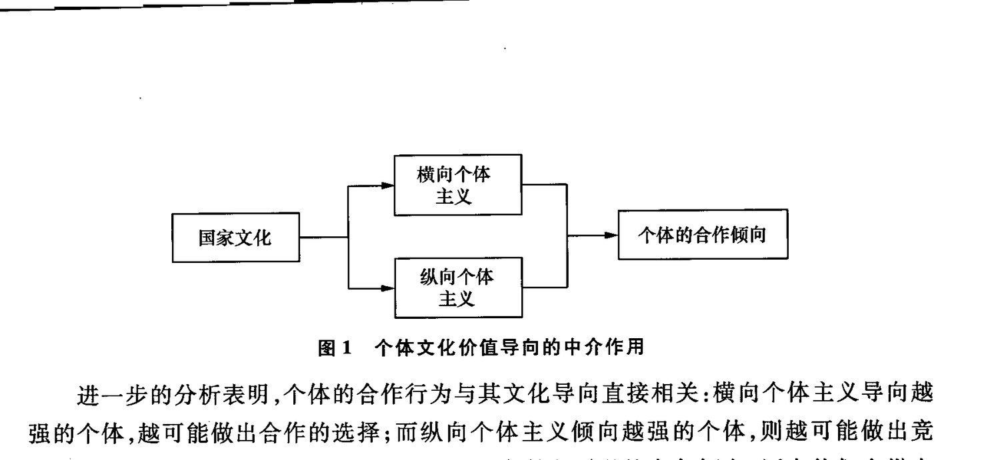

<!-- PDF页 452 -->

I ST

这些评语让我们沉思良久。那时,我几乎每天都在想如何把个体主义一集体主义理论与Yamagishi 的 Institutional View of Culture 结合起来,它们各自的要点、实质,它们的共通之处,以及它们的差异。这两个学说中究竟哪个部分能够直接说明我们的结果,而这些部分之间又是否是彼此互补的。想了几个月之后,那些点点滴滴的思索才算慢慢连接起来,而形成了符合逻辑又同时融合两个学说的理论推论,这就是在现在发表的论文所呈现在读者面前的阐述,确实比我们一开始只用个体主义一集体主义理论要更有理有据、更有说服力、在理论上也更充实、更站得住脚。

这两个理论的联接点其实就在集体主义者对待“内群体”与“外群体”时截然不同的态度和行为。这种“内外有别”的现象被许多研究所重复,在 Triandis 的《个体主义与集体主义》一书中有详细阐述(Triandis, 1995)。但是,仔细阅读有关个体主义一集体主义领域的研究文献,却没有对该现象的深刻解释。而 Yamagishi 的 Institutional View of Culture 实际上是对这种现象的解释,而不是仅仅描述这种现象本身。看清了这个联接点之后,我们便可以从更深的层面去预测行为。也就是说,中国人或日本人之所以愿意与“内群体"成员合作是因为在内群体成员之间存在一种非正式的社会监督。身在澳洲的中国同胞本来数量不是很多,在他乡相遇,将彼此看成“内群体"成员,而这个内群体中的人彼此联络彼此相识,就会形成一种无形的监督系统:一个人的名声在这个群体中会传播得很快。在这种情况下,人们就更愿意合作。而当其他成员是素不相识的“老外”或者陌生人时,这种无形的非正式社会监督系统就不存在,人们因此也就没有对自己行为的顾虑,从而更表现出保护自己利益的倾向。这样一来,我们就把两个理论之间的关系曾述清楚,并且有机地结合了起来。

关于样本可比性的问题还比较容易回答。我们回头去把原始资料找出来,然后把两个样本的平均年龄,学科专业、性别比例和工作经历都罗列出来进行对比,发现在这些条目上两组样本有相当高的相似性,除了工作经历这一项以外。因为中国的大学生在上大学之前和上大学期间都没有工作的经历,而澳州大学生则或多或少有打零工的经历。 另外,就学校的品牌而言,在第一个实验中,中国的大学生来自浙江大学,是中国的前 10 所名牌大学之一;澳洲的大学生来自新南威尔士大学,是澳洲的前 10 所名牌大学之一。在第二个实验中,中国的大学生来自香港科技大学,也是香港的名牌大学,与澳洲新南威尔士大学的品牌也有可比性。因此,我们就把这些详细资料加以了说明。

令人头疼的是对两组被试在横向纵向个体主义一集体主义问卷上答案模式可比性的验证。好在主编向我们推荐了一本书,专门阐述跨文化研究中需要用到的研究方法,由 van de Vijver 和梁觉合著,书名是《跨文化研究的方法和数据分析》(Methods and Data Analysis for Cross-Cultural Research)。我们于是从图书馆借了这本书认真研读,终于搞清楚了如何验证跨文化样本管案模式可比性的统计方法和步骤。这个难题就这样也被攻下来了。我们才算松了一口气。

接下来就是对原作进行修改的过程,以及逐条回答编辑和评委的意见的过程。这

<!-- PDF页 453 -->

个过程对人的耐心常常是极大的考验。我有几个同事都是因为害怕这个过程,就把纺辑要求的“revise and resubmit”文章扔在一边,从此拾不起来,不能够将自己有洪力的论文发表出去,结果给自己的职业发展带来很大的麻烦。我个人的体验是,一定要调整好自己的心态,始终保持平和、谦虚的态度,认真阅读评委的意见,并充分吸收他们的想法。当然,这也并不是说他们怎么说你就一定要怎么做,因为有时候评委与评委之间的意见也可以南边北驾,弄得你不知如何是好。在这种情况下,一般来说,主编会总结所有评委的意见,然后给你一个他/她的判断和决策。所以,以主编的意见为指导,在充分吸收各个评委意见的基础上找到对论文修改最有帮助的观点,自己确定下来之后,再用婉转的方式去说服原先有不同意见的评委,可能就是最有效的方法了。

在完成了这两个过程的写作之后,我们就把论文重新投了出去。一等又是五六个月,才听到了主编和评委的评语。 他们大大奖扬了我们修改过的论文,觉得有“脱胎换骨”的味道。 但是,还有一些小地方他们觉得还有待于进一步完善,比如对两个样本答案模式的可比性验证,其验证性因素分析(confirmatory factor analysis) 的拟合指数(fit indices) 还不够理想,是否可以通过进一步第选条目来加以提高等。这一次需要改动的地方当然比上次少了许多,但是,要重新拾起那些数据和修改的头绪还是插花工夫的。眼看希望就在前面,我们于是又开始专心修改起来,大约一个月后,总算完成了第二稿的修改过程。寄出去后,又过了几个月,才收到了“录用”的消息。

### 结语

通过对这三篇性质不同的论文发表过程的详细描述,大家可以看到一篇论文的经历以及论文背后的作者、编辑和评委所付出的心血和努力。我一直认为自己是一个运气特别好的人,这些年来遇到完全被“reject”的文章还不算太多。 想一想大多数一流管理杂志的稿件录用率只在 10% 左右,就可以知道有和多少作者挨了“当头闷棍”。因此,如果你的论文被编辑要求修改再投(revise and resubmit),就应该高兴得庆贺一番。不管需要修改的过程有多么艰难,修改的道路有多么漫长,都应该不届不找地坚持下去。我认为,论文的选征靠的是灵感和知识积累,论文的实证靠的是所扎实实的方法论基本功,而在论文投递出去之后,车的就是耐心和毅力了。

### 参考文献

Baron, R. M. and Kenny, D. A. (1986). The moderator-mediator variable distinction in social psychological research; conceptual, strategic, and statistical considerations. Journal of Personality and Social Psychology, 51(6), 1173—1182.

Bolle, F. and Ockenfels, P. (1990). Prisoners’ dilemma as a game with incomplete in-

| 一篇论文的经历:从问题的提出到文章的发表 | 439

<!-- PDF页 454 -->

formation. Journal of Economic Psychology, 11, 69—84.

Chen, C. C., Chen, X. P. and Meindl, J. R. (1998). How can cooperation be fostered? The cultural effects of individualism-collectivism. Academy of Management Review, 23 (2), 285—304.

Chen, X. P. and Komorita, S. S. (1994). The effects of communication and commitment in a public goods dilemma. Organizational Behavior and Human Decision Processes, 60, 367—386.

Chen, X. P. and Li, S. (2005). Cross-national differences in cooperative decision making in mixed-motive business contexts; The mediating and moderating effects of vertical and horizontal individualism. Journal of International Business Studies, 36, 622—636.

Hofstede, G. (1980). Culture’s Consequences. Sage: Beverly Hills, CA.

Komorita, S. S. and Parks, C. D. (1995). Interpersonal relations; Mixed-motive interaction. Annual Review of Psychology, 46, 183—207.

Messick, D. M. and Brewer, M. B. (1983). Solving social dilemmas; A review. Review of Personality and Social Psychology, 4, 11—44.

Singelis, T., Triandis, H. C., Bhawuk, D. and Gelfand, M. (1995). Horizontal and vertical dimensions of individualism and collectivism; A theoretical and measurement refinement. Cross-Cultural Research, 29, 240—275.

Triandis, H. C. (1995). Individualism and Collectivism. Boulder, CO; Westview Press.

Van de Vijver, F. and Leung, K. (1997). Methods and Data Analysis for Cross-Cultural Research. Sage; Thousand Oaks, CA.

Yamagishi, T. (2003). Cross-societal experimentation on trust; a comparison of the United States and Japan. In E. Ostrom and J. Walker (eds.), Trust and Reciprocity; 352— 370. Russell Sage Foundation; New York.

<!-- PDF页 455 -->

## 第二十章 发表中国管理研究论文的挑战

一厂早pas >发表中国管理研究论文的挑战美国莱斯大学本章大纲一、 与中国相关的战略管理研究:两种不同的研究思路=. 三个与中国有关的实证研究三、西方理论和中国背景相结合的一些关键问题3.1 确定合适的研究问题3.2 建立整合性理论框架3.3 ”将实证结果普适化四、 结语引 8学者们在从事与中国相关的战略研究时常常会收到评审者如下评论:“为什么你的研究情境是在中国?” “为什么在西方发展起来的组织理论能够应用到中国情境中去?” “你对现有文献的理论贡献是什么?”等等。 在本章中,我们将基于自身的研究经历,讨论我们是如何回答这些问题的。 更重要的是,我们将展示如何通过回答这些问题来增强文章的理论贡献并使之更加清晰。 我们认为,如果能够恰当地使用和扩展,西方的组织理论可以帮助我们更好地理解中国情境中的战略问题。 此外,我们也认为,如果过分强调中国问题的独特性可能会导致组织理论重复发明的风险(the risk of wheel-inventing theories)。* 本文作者鸣谢北京大学光华管理学院的李瑜协助翻译。当然,文责自负。第二二章 | 发表中国管理研究论文的挑战 | 447

<!-- PDF页 456 -->

### 一、与中国相关的战略管理研究:两种不同的研究思路

如果要在国际顶级管理学刊物上发表一篇文章的话,其前提是你的文章必须对现有文献作出重大的理论贡献。因此,研究者在写作过程中必须仔细地考虑他们的研究如何对理论有所贡献,并要明白无误地向读者阅述其文章的贡献。不过,说起来容易,真正要做到这一点却非常困难。从事与中国相关的战略研究的学者们(包括我们自己)往往倾向于在中国情境中对西方现有的理论进行检验。以此为基础的论文在提交学术刊物进行评审的过程中,刊物的编辑和评审者通常会给出这样的评论:为什么你的研究情境是在中国? 为什么在西方发展起来的组织理论能够被应用到中国的情境中去?你对现有文献的理论贡献是什么? 编辑和评审者的这些意见旨在表明,单纯地使用不同的实证背景(例如中国)来检验西方理论本身并不能够构成充分的理论贡献。因此,更好地理解如何扎根中国本土或以中国为情境进行研究以及如何把这种类型的研究置于更加广阔的理论背景中,对从事与中国相关的战略研究的学者们来说就显得至关重要。这也是我们要写作本文的最初动力。

一般来讲,存在两种类型的情境化(contextualization)方法:应用型方法 (the application approach,即将现有的研究问题、理论、测量和研究方法应用到中国的情境中)与创造型方法(the creation approach,即创造中国情境中特定的研究问题理论、测量和研究方法)(Tsui, 2006)。根据 Whetten (2002a; 30一31)的看法,应用型的方法代表了“在新情境中的研究”(research IN a new context)。采用这种方法,学者们通常是根据从新情境中得出的实证结果,对普遍接受的学术知识进行修正。这是跨文化研究的一种标准方法,侧重于检验现有理论和结论所隐含假设的局限性。相比而言,创造型的方法则代表了“对新情境的研究”(research OF a new context)。使用这种方法的研究侧重于描述新颖的、特定情境下的现象,这些现象可能并不显而易见,或者并不为现有的学术领域所熟悉。尽管这两种方法似乎代表了两种极端情况(许多研究倾向于采用两者中的一个),但它们并不一定互相排斥。正如 Roethlisberger (1977) 所描绘的那样,有关组织的研究更像一个“知识企业”(knowledge enterprise),它的最大特征是情境化的经验知识和六适性的分析知识之间存在着连续性的.不断重复的相互影响 (参看 Whetten, 2002a: 31)。因此,组织领域的学者需要不断地通过“将普适性知识应用到具体情境中”和“将特定情境的知识普适化”来把新的特定情境下的现象和现有的学术知识连接起来。那么,如何才能做好这种“连接”呢?

在这一章,我们试图利用自身的研究经历,来阐述中国战略研究的理论构建问题,我们将特别举例说明一些关键问题:如何将普适性知识应用到具体情境中去,以及如何将特定情境的知识普遍化从而使学术文章得以发表。在过去几年,我们从不同刊物的众多评审过程(修改和再提交) 中受益良多。从评审者那里,我们收到过不少球手的问

<!-- PDF页 457 -->

题乃至尖锐的批评,例如上面所列举的“为什么是中国?”“为什么在西方发展起来的组

织理论能够应用到中国情境中?”“你对文献的理论贡献是什么?”等问题。通过有效地

回答这些问题和批评,我们显著地提高了文章的质量并更好地理解了情境化和理论化”的过程,从而也使我们的文章最终得以发表。

在以下的内容里,我们将首先简要地描述我们修改和再提交的三篇与中国有关的战略研究(见表1)的经历。这些研究在理论(资源基础观 (resource-based view)、可占有性理论(appropriability theory) 和社会认同理论(social identity theory)) 和研究设计(一手调查数据、档案数据和田野研究)等方面各不相同。我们要描述这些文章最初所研究的问题论文贡献和所使用的理论, 然后,讨论刊物编辑和评审者所关心的理论问题?以及终稿对普适性学术知识的贡献。在对每篇文章进行介绍之后,我们将讨论情境化知识和普适性知识之间“连续重复的相互影响”这个关键问题。.

### 二、三个与中国有关的实证研究

研究一:Li and Zhang (2007, Strategic Management Journal)

这篇文章考察了中国高技术产业中管理人员的政治网络(political networking)和职能经验(functional experience)与新创企业 (new ventures) 绩效之间的权变关系。在初期版本中,我们试图填补文献中的两个实证空白。首先,此前转型经济情境下的研究重在考察管理连带(关系) (managerial ties) EPS POE, BH RABY景下的研究则强调管理人员的行业和职能经验(industry and functional experience) 所反映的管理经验的重要性,但没有实证地考察转型经济背景下管理联系和管理经验如何影响新创企业的绩效。其次,我们对转型经济的特定背景如何影响管理联系、职能经验与新兴企业绩效之间的关系知之其少。 我们的讨论最初建立在资源基础观(the resource-based view) 上。我们认为企业管理人员能够提供两种类型的管理资源: (1) 他们在多个职能领域的管理经验和技巧(职能经验)一一这反映了他们的人力资本;(2) 他们与外部行动者的联系(我们集中考察他们的政治网络)一一这反映了他们的社会资本。根据资源基础观,我们认为这些管理资源能够帮助新创企业获得好的绩效。虽然我们也提出了权变效应(contingency effect),但是没有触及特定的理论。精彩过,的总图不是讨论中国相关路研究中的实证辣题。 对于情境化实证问题,请参考 Tsui(2006)的

Bite | 发表中国管理研究论文的挑战 | 443

<!-- PDF页 458 -->

表1 三个与中国相关的战略研究所使用理论对文章的重要作用文章对理论的贡献论文样本、 (importance of theory (contributions of the paper的理论 to the paper) to the theory) liad ”对中国技术产业资源基础帮助建立一个转型经济我们的理论和实证结果显Zhang, 184 家新创企业的观和可占背景下管理能力的权变示转型经济背景下制度背2007 一手调查数据有性理论 ”价值的整合性理论框架 ”景影响新创企业从它们的并形成研究假设管理资源中搜取利益的程度Zhang,Li,243 家国际合资企可占有性帮助建立一个转型经济 ”我们的理论和实证结果显Hitt and 业档案数据(数据理论背景下跨国公司研发投 ”示跨国公司在转型经济中Cui, 2007 来源来自中国第资的权变价值的拱形理 ”的研发投资的价值依赖于三次工业普查) 论框架并形成研究假设。 它们能够在多大程度上成功解决创新的知识泄漏风险Zhang, 对 159 个跨国公社会认同帮助确立研究问题并建”利用本地高级经理人员在George and 司在华子公司的理论立一个整合性理论论点。 跨国公司子公司中独特位Chan, 2006 本地高级经理人早先的研究问题是:什么”置来考察这个广泛的理论员的一手调查数因素影响跨国公司在华” 问题。我们的研究显示同据子公司本地高级经理人 ”高地位群体的认同能够减员的离职意向? 现在的”少低地位群体作为社会身研究问题是:人们如何处”份的来源的盛行,从而避理他们的多重社会身份, 免这种消极认同的负面特别是当这些社会身份”影响在地位上不一致的时候

这篇文章在提交给 Stirategic Management Journal 进行评审后,评审者反馈各异。一个评审者说:“这项研究的结果......为理解管理能力、制度发展和新创企业绩效之间的关系作出了坚实的贡献”然而另一个评审者的评论则不太正面,他/她问道:为什么管理人员的政治网络和职能经验影响新创企业绩效这个研究问题是有趣的(既然已经预期到这一点)? 该评审者进一步指出:“关于你们的交互作用的论断,你们没有抓住所讨论情况的内在复杂性,从而失去了创造发展某些理论的机会。”

我们基本上同意第二位评审者提出的问题,既然能够预见到主效应 (main effect)一一管理人员的政治网络和职能经验影响新创企业绩效,这个问题研究起来就不是特别有意思。事实上,这些主效应假设的作用在于为进一步发展更有趣的权变效应提供了基础。那么问题是:如何能够建立一个能够抓住转型经济中管理能力的权变效应复杂性的整合性理论框架(overarching theoretical framework)呢?

经过反复考虑和讨论,我们决定使用可占有性理论(appropriability theory) 来建立理论框架。根据 Teece (1986)的研究,可占有性(appropriability) 指的是企业能够从他们创新活动中获得报偿的能力。根据这个逻辑,我们认为管理能力对新创企业绩效的作用将会随着制度环境的不同而发生变化。 因此,在修订稿中,我们一开始就直接提出了

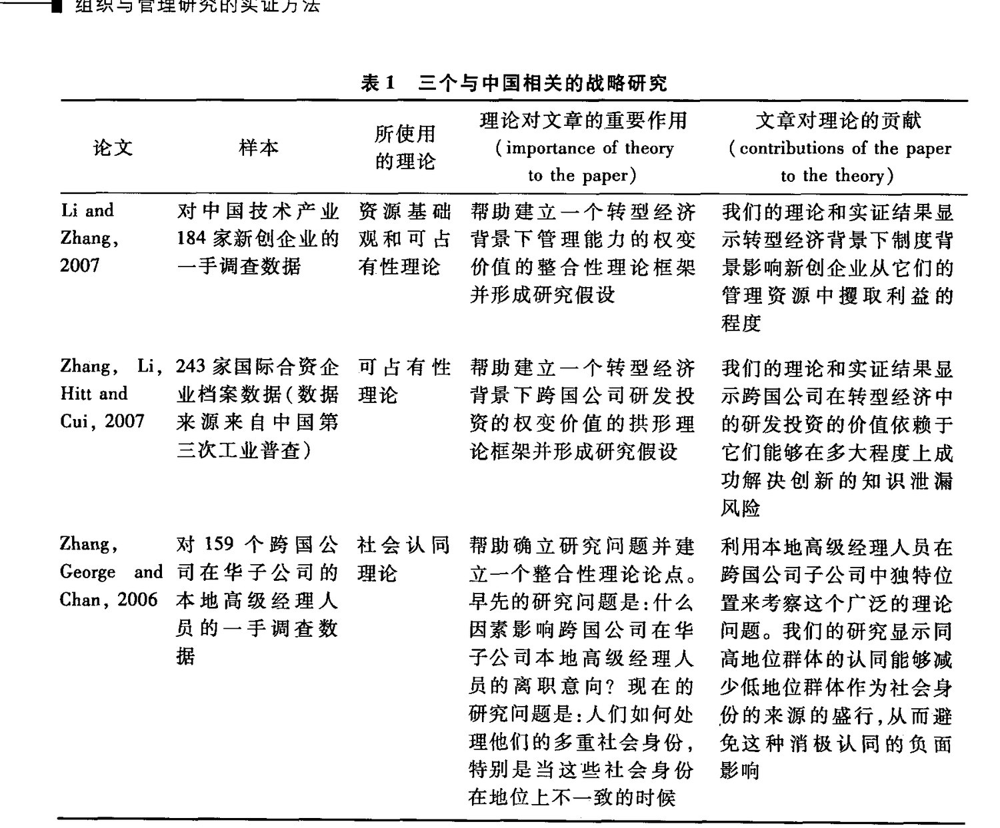

<!-- PDF页 459 -->

主效应假设:管理人员的政治网络和职能经验对新创企业绩效有正向影响。之后我们提出,由于关系能够替代转型经济中不完善的制度结构,因此当制度对新创企业的支持上比较弱的时候,管理人员的政治网络对新创企业绩效的影响会更强。同时,如果制度背景允许新创企业保留管理人员的职能经验所产生的收益(rents),那么管理人员的职能经验对新创企业绩效的影响会更加重要。基于这样一个总体理论框架,我们考察了新创企业的所有权类型(比如,相对非国有类型的所有制,国家所有制意味着更强的制度支持)和市场环境中不良竞争(dysfunctional competition) 的程度(比如,不良竞争的程度越高意味着制度支持越弱) 如何调节管理人员的政治网络和职能经验对新创企业绩效的影响。我们的实证结果显示管理人员的政治网络对新创企业绩效的影响没有受到这些调节变量的影响,而且也显示当新创企业是国有以及/或者市场不良竞争的程度较低的时候,管理人员的职能经验对新创企业绩效有更强的正向影响,这一发现和我们最初的假设相吻合。

在终稿中,这项研究的贡献已经超越管理能力、所有权和市场不良竞争与新创企业绩效之间的实证结合。我们的研究结果说明了转型经济背景下制度结构是如何影响新创企业从管理资源、特别是他们的职能经验中搜取利益的。我们所构建的理论框架和实证研究结果对其他的组织资源和情境变量(能够抓住占有制度上的变化)在转型经济中的角色也有所启示(正如我们在下文中所做的那样)。

研究二: Zhang, Li, Hitt and Cui (2007, Journal of International Business Studies)

这篇文章是在听取了编辑和评审者的评论和建议并经过两轮修改、投稿之后,内容才发生了本质性的变化。在第一次投稿中,我们考察了市场专注(market focus) (比如,专注出口市场或专注本地市场)和所有权结构(ownership structure) (外资控制与本地控制)如何独立和交互地影响跨国公司在华合资企业的研发集中度(R&D intensity)。然而,该刊物的部门编辑陆亚东教授和一个评审者对我们的研究关注点提出了质疑。陆亚东教授清楚地指出:“既然已经有很多研究考察了当地市场适应性和所有权结构对资源投入的影响(本地研发集中度是资源投入的代理变量),那么直接联合起来进行考察的价值可能就比较有限。”他建议如果考察市场专注和所有权结构如何分别和联合调节合资企业研发投资活动的绩效,这样的话,我们研究的问题将会比较引人注自。

我们完全同意陆亚东教授和那位评审者的意见和建议。那么接下来就是建立一个令人信服的整合性理论框架来分析这种权变的组合关系。例如,市场专注如何调节研发投资与合资企业绩效之间的关系?研发投资、市场专注和所有权结构之间的各种不同组合对合资企业绩效的影响其至更加复杂。受到我们最近发表在《战略管理杂志》 (Strategic Management Journal)上的文章的启发(上文讨论的文章),我们决定使用可占 -有性理论来建立我们的理论框架和形成研究假设。

Sit8 | RAP OELAAE AH RR | 445

<!-- PDF页 460 -->

运用知识泄漏风险(appropriability hazard) 的概念,我们提出跨国公司在新兴市场(emerging markets)上的合资企业面临两种类型的知识泄漏风险:与本地市场相关的知识泄漏风险和与本地合作方相关的知识泄漏风险。产生与本地市场相关的知识泄漏风险是因为,合资企业在以不完善和无效的知识产权保护为特征的新兴市场上的研发活动可能会被泄漏给当地的其他企业,从而使合资企业不能够从它们的研发投资中获得充分甚至部分收益。产生与本地合作方相关的知识泄漏风险是因为本地合作伙伴可能会滥用跨国公司转移到合资企业的专有技术(proprietary technology),以及本地合作伙伴可能会使用合资企业的研发资源为自己的利益服务。因此,研发集中度和国际合资企业绩效之间的关系可能会依赖于在新兴市场上潜在的知识泄漏风险水平,当知识泄漏的风险减少时,研发集中度和国际合资企业绩效之间可能会出现正向的关系。

基于这个总体理论框架,我们考察了两种不同的防御机制:(1) 合资企业的市场专注,(2) 所有权结构。我们认为,合资企业如果更加专注于出口市场,那么当地其他企业模仿合资企业的研发技术的可能性就会降低——从而减少与本地市场相关的知识湛漏风险。此外,跨国公司拥有多数股权(大于 50%),能够使跨国公司对合资企业的研发资源如何使用有更大的控制权,从而会进一步减少与本地合作方相关的知识泄漏风险。使用多重组合(configuration) 的方法,我们进一步提出,在出口市场和跨国公司拥有多数股权的情况下,研发投资对合资企业绩效的正向影响关系最强。我们的实证研究结果指出:(1)当合资企业专注于出口市场而不是本地市场时,研发投资对合资企业绩效有正向影响; (2) 所有权结构对研发投资——合资企业绩效关系没有调节作用;(3) 在合资企业专注于出口市场且跨国公司在合资企业中占多数股权的组合下,研发投资对合资企业绩效有正向的影响,但在其他的市场专注及所有权结构的组合下并非如此。 -

这次修改之后,我们的研究问题变为:跨国公司如何在以不完善的产权保护为特征的新兴市场上从它们的研发投资中受益? 正如该刊物编辑所评论的那样,这是一个“在理论上和实践上都非常重要的问题"。更重要的是,通过发展一个相互协调一致的理论框架来解释与本地市场相关的知识泄漏风险和与本地合作方相关的知识汇漏风险是如何发生的以及如何影响研发投资和合资企业绩效之间的关系,我们不仅大大地推动了文献发展,而且也使理论模型的应用更加广泛。例如,对于跨国公司在新兴市场上的独资子公司(wholly-owned subsidiaries) 而言,与本地市场相关的知识泄漏风险比与本地合作方相关的知识泄漏风险和他们的相关性更大。此外,在一个拥有先进有效产权保护的东道国,与本地市场相关的知识泄漏风险对跨国公司的子公司(独资或合资)可能并不重要。这些情况都是这个研究中所发展和验证的理论观点的应用。从这个意义上看,我们的理论观点是可以作为考察跨国公司海外研发活动(或者一般意义上跨国公司资源)及其绩效的总体指导框架。

“

<!-- PDF页 461 -->

研究三:Zhang, George and Chan (2006, Journal of Management)

在这篇文章的初次投稿中,我们提出了如下研究问题:如果在跨国公司的海外子公司中,保留本地高级经理人员是至关重要的,那么什么因素可能影响本地高级经理人员的离职意向? 根据社会认同理论(social identity theory),我们提出,本地高级经理人员可能会由于具有共同国籍而获得本地员工的认同。如果本地员工被认为不称职 (缺乏 -知识和技能而且不被尊重),那么认同这个群体的自然基础(共同的国籍)将可能导致本地高级经理人员辞职。基于这个论点,我们提出,感知到的本地员工不称职与本地高级经理人员的离职意向有正向关系。我们进一步提出,跨国公司总部与本地高级经理人员之间的关系——本地高级经理人员和总部之间交流的质量、总部对本地高级经理人员的控制和本地高级经理人员对总部的信任——可能对这种正向关系有调节作用。

虽然我们在文章中使用了社会认同理论,我们着眼于使用这个理论去解释跨国公司在华子公司的本地高级经理人员的离职意向,但是并没有对如何发展社会认同理论进行讨论。然而,该刊物的编辑 Carol T. Kulik 教授在她的信中清楚地指出了这个问题。她认为:“成功的修改包括两方面的问题:一个是理论上,另一个是方法论上的。首先,在理论方面,我想要看到你们对该论文理论贡献更广泛和清晰的理解。目前你们只是把研究局限在新兴市场上跨国公司的本地经理身上。然而,我相信这里存在一个更加广泛的问题一关于组织成员如何处理他们的双重身份问题,特别是当一种身份被丑化或者处于不利位置的时候。我想要看到你们在更大程度上——既在前面的理论背景又在后面的讨论中——强调这个问题。 没有这个更加广泛的框架,我们就有可能要加)。看来,对于 Kulik 教授来说,有关理论方面的讨论将直接影响到这篇论文是否被接受发表。我们也同意她的看法。

经过两轮的修改和再评审之后,我们成功地阐述了这个主要的理论问题(以及其他问题)。在文章的最终稿中,一开始我们就谈到了社会认同理论。我们首先简要回顾了社会认同理论和它建立在组内偏差(ingroup bias)上的核心观点,然后讨论了社会认同理论最近的研究进展。社会认同理论最近的研究进展表明,地位高的群体比地位低的群体更加有偏见,当地位高的群体受到地位低的群体认同时,他们会显示出与组内偏好(ingroup favoritism) 相反的看法。在对文献进行回顾的基础上,我们指出社会认同理论的一个重要缺口。大部分早先的研究认为每个人只是一个群体的成员,或者属于高地位群体或者属于低地位群体。然而,因为存在多种社会分类的基础,例如性别、年龄分组国籍和在组织层级中的位置等,一个人能够同时属于多个群体。一个重要而有趣的研究问题是人们如何处理他们的多重社会身份,特别是当他们的社会身份在地位方面不一致的时候(例如当一个身份被丑化或处于相对不利位置的时候)。

我们认为跨国公司在华子公司的本地高级经理人员代表了一个探讨更广泛理论问

Sate | 发表中国管理研究论文的挑战 | 447

<!-- PDF页 462 -->

题的合适情境。跨国公司子公司中的本地高级经理在他们的组织中处于一个相对独特的位置,从而使他们有可能认同在工作环境中地位相当不同的两个群体。一方面,他们可以作为“本地人”认同本地员工,另一方面,他们可以作为“高级经理人员”认同总部管理层。在这个研究中,我们感兴趣的是他们的双重身份如何影响他们的离职意向。. ”我们认为,如果本地员工被认为是不称职的,那么本地高级经理人员为了避免和不称职

本地员工的负向认同可能会想离职。我们进一步指出本地高级经理人员获得总部管理者(一个高地位群体)认同的程度越高——通过更高质量的交流、更低水平的控制(也就是越高的自治)和更高水平的信任——他们同相对较低地位群体之间的认同会变得不太可能,因此感知到的本地员工的不称职和本地高级经理人员离职意向之间的正向关系也将会减弱。我们的实证结果支持了这个论断。

在最终稿中,我们的贡献超出了跨国公司在华子公司高级经理人员的特定情境。我们的研究结果对社会认同理论做出了重要贡献而且能够被应用到其他情境。这是因为具有两个或者更多在地位上不一致的社会身份在复杂多样的现代组织中并不少见。例如,黑人经理人员可能认同地位不一致的两个群体:黑人(传统上一个种族地位相对较低的群体)和经理人员(基于组织层级地位相对高的群体)。考察多重社会身份问题不仅直富了社会认同理论而且也有助于我们理解现代组织中影响群体间和群体内过程的机制。我们的结果显示,为了保留雇员,组织应该促使正向的身份认同而减少负向的

. ”身份认同。

在 Kulik 教授的论文接受信里,她对我们的修改感到非常满意。她表示:“我非常高兴看到这篇文章在前面及中间部分突出其理论贡献。我认为你们非常有效地传达了你们所研究的社会身份问题而且没有失去特殊应用中有意思的成分。与先前的版本相比,这个版本将会吸引更加广泛的读者。”

### 三、西方理论和中国青景相结合的一些关键问题

以上我们简短地描述了三篇文章修改和再投稿的过程,通过听取编辑和评审者的评论和建议,我们进一步修改了文章并使文章最终得到发表。基于此,本节将讨论西方理论和中国背景结合的一些关键问题:(1) 确定合适的研究问题; (2) 建立整合性理论框架;(3) 将实证结果普适化。前两个问题是如何将普适性知识(理论)应用到具体情境中,后一个问题是如何将特定情境的知识(研究结果)普遍化。这三个问题结合在一起代表了情境化知识和普适性知识之间“相互影响”的过程。3.1 确定合适的研究问题

Huff (1999)专门探讨了如何写作并发表学术论文。Huff 鼓励作者把“写作学术论文"和“加入学术对话讨论”类似看待。根据 Huff 的观点,写作学术文章的作者需要“确

<!-- PDF页 463 -->

定合适的研究问题"。换句话说,间什么样的研究问题? 听众是谁? 为什么所研究的问题是和听众相关的而且是有趣的? 许多学者的研究问题通常关注文献中没有考察过的变量之间的实证联系而不是更广泛的理论问题,但是,这样的研究问题仅仅会让有限的听众感兴趣。相反,理论能够指引作者确定合适的听众和研究问题。

Zhang, George 和 Chan (2006) 的文章是一个明显的例证。如上文所指,在初次投稿中,我们的研究问题是:什么因素可能影响跨国公司在华子公司中本地高级经理人员的离职意向? 这个研究问题的目标听众范围非常狭窄(例如那些对跨国公司保留当地高级经理人员感兴趣的人)。在最终稿中,依据社会认同理论,我们的研究考察了一个更为广泛的理论问题:人们如何处理他们的多重社会身份,特别是当这些社会身份在社会地位上不一致的时候? 既然多重社会身份在现代组织中相当普遍(例如,女性经理人员,少数民族经理人员、跨职能团队和联盟管理团队等)。这个研究问题的听众更广,从而使这个研究能够加入到一个现有的更加广泛的学术对话中去。

在另外三篇文章中,我们也用理论去改造我们的研究问题。例如,在 Li 和 Zhang (2007)中,早期版本的研究问题是:管理人员的政治网络和职能经验如何影响新创企业绩效以及这种影响如何被新创企业的所有权结构和市场不良竞争的程度所调节? 在最 |终的版本中,因为可占有性理论的引导,研究问题要广泛得多:企业如何在知识产权保护较弱的转型经济中从他们的管理能力中受益?在 Zhang, Li, Hitt 和 Cui (2007)的文章中,起初的研究问题是这样的:合资企业的市场专注和所有权结构如何分别以及联合影响合资企业的研发集中度? 与之相比,最终版本的研究问题变为:跨国公司如何在产权保护弱的转型经济中从其研发投资中受益? |

很清楚所有这三篇文章最初的研究问题都是以变量为中心并重点考察变量之间的实证联系。这些定义狭窄的研究问题有可能要我们为每种情况(例如,每种类型的雇员、每种类型的组织、转型经济中企业的每种环境维度,资源维度和战略维度)分别发展和检验理论/模型。不过,在理论的指导下,这些文章的最终稿都提出了更普遍、更合适并且更令人感兴趣的研究问题。

### 3.2 建立整合性理论框架

一稍好文章的重要标准之一是它的理论框架的一致性或简约性(Dubin, 1978; Whetten, 1989)。在一个一致性的理论框架里,各部分(例如,因变量、自变量和调节变量等)都是整体框架的自然组成部分。那些对理论框架带来很少附加价值的因素不应当被包含在框架内。这样的框架能够整体地指导一项研究并且支持每种特定的关系。相反,没有理论的一致性,框架将会变得支离破碎,毫无完整性可言。在这样的框架里,.没有令人信服的论据说明为什么模型中的变量对理解被研究的现象来说是重要的和需要进行深入研究的。没有合理的论据阐明为什么所研究的变量之间相互关联。针对这种情况,评审者经常会做出如下评论:这篇文章给人的印象是概念的简单堆历和各种理

Bate | 发表中国管理研究论文的挑战 | 449 |

<!-- PDF页 464 -->

论的混为一谈。理论能够让学者建立起一个一致性的总体理论框架,从而能推导出研究假设并把他们整合到一起。通过建立一致的整合性理论框架,我们以上所讨论的三篇文章最终都得到了很大改进和提高,从而得以发表。 | Li 和 Zhang (2007)的文章考察了影响管理能力和新创企业绩效之间关系的两个调节变量(所有权类型和环境中不良竞争的水平)。我们为什么集中考察这些调节变量YE? 它们如何组合? 这些调节变量的理论意义是什么? 在早期版本中,因为缺少一致的整合性理论框架,我们不能够回答这些问题。在终稿中,我们使用可占有性理论建立了一个一致的整合性理论框架。这个理论框架指出,由于政治网络能够蔡代不完善的制度结构,因此在制度支持较弱的情况下,转型经济中管理人员的政治网络更有价值;如果制度背景允许新创企业保留管理人员的职能经验所产生的收益,那么管理人员的职能经验就更有价值。基于这个理论框架,我们提出了权变的假设。由于所有权类型和市场上不良竞争的水平符合我们整合性理论框架的逻辑,并能用来检验文章的理论框架,我们使用这两个变量作为调节变量。我们认为,和其他所有权类型的新创企业相比,国有的新创企业面临的制度支持越强,管理人员的政治网络对企业绩效的正向影响就越弱,国有新创企业管理人员的职能经验对企业绩效的正向影响越强。相似地,我们认为市场上不良竞争的程度越高,制度支持(例如产权保护和回约履行等)就会越弱,因而管理人员政治网络的正向效应会越强,管理人员职能经验的正向效应会越弱。

- 与之类似,Zhang, Li, Hitt 和 Cui (2007) 的文章在提出特定研究假设之前也发展了一个一致的整合性理论框架。这个框架指出,跨国公司在新兴市场上的合资企业面对两种类型的知识泄漏风险:与本地市场相关的知识泄漏风险和与本地合作方相关的知识泄漏风险。当知识泄漏风险减少时,研发集中度和国际合资企业绩效之间可能存在正向影响关系。这个论断是建立在我们的合资企业市场专注和所有权结构如何分别和联合调节研发集中度和合资企业绩效的关系的整合性理论框架基础上的。我们认为合资企业专注于出口市场有助于减轻与本地市场相关的知识泄漏风险,跨国公司拥有合资企业的多数股权有助于减轻与本地合作方相关的知识泄漏风险。这个研究的实证结果不仅上昭示了市场专注和所有权结构的调节作用,更重要的是提供了支持这个普适理论框架的证据。

### 3.3 ”将实证结果普适化

评审者在评审与中国有关的战略研究的论文时总是纠绽于这样的问题:你如何将来自于中国情境下的研究结果应用到其他情境中? 虽然期望与中国有关的战略研究能应用到所有其他可能的情境中去并不公平,但对于中国有关的战略研究而言,情境敏感性确实重要。这一方面是因为中国独特的政治、文化和经济体制会影响企业的战略行`为,另一方面也说明在国际顶级管理学刊物上有关中国企业战略研究的论文相对较少,很多评审者对这个领域的研究也缺乏了解。通常,为了回答这个普适化的问题,学者们

<!-- PDF页 465 -->

可能会讨论样本的特征并同其他类似研究作样本和研究结果的比较。学者们也可能会考虑“理论效应是否会随时间而变化,或者因为存在其他理论上重要的随时间变化的变量或者由于某种原因而使理论效应不稳定?”(Whetten,1989: 492)。虽然这些方法都有用,但我们相信使用理论是回答这个普适化(generalization) 问题的一个重要方法。如果一篇论文的整合性理论框架是建立在强有力的现有理论的基础上,那么即使样本、测度和方法是情境特定的,研究的实证结果也能够对理论提供广泛的指导和启示。

让我们回过头来看看 Huff (1999) 关于写作学术论文就像参加学术对话的评论。Huff 认为,学者们在写文章时要强调自己的研究对所加入的学术对话的特定贡献。也就是说,当一些人在围绕某个或菜些问题进行对话时,请想象一下你的加入会给这场对话带来什么新的东西(包括新的观点.新的理论或者新的方法)。相似地,Whetten (2002a: 30)也指出,学者们在研究新的、特定情境中的某个现象时将会面对两个障碍: “(1) 让间事们对新现象熟悉起来;(2) 证明该现象和当前讨论是相关的。”

根据我们的经历,我们能够将情境化的研究结果普遍应用到更广泛的文献中去,是因为我们的模型是建立在现有理论的基础之上。这样做的结果是,我们的研究和现有的理论是紧密相连的,这种相连能够使我们将发现的特定情境的研究结果普遍化。例如,在 Zhang, George 和 Chan (2006)的研究中,结果发现所感知到的当地员工不称职和本地高级经理人员的离职意向正相关,而且当总部和本地高级经理之间的交流质量高并且/或者本地高级经理人员对总部管理层高度信任的时候,这种正相关关系会进一步减弱。没有一个强有力的理论框架,这些实证结果至多只能说明所感知到的当地员工不称职和总部一本地高级经理人员之间的关系可能会分别或者联合影响跨国公司子公司本地高级经理的离职意向。然而,注意作者在一开始就识别了一个广泛的研究问题:组织成员如何处理他们的双重身份? 特别是当一种身份被丑化或者处于相对不利位置的时候? 基于社会认同理论,作者阔述了更加广泛的理论问题。这样,他们的实证结果的贡献就超出所检验的实证关系——他们的实证发现为他们的普适性理论观点提供了证据。因为理论观点可以普遍应用,所以他们的研究发现能够对其他情境(例如现代组织中女性经理和黑人经理)的研究提供启示。

在Zhang, Li, Hitt 和 Cui (2007)的研究中,结果显示:(1) 当合资企业专注于出口市场而不是专注于当地市场时,研发集中度对合资企业绩效有正向的影响; (2) 在专注.于出口市场和跨国公司占多数股权的情况下,研发集中度对合资企业绩效有正向的影响,但在其他市场专注和所有权结构的组合下并非如此。因为作者在现有理论基础上建立了一个整合性理论框架,所以这些实证研究结果的贡献超出了所考察的特定实证联系。这些实证结果为整合性理论框架提供了实证支持,而且能够普遍应用到其他情境,例如跨国公司在新兴市场上的独资子公司或者跨国公司在产权保护更加先进有效的东道国的子公司(独资或合资)中去。

Li 和 Zhang (2007)也具有同样的特征。他们的实证研究结果显示,在国有的新创

cese 3 | RAP DERG KR | 451

<!-- PDF页 466 -->

企业和/或市场上不良竞争程度较低时,管理人员的职能经验和新创企业绩效之间的正向关系会更强。没有坚实的整合性理论框架,这些研究结果仅仅能显示所有权类型和不良竞争会如何调节管理人员的职能经验和新创企业绩效之间的关系。那样的话,我们就可能要为各种类型的权变变量分别发展和检验模型。然而,因为研究假设来自于整合性理论模型,实证的研究结果能够对更加广泛的问题有所启示:新创企业如何从它们的资源中获得利益?这项研究对这个问题的回答是新创企业能够从资源中获得利益的程度取决于制度环境中占有制度(appropriability regime)的完善程度。因此,这些发现能被推广应用到新创企业其他类型的资源和新创企业所面临的其他占有制度的情形中去。

Oa 8

从以上讨论可以看出,我们的研究通常是从一个有趣的、独特的中国情境现象开始。我们试图讨论的问题不是源于现有的理论,而是源于新颖的与中国特定情境相关的现象。在选择“研究什么"的时候,用 Tsui(2006)的话来说,我们采用了“由内而外”而不是“由外而内”的方法。这种“由内而外”的方法通常有助于理解中国特有的问题。相反,“由外而内”的方法却是在考察中国情境中现有文献所关注的话题或者现象(Tsui, 2006: 3)。正如 Tsui (2006: 3) 进一步指出的,“我倡导和支持由内而外' 的方法,“由内而外'的方法确定重要的独特问题或者至少是对中国企业、经理人员和雇员重要的问题,即使这样的现象对于这个情境外的学者可能陌生的。” 比较而言,“由外而内”的方法则有可能错过在中国情境中真正重要的组织和管理问题。当然,使用“由外而内”的方法要求作者对中国有深刻的了解。我们从早前在中国的研究经历、对中国经理人员的访谈和经常阅读中国管理类学术期刊中(比如,《管理世界)《经济研究) 以及《社会学研究)等)受益良多。

然而,当谈到“如何研究”时,问题会变得更加复杂。Tsui(2006:4) 批评了应用型方法(即直接把西方的理论应用到中国情境中)所隐含的问题,“观察和分析被限定在现有理论中的变量和隐含逻辑中”。但西方理论赖以建立的一些关键假设可能在中国情境中并不正确。因此,她建议学者可以在中国情境中创造必须通过完全不同的视角才能发现的新的理论(Tsui, 2006: 7)。

我们的方法居于应用和创造两种方法中间,代表了“利用西方理论或将其拓展到中国情境的理论构建研究”(Tsui, 2006: 7)。一方面,我们的研究不是西方理论的直接应用,其原因如下:(1) 我们从中国背景下新颖的现象引出“研究什么”; (2) 我们通过整合西方现有理论和中国情境来建立整合性理论框架; (3) 在很多情况下我们研究的变量和关系尚未在文献中考察过。另一方面,我们的研究建立在西方理论(并非完全不同)基础之上而且和现有的文献紧密相关。通过重复研究过程(和广泛应用于扎根理论

<!-- PDF页 467 -->

构建研究的重复研究过程相类似),我们来实现这种平衡 (Eisenhardt and Graebner, 2007; Glaser and Strauss, 1967; Whetten, 2002b),

在扎根理论构建研究中(grounded theory-building research) (详细讨论请参见 Glaser and Strauss, 1967; Whetten, 2002b),学者从熟悉数据开始,然后确定关键的构念以及构念之间的关系(理论模型)来接近数据。通常,他们会经历一个在“理论”和“数据"之间来回的重复过程直到他们对“模型"和“数据”之间的“契合"感到满意。 我们以上讨论的所有三篇研究都经历了这样一个在“理论"和“数据"之间来回的重复过程。 从熟悉数据开始(对现象的观测和初步实证研究结果),之后我们回到理论中去并使用各种理论(不仅仅使用一个理论)来解释数据。 不同的理论可能意味着不同的实证模型和关系,于是我们又回到数据来检验其他的模型和关系。 这个过程不断重复,直到我们(以及编辑和评审者)对“理论"和“数据"之间的站合感到满意。 这样一个重复过程的结果是, 我们的研究在保持独特的情境化知识的同时能够加入到现有的学术对话中去。更重要的是我们能够利用独特的情境化知识来拓展现有的理论。正如 Whetten (2002a: 31)所观察到的:“这种将新的特定情境的现象和现有的学术知识联系起来的模式说明了过去的二十年里组织研究领域的大部分发展。” 显然,我们的方法和 Whetten 的观察一致。

最后,我们想要指出,在研究与中国相关的战略问题时,片面强调“创造理论”可能会有潜在的危险。虽然中国有自己独特的历史、社会.政治和文化背景,但是中国企业和西方企业在根本上有许多共同点。 例如它们都要建立核心竞争力、形成联盟、进行研发开发新产品和服务、适应环境变化、建立和保持有效的管理团队以及与本地和外国竞争者竞争等。 随着中国经济进一步向市场机制转型以及中国企业越来越多地参与全球竞争,中国企业和西方企业之间的差异可能会越来越少或者变得越来越微不足道。因此,现有的西方理论例如资源基础观、代理理论(agency theory)、、交易成本理论(transaction cost theory)和可占有性理论能够而且应该可以用来考察与中国相关的战略问题。相反,如果我们过分强调中国企业的独特性,我们有可能会面临重复发明理论的危险以及将中国战略研究和现有的学术对话和知识构建相隔离,从而使得与中国相关的战略研究变得边缘化。

总之,在本章中,我们利用自身的研究经历, 善重讨论了如何将西方理论和中国情境相结合来考察与中国相关的战略问题。 我们的经历和经验反映了西方理论和中国情境之间连续重复的相互影响。 我们希望通过分享我们的经历和经验能够对其他从事与中国相关的战略研究的学者有所神益。

参考文献Dubin, R. 1978. Theory Building. New York; Free Press. | RAP RH HK | 453

<!-- PDF页 468 -->

Eisenhardt, K.M. and Graebner, M. E. (2007). Theory building from cases; Opportunities and challenges. Academy of Management Journal, 50, 25—32.

Glaser, B. and Strauss, A. (1967). The Discovery of Grounded Theory; Strategies in

, Qualitative Research. London; Wiedenfeld and Nicholson.

Huff, A.S. (1999). Writing for Scholarly Publication. Thousand Oaks, CA: Sage.

Li, H. and Y. Zhang (2007). The role of managers’ political networking and functional experience in new venture performance; Evidence from China’s transition economy, Strategic Management Journal, 28, 791—804.

Teece, D. J. (1986). Profiting from technological innovation; Implications for integration, collaboration, licensing, and public policy. Research Policy, 15, 285—305.

Tsui, A. (2006). Contextualization in Chinese management review. Management and Organization Review, 2, 1—13.:

Whetten, D. A. (1989). What constitutes a theoretical contribution? Academy of Management Review, 14, 490—495.

Whetten, D. A. (2002a).. Constructing cross-context scholarly conversations. In Tsui, A. and Lau, C.M. (eds.), The Management of Enterprises in the People’s Republic of China; 29—47. Boston; Kluwer Academic Publishers.

Whetten, D. A. (2002b). Modeling-as-theorizing; A systematic methodology for theory development. In Partington, D. (ed.), Essential Skills for Management Research; 45—71. London, UK; Sage.

Zhang, Y., H. Li, M. Hitt and G. Cui (2007). R&D intensity and international joint venture performance in an emerging market; Moderating effects of market focus and ownership structure. Journal of International Business Studies, 38, 944—~960.

Zhang, Y., J. M. George and T. S. Chan (2006). The paradox of dueling identities: The case of local senior executives in MNC subsidiaries, Journal of Management, 32(3), 400—425.

<!-- PDF页 469 -->

## 附录

<!-- PDF页 470 -->

<!-- PDF页 471 -->

## 附录一 IACMR追求卓越宣言（伦理准则）

## 附录一AY > rl i %,

IACMR 追求卓越宣言(伦理准则)

IACMR 的宗旨就是追求卓越。这种承诺不仅体现在组织的工作层面和它的成员身上,还扩展至本组织对其赞助者的一贯态度。

IACMR 把“卓越”作为其最高的努力和追求目标。其职责为:

1. 创造并传播中国情境下企业管理的知识,这些知识不仅具有严谨的学术价值,而且真实地反映现实世界并在追求卓越的商业实践中有用的管理知识。

2. 致力于推广发展设计严谨、善待被试、保护隐私、认真报告结果的学术研究,并且强调对引用的文献要注明出处。

3. 促进研究人员与管理实践者之间公平.公开及彼此尊重文化传统的交流。

4. 承认会员、研究管理的学生、管理的实践者和所有个体的尊严和个人价值。

5. 我们的研究和著作应能代表文化和视野的多样性,并对道德问题保持敏感。

6. 在对待我们的同行和展示研究成果时,保持客观性和公正性。

7. 坚持最高的专业标准。

8. 不断引入新会员并就励所有会员全情投入以保持组织和会员的新陈代谢。

”研究的道德规范

IACMR 会员应以准确、客观的方式和负责任的心态来展现他们的资格、能力和研究报告。IACMR 会员还必须以正直、关怀和尊重的最高标准来对待从事学术研究的个体和专业社团。学术正直

IACMR 会员有责任对研究课题进行严首设计、执行分析、报告和展示他们的结果。严谨的研究包括悉心设计执行,分析和对结果的解释和数据的真实。研究的展示应该忠实于数据并反映研究结果的优点和缺点。若存在任何重要的变通假设和解释,它们应该被指出来,而那些驶斥假设的数据也应该被承认是可靠的。著作权和声誉应该在对作品有贡献的各方之间进行合理的分配。而不论出版与否,都应指出那些从别处得来的思想和概念以及建议和帮助。反之,则构成简闪。

<!-- PDF页 472 -->

期刊提交制度

IACMR 会员应该严格遵守期刊制度,禁止一稿两投或一稿多投。依据基本相同数据和结果只能发表一篇论文,除非论文被改写成不同的方式通过不同的渠道准确地传给不同的受众。在这种情况下,学会会员应该对打算多渠道出版的文章与相关期刊纺辑进行坦诚的沟通。来源于同一研究的几个独立的报道应该让相关的期刊编辑知道,而且报告之间也应相互提及。评委与编辑的责任

IACMR 评审人和期刊编辑者有责任以一种保密的、毫无偏见的迅速的、建设性的和敏感性的方式来开展工作。他们有责任只根据稿件本身的学术价值进行评审。当审稿人对某论文的研究方法有严重歧义时,应将此冲突上交期刊编辑去决定是否接受评审。对知识产权的保护是评审人和编辑共同的责任。原稿内容是作者的财产。没有作

| 者明确的允许,评审者和编辑利用原稿的思想或向第三方展示原稿是不合适的。对原

稿特定有限的建议可以从有资格的同行那里获取,但应确保作者的知识产权。分享评审者的责任是不合适的。评审应由编辑指定唯一承担此项责任的人。除非得到编辑的准许,学生或其他同行不应进行评审。任何参与评审的人员应该得到公认。建设性的评审意味着,在进行批评和评论时,要本着彻底、合时、有感情和尊重的共同评审精神,竭尽全力提高原稿的品质。专业交流和互动

IACMR 会员有责任培养相互间有意义的交流。他们应该在组织内创造一种自由交流和建设性批评的气氛并且能够毫无保留地分享研究结果和见解。作为一个非营利性组织,IACMR 需要依靠会员间的合作、参与和主动性。会员应该遵守宪法、法律,政策制度和规范。组织官员和会员应该履行相应的义务和职责,而不能考虑个人的私情和得失。会员应该通过鼓励所有合格的个人参加组织,要帮助新的和有潜力的会员发展技巧、知识和对专业职责的理解。不论是属于大学、公司政府、服务机构或其他组织, 会员都有义务以一种专业的方式与其他人接触、交流。在所有的交流过程中,IACMR 会员都要努力达到最高的专业行为标准。会议参与

不管是否提交论文,我们都鼓励会员参与会议。一位作者或多位作者共同向会议提交了一篇论文,那么这位作者或多位作者中至少一位必须出席会议并作论文报告。论文被接受是一种荣誉。只有公开,劳动成果也才能被承认。同样,这也是对其他与会者的一种尊重,因为他们期望从论文中讨论的问题学到东西。会议为我们相互交流思

<!-- PDF页 473 -->

想、接触潜在的合作者以及讨论研究项目提供了机会;它也为大家提供了积极参与,广

泛接触的场所,而不仅仅是消极地一味聆听他人作论文陈述;会议还为与会者创造了一

种学术上的相互交流机会,他们对其他与会者的研究成果作出反馈,同时也能收到其他

人对自己工作的评价,而不用考虑某个人的地位和级别, 因为在学术交流中,每个人都

是平等的。

IACMR 会员责任

通过对有道德的研究行为的承诺,IACMR 为它的会员提供了持续的、有社会责任的

指导。会员应该努力使其他会员提高其对社会和道德责任的认知并鼓励他们履行这些: 责任。会员应该使组织官员或合适的常设委员会或执行委员知道可能违反承诺精神的

研究行为道德,专业标准或组织的规章制度。这种承诺的目标和期望将会通过对 IAC-

MR 责任和价值不断的讨论来实现。

BRE | TACMR 38 RAR ICH (40 HE BY) | 459

<!-- PDF页 474 -->

附录二— ma % ~《国际商业研究》伦理准则http://www. palgrave-journals. com/jibs/jibs_ethics_code. html JIBS Code of Ethics

The Journal of International Business Studies (JIBS) aspires to select and publish, through peer review, the highest quality research in international business. In order to achieve this goal, the entire peer review and publication process should be thorough, objective and fair. Journal reputation depends heavily on the trust by all stakeholders in the fairness of the peer review and publication process. A formal code of ethics, outlining guidelines for good behavior and proposing solutions to ethical dilemmas facing Authors, Editors and Reviewers, can build stakeholder trust and improve journal reputation. With this goal in mind,. the JIBS Code of Ethics is designed to be a comprehensive policy for peer review and publication ethics in the Journal of International Business Studies. The Code describes JIBS’s policies for ensuring the ethical treatment of all participants in the peer review and publication process. JIBS Authors, Editors and Reviewers are encouraged to study these guidelines and address any questions or concerns to the JIBS Editor-in-Chief, Lorraine Eden, at editor-inchief@ jibs. net. These guidelines will apply to manuscripts submitted to JIBS starting July 1, 2007, and may be revised at any time by the Editor-in-Chief. I. JIBS CODE OF ETHICS FOR AUTHORS

® Accuracy; Authors have the ultimate responsibility for all materials included in a manuscript submitted to JIBS. Authors are obligated to present an accurate account of the research performed as well as an objective discussion of the significance of the research. Authors should report their findings fully and should not omit data that are relevant within the context of the research question(s). Results should be reported whether they support or contradict expected outcomes. Authors should take particular care to present relevant qualifications to their research or to the findings and interpretations of them. Underlying assumptions,

<!-- PDF页 475 -->

———— theories, methods, measures and research designs relevant to the findings and interpretations of their work should be disclosed. The manuscript should contain sufficient detail and references to permit peers with access to the same dataset to repeat the work. If an Author discovers a significant error or, inaccuracy in his/her own work, it is the Author’s obligation to promptly notify the Journal Editor and cooperate with the Editor to retract or correct the paper. If the Editor or the publisher learns from a third party that a published work contains a significant error, it is the obligation of the Author to promptly retract or correct the manuscript or provide evidence to the Editor of the correctness of the original paper.

© Originality; When an Author submits a manuscript, to JIBS;

¢ The manuscript must be an original work. Authors must not submit the same work to two places of publication at the same time, or at any time while the manuscript is under review at JIBS. It is also improper for an Author to submit a manuscript describing essentially the same research to more than one place of publication, unless it is a resubmission of a manuscript rejected for or withdrawn from publication.

¢ The manuscript must not have been previously published or accepted for publication elsewhere, either in whole (including book chapters) or in part (including paragraphs of text or exhibits), whether in English or another language. The only exception is a conference proceedings paper, where the paper is work in progress toward the manuscript submitted to JIBS: The Author must inform the JIBS Office of the conference proceedings paper and, if requested by the JIBS Office, send it to the JIBS Editor handling the manuscript. JIBS holds the copyright to all published articles.

¢ If the manuscript contains materials that overlap with work that is previously published, that is in press, or that is under consideration for publication elsewhere, the Author must cite this work in the manuscript. The Author must also inform the JIBS Office of the related work and, if requested, send the manuscript to the Editor. Authors should explicitly cite their own earlier work and ideas, even when the work or ideas are not quoted verbatim or paraphrased in the manuscript. If exact sentences or paragraphs that appear in another work by the Author are included in the manuscript, the material should be put in quotation marks and appropriately cited. ’

® The manuscript should identify the origin, and originality, of any proprietary, nonstandard datasets used in the paper. If the dataset has been used elsewhere by this or another Author the manuscript should cite these other works, whether published or not.

° While self-citation is encouraged, Authors should avoid excessively citing their earlier works in order to inflate their citation count. Authors should also avoid self-citation that might violate the double-blind review process. In such cases, the Author should include the infor-

BR | (HemLER eee. | 467

<!-- PDF页 476 -->

mation in the manuscript’s Acknowledgements (which are not forwarded to the Reviewers) and also inform the JIBS Editor handling the manuscript.

© Authors should not submit a manuscript to JIBS that was previously submitted to and rejected by a JIBS Editor. If an earlier version was previously rejected by JIBS, and the Author wishes to submit a revised version for review, this fact and the justification for resubmission should be clearly communicated by the Author to the JIBS Managing Editor at the time of submission. Only under rare circumstances will a second submission be permissible.

® Co-Authorship; All Co-Authors of papers should have made significant contributions to the work and share accountability for the results. Authorship and credit should be shared in proportion to the various parties’ contributions. Authors should take responsibility and credit, including authorship credit, only for work they have actually performed or to which they have contributed. Other contributions should be cited in the manuscript’s Acknowledgements or an endnote. Authors should normally list a student as the principal Co-Author on multiple-authored publications that substantially derive from the student's dissertation or thesis. Authors who analyze data from others should explicitly acknowledge the contribution of the initial researchers. The Corresponding Author who submits a manuscript to JIBS should have sent all living Co-Authors a draft and obtained their assent to submission and publication.

* Conflicts of Interest; A conflict of interest is some fact known to a participant in the

. publication process that if revealed later, would make a reasonable reader feel misled or de-

ceived (or an Author, Reviewer, or Editor feel defensive). Conflicts of interest may influence the judgment of Authors, Reviewers, and Editors. Possible conflicts often are not immediately apparent to others. They may be personal, commercial, political, academic, or financial. Financial interests may include employment, research funding (received or pending), stock or share ownership, patents, payment for lectures or travel, consultancies, non-financial support, or any fiduciary interest in the company. The perception of a conflict of interest is nearly as important as an actual conflict, since both erode trust. Authors should avoid conflicts of interest or the appearance of conflicts of interest throughout the research process.

¢ All such interests (or their absence) should be declared in writing by Authors upon submission of the manuscript. If any are declared, they should be published with the article. If there is doubt about whether a circumstance represents a conflict, it should be disclosed, so that Editors may assess its significance. Any queries about possible conflicts of interest should be addressed to the JIBS Office or Editor-in-Chief.

¢ Authors should disclose in the manuscript’s Acknowledgements any financial or other substantive conflict of interest that might be construed to influence the results or interpretation

<!-- PDF页 477 -->

of their manuscript. All sources of financial support for the project should be disclosed. Authors may withhold the names of specific sponsors if they provide an adequate and full description of the sponsor’s nature and interest.

© When submitting a manuscript to JIBS, the Corresponding Author should recommend an Editor and up to four possible Reviewers for the manuscript. Authors should avoid any possible conflict of interest, or appearance of conflict of interest, in these selections. Such conflicts of interest apply not only to the Corresponding Author but to any Co-Authors on the manuscript. Examples of possible conflicts of interest include; (1) the Author is at the same institution as the Editor or Reviewer; (2) the Author was a member of the Editor or Reviewer’ s dissertation committee, or vice versa; or (3) the Author and Editor or Reviewer are currently Co-Authors on another manuscript or have been Co-Authors on a manuscript within the past two years. Authors should not nominate individuals whom they know have already read the manuscript or a previous version of the manuscript since such knowledge would automatically violate the double-blind review process.

® Human Subjects; Authors have a responsibility to preserve and protect the privacy, dignity, well-being and freedom of human subjects and research participants. Informed consent should be sought from all human subjects, and if confidentiality or anonymity is requested it should be honored. Manuscripts involving human subjects (surveys, simulations, interviews) should comply with the relevant Human Subject Protocol requirements at the Author’s university.

® Double-Blind Review; JIBS follows a double-blind review process, whereby Authors do not know Reviewers and vice versa. Authors should respect the confidentiality of the review process and should not reveal themselves to Reviewers, and vice versa. For example, the manuscript should not include any self-revealing information that would identify the Author to a Reviewer. Authors should not post their submitted manuscript (including working papers and prior drafts) on websites where it could be easily discovered by potential Reviewers.

© Plagiarism; All work in the manuscript should be free of any plagiarism, falsification, fabrications, or omission of significant material. Plagiarism takes many forms, from “passing off” another's paper as the Author's own paper, to copying or paraphrasing substantial parts of another’s paper without attribution to claiming results from research conducted by others. Authors are expected to explicitly cite others’ work and ideas, even if the work or ideas are not quoted verbatim or paraphrased. This standard applies whether the previous work is published, unpublished, or electronically available. Plagiarism in all its forms constitutes unethical publishing behavior and is unacceptable.

BRS | 《国际商业研究)伦理准则 | 463

<!-- PDF页 478 -->

a ee

Self-plagiarism is also unacceptable publishing behavior. Self-plagiarism can occur in at least two ways: (1) Authors recycle portions of their previous writings by using identical or nearly identical sentences or paragraphs from earlier writings in subsequent research papers, without quotation or acknowledgement; or (2) Authors create multiple papers that are slight variations on each other, which are submitted for publication in different journals but without acknowledgement of the other papers. Authors can and often do develop different aspects of an argument in more than one manuscript. However, manuscripts that differ primarily in appearance, but are presented,.as separate and distinct research without acknowledging other related work, constitute attempts (whether unintentional or deliberate) to deceive reviewers and readers by overinflating the intellectual contribution of the manuscript. Authors should minimize their recycling of previous writings. If recycling is unavoidable, the Author should inform the Editor at the time of submission and reference the previous writings in the manu- | script. Such self-referencing should be worded carefully so as to avoid compromising the double-blind review process.

® Copyright Law: Authors should check their manuscripts for possible breaches of copyright law (e. g., where permissions are needed for quotations, artwork or tables taken from other publications) and secure the necessary permissions before submission. Authors should avoid anything in the text of the manuscript that might be actionable, such as defamation. Authors should avoid using sexist and biased language that could be interpreted as denigrating to ethnic or other groups; for example, plural rather than single pronouns (“they” rather than “he”) are recommended.

® Timeliness; Authors should be prompt with their manuscript revisions. If an Author cannot meet the deadline given, the Author should contact the JIBS Managing Editor as soon as possible to determine whether a longer time period or withdrawal from the review process should be chosen. II. JIBS CODE OF ETHICS FOR EDITORS.

© Independence; JIBS Editors must maintain their editorial independence and work to ensure that Authors have editorial freedom. Responsibility for acceptance or rejection of manuscripts rests with the Editors. Doing so normally entails advice from Reviewers; however, manuscripts that Editors deem clearly inappropriate may be rejected without such review.

© Unbiased; Editors should exercise their position of privilege in a confidential, unbiased, prompt, constructive and sensitive manner. Editors have the duty to judge manuscripts only on their scholarly merits. Editors should operate without personal or ideological favoritism or malice.

<!-- PDF页 479 -->

© Decision Quality; Editors have a responsibility to provide the Author with an explanation of the editorial decision on a manuscript. Editors should write high-quality editorial letters that integrate reviewer comments and offer additional suggestions to the Author. Editors should not send a decision letter, without explanation, attached to a set of reviewer comments.

® Conflict of Interest; Editors should avoid any practice that gives rise to a conflict of interest or the reasonable appearance of oné. For example;

© To avoid any appearance of a potential conflict of interest, the Editor-in-Chief should not publish in the Journal except for materials that are clearly identifiable or identified as nonrefereed or single-blind refereed. Editorial responsibility and authority for any: manuscript authored by a JIBS Editor and submitted to JIBS should be delegated by. the JIBS Editor-inChief to another qualified person, such as a past Editor of the Journal or a member of the JIBS Consulting Editors Board. Editorial consideration of the manuscript in ‘any way or form by the Author-Editor is never acceptable.

¢ Editors should excuse themselves from considering a manuscript in which they have conflicts of interest resulting from competitive, collaborative, financial or other relationships or connections with any of the Authors, companies or ‘institutions connected to the manuscript. Examples of connections that represent possible Editor-Author conflicts of interest include; (1) the Editor and Author are both employed by the same institution; (2) the Editor was a member of the Author’s dissertation committee, or vice versa; or (3) the Author and Editor are currently Co-Authors on another manuscript or have been Co-Authors on a manuscript within the past two years.

© Double-Blind Review; JIBS follows a double-blind review process, wheréby Authors do not know Reviewers and vice versa. Where articles appear in the Journal that were not double-blind reviewed, the standard of review should be clearly stated in the printed Acknowledgements accompanying the article. For example, an introductory article written by Guest €ditors for a Special Issue would normally be single-blind reviewed, and should be so identified when published. The level of review for an invited work published in the Journal (for example, a Commentary written by the Author(s) who received the JIBS Decade Award) should be stated in the Acknowledgements..

® Confidentiality; Editors and their editorial staff including student workers shall not disclose information about a manuscript to anyone.other than Reviewers. and Authors. Office procedures should be in place to maintain confidentiality of the review process. JIBS Editors are expected to ensure the confidentiality of the double-blind review process and not divulge any information that. might identify Authors to Reviewers or vice versa. The anonymity of Re-

BR= | 《国际商业研究)伦理准则 | 465

<!-- PDF页 480 -->

viewers can only be lifted if Editors receive permission from Reviewers to reveal their identities. Editors should ensure that their staff members conform to this practice. Unpublished materials disclosed in a submitted manuscript should not be used in an Editor’s own research without the express written consent of the Author. Privileged information or ideas obtained through peer review should be kept confidential and not used for personal advantage.

© Review Quality; Normally, three Reviewers should be invited to comment on a manuscript, but a minimum of two Reviewers is acceptable. Authors may request that certain Reviewers not be used, but this decision should be left to Editor’s discretion. The Editor should routinely assess all reviews.for quality. In rare circumstances, an Editor may edit a review before sending it to -an Author (for example, to remove a phrase that would identify the Reviewer) or not send the review’ to thé Author if it is not constructive or appropriate. Ratings of review quality and other performance characteristics should be periodically assessed by the JIBS Editor-in-Chief to assure optimal journal performance. These ratings should also contribute to decisions on reappointment to the JIBS Editorial Review Board and to ongoing review requests. Individual performance data on Reviewers should be available to the Editors but otherwise kept confidential.

® Accuracy; An Editor presented with convincing evidence by a Reviewer that the sub- - stance or conclusion of an unpublished manuscript is erroneous should promptly inform the Author. If similar evidence is presented for a published manuscript, the Editor should ensure prompt publication of a correction, retraction, expression of concern, or other note, as appropriate.

® Timeliness; Editors should take steps to ensure the timely review of all manuscripts and respond promptly to inquiries from. Authors about the status of a review.

® Authority; The JIBS Editor-in-Chief is selected by, reports directly to and serves at the pleasure of the Academy of International Business (AIB) Executive Board. The Editor-inChief must have ultimate authority and responsibility for the Journal. The Editor-in-Chief should respect the Journal’s constituents (readers, Authors, Reviewers, Editors, editorial staff and publisher), and work to ensure the honesty and integrity of the Journal’s contents and continuous improvement in journal quality. The Editor-in-Chief should select the members of the editorial team, including an Editorial Review Board; outline the rights and responsibilities of these individuals; and regularly assess their performance. The Editor-in-Chief should develop a strategy plan for the future of the Journal, including facilitating transition to the next editorial team.

® Performance; The Editor-in-Chief should develop performance metrics for the Journal. These metrics should be presented to the AIB Executive Board on a regular basis. The

<!-- PDF页 481 -->

Journal should publish annual audits of acceptance rates, publication intervals, percentage of submissions sent out for external peer review, and other performance data. Performance measures should be used to assess changes in peer review and publication processes that might improve Journal. performance. Ill. JIBS CODE OF ETHICS FOR REVIEWERS

® Reciprocity; Reviewing for journals is a professional activity that provides value for the profession as a. whole, and should'be encouraged. Scholars who submit manuscripts to JIBS are normally expected to reciprocate by accepting an invitation to review for the Journal.

© Right of Refusal; Refusals to review a manuscript are from time to time necessary. For example, a Reviewer who feels inadequately qualified to judge the research reported in a manuscript should refuse to review the manuscript. Reviewers should refuse to review a manuscript if there is a potential conflict of interest. If asked to review a manuscript they have previously reviewed, Reviewers should make that prior review known to the JIBS Editor, unless it is clear that they are being asked to provide a reappraisal.

® Double-Blind Review; JIBS has a double-blind review process. Reviewers should refuse to review manuscripts where they have provided written comments on the manuscript or an earlier version to the Author. If a Reviewer knows the identity of an Author or Co-Author, this would normally be grounds for refusal to review. Reviewers also have a responsibility to avoid writing, doing or saying anything that could identify them to an Author.

® Conflict of Interest; Normally, Reviewers should refuse to review manuscripts in which they have any conflicts of interest resulting from collaborative, financial, institutional, personal, or other relationships or connections with any of the companies, institutions, or people connected to the papers. Reviewers who might have a conflict of interest on a particular manuscript should reveal that conflict to the Editor, who will then determine their appropriate level of involvement. An example occurs when the Reviewer has a similar manuscript under review in the same or another journal or a similar research project nearing completion. Note that under the double-blind review process, since Reviewers do not know Authors, Reviewers are unlikely to be aware of and are therefore not bound by conflicts of interest involving Authors. If Reviewers do become aware of such conflicts, they should inform the Editor.

¢ Unbiased; Reviewers should evaluate manuscripts objectively, fairly and professionally. Reviewers should avoid personal biases in their comments and judgments.

® Confidentiality: Reviewers should respect the confidentiality of the review process. It is important to recognize that the manuscript is confidential. Reviewers should not discuss the manuscript with anyone other than the JIBS Editor, nor should they discuss any information

BRE | (BL A ER) He EB | 467

<!-- PDF页 482 -->

from the manuscript without permission. If Reviewers ‘suspect misconduct, they should notify the Editor in confidence, and should not share their concerns with other parties unless.officially notified by the Journal that they may do so.

® Accuracy; In evaluating the manuscript and crafting comments to the Author(s), Reviewers should always keep in mind that their review captures their scholarly judgment about the manuscript. Reviewers should be honest with the Author in terms of their concerns about the manuscript. Reviewers should explain and support their scholarly judgments adequately; that is, they should provide sufficient detail to the- Author to justify their recommendation to the Editor. Reviews should not be “two-faced”, providing overly friendly reviews to the Au-~

| thor but very negative reviews in private to the Editor.

© Timeliness; Reviewers should be prompt with their reviews. If a Reviewer cannot meet the deadline given, the Reviewer should contact the JIBS Managing Editor as soon as possible to determine whether a longer time period or a new Reviewer should be chosen.

NOTES

The JIBS Code of Ethics was developed with the research assistance of Dean Matula. Helpful comments were received from Paul Beamish, Michael Hitt, Anne Hoekman, Bruce Kogut, Lee Radebaugh, Anne Tsui, Rosalie Tung and Alain Verbeke. The Code. draws heavily from the following on-line sources, which are recommended reading on ethical guidelines for journals;

Academy of Management. 2005. Academy of Management Code of Ethics. Accessed June 16, 2007. http: //www. aomonline. org/governanceandethics/aomrevisedcodeofethics. pdf

American Chemical Society. 2006. Ethical Guidelines to the Publication of Chemical Research. Accessed June 16, 2007. http://pubs. acs. org/ethics/ethics. pdf? sessid = 1658

American Institute of Chemical Engineers. Ethical Guidelines for AIChE Publications. Accessed June 16, 2007. http://www. aiche. org/Publications/Resources/ Ethics. aspx

Council of Science Editors (CSE). CSE’s White Paper on Promoting: Integrity in Scientif: ic Journal Publications. Accessed June 16, 2007.

http://www. councilscienceeditors. org/editorial _ policies/whitepaper/entire _ whitepaper. pdf.

Elsevier. Ethical Guidelines for Journal Publication. Accessed June 16, 2007.

http://www. elsevier. com/wps/find/ intro. cws_home/ethical_guidelines

‘Green, Lelia. 2005. Reviewing the Scourge of Self-Plagiarism. M/C Journal, 8(5).

<!-- PDF页 483 -->

Available at:.

http;//journal. media-culture. org. au/0510/07-green. php

Journal of Wildlife Diseases. Ethical Guidelines to Publication in the Journal of Wildlife Diseases. Accessed June 16, 2007. http;//www. wildlifedisease. org/Documents/JWD/WDA _Ethics. pdf,

Rockwell, Sara. Ethics of Peer Review: A Guide for Manuscript Reviewers. Accessed June 16, 2007. http;//radonc. yale. edu/pdf/Ethical_Issues_in_Peer_Review. pdf

Taylor & Francis. 2006. Ethical Guidelines to Publication of Scientific Research. February. Accessed June 16, 2007. http://www. tandf. co. uk/journals/pdf/announcements/tmph _guidelines06. pdf.

World Association of Medical Editors (WAME). WAME Publication Ethics Policies for Medical Journals. Accessed June 16, 2007. http://www. wame. org/resources/publicationethics-policies-for-medical-journals

With permission from Lorraine Eden, JIBS Editor-in-Chief

Last revision; September 18, 2007

BRE | 《国际商业研究)伦理准则 | 469

<!-- PDF页 484 -->

## 附录二 术语英汉词汇对照

附录三~ hg *|术语英汉词汇对照英文中文章ABBA counterbalancing ABBA 互相抵消 6 Academy of Management Journal 美国管理学会学报 18 Active variable 可变变量 5 Adaptation approach 修改取向 11 Administrative science quarterly 管理科学季刊 18 Advise ties 咨询连带 16 Affect-based trust 情感信任 19 Agency theory 代理理论 1,20 Aggregate model 合并模型 12 Aggregate multidimensional construct 合并型多维构念(AMC) 12 Aggregation 合并 15 Alternative explanation 替代假设 5 Altruism 利他主义 11 Ambivalent constructs 双面型构念 12 Analysis of covariance 协方差分析 6 Analysis of variance ANOVA 分析/方差分析 6 Analytic induction 分析归纳 10 Analytical generalization 分析类推 10 Anecdotal data RBH 10 Anomaly 异例 4 Anova 方差分析 17 Applicability 适用性 (应用性) 8 Appropriability 可占有性 20 Appropriability hazard 知识泄漏风险 20 Appropriability regime 占有制度 20 Appropriability theory 可占有性理论 20 Appropriation concerns. 占有问题 20 Archival data 档案数据 1

<!-- PDF页 485 -->

Asymptotical covariance matrix, ACM EME Dy 13 Atomistic fallacy 微体雇误 17 Attribute variable 属性变量 5 Back translation | 回译 1,8 Between-group covariance matrix 组间协方差甜阵 13 Between-group interaction 组间交互作用 15 Between-group variance 组间变异 15 Betweenness centrality 中介中心性 16 Binary variable 二元变量 15 Block RR 6 Boundary conditions 边界条件 3 Carryover effects 传递效应 6 Case study 案例研究 1 Case study research 案例研究法 10 Causal 因果性 10 Causal indicator 构成指标 12 Ceiling effect 天花板效应 6 Centering 中心化 | 15: Cited patent: 被引用专利 9 Citing patent 引用专利 9 Civic virtue 公民美德 11 Classical measurement model 古典测量模型 12 Classical true score model 古典真实分数模型 13 Clique 小圈子 16 Cluster analysis 聚类分析 17 Coalition formation theory 小同盟形成理论 2 Coding 编码 10 Coding categories 编码分类 18 Cognition-based trust 认知信任 19 Cognitive dimensions 认知维度 4 Commitment relationship 保证关系 16 Common factor. 共同成分 11 Common method error 共同方差误差 2 Common method variance 共同方法变异 11 Commonwealth 共联体 4 Competition 竞争 3 Complete model 完整模型 13 Complete randomization 完全随机化 6 BRE | RERRA CAR | 471

<!-- PDF页 486 -->

Composite model 合成模型 12 a Concertive control 协和控制 10 | Configural equivalence 结构对等性 17 Configural unit property 结构单位特性 15 Confirmatory 验证性 11 Confirmatory factor analysis (CFA) 验证性因子分析 12, 13 Confounding variable 混淆变量 6 Congeneric measurement model 同属测量模型 12 Connotation 词汇的外延 8 Conscientiousness 责任心 11 Consilience approach 汇聚方法 17 Construct We Construct equivalence 构念的对等性 11 Construct explication 构念说明 11 Construct validity 构念效度 1, 5, 11,. 13 Contamination 污染 11 Content analysis 内容分析 10 Content validity 内容效度 11 Context-embedded research A TE SEE 1 Context-sensitive study 对情境敏感的研究 1 Context-specific research 特定情境下的研究 1 Contextual behavior 情境行为 2 Contextual theory 情境理论, 17 Contextual variable 情境变量 17 Contextualization approach * 情境化取向 11 Contextualized clinical knowledge 情境化的经验知识 20. Contextualized knowledge 情境化知识 20 Control group 控制组 6 Control variables 控制变量 1 Convergent approach RAK 17 Convergent validity 聚合效度 10,11 Coordination concerns 协调成本问题 20 * Coordination costs 协调成本 9 Covariable 协变量 17 Criterion 标准 1 Criterion-related validity 效标关联效度 11 Critical incident 关键事件法 11 ‘

<!-- PDF页 487 -->

Cross culture 跨文化 13 Cross-cultural psychology 跨文化心理学 4 Cross-level direct-effect model 跨层次直接作用模型 15 Cross-level frog-pond model 跨层次青蛙池塘模型 15 Cross-level moderator model 跨层次调节模型 15 Cross-level research 跨层面研究 18 Cross-sectional BAR 9 Cross-sectional analysis 横截面分析 9 Cross-sectional approach 横向研究法 2 Cross-subject variance 答卷者之间的差别 8 Within-subject consistency 答卷者本身的一致性 8 Cultural capital 文化资本 16 Cultural difference studies 文化差异研究 17 Cultural fair 公平对待各文化 4 Culture priming 文化激发 17 Culture shock 文化震荡 19 Decentering approach 偏中心化方法 17 De-contextualization Approach 去情境化的取向 11 Deductive hypotheses testing 演绎性假设检验 1 Deductive method 演绎法 1 Demand characteristics 需求特性 6 Denotation 词汇的内涵 8 Dependent variable Ae 1,6,7 Derived etic approach 衍生式客位研究取向 4 Descriptive 描述性 10 Devil's advocate 唱反调者 10 Differential selection 区别选择 6 Direct consensus construct 直接共识构念 15 Direct effect 直接关系 13 Direct observation 直接观察 10 Discriminant validity 区分效度 11 Discrimination 区分度 17 Displayed positive emotions 外显式积极情绪 11 Distributive justice 结果公正 2 Dummy variables 哑变量 17 Dyadic trust 两两信任 16, Dysfunctional competition 不良竞争 20 Ecological fallacy KRBR 17 BRE | 术语英汉词汇对恨 | 473

<!-- PDF页 488 -->

Ecological linkage 外部链接 17 Ecological manipulation 情境变量操纵 7 Ecological validity 生态效度 10 Effect indicator 效果指标 12 Ego-centered Network 个人中心网络 16 Elaboration 深化 3 Elementary proposition 基本命题 4 Elimination 排除法 5 Embeddedness BABE 16 Emerging technologies 新兴技术 9 Emic 文化特殊性 4,17 Empirical generalization 实证普适性 1 Empirical bayes 实证贝氏估计数 15 Empirical inquiry 实证性研究 10° Ernst mach society 马赫学社 4 Error variance 误差变异 1,5 Errors 误差 6 Escalation of commitment 承诺续扩(升级) 10 Ethnography 民族志 10,17 Etic 文化普遍性 17 Euclidean distance 欧几里得距离 12 Evolutionary epistemology 进化认识论 4 Experiment 实验 1 Experimental anthropology 实验人类学 17 Experimental design 实验设计 7 Experimenter bias 实验者偏差 6 Exploitation 开发 2 Exploration 探索 2,10 Exploratory factor analysis 探索性因素分析 12. Expressive motive 目标动机 19 External validity 外部效度 1,5, 6,7 Extraneous factors 外部因素 6 Extraneous variable 外生变量 5,7 Extraneous variance 外生变蜡 1,5 Extra-role behavior 角色外行为 2 Face validity 表面效度 13 Factor loading 因素负荷 11 Factor score AFAR 12

<!-- PDF页 489 -->

Factor structure 因子结构. 17 Factorial agreement 因素一致性 17 Factorial design 因子设计 6 Falsifiable 可证伪的 5,6 Falsificability 可否证性 4 Falsificationism 否证论 4 Feasibility 可行性 8 Fertility 繁衍性 6 Field experiment 实地实验 6 Financial capital 财务资本 16 Firsthand/primary data 一手数据 9 First-order latent factor 一阶潜因子 12 Fit 拟合 10 Fit indices 拟合指数 13,19 Floor effect 地板效应 6 Focus group interview 小组面谈法 11 Formative:construct. 构成型构念 12 Formative indicator 构成指标 12,11 Friendship ties 情感连带 16 Full model 全模型 13 Full-cycle approach 全循环研究方法 10 Functional experience 职能经验 20 General Trust, or Generalized Trust 一般性信任 16 Generalizability 普适性 17,20 Generalization 普遍化 20 Generalized knowledge 普适性知识. 20 Generalized least squares; GLS 一般最小平方估计法 15 Global unit property 总体单位特性 15 Grand theories 宏大理论 3 Grand-mean centering 总平均数中心化 15 Grounded theory 扎根理论 10 Group ‘centrality 团体中心性 16 Group citizenship behavior 群体公民行为 2 Group-mean centering 组内平均数中心化 15 Guessing parameter 猜测参数 17 Hawthorne effect ERM 6 Hetertrait-hetermethod 不同特质一不同方法 11 Hetertrait-monomethod 不同特质一相同方法 11 =| ABRAM | 475

<!-- PDF页 490 -->

el

Hierarchical generalized linear model; HGLM 阶层广义型线性模型 15 Hierarchical linear modeling, him | 多层线性模型 15, 17 Higher-order design 高阶设计 6

、 Higher-order factor. 高阶因子 13 Homologous multilevel model 一致的多层次模型 15 Horizontal-vertical individualism-collectivism 横向一纵向的个体主义一集体主义”19 Hm 人力资源管理 4 Human capital | 人力资本 16 Hypotheses 假设 1 Hypothesis testing 验证假设 10 Idiographic manipulation 个体操纵 17 Imposed etic 强加客位 4,17 Incremental value 递增价值 | 2 Indegree centrality 内向中心性 16 Independence assumption 独立性假设 15 Independent variable 自变量 1,6,7 In-depth interview 深度访谈 10 Indicator 指标 12.11 Indigenous research. 本土研究 17 Indirect effect 间接关系 13 Individualism/ collectivism 个人主义/集体主义 4 Individual-level construct 个体层次构念 15 Inductive method 归纳法 1, 18 Industry clockspeed 产业发展速度 9 Informant 信息提供人 10 Information-processing bias 信息处理偏差 10 Information-sampling model 信息取样模型 2 Ingroup bias 内群体偏差 20 Ingroup favoritism 偏好内群体倾向 20 Inside out 由内而外 20 Institution theory 制度理论 1 Instrument 测量手段 6 Instrumental motive 工具动机 19 Insufficient formal infrastructure 不完善的(制度)基础结构 20 Integration 整合 3 Intellectual conversation 学术会话 18 Interaction effect 交互作用 6 Interactive justice 人际交往公正 2

<!-- PDF页 491 -->

Intercepts-as-outcomes model * 截距作为结果变量的模型 15 Interference interaction effect 干扰型交互作用 14 Internal consistency 内部一致性 11 Internal structure 内部结构 11 Internal validity 内部效度 1,5,6,7 International business 国际商务 9 International knowledge dispersion 国际知识分散度 9 Inter-rater agreement 评价者一致性信度 18 Interval 等距的 8 Interval scale 等距尺度 13 Intervening variables 干扰变量 13 Interview protocol 采访计划书 18 Intra class correlation; ICC(1) 组内相关(1) 15 Intra class correlation; ICC(2) 组内相关(2) 15 Item generation 产生测量项目 11 Ttem response theory 项目反应理论 2 Job characteristic model 工作特征模型 8 Job diagnostic survey 工作诊断问卷 8 Job embeddedness. 工作陷入度 2 Job involvement 工作卷人度 8 | Job satisfaction 工作满意度 8 Joint venture 合资企业 10 Just identified model 仅限识别模型 13 Justice theory 公正理论 2 Kuder-Richardson formulas 20 and 21; KR-20, KR21 库李信度 11 Laboratory experiment 实验室实验 6 Latent growth model 潜增长模型 13, Latent model 潜因子模型 12 Latent multidimensional constructs 潜因子型多维构念(LMC) 12 Latent variable 潜变量 13,17 Latin-square design 拉丁方设计 6 Learning goal orientation 学习目标导向 2 Level. of analysis 分析层次 10,12 Linkage 联系 9 Literature review 文献回顾 1 Local senior executives 本地高级经理人员 20 Locus of control 控制取向 11 BRE | 术语英汉词汇对周 | 477

<!-- PDF页 492 -->

Logical positivism 逻辑实证论 4 Longitudinal approach 纵向研究法 2 Longitudinal data 纵向数据 9 Longitudinal time series study 纵向时间序列研究 13 Lump-sum bonus 净额红利 4 Macro-level Social Capital 宏观层次社会资本 16 Main effect 主效应 6 Managerial expertise 管理经验 20 Managerial ties 管理连带、 20 Market despotism 市场独断制 4 Market focus 市场专注 20 Matching 配对法 5 Maturation 成熟程度 6 Management by objective, mbo 目标管理 4 Measurement equivalence 测量对等性 17 Measurement equivalence/invariance, me/i 测量等同 13 Measurement model 测量模型 13

, Measurement scale HR 13 Mediated moderation 被中介的调节作用 14,18

Mediating effect 中介效应 13 Mediating variable Op ae te 1, 14 Mediation effect. 中介作用 - 14 Mergers and acquisitions 兼并与收购 9 Meso-level Social Capital 中观层次社会资本 16 Metric equivalence 量度对等性 17 Micro-level Social Capital 微观层次社会资本 16. Middle range theories 中层理论 3 Mindless empiricism 没脑筋的经验主义 4 Mixed-determinants model 混合因子模型 15 4 Model identification 模型识别 13 Model with mean structures 均值结构模型 13 Moderated mediation 被调节的中介作用 14,18 Moderated multiple regression, MMR 多元调节回归分析 14 Moderating variables 调节变量 1, 10, 14 Moderation effect 调节作用 14 Modern view 现代观点 1 Modification indices 修正指数 11 Monopoly capital 垄断资本 4

<!-- PDF页 493 -->

Monopoly or Oligopoly Market BRE ST TH fl 4 Monotrait-hetermethod 相同特质一不同方法 11 Mortality 自然减员率 5,6 Motivational approach 动机法 2 | Multidimensional 多维度 11 Multidimensional construct 多维构念 12. Multidimensional scaling 多维度分析 17 Multi-dimensional/ mega construct 多维度构念 13 Multilevel factor model 多层次因子模型 13 Multilevel theory 多层次理论 15 Multinationality 多国程度 9 Multinomial variable 多项式变量 15 Multiple case design 多案例设计 10 Multiple correlations 复相关系数 13 Multiple data resources 多资料源 10 Multiple investigators 多研究者 10 Multiple methodologies 多元研究方法论 10 Multi-traits multi-methods, MTMM 多特质多方法模式 11 Multivariate correlational analysis 多元相关分析 12 Naive positivism 素朴实证主义 4 Navie realism 素朴实在论 4 Negative skew 负偏态 15 Nesting RE 15 Network configuration 网络构型 16 Network structure 网络结构 16 Network ties 网络连带 16 New ventures 新创企业 20 Nominal 名义的 8 Nominal scale 名义尺度 13 Nomological network 逻辑关系网 10, 11 Non-representative sample 样本不具代表性 6 Non-response bias 未响应误差 18 Non-structural interview 非结构访谈 10 Normal science 常态科学 4 Normal science paradigm 规范科学范式 1 Nuisance factor 无关因素 6 Null hypothesis 零假设 5 Null model 零模型 15 BRE | 术语英汉词汇对有 | 479

<!-- PDF页 494 -->

Objective indicators 客观指标 9 Observable variable 可观测变量 17 Observational study 观察性研究 6 Observed scores 观察分数 13 Observed variables 观察变量 13 Organizational citizenship behavior, ocb 组织公民行为 2,5,8,11 Open-ended survey 开放式问卷法 1 Operating model 操作模型 13 Operational definition 操作定义 6 Operationalization 操作化 5,11 Ordinal 顺序的 8 Ordinal scale 顺序尺度 13 Ordinal variable 序数变量 15 Organization theory 组织理论 9 Organizational commitment 组织承诺 8 Organizational founding 组织创立 9 Organizational rhetoric 组织修辞 10 Organizational social capital 组织社会资本 16 Origin point 起始点 8 Outcome variable BRA 8 Outside in 由外而内 20 Overarching theoretical framework 概括性理论框架 20 Paradigm shift 范式转移 4 Participant observation 参与观察 10 Particularistic trust 特殊性信任 16 Partner opportunism 合作伙伴机会主义 20 Paternalism 家长制 4 Paternalistic leadership model 家长式领导模式 10 Path model 路径模型 13,13 Patriarchicalism 族长制 4 Patrilinealism 父系制 4 Pattern matching 模式匹配 10: Peer feedback 同事反馈 18 Performance-base compensation BHA il 4 Performance goal orientation 绩效目标导向 2 Personal interview 个人面谈法 11 Philosophy of science 科学哲学 4

<!-- PDF页 495 -->

Physical phenomenalism 物理现象论 4 Pictorial relationship 图像关系 4 Pilot study 测试性研究 6 Pilot testing 前期测试 8 Pioneering technologies 领先技术 9 Placebo effect SRAM 6 Political networking 政治性网络构建 20 Poly choric correlation matrix BRAKE 130. Population 总体 6 Population data 总体数据 13 Population discrepancy 总体不一致处 13 Position generator 职位生成法 16 Positive effect 正作用 13 Positive skew 正偏态 15 Positivism 实证主义 4 Postmodern view 后现代观点 1 Power distance 权力距离 4 Practical importance 实践重要性 6 Predictor 预测变量 1,8 Premodern view 前现代观点 1 Pretest-posttest design 前测一后测设计 6 Principal component 主成分 11 Priori theoretical proposition 先验的理论命题 10 Private-good Social Capital DAMPERS RA 16 Procedural justice 程序公正 2 Profile model 组合模型 12 Profile multidimensional constructs 组合型多维构念(PMC) 12 Profit sharing 利润分享 4 Proliferation 繁衍 3 Proposition development 发展命题 10 Proprietary technology 专有技术 20 Pro-social behavior 亲社会行为 11 Protocol 研究计划书 10 Pseudo multidimensional constructs The Hea aR 12 Pseudo R? HE RE 15 Psychological boundary 心理界线 4 Public firms 上市公司 9 Public-good Social Capital 公共财产社会资本 16 BRE | 术语类汉词汇对恨 | 487

<!-- PDF页 496 -->

Puzzle-solving fF ik 4 Qualitative 量化 10 Qualitative methods 定性方法 17 Quality of work life 工作生活质量 4 Quantitative Witt 10 Quantitative methods 定量方法 17 Quantitative research 量化研究 10 Quasi-experiment 准实验 1,6,7, 9,17 Random assignment 随机分配 5,6 Random error 随机误差 11,13 Random sampling 随机抽样 10.

. Randomization 随机化 6,7 Rapport RRRAR 10 Ratio 比例的 8 Ratio scale 比例尺度 13 Raw metric 原始尺度 15 Reactivity 副效应 6 Reality 实在 4. Reciprocity 回报行为 2 Referent-shift consensus construct 移转参考点共识构念 15 Reflective constructs 反映型构念 12 Reflective indicator. 反映指标(同 effect indicator) 12,11 Regression analysis 回归分析 17 Reinforcement interaction effect 增强型交互作用 14 Reliability 信度 10 Repeatability 可重复性 6 Replication. 复制 6 Research design 研究设计 1 Research IN a new context 在新情境中的研究 20 Research OF a new context 对新情境的研究 20 Resource based view 资源基础观 20 Resource dependence theory.资源依赖理论 1 Resource dilemma 资源困境 2 Response delay BL AB HF 9 Response pattern 回应模式 19 Reversed coding 反转的数据化处理 8 Revise and resubmit 修改回投 19

<!-- PDF页 497 -->

Rigorous 严谨 9 Robustness 1 i BE 10 * Sample 样本 6 Sample mean 样本均值 6 Sample size 样本数量 8 Sampling error 抽样误差 13 Scalar equivalence 截距对等性 17 Scale 量表8 Scaling 量表的尺度 8 Scientific realism 科学实在论 4 Scientific revolution 科学革命 4 Scientism 科学主义 4 Secondary data 二手数据 1 Second-order latent factor 二阶潜因子 12 Selection bias 被试选择偏差 6 Self selection 自选择 6 Self-management team 自主管理团队 10 Semantic equivalence 语意的对等性 11. Semi-structural interview 半结构访谈 10 Sense making 合理化 10 Shared unit property 共享单位特性 15 Single case design: 单案例设计 10 Single object 简单对象 4 Skewed distribution 偏态分布 15 Slopes-as-outcomes model 斜率作为结果变量的模型 15 Social association 社会连结 16 Social capital 社会资本 16 Social desirability 社会称许性 17 Social dilemma 社会困境 2 Social exchange theory 社会交换理论 1 Social identity theory 社会身份理论 20 Social network theory 社会网络理论 1 Social ties 社会连带 16 Sophisticated falsificationism 精致否证论 4 Sovereignty 统制权 4 Split-half reliability 折半信度 11 Sportsmanship 运动员精神 11 BRE | 术语英汉词汇对妥 | 483

<!-- PDF页 498 -->

Stability of variables 变量的稳定性 8 Statistical conclusion validity 统计结论效度 1 Statistical control 统计控制 6 Statistical generalization 统计类推 10 Statistical power 统计功效 14 Statistical regression 统计回归 6 Stewardship theory 乘务理论 18 Strategic alliances 战略联盟 9 Strategic decision making 战略性决策 10 Strategic flexibility 战略灵活性 9 Strategic management 战略管理 9 Strategic schema 战略谋划 9 Structural approach 结构法 2 Structural equation modeling, sem 结构方程模型 13,17 Structured content analysis 结构性内容分析的方法 9 Subjective bias 主观偏差 8 Subjective utility theory 主观效用理论 2 Subjects pool 被试库 2 Superordinate goal. 高阶目标 19 Survey 问卷调查 1 Systematic error 系统误差 13 Systematic sampling 系统抽样 17 Systematic variance 系统变异 1,5 Targeted procrustes rotation 轴转向 17 Territory behavior 地域行为 19 Test-retest reliability 测试一重测信度 11 Text analysis 文本分析 9 Emotional intelligence scale 情绪智力量表11 Primacy of experience 经验主导性 4 The unfolding model 展开模型 2 Theoretical sampling 理论抽样 10,18 Theoretical saturation é 理论饱和 10,18 Theoretical sensitivity 理论敏感度 10 Theory building/construction 理论建构 3 Theory of social decision scheme 社会决策模式理论 2 Thick description 厚实描述 10 Threats to external validity 外部效度威胁因素 6

y

<!-- PDF页 499 -->

Threats to internal validity 内部效度威胁因素 6 Three-way interaction 三重交互作用 14 Total effect 总效果 13 Transaction cost 交易成本 20 Transformational leadership theory 变革型领导行为 2 Translation approach 直接翻译取向 11 Triangulation 三角验证 10,18 Trivial theories 细微理论 3 True experiment 真实验 7 Trust network 信任网络 16 Trustworthiness 可信赖性 16 Two-way interaction 两重交互作用 6 Under identified model 未识别模型 13 Uni-dimensional 单一维度 11 Unidimensional construct 单维构念 12 Uniform distribution 统一性分布 15 Unit-level construct 单位层次构念 15 Unpackage culture 解构文化 17 Validity BE 13,8 Variable 变量 1 Vertical integration 纵向整合 9 Vienna circle 维也纳学圈 4 Whole network 整个网络 16 Within-group agreement 组内一致度 15 Within-group covariance matrix 组内协方差矩阵 13 Within-group variance 组内变异 15 Within-subjects design 被试内设计 6 Work Counterproductive Behavior, WCB 反生产力的行为 8 BRE | 术语美汉词汇对妥 | 485

<!-- PDF页 500 -->

## 附录三 经典方法论文

## 附录四经典方法i

Baron, R. M. and Kenny, D. A. (1986). The moderator-mediator variable distinction in social psychological research: Conceptual, strategic, and statistical considerations. Journal of Personality and Social Psychology, 51, 1173—1182.

Chan, D. (1998). Functional relations among constructs in the same content domain at different levels of analysis; A typology of composition models. Journal of Applied Psychology, 83, 234—246.

Cortina, J. M., Chen, G. and Dunlap, W. P. (2001). Testing interaction effects in LISREL; Examination and illustration of available procedures. Organizational Research Methods, 4(4), 324—360.

Edwards, J. R. and Lambert, L. S. (2007). Methods for integrating moderation and mediation; A general analytical framework using moderated path analysis. Psychological Methods, 12 (1), 1—22.,

Hofmann, D. A. (1997). An overview of the logic and rationale of hierarchical linear models. Journal of Management, 23, 723—744.

Kozlowski, S. W. J. and Klein, K. J. (2000). A multilevel approach to theory and research in organizations; Contextual, temporal, and emergent processes. In K. J. Klein and S. W. J. Kozlowski (eds.), Multilevel Theory, Research, and Methods in Organizations: Foundations, Extensions, and New Directions: 3—90. San Francisco; Jossey-Bass.

Law, K.S., Wong, C.S. and Mobley, W.H. (1998). Towards a taxonomy of multidimensional constructs. Academy of Management Review,23(4), 741—755.

MacCallum, R.C. and Browne, M. W. (1993). The Use of Causal Indicators in Covariance Structure

: Models; Some Practical Issues. Psychological Bulletin, 114(3), 533—541.

MacKenzie, S.B., Podsakoff, P. M. and Jarvis, C. B. (2005). The problem of measurement model misspecification in behavioral and organizational research and some recommended solutions. Journal of Applied Psychology, 90(4), 710—730.

MacKinnon, D. P., Lockwood, C. M., Hoffman, J. M., West, S. G. and Sheets, V. (2002). A comparison of methods to test mediation and other intervening variable effects. Psychological Methods, 7, 83—104.:

Podsakoff, P. M. and MacKenzie, S. B., & Podsakoff, N. P. (2003). Common method biases in behavioral research; A critical review of the literature and recommended remedies. Journal of Applied Psychology, 88, 879—903.

Vandenberg, R. J. and Lance, C.E. (2000). A review and synthesis of measurement invariance literature: Suggestions, practices, and recommendations for organizational research. Organizational research methods, 3, 4—70.

<!-- PDF页 501 -->

实证方法Empirical Methods in、/ Organization and /: Management Research; ne © 海内外优秀华人学者倾情打造© 严谨、规范、高质量的研究方法指南© 参与国际学术对话、通往国际顶级学术期刊之路上架建议: 管理学

定价: 60.00元
