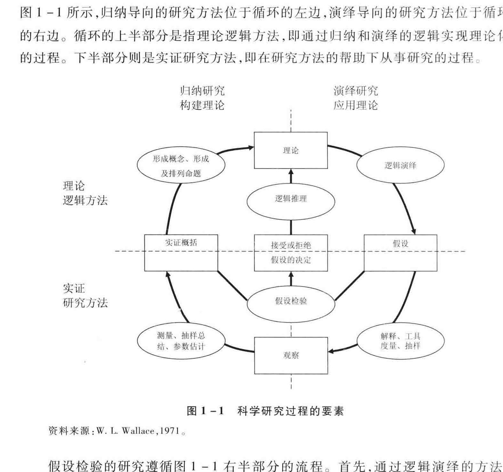
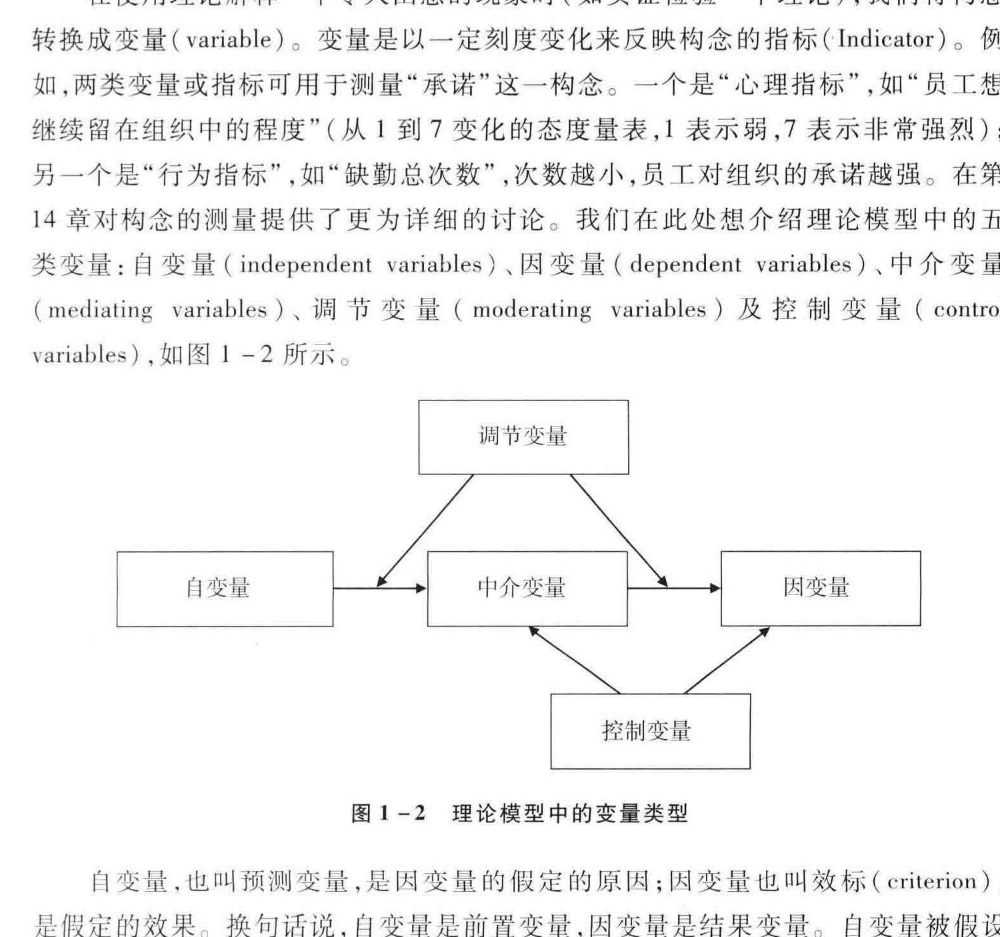
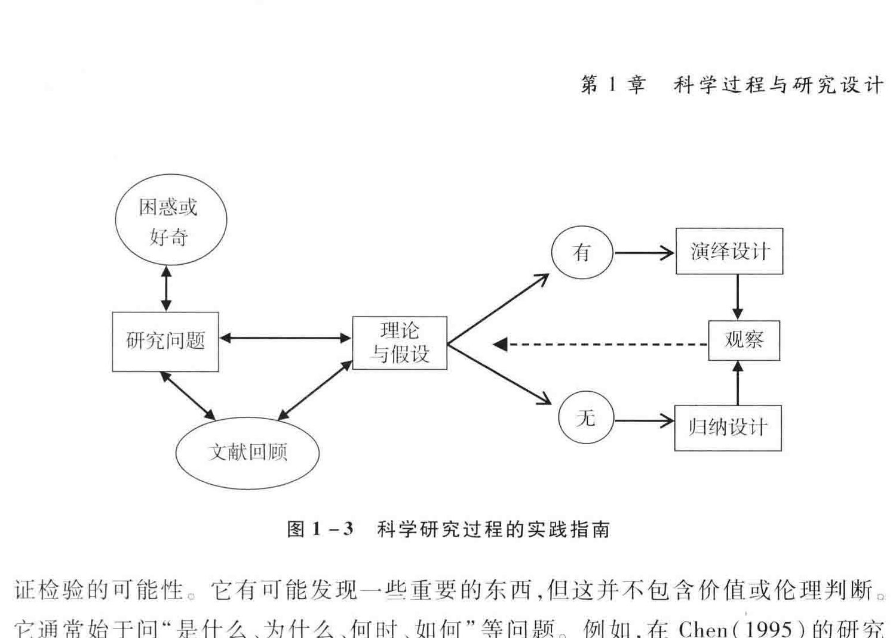
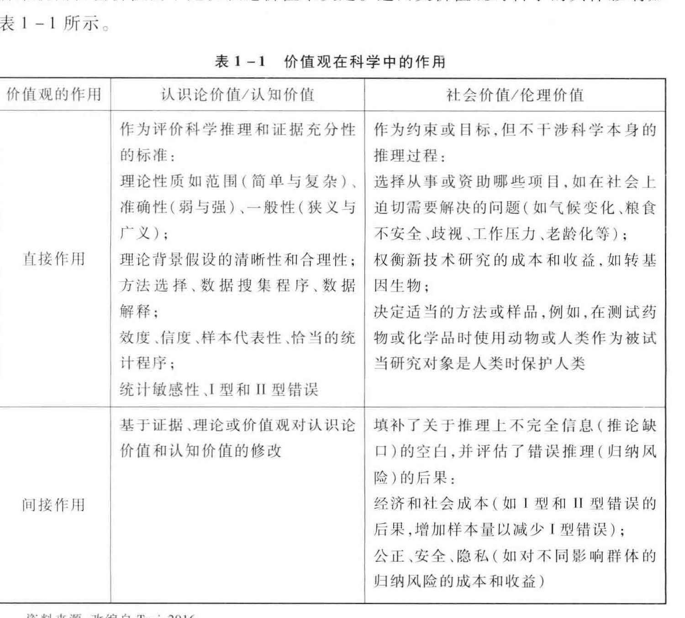

<!-- PDF页 36 -->

## 第一部分 科学研究的目的和过程

## 第1章 科学过程与研究设计

ees 美国圣母大学北京大学”复旦大学仲为国”北京大学

: > 本章大纲::1.1 引言与基本概念 i i 1.1.1 研究的第一步: | 1.1.2 科学的目标 i: 1.1.4 看待现实的三种观点 i 1.2 ”科学研究过程 i 1.2.1 科学过程包括两类研究的循环 |: 1.2.2 理论或模型中的变量类型:: 1.2.3 科学研究过程的实践指南 |: 1.2.4 研究设计的两个目标 | | 1.3 ”科学伦理和科学价值观: | 1.3.1 追求科学过程中的伦理行为 |: 1.3.2 科学过程中的两种价值观:: 1.3.3 ”价值观对科学行为的影响: | 1.3.4 ”价值观对研究生涯的影响:: 1.4 结语 J

<!-- PDF页 37 -->

### 1.1 引言与基本概念1.1.1 研究的第一步

对大多数年轻学者而言,着手一项研究如同在黑暗的房间里找到灯的开关一样。“我应该从何处着手?"“我应该研究什么主题?”“我需要什么样的例子?”“做多少文献回顾足够?”“我应该使用什么理论?”我们希望本书就是*灯的开关”。在打开开关以后,你就能看到很多事物。可是,上述问题的解答却不是这么简单。本书致力于为以下问题提供一些答案:“我如何进行一项高质量研究,使我能在梦栾以求的期刊上发表论文,从而使我的研究生涯有个好的开始?我怎样才能贡献对提升管理实践水平有价值的知识?” 本书希望向读者提供一些帮助,以回答上述问题。当然,这其中涉及很多的选择,因为研究并非是单一线性的,你可以选择一条其至多条最适合个人兴趣.技能,个性和热情的途径。

我们学习研究方法往往会有很多不同的原因。可能是为了完成自己的博士论文,发表研究论文,为从事科学事业而做准备,也可能仅仅是出于好奇。无论我们的动机是哪一种,科学方法都是帮助我们解除对世界的困惑,寻找真正答案的一种途径。追求"真相"必须是任何科学努力的首要目标。正如我们将在1.1.3节中讨论的那样,世界上有许多得到知识的途径。科学只是其中的一种方法。来自某些途径的知识被认为是理所当然的.其真实性是不容和置疑的(如上帝佛陀、巫师或部落领袖)。与这些知识来源的一个显著不同是,科学允许甚至必须质疑——当我们使用科学的方法时,我们必须首先对科学同行的研究结论或知识的真实性或“有效性"持怀疑态度。他们知道,任何一项研究得出的结论都可能是有缺陷的(我们将在1.3.1节中详细讨论这一点)。真相是反复测试证据的积累,直到我们再也找不到能推翻那个知识的证据为止。然而,像我们即将讨论的那样,由于科学过程中的观察.分析、解释和其他因素的不完善,最终的真相可能是一种假象。在社会科学领域,由于社会现象天然地具有动态性.复杂性和反应性的特征,寻求真相就更具挑战。我们将在1.1.4节讨论这个问题。尽管如此,科学对人类进步的贡献是不容争辩的。科学已经成功地揭示了人体(如医学),疾病(如生物学.化学、药理学)或宇宙(如天体物理学)的许多谜团。在解释人类思维活动(如心理学),社会团体(如社会学)及人类行为(如心理学、经济学、政治学)方面,科学也做出了不可磨灭的贡献。当我们从事科学研究时,我们有责任去发现真相,并且没有任何干扰可以

<!-- PDF页 38 -->

使我们脱离这个目标。但是,由于与此无关的价值总会干涉科学,这个理想状态很难实现。我们将在 1.3节讨论价值观在科学研究中的作用。

本书将介绍的是研究管理和组织的规范科学范式(Kaplan,1964; Popper, 1968; Wallace,1971),一种主要流行于北美的管理研究的范式。在世界不同地方,研究的实践,规范和传统都会有一些差异。不过,本书目的不是比较这些不同的传统和范式间的差异,而是介绍北美的这种研究方法。这套方法是组织和管理研究的主流范式,大多数顶级期刊(包括北美的期刊及一些欧洲和亚洲的期刊)也遵循这样的范式。该范式对于研究华人的管理和组织不一定是最合适的,但是,它能够让我们理解管理知识的现状及其发展过程,让我们参与当前的学术对话 (intellectual conversations),使我们能与北美学者们(或者一些使用或理解北美传统的欧洲和亚洲学者)相互合作,进而能在主流期刊上发表论文;最重要的是,让我们能够对全球管理和组织知识做出贡献的同时,更好地理解我们有责任和义务贡献出对管理中国背景下的组织有用的知识。关于最后这一点,我们将在第12章做更为深入的1.1.2 科学的目标

科学的目标是追求真理,解释并且预测自然或社会现象。从科学方法中得到的真理既包含逻辑,也包含证据,人逻辑与证据两者是相辅相成的,缺一不可。没有数据的迎辑或没有他辑的数据,都不能算是完整的科学方法。男外,科学是创造知识,而非应用知识。科学不能解决关于某一研究领域是好是坏(如干细胞研究),或某一研究方法(如定性方法或定量方法)是优是劣的争执。科学研究独立于政策制定或应用方面的考虑。科学的目标是对现象(如全球变暖,传染病等)寻求理解.解释并且能够做出预测;这样,通过政策决策,知识就能被用于控制或改变这些现象

虽然追求科学与价值立场和政治考虑无关,但科学的终级日标是使现在和将来的社会变得更好。正如爱因斯坦所言,“关心人本身必须始终成为一切技术努力的目标,要关心如何组织人的劳动和商品分配,从而保证我们科学思维对于人类是福社而非诅听"(Clark,1984:527)。因此,科学哲学家认为,科学的目标必须同时包括认识论目标和社会目标。认识论目标确保我们创造的知识是可靠的,而社会目标确保科学知识的运用不会伤害人类,最好有益于人类。我们将会在本章的1.3节讨论这个问题

<!-- PDF页 39 -->

### 1.1.3 求知的四种方法

科学的基本目标是在混沌的世界里探索规律,找到社会和自然世界中的真理然而,科学并非知道真理的唯一方法

在人类历史起源时,大多数人通过神话,或者通过从祖先传下来的智慧了解真理。祖先告诉我们有一个太阳神.月亮神或者海神,如果有人在一年的某个时候融望月亮,他们将会变成石头。有些人认为如果他们跟随神的教诲(不管是哪个神),他们将能够进入天堂,或者下一辈子过得更好。信和神的人相信这些说法束是真理,因为这些说法是从神而来的。不信和神的人则认为这些人的行为是一种迷信从历史起源直至今天,对很多人来说,宗教都是最有影响力的真理来源之一。实际上,甚至一些最知名的科学家,都认为神是自然界或社会中不能使用科学方法解释的许多现象之一,如爱因斯坦承认神存在的可能(Clark,1984)

求知的第二种方法是权威。当感冒或生病时,我们往往更相信医生的建议,而非家政人员或的士司机的建议。关于飓风如何形成,以及地震何时会发生的知识,我们更加相信百科全书的说法,而不是小说或漫画。然而,对专家的知识必须保持谨慎,不应无条件接受。我们知道医生在诊断时也会犯错(Welch et al.,2007);并且,随着新证据的出现,知识会与时俱进。有意思的是,大多数权威专家的知识是通过科学研究得来的。然而,即使由科学而来的知识,也只是暂时(tentative)的真理,有待更多的研究来做进一步的证实或辩驳。因此,对于大多数人而言,求知的第二种方法是请教某一领域的专家或求教于书本。

对于没有确定答案的问题,如果有人提供很好的论证,我们更可能相信这样的解释或观点。人逻辑是知晓真理(或至少是暂时真理)的第三种途径。人逻辑就是推理,它能够给出一个合理且可能是真实的社会构念(social construction)。诉讼律师最擅长使用逻辑,并娴熟地引用资料作为补充,来使法官或陪审团信服为什么原告是有罪的,而被告是无罪的。人逻辑是理论的核心,是理论物理学的基础,也是数学的基础。物理学通过逻辑能提供合理的或令人信服的论据来推断某一特定的粒F,在特定的条件下,有什么特定的运动方式。理论是在给定的条件下,对一个现象或多个现象中的事物的一个推测。所以,逻辑或理论是求知的男一种方法,但是这也只是暂时的真理。如果有人建立新的理论来提供更加令人信服的解释,那么之前的理论所支持的暂时真理就会被推翻。不过,除非逻辑与经验世界一致,仅仅只有逻辑是不足以建立真理的。科学研究的目的,就是使用实证数据来证明逻辑的正确性。

<!-- PDF页 40 -->

因此,科学是求知的第四种方法。“认识论"是指求知的科学,而方法论"是指如何找出真理的科学。因此,本书中我们所描述的认识论是一种科学研究的过程,本书所讨论的方法论是科学研究中所涉及的方法论。求知的科学途径既包括人逻辑的推理,也包括数据或实证观察,这被称为实证科学(Popper,1968)。科学过程所创造的知识较为可信,这是因为它既有人风辑(理论),也有数据(实证观察)的支持。然而,科学所创建的知识也只是暂时真理,因为新的逻辑(理论)可能会出现,新的数据可能会推翻最初的迎辑。这就是通过持续科学研究,引入新理论和新观察,从而更新知识的过程。1.1.4 看待现实的三种观点如果科学的目标是从现实里探索真理,我们首先必须考虑什么是现实(reality)。真理依赖于科学家对现实所持的看法。如果科学家相信现实是客观存在的,这表示只有一个真理。如果科学家相信同一个现象可以有多个现实,那就有多个真理了。在像管理学这样的社会科学领域中,这一点特别重要,因为人类主观认知(如经验,体会.阐释等)对社会现实有重要影响。相信只有一个现实,且该现实独立于主观的经验或阐释,这是前现代观点(premodern view)。这个观点会认为,玫瑰的美丽是客观存在的,任何反对者的观点都是脱离现实的。如果组织采取全面质量管理,持前现代观点的人就会假设全面质量管理对于组织中的每一个人都是同一个现实。然而,大多数人都同意人类主观认知具有和多样性,同一个客观现象可能有多个现实,有多种阐释。玫瑰可能会被认为是美丽的,多刺的或者丑陋的,这依赖于感知者的感受或经验。如果人们普遍认为玫瑰是美丽的,但是我们也仍然接受一个可能的现实,即玫瑰并不漂亮,这就代表我们持有现代观点(modern view)。现代观点认为既存在客观现实,也存在对此的主观经验的多样性。因此,现代观点接受全面质量管理的客观存在,但是也接受基于组织中成员或部门的不同经验而与客观事实不一致的其他现实。如果科学家相信现实是完全与经验有关(如现象学),那么他们就持有后现代观点(postmodern view)。对后现代主义者来说,美丽存在于观赏者的眼中,根本不存在美丽的花杂这回事——美丽这只是一个无意义的概念,有意义的只是对花的主观想法或诠释。根据这个观点,全面质量管理完全是一个主观的经验。除了组织成员的经验,根本就没有客观的全面质量管理这回事。 组织文化的现象学研究方法 (phenomenological approach) (Smircich, 1983),与看待现实的后现代观点是一致的。总之,看待现实的前现代观点仅仅接受一个现实,个人的经验无关紧要,也不

<!-- PDF页 41 -->

能改变现实;而现代观点认为,有一个客观的现实,但是人们对它有不同的主观认知,因此客观现实和主观认知能够并存;而后现代观点则认为没有客观事实,只有对现实的印象或主观经验,这些现象和经验都被认为是现实或者真理。我们在本书中所讨论的科学方法,是基于现代观点。我们选择要解决的难题和方法,都取决于我们究竟是对客观现实还是对主观现实感兴趣,也依赖于我们对试图理解和和解

我们采用现代观点来看待现实,也是因为社会现象本身具有动态性、复杂性、反应性等特征。自然科学的研究对象,比如物质、天体等,很少因为科学家研究而发生改变,甚至鲜有反应,但是,社会科学家必须面对的挑战是,我们想要认识的对象往往是有意识的.对我们的观察和研究是有反应的。被观察或被研究的对象很可能已经知晓那些用来解释他们行为的理论,他们可能按其理解反过来又去构建如理论所预测的社会现实,这就是回路效应(1looping effect)。从这个意义上来说,社会科学不仅改变了其研究对象,而且很可能创造了它想要研究的对象(即社会现实)。尽管如此,社会科学的研究对象并不是不可知的。只要社会科学的研究符合主体间性(intersubjectivity),也就是研究人员之间存在共识或产生的知识具有普遍性的根据,对于一个事物的认识有达成一致的途径,社会科学的研究同样可以达到如自然科学研究所具有的客观性标准(Risjord,2014)。这也是为什么我们不能完全采纳后现代的观点来看待现实。如果每一个研究者都认为自己所观察的现实是正确的,有意义的,而可以帮助我们达成知识共识的概念完全不存在,我们也就不可能寻找到一个具有普遍性的真理。总之,社会科学确实面临着与自然科学杀异的研究对象特性,同时又存在着满足科学客观性要求的可能,因此社会现象可以既是真实的,又是历史偶然式的人类创造。继而采取现代观点来看待社会科学的现实也就是我们的应有之选了1.1.5 规范的科学范式

理论的诠释、重要事实的确定,以及事实与理论的匹配,组成了科学的基本范式,我们称之为规范科学(normative science;Kuhn,1962)。诠释理论、寻找事实将事实与理论匹配是规范科学的三个主要活动。规范科学是一种实证科学,数据、证据或观察都是支持理论的必要组成部分(Popper,1968)。规范科学的出发点可以是观察,也可以是理论。基于共同范式的研究遵守同样的科学实践准则和标准因此,在基本准则与标准上必须达成一致,并且遵守它们,这是规范科学的必要条件和长期坚持的要求。简而言之,范式涉及对真理或现实的不同假设,而规范科学

<!-- PDF页 42 -->

范式是基于看待现实的现代观点。科学的目的是为自然界或社会中的难题寻求答案。规范科学范式决定了分析难题时,对课题,理论.工具和方法的选择。当现有的方法和理论不能对现象提供满意的解释或理解时,新的理论或方法将出现,它们可能成为新范式的开始。Kuhn (1962)将一种范式代替另一种范式,称为科学的演进。当人们对某一问题有了完全不同的理解方式时,包括不同的逻辑.不同的角度,或者不同的工具或测量手段, Kuhn 认为这就是一种“科学革命"。一个很好的例子就是人们解释人类决策行为的视角从完全理性转变为有限理性。为什么我们要在这里介绍这些看起来很抽象的概念呢?”原因很简单,我们需要谨慎地对待规范科学的局限。遵循某个特定范式的科学家,倾向于使用现有的理论和方法来得到学术界的接纳。作为特定范式的忠实保卫者——评审人和编辑,可能会怀疑甚至不能容丸新的理论、人边辑或方法。因此,范式是一把双刃剑。一方面,它提供了标准和准则,使我们的科学调查和积累知识成为可能;另一方面,它也可能限制我们,使我们不能发现新理论.发展新方法,或提出不熟悉的问题。为了在国际期刊上发表论文,年轻的学者已经发现遵循主流的研究范式是必要的,甚至是一种理想的方式。然而,戴上规范科学的有色有眼镜,我们可能无法认识到具有华人特色的现象,并且不可能探索具有华人特色的知识。有关这一点会在第12章“管理与组织的情境化研究"中再详细讨论。科学研究过程是对自然或社会现象做系统性的、受到控制的、实证的和批判的调查,它可以始于理论,也可以终于理论。科学研究是系统性的,因为它在决定样本的代表性与测量的效度时,会使用已确立的准则和标准,并且使用理论来指导研究设计,解释研究发现。科学研究是受到控制的,因为研究者在研究设计过程中,不仅要发现研究情境下有意义的因素,还要排除或控制对得出有效结论有干扰的因素;科学研究是实证的,因为它利用实证观察来检验理论解释的正确性;科学研究是批判的,因为研究者必须对用于解释的理论的效度数据的质量.结果和解释的可信度保持怀疑态度。1.2.1 科学过程包括两类研究的循环科学研究过程是一个涉及许多活动的不断循环的过程,该过程既可始于理论,也可终于理论。科学研究过程假设研究者已经选择了一个有意义的研究问题,并且已

<!-- PDF页 43 -->

经做了相关的文献回顾。一旦认为问题很重要.值得研究,而已有的文献对该问题不能提供有意义的答案时,研究过程就可以从理论或者观察开始。从理论开始的研究被认为是演绎导向的假设检验研究(deductive hypotheses testing study),而从观察开始的研究则被认为是归纳导向的建立理论研究(inductive theory building study)。如图1-1 所示,归纳导向的研究方法位于循环的左边,演绎导向的研究方法位于循环的右边。循环的上半部分是指理论逻辑方法,即通过归纳和演绎的逻辑实现理论化的过程。下半部分则是实证研究方法,即在研究方法的帮助下从事研究的过程归纳研究演绎研究构建理论应用理论形成概念、形成<>理论逻辑方法 Cam)假设的决定实证研究方法 Cs <> <r»图1-1 科学研究过程的要素资料来源:W. L. Wallace 1971,假设检验的研究遵循图1 -1 右半部分的流程。首先,通过逻辑演绎的方法,理论被转化成假设。假设是对研究问题的暂时回答,它们包括可测量的构念,但不包括测量指标本身。例如,Westphal(1999)对首席执行官(CEO)和董事会的社会关系对公司绩效的影响感兴趣。我们通常并没有明确地把这个研究问题的初始假设写出来:CEO 和董事会的社会关系与公司绩效没有关系。与这个研究问题相关的理论有两个:一是代理理论(agency theory),二是社会资本理论(social capital theory)。基于代理理论,Westphal 提出了假设 H1:社会关系降低了董事会的监督职能——对应的初始假设是社会关系与监督职能没有关系;基于社会资本理论,他

<!-- PDF页 44 -->

又提出假设 H2:社会关系增强了董事会的建议职能——对应的初始假设是社会关系与建议职能没有关系。他还提出了其他假设 H3、H4:两个职能都与公司绩效正相关——对应的初始假设是两个职能与公司绩效没有关系。

接下来,研究假设会指导研究设计,这部分工作主要包括确定所需数据或观察资料的类型.搜集资料的工具,记录数据的量表及合适的样本来源。这样做以后,假设被转化成观察。我们还是使用 Westphal(1999) 的研究为例。他的研究要求他去搜集关于董事会的监督职能和建议职能的数据.CEO 和董事会的关系及公司绩效的资料。虽然战略管理领域的很多研究使用如 Compustat 之类的二手数据库,而且 Westphal 也的确使用了这样的二手数据来测量 CEO 与董事会的关系和公司绩效,但是他同时也使用了问卷调查作为资料搜集方法之一,因为董事会职能在现有的数据库中无法得到。因为他的研究问题与所有有董事会的上市公司都有关,因此他从美国工业和服务业公司的福布斯(Forbes) 1 000 名录中随机选择样本。

接下来,通过测量、样本归纳.编码、参数估计,观察被转换成实证概括。在Westphal (1999) 的研究中,基于搜集到的数据,他提供了描述性的数据归纳,如平均值.标准差和相关系数。然后,他对这些数据进行回归分析,并且为他所假设的每一组关系进行参数估计。通过估计这些参数的方向和大小,他能将观察转化成

最后,检验假设的一致性,决定接受还是拒绝虚无假设(null hypothesis)。这就是通过迪辑推断而对理论进行检验,修改或拒绝的过程。Westphal(1999)使用从前述步骤中得到的估计参数来检验假设。他发现参数是具有统计显著性的,而且参数的方向与假设是一致的。因此,他拒绝一系列初始假设而选择备选假设 HI、H2.H3,H4,也就是基于代理理论和社会资本理论的假设都得到了“证实”。

此处尤其需要提醒的是,根据 Popper 的观点,科学的过程就是一个不断猜测与反驳的过程,我们利用个别经验事实不断证伪普遍命题,继而提出新的猜想,从而推进科学知识的发展。在这个视角下,我们不能说备选假设(比如 Hl)被“证实"或"支持"了。比如,虽然我们发现了社会关系会降低董事会的监督职能,但依靠的是P 值和统计显著性水平 a,而显著性检验只提供统计量检验的概率信息,不能证明备选假设 Hl 是正还是误。更为重要的是,我们依靠统计显著性水平 a 是在拒绝虚无假设 HO:社会关系与董事会的监督职能没有关系。所以,更准确的表达应该是,目前的证据(如 Westphal 的研究)拒绝了虚无假设 HO0。如果此时虚无假设在总体上是真,我们就犯了第一类错误(type Terror), HAZ,如果我们没有发现社会关系和董事会监督职能之间的关系,那么也仅表示我们所用的样本(也就是

<!-- PDF页 45 -->

目前的证据)“不拒绝”虚无假设,而不是接受虚无假设。此时,如果虚无假设在总体上是假,我们就犯了第二类错误(type Il error)。除非样本量特别大,我们犯第二类错误的概率通常比犯第一类错误的概率高得多。为了确保我们的研究发现是有效的,我们可以通过重复性研究(replication studies) 消除抽样误差或随机性带来的

上述从理论开始,通过搜集观察资料来证实或拒绝假设的过程被称为演绎法。演绎研究的成果是证实或拒绝一组构念之间的假设关系。这些结果可被用于改进理论;当调查不能完全回答研究问题时,也可为进一步的研究提出建议

研究也可以由观察开始,以理论结束。这类研究适用于当研究者不能找到或提出一种理论来解释疑难或研究问题的时候。这时,研究者是在进行归纳型的建立理论研究。它的成果是形成理论和命题,对困惑或问题提供可能的解释或回答这个过程遵循图1 -1 的左半部分的流程。由于在现有的理论中找不到解释,建立理论的研究就从观察开始。例如,在 Corley 和 Gioia(2004)开始探索组织身份转变(organizational identity change) 的时候,学术界就这个主题只有一些理论概念上的认识。因此,他们分析了一个组织分拆过程的案例来研究这个问题。

接下来就是通过测量、样本归纳、参数估计来搜集观察资料,并加以分析,将其检验研究里面,数据分析通常使用量化统计方法,并且以实证概括来检验假设,结果是接受或者拒绝假设。而在理论建立研究当中,数据分析常常使用质化分析技术,例如内容分析。在 Corley 和 Gioia(2004)的研究当中,他们对访谈数据和公司文件进行了内容分析,进而产生一阶编码和二阶编码,而这些编码就是实证概括

最后,实证概括通过形成构念命题和命题组合而转换成理论。从产生的编码中,Corley 和 Gioia(2004)形成了抽象的构念,并且建立了解释组织身份转变过程的模型。基于该模型,他们提出了用于未来实证检验的命题

这个过程就是归纳法。归纳研究的结果,就是产生用于解释疑难的新的理论洞见,并形成新的暂时理论。研究者对最初提出的研究问题提出新的构念和新的命题来解答,而新的理论能在未来用于解决相似的或相关的问题。

演绎法和归纳法在第3章“管理研究中的理论建构"中将有更详细的解释。检验假设的数据搜集方法包括实验,准实验问卷调查及二手数据等。归纳法往往涉及定性数据,而数据搜集方法则包括访谈,参与性观察.非参与观察,分析档案文件等。案例研究是这些定性数据搜集方法的一个组合。第5章到第13章对这些方法有更详细的介绍。

<!-- PDF页 46 -->

1.2.2 理论或模型中的变量类型需要厘清的是,理论是使用科学方法建立知识的重要因素。理论解释了一个现象“是什么(what)”“怎么形成(how)"“为什么(why)”"“何时(when)"及“对谁(whom)" 等问题。管理和组织主流理论中的例子包括代理理论(Jensen & Meckling,1976;Fama and Jensen, 1983),制度理论(DiMaggio & Powell, 1983),资源依赖理论(Salancik & Pfeffer, 1978)、社会网络理论(Coleman, 1990; Burt, 1992; Granovetter,1973) 及社会交换理论(Blau,1964) 等。每一个理论都有一系列核心的构念(是什么),并且曾明这些构念之间的关系(这些“什么"是如何相关联的)。一般来说,它也包括这些关系在什么条件下(时间,地点及人物),才是最有意义的。在使用理论解释一个令人困惑的现象时(如实证检验一个理论),我们将构念转换成变量(variable)。变量是以一定刻度变化来反映构念的指标(Indicator)。例如,两类变量或指标可用于测量“承诺"这一构念。一个是“心理指标”,如“员工想继续留在组织中的程度"(从1 到7 变化的态度量表,1 表示弱,7 表示非常强烈);男一个是“行为指标”,如“缺勤总次数”,次数越小,员工对组织的承诺越强。在第14章对构念的测量提供了更为详细的讨论。我们在此处想介绍理论模型中的五类变量:自变量(independent variables)、因变量(dependent variables),中介变量(mediating variables)、调节变量 (moderating variables) 及控制变量 (control variables),如图1 -2 所示fr 1-2 理论模型中的变量类型自变量,也叫预测变量,是因变量的假定的原因;因变量也叫效标(criterion),

<!-- PDF页 47 -->

为影响或者使央变量发生改变的变量。控制变量是指对因变量有影响,且其影响必须被排除的变量。在理论上,自变量和控制变量都是因变量的前置变量。自变量是我们关心的变量,而控制变量则是我们不想要但却不能完全排除的前置变量(即不能实现随机化,或不能消除)

理解调节变量和中介变量的差别非常重要,它们对自变量和因变量的关系的影响是不同的,并且检验它们存在的统计方法也不一样。调节变量是影响自变量和因变量关系的方向、强度的变量,它既可以是类别变量,也可以是连续变量(Baron & Kenny,1986)。从统计学上看,调节变量可以通过检验调节变量和自变量的交互项(调节变量 x 自变量)对因变量的影响的显著性来发现。中介变量是介于自变量和因变量之间的变量(Baron & Kenny,1986)。当中介变量满足下列条件时,其即存在:(1)自变量对中介变量的变化有显著影响; (2)中介变量对因变量的变化有显著影响;(3)当自变量对中介变量的影响及中介变量对因变量的影响都受到控制的时候,自变量和因变量的关系显著降低。第16章“调节变量和中介变量"将对如何检测调东效应和中介效应提供更为详细的介绍

一个理论必须详细说明自变量,因变量、中介变量和调节变量的关系。理论机制提供了这些变量间相互关联的理由与逻辑。在理论化的过程中,通常使用方框和箭头来显示和辅助思考这些变量*为什么“如何”“什么时候”及“对什么"相关联(Whetten,2002)。缺乏理论和理论机制的迎辑,方框和第头是没有意义。只有当你有一个好辑,来说明为什么选择这些变量及它们如何发生关联时,才可以检验1.2.3 ”科学研究过程的实践指南

当人们面对图1 -1 中的方框、椭圆和箭头而不知所措的时候,科学研究过程看起来似乎相当神秘。这本书的目的就是让这个过程不再神秘,给你提供适当的工具来装备自己,使你在研究的从林中不至于迷失方向。在此,我们给你一个简洁而实用的科学研究过程的实践指南。图1! -3 总结了该指南。

科学研究过程有四个步又:第一步是提出一个研究问题;第二步是进行文献回顾;第三步是找到理论,提出假设;第四步是设计并执行实证研究。根据研究是归纳性或演绎性的,上述四个步骤不总是按照单一的方向进行。下面我们将做更详细的介绍。

第一步:提出研究问题。研究问题是对某一现象感到困惑或好奇。它陈述了两个或多个变量之间的潜在关系。它没有一个很明显的答案,但却提供了进行实

<!-- PDF页 48 -->

CS) CO — [we] <= o图1-3 科学研究过程的实践指南证检验的可能性。它有可能发现一些重要的东西,但这并不包含价值或伦理判断它通常始于问"是什么.为什么、何时、如何”等问题。例如,在 Chen (1995)的研究中,其研究问题是:“在对组织奖励分配的偏好上,中国员工如何不同于美国员工"第2章“研究的起点:提出研究问题"将对如何提出有趣并重要的研究问题进行详细的说明

第二步:进行文献回顾。一旦有了感兴趣且重要的研究问题,你需要进行广泛的文献回顾。全面的文献回顾帮助你评价研究问题是否已经得到回答。它也可以帮你找到一些相关理论来解决困惑。文献回顾还能指出更加准确的构念,从而帮你改进研究问题,甚至通过发现文献的不足或察觉未经检验的命题,使你彻底改变研究问题,使之变得更为有趣和重要。本质上,在第一步和第二步之间是有回馈循环的。例如,Westphal(1999)想研究董事会的组成结构对公司绩效的影响。他发现在预测董事会对 CEO 的社会关系的影响时,作为组织治理中的主流理论——代理理论与社会网络理论是相互冲突的。通过发现文献中的这些差距, Westphal 能够将自己的研究定位在检测相互冲突的命题上,从而找到一些与直觉不同的结果,第三步:找到理论并且形成假设。理论解释了现象的"为什么"和"如何"的问题(Kaplan,1964;Whetten,2002)。假设是对研究问题的暂时回答。理论包含有具有清晰定义的构念,并使用清楚的侯辑,解释这些构念为什么以及如何相关。现有的理论对于回答研究问题,产生有意义的假设至关重要。假设是对构念之间的可能关系的陈述。假设涉及可测量的构念(如承诺),但并非测量工具本身(如缺勤率)。这些假设指引你的研究设计和数据搜集工作。例如,在员工与组织关系的研FEMA Tsui 等(1997)应用了社会交换理论来解释相互投资的员工与组织关系为

什么及如何产生最高的员工绩效和组织承诺,并形成假设。

<!-- PDF页 49 -->

第四步:进行实证研究。这个步骤包括研究设计数据搜集和数据分析。研究设计根据你是进行归纳还是演绎研究而有所不同。当现有理论能够帮助你形成假设的时候,则可选择演绎研究,与此相对应的研究设计可以是实验、二手数据或问卷调查等。当现有理论无法对研究问题提供满意的回答时,则可选择归纳研究,如案例研究或其他的定性研究方法(如访谈或民族志研究法等)。例如,根据承诺升级理论,Staw(1976)使用实验来检验人们对一组选定行动的态度和行为反应的假设。由于没有现成的理论来完全解释自我管理团队中的协和控制(concertive control), Barker(1993)使用了案例研究对这个现象建立了理论。因此,在归纳研究中,实证研究先于理论和假设,于是第三步和第四步会颠倒过来。

综上所述,在科学过程中有四个步骤:提出研究问题,进行文献回顾、找到理论并形成假设、进行实证研究。上述四个步骤不一定遵循单一的方向:对于一些步怠,相互之间存在回馈循环;对于其他步骤,步骤之间的顺序可能颠倒。从第一步到第三步,也就是从研究问题到文献回顾再到理论和假设,但由于文献回顾,研究问题可能会被修改或精练,这又会影响文献回顾的领域和关注的理论,因此,在这些步又之间会有一些来来回回的循环。从第三步到第四步,即从理论假设到研究设计,这两个步骤也可以颠倒。当没有现有理论可以解决感兴趣的现象时,作者可以从实证研究开始,进行观察,然后再提出命题或新的理论,即归纳法。

### 1.2.4 ”研究设计的两个目标

研究设计是调查的计划和结构,用于得到研究问题的答案(Kerlinger & Lee, 2000)。研究设计必须实现两个目标:首先是控制变异,其次是确保效度。

在一项研究当中,研究者要尽力控制三类变异——最大化系统变异(maximize systematic variance),控制外生变异(control extraneous variance) 及最小化误差变异(minimize error variance),

系统变异是指因变量的差异,它受到研究假设中的自变量的影响。通过最大化系统变异,我们可以将自变量对因变量的效应,从因变量的总变异中分离出来,用以支持在假设中构念间的关系。最大化系统变异可以通过选择自变量和因变量变异都较大的样本或者精准测量变量来实现,每一种方法都致力于让自变量对因变量有最大的效应。例如,在研究薪水与工作满意度的关系时,如果研究者选择的样本当中,大多数人都对工作满意,或者情况更糟糕,他们的薪水都相似,那么研究者要获得预期证据的可能性将非常小。

外生变异是指外生的或是理论框架之外的其他因素的变异。我们必须将外生

<!-- PDF页 50 -->

变异最小化.予以排除或隔离,才能消除对我们感兴趣的变量关系的其他解释。控制外生变异可以通过随机化、配对参与者或将这些变量作为控制变量来达到。例如,如果要调查创新对公司利润的影响,研究就必须控制公司规模和行业。虽然这两个因素都不是研究的关注点,但它们却影响了公司的利润。控制了这些变量,我们就可以更有信心地下结论,即公司利润的变动是创新的结果而不是规模(大公司的利润可能更高)或行业(一些行业可能比其他行业利润更高)的影响。误差变异是指由于随机波动而导致的指标变异。我们使误差最小化,就能让系统变异凸显出来。最典型的随机变异是测量误差,或研究者控制不了的未知因素。最小化误差变异可以通过控制数据搜集过程的条件及增强指标的信度而实现。例如,如果我们打算测量公司的市场价值,而只是选择公司在某一天的股票价格来表示,则可以预计这样的测量是不太可信的,因为选择不同的时间来测量同样一家公司,将会得到完全不同的结果。总之,研究者在设计演绎研究或归纳研究的时候,必须对以上的差异控制目标了然于胸。研究设计的第二个目标是保证实证研究的效度。简单地说,效度指研究结果的可信程度。在多大程度上我们可以相信实证调查的结果呢?研究设计应该确保四种效度,包括构念效度、内部效度统计结论效度和外部效度(Cook & Campbell, 1979)构念效度是指测量的准确性, 包括构念指标的信度。测量指标所包含的意思与构念的定义相一致四?第13章“理论构念的测量"将详细讨论构念效度。内部效度指结果是否真的由于所假设的原因所导致的。结果会不会是由于其他因素而不是在假设中指定的原因引起的? 研究设计如何改善内部效度将在第5章“实验研究方法”、第6章“准实验研究"第7章“实证研究中的问卷调查法”第8章二手数据在管理研究中的使用" 和第9章”实地研究中的案例研究”中更详细地讨论统计结论效度是以统计检验对假设的关系进行解释的可信度。样本太小、P值太大,或者违背了统计检验的假设等,都会降低结论的可信度。影响误差的因素,如不可靠的指标、在数据搜集过程中的波动条件等,也将对统计结论效度有不良的影响外部效度指假设的因果关系能否应用到对因果变量的其他测量方法,推广到不同类型的人环境和时间当中(Cook & Campbell,1979)。当在样本中找到显著的因果关系的时候,研究者就要问自己这些结论是否只适用于这些人.这样的环境和时间。增强外部效度最有效的方法是使用随机抽样。当由于实施困难使随机样本

<!-- PDF页 51 -->

不可行的时候,你需要明确地讨论你的样本对总体的代表性。例如,如果使用2003年北京市的高科技企业作为样本来研究“研发强度”,你就需要讨论你的结论是否可以推广到除高科技行业之外的其他行业?是否可以推广到除北京以外的其他城市? 是否可以推广到2003年之外的其他时间段?

外部效度告诫我们,我们需要清楚研究结论所处的情境界限。但如果我们能够将情境因素,如和信.环境、时间等因素与理论思考相结合,也许可以产生更有趣、更重要的研究。这些情境因素要么是自变量的前园变量,要么是可能改变自变量和因变量关系的调节变量。例如,Farh 等(1997)人研究华人社会情境下的组织公民行为和组织公平的关系。他们得出了在华人社会组织公民行为的维度不同于在西方情境下的研究结论。因此,在国家层面上,情境成为组织公民行为的前竹变量他们也发现,对于传统价值观较低的人来说,组织公民行为与分配公平和程序公平的相关性最强。因此,传统价值观成为组织公民行为和组织公平的关系的调节变量。把情境因素考虑进去,在研究中国管理问题时尤其重要。我们将在第12章“管理与组织的情境化研究"中进一步讨论1.3 科学伦理和科学价值观

本书的重点是介绍从事科学研究的方法,我们希望本书能使研究者具备从事高质量管理研究的必要技能。然而,我们在此也会讨论一些非方法论的,伦理或从值观的因素。这些因素不但影响从事高质量研究的能力,更重要的是,影响身为学者对学术生涛的追求和承诺。具体来说,价值观影响了方法的选择、标准的严谨及课题的选择,而最根本的是,它影响了学术生涯的意义和成功的定义1.3.1 追求科学过程中的伦理行为

探索行为与探索自由(autonomy of inquiry)原则相关(Kaplan,1964),这意味着科学家可以自由选择研究任何他们感兴趣或认为很重要的课题。但是,科学家为他们的研究行为和研究结果对科学界负有责任。学界对可接受的方法和严谨的标准制定准则。科学家的工作由同行评审过程来评判。作为科学界成员的同行评审人和编辑,决定了在研究论文中报告的知识是否接近真知,用来产生知识的方法是否达到了这个学界所制定的严旭标准(这些标准有些是明显的,而男一些则不那么明显)。科学探索的准则来自学界内部,而非外部(Kaplan,1964)

以寻求真理为名是不是就可以为所欲为.不择手段呢?例如,没有征得他人的

<!-- PDF页 52 -->

同意或未在他人知情的情况下,研究者是耕可以观测他人的私人行为,侵犯别人隐私呢(如 Humphrey,1970)? 或者,人研究者是耕可以使参加实验的被试者相信他们是对他人施加痛苦的同谋者,从而造成被试的心理压力(如 Milgram,1963)呢?这些行为符合伦理规范吗”学界一致认为,不可以为了研究目的(知识、真理) 而不择手段(寻找知识的途径)。研究机构和大学及不同科学领域的专业协会(医学.工程公共管理.工商管理等)已经建立了研究行为准则,这些准则为研究者的伦理行为提供了指南。在美国和欧洲,大学和资助机构设有评审委员会,在研究资金拨付或项目批准以前,要求研究者遵守伦理准则(我们相信也会有越来越多的中国大学采取类似的做法).管理领域的研究者有义务保障他们研究对象的权益,无论他们是学生,员工还是组织。本书的附录 1 是 IACMR 的伦理准则。它明确地说明了在评审和编辑过程中,对待研究对象和数据的准则要求,也包括研究思想交流和参加会议相关的专业行为标准。该准则包括在研究和专业活动中的伦理行为,对所有的 IACMR 成员都适用。本书读者如果感兴趣,在许多专业学会的网站上也能找到相似的准则,如管理为了让大家更清楚地了解在研究和发表论文过程中可能出现的伦理困境, MOR 曾用一整期(2011年第7 卷第3 期)来讨论这个问题。这些文章都已被翻译成中文,在其网站(http://www. iacmr. org/index. php? c = category&catid = 107)上可以免费下载读者可以通过研读这些文章了解到许多研究者经常遇到的问题,如做了怎样的贡献才配得到论文的署名权是否可以基于数据结果来修改或者提出研究假设、是否可以用同一套数据撰写多篇论文如何及何时引用他人的成果.评审和编辑过程中的伦理等记住一个称之为黄金定律的普遍原则“你们要人怎样待你们,你们也要怎样待别人"(《圣经马太福音)7:12)。我们伟大的教育家和哲学家孔子在《论语》中也说过:“己所不欲,勿施于人。”作为学者,如果我们想被尊敬,我们也应该尊重参与我们研究的人,给我们宝贵意见的人与我们分享他们生活经验的人及允许我们使用其研究成果的人。如果我们想让自己的工作受到别人的认真对待,我们应该以最严谨的态度从事我们的研究。我们绝不容忍在数据处理上的任何缺陷或遗漏、对结果的不准确或歪曲的解释、对其他学者的研究论文的不恰当或没有注明的引用在没有得到认可或同意的情况下使用其他学者的知识产权等行为

<!-- PDF页 53 -->

对他人工作结果的故意误用,都会造成巨大的伤害,即使这些错误最后被发现或纠正,这些伤害也无法弥补。爱因斯坦也谈到了科学中的伦理行为:“ 人类最重要的努力是为我们行为的道德性而奋斗,我们的内部平衡甚至我们的存在都依赖于它只有我们的行为具有道德,才能赋予生活以美和尊严。” 1.3.2 科学过程中的两种价值观

与科学有关的价值大致可以分为两类(Douglas,2009;Tsui,2016)。第一种是认识论价值(epistemic values),包括认知价值(cognitive values)一一用来判断理论和证据充分性的规范或标准。认识论价值主要是用来评判什么是好的(sound)、严谨的科学,“是规范和良好的科学推理标准的一部分"(Risjord,2014)。第二种是与科学认识准确活动无直接关系的价值,也就是除认识论价值之外的所有价值,包括意义广泛的社会价值.伦理价值或道德价值及政治价值观。我们用“社会价值”这个词来代表所有非认识论价值,这些道德价值观是与社会.团体或个人有关的期望状态。比如,财富或健康是一种社会价值,而公平正义是一种道德价值;政治价值观反映了特定群体或个人的偏好,例如,资助机构指定研究的类型或确定它认为可以接受的期刊类型等。好的科学(good science) 往往是这两类价值观的有机Bia

认识论价值是我们评价理论或证据达到科学目标的充分性的标准,也就是研究是否能产生可靠和有效的知识,从而使我们更接近真理。我们所熟知的例子包括构念效度、内部效度、外部效度和预测效度。只要研究没能满足这些效度的国值,我们就认为从研究结果推断出的知识可靠性或准确性较低。认知论价值本质上是完美科学(sound science)的标准。价值中立的理想型(value-free ideal)认为,研究者的个人价值或个人偏好不应纳入认识论价值评佑中。然而,科学工作,无论是理论还是方法选择都涉及价值判断,在科学活动或评价中个人价值观的干涉是不可避免的。比如,由于测量的真实可靠性是不确定的,当我们决定 0. 80 0. 70 或0. 60 是否表示可接受的可靠性水平时,社会价值就已经起作用了。认知价值涉及比认识论价值更不确定的标准,尽管两者之间的界限是模糊的。用于评估理论的-些认知价值比如简单性(或复杂性).范围(狭义或广义)和解释力。我们通常会认为一个简单尤其同时是优美的理论要好于一个复杂的理论。

社会价值不是科学工作的内在价值,但当考虑到可靠的知识的要求时,可能会对研究者产生影响。重要的社会价值观,如正义、自由、社会稳定或人类尊严,往往与道德价值相重释。比如,将人类作为研究对象时,处于保护被试目的而建立起来

<!-- PDF页 54 -->

伦理道德审查委员会,实际上就是社会价值直接影响科学发现过程的有力证据再比如,我们已经知道研究存在着归纳风险(inductive risk),可能犯第一类错误,也可能犯第二类错误。我们究竟选择容忍哪一类错误,实际上也受到社会价值的影响。假设我们现在发现某类产品含有对人类健康有害的物质。第一类错误(假阳性,当产品事实上没有害处时推断有害)会导致政府实施不必要的管制,实现保护公众的好意图;第二类错误(假阴性,在产品事实上有害的情况下推断没有害处)会增加危害公众健康的风险,因为研究结果将错误地建议政府实施宽松的监管政策。对于公众而言,当然希望增加监管,即使第一类错误的概率增加;对于行业内的企业而言,当然希望放松监管,即使第二类错误的概率增加。为了减少这两类错误,我们需要增加样本量,而这无疑增加了研究的成本和挑战性。到底应该以哪一方的诉求为标准,选择采纳怎样的归纳风险水平,是公众,行业,还是学者”此时的答案就由社会价值而不是认识论价值来决定。这两类价值观对科学的具体影响如# 1-1 所示表1-1 价值观在科学中的作用作为约束或目标,但不干涉科学本身的的标准: 推理过程:理论性质如范围(简单与复杂)、| 选择从事或资助哪些项目,如在社会上准确性(难与强),一般性(狭义与 | 迫切需要解决的问题(如气候变化.粮食广义); 不安全,歧视.工作压力,老龄化等);直接作用 “| 理论背景假设的清晰性和合理性; | 权衡新技术研究的成本和收益,如转基方法选择,数据搜集程序、数据 | 因生物; | 解释; 决定适当的方法或样品,例如,在测试药效度.信度,样本代表性,恰当的统 | 物或化学品时使用动物或人类作为被试| 计程序; 当研究对象是人类时保护人类统计敏感性.1型和I型错误| 价值和认知价值的修改口)的空白,并评估了错误推理(归纳风| 险)的后果:间接作用经济和社会成本(如1型和了1型错误的| 后果,增加样本量以减少1型错误); | 公正.安全.隐私(如对不同影响群体的| 归纳风险的成本和收益)资料来源:改编自 Tsui,2016

<!-- PDF页 55 -->

### 1.3.3 价值观对科学行为的影响

个人价值观也会影响我们对研究课题的选择。例如,研究公司社会责任的学者,其价值导向可能不同于致力于理解“公司如何才能实现利润最大化"的学者,可能也不认同“所有人是公司唯一合法的利益相关人"的说法。学者享有探索的自由,因此他们可以选择任何他们认为有趣或重要的课题。但是,课题的选择也可能受到其他因素的影响,如课题是否具有可操作性、受欢迎、容易发表,或在实务中

对于应该做“严谨的(rigor) 研究”还是应该做“实用的(useful) 研究”,在学界争论已久,因为他们假定二者是对立的。然而,我们也可以使用最严谨的方法研究最具实践性的课题。近年来,美国管理学会呼吁学者应该和实业界加强交流。越来越多的学者被要求既要研究具有实践价值的问题(Tushman & O'Reilly,2007),也需要积极地将研究结论的实践意义与管理者多做沟通(MeGahan,2007)。AMJ在2007年9月号的整个编辑论坛,都是围绕在管理研究中实践与学术相结合的问题。与此相关的最新的一项倡议活动是"商业与管理中的负责任的研究”,旨在推动创新可信又可用的知识(具体请参考网站 www. rrbm. network,以及本书前言部分)。

与西方社会中的同信一样,华人社会中也有越来越多的年轻学者面临来自大学的晋升和评级职称的压力,从而必须大量发表论文。于是,一部分人不得不选择流行的主题,从事机会主义式的研究,他们也避免从事难以发表的研究,即使那些题目是他们感兴趣的。机会主义式的研究如果能产生好的科学成果也无可厚非然而遗憾的是,机会主义式的研究往往是快捷、粗劣而且投机的,通常没有经过仔细的思考,而只是为了容易发表文章。这经常导致品质低劣的成果。换而言之,这些机会主义式的研究不是由内在兴趣指引的,而是由外部回报指引的。

避免困难的课题,妃求流行的课题,这本身就是一个价值选择。通常,这些选择会产生一些对新知识没有什么贡献的微不足道的研究。我们的建议是,坚持自己的信念。既然有选择的自由,科学工作又要求全心投入,因此只有让兴趣来指引研究选择,工作才有意义。如果我们一定要成为工作的奴隶,那就成为我们所热爱的工作的奴隶吧。

MOR 曾于 2009年用一整期(第5 卷第1期)来讨论中国管理研究的未来,提醒学者们对研究课题选择的盲点。该期的文章指出,中国学者在过去 20年专注于学习国外的理论和方法,争取在国际期刊上发表论文。这些研究成果也许都符合

<!-- PDF页 56 -->

国际期刊的发表要求,但是可能与中国的相关性不大。未来的中国管理研究应当专注于理解和解释在现代中国企业中面临的重要管理问题。从现象中来的知识(而不是从过去文献中来的知识)既有利于提高学术理论,也有利于提高管理实践。1.3.4 ”价值观对研究生涯的影响

在你投身于科学研究事业的汪洋大海之前,我们建议你首先仔细思考一个问题,那就是“你为什么想成为一位社会研究者?”为了金钱? 为了名声? 为了思考的自由?还是为了有机会为人类社会做贡献? 你所拥有的价值观会影响个人职业生浊的意义,以及所能做出的贡献。

学术生涯不会让你发财致富。虽然华人学者的薪水每年都有增长,成为科学家也确实能够提供一个体面的生活,但是这些收入与管理咨询.投资银行或者股票市场的投资经纪人的收入是无法相比的。学者的财富在于拥有思考的自由及满足好奇心的机会。从事学术工作,我们不会每天受到严格的监控。除了教学时间,我们可以随时随地工作,自由地思考,满足自己永无止境的好奇心,这些是学术生涯的重要回报。

学术生涯不会让你出名,至少不会很快地出名。由于成果发表过程的滞后和在顶级期刊上的竞争,学术生涯所面对的失败往往多于成功。因此,我们需要靠自己强烈的内在激励及所喜爱的研究课题来支撑,等待很久以后才会到来的回报。科学上的成功与其他职业生涯的成功相比较,自有其不同的评价标准。1986年诺贝尔化学奖获得者 John C,Polanyi 说过,“在科学界,我们是一群来自全球、互相支持的个体,我们的目标是要把真理放在个人利益之上”。2004年诺贝尔化学奖获得者 Aaron Ceichnover 认为, “评价一个科学家,不应基于其所获得的奖项或荣誉,而是其对提高人类生活品质的贡献"。换句话说,成功跟随那些视贡献为成功的人,而不是来自个人的名声或个人的收入。这意味着科学家的成功应该基于其所创造的知识,而不是由发表论文的数量来决定。

发表论文只是一种手段,用以传播科学研究所发现的知识。我们不应该陷入“只关注出版的数量而不关注科学研究的质量"的陷阱当中,以手段代替了目标。数字游戏已使得研究者们故意将一项研究分散成许多篇小论文,或者从事机会主义研究

据说,发明并改进了电灯泡的爱迪生有两千次失败的实验。当间及他对这些失败的感想时,他说,这些不是失败,只不过是走向成功的两千步而已。从失败中学习,并且不断改进的能力,也应是成功的一个合理定义。

<!-- PDF页 57 -->

科学的价值或终极目标是寻求真理,是为了准确有效地理解并解释我们周围的事物。 其最终目标是在各个领域改善人类的生活,包括企业管理。 通过科学,我们创造知识与技术,帮助人们生活得更加美好。 对于管理学者而言,科学是为了帮助组织提升效率,提高产出,增加利润,也是为了帮助组织成为更友善的雇主,为员工提供有前途和回报的职业。 能够为社会进步做出这样的页献,将是学术生涯中最有意义的回报。

### 1.4 结语

华人管理研究就像一个深埋于地下的巨大钻石矿,一般人很容易就会在挖到足够深之前就放弃了。 然而,只要心中有坚定的信念. 脑中有正确的方向.手中有合适的工具、 身边有相互鼓励的伙伴,就很有可能创造出一个成功的故事。 除此之外,我们还建议大家了解科学哲学的基本内容。 本章分享的很多内容,在我们和其他同事一起开设的 “管理研究哲学 "博士研究生课程上都有较为深入的讨论。 从2015年开始,我们陆续在北京大学、 上海交通大学、 复旦大学开设了相应的课程迄今为止,我们还成功举办了两届 “ 管理研究哲学 "师资培训班,为全国十余所高校培养能够教授这门课程的老师。 本书致力于让研究者掌握合适的工具,我们也衷心希望大家在掌握科学研究工具的同时,明白我们从事的事业理应对社会负责任的使命。 乘持科学精神和对社会负责任的态度,让我们一起通过科学探索,为建

<!-- PDF页 58 -->

### 参考文献

Baron, R. M. & Kenny, D. A. (1986). The moderator-mediator variable distinction in social psychological research; Conceptual, strategic, and statistical considerations. Journal of Personality and Social Psychology, 51 (6), 1173—1182.

Barker, J. R. (1993). Tightening the iron cage-concertive control in self-managing teams. Administrative Science Quarterly 38 (3).408—437.

Blau, P.M. (1964). Exchange and Power in Social Life. New York; John Wiley & Sons.

Burt, R.S. (1992). Structural Holes; The Social Structure of Competition. Cambridge, MA; Harvard University Press.

Chen, C.C. (1995). New trends in reward allocation preferences; A Sino-U. S. comparison. Academy of Management Journal,38,408—428.

Clark, R. W. (1984). Einstein; The Life and Times. New York; Harper Collins Publishers.

Coleman, J. (1990). Foundations of Social Theory. Cam-

bridge: Belknap Pres

Cook, T. D. & Campbell, J. D. (1979). Quasi-Experimentation; Design & Analysis Issues for Field Settings. New York; Houghton Mifflin.

Corley, K.G. & Gioia, D. A. (2004). [denti

y ambiguity and

change in the wake of a corporate spin-off. Administrative Science Quarterly 49,173—208.

DiMaggio, P. & Powell, W. W. (1983). The iron cage revisited; Institutional isomorphism and collective rationality in organizational fields. American Sociological Review, 48,147—160.

Douglas, H. (2009). Science, Policy, and the Value-free Ideal. Pittsburgh, PA; University of Pittsburgh Press.

Fama, E. & Jensen, M. (1983). Separation of ownership

and control. Journal of Law and Economics, 26,

301—325.

Farh, J. L., Earley, P.C.& Lin, S.C. (1997). Impetus for action; A cultural analysis of justice and organizational citizenship behavior in Chinese society. Administrative Science Quarterly,42(3),421—444.

Granovetter, M. (1973). The strength of weak ties. The American Journal of Sociology,78(6),1360—1380.

Jensen, M. & Meckling, W. (1976). Theory of the firm; Managerial behavior, agency costs and ownership structure. Journal of Financial Economies, 3, 305— 360.

Kaplan, A. (1964). The Conduct of Inquiry. New York; Harper and Row.

Kerlinger, F. N. & Lee, H. B. (2000). Foundations of Behavioral Research (4th Ed.). Orlando, FL; Harcourt College Publishing.

Kuhn, T. (1962). The Structure of Scientific Revolutions. Chicago; University of Chicago Press.

Management and Organization Review, Special Issue. (2009). The future of Chinese management research,5 (1).

Management and Organization Review, Special Issue. (2011). Research and publication ethies,7(3).

McGahan, A.M. (2007). Academic research that matters to managers: Zebras, dogs, lemmings, hammers, and turnips. Academy of Management Journal,50 (4),748— 753.

Milgram, S. (1963). Behavioral study of obedience. Journal of Abnormal Social Psychology,67 371—378.

Popper, K. R. (1968). The Logic of Scientific Discovery

(2nd Ed.). New York; Harper.

Salancik, G.R. & Pfeffer, J. (1978). A social information

processing approach to job attitudes and task design.

Administrative Science Quarterly,23,224—253.

<!-- PDF页 59 -->

Smi, L. (1983). Concepts of culture and organizational

analysis. Administrative Science Quarterly, 28 (2), 339—358.

Staw, B.M. (1976). Knee-Deep in big muddy; A study of escalating commitment to a chosen course of action. Organization Behavior and Human Performance, 16, 27—44.

Tsui, A.S., Pearce,J.L., Porter, L. W. & Tripoli, A.M. (1997). Alternative approaches to the employee-organ-

ization relationship; Does investment in employees pay

off? Academy of Management Journal,40(5),1089— 1121.

Tushman, M. & O'Reilly, C. (2007). Research and relevance: Implications of Pasteur’s quadrant for doctoral programs and faculty development. Academy of Management Journal,50(4),769—774.

Wallace, W. (1971). The Logic of Science in Sociology.

40

Chicago; Aldine.

Westphal, J. D. (1999). Collaboration in the boardroom; Behavioral and performance consequences of CEO-board social ties. Academy of Management Journal 42 (1).7— 24.

Welch, H. Gl., Schwartz, L. & Woloshin, S. What's making us sick is an epidemic of diagnoses. The New York Times. http;//www. nytimes. com/2007/01/02/health/ O2essa. html. 01/02/2007.

Whetten, D, A. (2002). Modelling-as-theorizing: A systematic methodology for theory development. In Partington, D. (Ed.), Essential Skills for Management Research. Thousand Oaks, CA; Sage Publications.

Tsui, A.S. (2016). Reflections on the so-called value-free ideal; A call for responsible science in the business schools. Cross Cultural and Strategic Management Jour-

nal,23(1),4—28.

