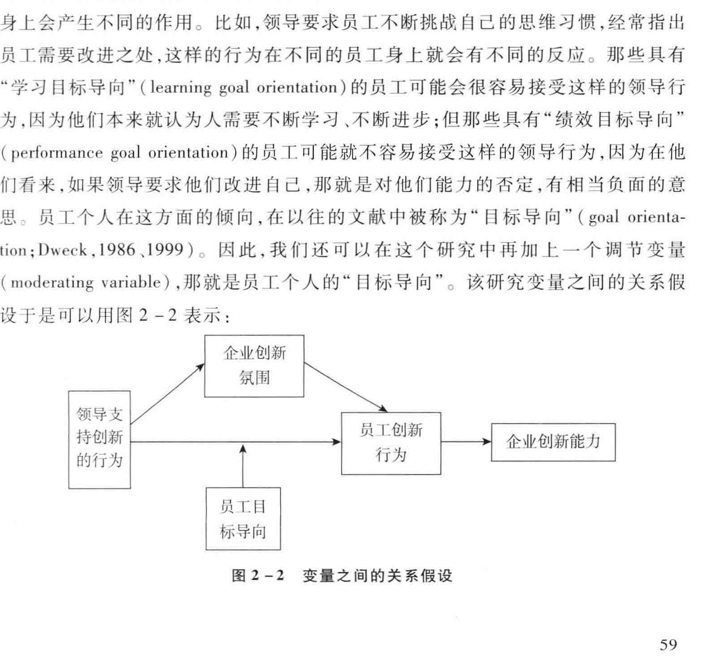
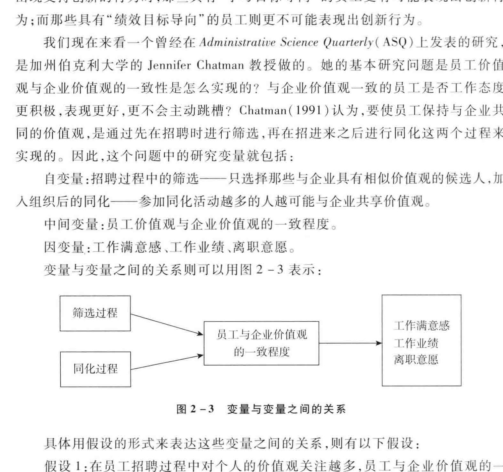

<!-- PDF页 60 -->

## 第2章 研究的起点：提出研究问题

ee BK

b> ABAM |: ”引言:提问对管理研究的重要意义:: ”2.1 什么是好的研究问题?: | 2.1.1 研究问题的重要性和新疾性:: 2.1.2 问题与理论和实践的相关性: ”2.2 如何发现好的研究问题? |: 2.2.1 现象驱动法:打破砂锅问到底: | 2.2.3 灵感驱动法:深度思考,与他人交流 | | 2.2.4 文献驱动法:深度阅读 i: 2.3 问题的转化:如何将一般问题转化为研究课题 | | 2.3.1 化大为小,化抽象为具体 | | 2.3.2 化研究问题为研究变量和假设 i i 2.3.3 ”化研究问题为研究设计 |: 2.4 ”论文开题报告的形成;

<!-- PDF页 61 -->

### 引言:提问对管理研究的重要意义

著名管理大师彼得. 德鲁克曾经说过,管理学研究者的任务不是解答问题,而是提出问题。 而正是他颇具独到视角的提问,让众多管理实践者如杰克, 韦尔奇、BEA + 格风夫等受益匪浅,创造出各种管理企业的良方,并使他们的企业取得卓越成就。 提问的意义由此可见一斑。

问题的提出对于科学研究具有同样的意义, 它不仅能够指导研究的方向,而且能够决定研究的结果。 比如关于个体的决策,如果提出的问题是 “个体应该如何决策以达到利益最大化 ”,那么研究就会朝着建立理性模型的方向前进,并且假设各种各样的理想情境来实现这些理性模型。 经济学中的大部分理论都属于这个种类。 但是假如提出的问题是 “个体究竟是如何做决策的?”,那么研究就会朝着观察个体决策过程的方向努力,比如个体如何搜集信息、 如何整理信息、 如何整合信息.如何做出判断的认知过程和心理过程,以及在这些过程中可能出现的各种心理偏差和理性局限。 在这个问题引导下的研究成果就可能是对人类各种决策现象的总结, 比如早年诺贝尔奖得主司马加 (Herbert Simon), 提出人只有有限理性(bounded rationality),因此遵循的是决策的满意模型,而非完全理性模型。2002年的诺贝尔奖得主卡尔曼 (Kahneman & Tversky,1972,1973.1979.1981.1982),以及2017年诺贝尔奖得主理查德. 塞勒 (Richard Thaler) 等学者 (Thaler, 2015;Thaler & Sunstein,2012) 在这个问题的引导下则发现了不同人在做决策时所使用的直觉 (启

青比如关于企业的运作战略,如果提出的问题是 “哪些战略可以帮助一个企业开发新产品?”, 那么研究的着重点就在于寻找与开发新产品有关的种种方法和手段, 比如建立研发办公室.鼓励员工大胆尝试新的方法和流程.允许员工犯错的空间、 建立跨部门工作团队等。 最终的研究结果可能会回到马奇和司马贺 (March & Simon,1958) 所提出的 “开发 (exploitation) 和探索 (exploration)” 上,因为一切产品开发战略都不过是这两种方法的不同表现。 但如果提出的问题是 “在产品的不同发展阶段企业应该用什么样的战略取得成功?”,那么研究者就会关注在产品不同发展时期企业可能使用的不同战略,然后通过其成功率的比较来得出结论。 这时,研究的结果可能就是波特 (Porter,1980) 的 “产品开发期——差异化 "和 “产品成熟期——低成本 "战略了

提出问题是进行任何科学研究的第一步,只有对事物有好奇心.对各种现象充

<!-- PDF页 62 -->

满疑问并愿意思考的人才会有探索的欲望, 才会有做研究的兴趣。 在这个意义上,做学术研究的原动力其实来自寻找问题的答案和探索事物的真相,而问题的提出则是开始这一漫长旅程的起点。

### 2.1 什么是好的研究问题?

由于提出问题对于研究过程和结果的重要性,所以在开始研究之前,我们必须提出好的研究问题。 那么如何来判断一个研究问题的好坏呢?许多管理学的顶尖杂志 (如 OBHDP、AMJ) 在要求论文评审人判断一篇论文的质量时,常常包括几个与此有关的项目, 如 “研究问题的重要性 "“ 研究问题的新颖性和趣味性 “研究问题与现有理论的相关性 "“ 研究问题与管理实践的相关性 ”,以及 “研究结果对理论和实践的贡献程度 "。 下面我详细地讨论一下这些判断标准的具体含义。

### 2.1.1 研究问题的重要性和新颖性

2010 一 2016年,我担任 Orgenizational Behavior and Human Decision Processes (OBHDP) 的主编。 每周我们收到 15 一 20 篇投稿论文,我在阅读之后大概会直接拒绝 50% 的文章,很大一部分原因就是研究问题的重要性不够或者新颖性缺乏。许多作者通过强调以前没有任何学者研究过这个问题来说明其重要性和新颖性。可是,虽然 "第一个吃螃蟹 " 听起来与新颖 "的意思相近,但仔细分析, 用这个理由来说明研究问题的重要性,其逻辑十分牵强。 原因有二:

首先,其他学者都不曾研究过的问题不见得就一定是重要的问题,有可能恰恰是他们认为不重要, 才不眉去做研究。 比如,天气对员工工作绩效的影响这个问题, 可能在最近的 30年中都没有一个学者对此进行过研究,为什么呢? 就是因为它不重要。 在大多数的工厂、 公司里,一年四季不管刮风下南, 其工作场所的物理环境都不会改变太多,因此天气对大部分员工工作绩效的影响可谓微乎其微,并不值得研究。 但是,如果选择天气中的独特现象,比如雾作会如何影响员工的短期心理,行为和长期绩效,就可能成为一个值得研究的问题。

其次,不曾被研究过的问题也未必就是新颖的问题,有可能它只是一个旧问题的改头换面而已,其实质已经被许多理论点破。 比如,为什么让员工自由选择福利项目 (个人休假.集体度假.幼儿入托费用、 老人看护费用、 额外人寿保险等) 对员[有激励作用这个问题,貌似新颖,但其实只是组织行为学中最早人研究的激励问题的翻版,可以用需要理论 (Maslow,1968),参与决策理论 (Vroom & Yetton,1973),期

<!-- PDF页 63 -->

望效价理论 (Vroom,1964) 等众多激励理论共同解释和说明

那么,什么样的研究问题才是重要且新颖的呢? 我们知道,在市场浣争激烈的今天,对任何一个公司来说,最宝贵的资源就是人才, 由于其不可替代性,人力资源常常构成一个企业的独特竞争优势。 所以优秀人才离开公司去其他组织另谋高就,无疑是一个公司的切肤之痛,这也就为 “员工离职 ”这个研究问题奠定了 “ 重要 "地位,当然,这也是在过去的几十年中,有如此之多的学者对此问题趋之若营的原因 (Hom & Griffeth,1995;Griffeth et al.,2000)。 因此在这个意义上,重要的研究问题常常是被许多学者研究的问题;而正因为已经被那么多人研究,要推陈出新就

我自己曾经和同事一起研究过这个问题, 那也是我第一次用问卷的方法做研究。 因为我对以往的员工离职文献不熟悉,我就想, 在阅读任何文献之前,我们能否通过对企业员工的访谈和自己的思考总结一下优秀员工离职的可能原因。 我们列出了一张单子,上面有儿十个条卓, 包括对目前的工作不满意、 与领导和同事关系不好,薪酬福利条件不理想、 对公司前景不看好等, 心想总有一个是别人不曾研究过的。 带着期待,我们翻看了过去几十年中发表的有关员工离职的文献。 真是不看不知道,一看吓一跳, 原来我们列出来的所有因素都已被前人研究过并发表了论文! 这个发现让我既泪表又高兴。 泪玖是在这个重要话题中找到一个前人不曾涉猫的切入点之困难;高兴的是我们想到的那些因素也是其他学者认为重要的,英雄所见略同,不亦乐平?

于是,我们开始重新思考这个问题,并决定抛开从认知和情感因素上寻找、 预测员工离职的原因,之所以这样做,是因为大部分已经成型的理论都是从这两大类因素入手的。 当时我们正对组织公民行为 (organizational citizenship behavior,OCB)感兴趣,而大部分已经发表的论文都把组织公民行为当作一个因变量来看。 我们深入讨论之后,觉得它应该是预测员工离职的一个行为指标,因为当一个员工不愿意主动帮助同事.不愿意主动关心企业的发展状态.牢骚满腹、 无故迟到早退的时修, 很可能是这个员工去意已决之时。 于是我们决定把组织公民行为作为自变量来看它和员工离职行为之间的关系。 结果证实了我们的假设,我们发现,组织公民行为比工作满意度和组织承诺在预测员工离职行为时的效应都要更强。 这篇论文后来发表在 Journal of Applied Psychology(JAP) 上面 (Chen et al.,1998)

对员工离职问题有孜孜不倦研究,并不断推陈出新的可能要数我在华盛顿大学的同事 Tom Lee 和 Terence Mitchell 了。 他们在过去的 20 多年中已经在此研究领域发表了许多论文,并且提出了员工离职的展开模型 (the unfolding model of em-

<!-- PDF页 64 -->

ployee turnover; Lee et al.,1996;Mitchell & Lee,1999),而且此模型可以解释 90% 以上的员工离职行为。 正在大家都认为已经无可研究的时候, 他们却从另外一个视角开始思考。 两人从自己在华盛顿大学一待就是几十年的经历中得到灵感,开始从反面思考员工离职的现象,进而提出了另一个研究问题:“ 什么因素会影响一个员工 “从一而终 '?” 从这个问题出发,他们提出了一个全新的 “工作陷入 (job embeddedness)" 概念 (Mitchell & Lee,2001;Mitchell et al.,2001),然后进行实证研究展现这个概念对员工留任的重要作用,重新开启了一条研究路线, 并发表了一系列论文

因此,一个研究问题的重要性体现在它对我们加深理解管理中重要现象的意义上,而其新括性则体现在它看待那个重要现象的视角与众不同上。 这与该问题是否被前人研究过没有直接关系。

### 2.1.2 问题与理论和实践的相关性

论相关性指的是这个研究问题在某种程度上可以用现有的某些理论加以阐释, 因此可以与现有的理论挂上钓。 但同时现有理论又不能完全解答该问题,需要研究者通过研究提出更加合适的逻辑和答案。 所以,该研究问题能够帮助我们拓展前人的理论,填补过去理论中的漏洞。 这样的研究问题就具备了理论相关性。

表现研究问题的理论相关性最常用的途径就是回顾以往的文献 (literature review)。 但是如何通过回顾文献来表现问题的理论相关性对许多研究者来说都是一个挑战。 我在阅读论文时经常发现的问题有几个。 第一是回顾的文献过于陈旧, 作者没有掌握该领域最新发表的研究成果, 自以为自己的研究问题能够对现有理论做出贡献,其实别人已经回答了这个问题。 第二是回顾的文献有偏差,只回顾支持自己假设的文献,而忽略那些得到了与自己的研究假设相反结论的文献。 但是论文评审人一般都是该领域的专家,通常一眼就能看出破绽。 第三是为了回顾文献而回顾文献,把所有有关该领域的文献都洋洋酒酒回顾一遍,虽然全面,但是与目前研究的问题并无直接的联系,让人看了不得要领。 除此之外,同时用几个理论作为理论依据来对目前的研究问题推论假设,而这几个理论之间又有互相蔬盾之处,最后难以确定现在的研究结果究竟对什么理论做出了贡献。

当然,文献回顾在某种程度上可以说是一门艺术, 既要全面平衡,又要简明扼要、突出重点; 既要表现现有理论对研究问题的指导作用,又要指出现有理论的不足之处。 但是无论如何,通过文献回顾来建立研究问题的理论相关性是非常重要的方法。

<!-- PDF页 65 -->

与此同时,管理学期刊还非常看重研究问题的实践相关性。 如果一个问题对管理实践没有任何启发意义和指导作用,要在管理学期刊上发表就非常困难。 对这个问题的曾述可以放在篇首,也可以放在对研究结果的讨论部分。 通常它不是 “为什么要选择此研究问题 "的最重要依据。 一般来说,只要能够把研究的结果在实际中的具体表现和使用方式清晰明确地阔述出来的话,实践相关性就可以成立了。

### 2.2 如何发现好的研究问题?

研究的问题可以来自对日常生活的观察,对工作中出现问题的思考,对自身经历的反思,对社会现象的探究;也可能来自对文献的阅读,对新闻报道的反应,对传奇故事的追问;甚至可能来自与同事的闲聊,与学生的对话,或者别人的提问。 我常常觉得作为一个管理研究者最大的乐趣就是可以选择任何自己感兴趣的题目,而孜孜不倦地研究下去,并且在此过程中既满足自己的好奇心又同时得到社会的认可。 当然, 学者在确定研究问题上也有不同的路子。 有的学者在找到一个自己感兴趣的问题或现象后,对该问题或现象穷追狐打,一研究就是几十年,不研究个水落石出扳不罢休。 我将这一类发现研究问题的方法称为 “现象驱动法 ”。

也有的学者对研究方法 (研究设计或统计方法) 本身入迷, 每当有一种新的研究设计方法或数据分析方法出现的时候, 就想使用这些方法去研究不同的现象。

当然,也有学者兴趣广泛, 且对多类现象有真知灼见,他们凭借自己的灵感选择研究问题。 我把这种发现研究问题的方法称为 “灵感驱动法 ”。 另外,也有许多学者从以往的文献中发现被遗漏的变量,从而提出研究问题。 我把这一类发现研究问题的方法称为 “文献驱动法 ”。 不同的学者对不同研究课题的选择都具有相当的个人色彩。 就成功的概率而言, 每一种方法都有成功的例子,但也不乏失败的个案。 因此,这儿种方式都可以成为我们的借鉴。 下面我详细讨论发现好的研究问题的方法。

### 2.2.1 现象驱动法:打破砂锅问到底

我在仇利诺伊大学留学时师从的几位教授 (如 James Davis Samual Komorita 和Harry Triandis) 对研究问题的选择基本上属于这种类型。 他们对某一现象深感兴趣, 于是针对该现象提出各种各样的研究问题, 尽其一生的时间去把这个现象研究透彻。 比如 James Davis 对团队决策现象感兴趣,因为他发现在人们的社会生活和

<!-- PDF页 66 -->

工作生活中, 许许多多直接关系到个人生活品质的决定都是由各种各样的委员会(团队的一种表现方式) 做出的。 比如分房委员会.招聘委员会.职称评审委员会,等等。 而且越来越多的现代企业使用比较扁平的组织结构,或者以跨部门小组或者项目小组的方式来组织和运作。 为什么会出现这样的现象 ” 究竞是什么原因使人们更愿意使用团队来决定重要的事项? 团队到底是如何做决策的? 与个体比较, 团队决策有什么优势劣势?

Davis 本人曾经担任过许多委员会的主席或者成员, 观察到团队决策过程中的种种有趣现象;他同时对美国的陪审团制度入迷,经常去法庭观察并观看各种案子的审判过程,因此对陪审团做决策的过程有深刻了解和感悟。 他首先发现团队成员的数量会对决策的结果如讨论的时间长短,决策的质量等产生影响,因此决定将这个变量引入团队决策的研究。 与此同时,他也发现团队决策的规则 (如少数服从多数、 三分之二多数或全体通过) 也会影响决策的过程和结果。 比如,少数服从多数的原则与全体通过的原则相比,更能加速团队决策的进程,但有时会使团队忽略一些少数成员的意见而降低决策的质量。 因此,他又决定把这个变量引进团队决策研究。 因为这两个变量直白明了,没有什么复杂之处,所以他戏称它们为 “垃圾变量 (poopy variables)”,自嘲自己的无趣。 但是,经过若干年对这两个变量的系统研究,并在反复思考其研究结果的基础上,他个人关于团队决策的理论模型开始现出锥形, 并渐渐成熟。 这就是后来著名的 “社会决策模式理论 (theory of social decision scheme)”。 这个理论试图描述群体决策的过程,从团队成员在讨论开始前各自对某一问题的观点作为起始值, 用团队成员的数量和决策原则作为中间变量,来预测团队最后的决策 (Davis,1973)。

在这个模型得到越来越多的数据支持之后,Davis 重新回到对团队决策问题的原初观察和思考,又开始探讨团队决策中的其他过程变量对决策结果的影响。 他的一个观察是,如果团队的领导事先知道团队成员们对某一问题的基本倾向,并据此在讨论程序上做出一定的安排的话,那么团队最后的决策就可能事先被控制比如在一个六人团队中,有三个人对决议持支持的观点,另外三个人持反对意见,假如领导希望最后决议能够通过,那么他就可以有意让三个持支持观点的成员先发表意见。 这样, 当轮到第四个成员发言时,因为前面三个人都表示了支持,那么很可能那个本来持反对意见的成员会改变自己的态度 (因为从众的压力),也表示支持,这样,自然而然,团队最后的决策就变成通过了决议。 相反, 如果领导希望决议被否决,他则可以先安排让那三个持反对意见的成员先发言。 这个观察导致的结果就是后来 Davis 及同事们对团队决策程序的一系列研究,包括 “ 预表决 (straw

<!-- PDF页 67 -->

poll)” 对最终决策结果的影响,强制决策的顺序对决策结果的影响,等等,取得了关于团队决策的相当有价值的研究成果 (Davis, et al.,1989,1993 1997)

在团队决策过程中, 另一个很重要的过程便是成员彼此分享信息,而这也是之所以用团队做决策的重要原因之一, 即防止个体可能出现的考虑问题的不全面性那么,成员在讨论过程中究竟是不是分享信息,又是如何分享信息的呢? 虽然Davis 本人没有直接研究这个问题,但是他的一个学生 Gary Stasser 却对此问题发生了强烈的兴趣,思索不止,研究不停,最终变成其终生研究兴趣。Stasser 通过对实验室中种种团队决策现象的观察发现, 也许群体成员之间的信息分享程度离我们的想象相距其远。 为了展现信息分享的过程,他和他的研究生们设计了一系列的实验。 比如,在决策过程中,将一些信息提供给所有的团队成员 (共享信息:common information),而将男一些信息提供给部分成员 (独特信息;unique information),然后让所有成员一起自由讨论并做出团队决策。 他们的研究发现, 有意思的是, 原来以为那些独特的信息应该是大家感兴趣的信息并会在讨论过程中被大家重视,但没想到,团队成员讨论得最起劲的竞然是那些大家都拥有的信息 (即共享信息) (Stasser & Titus,1985)。

在这些研究的基础上,他们开始思考为什么团队成员会出现对共享信息的偏好,并提出了信息取样模型 (information-sampling model) 来进行解释 (Stasser & Titus,1985)。 这个模型预测对共享信息的偏好通常出现在群体讨论的早期,同时,群体讨论过程中对取得一致意见的要求也会加剧这种现象的发生。 多数人的意见决定团队的最后决策也是常见现象。 此外,呈现共享信息的人似乎更可能被别人认为有知识、 有才能、 有信誉。 而且成员一旦在讨论之前形成自己的看法,也有可能错误理解新获取的信息,将它朝着与自己原来意见一致的方向解释。 这些预测分析被以后的许多研究所证实 (Brodbeck et al.,2002;Kameda, et al.,2002; Karau & Kelly,1992; Kelly & Karau,1998;Wittenbaum et al.,1999)

因此,他们接着提问:“ 究竟怎样能够避免这种现象的发生?” 从这个问题出发,他们开始挖据各种有可能防止该现象出现的机制和条件变量。 比如,延长讨论的时间, 看看独特信息是否随着讨论时间的延长而得到更多的关注 (Larson et al., 1994);发挥团队领导的作用,让领导强调那些独特信息对决策的价值 (Larson et al.,1994);或者让某一个成员扮演 “ 唱反调 " 的角色,专门使用独特信息来提出不同意见 (Brodbeck et al.,2002);其至明确规定哪些成员应该对什么类型的信息负责,并让全体成员都了解这样的安排 (Stewart & Stasser,1995)。 结果发现这些方法确实能够使独特信息得到更多的讨论,并且提高团队决策的质量。

<!-- PDF页 68 -->

由此可见,研究者对某一现象的深度观察和思考常常能够带来好的研究问题,并且使研究不断深入,从而挖扎出现象背后的原因。 这是好研究问题的重要来源之

<

### 2.2.2 方法驱动法:多层次、 纵向、 跨文化

由方法驱动的研究问题主要涉及两种形式:一种是对研究方法本身的兴趣所引申出来的研究问题。 这一类学者不断思考现有的研究方法 (包括搜集数据的方法和对数据进行分析统计的方法) 存在的缺陷,然后提出更能够减少偏差的新研究方法来解决目前方法的不足。 从这个角度来看,Phil Podsakoff 及其同事对搜集数据中存在同源误差 (common method error) 问题的确认分析和提出应对措施是一个比较典型的例子 (Podsakoff et al.,2003)。 此外,Jeff Edwards 对差异数据 (difference score) 分析使用与非差异数据分析相同的方法中存在的问题和解决方案的讨论是另一个典型例子 (Edwards,2001.2002)。 当然 Edwards 和 Lambert 后来针对研究中更为复杂的模型如调节中介模型 (moderated mediation) 和中介调节模型 (mediated moderation) 研究设计和数据分析方式的讨论也是由研究方法驱动提出研究问题的典范 (Edwards & Lambert,2007)(见本书第22章的详细介绍)。

男一种由研究方法驱动而形成研究问题的方式,其重点在于应用目前最新提出来的研究方法去研究管理现象。 这种方式不同于现象驱动法,因为对一个现象穷追不舍的学者关心的是如何能够最准确地理解和解释现象,任何研究方法,不管是 “新 "还是 “ 旧 ”,不管是 “初级 "还是 “高级 ",只要对理解这个现象有帮助,就都可以使用。 比如,我和同事对创业者激情的研究就是如此 (Chen et al.,2009)。 我们的研究问题是创业者展现激情是否对他们得到风险投资有影响。 我们首先界定创业者激情这个构念的内涵和外延,然后用质性研究的方法 (如访谈问卷) 开发对这个构念操作和测量的工具 (Hinkin,1995、1998),并在此基础上用实证研究的方法去检验它与风险投资之间的关系。 我们用实验室研究 (1ab experiment) 的方法,比如请演员来扮演创业者,一个用充满激情的方式阐述自己的创业计划书, 另一个用没有激情的方式阐述同样一份创业计划书, 然后观察投资者的投资决定。 我们也用实地研究 (field study) 的方法,在创业者向投资者闸述创业计划书的时候测量他们的激情程度,然后看投资者最后决定投资的项目是否与该项目创业者表现的激情有关。 在这里,方法是为理解现象服务的,方法本身不是驱动研究问题的动力

但是,方法驱动法的特点是研究者首先对某一研究方法感兴趣, 然后从该方法的特点出发,去挑选合适的研究问题。 比如说近年来比较 “热门 ”的跨层次研究方

<!-- PDF页 69 -->

法 (cross-level or multilevel research)。 如果我对使用多层次的方法研究管理问题的理论意义深信不疑 (Hitt et al.,2007),又对该方法在研究设计上的要求和统计方法及软件都熟悉 (Raudenbush et al.,2004),我就有可能为了使用这个方法而去选择研究问题。 比如,我可以用这个方法同时研究团队层面的因素和个体层面的因素是怎样影响员工工作创造力的。 团队层面的自主工作氛围 (group support for autonomy) 和个体层面的自主性导向 (autonomy orientation) 互相作用影响员工对工作的激情和他们的创造力 (Liu et al.,2011)。 用这个方法也可以研究企业层面的因素是如何与个体层面的因素相结合而影响员工的工作绩效的。 比如公司层面的文化多元化程度 (cultural diversity climate) 与个体层面的员工的文化智商水平,这二者是如何相互作用影响个体的跨文化工作绩效的 (Chen et al.,2012);或者在公司层面,管理层对高绩效人力资源系统 (high performance human resource system) 的认知,是怎样与员工的认知相互作用影响员工的服务质量的 (Liao et al.,2009);以及辱虐型领导 (abusive leadership) 的效果是如何一层一层传递下去最后影响员工的工作创意的 (Liu et al.,2012),

采用方法驱动的方式寻找研究问题的好处有几个:其一是至少在方法上该研究的新颖性可以得到保证,严谨性也应该不是问题 (如果作者严格按照其方法的要求操作的话);其二是在一个新方法刚被提出来时,大家都对该方法还不太熟悉, 因此都特别期待能够看见应用该方法所发表的研究论文,所以相对来说,被发表的可能性会得到增加。 如果我们现在回过头去看一看在 20 世纪 80年代管理领域对元分析 (meta-analysis) 方法的热衷,以及那个年代所发表的论文,就可以发现这个趋势。 当然,这并不意味着今天用元分析方法做研究就过时了。 同样的道理,2000年之后越来越多的使用跨层次设计 (multilevel) 及其分析方法 (多层线性模型.hierarchical linear modeling, HLM) 的文论得以发表, 也是这种趋势的表现

但是,用这个方式寻找研究问题也有几个坏处:首先是一个学者个人的专题研究领域比较难以确认。 随着 “潮流 "方法的改变而随之改变自己的研究课题,容易让自己和他人产生困惑,不确定自己的学者身份 (scholar identity) 究竟应该如何定义。 其次是需要不断地关注和学习研究方法最前沿的进展,以便自己使用的方法永远保持在最新最前沿 (cutting-edge) 的状态。 这样的一个可能性是在方法中迷失自己, 走到极端成为为方法而方法,忘记研究的初囊和本质

其实仔细思考,我认为这些年来,之所以在用问卷进行研究的方法上不断有新的进展,而用实验研究的方法基本上没有太多改变,关键原因可能在于通过问卷法得到的数据难以用来呈现因果关系,而且自我报告的数据常常难免有真实性的疑

<!-- PDF页 70 -->

问,所以必须在统计方法上上想办法来吻除无关因素,找到因果关系的证明。 这也是为什么从目前的方法趋势来看,除了多源 (multi-source)、 跨层次 (multilevel),还需要使用纵向 (longitudinal) 的数据搜集方式,当然,如果考虑到文化差异可能对人们认知产生的影响的话, 最好再加上跨文化 (cross-cultural) 的数据搜集。 这当然会大大增加数据搜集的难度,但是只有这样的研究设计方法才能够提高问卷研究的

### 2.2.3 灵感驱动法:深度思考、 与他人交流

大部分研究问题的来源都是个人观察和思考的结果。 对于有心者,任何现象都可以成为研究问题的素材。 个人对某一问题的深入观察和思考常常与这个人对这个问题的深层兴趣或者激情程度紧密相连。 我常常发现有的学生在选择研究问题时会陷入极大的苗恼之中,而且有时即使定下了题目,每次一想到要思考与该题目相关的研究问题时,立刻又开始昔恼起来。 我有时会对这些学生开玩笑说,假如做这个研究让你如此苦恼, 那还是趁早不要做的为妙。 因为他们很可能陷入了为做研究而做研究的怪圈,而不是发自内心对研究问题的兴趣。 而假如没有对某个问题的持久专注的激情,常常就不可能产生对该问题的深刻思考和观察,不可能提出有洞见的理论和假设,也就难以对此研究领域做出重要贡献,

在这里我分享一下自己的个人经验。 记得还是在国内读硕士研究生的时候,有一次偶然读到美国西北大学教授 David Messick 的一篇论文,描述他们怎样用实验的方式来研究在资源困境 (resource dilemma) 中, 当群体成员都过度使用资源的时候, 是否产生对领导的需求 (Messick et al.,1983)。 读完这篇论文之后,我就完全被资源困境的具体性.抽象性和复杂性迷住了,从此不能自拔。 当时正要做硕士论文,我毫不犹削地就选择了社会困境问题 (social dilemma) 作为我的研究课题,并且设计了自认为十分有创意的实验,在学校既没有实验室也没有被试库 (subjects pool) 的情况下开始了我一生中的第一个实验室实验。 记得那时候自己一个挨一个地去大教室招聘实验被试,还专门借了一间系里的会议室来当作实验室, 每天做实验之前心中都充满了探险的喜悦,真有往事如梦的感觉。 如果不是因为内心深处对该问题的入迷, 这样的情况是绝对不可能发生的。

正因如此, 当我到达伊利诺仇大学之后,发现有一位教授 (Sam Komorita) iF kt研究社会困境问题的专家时,心中激动不已,甚至一反自己的内向性格, 主动要求参加他的研究小组。 我记得那时我几乎无时无刻不在思索一个问题, 那就是:在社会困境情境中, 当个体的利益最大化与集体的利益最大化选择发生冲突的时候,到

<!-- PDF页 71 -->

底有什么办法可以诱导群体成员为集体利益的最大化做出责献? 不管是在走路的时候还是吃饭的时候,不管是睡觉的时候还是上课的时候, 大脑中总是不停地想着这个问题。 有时其至午夜梦醒的时候, 也会有一些想法冒出来。 而且特别有意思的是, 当我观察事物的时候,也开始越来越多地用这个视角去分析, 而且越来越发现这个视角分析问题的深刻性和透彻性,对许多问题前有了蔬然开妇的领避。 比如,团队合作的问题.空气污染的问题过度砍伐森林的问题.草原变沙漠的问题、人口增长的问题.贪污腐败的问题,企业之间联盟和竞争的问题,其至国家之间的战争问题,等等,无不可从社会困境的角度去解读。 思索这个问题于是变成我大脑中的一个自动程序,根本不需要 “我 "去告诉它, 它自己就在那儿转动着。 而就是这种 “ 闯迷 ”和对这个问题的深入思考,让我产生了许许多多独到的想法,从而导致了我以后一系列的实验研究,并且使这些研究成果得以发表。 我的硕士论文. 博士论文研究的都是社会困境中的团队合作问题 (Au et al.,1998;Chen,1996;Chen et al.,1996;Chen & Bachrach,2003;Chen & Komorita,1994;Zeng & Chen,2003)

研究的灵感也可以来自与他人的沟通交流。 这里的他人主要有三类:你教学的学生,你咨询的客户,你在学术界的同事。 与这些人的交流虽然方式不同、 内容不同.角色不同,但却都可以给你的研究课题带来灵感。

与学生交流。 虽然上课是传授知识的时候, 但如果采用互动式的教学方式,在课堂上可以对许多有争议的问题进行讨论,并在讨论的过程中擦出思想火花,产生新颖的视角和念头。 尤其是上 MBA 或 EMBA 的课,这些学生都有相当年份的工作经验积累,而且对管理工作有深切的体验和思考, 带到课堂上来的困惑和问题也比较多、 比较实际。 对这些困惑和问题的讨论就常常会产生新意,成为未来研究的课题。 与此同时,自己在研究中发现的问题也可以拿到课堂上与学生讨论, 让他们提供解释和看法,开阔自己的视野,或求证自己的观点。

与博士生的交流更是有助于产生好的研究想法的途径。 博士生本来就对研究带有浓厚兴趣,又是喜欢观察思考的人,而且把做研究作为自己未来的终身职业与他们交流,常常会有 “心有灵犀一点通 " 的感觉,很容易谈得投机,让各种想法源源不断地冒出来。 当然,我也观察到导师与博士生之间的关系在中国大学和美国大学的不同, 最突出的表现可能在于 “地位 "的差异。 在美国的大学,导师和博士生具有相对平等的地位,彼此以 “同仁 " 相待,讨论问题时平起平坐,不存在谁听谁的问题,因此博士生都敢于畅所欲言。 与此同时,导师也非常尊重博士生对研究课题的选择,从来不会把自己的研究兴趣强加在博士生的关上,给他们题目去做,而是想办法培养他们自身的研究兴趣。 当博士生决定做一个与导师的研究方向完全

<!-- PDF页 72 -->

RIE ”研究的起点: 提出研究问题

不同的课题当博士论文时,导师也不会与博士生决裂,而是会支持他的决定,并给他以方法论等的指导。 在中国的大学,大多数情况似乎不是如此,博士生多半被动地为导师的研究课题工作,至于自己的研究兴趣和想法, 则常常处于迷茫状态。 在这样的情形之下,要发生良好的交流忍怕就比较困难了

与客户交流。 与客户交流能使自己的研究立足于实际之中,并检验自己理论的应用价值。 这里的客户指的是除学生之外你的服务对象,这些对象常常是政府、机关或企业。 据我的观察,中国大部分教授的手中都有一些为企业咨询的项目,比如,为企业设计一套公司治理机制,或者人力资源规划,或者薪酬分配制度, 等等。 而有一些重视研发的企业则会提出一些日前过到的玉手问题,让你进入企业搜集数据,并在此基础上提供解决方案。 这其实都是相当好的机会,因为公司过到的问题很有可能是新出现的尚未被前人研究过的问题,能给你的思想带来新的挑战。 与此同时,公司可以提供的数据又能帮助你检验你对该问题的见解,在帮助公司解决实际问题的同时完成自己的研究项目。 我觉得,对一个学者来说,做咨询项目应该不是仅仅为了解决一个实际的问题,更重要的是. 如何把这一个实际问题抽象出来,并把这些抽象出来的概念之间的联系挖所出来。 这样, 就能够一举两得,不浪费科研的时间

我自己平时很少等应为公司做咨询,但是一旦决定做,就一定好好利用。 我们fe JAP 上发表的一篇有关文化智商的论文 (Chen et al.,2012) 其实就是一个咨询项目的产物。 当时,华盛顿州房地产协会的有关人士与我联系,希望我能为他们提供增加买卖房屋成功率的咨询,将重点放在新移民客户群上。 华盛顿州因为有微软、 波音、 亚马撑这样的高科技公司,移民数量在全美名列前茅, 而对新移民来说, 购房是一件大事。 而能成功帮助这些新移民购房, 则是房地产公司关心的事。 因为新移民存在文化障碍,就需要房地产中介有具有和较高的文化智商才能成功, 我们因此利用此机会研究了个体和公司文化智商对地产中介销售业绩的影响,结果发现文化智商的重要作用,为有关文化智商的理论和文献增添了一点 “ 砖 ”。

事实上,目前中国企业的多姿多彩及它所处的特殊成长期都为中国管理学者提供了很好的研究场地。 比如,中国企业现有的多种不同所有制类型就为研究公司治理结构如何影响公司业绩提供了丰富的素材;不同所有制结构的公司如何获取经济支持和人力资源?为什么某些公司比其他公司更愿意参与全球竞争? 再比如, 近几年来风起云涌的创业现象也是非常值得中国管理学者关注的,民间创业是一些经济发展最成功的省份的驱动力量 (如江苏省和浙江省),但是在被过度激励之后,出现畸形,就像共享单车的恶性发展,造成资源的极大浪费,这些现象应如何

<!-- PDF页 73 -->

从创业管理的角度解读? 这些问题为学者研究企业提供了难得的机会

与同事交流。 与同事交流是产生思想火花的男一个重要渠道。 仔细回忆起来,我的好几篇论文其实都是与同事交流思想的结果。 比如我与陈昭全的合作,就来自我们去美国管理学会开年会时的短暂交流, 几十分钟的聊天,一拍即合, 就产生了后来在 Academy of Management Review (AMR) 上发表的论文 (Chen et al., 1998)。 与曾鸣合写的那篇 AMR 文章 (Zeng & Chen,2003),以及与陈雅如的合作也都如此 (Chen et al.,2009;Chen et al.,2002)。 我还记得在香港科技大学时,我的同事 Madan Pillutla 常常在路过我的办公室时停下来与我聊上几句, 聊着聊着就会有一些想法出来,然后他就在黑板上写起来,接着我们就决定一起做实验,后来的成果发表在 OBHDP 上 (Pillutala & Chen,1999)。 我和李纾的合作则起源于我去澳洲开会时我们在悉尼的见面。 记得当时是在新南威尔士大学附近的库吉海滩(Coogee Beach) 散步时谈到了 “地域行为 (territorial behavior)" 的跨国界表现,然后演变出我们后来关于跨文化竞争行为的研究,发表在 Journal of International Business Studies(JIBS) 上面 (Chen & Li,2005)

### 2.2.4 文献驱动法:深度阅读

除了从个人的观察和思考中获取灵感,发现研究课题,也有许多人通过阅读以往的文献来发现某领域近期的研究热点,或挖掘值得研究的题目。 比如在组织行为学领域,你去搜索一下近五年来发表的研究论文,就可能发现几个热门的题目:比如公正理论 (justice theory),包括结果公正 (distributive justice),程序公正 (procedural justice)、 人味交往公正 (interactive justice);比如组织公民行为 (organizational citizenship behavior),又称情境行为 (contextual behavior),角色外行为 (extra-role behavior),还有在团队层面的群体公民行为 (group citizenship behavior);比如领导行为,尤其是变革型领导行为 (transformational leadership theory)。 另外,对回报行为(reciprocity) 的研究似乎也刚刚开始升温 (Flynn,2003a,2003b,2003¢,2005; Wu, et al.,2006);而关于创造力和创新行为的研究 (ereativity and innovation),以及跨文化管理 (cross-cultural management) 的研究也有方兴未艾之势

从阅读文献中得到启示并发现值得研究的问题有几个好处。 首先是研究风险相对缩小。 这里的研究风险指的是课题是否被其他研究同行认可及论文被发表的可能性。 如果研究课题纯粹来自自己的个人兴趣,而诸如此类的问题从来不被以往的学者研究,一个可能性是别人都不认为该研究课题有价值,这样,即使你个人觉得它无比重要,要想发表也会非常困难。 另外,这当然也可能是因为以前的学者

<!-- PDF页 74 -->

都不曾想到过这一点 (过往学者视区的盲点),而被你 “慧眼识英雄 ”,那样的话, 你也担负着需要扭转别人视角的工作,要发表论文也会比较困难。 而从目前正在热烈讨论的问题中选择一个来进行研究的话, 这个课题自然而然本身就有了 “合法性 "(legitimacy),而别人也就自然而然让你参与进他们的对话”

通过阅读文献来寻找课题的第二个好处是你能为研究找到比较扎实的理论基础及研究工具,而不需要一切从头做起 (starting from secratch)。 已经在杂志上反复出现的研究课题一般都已经葛定了一定的理论基础,这样就能够避免论文缺乏理论指导的缺陷。 我曾经阅读过不少国内的老师或学生撰写的论文,有的甚至是博士论文,一个通病就是理论的苍白。 许多文章在假设提出之前基本就没有什么理论的叙述和铺垫,也没有从理论到假设之间的逻辑推理,往往很突无地就把假设提了出来,让读者摸不着头脑。 假如你的研究问题是在阅读他人文献的基础上产生的,那么原来那些文章中的理论模型基本上就可能成为指导你研究的理论基础,你只要做一些修正,或者增减一些变量之间的链接就可以了。

此外,阅读文献还能让你了解做该类研究使用的一般方法,从而使你自己的研究有路可循。 比方说研究组织公民行为一般都用问卷法,研究者直接从企业中抽取样本来进行调查,并且用不同的样本来搜集自变量和因变量的数据。 也就是说,如果你预测员工的组织承诺度和工作满意度是决定他们组织公民行为的关键因素, 那么你就必须从员工那儿搜集他们组织承诺度和工作满意度的数据,但是要从员工的上司或者同事那儿搜集员工的组织公民行为数据。 人然后计算这两组来源不同的数据之间的相关关系。 只有如此才能避免 “ 同源误差 (common method variance)。 同时,根据文献中已经使用过的方法来进行自己的研究也能增加论文被接受发表的可能性。

当然,在阅读文献的基础上形成自己的研究问题也存在一些不足之处。 最大的问题之一就是研究题目新意不浓, 有 “ 炒冷饭 "之嫌。 比如,别人已经研究了几十年的领导行为,现在我来研究,大的理论框架不动,只增加一两个变量。 大量的关于变革型领导行为的研究都把它与企业公民行为相联系,而我只增加一个变量,那就是员工对领导的信任。 我假设变革型领导行为会促使员工增加对领导的信任,而正是这种信任使员工更愿意为企业的发展做出贡献,于是主动去做大量的组织公民行为。 这里,唯一增加的就是 “信任 ”这个中介变量, 别的框架保持不变。这样的研究固然有其 “递增价值 (inceremental value)”,但是创意其微,

通过阅读文献提出研究问题的男外一个危险性在于, 当该题目一旦变得 “过时 ”的时候, 你就得男起炉灶,重新寻找新的题目。 这样,你个人的研究方向随着他人或

<!-- PDF页 75 -->

学术界研究兴趣的变化而变化,也就无法形成自己的研究体系和轨迹,使自己的研究缺乏个性色彩, 变成学术界的 “跟风派 ”

我在这里主要讨论了寻找好的研究问题的四种方法,事实上这四种方法既不互相排斥,也并未穷尽所有的可能性。 其他还有无数的发现问题的方法存在。 我觉得,对于研究的有心者来说,可能一转身一抬头都能看见可以研究的问题,关键是保持心灵的敏锐和视角的独特

### 2.3 ”问题的转化:如何将一般问题转化为研究课题

记得以前自己在国内刚刚开始研究生涯时,常常识欢问一些宏大的问题,比如“什么因素会影响企业的绩效 ”"“ 究况怎样才能提高员工的工作积极性 "这样的大问题,生怕问题小了让别人感到鸡毛蒜皮.微不足道。

从我个人的经历来看,如果我没有去伊利诺伊大学学习的话, 这样的思维习惯恕怕难以扭转过来。 记得刚到伊利诺伊大学时,第一学期有一门综合课程,由系里的每一位教授来讲一节课, 主要就是讲述自己的研究课题及这些年来的主要研究成果。 结果我发现每一位教授讲的内容都非常独特,细致入微, 而且与别的教授的研究没有任何重蕉之处。 原来以为都是同一个大题目下的内容, 然而事实上每一节课讲述的都是一个单独的研究领域,都已经有了几十年积累下来的理论和研究成果, 才发现这门课对我的难度之大,同时也发现原来研究者可以研究如此 * 珊碎 " 的题目。 比如,Martin Fishbein 讲的是有关态度的研究,从态度的定义,组成成分.影响因素,到态度与行为之间的关系,理论模型.对理论模型的实证研究,以及预测态度和行为变化之间的计算公式,一节课就把他三十几年的研究讲了一遍, 我才知道原来仅 “ 态度 " 这个问题,就可以耗尽一个人一辈子的研究精力。 研究得越深越细, 对理论的贡献和实际的意义就越大。Patrick Laughlin 讲的是群体推理过程和规律,他专门研究群体在解决一些疑难问题的时候, 如何把大家各自手头的线索穿起来,形成对问题的假设,并且在某些现象发生的时候去证实或证伪原先提出的假设,从而使假设一步步双近真理 (问题的真实答案),最后得出正确的结论他还发明了自己的纸牌游戏,专门研究集体推理的过程。James Davis 讲的是他的陪审团研究有关群体决策的种种现象及他的社会决策模式理论。Samual Komorita讲他的同盟形成理论 (coalition formation theory) 和社会困境研究。 此外,还有 Peter Carnevale 的谈判研究、Harry Triandis 的集体主义一个体主义研究、Charles Hulin 的员工离职研究、Fritz Drasgow 的项目反应理论 (item response theory) Janet Sniezek

<!-- PDF页 76 -->

的人在决策中的过度自信现象研究,等等。 我记得当时自己是何等震撼。 思考了很长时间, 才搞清楚原来不需人研究大问题也可以为科学做出贡献,也可以成为一流的学者

### 2.3.1 化大为小,化抽象为具体

而要将 “大而无当 " 的问题转化成真正可以操作可以研究的问题,关键就是要清醒认识一个人和一个研究的局限性:一个人不可能在一个研究中给如此大的问题提供答案,因此,必须将大问题分解青分解,直到对问题中涉及的概念能够准确定义、 操作,测量,并且能够把概念和概念之间的关系通过实际的数据加以检验为止。

比如说那个 “什么因素会影响企业的绩效 ”的大问题其实可以有许许多多的答案。 这个问题可以从金融、 财会.系统设备,物流分析,市场战略,技术创新企业战略,企业管理等各个领域人手。 就是在企业管理领域,也可以分为宏观管理或微观管理。 而就是在宏观领域,也可以从许多方面去看,比如企业横向联盟,企业产品创新,企业经营的战略,方法,甚至企业在行业关系网中的位置都可能会对其业绩产生影响。 而企业本身的年龄.规模的大小、 所在的地点、 产品发展周期等也会影响业绩。 从微观管理的角度,企业的组织架构、 运作流程,企业员工的选拔、 招聘、 培训、 绩效考核.薪酬分配等激励措施,以及企业的领导风格、 公司文化等也都会影响企业最终的结果。 如此看来,要回答 “什么因素会影响企业的绩效 "这个问题,一个人就是花一生的时间去研究也不可能找到全面的答案。 在这种情况下,你就只能先分解问题,确定自己可以入手的领域,然后再对那个领域中的各种因素进假如你觉得企业的领导行为对一个企业文化的形成有至关重要的作用,而企业文化又无时无刻不影响着员工的行为,员工的行为又对企业最终的绩效发生重要的影响。 那么,你就可以以领导行为的研究作为对这个大问题的切入点来开始自己的研究。 然后一步一步深入下去,把领导行为.公司文化.员工行为和企业绩效这四个变量之间的关系研究个水落石出,从而在研究的基础上建立自己的理论框架。

当把问题分解到这个层次的时候, 研究中的每一个变量几乎就都可以被比较准确地定义。 当然,上述的四大变量还是停留在比较抽象的层面上。 如领导行为,根据以往的研究,就已经可以有无数种表现。 比如,任务导向型行为.关系导向型行为 (Fiedler, 1993);指导型行为.顾问式行为,说教型行为.放权行为 (House, 1971);变革型行为.交换型行为 (Bass, 1985; Burns 1978);更不用说近年来流行的

<!-- PDF页 77 -->

Wp Hy HY SHG (Conger & Kanungo,1987,1998).服务型领导 (Greenleaf,1977).谦逊型领导 (Ou et al.,2014;Owens & Hekman,2012),等等了。 你是用这些领导理论中的一种来指导自己的研究呢还是从头做起 ”如果你觉得魅力型领导对公司文化最有影响,也可以选择用魅力型领导的理论作为自己的研究基础,去预测它在中国企业中的表现和影响。

现在让我们把研究问题变得更加具体一些, 比如 “ 究竞是平易近人的领导风格还是高高在上的领导风格更为有效 "“ 平易近人的领导风格会导致怎样的公司文化 “高高在上的领导风格又会滋生出什么样的公司文化 ”"。 因为前人的研究中不曾提到过这样的领导行为,你就需要对这两种领导风格进行定义,这样分解下来,你的问题就变成 “平易近人领导风格的具体表现是什么 “高高在上的领导风格的具体表现义是什么 ”,然后根据搜集的数据开发出相应的具有高信度, 效度的量表,能够准确测量鉴定这两种领导风格。 与此同时,你对公司文化的概念要有明确的定义,并且也要找到合适的测量工具。 在对这两个变量的具体操作测量手段都确定之后, 才可能为你的问题找到比较可靠的答案。

当然,最后你想看的是由于领导风格不同造成的不同公司文化最后对企业业绩的影响。 这时,你就要对企业的业绩进行定义并分解。 企业的业绩可以从销售额,利润率,市场占有率等硬性指标去衡量,也可以用现有员工的技能水平.业绩表现. 员工离职率、、 工作满意度、 员工创新意识等软性指标去衡量。 选择的指标不同,结论就可能不同。 所以先而统之地问问题,与非常具体地问问题之间, 反映的是思维方式的不同。 而要进行实证式研究,只有把问题问得很具体才可能进行。

### 2.3.2 化研究问题为研究变量和假设

要把一般问题转化为研究问题,还有一个重要的步骤就是要确定问题中涉及的变量,以及这些变量之间可能存在的联系。

现在假如我有一个谁都不曾研究过的问题:企业领导的行为会不会影响一个企业的创新能力? 我们怎么把这个问题转化为研究变量和假设呢? 有有几个步又:首先,我们需要确定这两个变量是否会有联系,如果是,那么我的下一个问题就是:领导行为是如何影响企业创新能力的?“ 如何 " 二字就是要探索这种影响发生的机制, 揭开“黑箱 ”中的变量。 假如根据前人研究的结果和我自己的观察思考,我认为领导行为影响企业的创新能力是通过以下几个步骤实现的:首先,领导行为尤其是支持创新的行为,如鼓励员工不断学习不断挑战自己的思维习惯,并且鼓励员工尝试用新方法解决问题,设立奖励机制鼓励员工提出合理化改进建议等,会在企业中形成一种创新

<!-- PDF页 78 -->

的气氛和文化。 其次,这种创新氛围会促使员工愿意冒险,愿意创造,而员工的不断创新就会直接影响整个企业的创新能力。 因此,这一个问题中就包含了儿个变量: (1) 领导支持创新的行为;(2) 企业创新能力;(3) 企业创新氛围;(4) 员工创新行为。很明显,在这个研究中,领导行为是自变量 (independent variable),企业创新能力是因变量 (dependent variable),而企业创新氛围和员工创新行为则是两个中介变量 (mediating variables)。 有具体可以用图2 -1 表示:

企业创新员工创新企业创新的行为氛围行为能力

图2 -1 领导支持创新的行为与企业创新能力的多层次中介和调节模型

当然,这只是一种可能性。 另一种可能性是领导支持创新的行为直接对员工的创新行为发生影响。 与此同时,我们也可以假设同样的领导行为在不同的员工身上会产生不同的作用。 比如,领导要求员工不断挑战自己的思维习惯,经常指出员工需要改进之处,这样的行为在不同的员工身上就会有不同的反应。 那些具有“学习目标导向 "(learning goal orientation) 的员工可能会很容易接受这样的领导行为,因为他们本来就认为人需要不断学习,不断进步;但那些具有 “绩效目标导向 ” (performance goal orientation) 的员工可能就不容易接受这样的领导行为,因为在他们看来,如果领导要求他们改进自己, 那就是对他们能力的否定,有相当负面的意思。 员工个人在这方面的倾向,在以往的文献中被称为 “目标导向 "(goal orientation;Dweck,1986.1999)。 因此,我们还可以在这个研究中再加上一个调节变量(moderating variable), 那就是员工个人的 “目标导向 "。 该研究变量之间的关系假设于是可以用图2 -2 表示:

企业创新= PS he | 企业创新能力行为ATH标导向

图2-2 变量之间的关系假设

<!-- PDF页 79 -->

将这些研究变量和它们之间的关系界定下来之后,我们就可以写出该研究的

假设 1: 企业领导的行为会直接影响企业的创新氛围 (a) 和企业员工的创新行为 (b)。

假设 2: 企业员工的创新行为会直接影响整个企业的创新能力

假设 3: 领导行为与员工创新行为之间的关系部分会被企业的创新氛围中介

假设 4: 领导行为与企业创新能力之间的关系会被员工的创新行为中介,。

假设 5: 员工的目标导向会调节领导行为与员工创新行为之间的关系: 当领导出现支持创新的行为时,那些具有 “学习目标导向 "的员工更有可能表现出创新行为;而那些具有 “绩效目标导向 "的员工则更不可能表现出创新行为

我们现在来看一个曾经在 Administrative Science Quarterly(ASQ) 上发表的研究,是加州伯克利大学的 Jennifer Chatman 教授做的。 她的基本研究问题是员工价值观与企业价值观的一致性是怎么实现的? 与企业价值观一致的员工是否工作态度更积极,表现更好,更不会主动跳柳? Chatman(1991) 认为,要使员工保持与企业共同的价值观,是通过先在招聘时进行第选,再在招进来之后进行同化这两个过程来实现的。 因此,这个问题中的研究变量就包括:

自变量:招聘过程中的筛选——只选择那些与企业具有相似价值观的候选人,加入组织后的同化参加同化活动越多的人越可能与企业共享价值观

中间变量: 员工价值观与企业价值观的一致程度。

变量与变量之间的关系则可以用图2 -3 表示:

饰选过程 A “uo员工与企业价值观人枢六地

工作业绩

的一致程度 —_同化过程 | 离职意愿

图2 -3 变量与变量之间的关系

具体用假设的形式来表达这些变量之间的关系, 则有以下假设:

假设 1: 在员工招聘过程中对个人的价值观关注越多,员工与企业价值观的一致程度越高。

假设 2: 员工人职后参与公司的同化活动越多,其与企业价值观的一致程度

<!-- PDF页 80 -->

RE 研究的起点: 提出研究问题

假设 3: 与企业价值观一致性程度越高的员工,其工作满意感越高 (a)、 工作业绩越好 (b).离职意愿越低 (c)。

Chatman 采用了纵向研究法 (longitudinal approach),在八家会计事务所先后两次 (相隔一年) 搜集数据,得以观察企业各种同化活动的开展 (如企业文化培训、 企业庆典活动.导师制等),以及在此期间员工价值观的变化和员工与企业价值观之到支持,但有些假设却没有得到数据的支持 (详细结果请阅读原文)。

### 2.3.3 ”化研究问题为研究设计

在研究问题和假设基本确定下来之后,下一步就是要选择合适的研究设计来检验假设。 研究方法的选择主要取决于研究的问题和假设。 一般而言, 如果研究假设的变量关系之间具有因果联系,那么就需要通过精心设计的实验室实验来加以检验,因为在实验中,我们可以通过严格控制自变量的变化程度来观察因变量的变化 (陈晓萍,2017)。 相反, 如果研究假设的变量关系只是相关关系的话, 那么就可以通过问卷法档案法,个案法等非实验的方法来进行检验。 本书的未来章节会对这些具体的研究方法进行详细的描述,在此先不袭述。 我只简要地举例描述一下研究方法选择的基本原则。

原则一:用定性方法 (qualitative approach) 研究全新的课题和构念。 如果你的研究课题从来没有人研究过,那么你就需要用定性的方法从头开始做起。 我和我的同事对创业者激情 (entrepreneur passion) 的研究就是如此。 我们首先界定创业者激情的内涵和外延,确定这个构念与以往研究中的构念 (如内在动机) 的不同它的独特价值和研究意义。 我们认为,创业者激情是创业者对自己即将或已经成立的公司所具有的一种强烈的情感体验和入迷的认知状态, 它有别于一般的内在动机,不仅具有极强的目标针对性,而且更与个人身份 (personal identity) 密切相关。 从这个定义出发,我们通过访谈开放式问卷的方式搜集与之有关的条上日,从而开发出能够准确测量这个构念的量表。 在对这个量表的信度效度进行检验之后, 青搜集数据去发现这个构念对创业者能否得到风险投资的影响,以验证这个构念在创业实践中的重要性 (Chen et al.,2009)。

对工作同事之间人际关系的研究我们也采用了类似的方法。 虽然以往的文献中有大量的有关关系的研究,但大部分都停留在理论层面,没有具体的测量工具。究竞什么样的关系被称为 “好关系 ”? 就这个问题,我和部泗清 (Chen & Peng,

<!-- PDF页 81 -->

2008) 用定性的方法进行了探索。 我们首先对良好关系进行定义,然后让企业中的员工和管理人员找出一个与他们具有良好关系的同事,举例说明他们会有什么样的行为表现,会一起做什么样的事, 等等。 对收上来的条目经过反复持酌整理后,我们发现有九种行为能反映两个工作同事间的良好关系,包含两个维度 (dimension) 的内容, 即工具性维度和情感性维度。 然后,我们又问: 什么样的行为能促进或损坏工作同事间的关系?我们同样用定性研究的方法对这个问题进行了研究,结果发现, 有 27 种行为会直接增进或破坏工作同事间的关系,其中包括与工作有关的正 / 负面行为,以及与工作无关的正 / 负面行为.

原则二:用实验法 (experiment) 研究具有因果关系的假设。 当研究变量之间的关系具有因果联结的时候,就需要用严密控制的实验室实验来进行检验。 比如,我们假设群体决策过程中领导发言顺序对决策结果会直接产生影响:在领导先发言的群体中,群体成员对决策结果的满意度较低, 而在领导后发言的群体中,群体成员对决策结果的满意度较高。 这个假设很难在现实中进行检验,因为除了领导发言的顺序,还有许多因素都可能影响群体成员对决策结果的满意度,而那些因素我们在实际情况中无法控制。 实验就不同了。 我们可以保持实验情境中所有的因素都一样, 唯独变化领导发言的顺序来测量群体成员对决策的满意度。 也就是说,在这个实验中,唯一的自变量就是群体领导的发言顺序。 最简单的设计可以是两个实验情境。 在确定了群体领导的人选和地位之后,在一个实验情境中,我们要求领导第一个发言;而在另一个实验情境中,我们要求领导最后一个发言。 假设在这两个实验情境中,我们事先都告诉领导他们应该持有的观点,并且故意让该观点与我们告知群体成员应该持有的观点相悖,那么就能够检验领导发言顺序对群体决策结果的影响。 与此同时,如果要较为系统地来研究领导发言顺序对群体成员对决策结果满意度的影响的话,在确定好群体人数之后,可以设计情境让领导第一个发言, 第二个发言, 第三个发言...... 如果我们还想看一看群体人数多少与领导发言顺序之间的关系, 那就可以再加进一个自变量——群体规模,来设

原则三:用问卷研究的方法 /调查法 (survey) 来检验相关性假设。 大部分的管理学研究都是用问卷法完成的,因为在现实中变化的因素很多,能够在变量之间建立起相关的联系对我们理解现象的发生已经很有意义。 问卷研究法中通常又有两种:一种是横向研究法 (cross-sectional approach), 男一种是纵向研究法 (longitudinal approach)。 横向研究法是指在同一个时间段内,对研究的所有变量搜集大样本的数据,这些样本通常跨越部门,企业甚至国家。 纵向研究则是指对确定的样本和变

<!-- PDF页 82 -->

量, 在不同的时间段内去搜集数据,可以是相隔几个月、 几年甚至几十年。 如果一个研究中的变量不涉及时间维度, 而且没有任何隐含的因果关系假设,那么横向研究法应该是最合适的选择。 比如, 谢家琳等对国企员工工作复杂性、 压力源及其组解方法的研究,采用的就是横向研究法 (Xie et al.,2004)。 但是,如果一个研究中的假设涉及时间的因素,或者在某种意义上隐含了因果关系的话, 那么就需要用纵向研究的方法。 比如,我在研究领导行为与员工离职之间的关系时,因为离职行为应该出现在领导行为之后,所以就采用了纵向研究法 (Chen,2005);Chatman 在研究员工价值与企业价值一致性时,因为涉及员工入职前后价值观的变化,也用了纵向研究法 (Chatman,1991)

### 2.4 ”论文开题报告的形成

在确定了自己的研究兴趣,研究问题.研究变量及变量和变量之间的关系,并且在此基础上确定了研究方法之后,就可以开始撰写论文的开题报告了。 开题报告是提出研究问题的正式形式,主要应该包括以下内容:

(1) 引言:为什么要研究这个问题? 对这个问题的研究能帮助我们理解管理中的什么有趣现象? 它对未来的管理理论和实践有什么重要意义?

(2) 文献回顾: 过去的研究对这个问题或与该问题有关的领域有无积累? 与该问题最相关的理论基础是什么? 该问题与其他管理概念的关系是什么 ”用什么样的理论框架去研究这个问题最有独到的视角?

(3) 假设的提出:在文献回顾的基础上,根据严密的逻辑推理过程,建立与该问题有关的所有研究概念 (变量) 之间的联系,呈现出对该研究有直接指导作用的理论模型,并且就变量之间的关系提出具体的假设

(4) 研究方法:对样本的特性、 变量的操作和测量、 控制变量、 具体研究方法(定性,定量等) 和步骤、 假设检验的具体统计方法等都需要做详尽的描述

(5) 研究结果的意义:对可能得到的研究结果进行讨论,详细说明该研究对管理理论的贡献,以及对管理实践的指导作用,并对未来可能在这个课题上继续开展的研究做一个展望。

<!-- PDF页 83 -->

### 参考文献

Au, W.T., Chen, X.P. & Komorita, S.S. (1998). A probabilistic model of criticality in a sequential public goods dilemma. Organizational Behavior and Human Decision Processes, 75(3),274—293.

Bass, B. M. (1985). Leadership and Performance beyond Expectations. New York: The Free Press.

Burns, J. M. (1978). Leadership. New York; Harper & Row.

Brodbeck, F.C., Kerschreiter, R., Mojzisch, A., Frey, D. & Sehulz-Hardt, S. (2002). The dissemination of critical, unshared information in decision making groups; The effects of prediscussion dissent. European Journal of Social Psychology,32,35—56.

Chatman, J. A. (1991). Matching people and organizations; Selection and socialization in public accounting firms. Administrative Science Quarterly,36(3),459—484.

Chen, C.C., Chen, X.P. & Meindl, J. R. (1998). How can cooperation be fostered? The cultural effects of individualism-collectivism. Academy of Management Review, 23 (2),285—304.

Chen, X.P. (1996). The group-based binding pledges as a solution to public goods problems. Organizational Behavior and Human Decision Processes,66,192—202.

Chen, X. P. (2005). Leader behaviors and employee turnover. In Tsui, A.S. & Lau, C.M. (Eds.) The Management of Enterprises in the People’s Republic of China. Beijing; Peking University Press.

Chen, X. P., Au, W. T. & Komorita, S. S. (1996). Sequential choice in a step-level public goods dilemma; The effects of criticality and uncertainty. Organizational Behavior and Human Decision Processes, 65, 37—47.

Chen, X.P. & Bachrach, D. G. (2003). Tolerance of free riding: The effects of defection size, defection pattern and social orientation. Organizational Behavior and Hu-

man Decision Processes 90,139—147.

64

Chen, X. P. & Chen,. (2004). On the intricacies of

Chinese guanxi; A process model of guanxi development Asia Pacific Journal of Management,21 (3).305—324

Chen, X.P., Hui

& Sego, D. J. (1998). The role of organizational citizenship behavior in turnover; Conceptualization and preliminary tests of key hypotheses. Journal of Applied Psychology,83(6),922—931

Chen, X.P. & Komorita, S.S. (1994). The effeets of communication and commitment in a public goods dilemma. Organizational Behavior and Human Decision Processes,60,367—386.

Chen, X.P., Lam, S.K., Naumann, §. & Schaubroeck, J. (2005). Group citizenship behavior: Conceptualization and preliminary tests of antecedents and conse quences. Management and Organization Review,1(2),

273—300.

Chen, X.P. & Li

S. (2005). Cross-National differences in

cooperative decision making in mixed-motive busi

contexts; The mediating and moderating effects of vertical and horizontal individualism. Journal of International Business Studies,36,622—636.

Chen, X.P., Liu, D. & Portnoy, R. (2012). A multilevel

investigation of motivational cultural intelligence, organizational diversity climate, and cultural sales; Evidence from U.S. real estate firms, The Journal of Applied Psychology 97 (1),93—106.

Chen, X.P. & Peng, S. (2008). Guanxi dynamies; Shifts

in the closeness of ties between Chinese coworkers.

Management and Organization Review,1. Chen, X.P., Pillutla, MoM. & Yao, X. (2009), Unintended consequences of cooperation Inducing and maintai-

ning mechanisms in public goods dilemmas: Sanctions

and moral appeals. Group Processes & Intergroup Relations,12 (2),241—255.

Chen, X.P. & Yao, X. (2004). Re-Examine the commu-

<!-- PDF页 84 -->

nication effects in social dilemmas: Sustainability and explanations. Presented at the annual conference of Academy of Management, New Orleans.

Chen, X.P., Yao, X. &Kotha, S. (2009). Entrepreneur passion and preparedness in business plan presentations. Academy of Management Journal,52 (1),199— 214.

Chen, Y.R., Chen, X.P. & Portnoy, R. (2009). To whom do positive norm and negative norm of reciprocity apply? Effects of inequitable offer, relationship, and relationalself orientation. Journal of Experimental Social Psychology 45 (1),24—34.

Conger, J. A. & Kanungo, R.N. (1987). Toward a behavioral theory of charismatic leadership in organizational settings. Academy of Management Review, 12, 637— 647.

Conger, J. A. & Kanungo, R. N. (1998). Charismatic

Leadership in Organizations. Thousand Oaks, CA; Sage.

Davis, J. H. (1973). Group decision and social interaction; A theory of social decision schemes. Psychological Review,80,97—125.

Davis, J. H., Au, W.T., Hulbert, L.G., Chen, X.P. & Zamoth, P. (1997). The effects of group size and procedural influence on consensual judgments of quantity: The example of damage awards and mock civil juries. Journal of Personality and Social Psychology, 73, 703—718.

T., Parks,

Davis, J. H., Kameda, 2. D. & Stasson, M.

F. (1989). Some social mechanics of group decision making: The distribution of opinion, polling sequence, and implications for consensus. Journal of Personality and Social Psychology,57(6),1000—1012.

Davis, J. H.,Stasson, M.F., Parks, C.D., Hulbert, L.

& Kameda, T. (1993). Quantitative decisions by groups and individuals; Voting procedures and monetary awards by mock civil juries. Journal of Experimental Social Psychology,29,326—346.

Dweck,

ing. American Psychologist,41,1040—1048.

. (1986). Motivational processes affecting learn-

Dweck, C.S. (1999). Self-Theories: Their Role in Motiva-

tion, Personality, and Development. Philadelphia: Psy-

chology Press.

## 第2章 ”研究的起点: 提出研究问题

Edwards, J. R. (2002). Alternatives to difference scores: Polynomial regression analysis and response surface methodology. In F. Drasgow & N. W. Schmitt (Eds.), Advances in measurement and data analysis (pp. 350—

400). San Franci:

: Jossey-Bass.

Edwards, J. R. (2001). Ten difference score myths. Organizational Research Methods,4,264—286.

Edwards, J. R. & Lambert, L. S.

(2007). Methods for integrating moderation and mediation; A general analytical framework using moderated path analysis. Psychological Methods 12,1—22.

Fiedler, F. E. (1993). The leadership situation and the black box of contingency theories. In M. M. Chemers and R. Ayman (Eds.) Leadership Theory and Research. San Diego: Academic Press.

Flynn, F. (2003a). How much should | give and how

often? The effects of generosity and frequency of favor exchange on social status and productivity. Academy of Management Journal,46(5),539—553.

Flynn, F. (2003b). What have you done for me lately? Temporal changes in subjective favor evaluations. Organizational Behavior and Human Decision Processes,91(1),38—S0.

Flynn, F. & Brockner, J. (2003). It's different to give than

to receive; Predictors of givers’ and receivers’ Reac-

tions to favor exchange. Journal of Applied Psychology,

88 (6),1034—45.

nleaf, R. K. (1977). Servant Leadership. New York:

Paulist Press.

Griffeth, R., Hom, P. & Gaertner, S. (2000). A meta-analytical update of antecedents and correlates of employee turnover: Research in the nineties with research implications for the next millennium. Journal of Management,26,463—488.

Hinkin, T. R. (1995). A review of scale development practices in the study of organizations. Journal of Management,21 (5),967—988.

Hinkin, T. R. (1998). A brief tutorial on the development of measures for use in survey questionnaires. Organizational Research Methods,、 (1).104—121.

Hitt, M., Beamish, P., Jackson, S. & Mathieu, J. (2007).

Building theoretical and empirical bridges across levels:

<!-- PDF页 85 -->

Kahneman, D.

Kameda, T.,Takezawa,

组织与管理研究的实证方法 (第三版)

Multilevel research in management. Academy of Management Journal,50, 1385—1399.

Hom, P. & Griffeth, R. (1995). Employee Turnover. Cincinnati Ohio; South-Western College Pub.

House, R. (1996). Path-Goal theory of leadership: Lessons, legacy, and a reformulated theory. Leadership

Quarterly,7 (3),323.

House, R. J. (1971). A path goal theory of leader effective-

ness. Administrative Science Quarterly, 16 (3),

321—339. Kahneman, D. & Tversky, A. (1972). Subjective probabil-

ity: A judgment of representativeness. Cognitive Psy-

chology,3,430—454. & Tversky, A. (1973). On the psychology of prediction. Psychological Review,80,237—251. Kahneman, D. & Tversky, A. (1979). Prospect theory: An analysis of decision under risk. Econometrica, 47,

263291.

Kahneman, D. & Tversky, A. (1982). Psychology of preferences. Scientific American,246,161—173.

Kameda, T. (1991). Procedural influence in small-group decision making; Deliberation style and assigned decision rule. Journal of Personality and Social Psychol ogy,61,245—256.

Kameda, T. & Sugimori, S. (1995). Procedural influence

in two-step group dec

ion making: power of local

s formation. Journal of Personali-

ty and Social Psychology,69,865—876.

M., Tindale, R.S. & Smith, C. M. (2002). Social sharing and risk reduction; Exploring a computational algorithm for the psychology of windfall gains. Evolutionary Human Behavior, 23,11— BS)

Karau, S.J. & Kelly, J. R, (1992). The effects of time scarcity and time abundance on group performance quality and interaction process. Journal of Experimental Social Psychology,28(6),542—571.

Kelly, J. R. & Karau, S.J. (1999). Group decision mak-

ing: The effects of initial preferences and time pressure. Personality and Social Psychology Bulletin, 25, 1342—1354.

Larson, J. R. Jr., Foster-Fishman, P. G. & Keys, C. B.

66

(1994). Discussion of shared and unshared information in decision-making groups. Journal of Personality and Social Psychology,67,446—461.

Lee, T. W., Mitchell, T. R., Wise, L. & Fireman, S. (1996). An unfolding model of voluntary employee turnover. Academy of Management Journal, 39 (1), 5—36.

Liao, H., Liu, D. & Loi, R. (2010). Looking at both sides of the social exchange coin; A social cognitive perspective on the joint effects of LMX and TMX relationship quality and differentiation on creativity. Academy of Management Journal. 53,1090—1109.

Liao, H., Toya, K., Lepak, D. & Hong, Y. (2009). Do

they see eye to eye? Management and employee per-

spectives of high performance work systems and influence processes on service quality. Journal of Applied

Psychology,94,371—391.

D.. Chen

Liu, P. & Yao, X. (2011). From autonomy

to creativity; A multilevel investigation of the mediating role of harmonious passion. Journal of Applied Psychology,96 (2),294—309.

Liu, D., Liao, H. & Loi, R. (2012). The dark side of leadership; A three-level investigation of the cascading effect of abusive supervision on creativity. Academy of Management Journal.

March, J.G. & Simon, H. A, (1958). Organizations. NY; Wiley.

Maslow, A. H. (1968). The Psychology of Being. New York; Van Nos/Trand Reinhold Company.

Messick, D.M., Wilke, H. Brewer, M. B., Kramer, R. M., Zemke, PE. & Lui, L. (1983). Individual adaptations and structural change as solutions to social dilemmas. Journal of Personality and Social Psychology,44,294—309.

Mitchell, T. R. (1988). People in Organizations. NY; McGraw-Hill.

Mitchell, T. R., Holtom, B.C., Lee, T. W., Sablynski, C.J. and Erez, M. (2001). Why people stay: Using job embeddedness to predict voluntary turnover. Academy of Management Journal,44,1102—1122.

Mitchell, T. R. & Lee, T. (1999). The unfolding model of

voluntary turnover; A replication and extension. Acade-

<!-- PDF页 86 -->

my of Management Journal.42.450—462.

Mitchell, T. R. & Lee, T. W. (2001). The unfolding model of voluntary turnover and embeddedness; Foundations for a comprehensive theory of attachment. Research in Organizational Behavior, 23,189—246.

Ou, Y., Tsui, A.S., Waldman, D., Xiao, Z. X. & Song, J. W. (2014). A humble chief executive officers’ connections to top management team integration and middle managers’ responses. Administrative Science Quarterly 59 (1),34—72.

Owens, B.P. &Hekman, D. R. (2012). Modeling how to

grow: An inductive examination of humble leader

behaviors, contingencies, and outcomes. Academy of

Management Journal,55(4),787—818. Pillutla, M. & Chen, X. P. (1999). Social norms and cooperation in social dilemmas; The effects of context and feedback. Organizational Behavior and Human Decision Processes, 78 (2),81—103.

Podsakoff, P.M. & MacKenzie, S. B.. L

J. & Podsa-

koff, N. P. (2003). Common method biases in behavioral research; A critical review of the literature and recommended remedies. Journal of Applied Psychology, 88(5),879—903. Porter, M. E. (1980). Competitive Strategy. NY: The Free Press. Raudenbush, S.

W., Bryk, A.S., Cheong, Y.F. & Con- ». dr. (2004). HLM 6; Hierarchical Linear

gdon, R.T

and Nonlinear Modeling. Chicago, UL: Scientific Software International.

Stasser, G. & Titus, W. (1985). Pooling of unshared information in group decision making: Biased information sampling during discussion. Journal of Personality and Social Psychology 48,1467—1478.

Stasser, G. & Stewart, D. D. (1992). Discovery of hidden profiles by decision-making groups; Solving a problem vs. making a judgment. Journal of Personality and Social Psychology,63,426—434.

Stewart, D. D. & Stasser, G. (1995). Expert role assign-

ment and information sampling during collective recall

and decision making. Journal of Personality and Social

第2章研究的起点: 提出研究问题

Psychology,69,619—628.

Thaler, R. H. & Sunstein, C. R. (2009). Nudge Improving Decisions about Health, Wealth, and Happiness. NY; The Penguin Group.

Thaler, R.H. (2015). Misbehaving: The Making of Behavioral Economics. NY; W.W. Norton & Company Inc.

Tsui, A.S., Wang, H. & Xin, K. R. (2006). Organizational culture in China; An analysis of culture dimensions and culture types. Management and Organization Review,2(3),345—376.

Tversky, A. & Kahneman, D. (1981). The framing of

decisions and the psychology of choice. Science, 211, 453—458.

Vroom, V.H. (1964). Work and Motivation. NY; Wiley.

Vroom, V.H. &Yetton, P. W. (1973). Leadership and Decision Making. Pittsburg; University of Pittsburg Press.

Wittenbaum, G. M., Hubbell, A. P. & Zuckerman, C. (1999). Mutual enhancement; toward an understanding of collective preference for shared information. Journal of Personality and Social Psychology.77,967— 978.

Wu, J.B.,Hom, P.W., Tetrick, L.E., Shore, L.M., Jia, L., Li, C. & Song, L. J. (2006). The norm of reci-

pro ‘ale development and validation in the Chi-

nese context. Management and Organization Review,2 (3),377—402. Xie, Y.J., Wang, X.H. & Lin, Y.C. (2004). Stress i

tensity factors for cracked rectangular cross-section thin-walled tubes. Engineering Fracture Mechanics 71 (11),1501—1513.

Zeng, M. & Chen, X. P. (2003). Achieving cooperation in multi-partner strategic alliances: A social dilemma approach to partnership management. Academy of Management Review,28 (4),587—605.

Chatman, J. A. (2005). A 5A BUR FE: RH 9% Ft EEL) Hae 5 Ma A. 载于徐淑英和张维迎主编,管理科学季刊最佳论文集, 27 一 54. 北京: 北京大学出版社.

陈晓薄 (2017). 实验之美: 简单直接地揭示因果关系. 管理学季刊, 2. 1 一 14.

