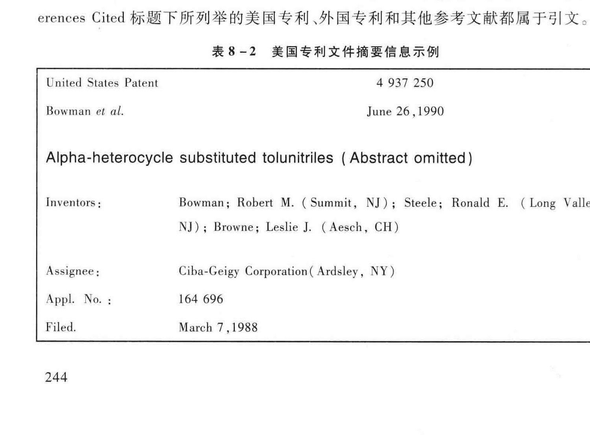

<!-- PDF页 250 -->

## 第8章 二手数据在管理研究中的使用

By Kae" 北京大学

[b> REAR |: 引言 | | 8.1 界定二手数据 |: 8.2 二手数据的传统与贡献 |: ”8.3 文本形式的质性数据 |: ”8.4”答阵结构化的量化数据 |: 8.5 二手数据的优越性: i 8.5.1 基于二手数据的样本量通常很大,样本甚至可以具有了时间跨;: 度,从而获得面板数据 |: 8.5.2 二手数据通常具有和较高程度的客观性 i 8.5.3 二手数据具有高度的可复制性,使实证研究更具有“他律性”:: 8.6 使用二手数据的“眼、法、工” i; 87 使用二手数据需要特别注意的问题 i: 88 结语: 二手数据在中国的使用与新趋势 } * 作者感谢其学生刘明坤.章英正李宜轩王现彪,李璨,李江膝、宋志滑.才让端智.吕渭星和张东芳对

本章中有关文献统计和文字校对的协助

<!-- PDF页 251 -->

wu i

俗语说,“ 巧妇难为无米之炊 ”"。 对于管理学研究者来讲,没有数据,再好的理论创意也很难转变成为一篇实证论文。 我在北京大学工作了十几年,这十几年来,经常能听到研究同行抱怨说数据的可获得性低, 尤其是海外回来工作的管理学研究者更是抱怨有加。 这也难怪。 比如,在北美,企业通常对学术研究价值的认同度比较高,对学术调研很合作,这使得通过问卷获取数据的成功率一般很高。 在国内,通过问卷调研获得数据却不容易有这样的运气。 与微观层次的管理研究相比,宏观层次的管理研究尤其如此,这是因为这类研究,比如企业战略管理研究,通常需要在企业层次上采样, 且通常需要 CEO 或者企业高管来亲自填写问卷,这些要求大大限制了问卷数据的可获得性。 我的一位同事曾经就中外合资企业问题进行调研,他找到了一个中外合资企业的名录, 以此作为样本框 (sampling frame),以某种标准的统计方法抽取了其中的 1 000 家企业作为问卷调研对象,发放了事先设计好的问卷。 最终的结果是只回收到 4 份问卷。 一些研究者因此会想办法通过借助政府等有关权力部门的力量来发放和回收问卷,但学术调研能无条件地获得有关权力部门支持的并不多见,通常都是在蔡政府做调研课题中以 “搭便车 "的方式来发放和回收问卷。 这样做的话回收率一般会有保证,但在这个过程中, 且不说政府部门对问卷设计的干预, 单说企业填写的动机对数据质量的影响就很难评价

上面这段话绝非是要质疑或者贬低问卷调研这种获得一手数据的研究方法在中国运用的有效性,而是要引申出这样一个观点:高质量的一手问卷数据的确不易获取,但这并不意味着中国是一片数据的沙漠。 在我看来,中国可以说遍地都是数据金矿。 我这里说的数据金矿,就是指二手数据。 本文将聚集于二手数据在管理学研究中的使用。 二手数据通常用于宏观层次的管理学研究。 宏观层次的管理学研究一般涉及 (但既不能完全涵盖,也不限于) 战略管理学研究组织理论研究、 国际管理研究,企业家创业研究,创新研究等。 本文所讨论的内容均为宏观层次的管理学研究,所针对的读者也是从事此类研究的同仁们。

有的同仁也许会说,即便是就二手数据的获得性而言,国内也无法与国外相比。 比如,在北美,由于有健全而有效的社会统计制度及适用于某些信息的披露制度, 由于有成熟的行业协会和专业的数据服务公司,加之有自由而发达的出版发行业的存在,二手数据不但十分丰富, 且容易获取, 方便利用。 这的确是实情。 在国内,系统编制的优质二手数据库,特别是下文中所说的结构化的二手数据, 尚还有

<!-- PDF页 252 -->

限。 但二手数据确如金矿,只不过丰富而珍贵的二手数据大多是以 “矿石 "的形式存在着, 它等待着有心人去探索、 识别和开发。 研究者要像淘金者一样去 “ 淘 ”。虽说 “ 淘 " 金的过程并非容易,但终归比问卷调研更能做到自主可控。

当然,二手数据的价值绝对不仅仅是作为一手数据的蔡代。 正如下文所强调的那样,二手数据有很多性能优于一手数据。 也就是说,对于有些研究问题,采用二手数据优于采用一手数据。 甚至,对于有些研究问题,非得采用二手数据不可。

### 8.1 界定二手数据

所谓二手数据 (secondary data),是相对于一手数据而言的。 一手数据 (primary data) 一般具有以下几个特征:(1) 数据由研究者或者研究者训练和委托的研究助理 (或者中介服务机构) 按照研究者的问题设计直接向被调研对象搜集而成; (2) 数据直接用于研究者自己的研究项目;(3) 在数据搜集过程中研究者通常与被研究对象发生直接接触;(4) 数据一般为研究者所拥有。

与一手数据相对应,二手数据一般具有如下特征:(1) 原始数据是他人 (或者机构) 搜集的;(2) 原始数据的搜集是为了其他的目的 (可能是研究目的,也可能是行政管理目的或者别的目的),而不是专门为本研究设计而为;(3) 研究者在使用二手数据时,通常不与数据中所涉及的研究对象发生直接的调研接触 (如访谈、 观察或者问卷发放与回收);(4) 通常可以通过公共及公开的渠道获得。

我们常见的公开出版或披露的上市公司数据、 专利数据、 工业企业普查数据、世界银行提供的国家和城市年鉴数据联合国跨国公司署提供的各国的对外直接投资 (FDI) 流入和流出数据等,都属于具有上述特征的二手数据。 更一般的, 报纸、 期刊等都可以成为获得二手数据的来源。

广义地讲, 二手数据的最初采集过程包括一手数据的采集方式。 比如上市公司数据,对于广大的经济学、 金融学会计学和管理学的研究者来说,是典型的二手数据。 但每家上市公司在根据披露制度按照标准表格填报有关数据和信息时,其过程本质上与填写调研问卷这样的一手数据采集过程别无二致。

全国工商联曾经邀请一些学者参与到它的中国企业家调查项目中,组成专家组,共同设计调研问卷。 我的一位同事是专家组成员之一,负责某一类调研问题的设计。 他说服了专家组把他正在进行的一项学术研究嵌入在该调研问卷中。 当然,如前面所讲,“ 搭便车 "常常需要对问题设计有所妥协,因为有很多类调研问题要在同一套问卷中被塞括,而问卷容量毕竞又有限, 致使特定研究问题的设计无法

<!-- PDF页 253 -->

得到全面的铺展,要忍痛做些割舍才行。 但幸运的是,尽管问卷设计有所折扣, 毕况还是通过这个机会获得了宝贵的大样本问卷数据。 这套数据对于我的这位同事来说,就是一手数据。 这套数据后来公开了,为很多管理研究者所采用。 对于后者来说,这套有点 “包罗万象 " 的全国工商联数据就是二手数据了。 这种使用二手的问卷数据的例子在文献中时能见到。

一手数据的这种 “特定 "使用,很大程度上要在原有的理论模型之外寻求想象的空间,这在本质上与 “二手数据 " 的使用没有多大差别。 我们在文献中会看到一些研究论文是以同一套问卷数据为基础的,这套数据对于其中的某些作者来说是一手数据, 而对于其他作者来说则是二手数据——别人的一手数据。

人们通常用 “ 挖据 "一词来形容二手数据的使用。 很多人坚持认为二手数据挖掘属于数据驱动 (data driven) 的研究,并对此表示不悄。 我不这么看。 一方面,二手数据的使用完全可以是理论驱动 (theory driven)。 下文所列举的多篇优秀论文都是如此。 另一方面,即便是数据驱动, 亦无不可。 任何数据,不论是何种形式,都是我们所处的世界的某种映像。 研究者可以因为预先的某种理论创意和想象力识别了某种二手数据的学术价值,也可能是反过来受到数据的启发产生了新的理论创意,拓展了想象力。 挖掘,应当理解为研究者与数据的互动过程,或者说是一个研究者通过与数据进行 “交流 "获得启发的过程。

在组织管理学研究文献中,二手数据的使用一般有以下几种形式:

第一,作为基本的数据来源与形式。

第二,作为辅助性的数据源泉, 旨在增加对实证背景的理解和把握, 或者用于对所选取样本数据的可靠性的确认。

第三,作为问卷数据的补充信息。 比如通过二手数据获得 ROA 和 ROE 等客观性绩效指标,以此来补充问卷数据中的主观性绩效指标。

本章讨论的是第一种形式, 即二手数据作为基本的数据来源和形式。 这又可以分成两类。 一类是作为案例研究方法的数据搜集方式,例如, Mintzberg 和Walters(1982) 研究的是一个零售连锁公司 60年的成长历史,为此作者对跨度几十年的媒体资料和公司内部记录进行了系统的搜集、 整理和分析; 另一类是需要利用或有现成的较大规模样本的二手数据来进行基于理论的假设检验。 本书中有专文讨论案例研究方法,因此本文聚焦于利用二手数据来进行基于较大样本的假设检验的研究。 在这方面,二手数据又可以简单分为两类,一类是像上市公司数据库那样已经以矩阵形式被整理和准备好的量化数据 (quantitative data),方便使用;一类是像报纸杂志那样以文本格式存在的质性数据 (qualitative data),需要研究者进一

<!-- PDF页 254 -->

步加工整理和提炼才能使用。

下面,我首先通过一些典型例子回顾二手数据在宏观组织管理研究文献中使用的传统和所做出的贡献。 接下来,我采用一个方便的小样本对新近发表的管理学期刊的几篇论文进行了一次粗略的分析, 借此来初步了解二手数据使用的一些分布性特点、 优越性及使用时需要注意的方面。

### 8.2 ”二手数据的传统与贡献

宏观层次的管理研究继承了经济学和社会学等领域的研究主要依赖二手数据的传统。 在组织理论文献中,采用二手数据的例子举不胜举。 比如,Baum 和 Oliver (1996) 从组织生态学和社会学的制度化理论视角来研究组织创立 (organizational founding) 问题, 他们的实证分析所采用的数据来自 1971年 1月到 1989年 12月的多伦多城市地区的幼儿日间看护中心。 他们的数据有两个来源, 一个来源是多伦多城区的社区信息中心 (Community Information Center of Metropolitan Toronto) 所提供的 《多伦多城区婴幼儿托管中心名录》(Directory of Day Cares and Nursery Schools in Metropolitan Toronto),这是一个包含所有日间看护中心有关信息的年鉴; 男一个来源是加拿大安大略省的社区与社会服务部 (Ministry of Community and Social Services) 所提供的日间看护机构和业务的信息系统 (Day Nurseries Information System),这个系统保存了安大略省所有日间看护中心的经营权记录和一些其他信息。作者利用这两个二手数据资源创建了一个实证样本和恰当的分析变量。 这两个数据来源均是二手的数据来源, 在数据性质上完全符合前文的四条界定标准。

在战略管理研究领域,PIMS 数据的贡献是非常具有代表性的一个例子。PIMS数据实际上来自最初由通用电气 (General Electric) 发起的 Profit Impact of Market Strategies 项目,故而简称为 PIMS。 该项目的建立是为了对企业战略与绩效的关系进行深入的研究和理解,项目后来转移到战略规划协会 (Strategic Planning Institute),由该协会进行协调管理。 按照 Hambrick 等 (1982) 的说明, 大约有 200 家公司每年向 PIMS 项目提交涉及大约 2 000 个业务单元 (business unit) 的信息,这些信息涉及企业业务所处的环境战略措施以及绩效。 这样, 经过长期而系统的汇集和整理,PIMS 数据成为研究环境,战略与绩效之间关系的一个宝贵的资源。 后来,PIMS数据向学术界开放,对于战略管理研究者来说,这是一套信息极其丰富的宝贵的二手数据, 在一段时间内炙手可热,基于此数据库的大量的研究成果涌现出来,这些研究成果对战略管理学的发展,尤其对早期该领域的发展起到了重要的推动作用。

<!-- PDF页 255 -->

在国际商务研究领域,二手数据的贡献同样是巨大的。 外国直接投资和跨国公司行为是国际商务研究的重要议题。 而这方面研究的葛基性工作是 20 世纪六七十年代在哈佛大学进行的。 其中,Raymond Vernon 教授所创建和领导的 “哈佛跨国公司项目 " 为此做出了尤其重要的贡献。1965年,在哈佛任教的 Vernon 教授担任该项目的主任,这个项目的设立是为了更好地研究美国和外国的跨国公司的全球运营行为。为此,Vernon 所领导的团队决定创建一个系统的数据样本,他们选择那些至少在 6 个国家有直接投资和运营的大企业,系统搜集了这些企业的财务组织、 生产,营销等信息, 到 1976年,他们的数据库已经包含数百家企业的系统数据。 这在当时几乎是唯一的关于跨国公司投资和经营的大样本数据库。 到 1976年,基于这个数据库所产生的学术成果包括 19 本专著,28 篇博士论文和 184 篇学术期刊文章。

这样的例子在文献中随处可见。 比如,在合资企业研究的文献中常被用到的加拿大西安大略大学的 IVEY 商学院所创建的 “Toyo Keizai 日本企业对外直接投资数据库 ”。Toyo Keizai 是日本的专业数据公司,该公司系统搜集、 整理和出版多种数据,其中有一套数据是基于日本公司在全球投资和运营的年度信息汇编而成,每年以纸质形式出版发行。1994年,Paul Beamish 教授和他的博士生注意到这个数据库的价值,于是着手通过手工录入的方式把纸版数据转变成电子版数据格式, 然后进一步编码和创建了一系列可供理论分析的变量。 后来,Beamish 和他男一位博士生, 即现在新加坡国立大学任教的 Andrew Delios, 对该数据库进行了持续的更新、 补充和改进。 据 Beamish 教授的统计,到 2007年 9月,加拿大西安大略大学IVEY 商学院的教授和博士生们 (包括毕业的和在读的) 运用此数据库的数据一共BRT 72 篇学术期刊论文.出版了 4 本专著并写就了相关图书中的 17 个章节。

为了对二手数据的使用与学术贡献获得一个基本面的了解, 我对 2008 一 2016年涉及战略领域研究的四本主要学术期刊进行了考察。 这四本学术期刊是 Strategic Management Journal(SMJ).AMJ Organization Science(OS) Journal of International Business Studies(JIBS)。 表8 -1 总结了各个期刊基于二手数据的论文在全部实证研究论文中所占的比例。 总体来看,二手数据的使用比例在四个期刊中以 AMJ为最低, 以 SMJ 为最高,0S Ail JIBS 在两者之间。AMJ 是一份兼顾宏观与微观管理研究的学术期刊,而 SMJ 则专门发表战略管理研究论文,所以不奇怪为什么 SMJ的二手数据的使用占很高的比例。 而且 SMJ 中的二手数据使用比例在 2011年竟然达到 90. 6%,意味着每 10 篇发表的实证型战略管理研究论文中,就有 9 篇可能是采用二手数据来进行假设检验的。 这足以表明在战略管理研究领域二手数据的学术贡献占有主导地位。

<!-- PDF页 256 -->

手数据在管理研究中的使用

° es ELM MB NE 2 AO) GU Se UE LEM OS hs HG TY Bg EO Td Re JO) SE AY SIE GUE S Bay LOT *

tL ‘0 £87 COE gcc ‘0 8bE Z09 8er 0 ste 09s 9180 L6S cel Wy L990 9% 6£ 67S ‘0 Or L8 8Prs 0 or $8 88 0 601 Ocl 9107 ees 0 tT Sr 1190 SS 06 Ost ‘0 LI 89 ILL ‘0 18 Sol S107 css 0 te Ip tor 0 6£ 6L ere 0 Ec Lo O18 0 18 O01 tI0c tr8L°0 67 Le p90 tr 8L 0L7 ‘0 07 bl L980 go cL £107 91S 0 91 Te zor 0 9¢€ 8L Zee'0 61 6s tIL'0 os OL 7107 889 0 Te.Sh L89°0 SE I¢ 966 0. 0c oF 906 0 8p ES 1107 v7L ‘0 Lr 5S9 Er9°0 oF 9¢ L6s ‘0 Le C9 688°0 95 £9 OI10¢ zs9°0 Eh 99 SIL'0 Oe cr 00S “0 8c 9¢ 8180 ts 99 6007 £9 0 Eh 89 689 0 Lo Ip 89 0 SE Ps LSL’0 es OL 8007

REM ASH EMA EMAC eH she os mY el Ri | GUE a

ema | OO fo Wx AO HK

Sait } so fWwy —_ fWs -. (9107—8007) HE RRECHKKUEAUMMARARRE 1-8

<!-- PDF页 257 -->

我在这里报告这个小小的 “调研 "结果,还有另一个用意, 即借此示意一下二手数据的使用,因为我这样做本身即是在使用二手数据资料,完全符合前文所述的二手数据的四个条件。 我这里仅仅进行了描述性的统计分析。 我完全可以用所回顾的期刊论文作为二手数据检验某种理论构想,但这需要首先有理论视角才行这实际上就触及了 * 如何” Chow to) 使用二手数据的问题。 这一点留到下文 “ 眼、TL ae ST BY

### 8.3 文本形式的质性数据

在文献中,很多论文所利用的二手数据就像我上面回顾的已发表的学术论文一样,其原始存在形式实际上就是一堆文本资料,我们可以叫作质性数据,而不是直接能让 SPSS 或者 Stata 等软件读取的量化数据矩阵。 这里有几篇论文作为例子

第一个例子是在 SMJ 上发表的 Nadkarni 和 Narayanan(2007). 在这篇论文里,业发展速度 (industry clockspeed) 对战略谋划 (strategic schema),战略灵活性 (strategic flexibility) 和企业绩效三者关系之间的调节作用。 作者将产业发展速度定义为产业在产品更新流程技术替代及产业内组织的行为和结构变化这三方面的速度。出相应调整的能力。 战略谋划反映的是高层管理者的认知,逻辑.知识体系和思维架构,高层管理者通过这些体现自我认知和信息处理方式的战略谋划来进行战略决策,采取战略行动。 作者认为,复杂性和专注性是战略谋划的主要特征。 作者提出一系列假设,这包括:产业发展速度将调节战略动态性和企业绩效之间的关系;战略谋划的复杂性将促进战略动态性的提高,在产业发展速度快的行业,这将积极地促进企业绩效的提高;战略谋划的专注性将促进战略稳定性,在产业发展速度慢的行业,这将成为企业成功的关键。

景, 相应地也就是选取一个合适的样本,以凸显行业发展速度的调节作用; 男一个关键是如何测度战略谋划这个理论概念

标准,然后根据该标准在 1980 一 1990年 Compustat 数据库中识别出 7 个高速发展行业和 7 个低速发展行业 (基于 4 位 SIC 编码),这样他们一共获得了 178 个在高

<!-- PDF页 258 -->

速发展行业中的企业、154 个在低速发展行业中的企业。 经过进一步的样本筛选eg hr ere ee 吉果的影响等因素),作者最终在高速发展行业中选择了 124 家企业,在低速发展行业中选择了101 家企业

针对第二个关键问题,作者采取的技术路线是阅读上市公司年报中 CEO 致股东大会的信, 通过阅读来识别和测量 “战略谋划 "这一反映 CEO 认知的变量。 作者利用年报信息,通过识别因果关系陈述.构建因果关系概念、 对概念进行编码和分类的方式,创建了因果关系图 (causal map)。 进一步,作者把这些编码后的概念和概念之间的联系看作点和线,然后利用社会网络分析中对点、 线及集中度等指标处理技术创建并定量测度了 “战略谋划 ”的复杂性和专注性两个具体维度。 这样, 作者就 “顺利地 "解决了该研究的一个核心技术问题谋划的测度。 这里的 “顺利地 "加了引号,是想表明这个技术路线的逻辑非常清晰,在此意义上是 “ 顺利 ”,但具体的识别、 编码和计算过程则非常烦琐,为了做到尽可能的准确,作者必须倾注足够的碘心。

第二个例子是在 SMI 上发表的 "Commanding Board of Director Attention; Investigating How Organizational Performance and CEO Duality Afect Board Members Attention to Monitoring” (Tuggle et al.,2010)。 这篇论文考察公司治理中的监察问题。论文的想法很简单,就是董事会对管理层的监察不是保持如一,而是会随着不同的组织条件与经营状况发生变化。 作者假设:如果公司的绩效较之于前期的绩效向下偏离,董事会对管理层监察的注意力就会增加,反之就会降低;如果董事会主席与 CEO 是同一人即所谓的 Duality,董事会的监察注意力也会减弱。 为了检验这些假设,作者选取了董事会的会议记录作为原始的二手数据, 从中识别和编码董事会监察管理层的 “注意力 ”。 原始数据包含了 18 个行业的 178 个上市公司 1994 一2000年的董事会的会议记录。 作者在正文中的研究方法部分和四整页的附录中翔实地报告了他们为什么选用这样的数据,是如何获取数据、 如何进行编码以及如何进行变量的具体测度的。 他们获得的最终的面板数据 (panel data) 包括 979 个观测点

第三个例子是在 SMI #& 42 1) “ She’-E-Os: Gender Effects and Investor Reactions

to the Anouncements of Top Executive Appointments” (Lee & James,2007)。 这篇论文研究了企业高层管理者任免公告与股东反应之间的关系。 作者特别关注的是性别因素对这一关系的有影响。 作者提出了一系列的理论假设,包括:由于高层管理者中女性代表的贫乏及人们对性别角色和工作性质的 “刻板效应 ”, 女性被任命到 CEO

<!-- PDF页 259 -->

这一职位上会伴随更多的负面预期和评价 (假设 1),同时会受到更多的媒体关注(假设 2),而这些关注与报道会较多地强调性别因素 (假设 3)。 相比于女性 CEO在 CEO 中的比例,女性高层管理者在高层管理者中的比例较高,这就使得女性高层管理者的任命所得到的负面效应低于女性 CEO FE fir 9 i TA ON BE 4). A为高层管理者中女性比例较大,所以在这一层面,女性和男性的任命所导致的股票市场反应没有显著的差异 (假设 5)。 同时,由于内部继任者有对公司了解和认知的优势,所以女性内部继任者相比外部继任者会带来更积极的股票市场反应 (假设 6)

为了检验上述理论假设,作者通过对 1990年 1月 1日至 2000年 12月 31 的《华尔街日报》(Wall Street Journal)、 新闻专线、 报纸及其他出版物的搜索获得了3 072 条任职宣告的样本。 通过一系列样本筛选程序,作者最终选择了 1 624 条宣告,其中 529 条是关于 CEO 职位的宣告。 基于这些宣告所包含的信息,作者识别了被任命人的性别 (gender:1 代表女性,0 代表男性) 和被任命人是否是内部继任者 (firm insider:1 代表是,0 代表不是)。 这是该研究的两个自变量。 作者通过对文档资料的阅读、 提炼和编码创建了一些控制变量,比如任命原因、 行业内人士(industry insider) 和经历 (previous experience)。 拿任命原因来说,如果前任是被迫辞职或者因为绩效很差和公司重组.公司被收购等非常原因, 则用 1 代表;如果没有这些非常情况, 则用 0 代表。

为了识别和测量媒体专道对 CEO 或高层管理者关注的程度和关注的内容维度, 作者采用了一种叫作 Centering Resonance Analysis(CRA) 的分析方法进行文本分析 (text analysis), CRA 分析是通过 Crawdad 软件完成的。 这个软件可以对词汇在词汇网络中的相距性集中度 (betweenness centrality) 进行量化,从而可以确定最有影响力和最重要的词汇。 研究发现, 任命宣告发生后报道平均篇数的统计结果显示为男性 CEO 2.41 篇,女性 CEO 2.77 篇,t 检验结果不显著,因此,女性被任命为 CEO 并没有受到更多的媒体关注。 但是,对报道内容所进行的 CRA 分析显示女性 CEO 报道会较多地强调性别因素,例如,在对女性 CEO 所进行的报道中,反映性别因素的 “女性 ”和 “家庭 "等词汇出现在 10 个影响性最高的词汇列表中,而在男性 CEO 报道的 10 个影响性最高的词汇列表中却没有关于性别因素的词汇。 对于女性 CEO 和女性高层管理者影响的区别的研究结果支持了作者的假设, 即相比于女性 CEO, 女性高层管理者的任命所得到的负面效应要低。 因为高层管理者中女性比例较大,所以在这一层面,女性和男性的任命所导致的股票市场反应没有显著的差异。

第四个例子是陈明哲 (Ming-jer Chen) 与其合作者的一系列关于企业间竞争动

<!-- PDF页 260 -->

态性 (competitive dynamics) 的研究。 他们对竞争攻击与反应的研究也是采用通过文本分析把定性形式的二手数据转化为定量数据的方法完成的。 利用所创建的同一套数据,他和合作者先后在 SMJ 和 AMI 等多个顶级的组织管理学期刊上发表了数篇关于企业竞争性行为的论文,可谓多产。 按照 Chen 和 Miller(1994) 所做的描述及说明,他们选择的研究背景是美国国内航空业, 之所以做出这样的选择是因为:(1) 行业具有和较高的竞争性;(2) 产业边界清晰; (3) 行业竞争者由于多为单一业务企业,因此行业内竞争受到来自公司层的干扰也少;(4) 行业具有丰富的公共信息来源。 作者最终选择的是具有 50年历史的行业杂志 Aviation Daily, 因为它提供了最为完全和详尽的航空行业内的竞争信息。 作者通过回顾该杂志从 1979年月 1日到 1986年 12月 31日之间的每一期,来识别和编码有关 “ 攻击行动 "和 “ 报复性反应 ”的变量。

作者依据以往的学术文献把如下竞争行动类型归结为攻击行动: 减价 (price cuts),促销 (promotional activities),产品或服务变更 (product line or service changes)、分销渠道变更 (distribution channel alterations),市场扩张 (market expansions),纵向一体化 (vertical integration),兼并与收购 (mergers and acquisitions) 及战略联盟 (strategic alliances)。 为了识别和编码 “报复性反应 ”,作者在 Aviation Daily 杂志上搜索如下关键词汇 “in responding to” “following” “match” “under the pressure of” “reacting to”。 找到这些词汇后,作者通过倒推的方式追踪 (trace) 一系列行为中的 “初始行动 ”(initial action),然后确认攻击与报复反应的交互关系。 这样, 作者一共识别了 780 个攻击行动和 222 个 “反应 ”(response)。 在这个过程中,作者识别并编码了一些变量,如是否有反应 (1 代表有反应,0 代表没有反应) 和反应的迟滞 (response delay),即在杂志上报道的 “行动 ”日期与 “反应 ”日期之间相差的天数等。

上面介绍的这几项研究的共同特点是,所使用的二手数据的原始形式是文本形式的,都需要通过文本分析方法,或者叫结构性的内容分析方法 (structured content analysis),识别,提取和编码所需要的变量信息,这种分析通常是通过识别关键词汇、 主题 (theme)、 某种陈述 (assertion) 或者故事描述,然后进行编码转化成量化数据形式的。

在具体操作中,对文本形式的质性数据进行编码,需要研究者对编码的标准和步骤非常并慎。 首先,对构念要有清晰的界定和理论文献支持其构建的合法性。其次,要确定资料来源的可靠性,说明该资料来源是否真实可信和且具有纵向的一致性。 再次,建立编码手册,详细记录数据下载的来源、 编码的步骤、 分类的原则及实施的时间、 参与人员与进度。 最后,建立统一文档格式,例如,用同一表头的 Excel

<!-- PDF页 261 -->

a eh 在此过程中,数据的下载、 Rade 分类编码都需要至少两位助研独立完成,进行对照检验,计算评估者间一致性信度 (inter-rater reliability),该指标通常需要在论文中汇报。 当编码出现不一致时,可以引入第三人进行协调讨论。 通常涉及主观判断的分类编码时,会存在一些模糊的地方,故而在正式编码工作开始前,需要对助研人员进行必要的集体培训,以及试编码, 待编码中出现的各种疑问都被解决时, 待大家的认识都达成一致后,再开展大规模的数据整理与编码。

### 8.4 ”和矩阵结构化的量化数据

从文献中看,使用现成的.已算阵结构化的定量形式的二手数据占绝大多数。毕竟, 像 Nadkarni 和 Narayanan(2007),Lee 和 James(2007)、Chen 和 Miller(1994)那样用手工的方式处理文本资料来获取可进行回顾分析的数据, 太耗时耗力。 理论上而言, 这几位人研究者所做的数据搜集和处理工作完全可以由某些专门的数据机构闪代完成,而这正是很多专业数据公司存在的原因。

在我回顾的期刊论文的样本中,Sampson(2007) 所使用的数据来自 Securities Data Company(SDC)。SDC 就是一家专门的数据公司, 它的工作人员追踪全球范围内的并购合资和战略联盟的公告信息,然后提取和编码,最后整理成矩阵结构化的定量形式的数据库。 很多研究者正在使用 SDC 的数据和类似的数据库。 毫无疑问,这样的数据给研究者带来了更大的使用便利。

但像 SDC 这样的数据来源也有它不利的方面,主要表现在:(1) 数据不一定都基于企业自报机制;(2) 数据不一定能保证系统性、 全面性和客观性;(3) 数据公司会尽可能多地提供变量指标,但因为不是为要进行的研究特别设计和定制的数据,所以变量可能缺乏针对性和适用性;(3) 因为数据搜集、 变量识别和提取的过程涉及众多的工作人员,数据的一致性、 准确性和可靠性可能会存在问题。

Anand 和 Khanna(2000) 在使用 SDC 数据库研究企业战略联盟与价值创造的关系时,指出:SDC 从公开可得的来源获得信息,这些来源包括 SEC 文件商业出版物、 国际同行.新闻和有线来源。 尽管数据库可以妃溯到 1986年,但 SDC 在1989年左右才开始系统的数据搜集程序来追踪这些交易,因此 1990年以前的交易样本不够全面。 他们选取了 1990 一 1993年所有美国企业参与的联盟作为研究样本。 但是,即使在 1990 一 1993年的样本期间, 由于对公司报告的要求不足, 数据显然没有追踪所有美国企业进入的交易。 所以,在使用这些数据的时候, 研究者应该

<!-- PDF页 262 -->

H&E ”二手数据在管理研究中的使用

格外小心, 要在样本选取、 筛选、 验证和矫正方面严格把关。 为了确保数据在合约类型行业分类和联盟日期等方面的准确性,他们将 SDC 的数据库与其他的非SDC 的数据来源 (如 Lexis-Nexis) 进行了比对。 以如何确保交易日期的准确性为例, 他们在论文里报告如下:

SDC 数据在事件日期的汇报上存在很多误报的情况。 我们尝试搜集每笔交易在不同渠道下的报道,包括新闻和网络报道报纸、 期刊及商业出版物等,这些关于确切的交易签署时间汇报的数据其准确性是逐渐下降的。 例如,新闻和网络报道特定事件通常比报纸提前一天或两天,而报纸通常比杂志等其他来源提前一些天数。 由于我们基于股票价格分析价值创造,能够准确确定交易完成的日期非常重要。 因此,我们在此项工作上花费了大量的时间。 在多数情况下,SDC 汇报的日期误差在 1 一 2月之内, 且大部分的误差时间在 1 一 2 天。 在一些情况下,SDC 汇报的日期似平与协议正式签署的日期一致;在其他情况下,SDC 汇报的日期似乎与协议谈判开始的时间一致。 因此,我们最终使用的日期与 SDC 中所提供的存在显著差异,我们在大多数情况下采用了经过多种数据源交又验证过的日期。(第301页)

这个例子对我们的重要启示是,作为严谨的学者,我们不能在得到 “现成 "的数据库的时候, 就想当然地认为数据足够 “干净 "和可靠,我们一定要付出额外的努力,确保选取的样本和变量指标是合适而可靠的。

与 SDC 这类二手数据相比,上市公司数据和专利数据在数据的系统性、 可靠性和 “干净 "程度上更高一些。

上市公司是公共公司 (public firms),依照法规, 企业必须如实公开关于企业的组织、 战略、 运营和财务方面的数据,所以上市公司数据库的数据具有系统性和客观性。 同时,上市公司数据还具有跨行业、 跨年代并且容易与其他二手数据库进行连接等优越特征,因而对实证检验的支持力度更为强大。 比如,Tong 和 Reuer (2007) 采用实物期权 (real options) 视角来研究跨国公司的多国程度 (multinationality) 对企业风险的影响。 他们首先确定从 Compustat 中选取行业 SIC 在 3 000 一3 999 的制造业企业, 然后结合另外一个数据库 Directory of International Affiliations (1985 一 1996) 确定了样本的框架,并从这两个数据库里获得多国程度、 企业资产、企业的资产回报,研发投入、 销售收入、 库存、 费用等指标信息。 除此以外,他们还利用其他二手数据资源创建了其他变量,比如,他们采用 Kogut 和 Singh (1988) fi)

<!-- PDF页 263 -->

方法,对 Hofstede 的文化维度进行计算,生成了文化距离这个变量。究者可以到美国国家专利局的网站上获取专利数据。 注意,这里说的 “美国专利 ”,是指在美国国家专利局申请并获得授权的专利,该专利完全可能源于美国以外的其他国家和地区。 美国专利受到偏爱的原因主要有三个:数据获得的便利性;美国既是当今世界上的技术领先国家,同时也是很多技术和产品的最大的市场; 包含信息丰富,数据结构整齐,数据维护系统,数据格式便于使用。

原始的专利数据实际上是无数的专利文本。 表8 -2 展示的是一个专利文本中的摘要部分。 由于专利数据对研究的价值,已经有专门的研究机构和数据公司(比如 NBER 和 CHI Research Company) 对此进行了开发,提供已经矩阵结构化的定量形式的专利数据库。 现有的专利数据库基本上是把表8 -2 中的一些关键信息和信息之间的关系进行量化而成的。

专利属于法律授权,评审的标准完全基于技术发明的新颖性,因而专利数据在组织间,行业间、 国家间和大跨度的时间范围内具有高度的可比性。 从表8 -2 可以看到,专利数据中有如下可识别的信息:专利号,企业、、 时间、 地点,技术领域和引用文献等。 专利号是一项专利的 “身份证 ”,企业名称可以用来连接其他数据库。Kotabe(2007) 就是把专利数据与 Compustat 及 Forbes Top 100 国际公司数据库进行结合。 时间、 地点和技术领域都是样本选取和统计分析的重要维度,当然,专利数据在目前最为广泛使用的还是它所包含的引文 (citation) 信息。 在表8 -2 中,References Cited 标题下所列举的美国专利、 外国专利和其他参考文献都属于引文。

表8 -2 美国专利文件摘要信息示例

4 937 250

United States Patent

June 26,1990

Bowman et al.

Alpha-heterocycle substituted tolunitriles (Abstract omitted)

Bowman; Robert M. (Summit, NJ); Steele; Ronald E. (Long Valley,

Inventors;

NJ); Browne; Leslie J. (Aesch, CH) Assignee; Ciba-Geigy Corporation(Ardsley, NY) Appl. No.: 164 696 Filed. March 7,1988

<!-- PDF页 264 -->

(续表)

Current U.S. Class; 514/341; 514/399; 546/272.4; 546/272.7; 548/345.1; Intern’l Class; A61K 031/415; CO7D 401/06

Field of Search; 546/278 548/335 514/341,399

References Cited

U.S. Patent Documents

3 290 281 Jul.,1963 Weinstein et al. 534/567. 3 852 056 Dec.,1974 Draber et al. 71/76.

4281 141 Jul.,1981 Merritt et al. 548/342. 4 562 199 Dee.,1985 Thorogood 548/335. 4 657 921 Apr.,1987 Frick et al. 514/383. 4 689 341 Aug.,1987 Diamond et al. 514/399. 4728 645 Mar.,1988 Browne 514/214. 4 766 140 Aug.,1988 Hirsch et al. 514/397.

Foreign Patent Documents

0 003 796 Sep.,1979 EP. 2 821 829 Nov.,1979 DE. 2 041 363 Sep.,1980 GB.

Other References

Ikuchi et al., Chem. Abstr. vol. 87;201329j(1977).

Oiji et al., Chem. Abstr. vol. 87;53093k (1977).

Mason et al., Biochemical Pharmacology, vol. 24, p. 1087 (1985). Abstract of SU 1355 - 126A (1987).

Abstract of EP 106060A (1984).

Primary Examiner; Fan; Jane T. Attorney, Agent or Firm;Gruenfeld; Norbert

EF MGR eA TH

<!-- PDF页 265 -->

研究者们通常采用的是引文中的美国专利,因为可以通过专利号非常便利地在同一数据库中进行关联和有关技术处理,以创建所需要的变量。Jaffe 与他的合作者于 1993年在经济学季刊上发表的论文成为一篇在使用专利数据文献中广为引用的经典之作。 在这篇论文里,他们认为专利作为发明创新的结果代表了人类知识的结晶,专利之间的引用则在某种程度上体现了这些知识在被创造过程中源于溢出效应产生的联系 (linkage)。 这个创意对后续的研究者们如何挖掘专利数据提供了巨大的启发

Kotabe 等 (2007) 的论文就是一例。 该论文主要的解释变量都是通过专利引文数据创建的。 比如,作者用每年公司所持有的专利申请的引文之中原产地为国外的引文所占的比例来测度国际知识转移,用每年公司所持有的专利申请的引文之中原产地为本国的引文所占的比例来测度国内知识转移。 他们还创建了一个变量叫作知识复杂度, 是用一个专利从申请到被授权之间的年限来测度的 (这里隐含的一个假设是,一个专利在专利审查员那里停留的时间越长,表明知识复杂度越高)还有一个变量, 叫作国际 tn international knowledge dispersion),创建方法如下:如果一个美国跨国公司某一年的专利总数为 8 个专利引文,其中有 5 个的发明地为日本 1 个的发明地为意大利,那么国际知识分散度的测度则为 2

在利用专利引文数据方面,Ahuja 和 Lampert(2001) 更具创意。 这篇论文的因变量是突破性发明 (breakthrough inventions),三个自变量分别是新兴技术 (emerging technologies).新颖技术 (novel technologies) 和领先技术 (pioneering technologies)。 为了创建因变量,作者首先把企业所在行业 (化学行业) 的所有专利按照它们被引用的次数排序,把位列于前 1% 的专利当作突破性发明。 然后,作者把一个样本企业的这类专利按年度加总, 即得到了因变量的测度值。 儿个自变量的创建过程如下:

(1) 新颖技术。 查看一个企业的专利历史,比较专利的技术分类,如果发现在最近三年有专利曾被归于一个新的技术分类中, 即该企业的专利以前不曾被划入的技术分类,那么则可确认为新颖技术 "信息。 作者将年度加总的这类新的技术分类数作为新额技术的最后测度值

(2) 新兴技术。 首先计算每一个专利所引用的专利的平均年龄 ”, 然后按照年度加总那些引文专利的平均年龄小于 3 的专利数目。 这个加总值就是新兴技术的测度值

(3) 领先技术。 按照年度加总一个企业不曾引用过任何其他专利的引文的专利数日

<!-- PDF页 266 -->

H&E ”二手数据在管理研究中的使用

### 8.5 二手数据的优越性

通过对上面几篇研究论文的回顾,我们对三手数据的使用获得了一些大致的印象。 从这些论文中,我们或许可以看到使用二手数据具有如下的一些优越性:

### 8.5.1 基于二手数据的样本量通常很大,样本甚至可以具有了时间跨度, 从而获得面板数据

我们知道,如果采用一手数据的研究方法,因为研究者个人资源的有限性 (时间经费和人手),通常情况下样本量难以做到很大;要做到跨时有段采样,就更困难了。 采用二手数据在样本大小和时间跨度上具有明显的优势。Short 等 (2007) 从Compustat 提取 1 165 家从事单一业务的企业作为样本,样本获羡 12 个行业 (4 digit),时间跨度为 1991 一 1997年,作者基于这个样本研究企业层面.战略群组层面和产业层面因素对企业短期和长期绩效的影响。Morrow 等 (2007) 从 Compustat 选取178 家从事单一产品制造的企业在 1982 一 1994年期间的数据,用来分析面临绩效下滑的企业如何采取战略行动以求满足投资者的期望。Kotabe 等 (2007) 基于专利数据的分析样本含有 56 027 个观测值

二手数据之所以具有这样的优势,是因为通常有资源和实力的数据机构在系统地搜集和长时期地维护数据库。 拿 Compustat 数据库来说,Compustat 是由美国著名的信用评级公司标准普尔 (Standard & Poor's) 所发行,收录以北美地区为主的公司的营运及财务状况资料库,Compustat 北美版数据库收录近 20年美国和加拿大共 25 000 多家的公司资料,其中约 12 000 多家公司为在 NYSE、NASDAQ, Toronto Stock Exchange 等上市或者上柜的公司。 数据库的来源包括公司的财务年报、 季报,公司按要求提交给美国证券交易委员会的 10-K 表,以及其他各种有关企业经营活动的公开资料,经过系统的搜集、 清理和整合,Compustat 数据具有信息丰富、这也就不奇怪为什么在我之前考察的那个小小的方便样本中,利用 Compustat 数据的论文占了大多数

8. 5.2 二手数据通常具有较高程度的客观性

通常被研究者使用的二手数据库都是以反映组织特征、 企业经营活动情况和绩效指标的数据为主, 基本上不包含主观脐断,或者较少程度地受到主观腾断的影

<!-- PDF页 267 -->

响。 人研究者从二手数据中识别关于做了什么,发生了什么、 谁做的、 在哪里、 什么情况下等信息,这些信息通常具有非常高的客观性。 试想,如果通过访谈和问卷来获取这些过去的行动信息,其准确性和客观性极有可能会因为被访谈人和答卷人的个人因素——包括信息掌握多少一时玖漏、 理性反思倾向,迎合心态等——受到很大影响。 在 Chen 和 Miller (1994:90) 的论文里,他们这样说明:

由于期刊旨在报告航空公司的公告和客观行动,因此几乎不受事后合理化的扭曲。

所以,二手数据与通过问卷调研获得的数据相比,通常具有较高的客观性。 前面举的几个例子中的 Chen 和 Miller (2004) fy 3a 4 Be iti 9 ZN Al Lee 和 James (2007) 的高管任命公告信息,都是客观的信息。

假如我们研究企业家或者高管团队的认知演变,那么采用案例调研或者问卷都可能因为被访谈者或者问卷填写人的回忆偏差而导致效度问题。 如果我们能够获得一套较为完备的历史数据,比如某些企业家的历史演讲记录或类似于 Tuggle等 (2010) 那样的会议记录数据, 那么就可以通过编码的方式把企业家或高管团队在不同时期的认知挖掘出来。

8. 5.3 ”二手数据具有高度的可复制性,使实证研究更具有 “他律性 ”

只要我们不大其烦,我们完全可以把前面所列举的任何一项研究再重新做一遍。 如果按照所绑定的论文的方法描述,提取同样的二手数据源并按照相同的步台去创建样本,那么我们就可以评估原作的严谨性和可信性。 简言之,二手数据具有高度的可复制性。

在战略管理研究文献中有这么一则典故,或许可以说明二手数据的可复制性对促进学术研究的特别意义。Amihud 和 Lev(1981) 提出这样一个论点:跨行业的合并行为是由于管理者为了减少自己的 “雇佣风险 "而导致。 作者利用 Compustat数据库对 20 世纪 60年代 309 家公司的跨行业兼并行为进行了研究,实证结果支持了他们的假设。 他们的这项研究把多元化战略与公司治理层面的代理成本联系起来,其观点和实证结果对后来的研究影响很大。 然而,17年后,Lane 等 (1998) 48出有必要重新检验 Amihud 和 Lev(1981) 的研究的假设和结论。 首先, 该论文作者利用 Amihud 和 Lev(1981) 论文所采用的同样的数据复制了 Amihud 和 Lev(1981)研究,然后又利用 20 世纪 80年代的数据再次进行了验证,两项验证的结果均未支持 Amihud 和 Lev(1981) 所得出的结论。 基于新的研究发现,Lane 等人指出,跨行

<!-- PDF页 268 -->

业莱并是非常复杂的组织管理学现象,使用单一的代理理论无法说清楚蕴涵在复杂现象中的因果关系。 他们同时指出他们的研究结果与 Amihud 和 Lev (1981) 研究结果的显著差异是由于 Amihud 和 Lev(1981) 对多元化的不恰当衡量及对合并分类的不细致所致。 针对这些质疑,Amihud 和 Lev(1981) 的两位作者在 1999年的SMJ 发表文章,再次重申了自己的观点。Lane 等人也再次发表文章, 坚持认为Amihud 和 Lev(1981) 的研究是基于金融经济学研究视角,其假设、 方法、 人逻辑和解释与战略管理的研究方法是不同的 (Lane et al.,1999)。Boyd 等 (2005:367) 在SMJ 上发表论文对这一学术争论进行了总结性评论,他们这样写道:实证研究在确认或挑战特定视角方面有关键性的作用。 为了推动领域的进步,必须有一小波儿文献致力于批判战略管理中的实证文献。 不管主题如何, 这些综述对于战略管理研究都有持续性的意义。

这个典故让我们看到学术争论是有益的了, 而 Lane 等 (1998、1999) 与 Amihud和 Lev(1981、1999) 的争论应该说部分地 “归功于 "二手数据的高度可复制性。 理论上说,对任何一篇采用二手数据的实证论文,只要它对数据的选取和变量设置描述得清楚,我们都可以复制它。 而这一点,对于采用一手数据的论文,除非拥有原来一手数据的研究者愿意分享数据, 我们不能做到对该研究的 “原样 "复制。 当然, 必须说明的一点是,从统计学的原理来看,不同的样本只要符合一定的 “品质 ”和研究设计的要求, 对理论问题说明的有效性和说服力是一样的。 换言之,科学研究的实证基础是有效的样本,而不一定要求完全相同的样本。 因此,基于一手数据的研究也可以 “复制 "。 但是,二手数据所具有的高度的可复制性,仍然会为推动研究发展带来一些额外的好处。 这个好处可能会特别表现在当复制的研究的发现与之前文献报告的发现不同的时候, 基于一手数据的复制研究不如基于二手数据的复制研究更有挑战性。 也正因为这一点,我认为,基于二手数据研究具有更高程度的 “他律性 ”,基于问卷数据的研究次之,而案例研究的他律程度您怕最低。

管理学领域正在推动 “复制性 "研究,鼓励学者们共享与公开数据,减少重复性的数据搜集工作,更好地推动学科知识的积累。 学者们也在积极搭建数据共享的平台并采取相应的积极举措。 例如,致力于加速在战略、 创业和企业与行业演进

D 按照 Boyd 等 (2005) 的统计,在 Lane 等 (1998) 发表后,截至 2004年 6月,Amihud 和 Lev(1981) 论文共被引用 88 次 (从发表时算起,一共有 265 次引用),Lane 等 (1998) 的论文被引用 27 次,包括 3 次直接由于原文争论和回应所产生的引文

<!-- PDF页 269 -->

的研究, 达特茅斯大学的 Helfat 教授发起了 FIVES Project?,在此项目平台上注册的用户可以免费下载相关的研究数据集。MOR 为在在线平台上开放自己的研究资料的作者授予颁发开放资料勋章 "(Lewin et al.,2016)。 国内的中文学术期刊,如 《中国工业经济》, 也开始要求所发表的文章要公开其所采用的数据源。 这在一定程度上加强了二和手数据的 “他律性 ”。 故而,研究者应在数据搜集、 整理、 清理与分析的过程中更为并慎, 且做好相应的数据处理文档记录。

### 8.6 使用二手数据的 “ 眼、 法、 工 ”

很多学生问我:“ 既然说到处都是二手数据的金矿,可是为什么我却看不到?即便是看到了,也不知如何下手, 如何有效使用。”

前面,我之所以回顾那些具有代表性的研究论文,并且复述原文中有关数据方法的描述和说明,就是想展现庐山真面目。 我认为上面这些研究都是绝佳的示范,能启发我们如何识别.提取和有效使用二手数据。 如果非要进行更进一步提炼的

所谓 “ 眼 ",就是需要有理论透镜 (theoretical lens) 去捕捉,识别和选取适用的二手数据。 不同的理论透镜,看到不同的东西。 没有透镜,就什么都看不到。 比如,同样是上市公司数据,有人看的是制度影响与代理问题,有人看的是 CEO 继任, 还有人看的则是并购决策。 同样是专利数据,有人看的是创新,有人看的是实物期权理论 (real options theory) 的验证,还有人看的则是知识流动。

前文中我用简单的描述性统计总结了四本学术期刊的论文发表中使用二手数据的分布情况。 我可以找到某些理论着眼点, 即选取理论透镜来重新审视和编码这些以研究论文形式存在的二手数据。 比如,我可以结合社会网络 (social network) 视角和学习视角 (learning perspective) 提出关于什么样的研究者更倾向于二手数据及如何使用二手数据的假设。 如果这样,我不但要在我的样本框内识别每位研究者,编码每位研究者发表的论文是否使用了二手数据, 或者是如何使用的二手数据 (比如,是否寻求原始的质性二手资料通过编码创建自己的二手数据),我还要设法通过其他信息渠道 (比如每位作者发表论文时工作的院系、 之前工作过的院系,博士学习的院系等) 来提炼和创建一套关于这些研究者的社交网络数据。 我

外 ”FIVES Project 项目官网:http://five. dartmouth. edu,回 ” 例如,Open Science Framework(https://osf. io/) 或 As Predicted(https://aspredicted. org)

<!-- PDF页 270 -->

其至可以编码弱连接 (weak ties) 和强连接 (strong ties) 及网络的中心性、 密集度或结构洞等变量。 当然, 我也可以采取别的理论透镜。 比如,我可以像 Tuggle 等(2010) 一样研究 “ 关注力 ”。 比如,我说不定可以提出一个 “知识,习惯与信任如何影响探索取向 "的假设,即使用二手数据的研究者比使用一手数据的研究者更倾向于引用文献中基于二手数据的实证研究论文;使用二手数据的研究者比使用一手数据的研究者更可能具有扩张研究范围倾向的新探索,等等。

那么,怎么才能练就一双具有强大的穿透力的 “千里眼 ” 呢?就这个问题,最好的答案莫过于 Karl Weick 的比喻。Weick(1989) 提出,研究需要 disciplined imagination, ane 在这个探索过程中所需要的 disciplined imagination 靠的是雷达。 要依靠雷达发出信号,再接收反射回来的信号SES 9 ea A a AN 我们的雷达系统就是我们的理论训练文献储备和研究功力。 没有理论的 “雷达 ”,我们连提出关键问题的能为 (ability to ask critical questions) 都没有,就好比航船无法发出雷达信号,看到的当然只能是东

有了雷达这只芝眼,还需要掌握雷达的操作,分析和解读雷达捕获的信号, 即这里讲的 “二手数据 "。 这就是所谓 “ 法 ”(methodology)。 如果方法不当, 一定会出错。 如果流程步绝是对的,但做得不够用心和严谨, 那也会有问题。 前文对多篇论文不厌其烦的描述,其实不是展示他们理论建构.选择数据源和编码方面做得多么聪明,而是在示范优秀的研究者是如何审慎地对待二手数据、 如何求实和尽可能地做到无误的。 比如,研究者总是要努力确认数据的可靠性和信息识别、 提取及编码的准确性。 在进行针对研究问题的统计分析前,对二手数据进行预处理与清理是很重要的,可以避免后期统计研究中可能出现的偏误。

首先,了解二手数据产生的情境与途径,评估二手数据的可靠性、 综合性与可能的偏误。 es eb et至少可以回答以下几个问题: 谁搜集了二手数据? 搜集的目标是什么? 在什么时间进行了数据搜集? 采取了何种途径和方法进行了数据搜集? 数据的一致性如何? 大部分公开的社会调查数据中,对问卷调查的执行过程有详细的闸释。 例如,世界银行的企业问卷,有独立的数据手册对样本的抽样.问卷发放的时间、 地点对间卷实施的过程进行介绍。

研究者从文本数据中进行编码构建数据时, 则需要曾释证明基于该文本资料进行编码的合法性, 即该文本资料是全面的且无偏误的。 例如, Chen 和 Miller (1994) 为了说明 《航空日报) 杂志上发表信息的准确性,他们随机抽取了一个包含

<!-- PDF页 271 -->

20 个战略行动的子样本,将其与其他主要的商业杂志和报纸上报道的内容进行了比对,结果表明 《航空日报) 是在同类专业期刊中对于航空公司竞争行动报道最为全面的数据来源。

又例如,Nadkarni 和 Narayanan(2007) 更是用大量篇幅 (几乎两整页) 来说明他们是如何确保通过阅读企业年报中 CEO 致股东信可靠地提取战略谋划信息的,并且逐项讨论了关于准确性问题 (即内容偏差.时间偏差.和归因偏差问题)。 其中,针对潜在的时间偏差,他们随机抽取了 30 家企业的子样本,然后搜集了在 《华尔街日报》 上在 1990 一 1992年关于该 30 家企业的 15 项特定的战略行动事件 (如高管变动,并购和和剥离等) 的信息。 他们对比了 《华尔街日报》 中汇报的事件日期与在年报中汇报的日期。 如果汇报时间不在同一年, 则视为存在 "时间湾后 ”,然后,他们计算了时间滞后事件占总事件的比例,发现这 30 家企业的时间灌后的比例均低于 15%, 借此说明,时间沾后并不是该数据的严重的问题。 为了评估归因偏差, 即管理者将低绩效归于外部环境,将高绩效归于企业的战略行动的归因偏差,他们计算了子样本企业在所在行业的销售与投资回报率等指标上的标准分数 (z-score),然后在 CEO 的信中将组织绩效结果分为内部归因 (组织战略行动.结构和流程) 与外部归因 (外部经济与行业因素),将企业的外部归因与内部归因的比例与其行业标准分数进行了相关分析, 通过非相关性证明归因问题没有给数据带来重大的

其次,识别并处理二手数据中的缺失值.异常值和异常的分布。 针对一般的二手数据, 可以对数据的均值.范围及分布情况进行描述性统计分析, 以识别缺失值、异常值和分布异常的情况,并予以处理。 处理的方式包括改正、 删除或弃用。 研究者需要区分这些缺失值.异常值和分布的异常是随机产生 (如录入的错误或遗漏),还是系统性偏误。 随机产生的缺失值,可以采取个案删除法 (listwise deletion).平均值填补法或者多重填补法 (multiple imputation, M1) 进行补充处理; 少量的异常值可以删除。 如果不同的数据库或者数据源对目标样本或变量均有和覆盖, 则可以通过其他数据库进行补充完善样本。 例如,Hallen 等 (2014) 的研究样本是 1979 一 2003年的企业风险投资。 他们首先使用 VentureXpert(该数据库主要基于投资者的调查构建) 作为主要数据来源构建了研究样本;然后利用 VentureOne (该数据库主要基于创业者的调查构建) 中的数据对 VentureXpert 的数据样本进行了交叉验证,补充了 VentureXpert 里的缺失值; 当 VentureXpert 与 VentureOne 中的

中 MI 方法来自贝叶斯估计,是用两个或更多能反映数据本身分布概率的值来填补缺失值的方法

<!-- PDF页 272 -->

样本数据存在不一致时,他们进一步通过 Lexis-Nexis 中的信息进行了验证和补充。最终, 这些数据交叉验证补充工作,使最终样本量增加了 20%。 有些系统性缺失则需要特别注意,例如,在投中、 清科等投资数据库中,对创投行业早期投资数据的披露较少,早期投资金额存在系统性缺失,如果研究关注早期的投资金额, 则会影响假设检验的有效性,此时可以考虑弃用该数据库, 考虑其他可能的数据来源。

虽然数据清理工作通常在数据正式统计分析前进行。 但实际上,数据清理是一个持续迭代的过程,有些数据问题可能是在后期分析阶段发现的,例如,在数据统计分析中, 当有异常的统计结果和发现时,需要重新回到样本中进行检查确认。其至, 有些容易忽视的样本分布问题,是在论文的审稿过程中通过同行评审才被发现和纠正的。 在数据清理的过程中,研究者不能直接对原始数据进行更改, 需注意数据文档的管理,记录每一步的数据处理工作。

Weick 借用雷达的比喻,试图说明研究者不论通过什么样的研究方法都只能获得环境的代表 (representation of environment)。 二手数据, 不论是以哪种形式存在的二手数据, 也只不过是我们研究对象的代表而已。 我们研究的目的是要透过二手数据表象获得对某种本质的揭示,但是我们完全可能出错。 要尽可能地避免出错,根本出路在于:一,系统地,持续地更新和改进我们自己的理论 “雷达装告 ”和软件系统;第二,永远不懈地改善我们的 “雷达 "操作方法和 “雷达信号 "接收、 处理和解读的方法,永远不折不扣地保持方法的严谨性。

最后,所谓 “ 工 ”, 指要有了耐心, 肯花时间, 不怕费事。 只有这样,才能在金矿中淘出成色上好的金子。 这是一个朴素的恒常之理,我不在此多费笔黑了。

### 8.7 ”使用二手数据需要特别注意的问题

使用二手数据特别需要注意的是如下几点:

(1) 切不可一味地贪图利用 “现成 "的二手数据的便利,把严肃的学术人研究变成数字游戏和论文制作” (fabrication);

(2) 切不可无原则地妥协于二手数据的局限,结果变成理论是一回事,实证是男一回事, 人研究发现和解读似是而非;

(3) 切不可盲目地陷入二手数据的挖掘中,忽视对管理实践的关注,不接现实世界的 “地气 ”,使研究索然无味

前面我以 SDC 数据 Compustat 数据和专利数据为例, 说明了 “现成 "的二手数据在宏观层次的管理研究中的应用。 我所举的例子都说明了使用这类二手数据有具

<!-- PDF页 273 -->

有很多优越性。 但是必须指出,二手数据不论多么丰富、 系统和 “干净 ",也一定存

第一,变量指标的契合性问题, 即构念的效度问题。 二手数据里所包含的经济.技术或者地理人文信息,对于经济学社会学的研究常常是合适的,但对于组织管理学而言, 我们通常需要一些 “ 战略变量 " 或者 "行为变量,而这却是二手数据通常缺乏的。Venkatraman 和 Grant(1986) 识别了战略管理研究中构念测量的常见问题,包括依赖于分类型变量、 采用单一的指标、 没有足够的信度分析及存在层次(人企业、 团队. 个人) 的模糊性。 当然, 很多情况下,基于二手数据的可得性和形式,研究者不得不做出妥协,采用一些与理论概念有一定关联但并不具有很好自合度的既有指标作为代理指标 (proxy indicator)。 上面列举的采用专利引文来测度”知识流动的论文,就是如此。

使用二手数据与基于问卷数据的研究不同,后者可以采用验证性因子分析等手段对于多题项的测量量表进行构念测量效度的比较评估。 而在战略管理领域使用二手数据的研究中,很多仅仅采用单维度指标, 对其效度评估更基本的是构念的测量能否契合理论, 即满足理论效度 (nomological validity)。 下面我试以 “国际化 ” (multinationality) 构念的测量与 “研发强度 ”(R&D intensity) 作为代理变量来说明二手数据的构念效度问题。

Hennart(2011) 回顾了研究国际化与绩效的相关文献,指出 “国际化 "的不同测量与理论主张并不匹配。 具体的,其识别了五类已有文献中关于 “国际化 "的不同的操作化,分别是:(1) 对于海外市场的依赖,通过海外销售额占总销售额的比例进行测量;(2) 对海外生产的依赖,通过海外的资产 (雇员数量和收入) 占总资产(雇员数量和收入) 的比例进行测量; (3) 海外销售的分散程度,通过 Compustat 的地理分类计算其海外销售额分散程度的赫芬达尔指数 (Herfindahl index) a #7 Mi TK数;(4) 进入的海外国家的数量,通过计数测量;(5) 进入的海外国家的多样性, 通过企业员工在不同组 (根据政治制度和文化相近进行分组) 的国家之间分散程度的炉指数测量。 然而,对应到国际化与绩效之间相关关系的理论主张, 即更高程度的国际化可以使企业更好地利用无形资产更好地套利,同时带来更高的内部与外部成本,Hennart 认为前四种测量不能很好地对应到此三类理论主张,例如,无形资产的利用取决于整体市场的规模,而非海外或者本土市场的区别

Bromiley 和 Johnson(2005) 指出, “研发强度 "在交易成本的理论中,可能被用于测度资产专用性,在产业经济学的研究中,被用来指代进入和退出的壁琳,在动态定位的研究中, 则用以反映产品差异化的战略。 在不同的理论构念中,采用同样

<!-- PDF页 274 -->

的代理变量为管理知识的积累带来了障碍。Bromiley 等 (2017) 进一步反思已有研究中将 “研发投入 "(R&D spending) 或 “研发强度 "作为企业风险承担 (risk taking)的测度的合理性。 基于美国上市公司的面板数据,他们将 “研发投入 "和 “研发强度 "与其他的不同测量风险的指标进行相关性分析发现,一方面,“ 研发投入 ”和“研发强度 "之间的相关性为负, 意味着其测度了不同的构念; 男外一方面,与其他11 个风险测度指标之间的分析, 也没有发现一致的正相关关系。 这在一定程度上表明 “研发强度 "或 “研发投入 "作为企业风险承担的程度的测量并非完全兆合。

针对二手数据构念效度问题, 构念的清晰性是构建合适的测量指标的基础。在将构念操作化时,可以参考先前文献中的变量测量方式为研究所采取的测量方式提供合法性。 但还要做一些额外的工作,尽量保证所采用变量的效度的可靠性。在充分考虑已有文献中的测量是否很好地契合了理论主张的基础上,可以通过不同的测量方法之间的相关性分析, 检验已有文献中测量方法的一致性与否。 在必要的情况下,还可以引入对研究对象非常了解的业界专家对于构念的测量方式予以评判与建议

访二,变量指标的准确性问题。 安然事件让我们认识到,即使是上市公司也可能虚报数据。 当然,我们宁愿相信这只是少数。 如果只是少数的话, 那么我们通常会相信基于大样本数据的实证检验是可靠的。Compustat 数据的可靠性已经广被认可,其他的数据则不一定总让我们保持这样的乐观。 一般地,使用二手数据的误差大概会有这么几种:

(1) 企业自报数据时由于主观和客观的原因发生的误差;

(2) 专业机构或者数据公司人员在搜集和处理数据所发生的偶然误差;

(3) 专业机构或者数据公司人员在搜集和处理数据所发生的系统误差;

(4) 研究者使用二手数据时发生的误差。

这里可以用专利引文数据来说明前三种误差。 按照美国的法律,专利申请必须列出所有此项发明曾经获益的专利文献 (即所谓的 Prior Art)。 逻辑上,一项发明的授权是基于该发明的新颖性,而这个风辑则有可能导致专利申请人具有少申报引文的倾向,因为引文越多越可能意味着申请专利的发明的新颖性程度越低。当然, 少申报引文也可能事出有因: 发明人可能根本就不知道曾有一些已经授权的专利,而这些专利在事实上成为本发明的专利文献。 这就会引起自报误差。 鉴于这样的情况,在美国的专利审查制度中,设置专业的专利审查员就成为必要环节。审查员会根据自己的知识经验及在专利数据库查询的便利,自行判断并添加没有被专利申请人列出.但事实上与本专利具有技术关联的以前的专利。 然而,这样又

<!-- PDF页 275 -->

会导致男一种数据噪声 (noise)。 第一,审查员之间的业务水平的差异可能导致有的补充多些, 有的补充得不够;第二,审查员添加的一些引文可能根本就不是发明人所知道的,那么车利用这些引文来 “测度 "实际发生的知识转移,势必导致测度

关于第四种误差,前面介绍的 Lane 等 (1998) 与 Amihud 和 Lev(1981) 的争论已经非常清楚地说明了。 研究者使用二手数据时可能发生偏差, 这种偏差可能带来非常严重的后果。 所以,使用二手数据的正确态度必须是坚持严谨求实的原则,一丝不苟。 上面所举的几个论文范例启示我们,研究不是简单的回归分析并报告统计结果。 论文所报告的统计结果对文献和学术发展是重要的,但那远远不是科学研究的真面目。 如在前文所论述的, 严谨的学术研究背后实际上是大量艰苦而繁复的修补和清理数据的工作,而这些工作恰恰是科学研究的重要过程

### 8.8 ”结语:二手数据在中国的使用与新趋势

引言中我已经指出,中国情境下的二手数据资源非常丰富,可以称之为数据金矿。 然而,从现在的情况看,中国本土的研究者在使用二手数据方面还束手束脚,淘金者其少。 大多数已经发表的宏观层次的管理研究论文所采用的数据是上市公司数据。 中国上市公司数据铠怕就其维护的系统性、 信息指标的完备性和可靠性,以及获得的便利性而言, 在中国本土目前可利用的二手数据资源中尚无可比者当然,这里说的上市公司数据的几个方面的性能,实际上是一个逐步提高的过程,反映了中国资本市场逐步发育的过程。 近两年来, 随着监管制度的逐步完善和监管力度的日益加强, 上市公司信息的可靠性得到了很大的提高。

上市公司的 “一枝独秀 ", 引起了值得关注的两个问题。 一个问题是关于上市公司数据的挖据所导致的研究 “ 冠浅 ”化, 另一个问题是关于其他公共数据资源的开发和利用。

就第一个问题而言,大量的已经发表的论文集中在金融和会计学研究领域。在组织管理学领域,研究主要集中在公司治理结构问题上,只有少部分研究涉及多元化和并购等战略问题。 研究问题重复.研究面窜,研究多浅尝止,深度不够, 绝大多数研究都基本停留在简单地复制西方早已经检验过的理论假设的水平上,能深入挖掘反映中国特点的新的理论维度的研究仍然少见。

就第二个问题而言, 尚有大量的中国本土的二手数据资源有待进一步开发和利用。 以质性形式存在的二手数据资源仍然有待深入开发。 中国管理学者或许能

<!-- PDF页 276 -->

从我前面介绍的几篇利用质性数据的范例中获得一些启发。 自动化文本分析软件的发展为质性二手数据的编码提供了更丰富的可能性。 同时,为了弥补二手数据难以解释清楚内部机制的局限, 管理学领域开始倡导混合研究方法 (mixed methods),结合一手数据和二手数据来回应共同的研究问题。

其实, 随着互联网深入社会和经济生活的方方面面,我们事实上已身处数据的海洋中。 在线交易,社交网络、 互联网广告的在线点击、 邮件互动及个人电子终端的传感器化,我们越来越多地为自己的活动留下数据的六迹;工业领域的智能制造化的推进,也极大地丰富了企业内部物流与生产运营的数据信息。 随着新的数据存储和处理技术的发展,“ 大数据 " 越来越吸引研究者的注意。 这些数据样本大、形式多样 (文本、 图形、 声音、 视频等).时效上更为实时、 颗粒度更小 (个体层次在特定时刻的行动数据等)。“ 大数据 "可以成为一手数据的来源, 例如,组织研究者可以借助智能穿戴设备,捕捉员工情绪和压力相关的实时生理数据。 然而,更多情况下,企业和政府机构拥有的 “大数据 "对研究者来说,是潜在的二手数据来源AMJ 的编辑 George 等 (2016) 提出: 几十年前 Compustat 和 SDC 等商业数据库的出现是一次管理研究的变革,伴随着 Stata 和 UCINET 等软件的普及应用,学者们由案例研究和简单的 2 x2 的框架转向更复杂的模型以利用丰富的文档数据;而 “大数据 "的发展可能代表着下一次的变革,其可以帮助管理研究者进入新的研究领域,回应新的研究问题,聚焦更为细致的分析单元,以及更好地探索管理现象下的微观机制。

“大数据 "的到来,给管理研究者也带来了新的挑战。 首先,“ 大数据 "更加非结构化,在网络中存储的形式更为多样与分散, 需要借助新的工具 (如 Python SAS和 R 等软件) 进行数据抓取与转化,在统计分析上,传统的技术手段有可能不完全适用于这样极其复杂的大样本数据的检验。 这意味着,研究者必须重新学习和适应。 当然, 已经有一些研究者和机构在合作推动提高大数据 "可获得性,努力降低大数据给研究者造成的门槛。 例如,在线社交网站 Twitter 开发了可以方便给研究者使用的数据平台 (Reips & Garaizar, 2011); 48 4 AY Application Programming Interfaces(APIs) 已经或正在被开发出来,使没有编程背景的研究者依然可以利用常用的统计软件进行大数据相关的研究。 但这样的情况其实隐藏着大数据使用的一个敏感性问题, 即在获取和利用海量的微观层次数据时,如何妥善处理对隐私权的尊重。 在技术和伦理层次之上,大数据带给研究者的更重要的挑战是管理理论

DT http;//maps. iscience. deusto. es,

<!-- PDF页 277 -->

意义的寻求与发现。 研究者在海量的数据中,有被 “淹没 "的风险。 对此,ASQ 的主编 Davis(2015) 表达了他的担忧:“ 大数据的出现, 结合我们目前的学术职业奖励制度,很可能会产生大量具有复杂计量模型的新疾论文, 但对于组织研究的知识累积的前景影响并不明显。”

我认为,不论 “ 大数据 "的前景多么诱人,或者多么具有挑战性,都不应改变学术的本质。 研究者要被有意义的研究问题所驱动,坚持科学精神,脚踏实地地进行科研。 唯有如此, 方能与时俱进。

<!-- PDF页 278 -->

### 参考文献

Ahuja, G. & Lampert, C. M. (2001). Entrepreneurship in the large corporation; A longitudinal study of how established firms create breakthrough inventions. Strategic Management Journal, 22,521—S43.

Amihud, Y. & Lev, B. (1981). Risk reduction as a managerial motive for conglomerate mergers. Bell Journal of Economics 12,605—617.

Amihud, Y. & Lev, B. (1999). Does corporate ownership structure affect its strategy toward diversification? Strategic Management Journal, 20(11),1063—1069.

Anand, B, N. & Khanna, T. (2000). Do firms learn to create value? The case of alliances. Strategic Management Journal,21(3),295—315.

Baum, J. & Oliver, C. (1996). Toward an institutional ecology of organizational founding. Academy of Management Journal,39(5),1378—1427.

Boyd, B. k., Gove, S. & Hitt, M.A. (2005). Consequences of measurement problems in strategic management research; the case of Amihud and Lev. Strategic Management Journal, 26,367—375.

Bromiley, P. & Johnson, S. (2005). Mechanisms and empirical research. Research Methodology in Strategy and Management. Emerald Group Publishing Limited.

Bromiley, P., Rau, D. & Zhang, Y. (2017). Is R&D risky? Strategic Management Journal, 38 (4), 876— 891.

Chen, M. & Miller, D. (1994). Competitive attacks, retaliation and performance; An expectancy-valence framework. Strategic Management Journal,15(2),85—102.

Davis, G. F. (2015). Editorial essay; What is organizational research for? Administrative Science Quarterly,60 (2),179—188.

George, G.,Osinga, E. C., Lavie, D. & Scott, B. A.

(2016). Big data and data science methods for man-

agement research. Academy of Management Journal,59 (5),1493—1507.

Hallen, B. L., Katila, R. & Rosenberger, J. D. (2014). How do social defenses work? A resource-dependence lens on technology ventures, venture capital investors, and corporate relationships. Academy of Management Journal,57(4),1078—1101.

Hennart, J. F. (2011). A theoretical assessment of the empirical literature on the impact of multinationality on performance. Global Strategy Journal,1(1—2),135— 151.

Jaffe et al. (1993). Geographic localization of knowledge spillovers as evidenced by patent citations. The Quarterly Journal of Economics 577—598.

Kotabe, M., Dunlap-Hinkler, D., Parente, R. & Mishra, H. (2007). Determinants of cross-national knowledge transfer and its effect on firm innovation. Journal of International Business Studies,38 (2),259—282.

Lane, P. J., Cannella, A. A. & Lubatkin, M. H. (1998). Agency problems as antecedents to unrelated diversification; Amihud and Ley reconsidered. Strategic Management Journal, 19(6),555—578.

Lane, P. J., Cannella, A. A. & Lubatkin, M. H. (1999). Ownership structure and corporate strategy: One question viewed from two different worlds. Strategic Management Journal, 20(11),1077—1086.

Lee, P.M. & James, E. H. (2007). She’-e-os; Gender effects and investor reactions to the announcements of top executive appointments. Strategic Management Journal,28,227—241.

Lewin, A. Y., Chiu, C. Y., Fey, ©. F., Levine, S. S., McDermott, G., Murmann, J. P. & Tsang, E.

(2016). The critique of empirical social science; New

policies at management and organization review. Man-

<!-- PDF页 279 -->

agement and Organization Review,12(4),649—658.

Mintzberg, H. & Waters, J. A. (1982). Tracking strategy in an entrepreneurial firms. Academy of Management Journal,25 (3),465—499.

Nadkarni, S. & Narayanan, V.K. (2007). Strategie schemas, strategic flexibility, and firm performance; The moderating role of industry clock speed. Strategic Management Journal,28,243—270.

Reips, U. D. & Garaizar, P. (2011). Mining twitter: A source for psychological wisdom of the crowds. Behavior

Research Methods,43(3),635.

260

Tong, T.W. & Reur, J. (2007). Real options in multinational corporations; Organizational challenges and risk implications. Journal of International Business Studies, 38(2),215—230.

Venkatraman, N. & Grant, J. H. (1986). Construct measurement in organizational strategy research; A critique and proposal. Academy of Management Review, 11(1),71—87.

Weick, K. E. (1989). Theory construction as disciplined imagination. Academy of Management Review,14(4),

516—S31.

<!-- PDF页 280 -->

延伸阅读

1. 推荐两篇参考文献:

Ahuja, G. & Morris Lampert, C. (2001). Entrepreneurship in the large corporation; A longitudinal study of how established firms create breakthrough inventions. Strategic Management Journal,22(6—7),521—543.

Tuggle, C. S., Sirmon, D. G., Reutzel, C. R. & Bierman, L. (2010). Commanding board of director attention; Investigating how organizational performance and CEO duality affect board members’ attention to monitoring. Strategic Management Journal,31(9),946—968.

2. 采用中国的二手数据在国际顶尖期刊上的发表的文章越来越多,下面是几个常用的企业层次的数据库。

(1) 国泰安数据库 (CSMAR) 与万得数据库 (WIND)

CSMAR 和 WIND 覆盖了在中国上市公司的治理信息,财务信息及投资并购等战略行动的信息。 很多高校都购买了 CSMAR 和 WIND。 其数据存储形式非常结构化, 且数据库也在不断地更新和丰富其所覆盖的变量信息。 上市公司有着很好的数据公开性,研究者可以在以 CSMAR All WIND 作为数据来源的同时,从年报或媒体等其他梁道搜集和编码其他独特的变量合并加入研究

相关发表的文章举例;Greve 和 Wang,2017,AMJ; Li 和 Qian,2013, SMJ; Qian等,2017, SMJ;Sun.Hu 和 Hillman,2016, AMJ; Wang 和 Qian,2011, AMJ; Zhang 和Qu,2016, AMJ

(2) 中国工业企业数据库 (Annual Census of Industrial Enterprises Database of the Chinese National Bureau of Statistics)

该数据库由中国国家统计局负责调查统计,涵盖了中国 500 万元产值以上的工业企业的运营信息、 股权结构与财务信息等,目前学术研究中使用较多的是1998 一 2007年的面板数据。 该数据库的优势在于其相对攻盖面广, 且具有较好的准确度与内部一致性

相关发表的文章举例: Buckley、 Clegg 和 Wang,2002,JIBS; Chang, Chuang 和

<!-- PDF页 281 -->

Moon,2013,SMJ; Chang 和 Xu,2008, SMJ; Li、Zhou 和 Zajac,2009,SMJ;Xu、Lu 和Gu,2014, ASQ;Zhang.Li 和 Li,2014, AMJ,

(3) 中国私营企业调查问卷

为了促进学术交流,中共中央统战部,全国工商联、 国家工商行政管理总局,中国民 (私) 营经济研究会私营企业研究课题组将 “中国私营企业调查 (1995 一2012) "数据文件整理开放, 供国内研究者及在读学生参考.使用。“ 中国私营企业调查 ”从 1993年起,每两年进行一次。 调查在全国范围内按一定的比例 (0.05% 左右,每次的比例略有差别) 进行多阶段抽样 (stratified sampling)。 该数据的优势在于企业家个体层面的数据较为丰富;缺陷是每年的数据都是横截面的数据,而非面板数据结构。

相关发表的文章举例:Haveman 等,2017, ASQ;Jia,2014, SMJ。

