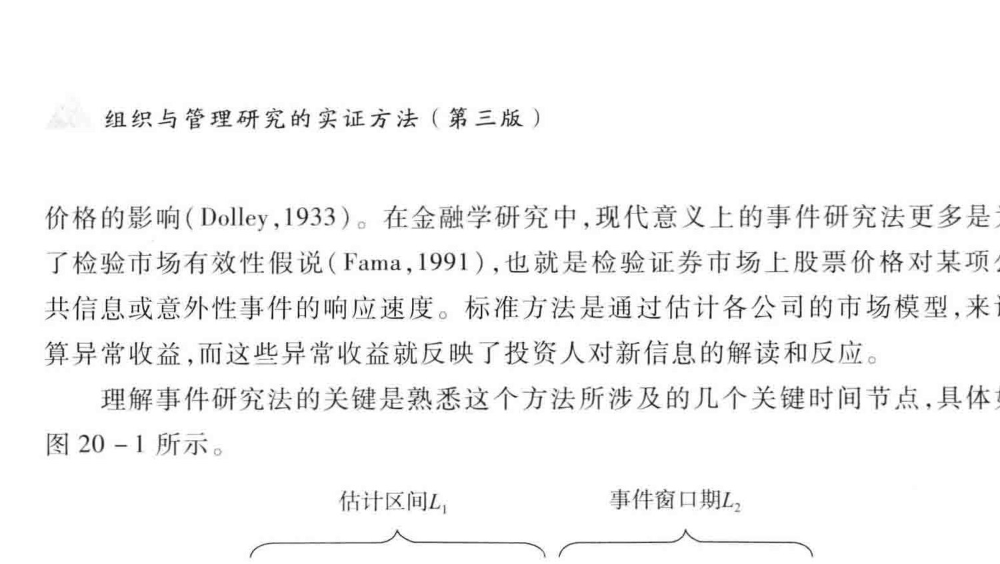
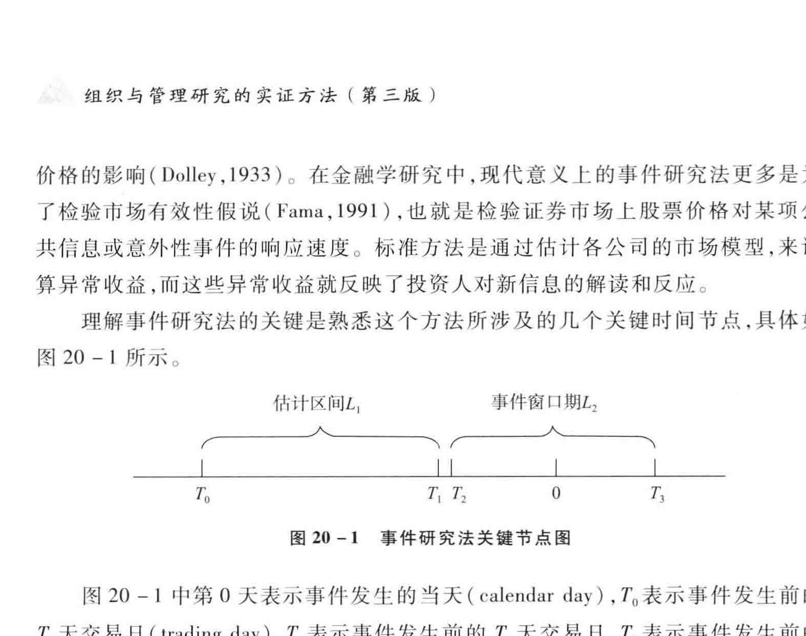
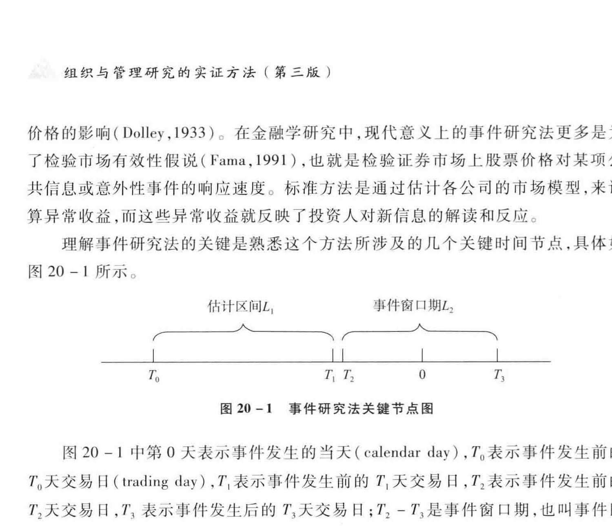
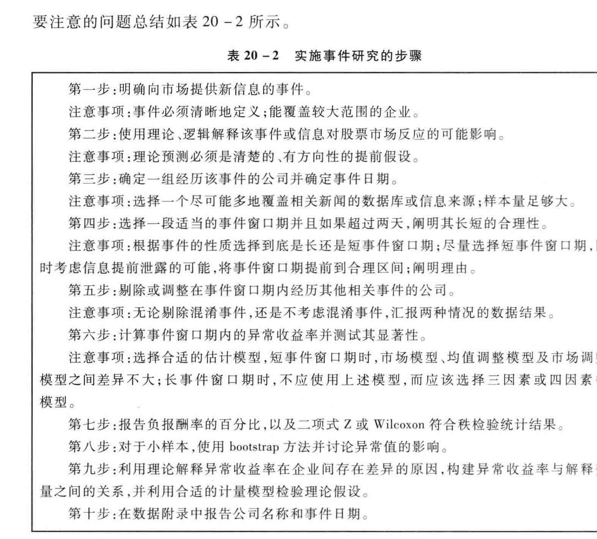
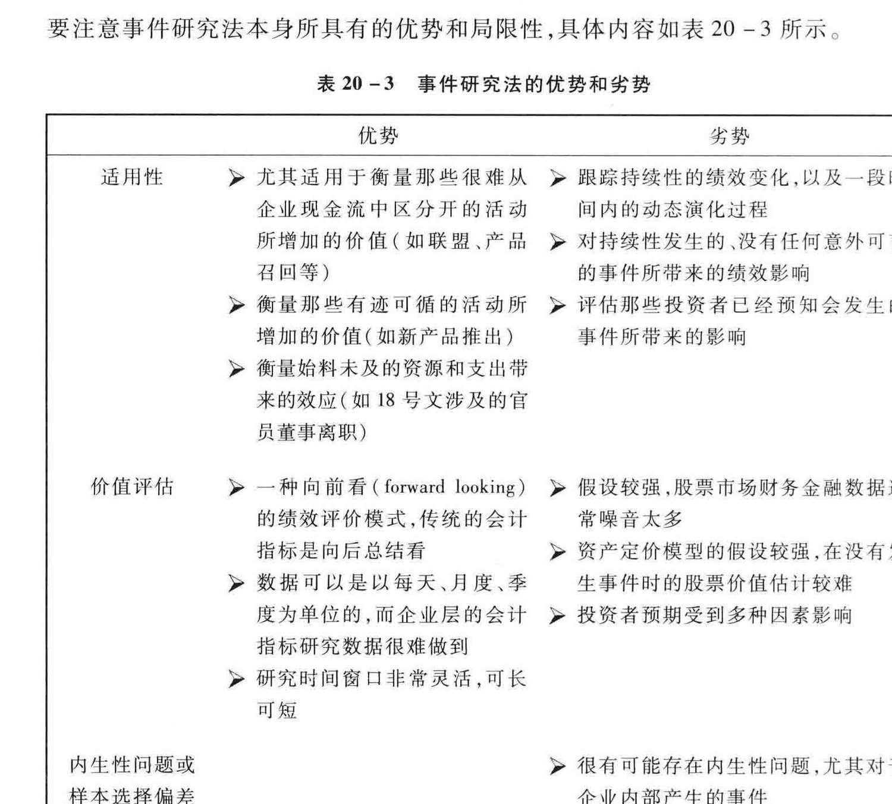
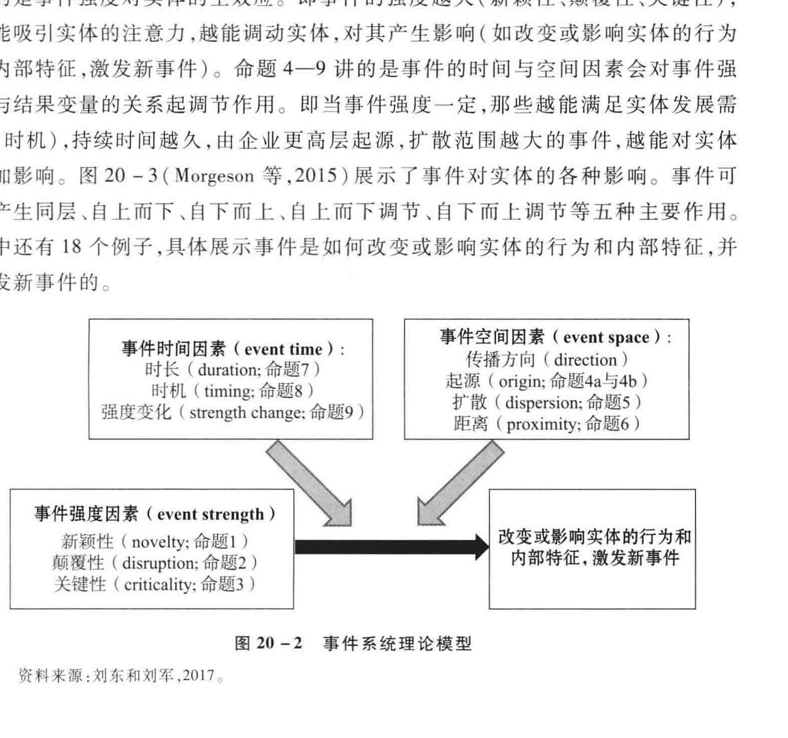
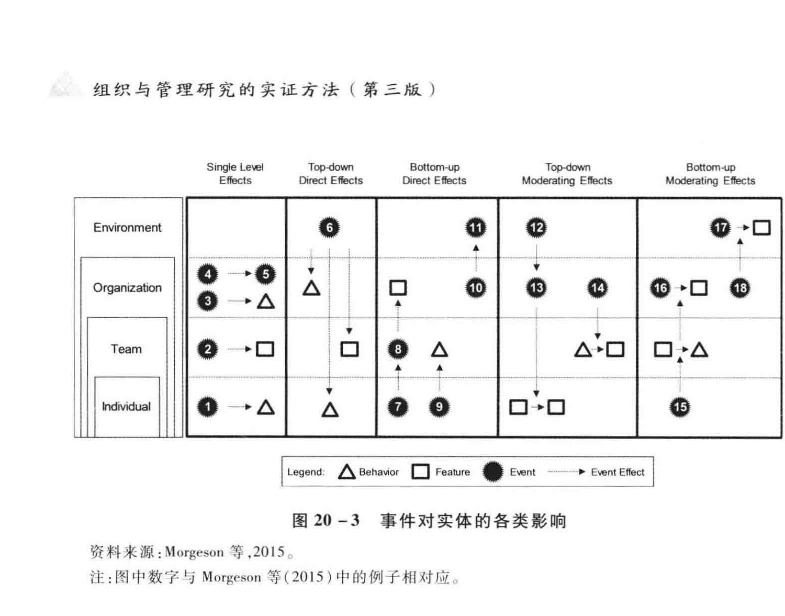

<!-- PDF页 615 -->

## 第20章 事件研究法

HAR LEAKE

杨海滨 ”香港城市大学

刘 KR ”储治亚理工大学: > REA |;20.1 前言与基本概念 |: 20.1.1 什么是事件研究法: i 20.1.2 事件研究法的现状 i: ”20.2 事件研究法原理.方法与设计 |: 20.2.1 基本原理与方法: | 20.2.2 核心假定 i: 20.2.3 研究设计和实施:: 20.3) SARS RIE ESR i | 20.4 ”结语 i: 20.4.1 事件研究法的优势和局限性 | i 20.4.2 ”在中国证券市场使用事件研究法需要注意的问题 i i 20.4.3 ”事件研究法的拓展——事件系统理论核心内涵与应用 1

<!-- PDF页 616 -->

### 20.1 前

ill

与基本概念

### 20.1.1 什么是事件研究法

事件研究方法 (event study) 是一个强大的工具, 它可以帮助我们评估一项事件对企业市场价值所造成的影响。 我们可借助此方法判断、 推定是否存在与意外性事件相关的 “异常 "(abnormal) 股价效应。 所谓 “ 异常 ",是指在一定的事件窗口期(event windows) 内实际股票收益与预期股票收益之间的差值。 其中,实际股票收益是我们观察到的窗口期股票收益,预期股票收益是假设不发生该事件时通过一定的资产定价模型 (asset pricing model) 估计得来。 根据以上数据结果,我们可进而推断该事件的效应及其严重性。 事件研究法已经在经济.会计和人金融领域得到了广泛应用,经常用于衡量某些外生事件或企业政策变化所带来的影响。 在管理学研究中,事件研究法也逐渐开始受到重视,已应用于判断企业内部事件和外部事件的可能影响。 例如,内部事件可能包括更换 CEO、 新产品推出、 进入或退出某市Shy 企业控制权变动.企业裁员、 客户服务变更、 工厂倒闭、 企业并购、 违法行为、 产品召回、 多元化计划战略投资决策及组建合资企业等;外部事件可能涉及重大立法通过、 政府管制或放松管制.行业规定变更、 第三方机构评价、 竞争对手公告或行

在做研究的时候, 我们在大多数情况下依赖传统的基于会计方法的各种指标,如销售量,利润率、 投资收益率等,衡量企业绩效。 然而,传统绩效指标过于先统,无法真实地反映公司的各类活动究况在多大程度上影响了企业最终绩效, 有其不可克服的缺陷。 第一,这些指标都是事后总结, 不是事前看的馆辑设计;第二,属于低频指标,往往是以季度、 年度的形式呈现出来,使我们很难将外部事件与企业政策带来的绩效效应和企业其他活动的绩效效应区分出来;第三,企业人员可以通过各种合法.合理的手段操纵会计利润,从而使得传统的财务指标往往不能反映企业

事件研究法弥补了传统方法的缺陷和不足, 因此受到越来越多地研究者的欢迎。 事件研究法基于有效市场假设,假定市场投资者能有效、 及时地获得突发事件中所包含的各种信息,并以此为依据对企业的估值做出反应。 事件研究法有几个主要的好处:首先,事件研究法依赖不受制于内幕操纵的股价信息;其次, 它允许研究者以一种事前设计的逻辑预测在不发生菜项事件的情况下企业可能的收益,以

<!-- PDF页 617 -->

此区分出某项事件对企业绩效的影响。 股价应反映企业的真实价值,因为股价应当反映未来现金流的贴现价值,并综合所有相关的信息。 相较于基于会计收益的方法,基于股价变动的事件研究能够更为有效地反映因企业政策、 领导层或所有权变动而造成的财务影响。 此外,事件研究法相对容易实施,因为仅仅需要上市公司的名称、 事件日期和股价等数据。

### 20.1.2 事件研究法的现状

为了更好地认识事件研究法在管理学研究中的状况,我们系统地搜集了在中文和英文的主要期刊中发表的使用事件研究法的文献,总结如表20 -1 所示

从表20 -1 中可以看出,国内外的学者在管理学领域已经利用事件研究法开展了卓有成效的研究。 在企业内部发生的事件中, 较多地集中在并购类活动 (如顾露露和 Reed,2011) 联盟类活动 (如 Yang et al.,2015) 及股票相关类活动 (如股利政策,财务违规事件等) (Paruchuri & Misangyi,2015)。 尽管 CEO 离职和继任是一个热门研究话题,但是利用事件研究法的研究在我们有限的样本中较少。 此外, 企业的新产品推出、 经营业务范围的变动等都是研究者习惯用事件研究法进行研究的话题 (如 Brauer & Wiersema,2012;Girotra et al.,2007)。

在企业外部发生的事件中,大致可以分为以下主体:管制机构、 竞争或合作者及第三方机构。 这些主体引发的事件通常都超出企业所能控制的范围,大多属于外生性事件。 比如,中共中央组织部 2013年颁布的 18 号文件 (关于进一步规范党政领导干部在企业兼职 (任职) 问题的意见 (以下简称 *18 号文 ”) (龙小宁和张训常,2016),政府提倡的股权分置改革 (刘玉敏和任广回,2007; 晏艳阳和赵大瑟; 2006),同行业企业的丑闻事件 (沈红波等,2012) 和新产品推出公告 (Fosfuri & Giarratana,2009),以及第三方评级或奖励机构的各种榜单发布,如投资评级 (朱彤和叶静雅,2009),企业社会责任报告 (Shiu & Yang,2017)、 股东财富披露 (Johnson & Ellstrand,2005) 等。

与此同时,我们也通过表20 -1 发现现有文献在运用事件研究法时存在一些值得探讨的问题。 比如,学者们对于事件研究法的研究设计仍然缺乏共识。 首先,原始数据如何搜集与处理。 这体现在研究人员在到底使用多长的事件窗口期上在我们有限的样本中,最长的事件时间窗口是六年,而最短的事件时间窗口是一天。 其次,到底用哪种模型估计预期的股票收益,以便计算超额股票收益,也存在较大分歧。 有的学者使用市场模型估计,有的学者使用不同方法调整的市场模型估计,也有学者使用投资者预期股票收益率。 不同的计算方法,得到不同的预期股

<!-- PDF页 618 -->

GAZ [z‘z—]| 801 ie BY ERY (S661) uesedpeW iy? [0'1-]| re fe AH WEUY (O10z) reuny ai end [o‘r- J} _ 6&% ie AH HL WHTUY C1661) uemenETIE, DH yoy ML [tt-]} iol ie AH BEF He ol IX AE | (LOOT) FeYULYS Y WeURUsTETeYy iy? [e‘e-]] 611 ie AH ir ELE ME (8661) 4S 3 sed fe Se Bt XL GHZ [s*s- ]] 86 Hie BG A GH He Ba AE $3 (9007) ‘77 4@ Yonaqueyyy BO Z [1'1- ]| Ort fe BY GH GH A at AETE GH AEE (O10Z) PAW B WeYyoqsuey oi Sy? [ec- J} 682 iS YG fh 44 BE (F107) ssa B 29NY iO? [HZ'‘HE-]| get iH ye Fat Mh (L661) stzeuty 3 11H Hay? [s*s-]| Gbry ie BY SA GH 5 Eat LACHES | (6661) utaysTaqul Y wer[q3[eH Bay? [s‘s-]] stp fae AH FEES (O10z) ‘77 7 1qqng Gy! [1'I1-]| se AeA | AY [al eh ae A GY ch Bt (9107) ‘77 72 uYyerg By? [1‘0z- J 101 fie BH Hye HOE (TO0T) ansiq 3 uordey SiO? for‘oz- 1]| tol ie 1H BE) 43 (L007) 4eys uorde) MA Z [or‘or- ]| €€r ihe HH fr BACHE A (6007) 111g B TeqAV Cea Loz- “09- ]| Ost ie 3H bh ak de HE EY 0d1 (0107) ueqesoWN B® ULyLY ey? [oe “01- ]| 961 ie AH shh sh Gi 4 (COOT) it SE AI MH BES Ma? [og ‘09- |} 91cl Be BY AY) cael WA HK TL se) fe HG HE Bal 4 (£007) 1h aay 7 (oror- | 161 TM BA HL FE BE FAL (OLOT) =: RAUL Fe TH HE MO Z {t'r-]} est ihe HH Gal HE 1G (1107)P99u te Sie 38 al Me SH SE Bal 4 HEY EMD CHANG 4 Ea el fa Vee | Banya | Pepa Ez

YOO BY 36 Ho Hy 6 ch [it EE

1-07 ¥

<!-- PDF页 619 -->

三版)

Shay? [ EE oor ie HH 3443 OD (€00Z) wllauuey uals

Go [ro]:[E’0]| ore He 天学 O09 (L10Z) puryssory ay Kapsindy

OHA Z Lei 十 EE ine BY pL GH 5 Eat HAZ OF FH} (CLOT) Puensllg -Y 19[Mog-uoxrq

Mit Z Lg B= J le ine TY Ge YG LEY a het EL (6661) [yooypsez BD URW

iO 7 Hy [ste | LO “| wee BE Nha BH HAUL Se A ¥ ACH WG 049 (9007) 38 IAC LL Af 4B

fe Se Bt

Sy 1 [o‘t- ] STL fie BY WHS (S107) M3uestW B® undonred

SH? [o‘t- ] Sp fie BY AA Mit Ar HES Sil (3007) Suey

EZ A te g6€ Pa ea 3680701 2M Od (9002) fT es

Sey 1 lo‘t-]| €0r ie AG HL Be a (0007) 3¥ A! $ep thy fel eA

SH |(L‘e-]*[e‘e-]] vee ira aad SAT A ty & Hal (ZOO) BE LY IY LF [ix

Oy? [s‘s- ]] 98¢ eH WEF EZ LIX (8007) 2) FE I 3B S34

Ti A Bh oy [s*s= ] I€ ie YG WeVLY (OLOZ) £4 Tat EY te fu HE fs)

My! [z‘z-] It ihe | ENGEL E/T aH) AS (P107) H 4h

Wf BASE EY eH

MiG? [s*s- ]) 806 ie AH Ae LY BB 3A Ge (O10) ‘77 12 198427

iy? [0'1-]| o19 fe AH Bae, tt (S107) “77 719 Suey

Ra {o'I-]} 987 ihe BAH THUR (Z10Z) eBnessng B 19usse A

My? [zz-]| oor eH 6 $4 Be HG MZ | (SI0C) werpueyoraey ay uespuryoraey

iy) [t't-] IbZ iH Ea al 34 (7007) 44d

2 [1.1_] hw Spg9 mam th 297 WB Ma et (6002) wosdumg y kalxO

MH?) [oror-jt[s*s-]} Ist he Ba BREYMS (SO0T) wosoW RCRA HG OB lal fa Nee I FRE BA) 2 od 3 [et B 4) ay

CES)

<!-- PDF页 620 -->

ae | (or‘or- i] 9 WAH | MAM OF % | (7107) & ARTE WAS WE My? 8 ie HH fel LAV #5 i A 93! Yt (L107) WS BD 49TNYIS Me? €01:0LT ie A IAG YAS > Bl (1007) “ayes B A3xO iO Z 80b RA A | AS ee a I NY (£661) 72 12 KauoyeW MHZ bz fe HH (a Ly BST (S007) ‘7? 72 wepy Gy Sh ie HG hee LH (9007) $42 FAL Hl OH HH Z 6£6 ine HH ee Lh (LOOT) Fat fF A My SE fae Ww wy ans LSI 5 at Sd WAT EH (PLOT) Fi He I tS iS fe [o't- ] L6 TA lak GA Si SZ HM AY 2 1) 2 (PLO) A) Fe SH ME HN Be =e Ma [s's-]| sci ie BH Mh 站各 81 (OTOT) 5 INA HE Le = SI OP By 1A A HEWE RR MD

MH? [1'1- ]| 961 Tile 364 Wl PF ZH Se I (6007) a8eryog B 91eeA GHZ [tst- ]| 61z ie HH TA THIEL (L102) ‘7? 719 Kary Sy? [1 ‘t- ] I he BH Whe Ly xe Wy (L107) ‘79 12 aefooIn Md [o'r ] 101 ie 3H TH SE Si cael ER SHE (L661) [eysuig B SyoupuaH Hoy [vv- 1]| 91 ie AH Wil 6 2% HH wal (L007) ‘79 19 Eno MO [Ee'£-]| 9% ihe HH Se X7 Sat [RE SE (Z10Z) Purasiar Ay YB onelg Oy? [0'1- ]| zz ie Att Gl iy (6007) stuopatZ y uosuag Moy =] €€ fet SANZ MEG eA (9007) HY HR Ie MX SE Mf RE EW SE AN AY FL X7 ea [to]} 8g0c ihe HH se OD HE (110T) URNqaTeH BD velL

HL BEY IAG OB fal fa OEY HAY HY aol 1B (ot BY st he aM

(2G)

<!-- PDF页 621 -->

三版)

“|

Ae TH SEB LG SMB EOS Se SB AY TY WE GH Sth 26 sk Eb Tie Lp ROE * Bl Rd EB # ER

El he AH St 0006 OSI (1107) ol Buna, sp ine BY BH BE Mf hk Ot a (L107) iau19 SHY 66€ ie AA TES HAY (L107) 3ueX B nS My Z 991 fie BH FEF ANY | (7107) Yeqemyag 2y sopueyourey hi SY Yd pF S09 fie BY GH fal FE 22% Uy 24 Fe (pIOT) oBurIg B [omuy GO Z PLZ fie YH hh he Et (L007) aInos Y Bury Si? OvzI he HH BE EE WH ($007) Puenstlg 3p uosudof Mi? 6SE ie BY GH Ty i WG at FH E) (L10Z) YO ef fie SER (tH) Foy ay? [t‘t- ] 16 he A OG Sh Dat WAT MET (9661) [ed3uS ¥Y syoupueH ihe AG Oh

it Z [0'1-]| vs ine BY hh HF HI (6007) ‘77 12 Kexypog My [o't1-]| €Lz ie AH BMY S ARMY (E107) uueld BOL USM 1 ORO? [dy e'dy €- ]} bss iiie BY Jt 0006 OSI (S007) “72 12 Haqio9 camuaa Gen [Bf oe ‘EY og- ]} zs ihe BY A OU GR at fil A Sal od (S861) eHepuery 2p 19ss0) HO [s*s- ]} 366 AMES ir TE 36 Med tf LA 5 Se (1107) SA Uy A GG A [1°0]| osez ie Bs H 24 1G dd TAO (6007) Hk 4 tu te Ate RY IA Be WOOT ee 918Z | MERU GUAM | YL HE FRE] (6005) PURELY pnysod MAL ([r'o]| gssit ie AH Hee AWE) (p07) ueledo3efey yp ansarq Mt? {t't-] ss Se (at Oh yd Bel LY A ch (S107) 3 lly HA OI Li 9l eH fie TE OL WY EY 2) (PLOT) TB XI A EE

ALR ALG 0 Pa fal fa We Be BAAD 2 ol ful BS 2K sh) ayy

(CES)

<!-- PDF页 622 -->

票收益。 青次,对于事件研究法的解读,不同的学者有不同的观点,众说纷纸。 有些研究对结果的解读,并非建立在有效市场假说的基础上。 很少有研究考虑到在多大程度上投资者对于事件的发生是真正感到意外的和不可预见的 (Warren & Sorescu,2016)。 一个典型的例子是,假设一个企业推出了新产品却引发了投资者的负面反应,这个产品的推出未必就不能增加企业未来的现金流, 有可能投资者的负面反应仅仅是因为对该企业的创新有很高的预期 (Sorescu et al.,2017)。 投资者是否对事件的发生有预期,直接影响了事件的发生能否改变投资者对企业未来从值的判断,也就影响了研究人员对预期股票收益的估计。

而且, 目前的事件实证研究还主要是把事件当成实证研究情境 (empirical context),也就是去比较研究者所关心的某事件出现前后,该事件所造成的结果变量的变化 (如公司业绩和股票价格的变化)。 在事件实证研究中,研究者仍然其少深入考察事件的内在特质,把事件的内在特质作为变量引入模型与研究假设之中。 针对以上问题,Morgeson 等 (2015) 提出了事件系统理论。 该理论指出,通过分析事件属性如事件强度 (事件新颖性、 苏覆性,关键性).事件空间 (事件传播方向.起源、扩散距离)、 事件时间 (事件时长.时机、 变化),研究者可以把事件本身引入模型建立与验证之中,从而更加深入全面地考察事件的作用。 而且研究者还可以通过考察事件相关实体 (如投资者,公司高层、 相关利益者) 对以上事件属性的感知、 评价,更为透彻地解释事件对结果变量产生影响的具体原因与机制。

本文将通过对事件研究法与理论的系统性梳理, 尽可能地帮助研究人员设计和执行事件研究法,保证我们得到的结论有足够的可信度 (MeWilliams & Siegel, 1997)。 事件研究法在管理学研究中的逐渐普及,将会给管理研究和实践带来较大的影响。 因此,我们认为有必要进行这样一个文献的梳理。 接下来,在本章中, 借鉴 McWilliams 和 Siegel(1997)、Soreseu 等 (2017), 以及其他关于事件研究理论与方法 (如事件系统理论 Morgeson et al.,2015) 的探讨,我们将对事件研究法的基本原理.方法实施的一般步骤、 结果的汇报、 对结果的解读及在这些过程中需要注意的问题做一个简要介绍,并为感兴趣的学者提供未来可供研究的一些方向性参考。

### 20.2 事件研究法原理、 方法与设计

### 20.2.1 基本原理与方法

事件研究法可以追溯到 20 世纪 30年代, 其诞生是为了分析股票分割对股票

<!-- PDF页 623 -->

价格的影响 (Dolley,1933)。 在金融学研究中,现代意义上的事件研究法更多是为了检验市场有效性假说 (Fama,1991),也就是检验证券市场上股票价格对某项公共信息或意外性事件的响应速度。 标准方法是通过估计各公司的市场模型,来计算异常收益,而这些异常收益就反映了投资人对新信息的解读和反应。

理解事件研究法的关键是熟悉这个方法所涉及的几个关键时间节点,具体如图20 -1 所示。

fit PRINZ, 事件窗口期 7, AN

| LI | | f, Tt 0 T,

20-1 事件研究法关键节点图

图20 -1 中第0 天表示事件发生的当天 (calendar day), 7, 表示事件发生前的7, 天交易日 (trading day),7 表示事件发生前的 7, 天交易日,7, 表示事件发生前的7, 天交易日,7, 表示事件发生后的 7, 天交易日;7, - 7; 是事件窗口期,也叫事件区间 (我们会在后文详细讲述),在这个区间我们可以计算发生事件时,相关上市公司的股票回报 (真实值);7, -7, 是我们用来估计如果没有发生事件,在事件窗口期上市公司应该有的股票收益,也就是预期股票收益。 事件窗口期的股票真实收益和估计区间的预期股票收益之间的差异,就是异常股票收益 (abnormal return, AR)。 如果在估计检验之后,我们发现异常股票收益显著不等于零,我们就可以说事件对上市公司的股票价值产生了实质性影响。我们可以用公式做更为准确的表述。 公司 i 在第1 天的股价收益率可表示为: Ry = a; +B; Ra + &% (20-1) R, 是公司 i 在第1 天的股价收益率;R,, 是某一市场股票组合在第1 天的指数收益率。 比如,如果随机抽取的对象是沪市 A 股, 取上证指数作为指数收益率的度量; 如为深市 A 股, 取深证成分指数;如为两市 A 股, 则取考虑现金再投资的综合日市场收益率 (等权平均法)。a 是截距项; B 是股票 i 的系统性风险; ©, 是误差项,E(e,,) =0。根据式 (20 -1) 的估算,再使用式 (20 -2),我们可以估算出第 i 家公司每天的异常股票收益: AR, = R, — (a, + bi R,,) (20 -2) JOP a, Al b ese R, — R,,, FA, ESE EE BT TAL CT, -7,),所得

<!-- PDF页 624 -->

出的普通最小二乘参数估计值, 例如,事件发生前的估计期可以是 255 天的交易日,到事件发生前的第46 天为止。 用 255 天的交易日来估计正常收益,可以考虑到市场在一年内可能存在周期的影响。 异常股票收益 (AR) 表示分析师调整了“正常 "收益过程之后,公司所获得的收益。 也就是说,股票的收益率是通过减去实际收益中的预期收益来进行调整,任何显著差异均视为异常或超额股票收益。随后,依据各种统计量判断异常股票收益或累计异常股票收益 (cumulative abnormal return,CAR) 是否显著为零。 如果明显不为霉, 则假设累计异常股票收益反映了意外性事件对这 n 家公司的平均影响。 也就是说,我们可根据异常收益的显著性推断出某事件对公司价值的显著影响。 只要所得出的因某一事件影响的异常股票收益是真实有效的,我们就可以相信事件研究的结论。

### 20.2.2 核心假定

很显然,我们判断平均累计异常股票收益是否明显不为零是建立在一定的理论假设上的。 基本的推断假设是: (1) 市场为有效市场;(2) 事件为意外性事件; (3) 事件窗口期无混淆效应 (confounding effect)。 只有当上述假设有效时,我们才可以使用此方法。 下面我们来看一下这三个假设的具体要求。

1. 有效市场假说

有效市场的假设是事件研究法的应用基础。 只有在有效市场中,股票价格才可能包括投资者可获得的所有相关信息。 在这个假设的基础上,市场上新发生的任何事件或传播的消息,都应该及时地反映到股票价格上。 这个假设延伸出两个重要的概念, 一个是怎样定义事件——只要能带来新信息的事物都可以称之为事件,能给股票价格带来很大影响的事件是重大事件,而不能产生影响的事件可以称之为无关事件; 另一个是事件丛口期,也就是在一定的期限内衡量事件的影响。 如果一个事件产生影响需要很长的窗口期,我们认为,这样的做法实际上违彰了市声效率假设一事件窗口期越长, 越可能反映出市场是无效的,因为不能将新信息产生影响反映到股票价格上。 在某些情况下,可合理地认为投资者需要通过一定的时间才能获得并消化信息。 例如,对于收购事件,一般需要经过相当长的一段时间, 关于潜在收购者的数量和目标评估等信息才会流出 (MeWilliams & Siegel, 1997)。 在这种情况下,学者有必要解释为什么要采取一个较长的事件窗口期。 否则, 则不应当使用事件研究法。

2. 意外性事件

第二个假设是发生的事件必须是意外性事件,投资者不可能在公开市场之外

<!-- PDF页 625 -->

提前得知事件有关消息。 有学者认为,这项假设成立的基础是事件信息必须由第三方独立机构,也就是媒体公布,这样就可以相对有信心地认为异常收益是股票场对新信息产生响应而导致的结果。 然而,很多时候, 尤其是在管理学研究中, 投资者可能通过其他渠道提前知道相关事件的信息。 公司内部相关事件,比如,公司控制权变更,高管变动等信息都可能在正式公布之前已经泄露到市场中。 一个明显的例子是,中国上市公司的大股东存在择机减持股份的现象,而且往往在减持股份之后,市场上开始出现相应上市公司如财务,资金占用等方面的负面消息。 这种信息的泄漏就违反了意外性事件假设,导致我们无法判断投资者是在什么时候获得了事件的相应信息,也就使事件研究法的研究结论值得商枞

3. 没有混淆效应

第三个假设是事件研究法最关键的假设, 即学者可以区分出某一事件与其他事件的对股票价格的真实影响,也就是假设没有其他事件的混漂效应。 如果在事件窗口期同时发生了其他相关的事件,我们就很难区分出某一特定事件的影响。任何能提供新信息的事件都可能在事件窗口期内对股价产生有影响。 显然, 事件窗口期越长,我们越难以控制混淆效应。

### 20.2.3 ”研究设计和实施

接下来,我们讨论事件研究法设计的具体实施,以及其中需要注意的问题,主要涉及以下五个方面:(1) 事件的定义和样本选取;(2) 同时发生或交叉发生事件导致混淆效应的处理;(3) 资产定价模型的选择;(4) 事件效应估计检验;(5) 异常股票收益的解释。

1. 事件的定义和样本选取

事件研究法的第一步就是定义一个包含有新信息而且能够影响企业股票预期收益的事件、 消息或公告。 事件的选择标准包括:首先,尽量选择那些在窗口期内能够影响较大范围内的企业的事件。 其次,事件或消息可以足够明确地定义,以便清晰地界定研究的范围和边界。 例如,政府旨在限制官员在上市公司兼职的文件、自然灾害 (如地震),以及企业上榜第三方独立机构颁布的各种榜单,等等,这些事件都属于可以明确定义的。 而有些事件却不那么容易明确地定义,这些事件往往和企业内部产生的事件有关。 比如,企业进入新市场,这是一个事件,但这个事件指向的具体企业行动却不一定一致,可能是企业发布了新产品,也可能是企业在新的区域建立了子公司,需要进一步明确事件指代的是怎样的具体事件。

<!-- PDF页 626 -->

在界定好事件之后,下一步就是要构建一个有代表性的样本。 此处需要注意的是,我们必须选择一个合适的数据和信息来源, 以保证我们能够尽可能多地搜集到事件的报道,从而可以准确地确定事件被披露的时间, 尤其是首次公开披露的时间。 数据和信息来源的确定通常是非常困难的。 最主要的原因在于,上市公司可以选择正式的新闻披露渠道,比如,公司年报、 美国的道琼斯通讯社 (Dow Jones Newswires)、 中国的 “三报一刊 "(《中国证券报 《上海证券报 《证券时报 X《证券市场周刊》),特定网站 (比如,交易所网站;www. sse. com. en, www. szse. cn; 巨潮资讯: www. cninfo. com. en) 等,也可以选择非正式渠道,有的可能是公司承认的,比如,公司高管在与公众交流过程中释放消息,有的可能是未经公司确定的泄露出来的消息,其

事件首次公开披露时间的准确性能显著地影响事件研究法得出的结论。Sood和 Tellis(2009) 的研究发现, 股票市场对企业新产品推出时的股价反应仅仅是该新产品对企业价值贡献的一小部分,而早期产品研发阶段的信息能够解释产品价值贡献的大部分。 为了克服首次公开披露时间错误导致的结论偏差,学者通常的做法是尽可能寻找有更多新闻报道的数据和信息来源。 例如,美国的 Factiva 数据库和 Lexis-Nexis 数据库提供更多的新闻报道,国内中国知网 (CNKI) 的中国重要报纸全文数据库.万得数据库 (WIND) 和国泰安数据库 (CSMAR) 等大型数据库的新闻报道专门数据板块,也能提供较为全面的新闻数据报道。 目前,更为综合和强大的此类数据库是 RavenPack News Analytics(RavenPack),提供全球 100 多个国家的新闻报道, 并且能提供情感分析和事件数据,此数据库已经包含在沃顿研究数据库(Wharton Research Data Services,WRDS) 的数据平台上。

构建一个有代表性的样本还需要考虑到样本量的问题。 事件研究法的框架中使用的检验统计量是基于大样本量下的正态分布假设。 但在管理学研究,我们通常使用的样本量都比较小,比如, 表20 -1 中,我们选择的相关研究平均样本为690,样本量最小的研究仅包含 6 个样本。 当使用小样本时,我们可以使用不需要基于大样本的正态分布假设自助法 (bootstrap) 来进行估计检验。McWiliiams 和Siegel(1997) 举了下面一个例子。 假设一名研究人员计算了 15 家样本公司在 200天的估计期内 (事件发生之前的一段时期,用于估算参数 a 和 8B) 的日平均异常收益 (AR) 与负收益率 (PRNEG) 的比例,因此,已经产生了 15 套 200 天超额收益。 从这 15 个分布中逐一随机抽取一个超额收益,并计算得出 AR 和 PRNEG。 研究人员重复进行了此过程 3 000 次 (15 x200), 确定了 AR 和 PRNEG 的 bootstrap 分布。AR 和 PRNEG 的显著性检验是基于其概率值与 bootstrap” 分布的比较:

<!-- PDF页 627 -->

概率值 (AR) = (AR, <AR,) 1% 173000 (20 -3)

和

概率值 (PRNEG,) = (PRNEG, > PRNEG,) 的数目 /3000 (20 -4)

尽管这个过程简单.易于操作,但是很多小样本的事件研究文章并没有汇报相JZ AY Lb FS FE All bootstrap 检验。McWiliiams 和 Siegel(1997) 选择的 29 项研究中仪有 4 例公布了与异常收益分布相关的统计数据,没有任何报告提及 bootstrap 检验。我们选择的 77 项研究中也没有任何报告提及如何处理小样本量问题

一定时期内,企业不可能仅仅发生单一事件,而是很有可能同时或间隐很短的时间, 发生多个事件,或发布多个消息。 对于上市公司来说,大多是大型. 横跨多个行业的企业,这种情况更加普遍和频繁。 比如,企业在发布季度或年度财务报告的时候, 同时宣布一项战略举措 (推出新产品、 进行重要联盟或并购),如果事件窗口期恰好涵盖财务报告的发布和战略举措的宣布,那么异常收益的计算实际上可能包含了两项消息带来的股价影响。

显然,控制混淆效应的第一步是选择一个合适的事件窗口期。 大量的管理学研究都是基于长时间的事件窗口期 (MeWilliams & Siegel,1997)。 一方面,长事件窗口期可能带来 Z 检验统计量严重变小,导致对事件显著性的推断出现错误; 男一方面,长事件窗口期很容易带来混淆事件。 这样我们实际上就陷入了两难境地: 事件的窗口期需要足够长——可以捕提到事件的重要影响;但又要足够短——能够排除混淆效应。 一般的建议是,我们根据所研究的事件的性质来选择事件窗口期的长度。 比如, 当可能存在信息泄露的情况时,窗口期应当包括事件公布之前的一段时间, 以便能够捕捉与信息泄露相关的异常股票收益。 当难以确定信息何时真正进入市场时, 则不应采用长窗口期。 同时,我们需要在文章中报告选择事件窗口期的理由,以使读者判断我们的选择是否合理。

我们还可以通过一些方法来控制混淆效应。Foster(1980) 给出了几种选择: (1) 在样本中剔除存在混淆事件的企业; (2) 对遇到相同混淆事件的企业分组, 进行抽样;(3) 人吻除样本中在当天过到混淆事件的企业; (4) 在计算异常股票收益时去除混淆效应的影响。 其中第一种是最常见的控制混淆效应的方法。 例如, 张龙和刘洪 (2006) 为了研究上市公司经营者继任的效应剔除了包含一余和股利公告、并购,设立合资公司等在内的 266 个混淆事件,最终得到 114 个有效样本。

尽管看起来比较有效,删除混淆事件的方法也给我们研究带来了一定偏差

<!-- PDF页 628 -->

一般而言,大公司更有可能发生较多混淆事件,这样导致我们最终保留的样本有可能大多集中在小公司,也就带来了样本选择偏差。 Sorescu 等 (2017) 认为那些采用较短事件窗口期的研究大多直接删除混淆事件,而采用较长事件窗口期的研究很少删除混淆事件。 与之相反,事件窗口期较长的研究,尤其是金融学中的研究,大多假设长事件窗口期内 (六个月到三年不等) 很有可能发生混淆事件,但是这些混少事件对窗口期末的异常股票收益的影响应该服从均值为零的分布,因此不会实质性地影响我们感兴趣的核心事件所产生的平均异常收益。 有意思的是,通过RavenPack 对 3 892 家美国上市公司 2000 一 2013年的 296 346 篇新闻报道的研究, Sorescu 等 (2017) 发现 31 546(约占总数的 10.6%) 篇报道存在混淆事件, a A 天) 也不会对累计异常股票收益率产

质性的影响。

无论剔除混淆事件是否影响最后的估计结果,也不管事件窗口期是短还是长,负责任的研究人员一般可以将两种情况的数据结果都呈现出来,以便能更清楚地进行判断,由此也可以提高我们得出的结论的可信度。

3. 资产定价模型的选择

当事件和样本确定之后,我们就可以选择合适的估计模型来度量异常股票收益。 不论是怎么样的模型,最基本的模型就是估计股票预期收益和真实收益之间

_ P, - E(P.) it Pp,,

式中, AR, 是公司 i 在 1 时期的股票异常收益, P, 是公司 i 在 1 时期股息调整后的股价, Pi 是公司 i 在 1-1 时期股息调整后的股价, R, 是公司 i 在 1:-1 到 1期已实现的股票收益率, E(R,) 是公司 i 在 1-1 到 1 期已实现的股票收益率的期望。

通过式 (20 -5),可以衍生出其他多种较为常用的资产定价模型:

(1) 4 ECR,) = Ry + BC Rg — Ry) 时,就是资产定价的市场模型。

E(R,) 是公司 i 在 1-1 到 1 期已实现的股票收益率的期望, R,, 是市场上流通股票在时间 1 的平均收益率, Rs 是在时间 4 的无风险收益率,B 是利用事件发生前100 天或更多天数回归估计出来的风险因子。 可以看出,我们最初介绍的资产定价模型式 (20 -2) 就是一种基础模型。

(2) 当 E(R,) = Roy 时,就是资产定价的市场调整模型, R,, 是市场上流通股票在时间 t 的平均收益率。

AR = R, - E(R,) (20 -5)

<!-- PDF页 629 -->

(3) 当 E(R,) = R; 时,就是资产定价的均值调整模型, R, 是股票 i 在事件窗口期内的日平均收益率。

Brown 和 Warner(1985) 的研究发现, 在短事件窗口期的研究中,市场模型市场调整模型均值调整模型三种方法对异常股票收益的估计效果是没有显著差别的。 但在长事件窗口期的研究中,上述模型的估计效果较差,需要考虑使用不同的方法估计股票预期收益。 虽然管理学研究中目前使用的大多是短事件窗口期,但是学者在具体的实践中经常会遇到需要研究长事件窗口期的情况。 比如,对于并购类研究,并购行为对企业未来价值的影响,不能完全被并购公告的短事件窗口期所解释,并购整合的整个过程会更加重要,所以需要利用长事件窗口期来研究该问题。 为此,我们介绍长事件窗口期的研究最经典的 Fama-French 模型,而其他方法如 BHARs 和 CTARs 则留待感兴趣的读者在延伸阅读中寻找答案。

当 E(R,) = Ry, + BCR, -Ri)+B(SMB,)+B;(HML,) 时,就是资产定价的Fama-French 模型,就是三因素模型。 与市场模型相比,此处增加了两个风险因子, SMB, 是规模因子,代表着在时间 1; 大市值和小市值资产组合的收益差; HML, 是价值因子,代表着在时间高市净率和低市净率资产组合的收益差。 在 Fama-French模型的基础上,Carhart(1997) 提出了四因素模型,增加了动量因子 UMD,,代表着高现有股票收益的资产组合与低现有股票收益的资产组合之间的差。 四因素模型ECR) = Ry +Bi(R,, - R,)+B,(SMB,)+B;(HML,)+B,(UMD,)。 在利用三因素和四因素模型的时候,我们需要注意这个模型对数据的要求是按照月度来采集数据,同时事件窗口期需要足够长 (如若干年),并且需要非常着慎地在短事件窗口期的研究中使用。

异常股票收益可以是建立在每日或每月的基础上,取决于研究者使用的事件窗口期。 平均而言, 在我们选择的样本中,事件短窗口期 (两个月内) 的研究一般使用事件前的 4 天、 事件发生当天和事件后的 4 天,也就是 9 天作为事件窗口其使用事件前的 4 天,可以尽可能地考虑到消息泄露带来的问题,而使用事件后的 4天,可以考虑到事件信息在不同的投资者之间充分传播。 也有很多研究选择更短的事件窗口期,如事件前的一天到事件发生当天 ([ -1,0]) 或事件前的一天到事件发生后的一天 ([ -1,1])。 短事件窗口的好处是可以更好地规避混淆效应。 而对于长事件窗口 (两个月以上) 的研究一般使用事件前的 257 天到事件后的 192 天,也就是 450 天作为事件窗口期。 当事件窗口期大于 1 天的时候, 我们就利用累计异常股票收益率作为事件或消息产生的股价效应。 计算公式为:

<!-- PDF页 630 -->

Ba

CAR, = > AR, (20 -6)

t-k

式中, CAR, 是公司 i 在 1 时期的股票累计异常股票收益, AR, 是公司 i 在 1 时期 (天) 的股票异常收益,是在 1 之前的天数,! 是在 1 之后的天数。

4. 事件效应估计检验

在得到了事件效应之后,我们需要对事件效应进行估计检验。 我们的原假设是,异常股票收益或累计异常股票收益与零没有显著区别。 通常情况下,学者大多用 1 检验来判断 (陈信元和江峰,2005)。 具体的统计量如下:

考虑了事件日异常股票收益模截面数据之间的相关性,表达式为:

A, = ——— s(A,)其中, A -1y AR ‘ “NA ‘ S(A,) = | 一一和一一,其中,4 = ODA, Ca) 7, -% ni

,为在 1日样本中该日收益率非缺失的股票个数。 如果 4, 满足独立、 同分布和正态分布的条件, 那么在原假设成立的情况下, 待检验的统计量服从 1 分布。7T,、7, 的意义见本章开始的图20 -1。

若不考虑事件日异常股票收益之间的相关性,并且假设事件日异常股票收益满足独立、 同分布有限方差的条件, 根据中心极限定理,在样本量大于 30 时,异常股票收益的均值近似服从正态分布,从而有第二个检验统计量:

t, = A, > s(A,)其中pe A, = wy AR,, 1%, =、2 _ N SX ie CAR - AD 5 =: (4A,) N.

<!-- PDF页 631 -->

以上两个检验方法都是参数检验,我们还需要进行非参数方法检验。 考虑这一检验的原因主要是:其一,it 检验需要满足较强的假设。 比如,异常股票收益是正态分布的,异常股票收益的变异在企业间是相同的,而且异常收益之间没有相关关系。 如果异常收益存在异方差或相关关系,t 检验就可能失效。 其二,事件研究中的检验统计量往往对异常值敏感。 小样本可以放大任何一家公司的收益对样本统计量的影响。 因此,在小样本情况下,显著性的判断会存在问题。 对于异常值, McWilliams 和 Siegel(1997) 的建议是,最好不要直接从样本中删除,而是进行非参数检验并汇报相应的统计量。 这样做,我们不仅能控制异常值,而且可以更严格地进行统计量检验。 主要需要汇报的应包括二项式 Z 统计量,Z, = (PRNEG, - p*)/L(p*) C1 =p?)AN]'”, 测试正负收益比例是否超出了市场模型的预期量,其中,PRNEG,是第1 天负超额收益的比例,p' 是 PRNEG, 的期望值,N 是企业数量。 同时,汇报同时考虑异常收益符号和数量的非参数统计量, 威尔科克森 (Wilcoxon) 符号秩检验(signed rank test),

此外,也可以根据异常股票收益在时间序列数据中相对顺序关系来考察异常股票收益是否显著区别于零 (陈信元和江峰,2005)。 在此方法下,要先将每只股票异常收益时间序列数据转为秩, ky, = rank(AR,,t = -244,...,5),统计量表达式为:

ry the ~ E(k) ] ~ s(k)其中, E(K,) 表示第 i 只股票秩期望值,等于 0.5 7, 40.5, 7 为第 i 只股票在估计期和事件期内非缺失日收益率的个数。

s(k) = [ES..- 243]如果我们用的是累积异常收益的统计检验时,我们也可以使用 Z 统计量。 此时,我们可以使用标准异常收益率 (SAR),用标准差来表示异常股票收益: SAR, = AR,/SD, (20-7)

t, =

和ul 0.5 SD, = 1S; x [1 +1/T(R, - R,.)/D, (Ra - Ra) 1} (20-8)

式中,Si 是公司 i 市场模型的剩余方差,R, 是估计期内市场组合的平均收益率,7 是估计期内的天数。标准异常收益累积 k 天 (事件窗口期), 则各企业的累计异常股票收益

<!-- PDF页 632 -->

(CAR) 是: CAR, = (WD" y SAR, (20 -9)

标准假设认为 CAR, 值是独立的, 且恒等分布。 在此假设下,我们用 CAR; 除以其标准差, 即 [(7-2)A(7-4)]”, 从而将这些值转换为了恒等分布变量。因此,在事件窗口期内,n 家企业的平均标准累计异常收益 (ACAR) 可计算为:

ACAR, = 1/nx1/[(T-2)/(T - Hey CAR,, (20 - 10)

可使用下列检验统计量表达式来评估平均累计异常股票收益是否明显不

为零: Z = ACAR, x n°? (20-11)

如果 Z 明显不为零, 则累计异常股票收益反映了意外性事件对这 nn 家公司的平均影响。

5. 央常股票收益的解释

对异常股票收益的解释应当建立在一定的理论基础之上。 在判断了 CAR 的显著性之后,学者应该通过证明不同公司的收益截面差异与给定理论保持一致来解释异常股票收益 (McWilliams & Siegel,1997)。 比如, 龙小宁等 (2016) 的研究尝试发现 18 号文颁布的政策效应。 从理论出发,作者首先假设政策颁布后,官员兼职企业受到负面消息的冲击,在事件窗口期内其股票累计异常收益率将低于非官员兼职企业。 利用这个意外事件,作者首先验证了 18 号文的颁布确实给官员兼职企业带来了负面冲击,股票累计收益率相对于对照组明显下降。 更进一步,作者利用回归分析进一步建立企业特征和区域制度环境等变量与异常股票收益之间的

### 20.3 事件研究法实践指南:推荐步骤

只有当假设是有效的并且研究设计被正确地执行时,事件研究法才能就某一事件的财务影响提供真实的测量。 事件研究法的关键假设是: (1) 市场为有效市场; (2) 事件为意外性事件;(3) 事件窗口期无混淆效应。 基于我们对国内外相关文章的分析,我们发现管理学研究中事件研究法的运用还存在着一些问题。 为了使从的,结合 MeWilliams 和 Siegel(1997) 的建议,我们把事件研究法的步骤及每一步需

<!-- PDF页 633 -->

要注意的问题总结如表20 -2 所示。表20 -2 实施事件研究的步骤

第一步: 明确向市场提供新信息的事件。

注意事项:事件必须清晰地定义;能覆盖较大范围的企业。

第二步: 使用理论,逻辑解释该事件或信息对股票市场反应的可能影响。

注意事项:理论预测必须是清楚的有方向性的提前假设。

第三步: 确定一组经历该事件的公司并确定事件日期。

注意事项:选择一个尽可能多地覆盖相关新闻的数据库或信息来源; 样本量足够大。

第四步:选择一段适当的事件窗口期并且如果超过两天,阐明其长短的合理性。

注意事项:根据事件的性质选择到底是长还是短事件窗口期;尽量选择短事件窗口期, 同时考虑信息提前泄露的可能,将事件窗口期提前到合理区间; 阐明理由。

第五步: 吻除或调整在事件窗口期内经历其他相关事件的公司。

注意事项:无论剔除混淆事件,还是不考虑混淆事件,汇报两种情况的数据结果。

第六步:计算事件窗口期内的异常收益率并测试其显著性。

注意事项:选择合适的估计模型, 短事件窗口期时,市场模型均值调整模型及市场调整模型之间差异不大;长事件窗口期时,不应使用上述模型,而应该选择三因素或四因素等模型。

第七步:报告负报酬率的百分比,以及二项式 Z BK Wilcoxon 符合秩检验统计结果。

第八步:对于小样本,使用 bootstrap 方法并讨论异常值的影响。

第九步:利用理论解释异常收益率在企业间存在差异的原因,构建异常收益率与解释变量之间的关系,并利用合适的计量模型检验理论假设。

第十步:在数据附录中报告公司名称和事件日期。

第一步是确定什么时候使用事件研究方法是合适的。 当某一事件有可能会产生财务影响,无法被市场预见,并向市场提供新的信息时,使用该方法是合适的

第二步从理论出发曾述新发生事件和新信息对市场股票价格的影响。 这一步包括基于所使用的理论对影响的方向性进行提前预测。

第三步是确定事件的日期及经历该事件的一组公司。

第四步是选择适当的事件窗口期。 对于那些显然未被预见到并于确定的日期发生的事件,窗口期应该是非常短的,1 天到 2 天。 对于某一意外性事件,市场能够就该信息进行交易的首日即是事件日本身。 例如,大地震就是意外性事件。 大地震的消息很快就会被公布出来,而且如果该消息被断定为相关信息,那么能够巴料到市场会很快做出反应。 这一事件的窗口期将是 1 天 (假设这是一个交易日)。大多数新闻都会在其公布之前被提供给指定的信息披露机构。 因此,一些投资者可能会在确定事件公开宣布之前就收到了与之相关的信息。 对于该类事件,交易

<!-- PDF页 634 -->

可能会发生在事件日之前。 由于我们可能无法确定消息是何时发布的,所以标准的事件窗口期是 2 天,在其是交易日的情况下, 即事件当日和前一日。 如果某一窗口期超过了标准的 2 天时间, 那么其应当是合理的,比如,我们谈到的并购事件影响,并非一天就可能产生影响。 在这种情况下,将合并之前的规划期包括在内的窗口期可能是合理的。 尽管如此,我们还是应该将该合理的解释包括在文章中,包括对所选时间长度的解释。

第五步是如果在选择的窗口期内发生了在财务方面与某公司相关的其他事件, 则从样本中殊除该公司。 相关事件包括意外分红或收益公告.收购投标、 合并谈判.关键管理人员变动重组合资、 重大合同中标、 重大劳动纠纷、 重大责任诉讼和重大新产品发布等。 当我们不能确定信息是何时透露的时候,同时能有足够的证据表明长窗口期的合理性时,可以使用技术手段来控制混淆事件。

第六步是需要使用标准的方法,比如本章的式 (20 -5) 和式 (20 -6) 计算事件窗口期内积累的日 (累积) 异常收益率,并估计异常收益率的显著性。

第七步是报告负报酬率的百分比,以及二项式 Z 或威尔科克森测试统计数据或两者都报告。

第八步是如果样本使用的公司少于 30 家, 则要包含额外的信息。 这些人额外的言息包括对异常值影响的识别和测量及使用 bootstrap 方法的结果。

第九步是概述解释异常收益率中企业间变异的理论原因,并用计量模型测试该理论关系。

第十步是在数据附录中报告公司名称和事件日期,以便复制和扩展。

在沃顿研究数据库中包含一个事件研究法模块 (EVENTUS),如果是研究某个事件对美国公司的影响,可以按照 EVENTUS 的模板,输入所关注的公司代码和事件窗口期,选择资产定价模型后,系统会自动算出该时间段内各企业的累计异常股票收益。 将该累计异常股票收益数值并入公司的其他数据,就可以用回归的方法来分析某个事件对公司市场估值的影响。

### 20.4 ”结语

### 20.4.1 事件研究法的优势和局限性

如前所述,事件研究法能很好地捕捉到公司事件,消息发布及市场事件等引发市场对企业价值的反映,也能较好地弥补传统以财务会计指标衡量企业绩效的缺

<!-- PDF页 635 -->

陷和不足,更能区分开不同事件对企业最终绩效的不同影响。 尽管如此,我们还需要注意事件研究法本身所具有的优势和局限性,具体内容如表20 -3 所示。

表20 -3 事件研究法的优势和劣势

优势劣势适用性 D> 尤其适用于衡量那些很难从 ”> 跟踪持续性的绩效变化,以及一段时企业现金流中区分开的活动间内的动态演化过程所增加的价值 (如联盟、 产品 > 对持续性发生的,没有任何意外可言召回等) 的事件所带来的绩效影响> 衡量那些有迹可循的活动所 > 评估那些投资者已经预知会发生的增加的价值 (如新产品推出) 事件所带来的影响> 衡量始料未及的资源和支出带来的效应 (如 18 号文涉及的官员董事离职)

价值评估 > 一种向前看 (forward looking) > 假设较强,股票市场财务金融数据通的绩效评价模式,传统的会计 ” 常噪音太多指标是向后总结看 > 资产定价模型的假设较强, 在没有发> 数据可以是以每天、 月度、 季 ” 生事件时的股票价值估计较难度为单位的,而企业层的会计 > 投资者预期受到多种因素影响

指标研究数据很难做到> 研究时间窗口非常灵活, 可长可短内生性问题或 D> 很有可能存在内生性问题,尤其对于样本选择偏差企业内部产生的事件因果推断 > 很难, 只有在事件完全是在投资者的意料之外才有可能,但通常无法验证事件是否完全意外

资料来源: 修改自 Sorescu 等,2017。

对于事件研究法的作用, 它更多反映地是市场上投资者对事件涉及的上市公司未来价值的一种预期,这种预期又是如何受到了意外事件或新信息的影响,而不是我们学者用来评估某项事件对企业本身绩效或价值的影响。Warren 和 Sorescu (2016) 的研究发现, 从 1990年开始,学者发现的新产品公告与企业累计异常股票收益之间的关系越来越弱, 侧面证明投资者可能有越来越多的渠道评价企业发生

<!-- PDF页 636 -->

的事件,也促使我们对事件研究法有更多新的认识。 正如 Sorescu 等 (2017) 所说,更准确的表述是从 “事件 X 对企业价值有显著影响 "转变成 “投资者对事件 X 有正向 (或负向) 的反应 ”。

### 20.4.2 ”在中国证券市场使用事件研究法需要注意的问题

作为转型经济体, 中国的证券市场仍处于快速发展的阶段。 中国证券市场的交易环境也决定了其在很多方面表现出与国外成熟证券市场的不同之处。 陈汉文和陈向民 (2002) 对中国市场上股票价格的形成有较大影响的因素做了精炼的总结,包括市场结构的制度性差异 (如针对个股的涨跌幅限定、 不允许卖空买空交易、较大程度的依托计算机报合指令的平台来完成交易),参与主体的差异性 (机构投资者与中、 小投资者在市场上的行为选择所依据的理念存在较大差异,所以二者在市场参与群体中的比例会对价格的信息表现过程产生不同的影响) 公司的性质与行为差异 (限制性股权结构是中国上市公司的主要特点)。 从更广的角度出发,中国上市公司股权结构的多样性及公司行为因此受到的影响直接作用于价格的形成过程,比如公司对投资者利益的重视程度,甚至某些不规范的公司管理层的行为也会通过事件的形式在市场上表现出来。 此外,我国上市公司在上海、 深圳两个分割的证券交易所上市交易。 发展中国家的股票市场还存在着 80% 以上的股票市场跟随大盘同涨同跌的问题 (Morck et al.,2000)。

这些不同的特点会影响我们在中国证券市场使用事件研究法。 比如,如果我们研究政府政策对企业价值的影响,我们会发现中国政府的政策在较短时间内可能出现较多的变化,也会有其他很多相关的政策颁布出台。 这给我们选择合适的事件窗口期带来了较大的挑战。 再比如,中国证券市场的特点也会影响我们选择资产定价模型。 陈汉文和陈向民 (2002) 的研究发现, 市场模型在中国证券市场的研究中更容易拒绝原假设的倾向,而均值调整模型有较好的表现。 陈信元和江峰(2005) 的研究则表明,在中国证券市场上,市场调整模型检验力稍弱于市场模型,但均值调整模型的优势并不明显,市场模型应该作为事件研究法的资产定价模型基础。 研究人员仍需要结合自己研究问题和使用样本的特点选择合适的估计模型。

总之,事件研究法是我们认识、 寻找客观规律的一个强有力的工具。 无论是外部事件还是企业内部产生的事件,我们都可以推测出该事件或决策对投资者预期的影响,进而判断其对公司价值的影响。 因此,在精心设计并且良好地执行了科学的步骤之后,事件研究法就能够帮我们更好地评估意外事件.管理决策的效应,从

<!-- PDF页 637 -->

而更好地实施管理干预。 中国证券市场的复杂性,给学者使用事件研究法带来了诸多挑战,但也带来了更多的发现规律的大好机遇。 接下来我们将详细介绍事件研究领域的一个新理论.新方法,事件系统理论。 区别于前人事件研究,该理论详细阐明了如何把事件本质特征 (强度、 空间、 时间) 引入到研究模型和假设之中,对未来事件定量与质性研究的发展很有启发。

### 20.4.3 事件研究法的拓展——事件系统理论核心内涵与应用

Johns(2006) 关于情境研究的论文,具有划时代的意义,激发了情境研究的大量涌现。 学者们经常引用 Johns (2006) 来论述为什么要考虑情境,如何开展情境研究。 该文章毫无上攻念地拿下了 2016年 AMR 最佳论文奖。Johns (2017) 在一篇系统回顾、 反思 Johns (2006) 发表以来的情境研究的文章中,指出前人对情境研究的一个重要不足就是没有在理论构建中,充分考虑实体所处的情境中,事件所发挥的重要作用。 而情境中的事件已被认为是区别于实体 (如个人、 团队和组织) 内部特征的一个新研究视角 (Dinh et al.,2014)。Johns (2017) 特别指出事件系统理论(event system theory; Morgeson et al.,2015) 是研究事件的有效理论视角,称赞该理论如瑞士军刀般了,深刻,全面地揭示了事件的多个重要属性,以及它们如何对实体施加影响的机理与过程。

1. 事件系统理论的核心内涵

具体来讲, 事件系统理论首先界定了什么是事件。 事件是情境中那些分离的、 鲜明的,由多个实体间构成的相互作用 (如某员工接到猎头公司的挖人电话、多个公司合并成立新商业实体、 创业团队收到了天使投资者的资助)。 事件具有时空属性,存在于特定的时间与空间之中 (如 2017年美国管理学会年会是个事件,其于 2017年 8月 4日至 8月 8日发生于亚特兰大)。 因为事件由多个实体构成,对于事件中的任一实体,事件都是情境,都会对实体产生影响。 那么,什么不是事件呢? 实体内部特征 (如人的性格与情绪、 团队的人口特征、 企业组织文化) 不是事件,实体内部特征的变化 (如入的情绪变化、 性格改变) 也不是事件。区别于实体所经历的事件 (仅存在于特定的时空之中),实体的内部特征随着时间的流逝空间的变化,也许会在强度上发生变化,但它总是存在于实体之中,而不会彻底消失。

《孙爱兵法月战) 指出天时、 地利、 人和,三者不得, 虽胜有殊 ”。 与 《孙爱兵

D 注: 瑞士军刀以做工精良、 功能多样强大而著称

<!-- PDF页 638 -->

法) 相得益彰, 事件系统理论的精骨就是,成大事者,必得天时、 地利、 人和。“ 天时地利、 人和 "就是事件系统理论中所论述的事件时间 (事件时机、 时长等因素)、空间 (事件起源纵向与横向扩散范围.实体与事件的距离等因素),强度属性 (新Bite.颠覆性.关键性)(Morgeson et al.,2015)。 之所以用事件强度 (新颖性、 颠覆性,关键性) 来代表 "人和 ”,是因为 * 人和 ”体现在事件有多大可能性去吸引相关实体 (如入) 的注意力,并对其产生影响。 事件强度、 时间、 空间构成一个探究事件内在属性的三维系统。 在进行事件研究中,如想衡量事件的冲击力, 应充分考虑事件时间,空间,强度三个主要因素 (见图20 -2) © 首先,图20 -2 模型的命题 1 一 3讲的是事件强度对实体的主效应。 即事件的强度越大 (新颖性、 颠覆性、 关键性),越能吸引实体的注意力, 越能调动实体,对其产生影响 (如改变或影响实体的行为和内部特征,激发新事件)。 命题 4 一 9 讲的是事件的时间与空间因素会对事件强度与结果变量的关系起调节作用。 即当事件强度一定, 那些越能满足实体发展需求 (时机),持续时间越久, 由企业更高层起源,扩散范围越大的事件, 越能对实体施加影响。 图20 -3(Morgeson 等,2015) 展示了事件对实体的各种影响。 事件可以产生同层、 自上而下、 自下而上、 自上而下调节、 自下而上调节等五种主要作用。图中还有 18 个例子,具体展示事件是如何改变或影响实体的行为和内部特征,并激发新事件的。

事件空间因素 (event space):

事件时间因素 (event time):时长 (duration; 命题 7)时机 (timing: 命题 8)

传播方向 (direction)起源 (origin; 命题 4a 与 4b)扩散 (dispersion; 命题 5)

强度变化 (strength change: 命题 9)

事件强度因素 (event strength

新颖性 (novelty; 命题 1) >, 改变或影响实体的行为和颠覆性 (disruption; 命题 2) 内部特征, 激发新事件KEE (criticality; 命题 3)

距离 (proximity; 命题 6)

图20 -2 事件系统理论模型资料来源: 刘东和刘军,2017

D 注:事件系统理论强调,虽然同时考虑时间,空间.强度三个因素,能够建立更为完善.全面的事件研究模型,但研究者完全可以根据自己的研究重点.数据特点,只关注三因素中的一个或两个

<!-- PDF页 639 -->

Single Level Top-down Bottom-up Top-down Bottom-up Effects Direct Effects Direct Effects Moderating Effects Moderating Effects = 0 o| @ o-o - +! | l u | Organization r4 | A | a fio} bd ® odin ad tem || @ -O ojo Aa ao] OA

[tegen AX Behavior DD Feature oO Event > Event Effect |

20-3 事件对实体的各类影响

资料来源:Morgeson 等,2015注: 图中数字与 Morgeson 等 (2015) 中的例子相对应

2. 相关研究

组织研究者对实体的内在特征关注已入,如微观层面的个人大五人格理论(big five personality; McCrae & John,1992) 中观层面的团队断裂带理论 (faultline theory;Lau & Murnighan,1998),宏观层面的高阶理论 (upper echelons theory; Hambrick & Mason,1984;Hambrick,2007)。 近年来,事件研究已开始兴起。 但事件主要是被当作实证设计 (empirical design) 的一种。 研究者们主要是采用双重差分估计方法 (Difference in Difference, DID; Abadie,2005),以某事件为研究背景,比较该事件出现前后, 某变量的数值变动 (如受到事件冲击的公司的股票价格的波动) (Faccio & Parsley,2009;Sun et al.,2015)。 所以,这些研究其实只是把事件考虑成出现或者不出现, 而没有如事件系统理论那样,去深入探查事件的强度空间、 时间属性是如何对相关实体产生影响的。

事件系统理论已经被各个层面的实证研究所支持。 在中微观层面,ZellmerBruhn (2003) 证明中断性事件 (interruptive events) 有益于知识传递,进而促进新的程序与规则的建立。 在一项关于团队中所发生的事件研究中,Morgeson(2005) 发现团队领导可以在一些特定的事件情境下,通过主动干预来提高团队的表现,尤其是当事件具备很强的颠覆性 (disruptive) 时。Morgeson 和 DeRue (2006) 4 #0 fii WHE事件的关键性 (criticality) 与时长 (duration) 决定了此类事件能多大程度干扰团队的正常运作。 宏观事件研究中,Tilesik 和 Marquis(2013) 验证了事件强度的重要理

<!-- PDF页 640 -->

事件区分为高 (大于 50 亿美元的财产损失)、 中 (10 一 50 亿美元的财产损失) AR (小于 10 亿美元的财产损失) 三类具有不同强度的事件。 进而他们发现, 高等强度的自然灾害事件会使得公司不愿意做慈善捐赠,中等强度的自然灾害事件对公司捐赠表现没有影响,而低等强度的自然灾害事件对公司捐赠有促进作用。 支持事件系统理论的观点,Tilcsik 和 Marquis(2013) 认为学者们应把事件作为连续变量引入模型,而不应简单地把事件看作二分变量 (出现或不出现)。 当把自然灾害事件处理为二分变量时,他们将发现不了不同强度的自然灾害事件对公司捐赠的不同影响。Dai et al., (2013) 验证了研究事件空间与时间属性的重要性。 他们研究政治冲突事件对日本海外公司 (25 个国家的 670 个日本海外子公司) 业绩的影响。日本海外公司对这些事件的动态经历 (随着时间发展,是否距离事件越近) 和静态经历 (蚌否位于事件区域) 与这些公司撤资的可能性呈正相关。 他们还发现,经历这些事件时,如果日本海外公司与其他来自日本的公司更加紧密地聚集于政治冲突事件发生的区域,此类日本海外公司更不容易撤资。

学者们可以依照图20 -3 所展示事件作用模式,把事件系统理论作为理论基础,建构各种事件实证模型。? 下面,我们概述几个典型的事件研究建模思路。

(1) 事件属性的主效应 (main effects) 及其与实体内部特征的交互作用 (interactive effect) 或调节作用 (moderation effect)。 研究者可以参照 Morgeson (2005)、Morgeson 和 DeRue (2006)、Dai 等 (2013)、Tilcsik 和 Marquis (2013), 考察事件时间、 空间,强度三个属性之中的一个或多个,以把事件量化成连续变量,进而构建模型检验事件对结果变量的直接影响。 事件系统理论强调, 在事件研究中,我们可以考虑实体内在特征与经历的事件的交互作用, 即综合理论建构范式 (integrative theory-building approach)。 比如,我们可以考察个人所经历的事件如何与其内在性格一起交互去预测个人职业生涯发展轨迹。 当经历情绪事件时,情绪稳定度 (emotional stability) 低的人会更加受到情绪事件的影响。 组织治理结构特征如何调节组织所经历的事件与组织表现二者之间的关系。 董事会成员职业背景的多样性也许会加强创新型事件对企业创新表现的影响。

(2) 事件强度三维度 (新颖性、 颠覆性.关键性) 的主效应与交互作用。 研究者

D 参见刘东和刘军 (2017) 对事件系统理论所带来的科研与实践机会的详细论述。 也可以通过链接(http://pan. baidu. com/s/1bpeVNY3 密码: 4cms) 下载相关学习资料 (如反映事件强度的新颖性、 颠覆性、 关键性量表)

<!-- PDF页 641 -->

可以先明确所要研究的事件。 之后,进一步探查该类事件的三个不同强度属性 (新颖性颠覆性、 关键性) 是否会与不同的结果变量存在关系,或对同一个结果变量有不同影响。 比如, 当研究公司并购事件时,研究者可以构建并购事件新颖性、 苏覆性,关键性三个变量,考察它们对公司表现的不同影响。

(3) 事件强度 (通过新颖性、 颠覆性,关键性,对事件进行量化;或者创造一个总强度分值) 与事件时间或空间相关因素的交互作用。 当我们研究团队内部关系冲突事件对团队成员创造力的影响时,我们可以探究二者关系是否受到冲突事件的空间起源及时机的调节。 起源于团队高层的冲突事件也许会对团队成员的创造力影响更大。 当团队处于研发的不同阶段时,团队内部关系冲突事件对团队成员创造力的影响强弱甚至方向会有所不同。

(4) 多个事件的主效应与交互作用。 实体有的时候会同时受到多个事件的影响。 如员工的组织公民行为,也许会同时受到公司层面.团队层面、 个人层面所发生的多个事件的影响。 研究者可以首先识别出与员工组织公民行为相关的事件(如公司社会公益事件),接着在事件强度、 时间、 空间的某些属性上,把事件作为连续变量引入模型。 在模型中,研究者可以探查多个事件如何通过不同的中介机制对结果变量产生影响,以及多个变量之间如何相互促进或抑制对结果变量的影响。

(5) 事件案例研究。 事件系统理论为事件案例研究提供了扎实、 系统的分析框架。 研究者可以从事件强度、 空间、 时间等角度,搜集质性数据,深入考察事件属性的哪些因素会对实体产生影响? 产生了什么影响?是通过什么过程机制对相关实体产生影响的? 什么因素使得某事件变得新颖、 颠履.关键? 对于以上问题的研究,可以帮助企业、 团队个人更好的发现事件.评估事件,应对事件;甚至通过主动创造出事件,来实现企业发展的目标。

<!-- PDF页 642 -->

### 参考文献

Abadie, A. (2005). Semiparametric difference-in-differences estimators. The Review of Economic Studies, 72(1), 1—19.

Brauer, M. F. & Wiersema, M. F. (2012). Industry divestiture waves: How a firm’s position influences investor returns, Academy of Management Journal, 55 (6), 1472—1492.

Brown, S.J. & Warmer, J. B. (1985). Using daily stock return; The case of event studies. Journal of Financial Economics, 14(3),3—31.

Carhart, M. M. (1997). On persistence in mutual fund performance. The Journal of Finance,52(1),57—82. Dai, L., Eden, L. & Beamish, P. W. (2013). Place, space, and geographical exposure; Foreign subsidiary survival in conflict zones. Journal of International Busi-

ness Studies,44(6),554—578.

Dolley, J. C. (1933). Characteristics and procedure of common stock split-ups. Harvard Business Review, 11(3), 316—326.

Faccio, M. & Parsley, D.C. (2009). Sudden deaths; Taking stock of geographic ties. Journal of Financial and Quantitative Analysis, 44(03),683—718.

Fama, E.F. (1991). Efficient capital markets; II. Journal of Finance, 46(5),1575—1617.

Fosfuri, A. & Giarratana, M.S. (2009). Masters of war; Rivals’ product innovation and new advertising in mature product markets. Management Science, 55 (2), 181— 191.

Foster. G. (1980). Accounting policy decisions and capital market research. Journal of Accounting and Economics, 2(1),29—62.

Girotra, K., Terwiesch, C. & Ulrich, K.T. (2007). Val-

uing R&D projects

ina portfolio; Evidence from the

pharmaceutical industry. Management Science, 53(9),

1452—1466.

Hambrick, D. C. (2007). Upper echelons theory: An update. Academy of Management Review, 32(2), 334— 343.

Hambrick, D. & Mason, P. (1984). Upper echelons; The organization as a reflection of its top managers. Academy of Management Review,9(2), 193—206.

Johns, G. (2006). The essential impact of context on organizational behavior. Academy of Management Review,31 (2),386—408.

Johns, G. (2017). Reflections on the 2016 Decade Award: Incorporating context in organizational research. Academy of Management Review,42(4),577—595.

Johnson, J. L., Ellstrand, A. E., Dalton, D. R. & Dalton, C. M. (2005). The influence of the financial press on stockholder wealth; The case of corporate governance. Strategic Management Journal, 26 (5),461— 471.

Lau, D.C. & Murnighan, J. K. (1998). Demographic di-

versity and faultlines; The compositional dynamics of

organizational groups. Academy of Management Review, 23(2),325—340.

McCrae, RR. & John, P.O. (1992). An introduction to the five-factor model and its applications. Journal of Personality,60(2),175—215.

MeWilliams, A. & Siegel, D. (1997). Event studies in management research; Theoretical and empirical issues. Academy of Management Journal, 40(3),626—657.

Morck, R., Bernard, Y. & Yu, W. (2000). The information content of stock markets; Why do emerging markets have synchronous stock price movements. Journal of Financial Economics, 58(1 —2),215—260.

Morgeson, F. P. (2005). The external leadership of self-

managing teams; intervening in the context of novel

<!-- PDF页 643 -->

and disruptive events. Journal of Applied Psychology, 90(3),497—S08.

Morgeson, F.P. & DeRue, D.S. (2006). Event criticality, urgency, and duration; Understanding how events disrupt teams and influence team leader intervention, The Leadership Quarterly 17 (3),271—287.

Morgeson, F.P., Mitchell, T.R. & Liu, D. (2015). Event system theory; An event-oriented approach to the organizational sciences. Academy of Management Review, 40 (4),515—537.

Paruchuri, S. & Misangyi, V. F. (2015). Investor perceptions of financial misconduct; The heterogeneous contamination of bystander firms. Academy of Management Journal,58(1),169—194.

Shen, W. & Cannella, Jr. (2003). Will succession planning increase shareholder wealth? Evidence from investor reactions to relay CEO successions. Strategic Management Journal, 24(2),191—198.

Shiu, Y.M. & Yang, S. L. (2017). Does engagement in corporate social responsibility provide strategic insurance-like effects? Strategic Management Journal, 38 (2),455—470.

Sorescu, A., Warren, N.L. & Ertekin, L. (2017). Event study methodology in the marketing literature; an overview. Journal of the Academy of Marketing Science, 45 (2),186—207.

Sun, P., Mellahi, K., Wright, M. & Xu, H. (2015). Political tie heterogeneity and the impact of adverse shocks on firm value. Journal of Management Studies, 52(8),1036—1063.

Tilesik, A. & Marquis, C. (2013). Punctuated generosity

how mega-events and natural disasters affect corporate

624

philanthropy in US communities. Administrative Science Quarterly, 58(1),111—148.

Warren, N. & Sorescu, A. (2016). Interpreting the stock returns to new product announcements; How the past shapes investors’ expectations of the future. Journal of Marketing Research, 54(5),799—815.

Yang, H., Zheng, Y. & Zaheer, A. (2015). Asymmetric learning capabilities and stock market returns. Academy of Management Journal 58 (2),356—374.

Zellmer-Bruhn, M. E. (2003). Interruptive events and team knowledge acquisition. Management Science 49, 514— 528.

陈汉文和陈向民 (2002). 证券价格的事件性反应. 经济研究,1(4),40 一 47.

陈信元和江峰 (2005). 事件模拟与非正常收益模型的检WH. 会计研究,7,25 一 31.

刘东和刘军 (2017). 事件系统理论原理及其在管理科研与实践中的应用分析. 管理学季刊,2,64 一 68.

刘玉敏和任广乾 (2007). 股权分置改革的效率及其影响因素.中国工业经济, (7),103 一 110.

龙小宁, 张训常和杨进 (2016). 转轨背景下定员兼职规制的经济效应. 中国工业经济, (7),40 一 56.

(BEBE A Reed, R. (2011). 中国企业海外并购失败了吗?经济研究,7,116 一 129.

沈红波, 谢越和陈峥嵘 (2012). 企业的环境保护,社会责任及其市场效应. 中国工业经济,1,141 一 151.

胺艳阳和赵大玮 (2006). 我国股权分管改革中内幕交易的实证研究. 金融研究,(4),101 一 108.

朱彤和叶静雅 (2009). 投资评级发布日的机构投资者行为与证券的异常收益——来自上海证券市场的证据. 金融研究,3,154 一 170.

