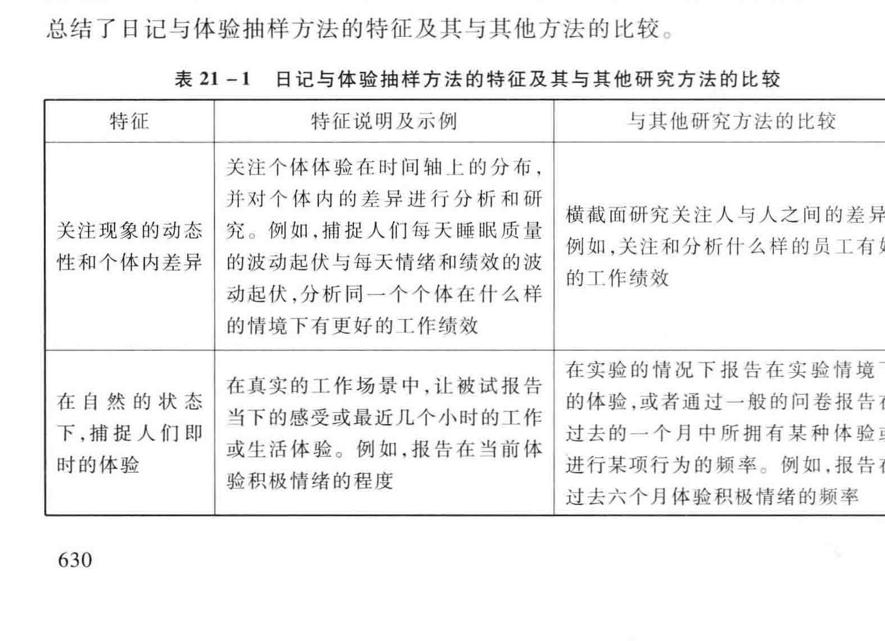
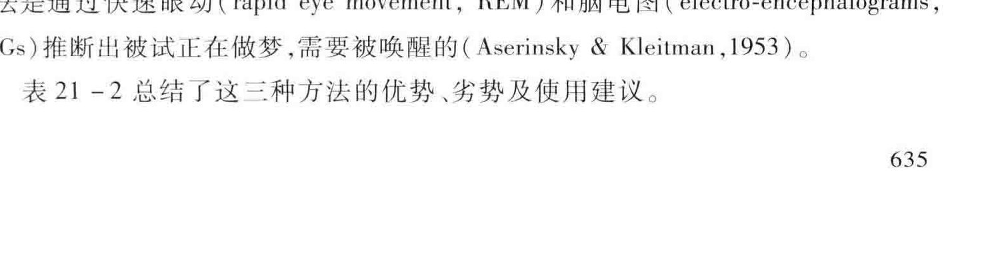
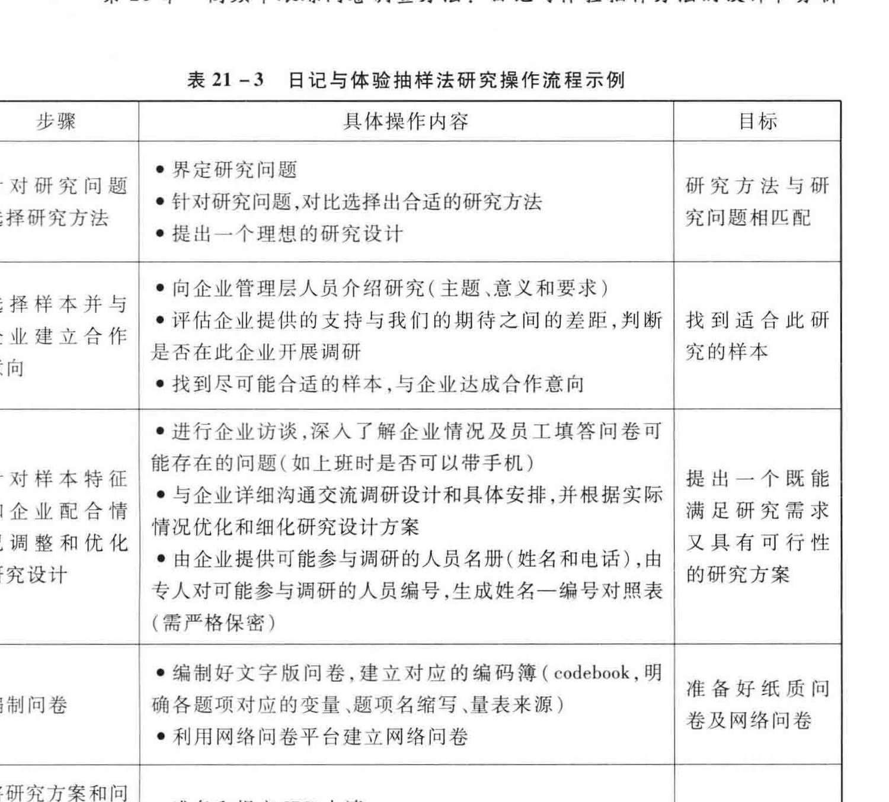
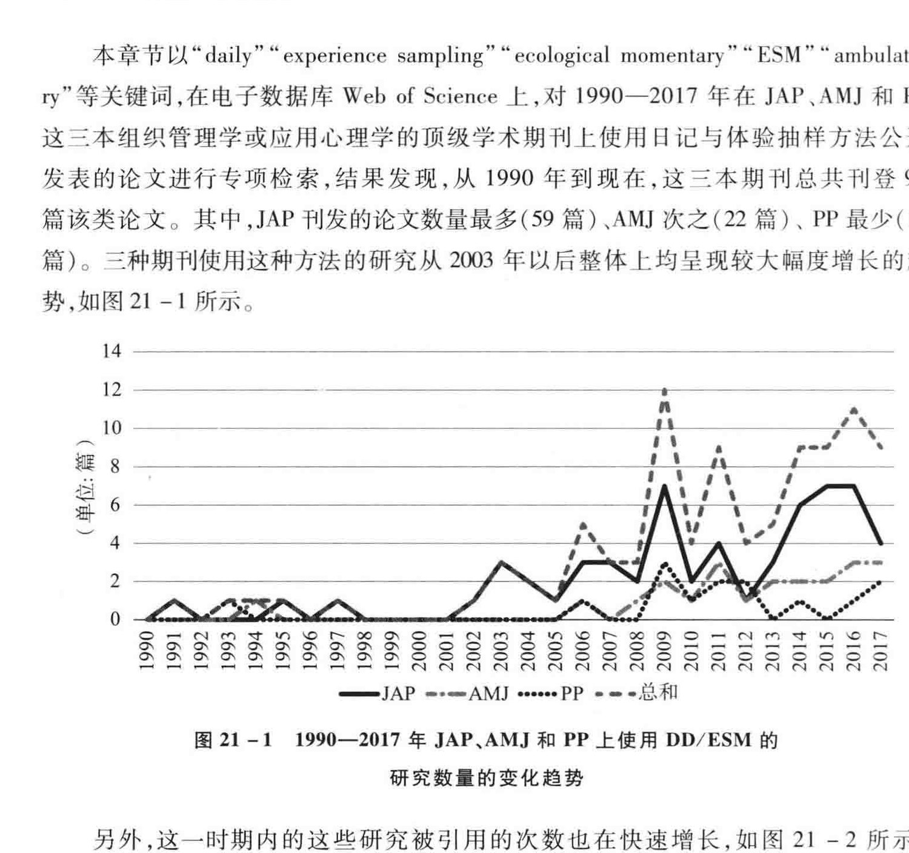
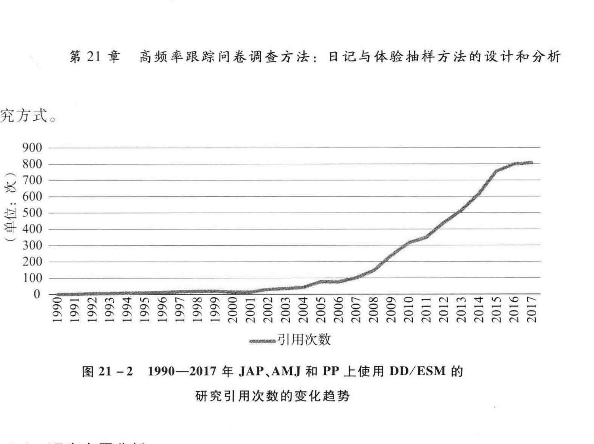
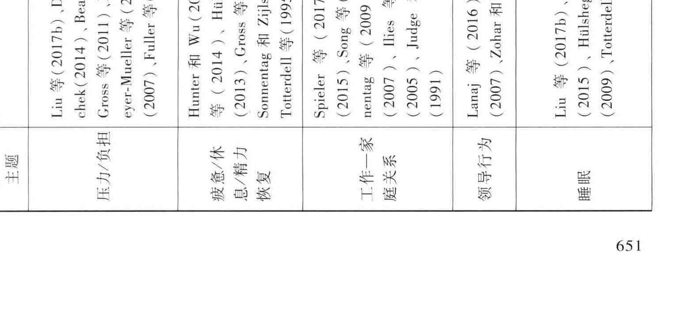
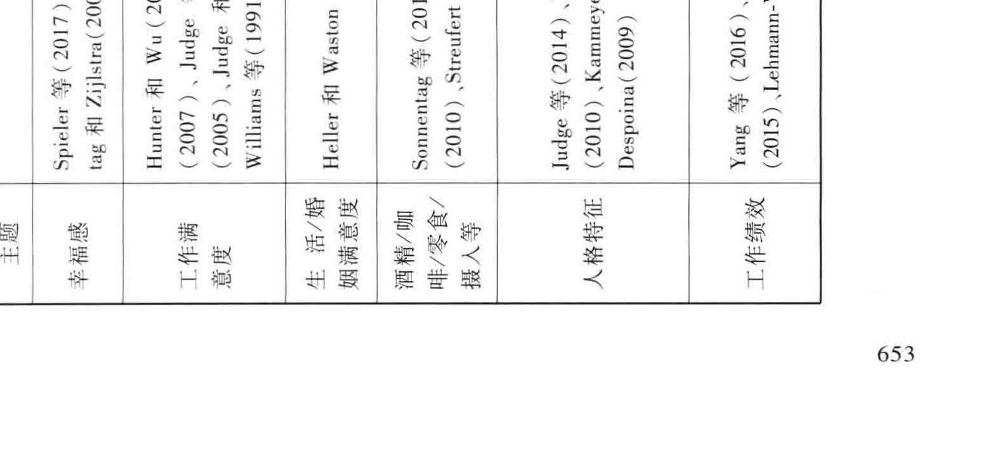

<!-- PDF页 644 -->

## 第21章 高频率跟踪问卷调查方法：日记与体验抽样方法的设计和分析

宋照礼”新加坡国立大学

苏涛”华南理工大学

祝金龙” 中国人民大学(b> 本章大纲:: 引言 |: ”21.1日记与体验抽样方法: | 21.1.1 历史沿革 i; 21.1.2 定义 |: 21.1.3 特点: 21.1.4 优势与局限:: 21.2日记与体验抽样方法的类型: | 21.2.1 基于时距的体验抽样方法 | | 21.2.2 基于信号的体验抽样方法: 21.2.3 基于事件的体验抽样方法| 21.2.4 混合型体验抽样方法 |: 21.2.5 其他数据搜集方法: 21.3日记与体验抽样方法的实施: 21.3.1 制订数据搜集的计划 i $ 21.3.2 测量方法i 21.3.3 技术手段 | | 21.3.4 ”被调查对象的招募、培训和激励 i: ”21.4 研究流程示例 | i 21.4.1 FRASER WASH:: 21.4.2 研究执行阶段的执行步又

<!-- PDF页 645 -->

626

### 21.5日记与体验抽样方法的数据分析

### 21.6日记与体验抽样方法在组织管理领域的应用21.6.1 方法应用趋势21.6.2 研究主题分析

### 21.7 结语

<!-- PDF页 646 -->

HAF ”高频率跟踪问卷调查方法: 日记与体验抽样方法的设计和分析

uy Ill

日记与体验抽样方法 (daily diary and experience sampling methodology, DD & ESM) 是一种高频率跟踪问卷调查方法。 在管理学研究中,这种方法已经受到越来越多的关注。 该方法不仅有助于描述和揭示人自身与外在的动态变化过程,如情感. 认知.个体行为人际互动工作事件等, eh 如个性对于个体内部动态过程和反应的耻层次影响作用。 本章将系统介绍这一类的问卷调查方法,说明如何设计和实施日记与体验抽样方法的研究。 er A记与体验抽样方法的发展简史、 概念内涵及主要特点;(2) 主要的数据搜集方式; es (6) 对 AMJ JAP 及即这 = Ke EM 术期刊上近些年采用日记与体验折样方法的研究进行简单的总结和分析。

21. 1日记与体验抽样方法

### 21.1.1 历史沿革

行为科学主要关注人们的行为模式与规律。 除重大事件外,人们的日常行为也是行为科学所研究的对象。 与之对应,利用自我报告对个体的日常生活事件与体验进行重复测量 (repeated measures) 与跟踪记录也日益成为一种主流的研究方法。 高频率的跟踪问卷调查方法,包括日记与体验抽样方法,来自 20 世纪初在行为分析领域的初步应用,例如, 弗雷德里克: 泰勒 (Frederick Winslow Taylor) 就在工作场所研究并推广对工人行为的观察和分析。 在 20 世纪的六七十年代, 这一方法逐渐走向成熟, 并应用于心理健康、 工业与组织心理学、 社会心理学等诸多领(Wheeler & Reis,1991), Schwarz(1990) Wheeler 和 Reis(1991) Duck (1991), Reis 和 Gable(2000) 的研究是 21 tH 4a WA Ay A id (daily diary, DD) 或体验抽样方法 (experience sample methodology, ESM) 比较有影响力的工具书或指导性文章。步人 21 世纪,组织管理领域使用日记与体验抽样方法的研究数量开始快速增加。Journal of Occupational and Organizational Psychology, Journal of Organizational Behavior #il Human Relations 这三本期刊还分别在 2005年 (第78 卷,第2 期),2011年 (第32 卷,第4 期) 和 2012年 (第65 卷,第9 期) 特地专刊介绍这种测量方法的

<!-- PDF页 647 -->

相关研究。Ohly 等 (2010) 对组织行为学研究领域内采用这种测量方法的 23 个研究进行了详细介绍。 而 Beal(2011) 则对尤为适合采用日记与体验抽样方法的相关研究主题进行了介绍。Fisher 和 To(2012) 对 2002 一 2011年发表在八本主流组织管理学术期刊上的文章进行摘要检索,发现采用日记或体验抽样方法的研究数量整体呈现上升的趋势。21 世纪以后,有关日记法或体验抽样方法还可以参考 Beal和 Weiss(2003), Bolger 等 (2003)、Intille(2007)、Hektner “ (2007) Belli 等 (2009)、Mehl 和 Conner(2011).Bolger 和 Laurenceau(2013) 等的专著或指导性文章。

### 21.1.2 定义

体验抽样方法是指在日常工作与生活中,对同一调查对象的即时或临近即时的反应,持续予以报告的一种测量方法。 被调查者需要在一周或几周的时间内每天数次报告他们当下或临近当下的情感,行为.想法或情境 (Fisher & To,2012)。“体验 ”一词主要说明该研究方法关注个体当下的或临近当下的经验与感受,试图通过多次测量的方式来反映其日常状态或情况。 以前往往将 "experience” 翻译为是经历与体验。 前一种含义与这一方法所关注的当下的感受是不同的,因此用这一个词容易引起误解。 所以,我们建议用 “体验 "而非 “ 经验 " 作为 “experience "一词的中文翻译。“ 抽样 " 指该研究方法需要对个体的体验沿时间轴进行纵向取样, 关注个体体验在时间轴上的分布。 体验抽样方法研究主要涉及人自身的各种动态过程。 在社会学或行为医学领域,也被称为生态瞬时评估法 (ecological momentary assessment,EMA)。 这种方法之所以是 “生态的 ",是因为相较于其他加入人工设置实验条件的研究方法, 它是在正常的活动和环境中对调查样本进行评估的。 医学领域的生态瞬时评估法通常会和心率、 血压与活动水平等指标结合,有时也会被称为动态取样评估法 (ambulatory assessment method, AAM)。

日记法与体验抽样方法虽然名称不同,但内涵比较接近。 依据传统,如果跟踪调查是一日多次取样,可以称为体验抽样方法或日记法。 但是如果一天只有一次取样且调查内容是对当天工作经历的回顾,一般只叫日记法,不称为体验抽样方法。 但很多学者对两种名称不做特别区分,如 Bolger 等 (2003)。 本文中,我们将一天内一次或多次,延续多天的高频率重复问卷调查统称为日记与体验抽样方法。 这也是本章将主要介绍的测量方法。 日记与体验抽样方法不同于描述性体验抽样方法 (descriptive ESM; Hurlburt,2006),两者在信息搜集的方式上存在较大差别:日记与体验抽样方法通常使用有标准计分的调查问卷的形式来搜集被调查者的消息;描述性的体验抽样

<!-- PDF页 648 -->

方法则通常使用在被调查接受到数次调查信号之后对他们进行深度访谈的方式来搜集他们非结构化的、 质性的即时想法与感受等方面的信息。

### 21.1.3 特点

与常见的横截面 (cross-sectional) 研究设计和实验研究设计不同,日记与体验抽样方法有三个显著特征。

1. 关注现象的动态性和个体内差异

许多组织管理研究领域中的现象和构念会在短时间内波动变化。 例如,人们在工作中的感受和体验 (如工作满意度、 情绪、 工作动机效能感睡眠质量) 工作行为 (如情感表达与情绪劳动.组织公民行为和反生产行为) 和工作结果 (如绩效)都会波动变化 (Beal,2011)。 在以往的研究中,上述现象的动态性 (dynamics) 往往被忽视或被简单归结为测量误差。 而日记与体验抽样方法直接针对这些现象的动态性和个体内差异 (within-person variance) 进行研究。 例如,人们每天的睡眠质量是波动起伏的。 传统的研究关注人们平均水平的睡眠质量并对比个体差异。 日记与体验抽样方法则捕捉同一个人连续多天的睡眠质量,并分析个体在睡眠质量好和睡眠质量差的工作日的行为表现的差异。Sonnentag(2003) 研究了每天起床后的恢复状态对每天主动行为的影响。llies 等 (2006) 探究了情绪的变化是否会引起组织公民行为的变化,以及这种个体内关系的强弱是否因人而异 (即受到人格特质的调节)。

2. 在自然的状态下,捕捉人们即时的工作和生活体验

日记与体验抽样方法的男一个特征是在自然的状态下捕提人们即时的工作和生活体验。 其关键点在于 “ 自然 "和 “即时 ”。“ 自然" 是指人们在日常工作生活的真实场景中记录和报告自己的体验及工作行为。 这里的 “自然 "是与实验的方法对比而言的。 我们知道,实验室的场景与人们日常工作的真实场景是有区别的, 实验得到的结论有时不一定能直接反映人们平时工作的真实状态,而现实中的工作场景则是人们更自然的一种存在状态。

“即时 "这个说法则是在把体验抽样方法与其他传统的问卷调查法比较后得出的一个特点。 在体验抽样法中,我们经常要求参与者报告他们当时当地的体验和行为,如情绪工作投入度、 助人行为等。 而在传统问卷中,例如, 横截面研究的问卷和一般有数月或数年时间间隔的纵向研究的问卷,通常要求参与者回忆和概括他们过去一段时间的体验和表现。 比如,参与者可能需要回忆过去的一个月中他们拥有某种体验或进行某项行为的频率,或者回忆和概括在过去的几年时间里

<!-- PDF页 649 -->

他们通常是如何体验或行动的。 这些基于回忆的报告虽然能大致反映参与者一般状态下的体验, 却存在一些问题。 其中一个问题就是个体在回忆时往往不能避免回溯偏差 (retrospective bias)。 比如,个体可能更善于记住一些诱发强烈体验的事情, 但对其他相对平淡的事情就难以有准确的记忆。 另外,个体对于过去体验的概括很大程度上是一种语义记忆 (semantic memory), 即个体的记忆是基于一系列抽象的.概念性的理解所形成的。 这种记忆与对某种具体场景和某个具体时间片段的记忆很不同, 它可能并不是对真实发生的事情的精确反映,而是反映了我们对事情通常应该是什么样的一种认识。 这种抽象的认识与现实情况的偏离会随着需要回忆和概括的时间跨度的增加而变大。 所以,如果研究者认为回忆的这些特点对于想要捕捉的现象会造成影响,而研究者更想看到在某个具体的场景下人们的真实体验和反应,取样的即时性就变得很重要。

3. 高频率重复测量

为了捕提即时体验 (immediate experience) 的波动变化,日记与体验抽样方法通常需要高频率重复测量。 所谓 “ 高频率 ”,是与传统的数次重复测量的纵向研究设计相对比, 参与者有可能需要在一天之中填答三次甚至更多次问卷。 只有通过这种高频率的测量,研究者才有可能看到那些短时间内就会发生波动的变量是怎样变化的,以及与它们瞬时的变化有着紧密联系的原因或结果又是什么。 尤其对于一些理论上可能时时刻刻都会产生可观测变化的变量,比如情绪,测量的频率越高越能贴近真实的变化。 反之,测量频率越低对于变化的反映就越粗线条。 表21 -1总结了日记与体验抽样方法的特征及其与其他方法的比较

R21-1日记与体验抽样方法的特征及其与其他研究方法的比较特征特征说明及示例与其他研究方法的比较

关注个体体验在时间轴上的分布,并对个体内的差异进行分析和研关注现象的动态 | 究。 例如, 捕提人们每天睡眠质量性和个体内差异 | 的波动起伏与每天情绪和绩效的波动起伏, 分析同一个个体在什么样的情境下有更好的工作绩效

横截面研究关注人与人之间的差异例如,关注和分析什么样的员工有好的工作绩效

在直实的工作场景中,让被试报告 | 在实验的情况下报告在实验情境下

在自然的状态 | w 下的感受或最近几个小时的工作 | 的体验,或者通过一般的问卷报告在FA $B ATED | 训生活体验。 例如,报告在当前体 | 过直的一个月中所拥有某种体验或时的体验 ”i ”| 进行某项行为的频率。 例如,报告在

secnnnidiniiee 过去六个月体验积极情绪的频率

<!-- PDF页 650 -->

RUF ”高频率跟踪问卷调查方法: 日记与体验抽样方法的设计和分析

(续表)

特征特征说明及示例与其他研究方法的比较

每天一次或多次重复测量。 例如,| 横截面一次性测量,一般的纵向调查高频率重复测量 | 每天在工作开始前工作中工作结 | 问卷可能间隔儿周、 几个月或几年才束后各做一次重复测量做追踪测量

### 21.1.4 ”优势与局限

日记与体验抽样方法有几个突出的优势。 首先, 该方法能够探明人自身随着时间推移包括波动和成长在内的各种动态过程 (Beal,2011; Fisher,2007; Klumb et al.,2009)。 通过分析动态过程,可以重新检验和拓展理论。 其次,该方法能减少回溯报告的偏差和误差。 已有研究表明,人对于过去的情感,信念和行为的回溯告会被记忆误差,记忆有效性新近记忆、 突出记忆、 内隐观点和当前的情感所影响 (Schwarz et al.,2009)。Robinson 和 Clore(2002) 的研究发现,真实事件与报告之间的时间间隔会导致信息回忆上的缺失。 而对现有情感和体验的即时报告被认为比基于记忆的回溯报告更为准确 (Schwarz et al.,2009)。

但是,日记与体验抽样方法也有一定的局限性。 首先, 该方法的实施有相当的难度。 其难点主要包括研究的设计变量的测量,调查者的招募和激励.数据的搜集和分析等方面。 相较于其他研究方法,由于其高频率、 高密度的调查,使用该方法开展研究可能需要花费更多的时间经费和努力。 日记与体验抽样方法也可能带来方法效应, 即参加问卷填答这一行为本身,可能会改变研究参与者对于所研究现象或事件的认知或体验。 这种方法要求参与者对日常生活状况进行一定程度的监测,可能会让人感觉不适应。 参与研究可能会让人用不一样的方式看待他们自己的行为,其至引起他们行为的改变。 例如,由于参与研究,被试意识到自己与配偶之间的互动较少且不令人满意,他可能会尝试去改善关系。 这种方法效应是值得研究者关注的。

### 21.2日记与体验抽样方法的类型

根据触发抽样 (让研究者填答问卷) 的因素不同,日记与体验抽样方法可以分为基于时距的体验抽样方法 (interval-contingent ESM)、 基于信号的体验抽样方法 (signal-contingent ESM) 和基于事件的体验抽样方法 (event-contingent ESM) 这三种类型 (Wheeler & Reis,1991)。 在实践应用中,这三种不同类型的体验抽样方法也在融合,从而形成结合上述两种或三种类型的混合体验抽样方法 (Mixed ESM; Bolger et al.,2003)。

<!-- PDF页 651 -->

### 21.2.1 基于时距的体验抽样方法

基于时距的体验抽样方法要求研究者设定好问卷填答之间的时间间隅并要求被试在预先设定的时间点上进行报告。 重复调查时间点的选择一般根据理论或逻辑上有意义的时间点,如每天早上起床后、 每天上班前、 每天下班的时候、 晚餐结束后等 (Wheeler & Reis,1991;Fisher & To,2012)。 被试需要报告从上个时间调查点到当下时间点之间所发生的事情,也有可能需要报告在那一刻的体验。 日记法因此可以被视为一种基于时距的体验抽样方法 (Reis & Gable,2000)。 关于早期采用这种方法的研究可以参考 Bolger 和 Schilling (1991)、Campbell 等 (1991)、Emmons (1991)、Larsen 和 Kasimatis(1991)、Zautra 等 (1991) 的研究。

基于时距的体验抽样方法有两点优势:第一,使用这种方法时,每天填答问卷的时间一般都是固定的,被试仅需记住在约定的时间自行报告,方法直接,对被试的要求不复杂,对被试的工作和生活的干扰小;第二,对于研究者而言,这种方法操作起来比较容易,研究者知道问卷填答的时间, 可以在约定的时间或者稍早发送调研提醒, 作为辅助提升问卷填答率的手段,问卷回收率通常较高。

而这种方法也存在三点不足: 第一, 当指导语是让被试报告当下的体验时,只捕捉到了一些时间点上的即时体验,而忽视了那些发生在其他时间的体验;第二,在预先设定的时间区间,研究者关注的事件 (如硅虐管理,abusive supervision) 可能没有发生或可能多次发生; 第三,当时间间距较长且让被试报告从上一个时间点到当前的体验时,报告的不及时性会带来回溯偏差。 社会认知领域有大量关于情境与事件特征对回忆影响的相关文献。 例如,研究被试的即时 /新近体验或情感意义就会影响到回忆 (Kahneman & Tversky,1982;Schwarz,1990)。Hedges 等 (1985) 的研究在一天中四个时间点 (9:00.13:00、16:00 和 19:00) 记录了被试的瞬时情绪。 在晚上 22:00 的时候被试还会报告他们当天的整体情绪水平。 该研究发现, 被试晚上报告的当天整体的情绪水平与当天测量到的情绪的峰值水平相近,但是高于之前四个时间点报告的情绪水平的平均值。 这意味着, 当对一天的情况进行总结的时候, 相较于一天情绪的真实平均水平,被试会更多受到当天情绪极端值的影响。 至于影响的程度, 则取决于所评估现象的特征 (例如,是否容易记忆或是否容易受影响等) 以及事件与报告之间的时间间隔长度, 报告越频繁,回顾的偏差越小 (Fisher & To,2012)。

在组织管理领域内,Jones (2007)、Liu 等 (2009)、Song 等 (2011) 等研究是组织管理领域内采用基于时距的体验抽样方法的例子。 以 Liu 等 (2009) 的研究为例, 该研究在连续 5 个星期 (25 个工作日) 的时间内,以中国北京地区的 4 家企业

<!-- PDF页 652 -->

的 37 名员工为研究样本 (总共获得 794 个报告),采用电话询问的方式,验证了每天的工作压力对被试饮酒量和饮酒欲望的显著正向影响。 并且,神经质和工作投入对每天的工作压力与被试饮酒量和饮酒欲望的个体内关系有显著的调节作用。该研究固定在每天的 16:00 一 19:00 对被试进行电话询问。 之所以选择这个时间段,是因为正常情况下,员工会在这个时间段内结束一天的工作,而且这个时间段处于他们开始夜晚生活之前。

### 21.2.2 基于信号的体验抽样方法

基于信号的体验抽样方法要求被试在收到预先设置或随机生成的信号后立即进行问卷填答。 收到信号后,被试需要报告在那一刻的体验,或报告从收到上个信号到当下时间点所发生的事情。 信号的时间间隔往往是随机设定的,也可能是在固定时间间隔内随机产生。 例如,每两个小时作为一个时间段,在每个时间段内随机选择一个时间点进行调查。 这种方法中对体验抽样具有一定的随机性,可以获取参与者经历事件和体验的代表性样本。 因此,一些学者把这种依据信号释放时间点的体验抽样方法视为最正宗的体验抽样方法 (Fisher & To,2012)。

基于信号的体验抽样方法的问卷填答时间更接近实际体验的时间, 这正是这种方法相较于基于时距的体验抽样方法的主要优势。 而且, 如果基于信号的体验抽样的研究的时间间隔是随机选择的话,那么行为或感觉在时间轴上分布的特定规律导致的问卷系统性偏差就可能被减少或排除。 例如,人们在早上起来之后可能会不太清醒,在睡觉之前会车昏欲睡,固定在起床或睡觉时间点上的问卷回答就有可能受到这样身心状态的影响。 另外,被试对填答问卷时间没有预期,其经历和体验较少受到问卷填答的影响。

当然,这种体验抽样方法也存在两点不足:第一,对正常生活工作的侵入性或干扰性。 当采用基于信号的体验抽样方法时,无论是采用震动提醒的方式或声音提醒的方式, 某种程度上还是会扰乱正在进行的活动。 第二,研究所关注的事件越少发生, 信号的用处就越小, 即信号和事件其实没有多少一致出现的机会。 相关研究发现,即使对于学生学习这样一个常见的事件,参与研究的学生平均每天也只报告了 3 一 4 次 (Wong & Csikszentmihalyi,1991)。 太少的数据也难以产生可靠的有代表性的统计分析结果。 而且, 还可能存在的问题是,基于信号的报告会 “ 抹去 ”这些相对较少发生的事件的变化。 如果研究者想对比好友间互动效应与恋人间互动效应的区别,随机信号就难以获得足够数量的可供研究的事件。 换言之,获得足够数量的数据就需要花费相当长的调查时间。

<!-- PDF页 653 -->

Alliger 和 Williams(1993)、Song 等 (2008)、Hiilsheger (2016),llies 等 (2017) 的研究便是组织管理领域采用基于信号的体验抽样方法的例子。 以 Song 等 (2008)的研究为例, 该研究以 50 对双职工家庭夫妻连续八天的瞬时情绪报告作为研究样本,验证了积极和消极的瞬时情绪均能在工作与家庭之间及夫妻之间传递。 该研FE IG BEIM,,工作导向能够调节从工作到家庭的消极情绪,家里有小孩也能前弱夫妻之间的消极情绪传递。 另外, 当夫妻在一起且夫妻双方进行报告的时间间隔较短的时候, 积极和消极的瞬时情绪均能在夫妻之间传递。 在该研究中,研究者会在每个工作日的早晨、 上午、 下午和傍晚这四个时间段的随机时间点上,通过短信通知(即信和号) 夫妻被试进行汇报;而在非工作日,研究者则仅会在上午、 下午和傍晚这三个时间段通知参与者进行汇报。 每次的调查约在两分钟内完成。 该研究通过无线上网或手机 APP 进行问卷的发放与回收。 这种操作不仅让参与者随时打开、 回答问卷成为可能,还让他们能比较方便地将填写好的电子问卷返回后台。 而且,人研究者也可以清楚地知道参与者回答,返回问卷的具体时间。 值得注意的一个细节是这个研究是利用夫妻来做的配对调查,每一次随机提醒信号发给丈夫和妻子间隔 5 分钟,避免对家务活动造成负面的影响。

### 21.2.3 基于事件的体验抽样方法

基于事件的体验抽样方法要求被试在某一预先设定的离散事件出现时进行问卷报告。 由于需要被试在遇到特定事件的时候主动报告,研究开始之前,被试需要接受针对调查事件辨别的培训,这样才能保证他们能够较好地识别什么事件是值得报告的,什么事件是不值得报告的 (Moskowitz & Sadikaj,2011)。

基于事件的体验抽样方法问卷填答时间更接近事件发生的时间, 可以捕捉事件的即时影响,这正是这种方法的主要优势。 如果研究者关注的是很少发生的事件 (如工作场合的冲突),那么使用基于信号的体验抽样方法要获得足够数量的事件就几乎是不可能的。 这时,采用基于事件的体验抽样方法能更有效地获取有效数据。

当然,基于事件的体验抽样法也存在如下不足之处:第一,研究者通常不能提前知道事件是否发生及事件发生的时间, 这依赖于被试的报告。 但被试可能会漏报或延迟太久才报告。 在这种情况下,如何保证问卷填答率就是一个刺手的问题。出于这个原因,用这种方法搜集数据通常较难获得高问卷填答率。 第二,具有对正常生活工作的侵入性或干扰性。 当采用这种体验抽样方法时,被试会被要求在事件发生后立即主动进行报告, 某种程度上,被动填写问卷这种 “侵入 ”行为还是破坏了被试的自然状态。 而且被试对被测量行为有所预期,有可能产生行为上的反

<!-- PDF页 654 -->

应,这种方法因而也受到一定的质疑 (Hormuth,1986)。 第三,如果研究者关注的是对比多种事件的发生情况和特点,如学习、 聚会.运动.聊天、 购物等,如果采用基于事件的体验抽样方法去——报告经历的事件,任务就会过于繁重。 这时,基于信号的体验抽样方法则可能更具实操性,

在具体的研究实践中,基于事件的体验抽样方法在社会互动的研究领域应用最为广泛 (Duck et al.,1983;Reis & Wheeler,1991)。 这种方法对冲突不公、 奈力、等的研究也有帮助。 这种方法的关键在于要令被试明确需要对事件进行报告的标准和报告的有效时间范围。

Russell “ (2007),Lehmann-Willenbrock 和 Allen(2014),Liu、Song 等 (2017) 的研究便是组织管理领域采用基于事件的体验抽样方法的例子。 以 Liu 等 (2017) 的研究为例, 基于 “情绪也是社会信息 ”的理论视角和 85 对领导一下属的 640 份瞬时报告,该研究探索了领导的情感是否.为什么及如何影响下属的建言行为这三个重要的问题。 该研究在 10 个工作日内连续观测这 85 对领导一下属的行为表现,只要当领导与员工的会谈时间超过两分钟,那么,“ 领导与下属之间的交流 "这个事件就被视为发生,被试就需要回答手机问卷。 该研究验证了领导的积极情绪对于员工建言的促进作用。 这种促进机制不仅通过领导的积极情绪直接影响下属的积极情感,进而影响下属的心理安全感发挥作用 (情感营延机制),还通过领导的积极情绪间接影响下属对于领导积极情感评价,进而影响下属的心理安全感发挥作用 (信号机制)。 另外,领导的消极情感能削弱员工的建言行为,但是情感蔓延机制和信号机制在这当中却并未发挥作用。 这个研究是领导与下属的配对研究。 实施的难点是如何保证配对的双方都能在沟通发生后及时填答问卷。 该研究利用手机问卷的及时性,用人工适时跟踪问卷填答的方式,监控配对双方问卷填答的状况。 一旦有一方报告沟通行为,研究助理就会向男一方发送提示填答问卷的短信。这一种提示方法很大地提高了有效配对填答率.

Klinger(1971) 有关梦的研究可能有助于理解这三种体验抽样的方法。 基于固定时间间隔的体验抽样方法是指在每天早上询问被试梦见了什么;基于信号的体验抽样方法则是指在晚上预先设定的时间唤醒被试,询问他们梦见了什么 (Berrien,1930; Calkins,1893);而基于事件的体验抽样方法跟基于信号的体验抽样方法类似,但这种方法是通过快速眼动 (rapid eye movement,REM) 和脑电图 (electro-encephalograms, EEGs) 推断出被试正在做梦, 需要被唤醒的 (Aserinsky & Kleitman,1953)。

表21 -2 总结了这三种方法的优势.劣势及使用建议。

<!-- PDF页 655 -->

三版)

ae Sa MOT TD GH SY Ea BS Wad fe aS AK GH) FI BE TA ORR

lel 1% WE ZR SF Yt A Tk A 1 Ss * fa) Fs GH Se Wy he De) ACB DB AB EE

‘ee 1S Cad 341 Dad fd GF Ea * S025 lt (PRE) Be YA TMi ih De RR Se |) EG Se) SP Fr MA YY GH fT SHY) OH Ll 2 ey © Ep BSG UM) Ep SS) MS ed HE 2G BE |] N° Led GN a — PR ECA HE Yh GL | * PRUE Ek Se Ded a ME CE @ | 2) ial ey Ee oe We oY 6 FEE Bh lo Be ee ee | EE SY * SD ie 2} LUE VA Bl GU a BPAY LYE | es Ph Shoe) ll GG 6 Bh LF (及下下烤 | DC ETS BE bee | We MEGA SR AE A Sie — EP To | Del PL fe ae PE | WET WEEE ME | YR OY @ | Gy SME [el EH AD Ew | AY I ER * 1 UWE) Ex £2) ME Wh ly A YL TH) BY St @ SoM OV) Pe RS al [or SES | HE Tal 2G & BR £5) ALF, 1A Bi Bd ead SL * BABAR 2 Ue Mh Ek fe EE | DYES Shi) Ll fk AE |S Se De OP Se Goal fot 3° 24 fal 32 fe — FE | RAG LE EL YO SY il Seo | GH Ge PUREE Bb | 2) GH EG Gd Ti Mh lel Se Le ‘aa Led GY Se BY FAR Ls) oe lel Se fa oi BRE JOU Be fx HMO HL SHU Se * HRS] | HY AY fn * Ju 3 ep HA il Dad Se |] ZR SEY PE fk Yd Ls * Pel P| GY el ft AL er SE fal 0 TE ik aT eS * 型 HG Ey | Gi Se Wr Se (el by IP De @ | 2c Be WW AY fu TH * SY ey fu fab Fel a GH SE AER | ik EY MA BY I Sh) AEH Se Sa BE GH SE ME |G Dl ZY Tel FY fod HE BY) GH (RE LY TRS YY YL GH | fe GUT ERE * De Sel eal fs GU BS WOE Aw | Jn * 0 eh EY TG BEB ORR @ | EA ey DP eB I Yb a tLe Ay A$ HG A ty AS A Eh SAH) GM fel AR) EY Net A ae a ce Sh AL GH ly Tf Ay ha * ELS TPE |G arte Sk Wy * op) hg G) BL Se NS Md Se lle | GR Ue 3a Me Be GH EY Ex BY Ay * UF) S| De) Pad eet — LE SS) | A EA a al fn Gs et eS fie 3 * ei & [ol te Fa 8 4 fel fr GO YG ERY St @ | GY bre SP ORT R SE @| 141 Jon ES Be Ud Ul Se Mee | Ua PG a ae TL WG wey SMM We RI | ese

MBHOIWES AYWACHHRYWEXE YE

T-10¥

<!-- PDF页 656 -->

HAE 高频率跟踪问卷调查方法: 日记与体验抽样方法的设计和分析

BLES 28 [uo FT) OH fe) So BD * A Lhd ae HH AIA GAT GC LY Fi anf BB Jen EY * Eff UE Md Ee GC LY AF ile fx tT “SENG El GY CAR 3 & BB es BG ye TLV Go EE [ol Fr UIQ eh fe GA OR 3 BY GY NE 11 nee 6N JPR GH Fa 2 she) fe HE Be 4 MSR Dd GH | AAD * ir eh eG Fy 2% oh) Uw Sr Oe 4 4 LE EME ee DL DY de NL ELD @ | EYP ape SET GY SIG BE EI # BEM YL i SY | Be De a A Mer 2%, i ae _ Wee MEY, | Ssh eS BEM SY 2h Ha AE @ | YY Si HE I SI * Shh 6 Wye Ba EL Sv oe UG Ha 2%, tp Me | SC EB fal A | =F 2% hh fe ae AE SF Bie EE ed (GT SP EA | PAE GD EL 2) Se * Ped a Ge 2% | toh GH to) ate Fo * el:最语LN * Se GH AAR TH Mg teh afc fx @ | ofoh fe FEE BG PAE BB SS I ae HA @ Yr 2% chp ate TCS a Mel PST Led @ | Se Le 2% Ys 2H he Ta EH) bi aeg we Y) M2, Ha Il |e Se PLL

CEG)

<!-- PDF页 657 -->

### 21.2.4 ”混合型体验抽样方法

混合型体验抽样方法其实就是结合了上述几种方法的体验抽样方法。 例如, Shifftman(2007) 在其研究中就同时结合了基于事件的体验抽样方法和基于时距的体验抽样方法,用来比较一个较少发生的事件在发生时参与者的反应,以及他们在事件没有发生时的反应。Shifftman(2007) 的研究还通过两种体验抽样法的结合搜集了突发性事件的原因和结果变量。

### 21.2.5 其他数据搜集方法

除了让被试报告,还可以通过一些设备辅助客观记录 (如用手环等可穿戴设备来记录运动睡眠、 心率等), 通过血压仪来测量被试每天的血压,等等。 可穿戴设备与技术的进步,使结合其他生理或客观事件测量的取样方法更容易了。 比如,在Intille (2007) 的研究中, 当被试的心率超过 150 次 /分的时候, 仪器就会发出信号提

### 21.3日记与体验抽样方法的实施

### 21.3.1 制订数据搜集的计划

采用日记与体验抽样方法开展研究前,需要确定被试每天进行汇报的次数以及数据搜集的天数。 以下三个因素最为关键:首先,统计功效 (statistical power)。体验抽样研究需要保证参与者提供足够次数的汇报用来检验研究假设。 一般而言,虽然增加被试数量会比增加每个被试汇报的次数更能提升统计功效,但每人填答数量与被试数量对于多层次分析的统计功效都很重要。 有关多层次设计的功效可以参考 Scherbaum 和 Ferreter(2009)、Bolger 等 (2011) 的研究。 其次,除了需要确定每天需要报告的次数, 还需要兼顾研究开展的时间范围。 最后,研究者还需要考虑参与者日复一日进行重复汇报的意愿

当每天信号出现较多的时候,人研究持续的天数通常就会比较少;反之, 当每天信号出现较少的时候, 研究持续的天数就可以更多一些。 在持续天数较多的研究中, 随着时间的推移, 填答率会降低,数据质量也会变差。 分段密集测量是改善这种情况的一种方法。 它将高强度的数据搜集期与不需要汇报期结合起来,从而能够在更长的时间范围内和更具变化的情境中不中断测量,也减少了被试长时间参

<!-- PDF页 658 -->

HAG 高频率跟踪问卷调查方法: 日记与体验抽样方法的设计和分析

与研究的过度疲乏感 (Gunthert & Wenze,2011)。 例如,Foo 等 (2009) 对企业家的研究在连续的 6 个时间周期 (每 4 天为 1 个时间周期) 内每天释放 2 次信号,而每 2个时间周期之间会暂停 1 个星期。Moskowitz 和 Sadikaj(2011) 建议应该保证每个被试能够提供 30 个事件。 关于日记与体验抽样方法更为详细的抽样计划的处理方法,可以参见 Moskowitz 和 Sadikaj(2011) 及 Shiffman (2007) 的研究。

### 21.3.2 测量方法

日记与体验抽样方法研究通常使用一份较长的问卷用以测量那些稳定的个人或环境变量 (如性格与工作特征),同时使用多份较短但需要每天或随时进行报告的问卷。 有些研究在每一次问卷调查都重复测量同样的变量, 另一些研究则在一天中的不同时间测量不同的变量。 但无论是哪种形式,明晰研究所关注的变量以及精确地测量这些变量至关重要。 确定被试需要进行报告的时间框架也很重要。时间框架包括即刻一个具体的时间范围 (例如,过去的 30 分钟或过去的 2 个小时)、 当天等类型。 测量的题项需要能够清晰、 明确地指出所需要的时间框架。 当使用没有准确时间框架的题项时,一定要注意对这些测量题项进行改写,保证与调查时间尺度的一致性。 例如对一道没有明确时间框架的题目 “通常情况下您对自己工作的满意程度如何?”,日记与体验取样方法可以根据特定的时间框架,将其改编为 “现在您对自己的工作满意度如何?”“ 从上次接收信号到现在您对自己的工作满意度如何?”“ 今天您对自己的工作满意程度如何?” 等。

每一个测量题项时间框架的选择取决于研究问题本身,以及常态下所研究的状态与行为变动的时间周期。 例如,睡眠质量的测量每天测量一次即可;而情绪作为一种在一天中持续变化的精神状态,需要更为频繁的测量和更多基于 “现在 "的指导语。 而离散性的行为的测量通常需要较长的时间跨度 (如过去半天的创新行为)。 通常测量设置的时间范围越长, 回滴性偏差和重构偏差存在的可能性也就越大,特别是对那些常见的体验或持续的体验更是如此 (Schwarz,2011)。

为了将被试多次汇报的倦仍感控制在一定范围内,同时激励他们按时汇报,日记与体验抽样方法的问卷需要尽可能简短。 一般而言,每天进行一次报告的问卷答复时间约为 5 一 10 分钟, 而在一周时间内每天多达五次报告的每份问卷答复时间则约为 2 一 3 分钟 (Hektner et al.,2007)。 为了与上述时间跨度设置保持一致,并且和避免被试对大量的测量问题感到厌烦,在体验抽样研究中,通常的做法是缩减现有量表的题项数目。 由于在其他方法中需要进行整体性测量的变量在体验抽样研究中测量往往更为简单和明确,缩减题目数量也是可以接受的。 以一个人在当

<!-- PDF页 659 -->

天工作中所经历的角色冲突和这个人整个工作中的角色冲突相比较为例, 相比于后者,评估前者所需要用到的题项更少。

体验抽样研究中一般很少完整使用那些经过检验的多题项量表, 研究者需要认真考虑应该把哪些题项纳入缩减版的量表中。 第一种筛选方法是在现有测量量表中选取那些因子载荷最高的题项;第二种是尽可能完整地体现多维度结构的所有相关方面;第三种是根据在两次报告之间变动的程度来选取那些更反映行为 / 体验动态性的测量题。 需要注意的是尽管那些在时间框架内变动不大的测量题项目有助于测量人际之间较为稳定的差别,但对测量人自身内部的变动却是帮助不大(Shrout & Lane,2011)。 一般而言, 体验抽样研究的每一个结构最好用三个以上题项进行测量 (Shrout & Lane,2011)。

体验抽样研究问题的实际文本应该尽量简短,特别是当测量的题项是以手机或者掌上电脑呈现的时候。 为了避免研究参与者生搬硬套地回复,研究者可以采用下面一些方法:(1) 在不同的汇报时间, 使用一些计算机程序打乱题项的顺序; (2) 在不同的汇报时间, 采用不同的汇报形式; (3) 还有一些计算机程序能够让分叉式或可选式的提问成为可能,通过这些程序,下一道题目的哇现会基于前一道题目的回复。 一些研究者可能会质疑,重复性的自我报告可能会改变现象本身或者影响研究参与者的感知。 频繁的自我报告有时候被视为一种 “干预措施 ”,因此,体验抽样研究调查带来了变化和反应似乎也是可能的 (Barta et al.,2011)。 例如,对工作一家庭冲突的定期报告可能会导致汇报更多的工作一家庭冲突, 这是因为频繁的报告增强了研究参与者的这种意识;但也有可能导致汇报更少的工作一家庭冲突, 这是因为参与者受汇报影响从而调整他们的生活方式。 在 “行为被有意识地正向或负向报告 (如反生产行为)”“ 仅汇报一件事情 "“ 采用基于事件汇报的方法 ”“ 参与者被鼓励进行改变 "等情况下,产生 “测量反应 ”(Measurement Reactivity)的可能性更高。 尽管很多研究已经发现, 重复汇报并不会引起测量反应或测量反应比较微弱,但 Barta 等 (2011) 还是建议采用体验抽样方法的学者对这种可能性保持警惕。 研究者最好评估并报告测量期间日记与体验抽样方法所搜集数据均值的时间趋势。

### 21.3.3 技术手段

日记与体验抽样方法需要两个相互关联的技术平台。 一个是编制和填答问卷平台, 男一个是提醒被试填答问卷的通知平台。

<!-- PDF页 660 -->

HAF ”高频率跟踪问卷调查方法: 日记与体验抽样方法的设计和分析

1. WARS

早期的一些日记与体验抽样方法的研究采用了纸质问卷的形式。 但是当使用纸质问卷时,研究者事实上难以评估被调查对象是否及时填写问卷;数据录入也是一个耗时且可能存在错误的过程。 随着移动互联网的发展,现在日记与体验抽样方法的一个常见做法是将调查问卷编制成网络问卷。

现在已经有非常多的平台可以用来编辑网络问卷。 例如,Qualtrics 调查 https:// www. qualtrics. com), 4 #F #% F (Survey Monkey, www. surveymonkey. com)、 问卷星(https: //www. wjx. en), la] 4 (https: //www. wenjuan. com/), (it Jal # (http: // www. weidiaocha. en/) 等。 网络问卷可以采用电脑.平板电脑和手机等多种工具来填答。 其中,手机技术媒介的优势在于,研究参与者通常自己拥有这些设备,也熟悉如何使用这些设备,并是,经常随身携带这些设备 (Raento et al.,2009;Uy et al., 2010)。

除了网络问卷,还可以通过开发体验抽样研究的手机应用程序 (mobile application,App) 来进行数据搜集。 手机应用程序的优势在于在没有无线数据网络的情况下也能填答问卷。 而且手机应用程序可以便捷地获取手机中其他应用程序的信息 (如天气、 温度等环境信息,运动心率等个人信息)。 但是,手机应用程序搜集数据也存在一些问题。 一个常见的问题是应用程序与某些型号的手机可能无法兼容 (如无法打开无法下载数据、 数据变成乱码等)。 因此,在调研开始前,需要在多种常见的手机上进行反复测试。 另一个常见问题是有些被试可能会对安装应用程序有所顾虑 (如担心应用程序是否会穷取个人隐私信息)。

2. 通知平台

在开展日记与体验抽样方法的研究时,研究者通常需要高频率的批量发送调研通知和提醒。 这里需要解决两个技术问题:批量发送和按时发送。 批量发送要求同时发送出多条甚至数十条信息。 按时发送要求研究者在预定的时间点准时发送信息。 为了准时发送信息,通常需要定时发送。

过去的提醒方式包括带铃声的手表或掌上电脑。 当前,发送调研通知和提醒的常见途径有邮件、 短信和微信。 邮件的优势在于可以定时且批量发送。 但邮件的不足之处在于被试可能不能及时查阅邮件。 短信的优势在于可以定时发送, 而且被试收到短信后及时查阅的可能性比较高。 但短信的不足之处在于可能不能及时批量发送, 而且批量发送信息时信息有可能被屏蔽,从而出现被试不能及时收到信息的情况。 微信的优势在于可以在微信群中便捷的批量发送信息。 但是一些被

<!-- PDF页 661 -->

试的手机收到微信信息后并不会震动提醒被试查阅,而且微信和暂时还不能定时发送。 因此,需要研究者在预定的时间点准时发送信息。 如果研究者偶尔忘记了在预定的时间发送信息, 则可能出现被试不能及时收到信息的情况。

### 21.3.4 ”被调查对象的招募.培训和激励

日记与体验抽样方法研究的被试需要在比较长的时间内密集地回答问卷。 要招募到碌意在两周或更长的时间内连续每天进行报告的员工 (研究被试) 及愿意让他们的员工这么做的企业是很难的。 开始日记与体验抽样研究的时候,培训是非常重要的环节。 这是因为,研究被试需要理解问题的意思、 何时进行作答 (如对什么样的事件进行报告或信号接收之后需要多快对信号释放进行反馈)、 错过信号时该如何处理, 如何操作设备、 突发事件 (如生病请假、 设备故障) 的联络人等。 在开展体验抽样研究的时候, 人研究者需要和被试定期保持联系,与他们建立良好的关系。 及时了解问卷填答中被试可能存在的困难,并帮助其解决。

开展日记与体验抽样方法研究的学者通常使用某些形式的奖励或报酬来招募和激励研究被试。 通常,研究开始时给被试发送微信红包或者赠也被试小礼物 (如购物券.电影套票),结束时支付相应的现金报酬或提供抽奖的机会

### 21.4 研究流程示例

由于这类研究比较复杂,需要研究者对整个过程有很好的把握和控制,所以建立一套合理的、 适合自己的操作步骤将对研究成功大有神益。

在我们反复的实践中,逐渐形成日记与体验抽样方法的十个执行步骤,并归结为准备和执行两个阶段 (见表21 -3)。 准备阶段主要有和针对人研究问题选择研究方法、 选择样本并与企业建立合作意向、 针对样本特征和企业配合情况调整和优化研究设计编制问卷和将研究方案和问卷提交学校伦理委员会 (IRB) 审查这五个步放被试费这五个步骤。 值得说明的是,这些步又虽然有先后顺序,但在进行实际研究时,各步骤之间有可能具有回路的循环关系,并且有可能同步进行。 还有,不同的研究者在实施日记与体验抽样方法研究时采用的步骤可能有所不同, 不一定完全遵循固定的顺序。

<!-- PDF页 662 -->

表21 -3日记与体验抽样法研究操作流程示例

步骤具体操作内容目标。 界定研究问题针对研究问题研究方法与研选择研究方法 © 针对研究问题,对比选择出合适的研究方法究问题相匹配

。 提出一个理想的研究设计

。 向企业管理层人员介绍研究 (主题意义和要求)

。 评估企业提供的支持与我们的期待之间的差距,判断 | 找到适合此研re STUN | 是否在此企业开展调研究的样本

。 找到尽可能合适的样本,与企业达成合作意向

。 进行企业访谈,深入了解企业情况及员工填答问卷可能存在的问题 (如上班时是否可以带手机)

0 2 i 出一个针对料本特征 |。 与企业详细沟通交流调研设计和具体安排,并根据实际 | 二 TA和企业配合情 oe 满足研究需求况调整和优化 | 情况优化和细化研究设计方案 abl bie。 由企业提供可能参与调研的人员名贡 (姓名和电话),由 | ge

专人对可能参与调研的人员编号,生成姓名一编号对照表(需严格保密)。 编制好文字版间卷,建立对应的编码簿 (codebook, 明

sus ce 准备好纸质问编制问卷确各题项对应的变量. 题项名缩写、 量表来源) nneRe

。 利用网络问卷平台建立网络问卷

将研究方案和问。 准备和提交 IRB 申请

交学 4 SOUND! | a ea i sacs ORIEL —

委员会审查号召员工及其。 与企业管理层人员协商宣讲时间和地点主管参与调研,。 主办宣讲 (宣讲分批进行) 让他们明确调宣讲。 在宣讲的同时统计参加调研人员的联络方式.参与率 “| 研编码、. 填写方。 在宣讲的同时建立调研被试群 (微信群和上邮箱名单) | 式、 填写时间、。 在宣讲结束后,当场完成基线问卷调研填写要求和奖励方式。 在多种手机系统 (如安卓系统、 蕴果系统) 上检查测试, 确保问卷在不同型号的手机上都能清楚显示 |项测试。 发放预测试通知,确认每个人都能收到通知 a tae。 调研问卷填管测试,确认每个人都知道如何填答问卷© 红包发放预测试

<!-- PDF页 663 -->

(续表) 5 具体操作内容目标

。 在调研开始前一天,发放调研通知

. hh 2 }- FE 预定的时间发问 Ha EST " seat aacasonae | * PA IUOPIEM O95 i | RE I settee, | RRSP 保质保量地实

。 实时监控问卷填答情况施调研

。 及时处理突发事件

。 下载数据

。 建立数据清理规则.清理重复数据.标记无效数据。 “| 束理出一份可整理数据 ET 以用于分析的

。 进行数据配对

。 统计填答率

。 根据奖励方案和被试填答情况, 计算每名被试 (用调研

编号来代表) 应得的完成填答奖励和被试费总数 (含红包 | 按照激励方案seitemsem | 和完成时答奖大) 发放被试费, 获

。 由专人进行编号和姓名转换,生成被试费发放清单 (合 | 取被试费发放

姓名联系方法.被试费总额等信息) 凭证

。 被试领取完成卦答奖励并在被试费发放清单上签字

### 21.4.1 ”研究准备阶段的执行步骤

准备阶段是研究者在正式开展问卷调研前所需进行的活动。 准备阶段思考越周详、 准备越充分,研究实施就越顺利, 研究成功的机率也就越大。

1. 针对研究问题选择研究方法

清楚界定研究问题是思考是否进行日记与体验抽样方法调查的前提。 上比如,我们现在要研究动态绩效,根据理论和现有文献,首先分析出主要变量 (绩效) 的变化特征。 我们发现绩效变化主要是一种上下波动变化,两天之内有变化,一天之内也有变化。 假设员工当天所经历的一些积极或消极的工作事件有可能是影响个人随后的短时间内绩效水平的重要因素,而现在的研究就是要验证这一假设,并探究这些工作事件对绩效的影响机制。 这时就需要来对比不同的研究方法,看看用哪种方法能比较好地解决我们的问题。 通过分析, 我们觉得用基于固定时间间隔的体验抽样方法可以较好地捕捉这种变化。 因此,我们选择基于固定时间间隔的体验抽样作为本研究的研究方法。

接下来,基于理想的情境,按照实证严谨性的要求来规划研究设计。 例如,我

<!-- PDF页 664 -->

们计划在一天中的不同的时间点测量自变量、 中介变量和结果变量,获取主管评价

2. 选择样本并与企业建立合作意向

有了初步的研究设计后,就搜寻有可能能够开展调研的企业,并向企业管理层

人员介绍研究和要求。 通过沟通了解管理层人员的支持意愿及其所能提供的支持

程度。 和判断是否适合在此企业开展调研。 这一阶段努力方向是找到一家愿意全力配合并能提供充足样本的企业, 并与 ecciusech ison ih,

3. 针对样本特征和企业配合情况调整和优化研究设计

达成合作意向后,就需要深入了人解企业具体情况。 通常需要通过正式会议与企业管理层代表详细沟通交流调研设计和安排,然后根据实际情况优化和细化研究设计方案。 需要重点交流员工填答问卷可能存在的问题 (例如,是否每位员工都有智能手机,上班时是否可以带手机, 某些区域的网络信号是否不够强)。

基本确定研究方案后,就需要企业提供可能参与调研的人员名册, 并由专人对可能参与调研的人员进行编号。

4. 编制问卷

根据研究方案先编制好文字版问卷,再利用网络问卷平台建立网络问卷。

5. 将研究方案和问卷提交学校伦理委员会审查

学校要求所有研究需要经过伦理委员会审查批准才能开始。 需要根据要求准备和提交学校伦理委员会申请,以获得学校伦理委员会的批准信。

### 21.4.2 研究执行阶段的执行步骤

1. 宣讲

与企业管理层人员协商好宣讲时间和地点,就可以去企业进行宣讲了。 由于参与研究的员工通常不能同时全部有空或全部离开工作岗位,可能需要进行分批宣讲。 宣讲时,要重点让参与者明确调研编码、 填写方式、 填写时间、 填写要求和奖励方式。 请企业管理层代表到场帮助动员员工,强调调研的重要性是很有必要的。

在宣讲的同时,需要搜集参加调研人员的联络方式,建立调研被试群 (微信和群和邮箱名单)。 此外,在宣讲结束后可以请被试当场完成基线问卷。

2. 预测试

在正式开始每日追踪调研前,需要进行预测试。 通过发放一个通知让被试填

<!-- PDF页 665 -->

一次问卷并领取红包,确认每个人都能收到通知每个人都知道如何使用手机填答问卷.每个人都知道如何用微信领取红包。

3. 正式实施高频率跟踪问卷调查

在调研开始前一天,一般要再次发放调研通知,强调调研的填写方式、 填写时间填写要求和奖励方式。 让被试做好参加调研的心理准备。

从调研开始的当天起,每天在预定的时间给被试发放问卷链接和填答要求。 同时,需要在后台实时监控问卷填答情况, 及时人处理干扰调查的突发事件。

4. 整理数据

在完成数据搜集后,要对数据进行整理。 这时,通常需要清理一些重复填答的数据,让每个人每天在每个问卷上只有最多一个数据。 基于调研要求, 对不符合填答时间要求的数据进行识别和标记。

清理完数据后,可以将一天中的几次问卷进行数据配对,然后基于配对好的问卷统计填答率。

5. 发放被试费

可以设计一个奖励计划,包括填答问卷的实时红包奖励和完成填答奖励。 根据奖励方案和被试填答情况,计算每名被试应得的完成填答奖励和被试费总数。 由专人进行编号和姓名转换、 生成被试费发放清单 (含姓名联系方法,被试费总额等信息)。

为了高效准确地完成被试费的发放, 有条件的情况下可以请企业安排人负责参与者领取填答奖励并在被试费发放清单上签字。 可以用这封签收单作为被试费的发放凭证。

### 21.5日记与体验抽样方法的数据分析

使用日记与体验抽样方法时,被试报告了多次重复测量的数据。 这些数据幅入被试个体,形成了一个多层的数据结构。 因而在分析中需要考虑数据的多层次结构:层次一是在人自身内部,层次二是人与人之间。 有时也可能用到三层次模型。 例如, 当被试被腻入不同的工作团队时,就需要用到三层次模型。

研究者可以用多层次数据 (multi-level data) 分析的方法如多层次回归模型 (hierarchical linear modelling) 和多层结构方程模型 (multi-level structural equation modelling) 来分析数据。

<!-- PDF页 666 -->

能够用于分析多层次数据的常用软件有 HLM、Mplus Stata AIR, HARTA层次分析的理论逻辑和实际操作方法可以参考 Hox(2010)、Nezlek(2011),, Raudenbush 和 Bryk(2002)、Snijders 和 Bosker (2012)? 等人的著作。Nezlek (2001) 的研究为初学者提供了一个非常好并且容易入门的指导。

日记与体验抽样方法的数据需要仔细处理。 在数据分析之前,研究者应先进行认真的数据清理。 例如,清除超出时间范围的汇报和重复汇报等无效填答(McCabe et al.,2011)。 研究者同样应该确定数据究竟属于系统性的缺失还是随机性的缺失,并仔细考虑如何处理缺失数据 (Black et al.,2011; Little & Rubin, 2002)

使用多层次模型分析的第一步是在层次一上的变量设置一个没有限制条件的模型 (即没有预测变量),执行这一步骤是为了找出人自身内部和人与人之间的方差分别是多少。 如果在两个层次上都有足够的方差,使用多层次模型就是合适的。 接下来的模型设置将加入层次一和 /或层次二两者的预测变量。 当层次一的系数显示为随机时,就意味着每一个人的均值和和斜率是不同的, 则层次二的变量能用于预测每一个人的均值和斜率。 而更为复杂的模型设置也让检验人自身内部复杂的瞬时动态成为可能。 例如,更为复杂的模型设置能够检验沾后效应 (如昨天的压力影响今天的工作满意度),一种情境到另一种情境的溢出(如工作到家庭),体验的累积效应 (如重复性的压力) 一个变量的变化引起另

-个变量的变化等。 还可以检验多层次的中介效应 (Zhang et al.,2009)。 关于变异和变化更为高级的模型,可以参考 Bliese 和 Ployhart(2002),Mehl 和 Conner (2011).Ployhart 和 Vandenberg(2010) 等。

数据中可能存在趋势和循环,需要在模型中专门设置。 一种情况是趋势和循环属于研究假设的一部分, 另一种情况是在下一步的分析中控制趋势和循环的影iff] (Beal & Weiss,2003;West & Hepworth,1991)。 序列的独立性,也就是同一个人相邻时段的问卷回答有相关性,会给日记与体验抽样研究数据的分析带来问题。一种常用的分析方法是评估因变量是否能被它前一期的值甚至更多期前的值 (Lag 1 Lag 2 等) 显著地预测。 与当期观测值显著相关的滞后值 (Lag) 随后会被纳入模型当中 (Beal & Weiss,2003; West & Hepworth,1991)。 当观测值之间的区间不等距或变化的时候,正如基于信号的体验抽样和基于事件的体验抽样,当期与滞后期区

了英国布里斯托大学 (University of Bristol) 的多层次模型研究中心拥有多层次数据分析的参考书单和其他一些学术资源。 该中心网址为 http://www. bristol. ac. uk/cmm/learning/support/books. html

<!-- PDF页 667 -->

间的长度和沾后期的观测变量也可能会被包含在模型当中。Beal 和 Weiss(2003)的研究提供了针对这个问题的比较详细的说明。 一些多层次统计软件包能够提供的研究所设置的相关的误差结构 (correlated error structures) 的额外均值 (additional

means)。

### 21.6日记与体验抽样方法在组织管理领域的应用

### 21.6.1 方法应用趋势

本章节以 “daily” “experience sampling” “ecological momentary” “ ESM” “ ambulatory” 等关键词,在电子数据库 Web of Science 上,对 1990 一 2017年在 JAP、.AMJ 和 PP这三本组织管理学或应用心理学的项级学术期刊上使用日记与体验抽样方法公开发表的论文进行专项检索,结果发现,从 1990年到现在,这三本期刊总共刊登 95篇该类论文。 其中,JAP 刊发的论文数量最多 (59 篇) AMS 次之 (22 篇)、PP 最少 (14篇)。 三种期刊使用这种方法的研究从 2003年以后整体上均呈现较大幅度增长的趋势, 如图21 -1 所示。

14 = —_

) 3

(单位:

21-1 1990 一 2017年 JAP、AMJ 和 PP 上使用 DD/ESM 的研究数量的变化趋势

另外,这一时期内的这些研究被引用的次数也在快速增长,如图21 -2 所示。这意味着,经过近三十年的发展,日记与体验抽样方法越来越得到组织管理研究者的接受, 且其学术影响力也正在快速增强。 可以预测的是,未来在组织管理研究领域内,这种测量方法的应用仍将持续迅猛增加,并很有可能成为一种更具影响力的

<!-- PDF页 668 -->

研究方式900 — — 800 — 3 2 700 -长> 600 = Fd 2 500 —— if = = 400 ——— ill ~ 300 — = 200 一 — a 100 —: 0 ee —_ Se=z-anonrunverwnaceaAatuwnveraaocnrananrtrnwonr aAaaanaangngannannndoeoeoedceces et SSSex ster atrtaa ADDADADDAADRDADRSSoccsecsesescoseceecsescseseeese一————————一 NANANANANANANNANNANANA cen | FURL

21-2 1990—2017 4 JAP,AMJ 和 PP 上使用 DD/ESM 的研究引用次数的变化趋势

### 21.6.2 研究主题分析

按照不同的研究主题,本节对 JAP、AMJ 和 PP 这三本期刊上发表的使用日记与体验抽样方法的研究 (1990 一 2017) 进行了归类。 如表21 -4 所示, 使用这两种测量方法的研究主题包括情感.情绪 (如高兴、 生气等)、 压力 / 负担、 疲惫 /休息 / 精力恢复.工作一家庭关系.领导行为睡眠、 身体指标 (如血压、 身体症状等) 组织公平.创造力,情绪劳动 (如表面加工、 深层加工等),组织公民行为.帮助行为、 反生产行为.工作投入.幸福感.工作满意度、 生活 / 婚姻满意度、 人格特征、 工作绩效等。 其中不少的研究还同时涉及多个研究主题,比如,Courtright 等 (2016) 的研究同时涉及工作一家庭关系和领导行为两个研究主题;Bono 等 (2013) 的研究同时涉及工作一家庭关系、 身体指标、 压力三个研究主题。

由表21 -4 可以发现, 上述三种期刊上使用日记与体验抽样方法的研究最初主要关注情感情绪压力.工作一家庭关系组织公民行为.工作满意度等工作场域内的一些 * 常规变量 "。 但近些年, 随着这种测量方法的普及和应用,一些更贴近被试的工作与生活、 更 “接地气 " 的变量开始被关注,比如饮酒量、 饮咖啡量,这也让组织管理领域的研究变得更生动和有趣。 希望表21 -4 的总结能够对后续推进相应主题的研究有所启发。

<!-- PDF页 669 -->

三版)

(£661)swerlA Ly J931IV`(900Z) 芒 33pn[* (6007)匾 3pn[ * (6007) popuajard地 3ueA` (O107) Ay SANT (1107) & quwol9 *(oz) 六 eZ

(P661)493NTY ty swelliA (8007) “CT1O7) MA IE prequroy “C1107) 4) Buea * (SI0Z) 态 shng ` (9107)篇 urudooy * (2107) 4 eneW` (L107) f An

ff soyrsno,

(1661) 4 swell “LEM (£007) H% 48497 (€007) 45 471IMA* (9007) 4 wea (9007) & pnt (L007) 篇 ouog * (L007) fi s9uof` (8007) 45 F4ES* (6007) 33pn[ ty IPO (T7107) H OL* (E107) He PPA (5107) & 4eysty (S107) $ sera * (S107) Hy Bueny (S107) 篇 1939qsInH ` (S107) 4 mrT* (S107) H eyed > (S107) HH soqe3n01L` (OTOT) MAN IF sony * (L107) 篇 Beuauuog * (7107) 5 131831dS

(9007) °3Pnf* (6007) 4 强 pn[` (O10T) H SUT’ (Z107)

(9007) fy 89 “HL (8007) 篇 soqe3nolL` (6007) 4} SUT (6007) $ [eled ` (0107) 4% Fequegy * (1107) 篇 FUP

(7007) # [eprenoy * (p00z) SANT te 33pnf ` (so0z) ose gy Ik 4119 * (9007) 4) Ieag ` (L007) # Smt’ (L007) S suf * (3007) fy 3e1u3uuoS ‘(6007) 4% slatueqd * (6007) # FeweLg-r98Uqy

~ (1107) AEA ty preqpoy (TTOZ Sug ty NooS 沿革Wer9 tif 3eluauuos “(pI0c) |、 ie.、 中 “(600Z) 态 °°4* (6007)93PNP IY Il3Po8* (1107) alee、 (7107) # WPS * (E107) H mopalg * (S107).;、 用f eoueds *(910c) & velZ | no、; 4 mopalg ` (1107) 4 PMID * (1107) # ss019 & sung (9107)s9use A Uy vostueH (9TOZ) |、. at 4、、 - (€10z) & med * (e107) H Burm > ($107) 4 fy uewdooy * (2107) 4 MT. (L107) & 4a、、、axed’ (910Z) 态 leueT` (910Z) 态 (eueT* (9107) H 3uBXA` (L107) fy 3elu3uuoS、 (L102) 闹 3131dS dd [NV dVv[ iE SE 364468 WSA/AG HBT dd Oo CNV dVE 4 LIO7—0661 b- 17 ¥

<!-- PDF页 670 -->

日记与体验抽样方法的设计和分析

(TLOZ) si SOUR

(S107) & S39ueg

(S661) # [I3Px3H0L、 (6007) Bejuauuog “(pI0Z) #} 1933sInH * (STO) Prserq * (9107) 1933qsInH * (4L107) 4 ml

BE

($107) suing * (¢10Z) 篇 s9ueg > (TOT) fy 1%EUNOZD

(PLOT) AUPE TO HY 4eY97* (LOOT) # ouog (107) 4 Bu0q *(9107) 篇 eue7

Hee

(£661) swe -TA TE 293[IV` (9007) 洲 33pn[ * (7107) 篇 Soureg*® (7107 UBD,地 Seyuauuog * ((107) 4 noqZ

(4661)4°3qTV Ie SMTA (6007) iy Soll’ (E107) Hy OUg® (CLOT) He SUM (9102) JouBey If uosuzeH“(9107) 45 1Yy8uNOD

(1661) # serpy © (pOO7) saql ty 33pnf * (007) uose ay I 12913H “(L400Z) 4& SPT * (LOOT) # sauof“ (g00z) 4 Fug * (007) fe 3eluau 10S* (O107) 4 Bum (T1107) H Bug* (S107) & m1 ` (LI0Z) 入 sem * (L107) 4% spends

%—A iL

(8007) $e soqe3norL" (510Z) Hy SOYPBNOI,

(S661) [lps * (£007) FRIu@uuog * (900¢) ensIliz lly 3eyuauuog * (6007) Hy BeIusuUOg* (1107) H ss01g* (E107) & ea “(pI0Z) f "9393qsIRH “(P10Z) 帮snqad * (9107):1339dsInH* (910) nA ty aun

mM SY W/ Ss Hh

(6002) &% *(OLOZ) 1 ‘CL10@) # "noqZ

fe Biv

(4661)°311V (e107) Oud * (L107) & PHEW

IY SWRITTT A

(ZO0T) Hi NOd* (C007) Hy PMA (LOOT) Hy ouog` (L007) 篇 SPHT* (6007) fF 291lanW-13h3 -uwey" (6007) 33pnf IY [POH (T1OZ) sy ssorD, “(110Z) 态 3uos` (e107) He mea * (rLoz A949 -Blod tf ae (S107) fy sera (42107) 81

BEG / Ef

dd

[WV

dvi

CEG)

<!-- PDF页 671 -->

三版)

(£661) suell

(1661) SMRNTEA® (5005)3eluauuoS

S107) fy; sourrg* (iy A Wil

“TEM. Ie 4°3ITV * (6007) YT: se HIOG? wD * (6007) aurodsad Ik JoyyA* (S107) fy PIS Va、 MLS (6007)JHOPUAJa Uy Fury (6007) 4 [Iedn (L107) $ BNEW (6007) 33pnf Uy Il9poy LEA cae SY (L107) % OMA (L107) % An CIO LLU

4 soywSnoay * (9107) H feueq® (L107) 4 SPL | (1102) (9007) | (Pl0z) % Vosuyor® (S10Z) Hy SoAPBNOLL* (9107) MEY He quo[9 * (PLOT) fe Peuads | fy sont (6007) He IPA (9107) 4 UPMdooy | nA HY UNAS (107) H WETS (9107) HH BUPA | MAZEL (6007) (1107) (S107) (ee £6 45H 4 强 pnf *(o1oz) fe uedZ | saueg tif NoDg* (Z10Z) H NOS (L10T) He AA | ISLA’ (S107) 45 BueMH * (S1OZ) H 29oysinH | (OLOZ)498aIg ty snwey" (E107) fe MOP 四 eh

‘ > aie 00) vend. COTO oti ne wore (Z107) % OLS (S107) Sy OMPA® (L107) By UOT raiaic) (6007 OPPs If Fur A (L107) & PNR (F107) H NOS ‘oma Ac STi HE

S 强 pn[f“ (6007) 4 11. (F107) 4 uosuqof (hy Yk thy) 107) Seu (€107) fy ouog.

li = 34/T) 4 BE) Er

dd [i dvf ne

(28%)

<!-- PDF页 672 -->

RAF ”高频率跟踪问卷调查方法: 日记与体验抽样方法的设计和分析

(6002) fi (PIOT) UAT tk Yorquar|t A -uuewyal ([OZ) WGI [ereq (TIOZ)ATAN LE PrEqUVOY® (9107) fH; uewdooy | HF soyeAnory (O10Z) 4 WET (9107) sy Bury | (9007) $ 33pnf` (6007) 4% a mT (6007) % 33pnf ` (6007) Loo00) we Yad eG ty Buex * (1107) $e (9007) si SPT (OTOZ)79Ue A IY VOsLEPH, | Ie Ieg` (6007) Hy FTeMW-FeSoumEY® (010Z) | TAY s _ =、、 起。 a8 quory* (1102) uef¥ ty Suen He uerysequiy (€107) sy Fue (P07) sy pre ay Y Tt (L661) $ MAMaNg* (0107) (6002) 4% ml /3 2/4 d Suey * (L107) S OTS (LIOT) Sp BRiuauu0g f Bue yy (42107) $ (L107) a / Fel ES Bh (9007) fi 33pn[ (6007) 5 SUI (SO0T) uolse A IY PIP w/t Te teoer} (1661) i; SHUT RTE De OTE “CRO (9007) s% SMT (6007) fy SONI (Z10Z) | © (E007) 21M > (O07) SPT;33pn[ * (S002) cee a fe pnp *(6002) a¥pny By NS* (O17) Hy wemdooy~ (7107) HH PNPW | UOIseAY IY 13IlBH * (9007) H 33pn[`(LOOT) Sey 1 $ ou0og * (6007) fy 19T* (9107) nA IY 1910nH. (ZO00Z) Hy 49Ned* (9007) PASTE, ty Fer (Ome Hl -uauuog® ($107) fH 2933qsInH` (LIOT) he 191a1dS ws dd fwy dvf iE

<!-- PDF页 673 -->

### 21.7 结语

本章对日记与体验抽样方法的历史、 特征和应用进行了简要介绍。 这一高密度重复调查的方法特别适用于日常现象的动态与变化的相关研究。 近十几年来,这一人研究方法在管理研究领域被越来越多地采用。 研究也从情绪或压力这些偏心理状态的内容, 扩展到如领导力、 情绪劳动.创造力等偏管理行为的内容。 数据搜集平台也在发展中。 目前的趋势是以手机为主导, 辅以其他随身携带的客观连续数据搜集工具,例如心跳仪.血压计与计步器等。 相信中国学者也会越来越多地采用这一方法,并结合中国社会.文化,技术的特点或优势,在研究内容与方法上有所

<!-- PDF页 674 -->

### 参考文献

Alliger, G. M. & Williams, K. J. (1993). Using signalcontingent experience sampling methodology to study work in the field; A discussion and illustration examining task perceptions and mood. Personnel Psychology, 46(3), 525—S49.

Aserinsky, E. & Kleitman, N. (1953). Regularly occurring periods of eye mobility and concomitant phenomena during sleep. Science, 118(3062), 273—274.

Bakker, A.B. & Xanthopoulou, D. (2009). The crossover of daily work engagement; Test of an actor-partner interdependence model. Journal of Applied Psychology, 94(6), 1562—1571.

Barnes, C. M., Lucianetti, L., Bhave, D. P. & Christian, M.S. (2015). “You wouldn't like me when I'm sleepy”; Leaders’ sleep, daily abusive supervision,

and work unit engagement. Academy of Management

Journal, 58(5),1419—1437.

Barnes, C. M., Wagner, D.T. & Ghumman, S. (2012). Borrowing from sleep to pay work and family; Expanding time-based conflict to the broader non-work domain, Personnel Psychology, 65(4),789—819.

Barta, W.D., Tennen, H. & Litt, M. D. (2011). Measurement reactivity in diary research. In M. R. Mehl & T. A. Conner (Eds.), Handbook of Research Methods for Studying Daily Life. New York; Guilford Press, 108—123.

Beal, D. J. (2011). Industrial/organizational psychology. In M.R. Mehl & T. A. Conner (Eds.), Handbook of Research Methods for Studying Daily Life. New York: Guilford Press,601—619.

Beal, D.J., Trougakos, J.P., Weiss, H. M. & Dalal, R. S. (2013). Affect spin and the emotion regulation process at work. Journal of Applied Psychology, 98(4), 593—605.

Beal, D. J., Trougakos, J.P., Weiss, H.M.& Green, S. G. (2006). Episodic processes in emotional labor: perceptions of affective delivery and regulation strategies. Journal of Applied Psychology, 91 (5), 1053— 1065.

Beal, D. J. & Weiss, H. M. (2003). Methods of ecological momentary assessment in organizational research. Organizational Research Methods, 6(4'), 440—464.

Berrien, F. K. (1930). Recall of dreams during the sleep period. Journal of Abnormal and Social Psychology. 25 (2),110—114.

Black, A.C., Harel, O. & Matthews, G. (2011). Techniques for analyzing intensive longitudinal data with missing values. In M. R. Mehl & T. A. Conner (Eds.), Handbook of Research Methods for Studying Daily Life. New York; Guilford Press,339—356.

Bledow, R., Rosing, K. & Frese, M. (2013). A dynamic perspective on affect and creativity. Academy of Management Journal, 56(2),432—450.

Bledow, R., Schmitt, A., Frese, M. & Kihnel, J. (2011). The affective shift model of work engagement. Journal of Applied Psychology, 96(6), 1246—1257.

Bliese, P.D, & Ployhart, R. E. (2002). Growth modeling using random coefficient models; Model building, testing, and illustrations. Organizational Research Meth-

| ods, 5(4), 362—387.

Bolger, N. & Schilling, E. A. (1991). Personality and the problems of everyday life; The role of neuroticism in exposure and reactivity to daily stressors. Journal of Personality, 59(3),355—386.

N., Davis, A. & Rafaeli,

Bolger, E. (2003). Diary methods; Capturing life as it is lived. Annual Review of Psychology, 54(1),579—616.

Bolger, N., Stadler, G. & Laurenceau, J. P. (2011). Pow-

<!-- PDF页 675 -->

er analysis for intensive longitudinal studies. In M. R. Mehl & T. A. Conner (Eds.), Handbook of Research

Methods for Studying Daily Life. New York: Guilford

Press, 285—301.

Bolger, N. & Laurenceau J. P. (2013). Intensive Longitudinal Methods; An Introduction to Diary and Experience Sampling Research. New York; Guilford Press.

Bono, J.E., Foldes, H.J., Vinson, G. & Muros, J. P. (2007). Workplace emotions; The role of supervision and leadership. Journal of Applied Psychology, 92(5), 13571367.

Bono, J.E., Glomb, T. M

hen, W., Kim, E.& Koch, A. J. (2013). Building positive resources; Effects of positive events and positive reflection on work stress and health. Academy of Management Journal, 56(6),1601—1627.

Butts, M.M., Becker, W. J. & Boswell, W. R. (2015). Hot buttons and time sinks: The effects of electronic communication during non-work time on emotions and worknon-work conflict. Academy of Management Journal, 58 (3),763—788.

Calkins, M. W. (1893). Statistics of dreams. American Journal of Psychology,5(3),311—343.

Campbell, J. D., Chew, B. & Seratchiey, L. S. (1991). Cognitive and emotional reactions to daily events; The effects of self-esteem and self-complexity. Journal of Personality, 59(3),473—S0S.

Courtright, S. H., Gardner, R.G., Smith, T. A., MeCormick, B. W. & Colbert, A. E. (2016). My family made me do it; A cross-domain, self-regulatory perspective on antecedents to abusive supervision. Academy of Management Journal, 59(5),1630—1652.

Dalal, R.S., Lam, H., Weiss, H.M., Welch, E.R. & Hulin, C.L. (2009). A within-person approach to work behavior and performance; Concurrent and lagged citizenship-counter-productivity associations, and dynamic relationships with affect and overall job performance. Academy of Management Journal, 52(5),1051—1066.

Daniels, K., Boocock, G., Glover, J., Hartley, R. & Holland, J. (2009). An experience sampling study of learning, affect, and the demands control support model.

Journal of Applied Psychology, 94(4),1003—1017.

656

Debus, M. E., Sonnentag, S., Deutsch, W. & Nussbeck, F. W. (2014). Making flow happen; The effects of being recovered’ on work-related flow between and within days. Journal of Applied Psychology, 99 (4), 713— 722.

Diestel, S., Rivkin, W. & Schmidt, K. H. (2015). Sleep quality and self-control capacity as protective resources in the daily emotional labor process: Results from two diary studies. Journal of Applied Psychology, 100 (3), 809—827.

Dong, Y., Liao, H., Chuang, A., Zhou, J. & Campbell,

E. M. (2015). Fostering employee service creativity; Joint effects of customer empowering behaviors and supervisory empowering leadership. Journal of Applied Psychology, 100(5),1364—1380.

Duck, S.W. (1991). Diaries and logs. In B. M. Montgomrey & S, W. Duck (Eds.), Studying Social Interaction. New York: Guilford Press,141—161.

Duck, S., Rutt, D. J., Hoy, M. & Streje, H. H

(1991). Some evident truths about conversations. in

everyday relationships all communications are not crea-

ted equal. Human Communication Research, 18 (2),

228—267.

Ebner-Priemer, U.W., Eid, M., Kleindienst, N., Stabenow, S. & Trull, T. J. (2009). Analytic strategies for understanding affective (in) stability and other dynamic processes in psychopathology. Journal of Abnormal Psychology, 118(1),195—202.

Emmons, R. A. (1991). Personal strivings, daily life events, and psychological and physical well-being. Journal of Personality,59(3),453—472.

Fisher, C.D. (2007). Advances in organizational psychology: An Asia-Pacific perspective. In A. 1. Glendon, B. M. Thompson & B. Myors (Eds.), Experience Sampling Methodology in Organizational Psychology (pp. 403— 425). Brisbane: Australian Academie Press.

Fisher, C. D. & To, M. L. (2012). Using experience sampling methodology in organizational behavior. Journal of Organizational Behavior, 33(7),865—877.

Fisher, C.D., Minbashian, A., Beckmann, N. & Wood, R.

E. (2013). Task appraisals, emotions, and performance

<!-- PDF页 676 -->

HUF ”高频率跟踪问卷调查方法: 日记与体验抽样方法的设计和分析

goal orientation. Journal of Applied Psychology, 98 (2), 364—373,

Foo, M.D., Uy, M.A. & Baron, R.A. (2009). How do feelings influence effort? An empirical study of entrepreneurs’ affect and venture effort. Journal of Applied Psychology, 94(4),1086— 1094

Fuller,J. A.,Stanton, J. M.,Fisher, G.G., Spitamiiller, C., Russell, S$.S. & Smith, P.C. (2003). A lengthy look at the daily grind; Time series analysis of events, mood, stress, and satisfaction. Journal of Applied Psychology, 88 (6),1019—1033.

Gabriel, A. S., Diefendorff, J. M. & Erickson, R. J. (2011). The relations of daily task accomplishment satisfaction with changes in affect; A multilevel study in nurses. Journal of Applied Psychology, 96 (5), 1095— 1104,

Glomb, T.M., Bhave, D. P., Miner, A.G. & Wall, M.

(2011). Doing good, feeling good; Examining the role

of organizational citizenship behaviors in changing

mood. Personnel Psychology,64(1),191—223.

Gross, S., Semmer, N. K., Meier, L. L., Kilin, W., Jacobshagen, N. & Tschan, F. (2011). The effect of positive events at work on after-work fatigue; They matter most in face of adversity. Journal of Applied Psychology, 96(3), 654—664.

Gunthert, K.C. & Wenze, S.J. (2011). Daily diary methods. In M. R. Mehl & T. A. Conner (Eds.), Handbook of research methods for studying daily life. New York; Guilford Press,144—159.

Harrison, S. H. & Wagner, D. T. (2016). Spilling outside the box; The effects of individuals’ creative behaviors at work on time spent with their spouses at home. Academy of Management Journal, 59(3),841—859.

Hedges, S.M., Jandorf, L. & Stone, A. A. (1985). Meaning of daily mood assessments. Journal of Personality and Social Psychology, 48(2),428—434.

Hektner, J. M., Schmidt, J. A. & Csikszentmihalyi, M. (2007). Experience Sampling Method; Measuring the Quality of Everyday Life. Thousand Oaks, CA: Sage.

Hektner, J. M., Schmidt, J. A. & Csikszentmihalyi, M.

(2007). Experience Sampling Method; Measuring the

Quality of Everyday Life. Thousand Oaks, CA; Sage.

Heller, D. & Watson, D. (2005). The dynamic spillover of satisfaction between work and marriage; The role of time and mood. Journal of Applied Psychology, 90(6), 1273—1279.

Hormuth, S. E. (1986). The sampling of experiences in situ. Journal of Personality, 54(1),262—293.

Hox, J. (2010). Multilevel Analysis; Techniques and Aapplications. Hoboken; Routledge Academic.

Huang, J.L., Chiaburu, D.S., Zhang, X. A., Li, N.& Grandey, A. A, (2015). Rising to the challenge; Deep acting is more beneficial when tasks are appraised as challenging. Journal of Applied Psychology, 100(5), 1398—1408.

Hiilsheger, U. R. (2016). From dawn till dusk; Shedding light on the recovery process by investigating daily change patterns in fatigue. Journal of Applied Psychology, 101(6), 905—914.

Hiilsheger, U. R., Lang, J. W., Depenbrock, F., Fehrmann, C., Zijlstra, F. R. & Alberts, H. J. (2014). The power of presence: The role of mindfulness at work for daily levels and change trajectories of psychological detachment and sleep quality. Journal of Applied Psychology, 99(6),1113—1128.

Hiilsheger, U.R., Lang, J. W., Schewe, A. F. & Zijlstra, F.R. (2015). When regulating emotions at work pays off; A diary and an intervention study on emotion regulation and customer tips in service jobs. Journal of Applied Psychology, 100(2),263—277.

Hunter, E.M. & Wu, C. (2016). Give me a better break; Choosing workday break activities to maximize resource recovery. Journal of Applied Psychology, 101 (2), 302—311.

Hurlburt, R. T. (2006). Exploring Inner Experience; The Descriptive Experience Sampling Method. Philadelphia, PA; John Benjamins.

Ilies, R., Dimotakis, N. & De Pater, I. E. (2010). Psychological and physiological reactions to high workloads: implications for well-being. Personnel Psychology, 63(2),407—436.

Ilies, R., Liu, X.Y., Liu, Y. & Zheng, X. (2017). Why do

<!-- PDF页 677 -->

employees have better family lives when they are highly engaged at work? Journal of Applied Psychology, 102 (6),956—970.

lies, R., Schwind, K.M., Wagner, D.T., Johnson, M. D., DeRue, D.S. & Ilgen, D. R. (2007). When can employees have a family life? The effects of daily workload and affect on work-family conflict and social behaviors at home. Journal of Applied Psychology, 92 (5),1368—1379.

Ilies, R., Scott, B.A. & Judge, T. A. (2006). The inter~ active effects of personal traits and experienced states on intra-individual patterns of citizenship behavior. Academy of Management Journal,49(3),561—S75.

Ilies, R., Wilson, K. S. & Wagner, D. T. (2009). The spillover of daily job satisfaction onto employees’ family lives; The facilitating role of work-family integration. Academy of Management Journal, 52(1),87—102.

Intille, S. S$. (2007). Technological innovations enabling automatic, context-sensitive ecological momentary assessment. In A. A. Stone, S. Shiffman, A. A. Atienza & L. Nebeling (Eds.), The Science of Real-Time Data Capture. New York; Oxford University Press.

Johnson, R.E., Lanaj, K. & Barnes, C. M. (2014). The good and bad of being fair; Effects of procedural and interpersonal justice behaviors on regulatory resources. Journal of Applied Psychology, 99(4),635—650.

Jones, F., O’connor, D. B., Conner, M., MeMillan, B & Ferguson, E. (2007). Impact of daily mood, work hours, and iso-strain variables on self-reported health behaviors. Journal of Applied Psychology, 92 (6), 1731—1740.

Judge, T. A. & Tlies, R. (2004). Affect and job satisfaetion; A study of their relationship at work and at home. Journal of Applied Psychology, 89 (4),661— 673.

Judge, T. A., llies, R. & Scott, B. A. (2006). Work-family conflict and emotions; Effects at work and at home. Personnel Psychology, 59(4),779—814.

Judge, T. A., Scott, B.A. & Ilies, R. (2006). Hostility, job attitudes, and workplace deviance; Test of a multi-

level model. Journal of Applied Psychology, 91(1),

658

126—136.

Judge, T. A., Simon, L. S., Hurst, C. & Kelley, K. (2014). What I experienced yesterday is who [ am today; Relationship of work motivations and behaviors to within-individual variation in the five-factor model of personality. Journal of Applied Psychology, 99 (2), 199—211.

Judge, T.A., Woolf, E. F. & Hurst, C. (2009). Is emotional labor more difficult for some than for others? A multileyel, experience-sampling study. Personnel Psychology, 62 (1),57—88.

Kahneman, D. & Tversky, A. (1982). The simulation heuristic. In Kahneman, D. & Tversky, A. (Eds.), Judgment under Uncertainty; Heuristics and Biases. New York; Cambridge University Press.

Kammeyer-mueller, J. D., Judge, T. A. & Scott, B. A. (2009). The role of core self-evaluations in the coping process. Journal of Applied Psychology, 94(1),177— 195.

Klinger, E. (1971). Structure and Functions of Fantasy. New York; Wiley-Interscience.

Koopman, J., Lanaj, K. & Scott, B. A. (2016). Integrating the bright and dark sides of OCB; A daily investigation of the benefits and costs of helping others. Academy of Management Journal, 59(2),414—435.

Lam, C.F., Wan, W.H. & Roussin, C. J. (2016.) Going the extra mile and feeling energized; An enrichment perspective of organizational citizenship behaviors. Journal of Applied Psychology, 101(3).379—391.

Lanaj, K., Johnson, RE. & Lee, S. M. (2016). Benefits of transformational behaviors for leaders; A daily investigation of leader behaviors and need fulfillment, Journal of Applied Psychology, 101 (2),237—251.

Lanaj, K., Johnson, R. E. & Wang, M. (2016). When lending a hand depletes the will; The daily costs and benefits of helping. Journal of Applied Psychology, 101 (8),1097—1110.

Larsen, R. J. & Kasimatis, M. (1991). Day-to-day physical symptoms; Individual differences in the occurrence, duration, and emotional concomitants of minor daily

illnesses. Journal of Personality, 59(3),387—423.

<!-- PDF页 678 -->

Lehmann-Willenbrock, N. & Allen, J. A. (2014). How fun are your meetings? Investigating the relationship between humor patterns in team interactions and team performance. Journal of Abnormal Psychology, 99(6). 1278—1287.

Little, R. J. A.& Rubin, D. B. (2002). Statistical Analysis with Missing Data (2nd Ed.). New York; John Wiley.

Liu, S., Wang, M., Zhan, Y. & Shi, J. (2009). Daily work stress and alcohol use; testing the cross-level moderation effects of neuroticism and job involvement. Personnel Psychology, 62(3),575—S97.

Liu, W., Song, Z., Li, X. & Liao, Z. (2017a). Why and when leaders’ affective states influence employee upward voice. Academy of Management Journal, 60 (1),238—263.

Liu, Y., Song, Y., Koopmann, J., Wang, M., Chang, C,H. D. & Shi, J. (2017b). Eating your feelings? Testing a model of employees’ work-related stressors, sleep quality, and unhealthy eating. Journal of Applied Psychology, 102(8),1237—1258.

Liu, Y., Wang, M., Chang, C.H., Shi, J., Zhou, L. &

Shao, R. (2015). Work-family conflict, emotional exhaustion, and displaced aggression toward others; The moderating roles of workplace interpersonal conflict and perceived managerial family support. Journal of Applied Psychology. 100(3), 793—808.

Loi, R., Yang, J. & Diefendorff, J. M. (2009). Four-factor justice and daily job satisfaction; a multilevel investigation. Journal of Applied Psychology, 94(3), 770—781.

Matta, F. K., Seott, B. A., Colquitt, J. A., Koopman, J. & Passantino, L. G. (2017). Is consistently unfair better than sporadically fair? An investigation of justice variability and stress. Academy of Management Journal, 60(2), 743—770.

McCabe, K. O., Mack, L. & Fleeson, W. (2011). A

guide for data cleaning in experience sampling studies.

In M. R. Mehl & T. A. Conner (Eds.), Handbook of

R

Guilford Press,321—338.

Mehl, M.R. & Conner, T. A. (Eds.) (2011). Handbook

earch Methods for Studying Daily Llife. New York:

of Research Methods for Studying Daily Life. New York: Guilford Press.

Minbashian, A., Wood, R. E. & Beckmann, N. (2010). Task-contingent conscientiousness as a unit of personality at work. Journal of Applied Psychology, 95 (5), 793—806.

Moskowitz, D. S. & Sadikaj, G. (2011). Event-contingent recording. In M. R. Mehl & T. A. Conner (Eds.), Handbook of Research Methods for Studying Daily Life. New York; Guilford Press.

Nezlek, J. B. (2001). Multilevel random coefficient analyses of event-and interval-contingent data in social and personality psychology research. Personality and Social Psychology Bulletin, 27(7),771—785.

Nezlek, J. B. (2011). Multilevel Modeling for Social and Personality Psychology. London; Sage.

Nezlek, J., Wheeler, L. & Reis, H. T. (1983). Studies in social participation. In H. T. Reis (Ed.), Naturalistic Approaches to Studying Social Interaction. San Francisco; Jossey-Bass.

Ohly, S., Sonnentag, W., Niessen, C.

& Zapf, D. (2010). Diary studies in organizational research; An introduction and some practical recommendations. Journal of Personnel Psychology 9(2),79—93.

Parke, M.R., Seo, M.G. & Sherf, E.N. (2015). Regulating and facilitating; The role of emotional intelligence in maintaining and using positive affect for creativity. Journal of Applied Psychology, 100(3),917—934.

Ployhart, R. E. & Vandenberg, R. J. (2010). Longitudinal research: The theory, design, and analysis of change. Journal of Management, 36(1),94—120.

Potter, P.T., Smith, B. W., Strobel, K. R. & Zautra, A. J. (2002). Interpersonal workplace stressors and wellbeing: A multi-wave study of employees with and without arthritis. Journal of Applied Psychology, 87(4), 789—796.

Raento, M., Oulasvirta, A. & Eagle, N. (2009). Smartphones; An emerging tool for social scientists. Sociological Methods and Research, 37(3),426—454.

Ramus, C. A. & Steger, U. (2000). The roles of superviso-

ry support behaviors and environmental policy in em-

<!-- PDF页 679 -->

ployee “Ecoinitiatives” at leading-edge European com-

panies. Academy of Management Journal, 43 (4), 605—626.

Raudenbush, S. & Bryk, A. (2002). Hierarchical Linear Models (2nd Ed.). Thousand Oaks, CA; Sage Publications.

Reis, H. T. & Gable, S. L. (2000). Event-sampling and other methods for studying everyday experience. In H. T. Reis, C. M. Judd, H. T. Reis & C. M. Judd (Eds.), Handbook of Research Methods in Social and Personality Psychology. New York: Cambridge University Press.

Reis, H. T. & Wheeler, L. (1991). Studying Social Interaction with the Rochester Interaction Record; Advances in Experimental Social Psychology (Vol. 25). New York; Academie Press.

Robinson, M.D. & Clore, G. L. (2002). Belief and feeling: Evidence for an accessibility model of emotional self-report. Psychological Bulletin, 128 (6), 934— 960.

Rodell, J. B. & Judge, T. A. (2009). Can “good” stressors spark “bad” behaviors? The mediating role of emotions in links of challenge and hindrance stressors with citizenship and counterproductive behaviors. Journal of Applied Psychology, 94(6),1438—1451.

Rothbard, N. P. & Wilk, S. L. (2011). Waking up on the right or wrong side of the bed: Start-of-workday mood, work events, employee affect, and performance. Academy of Management Journal, 54(5),959—980.

Russell, J. J., Moskowitz, D.S., Zuroff, D.C., Sookman, D.& Paris, J. (2007). Stability and variability of affective experience and interpersonal behavior in borderline personality disorder. Journal of Abnormal Psychology, 116(3),578—S88.

Scherbaum, C. A. & Ferreter, J. M. (2009). Estimating statistical power and required sample sizes for organizational research using multilevel modeling. Organiza-

tional Research Methods, 12(2),347—367.

4:

M.S. (Eds.), Research Methods in Personality and Social Psychology. Newbury Park, CA; Sage, 98— 119.

Schwarz, N. (2011). Why researchers should think “ real-

In M.R. Mehl & T. A. Conner (Eds.), Hand-

book of Research Methods for Studying DailyLlife. New

time”.

York; Guilford Press.

Schwarz, N., Kahneman, D. & Xu, J. (2009). Global and Episodic Reports of Hedonic experiences. In R. F. Belli, F. P. Stafford & D. F. Alwin (Eds.),Calendar and Time Diary Methods in Life Course Research. Thousand Oaks, CA; Sage.

Scott, B. A. & Barnes, C. M. (2011). A multilevel field investigation of emotional labor, affect, work withdrawal, and gender, Academy of Management Journal, 54(1),116—136.

, Barnes, C. M. & Wagner, D. T. (2012).

Scott, B. Chameleonic or consistent? A multilevel investigation of emotional labor variability and self-monitoring. Academy of Management Journal, 55(4),905—926.

Scott, B.A., Garza, A.S., Conlon, D. E. & Kim, Y.J. (2014). Why do managers act fairly in the first place? A daily investigation of “hot” and “cold” motives and discretion. Academy of Management Journal, 57(6), 1571—1591.

Shiffman, S. (2007). Designing protocols for ecological momentary assessment. In A. A. Stone, S. Shiffman, A.A. Atienza & L. Nebeling (Eds.), The Science of Real-Time Data Capture. New York; Oxford University Pres.

Shrout, P. E. & Lane, S. P. (2011). Psychometrics. In M. R. Mehl & T. A. Conner (Eds.), Handbook of Research Methods for Studying Daily Life. New York: Guilford Press.

Snijders, T. A. B. & Bosker, R. J. (2012). Multilevel Analysis; An introduction to Basic and Advanced Multilevel Modeling(2nd Ed.). Thousand Oaks, CA; Sage.

Song, Z., Foo, M. D. & Uy, M. A. (2008). Mood spillover and

Schwarz, N. (1990). Assessing frequency reports of behaviors; Contributions of cognitive psychology to

questionnaire construction. In Hendrick, C. & Clark,

660

rossover dual-earner couples: A cell phone event

sampling study. Journal of Applied Psychology, 93(2), 443—452.

<!-- PDF页 680 -->

RUF 高频率跟踪问卷调查方法: 日记与体验抽样方法的设计和分析

Song, Z., Foo, M.D., Uy, M. A. & Sun, S. (2011). Unraveling the daily stress crossover between unemployed individuals and their employed spouses. Journal of Applied Psychology, 96(1),151—168.

Sonnentag, S. (2003). Recovery, work engagement, and proactive behavior; A new look at the interface between nonwork and work. Journal of Applied Psychology, 88 (3),518—528.

Sonnentag, S. & Grant, A.M. (2012). Doing good at work feels good at home, but not right away; When and why perceived prosocial impact predicts positive affect. Personnel Psychology, 65(3),495—530.

Sonnentag, S. & Zijlstra, F. R. (2006). Job characteristics

and off-job activities as predictors of need for recovery, well-being, and fatigue. Journal of Applied Psychology, 91(2),330—350.

Sonnentag, S., Binnewies, C. & Mojza, E. J. (2008). Did you have a nice evening? A day-level study on recovery experiences, sleep, and affect. Journal of Applied Psychology, 93(3),674—684.

Sonnentag, S., Pundt, A. & Venz, L. (2017). Distal and proximal predictors of snacking at work; A daily-survey study. Journal of Applied Psychology, 102 (2), 151—162.

Spence, J.R., Brown, D.J., Keeping, L. M. & Lian, H. (2014). Helpful today, but not tomorrow? Feeling grateful as a predictor of daily organizational citizenship behaviors. Personnel Psychology, 67 (3),705— 738.

Spieler, I., Scheibe, S., Stamoy-RoBnagel, C. & Kappas, A. (2017). Help or hindrance? Day-level relationships between flextime use, work-nonwork boundaries, and affective well-being. Journal of Applied Psychology, 102(1),67—87.

Stone, A. A. & Shiffman, S. (2002). Capturing momentary, self-report data; A proposal for reporting guidelines. Annals of Behavioral Medicine, 24 (3),236— 243.

To, M.L., Fisher, C.D., Ashkanasy, N. M. & Rowe, P.

A. (2012). Within-person relationships between mood

and creativity. Journal of Applied Psychology, 97(3),

599—612.

Totterdell, P., Wall, T., Holman, D., Diamond, H. & Epitropaki, O. (2004). Affect networks; A structural analysis of the relationship between work ties and jobrelated affect. Journal of Applied Psychology, 89(5), 854—867.

Trougakos, J.P., Beal, D. J., Cheng, B. H., Hideg, I. & Zweig, D., (2015). Too drained to help: A resource depletion perspective on daily interpersonal citizenship behaviors. Journal of Applied Psychology, 100(1),227—236.

Trougakos, J.P., Beal, D.J., Green, S.G.& Weiss, H M. (2008). Making the break count; An episodic examination of recovery activities, emotional experiences, and positive affective displays. Academy of Management Journal, 51(1),131—146.

I., Cheng, B.H. & Beal, D. J.

(2014). Lunch breaks unpacked; The role of autono-

Trougakos, J.P., Hideg,

my as a moderator of recovery during lunch. Academy of Management Journal, 57(2),405—421.

A., Foo, M.D. & Aguinis, H. (2010). Using experience sampling methodology to advance entrepreneurship theory and research. Organizational Research Methods, 13 (1), 3154,

Uy, M.A., Lin, K. J. & Ilies, R. (2017). Is it better to give or receive? The role of help in buffering the depleting effects of surface acting. Academy of Management Journal, 60(4),1442—1461.

Wanberg, C.R., Zhu, J. & Van Hooft, E. A. (2010). The job search grind; Perceived progress, self-reactions, and self-regulation of search effort. Academy of Management Journal, 53(4),788—807.

Wang, M., Liao, H., Zhan, Y. & Shi, J. (2011). Daily customer mistreatment and employee sabotage against customers; Examining emotion and resource perspectives. Academy of Management Journal, 54(2),312— 334.

Wang, M., Liu, S., Liao, H., Gong, Y., Kammeyer-

Mueller, J. & Shi, J. (2013). Can't get it out of my

mind; Employee rumination after customer mistreat-

ment and negative mood in the next morning. Journal of

<!-- PDF页 681 -->

Applied Psychology, 98(6),989—1004.

Wang, M., Liu, S., Zhan, Y. & Shi, J. (2010). Daily work-family conflict and alcohol use; Testing the crosslevel moderation effects of peer drinking norms and social support. Journal of Applied Psychology, 95(2), 377—386.

West, S.G.& Hepworth, J.T. (1991). Statistical issues in the study of temporal data; Daily experiences. Journal of Personality,59(3),610—662.

Wheeler, L. & Reis, H. T. (1991). Self-recording of everyday life events; Origins, types, and uses. Journal of Personality, 59(3),339—354.

Williams, K.J. & Alliger, G.M. (1994). Role stressors, mood spillover, and perceptions of work-family conflict in employed parents. Academy of Management Journal 37(4), 837—868.

Williams, K. J., Suls, J., Alliger, G.M., Learner, S. M. & Wan, C.K. (1991). Multiple role juggling and daily mood states in working mothers; an experience sampling study. Journal of Applied Psychology, 76 (5),664—674.

Wong, M.M. & Csikszentmihalyi, M. (1991). Motivation and academic achievement; The effects of personality traits and the quality of experience. Journal of Personality, 59 (3),539—574.

Yang, J. & Diefendorff, J. M. (2009). The relations of daily counterproductive workplace behavior with emotions, situational antecedents, and personality moderators; A diary study in Hong Kong. Personnel Psychology, 62 (2),259—295.

662

Yang, L. Q., Simon, L. S., Wang, L. & Zheng, X. (2016). To branch out or stay focused? Affective shifts differentially predict organizational citizenship behavior and task performance. Journal of Applied Psychology, 101(6),831—845.

Yue, Y., Wang, K. L. & Groth, M. (2017). Feeling bad and doing good; The effect of customer mistreatment on service employee's daily display of helping behaviors. Personnel Psychology, 70(4),769—808.

Zautra, A.J., Finch, J. F., Reich, J. W. & Guarnaccia, C. A. (1991). Predicting the everyday life events of older adults. Journal of Personality. 59(3),507—538.

Zhan, Y., Wang, M. & Shi, J. (2016). Interpersonal process of emotional labor; The role of negative and positive customer treatment. Personnel Psychology, 69 (3),525—S57.

Zhang, Z., Zyphur, M. J. & Preacher, K. J. (2009). Testing multilevel mediation using hierarchical linear models. Organizational Research Methods, 12 (4),695— 719.

Zhou, L., Wang, M., Chang, C.H., Liu, S., Zhan, Y.& Shi, J. (2017). Commuting stress process and self-regulation at work; Moderating roles of daily task significance, family interference with work, and commuting means efficacy. Personnel Psychology. (Accepted)

Zohar, D. & Polachek, T. (2014). Discourse-based intervention for modifying supervisory communication as leverage for safety climate and performance improvement; A randomized field study. Journal of Applied Psychology, 99(1),113—124.

